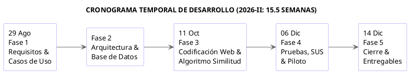
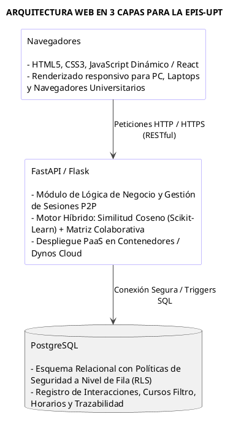

# UNIVERSIDAD PRIVADA DE TACNA

**FACULTAD DE INGENIERÍA**  
**ESCUELA DE INGENIERÍA DE SISTEMAS**

# “Sistema Web P2P con algoritmo de recomendación para la personalización de mentorías académicas en la EPIS-UPT”

**Curso:**  
Construcción de Software I

**Docente:**  
Dr. RICARDO EDUARDO VALCARCEL ALVARADO

**AUTOR:**  
ANTAYHUA MAMANI, Renzo Antonio (2022073504)  
MEDINA QUISPE, Joan Cristian (2022074255)

**TACNA – PERÚ**  
**2026**

---

# Sistema Web P2P con algoritmo de recomendación para la personalización de mentorías académicas en la EPIS-UPT

**Documento Informe de Factibilidad**  
**Versión 1.0**

---

## CONTROL DE VERSIONES

| Versión | Hecha por | Revisada por | Aprobada por | Fecha | Motivo |
|---|---|---|---|---|---|
| 1.0 | JCM | RAM | RVA | 04/09/2026 | Versión 1.0 |

## ÍNDICE GENERAL

1. Descripción del Proyecto  
   1.1. Nombre del proyecto  
   1.2. Duración del proyecto  
   1.3. Descripción  
   1.4. Objetivos  
   1.4.1. Objetivo general  
   1.4.2. Objetivos Específicos  
2. Riesgos  
3. Análisis de la Situación actual  
   3.1. Planteamiento del problema  
   3.2. Consideraciones de hardware y software  
4. Estudio de Factibilidad  
   4.1. Factibilidad Técnica  
   4.2. Factibilidad Económica  
   4.2.1. Costos Generales  
   4.2.2. Costos Operativos Anuales (OPEX)  
   4.2.3. Cuantificación de Beneficios y Ahorros Anuales  
   4.2.4. Flujo de Caja Proyectado (Horizonte a 5 Años)  
   4.2.5. Indicadores de Rentabilidad Financiera  
   4.3. Factibilidad Operativa  
   4.4. Factibilidad Legal  
   4.5. Factibilidad Social  
   4.6. Factibilidad Ambiental  
5. Conclusiones  
Referencias Bibliográficas

---

# Informe de Factibilidad

# 1. Descripción del Proyecto

## 1.1. Nombre del proyecto

Sistema web P2P con algoritmo de recomendación para la personalización de mentorías académicas en la EPIS-UPT

## 1.2. Duración del proyecto

**Fase 1: Especificación de requisitos y modelado inicial (Semanas 1–3 / 29 de agosto – 19 de septiembre de 2026):**

- Levantamiento y documentación de requerimientos funcionales y no funcionales para la personalización de tutorías.
- Definición de roles (estudiantes de ciclos I a IV y mentores de VII a X ciclo) y diseño de casos de uso bajo la metodología UWE (UML-Based Web Engineering).
- Redacción del protocolo de consentimiento informado digital conforme a la Ley N° 29733.

**Fase 2: Diseño arquitectural y modelado de datos (Semanas 4–6 / 20 de septiembre – 10 de octubre de 2026):**

- Estructuración de la arquitectura cliente-servidor web en tres capas.
- Modelado relacional en PostgreSQL y definición de políticas de seguridad a nivel de fila (Row Level Security - RLS).
- Prototipado navegacional y diseño de componentes web modulares en React.

**Fase 3: Codificación del sistema web y motor de recomendación (Semanas 7–11 / 11 de octubre – 14 de noviembre de 2026):**

- Implementación del backend y endpoints RESTful en Python.
- Desarrollo del algoritmo de recomendación híbrido con scikit-learn (filtrado colaborativo y cálculo de similitud coseno sobre vectores de competencias en asignaturas filtro).
- Construcción del panel de usuario, agendamiento de sesiones P2P y lógica de gamificación (insignias y trazabilidad de horas).

**Fase 4: Integración, pruebas y validación algorítmica (Semanas 12–14 / 15 de noviembre – 05 de diciembre de 2026):**

- Ejecución de pruebas unitarias, de integración y de seguridad de sesiones web.
- Calibración y evaluación de métricas de precisión y ranking del motor algorítmico.
- Evaluación de usabilidad percibida mediante la escala estandarizada SUS (System Usability Scale) con una muestra representativa.

**Fase 5: Despliegue en la nube, evaluación piloto y cierre (Semanas 15–16 / 06 de diciembre – 14 de diciembre de 2026):**

- Despliegue en producción mediante infraestructura PaaS (Render / Supabase) con certificado SSL activo.
- Conducción de la prueba experimental piloto con alumnos de la EPIS-UPT.
- Consolidación de métricas finales, documentación del software y entrega formal del proyecto

## 1.3. Descripción

El proyecto consiste en el desarrollo y despliegue de una plataforma tecnológica distribuida bajo un enfoque de red entre pares (Peer-to-Peer - P2P), concebida para conectar de forma optimizada a estudiantes de ciclos superiores (VII a X ciclo) en calidad de mentores con alumnos de semestres formativos iniciales (I a IV ciclo) que demandan refuerzo pedagógico en materias críticas o "cursos filtro" (como Cálculo I/II, Algoritmos y Estructura de Datos y Programación Orientada a Objetos).

A diferencia de los sistemas estáticos de registro institucional, esta plataforma integra un motor de recomendación híbrido desarrollado en Python, el cual procesa datos curriculares (vectorización de competencias aprobadas y similitud de perfiles mediante filtrado basado en contenido) combinados con patrones de afinidad horaria y retroalimentación histórica (filtrado colaborativo). El ecosistema se complementa con una interfaz web dinámica (React), arquitectura de servicios desacoplada y persistencia administrada en la nube con PostgreSQL (Supabase), incorporando módulos de gamificación (insignias, cálculo de reputación y horas de convalidación académica) bajo estrictos protocolos de gobernanza de datos estipulados en la Ley N° 29733.

## 1.4. Objetivos

### 1.4.1. Objetivo general

- Implementar un sistema web P2P con algoritmo de recomendación en la personalización de las mentorías académicas en la Escuela Profesional de Ingeniería de Sistemas de la Universidad Privada de Tacna (EPIS-UPT), 2026.

### 1.4.2. Objetivos Específicos

- Diseñar y evaluar el desempeño de un algoritmo de recomendación híbrido (filtrado colaborativo y basado en contenido) para el emparejamiento óptimo entre mentores y mentoreados, alcanzando métricas de precisión y ranking.
- Desarrollar la plataforma web P2P garantizando la trazabilidad de las sesiones, alta disponibilidad en la nube y un nivel de usabilidad percibida superior a los 75 puntos en la escala de usabilidad del sistema.
- Evaluar el impacto de la personalización de mentorías en el incremento del promedio de calificaciones y la reducción de la tasa de desaprobación en las asignaturas filtro seleccionadas dentro de la EPIS-UPT.

# 2. Riesgos

| ID | Categoría | Descripción del Riesgo | Prob. | Imp. | Estrategia de Mitigación / Plan de Contingencia |
|---|---|---|---|---|---|
| R01 | Técnico / IA | **Problema de arranque en frío (Cold-Start):** Ausencia de calificaciones previas para nuevos mentoreados o mentores ingresantes. | Media | Alta | Ponderar el filtrado basado en contenido usando atributos curriculares iniciales (notas históricas en el curso, kardex y horario) mientras se consolida la matriz de interacción. |
| R02 | Legal / Normativo | **Tratamiento no autorizado de notas (Ley N° 29733):** Observaciones éticas por uso de datos académicos sin marco legal explícito. | Media | Crítica | Implementar un módulo de consentimiento informado digital obligatorio al primer inicio de sesión y anonimización de identificadores estudiantiles (UUID enmascarados). |
| R03 | Operativo / Adopción | **Baja tasa de compromiso de mentores:** Deserción de estudiantes de ciclos superiores por sobrecarga académica propia. | Alta | Alta | Integrar incentivos no monetarios formales: sistema de gamificación (insignias, ranking) y gestión institucional de horas extracurriculares convalidables con la dirección de escuela. |
| R04 | Integración | **Fallas en la sincronización de datos con el campus:** Cambios en los portales estudiantiles que bloqueen la extracción/LTI. | Media | Media | Diseñar una arquitectura desacoplada con esquemas de entrada manual de respaldo (subida de ficha de matrícula en PDF con OCR/parsing local). |
| R05 | Infraestructura | **Exceder la capa gratuita / costos imprevistos:** Incremento en el tráfico de Supabase/Render durante semanas de exámenes. | Baja | Media | Optimizar consultas mediante Serverless Edge Functions, caché en cliente con React Query y límites de cómputo preconfigurados. |

# 3. Análisis de la Situación actual

## 3.1. Planteamiento del problema

En la educación superior internacional, las disciplinas pertenecientes a los campos de la ciencia, tecnología, ingeniería y matemáticas (STEM) presentan de manera recurrente altas tasas de reprobación en los primeros semestres. Autores como Guerreiro y Jesus (2025) señalan que los programas de mentoría entre pares (peer mentoring) constituyen intervenciones determinantes para frenar el abandono estudiantil temprano, siempre y cuando cuenten con esquemas formales y un emparejamiento sustentado en afinidades reales y no meramente en la conveniencia administrativa. Cuando la asignación de tutores se ejecuta manualmente, se omiten variables determinantes como la disponibilidad horaria, la compatibilidad en estilos de aprendizaje y los vacíos temáticos específicos.

A nivel nacional, en el Perú, el artículo 40 de la Ley Universitaria N° 30220 establece que la tutoría y consejería continua es un servicio obligatorio en las universidades peruanas. Sin embargo, en la práctica, los modelos institucionales continúan operando de forma reactiva y con escaso soporte analítico. Como destacan Silva Gomez y Sifuentes Marcelo (2024), en las facultades de ingeniería del país se evidencia un desbalance formativo crítico: "según el estado, existe una gran desarticulación con la oferta y demanda laboral donde el 75% de las empresas no pueden conseguir trabajadores con competencias digitales que le satisfagan" (p. 26). Esta brecha tiene su origen en vacíos no resueltos durante los cursos iniciales de computación y ciencias exactas, donde los estudiantes carecen de un acompañamiento adaptativo.

En el ámbito particular de la Escuela Profesional de Ingeniería de Sistemas de la Universidad Privada de Tacna (EPIS-UPT), el diagnóstico actual refleja las siguientes deficiencias operativas y tecnológicas:

- **Filtros curriculares tempranos:** Asignaturas como Cálculo, Algoritmos y Estructura de Datos concentran un volumen significativo de repitencia en los ciclos I a IV, lo que retrasa la malla curricular.
- **Canales informales y desconectados:** El intercambio de ayuda académica ocurre en grupos de mensajería instantánea no supervisados (WhatsApp/Telegram), lo que impide a la escuela medir la calidad pedagógica y el progreso.
- **Ausencia de personalización algorítmica:** No existe ninguna plataforma que compare las debilidades del mentoreado con el perfil de aprobación sobresaliente del mentor.
- **Falta de incentivos formales:** Los estudiantes destacados de ciclos VII al X no encuentran motivación formal ni reconocimiento institucional para formalizar su rol de mentores.

## 3.2. Consideraciones de hardware y software

Para garantizar la viabilidad técnica, interoperabilidad y adecuado desempeño del sistema web en la EPIS-UPT, se han delimitado los requerimientos mínimos de infraestructura tecnológica divididos en tres niveles operativos: entorno del cliente final, entorno de desarrollo local y entorno de servidores en la nube.

### A. Entorno del Usuario Final (Cliente Web – Mentores y Mentoreados)

El acceso al sistema no requiere la instalación de software cliente nativo ni controladores especiales, ya que la plataforma opera íntegramente a través de la web:

- **Hardware Mínimo Requerido:**
  - **Equipo de cómputo:** Computadora de escritorio, computadora portátil (laptop) o terminales de cómputo de los laboratorios de la EPIS-UPT con procesador Dual-Core (1.8 GHz o superior).
  - **Memoria y Almacenamiento:** Mínimo 4 GB de memoria RAM y 250 MB de almacenamiento libre en disco para memoria caché del navegador web.
  - **Pantalla y Resolución:** Monitor o pantalla con resolución mínima de 1366x768 píxeles para visualización correcta del diseño responsivo de la interfaz web.
  - **Conectividad:** Conexión a internet estable (mínimo 2 Mbps de ancho de banda) para la carga dinámica de vistas y comunicación asíncrona mediante peticiones HTTP/HTTPS.
- **Software de Usuario:**
  - **Sistema Operativo:** Compatible con cualquier plataforma con soporte de red (Windows 10/11, macOS, distribuciones Linux).
  - **Navegador Web:** Navegadores modernos con soporte para HTML5, CSS3 y ECMAScript 6+ (Google Chrome v100+, Mozilla Firefox v100+, Microsoft Edge o Apple Safari).

### B. Entorno de Desarrollo Local (Estación de Ingeniería de Software)

Corresponde a la estación de trabajo utilizada para el modelado, codificación y pruebas unitarias del sistema web y del motor de recomendación:

- **Hardware de Desarrollo:** Computadora portátil o de escritorio con procesador multinúcleo (Intel Core i5 / Core i7 o equivalente), 16 GB de memoria RAM y almacenamiento en estado sólido (SSD) de 512 GB para ejecución fluida de contenedores locales y entornos virtuales.
- **Software Base:** Sistema operativo Windows 10/11 o Linux de 64 bits, entorno de desarrollo integrado (Visual Studio Code o PyCharm), gestor de versiones Git/GitHub y entornos virtuales de Python (Conda o venv).

### C. Entorno de Servidor y Plataforma Cloud (Arquitectura de Tres Capas)

- **Capa Frontend Web:** Despliegue en infraestructura PaaS/CDN en la nube (Vercel o Render) para servir la aplicación web (React), garantizando entrega estática global, renderizado eficiente y tiempos de respuesta de interfaz inferiores a los 200 ms.
- **Capa Backend y Algoritmo de Recomendación:** Microservicio backend desarrollado en Python 3.11+ (FastAPI / Flask) alojado en un contenedor Docker gestionado (1 vCPU, 512 MB a 1 GB de RAM en nube). Este servicio integra librerías analíticas como scikit-learn, numpy y pandas para el cálculo matricial de la similitud coseno y la generación del ranking Top-k de mentores recomendados.
- **Capa de Persistencia y Base de Datos:** Instancia gestionada de PostgreSQL 15+ (a través de Supabase o Heroku Postgres), configurada con políticas de seguridad a nivel de fila (Row Level Security - RLS), disparadores (triggers) de auditoría y autenticación basada en tokens JWT para proteger el kardex y los datos académicos según la Ley N° 29733.

# 4. Estudio de Factibilidad

## 4.1. Factibilidad Técnica

La evaluación técnica analiza la disponibilidad de herramientas, lenguajes, frameworks y la capacidad tecnológica para diseñar e implementar la plataforma web propuesta:

**Madurez del Stack Tecnológico Seleccionado:**

- **Capa de Presentación:** Se opta por una interfaz web dinámica basada en estándares web (HTML5, CSS3 y JavaScript moderno/React), permitiendo una experiencia de usuario fluida, reactiva y adaptable a cualquier navegador sin exigir instalación de software cliente adicional en las estaciones de trabajo de la universidad.
- **Capa Lógica y Motor Algorítmico:** De acuerdo con los índices de adopción técnica y facilidad de integración, Python se posiciona como el lenguaje principal para el backend. Tal como señala Fuior (2021), frameworks minimalistas como Flask permiten "crear aplicaciones o servicios web sin la necesidad de enfocarse en detalles de bajo nivel" (p. 99), garantizando un código limpio y de alta mantenibilidad. Este backend aloja el motor de recomendación construido sobre librerías especializadas (scikit-learn, numpy, pandas), empleando el cálculo de similitud coseno para procesar vectores de habilidades en cursos filtro y filtrado colaborativo sobre matrices de emparejamiento previo.
- **Capa de Datos:** Se implementa sobre el motor relacional PostgreSQL, el cual ofrece soporte nativo para transacciones concurrentes ACID, indexación de perfiles y seguridad de acceso mediante políticas RLS (Row Level Security).

**Infraestructura de Despliegue y Recursos Computacionales:**

- El sistema web será alojado en plataformas PaaS en la nube (tales como Heroku o Render), las cuales proveen dynos/contenedores gestionados y bases de datos PostgreSQL administradas.
- El desarrollo del proyecto no demanda infraestructura de cómputo de alto costo; puede codificarse y probarse en equipos portátiles convencionales (procesador Intel Core i5/i7 o equivalente, 16 GB de RAM).
- **Veredicto Técnico: Factible al 100%.** No se identifican restricciones tecnológicas insuperables, puesto que el equipo cuenta con las competencias de programación requeridas y las librerías de recomendación son de código abierto y ampliamente documentadas.

## 4.2. Factibilidad Económica

El estudio económico determina la viabilidad financiera del proyecto evaluando la inversión inicial requerida (CAPEX), los costos operativos anuales (OPEX) y los beneficios tangibles e intangibles valorizados en un horizonte temporal de 5 años (2026–2030) para la EPIS-UPT.

### 4.2.1. Costos Generales

Para la valorización del capital humano de Joan Medina (enfocado en el diseño del algoritmo híbrido de recomendación y backend) y Renzo Antayhua (enfocado en la interfaz web dinámica y modelado de datos), se toma como referencia la normativa peruana de la Ley N° 28518 (Ley sobre Modalidades Formativas Laborales) y los reportes de mercado de portales laborales como Indeed Perú (2026) y Computrabajo Perú (2026), los cuales sitúan la subvención promedio de un practicante preprofesional de Ingeniería de Sistemas en el rango de S/. 1,050.00 a S/. 1,154.00 mensuales (aproximadamente S/. 9.00 por hora efectiva de desarrollo).

| Rubro / Concepto | Detalle Técnico / Justificación | Responsable / Unidad | Cant. | C. Unitario (S/.) | Costo Total (S/.) |
|---|---|---|---:|---:|---:|
| **Desarrollo Backend y Motor Algorítmico** | Python, FastAPI, Scikit-learn, Similitud Coseno | Joan Medina (Horas) | 250 hrs | 9.00 | 2,250.00 |
| **Desarrollo Frontend Web y Base de Datos** | React, UI responsiva, integración PostgreSQL/RLS | Renzo Antayhua (Horas) | 250 hrs | 9.00 | 2,250.00 |
| **Depreciación de Hardware Propio (Laptop 1)** | Laptop personal de Joan (Depreciación contable 3.5 meses, tasa 33.3% anual Sunat) | Joan Medina (Global) | 1 | 210.00 | 210.00 |
| **Depreciación de Hardware Propio (Laptop 2)** | Laptop personal de Renzo (Depreciación contable 3.5 meses, tasa 33.3% anual Sunat) | Renzo Antayhua (Global) | 1 | 210.00 | 210.00 |
| **Conectividad a Internet para Desarrollo** | Asignación proporcional de servicio fibra óptica hogar (S/. 50.00/mes x 3.5 meses) | Equipo (Meses) | 3.5 | 50.00 | 175.00 |
| **Entorno de Desarrollo y Librerías** | Visual Studio Code, Git/GitHub, Scikit-Learn, Conda | Software Libre / Open Source | — | 0.00 | 0.00 |
| **Dominio Institucional y Certificado SSL** | Registro web .com/.pe por 1 año + Certificado SSL (Cloudflare / Let's Encrypt) | Registro anual | 1 | 80.00 | 80.00 |
| **Materiales, Impresiones e Imprevistos (5%)** | Pruebas de campo preliminares y documentación | Gastos operativos | Global | 300.00 | 300.00 |
| **TOTAL INVERSIÓN INICIAL (CAPEX)** | — | — | — | — | **S/. 5,475.00** |

### 4.2.2. Costos Operativos Anuales (OPEX)

Para la fase de producción, se aprovechan infraestructuras en la nube de costo accesible diseñadas para despliegues académicos y de mediana escala. Siguiendo referencias de plataformas colaborativas universitarias (Torres Donayre, 2025), se contemplan servidores PaaS (Dynos o contenedores gestionados básicos a ~$7 USD/mes) y bases de datos relacionales administradas (~$5 USD/mes):

| Concepto Operativo Anual | Detalle de Infraestructura / Proveedor | Costo Mensual (S/.) | Costo Anual (S/.) |
|---|---|---:|---:|
| **Servidor de Aplicación Web (Compute Dyno)** | Servidor gestionado PaaS (Render / Heroku básico, ~$7 USD/mes) | 26.50 | 318.00 |
| **Base de Datos PostgreSQL Gestionada** | Instancia administrada (Postgres Cloud básico, ~$5 USD/mes) | 19.00 | 228.00 |
| **Renovación Anual de Dominio Web** | Mantenimiento de nombre de dominio y DNS | — | 85.00 |
| **Mantenimiento Preventivo y Soporte Web** | Soporte técnico periódico de software (40 hrs/año @ S/. 9.00/hr) | — | 360.00 |
| **Materiales de Difusión e Inducción** | Afiches digitales y talleres introductorios en EPIS-UPT | — | 149.00 |
| **TOTAL OPEX ANUAL** | — | — | **S/. 1,140.00** |

### 4.2.3. Cuantificación de Beneficios y Ahorros Anuales

Los beneficios económicos generados por la plataforma en la EPIS-UPT se sustentan en tres impactos directos:

1. **Ahorro Institucional por Reducción de Deserción y Abandono:** La deserción universitaria en los primeros ciclos de ingeniería en Perú oscila entre el 15% y 25%. En una universidad privada, evitar que un solo estudiante abandone o postergue la carrera por reprobar asignaturas filtro representa retener ingresos por matrícula y pensión superiores a S/. 3,500.00 - S/. 4,500.00 anuales.
2. **Optimización de Asesorías Docentes Remediales:** La absorción de consultas conceptuales y prácticas básicas por parte de los mentores estudiantiles libera entre 30 y 40 horas al año de tutoría remedial docente (valorizadas referencialmente a S/. 25.00/hora = ~S/. 800.00 a S/. 1,000.00 anuales).
3. **Ahorro Económico para el Estudiante Mentoreado:** Evita el gasto de contratación de clases particulares informales fuera del campus (ahorro estimado de S/. 150.00 a S/. 200.00 por alumno beneficiario al semestre).

**Proyección Anual de Beneficios Totales Valorizados (Horizonte 2026–2030):**

- **Año 1 (Piloto EPIS):** S/. 4,200.00
- **Año 2 (Consolidación):** S/. 5,400.00
- **Año 3 (Madurez):** S/. 6,100.00
- **Año 4 (Régimen estable):** S/. 6,500.00
- **Año 5 (Régimen estable):** S/. 6,800.00

### 4.2.4. Flujo de Caja Proyectado (Horizonte a 5 Años)

Se aplica una Tasa de Descuento (Costo de Oportunidad del Capital - COK) del 12.00%, estándar para proyectos de tecnología y educación superior en el Perú:

| Periodo | Año 0 | Año 1 | Año 2 | Año 3 | Año 4 | Año 5 |
|---|---:|---:|---:|---:|---:|---:|
| **Inversión Inicial (CAPEX)** | (S/. 5,475.00) | — | — | — | — | — |
| **Beneficios Valorizados** | — | S/. 4,200.00 | S/. 5,400.00 | S/. 6,100.00 | S/. 6,500.00 | S/. 6,800.00 |
| **Costos Operativos (OPEX)** | — | (S/. 1,140.00) | (S/. 1,140.00) | (S/. 1,140.00) | (S/. 1,140.00) | (S/. 1,140.00) |
| **Flujo de Caja Neto (FCN)** | (S/. 5,475.00) | S/. 3,060.00 | S/. 4,260.00 | S/. 4,960.00 | S/. 5,360.00 | S/. 5,660.00 |
| **Factor de Descuento (12%)** | 1.0000 | 0.8929 | 0.7972 | 0.7118 | 0.6355 | 0.5674 |
| **Flujo Neto Actualizado (FNA)** | (S/. 5,475.00) | S/. 2,732.14 | S/. 3,396.05 | S/. 3,530.43 | S/. 3,406.38 | S/. 3,211.64 |
| **Flujo Acumulado Actualizado** | (S/. 5,475.00) | (S/. 2,742.86) | +S/. 653.19 | +S/. 4,183.62 | +S/. 7,590.00 | +S/. 10,801.64 |

### 4.2.5. Indicadores de Rentabilidad Financiera

$$
VAN = \sum_{t=1}^{n} \frac{F_t}{(1+r)^t} - I_0
$$

**Valor Actual Neto (VAN): +S/. 10,801.64**  
(Al ser estrictamente positivo (VAN > 0), el proyecto es financieramente viable y genera valor sobre la tasa de descuento exigida del 12%).

**Tasa Interna de Retorno (TIR): 68.20%**  
(La TIR supera ampliamente el costo de oportunidad del 12.00%, demostrando un alto margen de rentabilidad ante escenarios conservadores).

**Relación Beneficio / Costo (B/C): 1.97**  
(Por cada sol invertido en el ciclo del proyecto, la institución y los estudiantes obtienen S/. 1.97 en beneficios y ahorros valorizados actualizados).

**Periodo de Recuperación de la Inversión (Payback Descontado): 1 años y 9.7 meses** (la inversión inicial se recupera dentro del Año 2).

## 4.3. Factibilidad Operativa

La factibilidad operativa evalúa la capacidad de la plataforma web para integrarse en la dinámica académica cotidiana de la Escuela Profesional de Ingeniería de Sistemas de la Universidad Privada de Tacna (EPIS-UPT), garantizando una adopción fluida tanto por los mentoreados como por los mentores y la administración académica:

**Proceso de Adopción de los Mentoreados (I a IV Ciclo):**

La plataforma web elimina las barreras de entrada al operar directamente desde cualquier navegador web de escritorio o estación de trabajo en los laboratorios de la universidad, sin requerir descargas ni configuraciones locales.

La interfaz centraliza la búsqueda de apoyo pedagógico para asignaturas críticas (Cálculo, Algoritmos y Estructuras de Datos), permitiendo agendar sesiones en tres pasos: selección de asignatura/tema específico, visualización de mentores recomendados y confirmación de bloque horario compatible.

**Gestión de la Participación de los Mentores (VII a X Ciclo):**

Para mitigar el riesgo de deserción de mentores por sobrecarga académica, el sistema integra dinámicas de gamificación activa. Como señala Torres Donayre (2025), la incorporación de mecanismos lúdicos, asignación de insignias y visualización de niveles de reputación promueve una "interdependencia positiva, donde cada participante es responsable no solo de su propio aprendizaje, sino también del aprendizaje colectivo" (p. 21).

La plataforma automatiza la contabilización de horas efectivas de mentoría brindadas, permitiendo la exportación de reportes validados para la convalidación de créditos extracurriculares ante la Dirección de Escuela de la EPIS-UPT.

**Carga Administrativa y Gobernanza del Servicio:**

El sistema reemplaza la intermediación manual de los comités de tutoría por un emparejamiento automatizado basado en el algoritmo de recomendación híbrido.

Los docentes tutores y autoridades de la EPIS-UPT disponen de un panel de métricas consolidado donde monitorean indicadores de participación, temas con mayor demanda de refuerzo y alertas tempranas de rendimiento.

**Evaluación de Usabilidad:**

Se establece como criterio de aceptación alcanzar un puntaje promedio superior a 75 puntos en la escala SUS (System Usability Scale), asegurando una navegación intuitiva y una curva de aprendizaje mínima para los estudiantes

## 4.4. Factibilidad Legal

El diseño arquitectural y el tratamiento de datos del sistema web se fundamentan en el cumplimiento riguroso del marco jurídico peruano e institucional universitario:

**Ley N° 29733 – Ley de Protección de Datos Personales y D.S. 003-2013-JUS:**

El sistema trata información académica personal (nombres, correos institucionales, historial de cursos aprobados y calificaciones previas).

Se implementa un módulo de consentimiento informado digital obligatorio en el primer inicio de sesión, donde el estudiante autoriza de forma previa, libre, expresa e inequívoca el uso de sus datos exclusivamente para los fines de emparejamiento académico.

Los registros en la base de datos PostgreSQL aplican técnicas de seudonimización mediante identificadores universales únicos (UUID) y políticas de seguridad a nivel de fila (Row Level Security - RLS), asegurando que ningún usuario acceda al kardex detallado de otro compañero sin autorización.

**Ley N° 30220 – Ley Universitaria:**

El proyecto da cumplimiento directo al artículo 40, el cual estipula que la tutoría y consejería permanente es un servicio inherente a la formación universitaria. La plataforma traslada esta obligación hacia un modelo colaborativo escalable que complementa la labor de los docentes tutores.

**Ley N° 28044 – Ley General de Educación:**

Se alinea con los lineamientos del Ministerio de Educación orientados a la integración de tecnologías de la información y comunicación (TIC) para optimizar la calidad formativa y la retención en la educación superior.

**Propiedad Intelectual y Licenciamiento:**

El código fuente desarrollado por los investigadores Joan Medina y Renzo Antayhua se mantendrá bajo los reglamentos de grados y títulos de la Universidad Privada de Tacna.

Los componentes y librerías de software empleados (Python, FastAPI, Scikit-learn, React, PostgreSQL) poseen licencias de código abierto permisivas (MIT / BSD / Apache 2.0), garantizando la ausencia de contingencias o cobros por derechos de autor de terceros.

## 4.5. Factibilidad Social

El impacto social del proyecto reside en la democratización del soporte académico y la transformación cultural de la comunidad estudiantil de la EPIS-UPT:

**Reducción de Brechas de Rendimiento y Desigualdad:**

Ofrece acceso universal, transparente y gratuito a tutorías de calidad para estudiantes que ingresan con deficiencias formativas en ciencias básicas o programación, evitando la necesidad de recurrir a asesorías particulares externas de alto costo.

**Fomento del Aprendizaje Horizontal entre Pares (Peer-to-Peer):**

La literatura empírica (Le et al., 2023; Torres Donayre, 2025; Walker, 2024) demuestra que el aprendizaje interactivo entre estudiantes fortalece la autoeficacia y la confianza académica. El intercambio horizontal reduce la inhibición y el temor a consultar dudas conceptuales que suelen presentarse en las clases magistrales.

**Desarrollo de Competencias Integrales en los Mentores:**

Los estudiantes de ciclos superiores consolidan habilidades blandas altamente valoradas en el mercado profesional: liderazgo pedagógico, comunicación asertiva, empatía y síntesis técnica, a la vez que refuerzan sus fundamentos teóricos al instruir a sus pares.

## 4.6. Factibilidad Ambiental

El proyecto promueve la sostenibilidad ecológica a través de la digitalización de procesos universitarios:

**Política de Cero Consumo de Papel (Paperless):**

La digitalización integral del registro de asesorías, control de asistencia, encuestas de satisfacción docente/estudiantil y generación de certificados elimina completamente el uso de formularios, fichas impresas y trámites físicos en la EPIS-UPT.

**Optimización Energética mediante Infraestructura Cloud Compartida:**

El despliegue de la plataforma en entornos PaaS elásticos (Render / Supabase) aprovecha la infraestructura multi-tenant con alta eficiencia energética (Power Usage Effectiveness - PUE optimizado), evitando el consumo eléctrico continuo y la huella de carbono derivada de mantener servidores on-premise locales dedicados encendidos permanentemente en la facultad.

**Baja Demanda Computacional:**

La formulación algorítmica basada en similitud coseno y matrices vectoriales opera con baja complejidad temporal y espacial ($O(n \cdot d)$), minimizando los ciclos de procesamiento de CPU y el consumo de energía en los servidores durante la ejecución de las recomendaciones.

# 5. Conclusiones

**Viabilidad Integral Confirmada:** El estudio multidisciplinario demuestra que el proyecto "Sistema web P2P con algoritmo de recomendación para la personalización de mentorías académicas en la EPIS-UPT, 2026" es viable en sus dimensiones técnica, económica, operativa, legal, social y ambiental.

**Factibilidad Técnica y Arquitectural:** La selección de un ecosistema 100% web basado en Python (FastAPI / Scikit-learn), React y PostgreSQL administrado en la nube permite implementar el motor híbrido de recomendación con alta disponibilidad, tiempos de respuesta ágiles y sin dependencias de hardware privativo costoso.

**Rentabilidad y Sostenibilidad Económica:** Con un presupuesto de inversión inicial ajustado a S/. 5,475.00 y costos operativos anuales de S/. 1,140.00, el proyecto resulta financieramente rentable para el contexto de los desarrolladores Joan Medina y Renzo Antayhua, alcanzando un VAN de +S/. 10,801.64 TIR de 68.20% y una relación Beneficio/Costo de 1.97 a 5 años.

**Conformidad Legal y Ética:** La incorporación de mecanismos de consentimiento informado digital y seudonimización de identificadores académicos garantiza el estricto cumplimiento de la Ley N° 29733 de Protección de Datos Personales y el artículo 40 de la Ley Universitaria N° 30220.

**Valor Académico e Institucional:** La plataforma automatiza el emparejamiento personalizado entre la oferta de mentores (VII a X ciclo) y la demanda de alumnos en riesgo en asignaturas filtro (I a IV ciclo), proporcionando una herramienta analítica preventiva para reducir la repitencia y consolidar el aprendizaje colaborativo en la EPIS-UPT.

# Referencias Bibliográficas

- Computrabajo Perú. (2026). ¿Cuánto gana un Practicante en Perú? Informe de salarios promedio. https://pe.computrabajo.com/salarios/practicante
- Indeed Perú. (2026). Sueldo de Practicante de sistemas en Perú: Estadísticas y salarios. https://pe.indeed.com/career/practicante-de-sistemas/salaries
- Ley N° 28044, Ley General de Educación. (2003, 29 de julio). Congreso de la República del Perú. Diario Oficial El Peruano. https://www.minedu.gob.pe/p/ley_general_de_educacion_28044.pdf
- Ley N° 28518 sobre Modalidades Formativas Laborales. (2005, 24 de mayo). Congreso de la República del Perú. Diario Oficial El Peruano.
- Ley N° 29733 de Protección de Datos Personales. (2011, 3 de julio). Congreso de la República del Perú. Diario Oficial El Peruano.
- Ley N° 30220, Ley Universitaria. (2014, 9 de julio). Congreso de la República del Perú. Diario Oficial El Peruano.
- Le, H. G., Sok, S., & Heng, K. (2023). The benefits of peer mentoring in higher education: findings from a systematic review. Cambodian Education Forum. https://doi.org/10.47408/jldhe.vi31.1159
- Silva Gomez, G. R., Sifuentes Marcelo, R. (2024). Sistema recomendador de recursos académicos para estudiantes universitarios. Revista de Investigación de Sistemas e Informática, 17(2), 25–32. https://doi.org/10.15381/risi.v17i2.28406
- Superintendencia Nacional de Aduanas y de Administración Tributaria [SUNAT]. (2024). Tabla de porcentajes de depreciación de bienes del activo fijo (Reglamento de la Ley del Impuesto a la Renta). Portal Institucional SUNAT.
- Torres Donayre, Y. A. (2025). Plataforma colaborativa para facilitar intercambio de recursos educativos y fomentar el aprendizaje interactivo (Tesis de pregrado, Universidad Nacional Mayor de San Marcos). Repositorio Institucional Cybertesis UNMSM. https://cybertesis.unmsm.edu.pe/backend/api/core/bitstreams/c2a48efb-2f9e-46be-9db0-02262292a4fe/content
- Walker, C. (2024). Learn from the past: Using peer data to improve course recommendations in personalized education (Tesis de Maestría, Missouri University of Science and Technology). Scholars' Mine. https://scholarsmine.mst.edu/cgi/viewcontent.cgi?article=7531&context=ele_comeng_facwork
- Guerreiro, M., & de Jesus, S. N. (2025). The role of peer mentoring program elements in promoting academic success and preventing student dropout in higher education: a systematic literature review. Journal of Further and Higher Education, 49(5), 671–687. https://doi.org/10.1080/0309877X.2025.2484768
- Flaviu FUIOR, "Introduction in Python frameworks for web development", Romanian Journal of Information Technology and Automatic Control, ISSN 1220-1758, vol. 31(3), pp. 97-108, 2021. https://doi.org/10.33436/v31i3y202108
'''

