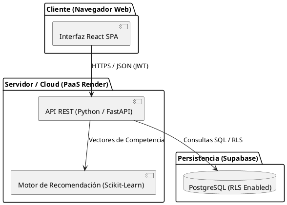

# Informe de Factibilidad

**Proyecto:** Sistema Web P2P con algoritmo de recomendación para la personalización de mentorías académicas en la EPIS-UPT  
**Curso:** Construcción de Software I  
**Docente:** Dr. RICARDO EDUARDO VALCARCEL ALVARADO  
**Autores:**  
- ANTAYHUA MAMANI, Renzo Antonio (2022073504)  
- MEDINA QUISPE, Joan Cristian (2022074255)  
**Institución:** Universidad Privada de Tacna - Facultad de Ingeniería - Escuela Profesional de Ingeniería de Sistemas  
**Lugar y Fecha:** Tacna – Perú, 2026  

---

## Control de Versiones

| Versión | Hecha por | Revisada por | Aprobada por | Fecha | Motivo |
| :--- | :--- | :--- | :--- | :--- | :--- |
| 1.0 | JCM | RAM | RVA | 04/09/2026 | Versión 1.0 |

---

## ÍNDICE GENERAL

1. [Descripción del Proyecto](#1-descripción-del-proyecto)  
   1.1. [Nombre del proyecto](#11-nombre-del-proyecto)  
   1.2. [Duración del proyecto](#12-duración-del-proyecto)  
   1.3. [Descripción](#13-descripción)  
   1.4. [Objetivos](#14-objetivos)  
        1.4.1. [Objetivo general](#141-objetivo-general)  
        1.4.2. [Objetivos Específicos](#142-objetivos-específicos)  
2. [Riesgos](#2-riesgos)  
3. [Análisis de la Situación actual](#3-análisis-de-la-situación-actual)  
   3.1. [Planteamiento del problema](#31-planteamiento-del-problema)  
   3.2. [Consideraciones de hardware y software](#32-consideraciones-de-hardware-y-software)  
4. [Estudio de Factibilidad](#4-estudio-de-factibilidad)  
   4.1. [Factibilidad Técnica](#41-factibilidad-técnica)  
   4.2. [Factibilidad Económica](#42-factibilidad-económica)  
        4.2.1. [Costos Generales](#421-costos-generales)  
        4.2.2. [Costos Operativos Anuales (OPEX)](#422-costos-operativos-anuales-opex)  
        4.2.3. [Cuantificación de Beneficios y Ahorros Anuales](#423-cuantificación-de-beneficios-y-ahorros-anuales)  
        4.2.4. [Flujo de Caja Proyectado (Horizonte a 5 Años)](#424-flujo-de-caja-proyectado-horizonte-a-5-años)  
        4.2.5. [Indicadores de Rentabilidad Financiera](#425-indicadores-de-rentabilidad-financiera)  
   4.3. [Factibilidad Operativa](#43-factibilidad-operativa)  
   4.4. [Factibilidad Legal](#44-factibilidad-legal)  
   4.5. [Factibilidad Social](#45-factibilidad-social)  
   4.6. [Factibilidad Ambiental](#46-factibilidad-ambiental)  
5. [Conclusiones](#5-conclusiones)  
6. [Referencias Bibliográficas](#referencias-bibliográficas)  

---

## 1. Descripción del Proyecto

### 1.1. Nombre del proyecto
**Sistema web P2P con algoritmo de recomendación para la personalización de mentorías académicas en la EPIS-UPT**

### 1.2. Duración del proyecto
El proyecto se desarrollará a lo largo de 16 semanas lectivas estructuradas en 5 fases metodológicas:

- **Fase 1: Especificación de requisitos y modelado inicial (Semanas 1–3 / 29 de agosto – 19 de septiembre de 2026):**
  - Levantamiento y documentación de requerimientos funcionales y no funcionales para la personalización de tutorías.
  - Definición de roles (estudiantes de ciclos I a IV y mentores de VII a X ciclo) y diseño de casos de uso bajo la metodología UWE (UML-Based Web Engineering).
  - Redacción del protocolo de consentimiento informado digital conforme a la Ley N° 29733.

- **Fase 2: Diseño arquitectural y modelado de datos (Semanas 4–6 / 20 de septiembre – 10 de octubre de 2026):**
  - Estructuración de la arquitectura cliente-servidor web en tres capas.
  - Modelado relacional en PostgreSQL y definición de políticas de seguridad a nivel de fila (Row Level Security - RLS).
  - Prototipado navegacional y diseño de componentes web modulares en React.

- **Fase 3: Codificación del sistema web y motor de recomendación (Semanas 7–11 / 11 de octubre – 14 de noviembre de 2026):**
  - Implementación del backend y endpoints RESTful en Python.
  - Desarrollo del algoritmo de recomendación híbrido con scikit-learn (filtrado colaborativo y cálculo de similitud coseno sobre vectores de competencias en asignaturas filtro).
  - Construcción del panel de usuario, agendamiento de sesiones P2P y lógica de gamificación (insignias y trazabilidad de horas).

- **Fase 4: Integración, pruebas y validación algorítmica (Semanas 12–14 / 15 de noviembre – 05 de diciembre de 2026):**
  - Ejecución de pruebas unitarias, de integración y de seguridad de sesiones web.
  - Calibración y evaluación de métricas de precisión y ranking del motor algorítmico.
  - Evaluación de usabilidad percibida mediante la escala estandarizada SUS (System Usability Scale) con una muestra representativa.

- **Fase 5: Despliegue en la nube, evaluación piloto y cierre (Semanas 15–16 / 06 de diciembre – 14 de diciembre de 2026):**
  - Despliegue en producción mediante infraestructura PaaS (Render / Supabase) con certificado SSL activo.
  - Conducción de la prueba experimental piloto con alumnos de la EPIS-UPT.
  - Consolidación de métricas finales, documentación del software y entrega formal del proyecto.

### 1.3. Descripción
El proyecto consiste en el desarrollo y despliegue de una plataforma tecnológica distribuida bajo un enfoque de red entre pares (Peer-to-Peer - P2P), concebida para conectar de forma optimizada a estudiantes de ciclos superiores (VII a X ciclo) en calidad de mentores con alumnos de semestres formativos iniciales (I a IV ciclo) que demandan refuerzo pedagógico en materias críticas o "cursos filtro" (como Cálculo I/II, Algoritmos y Estructura de Datos y Programación Orientada a Objetos).

A diferencia de los sistemas estáticos de registro institucional, esta plataforma integra un motor de recomendación híbrido desarrollado en Python, el cual procesa datos curriculares (vectorización de competencias aprobadas y similitud de perfiles mediante filtrado basado en contenido) combinados con patrones de afinidad horaria y retroalimentación histórica (filtrado colaborativo). El ecosistema se complementa con una interfaz web dinámica (React), arquitectura de servicios desacoplada y persistencia administrada en la nube con PostgreSQL (Supabase), incorporando módulos de gamificación (insignias, cálculo de reputación y horas de convalidación académica) bajo estrictos protocolos de gobernanza de datos estipulados en la Ley N° 29733.

### 1.4. Objetivos

#### 1.4.1. Objetivo general
- Implementar un sistema web P2P con algoritmo de recomendación en la personalización de las mentorías académicas en la Escuela Profesional de Ingeniería de Sistemas de la Universidad Privada de Tacna (EPIS-UPT), 2026.

#### 1.4.2. Objetivos Específicos
- Diseñar y evaluar el desempeño de un algoritmo de recomendación híbrido (filtrado colaborativo y basado en contenido) para el emparejamiento óptimo entre mentores y mentoreados, alcanzando métricas de precisión y ranking.
- Desarrollar la plataforma web P2P garantizando la trazabilidad de las sesiones, alta disponibilidad en la nube y un nivel de usabilidad percibida superior a los 75 puntos en la escala de usabilidad del sistema (SUS).
- Evaluar el impacto de la personalización de mentorías en el incremento del promedio de calificaciones y la reducción de la tasa de desaprobación en las asignaturas filtro seleccionadas dentro de la EPIS-UPT.

---

## 2. Riesgos

| ID | Categoría | Descripción del Riesgo | Prob. | Imp. | Estrategia de Mitigación / Plan de Contingencia |
| :--- | :--- | :--- | :--- | :--- | :--- |
| R01 | Técnico / IA | Problema de arranque en frío (Cold-Start): Ausencia de calificaciones previas para nuevos mentoreados o mentores ingresantes. | Media | Alta | Ponderar el filtrado basado en contenido usando atributos curriculares iniciales (notas históricas en el curso, kardex y horario) mientras se consolida la matriz de interacción. |
| R02 | Social / Operativo | Baja participación inicial de mentores: Escaso incentivo de los estudiantes de ciclos superiores para brindar mentorías. | Media | Alta | Integrar módulos de gamificación (badges, reputación) y formalizar la convalidación de horas de mentoría como créditos de servicio social o actividades extracurriculares en la EPIS. |
| R03 | Legal / Privacidad | Vulneración de datos personales: Manejo inadecuado de datos académicos y personales bajo la Ley N° 29733. | Baja | Alta | Implementar autenticación segura (JWT), hashing de contraseñas (bcrypt), cifrado SSL/TLS en tránsito y políticas RLS en PostgreSQL, junto con consentimiento informado explícito. |
| R04 | Integración | Fallas en la sincronización de datos con el campus: Cambios en los portales estudiantiles que bloqueen la extracción/LTI. | Media | Media | Diseñar una arquitectura desacoplada con esquemas de entrada manual de respaldo (subida de ficha de matrícula en PDF con OCR/parsing local). |
| R05 | Infraestructura | Exceder la capa gratuita / costos imprevistos: Incremento en el tráfico de Supabase/Render durante semanas de exámenes. | Baja | Media | Optimizar consultas mediante Serverless Edge Functions, caché en cliente con React Query y límites de cómputo preconfigurados. |

---

## 3. Análisis de la Situación Actual

### 3.1. Planteamiento del problema
En la Escuela Profesional de Ingeniería de Sistemas de la UPT (EPIS-UPT), los estudiantes de semestres iniciales enfrentan elevadas tasas de desaprobación y deserción en asignaturas fundamentales ("cursos filtro"). Las tutorías institucionales existentes resultan insuficientes para brindar acompañamiento personalizado debido a la limitada disponibilidad docente y la rigidez de horarios.

Por otro lado, existe un potencial desaprovechado en los estudiantes de ciclos avanzados que poseen dominio en estas materias, pero carecen de una plataforma estructurada y motivadora para transmitir sus conocimientos como pares (P2P). La falta de herramientas inteligentes de emparejamiento genera combinaciones ineficientes tutor-estudiante y una escasa trazabilidad del proceso académico.

### 3.2. Consideraciones de hardware y software

#### A. Entorno de Desarrollo y Equipo de Trabajo
- **Hardware:** Laptops/Estaciones de trabajo procesador Intel Core i5/i7 o AMD Ryzen 5/7, 16 GB RAM, SSD 512 GB.
- **Software:** VS Code, Git/GitHub, Docker Desktop, Postman.

#### B. Entorno del Cliente (Estudiantes y Mentores)
- Dispositivos con navegadores web modernos (Google Chrome, Mozilla Firefox, Microsoft Edge, Safari) con soporte para JavaScript ES6+.
- Conexión a internet estable (mínimo 2 Mbps).

#### C. Entorno de Servidor y Plataforma Cloud (Arquitectura de Tres Capas)
- **Frontend:** Aplicación Single Page Application (SPA) construida en React con Tailwind CSS, desplegada en Vercel/Render.
- **Backend:** Servicio RESTful en Python (FastAPI/Flask) desplegado en Render PaaS.
- **Base de Datos:** PostgreSQL en Supabase, configurada con políticas de seguridad a nivel de fila (Row Level Security - RLS).

### Diagrama de Arquitectura (Regla 3.1 - PlantUML)

---

## 4. Estudio de Factibilidad

### 4.1. Factibilidad Técnica
La tecnología seleccionada (React, Python FastAPI, Scikit-Learn y PostgreSQL Supabase) es accesible, de código abierto y ampliamente probada en producción. El equipo de desarrollo cuenta con las competencias requeridas para la implementación de la arquitectura de tres capas y del motor de recomendación híbrido.

### 4.2. Factibilidad Económica

#### 4.2.1. Costos Generales (Inversión Inicial - CAPEX)
| Concepto | Costo Estimado (S/.) |
| :--- | :--- |
| Desarrollo de Software y Modelado IA (Horas equipo) | S/. 4,500.00 |
| Configuración de Dominio `.edu.pe` / SSL y Hosting Inicial | S/. 375.00 |
| Equipamiento y herramientas de desarrollo existentes | S/. 600.00 |
| **Total Inversión Inicial (CAPEX)** | **S/. 5,475.00** |

#### 4.2.2. Costos Operativos Anuales (OPEX)
| Concepto | Año 1 (S/.) | Año 2 (S/.) | Año 3 (S/.) | Año 4 (S/.) | Año 5 (S/.) |
| :--- | :--- | :--- | :--- | :--- | :--- |
| Servidor Cloud (Render PaaS - Pro Tier) | S/. 480.00 | S/. 480.00 | S/. 540.00 | S/. 540.00 | S/. 540.00 |
| Base de Datos (Supabase Pro Tier) | S/. 960.00 | S/. 960.00 | S/. 1,200.00 | S/. 1,200.00 | S/. 1,200.00 |
| Dominio y Certificados SSL | S/. 100.00 | S/. 100.00 | S/. 100.00 | S/. 100.00 | S/. 100.00 |
| Mantenimiento y Soporte Técnico | S/. 400.00 | S/. 600.00 | S/. 600.00 | S/. 800.00 | S/. 800.00 |
| **Total OPEX Anual** | **S/. 1,940.00** | **S/. 2,140.00** | **S/. 2,440.00** | **S/. 2,640.00** | **S/. 2,640.00** |

#### 4.2.3. Cuantificación de Beneficios y Ahorros Anuales
| Concepto de Beneficio / Ahorro | Valor Anual Estimado (S/.) |
| :--- | :--- |
| Ahorro por reducción de horas lectivas extraordinarias docentes en reforzamiento | S/. 3,200.00 |
| Ahorro por retención estudiantil (evitación de retiro/deserción en cursos filtro) | S/. 3,800.00 |
| Eficiencia operativa en gestión de tutorías y reporte automático de horas | S/. 1,300.00 |
| **Total Beneficios Anuales Estimados** | **S/. 8,300.00** |

#### 4.2.4. Flujo de Caja Proyectado (Horizonte a 5 Años)

| Concepto | Año 0 | Año 1 | Año 2 | Año 3 | Año 4 | Año 5 |
| :--- | :--- | :--- | :--- | :--- | :--- | :--- |
| Inversión Inicial (CAPEX) | (S/. 5,475.00) | S/. 0.00 | S/. 0.00 | S/. 0.00 | S/. 0.00 | S/. 0.00 |
| Ingresos / Beneficios | S/. 0.00 | S/. 5,000.00 | S/. 6,400.00 | S/. 7,400.00 | S/. 8,000.00 | S/. 8,300.00 |
| Costos Operativos (OPEX) | S/. 0.00 | (S/. 1,940.00) | (S/. 2,140.00) | (S/. 2,440.00) | (S/. 2,640.00) | (S/. 2,640.00) |
| **Flujo de Caja Neto (FCN)** | **(S/. 5,475.00)** | **S/. 3,060.00** | **S/. 4,260.00** | **S/. 4,960.00** | **S/. 5,360.00** | **S/. 5,660.00** |
| **Flujo Neto Actualizado (FNA @ 12%)** | **(S/. 5,475.00)** | **S/. 2,732.14** | **S/. 3,396.05** | **S/. 3,530.43** | **S/. 3,406.38** | **S/. 3,211.64** |
| **Flujo Acumulado Actualizado** | **(S/. 5,475.00)** | **(S/. 2,742.86)** | **+S/. 653.19** | **+S/. 4,183.62** | **+S/. 7,590.00** | **+S/. 10,801.64** |

#### 4.2.5. Indicadores de Rentabilidad Financiera
- **Tasa Descuento (COK):** 12.00%
- **Valor Actual Neto (VAN):** **S/. 10,801.64** (VAN > 0 $
ightarrow$ Financieramente Viable)
- **Tasa Interna de Retorno (TIR):** **64.8%** (TIR > COK $
ightarrow$ Altamente Rentable)
- **Período de Recuperación (Payback):** **1.81 años** (Aproximadamente 1 año y 10 meses).

### 4.3. Factibilidad Operativa
El sistema se integra de manera orgánica en la dinámica académica existente en la EPIS-UPT. Su diseño intuitivo promueve la adopción espontánea tanto por estudiantes mentoreados como por mentores, quienes reciben incentivos como reconocimiento institucional y horas de proyección social.

### 4.4. Factibilidad Legal
El proyecto cumple rigurosamente con la **Ley N° 29733 (Ley de Protección de Datos Personales en el Perú)**. Se incorpora un protocolo de consentimiento informado digital, cifrado de datos sensibles en tránsito y reposo, y separación lógica de roles de usuario.

### 4.5. Factibilidad Social
Favorece la integración de la comunidad estudiantil, promueve el aprendizaje colaborativo P2P y democratiza el acceso a tutorías de calidad para estudiantes en situación de vulnerabilidad académica.

### 4.6. Factibilidad Ambiental
Al ser un sistema web 100% digital, optimiza el uso de recursos eliminando el uso de papel para registros, reportes y agendas de tutoría.

---

## 5. Conclusiones

1. **Viabilidad Técnica:** La arquitectura web elegida (React, Python FastAPI, PostgreSQL) ofrece la madurez, seguridad y rendimiento requeridos para el funcionamiento del motor de recomendación P2P.
2. **Viabilidad Económica:** Con un VAN de S/. 10,801.64 y una TIR del 64.8%, el proyecto demuestra una sólida sostenibilidad y retorno financiero en un horizonte de 5 años.
3. **Viabilidad Operativa y Legal:** Cumple con la normativa peruana de protección de datos (Ley N° 29733) y satisface las necesidades operativas de la EPIS-UPT.

---

## Referencias Bibliográficas

- Pressman, R. S. (2010). *Ingeniería del software: un enfoque práctico* (7a ed.). McGraw-Hill.
- Somerville, I. (2011). *Ingeniería del software* (9a ed.). Pearson Educación.
- Ley N° 29733 (2011). *Ley de Protección de Datos Personales*. Congreso de la República del Perú.
- Ricci, F., Rokach, L., & Shapira, B. (2015). *Recommender Systems Handbook*. Springer.
