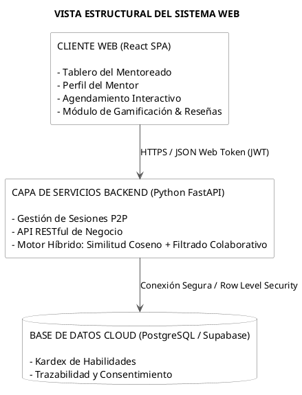

# UNIVERSIDAD PRIVADA DE TACNA

**FACULTAD DE INGENIERÍA**  
**ESCUELA DE INGENIERÍA DE SISTEMAS**

# “Sistema Web P2P con algoritmo de recomendación para la personalización de mentorías académicas en la EPIS-UPT”

**Curso:**  
Construcción de Software I

**Docente:**  
Dr. RICARDO EDUARDO VALCARCEL ALVARADO

**AUTOR:**  
ANTAYHUA MAMANI, Renzo Antonio (2022073504)  
MEDINA QUISPE, Joan Cristian (2022074255)

**TACNA – PERÚ**  
**2026**

---

## CONTROL DE VERSIONES

| Versión | Hecha por | Revisada por | Aprobada por | Fecha | Motivo |
|---|---|---|---|---|---|
| 1.0 | JCM | RAM | RVA | 04/09/2026 | Versión 1.0 |

# Sistema Web P2P con algoritmo de recomendación para la personalización de mentorías académicas en la EPIS-UPT

**Documento Informe de Visión**  
**Versión 1.0**

---

## CONTROL DE VERSIONES

| Versión | Hecha por | Revisada por | Aprobada por | Fecha | Motivo |
|---|---|---|---|---|---|
| 1.0 | JCM | RAM | RVA | 04/09/2026 | Versión 1.0 |

## ÍNDICE GENERAL

1. Introducción  
   1.1. Propósito  
   1.2. Alcance  
   1.3. Definiciones, Siglas y Abreviaturas  
   1.4. Visión General  
2. Posicionamiento  
   2.1. Oportunidad de negocio  
   2.2. Definición del problema  
3. Descripción de los interesados y usuarios  
   3.1. Resumen de los interesados  
   3.2. Resumen de los usuarios  
   3.3. Entorno de usuario  
   3.4. Perfiles de los interesados  
   3.5. Perfiles de los Usuarios  
   3.6. Necesidades de los interesados y usuarios  
4. Vista General del Producto  
   4.1. Perspectiva del producto  
   4.2. Resumen de capacidades  
   4.3. Suposiciones y dependencias  
   4.4. Costos y precios  
   4.5. Licenciamiento e instalación  
5. Características del producto  
6. Restricciones  
7. Rangos de calidad  
8. Precedencia y Prioridad  
9. Otros requerimientos del producto  
   9.1. Estándares legales  
   9.2. Estándares de comunicación  
   9.3. Estándares de cumplimiento de la plataforma  
   9.4. Estándares de calidad y seguridad  
CONCLUSIONES  
RECOMENDACIONES

---

# 1. Introducción

## 1.1. Propósito

El presente documento de visión define las necesidades del negocio, las expectativas de los interesados, las características clave y las restricciones arquitecturales para el desarrollo del "Sistema web P2P con algoritmo de recomendación para la personalización de mentorías académicas en la EPIS-UPT, 2026". Su objetivo es establecer un marco contractual y técnico de referencia que alinee los esfuerzos del equipo de desarrollo con los objetivos académicos y de permanencia estudiantil de la facultad.

## 1.2. Alcance

El alcance del producto comprende el diseño, desarrollo e implantación de una plataforma web distribuida orientada a la gestión y personalización del aprendizaje entre pares:

1. **Módulo de Emparejamiento Inteligente:** Motor algorítmico híbrido (filtrado colaborativo y similitud coseno sobre vectores de competencias curriculares) para emparejar a mentores y mentoreados de forma adaptativa.
2. **Módulo de Gestión de Sesiones P2P:** Agendamiento, registro de asistencia, enlaces a salas virtuales o ubicación de cubículos físicos, y retroalimentación multidimensional post-sesión.
3. **Módulo de Gamificación y Reconocimiento:** Sistema de reputación basado en valoraciones, asignación de insignias temáticas y registro auditable de horas de mentoría.
4. **Panel Administrativo Institucional:** Tablero de control web para la Dirección de Escuela y coordinadores de tutoría con métricas de cobertura, materias de mayor demanda y alertas tempranas de riesgo académico.
5. **Límite de Alcance:** El sistema operará de manera exclusiva como aplicación web responsiva (optimizada para navegadores de escritorio y dispositivos en campus), excluyendo en esta etapa el desarrollo de aplicaciones móviles nativas.

## 1.3. Definiciones, Siglas y Abreviaturas

| Sigla / Término | Definición Técnica |
|---|---|
| **P2P (Peer-to-Peer)** | Modelo de red y aprendizaje horizontal distribuido donde los estudiantes interactúan de forma directa como pares formativos. |
| **EdRecSys** | Educational Recommender System. Sistema de software diseñado para guiar y recomendar recursos, tutores o contenidos pedagógicos. |
| **EPIS-UPT** | Escuela Profesional de Ingeniería de Sistemas de la Universidad Privada de Tacna. |
| **Similitud Coseno** | Métrica matemática que evalúa el coseno del ángulo formado por dos vectores de atributos, utilizada para cuantificar la afinidad temática entre perfiles. |
| **RLS (Row Level Security)** | Mecanismo de PostgreSQL que restringe la visualización o edición de registros en base a políticas de seguridad a nivel de fila según el usuario autenticado. |
| **SUS (System Usability Scale)** | Escala psicométrica estandarizada de 10 preguntas utilizada para cuantificar la usabilidad global percibida de un sistema de software. |
| **NDCG** | Normalized Discounted Cumulative Gain. Métrica para medir la calidad del ranking y relevancia posicional en sistemas de recomendación. |
| **JWT (JSON Web Token)** | Estándar abierto para la transmisión compacta y segura de afirmaciones de identidad entre el cliente web y el backend. |

## 1.4. Visión General

El documento se estructura detallando el posicionamiento del producto, los perfiles de los usuarios e interesados, el resumen de capacidades funcionales, los atributos de calidad bajo la norma ISO/IEC 25010 y los estándares legales y técnicos aplicables al entorno institucional de la EPIS-UPT.

# 2. Posicionamiento

## 2.1. Oportunidad de negocio

Los modelos tradicionales de tutoría en facultades de ingeniería operan usualmente de manera reactiva, formal y con saturación en la carga de los docentes tutores. Esta situación genera que los estudiantes de ciclos formativos iniciales (I al IV ciclo) recurran a canales informales (chats no supervisados) cuando presentan dificultades en asignaturas filtro de alta reprobación (Cálculo, Algoritmos y Estructuras de Datos, Programación Orientada a Objetos).

La oportunidad del producto radica en implementar un entorno web centralizado que articule el talento técnico de los estudiantes de ciclos superiores (VII al X ciclo) para brindar acompañamiento adaptativo. A través de un motor de recomendación híbrido, se optimiza el emparejamiento tutor-estudiante según compatibilidad temática y horaria, reduciendo la deserción temprana e integrando a la Dirección de Escuela como entidad supervisora de la calidad académica.

## 2.2. Definición del problema

| Elemento | Declaración |
|---|---|
| **El problema de...** | La falta de personalización, trazabilidad e incentivos formales en el acompañamiento pedagógico para la superación de cursos filtro. |
| **Afecta a...** | Estudiantes de primeros ciclos (I a IV ciclo), estudiantes destacados de ciclos avanzados (VII a X ciclo) y a la Dirección de la EPIS-UPT. |
| **El impacto de esto es...** | Elevadas tasas de repitencia en ciencias básicas y computación, riesgo de rezago curricular o abandono universitario, y sobrecarga administrativa en el comité de tutoría docente. |
| **Una solución exitosa sería...** | Desarrollar una plataforma web P2P con motor de recomendación híbrido en Python que empareje perfiles curriculares afines, automatice el agendamiento y certifique la labor del mentor mediante gamificación y horas convalidables. |

# 3. Descripción de los interesados y usuarios

## 3.1. Resumen de los interesados

| Nombre | Rol / Entidad | Responsabilidad Principal |
|---|---|---|
| **Dirección de Escuela EPIS-UPT** | Autoridad Académica | Validación institucional del proyecto, convalidación de horas extracurriculares y supervisión de indicadores de repitencia. |
| **Comité de Tutoría y Consejería** | Órgano Docente | Coordinación del soporte tutorial formativo y monitoreo del rendimiento de estudiantes en riesgo académico. |
| **Equipo de Desarrollo (Tesistas)** | Joan Medina & Renzo Antayhua | Modelado, codificación, despliegue cloud, calibración algorítmica y aseguramiento de calidad del sistema web. |
| **Comité Evaluador de Tesis** | Jurado Docente UPT | Evaluación del rigor metodológico, cumplimiento de requerimientos y validez experimental de la plataforma. |

## 3.2. Resumen de los usuarios

| Tipo de Usuario | Descripción | Nivel de Privilegios |
|---|---|---|
| **Estudiante Mentoreado** | Alumno de ciclos I a IV matriculado en asignaturas filtro que demanda refuerzo específico. | Consulta de recomendaciones, reserva de sesiones, calificación post-mentoría y acceso a materiales. |
| **Estudiante Mentor** | Alumno de ciclos VII a X con rendimiento sobresaliente que oferta asesoría académica. | Gestión de horarios de disponibilidad, aceptación de sesiones, registro de temas cubiertos y visualización de reputación. |
| **Administrador / Docente Supervisor** | Autoridad de la escuela o tutor docente responsable del seguimiento. | Gestión de asignaturas filtro, validación de reportes de horas de mentoría y visualización de analíticas globales. |

## 3.3. Entorno de usuario

**Equipos de Acceso:** Computadoras de escritorio y portátiles personales, así como terminales en los laboratorios de cómputo de la EPIS-UPT.

**Navegadores Soportados:** Google Chrome (v100+), Mozilla Firefox (v100+), Microsoft Edge y Apple Safari.

**Condiciones de Red:** Conexión a internet estable con un ancho de banda mínimo de 2 Mbps para interactividad asíncrona.

## 3.4. Perfiles de los interesados

### Dirección de Escuela de la EPIS-UPT

- **Representante:** Director de la Escuela Profesional de Ingeniería de Sistemas.
- **Objetivo:** Disminuir la tasa de desaprobación en cursos de alta exigencia y cumplir el Art. 40 de la Ley Universitaria N° 30220 de forma estructurada.
- **Criterio de Éxito:** Disponibilidad de reportes confiables de horas de mentoría y reducción observable del rezago académico en el semestre 2026-II.

### Equipo de Desarrollo e Investigación

- **Representantes:** Joan Medina (Backend / Motor Algorítmico) & Renzo Antayhua (Frontend Web / Persistencia).
- **Objetivo:** Implementar la solución dentro del plazo delimitado (29 de agosto a 14 de diciembre de 2026) bajo un presupuesto optimizado (CAPEX de S/. 5,475.00).

## 3.5. Perfiles de los Usuarios

### Estudiante Mentoreado (I a IV Ciclo)

- **Motivación:** Resolver dudas técnicas y conceptuales antes de evaluaciones críticas en cursos filtro.
- **Limitaciones:** Poca disponibilidad horaria libre, temor a exponer dudas en cátedra magistral e inexperiencia en metodologías de estudio universitario.

### Estudiante Mentor (VII a X Ciclo)

- **Motivación:** Consolidar su dominio conceptual, desarrollar liderazgo pedagógico y obtener constancias de horas extracurriculares.
- **Limitaciones:** Sobrecarga académica propia y necesidad de flexibilidad horaria para no interferir con sus materias terminales.

## 3.6. Necesidades de los interesados y usuarios

| ID | Interesado / Usuario | Necesidad Primaria | Solución Propuesta en el Sistema Web |
|---|---|---|---|
| **N01** | Mentoreado | Encontrar rápidamente a un compañero que domine el tema exacto que necesita. | Motor de recomendación por similitud coseno sobre vectores de habilidades en cursos filtro. |
| **N02** | Mentor | Horarios coordinados sin cruces y reconocimiento a su tiempo invertido. | Calendario interactivo de disponibilidad, tabla de reputación y exportación de horas de servicio. |
| **N03** | Dirección / Tutores | Trazabilidad del impacto pedagógico y legalidad en el uso de notas. | Tablero de analíticas agregado y módulo de consentimiento informado digital (Ley N° 29733). |

# 4. Vista General del Producto

## 4.1. Perspectiva del producto

El sistema web constituye un entorno autónomo e interoperable en la nube. Se integra conceptualmente con los planes de estudio de la EPIS-UPT, permitiendo cargar mallas curriculares y temarios específicos para contextualizar las recomendaciones.

### VISTA ESTRUCTURAL DEL SISTEMA WEB

## 4.2. Resumen de capacidades

| Capacidad del Sistema | Beneficio para el Usuario / Escuela |
|---|---|
| **Emparejamiento Personalizado** | Sugiere los 3 a 5 mejores mentores por compatibilidad curricular y horaria en segundos. |
| **Agendamiento y Trazabilidad** | Centraliza la confirmación de mentorías y almacena bitácoras de avance por tema. |
| **Evaluación Bidireccional** | Calificación post-sesión que retroalimenta la matriz colaborativa del algoritmo. |
| **Certificación de Horas** | Generación de constancias digitales con firma/código de verificación para la escuela. |

## 4.3. Suposiciones y dependencias

**Suposición 1:** Los estudiantes de ciclos formativos cuentan con conectividad mínima a internet o hacen uso regular de los laboratorios EPIS.

**Suposición 2:** La Dirección de Escuela de la EPIS-UPT facilitará la convalidación de horas extracurriculares a los mentores activos.

**Dependencia 1:** Disponibilidad operativa de los servicios cloud PaaS (Render / Supabase) dentro de sus acuerdos de nivel de servicio (SLA > 99.5%).

**Dependencia 2:** Aprobación explícita del consentimiento de tratamiento de datos personales por parte de los usuarios al registrarse.

## 4.4. Costos y precios

Conforme al estudio de factibilidad económica:

- **Inversión Inicial de Desarrollo (CAPEX):** S/. 5,475.00 (valorización del capital humano de 500 horas entre Joan Medina y Renzo Antayhua, depreciación contable de laptops e internet asignado al semestre 2026-II).
- **Costo Operativo Anual (OPEX):** S/. 1,140.00/año (servidor PaaS, PostgreSQL Cloud gestionado, dominio web y soporte preventivo).
- **Modelo de Acceso:** Gratuito y de libre acceso para toda la comunidad académica de la EPIS-UPT.

## 4.5. Licenciamiento e instalación

**Licenciamiento del Software:** Proyecto académico de titulación registrado según la normativa de propiedad intelectual de la Universidad Privada de Tacna, apoyado en librerías open-source (licencias MIT/BSD/Apache 2.0).

**Modelo de Despliegue:** 100% Software as a Service (SaaS) web en la nube; no requiere instalación de ejecutables locales en las computadoras del campus.

# 5. Características del producto

**CAR01 - Gestión de Identidad y Consentimiento Digital:** Registro y autenticación mediante correo institucional UPT, integrando un formulario obligatorio de consentimiento informado conforme a la Ley N° 29733.

**CAR02 - Perfil Curricular de Habilidades:** Extracción y ponderación de calificaciones en cursos filtro para construir el vector de fortalezas temáticas del mentor.

**CAR03 - Motor de Recomendación Híbrido:** Algoritmo que procesa el vector de debilidades del mentoreado con el perfil de fortalezas del mentor (similitud coseno) y ajusta el orden según valoraciones históricas previas (filtrado colaborativo).

**CAR04 - Agendamiento y Calendario de Disponibilidad:** Interfaz para marcar franjas horarias libres y reservar sesiones sin traslapes.

**CAR05 - Módulo de Gamificación y Reputación:** Puntuación de mentores (1 a 5 estrellas), cálculo dinámico de nivel de reputación y asignación de insignias por volumen y calidad de asesorías.

**CAR06 - Emisión y Reporte de Horas:** Generación de resúmenes de horas efectivas de mentoría para el trámite de convalidación extracurricular ante la dirección.

**CAR07 - Tablero de Control de Escuela:** Visualización de analíticas académicas: asignaturas con mayor demanda de mentoría y tasa de éxito en evaluaciones.

# 6. Restricciones

**Restricción de Tiempo:** El desarrollo, pruebas y despliegue piloto deben concluirse estrictamente en 15.5 semanas (del 29 de agosto al 14 de diciembre de 2026).

**Restricción Presupuestal:** No se contempla la adquisición de servidores dedicados on-premise; el backend y base de datos deben mantenerse en capas PaaS de bajo costo.

**Restricción de Plataforma:** Acceso exclusivo a través de navegadores web para maximizar compatibilidad y evitar costos de publicación en tiendas móviles.

**Restricción Normativa:** Anonimización de identificadores estudiantiles (uso de UUID en base de datos) para garantizar que las notas individuales no sean de acceso público.

# 7. Rangos de calidad

Si prefieres copiar y pegar la tabla directamente en un documento existente, puedes seleccionarla a continuación:

| Característica de Calidad | Métrica / Criterio de Aceptación |
|---|---|
| **Usabilidad (Ergonomía)** | Puntaje medio superior a 75 puntos en la escala SUS en la evaluación con estudiantes piloto. |
| **Rendimiento y Eficiencia** | Tiempo de respuesta del servicio de recomendación algorítmica 500 ms y carga de páginas web < 2s. |
| **Precisión Algorítmica** | Precisión de emparejamiento Precisión 80% y ganancia acumulada descontada NDCG > 0.80. |
| **Seguridad de Datos** | Cifrado HTTPS/TLS en tránsito, autenticación JWT y aislamiento de registros mediante RLS en PostgreSQL. |
| **Disponibilidad** | Disponibilidad del servicio web 99% durante el periodo de exámenes parciales y finales. |

# 8. Precedencia y Prioridad

## Must Have (Obligatorio para la Versión 1.0)

- Autenticación con consentimiento informado digital Ley N° 29733.
- Motor de recomendación híbrido (similitud coseno + filtrado colaborativo).
- Agendamiento de sesiones y selección de asignaturas filtro.
- Panel de control de horas acumuladas para mentores.

## Should Have (Deseable de Alto Impacto)

- Sistema de insignias y reputación dinámica en el perfil del mentor.
- Tablero analítico para la Dirección de Escuela.
- Notificaciones web por correo institucional ante confirmaciones de citas.

## Could Have (Opcional si el tiempo lo permite)

- Subida de apuntes o enlaces de recursos compartidos dentro de la sesión de mentoría.
- Módulo de retroalimentación cualitativa guiada mediante rúbricas breves.

## Won't Have (Descartado para este proyecto)

- Aplicaciones móviles nativas para Android / iOS.
- Pasarela de pagos para cobro monetario de mentorías.

# 9. Otros requerimientos del producto

## 9.1. Estándares legales

Cumplimiento vinculante de la Ley N° 29733 (Ley de Protección de Datos Personales de Perú) y el D.S. 003-2013-JUS, implementando mecanismos para el ejercicio de derechos ARCO (Acceso, Rectificación, Cancelación y Oposición).

Cumplimiento del artículo 40 de la Ley Universitaria N° 30220 referente a la atención permanente de tutoría.

## 9.2. Estándares de comunicación

Intercambio de datos estructurado mediante protocolos seguros HTTPS y arquitectura de servicios RESTful con intercambio de cargas en formato JSON.

## 9.3. Estándares de cumplimiento de la plataforma

Compatibilidad cross-browser garantizada para renderizado responsivo mediante hojas de estilo CSS3 y componentes modulares en React, operable en resoluciones desde 1366 x768 píxeles.

## 9.4. Estándares de calidad y seguridad

Hash seguro de credenciales con algoritmos de derivación de claves (bcrypt / Argon2).

Restricción de consultas a la base de datos aplicando el principio de mínimo privilegio a través de políticas Row Level Security (RLS) en Supabase/PostgreSQL.

# CONCLUSIONES

- El documento de visión consolida la definición del producto, delimitando una solución 100% web que responde a la necesidad de personalización del soporte académico en la EPIS-UPT.
- La integración del algoritmo de recomendación híbrido optimiza el proceso de emparejamiento entre mentores de ciclos avanzados y alumnos de cursos filtro, transformando la tutoría reactiva en un modelo proactivo y preventivo.
- El balance entre requisitos funcionales y restricciones técnicas asegura que el proyecto sea ejecutable por los tesistas Joan Medina y Renzo Antayhua dentro de las 15.5 semanas del semestre 2026-II.

# RECOMENDACIONES

- Formalizar con la Dirección de Escuela de la EPIS-UPT la directiva de convalidación de horas extracurriculares antes de iniciar la fase de pruebas piloto.
- Priorizar en las primeras semanas de codificación la mitigación del problema de arranque en frío (cold-start) ajustando los pesos del filtrado basado en contenido en el motor algorítmico.

