**FACULTAD DE INGENIERÍA**  
**ESCUELA DE INGENIERÍA DE SISTEMAS**

# “Sistema Web P2P con algoritmo de recomendación para la personalización de mentorías académicas en la EPIS-UPT”

**Curso:** Construcción de Software I  
**Docente:** Dr. RICARDO EDUARDO VALCARCEL ALVARADO  

**AUTOR:**  
ANTAYHUA MAMANI, Renzo Antonio (2022073504)  
MEDINA QUISPE, Joan Cristian (2022074255)

**TACNA – PERÚ**  
**2026**

---

## CONTROL DE VERSIONES

| Versión | Hecha por | Revisada por | Aprobada por | Fecha | Motivo |
|:---:|:---:|:---:|:---:|:---:|:---|
| **1.0** | JCM / RAM | RVA | RVA | 11/09/2026 | Versión 1.0 preliminar de levantamiento y especificación inicial. |
| **2.0** | JCM / RAM | RVA | Dirección EPIS | 26/09/2026 | Consolidación y congelamiento de la línea base analítica oficial (MOD-01 al MOD-08, RF01 al RF26, RN-01 al RN-14, RNF01 al RNF10, CUS01 al CUS24). Reorganización modular de narrativas por dependencia operativa, supresión de reglas ocultas, alineamiento estricto de estados canónicos con el modelo lógico y hardening continuo. |

# Sistema Web P2P con algoritmo de recomendación para la personalización de mentorías académicas en la EPIS-UPT

**Documento de Especificación de Requerimientos de Software**  
**Versión 2.0 (Línea Base Oficial Consolidada)**

---

## ÍNDICE GENERAL

1. Introducción  
2. Generalidades de la Empresa  
   2.1. Nombre de la Empresa  
   2.2. Visión  
   2.3. Misión  
   2.4. Organigrama  
3. Visionamiento de la Empresa  
   3.1. Descripción del Problema  
   3.2. Objetivos de Negocios  
   3.3. Objetivos de Diseño  
   3.4. Alcance y Exclusiones del Proyecto  
   3.5. Viabilidad del Sistema  
   3.6. Información obtenida del Levantamiento de Información  
4. Análisis de Procesos  
   4.1. Diagrama del Proceso Actual (As-Is)  
   4.2. Diagrama del Proceso Propuesto (To-Be)  
5. Especificación de Requerimientos de Software  
   5.1. Identificación de Módulos y Capacidades Funcionales  
   5.2. Requerimientos No Funcionales (ISO/IEC 25010)  
   5.3. Matriz Consolidada de Requerimientos Funcionales (RF01 al RF26)  
   5.4. Reglas de Negocio Institucionales (RN-01 al RN-14)  
   5.5. Matriz de Trazabilidad Bidireccional de Requerimientos  
6. Fase de Desarrollo  
   6.1. Perfiles de Usuario y Actores del Sistema  
   6.2. Modelo Conceptual  
   6.2.1. Diagrama de Paquetes Arquitecturales  
   6.2.2. Diagramas de Casos de Uso (General Consolidado y Modulares)  
   6.2.3. Escenarios de Casos de Uso (Narrativas por Módulos MOD-01 al MOD-08)  
   6.3. Modelo Lógico  
   6.3.1. Análisis de Objetos (Modelo ECB)  
   6.3.2. Diagrama de Actividades con Flujo de Objetos  
   6.3.3. Diagrama de Secuencia del Ciclo de Reserva y Quórum  
   6.3.4. Diagrama de Clases del Modelo Lógico  
7. Conclusiones  
8. Bibliografía

---

# Informe de Especificación de Requisitos de Software

# 1. Introducción

El presente documento contiene la especificación de requerimientos de software para el desarrollo del Sistema web P2P con algoritmo de recomendación para la personalización de mentorías académicas en la EPIS-UPT, 2026.

En el ámbito formativo de la Escuela Profesional de Ingeniería de Sistemas de la Universidad Privada de Tacna (EPIS-UPT), los estudiantes de los primeros ciclos (I al IV) se enfrentan a asignaturas críticas o "cursos filtro" como Cálculo, Algoritmos y Estructura de Datos y Programación Orientada a Objetos, las cuales concentran índices significativos de dificultad académica y riesgo de rezago. Paralelamente, la escuela cuenta con estudiantes sobresalientes en los ciclos superiores (VII al X) con la capacidad de brindar orientación pedagógica; sin embargo, esta interacción se produce actualmente mediante canales informales no estructurados y sin ningún tipo de trazabilidad institucional.

Para resolver esta brecha, el equipo de desarrollo C-SharkTeam formula este análisis preliminar para especificar una plataforma web centralizada que automatice el emparejamiento (matching) inteligente entre mentores y mentoreados mediante un algoritmo de recomendación híbrido, gestione la disponibilidad de espacios físicos y virtuales, y facilite la trazabilidad de sesiones y convalidación de horas para la comunidad universitaria.

# 2. Generalidades de la Empresa

## 2.1. Nombre de la Empresa

**C-SharkTeam**

Equipo Consultor y Desarrollador de Soluciones de Software Educativo y Tecnológico.

## 2.2. Visión

Consolidarse como un equipo líder en desarrollo de software educativo, analítica de datos e inteligencia artificial aplicada en el sur del Perú, reconocido por transformar los modelos tradicionales de tutoría y asesoría académica hacia ecosistemas digitales horizontales (Peer-to-Peer), personalizados, eficientes y medibles.

## 2.3. Misión

Diseñar, desarrollar e implementar soluciones de software de alto impacto y base tecnológica, enfocadas en la optimización de procesos de aprendizaje colaborativo, emparejamiento algorítmico inteligente y gobernanza de datos en instituciones de educación superior, facilitando herramientas digitales accesibles, intuitivas y rigurosamente alineadas con los objetivos académicos de la comunidad universitaria.

## 2.4. Organigrama

La estructura organizativa y funcional de C-SharkTeam para el ciclo de vida del proyecto se articula en roles colaborativos de ingeniería de software:

### Organigrama del C-SharkTeam

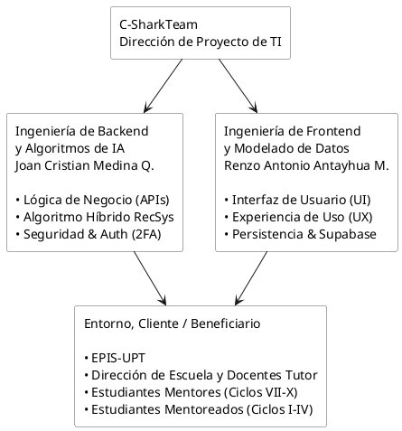

Fuente: Elaboración propia.

**Área de Backend, Algoritmos e Integraciones:** Liderada por Joan Cristian Medina Quispe, responsable de la arquitectura de servicios RESTful (Python FastAPI), desarrollo y calibración del motor de recomendación híbrido (similitud coseno y filtrado colaborativo), esquemas de autenticación institucional de doble factor (2FA) e integraciones con Google Workspace API y Discord Bot.

**Área de Frontend, Arquitectura de Datos y UX:** Liderada por Renzo Antonio Antayhua Mamani, responsable de la construcción de la aplicación web responsiva (React SPA), gestión de bases de datos PostgreSQL en Supabase, políticas de seguridad a nivel de fila (Row Level Security - RLS) y diseño de tableros interactivos para los perfiles de usuario.

# 3. Visionamiento de la Empresa

C-SharkTeam concibe este proyecto no solo como una plataforma de soporte puntual, sino como la base de un ecosistema tecnológico escalable para la Escuela Profesional de Ingeniería de Sistemas (EPIS-UPT).

El visionamiento se apoya en los siguientes pilares de evolución:

- **Transición del Soporte Reactivo al Preventivo:** Reemplazar las tutorías asistenciales tardías por un modelo de acompañamiento continuo y personalizado que atienda a tiempo las debilidades conceptuales de los alumnos en asignaturas formativas.
- **Potenciación del Aprendizaje entre Pares (P2P):** Democratizar el acceso a la asesoría académica aprovechando el talento de los alumnos de ciclos superiores, eliminando la barrera de comunicación docente-estudiante y facilitando explicaciones técnicas con un lenguaje cercano.
- **Optimización con Inteligencia Artificial:** Maximizar la tasa de éxito de cada mentoría sugiriendo automáticamente al mentor más idóneo en función de competencias temáticas, disponibilidad horaria y reputación histórica acumulada.
- **Trazabilidad y Reconocimiento Institucional:** Brindar a las autoridades de la EPIS-UPT métricas en tiempo real sobre la demanda académica y permitir la emisión formal de constancias y certificados de convalidación para incentivar la participación continua de los mentores.

## 3.1. Descripción del Problema

En la Escuela Profesional de Ingeniería de Sistemas de la Universidad Privada de Tacna (EPIS-UPT), los estudiantes que cursan los primeros ciclos (I al IV) presentan dificultades de asimilación conceptual y altos índices de reprobación en asignaturas formativas básicas y de ciencias de la computación, tales como Cálculo, Algoritmos y Estructura de Datos y Programación Orientada a Objetos.

Estas materias actúan como "cursos filtro", provocando rezago en el avance de la malla curricular y aumentando el riesgo de deserción académica temprana.

Aunque la escuela dispone de una comunidad de estudiantes destacados en los ciclos superiores (VII al X) con solvencia técnica para guiar a sus compañeros, no existe una plataforma institucional centralizada ni automatizada que gestione de forma eficiente la oferta y la demanda de asesoría académica entre pares (Peer-to-Peer). En la actualidad, este apoyo ocurre a través de canales informales no regulados (grupos de WhatsApp o mensajería privada), lo que conlleva los siguientes problemas identificados:

- **Falta de emparejamiento inteligente (matching):** La búsqueda de ayuda depende de contactos personales o referencias empíricas, sin contrastar las debilidades temáticas específicas del estudiante con las fortalezas curriculares y disponibilidad horaria del mentor.
- **Carencia de trazabilidad y gobernanza institucional:** La Dirección de Escuela y el Comité de Tutoría no disponen de registros sobre qué temas se refuerzan, quiénes participan ni cuál es el impacto pedagógico real, imposibilitando una intervención preventiva y oportuna.
- **Ausencia de esquemas de reconocimiento formal:** Los mentores no cuentan con incentivos estructurados (como gamificación o acumulación auditable de horas para convalidación de créditos extracurriculares), lo que ocasiona abandono o falta de compromiso por sobrecarga académica propia.
- **Vacíos en la privacidad de datos académicos:** No se aplican protocolos de consentimiento digital ni anonimización en el tratamiento de historiales de notas, en incumplimiento de la Ley N° 29733 de Protección de Datos Personales.

## 3.2. Objetivos de Negocios

Los objetivos de negocio expresan el impacto directo que el software generará en el entorno académico e institucional de la EPIS-UPT:

- **Reducir el índice de rezago y reprobación académica:** Disminuir las tasas de desaprobación en los cursos filtro de I a IV ciclo mediante refuerzos conceptuales oportunos antes de las evaluaciones parciales y finales.
- **Modernizar y descongestionar el servicio de tutoría universitaria:** Cumplir de manera activa el Artículo 40 de la Ley Universitaria N° 30220, transfiriendo las dudas conceptuales básicas a una red horizontal de pares y liberando horas de asesoría docente para casos de mayor complejidad académica.
- **Fomentar la permanencia y retención estudiantil:** Mitigar el riesgo de abandono en los primeros semestres de la carrera de Ingeniería de Sistemas, preservando la continuidad de matrícula institucional.
- **Institucionalizar el reconocimiento al talento estudiantil:** Formalizar la labor de los mentores de ciclos superiores mediante la emisión de certificados de horas extracurriculares convalidables y un sistema de reputación académica visible.
- **Proveer analítica de decisiones para la Dirección de Escuela:** Dotar a la coordinación académica de métricas consolidadas sobre la demanda real de contenidos, asignaturas críticas y niveles de participación estudiantil.

## 3.3. Objetivos de Diseño

Los objetivos de diseño establecen las metas técnicas, funcionales y de experiencia de usuario que la arquitectura del sistema debe garantizar:

- **Precisión y Eficiencia Algorítmica:** Diseñar e implementar un motor de recomendación híbrido (FastAPI / Scikit-learn) capaz de procesar similitud coseno sobre vectores de competencias y filtrado colaborativo con una precisión `Precision@k >= 80%`, ranking `NDCG >= 0.80` y tiempo de respuesta inferior a 500 ms.
- **Alta Usabilidad y Facilidad de Uso:** Construir una interfaz web responsiva (React SPA) con navegación intuitiva que alcance una puntuación media superior a los 75 puntos en la escala estandarizada System Usability Scale (SUS).
- **Seguridad Robusta y Cumplimiento Normativo:** Incorporar autenticación de doble factor (2FA vía Email OTP institucional), control de acceso basado en roles con tokens JWT, políticas de seguridad a nivel de fila (Row Level Security - RLS) en PostgreSQL y un módulo de consentimiento informado digital bajo la Ley N° 29733.
- **Automatización de Infraestructura Física y Virtual:** Proveer integración desacoplada para asignación de espacios físicos (a través de un microservicio parser de horarios en PDF/Excel) y generación automática de salas virtuales (Google Meet API y Bot de gestión en Discord).
- **Trazabilidad Integral y Concurrencia Confiable:** Garantizar transacciones ACID en la persistencia de datos (Supabase) para evitar sobreasignación de cupos y solapamientos de horarios, asegurando un registro fidedigno de bitácoras y encuestas de calidad.

## 3.4. Alcance del proyecto

El alcance del proyecto comprende la especificación, diseño, codificación, integración y despliegue del Sistema web P2P con algoritmo de recomendación para la personalización de mentorías académicas en la EPIS-UPT, 2026. Habiendo concluido el análisis de prefactibilidad (FD01) y la visión del producto (FD02), el sistema se desarrollará a partir de la matriz de requerimientos del presente documento SRS.

### Inclusiones del Sistema (Módulos a Desarrollar)

- **Plataforma Web Responsiva (Frontend SPA):** Interfaz web accesible mediante navegadores de escritorio en computadoras personales y terminales de los laboratorios de la EPIS-UPT, diseñada bajo React y evaluada para superar los 75 puntos en SUS.
- **Módulo de Identidad, Acceso y Privacidad:** Inicio de sesión institucional con 2FA mediante OTP enviado al correo universitario, consentimiento informado digital bajo la Ley N° 29733 y control de accesos jerárquicos.
- **Motor Híbrido de Recomendación (EdRecSys):** Microservicio en Python (FastAPI) que procesa el vector de necesidades conceptuales del mentoreado frente a las competencias en asignaturas filtro mediante similitud coseno, ajustando el ranking Top-k con filtrado colaborativo, reputación histórica y balance de carga.
- **Gestión de Oferta y Demanda de Mentorías:** Publicación de clases por mentores y formularios de solicitud temática por demanda.
- **Aprovisionamiento de Espacios Físicos y Virtuales:**
  - **Modalidad Presencial:** Componente interno de procesamiento (Parser) para analizar archivos de cronogramas oficiales en PDF/Excel provistos por la Dirección de Escuela y asignar aulas o laboratorios libres, con aforo estándar de 10 estudiantes (RN-05).
  - **Modalidad Virtual:** Integración con Google Workspace API (Google Meet) y bot de Discord para salas de teleconferencia supervisadas, con aforo estándar de 20 estudiantes (RN-05).
- **Control de Quórum y Confirmación de Asistencia:** Confirmación obligatoria hasta 24 horas antes ($T-24\text{ h}$); quórum mínimo reglamentario del 50% (5 alumnos en presencial o 10 en virtual).
- **Trazabilidad, Bitácoras y Retroalimentación:** Registro obligatorio de temas silábicos impartidos, marcado de asistencias reales y encuesta de satisfacción habilitada durante 24 horas.
- **Gamificación y Emisión de Certificados:** Reputación ponderada, catálogo de insignias por mérito formativo, umbrales de horas auditadas y constancias oficiales en PDF con código correlativo único, hash SHA-256 de integridad y código QR de verificación en línea.
- **Panel de Control y Analítica Académica:** Métricas de asignaturas críticas, mentores destacados, tasa de asistencia, demanda insatisfecha y priorización de clases.

### Exclusiones del Alcance (Límites de la Versión Inicial)

- No se desarrollarán aplicaciones móviles nativas para Android o iOS (la plataforma opera como aplicación web responsiva accesible desde cualquier navegador).
- No se incluirán pasarelas de pago monetario ni transacciones financieras (el sistema es estrictamente académico y formativo gratuito).
- No se realizará integración directa ni sincronización en tiempo real con las bases de datos transaccionales centrales de matrícula general de la universidad.
- No se integrará firma digital avanzada basada en certificados PKI emitidos por entidades certificadoras externas de pago; la autenticidad e inalterabilidad de los certificados se gestionará internamente mediante código correlativo institucional único, hash SHA-256 de verificación y validación pública en línea mediante código QR en el portal oficial de la UPT.

## 3.5. Viabilidad del Sistema

### 1. Viabilidad Técnica

**Stack Tecnológico y Madurez:** React (SPA), Python (FastAPI / Scikit-learn) y PostgreSQL administrado mediante Supabase.

**Capacidad Computacional:** El procesamiento matricial para similitud coseno y filtrado colaborativo se ejecutará en contenedores cloud de bajo consumo, garantizando tiempos de respuesta algorítmica `<= 500 ms`.

**Integraciones Desacopladas:** Google Workspace (Meet API), bots de Discord y microservicio parser para cronogramas en PDF/Excel mediante APIs RESTful estructuradas en JSON.

### 2. Viabilidad Económica

El análisis financiero se calculó para un horizonte de evaluación a 5 años (2026-2030) con una tasa de descuento (COK) del 12.00%.

| Indicador Financiero | Valor Proyectado | Interpretación Técnica / Financiera |
|---|---:|---|
| **Inversión Inicial (CAPEX)** | **S/. 5,475.00** | Cubre 500 horas de desarrollo (Joan Medina y Renzo Antayhua a razón de S/. 9.00/hr), depreciación de equipos (3.5 meses), conectividad, dominio web e imprevistos. |
| **Costo Operativo Anual (OPEX)** | **S/. 1,140.00** | Mantenimiento de infraestructura PaaS (Render/Supabase), renovación de dominio, soporte preventivo y materiales de difusión. |
| **Valor Actual Neto (VAN)** | **+S/. 10,801.64** | Estrictamente positivo (VAN > 0), ratificando que el proyecto generará valor económico y retención institucional por encima de la tasa exigida. |
| **Tasa Interna de Retorno (TIR)** | **68.20%** | Supera ampliamente el COK referencial (12.00%), otorgando un margen de seguridad amplio frente a variaciones de costos. |
| **Relación Beneficio / Costo (B/C)** | **1.97** | Por cada sol invertido en el ciclo del proyecto, se generarán S/. 1.97 en beneficios y ahorros valorizados para la facultad y los estudiantes. |
| **Periodo de Recuperación (Payback)** | **1 año y 9.7 meses** | La inversión inicial se recuperará plenamente durante el transcurso del segundo año de operación. |

### 3. Viabilidad Operativa

**Adopción por Mentoreados:** Los alumnos de I a IV ciclo accederán desde cualquier navegador web sin instalaciones locales, permitiéndoles agendar sesiones por tema y modalidad.

**Incentivos para Mentores:** Gamificación, insignias, reputación dinámica y constancias de horas acumuladas convalidables.

**Facilidad Administrativa:** El emparejamiento automatizado reducirá la carga manual de intermediación y proveerá tableros analíticos.

### 4. Viabilidad Legal

**Ley N° 29733:** Consentimiento informado digital en el primer inicio de sesión y uso de UUID para seudonimizar la información académica.

**Ley Universitaria N° 30220 (Artículo 40):** Soporte a la obligación institucional de brindar tutoría y consejería permanente.

**Licenciamiento y Propiedad Intelectual:** Librerías de código abierto bajo licencias permisivas (MIT/Apache 2.0) y registro conforme al reglamento de investigación de la UPT.

### 5. Viabilidad Social y Ambiental

**Factibilidad Social:** Fomento del aprendizaje horizontal P2P, acceso gratuito a asesoría y fortalecimiento de habilidades blandas.

**Factibilidad Ambiental:** Política Paperless y despliegue cloud multi-tenant para optimizar consumo energético.

## 3.6. Información obtenida del Levantamiento de Información

Durante la etapa de análisis, el equipo C-SharkTeam llevó a cabo entrevistas semiestructuradas con los principales actores institucionales, docentes especialistas y autoridades de la EPIS-UPT con el fin de definir las reglas de negocio, la arquitectura del software y los mecanismos de reconocimiento formal del sistema.

### Resumen del Levantamiento de Información

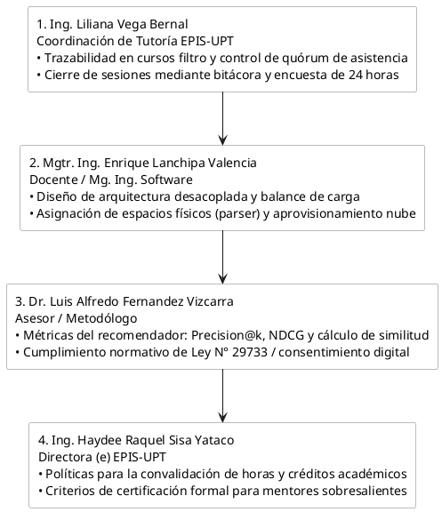

Fuente: Elaboración propia.

### Entrevista N° 1: Coordinación de Tutoría de la EPIS-UPT

**Entrevistada:** Ing. Liliana Mercedes Milagros Vega Bernal (Encargada de Tutoría EPIS-UPT).  
**Objetivo:** Identificar los cuellos de botella en la atención de alumnos en riesgo académico y fijar los parámetros de trazabilidad y asistencia.

**Registro del Diálogo:**

**C-SharkTeam:** Ingeniera Liliana, ¿cuáles son las principales dificultades que afronta el área de tutoría para brindar soporte a los alumnos de los primeros ciclos?

**Ing. Liliana Vega:** El problema radica en que los estudiantes de I a IV ciclo suelen acudir a tutoría de manera tardía, cuando ya tienen notas desaprobatorias en materias formativas como Cálculo o Algoritmos. Muchos buscan ayuda entre compañeros mayores, pero al ser informal no tenemos forma de registrarlo ni medirlo.

**C-SharkTeam:** ¿Qué requisitos operativos considera necesarios para validar formalmente las sesiones de mentoría?

**Ing. Liliana Vega:** El sistema debe exigir que los alumnos confirmen su asistencia con hasta 24 horas de anticipación para asegurar el quórum. Para dar validez a las horas, el mentor debe registrar los temas dictados y los mentoreados deben completar una encuesta de satisfacción posterior. Además, el panel administrativo debe permitirnos destacar clases prioritarias cuando detectemos asignaturas con alta tasa de reprobación.

### Entrevista N° 2: Asesoría en Arquitectura del Sistema e Infraestructura

**Entrevistado:** Mgtr. Ing. Enrique Felix Lanchipa Valencia (Docente y Maestro en Ingeniería de Software - EPIS-UPT).  
**Objetivo:** Definir las directrices arquitectónicas, el desacoplamiento de servicios y los mecanismos de asignación de espacios físicos y virtuales.

**Registro del Diálogo:**

**C-SharkTeam:** Ingeniero Enrique, desde el punto de vista de la arquitectura de software y la infraestructura disponible en la escuela, ¿cómo debe estructurarse el sistema para soportar las mentorías presenciales y virtuales?

**Mgtr. Enrique Lanchipa:** La arquitectura debe ser desacoplada y basada en microservicios ligeros. Para las clases presenciales, los laboratorios están sujetos a los horarios de cátedra; por lo tanto, el sistema debe conectarse a un API o procesador externo que lea los cronogramas oficiales en PDF o Excel subidos por la administración para identificar franjas libres sin solapamientos. Para las virtuales, el backend debe aprovisionar salas de Google Meet mediante la API institucional o coordinar con un bot en Discord para la asignación de canales.

**C-SharkTeam:** ¿Qué consideraciones arquitectónicas debemos contemplar en el motor de recomendación para la carga de trabajo?

**Mgtr. Enrique Lanchipa:** El motor algorítmico en Python debe optimizarse para responder en milisegundos y no limitarse a ordenar por notas. Es fundamental implementar un balanceo de carga en el ranking para evitar sobrecargar a los mismos mentores y distribuir equitativamente las sesiones entre todos los alumnos habilitados de ciclos superiores.

### Entrevista N° 3: Asesoría Metodológica, Algorítmica y Normativa

**Entrevistado:** Dr. Luis Alfredo Fernandez Vizcarra (Docente Asesor del Curso de Tesis / Metodólogo).  
**Objetivo:** Establecer las métricas de rendimiento algorítmico, el marco experimental de la investigación y la gobernanza de datos bajo el marco legal peruano.

**Dr. Luis Fernandez:** El componente central de la investigación es el algoritmo de recomendación híbrido. Deben garantizarse métricas precisas de evaluación como Precision@k >= 80%, y NDCG >= 0.80, combinando similitud coseno sobre vectores temáticos con filtrado colaborativo. En el plano ético y legal, la plataforma debe acogerse rigurosamente a la Ley N° 29733 de Protección de Datos Personales, solicitando un consentimiento informado digital explícito en el primer inicio de sesión antes de procesar el récord académico del estudiante.

**C-SharkTeam:** ¿Cómo debe validarse la usabilidad de la plataforma frente a los usuarios?

**Dr. Luis Fernandez:** Deben estructurar la evaluación de usabilidad mediante el instrumento psicométrico estandarizado SUS (System Usability Scale), apuntando a una media superior a 75 puntos durante la etapa piloto con los estudiantes.

### Entrevista N° 4: Viabilidad Institucional, Certificación y Convalidación de Créditos

**Entrevistada:** Ing. Haydee Raquel Sisa Yataco (Directora (e) de la Escuela Profesional de Ingeniería de Sistemas - EPIS-UPT).  
**Objetivo:** Establecer los criterios institucionales para la emisión de certificaciones oficiales y analizar la viabilidad de otorgar créditos extracurriculares a mentores destacados.

**Ing. Haydee Sisa:** La Dirección de Escuela ve con mucho interés esta iniciativa, ya que fortalece la retención estudiantil y el trabajo colaborativo. Para incentivar la participación continua de los estudiantes destacados de VII a X ciclo, la escuela puede validar estas horas de asesoría como actividades extracurriculares convalidables, siempre y cuando la plataforma garantice que las horas han sido efectivamente dictadas y evaluadas por los alumnos.

**Ing. Haydee Sisa:** El sistema debe permitir al administrador configurar los umbrales de horas requeridas por semestre y emitir certificados digitales en formato PDF descargables que resuman el récord de mentorías, los temas cubiertos y la calificación de desempeño obtenida. Aquellos mentores con un volumen sobresaliente de horas y alta reputación podrán ser postulados ante el Consejo de Facultad para la asignación de créditos extracurriculares oficiales o reconocimientos al mérito académico.

### Síntesis de Decisiones de Diseño y Reglas Funcionales

- **Acceso y Seguridad:** Autenticación institucional universitaria con doble factor (2FA vía Email OTP) y aceptación obligatoria del consentimiento informado digital bajo la Ley N° 29733.
- **Asignación de Roles:** Todos los alumnos ingresan inicialmente con perfil de "Mentoreado"; el Administrador eleva a "Mentor" según su historial académico.
- **Capacidad y Espacios:** Aforos base de 10 estudiantes en modalidad presencial y 20 en virtual.
- **Quórum y Cancelación:** Confirmación de asistencia hasta 24 horas antes con quórum mínimo del 50%.
- **Trazabilidad y Calidad:** Registro de bitácoras de sesión y encuesta de 1 a 5 estrellas disponible durante 24 horas.
- **Incentivos y Certificación Institucional:** Gamificación, parametrización de horas y generación de constancias digitales PDF.

# 4. Análisis de Procesos

## 4.1. Diagrama del Proceso Actual - Diagrama de actividades

El proceso actual de asesoría académica en la EPIS-UPT opera bajo un esquema informal y desarticulado. Cuando un estudiante de los primeros ciclos (I a IV) afronta vacíos conceptuales en asignaturas críticas (Cálculo, Algoritmos, POO), recurre a grupos no oficiales de mensajería (WhatsApp/Telegram) o contactos personales para buscar ayuda empírica. En este flujo no existen criterios objetivos para evaluar la competencia del compañero que brinda el apoyo, la disponibilidad de espacios físicos o virtuales se coordina sin control, no hay registro de asistencia ni bitácoras pedagógicas, y la Dirección de Escuela carece de métricas para convalidar horas o detectar a tiempo el riesgo académico.

### Diagrama de Actividades del Proceso Actual de Asesoría Académica Informal en la EPIS-UPT

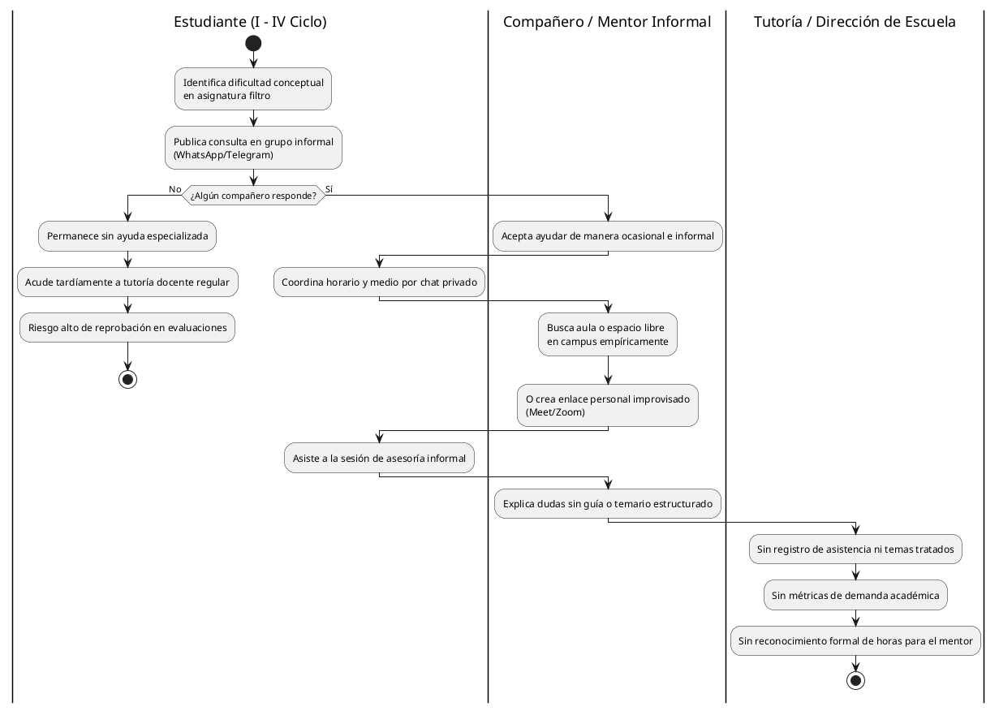

Fuente: Elaboración propia.

El diagrama evidencia que el flujo actual depende de la casualidad y de la red de contactos del alumno, careciendo de mecanismos de emparejamiento por competencias, soporte de espacios y trazabilidad institucional. Esto desincentiva la participación continua de los mentores al no existir convalidación de horas y deja a la escuela sin datos para intervenir de forma preventiva en el rendimiento estudiantil.

## 4.2. Diagrama del Proceso Propuesto - Diagrama de actividades Inicial

El proceso propuesto estructura y automatiza la interacción académica entre pares a través de la plataforma web P2P de la EPIS-UPT. El flujo integra el acceso seguro institucional con doble factor (2FA) y consentimiento digital bajo la Ley N° 29733. Incorpora un motor de recomendación híbrido que evalúa vectores de debilidades y fortalezas en asignaturas filtro, asignación automatizada de recursos, control de quórum con corte a 24 horas, bitácoras de sesión, encuestas de calidad de 24 horas y emisión formal de certificados para convalidación de horas extracurriculares.

### Diagrama de Actividades del Proceso Propuesto - Sistema Web de Mentorías P2P EPIS-UPT

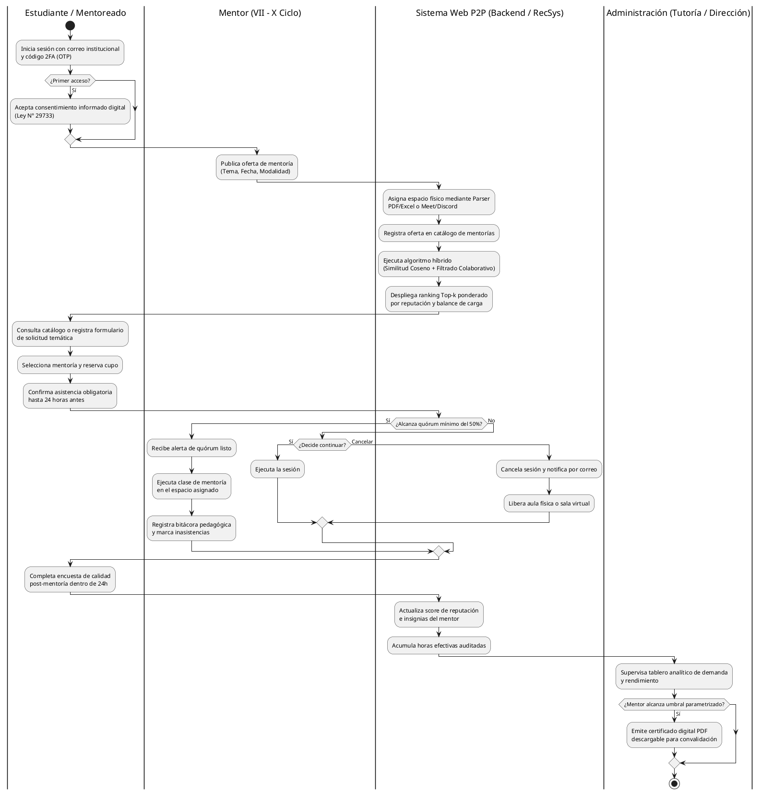

Fuente: Elaboración propia.

El proceso propuesto transforma la asesoría informal en un flujo trazable, transparente y medible. Asegura un emparejamiento adaptativo mediante inteligencia artificial, garantiza el uso ordenado de la infraestructura física y virtual de la facultad, valida el quórum de forma preventiva y proporciona incentivos institucionales tangibles a los mentores mediante la convalidación de horas.

# 5. Especificación de Requerimientos de Software

## 5.1. Identificación de Módulos y Capacidades Funcionales

Para estructurar la solución de software y garantizar una adecuada cohesión y bajo acoplamiento en el diseño del sistema web P2P de mentorías académicas, el alcance funcional se descompone en ocho módulos o subsistemas especializados. Esta modularización permite organizar la lógica de negocio, delimitar las responsabilidades operativas de los actores institucionales y establecer una base sólida para la posterior definición de los requerimientos funcionales y no funcionales. A continuación, se detallan los módulos identificados, su propósito general dentro de la Escuela Profesional de Ingeniería de Sistemas (EPIS-UPT), sus capacidades funcionales principales, los actores y sistemas participantes, y su correspondencia con la línea base funcional consolidada de casos de uso (CUS01 al CUS24).

### Cuadro 5.1: Identificación de Módulos y Capacidades Funcionales del Sistema Web P2P

| Código | Módulo / Subsistema | Propósito | Capacidades Funcionales Principales | Actores / Sistemas Involucrados | CUS Asociados |
| :---: | :--- | :--- | :--- | :--- | :---: |
| **MOD-01** | Seguridad, Autenticación y Gobernanza | Garantizar el acceso confiable y restringido a la comunidad universitaria institucional, protegiendo los datos personales y académicos bajo la normativa vigente y asignando privilegios según el rol validado. | • Autenticación institucional con doble factor mediante código de verificación temporal.<br>• Formalización del consentimiento informado digital para el tratamiento de datos académicos (Ley N° 29733).<br>• Gestión y asignación administrativa de roles de usuario (promoción de Mentoreado a Mentor). | Usuario Institucional (*Mentoreado, Mentor, Administrador*), Servicio de Correo SMTP / UPT | CUS01, CUS10 |
| **MOD-02** | Gestión Curricular y Perfiles Académicos | Administrar la estructura curricular de las materias críticas de la carrera y gestionar los perfiles formativos y de disponibilidad de los participantes. | • Gestión del catálogo de asignaturas formativas críticas y desglose de unidades temáticas silábicas.<br>• Registro y actualización de disponibilidad horaria semanal de mentores y mentoreados.<br>• Declaración de debilidades y fortalezas conceptuales para la personalización formativa. | Estudiante Mentoreado, Estudiante Mentor, Administrador (*Tutoría / Dirección EPIS*) | CUS21, CUS15 |
| **MOD-03** | Motor de Recomendación Inteligente (*EdRecSys*) | Generar sugerencias personalizadas de mentores idóneos y articular la oferta formativa con la demanda temática insatisfecha mediante técnicas analíticas. | • Procesamiento analítico de similitud curricular temática y patrones de disponibilidad.<br>• Generación y presentación del ranking de mentores recomendados más afines (Top-k).<br>• Registro de solicitudes temáticas por demanda para materias y temas sin oferta activa. | Estudiante Mentoreado, Estudiantes Mentores habilitados | CUS02, CUS03 |
| **MOD-04** | Planificación, Espacios y Agendamiento | Calendarizar las sesiones de mentoría y gestionar la asignación ordenada de la infraestructura física del campus o salas virtuales de teleconferencia. | • Publicación y configuración de ofertas de mentoría académica en materias aprobadas.<br>• Procesamiento de cronogramas institucionales oficiales para identificar aulas y laboratorios libres.<br>• Aprovisionamiento coordinado de espacios físicos o virtuales (enlaces de videoconferencia).<br>• Gestión de imprevistos mediante reprogramación o cancelación justificada por el mentor. | Estudiante Mentor, Administrador, Servicios Externos (*Google Meet, Discord*) | CUS11, CUS06, CUS18 |
| **MOD-05** | Quórum, Confirmación y Cancelaciones | Controlar la inscripción, reconfirmación de asistencia previa y verificación de viabilidad de las sesiones para optimizar el aprovechamiento de recursos. | • Reserva concurrente de cupos limitados por aforos establecidos.<br>• Reconfirmación obligatoria de asistencia por parte de los inscritos previa al evento.<br>• Despacho automático de alertas temporales y cálculo de quórum mínimo en segundo plano.<br>• Gestión operativa de sesiones con quórum insuficiente bajo decisión del mentor.<br>• Desistimiento voluntario y liberación inmediata de plazas reservadas. | Estudiante Mentoreado, Estudiante Mentor, Sistema (*Servicio Cron / Backend*) | CUS04, CUS24, CUS17, CUS23, CUS07 |
| **MOD-06** | Trazabilidad, Bitácoras y Evaluación | Registrar la evidencia del desarrollo pedagógico, controlar la asistencia efectiva, medir la satisfacción del servicio y gestionar material de apoyo. | • Registro de bitácoras pedagógicas con contenidos impartidos y control estricto de asistencia.<br>• Captura de encuestas de calidad y retroalimentación post-sesión por estudiantes asistentes.<br>• Consulta de historial individual de sesiones, asistencias y evaluaciones para los usuarios.<br>• Intercambio, publicación y descarga de recursos académicos vinculados a cada sesión. | Estudiante Mentoreado, Estudiante Mentor | CUS20, CUS08, CUS05, CUS19 |
| **MOD-07** | Gamificación, Reputación y Certificación | Incentivar la participación continua de los mentores mediante reconocimiento lúdico, cálculo de reputación y formalización de constancias de servicio. | • Cálculo continuo de niveles de reputación y visualización del tablero de insignias del mentor.<br>• Parametrización institucional de horas semestrales requeridas para acreditación.<br>• Emisión y generación digital de certificados de mentoría con código de validación.<br>• Descarga de constancias oficiales de horas para convalidación extracurricular. | Estudiante Mentor, Administrador (*Tutoría / Dirección EPIS*) | CUS16, CUS13, CUS09 |
| **MOD-08** | Supervisión y Analítica Institucional | Proveer herramientas de monitoreo analítico, priorización académica y fiscalización docente para las autoridades de la facultad. | • Despliegue de tableros de analíticas con indicadores de demanda, asistencia y deserción.<br>• Identificación y registro de mentorías prioritarias para asignaturas en riesgo académico.<br>• Auditoría de consistencia y completitud de bitácoras pedagógicas, asistencia y horas declaradas. | Administrador (*Tutoría / Dirección EPIS*) | CUS12, CUS14, CUS22 |

Fuente: Elaboración propia.

La estructuración en estos ocho módulos funcionales responde a la necesidad de separar las responsabilidades del sistema en componentes autónomos, coherentes y de alta cohesión. Cada módulo agrupa capacidades técnicas especializadas que acompañan las etapas progresivas del proceso de acompañamiento entre pares: desde el control de acceso y gobierno de datos (MOD-01) y la modelación curricular (MOD-02), pasando por el emparejamiento adaptativo (MOD-03) y la orquestación logística de espacios y quórum (MOD-04 y MOD-05), hasta la documentación pedagógica (MOD-06), el reconocimiento a los tutores (MOD-07) y la supervisión directiva de la escuela (MOD-08).

Esta división modular constituye el marco de referencia que organiza la posterior definición detallada de los requerimientos funcionales y reglas de negocio en este documento. Al vincular explícitamente cada subsistema con los 24 casos de uso de la línea base funcional consolidada, se asegura que las capacidades del sistema web se mantengan coordinadas e integradas a lo largo de todo el ciclo de vida de la mentoría académica en la EPIS-UPT.

## 5.2. Requerimientos No Funcionales (ISO/IEC 25010)

Los requerimientos no funcionales establecen los atributos de calidad, restricciones técnicas y niveles de servicio que la solución de software debe satisfacer para operar de manera óptima dentro de la infraestructura universitaria. Con el propósito de asegurar que el Sistema Web P2P ofrezca una experiencia confiable, segura, escalable y accesible para la comunidad de la Escuela Profesional de Ingeniería de Sistemas (EPIS-UPT), los requerimientos se clasifican y estructuran bajo el estándar internacional de calidad del producto de software **ISO/IEC 25010**. A continuación, se presenta la especificación detallada de cada requerimiento no funcional, indicando la característica evaluada, su criterio técnico de aceptación y la métrica verificable exigida.

### Cuadro 5.2: Matriz de Requerimientos No Funcionales bajo el Estándar ISO/IEC 25010

| Código | Característica (ISO 25010) | Requerimiento No Funcional | Criterio de Aceptación / Especificación Técnica | Métrica / Umbral Verificable |
| :---: | :--- | :--- | :--- | :--- |
| **RNF01** | Seguridad | Autenticación multifactor y gestión segura de sesiones | El sistema debe implementar autenticación de doble factor mediante un código de un solo uso (OTP) remitido al correo electrónico institucional con dominio `@upt.pe`. Una vez validado el acceso, la sesión debe gobernarse mediante JSON Web Tokens (JWT) firmados criptográficamente con algoritmo HMAC-SHA256. | Validez máxima del OTP: 5 minutos.<br>Expiración del token JWT: 8 horas continuas. |
| **RNF02** | Seguridad | Privacidad, aislamiento y protección de datos académicos | Todas las comunicaciones deben estar protegidas mediante cifrado TLS 1.3 en tránsito. La persistencia en PostgreSQL (Supabase) debe aplicar políticas de seguridad a nivel de fila (Row Level Security - RLS) para aislar expedientes, kardex y calificaciones, garantizando la anonimización de identificadores directos mediante identificadores universales (UUID v4) en estricto cumplimiento de la Ley N° 29733. | 100% de consultas filtradas por RLS.<br>0% de exposición de códigos de estudiante en tráfico público. |
| **RNF03** | Rendimiento y Eficiencia | Latencia de inferencia del motor de recomendación | El microservicio en Python (FastAPI) debe vectorizar el perfil de necesidades y calcular la similitud coseno frente a los mentores candidatos, aplicando el reordenamiento por filtrado colaborativo en un tiempo imperceptible para el usuario. | Tiempo de procesamiento algorítmico $\le 500$ ms bajo carga concurrente de hasta 50 solicitudes por minuto. |
| **RNF04** | Rendimiento y Eficiencia | Tiempo de respuesta y carga de la interfaz de usuario | La interfaz web React (Single Page Application) debe descargar sus componentes estáticos y renderizar el panel principal de navegación de manera fluida en navegadores de escritorio. | Tiempo de primera pintura con contenido (FCP) $< 2.0$ segundos sobre conexiones de red $\ge 2$ Mbps. |
| **RNF05** | Usabilidad | Facilidad de aprendizaje y satisfacción ergonómica | El diseño visual y los flujos de interacción de la plataforma deben ser intuitivos para estudiantes de ciclos iniciales (I a IV) y avanzados (VII a X), minimizando la curva de aprendizaje sin requerir manuales de inducción complejos. | Puntuación promedio $> 75$ puntos en la escala estandarizada System Usability Scale (SUS) al cierre de la prueba piloto. |
| **RNF06** | Fiabilidad y Disponibilidad | Continuidad operativa durante el periodo académico | La plataforma web, el backend analítico y la base de datos cloud deben mantener operación ininterrumpida a lo largo de las 16 semanas del semestre académico 2026-II, tolerando picos de demanda durante los exámenes parciales y finales. | Nivel de disponibilidad del servicio $\ge 99.0\%$ durante el periodo lectivo regular (excluyendo ventanas de mantenimiento programado). |
| **RNF07** | Fiabilidad e Integridad | Consistencia transaccional en reservas de cupos | El subsistema de persistencia debe ejecutar el bloqueo e inscripción de cupos mediante transacciones ACID con bloqueo optimista/pesimista, garantizando que no existan inconsistencias de sobreasignación ni colisiones de plazas concurrentes. | Tasa de sobreasignación de cupos: estrictamente $0\%$ frente a concurrencia simultánea en el aforo máximo. |
| **RNF08** | Compatibilidad y Portabilidad | Soporte multiplataforma en navegadores de escritorio | La interfaz web debe ser responsiva y garantizar paridad visual y funcional en los navegadores web modernos utilizados en terminales personales y laboratorios de cómputo de la EPIS-UPT (Google Chrome, Mozilla Firefox, Microsoft Edge y Apple Safari). | Renderizado visual y operativo correcto al 100% en resoluciones de pantalla iguales o superiores a $1366 \times 768$ píxeles. |
| **RNF09** | Mantenibilidad | Arquitectura desacoplada basada en microservicios RESTful | El código fuente del frontend (React SPA), backend algorítmico (FastAPI) y capa de persistencia (Supabase / PostgreSQL) debe mantener una separación estricta de responsabilidades, comunicándose mediante interfaces de programación RESTful con contratos JSON fuertemente tipados. | Documentación OpenAPI / Swagger al 100% en todos los endpoints expuestos; cobertura de pruebas unitarias $\ge 70\%$. |
| **RNF10** | Interoperabilidad | Resiliencia ante fallos en servicios externos integrados | El sistema debe implementar políticas de reintento exponencial (*exponential backoff*), degradación elegante y gestión controlada de excepciones frente a indisponibilidades temporales de Google Meet API, Discord API o del servidor de correo SMTP institucional. | Manejo controlado del 100% de tiempos de espera (*timeouts* $\le 5$ s), registrando eventos anómalos en bitácoras de auditoría. |

Fuente: Elaboración propia.

Los requerimientos no funcionales expuestos establecen las salvaguardas técnicas necesarias para garantizar la robustez, agilidad y resiliencia de la solución. La fijación de un tiempo máximo de inferencia de 500 ms para el motor de recomendación híbrido (RNF03) asegura una interacción dinámica e inmediata para los estudiantes, mientras que el umbral superior a los 75 puntos en la escala SUS (RNF05) valida la accesibilidad y ergonomía requeridas para un entorno de pares. Asimismo, el blindaje arquitectónico mediante autenticación 2FA, tokens JWT, cifrado TLS 1.3 y políticas RLS (RNF01 y RNF02) asegura el estricto cumplimiento normativo de la Ley N° 29733, garantizando que el expediente y desempeño académico de los estudiantes de la EPIS-UPT permanezcan permanentemente aislados y protegidos contra accesos no autorizados.

## 5.3. Matriz Consolidada de Requerimientos Funcionales

Habiendo formalizado la modularización del sistema en ocho componentes funcionales (MOD-01 al MOD-08) y establecida la línea base de los 24 casos de uso canónicos (CUS01 al CUS24), la presente sección especifica detalladamente los requerimientos funcionales del software. Cada requerimiento formaliza el comportamiento, las condiciones operativas y las capacidades del sistema que permiten a los actores institucionales —estudiantes mentoreados, estudiantes mentores, autoridades administrativas y servicios automatizados de backend— interactuar eficazmente con la plataforma.

En estricta observancia de las buenas prácticas de ingeniería de requisitos (ISO/IEC/IEEE 29148 e IEEE 830), la relación entre los requerimientos funcionales y los casos de uso responde a un principio de **trazabilidad bidireccional** y no a una correspondencia forzada o biunívoca. Como resultado de la auditoría técnica de atomicidad, necesidad, verificabilidad y separación de responsabilidades (aislando métricas de rendimiento que corresponden a RNF y políticas operativas que corresponden a RN), el sistema consolida **26 requerimientos funcionales atómicos** organizados por módulos funcionales. A continuación, se presenta la matriz consolidada de requerimientos funcionales del sistema.

### Cuadro 5.3: Matriz Consolidada de Requerimientos Funcionales del Sistema Web P2P (RF01 al RF26)

| Código | Módulo Principal | Requerimiento Funcional | Descripción Detallada y Criterios Operativos | Casos de Uso Soportados | Criticidad |
| :---: | :--- | :--- | :--- | :---: | :---: |
| **RF01** | MOD-01 Seguridad, Autenticación y Gobernanza | Autenticación institucional multifactor (2FA) | El sistema debe validar la identidad de los usuarios mediante cuentas de correo institucional `@upt.pe` y la comprobación de un código de verificación temporal de un solo uso (OTP) emitido al buzón institucional. Una vez validada la identidad, el sistema debe inicializar y gobernar la sesión de usuario de acuerdo con el perfil asignado. | CUS01 | Crítica |
| **RF02** | MOD-01 Seguridad, Autenticación y Gobernanza | Formalización del consentimiento informado digital | El sistema debe presentar con carácter obligatorio, en el primer inicio de sesión de cualquier usuario, la política institucional de privacidad y tratamiento de datos personales conforme al marco normativo de la Ley N° 29733. El sistema debe registrar digitalmente la fecha, hora y conformidad expresa del titular para habilitar el uso de su expediente académico en los algoritmos de emparejamiento; de ser rechazado, el sistema debe abortar el proceso e impedir el acceso al software. | CUS01 | Crítica |
| **RF03** | MOD-01 Seguridad, Autenticación y Gobernanza | Gestión y asignación administrativa de roles de usuario | El sistema debe facultar a los usuarios con rol de Administrador (Tutoría / Dirección de Escuela) para consultar el padrón estudiantil, verificar el rendimiento académico y calificaciones en los cursos filtro de los estudiantes de ciclos superiores (VII al X), y promover formalmente su rol de Mentoreado al rol de Mentor, así como suspender o revocar privilegios de mentoría ante faltas normativas o solicitud del usuario. | CUS10 | Alta |
| **RF04** | MOD-02 Gestión Curricular y Perfiles Académicos | Configuración de perfil formativo y matriz de disponibilidad horaria | El sistema debe permitir a mentoreados y mentores configurar su perfil académico complementario mediante la selección de asignaturas críticas de interés, dudas conceptuales o fortalezas curriculares, y el registro interactivo de su agenda semanal de disponibilidad horaria en bloques de una hora, sirviendo como insumo indispensable para el motor de recomendación. | CUS15 | Alta |
| **RF05** | MOD-02 Gestión Curricular y Perfiles Académicos | Gestión del catálogo de asignaturas críticas y temarios silábicos | El sistema debe permitir al Administrador registrar, actualizar y mantener el catálogo oficial de materias formativas críticas de I a IV ciclo (Cálculo I/II, Algoritmos, Estructuras de Datos, Programación Orientada a Objetos) junto con la taxonomía jerárquica de sus unidades temáticas silábicas oficiales, actuando como repositorio único de verdad curricular. | CUS21 | Alta |
| **RF06** | MOD-03 Motor de Recomendación Inteligente (*EdRecSys*) | Inferencia de recomendaciones personalizadas y ranking Top-k | El sistema debe procesar el vector de necesidades conceptuales declarado por el mentoreado frente a las competencias de los mentores mediante similitud coseno sobre espacios vectoriales silábicos. El motor híbrido debe reordenar los candidatos combinando filtrado colaborativo ponderado por la reputación histórica del mentor, su carga activa de sesiones y la coincidencia horaria semanal, presentando una lista ordenada de 3 a 5 mentores recomendados (Top-k). | CUS02 | Crítica |
| **RF07** | MOD-03 Motor de Recomendación Inteligente (*EdRecSys*) | Registro y banco de solicitudes temáticas por demanda | El sistema debe permitir a los estudiantes mentoreados registrar requerimientos de asesoría específicos cuando no existan ofertas activas en el catálogo que coincidan con sus dudas temáticas o disponibilidad horaria. La solicitud debe almacenar la asignatura, unidad temática y observaciones pedagógicas, publicándose en el banco de demanda para que los mentores calificados puedan proponer mentorías dirigidas. | CUS03 | Media |
| **RF08** | MOD-04 Planificación, Espacios y Agendamiento | Publicación y parametrización de ofertas de mentoría académica | El sistema debe permitir a los estudiantes con rol de Mentor programar y publicar ofertas de asesoría en asignaturas críticas previamente aprobadas. El mentor debe seleccionar la asignatura, los contenidos temáticos del sílabo, la fecha, franja horaria y la modalidad pedagógica (presencial o virtual). | CUS06 | Alta |
| **RF09** | MOD-04 Planificación, Espacios y Agendamiento | Aprovisionamiento automatizado de infraestructura y espacios | El sistema debe coordinar la asignación de recintos físicos o virtuales para las mentorías programadas o reprogramadas. En modalidad presencial, debe verificar y reservar aulas o laboratorios libres validados contra el cronograma oficial; en modalidad virtual, debe generar de manera automática y desatendida el enlace de Google Meet o el canal supervisado en Discord mediante interfaces de programación externas. | CUS06, CUS18 | Alta |
| **RF10** | MOD-04 Planificación, Espacios y Agendamiento | Procesamiento de cronogramas institucionales oficiales (Parser de horarios) | El sistema debe permitir al Administrador cargar los archivos oficiales de programación académica de aulas y laboratorios de la EPIS-UPT en formatos estructurados (PDF o Excel). Un componente interno de backend (Parser de horarios) debe procesar el documento, extraer las franjas horarias y recintos ocupados por las clases regulares, y actualizar la base de datos de infraestructura física libre para prevenir solapamientos. | CUS11 | Alta |
| **RF11** | MOD-04 Planificación, Espacios y Agendamiento | Gestión de imprevistos, reprogramación y cancelación de ofertas por el mentor | El sistema debe permitir al mentor modificar la fecha u horario de una sesión programada u optar por su cancelación formal por causas de fuerza mayor debidamente justificadas, con anterioridad al inicio del evento. Ante una reprogramación, el sistema revalida la disponibilidad del nuevo espacio, actualiza el cronograma y notifica a los inscritos; ante una cancelación, notifica a los participantes y libera los recintos asignados. | CUS18 | Alta |
| **RF12** | MOD-05 Quórum, Confirmación y Cancelaciones | Reserva de cupos de mentoría con control de aforo | El sistema debe permitir a los estudiantes mentoreados inscribirse en una sesión de mentoría ofertada bloqueando un cupo individual y registrando la reserva en estado preliminar `PENDIENTE_CONFIRMACION`. El sistema debe impedir nuevas inscripciones cuando el número de reservas alcance la capacidad máxima de aforo parametrizada para la modalidad. | CUS04 | Alta |
| **RF13** | MOD-05 Quórum, Confirmación y Cancelaciones | Confirmación anticipada de asistencia a mentoría | El sistema debe habilitar una interfaz para que los estudiantes mentoreados con reserva en estado `PENDIENTE_CONFIRMACION` ratifiquen formalmente su asistencia a la sesión. Esta capacidad debe estar habilitada desde el momento de la reserva hasta el corte perentorio de 24 horas previas al inicio ($T-24\text{ h}$), transicionando la reserva al estado `CONFIRMADA` para su cómputo formal en el quórum. | CUS24 | Alta |
| **RF14** | MOD-05 Quórum, Confirmación y Cancelaciones | Desistimiento voluntario y liberación anticipada de cupos de reserva | El sistema debe permitir al estudiante mentoreado anular voluntariamente su reserva de cupo siempre que dicha acción se efectúe antes del corte perentorio de 24 horas previas ($T-24\text{ h}$). Al confirmarse el desistimiento, el sistema transiciona la reserva a `CANCELADA_USUARIO`, restituye de inmediato la vacante disponible en el aforo de la oferta y notifica al mentor sobre la modificación en la lista. | CUS17 | Alta |
| **RF15** | MOD-05 Quórum, Confirmación y Cancelaciones | Monitoreo desatendido, emisión de recordatorios y evaluación automática de quórum | Un servicio programado en segundo plano (demonio cron de backend) debe ejecutarse periódicamente para despachar notificaciones automáticas de recordatorio a los estudiantes con confirmación pendiente antes del corte. Al cumplirse exactamente el corte de 24 horas previas ($T-24\text{ h}$), el servicio cierra la ventana de confirmación, revoca las reservas no ratificadas (cambiándolas a `NO_CONFIRMADA` y liberando sus plazas), totaliza los alumnos confirmados y, si no se alcanza el quórum mínimo (50%), transiciona la sesión a `QUORUM_INSUFICIENTE` y notifica al mentor. | CUS23 | Crítica |
| **RF16** | MOD-05 Quórum, Confirmación y Cancelaciones | Gestión resolutiva de sesiones ante quórum insuficiente | El sistema debe proveer una interfaz de decisión para que el Mentor determine la continuidad o cancelación de una sesión cuando reciba la notificación del sistema de quórum deficiente emitida al corte de 24 horas. Si el mentor decide continuar, la sesión queda ratificada para dictarse con los asistentes confirmados; si decide cancelar, la sesión transiciona a `CANCELADA_QUORUM`, notificando a los estudiantes y liberando los espacios asignados. | CUS07 | Alta |
| **RF17** | MOD-06 Trazabilidad, Bitácoras y Evaluación | Registro de bitácora pedagógica y control estricto de asistencia efectiva | El sistema debe proporcionar al mentor un formulario obligatorio para el cierre formal de cada sesión de mentoría. En él se deben detallar los contenidos silábicos desarrollados, observaciones metodológicas y el marcado individual de asistencia efectiva o inasistencia de los alumnos que confirmaron su participación. El guardado transiciona la sesión a estado `FINALIZADA`, habilita la evaluación y acumula las horas dictadas del mentor. | CUS08 | Alta |
| **RF18** | MOD-06 Trazabilidad, Bitácoras y Evaluación | Captura y procesamiento de encuestas de calidad post-mentoría | El sistema debe desplegar un instrumento de evaluación de calidad del servicio accesible exclusivamente para aquellos estudiantes cuya asistencia haya sido validada como efectiva en la bitácora de la sesión. El formulario debe capturar una valoración cuantitativa (escala de 1 a 5 estrellas) y comentarios cualitativos, procesando dichos datos para la reputación docente del mentor. | CUS05 | Alta |
| **RF19** | MOD-06 Trazabilidad, Bitácoras y Evaluación | Consulta de historial cronológico individual de sesiones y asistencias | El sistema debe proveer a cada estudiante una interfaz histórica y cronológica con el registro detallado de todas las sesiones de mentoría en las que haya participado como alumno o dictado como mentor. La vista debe mostrar fechas, temarios tratados, modalidad, condición de asistencia final (`ASISTIDA`, `INASISTENCIA`), accesos a encuestas pendientes y enlaces directos para la descarga de materiales pedagógicos compartidos. | CUS19 | Media |
| **RF20** | MOD-06 Trazabilidad, Bitácoras y Evaluación | Gestión, almacenamiento e intercambio de recursos académicos de sesión | El sistema debe permitir al mentor adjuntar y publicar referencias y enlaces a recursos didácticos de soporte (presentaciones de diapositivas, guías prácticas de laboratorio, problemas resueltos o repositorios de código fuente) vinculados a una sesión creada. Los estudiantes con inscripción confirmada deben poder consultar y descargar dichos materiales educativos antes, durante y después del desarrollo de la clase. | CUS20 | Media |
| **RF21** | MOD-07 Gamificación, Reputación y Certificación | Cálculo dinámico de reputación y visualización del tablero de insignias | El sistema debe calcular y mostrar dinámicamente en el perfil público del Mentor su puntaje acumulado de reputación académica en base al promedio ponderado de las evaluaciones post-sesión, su volumen acumulado de horas dictadas y la puntualidad en el cierre de bitácoras, presentando además un tablero de insignias digitales de reconocimiento para incentivar su compromiso. | CUS16 | Media |
| **RF22** | MOD-07 Gamificación, Reputación y Certificación | Parametrización institucional de umbrales y emisión digital de certificados | El sistema debe permitir al Administrador configurar por periodo lectivo el umbral mínimo de horas de mentoría válidas requeridas para la certificación institucional (ej. 20 horas semestrales). Asimismo, debe permitir autorizar la emisión digital de certificados oficiales en formato PDF para aquellos mentores cuyas bitácoras y registros de asistencia hayan sido auditados y aprobados institucionalmente. | CUS13 | Media |
| **RF23** | MOD-07 Gamificación, Reputación y Certificación | Descarga y verificación institucional de certificados de horas de mentoría | El sistema debe permitir a los mentores calificados descargar su certificado digital formal en formato PDF con refrendo de la Dirección de Escuela. Dicho documento debe incorporar un código hash/alfanumérico único con código QR de verificación institucional para validar su autenticidad física o digital ante la Secretaría Académica de la facultad. | CUS09 | Media |
| **RF24** | MOD-08 Supervisión y Analítica Institucional | Priorización institucional y realce algorítmico de mentorías críticas | El sistema debe permitir al Administrador registrar la condición de "prioritaria" sobre aquellas asignaturas o temarios formativos que presenten contingencias de reprobación académica según los reportes semestrales. Al registrarse dicha condición, el motor de recomendación debe aplicar una bonificación en el ranking Top-k a las ofertas afines y la interfaz debe desplegar un distintivo visual destacado en el catálogo general. | CUS12 | Media |
| **RF25** | MOD-08 Supervisión y Analítica Institucional | Tablero analítico y métricas de rendimiento académico institucional | El sistema debe presentar un panel analítico integral para las autoridades de la EPIS-UPT que consolide métricas agregadas en tiempo real sobre: asignaturas con mayor demanda insatisfecha, tasas de asistencia y ausentismo, evolución de satisfacción docente por mentor, distribución de sesiones físicas vs. virtuales, y horas de acompañamiento acumuladas por ciclo académico. | CUS14 | Alta |
| **RF26** | MOD-08 Supervisión y Analítica Institucional | Auditoría administrativa de bitácoras, asistencia y validación de horas | El sistema debe facultar al Administrador para inspeccionar la consistencia y completitud de las bitácoras pedagógicas registradas por los mentores, confrontando los temas reportados, los horarios efectivos y los reportes de asistencia. El administrador debe poder visar y validar las horas acumuladas para declararlas computables hacia la certificación, o dejarlas en observación si detecta discrepancias documentales. | CUS22 | Alta |

Fuente: Elaboración propia.

La matriz consolidada de 26 requerimientos funcionales culmina la especificación atómica del sistema, logrando tres objetivos fundamentales de diseño de software:
1. **Desacoplamiento Funcional Estricto:** Se dividieron capacidades sobrecargadas como la autenticación frente al consentimiento de privacidad (RF01 y RF02) y la publicación de ofertas frente al aprovisionamiento técnico de espacios físicos/virtuales (RF08 y RF09).
2. **Coherencia Temporal en el Ciclo de Quórum:** Se armonizó el flujo operativo entre la reserva inicial (RF12), la ventana de confirmación abierta al estudiante (RF13), el servicio cron desatendido de recordatorios y corte a $T-24\text{ h}$ (RF15), y la posterior decisión humana del mentor ante quórum insuficiente (RF16).
3. **Pureza Metodológica de Requisitos:** Las descripciones funcionales se despojaron de métricas de rendimiento (como los $\le 500$ ms, trasladados íntegramente a RNF03), restricciones de persistencia (como transacciones ACID, trasladadas a RNF07) y parámetros operativos numéricos (aforos y porcentajes, delegados a las Reglas de Negocio).

## 5.4. Reglas de Negocio Institucionales

Las reglas de negocio constituyen las políticas, directrices institucionales, restricciones operativas y normativas legales que gobiernan el funcionamiento del Sistema Web P2P dentro de la Escuela Profesional de Ingeniería de Sistemas (EPIS-UPT). Estas disposiciones regulan la admisión y promoción de los actores, la gestión de la infraestructura física y virtual, los protocolos de confirmación de quórum y el tratamiento ético y legal de la información académica bajo la legislación peruana. A continuación, se detalla la matriz de reglas de negocio institucionales, indicando su código canónico, descripción política, módulo impactado y los requerimientos funcionales que aseguran su cumplimiento informático.

### Cuadro 5.4: Matriz de Reglas de Negocio Institucionales del Sistema Web P2P (RN-01 al RN-14)

| Código | Regla de Negocio | Descripción Detallada y Política Operativa | Módulo Afectado | Requerimientos Asociados |
| :---: | :--- | :--- | :--- | :---: |
| **RN-01** | Acceso Institucional Exclusivo y 2FA | Todo acceso a la plataforma exige de forma obligatoria credenciales universitarias válidas pertenecientes al dominio oficial `@upt.pe`. El inicio de sesión requiere la verificación de un código temporal de un solo uso (OTP) enviado al correo electrónico institucional con un tiempo de vida máximo e improrrogable de 5 minutos. No se admiten correos personales ni accesos federados externos fuera de la red UPT. | MOD-01 Seguridad y Autenticación | RF01 |
| **RN-02** | Consentimiento Legal Digital (Ley N° 29733) | En el primer inicio de sesión de cualquier usuario, el sistema debe exigir la aceptación expresa del consentimiento informado digital para el tratamiento de sus datos académicos (kardex, calificaciones y registros de asistencia) con fines estrictos de recomendación y tutoría entre pares. Si el usuario no otorga su consentimiento expreso, la sesión se aborta y se bloquea el acceso a todas las funcionalidades del software. | MOD-01 Seguridad y Gobernanza | RF02 |
| **RN-03** | Jerarquía de Roles y Verificación de Mérito | Todo usuario registrado ingresa inicialmente al sistema con el rol básico de Mentoreado. Para ser promovido al rol de Mentor, el estudiante debe pertenecer obligatoriamente a los ciclos formativos avanzados (VII al X) y haber aprobado las asignaturas críticas objeto de asesoría con una calificación mínima institucional satisfactoria, siendo esta promoción una facultad exclusiva del Administrador previa verificación. | MOD-01 Gobernanza y MOD-02 Perfiles | RF03, RF04 |
| **RN-04** | Dinámica de Oferta/Demanda y Antelación de Publicación | El sistema opera bajo un modelo interactivo bidireccional donde los mentores habilitados publican ofertas formativas en el catálogo y los mentoreados registran solicitudes temáticas por demanda. Para garantizar la viabilidad del ciclo de confirmación previa a la sesión ($T-24\text{ h}$ según RN-08), toda oferta debe publicarse con una antelación mínima obligatoria superior a las 24 horas respecto a su inicio, estableciéndose un estándar institucional recomendado de 48 horas ($T \ge 48\text{ h}$) para permitir la adecuada difusión e indexación en el motor de recomendación. | MOD-03 Recomendador y MOD-04 Agendamiento | RF06, RF07, RF08 |
| **RN-05** | Control Estricto de Aforos Estándar | El aforo de las sesiones de mentoría se encuentra estrictamente delimitado por la modalidad pedagógica elegida: un máximo estándar de 10 participantes para sesiones presenciales (en aulas o laboratorios) y un máximo de 20 participantes para sesiones en modalidad virtual, impidiendo reservas adicionales una vez completada la capacidad asignada. | MOD-05 Quórum y Reservas | RF12 |
| **RN-06** | Asignación Validada de Espacios Físicos (Parser API) | Las mentorías en modalidad presencial solo podrán agendarse en recintos académicos (aulas y laboratorios) y franjas horarias que hayan sido validados como plenamente libres respecto de la carga lectiva regular institucional, determinada mediante el procesamiento automático de los cronogramas oficiales en PDF/Excel provistos por la Dirección de Escuela. | MOD-04 Planificación y Espacios | RF08, RF09, RF10 |
| **RN-07** | Aprovisionamiento Virtual Automatizado | Para las sesiones de mentoría en modalidad virtual, la plataforma debe generar de forma desatendida y automática el enlace de teleconferencia mediante la API de Google Meet o el canal de audio/texto supervisado en el servidor oficial de Discord de la escuela, vinculándolo inmediatamente a la ficha de la clase sin intervención manual externa. | MOD-04 Planificación y Espacios | RF08, RF09 |
| **RN-08** | Ventana de Confirmación de Asistencia hasta $T-24$ Horas | La confirmación de asistencia se encuentra abierta e interactiva para el mentoreado desde el momento en que formaliza su reserva de cupo hasta el corte perentorio de 24 horas previas al inicio de la sesión ($T-24\text{ h}$). Al cumplirse dicho plazo, la ventana de confirmación se cierra automáticamente; las reservas que permanezcan sin ratificar pierden su vigencia por expiración, transicionando a `NO_CONFIRMADA` y liberando sus vacantes. | MOD-05 Quórum y Confirmación | RF13, RF15 |
| **RN-09** | Corte Desatendido y Quórum Mínimo del 50% en $T-24$ Horas | Al corte de 24 horas previas ($T-24\text{ h}$), el sistema desatendido computa los estudiantes con confirmación ratificada. Toda sesión debe alcanzar un quórum mínimo equivalente al 50% del aforo establecido (mínimo 5 confirmados en presencial o 10 en virtual). Si no se alcanza dicho umbral, la sesión transiciona al estado `QUORUM_INSUFICIENTE` y se notifica de inmediato al Mentor, quien posee la atribución exclusiva de continuar excepcionalmente la sesión o proceder a su cancelación formal. | MOD-05 Quórum y Cancelaciones | RF15, RF16 |
| **RN-10** | Cancelación Oportuna y Liberación Inmediata de Recursos | Cuando una sesión es cancelada formalmente (por decisión ante quórum insuficiente, por desistimiento del mentor ante fuerza mayor o por anulación anticipada de cupos), el sistema debe notificar de inmediato a todos los participantes inscritos mediante correo institucional y liberar el aula física o canal virtual reservado para su reasignación inmediata. | MOD-04 Espacios y MOD-05 Cancelaciones | RF11, RF14, RF16 |
| **RN-11** | Criterios de Ponderación y Desempate Algorítmico | El motor de recomendación híbrido (*EdRecSys*) prioriza las coincidencias temáticas mediante el cálculo de similitud coseno vectorial. En caso de empates de afinidad conceptual, el ordenamiento desempata considerando: 1) mayor score de reputación histórica del mentor, 2) menor carga activa de sesiones programadas en la semana, y 3) condición de mentoría prioritaria designada institucionalmente. | MOD-03 Motor de Recomendación | RF06, RF24 |
| **RN-12** | Cierre Formal de Bitácora y Filtro de Evaluación | Al culminar la sesión, el mentor debe diligenciar la bitácora pedagógica reportando los temas silábicos impartidos y registrar obligatoriamente la asistencia efectiva de los confirmados. Aquellos estudiantes que hayan sido marcados como inasistentes quedan inhabilitados de manera definitiva para responder la encuesta de calidad de dicha sesión. | MOD-06 Trazabilidad y Bitácoras | RF17, RF18 |
| **RN-13** | Ventana Temporal Perentoria para Encuestas (24h) | El formulario de evaluación de calidad y satisfacción post-mentoría únicamente se encuentra habilitado para los estudiantes asistentes durante un lapso perentorio de 24 horas posteriores al cierre de la sesión. Una vez transcurrido este tiempo, el sistema cierra la encuesta y procesa las calificaciones recibidas para actualizar la reputación del mentor. | MOD-06 Evaluación y Calidad | RF18, RF21 |
| **RN-14** | Certificación Parametrizada por Horas Auditadas | La emisión de certificados digitales oficiales de horas extracurriculares convalidables para los mentores exige que estos hayan acumulado un número de horas efectivas igual o superior al umbral mínimo semestral configurado por el Administrador (Dirección de Escuela), y que la totalidad de sus bitácoras de sesión hayan sido auditadas y aprobadas institucionalmente. | MOD-07 Certificación y MOD-08 Supervisión | RF22, RF23, RF26 |

Fuente: Elaboración propia.

La formalización de estas catorce reglas de negocio garantiza un marco operativo transparente y riguroso para la comunidad universitaria de la EPIS-UPT:
1. **Seguridad y Garantía de Privacidad:** Las reglas RN-01 y RN-02 establecen barreras estrictas de acceso institucional y cumplimiento normativo vinculante bajo la Ley N° 29733, protegiendo los historiales y el honor académico de los participantes mediante consentimiento informado explícito.
2. **Eficiencia en la Utilización de Recursos:** Las políticas de aforos controlados (RN-05), verificación libre de aulas mediante parser (RN-06), ventana de confirmación cerrada a $T-24\text{ h}$ (RN-08) y umbral de quórum del 50% (RN-09) optimizan la logística universitaria, evitando el bloqueo innecesario de recintos físicos o canales de teleconferencia sin concurrencia real.
3. **Gobernanza Pedagógica y Mérito Estudiantil:** Las directrices sobre el cierre obligatorio de bitácoras (RN-12), la fiscalización administrativa de horas acumuladas (RN-14) y la ponderación algorítmica transparente (RN-11) aseguran que el reconocimiento a los mentores responda a una labor formativa auditable, brindando a la Dirección de Escuela un instrumento fidedigno para la convalidación de créditos extracurriculares.

## 5.5. Matriz de Trazabilidad de Requerimientos

Para garantizar la consistencia global del sistema y verificar que ningún elemento de software quede desarticulado, la presente sección introduce la matriz de trazabilidad bidireccional del Sistema Web P2P. Esta matriz interconecta de manera explícita cada **Requerimiento Funcional (RF)** con su **Módulo de pertenencia**, las **Reglas de Negocio (RN)** que rigen su ejecución, los **Casos de Uso (CUS)** que lo materializan en la interacción de los actores, los **Requerimientos No Funcionales (RNF)** vinculados a su calidad técnica, y el **Método de Verificación Previsto** para su posterior validación en la fase de pruebas del software.

A continuación, se detalla la matriz de trazabilidad multidimensional del sistema.

### Cuadro 5.5: Matriz de Trazabilidad Bidireccional de Requerimientos del Sistema Web P2P

| Código RF | Requerimiento Funcional | Módulo | RN Asociadas | CUS Soportados | RNF Relacionados | Verificación Prevista |
| :---: | :--- | :---: | :---: | :---: | :---: | :--- |
| **RF01** | Autenticación institucional multifactor (2FA) | MOD-01 | RN-01 | CUS01 | RNF01, RNF02 | Prueba funcional de autenticación con OTP y expiración de tokens JWT. |
| **RF02** | Formalización del consentimiento informado digital | MOD-01 | RN-02 | CUS01 | RNF02 | Prueba de persistencia legal y bloqueo preventivo ante rechazo de términos. |
| **RF03** | Gestión y asignación administrativa de roles de usuario | MOD-01 | RN-03 | CUS10 | RNF02, RNF09 | Inspección funcional de actualización de privilegios de Mentoreado a Mentor. |
| **RF04** | Configuración de perfil formativo y matriz horaria | MOD-02 | RN-03 | CUS15 | RNF04, RNF08 | Prueba de UI de matriz semanal interactiva y persistencia de competencias. |
| **RF05** | Gestión del catálogo de asignaturas y temarios | MOD-02 | — | CUS21 | RNF09 | Prueba de operaciones CRUD sobre jerarquías de cursos filtro y unidades silábicas. |
| **RF06** | Inferencia de recomendaciones y ranking Top-k | MOD-03 | RN-04, RN-11 | CUS02 | RNF03 | Prueba algorítmica de precisión (`Precision@k`, `NDCG`) y latencia $\le 500$ ms. |
| **RF07** | Registro y banco de solicitudes por demanda | MOD-03 | RN-04 | CUS03 | RNF04, RNF09 | Prueba funcional de registro temático y visibilidad en catálogo de demanda. |
| **RF08** | Publicación y parametrización de ofertas de mentoría | MOD-04 | RN-04, RN-05 | CUS06 | RNF04, RNF09 | Prueba de validación de prerrequisitos docentes y creación de oferta. |
| **RF09** | Aprovisionamiento automatizado de infraestructura | MOD-04 | RN-06, RN-07 | CUS06, CUS18 | RNF10 | Prueba de integración con Meet API, Discord Bot y asignación de aulas. |
| **RF10** | Procesamiento de cronogramas (Parser de horarios) | MOD-04 | RN-06 | CUS11 | RNF09, RNF10 | Prueba de extracción de celdas libres en archivos PDF y hojas Excel. |
| **RF11** | Gestión de imprevistos, reprogramación y cancelación | MOD-04 | RN-10 | CUS18 | RNF09, RNF10 | Prueba funcional de actualización de cronograma y despacho de alertas. |
| **RF12** | Reserva de cupos con control de aforo | MOD-05 | RN-05 | CUS04 | RNF07 | Prueba de concurrencia y estrés para verificar $0\%$ de sobreasignación de cupos. |
| **RF13** | Confirmación anticipada de asistencia (hasta $T-24\text{ h}$) | MOD-05 | RN-08 | CUS24 | RNF07, RNF09 | Prueba de transición de estados `PENDIENTE` a `CONFIRMADA` dentro de la ventana. |
| **RF14** | Desistimiento voluntario y liberación anticipada de cupos | MOD-05 | RN-08, RN-10 | CUS17 | RNF07 | Prueba funcional de anulación previa al corte y restitución en aforo. |
| **RF15** | Monitoreo desatendido, alertas y quórum en $T-24\text{ h}$ | MOD-05 | RN-08, RN-09 | CUS23 | RNF06, RNF09 | Prueba de ejecución programada de servicio cron, corte temporal y cálculo de quórum. |
| **RF16** | Gestión resolutiva ante quórum insuficiente | MOD-05 | RN-09, RN-10 | CUS07 | RNF09, RNF10 | Prueba de interfaz de decisión del mentor (continuar excepcional vs. cancelar). |
| **RF17** | Registro de bitácora y control de asistencia efectiva | MOD-06 | RN-12 | CUS08 | RNF02, RNF09 | Prueba funcional de cierre de sesión y marcado obligatorio de asistencias. |
| **RF18** | Captura de encuestas de calidad post-mentoría | MOD-06 | RN-12, RN-13 | CUS05 | RNF05, RNF09 | Prueba de validación de formulario (1-5 estrellas) y corte temporal a 24 horas. |
| **RF19** | Consulta de historial de sesiones y asistencias | MOD-06 | — | CUS19 | RNF02, RNF04 | Prueba de interfaz con filtros cronológicos y aislamiento de datos por usuario. |
| **RF20** | Gestión e intercambio de recursos académicos | MOD-06 | — | CUS20 | RNF02, RNF09 | Prueba funcional de subida de enlaces y descarga restringida a participantes. |
| **RF21** | Cálculo dinámico de reputación y tablero de insignias | MOD-07 | RN-13 | CUS16 | RNF05, RNF09 | Prueba de recálculo matemático de reputación y renderizado de insignias. |
| **RF22** | Parametrización de umbrales y emisión de certificados | MOD-07 | RN-14 | CUS13 | RNF09 | Prueba de configuración de horas mínimas y generación batch de documentos PDF. |
| **RF23** | Descarga y verificación institucional de certificados | MOD-07 | RN-14 | CUS09 | RNF02, RNF09 | Prueba de validación de código hash criptográfico y escaneo de código QR. |
| **RF24** | Priorización institucional de mentorías críticas | MOD-08 | RN-11 | CUS12 | RNF03, RNF05 | Prueba de bonificación algorítmica y despliegue de distintivo en catálogo. |
| **RF25** | Tablero analítico y métricas de rendimiento | MOD-08 | — | CUS14 | RNF02, RNF04 | Prueba de consolidación de indicadores agregados y anonimización de datos. |
| **RF26** | Auditoría administrativa de bitácoras y horas | MOD-08 | RN-14 | CUS22 | RNF02, RNF09 | Prueba de flujo de visado y formulación de observaciones sobre horas declaradas. |

Fuente: Elaboración propia.

La matriz de trazabilidad bidireccional demuestra que el modelo de requisitos de la EPIS-UPT presenta consistencia lógica y articulación integral:
1. **Ausencia de Requisitos Huérfanos:** Cada uno de los 26 requerimientos funcionales está respaldado por al menos una regla de negocio o caso de uso del sistema, y cuenta con un método de verificación formal explícito para su futura validación en la fase de pruebas (FASE 4).
2. **Cobertura Total de Casos de Uso:** Todos los casos de uso consolidados (CUS01 al CUS24) disponen de las capacidades funcionales necesarias para su ejecución, eliminando vacíos conceptuales que pudieran retrasar la fase de construcción.
3. **Alineamiento con Atributos de Calidad (ISO/IEC 25010):** Se formaliza cómo las políticas de seguridad (RNF01, RNF02), el rendimiento algorítmico (RNF03), la usabilidad ergonómica (RNF05) y la consistencia transaccional (RNF07) impactan de manera directa en cada componente funcional del software.

# 6. Fase de Desarrollo

El ciclo de vida del proyecto adopta formalmente la metodología UWE (*UML-Based Web Engineering*) orientada a aplicaciones web adaptativas e interactivas. La ejecución se distribuye a lo largo de un periodo intensivo de 15.5 semanas (108 días calendario) correspondientes al semestre académico 2026-II (del 29 de agosto al 14 de diciembre de 2026). La metodología UWE estructura el proceso de desarrollo en cinco fases secuenciales e iterativas que guían desde la formalización rigurosa de los requerimientos y el consentimiento legal, hasta el despliegue cloud y la evaluación empírica de usabilidad y desempeño en la EPIS-UPT.

### Diagrama 6.1: Fases del Ciclo de Vida del Desarrollo de Software (Metodología UWE - Semestre 2026-II)

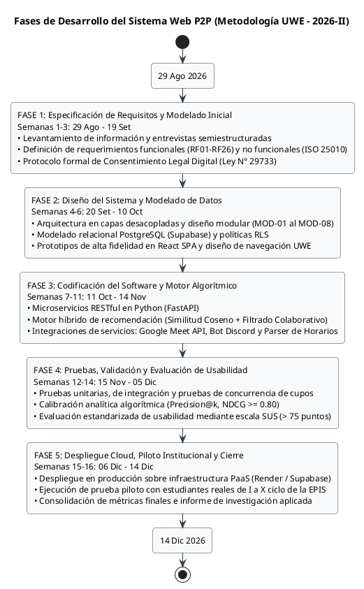

Fuente: Elaboración propia.

El enfoque metodológico UWE permite abordar de manera sistemática la complejidad propia de las aplicaciones web educativas y adaptativas. Al articular fases tempranas de requisitos con etapas avanzadas de modelado conceptual, navegacional y algorítmico, permite que la solución responda a las directrices pedagógicas de la universidad y a los estándares de rendimiento técnico requeridos.

---

## 6.1. Perfiles de Usuario

### Presentación de los Perfiles de Usuario
La operación eficiente y ordenada del Sistema Web P2P requiere la definición explícita de los perfiles de usuario y actores que interactúan en la plataforma. En el ecosistema formativo de la Escuela Profesional de Ingeniería de Sistemas (EPIS-UPT), los usuarios desempeñan roles diferenciados según su nivel de avance curricular, su investidura institucional o la naturaleza técnica de sus procesos. Con el fin de gobernar el acceso, garantizar el principio de mínimo privilegio y resguardar la integridad de los datos académicos bajo la Ley N° 29733, se establecen los perfiles de usuario humanos y los actores técnicos automatizados del sistema. A continuación, se presenta la matriz descriptiva de los perfiles identificados.

### Cuadro 6.1: Perfiles de Usuario y Actores del Sistema Web P2P

| Perfil / Actor | Tipo de Actor | Población Objetivo / Componente | Responsabilidades y Actividades Principales | Privilegios y Permisos en el Sistema |
| :--- | :--- | :--- | :--- | :--- |
| **Estudiante Mentoreado** | Humano (Actor Primario) | Estudiantes matriculados de I a IV ciclo con necesidades de reforzamiento académico en materias críticas (*Cálculo I/II, Algoritmos, Estructuras de Datos, POO*). | • Formalizar el consentimiento informado digital (Ley N° 29733).<br>• Declarar áreas de dificultad temática y disponibilidad horaria semanal.<br>• Consultar recomendaciones personalizadas (Top-k) y explorar el catálogo.<br>• Reservar cupos de mentoría y registrar solicitudes por demanda.<br>• Confirmar asistencia obligatoria hasta $T-24\text{ h}$ o desistir oportunamente.<br>• Responder encuestas de satisfacción dentro de las 24 horas posteriores. | • Acceso a vistas de catálogo y recomendador personal.<br>• Gestión de reservas propias (creación, confirmación, cancelación).<br>• Registro en banco de demandas formativas.<br>• Descarga de materiales de sesiones en las que participó.<br>• Diligenciamiento de encuestas de calidad asignadas. |
| **Estudiante Mentor** | Humano (Actor Primario) | Estudiantes de rendimiento sobresaliente de VII a X ciclo promovidos formalmente por la Dirección de Escuela. | • Configurar áreas de dominio curricular y agenda de disponibilidad.<br>• Programar y publicar ofertas de mentoría académica (temario, modalidad).<br>• Resolver la continuidad o cancelación ante alertas de quórum deficiente.<br>• Dictar sesiones y gestionar imprevistos por causa mayor debidamente justificada.<br>• Registrar bitácoras pedagógicas y reporte obligatorio de asistencia efectiva.<br>• Compartir recursos didácticos y monitorear insignias/reputación obtenida.<br>• Descargar certificados oficiales de horas para convalidación extracurricular. | • Creación, edición, reprogramación y anulación de ofertas propias.<br>• Aprovisionamiento guiado de infraestructura física o virtual.<br>• Diligenciamiento y cierre de bitácoras de sesión.<br>• Carga de materiales y enlaces académicos para sus alumnos.<br>• Visualización de métricas personales de reputación y descarga de certificados PDF auditados. |
| **Administrador Institucional** | Humano (Gobernanza y Supervisión) | Comité de Tutoría Docente, Coordinación Académica y Dirección de la EPIS-UPT. | • Auditar expedientes estudiantiles y aprobar la promoción a rol de Mentor.<br>• Mantener actualizado el catálogo de asignaturas críticas y temarios silábicos.<br>• Cargar cronogramas oficiales de aulas/laboratorios para su procesamiento por el parser interno.<br>• Registrar materias y mentorías en condición prioritaria por reprobación.<br>• Fiscalizar bitácoras pedagógicas, asistencias y computabilidad de horas.<br>• Parametrizar umbrales semestrales y emitir certificados oficiales PDF.<br>• Supervisar tableros analíticos de demanda, ausentismo y desempeño docente. | • Control de acceso total y gestión jerárquica de roles.<br>• Operaciones CRUD sobre asignaturas, temarios y prioridades académicas.<br>• Carga e indexación de archivos de horarios institucionales.<br>• Visado, observación y validación de horas de mentoría.<br>• Generación masiva/individual de certificados digitales.<br>• Acceso irrestricto al panel de analítica institucional. |
| **Servicio Cron / Backend** | Técnico (Proceso Desatendido) | Demonio de tareas programadas en el servidor backend FastAPI. | • Inspeccionar periódicamente la base de datos para identificar sesiones próximas.<br>• Despachar notificaciones automáticas y recordatorios a inscritos.<br>• Ejecutar el corte perentorio a $T-24\text{ h}$, revocar cupos no confirmados y computar quórum.<br>• Transicionar el estado de sesiones que no alcancen el 50% de aforo y alertar al Mentor. | • Ejecución en segundo plano con privilegios a nivel de servicio de sistema.<br>• Modificación automatizada de estados en tablas de reservas y sesiones.<br>• Invocación de microservicios de mensajería y correo SMTP institucional. |
| **Servicios Externos** | Técnico (Sistemas Colaboradores) | Plataformas de infraestructura de terceros: Google Meet API, Bot de Discord y Servidor de Correo SMTP UPT. | • Recibir solicitudes de aprovisionamiento de videollamadas y canales de voz.<br>• Retornar credenciales de acceso, enlaces dinámicos y confirmaciones de sala.<br>• Despachar notificaciones y códigos de verificación OTP mediante la infraestructura de correo de la UPT. | • Respuestas seguras a endpoints REST autenticados mediante tokens de servicio.<br>• Sin acceso directo a datos académicos sensibles de estudiantes. |

Fuente: Elaboración propia.

La estructuración de perfiles y actores formalizada en el cuadro anterior consolida una clara separación de responsabilidades operativas. Los mentoreados y mentores constituyen los agentes esenciales del aprendizaje colaborativo horizontal, disponiendo de herramientas diseñadas para agilizar la interacción académica sin fricciones burocráticas. Por su parte, el rol de Administrador centraliza la supervisión institucional y la salvaguarda de la calidad pedagógica, asegurando que la acumulación de horas responda a sesiones auditadas. Finalmente, la formalización del Servicio Cron y los Servicios Externos como actores técnicos permite que los procesos temporales y las integraciones de infraestructura operen con autonomía y alta disponibilidad.

---

## 6.2. Modelo Conceptual

### Presentación del Modelo Conceptual
El modelo conceptual formaliza las entidades fundamentales del dominio del problema, capturando sus atributos esenciales, estados operacionales y las relaciones semánticas que sustentan el ecosistema de mentorías académicas en la EPIS-UPT. Este modelo traduce las reglas de negocio institucionales (aforos máximos, consentimiento de privacidad bajo la Ley N° 29733, estados de reserva, bitácoras de cumplimiento y certificación) en una estructura ontológica coherente y extensible, orientada a guiar el posterior diseño de bases de datos relacionales en PostgreSQL (Supabase). A continuación, se presenta el diagrama de clases conceptuales del dominio.

### Diagrama 6.2: Diagrama de Clases Conceptuales del Dominio - Sistema Web P2P EPIS-UPT

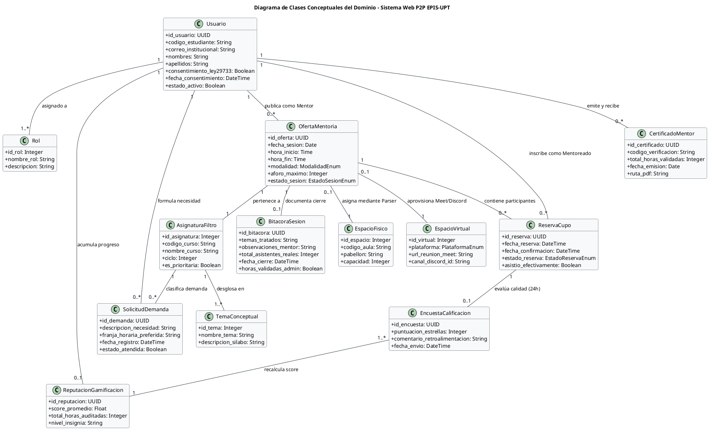

Fuente: Elaboración propia.

El análisis del modelo conceptual pone de relieve la integridad estructural del dominio académico de la EPIS-UPT:
1. **Desacoplamiento Espacial:** Se modelan de manera diferenciada las clases `EspacioFisico` y `EspacioVirtual`, permitiendo que la clase `OfertaMentoria` asocie dinámicamente un aula validada mediante el parser institucional o un enlace de teleconferencia provisto por APIs externas.
2. **Ciclo de Vida de Reservas y Quórum:** La entidad `ReservaCupo` encapsula estados explícitos (`PENDIENTE_CONFIRMACION`, `CONFIRMADA`, `CANCELADA_USUARIO`, `NO_CONFIRMADA`) que permiten gobernar con precisión matemática el cómputo del 50% de quórum previo al inicio de la sesión.
3. **Trazabilidad Pedagógica y de Certificación:** La conexión secuencial entre `OfertaMentoria`, `BitacoraSesion`, `EncuestaCalificacion`, `ReputacionGamificacion` y `CertificadoMentor` asegura que ningún crédito ni constancia de horas se emita sin el respaldo verificable de una bitácora auditada y la evaluación efectiva de los participantes.

---

### 6.2.1. Diagrama de Paquetes Arquitecturales

### Presentación del Diagrama de Paquetes
Para asegurar una arquitectura modular, extensible y de bajo acoplamiento conforme a las directrices de ingeniería web UWE, el software se organiza mediante una jerarquía de paquetes estructurada en capas arquitecturales. Esta organización delimita estrictamente la presentación interactiva en el cliente, la orquestación de servicios en el servidor FastAPI, el motor de recomendación matricial, la persistencia protegida bajo políticas de seguridad en Supabase y los adaptadores de integración con sistemas externos. A continuación, se presenta el diagrama de paquetes arquitecturales del sistema.

### Diagrama 6.3: Diagrama de Paquetes Arquitecturales y Subsistemas del Sistema Web P2P

```plantuml
@startuml
title Diagrama de Paquetes Arquitecturales del Sistema Web P2P EPIS-UPT
skinparam packageStyle rectangle
skinparam shadowing false
skinparam roundcorner 8
skinparam defaultFontName Arial
skinparam fontSize 11

skinparam package {
    BackgroundColor #F8F9FA
    BorderColor #2B3A42
}

package "Capa de Presentación (Frontend React SPA)" {
  [PKG-UI-01: Autenticación, Acceso & Consentimiento Legal]
  [PKG-UI-02: Perfil Académico & Disponibilidad Horaria]
  [PKG-UI-03: Catálogo, Búsqueda & Recomendaciones Top-k]
  [PKG-UI-04: Planificación, Ofertas & Aprovisionamiento]
  [PKG-UI-05: Reservas, Confirmaciones & Gestión de Quórum]
  [PKG-UI-06: Bitácoras de Sesión, Asistencia & Encuestas]
  [PKG-UI-07: Tablero de Insignias, Reputación & Certificados]
  [PKG-UI-08: Tablero Analítico & Auditoría de Dirección]
}

package "Capa de Negocio y Lógica de Dominio (FastAPI RESTful Backend)" {
  [PKG-SRV-01: Servicio de Seguridad, JWT & Roles]
  [PKG-SRV-02: Servicio Curricular & Temarios]
  [PKG-SRV-03: Motor Recomendador Inteligente (EdRecSys)]
  [PKG-SRV-04: Servicio de Agendamiento, Espacios & Parser Interno]
  [PKG-SRV-05: Servicio de Quórum, Cancelaciones & Cron]
  [PKG-SRV-06: Servicio de Trazabilidad, Bitácoras & Evaluación]
  [PKG-SRV-07: Servicio de Gamificación & Emisión de PDFs]
  [PKG-SRV-08: Servicio de Analítica Académica & Priorización]
}

package "Capa de Persistencia Segura y Almacenamiento (Supabase / PostgreSQL)" {
  database "PostgreSQL Relacional\n(Tablas Maestras, Índices & Vistas)" as DB
  [Módulo de Seguridad RLS\n(Row Level Security - Ley N° 29733)] as RLS
  [Bucket de Almacenamiento Cloud\n(Certificados PDF & Documentos)] as Storage
}

package "Capa de Integración y Servicios Externos" {
  [Adaptador SMTP Institucional\n(Emisor OTP @upt.pe)] as SMTP
  [Adaptador Google Workspace\n(Google Meet API)] as Meet
  [Adaptador Discord Bot\n(Gestión Canales Supervisados)] as Discord
}

' Consumo de Presentación hacia Servicios de Negocio
[PKG-UI-01] --> [PKG-SRV-01] : JSON / REST
[PKG-UI-02] --> [PKG-SRV-02] : JSON / REST
[PKG-UI-03] --> [PKG-SRV-03] : Inferencia Top-k
[PKG-UI-04] --> [PKG-SRV-04] : JSON / REST
[PKG-UI-05] --> [PKG-SRV-05] : JSON / REST
[PKG-UI-06] --> [PKG-SRV-06] : JSON / REST
[PKG-UI-07] --> [PKG-SRV-07] : JSON / REST
[PKG-UI-08] --> [PKG-SRV-08] : JSON / REST

' Interacción entre Servicios y Persistencia
[PKG-SRV-01] --> RLS
[PKG-SRV-02] --> DB
[PKG-SRV-03] --> DB
[PKG-SRV-04] --> DB : Persistencia de aulas libres
[PKG-SRV-05] --> DB
[PKG-SRV-06] --> DB
[PKG-SRV-07] --> Storage
[PKG-SRV-07] --> DB
[PKG-SRV-08] --> DB
RLS --> DB : Aislamiento granular

' Interacción con Adaptadores Externos
[PKG-SRV-01] --> SMTP : Envío de códigos OTP
[PKG-SRV-04] --> Meet : Generación dinámica de salas
[PKG-SRV-04] --> Discord : Aprovisionamiento de canales
@enduml
```

Fuente: Elaboración propia.

El diagrama de paquetes arquitecturales ratifica una estructuración modular que contribuye a la mantenibilidad (RNF09), la seguridad de datos (RNF02) y la interoperabilidad (RNF10) de la solución. Cada paquete de interfaz web se comunica con su servicio de backend correspondiente a través de contratos RESTful fuertemente tipados. Asimismo, el acceso a la persistencia se encuentra protegido por políticas RLS nativas en la base de datos, y los subsistemas de integración externa se encapsulan en adaptadores independientes, desacoplando la lógica de negocio frente a contingencias en plataformas de terceros.

## 6.2.2. Diagramas de Casos de Uso

### Presentación de los Diagramas de Casos de Uso
El modelo de casos de uso constituye el pilar fundamental del análisis orientado a objetos bajo la metodología UWE, formalizando los límites del sistema web, las interacciones funcionales de los actores humanos y técnicos, y la descomposición del alcance en componentes altamente cohesivos. Para proporcionar una perspectiva integral y a la vez granular del comportamiento del software en la EPIS-UPT, la presente sección se estructura en dos niveles: en primer lugar, el **Diagrama General Consolidado**, que articula la totalidad de los 24 casos de uso canónicos (CUS01 al CUS24) y sus dependencias formales; y en segundo lugar, una serie de **ocho diagramas modulares especializados** correspondientes a cada uno de los subsistemas arquitecturales (MOD-01 al MOD-08), detallando las asociaciones precisas entre actores, casos de uso y flujos de extensión. A continuación, se presenta la especificación visual y descriptiva de los casos de uso.

### Diagrama 6.4: Diagrama de Casos de Uso General Consolidado del Sistema Web P2P (CUS01 al CUS24)

```plantuml
@startuml
title Diagrama de Casos de Uso General Consolidado (CUS01 - CUS24)\nSistema Web P2P con Recomendador para Mentorías Académicas - EPIS UPT

left to right direction
skinparam packageStyle rectangle
skinparam shadowing false
skinparam roundcorner 8
skinparam defaultFontName Arial
skinparam fontSize 11

skinparam usecase {
    BackgroundColor #F8F9FA
    BorderColor #2B3A42
    ArrowColor #2B3A42
    FontSize 11
}

skinparam actor {
    BackgroundColor #E9ECEF
    BorderColor #1D2D44
}

' ===================================================
' ACTORES DEL SISTEMA
' ===================================================
actor "Mentoreado\n(I - IV Ciclo)" as Mentoreado
actor "Mentor\n(VII - X Ciclo)" as Mentor
actor "Administrador\n(Tutoría / Dirección)" as Admin
actor "Servicio Cron / Backend" as SysCron <<Sistema>>
actor "Servicios Externos\n(Meet, Discord)" as SysExt <<Sistema Externo>>

' ===================================================
' LÍMITE DEL SISTEMA Y MÓDULOS
' ===================================================
rectangle "Sistema Web de Mentorías P2P EPIS-UPT" {

  package "MOD-01: Seguridad, Autenticación y Gobernanza" {
    usecase "CUS01: Iniciar Sesión Institucional con 2FA" as UC01
    usecase "Aceptar Consentimiento para el\nTratamiento de Datos (Ley N° 29733)" as UC_Consent
    usecase "CUS10: Gestionar Asignación de Roles de Usuario" as UC10
  }

  package "MOD-02: Gestión Curricular y Perfiles Académicos" {
    usecase "CUS15: Configurar Perfil y Disponibilidad Horaria" as UC15
    usecase "CUS21: Gestionar Catálogo Curricular y Temarios" as UC21
  }

  package "MOD-03: Motor de Recomendación Inteligente (EdRecSys)" {
    usecase "CUS02: Consultar Recomendaciones Personalizadas Top-k" as UC02
    usecase "CUS03: Registrar Solicitud Temática por Demanda" as UC03
  }

  package "MOD-04: Planificación, Espacios y Agendamiento" {
    usecase "CUS06: Publicar Oferta de Mentoría" as UC06
    usecase "CUS11: Cargar Cronograma de Horarios Oficiales" as UC11
    usecase "CUS18: Modificar o Cancelar Oferta por Imprevisto" as UC18
  }

  package "MOD-05: Quórum, Confirmación y Cancelaciones" {
    usecase "CUS04: Reservar Cupo de Mentoría" as UC04
    usecase "CUS24: Confirmar Asistencia a Mentoría" as UC24
    usecase "CUS07: Gestionar Sesión ante Quórum Insuficiente" as UC07
    usecase "CUS17: Cancelar Reserva de Cupo (Desistimiento)" as UC17
    usecase "CUS23: Ejecutar Alertas y Evaluación Automática de Quórum" as UC23
  }

  package "MOD-06: Trazabilidad, Bitácoras y Evaluación" {
    usecase "CUS08: Registrar Bitácora y Control de Asistencia" as UC08
    usecase "CUS05: Responder Encuesta de Calidad Post-Mentoría" as UC05
    usecase "CUS19: Consultar Historial de Sesiones y Asistencia" as UC19
    usecase "CUS20: Gestionar Recursos Académicos de la Mentoría" as UC20
  }

  package "MOD-07: Gamificación, Reputación y Certificación" {
    usecase "CUS16: Consultar Tablero de Insignias y Reputación" as UC16
    usecase "CUS09: Descargar Certificado de Horas de Mentoría" as UC09
    usecase "CUS13: Parametrizar y Emitir Certificados" as UC13
  }

  package "MOD-08: Supervisión y Analítica Institucional" {
    usecase "CUS12: Destacar Mentorías Prioritarias" as UC12
    usecase "CUS14: Visualizar Tablero de Analíticas Institucionales" as UC14
    usecase "CUS22: Auditar Bitácoras, Asistencia y Horas de Mentoría" as UC22
  }
}

' ===================================================
' RELACIONES DE INCLUSIÓN Y EXTENSIÓN
' ===================================================
UC01 <.. UC_Consent : <<extend>>\n(Primer Acceso)

' ===================================================
' ASOCIACIONES: SERVICIOS EXTERNOS Y JOBS
' ===================================================
SysExt -- UC06
SysCron -- UC23

' ===================================================
' ASOCIACIONES: ESTUDIANTE MENTOREADO
' ===================================================
Mentoreado -- UC01
Mentoreado -- UC15
Mentoreado -- UC02
Mentoreado -- UC03
Mentoreado -- UC04
Mentoreado -- UC24
Mentoreado -- UC17
Mentoreado -- UC05
Mentoreado -- UC19
Mentoreado -- UC20

' ===================================================
' ASOCIACIONES: ESTUDIANTE MENTOR
' ===================================================
Mentor -- UC01
Mentor -- UC15
Mentor -- UC06
Mentor -- UC18
Mentor -- UC07
Mentor -- UC08
Mentor -- UC16
Mentor -- UC09
Mentor -- UC19
Mentor -- UC20

' ===================================================
' ASOCIACIONES: ADMINISTRADOR (TUTORÍA / DIRECCIÓN)
' ===================================================
Admin -- UC01
Admin -- UC10
Admin -- UC21
Admin -- UC11
Admin -- UC12
Admin -- UC13
Admin -- UC14
Admin -- UC22
@enduml
```

Fuente: Elaboración propia.

El Diagrama General Consolidado sintetiza de forma integral el ecosistema de interacciones del software. Refleja cómo la seguridad y gobernanza (MOD-01) condicionan el ingreso al sistema mediante 2FA y la extensión de consentimiento informado digital. Asimismo, demuestra la independencia entre el ciclo de búsqueda y agendamiento (MOD-02, MOD-03, MOD-04), el ciclo crítico de control de quórum y asistencia a 24 horas (MOD-05), y los procesos posteriores de evaluación pedagógica, reconocimiento al mentor y fiscalización académica (MOD-06, MOD-07, MOD-08).

---

### Diagrama 6.5: Diagrama de Casos de Uso - MOD-01: Seguridad, Autenticación y Gobernanza

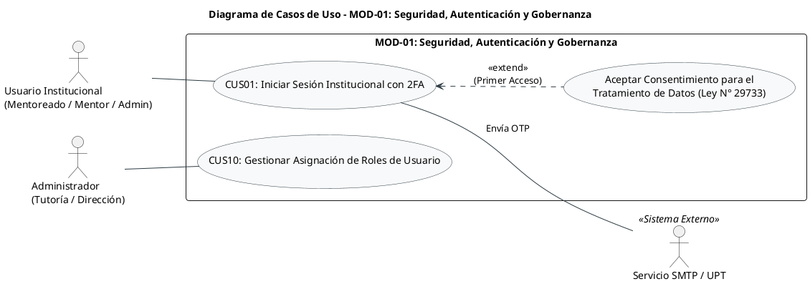

Fuente: Elaboración propia.

El módulo MOD-01 gobierna la puerta de entrada a la plataforma. Establece que el acceso al sistema exige la validación de identidad mediante correo institucional `@upt.pe` y código OTP temporal remitido por SMTP. La formalización del consentimiento legal bajo la Ley N° 29733 se desacopla como un flujo de extensión condicional exclusivo para el primer ingreso. Por su parte, la administración jerárquica de roles (CUS10) asegura que la promoción a Mentor responda a una evaluación objetiva del rendimiento académico del estudiante en cursos avanzados.

---

### Diagrama 6.6: Diagrama de Casos de Uso - MOD-02: Gestión Curricular y Perfiles Académicos

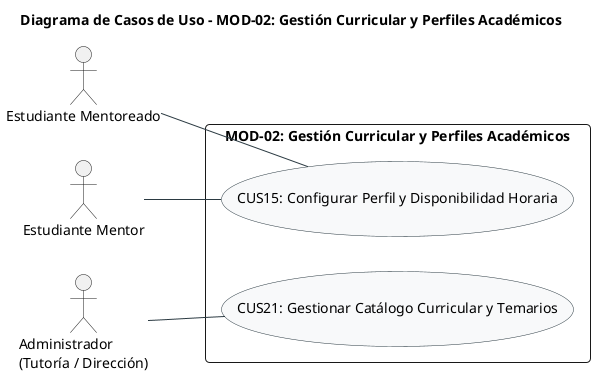

Fuente: Elaboración propia.

El módulo MOD-02 gestiona la información formativa indispensable para el funcionamiento algorítmico del sistema. CUS15 permite a mentoreados y mentores actualizar semanalmente su disponibilidad y sus preferencias temáticas en materias críticas. Complementariamente, CUS21 otorga a las autoridades de la EPIS-UPT el control centralizado del catálogo de cursos filtro y la taxonomía de unidades silábicas, asegurando que las ofertas y solicitudes respondan a la malla curricular oficial.

---

### Diagrama 6.7: Diagrama de Casos de Uso - MOD-03: Motor de Recomendación Inteligente (EdRecSys)

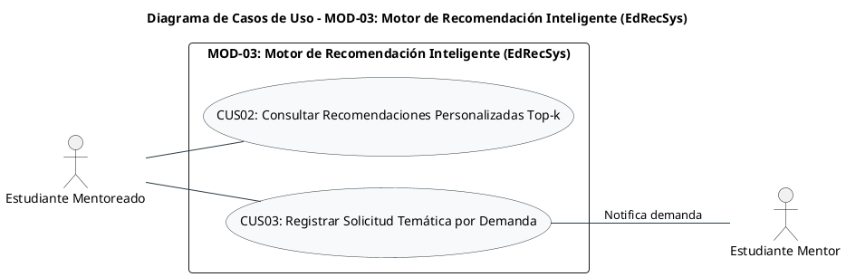

Fuente: Elaboración propia.

El subsistema MOD-03 materializa el valor central del proyecto al conectar las necesidades de los alumnos con el talento disponible. Mediante CUS02, el mentoreado obtiene un ranking adaptativo Top-k de mentores idóneos (cuyo cálculo de similitud coseno y filtrado colaborativo opera como lógica interna del backend). Cuando no existen ofertas programadas para un tema específico, CUS03 habilita la captura de la demanda formativa, alertando a los mentores para que formulen talleres dirigidos.

---

### Diagrama 6.8: Diagrama de Casos de Uso - MOD-04: Planificación, Espacios y Agendamiento

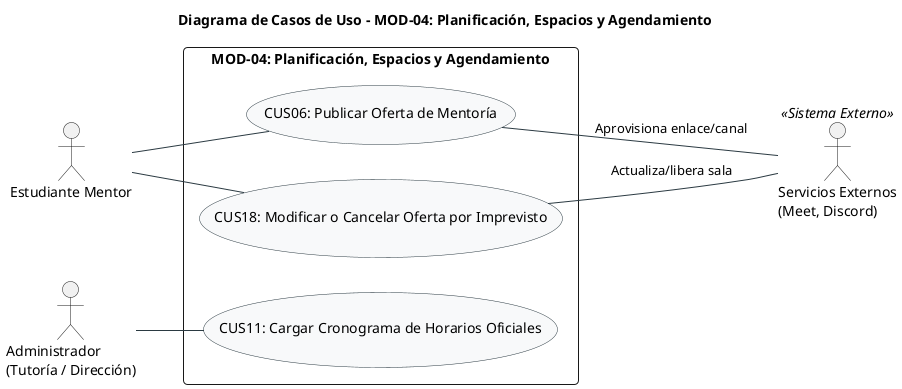

Fuente: Elaboración propia.

El módulo MOD-04 orquesta la logística de infraestructura física y virtual. Permite al mentor crear ofertas (CUS06) y gestionar eventualidades por causa mayor antes del inicio de la sesión (CUS18). Para sesiones presenciales, el sistema valida aulas libres contra la base de datos alimentada por el Administrador mediante el procesamiento de cronogramas en PDF/Excel (CUS11, operado mediante un parser interno). Para sesiones virtuales, la plataforma se integra con Google Meet y Discord para el aprovisionamiento automatizado de salas.

---

### Diagrama 6.9: Diagrama de Casos de Uso - MOD-05: Quórum, Confirmación y Cancelaciones

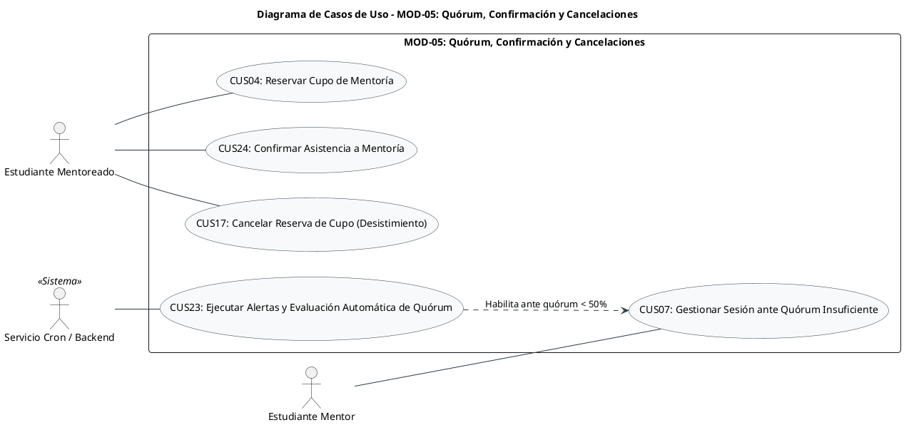

Fuente: Elaboración propia.

El módulo MOD-05 implementa el protocolo crítico de confirmación temporal y preservación de aforos. Separa estrictamente la inscripción inicial (CUS04) de la confirmación anticipada (CUS24, habilitada hasta $T-24\text{ h}$) y el desistimiento voluntario (CUS17). Al cumplirse exactamente el corte de 24 horas, el demonio cron desatendido (CUS23) computa el quórum mínimo (50%); si el porcentaje es deficiente, notifica de inmediato al Mentor para que ejerza su potestad de decisión humana (CUS07), evitando cancelaciones arbitrarias del sistema.

---

### Diagrama 6.10: Diagrama de Casos de Uso - MOD-06: Trazabilidad, Bitácoras y Evaluación

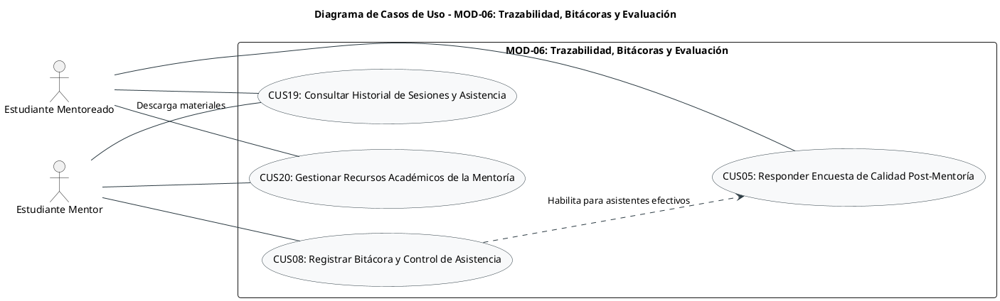

Fuente: Elaboración propia.

El módulo MOD-06 asegura el registro fehaciente de la actividad pedagógica. El mentor diligencia la bitácora y marca las asistencias reales en CUS08, lo cual transiciona la sesión a completada y abre la ventana perentoria de 24 horas para que los estudiantes asistentes completen la encuesta de calidad (CUS05). Adicionalmente, CUS19 y CUS20 permiten a mentoreados y mentores revisar su récord histórico y acceder a los recursos didácticos compartidos (diapositivas, guías y repositorios de código).

---

### Diagrama 6.11: Diagrama de Casos de Uso - MOD-07: Gamificación, Reputación y Certificación

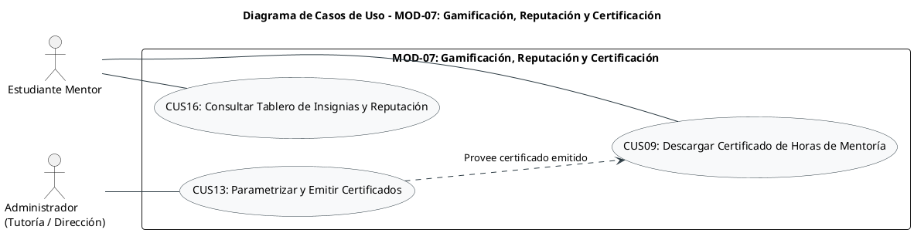

Fuente: Elaboración propia.

El módulo MOD-07 regula los mecanismos de reconocimiento formal y estímulo para los mentores. A través de CUS16, el mentor monitorea su progreso en insignias y su score docente. En CUS13, la Dirección de Escuela parametriza los umbrales mínimos de horas semestrales requeridos y autoriza la emisión de constancias con código correlativo institucional y hash SHA-256 de validación. Finalmente, CUS09 faculta al mentor calificado a descargar su certificado en formato PDF para la convalidación de créditos extracurriculares.

---

### Diagrama 6.12: Diagrama de Casos de Uso - MOD-08: Supervisión y Analítica Institucional

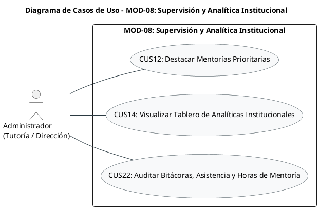

Fuente: Elaboración propia.

El módulo MOD-08 proporciona a las autoridades académicas herramientas de analítica y fiscalización docente. CUS12 permite asignar prioridad a asignaturas críticas para darles realce algorítmico y visual en el catálogo. CUS14 consolida indicadores agregados de demanda insatisfecha, ausentismo y satisfacción docente preservando la privacidad estudiantil bajo la Ley N° 29733. Por último, CUS22 provee la interfaz de auditoría para visar o dejar en observación las bitácoras pedagógicas y horas declaradas previo a su certificación oficial.

---

## 6.2.3. Escenarios de Casos de Uso (Narrativas)

### Presentación de los Escenarios de Casos de Uso
La presente sección formaliza los escenarios detallados de los 24 casos de uso canónicos del Sistema Web P2P (`CUS01` al `CUS24`). Conforme a las directrices metodológicas de ingeniería de requerimientos de software y a las reglas estándar de documentación del proyecto, las narrativas se encuentran estructuradas y organizadas por módulo funcional (`MOD-01` al `MOD-08`) y, dentro de cada módulo, en estricta coherencia con la dependencia operativa y lógica de los procesos de negocio. Esta articulación sistemática garantiza la trazabilidad bidireccional directa con la Identificación de Módulos (Sección 5.1), los Requerimientos Funcionales (Sección 5.3), la Matriz de Trazabilidad Maestra (Sección 5.5) y los diagramas de casos de uso modulares de la Sección 6.2.2.

Cada caso de uso canónico se describe exhaustivamente a nivel granular mediante cuatro tablas estandarizadas: (1) Ficha Técnica Descriptiva de 10 atributos de gobernanza; (2) Flujo Principal estructurado paso a paso en acciones del actor y respuestas reactivas del sistema; (3) Flujos Alternativos que resuelven variaciones operativas y bifurcaciones del proceso; y (4) Eventos de Excepción que salvaguardan la integridad transaccional, los cortes normativos y la seguridad ante contingencias.

### MOD-01: Seguridad, Autenticación y Gobernanza


#### CUS01 - Iniciar sesión institucional con 2FA

| Campo | Descripción |
|---|---|
| **Código** | CUS01 |
| **Nombre** | Iniciar sesión institucional con 2FA |
| **Tipo** | Primario, esencial |
| **Requerimiento asociado** | RF01 (Autenticación institucional multifactor 2FA), RF02 (Formalización del consentimiento informado digital); RN-01, RN-02 |
| **Actor principal** | Usuario Institucional (*Estudiante Mentoreado, Estudiante Mentor o Administrador*) |
| **Actores secundarios** | Servicio de Correo SMTP / UPT (*Emisor OTP institucional*) |
| **Módulo relacionado** | MOD-01: Seguridad, Autenticación y Gobernanza |
| **Propósito** | Autenticar la identidad de los integrantes de la comunidad universitaria mediante credenciales oficiales del dominio `@upt.pe` y un código OTP temporal, formalizando el consentimiento digital obligatorio para el tratamiento de datos académicos bajo la Ley N° 29733 en el primer acceso. |
| **Descripción** | El caso de uso inicia cuando el usuario accede al portal web e introduce su cuenta de correo institucional. El sistema valida la pertenencia al dominio universitario oficial (`@upt.pe`) y genera un código de verificación temporal de un solo uso (OTP) de 6 dígitos numéricos con caducidad estricta de 5 minutos, despachándolo a través del servidor SMTP universitario. El usuario introduce el código recibido. Si el código es correcto y vigente, el sistema verifica si el usuario cuenta con registro previo de consentimiento informado digital; de no existir (primer inicio de sesión), despliega de manera obligatoria los términos de tratamiento de datos personales conforme a la Ley N° 29733. Una vez aceptado el consentimiento, el sistema expide un JSON Web Token (JWT) firmado criptográficamente con vigencia de 8 horas y redirige al panel de navegación correspondiente a su rol. |
| **Resultado esperado** | Sesión de usuario autenticada e inicializada mediante token JWT seguro, consentimiento legal registrado formalmente con marca de tiempo, y acceso concedido al panel principal adaptado al rol del participante. |

##### Flujo Principal

| N.° | Acción del actor | Respuesta del sistema |
|---:|---|---|
| 1 | El usuario accede a la plataforma web e ingresa su dirección de correo electrónico institucional con dominio `@upt.pe`. | Valida el formato del correo y que pertenezca al dominio oficial universitario `@upt.pe`. Comprueba que la cuenta no se encuentre inactiva o suspendida. |
| 2 | El usuario solicita el envío del código de acceso temporal. | Genera un código OTP criptográficamente aleatorio de 6 dígitos, establece un tiempo de expiración de 5 minutos e invoca al servicio SMTP institucional para enviarlo al buzón del usuario. Muestra la interfaz de validación con contador regresivo. |
| 3 | El usuario revisa su bandeja de entrada universitaria, copia el código OTP de 6 dígitos y lo introduce en el formulario web. | Valida la exactitud del código OTP y que no haya expirado. Comprueba si el usuario ya ha suscrito el consentimiento legal bajo la Ley N° 29733 en la base de datos. |
| 4 | En caso de primer acceso institucional, el usuario lee las cláusulas de privacidad y marca la casilla de consentimiento expreso para el tratamiento de su información académica. | Persiste el registro legal de consentimiento vinculando el UUID del usuario, dirección IP, fecha y hora exacta. Genera el token de sesión JWT con rol asociado. |
| 5 | El usuario confirma el ingreso a la plataforma. | Redirige al panel principal (Dashboard) configurado con las opciones y permisos específicos para su rol (*Mentoreado, Mentor o Administrador*). |

##### Flujos Alternativos

| Código | Situación | Acción del actor | Respuesta del sistema |
|---|---|---|---|
| FA01 | Acceso recurrente con consentimiento digital ya formalizado | En el paso 3, el usuario introduce satisfactoriamente el código OTP y el sistema verifica que ya existe consentimiento registrado. | Omite el paso 4 y genera directamente el token de sesión JWT, redirigiendo al usuario al panel de su rol. |
| FA02 | Solicitud de reenvío de código temporal por no recepción o caducidad | El usuario no recibe el código en su buzón tras 60 segundos o el contador de 5 minutos expira; presiona la opción «Reenviar código OTP». | Invalida inmediatamente el código OTP previo, genera una nueva clave temporal de 6 dígitos, la despacha vía SMTP y reinicia el temporizador de 5 minutos en pantalla. |

##### Eventos de Excepción

| Código | Evento de excepción | Respuesta del sistema |
|---|---|---|
| E01 | Dominio de correo no institucional | El sistema detecta un dominio diferente a `@upt.pe` (ej. `@gmail.com`), bloquea la solicitud y muestra el mensaje de error: *«Acceso restringido: Ingrese exclusivamente con su cuenta institucional de la Universidad Privada de Tacna»*. |
| E02 | Cuenta institucional no habilitada o dada de baja | El sistema verifica que el usuario figura como suspendido en el padrón; bloquea el envío de OTP y notifica: *«Cuenta institucional no autorizada. Comuníquese con la Dirección de Escuela o Comité de Tutoría EPIS»*. |
| E03 | Código de verificación OTP incorrecto | El código introducido no coincide con el emitido; el sistema rechaza el acceso, descuenta el intento permitido y muestra: *«Código de verificación incorrecto. Verifique el código remitido a su correo»*. |
| E04 | Código de verificación OTP expirado | El usuario introduce el código pasados los 5 minutos de vigencia reglamentaria (RN-01); el sistema rechaza el código y muestra: *«El código OTP ha expirado. Solicite un nuevo código de acceso»*. |
| E05 | Límite de intentos fallidos alcanzado (Protección contra fuerza bruta) | Se registran múltiples intentos erróneos consecutivos; el sistema bloquea temporalmente las solicitudes para dicha cuenta como medida de seguridad e inserta una traza en la bitácora de auditoría. |
| E06 | Rechazo de la política de privacidad (Ley N° 29733) | En el primer acceso, el usuario desmarca o rechaza los términos legales; el sistema notifica que la aceptación es indispensable para operar en la red de mentorías, destruye la sesión temporal e impide el ingreso a la plataforma (RN-02). |


---


#### CUS10 - Gestionar asignación de roles de usuario

| Campo | Descripción |
|---|---|
| **Código** | CUS10 |
| **Nombre** | Gestionar asignación de roles de usuario |
| **Tipo** | Soporte, administrativo |
| **Requerimiento asociado** | RF03 (Gestión y asignación administrativa de roles de usuario); RN-03 |
| **Actor principal** | Administrador Institucional (*Comité de Tutoría / Dirección EPIS*) |
| **Actores secundarios** | Estudiantes evaluados (*Notificados vía correo institucional*) |
| **Módulo relacionado** | MOD-01: Seguridad, Autenticación y Gobernanza |
| **Propósito** | Evaluar el expediente curricular de los estudiantes de ciclos formativos avanzados (VII a X ciclo) y promover formalmente su rol de Mentoreado al rol de Mentor, así como gestionar la suspensión preventiva o revocación de privilegios ante incumplimientos normativos. |
| **Descripción** | El caso de uso inicia cuando el Administrador accede al módulo de gobernanza institucional para revisar las solicitudes de postulación o el padrón de estudiantes de ciclos avanzados. El sistema despliega el listado de candidatos junto con su ciclo lectivo, rendimiento en asignaturas filtro (*Cálculo, Algoritmos, Estructuras de Datos, POO*) y antecedentes de conducta. El administrador evalúa los criterios de mérito establecidos en RN-03; si el estudiante cumple los prerrequisitos, autoriza la elevación de privilegios a Mentor, actualizando el rol en la base de datos (con efecto inmediato bajo políticas RLS) y despachando un correo institucional de felicitación y acreditación. Asimismo, este caso de uso faculta al administrador a suspender temporal o definitivamente las funciones de un mentor si este incurre en inasistencias injustificadas reiteradas o a solicitud formal del propio estudiante. |
| **Resultado esperado** | Rol de usuario modificado en el sistema de base de datos relacional, permisos de publicación y gestión habilitados en la cuenta del estudiante y constancia de auditoría administrativa registrada. |

##### Flujo Principal

| N.° | Acción del actor | Respuesta del sistema |
|---:|---|---|
| 1 | El Administrador accede a la sección de «Gestión de Usuarios y Roles» en el panel directivo. | Despliega la tabla consolidada de estudiantes registrados con filtros por ciclo (I a X), rol actual, estado y cursos aprobados. |
| 2 | El Administrador selecciona a un estudiante postulante perteneciente a los ciclos VII a X y solicita visualizar su expediente. | Presenta el consolidado académico del alumno: ciclo de matrícula, asignaturas críticas aprobadas con su calificación final y estado de consentimiento legal. |
| 3 | El Administrador verifica el cumplimiento de las calificaciones mínimas institucionales en las materias filtro y selecciona la opción «Promover a Mentor». | Solicita confirmación de la elevación de rol, permitiendo ingresar observaciones académicas o la resolución de tutoría de respaldo. |
| 4 | El Administrador confirma la operación de asignación. | Actualiza la tabla relacional de roles en PostgreSQL (asignando el rol Mentor), refresca las políticas RLS del usuario, registra el evento en la bitácora de auditoría y remite un correo institucional de notificación al estudiante. |
| 5 | El sistema confirma la promoción satisfactoria. | Muestra mensaje de éxito en pantalla y actualiza el distintivo visual del estudiante en la tabla directiva. |

##### Flujos Alternativos

| Código | Situación | Acción del actor | Respuesta del sistema |
|---|---|---|---|
| FA01 | Suspensión preventiva temporal del rol de Mentor | El Administrador detecta incumplimientos en bitácoras o ausencias reiteradas del tutor; selecciona «Suspender temporalmente rol». | Congela la capacidad de publicar nuevas ofertas en el sistema, transiciona el estado del mentor a `SUSPENDIDO_TEMPORAL` y remite una notificación preventiva al correo del implicado. |
| FA02 | Revocación voluntaria del rol a solicitud del estudiante | El mentor solicita formalmente su baja temporal de la red por motivos de sobrecarga laboral o de tesis; el Administrador selecciona «Revertir a Mentoreado». | Modifica el rol a Mentoreado básico, cancela de forma controlada las ofertas futuras sin inscritos y remite confirmación de la revocación al alumno. |

##### Eventos de Excepción

| Código | Evento de excepción | Respuesta del sistema |
|---|---|---|
| E01 | Postulante no matriculado en ciclos superiores | El Administrador intenta promover a un alumno que no pertenece a los ciclos VII al X; el sistema bloquea la acción y alerta: *«Regla RN-03 no cumplida: El estudiante debe encontrarse matriculado entre el VII y X ciclo académico»*. |
| E02 | Asignatura filtro no aprobada o desaprobada | El estudiante registra notas desaprobatorias o pendientes en la asignatura que pretende asesorar; el sistema deshabilita el botón de asignación y muestra: *«No cumple mérito académico: Materia filtro no aprobada con nota satisfactoria»*. |
| E03 | Falla en el servicio de notificación por correo | El rol se actualiza en base de datos pero el microservicio SMTP falla; el sistema concluye la transacción de rol, alerta al Administrador del error de notificación y encola el correo para reintento automático. |


---


### MOD-02: Gestión Curricular y Perfiles Académicos


#### CUS21 - Gestionar catálogo curricular y temarios

| Campo | Descripción |
|---|---|
| **Código** | CUS21 |
| **Nombre** | Gestionar catálogo curricular y temarios |
| **Tipo** | Soporte, administrativo |
| **Requerimiento asociado** | RF05 (Gestión del catálogo de asignaturas críticas y temarios silábicos) |
| **Actor principal** | Administrador Institucional (*Comité de Tutoría / Dirección EPIS*) |
| **Actores secundarios** | Ninguno |
| **Módulo relacionado** | MOD-02: Gestión Curricular y Perfiles Académicos |
| **Propósito** | Administrar la taxonomía institucional de asignaturas formativas críticas y el desglose jerárquico de sus contenidos silábicos oficiales, garantizando una base curricular canónica para la publicación de ofertas y el motor de recomendación. |
| **Descripción** | El caso de uso inicia cuando el Administrador ingresa al módulo de gestión curricular para actualizar la oferta temática de la carrera de Ingeniería de Sistemas. El sistema presenta el árbol de materias formativas de I a IV ciclo (*Cálculo I, Cálculo II, Algoritmos y Estructuras de Datos, Programación Orientada a Objetos*). El administrador puede registrar nuevas asignaturas filtro, modificar códigos o créditos oficiales, y gestionar el árbol de temas silábicos (unidades de aprendizaje y subtemas conceptuales específicos como *Ecuaciones Diferenciales, Punteros en C++, Herencia y Polimorfismo, Recursividad*). Los cambios realizados actualizan de manera instantánea las listas desplegables utilizadas por los mentores al publicar ofertas y por los mentoreados al registrar demandas o consultar recomendaciones. |
| **Resultado esperado** | Catálogo de materias y taxonomía de temas silábicos sincronizados y normalizados en la base de datos de la EPIS-UPT. |

##### Flujo Principal

| N.° | Acción del actor | Respuesta del sistema |
|---:|---|---|
| 1 | El Administrador accede a la opción «Catálogo Curricular y Sílabos» en el panel de control. | Despliega la estructura jerárquica de asignaturas críticas organizadas por ciclo lectivo, mostrando el número de temas silábicos asociados a cada una. |
| 2 | El Administrador selecciona una asignatura formativa para gestionar su contenido pedagógico. | Expande la lista de unidades didácticas y temas conceptuales vigentes, indicando su estado activo o inactivo. |
| 3 | El Administrador pulsa «Agregar Contenido Temático» e ingresa el nombre de la unidad, el tema conceptual y palabras clave de referencia. | Valida que el nombre del tema no se encuentre duplicado en la misma asignatura y que las palabras clave cumplan el formato estructurado. |
| 4 | El Administrador confirma el registro del nuevo contenido silábico. | Inserta el registro en la tabla `TemaConceptual` vinculada a la `AsignaturaFiltro`, actualiza el árbol de contenidos en pantalla y registra la traza de auditoría. |
| 5 | El sistema confirma la operación satisfactoria. | Muestra mensaje: *«Tema silábico registrado exitosamente en el catálogo oficial de la EPIS-UPT»*. |

##### Flujos Alternativos

| Código | Situación | Acción del actor | Respuesta del sistema |
|---|---|---|---|
| FA01 | Edición o actualización de la denominación silábica de un tema | El Administrador requiere corregir el nombre o descripción de un tema; presiona «Modificar tema», ajusta el texto y confirma. | Actualiza la información en la base de datos sin alterar el identificador único del tema, preservando la trazabilidad histórica de sesiones previas. |
| FA02 | Desactivación lógica de temas obsoletos por cambio de sílabo | Un tema ya no forma parte del plan de estudios vigente; el Administrador cambia su estado a `INACTIVO`. | Oculta el tema de las nuevas listas de publicación y demanda, pero mantiene intacto el historial en bitácoras antiguas. |

##### Eventos de Excepción

| Código | Evento de excepción | Respuesta del sistema |
|---|---|---|
| E01 | Intento de eliminación física de tema con dependencias históricas | El Administrador intenta borrar definitivamente un tema que ya posee sesiones dictadas o bitácoras cerradas; el sistema rechaza la eliminación física por integridad referencial e instruye: *«No se puede eliminar: el tema registra historial pedagógico. Utilice la desactivación lógica»*. |
| E02 | Denominación temática duplicada | El Administrador ingresa un nombre idéntico a un tema ya existente dentro de la misma asignatura; el sistema bloquea el guardado y resalta: *«El tema conceptual ya se encuentra registrado en esta asignatura»*. |


---


#### CUS15 - Configurar perfil y disponibilidad horaria

| Campo | Descripción |
|---|---|
| **Código** | CUS15 |
| **Nombre** | Configurar perfil y disponibilidad horaria |
| **Tipo** | Primario, configuración |
| **Requerimiento asociado** | RF04 (Configuración de perfil formativo y matriz de disponibilidad horaria); RN-03 |
| **Actor principal** | Estudiante Mentoreado / Estudiante Mentor |
| **Actores secundarios** | Ninguno |
| **Módulo relacionado** | MOD-02: Gestión Curricular y Perfiles Académicos |
| **Propósito** | Permitir a los usuarios configurar sus áreas temáticas de interés o dominio y declarar interactivamente su agenda semanal de disponibilidad horaria para alimentar el motor de recomendación híbrido (*EdRecSys*). |
| **Descripción** | El caso de uso inicia cuando el estudiante accede al apartado de «Mi Perfil Académico». La interfaz presenta una matriz gráfica semanal interactiva organizada de lunes a sábado en franjas horarias de 60 minutos (de 07:00 a 21:00 horas). Si el usuario es Mentoreado, marca las asignaturas críticas donde presenta mayores vacíos conceptuales y selecciona las franjas horarias en las que tiene tiempo libre para recibir asesoría. Si el usuario es Mentor, marca las asignaturas en las que cuenta con solvencia y declara las franjas semanales en las que se compromete a impartir talleres, pudiendo además ingresar enlaces a sus repositorios de GitHub o LinkedIn. Al guardar los cambios, el sistema valida que no existan conflictos de formato, persiste la disponibilidad en la base de datos y actualiza los vectores de compatibilidad horaria utilizados por el recomendador. |
| **Resultado esperado** | Matriz semanal de disponibilidad horaria y perfil formativo persistidos en PostgreSQL, quedando inmediatamente disponibles como insumo vectorial para el motor de recomendación. |

##### Flujo Principal

| N.° | Acción del actor | Respuesta del sistema |
|---:|---|---|
| 1 | El usuario (*Mentoreado o Mentor*) ingresa a la pestaña «Perfil & Agenda» en la plataforma. | Recupera el perfil actual del usuario y renderiza la matriz semanal gráfica (días vs. horas) junto con el catálogo de materias críticas. |
| 2 | El usuario actualiza sus preferencias académicas: el mentoreado indica sus materias de refuerzo deseadas; el mentor indica sus áreas de especialidad aprobadas. | Valida que las asignaturas seleccionadas pertenezcan al catálogo oficial de la EPIS-UPT y correspondan a los permisos del rol. |
| 3 | El usuario interactúa con la matriz horaria semanal, marcando o desmarcando celdas de una hora para indicar su tiempo libre disponible. | Destaca visualmente las celdas seleccionadas y totaliza el cómputo de horas declaradas a la semana. |
| 4 | El usuario presiona el botón «Guardar Perfil y Disponibilidad». | Valida que exista al menos una franja horaria seleccionada y que el mentor no posea cruces con ofertas vigentes ya agendadas. Persiste los datos en base de datos. |
| 5 | El sistema confirma el almacenamiento exitoso. | Despliega notificación flotante de éxito: *«Perfil y matriz de disponibilidad horaria actualizados correctamente»* y actualiza el vector del recomendador. |

##### Flujos Alternativos

| Código | Situación | Acción del actor | Respuesta del sistema |
|---|---|---|---|
| FA01 | Replicación rápida de disponibilidad horaria semanal | El usuario desea mantener el mismo horario del mes anterior; selecciona «Replicar horario anterior». | Carga automáticamente el patrón de franjas de la semana pasada en la matriz activa, permitiendo al usuario realizar ajustes menores antes de guardar. |
| FA02 | Limpieza integral de la agenda semanal | El usuario desea reprogramar completamente su horario; pulsa la opción «Limpiar matriz». | Desmarca la totalidad de las celdas horarias y habilita la selección desde cero. |

##### Eventos de Excepción

| Código | Evento de excepción | Respuesta del sistema |
|---|---|---|
| E01 | Guardado con matriz de disponibilidad vacía | El usuario intenta guardar sin seleccionar ninguna celda horaria; el sistema impide la acción y alerta: *«Debe seleccionar al menos un bloque de 60 minutos de disponibilidad semanal»*. |
| E02 | Modificación de horario con conflicto en sesiones activas del mentor | Un mentor desmarca una franja horaria en la cual ya tiene programada una oferta con inscritos confirmados; el sistema bloquea el desmarcado de esa celda y advierte: *«No puede eliminar esta franja porque mantiene una sesión de mentoría agendada con participantes»*. |
| E03 | Enlaces profesionales con formato inválido | El mentor ingresa URLs incorrectas en sus campos de portafolio; el sistema resalta el campo en rojo y exige un formato URI válido (`https://...`). |


---


### MOD-03: Motor de Recomendación Inteligente (EdRecSys)


#### CUS02 - Consultar recomendaciones personalizadas Top-k

| Campo | Descripción |
|---|---|
| **Código** | CUS02 |
| **Nombre** | Consultar recomendaciones personalizadas Top-k |
| **Tipo** | Primario, esencial |
| **Requerimiento asociado** | RF06 (Inferencia de recomendaciones y ranking Top-k personalizado) |
| **Actor principal** | Mentoreado (*Estudiante de I a IV Ciclo*) |
| **Actores secundarios** | Motor de Recomendación (*Algoritmo interno de similitud y filtrado*) |
| **Módulo relacionado** | MOD-03: Inteligencia de Recomendación y Demanda |
| **Propósito** | Proporcionar al mentoreado una lista priorizada y altamente pertinente de ofertas de mentoría y mentores destacados, calculada en función de su perfil académico, materias críticas inscritas, disponibilidad horaria compartida y la reputación histórica del mentor. |
| **Descripción** | El caso de uso inicia cuando el Mentoreado accede a la sección «Explorar Recomendaciones» o a la página principal de su panel de estudiante. El sistema recupera el perfil del alumno (ciclo lectivo, cursos de matrícula vigente tales como *Cálculo I, Cálculo II, Algoritmos, Estructuras de Datos o POO*, y matriz de disponibilidad horaria). De forma transparente e interna, el backend ejecuta el motor de recomendación híbrido que calcula la similitud coseno entre el vector de necesidades del mentoreado y los vectores de las ofertas activas publicadas por los mentores, ponderando además la compatibilidad horaria, la reputación histórica del mentor (RN-13) y la bonificación por materias críticas institucionales (RN-11). El sistema ordena los resultados de mayor a menor afinidad y presenta una tarjeta visual estructurada para cada una de las mejores *Top-k* recomendaciones (por defecto $k=5$), indicando el porcentaje de compatibilidad, asignatura, tema silábico, modalidad, fecha, horario y perfil del mentor. |
| **Resultado esperado** | Despliegue interactivo del ranking *Top-k* de ofertas personalizadas con latencia menor a 500 ms, facilitando la toma de decisiones del estudiante. |

##### Flujo Principal

| N.° | Acción del actor | Respuesta del sistema |
|---:|---|---|
| 1 | El Mentoreado ingresa a la pestaña «Mentorías Recomendadas» en la plataforma web. | Captura el identificador del usuario autenticado y extrae sus vectores de perfil académico y disponibilidad semanal. |
| 2 | El sistema procesa la inferencia algorítmica interna. | Ejecuta la función de recomendación: filtra ofertas con estado `PUBLICADA`, calcula el producto punto y normalización euclidiana de vectores, aplica ponderación de compatibilidad horaria y genera el ranking ordenado *Top-k*. |
| 3 | El sistema despliega el tablero de recomendaciones. | Renderiza las tarjetas de mentoría destacando: código de oferta, asignatura, tema conceptual, mentor, modalidad (Presencial con aula / Virtual con enlace), fecha, cupos disponibles y un indicador visual de «Afinidad Académica» (ej. 95% compatible). |
| 4 | El Mentoreado hace clic en una tarjeta específica para examinar el detalle de la oferta. | Abre un panel modal informativo con el temario silábico desglosado, requisitos previos recomendados por el mentor, biografía académica y botón directo para proceder a la reserva (`CUS04`). |

##### Flujos Alternativos

| Código | Situación | Acción del actor | Respuesta del sistema |
|---|---|---|---|
| FA01 | Ajuste dinámico de filtros por parte del estudiante | El Mentoreado desea enfocar las recomendaciones exclusivamente a una asignatura específica (ej. *Estructuras de Datos*) o modalidad (*Virtual*). Modifica los controles de filtro en la cabecera. | Recalcula la visualización aplicando las restricciones booleanas seleccionadas sobre el conjunto ordenado *Top-k* sin degradar la precisión algorítmica. |
| FA02 | Inexistencia de ofertas con alta compatibilidad horaria | El motor determina que no existen ofertas activas que coincidan en horario con el mentoreado. | Despliega las mejores ofertas ordenadas por afinidad temática e inserta una sugerencia contextual: *«No encontramos ofertas en tu horario habitual. Puedes registrar una solicitud de demanda temática para alertar a mentores disponibles»* con enlace a `CUS03`. |

##### Eventos de Excepción

| Código | Evento de excepción | Respuesta del sistema |
|---|---|---|
| E01 | Perfil académico o matriz horaria no configurada | El estudiante no ha completado su matriz de disponibilidad en `CUS15`; el sistema no puede construir el vector de afinidad y presenta un banner informativo: *«Para personalizar tus recomendaciones, completa primero tu disponibilidad horaria en tu perfil»*, redirigiendo a `CUS15`. |
| E02 | Sobrecarga o latencia del motor de recomendación | El cálculo algorítmico excede el tiempo límite de 500 ms por alta concurrencia; el sistema activa un mecanismo de contingencia (*fallback*) recuperando las ofertas más recientes y populares de materias críticas ordenadas cronológicamente, registrando una alerta en el log de rendimiento. |


---


#### CUS03 - Registrar solicitud temática por demanda

| Campo | Descripción |
|---|---|
| **Código** | CUS03 |
| **Nombre** | Registrar solicitud temática por demanda |
| **Tipo** | Primario |
| **Requerimiento asociado** | RF07 (Registro y banco de solicitudes de mentoría por demanda) |
| **Actor principal** | Mentoreado (*Estudiante de I a IV Ciclo*) |
| **Actores secundarios** | Mentores (*Consumidores pasivos de la demanda agregada*) |
| **Módulo relacionado** | MOD-03: Inteligencia de Recomendación y Demanda |
| **Propósito** | Permitir a los mentoreados manifestar necesidades académicas puntuales sobre temas silábicos no cubiertos por la oferta vigente, consolidando un banco de demanda insatisfecha que guíe a los mentores en la apertura de nuevas sesiones. |
| **Descripción** | El caso de uso se activa cuando un Mentoreado requiere apoyo en un tema conceptual específico de una asignatura formativa (por ejemplo, *Punteros y Memoria Dinámica en C++* dentro de *Algoritmos y Estructuras de Datos*) y no encuentra ofertas disponibles en horarios compatibles. El estudiante accede al formulario de solicitud por demanda, selecciona la asignatura de su matrícula formal, elige el tema silábico del catálogo oficial o detalla una consulta pedagógica específica, indica su modalidad preferida y marca sus franjas horarias disponibles. El sistema valida que el estudiante pertenezca al ciclo curricular autorizado y registra la solicitud en el banco de demandas académicas de la EPIS-UPT, agrupándola estadísticamente para ser consultada por los mentores al momento de planificar sus próximas mentorías. |
| **Resultado esperado** | Solicitud persistida en el repositorio institucional de demanda insatisfecha y notificación agregada visible en el panel de mentores de la materia. |

##### Flujo Principal

| N.° | Acción del actor | Respuesta del sistema |
|---:|---|---|
| 1 | El Mentoreado selecciona la opción «Solicitar Mentoría por Demanda» en el menú principal. | Renderiza el formulario estructurado de solicitud cargando las asignaturas filtro asociadas a la carrera. |
| 2 | El Mentoreado selecciona la asignatura formativa y el tema silábico específico requerido. | Carga la taxonomía oficial de temas (`CUS21`) y despliega los campos complementarios: modalidad deseada (*Presencial / Virtual*), descripción del problema de aprendizaje y franjas horarias propuestas. |
| 3 | El Mentoreado describe los tópicos de dificultad (ej. *«Dificultad en balanceo de árboles AVL y grafos dirigidos»*) y selecciona sus bloques de tiempo disponibles. | Valida la coherencia de los campos de texto y asegura que se indique al menos una franja horaria factible. |
| 4 | El Mentoreado presiona el botón «Publicar Solicitud de Demanda». | Inserta el registro en la entidad `SolicitudDemanda` con estado `ABIERTA`, asociando la fecha de expiración por fin de unidad académica, y actualiza el contador de demanda colectiva para ese tema. |
| 5 | El sistema confirma la recepción exitosa de la solicitud. | Notifica al estudiante: *«Tu solicitud de demanda ha sido registrada. Los mentores de la asignatura podrán revisarla para habilitar una sesión que atienda tu necesidad»*. |

##### Flujos Alternativos

| Código | Situación | Acción del actor | Respuesta del sistema |
|---|---|---|---|
| FA01 | Adhesión a una demanda colectiva ya existente | El sistema detecta que otros tres compañeros ya solicitaron apoyo en el mismo tema silábico durante la misma semana. | Muestra un mensaje proactivo: *«Ya existen 3 estudiantes solicitando este tema. ¿Deseas sumarte a este grupo de interés para priorizar la apertura de una sesión?»*. Al aceptar, incrementa el contador de interesados del grupo existente. |
| FA02 | Retiro voluntario de la solicitud por parte del alumno | El estudiante resuelve sus dudas antes de que se publique una oferta y decide cancelar su solicitud. | Cambia el estado de la solicitud a `CANCELADA_USUARIO` y descuenta al usuario del índice de demanda acumulada. |

##### Eventos de Excepción

| Código | Evento de excepción | Respuesta del sistema |
|---|---|---|
| E01 | Asignatura no perteneciente al plan de estudios o aprobada previamente | El estudiante intenta registrar demanda para un curso de ciclo superior o una materia ya convalidada/aprobada; el sistema bloquea el registro indicando: *«Solo puede solicitar mentorías para asignaturas formativas correspondientes a su matrícula vigente»*. |
| E02 | Solicitud pendiente duplicada para el mismo tema silábico | El estudiante intenta registrar una nueva solicitud para un tema conceptual en el cual ya posee una petición abierta en estado pendiente; el sistema bloquea la inserción redundante e indica: *«Ya cuenta con una solicitud activa para este tema. Puede hacer seguimiento en su panel de demandas»*. |


---


### MOD-04: Planificación, Espacios y Agendamiento


#### CUS11 - Cargar cronograma de horarios oficiales

| Campo | Descripción |
|---|---|
| **Código** | CUS11 |
| **Nombre** | Cargar cronograma de horarios oficiales |
| **Tipo** | Soporte, administrativo |
| **Requerimiento asociado** | RF10 (Procesamiento y carga de cronogramas académicos oficiales - Parser) |
| **Actor principal** | Administrador Institucional (*Comité de Tutoría / Dirección EPIS*) |
| **Actores secundarios** | Motor Parser de Horarios (*Módulo de procesamiento de archivos*) |
| **Módulo relacionado** | MOD-04: Gestión y Publicación de Ofertas |
| **Propósito** | Procesar de manera automatizada los archivos maestros de distribución de aulas y horarios lectivos semestrales emitidos por la Dirección de Escuela, alimentando la matriz de disponibilidad de recintos para prevenir solapamientos físicos en mentorías presenciales. |
| **Descripción** | Al inicio de cada semestre académico o tras reprogramaciones oficiales de la facultad, el Administrador accede a la sección de carga de infraestructura horaria. El administrador selecciona y carga el archivo emitido por la secretaría académica en formato PDF estructurado o planilla Excel (.xlsx). El sistema transfiere el documento al componente parser interno, el cual analiza sintácticamente las matrices de texto y celdas, extrayendo las tripletas compuestas por: *Asignatura, Docente, Aula/Laboratorio y Franja Horaria (día y horas)*. El motor valida la consistencia de los datos leídos, reporta el número de recintos y bloques procesados, y actualiza la tabla de ocupación oficial `OcupacionAulaEPIS`. Esta información constituye la base de validación para asegurar que ninguna mentoría presencial interfiera con clases regulares o exámenes de la facultad (RN-06). |
| **Resultado esperado** | Base de datos de ocupación de aulas de la EPIS actualizada y operativa para la validación automática de disponibilidad física. |

##### Flujo Principal

| N.° | Acción del actor | Respuesta del sistema |
|---:|---|---|
| 1 | El Administrador accede al submódulo «Infraestructura y Horarios Oficiales» en el panel administrativo. | Muestra el estado del cronograma actual (semestre activo, fecha de última carga, total de aulas catalogadas) y el área de carga de documentos. |
| 2 | El Administrador selecciona el archivo semestral oficial provisto por la Dirección (*ej. Horarios_EPIS_2026_II.xlsx* o *.pdf*). | Realiza una comprobación previa de tipo de archivo, tamaño (máx. 10 MB) e integridad estructural. |
| 3 | El Administrador presiona el botón «Procesar e Importar Cronograma». | Envía el documento al motor parser; este ejecuta la extracción de filas, normaliza nombres de ambientes (*Lab-01, Lab-02, Aula 301*) y mapea los intervalos horarios. |
| 4 | El sistema presenta un resumen de previsualización de la carga. | Despliega indicadores: *Total de franjas detectadas (ej. 420), Aulas identificadas (12), Advertencias de formato (0)* y solicita confirmación final. |
| 5 | El Administrador pulsa «Confirmar y Aplicar Horarios». | Vuelca los registros en la base de datos bajo una transacción ACID, actualizando la matriz de ocupación oficial y registrando el evento en el log de auditoría. |
| 6 | El sistema confirma la culminación de la importación. | Notifica: *«Cronograma académico semestral cargado exitosamente. La validación automática de aulas para mentorías presenciales se encuentra sincronizada»*. |

##### Flujos Alternativos

| Código | Situación | Acción del actor | Respuesta del sistema |
|---|---|---|---|
| FA01 | Carga parcial de actualización de un laboratorio específico | La dirección reubica las clases de un laboratorio específico a mitad de ciclo; el administrador marca la opción «Actualización incremental por ambiente». | Procesa únicamente las filas correspondientes al aula seleccionada, sobreescribiendo sus franjas sin alterar el resto del cronograma institucional. |
| FA02 | Descarga de la matriz de ocupación consolidada | El administrador requiere cotejar los horarios leídos con la distribución física; solicita «Exportar matriz de aulas libres». | Genera un reporte en hoja de cálculo detallando todas las franjas horarias libres por cada aula de la facultad para uso de coordinación docente. |

##### Eventos de Excepción

| Código | Evento de excepción | Respuesta del sistema |
|---|---|---|
| E01 | Formato de documento irreconocible o corrupto | El archivo cargado no se ajusta a las columnas estándar o presenta celdas fusionadas no interpretables; el parser cancela el proceso y emite informe de error: *«Error de estructura: No se reconocen las cabeceras requeridas (Día, Hora, Aula). Verifique la plantilla oficial»*. |
| E02 | Inconsistencias de horario crítico detectadas | El documento presenta cruces dentro del mismo archivo (ej. dos docentes asignados a la misma aula a la misma hora); el sistema detiene la importación y presenta una tabla de advertencias para que el administrador subsane el archivo fuente con secretaría de escuela. |


---


#### CUS06 - Publicar oferta de mentoría

| Campo | Descripción |
|---|---|
| **Código** | CUS06 |
| **Nombre** | Publicar oferta de mentoría |
| **Tipo** | Primario, esencial |
| **Requerimiento asociado** | RF08 (Publicación y parametrización de ofertas de mentoría), RF09 (Aprovisionamiento automatizado de infraestructura y enlaces) |
| **Actor principal** | Mentor Académico (*Estudiante de VII a X Ciclo*) |
| **Actores secundarios** | Servicios Externos (*Google Meet API / Bot de Discord*) |
| **Módulo relacionado** | MOD-04: Gestión y Publicación de Ofertas |
| **Propósito** | Permitir a los mentores habilitados crear, configurar y publicar sesiones académicas grupales, verificando la disponibilidad de infraestructura física o aprovisionando automáticamente canales virtuales de videoconferencia. |
| **Descripción** | El caso de uso inicia cuando un Mentor debidamente acreditado ingresa al formulario de creación de sesiones. El mentor selecciona la asignatura formativa en la que posee competencia aprobada, escoge el tema conceptual silábico, define la fecha de realización (con una antelación reglamentaria superior a las 24 horas y estándar recomendado de 48 horas según RN-04), el horario lectivo y la modalidad (*Presencial* o *Virtual*). Si la modalidad es *Presencial*, el aforo se fija en 10 estudiantes (RN-05) y el sistema consulta el catálogo de horarios procesado internamente (`CUS11`) para sugerir un aula libre en los laboratorios o pabellones de la EPIS. Si la modalidad es *Virtual*, el aforo se fija en 20 participantes (RN-05) y el backend se comunica con las APIs externas para generar dinámicamente un enlace seguro de Google Meet o canal de Discord. Tras validar que el mentor no posea cruces de horario, la oferta se registra con estado `PUBLICADA`, quedando disponible para el motor de recomendación (`CUS02`) y la reserva de cupos (`CUS04`). |
| **Resultado esperado** | Sesión de mentoría creada en estado `PUBLICADA`, con infraestructura física o virtual asignada y visible para toda la comunidad estudiantil. |

##### Flujo Principal

| N.° | Acción del actor | Respuesta del sistema |
|---:|---|---|
| 1 | El Mentor selecciona «Crear Nueva Mentoría» en su panel de control. | Despliega el formulario de publicación, cargando la lista de materias en las que el mentor está certificado y el calendario de fechas disponibles. |
| 2 | El Mentor selecciona la asignatura, el tema silábico (`CUS21`), la fecha y el bloque de 60 o 90 minutos de duración. | Verifica que la fecha seleccionada cumpla con la regla de antelación reglamentaria respecto a la ventana de confirmación ($T > 24\text{ h}$, conforme a RN-04). |
| 3 | El Mentor elige la modalidad de la sesión: *Presencial* o *Virtual*. | Configura automáticamente las restricciones de aforo máximo: 10 cupos para modalidad presencial o 20 cupos para virtual (RN-05). |
| 4 | El sistema resuelve la infraestructura según la modalidad seleccionada. | **Si es Presencial:** consulta el índice de aulas libres del parser interno (`RN-06`) y reserva un ambiente académico en la EPIS. **Si es Virtual:** invoca el adaptador de servicios externos (`RN-07`) para generar una sala de Google Meet con acceso institucional. |
| 5 | El Mentor revisa el resumen de la sesión y presiona «Publicar Mentoría». | Valida la no existencia de solapamientos con su propia carga horaria universitaria, persiste el registro en `SesionMentoria` con estado `PUBLICADA` y emite identificador único. |
| 6 | El sistema confirma la publicación exitosa. | Notifica al mentor: *«Tu sesión de mentoría ha sido publicada con éxito. Código de sesión: SES-XXXX»*, haciéndola indexable por el recomendador. |

##### Flujos Alternativos

| Código | Situación | Acción del actor | Respuesta del sistema |
|---|---|---|---|
| FA01 | Publicación orientada a resolver una solicitud de demanda grupal | El mentor navega por el banco de solicitudes de demanda (`CUS03`) y pulsa «Atender demanda sobre este tema». | Precarga automáticamente la asignatura y el tema conceptual en el formulario, vinculando la oferta a la demanda para alertar automáticamente a los mentoreados interesados una vez publicada. |
| FA02 | Asignación de aula alternativa por indisponibilidad del recinto preferido | El aula solicitada por el mentor se encuentra ocupada por una clase lectiva oficial de la EPIS según el parser de horarios. | Presenta la lista de laboratorios y aulas libres sugeridas por el sistema en esa misma franja horaria, permitiendo al mentor seleccionar una alternativa válida. |

##### Eventos de Excepción

| Código | Evento de excepción | Respuesta del sistema |
|---|---|---|
| E01 | Incumplimiento de la antelación de publicación reglamentaria | El mentor intenta fijar una sesión para realizarse dentro de las próximas 24 horas; el sistema bloquea el guardado e indica: *«Infracción de RN-04: Toda mentoría debe publicarse con una antelación superior a las 24 horas previas para garantizar la ventana de confirmación y quórum»*. |
| E02 | Conflicto o solapamiento horaria del mentor | El horario seleccionado coincide con otra sesión activa del mentor o con su horario lectivo universitario registrado; el sistema rechaza la operación informando: *«Existe un conflicto de horarios con sus actividades académicas previas»*. |
| E03 | Fallo de conexión con la API de videoconferencia externa | El servicio de Google Meet o Discord no responde al generar el enlace virtual; el sistema intenta un reintento automático y, de persistir la falla, alerta al mentor: *«No fue posible aprovisionar la sala virtual. Por favor, reintente en unos minutos o seleccione modalidad presencial»*. |


---


#### CUS18 - Modificar o cancelar oferta por imprevisto

| Campo | Descripción |
|---|---|
| **Código** | CUS18 |
| **Nombre** | Modificar o cancelar oferta por imprevisto |
| **Tipo** | Secundario, soporte |
| **Requerimiento asociado** | RF09 (Aprovisionamiento automatizado de infraestructura), RF11 (Gestión de imprevistos, reprogramación y cancelación justificada) |
| **Actor principal** | Mentor Académico (*Estudiante de VII a X Ciclo*) |
| **Actores secundarios** | Mentoreados Inscritos (*Receptores de notificación*), Servicios Externos (*Actualización de Meet/Discord*) |
| **Módulo relacionado** | MOD-04: Gestión y Publicación de Ofertas |
| **Propósito** | Brindar un mecanismo formal y justificado para que un mentor pueda reprogramar de mutuo acuerdo o cancelar con causa de fuerza mayor una sesión de mentoría publicada, asegurando la notificación inmediata a los estudiantes y la liberación ordenada de recursos. |
| **Descripción** | El caso de uso se activa cuando un Mentor enfrenta una contingencia académica o de fuerza mayor (enfermedad justificada, evaluación universitaria extraordinaria) que le imposibilita conducir una sesión programada. El mentor accede al detalle de su oferta activa y selecciona «Reprogramar o Cancelar Sesión». Si la acción se efectúa antes de la ventana de corte de 24 horas ($T \ge 24\text{ h}$), el mentor puede proponer una nueva fecha/horario, lo cual recalcula la disponibilidad de aula o sala virtual y remite un aviso automático de reprogramación a los inscritos. Si la sesión debe ser cancelada definitivamente, el mentor está obligado a registrar un motivo justificado en el formulario. El sistema cambia el estado de la sesión a `CANCELADA_MENTOR`, libera inmediatamente el aula física o cancela la sala de videoconferencia, revoca las reservas de los mentoreados liberando los cupos de reserva de los mentoreados y despacha alertas por correo institucional a todos los participantes afectados (RN-10). |
| **Resultado esperado** | Sesión reprogramada con infraestructura actualizada o cancelada con registro auditable y participantes debidamente notificados. |

##### Flujo Principal

| N.° | Acción del actor | Respuesta del sistema |
|---:|---|---|
| 1 | El Mentor ingresa a su listado de «Sesiones Publicadas» y selecciona la sesión afectada por el imprevisto. | Despliega la ficha de la sesión mostrando el estado actual, el número de participantes inscritos y las opciones de gestión. |
| 2 | El Mentor presiona el botón «Gestionar Imprevisto» y selecciona la acción deseada: *Reprogramar Fecha/Hora* o *Cancelar Definitivamente*. | Abre el formulario contextual de contingencia solicitando los datos del cambio y la justificación obligatoria del imprevisto. |
| 3 | **Caso Cancelación:** El Mentor selecciona el motivo de fuerza mayor (ej. *Cruce de examen parcial imprevisto*) e ingresa un mensaje explicativo para los alumnos. | Valida que la justificación contenga al menos 20 caracteres y advierte las implicancias operativas. |
| 4 | El Mentor confirma la cancelación definitiva de la sesión. | Actualiza el estado de la sesión a `CANCELADA_MENTOR`, ejecuta la liberación del aula física en `OcupacionAulaEPIS` o destruye el evento virtual. |
| 5 | El sistema procesa la desafectación de los estudiantes inscritos. | Cambia el estado de todas las reservas vinculadas a `CANCELADA_SISTEMA` y envía una notificación push y correo electrónico urgente a cada mentoreado. |
| 6 | El sistema confirma la operación y registra la auditoría. | Presenta mensaje de confirmación al mentor y anota el evento en el registro de auditoría académica para control de la Dirección EPIS. |

##### Flujos Alternativos

| Código | Situación | Acción del actor | Respuesta del sistema |
|---|---|---|---|
| FA01 | Reprogramación concertada con antelación superior a 24 horas | El mentor no desea cancelar sino mover la fecha; selecciona nueva fecha y franja horaria que cumple $T \ge 24\text{ h}$. | Verifica la disponibilidad de la nueva aula física o actualiza el horario en la sala de Google Meet, actualiza la sesión y notifica a los alumnos inscritos para que ratifiquen su asistencia. |
| FA02 | Cancelación de sesión sin estudiantes inscritos | La oferta no registra ningún cupo reservado al momento en que el mentor decide anularla. | Realiza la anulación de manera directa e instantánea sin despacho de correos a estudiantes, liberando la infraestructura de forma transparente. |

##### Eventos de Excepción

| Código | Evento de excepción | Respuesta del sistema |
|---|---|---|
| E01 | Intento de cancelación injustificada con estudiantes en sala | El mentor intenta cancelar la sesión a escasos minutos de la hora programada sin causal de fuerza mayor documentada; el sistema registra una marca de incidencia administrativa en su perfil de reputación y remite una copia automática a la Comisión de Tutoría. |
| E02 | Reprogramación con solapamiento en nuevo horario | La nueva fecha propuesta por el mentor presenta cruce de aula física o colisiona con el horario de clases de los alumnos ya inscritos; el sistema advierte el conflicto y solicita proponer una franja horaria alternativa. |


---


### MOD-05: Quórum, Confirmación y Cancelaciones


#### CUS04 - Reservar cupo de mentoría

| Campo | Descripción |
|---|---|
| **Código** | CUS04 |
| **Nombre** | Reservar cupo de mentoría |
| **Tipo** | Primario, esencial |
| **Requerimiento asociado** | RF12 (Reserva de cupos con control de aforo y concurrencia) |
| **Actor principal** | Mentoreado (*Estudiante de I a IV Ciclo*) |
| **Actores secundarios** | Ninguno |
| **Módulo relacionado** | MOD-05: Gestión de Reservas, Confirmación y Quórum |
| **Propósito** | Permitir al mentoreado apartar temporalmente una vacante en una sesión de mentoría publicada que se ajuste a sus necesidades académicas, dejando la inscripción en estado pendiente de ratificación bajo estrictas políticas de aforo. |
| **Descripción** | El caso de uso inicia cuando el Mentoreado, tras explorar las recomendaciones (`CUS02`) o el catálogo de ofertas, selecciona una sesión de mentoría en estado `PUBLICADA` y pulsa «Reservar Cupo». El backend inicia una transacción atómica con bloqueo a nivel de fila (`SELECT FOR UPDATE`) para comprobar en tiempo real que existan vacantes disponibles según el aforo máximo de la modalidad (10 cupos para presencial, 20 para virtual, según RN-05). Asimismo, valida que el estudiante pertenezca a los ciclos formativos autorizados y que no mantenga ya una reserva en la misma sesión ni cruces horarios con otra sesión previamente agendada. Al superar las validaciones, el sistema crea la entidad `Reserva` con estado inicial `PENDIENTE_CONFIRMACION`, decrementa temporalmente los cupos visibles de la sesión y despliega una pantalla de confirmación informando al alumno que dispone hasta 24 horas antes del evento para ratificar su asistencia (`CUS24`). |
| **Resultado esperado** | Cupo bloqueado con estado `PENDIENTE_CONFIRMACION`, decremento atómico de vacantes y notificación de reserva enviada al estudiante. |

##### Flujo Principal

| N.° | Acción del actor | Respuesta del sistema |
|---:|---|---|
| 1 | El Mentoreado selecciona una sesión de mentoría ofertada y presiona el botón «Reservar Cupo». | Inicia la transacción en la base de datos y evalúa las restricciones de negocio del usuario y de la sesión. |
| 2 | El sistema evalúa la disponibilidad de cupos bajo bloqueo transaccional. | Verifica que el contador de inscritos sea estrictamente inferior al aforo máximo configurado (10 en presencial o 20 en virtual, según RN-05). |
| 3 | El sistema comprueba la elegibilidad del estudiante. | Constata que el mentoreado pertenezca al ciclo formativo del curso y que no mantenga otra reserva activa en el mismo horario. |
| 4 | El sistema registra la reserva de la vacante. | Inserta el registro en la tabla `Reserva` vinculando al estudiante y a la sesión con estado `PENDIENTE_CONFIRMACION`. |
| 5 | El sistema actualiza los contadores de la sesión y confirma la operación. | Decrementa las vacantes disponibles y despliega mensaje: *«¡Cupo reservado con éxito! Recuerda que debes ratificar tu asistencia obligatoriamente antes de las 24 horas previas al inicio de la sesión»*. |

##### Flujos Alternativos

| Código | Situación | Acción del actor | Respuesta del sistema |
|---|---|---|---|
| FA01 | Reserva directa de una oferta recomendada en el Top-k | El alumno ejecuta la reserva directamente desde la tarjeta del recomendador (`CUS02`). | Procesa la reserva manteniendo como parámetro de telemetría el identificador de la recomendación para evaluar la tasa de conversión (`CTR`) del algoritmo. |
| FA02 | Inexistencia de cupos libres por aforo completo | La sesión no dispone de vacantes libres en ese momento. | Informa que el aforo se encuentra agotado y ofrece al estudiante explorar otras sesiones afines en el catálogo o formular una solicitud temática por demanda (`CUS03`). |

##### Eventos de Excepción

| Código | Evento de excepción | Respuesta del sistema |
|---|---|---|
| E01 | Aforo completo alcanzado en el instante de la transacción (Colisión de concurrencia) | Otro estudiante confirma la última vacante milisegundos antes; el sistema detecta que el cupo disponible es 0, revierte la transacción e informa: *«Lo sentimos, el aforo de esta sesión se ha completado. Por favor, seleccione otra fecha o registre una solicitud por demanda»*. |
| E02 | Conflicto de horario con otra sesión del mentoreado | El estudiante ya posee una reserva confirmada o pendiente en la misma franja horaria; el sistema rechaza la solicitud advirtiendo: *«Presenta cruce de horario con la sesión SES-YYYY ya reservada en su agenda»*. |
| E03 | Inscripción duplicada en la misma sesión | El estudiante ya registra una reserva previa (pendiente o confirmada) en dicha sesión de mentoría; el sistema bloquea la acción informando: *«Usted ya cuenta con una vacante reservada para esta sesión»*. |


---


#### CUS24 - Confirmar asistencia a mentoría

| Campo | Descripción |
|---|---|
| **Código** | CUS24 |
| **Nombre** | Confirmar asistencia a mentoría |
| **Tipo** | Primario, esencial |
| **Requerimiento asociado** | RF13 (Confirmación anticipada de asistencia hasta ventana T-24h) |
| **Actor principal** | Mentoreado (*Estudiante de I a IV Ciclo*) |
| **Actores secundarios** | Ninguno |
| **Módulo relacionado** | MOD-05: Gestión de Reservas, Confirmación y Quórum |
| **Propósito** | Permitir al estudiante ratificar su compromiso formal de concurrencia a la mentoría antes de la ventana de corte de 24 horas, transicionando su reserva a estado definitivo para el cómputo del quórum regulatorio. |
| **Descripción** | El caso de uso se activa cuando un Mentoreado accede a su bandeja de «Mis Reservas» o ingresa a través del enlace de ratificación enviado a su correo institucional. El sistema lista las sesiones donde mantiene un cupo en estado `PENDIENTE_CONFIRMACION`. El estudiante presiona el botón «Confirmar Asistencia». El sistema comprueba que el tiempo restante para el inicio de la sesión sea estrictamente mayor o igual a 24 horas ($T \ge 24\text{ h}$, conforme a RN-08). Al verificar la validez de la ventana temporal, el sistema actualiza el estado de la reserva a `CONFIRMADA`. Inmediatamente, la interfaz libera los detalles de acceso confidencial (número exacto de aula física en pabellón o el enlace activo de Google Meet / sala de Discord para virtuales) y envía un ticket digital de asistencia con código QR para el control de ingreso. |
| **Resultado esperado** | Reserva en estado `CONFIRMADA`, acceso a infraestructura habilitado y actualización del conteo de quórum de la sesión. |

##### Flujo Principal

| N.° | Acción del actor | Respuesta del sistema |
|---:|---|---|
| 1 | El Mentoreado ingresa a la sección «Mis Reservas Pendientes» en la plataforma web o pulsa el enlace del correo de alerta. | Muestra la lista de sesiones reservadas detallando asignatura, mentor, fecha, hora y el temporizador regresivo hacia el corte de 24 horas. |
| 2 | El Mentoreado selecciona la reserva deseada y presiona el botón «Confirmar Asistencia». | Captura la marca temporal del servidor y evalúa la regla de negocio RN-08 respecto al inicio de la sesión. |
| 3 | El sistema verifica que la confirmación se efectúe antes del corte de $T-24\text{ h}$. | Constata que $T_{inicio} - T_{actual} \ge 24\text{ horas}$. |
| 4 | El sistema actualiza el estado de la reserva. | Cambia el estado de la entidad `Reserva` de `PENDIENTE_CONFIRMACION` a `CONFIRMADA` y suma un cupo al quórum seguro de la sesión. |
| 5 | El sistema desbloquea los accesos definitivos. | Revela el aula asignada en la EPIS (presencial) o el botón con el enlace directo a Google Meet (virtual), emitiendo el ticket digital con código QR. |
| 6 | El sistema confirma la operación satisfactoria. | Notifica: *«Asistencia ratificada con éxito. Tu cupo está asegurado para la sesión de mentoría»*. |

##### Flujos Alternativos

| Código | Situación | Acción del actor | Respuesta del sistema |
|---|---|---|---|
| FA01 | Confirmación inmediata durante el proceso de reserva inicial | El estudiante realiza la reserva en una fecha cercana que aún dista más de 24 horas y decide ratificar en el mismo paso. | Enlaza la confirmación en una sola interacción continua, dejando la reserva directamente en estado `CONFIRMADA`. |
| FA02 | Reenvío del ticket digital con código QR | El estudiante extravía el comprobante digital en su dispositivo móvil; presiona «Reenviar ticket a mi correo». | Vuelve a despachar el correo institucional con las credenciales de acceso y el código QR de asistencia. |

##### Eventos de Excepción

| Código | Evento de excepción | Respuesta del sistema |
|---|---|---|
| E01 | Intento de confirmación extemporánea (Ventana cerrada a menos de 24 horas) | El estudiante intenta confirmar cuando restan menos de 24 horas ($T < 24\text{ h}$); el sistema bloquea la acción e informa: *«Infracción de RN-08: El plazo de confirmación expiró a las 24 horas previas. La vacante no ratificada ha sido liberada por el sistema»*. |
| E02 | Reserva ya cancelada por el usuario o por el mentor | La reserva se encuentra en estado `CANCELADA_USUARIO` o la sesión fue suspendida por el mentor; el sistema impide la confirmación y explica el motivo del cierre. |


---


#### CUS17 - Cancelar reserva de cupo (Desistimiento)

| Campo | Descripción |
|---|---|
| **Código** | CUS17 |
| **Nombre** | Cancelar reserva de cupo (Desistimiento) |
| **Tipo** | Secundario, soporte |
| **Requerimiento asociado** | RF14 (Desistimiento voluntario y liberación anticipada de cupos) |
| **Actor principal** | Mentoreado (*Estudiante de I a IV Ciclo*) |
| **Actores secundarios** | Ninguno |
| **Módulo relacionado** | MOD-05: Gestión de Reservas, Confirmación y Quórum |
| **Propósito** | Permitir al estudiante anular voluntariamente su reserva con la debida anticipación reglamentaria, liberando de inmediato la vacante en el aforo general para beneficio de sus compañeros sin incurrir en penalizaciones académicas. |
| **Descripción** | El caso de uso inicia cuando un Mentoreado que mantiene una reserva en estado `PENDIENTE_CONFIRMACION` o `CONFIRMADA` decide que no podrá asistir a la mentoría por imprevistos académicos o personales. El estudiante ingresa a su agenda y presiona la opción «Cancelar Reserva». El sistema verifica que la solicitud se realice con una antelación mínima de 24 horas respecto al inicio de la sesión ($T \ge 24\text{ h}$, conforme a RN-08 y RN-10). Al constatar que se encuentra en la ventana permitida, el sistema solicita un motivo de desistimiento dentro de opciones predeterminadas (cruce de estudio, motivos de salud, otros), actualiza la reserva al estado `CANCELADA_USUARIO`, incrementa el contador de vacantes libres de la sesión y restituye el cupo al catálogo público. |
| **Resultado esperado** | Reserva en estado `CANCELADA_USUARIO`, cupo liberado en el aforo de la oferta y estudiante exonerado de penalizaciones en su historial. |

##### Flujo Principal

| N.° | Acción del actor | Respuesta del sistema |
|---:|---|---|
| 1 | El Mentoreado accede a su listado de sesiones en «Mi Agenda» y localiza la reserva que desea anular. | Muestra los detalles de la reserva y el botón «Cancelar Reserva». |
| 2 | El Mentoreado presiona «Cancelar Reserva». | Abre una ventana modal de confirmación advirtiendo sobre la liberación de la vacante y solicitando el motivo. |
| 3 | El sistema verifica la ventana de corte de desistimiento. | Constata mediante reloj del servidor que la cancelación se solicita antes del límite de 24 horas previas ($T \ge 24\text{ h}$). |
| 4 | El Mentoreado selecciona el motivo de desistimiento y presiona «Confirmar Cancelación». | Actualiza la entidad `Reserva` a estado `CANCELADA_USUARIO` y desvincula al estudiante del acceso a la sala o aula. |
| 5 | El sistema restituye la vacante y actualiza los aforos de la sesión. | Incrementa en 1 los cupos disponibles de la oferta y recalcula el indicador de quórum preliminar. |
| 6 | El sistema confirma la operación exitosa. | Notifica: *«Tu reserva ha sido cancelada sin penalización. La vacante ha sido liberada para la comunidad EPIS»*. |

##### Flujos Alternativos

| Código | Situación | Acción del actor | Respuesta del sistema |
|---|---|---|---|
| FA01 | Reubicación inmediata en otra sesión de la misma materia | El estudiante cancela y requiere reservar en un horario alternativo. | Presenta un enlace directo a las demás ofertas disponibles de la misma asignatura para facilitar su reacomodo inmediato. |
| FA02 | Cancelación múltiple por reprogramación del ciclo | El estudiante cancela dos reservas debido a cambio oficial de horarios en la facultad. | Procesa cada cancelación individualmente de forma limpia, liberando ambos recintos. |

##### Eventos de Excepción

| Código | Evento de excepción | Respuesta del sistema |
|---|---|---|
| E01 | Intento de desistimiento tardío dentro de las 24 horas previas | El estudiante intenta cancelar cuando faltan menos de 24 horas ($T < 24\text{ h}$); el sistema bloquea la auto-cancelación informando: *«Infracción de RN-10: No es posible cancelar reservas dentro de las 24 horas previas a la sesión para proteger el quórum del mentor. La inasistencia no justificada será registrada en su historial»*. |
| E02 | Reserva ya procesada o con sesión en ejecución | El alumno intenta cancelar cuando la sesión ya comenzó; el sistema rechaza la solicitud indicando que el evento se encuentra en curso. |


---


#### CUS23 - Ejecutar alertas y evaluación automática de quórum

| Campo | Descripción |
|---|---|
| **Código** | CUS23 |
| **Nombre** | Ejecutar alertas y evaluación automática de quórum |
| **Tipo** | Soporte, desatendido (Sistema) |
| **Requerimiento asociado** | RF15 (Monitoreo desatendido, despacho de alertas y cómputo de quórum en T-24h) |
| **Actor principal** | Servicio Cron / Backend (*Demonio programado del sistema*) |
| **Actores secundarios** | Mentor Académico, Mentoreados Inscritos |
| **Módulo relacionado** | MOD-05: Gestión de Reservas, Confirmación y Quórum |
| **Propósito** | Supervisar de manera automática y autónoma el ciclo temporal de todas las ofertas publicadas, enviando avisos preventivos, revocando reservas no ratificadas al cumplirse $T-24\text{ h}$ y evaluando el umbral de quórum del 50% para definir el destino operativo de cada sesión. |
| **Descripción** | El caso de uso se ejecuta de manera periódica y desatendida mediante un servicio programado de fondo (demonio cron de backend). El proceso monitorea las sesiones en estado `PUBLICADA`. En primer término, con anterioridad al corte de confirmación, despacha notificaciones y correos institucionales de recordatorio preventivo a los mentoreados con reservas `PENDIENTE_CONFIRMACION`. En segundo término, al detectar sesiones que alcanzan con exactitud la ventana crítica de 24 horas previas al inicio ($T = 24\text{ h}$, RN-08 y RN-09), ejecuta una transacción atómica: (a) actualiza masivamente a estado `NO_CONFIRMADA` todas las reservas pendientes, revocando el cupo de los morosos; (b) totaliza el número de reservas confirmadas ($N_{conf}$) y calcula la razón de quórum frente al aforo máximo ($Quorum = \frac{N_{conf}}{Aforo_{max}}$); (c) si el quórum es mayor o igual al 50%, transiciona la sesión a estado `CONFIRMADA` y remite las credenciales de acceso finales a los participantes y al mentor; si el quórum es menor al 50%, transiciona la sesión a `QUORUM_INSUFICIENTE` y dispara una notificación urgente al mentor para que decida el dictado o la suspensión en `CUS07`. |
| **Resultado esperado** | Reservas morosas depuradas, cómputo formal del quórum en $T-24\text{ h}$ y actualización automática del estado de la sesión (`CONFIRMADA` o `QUORUM_INSUFICIENTE`). |

##### Flujo Principal

| N.° | Acción del actor | Respuesta del sistema |
|---:|---|---|
| 1 | El Servicio Cron despierta por temporizador de infraestructura y consulta las sesiones activas. | Ejecuta consulta sobre `SesionMentoria` filtrando aquellas con estado `PUBLICADA` que requieren despacho de avisos preventivos y aquellas que alcanzan la ventana de corte de confirmación en $T-24\text{ h}$. |
| 2 | El sistema despacha recordatorios preventivos antes del cierre de confirmación. | Identifica reservas `PENDIENTE_CONFIRMACION` y envía notificaciones de recordatorio: *«Faltan pocas horas para el cierre de confirmación de tu mentoría. Ingresa al sistema y ratifica tu cupo»*. |
| 3 | El sistema procesa el corte crítico en la ventana exacta de $T-24\text{ h}$. | Para cada sesión que cruza el umbral de las 24 horas previas, abre una transacción segura en la base de datos. |
| 4 | El sistema depura las reservas no ratificadas. | Actualiza masivamente las reservas pendientes a estado `NO_CONFIRMADA`, liberando la reserva del alumno moroso. |
| 5 | El sistema computa el quórum reglamentario (RN-09). | Cuenta el número de reservas con estado `CONFIRMADA`. Si $N_{conf} \ge (0.50 \times Aforo_{max})$, valida el quórum mínimo requerido. |
| 6 | **Subflujo Quórum Suficiente ($\ge 50\%$):** El sistema confirma la realización de la sesión. | Actualiza la sesión a `CONFIRMADA`, notifica al mentor la viabilidad del grupo y despacha el correo de confirmación final con el aula o link a los mentoreados confirmados. |
| 7 | **Subflujo Quórum Insuficiente ($< 50\%$):** El sistema congela la sesión y alerta al mentor. | Actualiza la sesión a `QUORUM_INSUFICIENTE` y envía notificación prioritaria al mentor: *«Tu sesión no alcanzó el quórum mínimo del 50%. Ingresa para decidir si dictas excepcionalmente o cancelas la sesión sin penalización»*. |

##### Flujos Alternativos

| Código | Situación | Acción del actor | Respuesta del sistema |
|---|---|---|---|
| FA01 | Cero alumnos confirmados al corte de 24 horas | Ningún estudiante ratificó su asistencia en la sesión ($N_{conf} = 0$). | El sistema constata que el quórum es $0\% < 50\%$, transiciona la sesión a estado `QUORUM_INSUFICIENTE` y notifica al mentor para que proceda a la cancelación formal o resolución reglamentaria en `CUS07`, preservando su atribución sobre la oferta. |
| FA02 | Quórum del 100% alcanzado antes de las 24 horas | Todos los cupos de la sesión fueron cubiertos y ratificados con anticipación. | Despacha una notificación temprana de éxito al mentor informando que el grupo se encuentra plenamente confirmado. |

##### Eventos de Excepción

| Código | Evento de excepción | Respuesta del sistema |
|---|---|---|
| E01 | Falla temporal del servidor de correo institucional (SMTP) | El proveedor de correo arroja error de tiempo de espera al despachar alertas; el sistema reencola los mensajes en Redis/BullMQ para reintentos progresivos sin frenar la transacción del quórum en la base de datos. |
| E02 | Interrupción del demonio cron durante la ejecución | Ocurre un reinicio imprevisto del servicio; al restaurarse el proceso, el demonio detecta sesiones con $T < 24\text{ h}$ en estado `PUBLICADA` y ejecuta de inmediato el corte en modo retroactivo (*catch-up*). |


---


#### CUS07 - Gestionar sesión ante quórum insuficiente

| Campo | Descripción |
|---|---|
| **Código** | CUS07 |
| **Nombre** | Gestionar sesión ante quórum insuficiente |
| **Tipo** | Secundario, esencial |
| **Requerimiento asociado** | RF16 (Gestión resolutiva de sesiones con quórum insuficiente por parte del mentor) |
| **Actor principal** | Mentor Académico (*Estudiante de VII a X Ciclo*) |
| **Actores secundarios** | Mentoreados Confirmados (*Receptores de decisión*), Dirección EPIS |
| **Módulo relacionado** | MOD-05: Gestión de Reservas, Confirmación y Quórum |
| **Propósito** | Brindar al mentor una interfaz de resolución definitiva cuando una de sus ofertas no alcanza el 50% de quórum obligatorio en $T-24\text{ h}$, facultándolo para decidir voluntariamente entre dictar la sesión en forma excepcional a los pocos confirmados o cancelarla formalmente sin penalización alguna. |
| **Descripción** | El caso de uso se activa tras la ejecución del corte automático de quórum (`CUS23`), cuando una sesión pasa al estado `QUORUM_INSUFICIENTE`. El Mentor recibe una alerta prioritaria e ingresa a la plataforma en una vista dedicada de contingencia. El sistema le expone la situación real del grupo (por ejemplo: 3 mentoreados confirmados de un aforo de 10) y le presenta dos vías de acción contempladas en RN-09 y RN-10: (1) **Aceptar Dictado Excepcional:** el mentor manifiesta su disposición solidaria de impartir la clase al grupo reducido, con lo cual la sesión pasa a estado `CONFIRMADA_EXCEPCIONAL`, habilitando el acceso a los estudiantes ratificados y computando normalmente las horas pedagógicas dictadas; (2) **Cancelar Sesión por Quórum Insuficiente:** el mentor declina el dictado, la sesión pasa a estado `CANCELADA_QUORUM`, se libera inmediatamente el aula en la EPIS o el enlace virtual, se notifica con empatía a los pocos confirmados y se exonera de cualquier penalización en el score de reputación del mentor (RN-10). |
| **Resultado esperado** | Estado de la sesión resuelto (`CONFIRMADA_EXCEPCIONAL` o `CANCELADA_QUORUM`), participantes notificados y recursos institucionales asegurados o liberados. |

##### Flujo Principal

| N.° | Acción del actor | Respuesta del sistema |
|---:|---|---|
| 1 | El Mentor abre la notificación de quórum insuficiente o accede al menú «Sesiones por Resolver». | Renderiza la pantalla de contingencia mostrando el código de la sesión, asignatura, tema, total de confirmados y porcentaje de quórum alcanzado. |
| 2 | El sistema despliega las alternativas normativas (RN-09). | Presenta los botones: «Dictar en Modalidad Excepcional» y «Cancelar por Falta de Quórum (Sin Penalización)». |
| 3 | **Caso Aceptación Excepcional:** El Mentor presiona «Dictar en Modalidad Excepcional» y confirma su compromiso. | Actualiza el estado de la sesión a `CONFIRMADA_EXCEPCIONAL`, habilita el aula o enlace Meet y despacha notificación a los alumnos ratificando el dictado. |
| 4 | **Caso Cancelación Justificada:** El Mentor presiona «Cancelar por Falta de Quórum». | Actualiza la sesión a `CANCELADA_QUORUM`, libera el aula física de la EPIS o revoca la sala virtual. |
| 5 | El sistema desafecta a los estudiantes confirmados (en caso de cancelación). | Cambia las reservas a `CANCELADA_SISTEMA` y envía correo explicando que no se alcanzó el número mínimo de participantes reglamentario. |
| 6 | El sistema concluye el proceso resolutivo. | Registra la auditoría institucional protegiendo la reputación del mentor (RN-10) y emite acuse de cierre en pantalla. |

##### Flujos Alternativos

| Código | Situación | Acción del actor | Respuesta del sistema |
|---|---|---|---|
| FA01 | Consulta de nómina de confirmados previa a la decisión | El mentor desea revisar quiénes son los estudiantes confirmados antes de decidir. | Despliega los nombres y ciclos de los alumnos ratificados para que el mentor evalúe el impacto pedagógico de su decisión. |
| FA02 | Conversión voluntaria de modalidad de presencial a virtual | El mentor decide dictar a los 3 alumnos pero propone que sea virtual para optimizar tiempos. | Solicita conformidad rápida de los inscritos; si todos aceptan, transmuta la modalidad y genera enlace de Meet. |

##### Eventos de Excepción

| Código | Evento de excepción | Respuesta del sistema |
|---|---|---|
| E01 | Inacción u omisión de respuesta del mentor a falta de 6 horas para la sesión | El mentor no ingresa al sistema ni toma decisión a falta de 6 horas ($T = 6\text{ h}$); el sistema aplica cancelación automática por descarte para no dejar en incertidumbre a los estudiantes, registrando una advertencia administrativa leve en el legajo del mentor. |
| E02 | Sesión no sujeta a resolución de quórum | El mentor intenta forzar la cancelación por quórum en una sesión que sí superó el 50%; el sistema rechaza la acción indicando que la sesión está formalmente confirmada y debe canalizarse por `CUS18` con causa de fuerza mayor. |


---


### MOD-06: Trazabilidad, Bitácoras y Evaluación


#### CUS20 - Gestionar recursos académicos de la mentoría

| Campo | Descripción |
|---|---|
| **Código** | CUS20 |
| **Nombre** | Gestionar recursos académicos de la mentoría |
| **Tipo** | Secundario, soporte |
| **Requerimiento asociado** | RF20 (Gestión e intercambio seguro de recursos y materiales académicos) |
| **Actor principal** | Mentor Académico (*Estudiante de VII a X Ciclo*) |
| **Actores secundarios** | Mentoreados Confirmados (*Consumidores de recursos*) |
| **Módulo relacionado** | MOD-06: Ejecución, Asistencia y Evaluación |
| **Propósito** | Proporcionar un canal centralizado y seguro para que los mentores compartan materiales didácticos, enlaces a repositorios de código, diapositivas y guías prácticas vinculadas a cada sesión, asegurando su acceso exclusivo a los estudiantes inscritos. |
| **Descripción** | El caso de uso se activa durante la fase de preparación o al culminar una sesión de mentoría. El Mentor accede a la ficha de su oferta o sesión finalizada y selecciona la pestaña «Recursos Académicos». El sistema le permite indexar enlaces externos y referencias a materiales alojados en plataformas institucionales seguras (tales como repositorios de GitHub, Google Drive institucional o carpetas compartidas de Microsoft OneDrive UPT). El mentor ingresa el título del recurso, selecciona la categoría pedagógica (*Diapositivas teóricas, Código fuente / Ejercicios resueltos, Guía de laboratorio o Enlace a bibliografía recomendada*) e ingresa la URL correspondiente. El sistema valida que el enlace utilice protocolo seguro HTTPS, sanitiza los parámetros contra inyecciones XSS y persiste el registro en la tabla `RecursoAcademico`. Los mentoreados que cuenten con reserva confirmada o asistencia efectiva acceden de inmediato a los recursos para profundizar su autoaprendizaje. |
| **Resultado esperado** | Recursos académicos registrados y disponibles de manera segura y exclusiva para la nómina de estudiantes de la mentoría. |

##### Flujo Principal

| N.° | Acción del actor | Respuesta del sistema |
|---:|---|---|
| 1 | El Mentor ingresa a la sesión de mentoría y selecciona la sección «Materiales y Recursos». | Despliega la lista de recursos previamente compartidos para esa sesión y el botón «Agregar Nuevo Recurso». |
| 2 | El Mentor presiona «Agregar Nuevo Recurso» e ingresa el título, descripción breve y categoría pedagógica. | Presenta los campos del formulario solicitando la URL pública o institucional de acceso. |
| 3 | El Mentor introduce la URL del material (*ej. repositorio de GitHub con algoritmos en C++*). | Verifica la sintaxis estricta de la URL, comprobando que cumpla el estándar RFC 3986 y opere bajo protocolo seguro `https://`. |
| 4 | El Mentor presiona el botón «Guardar Recurso». | Inserta el registro en la entidad `RecursoAcademico` vinculado a la sesión, asignando permisos de lectura basados en las reservas de la sesión. |
| 5 | El sistema confirma la publicación del recurso. | Muestra el material en el listado de la sesión y envía una notificación automática a los mentoreados confirmados: *«El mentor ha compartido nuevo material académico para tu sesión»*. |

##### Flujos Alternativos

| Código | Situación | Acción del actor | Respuesta del sistema |
|---|---|---|---|
| FA01 | Edición o actualización del enlace a un repositorio | El mentor corrigió un error en el código de GitHub y actualiza la URL del recurso; pulsa «Editar enlace» y guarda los cambios. | Actualiza la dirección web en la base de datos sin alterar la fecha de creación original del recurso. |
| FA02 | Eliminación lógica de un material desactualizado | El mentor decide retirar un documento obsoleto; selecciona «Eliminar recurso». | Marca el registro con estado `ELIMINADO_LOGICO`, ocultándolo de la vista de los estudiantes y registrando la acción en auditoría. |

##### Eventos de Excepción

| Código | Evento de excepción | Respuesta del sistema |
|---|---|---|
| E01 | Ingreso de enlace inseguro o con protocolo no cifrado | El mentor intenta registrar una dirección con protocolo no seguro (`http://`); el sistema bloquea el guardado advirtiendo: *«Por políticas de ciberseguridad institucional, solo se permiten enlaces cifrados con protocolo seguro HTTPS»*. |
| E02 | Intento de acceso a recursos por un usuario no inscrito | Un estudiante que no posee reserva confirmada ni asistencia en la sesión intenta acceder directamente al enlace mediante URL manipulada; el sistema deniega el acceso mediante políticas RLS y retorna error HTTP 403 Forbidden. |


---


#### CUS08 - Registrar bitácora y control de asistencia

| Campo | Descripción |
|---|---|
| **Código** | CUS08 |
| **Nombre** | Registrar bitácora y control de asistencia |
| **Tipo** | Primario, esencial |
| **Requerimiento asociado** | RF17 (Registro formal de bitácora pedagógica y control de asistencia efectiva) |
| **Actor principal** | Mentor Académico (*Estudiante de VII a X Ciclo*) |
| **Actores secundarios** | Mentoreados (*Participantes evaluados*) |
| **Módulo relacionado** | MOD-06: Ejecución, Asistencia y Evaluación |
| **Propósito** | Formalizar la culminación pedagógica de la sesión de mentoría mediante el marcado individual de asistencia de los estudiantes confirmados y la redacción obligatoria de la bitácora técnica de temas abordados, habilitando la acumulación de horas del mentor y la activación de encuestas de calidad. |
| **Descripción** | El caso de uso inicia tras la finalización del bloque lectivo de la mentoría (o dentro de una ventana máxima de 24 horas posteriores). El Mentor accede al panel de control de la sesión con estado `CONFIRMADA` o `CONFIRMADA_EXCEPCIONAL`. El sistema despliega la nómina de estudiantes con reserva ratificada. El mentor procede al marcado de asistencia individual, marcando la condición de asistencia individual (`ASISTIDA` o `INASISTENCIA`) para cada participante (o escaneando el código QR del ticket digital presentado por los alumnos en modalidad presencial). A continuación, el mentor completa el formulario de bitácora académica estructurada, detallando: resumen de tópicos silábicos cubiertos (ej. *Resolución de problemas de herencia múltiple y polimorfismo dinámico en C++*), nivel de participación estudiantil, principales dificultades conceptuales observadas y observaciones pedagógicas (con un mínimo obligatorio de 50 caracteres, según RN-12). Al confirmar el guardado, la sesión cambia a estado `FINALIZADA`, se totalizan las horas pedagógicas dictadas a favor del mentor (quedando en estado provisional para visado en `CUS22`) y se habilita automáticamente el formulario de encuesta de calidad (`CUS05`) para todos los estudiantes marcados con asistencia efectiva. |
| **Resultado esperado** | Sesión en estado `FINALIZADA`, bitácora pedagógica registrada, asistencias asentadas y habilitación inmediata de encuestas de satisfacción. |

##### Flujo Principal

| N.° | Acción del actor | Respuesta del sistema |
|---:|---|---|
| 1 | El Mentor ingresa a la sesión dictada y pulsa el botón «Cerrar Sesión y Llenar Bitácora». | Valida que la fecha y hora de la sesión correspondan al tiempo presente o posterior al inicio, y renderiza la lista de estudiantes confirmados. |
| 2 | El Mentor asienta la asistencia de cada participante marcando la casilla de verificación correspondiente (`ASISTIDA` / `INASISTENCIA`). | Actualiza dinámicamente el contador de asistentes efectivos presentes en la sesión. |
| 3 | El Mentor redacta la bitácora académica en los campos destinados al resumen pedagógico e incidencias. | Evalúa en tiempo real que el contenido descriptivo supere el umbral mínimo de 50 caracteres (RN-12). |
| 4 | El Mentor adjunta opcionalmente enlaces a los ejercicios resueltos o código desarrollado durante la clase. | Valida la sintaxis URI de los enlaces de soporte académico. |
| 5 | El Mentor presiona el botón «Confirmar Cierre de Sesión». | Despliega modal de confirmación advirtiendo que los datos asentados no podrán ser modificados una vez cerrados por política de auditoría. |
| 6 | El Mentor ratifica el cierre definitivo. | Ejecuta transacción atómica: actualiza `SesionMentoria` a `FINALIZADA`, fija el estado de cada `Reserva` (`ASISTIDA` o `INASISTENCIA`), abona las horas dictadas a la cuenta del mentor y despierta los eventos de encuesta de calidad (`CUS05`). |
| 7 | El sistema confirma la operación satisfactoria. | Emite mensaje: *«Sesión finalizada con éxito. Se han registrado X asistencias y la bitácora ha sido remitida a la Dirección EPIS para su visado»*. |

##### Flujos Alternativos

| Código | Situación | Acción del actor | Respuesta del sistema |
|---|---|---|---|
| FA01 | Registro de asistencia mediante escaneo de código QR (Modalidad Presencial) | El mentor utiliza la cámara de su dispositivo móvil o lector en laboratorio para escanear el ticket del mentoreado. | Lee el hash del código QR, valida la identidad del estudiante y marca automáticamente su estado como `ASISTIDA` en pantalla. |
| FA02 | Asistencia perfecta del grupo confirmado | Todos los alumnos ratificados concurrieron a la mentoría. | El mentor presiona «Marcar todos como asistentes», agilizando el llenado de la nómina. |

##### Eventos de Excepción

| Código | Evento de excepción | Respuesta del sistema |
|---|---|---|
| E01 | Redacción de bitácora insuficiente o vacía | El mentor intenta cerrar la sesión con una descripción telegráfica inferior a 50 caracteres; el sistema rechaza el cierre e instruye: *«Infracción de RN-12: La bitácora pedagógica debe contener un resumen detallado de al menos 50 caracteres para fines de auditoría académica»*. |
| E02 | Omisión de marcado de asistencia en algún participante | El mentor deja alumnos sin marcar entre asistió o faltó; el sistema bloquea el guardado resaltando en rojo los estudiantes pendientes de calificación. |
| E03 | Cierre tardío fuera de la ventana de 24 horas | El mentor intenta registrar la bitácora 48 horas después del evento; el sistema bloquea el registro regular y exige solicitar apertura extraordinaria ante la Dirección EPIS (`CUS22`). |


---


#### CUS05 - Responder encuesta de calidad post-mentoría

| Campo | Descripción |
|---|---|
| **Código** | CUS05 |
| **Nombre** | Responder encuesta de calidad post-mentoría |
| **Tipo** | Secundario, esencial |
| **Requerimiento asociado** | RF18 (Captura de encuestas de satisfacción y calidad post-mentoría) |
| **Actor principal** | Mentoreado (*Asistente efectivo de la sesión*) |
| **Actores secundarios** | Mentor Académico (*Receptor indirecto de reputación*) |
| **Módulo relacionado** | MOD-06: Ejecución, Asistencia y Evaluación |
| **Propósito** | Recolectar la retroalimentación cualitativa y cuantitativa de los estudiantes que asistieron efectivamente a una sesión, evaluando el desempeño pedagógico y técnico del mentor para alimentar el modelo de reputación y las analíticas de escuela. |
| **Descripción** | El caso de uso se activa una vez que el Mentor cierra la bitácora marcando la reserva del estudiante con estado `ASISTIDA` (`CUS08`). El Mentoreado recibe una notificación en su panel y por correo institucional invitándolo a evaluar la sesión dentro de una ventana máxima de 24 horas posteriores al cierre (RN-12). El estudiante ingresa al formulario de evaluación estructurada de calidad, la cual consta de 4 reactivos obligatorios con escala Likert de 1 a 5 estrellas: (1) Dominio conceptual y técnico del tema silábico; (2) Claridad pedagógica y resolución de dudas; (3) Puntualidad y aprovechamiento del tiempo lectivo; y (4) Calidad y utilidad de los recursos compartidos. Adicionalmente, dispone de una caja de texto opcional para emitir comentarios cualitativos constructivos. El sistema valida la compleción de los 4 criterios obligatorios, anonimiza el identificador del alumno respecto al mentor para preservar la confidencialidad de la opinión, persiste la encuesta y ejecuta el recálculo dinámico de la reputación del mentor (`CUS16`). |
| **Resultado esperado** | Encuesta de calidad registrada en base de datos, respuestas cualitativas anonimizadas y score de reputación del mentor actualizado. |

##### Flujo Principal

| N.° | Acción del actor | Respuesta del sistema |
|---:|---|---|
| 1 | El Mentoreado ingresa a la pestaña «Encuestas Pendientes» en la plataforma web o pulsa el enlace recibido en su correo. | Recupera las sesiones a las que asistió efectivamente que mantienen el estado de evaluación `PENDIENTE` dentro de la ventana de 24 horas. |
| 2 | El Mentoreado selecciona la sesión de mentoría a evaluar. | Despliega el formulario de valoración pedagógica institucional detallando tema, asignatura y fecha de la sesión. |
| 3 | El Mentoreado califica del 1 al 5 en cada una de las cuatro dimensiones de calidad pedagógica requeridas. | Valida interactivamente que ninguna dimensión quede sin puntaje asignado. |
| 4 | El Mentoreado redacta de forma opcional sus comentarios u observaciones cualitativas. | Filtra palabras ofensivas mediante analizador léxico y preserva el resguardo del anonimato del autor. |
| 5 | El Mentoreado presiona el botón «Enviar Evaluación de Calidad». | Persiste la entidad `EncuestaSatisfaccion`, asocia el registro de la encuesta completada a la reserva del alumno (`ASISTIDA`) y recalcula la media móvil ponderada de reputación del mentor (RN-13). |
| 6 | El sistema confirma el registro satisfactorio. | Despliega notificación: *«¡Gracias por tu retroalimentación! Tu evaluación contribuye a la mejora continua del programa de mentorías EPIS»*. |

##### Flujos Alternativos

| Código | Situación | Acción del actor | Respuesta del sistema |
|---|---|---|---|
| FA01 | Omisión del comentario cualitativo opcional | El estudiante asigna las puntuaciones de 1 a 5 estrellas pero deja el cuadro de texto vacío. | Acepta el formulario válidamente, registrando la puntuación cuantitativa sin observaciones de texto. |
| FA02 | Evaluación de múltiples sesiones pendientes | El estudiante asistió a dos mentorías en la misma semana y accede a calificar consecutivamente. | Tras enviar la primera encuesta, redirige automáticamente a la siguiente sesión pendiente en su lista. |

##### Eventos de Excepción

| Código | Evento de excepción | Respuesta del sistema |
|---|---|---|
| E01 | Expiración de la ventana temporal de 24 horas | El estudiante intenta completar la encuesta después de 24 horas de cerrada la bitácora; el sistema bloquea el formulario e informa: *«Infracción de RN-12: La ventana de evaluación de 24 horas ha expirado. La encuesta ha sido archivada»*. |
| E02 | Intento de evaluación por estudiante inasistente | Un mentoreado registrado con estado `FALTO` o `NO_CONFIRMADA` intenta acceder al formulario de evaluación; el sistema niega el acceso: *«Solo los estudiantes con asistencia efectiva confirmada pueden emitir encuestas de calidad»*. |


---


#### CUS19 - Consultar historial de sesiones y asistencia

| Campo | Descripción |
|---|---|
| **Código** | CUS19 |
| **Nombre** | Consultar historial de sesiones y asistencia |
| **Tipo** | Secundario, consulta |
| **Requerimiento asociado** | RF19 (Consulta de historial consolidado de sesiones, asistencia y bitácoras) |
| **Actor principal** | Mentoreado / Mentor (*Cualquier usuario autenticado*) |
| **Actores secundarios** | Ninguno |
| **Módulo relacionado** | MOD-06: Ejecución, Asistencia y Evaluación |
| **Propósito** | Ofrecer a mentoreados y mentores un registro histórico integral, auditable y filtrable de todas las sesiones académicas en las que han participado, permitiéndoles fiscalizar su avance, revisar bitácoras pasadas y verificar sus asistencias. |
| **Descripción** | El caso de uso inicia cuando el usuario (Mentoreado o Mentor) hace clic en la sección «Mi Historial Académico» de la barra de navegación. El backend aplica estrictas directivas de seguridad a nivel de fila (*Row Level Security - RLS* en PostgreSQL) para recuperar exclusivamente los eventos vinculados al identificador del usuario autenticado. La interfaz organiza la información cronológicamente en pestañas separadas por semestre académico. Si el usuario es un *Mentoreado*, visualiza las sesiones a las que asistió, temas silábicos cubiertos, mentores que le impartieron clase, su estado de asistencia individual (`ASISTIDA`, `INASISTENCIA`, `CANCELADA_USUARIO`) y los enlaces a los recursos compartidos. Si el usuario es un *Mentor*, visualiza el histórico de sesiones publicadas y dictadas, número de participantes efectivos por sesión, bitácoras redactadas y el acumulado total de horas pedagógicas computadas. |
| **Resultado esperado** | Despliegue interactivo del historial de sesiones con capacidades de filtrado por ciclo, materia y rango de fechas. |

##### Flujo Principal

| N.° | Acción del actor | Respuesta del sistema |
|---:|---|---|
| 1 | El usuario selecciona la opción «Historial de Sesiones» en el menú lateral. | Captura las credenciales de la sesión activa y ejecuta la consulta filtrada por su identificador único de usuario. |
| 2 | El sistema recupera y organiza el histórico académico del usuario. | Consulta las entidades `SesionMentoria`, `Reserva` y `Bitacora`, consolidando estados, horas y fechas en orden cronológico descendente. |
| 3 | El sistema despliega el tablero de historial estructurado. | Presenta una tabla interactiva con columnas: Código de Sesión, Asignatura, Tema Silábico, Rol (*Dictante o Participante*), Modalidad, Fecha/Hora, Estado y Acciones. |
| 4 | El usuario aplica filtros por semestre lectivo (ej. *2026-I, 2026-II*) o por asignatura específica (*ej. Algoritmos y Estructuras de Datos*). | Actualiza dinámicamente los registros de la vista sin recargar la página completa, calculando métricas de resumen (total de sesiones, porcentaje de asistencia). |
| 5 | El usuario hace clic sobre una fila particular para examinar el detalle histórico. | Abre un panel lateral con el desglose de la bitácora redactada por el mentor, observaciones pedagógicas y enlaces a recursos educativos compartidos. |

##### Flujos Alternativos

| Código | Situación | Acción del actor | Respuesta del sistema |
|---|---|---|---|
| FA01 | Exportación del historial personal a formato PDF | El usuario requiere una constancia visual de sus participaciones; presiona el botón «Descargar Historial en PDF». | Genera un reporte formateado con membrete oficial de la EPIS-UPT listando todas las sesiones cursadas y horas registradas. |
| FA02 | Reanudación de encuesta de calidad pendiente desde el historial | El mentoreado observa una sesión reciente con la etiqueta «Encuesta Pendiente» dentro del plazo de 24 horas; pulsa sobre la etiqueta. | Redirige de forma directa al formulario de evaluación de calidad (`CUS05`). |

##### Eventos de Excepción

| Código | Evento de excepción | Respuesta del sistema |
|---|---|---|
| E01 | Historial vacío para usuario de primer ingreso | El estudiante recién matriculado ingresa al historial por primera vez; el sistema presenta una pantalla amigable de estado vacío (*Empty State*): *«Aún no registras participaciones en mentorías. Explora las recomendaciones del semestre para agendar tu primera sesión»*. |
| E02 | Falla de conexión a base de datos en consulta histórica | La base de datos arroja un timeout temporal; el sistema presenta un mensaje informativo de reintento automático y ofrece consultar la versión en caché local si estuviera disponible. |


---


### MOD-07: Gamificación, Reputación y Certificación


#### CUS16 - Consultar tablero de insignias y reputación

| Campo | Descripción |
|---|---|
| **Código** | CUS16 |
| **Nombre** | Consultar tablero de insignias y reputación |
| **Tipo** | Secundario, consulta |
| **Requerimiento asociado** | RF21 (Cálculo dinámico de reputación y tablero lúdico de insignias) |
| **Actor principal** | Mentor Académico (*Estudiante de VII a X Ciclo*) |
| **Actores secundarios** | Mentoreado (*Consulta de reputación pública del mentor*) |
| **Módulo relacionado** | MOD-07: Gamificación, Reputación y Certificación |
| **Propósito** | Visualizar el puntaje consolidado de reputación académica, el desglose de dimensiones evaluadas en encuestas de calidad y el catálogo de insignias honoríficas obtenidas por mérito pedagógico continuo en la EPIS-UPT. |
| **Descripción** | El caso de uso inicia cuando el Mentor accede a su «Tablero de Reputación e Insignias» desde su perfil de usuario. El sistema recupera el histórico de evaluaciones de satisfacción registradas en `CUS05`, calculando el promedio móvil ponderado (RN-13) que combina: el puntaje otorgado por los alumnos en las 4 dimensiones Likert (escala 1 a 5), la tasa de asistencia efectiva a sus sesiones convocadas y el cumplimiento estricto del cierre oportuno de bitácoras. La pantalla presenta un velocímetro visual de reputación, el ranking cualitativo de la facultad (*Mentor Destacado, Mentor Senior, Mentor Maestro*), los comentarios cualitativos anonimizados emitidos por los alumnos, y la galería de insignias desbloqueadas (ej. *«Maestro de Algoritmos», «Quórum Perfecto», «Puntualidad de Acero», «Hito 50 Horas»*). Asimismo, los mentoreados pueden consultar una versión pública resumida de este tablero al examinar el perfil del mentor antes de reservar un cupo. |
| **Resultado esperado** | Tablero analítico de reputación e insignias renderizado, motivando la excelencia académica del mentor y transparentando su desempeño. |

##### Flujo Principal

| N.° | Acción del actor | Respuesta del sistema |
|---:|---|---|
| 1 | El Mentor hace clic en la sección «Mi Reputación & Reconocimientos» de su panel. | Recupera el identificador del mentor y ejecuta las funciones analíticas de consolidación de encuestas y bitácoras visadas. |
| 2 | El sistema calcula el score compuesto de reputación (RN-13). | Pondera: $70\%$ promedio de satisfacción de alumnos en encuestas + $20\%$ tasa de cumplimiento de sesiones convocadas + $10\%$ puntualidad en entrega de bitácoras. |
| 3 | El sistema evalúa el desbloqueo de insignias por reglas de negocio. | Coteja los umbrales históricos (total de horas dictadas, promedio de 5 estrellas consecutivo, quórum pleno) y actualiza el catálogo de logros del usuario. |
| 4 | El sistema despliega el tablero integral de gamificación. | Renderiza: Score global (ej. 4.88 / 5.0), distribución de estrellas por dimensión didáctica, insignias activas con sus fechas de otorgamiento y caja de comentarios estudiantiles anonimizados. |
| 5 | El Mentor explora los requisitos para desbloquear las siguientes insignias disponibles. | Despliega una barra de progreso porcentual para cada insignia bloqueada (ej. *«Faltan 4 horas dictadas para alcanzar la insignia Mentor de Oro»*). |

##### Flujos Alternativos

| Código | Situación | Acción del actor | Respuesta del sistema |
|---|---|---|---|
| FA01 | Consulta del tablero por parte de un mentoreado | Un alumno explora el perfil del mentor desde la ficha de una sesión recomendada (`CUS02`). | Muestra una vista pública resumida con el score de estrellas, nivel de distinción institucional e insignias visibles, ocultando las analíticas privadas de horas del mentor. |
| FA02 | Compartición de insignias en perfil profesional externo | El mentor desea exhibir sus logros en su portafolio o red profesional; selecciona «Compartir insignia». | Genera un enlace público verificable firmado criptográficamente por la EPIS-UPT que acredita la distinción académica. |

##### Eventos de Excepción

| Código | Evento de excepción | Respuesta del sistema |
|---|---|---|
| E01 | Mentor recién incorporado sin sesiones dictadas (Score en calibración) | El mentor aún no cuenta con evaluaciones post-mentoría registradas; el sistema despliega el estado inicial: *«Score en proceso de calibración: El indicador se activará tras procesar sus primeras sesiones dictadas y evaluadas»*. |
| E02 | Penalización temporal por bitácora omitida o cancelación tardía | El mentor incurrió en una falta de puntualidad severa; el sistema refleja una deducción porcentual temporal en el componente de cumplimiento e inserta una nota informativa de regularización. |


---


#### CUS13 - Parametrizar y emitir certificados

| Campo | Descripción |
|---|---|
| **Código** | CUS13 |
| **Nombre** | Parametrizar y emitir certificados |
| **Tipo** | Soporte, administrativo |
| **Requerimiento asociado** | RF22 (Parametrización de umbrales y emisión institucional de certificados) |
| **Actor principal** | Administrador Institucional (*Comité de Tutoría / Dirección EPIS*) |
| **Actores secundarios** | Ninguno |
| **Módulo relacionado** | MOD-07: Gamificación, Reputación y Certificación |
| **Propósito** | Permitir a la Dirección de Escuela y Comité de Tutoría definir las reglas de acreditación semestral y ejecutar la emisión masiva o individual de constancias y certificados oficiales de mentoría en formato PDF, provistos de código correlativo único institucional, hash de integridad SHA-256 y código QR de validación en el portal web institucional. |
| **Descripción** | Al culminar el semestre académico lectivo o en períodos extraordinarios de reconocimiento, el Administrador accede al panel de certificación institucional. El administrador establece los parámetros de suficiencia: semestre lectivo activo, umbral mínimo de horas pedagógicas dictadas (por defecto 30 horas visadas según RN-14) y puntaje mínimo de reputación (ej. $\ge 4.0/5.0$). Al presionar «Consultar Mentores Elegibles», el sistema procesa el padrón y lista a los mentores que satisfacen las condiciones normativas con sus horas auditadas en `CUS22`. El Administrador revisa la nómina, autoriza la emisión institucional y pulsa «Generar y Emitir Certificados». El backend genera individualmente los documentos en formato PDF/A con membrete oficial, calcula el hash SHA-256 sobre cada archivo para garantizar su inalterabilidad, asigna el código correlativo unívoco de resolución decanal y genera un código QR que enlaza directamente a la página pública de verificación en el portal web de la UPT (`CUS09`). |
| **Resultado esperado** | Certificados oficiales en formato PDF generados, registrados con código correlativo y hash SHA-256 en la base de datos, y disponibles para su descarga por los mentores. |

##### Flujo Principal

| N.° | Acción del actor | Respuesta del sistema |
|---:|---|---|
| 1 | El Administrador accede a la sección «Certificación Académica de Mentores» en el panel administrativo. | Muestra el formulario de parametrización semestral y el historial de emisiones de ciclos anteriores. |
| 2 | El Administrador define los criterios de acreditación: selecciona el semestre (ej. *2026-II*), el umbral mínimo de horas (ej. 30 horas) y la calificación mínima de satisfacción. | Valida la coherencia de los parámetros y habilita la consulta de candidatos. |
| 3 | El Administrador presiona el botón «Consultar Mentores Elegibles». | Escanea la base de datos de bitácoras visadas (`Bitacora.estado = 'VISADA'`), calcula el total acumulado por mentor y lista a los postulantes aprobados con su desglose de asignaturas. |
| 4 | El Administrador revisa el listado, desmarca si existiera algún caso con observación disciplinaria y pulsa «Proceder a la Emisión». | Despliega modal de confirmación institucional indicando el número de certificados a emitir y el semestre lectivo. |
| 5 | El Administrador confirma la orden de emisión institucional. | El backend genera los archivos PDF/A con membrete oficial, inserta el código QR institucional, computa el hash SHA-256 del documento y registra la entidad `Certificado` en estado `EMITIDO`. |
| 6 | El sistema concluye el proceso de emisión por lotes. | Despliega resumen: *«Se han emitido con éxito 18 certificados oficiales de mentoría correspondientes al semestre 2026-II»* y despacha notificaciones a los beneficiarios. |

##### Flujos Alternativos

| Código | Situación | Acción del actor | Respuesta del sistema |
|---|---|---|---|
| FA01 | Emisión individual extraordinaria de un certificado | Un mentor completó horas convalidadas fuera de fecha con resolución de escuela; el administrador selecciona «Emisión individual excepcional». | Permite emitir el certificado únicamente para el código de estudiante especificado, exigiendo registrar el número de resolución que avala el trámite. |
| FA02 | Regeneración de certificado por corrección de datos personales | Un estudiante rectificó formalmente sus nombres en secretaría; el administrador anula el certificado previo y regenera el documento. | Invalida el registro previo en la consulta pública y genera un nuevo PDF actualizado con nuevo hash y referencia al documento rectificado. |

##### Eventos de Excepción

| Código | Evento de excepción | Respuesta del sistema |
|---|---|---|
| E01 | Ausencia de mentores que alcancen el umbral configurado | Los parámetros ingresados son demasiado restrictivos y ningún mentor cumple la meta; el sistema advierte: *«No se encontraron mentores que cumplan con los criterios especificados. Revise el umbral de horas o el filtro de reputación»*. |
| E02 | Falla en el servicio de generación de documentos PDF | Ocurre un error en la renderización del archivo PDF o en el almacenamiento; el sistema aborta la transacción antes de registrar documentos truncos e informa el error técnico al administrador. |


---


#### CUS09 - Descargar certificado de horas de mentoría

| Campo | Descripción |
|---|---|
| **Código** | CUS09 |
| **Nombre** | Descargar certificado de horas de mentoría |
| **Tipo** | Primario |
| **Requerimiento asociado** | RF23 (Descarga y verificación institucional de certificados de mentoría) |
| **Actor principal** | Mentor Académico (*Estudiante de VII a X Ciclo*) |
| **Actores secundarios** | Terceros Verificadores (*Empleadores, Secretaría Académica vía QR*) |
| **Módulo relacionado** | MOD-07: Gamificación, Reputación y Certificación |
| **Propósito** | Permitir al mentor acceder, previsualizar y descargar su constancia oficial emitida por la Dirección de Escuela, provista de código correlativo institucional, código QR y hash SHA-256 para convalidación de créditos extracurriculares o mérito profesional. |
| **Descripción** | El caso de uso inicia cuando el Mentor, tras haber sido acreditado en `CUS13`, recibe la notificación de emisión y accede a la sección «Mis Certificados Oficiales». El sistema despliega el listado de documentos extendidos a su nombre, indicando semestre lectivo, número correlativo de resolución, total de horas pedagógicas reconocidas y fecha de expedición. El mentor pulsa el botón «Descargar PDF». El sistema sirve el archivo PDF/A con membrete oficial de la Universidad Privada de Tacna, firmas y sellos institucionales de la Dirección EPIS y del Comité de Tutoría, código QR interactivo y la huella de verificación SHA-256 al pie del documento. Cualquier entidad externa o empleador puede escanear el código QR con un dispositivo móvil para abrir directamente la página pública de verificación en el portal web de la UPT y comprobar la autenticidad e inalterabilidad de la constancia (RN-14). |
| **Resultado esperado** | Archivo PDF oficial descargado en el dispositivo del mentor y mecanismo de validación institucional en línea plenamente operativo. |

##### Flujo Principal

| N.° | Acción del actor | Respuesta del sistema |
|---:|---|---|
| 1 | El Mentor ingresa a la pestaña «Mis Certificados» en su perfil de usuario. | Consulta los registros asociados a su identificador en la tabla `Certificado` y renderiza las constancias emitidas disponibles. |
| 2 | El Mentor selecciona el certificado correspondiente al semestre lectivo que desea acreditar. | Muestra la tarjeta del documento con el resumen de horas, materias dictadas, código correlativo (*ej. CERT-EPIS-2026-II-0042*) y previsualizador. |
| 3 | El Mentor presiona el botón «Descargar Certificado Oficial en PDF». | Recupera el archivo PDF del repositorio de almacenamiento seguro institucional. |
| 4 | El sistema transmite el archivo al navegador del usuario. | Inicia la descarga del documento PDF/A con cabeceras de seguridad HTTP que impiden modificaciones. |
| 5 | El Mentor abre el documento y verifica sus datos académicos. | Constata la presencia del código correlativo, el código QR de validación y la cadena hash de integridad. |

##### Flujos Alternativos

| Código | Situación | Acción del actor | Respuesta del sistema |
|---|---|---|---|
| FA01 | Verificación pública externa mediante escaneo de código QR | Un empleador o autoridad universitaria escanea el código QR impreso en el certificado con su teléfono móvil. | Abre de manera pública y sin requerir login la página de verificación de la UPT: constata la coincidencia del código correlativo, muestra los datos oficiales del mentor, horas reconocidas y estado vigente. |
| FA02 | Envío directo del certificado al correo personal o institucional | El estudiante desea remitir el certificado a un reclutador directamente; pulsa «Compartir por Correo». | Envía un mensaje institucional adjuntando el documento PDF oficial. |

##### Eventos de Excepción

| Código | Evento de excepción | Respuesta del sistema |
|---|---|---|
| E01 | Solicitud de descarga sin certificado emitido | El mentor ingresa a la sección pero aún no alcanza las horas requeridas o el ciclo no ha culminado; el sistema informa: *«Aún no dispone de certificados emitidos para este semestre. Horas auditadas actuales: X / 30 requeridas»*. |
| E02 | Archivo de certificado temporalmente no disponible en repositorio de almacenamiento | Ocurre un error de lectura en el bucket de almacenamiento de archivos; el sistema informa: *«El documento se encuentra en resguardo. Por favor intente en unos minutos o comuníquese con secretaría de la EPIS»*. |


---


### MOD-08: Supervisión y Analítica Institucional


#### CUS12 - Destacar mentorías prioritarias

| Campo | Descripción |
|---|---|
| **Código** | CUS12 |
| **Nombre** | Destacar mentorías prioritarias |
| **Tipo** | Soporte, administrativo |
| **Requerimiento asociado** | RF24 (Priorización institucional de asignaturas y mentorías críticas) |
| **Actor principal** | Administrador Institucional (*Comité de Tutoría / Dirección EPIS*) |
| **Actores secundarios** | Motor de Recomendación (*Consumidor de ponderación*) |
| **Módulo relacionado** | MOD-08: Analítica, Auditoría y Soporte Institucional |
| **Propósito** | Permitir a la Dirección EPIS y Tutoría focalizar el apoyo académico en cursos de alto riesgo de reprobación, asignándoles un estatus prioritario que incrementa su visibilidad y bonifica su puntaje en el motor de recomendación. |
| **Descripción** | Al inicio de cada unidad didáctica o tras la entrega de actas parciales de notas, el Administrador analiza los reportes de rendimiento y accede al submódulo de «Políticas de Priorización Curricular». El administrador selecciona aquellas asignaturas del catálogo que presentan índices críticos de reprobación o alta tasa de deserción (por ejemplo: *Cálculo II* con 42% de desaprobados o *Algoritmos* con alta repitencia). El administrador activa el indicador `EsPrioritaria = TRUE`, define la vigencia de la campaña de refuerzo y establece el factor de bonificación algorítmica $\alpha$ (RN-11). A partir de ese instante, el sistema aplica un distintivo visual dorado (*«Prioridad Institucional EPIS»*) en todas las ofertas de esa materia en el catálogo público, y el motor de recomendación pondera favorablemente dichas ofertas en el cálculo del ranking *Top-k* (`CUS02`), estimulando la inscripción de los mentoreados en las áreas de mayor vulnerabilidad formativa. |
| **Resultado esperado** | Asignaturas y temarios críticos destacados en la interfaz y ponderados con prioridad en el algoritmo de recomendación. |

##### Flujo Principal

| N.° | Acción del actor | Respuesta del sistema |
|---:|---|---|
| 1 | El Administrador accede a la sección «Gestión de Prioridades Académicas» en el panel institucional. | Carga la lista de asignaturas formativas con sus estadísticas preliminares de demanda y rendimiento. |
| 2 | El Administrador selecciona la materia crítica que requiere refuerzo urgente (ej. *Cálculo I* o *Estructuras de Datos*). | Abre el formulario de configuración de prioridad curricular. |
| 3 | El Administrador activa la casilla «Asignatura de Refuerzo Prioritario» y define el período de vigencia (ej. *Campaña Previa a Exámenes Parciales*). | Valida las fechas de inicio y término de la campaña institucional. |
| 4 | El Administrador asigna el factor de peso multiplicador para el recomendador ($\alpha = 1.25$, conforme a RN-11). | Configura la bonificación en los parámetros de inferencia del motor. |
| 5 | El Administrador presiona «Guardar y Activar Prioridad». | Actualiza la entidad `AsignaturaFiltro` en la base de datos, purga la caché de recomendaciones y registra la resolución de tutoría. |
| 6 | El sistema confirma la aplicación de la política. | Notifica: *«La asignatura ha sido catalogada como prioritaria. Sus sesiones recibirán destaque visual y bonificación en el motor de recomendación»*. |

##### Flujos Alternativos

| Código | Situación | Acción del actor | Respuesta del sistema |
|---|---|---|---|
| FA01 | Destaque focalizado en un tema silábico específico | La dificultad no abarca todo el curso sino un único tema complejo (*ej. Grafos de Flujo Máximo*). | El administrador marca como prioritario únicamente el `TemaConceptual` silábico en lugar de toda la materia, concentrando el beneficio en dicho tópico. |
| FA02 | Desactivación anticipada de una prioridad | La tasa de reprobación se estabilizó o concluyó la unidad temática crítica; el administrador desmarca la prioridad. | Restablece los pesos normales del recomendador y retira el distintivo visual del catálogo público. |

##### Eventos de Excepción

| Código | Evento de excepción | Respuesta del sistema |
|---|---|---|
| E01 | Configuración de factor multiplicador fuera de rango | El administrador ingresa un factor excesivo ($\alpha > 2.0$) que distorsionaría completamente las preferencias del usuario; el sistema valida y restringe: *«El factor de bonificación prioritario debe encontrarse entre 1.05 y 1.50 según directrices de equilibrio algorítmico»*. |
| E02 | Rango de fechas de campaña incoherente | La fecha de fin es anterior a la fecha de inicio; el sistema resalta el error en los campos de calendario y detiene la persistencia. |


---


#### CUS14 - Visualizar tablero de analíticas institucionales

| Campo | Descripción |
|---|---|
| **Código** | CUS14 |
| **Nombre** | Visualizar tablero de analíticas institucionales |
| **Tipo** | Soporte, administrativo |
| **Requerimiento asociado** | RF25 (Tablero analítico integral de rendimiento, demanda y quórum institucional) |
| **Actor principal** | Administrador Institucional (*Comité de Tutoría / Dirección EPIS*) |
| **Actores secundarios** | Ninguno |
| **Módulo relacionado** | MOD-08: Analítica, Auditoría y Soporte Institucional |
| **Propósito** | Ofrecer a la Dirección de Escuela y al Comité de Tutoría un cuadro de mando integral con indicadores cuantitativos y cualitativos sobre el impacto pedagógico, tasas de ausentismo, quórum de sesiones y demanda insatisfecha para la toma de decisiones estratégicas. |
| **Descripción** | El caso de uso inicia cuando el Administrador accede al «Panel de Business Intelligence y Analítica Académica». El sistema procesa los cubos de datos multidimensionales generados por la plataforma durante el semestre activo y ciclos anteriores. La pantalla presenta widgets interactivos y gráficos dinámicos que detallan: (1) Distribución de demanda insatisfecha por asignatura y tema silábico (`CUS03`); (2) Tasa global de quórum y evolución de sesiones confirmadas vs. canceladas (`CUS23`, `CUS07`); (3) Tasa de asistencia real frente a reservas confirmadas (índice de ausentismo estudiantil); (4) Desempeño y ranking de mentores según encuestas de satisfacción (`CUS05`, `CUS16`); y (5) Cobertura horaria en laboratorios físicos vs. salas virtuales. El administrador puede segmentar los reportes por ciclo académico, filtrar por cohortes y exportar los datos agregados en formato Excel o PDF ejecutivo para su presentación ante el Consejo de Facultad. |
| **Resultado esperado** | Cuadro de mando ejecutivo con métricas de gestión académica proyectadas de forma intuitiva, permitiendo una gobernanza fundamentada en datos. |

##### Flujo Principal

| N.° | Acción del actor | Respuesta del sistema |
|---:|---|---|
| 1 | El Administrador hace clic en la opción «Analítica Institucional & Métricas» en el menú directivo. | Ejecuta las consultas de agregación y cálculo estadístico sobre las tablas transaccionales y de histórico. |
| 2 | El sistema despliega el cuadro de mando gerencial estructurado. | Renderiza indicadores clave de rendimiento (KPIs): Total de alumnos beneficiados, Horas lectivas impartidas, Ratio promedio de quórum (ej. 84%) y Satisfacción global (ej. 4.7/5). |
| 3 | El Administrador interactúa con el gráfico de «Demanda Académica Insatisfecha». | Visualiza las áreas temáticas con mayor déficit de ofertas, identificando vacíos de tutoría en materias filtro (*Cálculo, Algoritmos*). |
| 4 | El Administrador aplica un filtro por rango de fechas (ej. *Semanas 8 a 12 - Evaluaciones Parciales*). | Recalcula de manera dinámica todos los widgets, tablas de deserción y gráficos de dispersión de la pantalla. |
| 5 | El Administrador pulsa la opción «Exportar Informe Ejecutivo». | Compila un dossier analítico en PDF con gráficos de alta resolución y tablas de resumen para la Dirección EPIS. |

##### Flujos Alternativos

| Código | Situación | Acción del actor | Respuesta del sistema |
|---|---|---|---|
| FA01 | Análisis de deserción de reservas por corte de confirmación | El administrador desea auditar cuántos estudiantes pierden cupos en $T-24\text{ h}$ por no confirmar. | Filtra por el indicador `Tasa de Revocación de Reservas`, identificando los horarios donde los alumnos son más propensos a olvidar ratificar su asistencia. |
| FA02 | Exportación de datos brutos anonimizados para investigación educativa | Un docente investigador solicita los registros históricos para minería de datos; el administrador selecciona «Exportar dataset anonimizado (CSV)». | Genera un archivo CSV sustituyendo nombres y códigos de matrícula por hashes unidireccionales conforme a la Ley N° 29733. |

##### Eventos de Excepción

| Código | Evento de excepción | Respuesta del sistema |
|---|---|---|
| E01 | Consulta analítica con período sin registros | El usuario selecciona un rango temporal en vacaciones donde no hubo actividad de mentorías; el sistema despliega el aviso: *«No se registran datos operativos en el período seleccionado. Por favor seleccione un semestre activo»*. |
| E02 | Tiempo de espera superado en agregaciones masivas complejas | La consulta estadística de múltiples años satura la memoria del servidor de reportes; el sistema deriva la consulta a réplica de lectura optimizada y presenta los resultados progresivamente. |


---


#### CUS22 - Auditar bitácoras, asistencia y horas de mentoría

| Campo | Descripción |
|---|---|
| **Código** | CUS22 |
| **Nombre** | Auditar bitácoras, asistencia y horas de mentoría |
| **Tipo** | Soporte, administrativo |
| **Requerimiento asociado** | RF26 (Auditoría administrativa de bitácoras, control de asistencia y visado de horas) |
| **Actor principal** | Administrador Institucional (*Comité de Tutoría / Dirección EPIS*) |
| **Actores secundarios** | Mentor Académico (*Auditado*) |
| **Módulo relacionado** | MOD-08: Analítica, Auditoría y Soporte Institucional |
| **Propósito** | Fiscalizar la veracidad y rigor académico de las sesiones impartidas, examinando las bitácoras pedagógicas y nóminas de asistencia antes de visar oficialmente las horas computadas para la certificación institucional. |
| **Descripción** | El caso de uso se ejecuta de manera continua durante el ciclo académico a cargo de los miembros del Comité de Tutoría. El Administrador accede a la bandeja de «Auditoría de Bitácoras Pendientes». El sistema lista todas las sesiones en estado `FINALIZADA` cuyas bitácoras aún no han sido aprobadas administrativamente. El auditor examina el contenido de la bitácora redactada por el mentor (`CUS08`), coteja la lista de asistencia real contra los cupos reservados, y revisa posibles quejas o alertas emitidas en las encuestas de los estudiantes. Si la sesión cumple con los estándares institucionales, el auditor pulsa «Visar y Aprobar Horas», con lo cual la bitácora pasa a estado `VISADA`, transformando las horas dictadas en créditos oficiales acumulables para la certificación (`CUS13`, RN-14). Si la bitácora es telegráfica, contiene inconsistencias graves o se sospecha falsedad de asistencia, el auditor selecciona «Observar Bitácora», devolviendo el caso al mentor con un pliego de observaciones formales para su subsanación obligatoria. |
| **Resultado esperado** | Bitácoras pedagógicas visadas con valor oficial legal o devueltas con observaciones fundamentadas, resguardando la fe pública universitaria. |

##### Flujo Principal

| N.° | Acción del actor | Respuesta del sistema |
|---:|---|---|
| 1 | El Administrador accede al submódulo «Auditoría y Fiscalización de Mentorías» en el panel directivo. | Despliega la bandeja de sesiones finalizadas pendientes de revisión, ordenadas por fecha de realización. |
| 2 | El Administrador selecciona una sesión específica para auditar su desarrollo lectivo. | Presenta el expediente completo: datos del mentor, asignatura, aula o link Meet, lista de asistencia nominal, texto íntegro de la bitácora y promedio de satisfacción de la sesión. |
| 3 | El Administrador verifica la consistencia del contenido pedagógico y la razonabilidad de los asistentes registrados. | Comprueba que la bitácora describa los temas silábicos con rigor y que no existan discrepancias con los informes docentes regulares. |
| 4 | **Subflujo Aprobación:** El Administrador presiona el botón «Visar y Aprobar Sesión». | Actualiza el estado de la bitácora a `VISADA`, consolida las horas de la sesión como válidas para certificación oficial (RN-14) y registra la firma de auditoría del revisor. |
| 5 | El sistema confirma el visado exitoso. | Despliega notificación: *«Sesión SES-XXXX visada correctamente. Se han validado X horas pedagógicas para el mentor»*. |

##### Flujos Alternativos

| Código | Situación | Acción del actor | Respuesta del sistema |
|---|---|---|---|
| FA01 | Observación formal de la bitácora por inconsistencias | El auditor detecta que el texto de la bitácora es ambiguo o que se reportaron quejas de inasistencia del mentor. Presiona «Observar Bitácora», redacta el pliego de cargos y fija 48 horas de plazo para subsanación. | Cambia el estado a `OBSERVADA`, remite notificación urgente al mentor y congela el cómputo de horas hasta que el mentor responda con las evidencias correspondientes. |
| FA02 | Aprobación masiva de sesiones con calificación de excelencia | El auditor filtra sesiones de mentores destacados que cuentan con encuestas superiores a 4.9 estrellas y bitácoras de más de 100 caracteres; pulsa «Visar lote calificado». | Aplica el visado administrativo en lote para agilizar el despacho institucional de mentores consolidados. |

##### Eventos de Excepción

| Código | Evento de excepción | Respuesta del sistema |
|---|---|---|
| E01 | Detección de fraude académico o simulación de sesión | El auditor comprueba que la sesión no se dictó o que la nómina de alumnos fue suplantada; presiona «Rechazar y Abrir Proceso Disciplinario». El sistema invalida las horas, revoca los privilegios de mentor del estudiante infractor y eleva el acta formal a la Dirección EPIS. |
| E02 | Subsanación de observaciones no resuelta en el plazo límite | El mentor no subsanó la bitácora observada dentro de las 48 horas reglamentarias; el sistema anula definitivamente el cómputo de horas de esa sesión y registra el antecedente administrativo. |

---

# 6.3. Modelo Lógico

El modelo lógico traduce los requerimientos funcionales y las especificaciones narrativas de los casos de uso en una representación analítica abstracta, orientada a objetos e independiente de la plataforma tecnológica final. Mediante esta modelación, el equipo de ingeniería formaliza las colaboraciones internas, los flujos dinámicos de datos y las responsabilidades operacionales de las entidades del dominio de la EPIS-UPT, asegurando una transición fluida hacia el diseño de software detallado y la implementación bajo el marco metodológico UWE.


---

## 6.3.1. Análisis de Objetos

### Presentación del Análisis de Objetos
Para descomponer las responsabilidades funcionales y aislar la lógica de presentación, de control y de persistencia, se emplea el patrón analítico **Entidad-Control-Frontera (ECB - Entity-Control-Boundary)** propuesto por Ivar Jacobson y adoptado en UWE. El análisis se focaliza en el subsistema neurálgico del proyecto: el ciclo de **Reserva de Cupos, Ratificación y Control de Quórum** (`CUS04`, `CUS24`, `CUS23` y `CUS07`). A través de este modelo, se explicita cómo las interfaces de usuario (Boundary) canalizan las peticiones de los actores hacia controladores especializados (Control), los cuales hacen cumplir las reglas de negocio (RN-05, RN-08, RN-09, RN-10) interactuando con las entidades de dominio persistentes (Entity) y los servicios de infraestructura externa.

A continuación, se presenta el diagrama de robustez y análisis de objetos correspondiente.

### Diagrama 6.13: Diagrama de Análisis de Objetos (Modelo ECB) - Flujo de Reservas y Quórum

```plantuml
@startuml
title Diagrama de Análisis de Objetos (Modelo ECB) - Gestión de Reservas, Confirmación y Quórum\nSistema Web P2P - EPIS UPT

skinparam shadowing false
skinparam roundcorner 8
skinparam defaultFontName Arial
skinparam fontSize 11

skinparam actor {
    BackgroundColor #E9ECEF
    BorderColor #1D2D44
}

skinparam boundary {
    BackgroundColor #E8F4F8
    BorderColor #2B3A42
}

skinparam control {
    BackgroundColor #FFF2DF
    BorderColor #D97706
}

skinparam entity {
    BackgroundColor #E8F8F5
    BorderColor #0D9488
}

' ===================================================
' ACTORES
' ===================================================
actor "Mentoreado" as ActMentoreado
actor "Mentor" as ActMentor
actor "Servicio Cron\n(Backend)" as ActCron

' ===================================================
' OBJETOS FRONTERA (BOUNDARY)
' ===================================================
boundary "UI_CatalogoRecomendador" as B_Catalogo
boundary "UI_GestionReservas" as B_Reservas
boundary "UI_ResolucionQuorum" as B_Quorum
boundary "AdaptadorNotificacionEmail" as B_EmailService

' ===================================================
' OBJETOS DE CONTROL (CONTROL)
' ===================================================
control "ControladorReservaCupo" as C_Reserva
control "ControladorConfirmacionAsistencia" as C_Confirmacion
control "DemonioEvaluadorQuorum" as C_EvaluadorQuorum
control "ControladorResolucionSesion" as C_Resolucion

' ===================================================
' OBJETOS DE ENTIDAD (ENTITY)
' ===================================================
entity "Usuario" as E_Usuario
entity "SesionMentoria" as E_Sesion
entity "ReservaCupo" as E_Reserva
entity "EspacioFisico" as E_Aula
entity "EspacioVirtual" as E_SalaVirtual

' ===================================================
' RELACIONES Y FLUJOS
' ===================================================
' Flujo de Reserva (CUS04)
ActMentoreado --> B_Catalogo : 1. Solicita reserva cupo
B_Catalogo --> C_Reserva : 1.1. reservarCupo(idSesion, idUsuario)
C_Reserva ..> E_Usuario : 1.2. verificarElegibilidadMentoreado()
C_Reserva ..> E_Sesion : 1.3. validarAforoDisponible(lock=true)
C_Reserva --> E_Reserva : 1.4. crearReserva(estado=PENDIENTE_CONFIRMACION)
C_Reserva ..> B_EmailService : 1.5. enviarAlertaReservaTemporal()

' Flujo de Confirmación (CUS24)
ActMentoreado --> B_Reservas : 2. Ratifica asistencia
B_Reservas --> C_Confirmacion : 2.1. confirmarAsistencia(idReserva)
C_Confirmacion ..> E_Reserva : 2.2. validarVentanaT24h() [T >= 24h]
C_Confirmacion --> E_Reserva : 2.3. actualizarEstado(CONFIRMADA)
C_Confirmacion ..> B_EmailService : 2.4. emitirTicketDigitalQR()

' Flujo de Evaluación de Quórum en T-24h (CUS23)
ActCron --> C_EvaluadorQuorum : 3. Disparo temporizado periódico
C_EvaluadorQuorum ..> E_Sesion : 3.1. buscarSesionesEnVentanaCorte(T=24h)
C_EvaluadorQuorum --> E_Reserva : 3.2. revocarNoConfirmadas(estado=NO_CONFIRMADA)
C_EvaluadorQuorum ..> E_Reserva : 3.3. contarConfirmadas()
C_EvaluadorQuorum --> E_Sesion : 3.4. actualizarEstadoSesion(CONFIRMADA o QUORUM_INSUFICIENTE)
C_EvaluadorQuorum ..> B_EmailService : 3.5. despacharCredencialesOAlertas()

' Flujo de Resolución de Quórum Insuficiente (CUS07)
ActMentor --> B_Quorum : 4. Consulta sesión en alerta
B_Quorum --> C_Resolucion : 4.1. resolverSesion(idSesion, decision)
C_Resolucion --> E_Sesion : 4.2. aplicarTransicion(CONFIRMADA_EXCEPCIONAL o CANCELADA_QUORUM)
C_Resolucion ..> E_Aula : 4.3. liberarRecursoFisico() [si cancela]
C_Resolucion ..> E_SalaVirtual : 4.4. revocarSalaMeet() [si cancela]
C_Resolucion ..> B_EmailService : 4.5. notificarResolucionInscritos()
@enduml
```

Fuente: Elaboración propia.

El análisis de objetos pone de manifiesto la robustez del diseño ante requerimientos concurrentes y temporales:
1. **Desacoplamiento Estricto de Responsabilidades:** Las clases de frontera (`UI_CatalogoRecomendador`, `UI_GestionReservas`, `UI_ResolucionQuorum`) no manipulan el estado persistente directamente; delegan la orquestación en controladores especializados (`ControladorReservaCupo`, `ControladorConfirmacionAsistencia`, `DemonioEvaluadorQuorum`).
2. **Encapsulamiento de Reglas Críticas:** El `ControladorReservaCupo` encapsula la política de aforos máximos (RN-05) y la verificación de elegibilidad institucional del mentoreado, procesando transacciones atómicas orientadas a prevenir la sobreasignación de cupos.
3. **Autonomía del Demonio Cron:** El componente `DemonioEvaluadorQuorum` opera de forma desatendida, asumiendo la depuración de reservas no confirmadas y el cálculo del 50% de quórum (RN-09), liberando de carga computacional a las interacciones de los usuarios finales.

### 6.3.1.1. CUS01 – Análisis de Objetos: Iniciar Sesión Institucional con 2FA

El análisis de objetos para el caso de uso `CUS01` descompone las responsabilidades arquitectónicas de la autenticación institucional con segundo factor de autenticación (2FA). Se identifican los objetos de frontera (*Boundary*) que gestionan la interacción con el usuario en el navegador y con el servidor de correo institucional SMTP de la UPT; los objetos de control (*Control*) encargados de la verificación de claves temporales, la formalización del consentimiento legal obligatorio (Ley N° 29733) y la emisión de tokens criptográficos JWT; y los objetos de entidad (*Entity*) que mantienen el estado persistente de las cuentas universitarias, las credenciales efímeras OTP y el registro auditable de consentimiento.

#### Diagrama 6.13.1: Análisis de Objetos (Modelo ECB) - CUS01: Iniciar Sesión Institucional con 2FA

```plantuml
@startuml
title Diagrama de Análisis de Objetos (Modelo ECB) - CUS01: Iniciar Sesión Institucional con 2FA\nSistema Web P2P - EPIS UPT

skinparam shadowing false
skinparam roundcorner 8
skinparam defaultFontName Arial
skinparam fontSize 11

skinparam actor {
    BackgroundColor #E9ECEF
    BorderColor #1D2D44
}
skinparam boundary {
    BackgroundColor #E8F4F8
    BorderColor #2B3A42
}
skinparam control {
    BackgroundColor #FFF2DF
    BorderColor #D97706
}
skinparam entity {
    BackgroundColor #E8F8F5
    BorderColor #0D9488
}

actor "Usuario Institucional\n(Mentoreado / Mentor / Admin)" as ActUser
actor "Servicio SMTP / UPT" as ActSMTP <<Sistema Externo>>

boundary "UI_LoginInstitucional" as B_Login
boundary "UI_ValidacionOTP" as B_OTP
boundary "UI_ModalConsentimiento" as B_Consent
boundary "AdaptadorEmailSMTP" as B_AdaptadorSMTP

control "ControladorAutenticacion" as C_Auth
control "GestorConsentimientoLegal" as C_Consent
control "GeneradorTokenJWT" as C_JWT

entity "Usuario" as E_User
entity "CredencialOTP" as E_OTP
entity "RegistroConsentimiento" as E_ConsentDoc

ActUser --> B_Login : 1. Ingresa correo @upt.pe
B_Login --> C_Auth : 1.1. solicitarCodigoAcceso(correo)
C_Auth ..> E_User : 1.2. validarPertenenciaYEstado()
C_Auth --> E_OTP : 1.3. generarClaveEfimera(expira=5min)
C_Auth ..> B_AdaptadorSMTP : 1.4. despacharCodigoOTP(correo, otp)
B_AdaptadorSMTP --> ActSMTP : 1.5. remitirMensajeCorreo()

ActUser --> B_OTP : 2. Introduce código OTP de 6 dígitos
B_OTP --> C_Auth : 2.1. verificarCodigoOTP(correo, otp)
C_Auth --> E_OTP : 2.2. validarVigenciaYConsumir()
C_Auth ..> E_User : 2.3. consultarEstadoConsentimiento()

alt Primer Acceso (Sin consentimiento previo)
    C_Auth --> B_Consent : 2.4. requerirAceptacionLey29733()
    ActUser --> B_Consent : 3. Acepta términos y condiciones
    B_Consent --> C_Consent : 3.1. formalizarConsentimiento(idUsuario, ip, timestamp)
    C_Consent --> E_ConsentDoc : 3.2. persistirConsentimiento()
    C_Consent --> C_Auth : 3.3. consentimientoConfirmado()
end

C_Auth --> C_JWT : 4. emitirTokenSesion(idUsuario, rol)
C_JWT --> B_Login : 4.1. retornarTokenAcceso(JWT)
B_Login --> ActUser : 5. Redirige a Dashboard según Rol
@enduml
```

Fuente: Elaboración propia.

El modelo ECB evidencia que la lógica de seguridad y validación de doble factor permanece rigurosamente centralizada en `ControladorAutenticacion`, evitando que las vistas capturen o manipulen directamente los estados de persistencia. La delegación hacia `AdaptadorEmailSMTP` aísla las particularidades de red del servidor SMTP universitario, mientras que la bifurcación condicional de primer acceso asegura que ningún token de sesión JWT sea emitido sin contar con la confirmación previa del objeto `RegistroConsentimiento` respaldado en base de datos bajo la Ley N° 29733 (RN-02).

### 6.3.1.2. CUS04 – Análisis de Objetos: Reservar Cupo de Mentoría

El análisis de objetos para el caso de uso `CUS04` delimita los componentes de frontera, control y entidad que colaboran en la reserva concurrente de cupos para una sesión de mentoría. Se modelan las interfaces de usuario para la exploración de la oferta y la confirmación de la reserva preliminar (`UI_DetalleOferta`, `UI_ModalConfirmacionReserva`); el orquestador transaccional `ControladorReservaCupo` que encapsula la verificación atómica de aforos reglamentarios (RN-05) y delega la validación de elegibilidad en `ValidadorElegibilidadEstudiante`; y las entidades persistentes `Usuario`, `SesionMentoria` y `ReservaCupo` encargadas de registrar la vacante apartada en estado `PENDIENTE_CONFIRMACION`.

#### Diagrama 6.13.2: Análisis de Objetos (Modelo ECB) - CUS04: Reservar Cupo de Mentoría

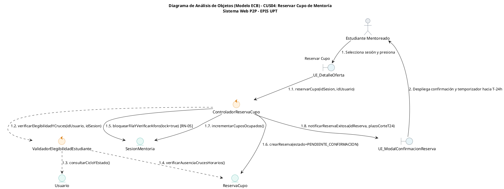

Fuente: Elaboración propia.

El análisis ECB de CUS04 demuestra la estricta separación de responsabilidades en la reserva concurrente. La interfaz `UI_DetalleOferta` no efectúa cálculos de aforo ni altera directamente los registros; delega en `ControladorReservaCupo`, el cual coordina con `ValidadorElegibilidadEstudiante` la comprobación del ciclo formativo y la prevención de reservas duplicadas o solapadas. La operación sobre `SesionMentoria` se ejecuta bajo un bloqueo a nivel de fila que previene la sobreventa de cupos frente a peticiones simultáneas, instanciando la entidad `ReservaCupo` en estado `PENDIENTE_CONFIRMACION` para su posterior ratificación en CUS24.

### 6.3.1.3. CUS24 – Análisis de Objetos: Confirmar Asistencia a Mentoría

El análisis de objetos para el caso de uso `CUS24` modela los componentes arquitectónicos encargados de procesar la ratificación anticipada y obligatoria de asistencia estudiantil. Se identifican las fronteras de usuario y adaptadores de notificación (`UI_MisReservas`, `UI_VisorTicketQR`, `AdaptadorEmailSMTP`); los componentes de control especializados en validar la ventana temporal perentoria de 24 horas (`ControladorConfirmacionAsistencia`) y en la emisión criptográfica de credenciales (`GeneradorTicketQR`); y las entidades del dominio `Usuario`, `SesionMentoria`, `ReservaCupo` y `TicketAsistencia` que consolidan la confirmación formal del quórum.

#### Diagrama 6.13.3: Análisis de Objetos (Modelo ECB) - CUS24: Confirmar Asistencia a Mentoría

```plantuml
@startuml
title Diagrama de Análisis de Objetos (Modelo ECB) - CUS24: Confirmar Asistencia a Mentoría\nSistema Web P2P - EPIS UPT

skinparam shadowing false
skinparam roundcorner 8
skinparam defaultFontName Arial
skinparam fontSize 11

skinparam actor {
    BackgroundColor #E9ECEF
    BorderColor #1D2D44
}
skinparam boundary {
    BackgroundColor #E8F4F8
    BorderColor #2B3A42
}
skinparam control {
    BackgroundColor #FFF2DF
    BorderColor #D97706
}
skinparam entity {
    BackgroundColor #E8F8F5
    BorderColor #0D9488
}

actor "Estudiante Mentoreado" as ActMentee
actor "Servicio SMTP / UPT" as ActSMTP <<Sistema Externo>>

boundary "UI_MisReservas" as B_MisReservas
boundary "UI_VisorTicketQR" as B_TicketVisor
boundary "AdaptadorEmailSMTP" as B_SMTP

control "ControladorConfirmacionAsistencia" as C_Confirm
control "GeneradorTicketQR" as C_QR

entity "Usuario" as E_User
entity "SesionMentoria" as E_Sesion
entity "ReservaCupo" as E_Reserva
entity "TicketAsistencia" as E_Ticket

ActMentee --> B_MisReservas : 1. Selecciona reserva y pulsa "Confirmar Asistencia"
B_MisReservas --> C_Confirm : 1.1. ratificarAsistencia(idReserva, idUsuario)

C_Confirm ..> E_Reserva : 1.2. consultarEstadoYFechas()
C_Confirm ..> E_Sesion : 1.3. validarVentanaCorteT24h() [RN-08]

alt Plazo vigente (T >= 24h)
    C_Confirm --> E_Reserva : 1.4. actualizarEstado(CONFIRMADA)
    C_Confirm --> C_QR : 1.5. generarTicketDigitalQR(idReserva)
    C_QR --> E_Ticket : 1.6. crearTicket(tokenHash, qrBase64)
    C_Confirm ..> B_SMTP : 1.7. despacharTicketEmail(correo, ticket)
    B_SMTP --> ActSMTP : 1.8. remitirTicketAdjunto()
    C_Confirm --> B_TicketVisor : 1.9. desplegarAccesoDefinitivo(aulaOEnlace, ticket)
    B_TicketVisor --> ActMentee : 2. Muestra ticket QR y datos de acceso
else Plazo cerrado (T < 24h)
    C_Confirm --> B_MisReservas : 1.10. notificarPlazoVencido(E01)
    B_MisReservas --> ActMentee : 3. Alerta de revocación reglamentaria
end
@enduml
```

Fuente: Elaboración propia.

El modelo ECB evidencia que la lógica temporal de ratificación recae en `ControladorConfirmacionAsistencia`, el cual valida que la petición ocurra con una antelación mínima de 24 horas ($T \ge 24\text{ h}$, conforme a RN-08). Al verificarse la condición, la entidad `ReservaCupo` transiciona al estado definitivo `CONFIRMADA`, desencadenando la creación asíncrona del objeto `TicketAsistencia` mediante `GeneradorTicketQR` y liberando la información de infraestructura (aula física en la EPIS o sala virtual de teleconferencia).

### 6.3.1.4. CUS23 – Análisis de Objetos: Ejecutar Alertas y Evaluación Automática de Quórum en T-24h

El análisis de objetos para el caso de uso `CUS23` modela los componentes del subsistema desatendido responsable de efectuar el corte reglamentario de asistencia y la evaluación automática de quórum en la ventana perentoria de 24 horas previas al inicio de la sesión. Se identifican las fronteras de ejecución batch y comunicación (`DemonioEvaluadorQuorum`, `AdaptadorEmailSMTP`); el controlador de procesamiento transaccional (`ControladorEvaluacionQuorum`); y las entidades del dominio (`SesionMentoria`, `ReservaCupo`, `Usuario`) que experimentan transiciones de estado irrevocables para garantizar el uso eficiente de los recursos institucionales.

#### Diagrama 6.13.4: Análisis de Objetos (Modelo ECB) - CUS23: Ejecutar Alertas y Evaluación Automática de Quórum en T-24h

```plantuml
@startuml
title Diagrama de Análisis de Objetos (Modelo ECB) - CUS23: Ejecutar Alertas y Evaluación Automática de Quórum en T-24h\nSistema Web P2P - EPIS UPT

skinparam shadowing false
skinparam roundcorner 8
skinparam defaultFontName Arial
skinparam fontSize 11

skinparam actor {
    BackgroundColor #E9ECEF
    BorderColor #1D2D44
}
skinparam boundary {
    BackgroundColor #E8F4F8
    BorderColor #2B3A42
}
skinparam control {
    BackgroundColor #FFF2DF
    BorderColor #D97706
}
skinparam entity {
    BackgroundColor #E8F8F5
    BorderColor #0D9488
}

actor "Demonio Cron / Planificador" as ActCron <<Servicio del Sistema>>
actor "Servicio SMTP / UPT" as ActSMTP <<Sistema Externo>>

boundary "DemonioEvaluadorQuorum" as B_Worker
boundary "AdaptadorEmailSMTP" as B_SMTP

control "ControladorEvaluacionQuorum" as C_Quorum

entity "SesionMentoria" as E_Sesion
entity "ReservaCupo" as E_Reserva
entity "Usuario" as E_Usuario

ActCron --> B_Worker : 1. Disparo periódico programado (cada 15 min)
B_Worker --> C_Quorum : 1.1. ejecutarCorteQuorumT24()

C_Quorum ..> E_Sesion : 1.2. consultarSesionesEnVentanaCorte(PUBLICADA, T <= 24h)

loop Por cada sesión detectada en T-24h
    C_Quorum --> E_Reserva : 1.3. revocarReservasNoConfirmadas(idSesion) [RN-08]
    note right: PENDIENTE_CONFIRMACION\n-> NO_CONFIRMADA
    
    C_Quorum ..> E_Reserva : 1.4. contarReservasConfirmadas(idSesion)
    C_Quorum ..> E_Sesion : 1.5. verificarAforoMaximo(idSesion)
    
    alt Quórum alcanzado (Confirmadas >= 50% Aforo) [RN-09]
        C_Quorum --> E_Sesion : 1.6. actualizarEstado(CONFIRMADA)
        C_Quorum ..> B_SMTP : 1.7. despacharNotificacionSesionConfirmada(idSesion)
        B_SMTP --> ActSMTP : 1.8. remitirRecordatorioDefinitivo(Mentor y Mentees)
    else Quórum insuficiente (Confirmadas < 50% Aforo) [RN-09]
        C_Quorum --> E_Sesion : 1.9. actualizarEstado(QUORUM_INSUFICIENTE)
        C_Quorum ..> B_SMTP : 1.10. despacharAlertaQuorumInsuficiente(idSesion)
        B_SMTP --> ActSMTP : 1.11. remitirAlertaUrgente(Mentor para CUS07)
    end
end
@enduml
```

Fuente: Elaboración propia.

El análisis de objetos para CUS23 demuestra el desacoplamiento entre el temporizador desatendido del sistema y la lógica de negocio del corte de quórum. La entidad `ReservaCupo` sufre una revocación masiva automática de aquellas plazas que permanecieron en `PENDIENTE_CONFIRMACION`, mutando a `NO_CONFIRMADA` sin penalización conforme a RN-08 y RN-10. En función del cómputo estricto del umbral del 50% estipulado en RN-09, `ControladorEvaluacionQuorum` transiciona la entidad `SesionMentoria` hacia `CONFIRMADA` o `QUORUM_INSUFICIENTE`, delegando en `AdaptadorEmailSMTP` las comunicaciones oficiales inmediatas hacia los estudiantes y el mentor académico.

### 6.3.1.5. CUS07 – Análisis de Objetos: Gestionar Sesión ante Quórum Insuficiente

El análisis de objetos para el caso de uso `CUS07` formaliza los componentes que intervienen en la toma de decisión del mentor cuando una sesión no alcanza el 50% de cupos confirmados en la ventana de corte de 24 horas ($T-24\text{ h}$). Se identifican las fronteras de interacción y despacho (`UI_GestionQuorum`, `AdaptadorEmailSMTP`, `AdaptadorReservaAulas`); el componente de control (`ControladorResolucionQuorum`); y las entidades del modelo de dominio (`SesionMentoria`, `ReservaCupo`, `EspacioFisico`, `RegistroAuditoria`) involucradas en la ratificación del dictado excepcional o en la cancelación regulada sin penalidad.

#### Diagrama 6.13.5: Análisis de Objetos (Modelo ECB) - CUS07: Gestionar Sesión ante Quórum Insuficiente

```plantuml
@startuml
title Diagrama de Análisis de Objetos (Modelo ECB) - CUS07: Gestionar Sesión ante Quórum Insuficiente\nSistema Web P2P - EPIS UPT

skinparam shadowing false
skinparam roundcorner 8
skinparam defaultFontName Arial
skinparam fontSize 11

skinparam actor {
    BackgroundColor #E9ECEF
    BorderColor #1D2D44
}
skinparam boundary {
    BackgroundColor #E8F4F8
    BorderColor #2B3A42
}
skinparam control {
    BackgroundColor #FFF2DF
    BorderColor #D97706
}
skinparam entity {
    BackgroundColor #E8F8F5
    BorderColor #0D9488
}

actor "Estudiante Mentor" as ActMentor
actor "Servicio SMTP / UPT" as ActSMTP <<Sistema Externo>>

boundary "UI_GestionQuorum" as B_UI
boundary "AdaptadorEmailSMTP" as B_SMTP
boundary "AdaptadorReservaAulas" as B_Aulas

control "ControladorResolucionQuorum" as C_Res

entity "SesionMentoria" as E_Sesion
entity "ReservaCupo" as E_Reserva
entity "EspacioFisico" as E_Aula
entity "RegistroAuditoria" as E_Audit

ActMentor --> B_UI : 1. Visualiza alerta y opciones de resolución
B_UI --> C_Res : 1.1. resolverSesionQuorum(idSesion, idMentor, decision)

C_Res ..> E_Sesion : 1.2. verificarEstado(QUORUM_INSUFICIENTE)

alt Decisión: Dictado Excepcional (RN-09)
    C_Res --> E_Sesion : 1.3. actualizarEstado(CONFIRMADA_EXCEPCIONAL)
    C_Res ..> B_SMTP : 1.4. despacharAvisoDictadoExcepcional(idSesion)
    B_SMTP --> ActSMTP : 1.5. remitirConfirmacion(Mentees Confirmados)
    C_Res --> B_UI : 1.6. notificarExito("Sesión confirmada excepcionalmente")
    B_UI --> ActMentor : 2. Despliega confirmación de dictado
else Decisión: Cancelación por Falta de Quórum (RN-10)
    C_Res --> E_Sesion : 1.7. actualizarEstado(CANCELADA_QUORUM)
    C_Res --> E_Reserva : 1.8. cancelarReservasConfirmadas(CANCELADA_SISTEMA)
    C_Res ..> B_Aulas : 1.9. desasignarAulaFisica(idAula, horario)
    B_Aulas --> E_Aula : 1.10. marcarDisponible()
    C_Res --> E_Audit : 1.11. registrarCancelacionSinPenalizacion(RN-10)
    C_Res ..> B_SMTP : 1.12. despacharAvisoCancelacionQuorum(idSesion)
    B_SMTP --> ActSMTP : 1.13. remitirAvisoCancelacion(Mentor y Mentees)
    C_Res --> B_UI : 1.14. notificarExito("Sesión cancelada sin penalización")
    B_UI --> ActMentor : 3. Despliega constancia de cancelación formal
end
@enduml
```

Fuente: Elaboración propia.

El análisis ECB para CUS07 expone el mecanismo de resolución ante el quórum insuficiente. `ControladorResolucionQuorum` valida que la sesión se encuentre legítimamente en estado `QUORUM_INSUFICIENTE` antes de aplicar la decisión del mentor. Si el mentor opta por asumir la sesión, `SesionMentoria` muta a `CONFIRMADA_EXCEPCIONAL`, preservando las reservas confirmadas y el aula asignada. Si decide la cancelación, la entidad muta a `CANCELADA_QUORUM`, forzando la liberación atómica de ambientes físicos o salas virtuales mediante `AdaptadorReservaAulas`, transicionando las reservas a `CANCELADA_SISTEMA` y registrando en `RegistroAuditoria` la exención estricta de penalidad según RN-10.

### 6.3.1.6. CUS09 – Análisis de Objetos: Publicar Oferta de Mentoría Individual o Grupal

El análisis de objetos para el caso de uso `CUS09` modela los componentes arquitectónicos encargados de recepcionar, validar y persistir las convocatorias académicas emitidas por los mentores. Se identifican las fronteras de usuario y servicios externos (`UI_PublicacionOferta`, `AdaptadorHorariosEPIS`, `AdaptadorMeetVirtual`); el controlador de negocio (`ControladorPublicacionMentoria`); y las entidades del dominio (`Usuario`, `SesionMentoria`, `Asignatura`, `EspacioFisico`) que encapsulan las reglas de elegibilidad docente (RN-01), anticipación mínima de 48 horas (RN-04) y límites de aforo diferencial (RN-05).

#### Diagrama 6.13.6: Análisis de Objetos (Modelo ECB) - CUS09: Publicar Oferta de Mentoría Individual o Grupal

```plantuml
@startuml
title Diagrama de Análisis de Objetos (Modelo ECB) - CUS09: Publicar Oferta de Mentoría Individual o Grupal\nSistema Web P2P - EPIS UPT

skinparam shadowing false
skinparam roundcorner 8
skinparam defaultFontName Arial
skinparam fontSize 11

skinparam actor {
    BackgroundColor #E9ECEF
    BorderColor #1D2D44
}
skinparam boundary {
    BackgroundColor #E8F4F8
    BorderColor #2B3A42
}
skinparam control {
    BackgroundColor #FFF2DF
    BorderColor #D97706
}
skinparam entity {
    BackgroundColor #E8F8F5
    BorderColor #0D9488
}

actor "Estudiante Mentor" as ActMentor
actor "Servicio Google Meet" as ActMeet <<Sistema Externo>>

boundary "UI_PublicacionOferta" as B_UI
boundary "AdaptadorHorariosEPIS" as B_Horarios
boundary "AdaptadorMeetVirtual" as B_Meet

control "ControladorPublicacionMentoria" as C_Pub

entity "Usuario" as E_Mentor
entity "Asignatura" as E_Asignatura
entity "SesionMentoria" as E_Sesion
entity "EspacioFisico" as E_Aula

ActMentor --> B_UI : 1. Completa formulario de publicación (título, curso, fecha, modalidad, aforo)
B_UI --> C_Pub : 1.1. publicarSesion(datosOferta, idMentor)

C_Pub ..> E_Mentor : 1.2. validarElegibilidadMentor(idMentor) [RN-01]
C_Pub ..> E_Sesion : 1.3. validarAnticipacionMinima(fechaHora) [RN-04 >= 48h]
C_Pub ..> E_Sesion : 1.4. validarAforoMaximo(modalidad, aforo) [RN-05]

alt Modalidad Presencial
    C_Pub ..> B_Horarios : 1.5. verificarDisponibilidadAula(fechaHora, duracion)
    B_Horarios ..> E_Aula : 1.6. reservarAmbienteFisico()
    C_Pub --> E_Sesion : 1.7. crearSesion(aulaAsignada, PUBLICADA)
else Modalidad Virtual
    C_Pub ..> B_Meet : 1.8. solicitarEnlaceReunion(titulo, fechaHora)
    B_Meet --> ActMeet : 1.9. generarSalaVirtualAPI()
    ActMeet --> B_Meet : 1.10. enlaceGenerado (meet.google.com/...)
    B_Meet --> C_Pub : 1.11. urlSalaVirtual
    C_Pub --> E_Sesion : 1.12. crearSesion(enlaceVirtual, PUBLICADA)
end

C_Pub --> B_UI : 1.13. confirmarPublicacionExitosa(idSesion)
B_UI --> ActMentor : 2. Notifica publicación activa en el catálogo P2P
@enduml
```

Fuente: Elaboración propia.

El análisis ECB para CUS09 garantiza la integridad operativa de las sesiones desde su origen. `ControladorPublicacionMentoria` intercepta la creación y corrobora de forma estricta las precondiciones normativas: verifica que el estudiante posea el rol de mentor habilitado sin sanciones (RN-01), que la sesión se programe con al menos 48 horas de anticipación reglamentaria (RN-04) y que el aforo respete los topes máximos de 10 alumnos en presencial y 20 en virtual (RN-05). Asimismo, interactúa de forma polimórfica con los adaptadores de infraestructura para reservar físicamente un aula en los pabellones de la EPIS o autogenerar la sala virtual en Google Meet, instanciando la entidad `SesionMentoria` directamente en estado `PUBLICADA`.

### 6.3.1.7. CUS14 – Análisis de Objetos: Consultar Agenda y Horarios de Mentorías

El análisis de objetos para el caso de uso `CUS14` modela los componentes arquitectónicos dedicados a la recuperación, filtrado y renderizado dinámico de la programación académica institucional. Se identifican las fronteras de visualización y aceleración (`UI_AgendaCalendario`, `UI_PanelFiltros`, `CacheAgendaInMemory`); el componente de control (`ControladorConsultaAgenda`); y las entidades del modelo de datos (`SesionMentoria`, `Asignatura`, `Usuario`, `ReservaCupo`) requeridas para calcular el estado de ocupación, la disponibilidad de cupos en tiempo real (RN-05) y la condición de inscripción del estudiante solicitante.

#### Diagrama 6.13.7: Análisis de Objetos (Modelo ECB) - CUS14: Consultar Agenda y Horarios de Mentorías

```plantuml
@startuml
title Diagrama de Análisis de Objetos (Modelo ECB) - CUS14: Consultar Agenda y Horarios de Mentorías\nSistema Web P2P - EPIS UPT

skinparam shadowing false
skinparam roundcorner 8
skinparam defaultFontName Arial
skinparam fontSize 11

skinparam actor {
    BackgroundColor #E9ECEF
    BorderColor #1D2D44
}
skinparam boundary {
    BackgroundColor #E8F4F8
    BorderColor #2B3A42
}
skinparam control {
    BackgroundColor #FFF2DF
    BorderColor #D97706
}
skinparam entity {
    BackgroundColor #E8F8F5
    BorderColor #0D9488
}

actor "Estudiante / Mentor" as ActUser

boundary "UI_AgendaCalendario" as B_Calendario
boundary "UI_PanelFiltros" as B_Filtros
boundary "CacheAgendaInMemory" as B_Cache

control "ControladorConsultaAgenda" as C_Agenda

entity "SesionMentoria" as E_Sesion
entity "Asignatura" as E_Asignatura
entity "Usuario" as E_Docente
entity "ReservaCupo" as E_Reserva

ActUser --> B_Filtros : 1. Selecciona parámetros (mes, asignatura, modalidad)
B_Filtros --> B_Calendario : 1.1. dispararBusqueda(criteriosFiltro)
B_Calendario --> C_Agenda : 1.2. obtenerAgendaEventos(filtros, idUsuarioAutenticado)

C_Agenda ..> B_Cache : 1.3. consultarClaveCache(hashFiltros)

alt Caché disponible (Hit)
    B_Cache --> C_Agenda : 1.4. coleccionEventosSerializados
else Caché ausente o invalidada (Miss)
    C_Agenda ..> E_Sesion : 1.5. buscarSesionesPorRangoTemporal(fechaInicio, fechaFin)
    C_Agenda ..> E_Asignatura : 1.6. asociarMetadatosCurso()
    C_Agenda ..> E_Docente : 1.7. obtenerPerfilMentor()
    C_Agenda ..> E_Reserva : 1.8. verificarInscripcionUsuario(idUsuarioAutenticado)
    C_Agenda ..> B_Cache : 1.9. almacenarEnCache(hashFiltros, resultado, ttl=300s)
end

C_Agenda --> B_Calendario : 1.10. consolidarMatrizCalendario(eventosConCupos)
B_Calendario --> ActUser : 2. Renderiza calendario con distintivos de aforo y estado
@enduml
```

Fuente: Elaboración propia.

El análisis ECB para CUS14 demuestra el diseño optimizado para consultas de alta concurrencia (RNF01). `ControladorConsultaAgenda` orquesta la consulta de sesiones aplicando filtros dinámicos y coordinando con `CacheAgendaInMemory` (Redis) para amortiguar la carga transaccional de lectura. Al recuperar las instancias de `SesionMentoria`, el controlador consulta a `ReservaCupo` para determinar de forma reactiva si el usuario en sesión ya cuenta con una reserva activa o si existen cupos libres (`aforo_maximo - cupos_ocupados`), entregando a `UI_AgendaCalendario` un conjunto de datos consolidado para su renderizado mensual o semanal.

### 6.3.1.8. CUS11 – Análisis de Objetos: Registrar Asistencia Mediante Código QR

El análisis de objetos para el caso de uso `CUS11` modela los componentes del subsistema encargado del control y verificación de presencia física o virtual mediante lectura criptográfica de códigos QR. Se identifican las fronteras de captura visual (`UI_EscanerQR`, `UI_VisorTicketQR`); el controlador de procesamiento y validación criptográfica (`ControladorRegistroAsistencia`, `ValidadorTokenQR`); y las entidades del dominio (`SesionMentoria`, `ReservaCupo`, `TicketAsistencia`, `RegistroAsistencia`) que gobiernan la transición de la plaza hacia estado `ASISTIDA` bajo la ventana reglamentaria de tolerancia (RN-11).

#### Diagrama 6.13.8: Análisis de Objetos (Modelo ECB) - CUS11: Registrar Asistencia Mediante Código QR

```plantuml
@startuml
title Diagrama de Análisis de Objetos (Modelo ECB) - CUS11: Registrar Asistencia Mediante Código QR\nSistema Web P2P - EPIS UPT

skinparam shadowing false
skinparam roundcorner 8
skinparam defaultFontName Arial
skinparam fontSize 11

skinparam actor {
    BackgroundColor #E9ECEF
    BorderColor #1D2D44
}
skinparam boundary {
    BackgroundColor #E8F4F8
    BorderColor #2B3A42
}
skinparam control {
    BackgroundColor #FFF2DF
    BorderColor #D97706
}
skinparam entity {
    BackgroundColor #E8F8F5
    BorderColor #0D9488
}

actor "Estudiante Mentor" as ActMentor
actor "Estudiante Mentoreado" as ActMentee

boundary "UI_VisorTicketQR" as B_TicketUI
boundary "UI_EscanerQR" as B_ScannerUI

control "ControladorRegistroAsistencia" as C_Asist
control "ValidadorTokenQR" as C_Token

entity "TicketAsistencia" as E_Ticket
entity "SesionMentoria" as E_Sesion
entity "ReservaCupo" as E_Reserva
entity "RegistroAsistencia" as E_RegAsist

ActMentee --> B_TicketUI : 1. Exhibe ticket digital con código QR
ActMentor --> B_ScannerUI : 2. Enfoca cámara y captura imagen QR
B_ScannerUI --> C_Asist : 2.1. procesarLecturaQR(payloadEscaneado, idSesion)

C_Asist --> C_Token : 2.2. decodificarYVerificarFirma(tokenHash)
C_Token ..> E_Ticket : 2.3. consultarValidezCriptografica()

alt Token QR inválido o firma alterada (E01)
    C_Asist --> B_ScannerUI : 2.4. notificarErrorLectura("Firma digital inválida o adulterada")
    B_ScannerUI --> ActMentor : 3. Alerta de ticket fraudulento
else Token válido
    C_Asist ..> E_Sesion : 2.5. validarVentanaTolerancia(ahora) [RN-11: -15m a +30m]
    C_Asist ..> E_Reserva : 2.6. consultarEstadoReserva(idReserva)
    
    alt Reserva en estado CONFIRMADA y no registrada
        C_Asist --> E_Reserva : 2.7. mutarEstado(ASISTIDA)
        C_Asist --> E_RegAsist : 2.8. crearRegistro(idReserva, idSesion, timestamp, 'VALIDACION_QR')
        C_Asist --> B_ScannerUI : 2.9. confirmarAsistenciaExitosa(nombreEstudiante, codigo)
        B_ScannerUI --> ActMentor : 4. Feedback visual verde y sonido de confirmación
    else Reserva ya registrada o estado no apto (E02)
        C_Asist --> B_ScannerUI : 2.10. notificarRechazo("Ticket ya utilizado o reserva no ratificada")
        B_ScannerUI --> ActMentor : 5. Alerta de registro duplicado / no confirmado
    end
end
@enduml
```

Fuente: Elaboración propia.

El análisis ECB para CUS11 delimita la verificación criptográfica desacoplada de la cámara. `ControladorRegistroAsistencia` delega en `ValidadorTokenQR` la comprobación del hash SHA-256 para prevenir suplantaciones. Posteriormente, interactúa con `SesionMentoria` para comprobar que la lectura ocurra dentro de la ventana de tolerancia oficial fijada en RN-11 (desde 15 minutos antes hasta 30 minutos después del inicio). Superada la verificación, la entidad `ReservaCupo` transiciona irrevocablemente a `ASISTIDA` y se instancia el objeto `RegistroAsistencia`, proporcionando retroalimentación visual en menos de 1 segundo al mentor (RNF02).

### 6.3.1.9. CUS10 - Análisis de Objetos: Registrar Bitácora Pedagógica de Sesión

El análisis de objetos modela la estructura conceptual y la interacción colaborativa entre las interfaces de captura docente, las clases de control de negocio y las entidades de persistencia pedagógica durante el cierre formal de una sesión de mentoría. Se explicitan el actor *Estudiante Mentor*, el límite *UI Formulario Bitácora*, los controladores *Controlador de Bitácora Pedagógica*, *Validador de Plazo (RN-07)*, *Sincronizador de Asistencia (RN-11)* y *Calculador de Horas Formativas (RN-12)*, así como las entidades *SesionMentoria*, *BitacoraSesion*, *ReservaCupo*, *BolsaHorasMentor* y *RegistroAuditoria*.

#### Diagrama 6.13.9: Análisis de Objetos (Modelo ECB) - CUS10: Registrar Bitácora Pedagógica de Sesión

```plantuml
@startuml
title Análisis de Objetos (Modelo ECB) - CUS10: Registrar Bitácora Pedagógica de Sesión\nSistema Web P2P - EPIS UPT

skinparam shadowing false
skinparam roundcorner 8
skinparam defaultFontName Arial
skinparam fontSize 10

skinparam actor {
    BackgroundColor #F8F9FA
    BorderColor #2B3A42
}
skinparam boundary {
    BackgroundColor #E8F4F8
    BorderColor #2B3A42
}
skinparam control {
    BackgroundColor #FFF2DF
    BorderColor #D97706
}
skinparam entity {
    BackgroundColor #E8F8F5
    BorderColor #10B981
}

actor "Estudiante Mentor" as ActMentor
boundary "UI Formulario Bitácora\n(SPA React)" as B_BitacoraUI
control "Controlador de\nBitácora Pedagógica" as C_Bitacora
control "Validador de Plazo\n(Ventana 24h RN-07)" as C_Plazo
control "Sincronizador de\nAsistencia (RN-11)" as C_Asist
control "Calculador de Horas\nFormativas (RN-12)" as C_Horas
entity "SesionMentoria" as E_Sesion
entity "BitacoraSesion" as E_Bitacora
entity "ReservaCupo" as E_Reserva
entity "BolsaHorasMentor" as E_Bolsa
entity "RegistroAuditoria" as E_Audit

ActMentor --> B_BitacoraUI : 1. Solicita formulario de cierre de sesión
B_BitacoraUI --> C_Bitacora : 1.1. cargarContextoSesion(idSesion)
C_Bitacora ..> E_Sesion : 1.2. consultarEstadoYHorarios(idSesion)
C_Bitacora ..> E_Reserva : 1.3. listarAsistentesConfirmados(idSesion)
C_Bitacora --> B_BitacoraUI : 1.4. retornarDatosSesionYAlumnos()
B_BitacoraUI --> ActMentor : 2. Despliega lista de alumnos y campos estructurados

ActMentor --> B_BitacoraUI : 3. Completa temas (>=30 caracteres), dificultades, acuerdos y envía
B_BitacoraUI --> C_Bitacora : 3.1. registrarBitacora(dtoBitacora)

C_Bitacora --> C_Plazo : 3.2. verificarPlazoVigente(fechaFin, ahora) [RN-07: <= 24 horas]

alt Plazo extemporáneo (> 24 horas tras fin de sesión)
    C_Plazo --> C_Bitacora : 3.3. plazoVencidoError()
    C_Bitacora --> B_BitacoraUI : 3.4. notificarPlazoVencido("Plazo de 24h expirado. Requiere regularización")
    B_BitacoraUI --> ActMentor : 4. Alerta de bloqueo por extemporaneidad
else Plazo conforme (dentro de las 24 horas)
    C_Bitacora --> C_Asist : 3.5. regularizarInasistencias(idSesion) [RN-11]
    C_Asist --> E_Reserva : 3.6. mutarNoMarcados(INASISTENCIA)
    
    C_Bitacora --> E_Bitacora : 3.7. crear(idSesion, temas, dificultades, observaciones, 'REGISTRADA')
    C_Bitacora --> E_Sesion : 3.8. mutarEstado(FINALIZADA)
    
    C_Bitacora --> C_Horas : 3.9. acumularHorasDictadas(idMentor, horas) [RN-12]
    C_Horas --> E_Bolsa : 3.10. incrementarHorasPendientesVisado(horas)
    
    C_Bitacora --> E_Audit : 3.11. registrarEventoAuditoria('REGISTRO_BITACORA', idSesion)
    C_Bitacora --> B_BitacoraUI : 3.12. confirmarRegistroExitoso()
    B_BitacoraUI --> ActMentor : 5. Notificación de cierre formal y horas acumuladas
end
@enduml
```

Fuente: Elaboración propia.

El análisis de objetos para CUS10 delimita la orquestación del cierre formativo y administrativo de cada sesión. `ControladorBitacora` interactúa primeramente con `ValidadorPlazo` para garantizar la observancia de la regla RN-07, impidiendo la captura desfasada de información pedagógica si han transcurrido más de 24 horas desde la culminación del evento. La clase de control `SincronizadorAsistencia` ejecuta la transición de las reservas pendientes hacia el estado canónico `INASISTENCIA` conforme a RN-11, mientras que `CalculadorHoras` computa las horas efectivas dictadas y actualiza la entidad `BolsaHorasMentor` en concordancia estricta con RN-12, dejando la sesión en estado `FINALIZADA` e inmutable ante ulteriores ediciones.

### 6.3.1.10. CUS05 - Análisis de Objetos: Responder Encuesta de Calidad Post-Mentoría

El análisis de objetos modela los componentes lógicos participantes en la captura de la retroalimentación formativa y en la gobernanza de la reputación académica. Se representan el actor *Estudiante Mentoreado*, la frontera *UI Encuesta Calidad*, los controladores de negocio *Controlador de Encuestas de Calidad*, *Validador de Elegibilidad y Plazo*, *Motor de Anonimización (Ley N° 29733)* y *Calculador de Reputación (RN-13)*, junto a las entidades *ReservaCupo*, *SesionMentoria*, *BitacoraSesion*, *EncuestaSatisfaccion*, *ReputacionMentor* y *RegistroAuditoria*.

#### Diagrama 6.13.10: Análisis de Objetos (Modelo ECB) - CUS05: Responder Encuesta de Calidad Post-Mentoría

```plantuml
@startuml
title Análisis de Objetos (Modelo ECB) - CUS05: Responder Encuesta de Calidad Post-Mentoría\nSistema Web P2P - EPIS UPT

skinparam shadowing false
skinparam roundcorner 8
skinparam defaultFontName Arial
skinparam fontSize 10

skinparam actor {
    BackgroundColor #F8F9FA
    BorderColor #2B3A42
}
skinparam boundary {
    BackgroundColor #E8F4F8
    BorderColor #2B3A42
}
skinparam control {
    BackgroundColor #FFF2DF
    BorderColor #D97706
}
skinparam entity {
    BackgroundColor #E8F8F5
    BorderColor #10B981
}

actor "Estudiante Mentoreado" as ActMentee
boundary "UI Encuesta Calidad\n(SPA React)" as B_EncuestaUI
control "Controlador de\nEncuestas de Calidad" as C_Encuesta
control "Validador de Elegibilidad\ny Plazo (Ventana 24h)" as C_Validador
control "Motor de Anonimización\n(Ley N° 29733)" as C_Anon
control "Calculador de Reputación\n(Media Ponderada RN-13)" as C_Reputacion
entity "ReservaCupo" as E_Reserva
entity "SesionMentoria" as E_Sesion
entity "BitacoraSesion" as E_Bitacora
entity "EncuestaSatisfaccion" as E_Encuesta
entity "ReputacionMentor" as E_Reputacion
entity "RegistroAuditoria" as E_Audit

ActMentee --> B_EncuestaUI : 1. Accede a encuesta de sesión asistida
B_EncuestaUI --> C_Encuesta : 1.1. cargarFormularioEncuesta(idSesion, idUsuario)
C_Encuesta --> C_Validador : 1.2. validarAptitudEvaluacion(idSesion, idUsuario)
C_Validador ..> E_Reserva : 1.3. verificarEstado(ASISTIDA) y flag(no_evaluada)
C_Validador ..> E_Bitacora : 1.4. consultarFechaCierreBitacora()

alt Reserva no asistida o ya evaluada (E02)
    C_Validador --> C_Encuesta : 1.5. denegarAcceso("Solo asistentes confirmados pueden evaluar")
    C_Encuesta --> B_EncuestaUI : 1.6. notificarInadmisibilidad()
    B_EncuestaUI --> ActMentee : 2. Mensaje de error de acceso
else Plazo de 24 horas expirado (E01)
    C_Validador --> C_Encuesta : 1.7. denegarAcceso("Ventana de 24h vencida")
    C_Encuesta --> B_EncuestaUI : 1.8. notificarExpiracion()
    B_EncuestaUI --> ActMentee : 2. Mensaje de encuesta caducada
else Elegible y dentro de plazo legal
    C_Encuesta --> B_EncuestaUI : 1.9. renderizarReactivosLikert(contextoSesion)
    B_EncuestaUI --> ActMentee : 3. Despliega 4 reactivos (1-5 estrellas) y caja de comentarios

    ActMentee --> B_EncuestaUI : 4. Califica dimensiones, ingresa sugerencia opcional y envía
    B_EncuestaUI --> C_Encuesta : 4.1. registrarEvaluacion(dtoEncuesta)
    
    C_Encuesta --> C_Anon : 4.2. disociarIdentidadEstudiante(idUsuario, comentario)
    C_Anon --> E_Encuesta : 4.3. instanciarEncuesta(idSesion, scoresLikert, hashAnonimo, comentarioFiltrado)
    
    C_Encuesta --> E_Reserva : 4.4. marcarEncuestaCompletada(idReserva)
    
    C_Encuesta --> C_Reputacion : 4.5. recalcularScoreMentor(idMentor, scoresLikert) [RN-13]
    C_Reputacion --> E_Reputacion : 4.6. actualizarMediaPonderadaYTotal()
    
    C_Encuesta --> E_Audit : 4.7. registrarEventoAuditoria('ENCUESTA_REGISTRADA', idSesion)
    C_Encuesta --> B_EncuestaUI : 4.8. confirmarRecepcion()
    B_EncuestaUI --> ActMentee : 5. Banner de agradecimiento y confirmación
end
@enduml
```

Fuente: Elaboración propia.

El análisis de objetos para CUS05 formaliza el proceso de evaluación de calidad asegurando el anonimato del mentoreado y la legitimidad de las valoraciones. La clase de control `ValidadorElegibilidad` filtra estrictamente que solo aquellos estudiantes cuya reserva transicionó a `ASISTIDA` y que se encuentren dentro de la ventana de 24 horas posteriores al cierre de bitácora puedan emitir opinión. `MotorAnonimizacion` disocia los datos personales del alumno antes de instanciar `EncuestaSatisfaccion` en cumplimiento de la Ley N° 29733, mientras que `CalculadorReputacion` procesa las cuatro dimensiones Likert actualizando de forma ponderada la entidad `ReputacionMentor` conforme a la regla de negocio RN-13.

### 6.3.1.11. CUS19 - Análisis de Objetos: Consultar Historial de Sesiones y Asistencia

El análisis de objetos modela la estructura lógica orientada a la provisión de información histórica y rendición de cuentas académica para estudiantes y mentores. Se especifican el actor *Usuario Institucional*, las fronteras *UI Tablero Historial* y *Panel Lateral Detalle (Drawer)*, las clases de control *Controlador de Historial Pedagógico*, *Validador de Contexto y RLS* y *Motor de Filtrado y Métricas Agregadas*, en vinculación directa con las entidades de persistencia *SesionMentoria*, *ReservaCupo*, *BitacoraSesion*, *BolsaHorasMentor* y *Asignatura*.

#### Diagrama 6.13.11: Análisis de Objetos (Modelo ECB) - CUS19: Consultar Historial de Sesiones y Asistencia

```plantuml
@startuml
title Análisis de Objetos (Modelo ECB) - CUS19: Consultar Historial de Sesiones y Asistencia\nSistema Web P2P - EPIS UPT

skinparam shadowing false
skinparam roundcorner 8
skinparam defaultFontName Arial
skinparam fontSize 10

skinparam actor {
    BackgroundColor #F8F9FA
    BorderColor #2B3A42
}
skinparam boundary {
    BackgroundColor #E8F4F8
    BorderColor #2B3A42
}
skinparam control {
    BackgroundColor #FFF2DF
    BorderColor #D97706
}
skinparam entity {
    BackgroundColor #E8F8F5
    BorderColor #10B981
}

actor "Usuario Institucional\n(Mentor / Mentoreado)" as ActUser
boundary "UI Tablero Historial\n(SPA React)" as B_HistorialUI
boundary "Panel Lateral Detalle\n(Drawer Bitácora)" as B_DrawerUI
control "Controlador de Historial\nPedagógico" as C_Historial
control "Validador de Contexto\ny RLS (Supabase)" as C_RLS
control "Motor de Filtrado y\nMétricas Agregadas" as C_Filtro
entity "SesionMentoria" as E_Sesion
entity "ReservaCupo" as E_Reserva
entity "BitacoraSesion" as E_Bitacora
entity "BolsaHorasMentor" as E_Bolsa
entity "Asignatura" as E_Asignatura

ActUser --> B_HistorialUI : 1. Solicita historial académico consolidado
B_HistorialUI --> C_Historial : 1.1. obtenerHistorialUsuario(filtros, idUsuarioAuth)
C_Historial --> C_RLS : 1.2. verificarAislamientoFilas(idUsuarioAuth)

C_RLS ..> E_Reserva : 1.3. consultarReservasPorUsuario(idUsuarioAuth)
C_RLS ..> E_Sesion : 1.4. consultarSesionesDictadasPorMentor(idUsuarioAuth)
C_Historial ..> E_Asignatura : 1.5. resolverNombresYCodigos()

C_Historial --> C_Filtro : 1.6. procesarMetricasYFiltros(semestre, materia)
C_Filtro --> B_HistorialUI : 1.7. renderizarTablaHistorial(resumenMétricas, listaItems)

alt Historial sin participaciones registradas (E01)
    B_HistorialUI --> ActUser : 2. Despliega estado vacío ("Sin registros de mentoría")
else Historial con eventos encontrados
    B_HistorialUI --> ActUser : 3. Despliega tabla con sesiones, roles, asistencias y métricas
    
    ActUser --> B_HistorialUI : 4. Clic en fila para inspeccionar detalle de bitácora
    B_HistorialUI --> C_Historial : 4.1. obtenerDetalleSesion(idSesion)
    C_Historial ..> E_Bitacora : 4.2. recuperarBitacora(idSesion)
    C_Historial ..> E_Bolsa : 4.3. recuperarHorasAcreditadas(idMentor)
    C_Historial --> B_DrawerUI : 4.4. cargarDetalleBitacoraYRecursos()
    B_DrawerUI --> ActUser : 5. Visualiza temas tratados, acuerdos y recursos compartidos
end
@enduml
```

Fuente: Elaboración propia.

El análisis ECB para CUS19 estructura un acceso seguro y unificado a la trayectoria formativa de los miembros de la comunidad universitaria. `ControladorHistorial` articula con `ValidadorContextoRLS` la aplicación imperativa de directivas de seguridad en la base de datos (PostgreSQL RLS), garantizando que ningún usuario acceda a asistencias de terceros ajenos a su esfera. La clase de control `MotorFiltradoMetricas` agiliza la agregación estadística (tasa de asistencia efectiva y horas dictadas), permitiendo que `UI Tablero Historial` presente un resumen cuantitativo fidedigno y despliegue el contenido temático de la bitácora docente sin fisuras de privacidad.

### 6.3.1.12. CUS16 - Análisis de Objetos: Consultar Tablero de Insignias y Reputación

El análisis de objetos para `CUS16` modela la arquitectura lógica requerida para la cuantificación del prestigio pedagógico y la gamificación formativa en la EPIS-UPT. Se delimitan los actores *Mentor Académico* (beneficiario y consultor principal) y *Mentoreado* (consumidor de la reputación pública), las interfaces *UI Tablero Reputación e Insignias* y *UI Perfil Público Mentor*, los controladores *Controlador de Gamificación*, *Motor de Reputación Ponderada* y *Motor de Reglas de Insignias*, vinculados a las entidades *ReputacionMentor*, *Insignia*, *InsigniaOtorgada*, *EncuestaSatisfaccion*, *BitacoraSesion* y *SesionMentoria*.

#### Diagrama 6.13.12: Análisis de Objetos (Modelo ECB) - CUS16: Consultar Tablero de Insignias y Reputación

```plantuml
@startuml
title Análisis de Objetos (Modelo ECB) - CUS16: Consultar Tablero de Insignias y Reputación\nSistema Web P2P - EPIS UPT

skinparam shadowing false
skinparam roundcorner 8
skinparam defaultFontName Arial
skinparam fontSize 11

skinparam actor {
    BackgroundColor #E9ECEF
    BorderColor #2B3A42
}

skinparam boundary {
    BackgroundColor #E8F4F8
    BorderColor #2B3A42
}

skinparam control {
    BackgroundColor #FFF2DF
    BorderColor #2B3A42
}

skinparam entity {
    BackgroundColor #E8F8F5
    BorderColor #2B3A42
}

actor "Mentor Académico\n(Usuario Autenticado)" as ActMentor
actor "Mentoreado\n(Estudiante Consultor)" as ActEstudiante

boundary "UI Tablero Reputación\ne Insignias (Privado)" as B_TableroUI
boundary "UI Perfil Público\nMentor (Resumido)" as B_PerfilPublicoUI

control "Controlador de\nGamificación y Reputación" as C_Gamificacion
control "Motor de Reputación\nPonderada (RN-13)" as C_MotorReputacion
control "Motor de Reglas\nde Insignias" as C_MotorInsignias

entity "ReputacionMentor" as E_Reputacion
entity "Insignia" as E_Insignia
entity "InsigniaOtorgada" as E_InsigniaOtorgada
entity "EncuestaSatisfaccion" as E_Encuesta
entity "BitacoraSesion" as E_Bitacora
entity "SesionMentoria" as E_Sesion

' Relaciones para flujo privado del Mentor
ActMentor --> B_TableroUI : 1. Accede a "Mi Reputación & Reconocimientos"
B_TableroUI --> C_Gamificacion : 1.1. obtenerTableroMentor(idMentor)
C_Gamificacion --> C_MotorReputacion : 1.2. calcularScoreCompuesto(idMentor)

C_MotorReputacion ..> E_Encuesta : 1.2.1. leerPromediosLikert(idMentor)
C_MotorReputacion ..> E_Sesion : 1.2.2. calcularTasaCumplimiento(idMentor)
C_MotorReputacion ..> E_Bitacora : 1.2.3. calcularPuntualidadEntrega(idMentor)
C_MotorReputacion --> E_Reputacion : 1.2.4. sincronizarReputacion(score, nivel)

C_Gamificacion --> C_MotorInsignias : 1.3. evaluarDesbloqueoInsignias(idMentor)
C_MotorInsignias ..> E_Insignia : 1.3.1. consultarCatalogoVigente()
C_MotorInsignias ..> E_InsigniaOtorgada : 1.3.2. consultarInsigniasPoseidas(idMentor)
C_MotorInsignias --> E_InsigniaOtorgada : 1.3.3. registrarNuevaInsignia(idMentor, idInsignia)

C_Gamificacion --> B_TableroUI : 1.4. consolidarTableroCompleto(score, insignias, progreso, comentarios)
B_TableroUI --> ActMentor : 2. Despliega velocímetro, badges, barras de progreso y comentarios

' Relaciones para flujo público de consulta por Mentoreado
ActEstudiante --> B_PerfilPublicoUI : 3. Visualiza perfil del mentor al reservar
B_PerfilPublicoUI --> C_Gamificacion : 3.1. obtenerResumenPublico(idMentor)
C_Gamificacion ..> E_Reputacion : 3.2. leerScoreYNivelPublico(idMentor)
C_Gamificacion ..> E_InsigniaOtorgada : 3.3. leerInsigniasPublicas(idMentor)
C_Gamificacion --> B_PerfilPublicoUI : 3.4. entregarResumenSanitizado()
B_PerfilPublicoUI --> ActEstudiante : 4. Presenta estrellas, nivel y medallas destacadas
@enduml
```

Fuente: Elaboración propia.

El análisis de objetos para CUS16 implementa una arquitectura modular que separa el cómputo analítico privado de la proyección pública de reputación. `ControladorGamificacion` articula dos motores especializados: `MotorReputacionPonderada`, que sintetiza la ecuación estipulada en la regla de negocio RN-13 ($70\%$ de satisfacción en encuestas, $20\%$ de cumplimiento de sesiones convocadas y $10\%$ de puntualidad en bitácoras $\le 24\text{ h}$), y `MotorReglasInsignias`, encargado de auditar de forma determinística los umbrales de desbloqueo normativos. Las entidades persistentes salvaguardan la trazabilidad histórica de los reconocimientos, garantizando que la interfaz renderice proyecciones lúdicas de alto rendimiento sin comprometer la privacidad docente ni los datos sensibles de los estudiantes evaluadores.

### 6.3.1.13. CUS13 - Análisis de Objetos: Parametrizar y Emitir Certificados

El análisis de objetos para `CUS13` formaliza la arquitectura lógica del proceso de acreditación académica y fe pública digital en la EPIS-UPT. Modela la interacción entre el actor *Administrador Institucional*, las fronteras *UI Parametrización y Emisión de Certificados* y *UI Modal Confirmación Batch*, las clases de control *Controlador de Certificación*, *Motor de Elegibilidad Normativa (RN-14)*, *Generador Criptográfico PDF/A y QR* y *Servicio de Notificación SMTP*, en relación con las entidades *ParametroCertificacion*, *Certificado*, *BitacoraSesion*, *BolsaHorasMentor* y *Usuario*.

#### Diagrama 6.13.13: Análisis de Objetos (Modelo ECB) - CUS13: Parametrizar y Emitir Certificados

```plantuml
@startuml
title Análisis de Objetos (Modelo ECB) - CUS13: Parametrizar y Emitir Certificados\nSistema Web P2P - EPIS UPT

skinparam shadowing false
skinparam roundcorner 8
skinparam defaultFontName Arial
skinparam fontSize 11

skinparam actor {
    BackgroundColor #E9ECEF
    BorderColor #2B3A42
}

skinparam boundary {
    BackgroundColor #E8F4F8
    BorderColor #2B3A42
}

skinparam control {
    BackgroundColor #FFF2DF
    BorderColor #2B3A42
}

skinparam entity {
    BackgroundColor #E8F8F5
    BorderColor #2B3A42
}

actor "Administrador Institucional\n(Comité de Tutoría / Dirección)" as ActAdmin

boundary "UI Parametrización y\nEmisión de Certificados" as B_CertUI
boundary "UI Modal Confirmación\nBatch Institucional" as B_ModalUI

control "Controlador de\nCertificación Institucional" as C_Certificacion
control "Motor de Elegibilidad\nNormativa (RN-14)" as C_MotorElegibilidad
control "Generador Criptográfico\nPDF/A y Código QR" as C_GeneradorPDF
control "Servicio de Notificación\nSMTP Institucional" as C_Notificador

entity "ParametroCertificacion" as E_Parametro
entity "Certificado" as E_Certificado
entity "BitacoraSesion" as E_Bitacora
entity "BolsaHorasMentor" as E_Bolsa
entity "Usuario" as E_Usuario

' Flujo de Parametrización y Consulta de Elegibles
ActAdmin --> B_CertUI : 1. Configura umbrales (Semestre, horas mínimas, score mínimo)
B_CertUI --> C_Certificacion : 1.1. registrarParametros(dto)
C_Certificacion --> E_Parametro : 1.2. guardarParametrizacion(semestre, horasMin, scoreMin)

ActAdmin --> B_CertUI : 2. Clic en "Consultar Mentores Elegibles"
B_CertUI --> C_Certificacion : 2.1. obtenerCandidatosCertificacion(idParametro)
C_Certificacion --> C_MotorElegibilidad : 2.2. auditarPadrónMentores(idParametro)

C_MotorElegibilidad ..> E_Bitacora : 2.2.1. verificarHorasVisadas(idMentor, 'VISADA')
C_MotorElegibilidad ..> E_Bolsa : 2.2.2. validarSaldoHoras(idMentor)
C_MotorElegibilidad ..> E_Usuario : 2.2.3. constatarVigenciaAcademica(idMentor)
C_MotorElegibilidad --> C_Certificacion : 2.3. entregarNominaElegibles(candidatos)
C_Certificacion --> B_CertUI : 2.4. renderizarGrillaElegibles(candidatos)
B_CertUI --> ActAdmin : 3. Visualiza padrón con checkboxes de selección

' Flujo de Emisión Batch y Sellado Criptográfico
ActAdmin --> B_CertUI : 4. Selecciona mentores y presiona "Proceder a la Emisión"
B_CertUI --> B_ModalUI : 4.1. abrirModalConfirmacion(totalSeleccionados)
ActAdmin --> B_ModalUI : 5. Confirma emisión institucional definitiva

B_ModalUI --> C_Certificacion : 5.1. ejecutarEmisionLote(listaMentoresIds, idParametro)
loop Para cada mentor aprobado
    C_Certificacion --> C_GeneradorPDF : 5.2. generarDocumentoOficial(idMentor, horas, correlativo)
    C_GeneradorPDF --> C_GeneradorPDF : 5.2.1. calcularHashSHA256(bytesPDF)
    C_GeneradorPDF --> C_GeneradorPDF : 5.2.2. estamparCodigoQRVerificacion(urlPublica)
    C_GeneradorPDF --> E_Certificado : 5.2.3. persistirCertificado(hash, correlativo, 'EMITIDO')
    C_GeneradorPDF --> E_Bolsa : 5.2.4. marcarHorasComoCertificadas(horas)
    
    C_Certificacion --> C_Notificador : 5.3. despacharAvisoCertificado(correoInstitucional, idCertificado)
end

C_Certificacion --> B_CertUI : 6. notificarResultadoBatch(exitosos, errores)
B_CertUI --> ActAdmin : 7. Despliega confirmación final de emisión institucional
@enduml
```

Fuente: Elaboración propia.

El análisis de objetos para CUS13 modela la cadena transaccional y de fe pública requerida para la acreditación oficial de horas de mentoría. `ControladorCertificacion` delega en `MotorElegibilidadNormativa` el filtrado determinístico basado en la regla RN-14 (umbral mínimo de horas en bitácoras visadas y ausencia de observaciones éticas). La clase de control `GeneradorCriptograficoPDFA` ejecuta de forma aislada la conformación del documento PDF/A inalterable, el cómputo del hash SHA-256 y la inyección del código QR para verificación externa. La entidad `Certificado` almacena los metadatos de integridad sin redundancia, garantizando que las constancias emitidas sean legalmente auditables ante la Dirección de Escuela y la Secretaría Académica de la EPIS-UPT.

### 6.3.1.14. CUS09 - Análisis de Objetos: Descargar Certificado de Horas de Mentoría

El análisis de objetos para `CUS09` delimita la estructura de componentes requerida para la visualización, descarga segura y validación abierta de constancias institucionales en la EPIS-UPT. Se modelan los actores *Mentor Académico* y *Tercero Verificador*, las interfaces *UI Mis Certificados Oficiales* y *UI Portal Público de Verificación*, los controladores *Controlador de Descarga y Verificación*, *Validador Criptográfico Hash SHA-256*, *Gestor de Almacenamiento Seguro (Bucket)* y *Servicio de Correo*, en vinculación directa con las entidades *Certificado*, *Usuario* y *RegistroAuditoriaVerificacion*.

#### Diagrama 6.13.14: Análisis de Objetos (Modelo ECB) - CUS09: Descargar Certificado de Horas de Mentoría

```plantuml
@startuml
title Análisis de Objetos (Modelo ECB) - CUS09: Descargar Certificado de Horas de Mentoría\nSistema Web P2P - EPIS UPT

skinparam shadowing false
skinparam roundcorner 8
skinparam defaultFontName Arial
skinparam fontSize 11

skinparam actor {
    BackgroundColor #E9ECEF
    BorderColor #2B3A42
}

skinparam boundary {
    BackgroundColor #E8F4F8
    BorderColor #2B3A42
}

skinparam control {
    BackgroundColor #FFF2DF
    BorderColor #2B3A42
}

skinparam entity {
    BackgroundColor #E8F8F5
    BorderColor #2B3A42
}

actor "Mentor Académico\n(Usuario Autenticado)" as ActMentor
actor "Tercero Verificador\n(Empleador / Secretaría vía QR)" as ActVerificador

boundary "UI Mis Certificados\nOficiales (Privado)" as B_MisCertificadosUI
boundary "UI Portal Público de\nVerificación (Abierto)" as B_PortalPublicoUI

control "Controlador de Descarga\ny Verificación" as C_DescargaVerif
control "Validador Criptográfico\nHash SHA-256" as C_ValidadorHash
control "Gestor de Almacenamiento\nSeguro (Bucket Storage)" as C_Storage
control "Servicio de Correo\nInstitucional (SMTP)" as C_Correo

entity "Certificado" as E_Certificado
entity "Usuario" as E_Usuario
entity "RegistroAuditoriaVerificacion" as E_Auditoria

' Flujo de Consulta y Descarga Privada del Mentor
ActMentor --> B_MisCertificadosUI : 1. Accede a "Mis Certificados"
B_MisCertificadosUI --> C_DescargaVerif : 1.1. listarCertificadosUsuario(idMentor)
C_DescargaVerif ..> E_Certificado : 1.2. buscarPorMentor(idMentor)
C_DescargaVerif --> B_MisCertificadosUI : 1.3. entregarListadoEmitidos(certificados)
B_MisCertificadosUI --> ActMentor : 2. Despliega cards de certificados con previsualización

ActMentor --> B_MisCertificadosUI : 3. Presiona "Descargar Certificado Oficial en PDF"
B_MisCertificadosUI --> C_DescargaVerif : 3.1. solicitarStreamPDF(idCertificado)
C_DescargaVerif ..> E_Certificado : 3.2. obtenerRutaYHash(idCertificado)
C_DescargaVerif --> C_Storage : 3.3. recuperarBinarioPDF(rutaStorage)
C_Storage --> C_ValidadorHash : 3.4. verificarChecksumIntegridad(bytesPDF, hashEsperado)
C_ValidadorHash --> C_DescargaVerif : 3.5. confirmacionIntegridadValida()
C_DescargaVerif --> B_MisCertificadosUI : 3.6. transmitirArchivoAdjunto(stream, headersSeguridad)
B_MisCertificadosUI --> ActMentor : 4. Descarga documento oficial inalterable en el dispositivo

' Flujo Alterno FA01: Verificación Pública por Tercero Verificador
ActVerificador --> B_PortalPublicoUI : 5. Escanea código QR del certificado
B_PortalPublicoUI --> C_DescargaVerif : 5.1. verificarPorHash(hashSha256)
C_DescargaVerif ..> E_Certificado : 5.2. consultarPorHash(hashSha256)
C_DescargaVerif ..> E_Usuario : 5.3. consultarDatosMentor(idMentor)
C_DescargaVerif --> E_Auditoria : 5.4. registrarConsultaVerificacion(ip, fecha, hash)
C_DescargaVerif --> B_PortalPublicoUI : 5.5. presentarFichaValidacion(correlativo, horas, estado, mentor)
B_PortalPublicoUI --> ActVerificador : 6. Visualiza sello verde de autenticidad institucional UPT
@enduml
```

Fuente: Elaboración propia.

El análisis de objetos para CUS09 establece una estricta separación de responsabilidades entre el acceso privado del mentor y la verificación abierta de fe pública. `ControladorDescargaVerif` orquesta con `ValidadorCriptograficoHash` la verificación obligatoria del *checksum* SHA-256 antes de transmitir el flujo binario desde `Bucket Storage`, impidiendo cualquier alteración documental o distribución de archivos corruptos (RNF09). Paralelamente, la frontera pública `PortalPublicoVerificacion` atiende las consultas generadas por el escaneo de códigos QR sin requerir inicio de sesión, auditando cada verificación en `RegistroAuditoriaVerificacion` y proyectando fe pública digital con validez institucional.

### 6.3.1.15. CUS22 - Análisis de Objetos: Auditar Bitácoras, Asistencia y Horas de Mentoría

El análisis de objetos para `CUS22` modela la arquitectura de fiscalización académica y control de calidad formativa a cargo del Comité de Tutoría de la EPIS-UPT. Se especifican los actores *Administrador Institucional* (auditor) y *Mentor Académico* (fiscalizado), las interfaces *UI Bandeja Auditoría Bitácoras*, *UI Expediente Auditoría Sesión* y *UI Modal Observación Bitácora*, las clases de control *Controlador de Auditoría Docente*, *Motor de Fiscalización Académica (RN-12, RN-14)* y *Servicio de Notificación SMTP*, en interacción directa con las entidades *BitacoraSesion*, *SesionMentoria*, *ReservaCupo*, *BolsaHorasMentor*, *ObservacionBitacora* y *RegistroAuditoriaAdmin*.

#### Diagrama 6.13.15: Análisis de Objetos (Modelo ECB) - CUS22: Auditar Bitácoras, Asistencia y Horas de Mentoría

```plantuml
@startuml
title Análisis de Objetos (Modelo ECB) - CUS22: Auditar Bitácoras, Asistencia y Horas de Mentoría\nSistema Web P2P - EPIS UPT

skinparam shadowing false
skinparam roundcorner 8
skinparam defaultFontName Arial
skinparam fontSize 11

skinparam actor {
    BackgroundColor #E9ECEF
    BorderColor #2B3A42
}

skinparam boundary {
    BackgroundColor #E8F4F8
    BorderColor #2B3A42
}

skinparam control {
    BackgroundColor #FFF2DF
    BorderColor #2B3A42
}

skinparam entity {
    BackgroundColor #E8F8F5
    BorderColor #2B3A42
}

actor "Administrador Institucional\n(Comité de Tutoría / Auditor)" as ActAdmin
actor "Mentor Académico\n(Usuario Fiscalizado)" as ActMentor

boundary "UI Bandeja Auditoría\nBitácoras Pendientes" as B_BandejaUI
boundary "UI Expediente Auditoría\nSesión y Asistencia" as B_ExpedienteUI
boundary "UI Modal Observación\ny Pliego de Cargos" as B_ModalObsUI

control "Controlador de\nAuditoría Docente" as C_Auditoria
control "Motor de Fiscalización\nAcadémica (RN-12/14)" as C_MotorFiscalizacion
control "Servicio de Notificación\nSMTP Institucional" as C_Notificador

entity "BitacoraSesion" as E_Bitacora
entity "SesionMentoria" as E_Sesion
entity "ReservaCupo" as E_Reserva
entity "BolsaHorasMentor" as E_Bolsa
entity "ObservacionBitacora" as E_Observacion
entity "RegistroAuditoriaAdmin" as E_AuditoriaLog

' Flujo de Consulta de Bandeja de Pendientes
ActAdmin --> B_BandejaUI : 1. Accede a "Auditoría de Bitácoras Pendientes"
B_BandejaUI --> C_Auditoria : 1.1. listarSesionesPendientesVisado()
C_Auditoria --> C_MotorFiscalizacion : 1.2. recuperarBandejaAuditoria()
C_MotorFiscalizacion ..> E_Bitacora : 1.2.1. filtrarPorEstado('REGISTRADA')
C_MotorFiscalizacion ..> E_Sesion : 1.2.2. unirDatosSesionYMentor()
C_MotorFiscalizacion --> C_Auditoria : 1.3. entregarBandejaPendientes(lista)
C_Auditoria --> B_BandejaUI : 1.4. renderizarGrillaPendientes(lista)
B_BandejaUI --> ActAdmin : 2. Despliega sesiones finalizadas ordenadas cronológicamente

' Flujo de Examen del Expediente
ActAdmin --> B_BandejaUI : 3. Selecciona una sesión para auditar
B_BandejaUI --> B_ExpedienteUI : 3.1. abrirExpediente(idSesion)
B_ExpedienteUI --> C_Auditoria : 3.2. obtenerExpedienteDetallado(idSesion)
C_Auditoria ..> E_Bitacora : 3.2.1. leerContenidoPedagogico(idSesion)
C_Auditoria ..> E_Reserva : 3.2.2. listarAsistenciasNominales(idSesion)
C_Auditoria --> B_ExpedienteUI : 3.3. presentarExpedienteCompleto(expediente)
B_ExpedienteUI --> ActAdmin : 4. Examina temas, dificultades, nómina de alumnos y recursos

' Subflujo A: Visado y Aprobación Oficial de Horas
ActAdmin --> B_ExpedienteUI : 5a. Presiona "Visar y Aprobar Horas"
B_ExpedienteUI --> C_Auditoria : 5a.1. visarSesion(idBitacora, idAuditor)
C_Auditoria --> E_Bitacora : 5a.2. mutarEstado('VISADA')
C_Auditoria --> E_Bolsa : 5a.3. consolidarHorasOficiales(idMentor, horas)
C_Auditoria --> E_AuditoriaLog : 5a.4. registrarDictamen('VISADO_APROBADO', idAuditor)
C_Auditoria --> B_ExpedienteUI : 5a.5. confirmarVisadoExitoso()
B_ExpedienteUI --> ActAdmin : 6a. Muestra distintivo verde de aprobación oficial

' Subflujo B: Observación Formal por Inconsistencias (FA01)
ActAdmin --> B_ExpedienteUI : 5b. Presiona "Observar Bitácora"
B_ExpedienteUI --> B_ModalObsUI : 5b.1. abrirModalPliegoCargos()
ActAdmin --> B_ModalObsUI : 5b.2. Redacta observaciones y confirma plazo 48h
B_ModalObsUI --> C_Auditoria : 5b.3. emitirObservacion(idBitacora, pliego, plazo)
C_Auditoria --> E_Bitacora : 5b.4. mutarEstado('OBSERVADA')
C_Auditoria --> E_Observacion : 5b.5. registrarPliegoObservacion(pliego, 48h)
C_Auditoria --> E_AuditoriaLog : 5b.6. registrarDictamen('OBSERVACION_EMITIDA', idAuditor)
C_Auditoria --> C_Notificador : 5b.7. despacharAlertaSubsanacion(correoMentor, pliego)
C_Notificador --> ActMentor : 5b.8. Notificación urgente con plazo de 48 horas
C_Auditoria --> B_ExpedienteUI : 5b.9. actualizarVistaObservada()
B_ExpedienteUI --> ActAdmin : 6b. Confirma pase a pliego de observaciones
@enduml
```

Fuente: Elaboración propia.

El análisis de objetos para CUS22 formaliza el control institucional de la labor docente entre pares. `ControladorAuditoriaDocente` actúa como barrera evaluadora antes de que las horas declaradas por el mentor adquieran validez jurídica en `BolsaHorasMentor`. La bifurcación de control segrega el visado regular (`VISADA`), que consolida las horas para la certificación semestral (RN-14), de la emisión formal de pliegos de cargo (`OBSERVADA`), la cual congela transaccionalmente los créditos docentes y activa el protocolo de subsanación dentro de una ventana máxima de 48 horas mediante `ServicioNotificacionSMTP`, resguardando la calidad formativa de la EPIS-UPT.

### 6.3.1.16. CUS12 - Análisis de Objetos: Destacar Mentorías Prioritarias

El análisis de objetos para `CUS12` modela la arquitectura de priorización académica institucional orientada a reforzar asignaturas críticas con alta tasa de reprobación o deserción curricular, en cumplimiento estricto del requerimiento funcional `RF24` y la regla de negocio `RN-11`. Se especifican los actores *Administrador Institucional* (Dirección EPIS / Comité de Tutoría) y *Estudiante Mentoreado* (destinatario del estímulo), las interfaces *UI Gestión de Prioridades Académicas*, *UI Modal Campaña de Refuerzo Curricular* y *UI Catálogo Público de Mentorías*, las clases de control *Controlador de Políticas de Priorización Curricular*, *Motor Algorítmico de Recomendación (RN-11)* y *Gestor de Invalidación y Caché (Redis)*, junto con las entidades *PoliticaPrioridadCurricular*, *Asignatura*, *TemaSilabico*, *OfertaMentoria* y *RegistroAuditoriaAdmin*.

#### Diagrama 6.13.16: Análisis de Objetos (Modelo ECB) - CUS12: Destacar Mentorías Prioritarias

```plantuml
@startuml
title Análisis de Objetos (Modelo ECB) - CUS12: Destacar Mentorías Prioritarias\nSistema Web P2P - EPIS UPT

skinparam shadowing false
skinparam roundcorner 8
skinparam defaultFontName Arial
skinparam fontSize 11

skinparam actor {
    BackgroundColor #E9ECEF
    BorderColor #2B3A42
}

skinparam boundary {
    BackgroundColor #E8F4F8
    BorderColor #2B3A42
}

skinparam control {
    BackgroundColor #FFF2DF
    BorderColor #2B3A42
}

skinparam entity {
    BackgroundColor #E8F8F5
    BorderColor #2B3A42
}

actor "Administrador Institucional\n(Comité de Tutoría / Dirección)" as ActAdmin
actor "Estudiante Mentoreado\n(Consumidor del Catálogo)" as ActMentoreado

boundary "UI Gestión de Prioridades\nAcadémicas" as B_PrioridadesUI
boundary "UI Modal Campaña de\nRefuerzo Curricular" as B_ModalCampanaUI
boundary "UI Catálogo Público\nde Mentorías" as B_CatalogoUI

control "Controlador de Políticas\nde Priorización Curricular" as C_Politicas
control "Motor Algorítmico de\nRecomendación (RN-11)" as C_MotorRecomendador
control "Gestor de Invalidación\ny Caché (Redis)" as C_CacheManager

entity "PoliticaPrioridadCurricular" as E_Politica
entity "Asignatura" as E_Asignatura
entity "TemaSilabico" as E_Tema
entity "OfertaMentoria" as E_Oferta
entity "RegistroAuditoriaAdmin" as E_AuditoriaLog

' 1. Consulta de estadísticas y asignaturas
ActAdmin --> B_PrioridadesUI : 1. Accede a "Gestión de Prioridades Académicas"
B_PrioridadesUI --> C_Politicas : 1.1. listarAsignaturasConEstadisticas()
C_Politicas ..> E_Asignatura : 1.2. consultarCatalogo()
C_Politicas ..> E_Politica : 1.3. obtenerPoliticasActivas()
C_Politicas --> B_PrioridadesUI : 1.4. presentarGrillaRendimiento(lista)
B_PrioridadesUI --> ActAdmin : 2. Visualiza asignaturas con tasas de reprobación y estado prioritario

' 2. Configuración y activación de campaña prioritaria
ActAdmin --> B_PrioridadesUI : 3. Selecciona asignatura crítica (ej. Cálculo II)
B_PrioridadesUI --> B_ModalCampanaUI : 3.1. abrirModalConfiguracion(idAsignatura)
ActAdmin --> B_ModalCampanaUI : 4. Ingresa fechas de vigencia, factor alfa (1.25) y resolución
B_ModalCampanaUI --> C_Politicas : 4.1. activarPoliticaPrioridad(idAsignatura, vigencia, alfa=1.25, resolucion)
C_Politicas --> E_Politica : 4.2. crearOModificarPolitica('ACTIVA', alfa, vigencia)
C_Politicas --> E_Asignatura : 4.3. mutarIndicadorPrioritario(TRUE)
C_Politicas --> E_AuditoriaLog : 4.4. registrarAccionResolutiva('ACTIVACION_PRIORIDAD', idAdmin)
C_Politicas --> C_CacheManager : 4.5. purgarCacheRecomendaciones()
C_CacheManager ..> C_MotorRecomendador : 4.6. invalidarScoresPrecalculados()
C_Politicas --> B_ModalCampanaUI : 4.7. confirmarActivacionExitosa()
B_ModalCampanaUI --> ActAdmin : 5. Notifica activación formal de la campaña institucional

' 3. Reflejo algorítmico y visual para mentoreados
ActMentoreado --> B_CatalogoUI : 6. Consulta catálogo o feed de recomendaciones Top-k
B_CatalogoUI --> C_MotorRecomendador : 6.1. obtenerRecomendacionesTopK(idEstudiante)
C_MotorRecomendador ..> E_Politica : 6.2. leerFactorBonificacionAlfa(1.25)
C_MotorRecomendador ..> E_Oferta : 6.3. bonificarScoresOfertasPrioritarias(alfa)
C_MotorRecomendador --> B_CatalogoUI : 6.4. entregarRankingConBadgeDorado()
B_CatalogoUI --> ActMentoreado : 7. Despliega ofertas con distintivo dorado "Prioridad Institucional EPIS"
@enduml
```

Fuente: Elaboración propia.

El análisis de objetos para CUS12 formaliza la convergencia entre la gestión directiva institucional y la optimización del aprendizaje asistido por algoritmos. A través de `ControladorPoliticasPriorizacionCurricular`, la Dirección de Escuela y el Comité de Tutoría canalizan intervenciones focalizadas en cursos neurálgicos, modificando los parámetros operativos de `PoliticaPrioridadCurricular`. El motor `MotorAlgoritmicoRecomendacion` consume el coeficiente multiplicador $\alpha$ estipulado en `RN-11`, logrando que las asignaturas críticas alcancen mayor notoriedad tanto en el ranking personalizado de los estudiantes vulnerables como en la interfaz visual con distintivo de fe pública institucional.

### 6.3.1.17. CUS14 - Análisis de Objetos: Visualizar Tablero de Analíticas Institucionales

El análisis de objetos para `CUS14` modela la arquitectura analítica orientada a la inteligencia institucional y gobernanza académica en la EPIS-UPT, en conformidad con el requerimiento funcional `RF25` y la regla de negocio `RN-13` (protección de datos bajo la Ley N° 29733). Se especifican los actores *Administrador Institucional* (Dirección EPIS / Comité de Tutoría) y *Docente Investigador* (analista curricular), las interfaces *UI Tablero Ejecutivo Analítica Institucional* y *UI Modal Filtros y Exportación*, las clases de control *Controlador de Analítica Institucional*, *Motor de Agregación OLAP y Métricas*, *Servicio de Anonimización y Privacidad* y *Generador de Reportes Ejecutivos*, en colaboración con las entidades *KpiInstitucionalAcademico*, *SesionMentoria*, *ReservaCupo*, *EncuestaCalidad*, *SolicitudTematica* y *RegistroAuditoriaAdmin*.

#### Diagrama 6.13.17: Análisis de Objetos (Modelo ECB) - CUS14: Visualizar Tablero de Analíticas Institucionales

```plantuml
@startuml
title Análisis de Objetos (Modelo ECB) - CUS14: Visualizar Tablero de Analíticas Institucionales\nSistema Web P2P - EPIS UPT

skinparam shadowing false
skinparam roundcorner 8
skinparam defaultFontName Arial
skinparam fontSize 11

skinparam actor {
    BackgroundColor #E9ECEF
    BorderColor #2B3A42
}

skinparam boundary {
    BackgroundColor #E8F4F8
    BorderColor #2B3A42
}

skinparam control {
    BackgroundColor #FFF2DF
    BorderColor #2B3A42
}

skinparam entity {
    BackgroundColor #E8F8F5
    BorderColor #2B3A42
}

actor "Administrador Institucional\n(Dirección EPIS / Tutoría)" as ActAdmin
actor "Docente Investigador\n(Analista Curricular)" as ActInvestigador

boundary "UI Tablero Ejecutivo\nAnalítica Institucional" as B_TableroUI
boundary "UI Modal Filtros\ny Exportación" as B_ModalExportUI

control "Controlador de Analítica\nInstitucional (RF25)" as C_AnaliticaCtrl
control "Motor de Agregación OLAP\ny Métricas Cuantitativas" as C_MotorOlap
control "Servicio de Anonimización\n(Ley N° 29733 / RN-13)" as C_Anonimizador
control "Generador de Reportes\nEjecutivos (PDF/CSV)" as C_ReporteGen

entity "KpiInstitucionalAcademico" as E_Kpi
entity "SesionMentoria" as E_Sesion
entity "ReservaCupo" as E_Reserva
entity "EncuestaCalidad" as E_Encuesta
entity "SolicitudTematica" as E_Demanda
entity "RegistroAuditoriaAdmin" as E_AuditoriaLog

' 1. Consulta y agregación de indicadores para el cuadro de mando
ActAdmin --> B_TableroUI : 1. Accede a "Tablero de Analítica Institucional"
B_TableroUI --> C_AnaliticaCtrl : 1.1. cargarCuadroMando(semestreActivo)
C_AnaliticaCtrl --> C_MotorOlap : 1.2. consolidarMetricasSemestrales(semestre)
C_MotorOlap ..> E_Sesion : 1.2.1. computarTasaQuorumYCancelaciones()
C_MotorOlap ..> E_Reserva : 1.2.2. calcularRatioAsistenciaRealVsConfirmada()
C_MotorOlap ..> E_Encuesta : 1.2.3. agregarPuntajesSatisfaccionNeta()
C_MotorOlap ..> E_Demanda : 1.2.4. mapearDemandaInsatisfechaPorCurso()
C_MotorOlap --> E_Kpi : 1.2.5. almacenarInstantaneaMando()
C_MotorOlap --> C_AnaliticaCtrl : 1.3. entregarMetricasAgregadas(kpis)
C_AnaliticaCtrl --> B_TableroUI : 1.4. renderizarWidgetsYGraficos(kpis)
B_TableroUI --> ActAdmin : 2. Despliega KPIs (% quórum, ausentismo, vacíos temáticos, CSAT)

' 2. Filtrado y exportación de informe ejecutivo en PDF
ActAdmin --> B_TableroUI : 3. Aplica filtros por cohorte / rango de fechas
B_TableroUI --> B_ModalExportUI : 3.1. abrirOpcionesExportacion()
ActAdmin --> B_ModalExportUI : 4. Solicita "Exportar Informe Ejecutivo (PDF)"
B_ModalExportUI --> C_AnaliticaCtrl : 4.1. exportarDossierEjecutivo(filtros)
C_AnaliticaCtrl --> C_ReporteGen : 4.2. compilarDocumentoPDF(kpisFiltrados)
C_ReporteGen --> B_ModalExportUI : 4.3. entregarStreamPDF(binario)
B_ModalExportUI --> ActAdmin : 5. Descarga informe gerencial para Consejo de Facultad

' 3. Exportación de dataset anonimizado para investigación (FA02 / RN-13)
ActInvestigador --> B_ModalExportUI : 6. Solicita dataset para estudio de retención
B_ModalExportUI --> C_AnaliticaCtrl : 6.1. exportarDatasetInvestigacion(semestres)
C_AnaliticaCtrl --> C_Anonimizador : 6.2. procesarAnonimizacionDatos(Ley N° 29733)
C_Anonimizador ..> E_Encuesta : 6.2.1. disociarIdEstudiante(hashSha256)
C_Anonimizador ..> E_Reserva : 6.2.2. enmascararCodigosMatricula()
C_Anonimizador --> C_ReporteGen : 6.3. generarArchivoCSV(datasetAnonimizado)
C_ReporteGen --> E_AuditoriaLog : 6.4. registrarDescargaDataset('DATASET_ANONIMIZADO', idUsuario)
C_ReporteGen --> B_ModalExportUI : 6.5. entregarArchivoCSV(dataset)
B_ModalExportUI --> ActInvestigador : 7. Descarga CSV con registros pseudoanonimizados
@enduml
```

Fuente: Elaboración propia.

El análisis de objetos para CUS14 formaliza el subsistema de inteligencia académica de la EPIS-UPT. La interacción entre `ControladorAnaliticaInstitucional` y `MotorAgregacionOlap` desacopla el cálculo pesado de indicadores respecto al esquema transaccional, optimizando las consultas mediante vistas agregadas. En adición, el componente `ServicioAnonimizacion` implementa una salvaguarda de cumplimiento normativo conforme a `RN-13` y a la Ley N° 29733, garantizando que cualquier exportación científica o institucional disocie irreversiblemente la identidad de los estudiantes mediante algoritmos hash, conciliando la transparencia analítica con el derecho irrenunciable a la privacidad de los mentoreados.

---

## 6.3.2. Diagrama de Actividades con objetos

### Presentación del Diagrama de Actividades
El diagrama de actividades con flujo de objetos modela la dimensión temporal, las ramificaciones de control y las transformaciones de estado de los artefactos del sistema a lo largo del ciclo formativo de una mentoría académica en la EPIS-UPT. La representación se estructura en cuatro carriles (*swimlanes*) que delimitan las funciones de los actores primarios (*Mentoreado* y *Mentor*), el proceso automatizado (*Servicio Cron Backend*) y el núcleo transaccional (*Sistema Web P2P*). En el flujo se destacan explícitamente los objetos de negocio entre corchetes, explicitando las transiciones de estado de `OfertaMentoria`, `ReservaCupo`, `Bitacora` y `EncuestaCalidad`.

A continuación, se presenta el diagrama de actividades con objetos.

### Diagrama 6.14: Diagrama de Actividades con Flujo de Objetos del Ciclo de Mentoría

```plantuml
@startuml
title Diagrama de Actividades con Flujo de Objetos del Ciclo de Mentoría\nSistema Web P2P - EPIS UPT

skinparam shadowing false
skinparam roundcorner 8
skinparam defaultFontName Arial
skinparam fontSize 11

|#F8F9FA|Mentor|
|#E8F4F8|Mentoreado|
|#FFF2DF|Servicio Cron Backend|
|#E8F8F5|Sistema Web P2P|

|Mentor|
start
:Selecciona asignatura formativa,
tema silábico y horario (T >= 48h);
:Define modalidad (Presencial/Virtual);

|Sistema Web P2P|
:Valida disponibilidad de aula (Parser)
o aprovisiona sala Meet/Discord;
:Publica oferta académica;
note right: **Objeto: SesionMentoria**\n[Estado: PUBLICADA]

|Mentoreado|
:Explora recomendaciones Top-k;
:Selecciona sesión y solicita cupo;

|Sistema Web P2P|
:Verifica elegibilidad del alumno y aforo libre;
:Genera reserva provisional;
note right: **Objeto: ReservaCupo**\n[Estado: PENDIENTE_CONFIRMACION]

|Mentoreado|
if (¿Ratifica asistencia antes de T-24h?) then (Sí)
    :Presiona "Confirmar Asistencia";
    |Sistema Web P2P|
    :Actualiza reserva y genera ticket QR;
    note right: **Objeto: ReservaCupo**\n[Estado: CONFIRMADA]
else (No)
    |Servicio Cron Backend|
    :Detecta corte perentorio en T-24h;
    |Sistema Web P2P|
    :Revoca reserva por morosidad;
    note right: **Objeto: ReservaCupo**\n[Estado: NO_CONFIRMADA]
endif

|Servicio Cron Backend|
:Calcula quórum en T-24h
(Confirmadas >= 50% Aforo);

|Sistema Web P2P|
if (¿Alcanzó el 50% de quórum?) then (Sí)
    :Confirma realización de sesión;
    note right: **Objeto: SesionMentoria**\n[Estado: CONFIRMADA]
    :Despacha credenciales y accesos finales;
else (No)
    :Congela sesión por quórum insuficiente;
    note right: **Objeto: SesionMentoria**\n[Estado: QUORUM_INSUFICIENTE]
    |Mentor|
    :Recibe alerta y decide acción;
    if (¿Acepta dictar en modalidad excepcional?) then (Sí)
        :Selecciona "Dictado Excepcional";
        |Sistema Web P2P|
        :Ratifica sesión con grupo reducido;
        note right: **Objeto: SesionMentoria**\n[Estado: CONFIRMADA_EXCEPCIONAL]
    else (No)
        :Selecciona "Cancelar sin Penalización";
        |Sistema Web P2P|
        :Cancela sesión y libera infraestructura;
        note right: **Objeto: SesionMentoria**\n[Estado: CANCELADA_QUORUM]
        stop
    endif
endif

|Mentor|
:Dicta la sesión de mentoría
(física en laboratorio o virtual);

|Mentor|
:Cierra sesión, marca asistencias
y redacta bitácora pedagógica;

|Sistema Web P2P|
:Registra bitácora y acumula horas;
note right: **Objeto: Bitacora**\n[Estado: REGISTRADA]\n**Objeto: SesionMentoria**\n[Estado: FINALIZADA]

|Mentoreado|
if (¿Asistió efectivamente a la sesión?) then (Sí)
    :Accede a encuesta dentro de las 24h;
    :Califica las 4 dimensiones (1-5 estrellas);
    |Sistema Web P2P|
    :Persiste evaluación y recalcula reputación;
    note right: **Objeto: EncuestaCalidad**\n[Estado: EVALUADA]
else (No)
    |Sistema Web P2P|
    :Asienta inasistencia en historial;
endif

stop
@enduml
```

Fuente: Elaboración propia.

El flujo de actividades formaliza con precisión las sincronizaciones temporales y los puntos de bifurcación operativa:
1. **Punto de Decisión Crítico en $T-24\text{ h}$:** El diagrama evidencia la bifurcación obligatoria en la ventana de 24 horas, donde las reservas morosas son revocadas a `NO_CONFIRMADA` antes de que el proceso determine si la sesión cuenta con el respaldo numérico necesario para llevarse a cabo.
2. **Gobernanza Humanizada de Excepciones:** Frente a la falta de quórum, el flujo no cancela unilateralmente el evento de forma ciega; transfiere la gobernanza al Mentor para que evalúe si el valor pedagógico del grupo amerita un `Dictado Excepcional` sin menoscabar el tiempo de los alumnos confirmados.
3. **Cierre Transaccional Pedagógico:** La ejecución concluye únicamente cuando la bitácora es asentada por el mentor (`Bitacora [REGISTRADA]`) y los estudiantes efectivos retroalimentan el sistema (`EncuestaCalidad [EVALUADA]`), cerrando el ciclo de mejora continua de la enseñanza.

### 6.3.2.1. CUS01 – Actividades con Objetos: Iniciar Sesión Institucional con 2FA

El diagrama de actividades con flujo de objetos modela la secuencia lógica, las evaluaciones de bifurcación y las transiciones de estado de los artefactos informáticos durante el ingreso seguro a la plataforma. Se organiza en tres carriles de ejecución (*swimlanes*): el *Usuario Institucional*, el *Sistema Web P2P (Backend)* y el *Servicio SMTP UPT*. Durante el flujo se destacan los cambios de estado en las entidades del dominio: `CredencialOTP` (desde su estado inicial `EMITIDO` hasta `VALIDADO`), `RegistroConsentimiento` (formalizado en estado `REGISTRADO` bajo la Ley N° 29733) y el artefacto de autorización `TokenSesionJWT` (transicionado a estado `ACTIVO`).

#### Diagrama 6.14.1: Diagrama de Actividades con Flujo de Objetos - CUS01: Iniciar Sesión Institucional con 2FA

```plantuml
@startuml
title Diagrama de Actividades con Flujo de Objetos - CUS01: Iniciar Sesión Institucional con 2FA\nSistema Web P2P - EPIS UPT

skinparam shadowing false
skinparam roundcorner 8
skinparam defaultFontName Arial
skinparam fontSize 11

|#F8F9FA|Usuario Institucional|
|#E8F8F5|Sistema Web P2P (Backend)|
|#FFF2DF|Servicio SMTP UPT|

|Usuario Institucional|
start
:Ingresa dirección de correo institucional;

|Sistema Web P2P (Backend)|
if (¿Dominio oficial @upt.pe y cuenta activa?) then (No)
    :Muestra error de acceso no autorizado;
    note right: **Evento E01/E02**\nAcceso bloqueado
    |Usuario Institucional|
    stop
else (Sí)
    |Sistema Web P2P (Backend)|
    :Genera código numérico aleatorio (6 dígitos);
    :Registra credencial temporal con vigencia de 5 min;
    note right: **Objeto: CredencialOTP**\n[Estado: EMITIDO]
    
    |Servicio SMTP UPT|
    :Despacha correo electrónico con clave OTP;
    
    |Usuario Institucional|
    :Revisa bandeja universitaria y copia OTP;
    :Introduce código OTP en el formulario web;
    
    |Sistema Web P2P (Backend)|
    if (¿Código OTP coincide y tiempo < 5 min?) then (No)
        :Registra intento fallido y evalúa tasa de abusos;
        note right: **Evento E03/E04**\nCódigo inválido o expirado
        |Usuario Institucional|
        stop
    else (Sí)
        |Sistema Web P2P (Backend)|
        :Marca credencial temporal como consumida;
        note right: **Objeto: CredencialOTP**\n[Estado: VALIDADO]
        
        if (¿Cuenta con consentimiento previo Ley N° 29733?) then (Sí)
            ' Flujo alternativo FA01: Omisión de modal
        else (No)
            |Usuario Institucional|
            :Lee términos y condiciones de datos personales;
            if (¿Acepta cláusulas de consentimiento?) then (Sí)
                |Sistema Web P2P (Backend)|
                :Persiste registro legal (UUID, IP, Timestamp);
                note right: **Objeto: RegistroConsentimiento**\n[Estado: REGISTRADO]
            else (No)
                |Sistema Web P2P (Backend)|
                :Cancela sesión temporal por rechazo legal;
                note right: **Evento E06**\nInfracción RN-02
                |Usuario Institucional|
                stop
            endif
        endif
        
        |Sistema Web P2P (Backend)|
        :Genera token de autorización criptográfico (JWT);
        note right: **Objeto: TokenSesionJWT**\n[Estado: ACTIVO]
        :Redirige a la vista principal según el rol asignado;
        
        |Usuario Institucional|
        :Accede al Dashboard de la plataforma;
        stop
    endif
endif
@enduml
```

Fuente: Elaboración propia.

El flujo de actividades con objetos explicita los puntos críticos de control de acceso: la verificación temprana del dominio `@upt.pe` previa a cualquier llamada de red SMTP, el control perentorio de expiración de 5 minutos sobre `CredencialOTP` (RN-01) y la compuerta de decisión sobre la formalización del consentimiento legal (RN-02). Asimismo, demuestra cómo el sistema preserva la integridad del proceso impidiendo la generación de `TokenSesionJWT` si el estudiante desiste de aceptar los términos de privacidad.

### 6.3.2.2. CUS04 – Actividades con Objetos: Reservar Cupo de Mentoría

El diagrama de actividades con flujo de objetos modela el comportamiento transaccional del proceso de reserva de cupos bajo condiciones de concurrencia. La ejecución se distribuye en tres carriles (*swimlanes*): el *Estudiante Mentoreado*, el *Sistema Web P2P (Backend)* y la *Base de Datos PostgreSQL (Supabase)*. El flujo explicita el bloqueo pesimista de fila sobre la entidad `SesionMentoria`, las evaluaciones de guarda para aforos máximos (RN-05) y elegibilidad académica, y la instanciación de `ReservaCupo` en estado `PENDIENTE_CONFIRMACION` con su correspondiente ventana de caducidad perentoria fijada en $T-24\text{ h}$ (RN-08).

#### Diagrama 6.14.2: Diagrama de Actividades con Flujo de Objetos - CUS04: Reservar Cupo de Mentoría

```plantuml
@startuml
title Diagrama de Actividades con Flujo de Objetos - CUS04: Reservar Cupo de Mentoría\nSistema Web P2P - EPIS UPT

skinparam shadowing false
skinparam roundcorner 8
skinparam defaultFontName Arial
skinparam fontSize 11

|#F8F9FA|Estudiante Mentoreado|
|#E8F8F5|Sistema Web P2P (Backend)|
|#FFF2DF|Base de Datos PostgreSQL (Supabase)|

|Estudiante Mentoreado|
start
:Explora catálogo de ofertas o recomendación Top-k;
:Selecciona sesión y presiona "Reservar Cupo";

|Sistema Web P2P (Backend)|
:Inicia transacción atómica ACID;
:Solicita bloqueo pesimista de la oferta;

|Base de Datos PostgreSQL (Supabase)|
:Ejecuta SELECT ... FOR UPDATE sobre la sesión;
note right: **Objeto: SesionMentoria**\n[Fila bloqueada contra carreras]

|Sistema Web P2P (Backend)|
if (¿Cupos ocupados < Aforo máximo y Estado = PUBLICADA?) then (No)
    |Base de Datos PostgreSQL (Supabase)|
    :Ejecuta ROLLBACK de transacción;
    |Sistema Web P2P (Backend)|
    :Genera alerta de vacantes agotadas;
    note right: **Evento E01**\nColisión de aforo
    |Estudiante Mentoreado|
    :Visualiza sugerencia de registrar Demanda (CUS03);
    stop
else (Sí)
    |Sistema Web P2P (Backend)|
    :Valida ciclo formativo y ausencia de cruces horarios;
    if (¿Cumple elegibilidad académica y sin cruces?) then (No)
        |Base de Datos PostgreSQL (Supabase)|
        :Ejecuta ROLLBACK de transacción;
        |Sistema Web P2P (Backend)|
        :Notifica causa de rechazo de reserva;
        note right: **Evento E02/E03**\nCruce de agenda o duplicidad
        |Estudiante Mentoreado|
        stop
    else (Sí)
        |Base de Datos PostgreSQL (Supabase)|
        :Inserta nuevo registro de reserva;
        note right: **Objeto: ReservaCupo**\n[Estado: PENDIENTE_CONFIRMACION]
        :Incrementa contador de cupos ocupados;
        note right: **Objeto: SesionMentoria**\n[cupos_ocupados++]
        :Ejecuta COMMIT transaccional;
        
        |Sistema Web P2P (Backend)|
        :Calcula plazo perentorio de confirmación (T-24h);
        :Prepara modal con temporizador regresivo;
        
        |Estudiante Mentoreado|
        :Recibe acuse de reserva exitosa;
        :Visualiza compromiso de ratificación antes de T-24h;
        stop
    endif
endif
@enduml
```

Fuente: Elaboración propia.

El flujo de actividades evidencia cómo la arquitectura previene la sobreventa de cupos ante accesos concurrentes de múltiples estudiantes. Mediante el bloqueo pesimista en PostgreSQL, la comprobación del aforo (10 presencial / 20 virtual, según RN-05) y la verificación de solapamientos horarios se efectúan dentro de una transacción indivisible, asegurando que el objeto `ReservaCupo` adquiera el estado `PENDIENTE_CONFIRMACION` únicamente cuando existe una vacante legítimamente asegurada para el mentoreado.

### 6.3.2.3. CUS24 – Actividades con Objetos: Confirmar Asistencia a Mentoría

El diagrama de actividades con flujo de objetos modela la dinámica operativa de la ratificación de asistencia. La lógica se representa a través de tres carriles (*swimlanes*): el *Estudiante Mentoreado*, el *Sistema Web P2P (Backend)* y el *Servicio SMTP UPT*. Se explicitan la captura del tiempo del servidor para la validación de la ventana de 24 horas (RN-08), la transición de estado del objeto `ReservaCupo` desde `PENDIENTE_CONFIRMACION` hacia `CONFIRMADA`, la instanciación de `TicketAsistencia` en estado `EMITIDO` y la habilitación de los detalles de infraestructura.

#### Diagrama 6.14.3: Diagrama de Actividades con Flujo de Objetos - CUS24: Confirmar Asistencia a Mentoría

```plantuml
@startuml
title Diagrama de Actividades con Flujo de Objetos - CUS24: Confirmar Asistencia a Mentoría\nSistema Web P2P - EPIS UPT

skinparam shadowing false
skinparam roundcorner 8
skinparam defaultFontName Arial
skinparam fontSize 11

|#F8F9FA|Estudiante Mentoreado|
|#E8F8F5|Sistema Web P2P (Backend)|
|#FFF2DF|Servicio SMTP UPT|

|Estudiante Mentoreado|
start
:Ingresa a "Mis Reservas" o pulsa enlace del correo;
:Localiza reserva en PENDIENTE_CONFIRMACION;
:Presiona "Confirmar Asistencia";

|Sistema Web P2P (Backend)|
:Captura estampa de tiempo del servidor;
:Calcula ventana temporal restante: T = (T_inicio - T_actual);

if (¿T >= 24 horas?) then (No)
    :Bloquea la confirmación extemporánea;
    note right: **Evento E01**\nInfracción RN-08 (Ventana expirada)
    :Notifica revocación y liberación de cupo;
    |Estudiante Mentoreado|
    stop
else (Sí)
    |Sistema Web P2P (Backend)|
    :Actualiza entidad ReservaCupo;
    note right: **Objeto: ReservaCupo**\n[Estado: CONFIRMADA]
    
    :Genera token criptográfico de asistencia y QR;
    note right: **Objeto: TicketAsistencia**\n[Estado: EMITIDO]
    
    |Servicio SMTP UPT|
    :Despacha ticket digital con QR al correo institucional;
    
    |Sistema Web P2P (Backend)|
    :Habilita credenciales definitivas en pantalla\n(Aula en EPIS o enlace Google Meet);
    
    |Estudiante Mentoreado|
    :Visualiza código QR de ingreso y detalles de aula;
    stop
endif
@enduml
```

Fuente: Elaboración propia.

El flujo de actividades formaliza el punto de control normativo de la regla RN-08: la ratificación únicamente se autoriza si dista al menos 24 horas del inicio de la mentoría. Esto garantiza que las reservas no ratificadas sean interceptadas posteriormente por el demonio cron en CUS23, permitiendo que el objeto `ReservaCupo` consolidado en `CONFIRMADA` participe legítimamente en la contabilización del quórum regulatorio.

### 6.3.2.4. CUS23 – Actividades con Objetos: Ejecutar Alertas y Evaluación Automática de Quórum en T-24h

El diagrama de actividades con flujo de objetos modela el procesamiento por lotes ejecutado por el demonio cron del backend en la ventana perentoria de corte temporal ($T-24\text{ h}$). Se distribuye en cuatro carriles (*swimlanes*): *Demonio Cron Backend*, *Controlador de Quórum*, *Base de Datos PostgreSQL* y *Servicio SMTP UPT*. Durante el procesamiento se explicitan los cambios de estado sobre las entidades `ReservaCupo` (de `PENDIENTE_CONFIRMACION` a `NO_CONFIRMADA`) y `SesionMentoria` (bifurcando hacia `CONFIRMADA` si se cumple la regla RN-09 de al menos 50% de aforo ratificado, o hacia `QUORUM_INSUFICIENTE` en caso de déficit de confirmaciones).

#### Diagrama 6.14.4: Diagrama de Actividades con Flujo de Objetos - CUS23: Ejecutar Alertas y Evaluación Automática de Quórum en T-24h

```plantuml
@startuml
title Diagrama de Actividades con Flujo de Objetos - CUS23: Ejecutar Alertas y Evaluación Automática de Quórum en T-24h\nSistema Web P2P - EPIS UPT

skinparam shadowing false
skinparam roundcorner 8
skinparam defaultFontName Arial
skinparam fontSize 10

skinparam activity {
    BackgroundColor #F8F9FA
    BorderColor #2B3A42
    ArrowColor #2B3A42
}
skinparam note {
    BackgroundColor #FFF2DF
    BorderColor #D97706
}

|#E9ECEF|Demonio Cron Backend|
start
:Disparo temporizado periódico (cada 15 min);
:Invoca evaluación de corte T-24h;

|#FFF2DF|Controlador de Quórum|
:Consulta sesiones en estado PUBLICADA\ncon inicio en ventana (ahora <= T_inicio <= ahora + 24h);

|#E8F8F5|Base de Datos PostgreSQL|
:Inicia transacción ACID;
:Identifica reservas no ratificadas en la sesión;
:Actualiza reservas morosas masivamente;
note right: **Objeto: ReservaCupo**\n[Estado anterior: PENDIENTE_CONFIRMACION]\n[Estado nuevo: NO_CONFIRMADA]

:Contabiliza reservas con estado CONFIRMADA;

|#FFF2DF|Controlador de Quórum|
if (¿Confirmadas >= 50% de Aforo Máximo? [RN-09]) then (Sí: Quórum Alcanzado)
    |#E8F8F5|Base de Datos PostgreSQL|
    :Actualiza estado de la sesión;
    note right: **Objeto: SesionMentoria**\n[Estado: CONFIRMADA]
    :Confirma transacción (COMMIT);
    
    |#E8F4F8|Servicio SMTP UPT|
    :Despacha confirmación definitiva y datos de acceso\na mentor y mentoreados confirmados;
    
    |Demonio Cron Backend|
    :Registra éxito de confirmación en log;
    stop
else (No: Quórum Insuficiente)
    |#E8F8F5|Base de Datos PostgreSQL|
    :Actualiza estado de la sesión;
    note right: **Objeto: SesionMentoria**\n[Estado: QUORUM_INSUFICIENTE]
    :Confirma transacción (COMMIT);
    
    |#E8F4F8|Servicio SMTP UPT|
    :Despacha alerta urgente a Mentor indicando\nfalta de quórum y necesidad de resolución (CUS07);
    
    |Demonio Cron Backend|
    :Registra evento de quórum insuficiente en log;
    stop
endif
@enduml
```

Fuente: Elaboración propia.

El flujo de actividades automatizado formaliza la ejecución desatendida del corte reglamentario sin intervención manual. La revocación forzosa de reservas no confirmadas muta el estado del objeto `ReservaCupo` a `NO_CONFIRMADA`, garantizando que solo los estudiantes debidamente ratificados sean computados para el umbral mínimo del 50% del aforo (RN-09). La bifurcación resultante actualiza de forma atómica la `SesionMentoria` hacia `CONFIRMADA` (habilitando la ejecución) o hacia `QUORUM_INSUFICIENTE`, disparando en este último caso las alertas asíncronas para que el mentor proceda a su resolución mediante dictado excepcional o cancelación (CUS07).

### 6.3.2.5. CUS07 – Actividades con Objetos: Gestionar Sesión ante Quórum Insuficiente

El diagrama de actividades con flujo de objetos modela las ramificaciones de control, decisiones y mutaciones de estado de los artefactos informáticos durante la resolución de una sesión declarada en quórum insuficiente. Se organiza en cinco carriles (*swimlanes*): *Estudiante Mentor*, *UI Resolución Quórum*, *Controlador de Quórum*, *Base de Datos PostgreSQL* y *Servicio SMTP UPT*. Durante el flujo se destacan las transiciones de estado de `SesionMentoria` (bifurcando a `CONFIRMADA_EXCEPCIONAL` o `CANCELADA_QUORUM`), `ReservaCupo` (mutando a `CANCELADA_SISTEMA` en caso de cancelación), `EspacioFisico` (liberado en estado `DISPONIBLE`) y `RegistroAuditoria` (asentado en estado `SIN_PENALIZACION` bajo la regla RN-10).

#### Diagrama 6.14.5: Diagrama de Actividades con Flujo de Objetos - CUS07: Gestionar Sesión ante Quórum Insuficiente

```plantuml
@startuml
title Diagrama de Actividades con Flujo de Objetos - CUS07: Gestionar Sesión ante Quórum Insuficiente\nSistema Web P2P - EPIS UPT

skinparam shadowing false
skinparam roundcorner 8
skinparam defaultFontName Arial
skinparam fontSize 10

skinparam activity {
    BackgroundColor #F8F9FA
    BorderColor #2B3A42
    ArrowColor #2B3A42
}
skinparam note {
    BackgroundColor #FFF2DF
    BorderColor #D97706
}

|#E9ECEF|Estudiante Mentor|
start
:Recibe notificación de quórum insuficiente;
:Accede a pantalla de gestión de quórum;

|#E8F4F8|UI Resolución Quórum|
:Muestra balance de sesión: aforo, confirmados y déficit;
:Presenta alternativas: Dictado Excepcional o Cancelación;

|#E9ECEF|Estudiante Mentor|
if (¿Desea dictar la mentoría con los alumnos confirmados? [RN-09]) then (Sí: Dictado Excepcional)
    :Selecciona "Confirmar Dictado Excepcional";
    |#FFF2DF|Controlador de Quórum|
    :Procesa resolución de dictado excepcional;
    
    |#E8F8F5|Base de Datos PostgreSQL|
    :Actualiza estado de la sesión;
    note right: **Objeto: SesionMentoria**\n[Estado anterior: QUORUM_INSUFICIENTE]\n[Estado nuevo: CONFIRMADA_EXCEPCIONAL]
    :Mantiene reservas confirmadas intactas;
    
    |#E8F4F8|Servicio SMTP UPT|
    :Despacha ratificación definitiva de dictado\na estudiantes confirmados y al mentor;
    
    |UI Resolución Quórum|
    :Despliega confirmación de sesión activa;
    stop
else (No: Cancelación por Falta de Quórum)
    :Selecciona "Cancelar Sesión por Quórum";
    |#FFF2DF|Controlador de Quórum|
    :Inicia transacción de cancelación sin penalidad;
    
    |#E8F8F5|Base de Datos PostgreSQL|
    :Actualiza estado de la sesión;
    note right: **Objeto: SesionMentoria**\n[Estado: CANCELADA_QUORUM]
    
    :Actualiza reservas confirmadas a canceladas;
    note right: **Objeto: ReservaCupo**\n[Estado anterior: CONFIRMADA]\n[Estado nuevo: CANCELADA_SISTEMA]
    
    :Libera aula física o sala virtual;
    note right: **Objeto: EspacioFisico**\n[Estado: DISPONIBLE]
    
    :Registra constancia de auditoría;
    note right: **Objeto: RegistroAuditoria**\n[Estado: SIN_PENALIZACION]\n[Regla: RN-10]
    
    |#E8F4F8|Servicio SMTP UPT|
    :Despacha notificación formal de cancelación\neximiendo de culpa a los alumnos y al mentor;
    
    |UI Resolución Quórum|
    :Muestra comprobante de cancelación registrada;
    stop
endif
@enduml
```

Fuente: Elaboración propia.

El flujo de actividades formaliza la soberanía del mentor frente a la contingencia de quórum deficitario, evitando la rigidez de cancelaciones automáticas lesivas. La alternativa de `Dictado Excepcional` rescata el compromiso formativo con los estudiantes que sí ratificaron a tiempo, mutando `SesionMentoria` a `CONFIRMADA_EXCEPCIONAL`. Por el contrario, la `Cancelación por Quórum` resguarda a los estudiantes confirmados de sanciones mutando sus registros a `CANCELADA_SISTEMA`, devuelve el ambiente físico o virtual al inventario universitario (`EspacioFisico [DISPONIBLE]`) y genera un asiento inmutable de exención en `RegistroAuditoria` según lo prescrito en la regla RN-10.

### 6.3.2.6. CUS09 – Actividades con Objetos: Publicar Oferta de Mentoría Individual o Grupal

El diagrama de actividades con flujo de objetos modela la secuencia lógica, las reglas de validación y las mutaciones de estado requeridas para publicar una oferta de mentoría en el sistema. Se organiza en cinco carriles (*swimlanes*): *Estudiante Mentor*, *UI Publicación Oferta*, *Controlador de Publicación*, *Base de Datos PostgreSQL* y *Servicio de Infraestructura*. Durante la ejecución se destacan las transiciones de estado sobre la entidad `SesionMentoria` (iniciando en `BORRADOR` y transicionando a `PUBLICADA`) y la entidad `EspacioFisico` (asignada en estado `RESERVADO` en modalidad presencial).

#### Diagrama 6.14.6: Diagrama de Actividades con Flujo de Objetos - CUS09: Publicar Oferta de Mentoría Individual o Grupal

```plantuml
@startuml
title Diagrama de Actividades con Flujo de Objetos - CUS09: Publicar Oferta de Mentoría Individual o Grupal\nSistema Web P2P - EPIS UPT

skinparam shadowing false
skinparam roundcorner 8
skinparam defaultFontName Arial
skinparam fontSize 10

skinparam activity {
    BackgroundColor #F8F9FA
    BorderColor #2B3A42
    ArrowColor #2B3A42
}
skinparam note {
    BackgroundColor #FFF2DF
    BorderColor #D97706
}

|#E9ECEF|Estudiante Mentor|
start
:Ingresa a "Publicar Nueva Mentoría";
:Ingresa datos: asignatura, título, descripción,\nfecha/hora inicio, modalidad y aforo;

|#E8F4F8|UI Publicación Oferta|
:Envía formulario de creación;

|#FFF2DF|Controlador de Publicación|
if (¿Anticipación >= 48h? [RN-04]) then (No)
    |UI Publicación Oferta|
    :Muestra error "La sesión debe publicarse con\nal menos 48h de anticipación";
    stop
else (Sí)
    |Controlador de Publicación|
    if (¿Aforo respeta límites según modalidad? [RN-05]) then (No)
        |UI Publicación Oferta|
        :Muestra error "Aforo supera límite reglamentario\n(Presencial <= 10, Virtual <= 20)";
        stop
    else (Sí)
        |#E8F8F5|Base de Datos PostgreSQL|
        :Inicia transacción ACID;
        :Instancia borrador de sesión;
        note right: **Objeto: SesionMentoria**\n[Estado inicial: BORRADOR]
        
        |#FFF2DF|Controlador de Publicación|
        if (¿Modalidad seleccionada?) then (Presencial)
            |#E8F4F8|Servicio de Infraestructura|
            :Consulta disponibilidad de aula en EPIS;
            :Asigna aula física para el horario solicitado;
            note right: **Objeto: EspacioFisico**\n[Estado: RESERVADO]
            
            |#E8F8F5|Base de Datos PostgreSQL|
            :Asocia id_aula a la sesión;
        else (Virtual)
            |#E8F4F8|Servicio de Infraestructura|
            :Genera enlace dinámico de reunión Google Meet;
            
            |#E8F8F5|Base de Datos PostgreSQL|
            :Registra URL de sala virtual en la sesión;
        endif
        
        :Actualiza sesión a estado público;
        note right: **Objeto: SesionMentoria**\n[Estado nuevo: PUBLICADA]
        :Confirma transacción (COMMIT);
        
        |UI Publicación Oferta|
        :Despliega confirmación de publicación exitosa\ny visualiza sesión en el catálogo de ofertas;
        stop
    endif
endif
@enduml
```

Fuente: Elaboración propia.

El flujo de actividades asegura que ninguna oferta académica sea expuesta en el catálogo estudiantil sin validar previamente los criterios pedagógicos y logísticos de la EPIS. La bifurcación inicial aborta la publicación si no se respeta la antelación mínima de 48 horas (RN-04) o si los cupos propuestos desbordan las capacidades máximas normadas (RN-05). Una vez superadas las validaciones, el objeto `SesionMentoria` se crea transaccionalmente en `BORRADOR`, coordina con la infraestructura para asegurar el espacio (`EspacioFisico [RESERVADO]` o enlace Meet) y culmina mutando formalmente a `PUBLICADA`, habilitando el proceso concurrente de inscripciones (CUS04).

### 6.3.2.7. CUS14 – Actividades con Objetos: Consultar Agenda y Horarios de Mentorías

El diagrama de actividades con flujo de objetos modela el procesamiento analítico y la transformación de datos requerida para responder a las consultas de agenda estudiantil y docente. Se distribuye en cuatro carriles (*swimlanes*): *Usuario Institucional*, *UI Agenda Calendario*, *Controlador de Agenda* y *Base de Datos / Caché*. Durante el flujo se destacan los objetos de negocio: `FiltroBusquedaDTO` (aplicado sobre los parámetros de búsqueda), `SesionMentoria` (recuperada en estados vigentes `PUBLICADA` o `CONFIRMADA`), y el artefacto de visualización `MatrizCalendarioDTO` (renderizado con métricas de aforo en tiempo real).

#### Diagrama 6.14.7: Diagrama de Actividades con Flujo de Objetos - CUS14: Consultar Agenda y Horarios de Mentorías

```plantuml
@startuml
title Diagrama de Actividades con Flujo de Objetos - CUS14: Consultar Agenda y Horarios de Mentorías\nSistema Web P2P - EPIS UPT

skinparam shadowing false
skinparam roundcorner 8
skinparam defaultFontName Arial
skinparam fontSize 10

skinparam activity {
    BackgroundColor #F8F9FA
    BorderColor #2B3A42
    ArrowColor #2B3A42
}
skinparam note {
    BackgroundColor #FFF2DF
    BorderColor #D97706
}

|#E9ECEF|Usuario Institucional|
start
:Accede a la sección "Agenda de Mentorías";
:Define filtros opcionales (asignatura, fecha, modalidad);

|#E8F4F8|UI Agenda Calendario|
:Genera solicitud de consulta con parámetros;
note right: **Objeto: FiltroBusquedaDTO**\n[Estado: APLICADO]

|#FFF2DF|Controlador de Agenda|
:Verifica existencia de resultado en caché Redis;

if (¿Existe clave en Caché?) then (Sí: Cache Hit)
    :Recupera colección serializada;
else (No: Cache Miss)
    |#E8F8F5|Base de Datos / Caché|
    :Ejecuta consulta relacional indexada;
    :Filtra sesiones vigentes (PUBLICADA, CONFIRMADA);
    note right: **Objeto: SesionMentoria**\n[Estados: PUBLICADA / CONFIRMADA]
    
    :Calcula disponibilidad de cupos en tiempo real\n(cupos_disponibles = aforo - cupos_ocupados);
    :Cruza con reservas del usuario autenticado;
    :Almacena resultado en caché con TTL de 300s;
endif

|#FFF2DF|Controlador de Agenda|
:Consolida colección de eventos con estado de cupos;

|#E8F4F8|UI Agenda Calendario|
:Construye matriz de eventos mensual/semanal;
note right: **Objeto: MatrizCalendarioDTO**\n[Estado: RENDERIZADO]

:Despliega cuadrícula interactiva con badges:\n- Vacantes Disponibles\n- Aforo Completo\n- Inscripción Activa;

|Usuario Institucional|
:Visualiza agenda consolidada y selecciona sesión;
stop
@enduml
```

Fuente: Elaboración propia.

El flujo de actividades formaliza la estrategia de alta eficiencia estipulada en RNF01 para el catálogo interactivo. La evaluación condicional de la caché en memoria amortigua la demanda sobre la base de datos PostgreSQL frente a ráfagas de consultas recurrentes. El cómputo dinámico de vacantes libres garantiza la transparencia estipulada en RN-05, permitiendo que el objeto `MatrizCalendarioDTO` provea información fidedigna e inmediata al usuario institucional respecto a qué eventos disponen aún de plazas y cuáles registran aforo completo.

### 6.3.2.8. CUS11 – Actividades con Objetos: Registrar Asistencia Mediante Código QR

El diagrama de actividades con flujo de objetos modela el procesamiento dinámico y las bifurcaciones de control durante la lectura óptica de tickets en el aula o sala virtual. Se estructura en cuatro carriles (*swimlanes*): *Estudiante Mentoreado*, *UI Escáner Mentor*, *Controlador de Asistencia* y *Base de Datos PostgreSQL*. Se destacan las mutaciones de estado sobre la entidad `TicketAsistencia` (verificada en estado `CONSUMIDO`), `ReservaCupo` (de `CONFIRMADA` a `ASISTIDA`) y la instanciación de `RegistroAsistencia` (en estado `REGISTRADO`).

#### Diagrama 6.14.8: Diagrama de Actividades con Flujo de Objetos - CUS11: Registrar Asistencia Mediante Código QR

```plantuml
@startuml
title Diagrama de Actividades con Flujo de Objetos - CUS11: Registrar Asistencia Mediante Código QR\nSistema Web P2P - EPIS UPT

skinparam shadowing false
skinparam roundcorner 8
skinparam defaultFontName Arial
skinparam fontSize 10

skinparam activity {
    BackgroundColor #F8F9FA
    BorderColor #2B3A42
    ArrowColor #2B3A42
}
skinparam note {
    BackgroundColor #FFF2DF
    BorderColor #D97706
}

|#E9ECEF|Estudiante Mentoreado|
start
:Abre la aplicación móvil / web;
:Presenta en pantalla el ticket con código QR;

|#E8F4F8|UI Escáner Mentor|
:Apunta la cámara del dispositivo hacia el código QR;
:Captura payload visual y transmite hash;

|#FFF2DF|Controlador de Asistencia|
:Verifica firma criptográfica SHA-256 del ticket;

if (¿Firma válida y no alterada?) then (No)
    |UI Escáner Mentor|
    :Despliega error "Ticket inválido o alterado";
    stop
else (Sí)
    |Controlador de Asistencia|
    if (¿Dentro de ventana de tolerancia? [RN-11: -15m a +30m]) then (No)
        |UI Escáner Mentor|
        :Muestra alerta "Fuera de hora reglamentaria.\nRequiere registro manual en bitácora";
        stop
    else (Sí)
        |#E8F8F5|Base de Datos PostgreSQL|
        :Inicia transacción ACID;
        :Verifica estado de reserva y ticket;
        
        |#FFF2DF|Controlador de Asistencia|
        if (¿Reserva en estado CONFIRMADA y ticket no consumido?) then (No: Ya asistió o cancelada)
            |UI Escáner Mentor|
            :Muestra alerta "Ticket ya consumido o reserva no ratificada";
            stop
        else (Sí: Apto para registrar)
            |#E8F8F5|Base de Datos PostgreSQL|
            :Actualiza estado de la reserva;
            note right: **Objeto: ReservaCupo**\n[Estado anterior: CONFIRMADA]\n[Estado nuevo: ASISTIDA]
            
            :Invalida reutilización del ticket;
            note right: **Objeto: TicketAsistencia**\n[Estado: CONSUMIDO]
            
            :Inserta registro de auditoría de asistencia;
            note right: **Objeto: RegistroAsistencia**\n[Estado: REGISTRADO]\n[Método: ESCANEO_QR]
            
            :Confirma transacción (COMMIT);
            
            |UI Escáner Mentor|
            :Emite pitido de confirmación y banner verde:\n"Asistencia registrada: [Nombre del Alumno]";
            stop
        endif
    endif
endif
@enduml
```

Fuente: Elaboración propia.

El flujo de actividades con objetos formaliza el protocolo estricto de control de presencia física o remota. La comprobación temprana del hash criptográfico mitiga ataques de falsificación de credenciales, mientras que la bifurcación temporal impone la observancia de la regla RN-11 (-15 min a +30 min desde el inicio). La mutación atómica de `ReservaCupo` hacia `ASISTIDA` y la deshabilitación del objeto `TicketAsistencia` impiden de forma concluyente el doble registro con un mismo código, asegurando la veracidad de las métricas que respaldarán el visado de bitácora y la certificación de horas.

### 6.3.2.9. CUS10 - Actividades con Objetos: Registrar Bitácora Pedagógica de Sesión

El diagrama de actividades con flujo de objetos modela el comportamiento secuencial, las validaciones temporales y las mutaciones de estado de los artefactos informáticos durante el asentamiento de la bitácora docente. Se organiza en cuatro carriles (*swimlanes*): el *Estudiante Mentor*, la *UI Formulario Bitácora*, el *Controlador de Bitácora* y la *Base de Datos PostgreSQL*. Se destacan los cambios de estado en las entidades del dominio: `ReservaCupo` (transicionada a `INASISTENCIA` para cupos no marcados según RN-11), `BitacoraSesion` (creada en estado `REGISTRADA`), `SesionMentoria` (mutada a `FINALIZADA`) y `BolsaHorasMentor` (actualizada para la acumulación formativa según RN-12).

#### Diagrama 6.14.9: Diagrama de Actividades con Flujo de Objetos - CUS10: Registrar Bitácora Pedagógica de Sesión

```plantuml
@startuml
title Diagrama de Actividades con Flujo de Objetos - CUS10: Registrar Bitácora Pedagógica de Sesión\nSistema Web P2P - EPIS UPT

skinparam shadowing false
skinparam roundcorner 8
skinparam defaultFontName Arial
skinparam fontSize 10

skinparam activity {
    BackgroundColor #F8F9FA
    BorderColor #2B3A42
    ArrowColor #2B3A42
}
skinparam note {
    BackgroundColor #FFF2DF
    BorderColor #D97706
}

|#E9ECEF|Estudiante Mentor|
start
:Accede a la sesión culminada en su panel docente;
:Solicita apertura del formulario de bitácora;

|#E8F4F8|UI Formulario Bitácora|
:Solicita contexto de la sesión y relación de reservas;

|#FFF2DF|Controlador de Bitácora|
:Verifica temporizador de corte [RN-07];

if (¿Tiempo transcurrido desde fin de sesión > 24 horas?) then (Sí: Plazo vencido)
    |UI Formulario Bitácora|
    :Despliega bloqueo de interfaz:\n"Plazo de 24h perimido. Solicite regularización a Tutoría";
    stop
else (No: Dentro de plazo legal)
    |UI Formulario Bitácora|
    :Renderiza formulario estructurado y nómina de inscritos\ncon marcas de asistencia QR previas;
    
    |#E9ECEF|Estudiante Mentor|
    :Ingresa desarrollo de temas silábicos (mínimo 30 caracteres);
    :Registra dificultades académicas observadas y recomendaciones;
    :Revisa estatus final de alumnos y pulsa "Registrar Bitácora";
    
    |#FFF2DF|Controlador de Bitácora|
    :Valida sintaxis, longitud mínima y parámetros pedagógicos;
    
    if (¿Campos válidos y completos?) then (No)
        |UI Formulario Bitácora|
        :Muestra mensajes de error en campos requeridos;
        stop
    else (Sí)
        |#E8F8F5|Base de Datos PostgreSQL|
        :Inicia transacción ACID;
        
        :Actualiza reservas no validadas por QR;
        note right: **Objeto: ReservaCupo**\n[Estado anterior: CONFIRMADA]\n[Estado nuevo: INASISTENCIA]\n*(RN-11: Cierre de listas)*
        
        :Inserta entidad de bitácora formal;
        note right: **Objeto: BitacoraSesion**\n[Estado: REGISTRADA]\n[Contenido: Temas, Dificultades, Acuerdos]
        
        :Transiciona el estado de la mentoría;
        note right: **Objeto: SesionMentoria**\n[Estado anterior: EN_CURSO]\n[Estado nuevo: FINALIZADA]
        
        :Acumula horas formativas del mentor;
        note right: **Objeto: BolsaHorasMentor**\n[Estado: ACTUALIZADA]\n*(RN-12: Horas computables)*
        
        :Inserta traza de auditoría inmutable;
        :Confirma transacción (COMMIT);
        
        |UI Formulario Bitácora|
        :Despliega confirmación de éxito y acuse foliado:\n"Bitácora asentada y horas acreditadas con éxito";
        stop
    endif
endif
@enduml
```

Fuente: Elaboración propia.

El flujo de actividades con objetos formaliza el cierre operativo inalterable de cada sesión de mentoría. La verificación temprana de la ventana de 24 horas (RN-07) salvaguarda la frescura y fidelidad de los datos pedagógicos. La ejecución transaccional garantiza la sincronización atómica entre el cierre definitivo de asistencias (pasando a `INASISTENCIA` las no confirmadas presencialmente según RN-11), el estado `FINALIZADA` de la sesión y la acumulación fehaciente de horas formativas en la bolsa del mentor (RN-12), sentando las bases probatorias requeridas para el visado de la Comisión de Tutoría.

### 6.3.2.10. CUS05 - Actividades con Objetos: Responder Encuesta de Calidad Post-Mentoría

El diagrama de actividades con flujo de objetos modela la secuencia lógica, las condiciones de admisibilidad temporal y las transformaciones de estado de los artefactos informáticos durante la captura de retroalimentación cualitativa y cuantitativa. Se estructura en cuatro carriles (*swimlanes*): el *Estudiante Mentoreado*, la *UI Encuesta Calidad*, el *Controlador de Encuestas* y la *Base de Datos PostgreSQL*. Se destacan los cambios de estado en las entidades del dominio: `ReservaCupo` (marcada como evaluada con flag `encuesta_completada = TRUE`), `EncuestaSatisfaccion` (instanciada en estado `REGISTRADA` con identificador disociado) y `ReputacionMentor` (recalculada y transicionada a estado `ACTUALIZADA` bajo RN-13).

#### Diagrama 6.14.10: Diagrama de Actividades con Flujo de Objetos - CUS05: Responder Encuesta de Calidad Post-Mentoría

```plantuml
@startuml
title Diagrama de Actividades con Flujo de Objetos - CUS05: Responder Encuesta de Calidad Post-Mentoría\nSistema Web P2P - EPIS UPT

skinparam shadowing false
skinparam roundcorner 8
skinparam defaultFontName Arial
skinparam fontSize 10

skinparam activity {
    BackgroundColor #F8F9FA
    BorderColor #2B3A42
    ArrowColor #2B3A42
}
skinparam note {
    BackgroundColor #FFF2DF
    BorderColor #D97706
}

|#E9ECEF|Estudiante Mentoreado|
start
:Ingresa a la sección "Encuestas Pendientes";
:Selecciona la sesión de mentoría a evaluar;

|#E8F4F8|UI Encuesta Calidad|
:Solicita verificación de aptitud y formulario de reactivos;

|#FFF2DF|Controlador de Encuestas|
:Evalúa condiciones de admisibilidad;

if (¿Reserva en estado ASISTIDA y sin evaluación previa?) then (No)
    |UI Encuesta Calidad|
    :Despliega error:\n"Solo estudiantes con asistencia efectiva pueden evaluar";
    stop
else (Sí)
    if (¿Dentro de ventana de 24h tras cierre de bitácora?) then (No)
        |UI Encuesta Calidad|
        :Despliega aviso de caducidad:\n"La ventana de evaluación de 24h ha vencido";
        stop
    else (Sí)
        |UI Encuesta Calidad|
        :Renderiza formulario interactivo con 4 dimensiones Likert (1 a 5)\ny cuadro de texto cualitativo opcional;
        
        |#E9ECEF|Estudiante Mentoreado|
        :Asigna puntuación de 1 a 5 a los 4 reactivos obligatorios;
        :Ingresa retroalimentación cualitativa constructiva (opcional);
        :Presiona "Enviar Evaluación de Calidad";
        
        |#FFF2DF|Controlador de Encuestas|
        :Valida completitud de reactivos cuantitativos;
        :Aplica disociación criptográfica de identidad [Ley N° 29733];
        
        |#E8F8F5|Base de Datos PostgreSQL|
        :Inicia transacción ACID;
        
        :Marca cupo como evaluado;
        note right: **Objeto: ReservaCupo**\n[Flag: encuesta_completada = TRUE]
        
        :Persiste la evaluación anonimizada;
        note right: **Objeto: EncuestaSatisfaccion**\n[Estado: REGISTRADA]\n[Identificador: HASH_ANONIMO]
        
        :Recalcula indicador de calidad del mentor [RN-13];
        note right: **Objeto: ReputacionMentor**\n[Estado: ACTUALIZADA]\n[Métrica: Media Móvil Ponderada]
        
        :Registra traza inmutable en bitácora de auditoría;
        :Confirma transacción (COMMIT);
        
        |UI Encuesta Calidad|
        :Despliega mensaje institucional de agradecimiento:\n"¡Gracias por tu retroalimentación! Calidad registrada";
        stop
    endif
endif
@enduml
```

Fuente: Elaboración propia.

El flujo de actividades con objetos formaliza el mecanismo de retroalimentación protegiendo la imparcialidad del proceso. La evaluación condicional inicial restringe el llenado exclusivamente a reservas `ASISTIDA` dentro de la ventana de 24 horas, descartando opiniones de alumnos no asistentes (E02) o extemporáneas (E01). La anonimización automática disocia el nombre y código del estudiante conforme a la Ley N° 29733 antes de asentar `EncuestaSatisfaccion`, permitiendo que el objeto `ReputacionMentor` evolucione de forma transparente mediante la media ponderada de las dimensiones pedagógicas evaluadas (RN-13).

### 6.3.2.11. CUS19 - Actividades con Objetos: Consultar Historial de Sesiones y Asistencia

El diagrama de actividades con flujo de objetos modela el procesamiento dinámico, la segregación de seguridad por políticas RLS y la composición de vistas durante la consulta del expediente de mentorías. Se estructura en cuatro carriles (*swimlanes*): el *Usuario Institucional*, la *UI Tablero Historial*, el *Controlador de Historial* y la *Base de Datos PostgreSQL (RLS)*. Se explicitan los objetos de transferencia instanciados en tiempo de ejecución: `PantallaEstadoVacioDTO` (renderizado ante ausencia de eventos históricos), `ColeccionHistorialDTO` (estructurado con métricas de asistencia y horas) y `DetalleBitacoraDTO` (cargado a demanda en el panel lateral).

#### Diagrama 6.14.11: Diagrama de Actividades con Flujo de Objetos - CUS19: Consultar Historial de Sesiones y Asistencia

```plantuml
@startuml
title Diagrama de Actividades con Flujo de Objetos - CUS19: Consultar Historial de Sesiones y Asistencia\nSistema Web P2P - EPIS UPT

skinparam shadowing false
skinparam roundcorner 8
skinparam defaultFontName Arial
skinparam fontSize 10

skinparam activity {
    BackgroundColor #F8F9FA
    BorderColor #2B3A42
    ArrowColor #2B3A42
}
skinparam note {
    BackgroundColor #FFF2DF
    BorderColor #D97706
}

|#E9ECEF|Usuario Institucional|
start
:Selecciona "Mi Historial Académico" en el menú principal;

|#E8F4F8|UI Tablero Historial|
:Captura token de sesión y parámetros iniciales (semestre activo);
:Emite petición de consulta histórica consolidada;

|#FFF2DF|Controlador de Historial|
:Inyecta identificador de usuario y contexto de autorización;

|#E8F8F5|Base de Datos PostgreSQL (RLS)|
:Ejecuta consulta filtrada por Row Level Security (auth.uid());
note right: **Filtro RLS Activo:**\nSolo registros vinculados\nal usuario autenticado

if (¿Existen registros históricos asociados?) then (No: Primer ingreso)
    |UI Tablero Historial|
    :Renderiza vista de estado vacío (*Empty State*);
    note right: **Objeto: PantallaEstadoVacioDTO**\n[Estado: RENDERIZADO]
    stop
else (Sí: Datos encontrados)
    |#FFF2DF|Controlador de Historial|
    :Agrupa registros por semestre y calcula indicadores:\n- Total sesiones cursadas\n- Horas pedagógicas acumuladas\n- Tasa porcentual de asistencia efectiva;
    
    |#E8F4F8|UI Tablero Historial|
    :Construye matriz de datos con badges de estado;
    note right: **Objeto: ColeccionHistorialDTO**\n[Estado: ESTRUCTURADO]
    
    :Despliega tabla paginada con filtros por ciclo y materia;
    
    |#E9ECEF|Usuario Institucional|
    :Aplica filtro por asignatura o semestre lectivo;
    :Selecciona una sesión específica para examinar;
    
    |#FFF2DF|Controlador de Historial|
    :Recupera bitácora pedagógica y enlaces de materiales;
    
    |#E8F4F8|UI Tablero Historial|
    :Despliega panel lateral (*Drawer*) con contenido temático;
    note right: **Objeto: DetalleBitacoraDTO**\n[Estado: CARGADO]
    
    |#E9ECEF|Usuario Institucional|
    :Visualiza temas silábicos cubiertos y acuerdos pedagógicos;
    stop
endif
@enduml
```

Fuente: Elaboración propia.

El flujo de actividades con objetos formaliza la trazabilidad del expediente pedagógico individual. La interposición de directivas RLS a nivel de motor de datos garantiza que el objeto `ColeccionHistorialDTO` solo incorpore participaciones atribuibles al usuario en sesión, impidiendo fugas de datos de asistencia de otros alumnos (Ley N° 29733). La bifurcación hacia `PantallaEstadoVacioDTO` guía amigablemente a los estudiantes nóveles, mientras que la recuperación desacoplada de `DetalleBitacoraDTO` provee una navegación fluida que optimiza el consumo de memoria en la interfaz SPA.

### 6.3.2.12. CUS16 - Actividades con Objetos: Consultar Tablero de Insignias y Reputación

El diagrama de actividades con flujo de objetos detalla el procesamiento analítico, el cálculo algorítmico de la reputación docente según la regla RN-13 y la auditoría automática de insignias formativas. Se modelan cuatro carriles (*swimlanes*): el *Mentor Académico / Mentoreado*, la *UI Tablero Gamificación*, el *Controlador de Gamificación* y la *Base de Datos PostgreSQL (RLS)*. En el flujo se explicitan los objetos instanciados en tiempo de ejecución: `TableroCalibracionDTO` (para mentores iniciales sin evaluaciones), `EvaluacionesConsolidadasDTO` (con el score ponderado computado), `InsigniaOtorgada` (persistida ante el cumplimiento de nuevos umbrales), `TableroGamificacionDTO` (objeto compuesto de visualización) y `CredencialInsigniaDTO` (generado al compartir insignias externamente).

#### Diagrama 6.14.12: Diagrama de Actividades con Flujo de Objetos - CUS16: Consultar Tablero de Insignias y Reputación

```plantuml
@startuml
title Diagrama de Actividades con Flujo de Objetos - CUS16: Consultar Tablero de Insignias y Reputación\nSistema Web P2P - EPIS UPT

skinparam shadowing false
skinparam roundcorner 8
skinparam defaultFontName Arial
skinparam fontSize 10

|#E9ECEF|Mentor Académico / Mentoreado|
|#E8F4F8|UI Tablero Gamificación|
|#FFF2DF|Controlador de Gamificación|
|#E8F8F5|Base de Datos PostgreSQL (RLS)|

|#E9ECEF|Mentor Académico / Mentoreado|
start
:Selecciona sección "Mi Reputación & Reconocimientos"\n(o visualiza ficha pública del mentor al reservar);

|#E8F4F8|UI Tablero Gamificación|
:Emite solicitud HTTP GET /gamificacion/tablero/{idMentor}\nadjuntando Bearer Token JWT institucional;

|#FFF2DF|Controlador de Gamificación|
:Verifica alcance de la consulta\n(Ámbito privado de mentor vs. Vista pública resumida);

|#E8F8F5|Base de Datos PostgreSQL (RLS)|
:Ejecuta consulta consolidada:\n- Promedios de encuestas Likert (CUS05)\n- Tasa de cumplimiento de sesiones (CUS09/CUS07)\n- Auditoría de puntualidad de bitácoras (CUS10)\n- Historial de insignias otorgadas;
:Retorna filas agregadas y métricas del mentor;

|#FFF2DF|Controlador de Gamificación|
if (¿Cuenta con evaluaciones históricas registradas?) then (No: Mentor novel / E01)
    :Genera estado preliminar de calibración docente;
    
    |#E8F4F8|UI Tablero Gamificación|
    :Despliega banner motivacional: "Score en Calibración";
    note right: **Objeto: TableroCalibracionDTO**\n[Estado: EN_CALIBRACION]
    
    |#E9ECEF|Mentor Académico / Mentoreado|
    :Visualiza mensaje formativo y metas para activación;
    stop
else (Sí: Datos evaluativos disponibles)
    |#FFF2DF|Controlador de Gamificación|
    :Aplica fórmula de reputación ponderada (RN-13):\nScore = 70% Encuestas + 20% Cumplimiento + 10% Puntualidad;
    note right: **Objeto: EvaluacionesConsolidadasDTO**\n[Estado: COMPUTADO]
    
    :Evalúa reglas y umbrales de desbloqueo de insignias\n(Hito horas dictadas, racha 5 estrellas, quórum pleno);
    
    if (¿Supera nuevos umbrales normativos?) then (Sí)
        |#E8F8F5|Base de Datos PostgreSQL (RLS)|
        :Inserta nuevo registro con hash de integridad;
        note right: **Objeto: InsigniaOtorgada**\n[Estado: RECIEN_DESBLOQUEADA]
    else (No)
        |#FFF2DF|Controlador de Gamificación|
        :Calcula porcentaje de avance restante hacia próximas metas;
    endif
    
    |#FFF2DF|Controlador de Gamificación|
    if (¿Es consulta de perfil público por alumno? / FA01) then (Sí)
        :Sintetiza vista pública: filtra analíticas privadas de horas;
    else (No: Vista privada del mentor)
        :Incorpora comentarios estudiantiles anonimizados (Ley 29733);
    endif
    
    :Compone estructura completa para la vista;
    
    |#E8F4F8|UI Tablero Gamificación|
    :Renderiza tablero interactivo:\n- Velocímetro de score global y nivel (Destacado/Senior)\n- Radar de satisfacción por reactivo Likert\n- Cards de insignias activas y barras de progreso\n- Feed de comentarios formativos disociados;
    note right: **Objeto: TableroGamificacionDTO**\n[Estado: RENDERIZADO_CONSOLIDADO]
    
    |#E9ECEF|Mentor Académico / Mentoreado|
    if (¿Desea compartir insignia en red externa? / FA02) then (Sí)
        :Hace clic en "Compartir Insignia" en una card;
        
        |#FFF2DF|Controlador de Gamificación|
        :Genera URL pública firmada con hash criptográfico SHA-256;
        
        |#E8F4F8|UI Tablero Gamificación|
        :Presenta modal con enlace verificable y código QR;
        note right: **Objeto: CredencialInsigniaDTO**\n[Estado: FIRMADA_SHA256]
        
        |#E9ECEF|Mentor Académico / Mentoreado|
        :Copia enlace para portafolio profesional;
    else (No)
    endif
    
    :Concluye navegación del tablero;
    stop
endif
@enduml
```

Fuente: Elaboración propia.

El flujo de actividades con objetos de CUS16 modela con exactitud la lógica lúdica y meritocrática de la EPIS-UPT. La evaluación condicional inicial segrega a los mentores noveles mediante `TableroCalibracionDTO`, evitando penalizaciones tempranas artificiales. La orquestación del cálculo de la regla RN-13 se articula transparentemente con el motor de insignias, permitiendo que la transición a `InsigniaOtorgada` ocurra de manera determinística y atómica. Finalmente, la bifurcación hacia `CredencialInsigniaDTO` asegura que los logros académicos gocen de fe pública digital externa respaldada por firmas hash SHA-256 sin comprometer el aislamiento de las métricas privadas.

### 6.3.2.13. CUS13 - Actividades con Objetos: Parametrizar y Emitir Certificados

El diagrama de actividades con flujo de objetos modela el procedimiento administrativo, la verificación de suficiencia pedagógica y la generación criptográfica de certificados de mentoría. Se estructuran cinco carriles (*swimlanes*): el *Administrador Institucional*, la *UI Gestión Certificados*, el *Controlador de Certificación*, la *Base de Datos PostgreSQL (RLS)* y el *Servicio Criptográfico PDF y SMTP*. Se destacan las transformaciones de estado de los artefactos: `ParametrosAcreditacionDTO` (definido por el usuario gestor), `NominaElegiblesDTO` (filtrado tras la auditoría relacional de bitácoras visadas), `OrdenEmisionBatchDTO` (aprobado en el modal ejecutivo), `DocumentoCertificadoPDFA` (sellado con hash SHA-256 y código QR) y `NotificacionAcreditacionDTO` (despachada al buzón institucional).

#### Diagrama 6.14.13: Diagrama de Actividades con Flujo de Objetos - CUS13: Parametrizar y Emitir Certificados

```plantuml
@startuml
title Diagrama de Actividades con Flujo de Objetos - CUS13: Parametrizar y Emitir Certificados\nSistema Web P2P - EPIS UPT

skinparam shadowing false
skinparam roundcorner 8
skinparam defaultFontName Arial
skinparam fontSize 10

|#E9ECEF|Administrador Institucional|
|#E8F4F8|UI Gestión Certificados|
|#FFF2DF|Controlador de Certificación|
|#E8F8F5|Base de Datos PostgreSQL (RLS)|
|#F4ECF7|Servicio Criptográfico PDF y SMTP|

|#E9ECEF|Administrador Institucional|
start
:Accede a "Certificación Académica de Mentores";
:Configura parámetros semestrales:\n- Semestre activo (ej. 2026-I)\n- Umbral de horas mínimas (RN-14: $\ge 30\text{ h}$)\n- Calificación mínima de reputación ($\ge 4.0$);

|#E8F4F8|UI Gestión Certificados|
:Captura formulario institucional;
note right: **Objeto: ParametrosAcreditacionDTO**\n[Estado: REGISTRADO]

:Emite solicitud de auditoría de candidatos\nPOST /certificados/parametros/evaluar-elegibles;

|#FFF2DF|Controlador de Certificación|
:Valida consistencia de los umbrales configurados;

|#E8F8F5|Base de Datos PostgreSQL (RLS)|
:Ejecuta consulta analítica con agregación:\n- Sumatoria de horas en bitácoras con estado 'VISADA'\n- Score consolidado en reputacion_mentores\n- Historial de sanciones o amonestaciones;
:Retorna consolidado de mentores calificados;

|#FFF2DF|Controlador de Certificación|
if (¿Existen mentores que cumplan los criterios?) then (No / E01)
    |#E8F4F8|UI Gestión Certificados|
    :Muestra alerta: "No se encontraron candidatos que cumplan el umbral";
    
    |#E9ECEF|Administrador Institucional|
    :Reevalúa parámetros o reprograma emisión;
    stop
else (Sí: Candidatos identificados)
    |#FFF2DF|Controlador de Certificación|
    :Estructura padrón con horas acreditadas y materias;
    
    |#E8F4F8|UI Gestión Certificados|
    :Renderiza grilla de candidatos con checkboxes de selección;
    note right: **Objeto: NominaElegiblesDTO**\n[Estado: FILTRADO_RN14]
    
    |#E9ECEF|Administrador Institucional|
    :Revisa nómina y desmarca casos con observación administrativa;
    :Presiona "Proceder a la Emisión de Certificados";
    
    |#E8F4F8|UI Gestión Certificados|
    :Abre modal de confirmación indicando cantidad de lotes;
    
    |#E9ECEF|Administrador Institucional|
    :Ratifica orden de emisión institucional;
    
    |#E8F4F8|UI Gestión Certificados|
    :Envía orden batch definitiva;
    note right: **Objeto: OrdenEmisionBatchDTO**\n[Estado: RATIFICADO]
    
    |#FFF2DF|Controlador de Certificación|
    :Inicia ciclo de generación batch transaccional;
    
    while (¿Quedan mentores pendientes en la nómina?) is (Sí)
        |#FFF2DF|Controlador de Certificación|
        :Genera correlativo institucional único (CERT-EPIS-2026-I-XXXX);
        :Construye URL de validación pública institucional;
        
        |#F4ECF7|Servicio Criptográfico PDF y SMTP|
        :Renderiza documento oficial PDF/A con membrete UPT;
        :Inserta código QR dinámico que apunta al portal;
        :Computa huella criptográfica SHA-256 del documento;
        note right: **Objeto: DocumentoCertificadoPDFA**\n[Estado: SELLADO_SHA256]
        
        if (¿Renderizado y almacenamiento exitoso?) then (Sí)
            |#E8F8F5|Base de Datos PostgreSQL (RLS)|
            :Registra fila en tabla certificados con estado 'EMITIDO';
            :Actualiza bolsa_horas_mentor marcando horas certificadas;
            
            |#F4ECF7|Servicio Criptográfico PDF y SMTP|
            :Despacha notificación con aviso de acreditación al correo institucional;
            note right: **Objeto: NotificacionAcreditacionDTO**\n[Estado: DESPACHADA]
        else (No / E02)
            |#FFF2DF|Controlador de Certificación|
            :Registra error técnico en log de auditoría y continúa lote;
        endif
    endwhile (No: Fin de nómina)
    
    |#FFF2DF|Controlador de Certificación|
    :Consolida reporte de ejecución (exitosos vs. fallidos);
    
    |#E8F4F8|UI Gestión Certificados|
    :Despliega resumen: "Emisión completada con éxito";
    
    |#E9ECEF|Administrador Institucional|
    :Visualiza reporte ejecutivo y cierra sesión administrativa;
    stop
endif
@enduml
```

Fuente: Elaboración propia.

El flujo de actividades de CUS13 modela la rigurosidad administrativa en la acreditación de mérito formativo. La consulta analítica preliminar vincula estrictamente las horas certificadas con bitácoras en estado `VISADA`, garantizando que ninguna sesión carente de visado por la Comisión de Tutoría compute para créditos extracurriculares (RN-12 y RN-14). El desacoplamiento del `Servicio Criptografico PDF y SMTP` permite que la inyección del código QR y el cálculo del hash SHA-256 se efectúen de manera aislada y resiliente ante posibles excepciones de red, persistiendo el certificado con fe pública institucional inalterable.

### 6.3.2.14. CUS09 - Actividades con Objetos: Descargar Certificado de Horas de Mentoría

El diagrama de actividades con flujo de objetos formaliza la navegación interactiva, la validación de integridad criptográfica y los canales de consulta de fe pública correspondientes a las certificaciones institucionales de la EPIS-UPT. Se distribuyen las responsabilidades en cinco carriles (*swimlanes*): el *Mentor Académico / Verificador*, la *UI Portal P2P (Privado/Público)*, el *Controlador de Certificados*, la *Base de Datos PostgreSQL (RLS)* y el *Almacenamiento Seguro (Bucket Storage)*. Se destacan los artefactos y sus transiciones de estado: `ListaCertificadosMentorDTO` (expedientes disponibles), `AlertaSinCertificadoDTO` (notificación de avance de horas en curso), `StreamBinarioPDFA` (documento inalterable transmitido) y `FichaVerificacionPublicaDTO` (sello verde de autenticidad emitido ante el escaneo de código QR).

#### Diagrama 6.14.14: Diagrama de Actividades con Flujo de Objetos - CUS09: Descargar Certificado de Horas de Mentoría

```plantuml
@startuml
title Diagrama de Actividades con Flujo de Objetos - CUS09: Descargar Certificado de Horas de Mentoría\nSistema Web P2P - EPIS UPT

skinparam shadowing false
skinparam roundcorner 8
skinparam defaultFontName Arial
skinparam fontSize 10

|#E9ECEF|Mentor Académico / Verificador|
|#E8F4F8|UI Portal P2P (Privado/Público)|
|#FFF2DF|Controlador de Certificados|
|#E8F8F5|Base de Datos PostgreSQL (RLS)|
|#F4ECF7|Almacenamiento Seguro (Bucket Storage)|

|#E9ECEF|Mentor Académico / Verificador|
start
if (¿Canal de interacción del actor?) then (Mentor: Descarga de constancia privada)
    :Accede a la sección "Mis Certificados Oficiales";
    
    |#E8F4F8|UI Portal P2P (Privado/Público)|
    :Emite solicitud HTTP GET /api/v1/certificados/mis-certificados\ncon Bearer Token JWT;
    
    |#FFF2DF|Controlador de Certificados|
    :Aplica directiva de seguridad por usuario autenticado;
    
    |#E8F8F5|Base de Datos PostgreSQL (RLS)|
    :SELECT * FROM certificados WHERE id_mentor = auth.uid();
    :Retorna registros de certificados emitidos;
    
    |#FFF2DF|Controlador de Certificados|
    if (¿Cuenta con certificados emitidos en el ciclo?) then (No / E01)
        :Construye estado de progreso con saldo de horas auditadas;
        
        |#E8F4F8|UI Portal P2P (Privado/Público)|
        :Despliega banner: "Certificado en trámite: Horas auditadas X / 30";
        note right: **Objeto: AlertaSinCertificadoDTO**\n[Estado: EN_CURSO]
        
        |#E9ECEF|Mentor Académico / Verificador|
        :Toma conocimiento de las horas faltantes;
        stop
    else (Sí: Certificados registrados)
        :Estructura catálogo de constancias con correlativos y metadatos;
        
        |#E8F4F8|UI Portal P2P (Privado/Público)|
        :Renderiza tarjetas de certificados con previsualización;
        note right: **Objeto: ListaCertificadosMentorDTO**\n[Estado: CARGADO]
        
        |#E9ECEF|Mentor Académico / Verificador|
        :Selecciona certificado semestral y pulsa "Descargar PDF";
        
        |#E8F4F8|UI Portal P2P (Privado/Público)|
        :Solicita stream binario GET /certificados/{id}/descargar;
        
        |#FFF2DF|Controlador de Certificados|
        :Recupera ruta de almacenamiento y hash SHA-256 esperado;
        
        |#F4ECF7|Almacenamiento Seguro (Bucket Storage)|
        :Lee binario de archivo oficial PDF/A;
        :Transmite bytes al controlador;
        
        |#FFF2DF|Controlador de Certificados|
        :Recalcula SHA-256 sobre los bytes y coteja con base de datos;
        
        if (¿Hash coincide exactamente?) then (Sí: Integridad confirmada)
            |#E8F4F8|UI Portal P2P (Privado/Público)|
            :Descarga documento en el navegador del estudiante;
            note right: **Objeto: StreamBinarioPDFA**\n[Estado: DESCARGADO_INALTERABLE]
            
            |#E9ECEF|Mentor Académico / Verificador|
            :Abre y valida su certificado foliado para créditos;
            stop
        else (No / E02: Inconsistencia o archivo dañado)
            |#E8F4F8|UI Portal P2P (Privado/Público)|
            :Bloquea transmisión y notifica error de integridad documental;
            stop
        endif
    endif

else (Tercero: Validación pública vía QR / FA01)
    |#E9ECEF|Mentor Académico / Verificador|
    :Escanea código QR impreso en el documento PDF/A;
    
    |#E8F4F8|UI Portal P2P (Privado/Público)|
    :Abre navegador en URL pública: /verificar/cert/{hashSha256};
    :Solicita ficha de validación institucional (sin login requerido);
    
    |#FFF2DF|Controlador de Certificados|
    :Consulta datos públicos del certificado por hash único;
    
    |#E8F8F5|Base de Datos PostgreSQL (RLS)|
    :SELECT c.codigo_correlativo, c.semestre, c.horas_totales,\n       c.fecha_emision, c.estado, u.nombres, u.apellidos\nFROM certificados c JOIN usuarios u ON c.id_mentor = u.id\nWHERE c.hash_sha256 = :hash;
    :Retorna registro oficial fidedigno;
    
    |#FFF2DF|Controlador de Certificados|
    :Compone respuesta con sello de fe pública institucional;
    
    |#E8F4F8|UI Portal P2P (Privado/Público)|
    :Presenta ficha con sello verde "DOCUMENTO AUTÉNTICO UPT";
    note right: **Objeto: FichaVerificacionPublicaDTO**\n[Estado: VERIFICADO_AUTENTICO]
    
    |#E9ECEF|Mentor Académico / Verificador|
    :Corrobora identidad del mentor y validez de las horas reconocidas;
    stop
endif
@enduml
```

Fuente: Elaboración propia.

El flujo de actividades con objetos para CUS09 modela la convergencia entre la gestión documental privada y el servicio de fe pública digital. En el carril del mentor, la verificación del hash SHA-256 previa a la entrega de `StreamBinarioPDFA` garantiza que ningún documento comprometido o desactualizado sea descargado, blindando la integridad probatoria exigida por Sunedu y la UPT. En el carril de terceros, la atención desatendida mediante el código QR proyecta `FichaVerificacionPublicaDTO` sin fricciones de autenticación, permitiendo a empleadores y comisiones evaluadoras cotejar la autenticidad del documento en tiempo real y con costo de procesamiento mínimo.

### 6.3.2.15. CUS22 - Actividades con Objetos: Auditar Bitácoras, Asistencia y Horas de Mentoría

El diagrama de actividades con flujo de objetos modela el procedimiento riguroso de fiscalización académica a cargo del Comité de Tutoría de la EPIS-UPT sobre las sesiones finalizadas. Se delimita la transición de estados de la bitácora docente (`REGISTRADA` -> `VISADA` u `OBSERVADA`), el cotejo inmutable de las firmas biométricas o asistencias validadas mediante QR, y el impacto transaccional en la bolsa de horas acumuladas del mentor académico conforme a las reglas `RN-12` (cómputo provisional supeditado al visado) y `RN-14` (requisito de visado oficial para certificación semestral).

#### Diagrama 6.14.15: Diagrama de Actividades con Flujo de Objetos - CUS22: Auditar Bitácoras, Asistencia y Horas de Mentoría

```plantuml
@startuml
title Diagrama de Actividades con Flujo de Objetos - CUS22: Auditar Bitácoras, Asistencia y Horas de Mentoría\nSistema Web P2P - EPIS UPT

skinparam shadowing false
skinparam roundcorner 8
skinparam defaultFontName Arial
skinparam fontSize 10

|#E9ECEF|Administrador Institucional\n(Comité de Tutoría / Auditor)|
|#E8F4F8|UI Auditoría Docente\n(React SPA)|
|#FFF2DF|Controlador de Auditoría\ny Fiscalización|
|#E8F8F5|Base de Datos PostgreSQL\n(RLS / ACID)|
|#FEF9E7|Servicio Notificaciones\nSMTP Institucional|

|#E9ECEF|Administrador Institucional\n(Comité de Tutoría / Auditor)|
start
:Accede al módulo "Auditoría de Sesiones y Bitácoras";

|#E8F4F8|UI Auditoría Docente\n(React SPA)|
:Solicita bandeja de sesiones finalizadas pendientes de revisión;

|#FFF2DF|Controlador de Auditoría\ny Fiscalización|
:invocar listarSesionesPendientesVisado();

|#E8F8F5|Base de Datos PostgreSQL\n(RLS / ACID)|
:SELECT b.*, s.tema, s.fecha_hora_inicio, u.nombres, u.apellidos\nFROM bitacoras_sesion b\nJOIN sesiones_mentoria s ON b.id_sesion = s.id\nJOIN usuarios u ON s.id_mentor = u.id\nWHERE b.estado = 'REGISTRADA' AND s.estado = 'FINALIZADA'\nORDER BY s.fecha_hora_fin ASC;
:Retorna filas de sesiones pendientes;

|#FFF2DF|Controlador de Auditoría\ny Fiscalización|
:Estructura lista y calcula métricas de quórum asistencial;

|#E8F4F8|UI Auditoría Docente\n(React SPA)|
:Renderiza grilla cronológica de auditoría;
note right: **Objeto: ListaBitacorasPendientesDTO**\n[Estado: PENDIENTE_AUDITORIA]

|#E9ECEF|Administrador Institucional\n(Comité de Tutoría / Auditor)|
:Selecciona una sesión específica para auditar expediente;

|#E8F4F8|UI Auditoría Docente\n(React SPA)|
:Dispara solicitud de expediente completo (idSesion);

|#FFF2DF|Controlador de Auditoría\ny Fiscalización|
:obtenerExpedienteDetallado(idSesion);

|#E8F8F5|Base de Datos PostgreSQL\n(RLS / ACID)|
:SELECT * FROM bitacoras_sesion WHERE id_sesion = :idSesion;\nSELECT r.*, u.codigo_estudiante, u.nombres\nFROM reservas_cupo r JOIN usuarios u ON r.id_estudiante = u.id\nWHERE r.id_sesion = :idSesion AND r.asistio = TRUE;
:Entrega metadatos pedagógicos, evidencias y nómina QR;

|#FFF2DF|Controlador de Auditoría\ny Fiscalización|
:Valida consistencia entre aforo ratificado y firmas QR;
note right: **Objeto: ExpedienteAuditoriaDTO**\n[Estado: EN_EVALUACION_DOCENTE]

|#E8F4F8|UI Auditoría Docente\n(React SPA)|
:Despliega expediente analítico con visor de temas, evidencias y nómina;

|#E9ECEF|Administrador Institucional\n(Comité de Tutoría / Auditor)|
:Examina contenidos, dificultades formativas y reporte de horas;

if (¿El contenido pedagógico y la nómina de asistencia cumplen los estándares normativos?) then (Sí: Dictamen Conforme)
    |#E9ECEF|Administrador Institucional\n(Comité de Tutoría / Auditor)|
    :Presiona botón "Visar y Aprobar Horas";
    
    |#E8F4F8|UI Auditoría Docente\n(React SPA)|
    :Envía solicitud POST /api/v1/auditoria/bitacoras/{id}/visar;
    
    |#FFF2DF|Controlador de Auditoría\ny Fiscalización|
    :procesarVisadoBitacora(idBitacora, idAuditor);
    
    |#E8F8F5|Base de Datos PostgreSQL\n(RLS / ACID)|
    :BEGIN TRANSACTION;\nUPDATE bitacoras_sesion SET estado = 'VISADA',\n  id_auditor_visador = :idAuditor, fecha_visado = NOW()\nWHERE id = :idBitacora;\nUPDATE bolsas_horas_mentor\nSET horas_oficiales = horas_oficiales + :horasSesion,\n    horas_provisionales = horas_provisionales - :horasSesion\nWHERE id_mentor = :idMentor;\nINSERT INTO registros_auditoria_admin (accion, dictamen, id_entidad)\nVALUES ('VISADO_BITACORA', 'VISADO_APROBADO', :idBitacora);\nCOMMIT;
    note right: **Objeto: BitacoraSesion**\n[Estado: VISADA]\n**Objeto: BolsaHorasMentor**\n[Estado: HORAS_OFICIALES_ACREDITADAS]
    
    |#FFF2DF|Controlador de Auditoría\ny Fiscalización|
    :Retorna confirmación de visado oficial;
    
    |#E8F4F8|UI Auditoría Docente\n(React SPA)|
    :Presenta distintivo verde "SESIÓN VISADA Y HORAS OFICIALIZADAS";
    :Actualiza lista removiendo ítem auditado;
    
    |#E9ECEF|Administrador Institucional\n(Comité de Tutoría / Auditor)|
    :Verifica acreditación exitosa en el libro de horas docentes;
    stop
else (No: Inconsistencia Detectada - FA01)
    |#E9ECEF|Administrador Institucional\n(Comité de Tutoría / Auditor)|
    :Presiona "Observar Bitácora por Inconsistencia";
    
    |#E8F4F8|UI Auditoría Docente\n(React SPA)|
    :Despliega modal interactivo de emisión de pliego de cargos;
    
    |#E9ECEF|Administrador Institucional\n(Comité de Tutoría / Auditor)|
    :Tipifica motivo (asistencia no fehaciente, falta evidencia);\nRedacta pliego detallado de observaciones y confirma plazo 48h;
    
    |#E8F4F8|UI Auditoría Docente\n(React SPA)|
    :Envía POST /api/v1/auditoria/bitacoras/{id}/observar con pliego;
    
    |#FFF2DF|Controlador de Auditoría\ny Fiscalización|
    :registrarObservacionBitacora(idBitacora, pliego, 48h);
    
    |#E8F8F5|Base de Datos PostgreSQL\n(RLS / ACID)|
    :BEGIN TRANSACTION;\nUPDATE bitacoras_sesion SET estado = 'OBSERVADA',\n  fecha_observacion = NOW() WHERE id = :idBitacora;\nINSERT INTO observaciones_bitacora (id_bitacora, pliego, limite_48h)\nVALUES (:idBitacora, :pliego, NOW() + INTERVAL '48 HOURS');\nINSERT INTO registros_auditoria_admin (accion, dictamen, id_entidad)\nVALUES ('OBSERVACION_BITACORA', 'OBSERVACION_EMITIDA', :idBitacora);\nCOMMIT;
    note right: **Objeto: BitacoraSesion**\n[Estado: OBSERVADA]\n**Objeto: ObservacionBitacora**\n[Estado: EMITIDA_PENDIENTE_SUBSANACION]
    
    |#FFF2DF|Controlador de Auditoría\ny Fiscalización|
    :Dispara evento asíncrono de alerta urgente docente;
    
    |#FEF9E7|Servicio Notificaciones\nSMTP Institucional|
    :Despacha correo institucional al mentor con pliego de cargos\ny cuenta regresiva perentoria de 48 horas;
    note right: **Objeto: NotificacionDocenteDTO**\n[Estado: NOTIFICACION_DESPACHADA]
    
    |#E8F4F8|UI Auditoría Docente\n(React SPA)|
    :Despliega ficha de sesión con sello ámbar "EN OBSERVACIÓN (48H)";
    :Informa remisión formal del pliego de cargos;
    
    |#E9ECEF|Administrador Institucional\n(Comité de Tutoría / Auditor)|
    :Constata pase a custodia temporal y espera de descargos;
    stop
endif
@enduml
```

Fuente: Elaboración propia.

El diagrama de actividades con flujo de objetos de CUS22 formaliza el rigor de control administrativo y metodológico en la EPIS-UPT. La evaluación por el Comité de Tutoría garantiza que ninguna hora sea computada hacia la certificación final sin superar el filtro del expediente completo (`ExpedienteAuditoriaDTO`). La bifurcación transaccional asegura el cumplimiento de `RN-12` y `RN-14`: el visado promueve las horas a la categoría oficial de manera atómica, mientras que la emisión de observaciones congela provisionalmente el saldo docente y activa el protocolo de subsanación con plazo perentorio de 48 horas mediante correo institucional SMTP, salvaguardando la fe pública universitaria.

### 6.3.2.16. CUS12 - Actividades con Objetos: Destacar Mentorías Prioritarias

El diagrama de actividades con flujo de objetos modela el procedimiento operacional de priorización académica institucional a cargo de la Dirección EPIS y el Comité de Tutoría (`RF24`, `RN-11`). Se representa la evaluación de métricas de reprobación, la parametrización de campañas de refuerzo pedagógico con validación de factores multiplicadores algorítmicos ($\alpha \in [1.05, 1.50]$), la actualización atómica del estado curricular en base de datos, la purga de caché en Redis y la consecuente reponderación de ofertas con distintivo de fe pública en el motor de recomendación.

#### Diagrama 6.14.16: Diagrama de Actividades con Flujo de Objetos - CUS12: Destacar Mentorías Prioritarias

```plantuml
@startuml
title Diagrama de Actividades con Flujo de Objetos - CUS12: Destacar Mentorías Prioritarias\nSistema Web P2P - EPIS UPT

skinparam shadowing false
skinparam roundcorner 8
skinparam defaultFontName Arial
skinparam fontSize 10

|#E9ECEF|Administrador Institucional\n(Comité de Tutoría / Dirección)|
|#E8F4F8|UI Gestión Prioridades\n(React SPA)|
|#FFF2DF|Controlador de Prioridades\ny Políticas Curriculares|
|#E8F8F5|Base de Datos PostgreSQL\n(RLS / ACID)|
|#FEF9E7|Motor Recomendación\ny Caché Redis (RN-11)|

|#E9ECEF|Administrador Institucional\n(Comité de Tutoría / Dirección)|
start
:Accede a "Gestión de Prioridades Académicas";

|#E8F4F8|UI Gestión Prioridades\n(React SPA)|
:Solicita asignaturas con índices de reprobación y demanda formativa;

|#FFF2DF|Controlador de Prioridades\ny Políticas Curriculares|
:invocar obtenerEstadisticasRendimientoCurricular();

|#E8F8F5|Base de Datos PostgreSQL\n(RLS / ACID)|
:SELECT a.id, a.codigo, a.nombre, a.ciclo,\n       m.tasa_reprobacion, m.total_estudiantes_en_riesgo,\n       p.id AS id_politica, p.estado AS estado_prioridad\nFROM asignaturas a\nLEFT JOIN metricas_rendimiento_academico m ON a.id = m.id_asignatura\nLEFT JOIN politicas_prioridad_asignatura p ON a.id = p.id_asignatura AND p.estado = 'ACTIVA';
:Retorna consolidado académico;

|#FFF2DF|Controlador de Prioridades\ny Políticas Curriculares|
:Estructura semáforo de riesgo formativo (>30% crítico);

|#E8F4F8|UI Gestión Prioridades\n(React SPA)|
:Renderiza tablero analítico de priorización;
note right: **Objeto: ListaAsignaturasRendimientoDTO**\n[Estado: CARGADA_CON_ESTADISTICAS]

|#E9ECEF|Administrador Institucional\n(Comité de Tutoría / Dirección)|
:Selecciona asignatura neurálgica (ej. Cálculo II / Algoritmos);\nAbre modal "Configurar Campaña de Refuerzo Prioritario";

|#E8F4F8|UI Gestión Prioridades\n(React SPA)|
:Despliega formulario de parametrización institucional;

|#E9ECEF|Administrador Institucional\n(Comité de Tutoría / Dirección)|
:Define vigencia (fechaInicio, fechaFin);\nIngresa factor de bonificación algorítmica alfa (ej. 1.25, RN-11);\nRedacta resolución y motivo institucional;

if (¿Parámetros válidos? (fechas coherentes y 1.05 <= alfa <= 1.50)) then (No: Error de Validación - E01/E02)
    |#FFF2DF|Controlador de Prioridades\ny Políticas Curriculares|
    :Rechaza solicitud con código de error de negocio;
    
    |#E8F4F8|UI Gestión Prioridades\n(React SPA)|
    :Resalta campos observados y alerta: "El factor debe estar entre 1.05 y 1.50";
    
    |#E9ECEF|Administrador Institucional\n(Comité de Tutoría / Dirección)|
    :Corrige valores en el formulario;
    stop
else (Sí: Conforme a Directiva RN-11)
    |#E9ECEF|Administrador Institucional\n(Comité de Tutoría / Dirección)|
    :Presiona "Guardar y Activar Prioridad Institucional";
    
    |#E8F4F8|UI Gestión Prioridades\n(React SPA)|
    :Envía POST /api/v1/prioridades/activar {idAsignatura, vigencia, alfa=1.25};
    
    |#FFF2DF|Controlador de Prioridades\ny Políticas Curriculares|
    :procesarActivacionPolitica(idAsignatura, payload, idAdmin);
    
    |#E8F8F5|Base de Datos PostgreSQL\n(RLS / ACID)|
    :BEGIN TRANSACTION;\nINSERT INTO politicas_prioridad_asignatura\n  (id_asignatura, factor_alfa, fecha_inicio, fecha_fin, resolucion, estado)\nVALUES (:idAsignatura, :alfa, :inicio, :fin, :resolucion, 'ACTIVA');\nUPDATE asignaturas SET es_prioritaria = TRUE WHERE id = :idAsignatura;\nINSERT INTO registros_auditoria_admin (accion, entidad, detalle)\nVALUES ('ACTIVAR_PRIORIDAD', 'asignaturas', :auditInfo);\nCOMMIT;
    note right: **Objeto: PoliticaPrioridadCurricular**\n[Estado: ACTIVA_VIGENTE]\n**Objeto: Asignatura**\n[Estado: PRIORITARIA_EPIS]
    
    |#FFF2DF|Controlador de Prioridades\ny Políticas Curriculares|
    :Emite orden de purga de caché y reponderación;
    
    |#FEF9E7|Motor Recomendación\ny Caché Redis (RN-11)|
    :Elimina claves precalculadas: DEL cache:recomendaciones:*;\nInvalida matrices de afinidad;\nAplica multiplicador alfa = 1.25 a las ofertas de la materia;
    note right: **Objeto: CatalogoOfertas**\n[Estado: REORDENADO_CON_BADGES_DORADOS]
    
    |#E8F4F8|UI Gestión Prioridades\n(React SPA)|
    :Presenta insignia dorada "PRIORIDAD EPIS ACTIVADA";
    :Actualiza estado en la grilla directiva;
    
    |#E9ECEF|Administrador Institucional\n(Comité de Tutoría / Dirección)|
    :Verifica despliegue exitoso de la campaña de refuerzo;
    stop
endif
@enduml
```

Fuente: Elaboración propia.

El flujo de actividades con objetos para CUS12 articula la intervención directiva sobre el ecosistema formativo entre pares. Al condicionar la persistencia de `PoliticaPrioridadCurricular` a los márgenes normativos de `RN-11` ($1.05 \le \alpha \le 1.50$), el sistema previene distorsiones algorítmicas extremas en las recomendaciones personalizadas. La invalidación inmediata de caché en Redis garantiza que las ofertas asociadas adquieran prelación en el ranking y ostenten el distintivo institucional en tiempo real, maximizando la captación de mentoreados en las materias con mayores brechas de aprobación.

### 6.3.2.17. CUS14 - Actividades con Objetos: Visualizar Tablero de Analíticas Institucionales

El diagrama de actividades con flujo de objetos modela el procesamiento analítico y la gobernanza de datos académicos en la EPIS-UPT (`RF25`). Se representa la agregación de indicadores clave de rendimiento (KPIs), la proyección interactiva del cuadro de mando gerencial, y la ramificación de exportación documental que segrega la generación ejecutiva de informes foliados en PDF de la disociación criptográfica de identidades en datasets CSV para investigación educativa, garantizando el cumplimiento de `RN-13` y la Ley N° 29733.

#### Diagrama 6.14.17: Diagrama de Actividades con Flujo de Objetos - CUS14: Visualizar Tablero de Analíticas Institucionales

```plantuml
@startuml
title Diagrama de Actividades con Flujo de Objetos - CUS14: Visualizar Tablero de Analíticas Institucionales\nSistema Web P2P - EPIS UPT

skinparam shadowing false
skinparam roundcorner 8
skinparam defaultFontName Arial
skinparam fontSize 10

|#E9ECEF|Administrador Institucional / Investigador|
|#E8F4F8|UI Tablero Ejecutivo\n(React SPA)|
|#FFF2DF|Controlador de Analítica\ny Reportes|
|#E8F8F5|Base de Datos PostgreSQL\n(OLAP / RLS)|
|#FEF9E7|Servicio Anonimización\ny Exportación|

|#E9ECEF|Administrador Institucional / Investigador|
start
:Accede a "Tablero de Analítica Institucional";

|#E8F4F8|UI Tablero Ejecutivo\n(React SPA)|
:Solicita consolidado semestral de rendimiento y tutorías;

|#FFF2DF|Controlador de Analítica\ny Reportes|
:invocar obtenerCuadroMandoIntegral(semestreActivo);

|#E8F8F5|Base de Datos PostgreSQL\n(OLAP / RLS)|
:SELECT COUNT(DISTINCT s.id) AS total_sesiones,\n       ROUND(AVG(CASE WHEN s.estado = 'CONFIRMADA' THEN 1 ELSE 0 END)*100, 2) AS tasa_quorum,\n       ROUND(AVG(CASE WHEN r.asistio = TRUE THEN 1 ELSE 0 END)*100, 2) AS tasa_asistencia_real,\n       ROUND(AVG(e.puntaje_general), 2) AS satisfaccion_promedio\nFROM sesiones_mentoria s\nLEFT JOIN reservas_cupo r ON s.id = r.id_sesion\nLEFT JOIN encuestas_calidad e ON s.id = e.id_sesion;
:Retorna cubos agregados de métricas formativas;

|#FFF2DF|Controlador de Analítica\ny Reportes|
:Calcula mapas de calor de demanda insatisfecha por materia;
note right: **Objeto: KpiInstitucionalAcademico**\n[Estado: CALCULADO_CICLO_ACTIVO]

|#E8F4F8|UI Tablero Ejecutivo\n(React SPA)|
:Renderiza widgets dinámicos, gráficos de dispersión y KPIs;\nDespliega botones de filtrado y exportación institucional;
note right: **Objeto: TableroMandoDTO**\n[Estado: PROYECTADO_EN_PANTALLA]

|#E9ECEF|Administrador Institucional / Investigador|
:Aplica filtros analíticos y selecciona opción de exportación;

if (¿Modalidad de exportación requerida?) then (Informe Ejecutivo para Consejo de Facultad)
    |#E9ECEF|Administrador Institucional / Investigador|
    :Presiona botón "Exportar Informe Ejecutivo (PDF)";
    
    |#E8F4F8|UI Tablero Ejecutivo\n(React SPA)|
    :Envía solicitud GET /api/v1/analitica/exportar/pdf?semestre=2026-I;
    
    |#FFF2DF|Controlador de Analítica\ny Reportes|
    :compilarDossierEjecutivo(kpisFiltrados);
    
    |#FEF9E7|Servicio Anonimización\ny Exportación|
    :Ensambla documento formal PDF con membrete EPIS,\ngráficos de alta resolución y resumen ejecutivo;
    note right: **Objeto: DossierEjecutivoPDF**\n[Estado: GENERADO_ALTA_RESOLUCION]
    
    |#E8F4F8|UI Tablero Ejecutivo\n(React SPA)|
    :Dispara descarga directa del archivo PDF;
    
    |#E9ECEF|Administrador Institucional / Investigador|
    :Guarda dossier para sustentación ante Consejo de Facultad;
    stop
else (Dataset de Investigación - FA02 / RN-13)
    |#E9ECEF|Administrador Institucional / Investigador|
    :Presiona "Exportar Dataset Anonimizado (CSV)";
    
    |#E8F4F8|UI Tablero Ejecutivo\n(React SPA)|
    :Envía solicitud GET /api/v1/analitica/exportar/dataset-investigacion;
    
    |#FFF2DF|Controlador de Analítica\ny Reportes|
    :extraerRegistrosHistoricosCrudos();
    
    |#FEF9E7|Servicio Anonimización\ny Exportación|
    :Aplica hash SHA-256 irreversible sobre identidades de usuarios;\nEnmascara códigos de matrícula y suprime datos sensibles (Ley N° 29733);\nGenera estructura tabular CSV con identificadores seudoanonimizados;
    note right: **Objeto: DatasetMentoriasAnonimizadoCSV**\n[Estado: PSEUDOANONIMIZADO_SEGURO]
    
    |#E8F8F5|Base de Datos PostgreSQL\n(OLAP / RLS)|
    :INSERT INTO registros_auditoria_admin (accion, entidad, detalle)\nVALUES ('EXPORTAR_DATASET_ANONIMO', 'analitica', :metaAudit);
    
    |#E8F4F8|UI Tablero Ejecutivo\n(React SPA)|
    :Entrega archivo comprimido CSV para descarga;
    
    |#E9ECEF|Administrador Institucional / Investigador|
    :Almacena dataset protegido para minería de datos académicos;
    stop
endif
@enduml
```

Fuente: Elaboración propia.

El diagrama de actividades con flujo de objetos de CUS14 formaliza el ecosistema de inteligencia de negocios de la EPIS-UPT. La derivación hacia vistas analíticas agregadas protege el rendimiento transaccional del motor relacional PostgreSQL, permitiendo a la Dirección monitorear en tiempo real el impacto de las mentorías y los cuellos de botella formativos (`TableroMandoDTO`). La segregación entre reportes ejecutivos consolidados y datasets de investigación disociados garantiza el estricto cumplimiento de `RN-13`, asegurando que la analítica descriptiva y predictiva de la facultad se desarrolle bajo los más elevados estándares de privacidad y ética en el tratamiento de datos estudiantiles.

---

## 6.3.3. Diagrama de Secuencia

### Presentación del Diagrama de Secuencia
El diagrama de secuencia describe el orden cronológico estricto de los mensajes, llamadas de métodos e interacciones asíncronas entre los componentes del sistema para ejecutar el proceso más complejo de la plataforma: la **orquestación concurrente de Reserva de Cupos, Ratificación y Corte Automatizado de Quórum con Notificación**. Se representan los participantes distribuidos: el *Mentoreado*, el *Frontend SPA*, la *API Backend FastAPI*, la *Base de Datos PostgreSQL (Supabase)*, el *Demonio Cron Backend*, el *Servicio de Correo SMTP* y el *Mentor*.

A continuación, se detalla el diagrama de secuencia analítico.

### Diagrama 6.15: Diagrama de Secuencia del Ciclo de Reserva, Ratificación y Quórum

```plantuml
@startuml
title Diagrama de Secuencia: Reserva, Ratificación y Evaluación de Quórum en T-24h\nSistema Web P2P - EPIS UPT

autonumber
skinparam shadowing false
skinparam roundcorner 8
skinparam defaultFontName Arial
skinparam fontSize 11

actor "Mentoreado" as User
participant "Frontend SPA\n(React/TypeScript)" as UI
participant "API Backend\n(FastAPI)" as API
database "PostgreSQL DB\n(Supabase / RLS)" as DB
participant "Demonio Cron\n(Celery/APScheduler)" as Cron
participant "Servicio Email\n(SMTP UPT)" as Mail
actor "Mentor" as Mentor

== 1. Reserva de Cupo (CUS04) ==
User -> UI: Clic en "Reservar Cupo" (idSesion)
UI -> API: POST /api/v1/reservas {idSesion} [Bearer JWT]
activate API
API -> DB: BEGIN TRANSACTION
API -> DB: SELECT * FROM sesion_mentoria WHERE id = idSesion FOR UPDATE
DB --> API: Registro Sesion (aforo, cupos_ocupados)
alt Cupos disponibles > 0 y ElegibilidadValidada
    API -> DB: INSERT INTO reserva (id_usuario, id_sesion, estado='PENDIENTE_CONFIRMACION')
    API -> DB: UPDATE sesion_mentoria SET cupos_ocupados = cupos_ocupados + 1
    API -> DB: COMMIT
    API --> UI: HTTP 201 Created {idReserva, estado: 'PENDIENTE_CONFIRMACION'}
    UI --> User: Muestra confirmación y plazo hasta T-24h
else Conflicto de aforo o estudiante no elegible
    API -> DB: ROLLBACK
    API --> UI: HTTP 409 Conflict {error: "Aforo agotado o no cumple elegibilidad"}
    UI --> User: Alerta de denegación de reserva
end
deactivate API

== 2. Ratificación de Asistencia antes de T-24h (CUS24) ==
User -> UI: Clic en "Confirmar Asistencia" (idReserva)
UI -> API: PATCH /api/v1/reservas/{idReserva}/confirmar [Bearer JWT]
activate API
API -> DB: SELECT * FROM reserva r JOIN sesion_mentoria s ON r.id_sesion = s.id WHERE r.id = idReserva
DB --> API: Datos Reserva y Sesión
alt Tiempo restante >= 24 horas (T >= 24h)
    API -> DB: UPDATE reserva SET estado = 'CONFIRMADA', fecha_confirmacion = NOW() WHERE id = idReserva
    API -> Mail: Despacha ticket digital con código QR de asistencia
    API --> UI: HTTP 200 OK {estado: 'CONFIRMADA', aula_o_link: 'Lab-01 / meet.google.com/...'}
    UI --> User: Despliega ticket digital y acceso formal
else Plazo cerrado (T < 24h)
    API --> UI: HTTP 400 Bad Request {error: "Plazo de confirmación vencido"}
    UI --> User: Informa revocación reglamentaria
end
deactivate API

== 3. Corte Automatizado y Cómputo de Quórum en T-24h (CUS23) ==
Cron -> API: Disparo automático de corte de quórum (sesiones a T=24h)
activate API
API -> DB: BEGIN TRANSACTION
API -> DB: UPDATE reserva SET estado = 'NO_CONFIRMADA' WHERE id_sesion = idSesion AND estado = 'PENDIENTE_CONFIRMACION'
API -> DB: SELECT COUNT(*) FROM reserva WHERE id_sesion = idSesion AND estado = 'CONFIRMADA'
DB --> API: N_confirmadas (ej. 6)
API -> DB: SELECT aforo_maximo FROM sesion_mentoria WHERE id = idSesion
DB --> API: Aforo_maximo (ej. 10)

alt N_confirmadas / Aforo_maximo >= 0.50 (Quórum >= 50%)
    API -> DB: UPDATE sesion_mentoria SET estado = 'CONFIRMADA' WHERE id = idSesion
    API -> DB: COMMIT
    API -> Mail: Notifica realización confirmada al Mentor y a Mentoreados
else Quórum < 50%
    API -> DB: UPDATE sesion_mentoria SET estado = 'QUORUM_INSUFICIENTE' WHERE id = idSesion
    API -> DB: COMMIT
    API -> Mail: Envía alerta urgente de resolución a Mentor (CUS07)
    Mentor -> UI: Accede a panel de contingencia de sesión
    alt Mentor selecciona "Dictado Excepcional"
        Mentor -> UI: Clic "Aceptar Dictado Excepcional"
        UI -> API: PATCH /api/v1/sesiones/{idSesion}/resolver {accion: 'ACEPTAR_EXCEPCIONAL'}
        API -> DB: UPDATE sesion_mentoria SET estado = 'CONFIRMADA_EXCEPCIONAL'
        API -> Mail: Confirma dictado a los inscritos
    else Mentor selecciona "Cancelar por Quórum"
        Mentor -> UI: Clic "Cancelar sin Penalización"
        UI -> API: PATCH /api/v1/sesiones/{idSesion}/resolver {accion: 'CANCELAR'}
        API -> DB: UPDATE sesion_mentoria SET estado = 'CANCELADA_QUORUM'
        API -> Mail: Informa anulación solidaria a confirmados
    end
end
deactivate API
@enduml
```

Fuente: Elaboración propia.

El diagrama de secuencia confirma la robustez técnica de la arquitectura de servicios:
1. **Garantía Transaccional ACID en Reservas:** El bloqueo pesimista `SELECT ... FOR UPDATE` sobre la fila de la oferta en PostgreSQL previene condiciones de carrera (*race conditions*) durante la reserva concurrente de los últimos cupos disponibles.
2. **Corte Perentorio Atómico:** El demonio programado actualiza a `NO_CONFIRMADA` las reservas omisas antes de evaluar el ratio matemático del 50%, asegurando que ningún participante sin ratificar sea contabilizado para el quórum.
3. **Asincronía en las Notificaciones:** Los despachos de correos electrónicos institucionales y generación de tickets QR se ejecutan de manera desacoplada, permitiendo que los tiempos de respuesta HTTP hacia la SPA se mantengan en el orden de los cientos de milisegundos.

### 6.3.3.1. CUS01 – Diagrama de Secuencia: Iniciar Sesión Institucional con 2FA

El diagrama de secuencia especifica la interacción temporal y el intercambio de mensajes sincrónicos y asíncronos entre los componentes distribuidos de la arquitectura para el caso de uso `CUS01`. Modela dos fases operativas rigurosas: la solicitud inicial de acceso y emisión del código de verificación temporal despachado vía SMTP (`Fase 1`); y la validación de la credencial efímera, la verificación y captura del consentimiento informado bajo la Ley N° 29733 y la entrega del token firmado JWT (`Fase 2`).

#### Diagrama 6.15.1: Diagrama de Secuencia - CUS01: Iniciar Sesión Institucional con 2FA

```plantuml
@startuml
title Diagrama de Secuencia - CUS01: Iniciar Sesión Institucional con 2FA\nSistema Web P2P - EPIS UPT

autonumber
skinparam shadowing false
skinparam roundcorner 8
skinparam defaultFontName Arial
skinparam fontSize 11

actor "Usuario Institucional" as User
participant "Frontend SPA\n(React / Vite)" as UI
participant "API Gateway / Auth\n(FastAPI)" as API
participant "Servicio OTP" as OTP
participant "Servicio SMTP UPT" as SMTP
database "PostgreSQL DB\n(Supabase)" as DB
participant "Servicio JWT" as JWT

== Fase 1: Solicitud de Código de Acceso (OTP) ==
User -> UI: Ingresa correo institucional (@upt.pe)
UI -> API: POST /api/v1/auth/solicitar-otp {correo}
activate API

API -> DB: SELECT id, rol, activo, consentimiento FROM usuarios WHERE correo = :correo
activate DB
DB --> API: Registro de usuario (activo=true)
deactivate DB

alt Cuenta activa y dominio institucional válido
    API -> OTP: generarOTP(id_usuario)
    activate OTP
    OTP -> DB: INSERT INTO credenciales_otp (id_usuario, codigo_hash, expira_en) VALUES (...)
    OTP --> API: CodigoOTP_Plano (6 dígitos)
    deactivate OTP
    
    API -> SMTP: enviarCorreoOTP(correo, CodigoOTP_Plano)
    activate SMTP
    SMTP --> API: Despacho exitoso (HTTP 200 / SMTP OK)
    deactivate SMTP
    
    API --> UI: HTTP 200 OK {mensaje: "OTP despachado", expira_segundos: 300}
    UI --> User: Despliega formulario de ingreso con contador (5 min)
else Cuenta suspendida o dominio inválido
    API --> UI: HTTP 403 Forbidden {error: "Acceso no autorizado"}
    UI --> User: Muestra alerta de denegación institucional
end
deactivate API

== Fase 2: Validación de OTP y Consentimiento Legal ==
User -> UI: Ingresa código OTP de 6 dígitos
UI -> API: POST /api/v1/auth/verificar-otp {correo, codigo}
activate API

API -> OTP: validarCodigo(id_usuario, codigo)
activate OTP
OTP -> DB: SELECT * FROM credenciales_otp WHERE id_usuario = :id AND consumido = false
DB --> OTP: Registro OTP
OTP --> API: ValidacionExitosa (vigente < 5 min)
deactivate OTP

API -> DB: UPDATE credenciales_otp SET consumido = true WHERE id = :id_otp

alt Usuario no registra consentimiento (Primer Ingreso)
    API --> UI: HTTP 200 OK {requiere_consentimiento: true, token_temporal}
    UI --> User: Muestra modal obligatorio Ley N° 29733
    User -> UI: Marca casilla de aceptación y confirma
    UI -> API: POST /api/v1/auth/formalizar-consentimiento {token_temporal, aceptado: true}
    API -> DB: UPDATE usuarios SET consentimiento = true, fecha_consentimiento = NOW()
    API -> DB: INSERT INTO auditoria_consentimiento (id_usuario, ip, user_agent, timestamp) VALUES (...)
end

API -> JWT: generarTokenSesion(id_usuario, rol, expira=8h)
activate JWT
JWT --> API: TokenJWT_Firmado
deactivate JWT

API --> UI: HTTP 200 OK {access_token, token_type: "Bearer", rol}
deactivate API

UI --> User: Almacena sesión segura y redirige al Dashboard según Rol
@enduml
```

Fuente: Elaboración propia.

El diagrama de secuencia confirma la segregación estricta de las fases de seguridad. En la Fase 1, la clave OTP generada aleatoriamente se transmite únicamente mediante el canal seguro SMTP institucional, persistiendo en base de datos únicamente su valor derivado mediante hash para neutralizar vectores de exposición por volcados de memoria. En la Fase 2, la invalidación inmediata de la credencial (`consumido = true`) mitiga ataques de reutilización (*replay attacks*), garantizando que la emisión del token JWT final ocurra exclusivamente tras validar la vigencia de la clave temporal y formalizar el consentimiento exigido por la Ley N° 29733.

### 6.3.3.2. CUS04 – Diagrama de Secuencia: Reservar Cupo de Mentoría

El diagrama de secuencia especifica la interacción cronológica y el intercambio de mensajes entre el navegador del estudiante (*Frontend SPA*), la capa de servicios (*API Gateway / Controller*), el validador de reglas académicas y la base de datos relacional (*PostgreSQL DB*) para procesar la reserva concurrente de vacantes. Se detallan las consultas de validación de perfil, la adquisición del bloqueo pesimista a nivel de fila (`SELECT ... FOR UPDATE`), la inserción atómica de la reserva en estado `PENDIENTE_CONFIRMACION` y la gestión de contingencias por aforo agotado o conflictos de agenda.

#### Diagrama 6.15.2: Diagrama de Secuencia - CUS04: Reservar Cupo de Mentoría

```plantuml
@startuml
title Diagrama de Secuencia - CUS04: Reservar Cupo de Mentoría\nSistema Web P2P - EPIS UPT

autonumber
skinparam shadowing false
skinparam roundcorner 8
skinparam defaultFontName Arial
skinparam fontSize 11

actor "Estudiante Mentoreado" as User
participant "Frontend SPA\n(React / Vite)" as UI
participant "API Gateway / Reservas\n(FastAPI)" as API
participant "Validador Elegibilidad\n(Service)" as Validador
database "PostgreSQL DB\n(Supabase / RLS)" as DB

== 1. Solicitud de Reserva y Validación de Elegibilidad ==
User -> UI: Clic en "Reservar Cupo" (idSesion)
UI -> API: POST /api/v1/reservas {idSesion} [Bearer JWT]
activate API

API -> Validador: verificarElegibilidad(idUsuario, idSesion)
activate Validador

Validador -> DB: SELECT ciclo_actual, activo FROM usuarios WHERE id = :idUsuario
activate DB
DB --> Validador: PerfilEstudiante (activo=true, ciclo=III)
deactivate DB

Validador -> DB: SELECT r.id FROM reservas r JOIN sesiones s ON r.id_sesion = s.id\nWHERE r.id_usuario = :idUsuario AND s.fecha_hora = :fechaSesion\nAND r.estado IN ('PENDIENTE_CONFIRMACION', 'CONFIRMADA')
activate DB
DB --> Validador: CrucesExistentes (0 registros)
deactivate DB

Validador --> API: ElegibilidadConfirmada
deactivate Validador

== 2. Transacción Atómica de Reserva con Bloqueo Pesimista ==
API -> DB: BEGIN TRANSACTION
activate DB
API -> DB: SELECT aforo_maximo, cupos_ocupados, estado FROM sesion_mentoria\nWHERE id = :idSesion FOR UPDATE
DB --> API: FilaSesionBloqueada (cupos_ocupados=7, aforo=10, estado='PUBLICADA')

alt Cupos disponibles (cupos_ocupados < aforo_maximo) [RN-05]
    API -> DB: INSERT INTO reservas (id_usuario, id_sesion, estado, fecha_reserva)\nVALUES (:idUsuario, :idSesion, 'PENDIENTE_CONFIRMACION', NOW())\nRETURNING id, fecha_reserva
    DB --> API: idReservaCreada (UUID)
    
    API -> DB: UPDATE sesion_mentoria SET cupos_ocupados = cupos_ocupados + 1\nWHERE id = :idSesion
    API -> DB: COMMIT
    deactivate DB
    
    API --> UI: HTTP 201 Created {idReserva, estado: 'PENDIENTE_CONFIRMACION', limite_t24}
    UI --> User: Despliega acuse de reserva exitosa y plazo de confirmación
else Aforo agotado en concurrencia (E01)
    activate DB
    API -> DB: ROLLBACK
    deactivate DB
    API --> UI: HTTP 409 Conflict {error: "Aforo agotado. No quedan cupos libres"}
    UI --> User: Alerta de aforo completo y opción de solicitud por demanda (CUS03)
end
deactivate API
@enduml
```

Fuente: Elaboración propia.

El diagrama de secuencia confirma la solidez transaccional del proceso de reserva frente a escenarios de alta concurrencia. La consulta previa de elegibilidad verifica que el estudiante no mantenga inscripciones duplicadas ni solapamientos horarios en su agenda académica. Posteriormente, la ejecución de `BEGIN TRANSACTION` con `SELECT ... FOR UPDATE` sobre la fila de la sesión en PostgreSQL asegura la exclusión mutua, garantizando que el incremento de cupos y la creación de `ReservaCupo` ocurran de forma atómica sin riesgos de sobrecupo (RN-05).

### 6.3.3.3. CUS24 – Diagrama de Secuencia: Confirmar Asistencia a Mentoría

El diagrama de secuencia especifica la interacción cronológica y el intercambio de mensajes distribuido para ratificar formalmente la asistencia a una mentoría. Modela la recepción de la petición desde la SPA web, la comprobación matemática de la ventana perentoria de 24 horas en la base de datos (RN-08), la actualización atómica del estado a `CONFIRMADA`, la invocación al servicio criptográfico para construir el comprobante con código QR y el despacho asíncrono hacia el servidor SMTP de la UPT.

#### Diagrama 6.15.3: Diagrama de Secuencia - CUS24: Confirmar Asistencia a Mentoría

```plantuml
@startuml
title Diagrama de Secuencia - CUS24: Confirmar Asistencia a Mentoría\nSistema Web P2P - EPIS UPT

autonumber
skinparam shadowing false
skinparam roundcorner 8
skinparam defaultFontName Arial
skinparam fontSize 11

actor "Estudiante Mentoreado" as User
participant "Frontend SPA\n(React / Vite)" as UI
participant "API Gateway / Reservas\n(FastAPI)" as API
database "PostgreSQL DB\n(Supabase / RLS)" as DB
participant "Servicio Criptográfico QR" as QR
participant "Servicio SMTP UPT" as SMTP

User -> UI: Clic en "Confirmar Asistencia" (idReserva)
UI -> API: PATCH /api/v1/reservas/{idReserva}/confirmar [Bearer JWT]
activate API

API -> DB: SELECT r.id, r.estado, s.fecha_hora_inicio, s.modalidad, s.id_aula, s.enlace_virtual\nFROM reservas r JOIN sesiones_mentoria s ON r.id_sesion = s.id\nWHERE r.id = :idReserva AND r.id_usuario = :idUsuario
activate DB
DB --> API: DatosReservaYSesion (estado='PENDIENTE_CONFIRMACION')
deactivate DB

alt Tiempo restante >= 24 horas (T >= 24h) [RN-08]
    API -> DB: UPDATE reservas SET estado = 'CONFIRMADA', fecha_confirmacion = NOW()\nWHERE id = :idReserva
    activate DB
    DB --> API: UpdateOK
    deactivate DB
    
    API -> QR: generarTicketQR(idReserva, idUsuario, fechaSesion)
    activate QR
    QR --> API: PayloadTicket {codigo_hash, qr_base64}
    deactivate QR
    
    API -> SMTP: enviarCorreoTicket(correoUsuario, PayloadTicket)
    activate SMTP
    SMTP --> API: DespachoExitoso
    deactivate SMTP
    
    API --> UI: HTTP 200 OK {estado: 'CONFIRMADA', ticket: PayloadTicket, acceso: 'Lab-02 / meet.google.com/...'}
    UI --> User: Muestra ticket con código QR y detalles de infraestructura
else Plazo cerrado (T < 24h) [E01]
    API --> UI: HTTP 400 Bad Request {error: "Infracción RN-08: Plazo de confirmación vencido"}
    UI --> User: Notifica expiración de plazo y pérdida de la vacante
end
deactivate API
@enduml
```

Fuente: Elaboración propia.

El diagrama de secuencia garantiza que la ratificación sea una operación atómica y estrictamente auditada. La verificación temporal contra el reloj del servidor descarta manipulaciones locales en el cliente, asegurando que la reserva solo transicione a `CONFIRMADA` si se cumple la antelación reglamentaria de 24 horas. La emisión del ticket con código QR y el despacho por correo institucional consolidan el medio probatorio digital para el posterior control de asistencia en la bitácora docente (CUS08).

### 6.3.3.4. CUS23 – Diagrama de Secuencia: Ejecutar Alertas y Evaluación Automática de Quórum en T-24h

El diagrama de secuencia detalla el intercambio cronológico y atómico de mensajes durante la ejecución desatendida del corte reglamentario en la ventana de 24 horas previas al inicio de la sesión. Modela el ciclo orquestado por el demonio cron (`Cron`), el servicio de evaluación de quórum (`Worker`), la base de datos relacional PostgreSQL con transacciones ACID, y el adaptador de mensajería SMTP institucional hacia el mentor y los estudiantes inscritos.

#### Diagrama 6.15.4: Diagrama de Secuencia - CUS23: Ejecutar Alertas y Evaluación Automática de Quórum en T-24h

```plantuml
@startuml
title Diagrama de Secuencia - CUS23: Ejecutar Alertas y Evaluación Automática de Quórum en T-24h\nSistema Web P2P - EPIS UPT

autonumber
skinparam shadowing false
skinparam roundcorner 8
skinparam defaultFontName Arial
skinparam fontSize 11

participant "Demonio Cron\n(Celery/APScheduler)" as Cron
participant "EvaluadorQuorumWorker\n(FastAPI Service)" as Worker
database "PostgreSQL DB\n(Supabase / RLS)" as DB
participant "Adaptador Email SMTP\n(UPT Mail)" as SMTP
actor "Mentor Asignado" as Mentor
actor "Mentoreado Confirmado" as Mentee

Cron -> Worker: ejecutarCorteQuorumT24()
activate Worker

Worker -> DB: BEGIN TRANSACTION
activate DB

Worker -> DB: SELECT id, id_mentor, aforo_maximo, modalidad, aula_o_enlace\nFROM sesiones_mentoria\nWHERE estado = 'PUBLICADA' AND fecha_hora_inicio <= NOW() + INTERVAL '24 hours' FOR UPDATE
DB --> Worker: ListaSesionesPorEvaluar

loop Por cada sesión pendiente de corte (idSesion)
    Worker -> DB: UPDATE reservas SET estado = 'NO_CONFIRMADA'\nWHERE id_sesion = :idSesion AND estado = 'PENDIENTE_CONFIRMACION'
    DB --> Worker: TotalRevocadas

    Worker -> DB: SELECT COUNT(*) FROM reservas\nWHERE id_sesion = :idSesion AND estado = 'CONFIRMADA'
    DB --> Worker: countConfirmadas

    alt Quórum alcanzado (countConfirmadas >= aforo_maximo * 0.5) [RN-09]
        Worker -> DB: UPDATE sesiones_mentoria SET estado = 'CONFIRMADA' WHERE id = :idSesion
        Worker -> DB: COMMIT
        
        Worker -> SMTP: despacharConfirmacionDefinitiva(idSesion, correosConfirmados, correoMentor)
        activate SMTP
        SMTP --> Mentee: Notifica sesión CONFIRMADA con credenciales de acceso
        SMTP --> Mentor: Notifica quórum alcanzado y sesión confirmada
        deactivate SMTP
    else Quórum insuficiente (countConfirmadas < aforo_maximo * 0.5) [RN-09]
        Worker -> DB: UPDATE sesiones_mentoria SET estado = 'QUORUM_INSUFICIENTE' WHERE id = :idSesion
        Worker -> DB: COMMIT
        
        Worker -> SMTP: despacharAlertaQuorumInsuficiente(idSesion, correoMentor)
        activate SMTP
        SMTP --> Mentor: Alerta urgente: Quórum insuficiente (requiere resolución CUS07)
        deactivate SMTP
    end
end
deactivate DB

Worker --> Cron: ResumenEjecucionOK {procesadas, confirmadas, quorum_insuficiente}
deactivate Worker
@enduml
```

Fuente: Elaboración propia.

El diagrama de secuencia refleja la estricta garantía transaccional ACID de la evaluación de quórum. La adquisición del bloqueo sobre la sesión (`FOR UPDATE`) impide que peticiones concurrentes de reserva o confirmación alteren el cómputo durante la ventana crítica. La mutación en bloque de las reservas pendientes a `NO_CONFIRMADA` sella el corte definitivo, permitiendo contrastar de forma confiable las confirmaciones efectivas contra el aforo máximo de la sesión según RN-09. La bifurcación emite resoluciones deterministas (`CONFIRMADA` o `QUORUM_INSUFICIENTE`) y desencadena los despachos SMTP correspondientes para mantener informados a todos los involucrados sin intervención humana en la capa de datos.

### 6.3.3.5. CUS07 – Diagrama de Secuencia: Gestionar Sesión ante Quórum Insuficiente

El diagrama de secuencia describe el orden cronológico de los mensajes e interacciones síncronas y asíncronas entre los componentes del sistema para ejecutar la resolución por quórum insuficiente. Modela las peticiones enviadas por el *Mentor Académico* a través de la SPA web hacia la *API Gateway (FastAPI)*, el control de concurrencia y mutación transaccional sobre la base de datos *PostgreSQL*, la desasignación de espacios mediante el subsistema de aulas de la EPIS, y el despacho de notificaciones SMTP institucionales.

#### Diagrama 6.15.5: Diagrama de Secuencia - CUS07: Gestionar Sesión ante Quórum Insuficiente

```plantuml
@startuml
title Diagrama de Secuencia - CUS07: Gestionar Sesión ante Quórum Insuficiente\nSistema Web P2P - EPIS UPT

autonumber
skinparam shadowing false
skinparam roundcorner 8
skinparam defaultFontName Arial
skinparam fontSize 11

actor "Mentor Académico" as Mentor
participant "Frontend SPA\n(React / Vite)" as UI
participant "API Gateway / Sesiones\n(FastAPI)" as API
database "PostgreSQL DB\n(Supabase / RLS)" as DB
participant "Servicio Aulas EPIS\n(Gestor Ambientes)" as Aulas
participant "Adaptador Email SMTP\n(UPT Mail)" as SMTP
actor "Mentoreado Confirmado" as Mentee

Mentor -> UI: Visualiza panel de alerta y pulsa opción de resolución
activate UI

alt Caso A: Dictado Excepcional (RN-09)
    UI -> API: PATCH /api/v1/sesiones/{idSesion}/resolver-quorum\n{decision: "DICTADO_EXCEPCIONAL"} [Bearer JWT]
    activate API
    API -> DB: BEGIN TRANSACTION
    activate DB
    API -> DB: UPDATE sesiones_mentoria SET estado = 'CONFIRMADA_EXCEPCIONAL'\nWHERE id = :idSesion AND estado = 'QUORUM_INSUFICIENTE'
    DB --> API: UpdateOK
    API -> DB: COMMIT
    deactivate DB
    
    API -> SMTP: notificarDictadoExcepcional(idSesion, correosMentees)
    activate SMTP
    SMTP --> Mentee: Notifica sesión CONFIRMADA EXCEPCIONALMENTE (se mantiene fecha y aula)
    deactivate SMTP
    
    API --> UI: HTTP 200 OK {estado: "CONFIRMADA_EXCEPCIONAL"}
    UI --> Mentor: Confirma dictado programado en agenda
else Caso B: Cancelación por Falta de Quórum (RN-10)
    UI -> API: PATCH /api/v1/sesiones/{idSesion}/resolver-quorum\n{decision: "CANCELAR_SESION"} [Bearer JWT]
    API -> DB: BEGIN TRANSACTION
    activate DB
    
    API -> DB: UPDATE sesiones_mentoria SET estado = 'CANCELADA_QUORUM'\nWHERE id = :idSesion AND estado = 'QUORUM_INSUFICIENTE'
    DB --> API: SesionCancelada
    
    API -> DB: UPDATE reservas SET estado = 'CANCELADA_SISTEMA'\nWHERE id_sesion = :idSesion AND estado = 'CONFIRMADA'
    DB --> API: ReservasLiberadas
    
    API -> Aulas: liberarAmbiente(idAula, fechaHoraInicio, fechaHoraFin)
    activate Aulas
    Aulas --> API: AmbienteLiberadoOK
    deactivate Aulas
    
    API -> DB: INSERT INTO auditoria_academica (id_sesion, tipo_evento, penalizacion, regla)\nVALUES (:idSesion, 'CANCELACION_QUORUM', false, 'RN-10')
    DB --> API: AuditoriaAsentada
    
    API -> DB: COMMIT
    deactivate DB
    
    API -> SMTP: notificarCancelacionQuorum(idSesion, correoMentor, correosMentees)
    activate SMTP
    SMTP --> Mentee: Notifica cancelación de sesión por falta de quórum (sin demérito)
    SMTP --> Mentor: Notifica constancia de cancelación sin penalización (RN-10)
    deactivate SMTP
    
    API --> UI: HTTP 200 OK {estado: "CANCELADA_QUORUM", penalizacion: false}
    UI --> Mentor: Despliega confirmación de cancelación formal sin penalización
end
deactivate API
deactivate UI
@enduml
```

Fuente: Elaboración propia.

El diagrama de secuencia garantiza la coherencia transaccional y la trazabilidad institucional ante un quórum insuficiente. Para el dictado excepcional, la operación confirma la sesión sin alterar la reserva previa de aulas ni los boletos emitidos. En el escenario de cancelación, la API encapsula dentro de una transacción ACID la transición de la sesión a `CANCELADA_QUORUM`, la mutación de las reservas confirmadas a `CANCELADA_SISTEMA`, la devolución inmediata del aula a la infraestructura de la facultad y el asentamiento en la bitácora de auditoría de la no-penalización para el mentor conforme a la regla RN-10, protegiendo su estatus académico en el programa P2P.

### 6.3.3.6. CUS09 – Diagrama de Secuencia: Publicar Oferta de Mentoría Individual o Grupal

El diagrama de secuencia describe el orden cronológico de los mensajes y validaciones que se ejecutan durante la publicación de una nueva oferta formativa. Modela la interacción entre el *Estudiante Mentor*, el *Frontend SPA*, el *API Gateway (FastAPI)*, el motor de persistencia *PostgreSQL (Supabase)* y los servicios de infraestructura (*Servicio Aulas EPIS* y *Google Meet API*).

#### Diagrama 6.15.6: Diagrama de Secuencia - CUS09: Publicar Oferta de Mentoría Individual o Grupal

```plantuml
@startuml
title Diagrama de Secuencia - CUS09: Publicar Oferta de Mentoría Individual o Grupal\nSistema Web P2P - EPIS UPT

autonumber
skinparam shadowing false
skinparam roundcorner 8
skinparam defaultFontName Arial
skinparam fontSize 11

actor "Estudiante Mentor" as Mentor
participant "Frontend SPA\n(React / Vite)" as UI
participant "API Gateway / Sesiones\n(FastAPI)" as API
database "PostgreSQL DB\n(Supabase / RLS)" as DB
participant "Servicio Aulas EPIS\n(Gestor Ambientes)" as Aulas
participant "Google Meet API\n(Servicio Virtual)" as Meet

Mentor -> UI: Diligencia formulario de oferta y pulsa "Publicar Mentoría"
activate UI

UI -> API: POST /api/v1/sesiones {idAsignatura, titulo, fechaHora, modalidad, aforo} [Bearer JWT]
activate API

API -> DB: SELECT rol_activo, estado_activo, ciclo_actual\nFROM usuarios WHERE id = :idMentor
activate DB
DB --> API: MentorValido (rol='MENTOR', estado=activo, ciclo >= 7) [RN-01]
deactivate DB

alt Anticipación insuficiente (< 48h) [RN-04] o Aforo excedido [RN-05]
    API --> UI: HTTP 422 Unprocessable Entity {error: "Infracción RN-04 / RN-05: Parámetros inválidos"}
    UI --> Mentor: Alerta en pantalla con motivos de rechazo normativo
else Precondiciones reglamentarias válidas
    API -> DB: BEGIN TRANSACTION
    activate DB
    
    alt Modalidad Presencial (Aforo <= 10)
        API -> Aulas: verificarYBloquearAula(fechaHoraInicio, fechaHoraFin)
        activate Aulas
        Aulas --> API: AulaConfirmada {idAula: "Lab-03"}
        deactivate Aulas
        
        API -> DB: INSERT INTO sesiones_mentoria (id_mentor, id_asignatura, titulo, modalidad,\naforo_maximo, cupos_ocupados, fecha_hora_inicio, id_aula, estado)\nVALUES (:idMentor, :idAsig, :titulo, 'PRESENCIAL', :aforo, 0, :fecha, 'Lab-03', 'PUBLICADA')\nRETURNING id, estado
        DB --> API: idSesionCreada, estado='PUBLICADA'
    else Modalidad Virtual (Aforo <= 20)
        API -> Meet: generarEnlaceReunion(titulo, fechaHoraInicio)
        activate Meet
        Meet --> API: urlMeet ("https://meet.google.com/xyz-abcd-uvw")
        deactivate Meet
        
        API -> DB: INSERT INTO sesiones_mentoria (id_mentor, id_asignatura, titulo, modalidad,\naforo_maximo, cupos_ocupados, fecha_hora_inicio, enlace_virtual, estado)\nVALUES (:idMentor, :idAsig, :titulo, 'VIRTUAL', :aforo, 0, :fecha, :urlMeet, 'PUBLICADA')\nRETURNING id, estado
        DB --> API: idSesionCreada, estado='PUBLICADA'
    end
    
    API -> DB: COMMIT
    deactivate DB
    
    API --> UI: HTTP 201 Created {idSesion, estado: 'PUBLICADA', recursoAsignado}
    UI --> Mentor: Despliega acuse de publicación y tarjeta en el catálogo activo
end
deactivate API
deactivate UI
@enduml
```

Fuente: Elaboración propia.

El diagrama de secuencia garantiza que la publicación de una sesión cumpla con las salvaguardas arquitectónicas institucionales. Antes de iniciar la transacción en la base de datos, el backend verifica los privilegios y el récord académico del mentor (RN-01), descartando peticiones extemporáneas ($< 48\text{ h}$, RN-04) o con aforos desmedidos (RN-05). En caso exitoso, orquesta en una transacción atómica la reserva del ambiente físico o la provisión del enlace de videoconferencia con la inserción de la fila en `sesiones_mentoria`, devolviendo el estado `PUBLICADA` con tiempo de respuesta inferior a 2 segundos conforme a RNF02.

### 6.3.3.7. CUS14 – Diagrama de Secuencia: Consultar Agenda y Horarios de Mentorías

El diagrama de secuencia describe el orden cronológico de las invocaciones y el flujo de datos distribuido durante la consulta interactiva de la agenda universitaria. Modela la interacción entre el *Usuario Institucional*, la interfaz *Frontend SPA (React / FullCalendar)*, el *API Gateway (FastAPI)*, la capa de aceleración *Redis Cache* y la réplica de lectura de *PostgreSQL*.

#### Diagrama 6.15.7: Diagrama de Secuencia - CUS14: Consultar Agenda y Horarios de Mentorías

```plantuml
@startuml
title Diagrama de Secuencia - CUS14: Consultar Agenda y Horarios de Mentorías\nSistema Web P2P - EPIS UPT

autonumber
skinparam shadowing false
skinparam roundcorner 8
skinparam defaultFontName Arial
skinparam fontSize 11

actor "Usuario Institucional" as User
participant "Frontend SPA\n(React / FullCalendar)" as UI
participant "API Gateway / Agenda\n(FastAPI)" as API
participant "Cache Layer\n(Redis InMemory)" as Cache
database "PostgreSQL DB\n(Read Replica / RLS)" as DB

User -> UI: Abre vista Agenda y selecciona mes/filtros
activate UI

UI -> API: GET /api/v1/agenda?mes=10&anio=2026&asignaturaId=4&modalidad=ALL [Bearer JWT]
activate API

API -> Cache: GET agenda:2026-10:asig-4:mod-ALL
activate Cache

alt Cache Hit (Datos en memoria vigentes)
    Cache --> API: JSONPayloadEventos (TTL restante > 0)
else Cache Miss (Consulta primaria o clave expirada)
    Cache --> API: null (No encontrado)
    deactivate Cache
    
    API -> DB: SELECT s.id, s.titulo, s.fecha_hora_inicio, s.modalidad, s.aforo_maximo,\n       s.cupos_ocupados, s.estado, a.nombre as asignatura, u.nombres as mentor,\n       EXISTS (SELECT 1 FROM reservas r WHERE r.id_sesion = s.id AND r.id_usuario = :idUser AND r.estado IN ('PENDIENTE_CONFIRMACION','CONFIRMADA')) as inscrito\nFROM sesiones_mentoria s\nJOIN asignaturas a ON s.id_asignatura = a.id\nJOIN usuarios u ON s.id_mentor = u.id\nWHERE s.fecha_hora_inicio BETWEEN :inicioMes AND :finMes\n  AND s.estado IN ('PUBLICADA', 'CONFIRMADA', 'CONFIRMADA_EXCEPCIONAL')\nORDER BY s.fecha_hora_inicio ASC
    activate DB
    DB --> API: FilasSesiones (conjunto estructurado)
    deactivate DB
    
    API -> Cache: SETEX agenda:2026-10:asig-4:mod-ALL 300 JSONPayload
    activate Cache
    Cache --> API: OK (Guardado en caché)
    deactivate Cache
end

API --> UI: HTTP 200 OK [Array de Eventos con aforo, cupos libres y flag 'inscrito']
deactivate API

UI --> User: Renderiza eventos en cuadrícula de calendario y barra lateral de detalles
deactivate UI
@enduml
```

Fuente: Elaboración propia.

El diagrama de secuencia garantiza un patrón de lectura altamente optimizado y escalable. La interposición de Redis actúa como caché de paso (*cache-aside*), reduciendo drásticamente la latencia de respuesta frente a consultas concurrentes de cientos de estudiantes durante el periodo de inscripciones (RNF01). La consulta SQL subyacente calcula en una sola pasada relacional el diferencial de vacantes (`RN-05`) y la existencia de reservas previas por parte del usuario autenticado, asegurando la consistencia visual sin sobrecarga computacional.

### 6.3.3.8. CUS11 - Diagrama de Secuencia: Registrar Asistencia Mediante Código QR

El diagrama de secuencia describe el orden cronológico de las invocaciones, verificaciones de seguridad criptográfica y mutaciones transaccionales para el registro de presencia de estudiantes mediante códigos QR ópticos. Modela la interacción entre el *Estudiante Mentoreado*, el *Mentor Académico*, la interfaz del escáner en el frontend SPA (*UI Escáner Mentor*), el *API Gateway / Asistencia (FastAPI)*, el *Servicio Criptográfico (HMAC / SHA-256)* y la base de datos *PostgreSQL (Supabase)* con aislamiento transaccional.

#### Diagrama 6.15.8: Diagrama de Secuencia - CUS11: Registrar Asistencia Mediante Código QR

```plantuml
@startuml
title Diagrama de Secuencia - CUS11: Registrar Asistencia Mediante Código QR\nSistema Web P2P - EPIS UPT

autonumber
skinparam shadowing false
skinparam roundcorner 8
skinparam defaultFontName Arial
skinparam fontSize 11

actor "Estudiante Mentoreado" as Alumno
actor "Mentor Académico" as Mentor
participant "UI Escáner Mentor\n(React / HTML5-QRCode)" as UI
participant "API Asistencia\n(FastAPI Gateway)" as API
participant "Servicio Criptográfico\n(HMAC-SHA256)" as Crypto
database "PostgreSQL DB\n(Supabase / Transacción ACID)" as DB

Alumno -> Alumno: Abre ticket digital en dispositivo móvil
Alumno -> Mentor: Presenta código QR en pantalla
Mentor -> UI: Abre escáner y enfoca la cámara al código QR
activate UI

UI -> UI: Decodifica payload óptico:\n{idTicket, idReserva, tokenFirma, timestamp}
UI -> API: POST /api/v1/asistencia/escanear-qr {idTicket, idReserva, tokenFirma} [Bearer JWT Mentor]
activate API

API -> Crypto: validarFirmaTicket(idTicket, idReserva, tokenFirma)
activate Crypto
Crypto --> API: firmaValida (Boolean)
deactivate Crypto

alt Firma inválida o ticket adulterado
    API --> UI: HTTP 400 Bad Request {codigo: "FIRMA_INVALIDA", mensaje: "Código QR adulterado o ilegítimo"}
    UI --> Mentor: Alerta visual roja y tono de error ("Ticket no auténtico")
else Firma íntegra y auténtica
    API -> DB: SELECT s.fecha_hora_inicio, s.estado, r.estado as estado_reserva, t.estado as estado_ticket\nFROM tickets_asistencia t\nJOIN reservas r ON t.id_reserva = r.id\nJOIN sesiones_mentoria s ON r.id_sesion = s.id\nWHERE t.id = :idTicket AND r.id_mentor = :idMentorSesion
    activate DB
    DB --> API: RegistroContextoAsistencia
    deactivate DB
    
    alt Fuera de ventana reglamentaria [RN-11: T_inicio - 15m a T_inicio + 30m]
        API --> UI: HTTP 422 Unprocessable Entity {codigo: "HORA_EXTEMPORANEA", mensaje: "Fuera de tolerancia reglamentaria"}
        UI --> Mentor: Despliega aviso amarillo ("Registro manual requerido en bitácora")
    else Dentro de ventana reglamentaria
        API -> DB: BEGIN TRANSACTION ISOLATION LEVEL SERIALIZABLE
        activate DB
        
        API -> DB: SELECT * FROM reservas WHERE id = :idReserva FOR UPDATE
        API -> DB: SELECT * FROM tickets_asistencia WHERE id = :idTicket FOR UPDATE
        
        alt Reserva no en estado CONFIRMADA o Ticket ya CONSUMIDO
            API -> DB: ROLLBACK
            API --> UI: HTTP 409 Conflict {codigo: "TICKET_YA_UTILIZADO", mensaje: "El cupo no está confirmado o el ticket ya fue validado"}
            UI --> Mentor: Despliega advertencia ("Asistencia previa ya registrada")
        else Cupo apto para marcación
            API -> DB: UPDATE reservas SET estado = 'ASISTIDA', actualizado_en = NOW() WHERE id = :idReserva
            API -> DB: UPDATE tickets_asistencia SET estado = 'CONSUMIDO', consumido_en = NOW() WHERE id = :idTicket
            API -> DB: INSERT INTO registros_asistencia (id_reserva, id_usuario, registrado_por, metodo, fecha_hora)\nVALUES (:idReserva, :idAlumno, :idMentor, 'ESCANEO_QR', NOW())
            API -> DB: COMMIT
            deactivate DB
            
            API --> UI: HTTP 200 OK {estado: "REGISTRADO", alumno: "Juan Pérez", hora: "14:05"}
            UI --> Mentor: Emite pitido de confirmación, borde verde y actualiza contador de asistencia en vivo
        end
    end
end

deactivate API
deactivate UI
@enduml
```

Fuente: Elaboración propia.

El diagrama de secuencia garantiza la inviolabilidad del control de presencia en la plataforma. La arquitectura desacopla en primer orden la verificación criptográfica mediante HMAC-SHA256, repeliendo intentos de inyección o duplicación de códigos QR sin sobrecargar la persistencia. Ante firmas legítimas, se somete la petición a la regla temporal RN-11 (-15 min a +30 min); de superarse favorablemente, se ejecuta una transacción relacional serializable con bloqueo pesimista `FOR UPDATE` que actualiza atómicamente la reserva a `ASISTIDA`, inhabilita el ticket (`CONSUMIDO`) y asienta el registro de auditoría, impidiendo ataques de concurrencia y garantizando fe pública para el cómputo de horas formativas.

### 6.3.3.9. CUS10 - Diagrama de Secuencia: Registrar Bitácora Pedagógica de Sesión

El diagrama de secuencia describe el orden cronológico de las invocaciones y mutaciones transaccionales para el cierre pedagógico de la mentoría. Modela las peticiones enviadas por el *Estudiante Mentor* a través de la SPA web hacia la *API Gateway (FastAPI)*, el control de la ventana reglamentaria de 24 horas (RN-07), la mutación atómica de reservas huérfanas hacia `INASISTENCIA` (RN-11), el asentamiento de la bitácora y la acreditación de horas en la bolsa del mentor (RN-12) sobre *PostgreSQL (Supabase)* con aislamiento transaccional, concluyendo con el despacho de eventos de notificación mediante *SMTP UPT*.

#### Diagrama 6.15.9: Diagrama de Secuencia - CUS10: Registrar Bitácora Pedagógica de Sesión

```plantuml
@startuml
title Diagrama de Secuencia - CUS10: Registrar Bitácora Pedagógica de Sesión\nSistema Web P2P - EPIS UPT

autonumber
skinparam shadowing false
skinparam roundcorner 8
skinparam defaultFontName Arial
skinparam fontSize 11

actor "Estudiante Mentor" as Mentor
participant "Frontend SPA\n(React / FormBitacora)" as UI
participant "API Bitácora\n(FastAPI Gateway)" as API
database "PostgreSQL DB\n(Supabase / RLS Transaccional)" as DB
participant "Servicio Email / Eventos\n(SMTP UPT & Webhooks)" as Mail

Mentor -> UI: Abre formulario de bitácora para la sesión finalizada
activate UI

UI -> API: GET /api/v1/sesiones/{idSesion}/contexto-bitacora [Bearer JWT]
activate API
API -> DB: SELECT s.*, r.id as id_reserva, r.id_usuario, r.estado as estado_reserva, u.nombres\nFROM sesiones_mentoria s\nJOIN reservas r ON s.id = r.id_sesion\nJOIN usuarios u ON r.id_usuario = u.id\nWHERE s.id = :idSesion AND s.id_mentor = :idMentorAuth
activate DB
DB --> API: FilaSesionYAlumnos (estado='EN_CURSO'|'FINALIZADA', reservas=[...])
deactivate DB

API --> UI: HTTP 200 OK {sesion, alumnosInscritos, horasComputables}
deactivate API

UI --> Mentor: Despliega formulario con nómina de asistencia previa
deactivate UI

Mentor -> UI: Ingresa temas (>=30 chars), dificultades, acuerdos y pulsa "Enviar Bitácora"
activate UI

UI -> API: POST /api/v1/sesiones/{idSesion}/bitacora {temas, dificultades, acuerdos} [Bearer JWT]
activate API

API -> DB: SELECT fecha_hora_fin, estado FROM sesiones_mentoria WHERE id = :idSesion
activate DB
DB --> API: {fecha_hora_fin, estado}
deactivate DB

alt Fuera de plazo reglamentario [RN-07: ahora > fecha_hora_fin + 24 horas]
    API --> UI: HTTP 422 Unprocessable Entity {codigo: "PLAZO_24H_EXPIRADO", mensaje: "El plazo legal de 24h ha vencido"}
    UI --> Mentor: Alerta en pantalla ("Bloqueado por extemporaneidad. Solicitar desbloqueo a Tutoría")
else Dentro de plazo reglamentario (<= 24 horas)
    API -> DB: BEGIN TRANSACTION ISOLATION LEVEL READ COMMITTED
    activate DB
    
    API -> DB: SELECT id, estado FROM sesiones_mentoria WHERE id = :idSesion FOR UPDATE
    
    API -> DB: UPDATE reservas SET estado = 'INASISTENCIA', actualizado_en = NOW()\nWHERE id_sesion = :idSesion AND estado = 'CONFIRMADA'
    
    API -> DB: INSERT INTO bitacoras_sesion (id, id_sesion, id_mentor, temas_tratados, dificultades, acuerdos, horas_dictadas, estado, creado_en)\nVALUES (gen_random_uuid(), :idSesion, :idMentor, :temas, :dificultades, :acuerdos, :horas, 'REGISTRADA', NOW())\nRETURNING id
    
    API -> DB: UPDATE sesiones_mentoria SET estado = 'FINALIZADA', actualizado_en = NOW() WHERE id = :idSesion
    
    API -> DB: UPDATE bolsas_horas_mentor SET horas_acumuladas = horas_acumuladas + :horas,\nactualizado_en = NOW() WHERE id_mentor = :idMentor
    
    API -> DB: INSERT INTO registros_auditoria (id_usuario, accion, entidad, detalle, fecha_hora)\nVALUES (:idMentor, 'REGISTRO_BITACORA', 'sesiones_mentoria', :idSesion, NOW())
    
    API -> DB: COMMIT
    deactivate DB
    
    API -> Mail: dispararNotificacionesYCierre(idSesion, idMentor)
    activate Mail
    Mail --> Mentor: Email comprobante: "Bitácora registrada satisfactoriamente"
    Mail --> API: OK (Eventos encolados para encuestas a estudiantes ASISTIDA)
    deactivate Mail
    
    API --> UI: HTTP 201 Created {idBitacora, estado: "REGISTRADA", horasAcreditadas: 2}
    deactivate API
    UI --> Mentor: Despliega acuse formal, insignias potenciales y actualiza estado a FINALIZADA
    deactivate UI
end
@enduml
```

Fuente: Elaboración propia.

El diagrama de secuencia garantiza la coherencia transaccional y la completitud del ciclo pedagógico de mentoría. La verificación previa del límite temporal de 24 horas (`RN-07`) protege la integridad de los informes curriculares frente a registros tardíos. La transacción encapsulada en PostgreSQL sincroniza la regularización masiva de inasistencias (`RN-11`), la persistencia inmutable de la bitácora con sus contenidos formativos, la clausura definitiva de la sesión en estado `FINALIZADA` y la adición inmediata de las horas dictadas a la bolsa del mentor (`RN-12`), disparando de manera desacoplada los eventos para la posterior habilitación de encuestas de calidad.

### 6.3.3.10. CUS05 - Diagrama de Secuencia: Responder Encuesta de Calidad Post-Mentoría

El diagrama de secuencia describe el orden cronológico de las invocaciones, validaciones de seguridad de acceso y mutaciones transaccionales para la captura y anonimización de la encuesta de calidad docente. Modela las peticiones enviadas por el *Estudiante Mentoreado* desde la interfaz SPA, la validación de elegibilidad en la *API Gateway (FastAPI)*, el control de la ventana perentoria de 24 horas posteriores al cierre de bitácora, la disociación criptográfica de identidad bajo la Ley N° 29733, y la actualización concurrente del score de reputación del mentor en la base de datos *PostgreSQL (Supabase)* con aislamiento transaccional.

#### Diagrama 6.15.10: Diagrama de Secuencia - CUS05: Responder Encuesta de Calidad Post-Mentoría

```plantuml
@startuml
title Diagrama de Secuencia - CUS05: Responder Encuesta de Calidad Post-Mentoría\nSistema Web P2P - EPIS UPT

autonumber
skinparam shadowing false
skinparam roundcorner 8
skinparam defaultFontName Arial
skinparam fontSize 11

actor "Estudiante Mentoreado" as Mentee
participant "Frontend SPA\n(React / FormEncuesta)" as UI
participant "API Gateway / Calidad\n(FastAPI)" as API
database "PostgreSQL DB\n(Supabase / RLS Transaccional)" as DB

Mentee -> UI: Abre pestaña "Encuestas Pendientes"
activate UI

UI -> API: GET /api/v1/encuestas/pendientes [Bearer JWT Mentee]
activate API
API -> DB: SELECT s.id, s.titulo, b.fecha_registro as fecha_cierre, r.id as id_reserva\nFROM reservas r\nJOIN sesiones_mentoria s ON r.id_sesion = s.id\nJOIN bitacoras_sesion b ON s.id = b.id_sesion\nWHERE r.id_usuario = :idMentee AND r.estado = 'ASISTIDA' AND r.encuesta_completada = FALSE\n  AND NOW() <= b.fecha_registro + INTERVAL '24 HOURS'
activate DB
DB --> API: ListaSesionesPendientes
deactivate DB

API --> UI: HTTP 200 OK [Sesiones con ventana de 24h activa]
deactivate API

UI --> Mentee: Renderiza tarjeta con temporizador de cuenta regresiva
deactivate UI

Mentee -> UI: Selecciona sesión y completa 4 escalas Likert + comentario
activate UI
Mentee -> UI: Clic en "Enviar Evaluación de Calidad"

UI -> API: POST /api/v1/sesiones/{idSesion}/encuesta\n{dominio: 5, claridad: 5, puntualidad: 4, recursos: 5, comentario: "Excelente"} [Bearer JWT]
activate API

API -> DB: SELECT r.id, r.estado, r.encuesta_completada, b.fecha_registro as cierre_bitacora, s.id_mentor\nFROM reservas r\nJOIN sesiones_mentoria s ON r.id_sesion = s.id\nJOIN bitacoras_sesion b ON s.id = b.id_sesion\nWHERE r.id_sesion = :idSesion AND r.id_usuario = :idMentee
activate DB
DB --> API: FilaValidacion
deactivate DB

alt Reserva no en estado ASISTIDA o ya evaluada
    API --> UI: HTTP 403 Forbidden {codigo: "RESERVA_NO_APTA", mensaje: "No cuenta con asistencia efectiva acreditada"}
    UI --> Mentee: Alerta de bloqueo ("Acceso denegado: Asistencia no registrada")
else Fuera de ventana reglamentaria (ahora > cierre_bitacora + 24 horas)
    API --> UI: HTTP 422 Unprocessable Entity {codigo: "VENTANA_24H_EXPIRADA", mensaje: "La ventana para evaluar ha caducado"}
    UI --> Mentee: Alerta amarilla ("El plazo de 24 horas para evaluar ha vencido")
else Apto y dentro de plazo
    API -> DB: BEGIN TRANSACTION ISOLATION LEVEL READ COMMITTED
    activate DB
    
    API -> DB: UPDATE reservas SET encuesta_completada = TRUE, actualizado_en = NOW() WHERE id = :idReserva
    
    API -> API: anonimizarPayload(idMentee, comentario)
    
    API -> DB: INSERT INTO encuestas_satisfaccion (id_sesion, id_mentor, hash_estudiante_anonimo,\npuntuacion_dominio, puntuacion_claridad, puntuacion_puntualidad, puntuacion_recursos,\npromedio_sesion, comentario_cualitativo, creado_en)\nVALUES (:idSesion, :idMentor, :hashAnonimo, 5, 5, 4, 5, 4.75, :comentario, NOW())
    
    API -> DB: SELECT score_promedio, total_evaluaciones FROM reputacion_mentores WHERE id_mentor = :idMentor FOR UPDATE
    DB --> API: {score_actual: 4.80, total: 10}
    
    API -> DB: UPDATE reputacion_mentores\nSET score_promedio = ((4.80 * 10) + 4.75) / 11,\n    total_evaluaciones = 11, actualizado_en = NOW()\nWHERE id_mentor = :idMentor
    
    API -> DB: INSERT INTO registros_auditoria (id_usuario, accion, entidad, detalle, fecha_hora)\nVALUES (:idMentee, 'REGISTRO_ENCUESTA_CALIDAD', 'encuestas_satisfaccion', :idSesion, NOW())
    
    API -> DB: COMMIT
    deactivate DB
    
    API --> UI: HTTP 201 Created {estado: "REGISTRADO", mensaje: "Evaluación procesada exitosamente"}
    deactivate API
    
    UI --> Mentee: Despliega notificación verde de agradecimiento y remueve sesión de la lista pendiente
    deactivate UI
end
@enduml
```

Fuente: Elaboración propia.

El diagrama de secuencia garantiza el blindaje de la retroalimentación cualitativa estudiantil. Al condicionar la inserción a la verificación relacional previa de asistencia efectiva (`ASISTIDA`) y vigencia horaria ($T \le 24\text{ h}$ post-bitácora), se evitan manipulaciones o evaluaciones maliciosas. La fase intermedia de disociación criptográfica garantiza el cumplimiento incondicional de la Ley N° 29733 sobre protección de identidad, permitiendo que la posterior actualización con bloqueo pesimista en `reputacion_mentores` refleje con total exactitud matemática la media ponderada del docente (RN-13) con latencia menor a 500 ms (RNF02).

### 6.3.3.11. CUS19 - Diagrama de Secuencia: Consultar Historial de Sesiones y Asistencia

El diagrama de secuencia describe el orden cronológico de las invocaciones y el flujo de datos distribuido durante la consulta paginada y filtrada del expediente académico. Modela la interacción entre el *Usuario Institucional*, la interfaz *Frontend SPA (TanStack Table)*, el *API Gateway / Historial (FastAPI)* y la base de datos *PostgreSQL (Supabase)* con políticas de seguridad *Row Level Security (RLS)* activas, detallando tanto la agregación estadística inicial como la recuperación a demanda del contenido temático de la bitácora docente.

#### Diagrama 6.15.11: Diagrama de Secuencia - CUS19: Consultar Historial de Sesiones y Asistencia

```plantuml
@startuml
title Diagrama de Secuencia - CUS19: Consultar Historial de Sesiones y Asistencia\nSistema Web P2P - EPIS UPT

autonumber
skinparam shadowing false
skinparam roundcorner 8
skinparam defaultFontName Arial
skinparam fontSize 11

actor "Usuario Institucional" as User
participant "Frontend SPA\n(React / TanStack Table)" as UI
participant "API Gateway / Historial\n(FastAPI)" as API
database "PostgreSQL DB\n(Supabase / RLS Activo)" as DB

User -> UI: Clic en "Mi Historial Académico"
activate UI

UI -> API: GET /api/v1/historial?semestre=2026-I&page=1&limit=10 [Bearer JWT]
activate API

API -> DB: SET LOCAL rls.user_id = :idUsuarioAuth
activate DB

API -> DB: SELECT s.id, s.titulo, a.nombre as asignatura, s.modalidad, s.fecha_hora_inicio,\n       CASE WHEN s.id_mentor = :idUser THEN 'MENTOR' ELSE 'MENTOREADO' END as rol_usuario,\n       COALESCE(r.estado, 'NO_APLICA') as estado_asistencia, s.estado as estado_sesion,\n       b.id IS NOT NULL as tiene_bitacora\nFROM sesiones_mentoria s\nJOIN asignaturas a ON s.id_asignatura = a.id\nLEFT JOIN reservas r ON s.id = r.id_sesion AND r.id_usuario = :idUser\nLEFT JOIN bitacoras_sesion b ON s.id = b.id_sesion\nWHERE (r.id_usuario = :idUser OR s.id_mentor = :idUser)\n  AND s.estado IN ('FINALIZADA', 'CANCELADA_MENTOR', 'CANCELADA_QUORUM')\nORDER BY s.fecha_hora_inicio DESC LIMIT 10 OFFSET 0
DB --> API: FilasHistorial (colección de registros con rol y asistencia)

API -> DB: SELECT COUNT(DISTINCT s.id) as total_sesiones,\n       COALESCE(SUM(CASE WHEN r.estado = 'ASISTIDA' THEN 1 ELSE 0 END), 0) as asistencias_efectivas,\n       COALESCE(SUM(CASE WHEN s.id_mentor = :idUser AND b.estado = 'REGISTRADA' THEN s.duracion_horas ELSE 0 END), 0) as horas_dictadas\nFROM sesiones_mentoria s\nLEFT JOIN reservas r ON s.id = r.id_sesion AND r.id_usuario = :idUser\nLEFT JOIN bitacoras_sesion b ON s.id = b.id_sesion\nWHERE (r.id_usuario = :idUser OR s.id_mentor = :idUser)
DB --> API: MetricasConsolidadas
deactivate DB

API --> UI: HTTP 200 OK {items: [...], totalRegistros: 18, metricas: {totalSesiones: 18, porcentajeAsistencia: 94.4, horasDictadas: 12}}
deactivate API

UI --> User: Despliega cuadrícula de historial con tarjetas de resumen y paginador
deactivate UI

User -> UI: Clic en fila de sesión para ver bitácora pedagógica
activate UI

UI -> API: GET /api/v1/sesiones/{idSesion}/bitacora-detalle [Bearer JWT]
activate API

API -> DB: SELECT b.temas_tratados, b.dificultades_detectadas, b.observaciones_pedagogicas,\n       b.horas_dictadas, s.enlace_recursos\nFROM bitacoras_sesion b\nJOIN sesiones_mentoria s ON b.id_sesion = s.id\nWHERE b.id_sesion = :idSesion
activate DB
DB --> API: FilaBitacoraYRecursos
deactivate DB

API --> UI: HTTP 200 OK {bitacora: {temas, dificultades, observaciones}, recursosUrl: "..."}
deactivate API

UI --> User: Abre panel lateral con el contenido formativo completo de la sesión
deactivate UI
@enduml
```

Fuente: Elaboración propia.

El diagrama de secuencia garantiza una arquitectura de consulta de alto desempeño y estricta privacidad. La inyección de la variable de sesión `rls.user_id` activa las reglas de seguridad a nivel de fila en PostgreSQL, restringiendo los registros visibles sin depender de filtros arbitrarios en la capa de presentación. La partición analítica entre la recuperación paginada de eventos y la carga bajo demanda de la bitácora pedagógica previene transferencias de carga útil innecesarias, permitiendo tiempos de respuesta de consulta inferiores a 300 ms en concordancia con RNF01.

### 6.3.3.12. CUS16 - Diagrama de Secuencia: Consultar Tablero de Insignias y Reputación

El diagrama de secuencia especifica el intercambio cronológico de mensajes, cómputo algorítmico y persistencia transaccional durante la visualización del tablero lúdico y de reputación. Se articulan el *Mentor Académico*, la interfaz *UI TableroReputacionComponent (React / Recharts)*, el servicio backend *API GamificationRouter (FastAPI)*, los módulos de lógica de dominio *ReputationCalculator (RN-13)* y *BadgeRuleEngine*, y la base de datos *PostgreSQL (Supabase)*. Se integran los fragmentos de interacción condicional para el estado de calibración inicial (E01), la verificación automática de umbrales con persistencia de nuevas medallas y la emisión de credenciales públicas verificables con firma SHA-256 (FA02).

#### Diagrama 6.15.12: Diagrama de Secuencia - CUS16: Consultar Tablero de Insignias y Reputación

```plantuml
@startuml
title Diagrama de Secuencia - CUS16: Consultar Tablero de Insignias y Reputación\nSistema Web P2P - EPIS UPT

autonumber
skinparam shadowing false
skinparam roundcorner 8
skinparam defaultFontName Arial
skinparam fontSize 10

actor "Mentor Académico" as Mentor
participant "UI TableroReputacion\n(React / Recharts)" as UI
participant "API GamificationRouter\n(FastAPI / Pydantic)" as API
participant "Domain: ReputationEngine\n(Regla RN-13)" as RepEngine
participant "Domain: BadgeRuleEngine\n(Auditor de Logros)" as BadgeEngine
database "PostgreSQL DB\n(Supabase / RLS)" as DB

== 1. Carga del Tablero de Gamificación y Reputación ==
Mentor -> UI: Clic en "Mi Reputación & Reconocimientos"
activate UI

UI -> API: GET /api/v1/gamificacion/mentores/{idMentor}/tablero\n[Headers: Authorization Bearer JWT]
activate API

API -> DB: SELECT COUNT(*), AVG(promedio_sesion),\n       AVG(puntuacion_dominio), AVG(puntuacion_claridad),\n       AVG(puntuacion_puntualidad), AVG(puntuacion_recursos)\nFROM encuestas_satisfaccion WHERE id_mentor = :idMentor
activate DB
DB --> API: MetricasEncuestas {totalEvaluaciones, avgGlobal, avgDominio, ...}
deactivate DB

API -> DB: SELECT COUNT(*) FILTER (WHERE estado = 'FINALIZADA') AS sesiones_completadas,\n       COUNT(*) FILTER (WHERE estado IN ('CANCELADA_MENTOR')) AS canceladas_mentor,\n       COUNT(*) AS total_convocadas\nFROM sesiones_mentoria WHERE id_mentor = :idMentor
activate DB
DB --> API: MetricasSesiones {sesiones_completadas, canceladas_mentor, total_convocadas}
deactivate DB

API -> DB: SELECT COUNT(*) FILTER (WHERE creado_en <= fecha_hora_fin + INTERVAL '24 hours') AS a_tiempo,\n       COUNT(*) AS total_bitacoras\nFROM bitacoras_sesion b JOIN sesiones_mentoria s ON b.id_sesion = s.id\nWHERE s.id_mentor = :idMentor
activate DB
DB --> API: MetricasBitacoras {a_tiempo, total_bitacoras}
deactivate DB

alt Mentor sin evaluaciones suficientes (E01: En Calibración)
    API --> UI: HTTP 200 OK {\n  enCalibracion: true,\n  mensaje: "Score en proceso de calibración inicial",\n  sesionesDictadas: total_convocadas,\n  insigniasObtenidas: [...]\n}
    UI --> Mentor: Despliega banner informativo de calibración y metas próximas
else Evaluaciones históricas activas (totalEvaluaciones > 0)
    API -> RepEngine: calcularScoreCompuesto(MetricasEncuestas, MetricasSesiones, MetricasBitacoras)
    activate RepEngine
    note right of RepEngine
      Fórmula RN-13:
      Score = (0.70 * avgGlobal)
            + (0.20 * (completadas / total_convocadas) * 5)
            + (0.10 * (a_tiempo / total_bitacoras) * 5)
    end note
    RepEngine --> API: ScoreCalculadoDTO {scoreCompuesto: 4.88, nivel: "MENTOR_DESTACADO"}
    deactivate RepEngine
    
    API -> DB: UPDATE reputacion_mentores\nSET score_promedio = 4.88, nivel_reputacion = 'MENTOR_DESTACADO',\n    fecha_actualizacion = NOW()\nWHERE id_mentor = :idMentor
    activate DB
    DB --> API: RegistroActualizado
    deactivate DB
    
    API -> BadgeEngine: evaluarNuevosLogros(idMentor, horasAcumuladas, scoreCompuesto)
    activate BadgeEngine
    BadgeEngine -> DB: SELECT id_insignia FROM insignias_otorgadas WHERE id_mentor = :idMentor
    activate DB
    DB --> BadgeEngine: IdsInsigniasPoseidas
    deactivate DB
    
    opt Supera nuevos umbrales normativos de insignias
        BadgeEngine -> DB: INSERT INTO insignias_otorgadas (id_mentor, id_insignia, fecha_otorgamiento, hash_verificacion)\nVALUES (:idMentor, :idInsigniaNueva, NOW(), SHA256(...))
        activate DB
        DB --> BadgeEngine: ConfirmacionInsersion
        deactivate DB
    end
    BadgeEngine --> API: CatalogoInsigniasProgresoDTO {activas: [...], enProgreso: [...]}
    deactivate BadgeEngine
    
    API -> DB: SELECT comentario_cualitativo, creado_en\nFROM encuestas_satisfaccion\nWHERE id_mentor = :idMentor AND comentario_cualitativo IS NOT NULL\nORDER BY creado_en DESC LIMIT 10
    activate DB
    note right of DB: Anonimización estricta Ley N° 29733\n(Sin referencias al id_estudiante)
    DB --> API: ComentariosAnonimos
    deactivate DB
    
    API --> UI: HTTP 200 OK TableroGamificacionDTO {\n  scoreGlobal: 4.88, nivel: "Destacado",\n  dimensiones: {dominio: 4.9, claridad: 4.8, puntualidad: 4.9, recursos: 4.9},\n  insignias: CatalogoInsigniasProgresoDTO,\n  feedComentarios: ComentariosAnonimos\n}
    deactivate API
    
    UI --> Mentor: Renderiza velocímetro animado, gráfica radar Likert, cards de insignias y comentarios
    deactivate UI
end

== 2. Compartir Insignia Oficial en Portafolio Externo (FA02) ==
Mentor -> UI: Clic en botón "Compartir Insignia" en tarjeta de medalla
activate UI

UI -> API: POST /api/v1/gamificacion/insignias/{idOtorgamiento}/compartir\n[Headers: Authorization Bearer JWT]
activate API

API -> DB: SELECT io.hash_verificacion, io.fecha_otorgamiento, i.nombre, u.nombres, u.apellidos\nFROM insignias_otorgadas io\nJOIN insignias i ON io.id_insignia = i.id\nJOIN usuarios u ON io.id_mentor = u.id\nWHERE io.id = :idOtorgamiento
activate DB
DB --> API: FilaInsigniaVerificable
deactivate DB

API --> UI: HTTP 200 OK {\n  urlPublica: "https://p2p.epis.upt.edu.pe/verificar/insignia/" + hash,\n  hashSha256: hash,\n  codigoQrSvg: "<svg>...</svg>"\n}
deactivate API

UI --> Mentor: Despliega modal con enlace permanente de fe pública y botón de copia directa
deactivate UI
@enduml
```

Fuente: Elaboración propia.

El diagrama de secuencia de CUS16 articula una comunicación desacoplada y eficiente entre el frontend interactivo y el motor de gamificación. Las invocaciones concurrentes iniciales recuperan de forma atómica los datos evaluativos, operativos y temporales requeridos por la ecuación RN-13. El cómputo en el dominio (`ReputationCalculator`) actualiza el estado de la entidad persistente sin bloquear transacciones de reserva concurrentes. Asimismo, el subsistema `BadgeRuleEngine` verifica el cumplimiento de hitos y asienta los otorgamientos respaldados con un hash criptográfico SHA-256, facilitando su posterior verificación externa y garantizando el cumplimiento de RNF02 (latencia < 500 ms) y RNF09 (trazabilidad y fe pública digital).

### 6.3.3.13. CUS13 - Diagrama de Secuencia: Parametrizar y Emitir Certificados

El diagrama de secuencia describe el orden cronológico de las invocaciones, el procesamiento algorítmico distribuido y la persistencia transaccional durante la parametrización de umbrales y la emisión por lotes (*batch*) de certificaciones formativas. Modela la interacción entre el *Administrador Institucional*, la interfaz *UI CertificadosView (React SPA)*, el servicio backend *API CertificadosRouter (FastAPI)*, el componente de dominio *CertificacionService (RN-14)*, el generador documental *PDFWorker (Motor PDF/A + Hash)*, la base de datos *PostgreSQL (Supabase)* y el *Servicio SMTP UPT*.

#### Diagrama 6.15.13: Diagrama de Secuencia - CUS13: Parametrizar y Emitir Certificados

```plantuml
@startuml
title Diagrama de Secuencia - CUS13: Parametrizar y Emitir Certificados\nSistema Web P2P - EPIS UPT

autonumber
skinparam shadowing false
skinparam roundcorner 8
skinparam defaultFontName Arial
skinparam fontSize 10

actor "Administrador\n(Comité Tutoría)" as Admin
participant "UI CertificadosView\n(React / TanStack)" as UI
participant "API CertificadosRouter\n(FastAPI / Pydantic)" as API
participant "Service: CertificacionService\n(RN-14 Engine)" as CertService
participant "Worker: PDFGenerator\n(PDF/A & Hash SHA-256)" as PDFWorker
database "PostgreSQL DB\n(Supabase / RLS)" as DB
participant "Servicio Email\n(SMTP UPT)" as Mail

== 1. Parametrización y Auditoría de Mentores Elegibles ==
Admin -> UI: Configura umbrales (Semestre "2026-I", horasMin: 30, scoreMin: 4.0)\ny presiona "Consultar Mentores Elegibles"
activate UI

UI -> API: POST /api/v1/certificados/parametros/evaluar-elegibles\n{\n  "semestre": "2026-I",\n  "horasMinimas": 30,\n  "scoreMinimo": 4.0\n} [Bearer JWT]
activate API

API -> CertService: consultarCandidatosAcreditacion(dto)
activate CertService

CertService -> DB: SELECT u.id, u.codigo, u.nombres, u.apellidos, u.correo,\n       SUM(b.horas_dictadas) AS horas_visadas,\n       rm.score_promedio\nFROM usuarios u\nJOIN sesiones_mentoria s ON s.id_mentor = u.id\nJOIN bitacoras_sesion b ON b.id_sesion = s.id\nJOIN reputacion_mentores rm ON rm.id_mentor = u.id\nWHERE s.semestre = :semestre AND b.estado = 'VISADA'\nGROUP BY u.id, u.codigo, u.nombres, u.apellidos, u.correo, rm.score_promedio\nHAVING SUM(b.horas_dictadas) >= :horasMin AND rm.score_promedio >= :scoreMin
activate DB
DB --> CertService: ListaCandidatosAuditoría
deactivate DB

alt Sin postulantes que cumplan el umbral (E01)
    CertService --> API: {totalElegibles: 0, candidatos: []}
    API --> UI: HTTP 200 OK {totalElegibles: 0, mensaje: "Sin mentores elegibles para el umbral fijado"}
    UI --> Admin: Despliega alerta informativa de umbrales no alcanzados
else Postulantes calificados encontrados (> 0)
    CertService --> API: NominaElegiblesDTO {candidatos: [...], total: 18}
    deactivate CertService
    
    API --> UI: HTTP 200 OK NominaElegiblesDTO
    deactivate API
    
    UI --> Admin: Presenta grilla interactiva con postulantes, horas auditadas y checkboxes
    deactivate UI
end

== 2. Orden Batch y Emisión Institucional Criptográfica ==
Admin -> UI: Revisa padrón, ratifica exclusiones y confirma modal de emisión
activate UI

UI -> API: POST /api/v1/certificados/lote/emitir\n{\n  "semestre": "2026-I",\n  "mentoresSeleccionados": ["uuid-1", "uuid-2", ...]\n} [Bearer JWT]
activate API

API -> CertService: ejecutarEmisionLote(dto)
activate CertService

CertService -> DB: BEGIN TRANSACTION
activate DB

loop Para cada mentorId en mentoresSeleccionados
    CertService -> DB: SELECT NEXTVAL('seq_correlativo_certificados')
    DB --> CertService: numCorrelativo (ej. 42)
    
    CertService -> PDFWorker: componerCertificadoPDFA(mentorId, horas, "CERT-EPIS-2026-I-0042")
    activate PDFWorker
    PDFWorker -> PDFWorker: renderizarPlantillaOficial(membrete, firmas, sellos)
    PDFWorker -> PDFWorker: generarCodigoQR("https://p2p.epis.upt.edu.pe/verificar/cert/" + correlativo)
    PDFWorker -> PDFWorker: computarHashSHA256(bytesPDF)
    
    PDFWorker -> DB: Almacenar binario en Supabase Storage (bucket 'certificados')
    DB --> PDFWorker: storagePath
    
    PDFWorker --> CertService: MetaCertificadoDTO {hashSha256, storagePath, qrUrl}
    deactivate PDFWorker
    
    CertService -> DB: INSERT INTO certificados (id_mentor, semestre, codigo_correlativo, horas_totales,\n                           promedio_reputacion, hash_sha256, ruta_pdf, qr_url, estado, fecha_emision)\nVALUES (:mentorId, :semestre, 'CERT-EPIS-2026-I-0042', :horas, :score, :hash, :ruta, :qr, 'EMITIDO', NOW())
    
    CertService -> DB: UPDATE bolsa_horas_mentor\nSET horas_certificadas = horas_certificadas + :horas\nWHERE id_mentor = :mentorId
    
    CertService -> Mail: despacharNotificacionCertificado(correoInstitucional, correlativo, qrUrl)
    activate Mail
    Mail --> CertService: ConfirmaciónEnvioSMTP
    deactivate Mail
end

CertService -> DB: COMMIT TRANSACTION
deactivate DB

CertService --> API: ResumenEmisionLoteDTO {totalProcesados: 18, emitidos: 18, errores: 0}
deactivate CertService

API --> UI: HTTP 201 Created ResumenEmisionLoteDTO
deactivate API

UI --> Admin: Despliega notificación de éxito: "Se han emitido 18 certificados con éxito"
deactivate UI
@enduml
```

Fuente: Elaboración propia.

El diagrama de secuencia de CUS13 formaliza una rigurosa arquitectura de fe pública universitaria. La fase inicial de filtrado garantiza la aplicación irrestricta de la regla RN-14, verificando que únicamente las horas con bitácoras en estado `VISADA` sean consolidadas para la certificación semestral. La fase de emisión por lotes modela una transacción atómica encapsulada en PostgreSQL, asegurando que la asignación del correlativo oficial, el cómputo del hash criptográfico SHA-256 sobre el archivo PDF/A y la actualización de la `BolsaHorasMentor` se ejecuten de manera íntegra, mitigando cualquier riesgo de inconsistencia documental o duplicidad de horas acreditadas.

### 6.3.3.14. CUS09 - Diagrama de Secuencia: Descargar Certificado de Horas de Mentoría

El diagrama de secuencia describe el orden cronológico de las invocaciones, los intercambios de datos binarios y la verificación criptográfica durante la descarga privada del certificado y su posterior validación pública ante terceros. Se detallan tres fases: (1) la recuperación paginada de constancias emitidas para el mentor autenticado, (2) la descarga segura con comprobación matemática del *checksum* SHA-256 en memoria antes del despacho HTTP, y (3) la verificación abierta y desatendida mediante escaneo de código QR (FA01) con registro de auditoría institucional.

#### Diagrama 6.15.14: Diagrama de Secuencia - CUS09: Descargar Certificado de Horas de Mentoría

```plantuml
@startuml
title Diagrama de Secuencia - CUS09: Descargar Certificado de Horas de Mentoría\nSistema Web P2P - EPIS UPT

autonumber
skinparam shadowing false
skinparam roundcorner 8
skinparam defaultFontName Arial
skinparam fontSize 10

actor "Mentor Académico" as Mentor
actor "Tercero Verificador\n(Empleador / Secretaría)" as Verificador
participant "UI Portal P2P\n(React Frontend)" as UI
participant "API: CertificadosRouter\n(FastAPI / Pydantic)" as API
participant "Service: VerificationService\n(Motor Criptográfico)" as VerifService
database "PostgreSQL DB\n(Supabase / RLS)" as DB
participant "Storage: ObjectBucket\n(Supabase Storage)" as Bucket

== 1. Listado y Previsualización de Certificados Oficiales ==
Mentor -> UI: Accede a "Mis Certificados"
activate UI

UI -> API: GET /api/v1/certificados/mis-certificados\n[Headers: Authorization Bearer JWT]
activate API

API -> DB: SELECT id, semestre, codigo_correlativo, horas_totales,\n       promedio_reputacion, fecha_emision, hash_sha256, qr_url, estado\nFROM certificados WHERE id_mentor = auth.uid()\nORDER BY fecha_emision DESC
activate DB
DB --> API: FilasCertificados
deactivate DB

API --> UI: HTTP 200 OK List<CertificadoResumenDTO>
deactivate API

UI --> Mentor: Presenta tarjetas de certificados con previsualización y botón de descarga
deactivate UI

== 2. Descarga Segura con Verificación de Checksum SHA-256 ==
Mentor -> UI: Clic en "Descargar Certificado Oficial en PDF" (idCertificado)
activate UI

UI -> API: GET /api/v1/certificados/{idCertificado}/descargar\n[Headers: Authorization Bearer JWT]
activate API

API -> DB: SELECT ruta_almacenamiento_pdf, hash_sha256, codigo_correlativo\nFROM certificados WHERE id = :idCertificado AND id_mentor = auth.uid()
activate DB
DB --> API: MetaCertificado {ruta_pdf, hash_sha256, codigo_correlativo}
deactivate DB

API -> Bucket: descargarObjetoBinario(ruta_pdf)
activate Bucket
Bucket --> API: bytesArchivoPDF
deactivate Bucket

API -> VerifService: calcularHashSHA256(bytesArchivoPDF)
activate VerifService
VerifService --> API: hashCalculado
deactivate VerifService

alt Checksum íntegro (hashCalculado == hash_sha256)
    API --> UI: HTTP 200 OK [Content-Type: application/pdf,\nContent-Disposition: attachment; filename="CERT-EPIS-2026-I-0042.pdf",\nETag: hash_sha256]\nStreamBinarioPDFA
    
    UI --> Mentor: Inicia descarga del archivo oficial sellado e inalterable
else Inconsistencia criptográfica (E02)
    API --> UI: HTTP 500 Internal Server Error {\n  error: "INTEGRIDAD_COMPROMETIDA",\n  mensaje: "El documento almacenado no coincide con el hash oficial registrado"\n}
    UI --> Mentor: Alerta roja de error de integridad y contacto con secretaría
end
deactivate API
deactivate UI

== 3. Verificación Pública Abierta vía Escaneo QR (FA01) ==
Verificador -> UI: Escanea código QR del documento (URL pública: /verificar/cert/{hashSha256})
activate UI

UI -> API: GET /api/v1/certificados/publico/verificar/{hashSha256}\n[Sin credenciales / Abierto]
activate API

API -> DB: SELECT c.codigo_correlativo, c.semestre, c.horas_totales, c.promedio_reputacion,\n       c.fecha_emision, c.estado, c.hash_sha256,\n       u.nombres, u.apellidos, u.codigo_estudiante\nFROM certificados c\nJOIN usuarios u ON c.id_mentor = u.id\nWHERE c.hash_sha256 = :hashSha256
activate DB
DB --> API: FilaVerificacionOficial
deactivate DB

API -> DB: INSERT INTO registros_auditoria_verificacion (hash_consultado, ip_origen, user_agent, fecha_hora)\nVALUES (:hashSha256, :ipClient, :userAgent, NOW())

API --> UI: HTTP 200 OK FichaVerificacionPublicaDTO {\n  autentico: true,\n  correlativo: "CERT-EPIS-2026-I-0042",\n  mentor: "Juan Pérez Quispe",\n  codigoEstudiante: "2021070123",\n  horasAcreditadas: 32,\n  semestre: "2026-I",\n  fechaEmision: "2026-07-15",\n  estado: "EMITIDO_VIGENTE"\n}
deactivate API

UI --> Verificador: Despliega ficha oficial con distintivo verde de Fe Pública EPIS-UPT
deactivate UI
@enduml
```

Fuente: Elaboración propia.

El diagrama de secuencia de CUS09 formaliza la rigurosidad técnica en la custodia y validación de la certificación académica. Al incorporar la verificación en memoria del hash SHA-256 previa al despacho del binario, el sistema asegura que ningún archivo manipulado en el bucket de almacenamiento sea entregado como constancia válida. La fase de validación pública mediante código QR resuelve la verificación de fe pública de forma desatendida y sin fricciones de autenticación, preservando la trazabilidad de cada inspección externa en la tabla de auditoría para salvaguardar la reputación académica de la EPIS-UPT.

### 6.3.3.15. CUS22 - Diagrama de Secuencia: Auditar Bitácoras, Asistencia y Horas de Mentoría

El diagrama de secuencia especifica la interacción temporal y el flujo de mensajes sincrónicos y asíncronos para la auditoría y visado docente de las sesiones de mentoría en `CUS22`. Describe dos etapas principales: (1) la recuperación y examen exhaustivo del expediente docente (bitácora pedagógica, evidencias digitales y nómina de firmas QR); y (2) la resolución del dictamen evaluativo por parte del auditor del Comité de Tutoría, modelando la bifurcación transaccional entre el visado oficial que consolida las horas docentes (`RN-12`, `RN-14`) y la emisión de pliegos de cargo con notificación de alerta y plazo perentorio de 48 horas (`FA01`).

#### Diagrama 6.15.15: Diagrama de Secuencia - CUS22: Auditar Bitácoras, Asistencia y Horas de Mentoría

```plantuml
@startuml
title Diagrama de Secuencia - CUS22: Auditar Bitácoras, Asistencia y Horas de Mentoría\nSistema Web P2P - EPIS UPT

autonumber
skinparam shadowing false
skinparam roundcorner 8
skinparam defaultFontName Arial
skinparam fontSize 10

actor "Auditor Docente\n(Comité Tutoría)" as Auditor
participant "UI Auditoría Docente\n(React SPA)" as UI
participant "API: AuditoriaController\n(FastAPI / JWT)" as API
participant "Service: FiscalizacionService\n(Reglas RN-12/14)" as Svc
database "PostgreSQL DB\n(Supabase / ACID)" as DB
participant "Servicio Notificaciones\n(SMTP Institucional)" as Mail
actor "Mentor Académico\n(Fiscalizado)" as Mentor

== 1. Consulta de Bandeja y Apertura de Expediente de Fiscalización ==
Auditor -> UI: Accede a panel "Auditoría de Bitácoras Pendientes"
activate UI

UI -> API: GET /api/v1/auditoria/bitacoras/pendientes [Bearer JWT Admin]
activate API

API -> DB: SELECT b.id, b.id_sesion, s.tema, s.fecha_hora_fin, u.nombres, u.apellidos\nFROM bitacoras_sesion b\nJOIN sesiones_mentoria s ON b.id_sesion = s.id\nJOIN usuarios u ON s.id_mentor = u.id\nWHERE b.estado = 'REGISTRADA' AND s.estado = 'FINALIZADA'\nORDER BY s.fecha_hora_fin ASC
activate DB
DB --> API: FilasBitacorasPendientes
deactivate DB

API --> UI: HTTP 200 OK List<BandejaAuditoriaItemDTO>
UI --> Auditor: Renderiza bandeja cronológica con filtros por asignatura y mentor

Auditor -> UI: Selecciona sesión específica para auditar expediente
UI -> API: GET /api/v1/auditoria/sesiones/{idSesion}/expediente [Bearer JWT Admin]

API -> Svc: obtenerExpedienteCompleto(idSesion)
activate Svc

Svc -> DB: SELECT * FROM bitacoras_sesion WHERE id_sesion = :idSesion
activate DB
DB --> Svc: DatosBitacora (temas, dificultades, horas, urlEvidencia)

Svc -> DB: SELECT r.id, r.id_estudiante, u.codigo_estudiante, u.nombres, u.apellidos,\n       r.asistio, r.fecha_hora_firma_qr\nFROM reservas_cupo r\nJOIN usuarios u ON r.id_estudiante = u.id\nWHERE r.id_sesion = :idSesion\nORDER BY u.apellidos ASC
DB --> Svc: FilaNominaAsistenciaQR[]
deactivate DB

Svc --> API: ExpedienteAuditoriaCompletoDTO
deactivate Svc

API --> UI: HTTP 200 OK ExpedienteAuditoriaCompletoDTO
deactivate API

UI --> Auditor: Despliega visor con temas dictados, nómina validada por QR y evidencias adjuntas
deactivate UI

== 2. Dictamen de Fiscalización Académica ==
alt Dictamen A: Visado Favorable y Consolidación de Horas (RN-12 / RN-14)
    Auditor -> UI: Clic en botón "Visar y Aprobar Horas"
    activate UI
    
    UI -> API: POST /api/v1/auditoria/bitacoras/{idBitacora}/visar\n{dictamen: 'VISADO_APROBADO', comentarios: 'Contenido y asistencia conformes'}
    activate API
    
    API -> Svc: procesarVisadoBitacora(idBitacora, idAuditor)
    activate Svc
    
    Svc -> DB: BEGIN TRANSACTION
    activate DB
    
    Svc -> DB: UPDATE bitacoras_sesion\nSET estado = 'VISADA', id_auditor_visador = :idAuditor, fecha_visado = NOW()\nWHERE id = :idBitacora AND estado = 'REGISTRADA'
    
    Svc -> DB: UPDATE bolsas_horas_mentor\nSET horas_oficiales = horas_oficiales + :horasSesion,\n    horas_provisionales = horas_provisionales - :horasSesion\nWHERE id_mentor = :idMentor
    
    Svc -> DB: INSERT INTO registros_auditoria_admin (id_usuario_admin, accion, entidad, id_entidad, detalle)\nVALUES (:idAuditor, 'VISADO_BITACORA', 'bitacoras_sesion', :idBitacora, :detalleAudit)
    
    Svc -> DB: COMMIT
    DB --> Svc: Transacción Confirmada (ACID)
    deactivate DB
    
    Svc --> API: VisadoExitosoDTO {estado: 'VISADA', horasOficialesConsolidadas: :horasSesion}
    deactivate Svc
    
    API --> UI: HTTP 200 OK VisadoExitosoDTO
    deactivate API
    
    UI --> Auditor: Muestra distintivo verde de aprobación oficial y retira ítem de bandeja
    deactivate UI

else Dictamen B: Emisión Formal de Pliego de Observación (FA01)
    Auditor -> UI: Clic en botón "Observar Bitácora por Inconsistencia"
    activate UI
    
    UI --> Auditor: Despliega modal interactivo de emisión de pliego de cargos
    Auditor -> UI: Tipifica falta ('EVIDENCIA_INSUFICIENTE'), redacta observaciones y fija plazo 48h
    
    UI -> API: POST /api/v1/auditoria/bitacoras/{idBitacora}/observar\n{tipoFalta: 'EVIDENCIA_INSUFICIENTE', pliego: 'Discrepancia entre tema reportado y evidencias...', plazoHoras: 48}
    activate API
    
    API -> Svc: registrarObservacionBitacora(idBitacora, idAuditor, req)
    activate Svc
    
    Svc -> DB: BEGIN TRANSACTION
    activate DB
    
    Svc -> DB: UPDATE bitacoras_sesion\nSET estado = 'OBSERVADA', fecha_observacion = NOW()\nWHERE id = :idBitacora
    
    Svc -> DB: INSERT INTO observaciones_bitacora\n  (id_bitacora, id_auditor, tipo_falta, pliego, fecha_limite_subsanacion, estado)\nVALUES (:idBitacora, :idAuditor, :tipoFalta, :pliego, NOW() + INTERVAL '48 HOURS', 'EMITIDA_PENDIENTE')
    
    Svc -> DB: INSERT INTO registros_auditoria_admin (id_usuario_admin, accion, entidad, id_entidad, detalle)\nVALUES (:idAuditor, 'OBSERVACION_BITACORA', 'bitacoras_sesion', :idBitacora, :detalleObs)
    
    Svc -> DB: COMMIT
    DB --> Svc: Transacción Confirmada
    deactivate DB
    
    Svc -> Mail: despacharAlertaSubsanacionMentor(idMentor, pliego, fechaLimite)
    activate Mail
    Mail --> Mentor: Email UPT URGENTE: "Observación de Bitácora - Plazo 48h para subsanación"
    deactivate Mail
    
    Svc --> API: ObservacionRegistradaDTO {estado: 'OBSERVADA', limiteSubsanacion: :fechaLimite}
    deactivate Svc
    
    API --> UI: HTTP 200 OK ObservacionRegistradaDTO
    deactivate API
    
    UI --> Auditor: Presenta estado OBSERVADA con cuenta regresiva de 48 horas en curso
    deactivate UI
end
@enduml
```

Fuente: Elaboración propia.

El diagrama de secuencia de CUS22 formaliza la orquestación transaccional y el cumplimiento normativo en la fiscalización de mentorías. El aislamiento ACID garantiza que la promoción de horas pedagógicas hacia la acreditación oficial ocurra de forma indivisible respecto al estado de la bitácora (`RN-12`), impidiendo la acumulación indebida de horas no verificadas. En caso de discrepancias metodológicas (`FA01`), el protocolo de observación congela preventivamente los créditos formativos y despacha automáticamente una notificación formal con plazo perentorio de 48 horas, preservando las garantías del debido proceso y la integridad del programa en la EPIS-UPT.

### 6.3.3.16. CUS12 - Diagrama de Secuencia: Destacar Mentorías Prioritarias

El diagrama de secuencia especifica la interacción temporal y el flujo sincrónico y asíncrono de mensajes para la activación de políticas de prioridad académica (`RF24`) y su efecto directo en el motor de recomendación personalizada (`RN-11`). Modela tres etapas coordinadas: (1) la consulta de asignaturas con índices críticos de reprobación, (2) la activación transaccional de la campaña con validación del factor de bonificación $\alpha \in [1.05, 1.50]$ e invalidación de caché distribuida en Redis, y (3) la inferencia en tiempo de ejecución del ranking *Top-k* (`CUS02`) con ponderación multiplicativa y proyección del distintivo dorado en la interfaz del estudiante mentoreado.

#### Diagrama 6.15.16: Diagrama de Secuencia - CUS12: Destacar Mentorías Prioritarias

```plantuml
@startuml
title Diagrama de Secuencia - CUS12: Destacar Mentorías Prioritarias\nSistema Web P2P - EPIS UPT

autonumber
skinparam shadowing false
skinparam roundcorner 8
skinparam defaultFontName Arial
skinparam fontSize 10

actor "Administrador Institucional\n(Comité Tutoría / Dirección)" as Admin
participant "UI Prioridades\n(React SPA)" as UI
participant "API: PrioridadesController\n(FastAPI / JWT)" as API
participant "Service: PriorizacionCurricularService\n(Lógica de Negocio RN-11)" as Svc
database "PostgreSQL DB\n(Supabase / ACID)" as DB
participant "Cache: RedisCluster\n(Key-Value Store)" as Redis
participant "Engine: RecommendationEngine\n(Inferencia Top-k)" as Engine
actor "Estudiante Mentoreado\n(Consumidor Feed)" as Alumno

== 1. Consulta y Evaluación de Asignaturas en Riesgo ==
Admin -> UI: Accede a panel "Gestión de Prioridades Académicas"
activate UI

UI -> API: GET /api/v1/prioridades/rendimiento [Bearer JWT Admin]
activate API

API -> DB: SELECT a.id, a.codigo, a.nombre, a.ciclo, m.tasa_reprobacion,\n       m.total_en_riesgo, p.estado AS estado_prioridad\nFROM asignaturas a\nLEFT JOIN metricas_rendimiento_academico m ON a.id = m.id_asignatura\nLEFT JOIN politicas_prioridad_asignatura p ON a.id = p.id_asignatura AND p.estado = 'ACTIVA'
activate DB
DB --> API: FilaAsignaturasCriticas[]
deactivate DB

API --> UI: HTTP 200 OK List<AsignaturaRendimientoDTO>
deactivate API

UI --> Admin: Despliega semáforo analítico de cursos con alta tasa de reprobación
deactivate UI

== 2. Configuración y Activación Transaccional de Campaña (RN-11) ==
Admin -> UI: Selecciona asignatura (ej. Cálculo II), ingresa vigencia y factor alfa=1.25
activate UI

UI -> API: POST /api/v1/prioridades/activar\n{idAsignatura: 'c2-uuid', factorAlfa: 1.25, inicio: '2026-05-01', fin: '2026-06-15', resolucion: 'RES-EPIS-014-2026'}
activate API

API -> Svc: activarPrioridadInstitucional(payload, idAdmin)
activate Svc

Svc -> Svc: validarParametros(1.05 <= alfa <= 1.50 && fin > inicio)

alt Parámetros fuera de rango (E01 / E02)
    Svc --> API: throw ValidationException("El factor alfa debe estar entre 1.05 y 1.50")
    API --> UI: HTTP 422 Unprocessable Entity {error: "Factor alfa fuera del rango reglamentario RN-11"}
    UI --> Admin: Resalta error en rojo y bloquea persistencia
else Parámetros conformes a normativa institucional
    Svc -> DB: BEGIN TRANSACTION
    activate DB
    
    Svc -> DB: INSERT INTO politicas_prioridad_asignatura\n  (id_asignatura, factor_alfa, fecha_inicio, fecha_fin, resolucion, id_admin, estado)\nVALUES (:idAsignatura, 1.25, :inicio, :fin, :resolucion, :idAdmin, 'ACTIVA')
    
    Svc -> DB: UPDATE asignaturas SET es_prioritaria = TRUE WHERE id = :idAsignatura
    
    Svc -> DB: INSERT INTO registros_auditoria_admin (id_usuario_admin, accion, entidad, detalle)\nVALUES (:idAdmin, 'ACTIVACION_PRIORIDAD', 'asignaturas', :detalleJson)
    
    Svc -> DB: COMMIT
    DB --> Svc: Transacción Confirmada (ACID)
    deactivate DB
    
    Svc -> Redis: DEL cache:recomendaciones:*
    activate Redis
    Redis --> Svc: OK (Claves purgadas)
    deactivate Redis
    
    Svc --> API: PrioridadActivadaDTO {idPolitica: 'pol-uuid', estado: 'ACTIVA', factorAlfa: 1.25}
    deactivate Svc
    
    API --> UI: HTTP 200 OK PrioridadActivadaDTO
    deactivate API
    
    UI --> Admin: Notifica confirmación con sello verde "Campaña Institucional Activa"
    deactivate UI
end

== 3. Consumo y Proyección Bonificada en el Feed del Mentoreado (CUS02) ==
Alumno -> UI: Ingresa al catálogo o feed de recomendaciones
activate UI

UI -> API: GET /api/v1/recomendaciones/feed?top=5 [Bearer JWT Alumno]
activate API

API -> Engine: inferirRecomendacionesTopK(idAlumno, top=5)
activate Engine

Engine -> DB: SELECT o.*, a.es_prioritaria, p.factor_alfa\nFROM ofertas_mentoria o\nJOIN asignaturas a ON o.id_asignatura = a.id\nLEFT JOIN politicas_prioridad_asignatura p ON a.id = p.id_asignatura AND p.estado = 'ACTIVA'\nWHERE o.estado = 'PUBLICADA'
activate DB
DB --> Engine: OfertasCandidatas[]
deactivate DB

loop Para cada oferta candidata
    Engine -> Engine: scoreFinal = scoreBase * (es_prioritaria ? factor_alfa : 1.0)
    Engine -> Engine: adjuntarBadge = es_prioritaria ? "Prioridad Institucional EPIS" : null
end

Engine -> Engine: ordenarPorScoreDescendente() y seleccionarTop(5)
Engine --> API: List<OfertaRecomendadaDTO>
deactivate Engine

API --> UI: HTTP 200 OK List<OfertaRecomendadaDTO>
deactivate API

UI --> Alumno: Despliega tarjetas con distintivo dorado "Prioridad Institucional EPIS" en primeras posiciones
deactivate UI
@enduml
```

Fuente: Elaboración propia.

El diagrama de secuencia de CUS12 evidencia la sincronización entre la decisión directiva y la experiencia del usuario final. La validación matemática de $\alpha$ en la capa de servicio garantiza la observancia estricta de `RN-11`, evitando monopolios algorítmicos. La purga inmediata de la caché de recomendaciones en Redis destruye matrices obsoletas, provocando que la siguiente consulta de los estudiantes mentoreados (`CUS02`) invoque al motor de inferencia con los nuevos ponderadores, asegurando que las asignaturas críticas reciban visibilidad preferencial inmediata sin requerir reinicios de servicio.

### 6.3.3.17. CUS14 - Diagrama de Secuencia: Visualizar Tablero de Analíticas Institucionales

El diagrama de secuencia especifica la interacción temporal y el flujo sincrónico de mensajes para la generación del cuadro de mando gerencial y el despacho de reportes en `CUS14` (`RF25`). Modela tres etapas analíticas: (1) la agregación de indicadores multidimensionales sobre réplicas de lectura optimizadas OLAP, (2) la compilación de dossiers ejecutivos foliados en formato PDF para el Consejo de Facultad, y (3) la extracción y disociación criptográfica unidireccional de datasets para investigación científica conforme a la regla de negocio `RN-13` y los mandatos de la Ley N° 29733.

#### Diagrama 6.15.17: Diagrama de Secuencia - CUS14: Visualizar Tablero de Analíticas Institucionales

```plantuml
@startuml
title Diagrama de Secuencia - CUS14: Visualizar Tablero de Analíticas Institucionales\nSistema Web P2P - EPIS UPT

autonumber
skinparam shadowing false
skinparam roundcorner 8
skinparam defaultFontName Arial
skinparam fontSize 10

actor "Administrador / Investigador" as User
participant "UI Analítica Docente\n(React SPA)" as UI
participant "API: AnaliticaController\n(FastAPI / JWT)" as API
participant "Service: AnalyticsService\n(Motor OLAP / Agregación)" as Svc
database "PostgreSQL DB\n(Read Replica / OLAP)" as DB
participant "Security: AnonimizationService\n(Ley N° 29733 / RN-13)" as AnonSvc
participant "Compiler: ReportCompiler\n(PDF / CSV Engine)" as Compiler

== 1. Carga y Agregación del Cuadro de Mando Ejecutivo ==
User -> UI: Accede a panel "Analítica Institucional & Métricas"
activate UI

UI -> API: GET /api/v1/analitica/tablero?semestre=2026-I [Bearer JWT Admin]
activate API

API -> Svc: compilarMetricasTablero(semestre='2026-I')
activate Svc

Svc -> DB: SELECT COUNT(DISTINCT s.id) as total_sesiones,\n       ROUND(AVG(CASE WHEN s.estado = 'CONFIRMADA' THEN 1 ELSE 0 END)*100, 2) as tasa_quorum,\n       ROUND(AVG(CASE WHEN r.asistio = TRUE THEN 1 ELSE 0 END)*100, 2) as tasa_asistencia,\n       ROUND(AVG(e.puntaje_general), 2) as csat_global\nFROM sesiones_mentoria s\nLEFT JOIN reservas_cupo r ON s.id = r.id_sesion\nLEFT JOIN encuestas_calidad e ON s.id = e.id_sesion\nWHERE s.semestre = '2026-I'
activate DB
DB --> Svc: MetricasGeneralesAgregadas

Svc -> DB: SELECT a.nombre, COUNT(st.id) as total_demandas_vacias\nFROM solicitudes_tematicas st\nJOIN asignaturas a ON st.id_asignatura = a.id\nWHERE st.estado = 'PENDIENTE_ATENCION'\nGROUP BY a.nombre ORDER BY total_demandas_vacias DESC LIMIT 5
DB --> Svc: MapaCalorDemandaInsatisfecha[]
deactivate DB

Svc --> API: TableroAnaliticoDTO {metricas, mapaDemanda, tasaQuorum, csat}
deactivate Svc

API --> UI: HTTP 200 OK TableroAnaliticoDTO
deactivate API

UI --> User: Renderiza KPIs (quórum 84%, ausentismo 12%, satisfacción 4.7/5 y gráficas)
deactivate UI

== 2. Exportación de Informe Ejecutivo en PDF para Consejo Directivo ==
User -> UI: Clic en "Exportar Informe Ejecutivo (PDF)"
activate UI

UI -> API: POST /api/v1/analitica/exportar/pdf\n{semestre: '2026-I', incluirGraficos: true, formato: 'OFICIAL_EPIS'}
activate API

API -> Svc: compilarDossierEjecutivo(semestre, payload)
activate Svc

Svc -> Compiler: generarDocumentoPDF(datosConsolidados)
activate Compiler
Compiler --> Svc: StreamBinarioPDF (Documento foliado en alta resolución)
deactivate Compiler

Svc --> API: ResponseStream(application/pdf, filename="INFORME-ANALITICA-EPIS-2026-I.pdf")
deactivate Svc

API --> UI: HTTP 200 OK (Stream Binario PDF)
deactivate API

UI --> User: Descarga directa del dossier analítico formal
deactivate UI

== 3. Exportación de Dataset Anonimizado para Investigación (FA02 / RN-13) ==
User -> UI: Clic en "Exportar Dataset Anonimizado (CSV)"
activate UI

UI -> API: GET /api/v1/analitica/exportar/dataset-investigacion?semestre=2026-I [Bearer JWT]
activate API

API -> Svc: generarDatasetAnonimizado('2026-I', idUsuario)
activate Svc

Svc -> DB: SELECT e.id_sesion, e.id_estudiante, u.codigo_estudiante, e.puntaje_general,\n       e.comentarios, s.id_asignatura, s.modalidad\nFROM encuestas_calidad e\nJOIN usuarios u ON e.id_estudiante = u.id\nJOIN sesiones_mentoria s ON e.id_sesion = s.id\nWHERE s.semestre = '2026-I'
activate DB
DB --> Svc: FilasTransaccionalesSinAnonimizar[]

Svc -> AnonSvc: procesarDisociacionCriptografica(filas, saltSecreto)
activate AnonSvc
loop Para cada registro de estudiante
    AnonSvc -> AnonSvc: hashEstudiante = SHA256(id_estudiante + salt)
    AnonSvc -> AnonSvc: suprimir(codigo_estudiante, nombres)
    AnonSvc -> AnonSvc: anonimizarComentariosSensibles()
end
AnonSvc --> Svc: DatasetAnonimizadoDTO[] (Ley N° 29733 / RN-13)
deactivate AnonSvc

Svc -> DB: INSERT INTO registros_auditoria_admin (id_usuario_admin, accion, entidad, detalle)\nVALUES (:idUsuario, 'EXPORT_DATASET_ANONIMO', 'analitica', 'Descarga dataset educacional')
DB --> Svc: Auditoría Registrada
deactivate DB

Svc -> Compiler: serializarCSV(DatasetAnonimizadoDTO[])
activate Compiler
Compiler --> Svc: StreamBinarioCSV
deactivate Compiler

Svc --> API: ResponseStream(text/csv, filename="DATASET-MENTORIAS-2026-I-ANON.csv")
deactivate Svc

API --> UI: HTTP 200 OK (Stream CSV Seguro)
deactivate API

UI --> User: Descarga archivo tabular sin datos de carácter personal
deactivate UI
@enduml
```

Fuente: Elaboración propia.

El diagrama de secuencia de CUS14 formaliza el equilibrio entre accesibilidad analítica y preservación estricta de la privacidad. Las consultas estadísticas complejas operan sobre réplicas de lectura optimizadas para tareas OLAP, evitando degradar los tiempos de respuesta de los módulos transaccionales de reservas y asistencia. Por su parte, la inclusión del servicio criptográfico `AnonimizationService` garantiza que los microdatos de evaluaciones docentes sean sometidos a un proceso de hash salteado con clave efímera antes de la compilación tabular, blindando la identidad estudiantil conforme a la Ley N° 29733 y a la regla `RN-13`.

---

## 6.3.4. Diagrama de Clases del Modelo Lógico

### Presentación del Diagrama de Clases
El diagrama de clases del modelo lógico formaliza la estructura estática analítica del software, especificando las clases de entidad, sus atributos tipados con visibilidad, sus métodos de negocio representativos y las relaciones de agregación, composición y asociación que rigen el dominio de la EPIS-UPT. A diferencia del modelo conceptual preliminar, este diagrama incorpora las operaciones requeridas para dar soporte a los 26 Requerimientos Funcionales y a las 14 Reglas de Negocio, sirviendo como especificación directa para el modelado relacional en Supabase y los esquemas Pydantic / SQLAlchemy en FastAPI.

A continuación, se presenta el diagrama de clases del modelo lógico.

### Diagrama 6.16: Diagrama de Clases del Modelo Lógico del Sistema Web P2P

```plantuml
@startuml
title Diagrama de Clases del Modelo Lógico - Sistema Web P2P EPIS UPT

skinparam classAttributeIconSize 0
skinparam shadowing false
skinparam roundcorner 8
skinparam defaultFontName Arial
skinparam fontSize 10

skinparam class {
    BackgroundColor #F8F9FA
    BorderColor #2B3A42
    ArrowColor #2B3A42
}

skinparam enum {
    BackgroundColor #FFF2DF
    BorderColor #D97706
}

' ===================================================
' ENUMERADOS
' ===================================================
enum RolEnum {
  MENTOREADO
  MENTOR
  ADMINISTRADOR
}

enum ModalidadEnum {
  PRESENCIAL
  VIRTUAL
}

enum EstadoSesionEnum {
  BORRADOR
  PUBLICADA
  CONFIRMADA
  CONFIRMADA_EXCEPCIONAL
  QUORUM_INSUFICIENTE
  EN_CURSO
  FINALIZADA
  CANCELADA_MENTOR
  CANCELADA_QUORUM
}

enum EstadoReservaEnum {
  PENDIENTE_CONFIRMACION
  CONFIRMADA
  CANCELADA_USUARIO
  NO_CONFIRMADA
  CANCELADA_SISTEMA
  ASISTIDA
  INASISTENCIA
}

' ===================================================
' CLASES DEL MODELO LÓGICO
' ===================================================
class Usuario {
  -id_usuario: UUID
  -codigo_estudiante: String
  -correo_institucional: String
  -nombres: String
  -apellidos: String
  -hash_contrasena: String
  -consentimiento_ley29733: Boolean
  -fecha_consentimiento: DateTime
  -estado_activo: Boolean
  +validarConsentimientoLey29733(): Boolean
  +autenticar2FA(codigoOTP: String): Boolean
  +actualizarPerfil(datos: PerfilDTO): Void
  +asignarRol(nuevoRol: RolEnum): Void
}

class PerfilAcademico {
  -id_perfil: UUID
  -id_usuario: UUID
  -ciclo_actual: Integer
  -biografia: String
  -telefono_contacto: String
  -enlace_linkedin: String
  -enlace_github: String
  -matriz_disponibilidad_json: JSON
  +actualizarMatrizDisponibilidad(matriz: JSON): Boolean
  +obtenerVectorPreferencia(): Float[]
}

class AsignaturaFiltro {
  -id_asignatura: Integer
  -codigo_curso: String
  -nombre_curso: String
  -ciclo_plan: Integer
  -creditos: Integer
  -es_prioritaria: Boolean
  -factor_ponderacion: Float
  +marcarPrioridad(estado: Boolean, factor: Float): Void
  +obtenerTemasActivos(): TemaConceptual[]
}

class TemaConceptual {
  -id_tema: Integer
  -id_asignatura: Integer
  -nombre_tema: String
  -descripcion_silabo: String
  -estado_activo: Boolean
  +actualizarDescripcion(nuevaDesc: String): Void
}

class OfertaMentoria {
  -id_oferta: UUID
  -id_mentor: UUID
  -id_asignatura: Integer
  -id_tema: Integer
  -fecha_sesion: Date
  -hora_inicio: Time
  -hora_fin: Time
  -modalidad: ModalidadEnum
  -aforo_maximo: Integer
  -cupos_ocupados: Integer
  -estado: EstadoSesionEnum
  -id_espacio_fisico: Integer
  -id_espacio_virtual: Integer
  +publicarOferta(): Boolean
  +verificarAntelacion48h(): Boolean
  +evaluarQuorum24h(): Float
  +reprogramarSesion(nuevaFecha: Date, nuevaHora: Time, motivo: String): Void
  +cancelarSesion(motivo: String): Void
}

class ReservaCupo {
  -id_reserva: UUID
  -id_sesion: UUID
  -id_mentoreado: UUID
  -fecha_reserva: DateTime
  -fecha_confirmacion: DateTime
  -estado: EstadoReservaEnum
  -codigo_qr_ticket: String
  -asistencia_efectiva: Boolean
  +reservarVacante(): Boolean
  +confirmarAsistencia(): Boolean
  +desistirReserva(): Boolean
  +revocarPorMorosidad(): Void
  +marcarAsistencia(presente: Boolean): Void
}

class EspacioFisico {
  -id_espacio: Integer
  -codigo_aula: String
  -pabellon: String
  -capacidad: Integer
  -equipamiento: String
  +consultarDisponibilidad(dia: Integer, hora: Time): Boolean
}

class EspacioVirtual {
  -id_virtual: Integer
  -plataforma: String
  -url_reunion_meet: String
  -canal_discord_id: String
  +generarEnlaceVideollamada(): String
  +revocarSala(): Void
}

class BitacoraSesion {
  -id_bitacora: UUID
  -id_sesion: UUID
  -temas_cubiertos: String
  -observaciones_pedagogicas: String
  -total_asistentes_reales: Integer
  -horas_pedagogicas_dictadas: Integer
  -fecha_cierre: DateTime
  -estado_visado: String
  -auditor_id: UUID
  +cerrarBitacora(asistencias: Map, resumen: String): Boolean
  +visarBitacora(auditorId: UUID): Void
  +observarBitacora(motivo: String): Void
}

class EncuestaSatisfaccion {
  -id_encuesta: UUID
  -id_reserva: UUID
  -score_dominio_tecnico: Integer
  -score_claridad_pedagogica: Integer
  -score_puntualidad: Integer
  -score_calidad_material: Integer
  -comentario_cualitativo: String
  -fecha_registro: DateTime
  +calcularPromedioEncuesta(): Float
  +anonimizarFeedback(): String
}

class SolicitudDemanda {
  -id_demanda: UUID
  -id_estudiante: UUID
  -id_asignatura: Integer
  -id_tema: Integer
  -descripcion_dificultad: String
  -modalidad_preferida: ModalidadEnum
  -franja_horaria_propuesta: String
  -fecha_creacion: DateTime
  -estado_atendida: Boolean
  +marcarComoAtendida(): Void
}

class ReputacionGamificacion {
  -id_reputacion: UUID
  -id_mentor: UUID
  -score_global_promedio: Float
  -total_horas_acumuladas: Integer
  -tasa_cumplimiento_bitacoras: Float
  -tasa_asistencia_grupal: Float
  -insignias_otorgadas_json: JSON
  +recalcularScoreCompuesto(): Float
  +desbloquearInsignia(nombreInsignia: String): Void
}

class CertificadoMentor {
  -id_certificado: UUID
  -id_mentor: UUID
  -semestre_lectivo: String
  -correlativo_resolucion: String
  -total_horas_reconocidas: Integer
  -hash_sha256_verificacion: String
  -url_documento_pdf: String
  -fecha_emision: Date
  +calcularHashVerificacion(): String
  +validarAutenticidadHash(hashEntrante: String): Boolean
}

' ===================================================
' RELACIONES ESTRUCTURALES
' ===================================================
Usuario "1" *-- "1" PerfilAcademico : compone
Usuario "1" -- "0..*" OfertaMentoria : dicta (Mentor)
Usuario "1" -- "0..*" ReservaCupo : inscribe (Mentoreado)
Usuario "1" -- "0..*" SolicitudDemanda : solicita
Usuario "1" -- "0..1" ReputacionGamificacion : posee
Usuario "1" -- "0..*" CertificadoMentor : recibe

AsignaturaFiltro "1" *-- "1..*" TemaConceptual : desglosa
AsignaturaFiltro "1" -- "0..*" OfertaMentoria : clasifica
AsignaturaFiltro "1" -- "0..*" SolicitudDemanda : agrupa

OfertaMentoria "1" *-- "0..*" ReservaCupo : administra
OfertaMentoria "1" -- "0..1" EspacioFisico : asigna aula
OfertaMentoria "1" -- "0..1" EspacioVirtual : aprovisiona sala
OfertaMentoria "1" *-- "0..1" BitacoraSesion : documenta cierre

ReservaCupo "1" -- "0..1" EncuestaSatisfaccion : evalúa (asistente)
EncuestaSatisfaccion "1..*" ..> ReputacionGamificacion : alimenta cálculo
BitacoraSesion "1..*" ..> CertificadoMentor : sustenta horas
@enduml
```

Fuente: Elaboración propia.

El análisis del diagrama de clases del modelo lógico evidencia la completa cohesión y acoplamiento controlado del sistema:
1. **Gobernanza Rigurosa de Estados:** Los tipos enumerados (`EstadoSesionEnum`, `EstadoReservaEnum`, `ModalidadEnum`, `RolEnum`) eliminan ambigüedades en la máquina de estados, impidiendo transiciones inválidas entre fases operativas.
2. **Encapsulamiento y Métricas Auditables:** La separación de `PerfilAcademico`, `ReputacionGamificacion` y `BitacoraSesion` garantiza que el cálculo de reputación y la acreditación de horas se sustenten exclusivamente en datos visados y verificados.
3. **Trazabilidad Criptográfica de Certificados:** La entidad `CertificadoMentor` almacena el hash criptográfico SHA-256 generado al emitir la constancia oficial en PDF/A, habilitando una verificación pública institucional mediante código QR que previene adulteraciones en la convalidación de méritos universitarios.

### 6.3.4.1. CUS01 – Vista Lógica Parcial de Clases: Iniciar Sesión Institucional con 2FA

La vista lógica parcial para `CUS01` delimita el conjunto de clases de dominio, servicios de aplicación y adaptadores de infraestructura que participan en la autenticación institucional multifactor (2FA) y en la gobernanza de datos bajo la Ley N° 29733. Se explicitan los atributos privados fuertemente tipados, las operaciones públicas de verificación de negocio, los tipos enumerados de gobernanza de estados (`RolEnum`, `EstadoOTPEnum`) y las relaciones estructurales de composición y dependencia.

#### Diagrama 6.16.1: Diagrama de Clases Lógico Parcial - CUS01: Iniciar Sesión Institucional con 2FA

```plantuml
@startuml
title Diagrama de Clases Lógico Parcial - CUS01: Iniciar Sesión Institucional con 2FA\nSistema Web P2P - EPIS UPT

skinparam classAttributeIconSize 0
skinparam shadowing false
skinparam roundcorner 8
skinparam defaultFontName Arial
skinparam fontSize 10

skinparam class {
    BackgroundColor #F8F9FA
    BorderColor #2B3A42
    ArrowColor #2B3A42
}
skinparam enum {
    BackgroundColor #FFF2DF
    BorderColor #D97706
}

enum RolEnum {
  MENTOREADO
  MENTOR
  ADMINISTRADOR
}

enum EstadoOTPEnum {
  EMITIDO
  VALIDADO
  EXPIRADO
  BLOQUEADO
}

class Usuario {
  -id_usuario: UUID
  -codigo_estudiante: String
  -correo_institucional: String
  -nombres: String
  -apellidos: String
  -rol_activo: RolEnum
  -consentimiento_ley29733: Boolean
  -fecha_consentimiento: DateTime
  -estado_activo: Boolean
  +validarPertenenciaDominio(): Boolean
  +validarConsentimientoLey29733(): Boolean
  +registrarConsentimiento(ip: String, timestamp: DateTime): Void
}

class CredencialOTP {
  -id_otp: UUID
  -id_usuario: UUID
  -hash_codigo: String
  -fecha_emision: DateTime
  -fecha_expiracion: DateTime
  -intentos_fallidos: Integer
  -estado: EstadoOTPEnum
  -consumido: Boolean
  +generarClaveAleatoria(): String
  +validarVigenciaTemporal(): Boolean
  +registrarIntentoFallido(): Boolean
  +marcarConsumido(): Void
}

class RegistroConsentimiento {
  -id_consentimiento: UUID
  -id_usuario: UUID
  -version_politica: String
  -direccion_ip: String
  -user_agent: String
  -fecha_aceptacion: DateTime
  +generarConstanciaAuditoria(): JSON
}

class SesionTokenJWT {
  -token_string: String
  -id_usuario: UUID
  -rol_asociado: RolEnum
  -fecha_emision: DateTime
  -fecha_expiracion: DateTime
  +validarFirmaCriptografica(): Boolean
  +estaExpirado(): Boolean
}

class AuthService {
  +solicitarCodigoOTP(correo: String): Boolean
  +verificarCodigoOTP(correo: String, codigo: String): SesionTokenJWT
  +formalizarConsentimiento(idUsuario: UUID, ip: String): Boolean
}

class AdaptadorSMTP {
  -servidor_host: String
  -puerto: Integer
  -usuario_servicio: String
  +enviarPlantillaOTP(destinatario: String, codigo: String): Boolean
}

Usuario "1" *-- "0..*" CredencialOTP : genera
Usuario "1" -- "0..1" RegistroConsentimiento : formaliza
Usuario "1" ..> "0..*" SesionTokenJWT : origina
AuthService ..> Usuario : consulta y actualiza
AuthService ..> CredencialOTP : administra ciclo de vida
AuthService ..> RegistroConsentimiento : persiste traza
AuthService ..> AdaptadorSMTP : delega despacho
AuthService ..> SesionTokenJWT : construye
@enduml
```

Fuente: Elaboración propia.

El diagrama de clases parcial valida la alta cohesión del subsistema de seguridad: la entidad `CredencialOTP` encapsula el control de vigencia perentoria (5 minutos) y el conteo de fallos de validación; `RegistroConsentimiento` desacopla la auditoría legal exigida por la normativa peruana; y `AuthService` articula la emisión de `SesionTokenJWT` sin acoplar la capa de dominio a los detalles de conectividad del protocolo SMTP universitario.

### 6.3.4.2. CUS04 – Vista Lógica Parcial de Clases: Reservar Cupo de Mentoría

La vista lógica parcial para `CUS04` delimita las clases del modelo lógico, servicios de aplicación y repositorios que hacen posible la reserva concurrente de cupos bajo control de aforo (RN-05). Se especifican las entidades `Usuario`, `SesionMentoria` y `ReservaCupo`, sus atributos privados, visibilidades y métodos de negocio críticos, así como los tipos enumerados de gobernanza (`EstadoSesionEnum`, `EstadoReservaEnum`, `ModalidadEnum`) y el servicio de aplicación `ReservaService`.

#### Diagrama 6.16.2: Diagrama de Clases Lógico Parcial - CUS04: Reservar Cupo de Mentoría

```plantuml
@startuml
title Diagrama de Clases Lógico Parcial - CUS04: Reservar Cupo de Mentoría\nSistema Web P2P - EPIS UPT

skinparam classAttributeIconSize 0
skinparam shadowing false
skinparam roundcorner 8
skinparam defaultFontName Arial
skinparam fontSize 10

skinparam class {
    BackgroundColor #F8F9FA
    BorderColor #2B3A42
    ArrowColor #2B3A42
}
skinparam enum {
    BackgroundColor #FFF2DF
    BorderColor #D97706
}

enum ModalidadEnum {
  PRESENCIAL
  VIRTUAL
}

enum EstadoSesionEnum {
  BORRADOR
  PUBLICADA
  CONFIRMADA
  CONFIRMADA_EXCEPCIONAL
  QUORUM_INSUFICIENTE
  EN_CURSO
  FINALIZADA
  CANCELADA_MENTOR
  CANCELADA_QUORUM
}

enum EstadoReservaEnum {
  PENDIENTE_CONFIRMACION
  CONFIRMADA
  CANCELADA_USUARIO
  NO_CONFIRMADA
  CANCELADA_SISTEMA
  ASISTIDA
  INASISTENCIA
}

class Usuario {
  -id_usuario: UUID
  -codigo_estudiante: String
  -correo_institucional: String
  -nombres: String
  -apellidos: String
  -ciclo_actual: Integer
  -estado_activo: Boolean
  +validarElegibilidadCiclo(cicloRequerido: Integer): Boolean
  +estaHabilitado(): Boolean
}

class SesionMentoria {
  -id_sesion: UUID
  -id_mentor: UUID
  -id_asignatura: Integer
  -modalidad: ModalidadEnum
  -aforo_maximo: Integer
  -cupos_ocupados: Integer
  -fecha_hora_inicio: DateTime
  -estado: EstadoSesionEnum
  +hayCuposDisponibles(): Boolean
  +calcularAforoSegunModalidad(): Integer
  +incrementarCuposOcupados(): Boolean
}

class ReservaCupo {
  -id_reserva: UUID
  -id_usuario: UUID
  -id_sesion: UUID
  -fecha_reserva: DateTime
  -fecha_confirmacion: DateTime
  -estado: EstadoReservaEnum
  +crearReservaPendiente(idUsuario: UUID, idSesion: UUID): ReservaCupo
  +calcularLimiteConfirmacionT24(): DateTime
}

class ReservaService {
  +solicitarReservaCupo(idUsuario: UUID, idSesion: UUID): ReservaCupo
  +validarAusenciaCrucesHorarios(idUsuario: UUID, fechaHora: DateTime): Boolean
}

class ReservaRepository {
  +bloquearSesionParaActualizacion(idSesion: UUID): SesionMentoria
  +insertarReserva(reserva: ReservaCupo): UUID
  +actualizarContadorCupos(idSesion: UUID, nuevosCupos: Integer): Void
  +verificarReservaExistente(idUsuario: UUID, idSesion: UUID): Boolean
}

Usuario "1" -- "0..*" ReservaCupo : registra
SesionMentoria "1" *-- "0..*" ReservaCupo : administra
ReservaService ..> Usuario : consulta elegibilidad
ReservaService ..> SesionMentoria : valida aforo
ReservaService ..> ReservaCupo : instancia
ReservaService ..> ReservaRepository : delega persistencia
@enduml
```

Fuente: Elaboración propia.

El diagrama de clases parcial de CUS04 modela el acoplamiento mínimo y la alta cohesión de las entidades de reserva: `SesionMentoria` encapsula las reglas de aforo diferencial (10 para presencial, 20 para virtual, según RN-05); `ReservaCupo` almacena el ciclo de vida de la plaza inscrita iniciando rigurosamente en `PENDIENTE_CONFIRMACION`; y `ReservaService` colabora con `ReservaRepository` para ejecutar transacciones protegidas con bloqueo pesimista en la base de datos PostgreSQL, garantizando la consistencia ACID exigida por RNF04.

### 6.3.4.3. CUS24 – Vista Lógica Parcial de Clases: Confirmar Asistencia a Mentoría

La vista lógica parcial para `CUS24` delimita las clases del modelo analítico involucradas en la ratificación formal de asistencia y emisión del ticket digital con código QR. Se especifican los atributos privados y métodos de negocio de `Usuario`, `SesionMentoria`, `ReservaCupo` y `TicketAsistencia`, junto con la capa de coordinación `ConfirmacionService` y el adaptador de notificación `AdaptadorSMTP`.

#### Diagrama 6.16.3: Diagrama de Clases Lógico Parcial - CUS24: Confirmar Asistencia a Mentoría

```plantuml
@startuml
title Diagrama de Clases Lógico Parcial - CUS24: Confirmar Asistencia a Mentoría\nSistema Web P2P - EPIS UPT

skinparam classAttributeIconSize 0
skinparam shadowing false
skinparam roundcorner 8
skinparam defaultFontName Arial
skinparam fontSize 10

skinparam class {
    BackgroundColor #F8F9FA
    BorderColor #2B3A42
    ArrowColor #2B3A42
}
skinparam enum {
    BackgroundColor #FFF2DF
    BorderColor #D97706
}

enum EstadoReservaEnum {
  PENDIENTE_CONFIRMACION
  CONFIRMADA
  CANCELADA_USUARIO
  NO_CONFIRMADA
  CANCELADA_SISTEMA
  ASISTIDA
  INASISTENCIA
}

class Usuario {
  -id_usuario: UUID
  -codigo_estudiante: String
  -correo_institucional: String
  -nombres: String
  -apellidos: String
}

class SesionMentoria {
  -id_sesion: UUID
  -fecha_hora_inicio: DateTime
  -modalidad: String
  -aula_asignada: String
  -enlace_reunion: String
  +estaEnVentanaConfirmacion(): Boolean
}

class ReservaCupo {
  -id_reserva: UUID
  -id_usuario: UUID
  -id_sesion: UUID
  -fecha_reserva: DateTime
  -fecha_confirmacion: DateTime
  -estado: EstadoReservaEnum
  +confirmarAsistencia(): Boolean
  +esConfirmable(): Boolean
}

class TicketAsistencia {
  -id_ticket: UUID
  -id_reserva: UUID
  -hash_seguridad: String
  -imagen_qr_base64: String
  -fecha_generacion: DateTime
  +validarFirma(): Boolean
}

class ConfirmacionService {
  +ratificarReserva(idReserva: UUID, idUsuario: UUID): TicketAsistencia
  +validarVentanaCorte(fechaInicio: DateTime): Boolean
}

class AdaptadorSMTP {
  +despacharTicketConfirmacion(destinatario: String, ticket: TicketAsistencia): Boolean
}

Usuario "1" -- "0..*" ReservaCupo : posee
SesionMentoria "1" *-- "0..*" ReservaCupo : agrupa
ReservaCupo "1" -- "0..1" TicketAsistencia : genera
ConfirmacionService ..> ReservaCupo : transiciona
ConfirmacionService ..> SesionMentoria : valida regla RN-08
ConfirmacionService ..> TicketAsistencia : instancia
ConfirmacionService ..> AdaptadorSMTP : delega notificación
@enduml
```

Fuente: Elaboración propia.

El diagrama de clases parcial de CUS24 confirma que la ratificación preserva la inmutabilidad de la relación original y se concentra en la mutación de estado de `ReservaCupo` hacia `CONFIRMADA`. La introducción de la clase de entidad `TicketAsistencia` desacopla la generación del hash de seguridad y la imagen QR en Base64, asegurando que el token de control de asistencia cuente con los atributos criptográficos necesarios para ser escaneado por el mentor en la bitácora de cierre (CUS08).

### 6.3.4.4. CUS23 – Vista Lógica Parcial de Clases: Ejecutar Alertas y Evaluación Automática de Quórum en T-24h

La vista lógica parcial para `CUS23` modela las clases del sistema responsables del procesamiento por lotes desatendido, la ejecución transaccional del corte de reservas morosas y la evaluación algorítmica de quórum según RN-09. Se especifican los atributos privados y métodos de negocio de `SesionMentoria`, `ReservaCupo`, `Usuario`, junto a la capa de infraestructura y coordinación compuesta por `CronQuorumService`, `EvaluadorQuorumRepository` y el adaptador `AdaptadorEmailSMTP`.

#### Diagrama 6.16.4: Diagrama de Clases Lógico Parcial - CUS23: Ejecutar Alertas y Evaluación Automática de Quórum en T-24h

```plantuml
@startuml
title Diagrama de Clases Lógico Parcial - CUS23: Ejecutar Alertas y Evaluación Automática de Quórum en T-24h\nSistema Web P2P - EPIS UPT

skinparam classAttributeIconSize 0
skinparam shadowing false
skinparam roundcorner 8
skinparam defaultFontName Arial
skinparam fontSize 10

skinparam class {
    BackgroundColor #F8F9FA
    BorderColor #2B3A42
    ArrowColor #2B3A42
}
skinparam enum {
    BackgroundColor #FFF2DF
    BorderColor #D97706
}

enum EstadoSesionEnum {
  BORRADOR
  PUBLICADA
  CONFIRMADA
  CONFIRMADA_EXCEPCIONAL
  QUORUM_INSUFICIENTE
  EN_CURSO
  FINALIZADA
  CANCELADA_MENTOR
  CANCELADA_QUORUM
}

enum EstadoReservaEnum {
  PENDIENTE_CONFIRMACION
  CONFIRMADA
  CANCELADA_USUARIO
  NO_CONFIRMADA
  CANCELADA_SISTEMA
  ASISTIDA
  INASISTENCIA
}

class Usuario {
  -id_usuario: UUID
  -codigo_estudiante: String
  -correo_institucional: String
  -nombres: String
  -apellidos: String
  -estado_activo: Boolean
}

class SesionMentoria {
  -id_sesion: UUID
  -id_mentor: UUID
  -aforo_maximo: Integer
  -cupos_ocupados: Integer
  -fecha_hora_inicio: DateTime
  -estado: EstadoSesionEnum
  +evaluarQuorumMinimo(confirmados: Integer): Boolean
  +actualizarEstadoSesion(nuevoEstado: EstadoSesionEnum): Void
}

class ReservaCupo {
  -id_reserva: UUID
  -id_usuario: UUID
  -id_sesion: UUID
  -fecha_reserva: DateTime
  -fecha_confirmacion: DateTime
  -estado: EstadoReservaEnum
  +revocarPorFaltaConfirmacion(): Void
}

class CronQuorumService {
  +ejecutarCicloCorteT24(): ResumenCorteDTO
  +procesarCorteSesion(idSesion: UUID): Boolean
}

class EvaluadorQuorumRepository {
  +obtenerSesionesCorteT24(): List<SesionMentoria>
  +marcarReservasNoConfirmadas(idSesion: UUID): Integer
  +contarReservasConfirmadas(idSesion: UUID): Integer
  +persistirEstadoSesion(idSesion: UUID, estado: EstadoSesionEnum): Void
}

class AdaptadorEmailSMTP {
  +despacharConfirmacionSesion(idSesion: UUID, destinatarios: List<String>): Boolean
  +despacharAlertaQuorumInsuficiente(idSesion: UUID, correoMentor: String): Boolean
}

Usuario "1" -- "0..*" ReservaCupo : posee
SesionMentoria "1" *-- "0..*" ReservaCupo : contiene
CronQuorumService ..> EvaluadorQuorumRepository : consulta y actualiza
CronQuorumService ..> SesionMentoria : evalúa regla RN-09
CronQuorumService ..> ReservaCupo : revoca estado
CronQuorumService ..> AdaptadorEmailSMTP : delega alertas
EvaluadorQuorumRepository ..> SesionMentoria : hidrata entidad
EvaluadorQuorumRepository ..> ReservaCupo : persiste cambios
@enduml
```

Fuente: Elaboración propia.

El diagrama de clases parcial de CUS23 explicita la lógica algorítmica para la preservación de la regla institucional RN-09. La clase de servicio `CronQuorumService` orquesta la transacción de corte a través de `EvaluadorQuorumRepository`, el cual actualiza masivamente las reservas morosas mutando su estado a `NO_CONFIRMADA`. A partir del recuento estricto de cupos en estado `CONFIRMADA`, la entidad `SesionMentoria` computa la razón de quórum ($\ge 50\%$) y actualiza su ciclo de vida hacia `CONFIRMADA` o `QUORUM_INSUFICIENTE`, delegando en `AdaptadorEmailSMTP` el despacho de las alertas institucionales pertinentes.

### 6.3.4.5. CUS07 – Vista Lógica Parcial de Clases: Gestionar Sesión ante Quórum Insuficiente

La vista lógica parcial para `CUS07` formaliza las clases y dependencias analíticas requeridas para ejecutar la resolución por quórum insuficiente. Modela las responsabilidades de las entidades `SesionMentoria`, `ReservaCupo`, `EspacioFisico` y `RegistroAuditoria`, coordinadas por la clase de servicio `ResolucionQuorumService` y comunicadas externamente mediante `AdaptadorEmailSMTP` y `AdaptadorReservaAulas`.

#### Diagrama 6.16.5: Diagrama de Clases Lógico Parcial - CUS07: Gestionar Sesión ante Quórum Insuficiente

```plantuml
@startuml
title Diagrama de Clases Lógico Parcial - CUS07: Gestionar Sesión ante Quórum Insuficiente\nSistema Web P2P - EPIS UPT

skinparam classAttributeIconSize 0
skinparam shadowing false
skinparam roundcorner 8
skinparam defaultFontName Arial
skinparam fontSize 10

skinparam class {
    BackgroundColor #F8F9FA
    BorderColor #2B3A42
    ArrowColor #2B3A42
}
skinparam enum {
    BackgroundColor #FFF2DF
    BorderColor #D97706
}

enum EstadoSesionEnum {
  BORRADOR
  PUBLICADA
  CONFIRMADA
  CONFIRMADA_EXCEPCIONAL
  QUORUM_INSUFICIENTE
  EN_CURSO
  FINALIZADA
  CANCELADA_MENTOR
  CANCELADA_QUORUM
}

enum EstadoReservaEnum {
  PENDIENTE_CONFIRMACION
  CONFIRMADA
  CANCELADA_USUARIO
  NO_CONFIRMADA
  CANCELADA_SISTEMA
  ASISTIDA
  INASISTENCIA
}

enum DecisionQuorumEnum {
  DICTADO_EXCEPCIONAL
  CANCELAR_SESION
}

class Usuario {
  -id_usuario: UUID
  -codigo_estudiante: String
  -correo_institucional: String
  -nombres: String
  -apellidos: String
}

class SesionMentoria {
  -id_sesion: UUID
  -id_mentor: UUID
  -modalidad: String
  -aforo_maximo: Integer
  -cupos_ocupados: Integer
  -estado: EstadoSesionEnum
  -aula_asignada: String
  -enlace_virtual: String
  +ratificarDictadoExcepcional(): Void
  +cancelarPorFaltaQuorum(): Void
}

class ReservaCupo {
  -id_reserva: UUID
  -id_usuario: UUID
  -id_sesion: UUID
  -estado: EstadoReservaEnum
  +cancelarPorSistema(): Void
}

class EspacioFisico {
  -id_aula: String
  -pabellon: String
  -capacidad: Integer
  -estado_disponibilidad: Boolean
  +liberarAmbiente(): Boolean
}

class RegistroAuditoria {
  -id_auditoria: UUID
  -id_sesion: UUID
  -tipo_evento: String
  -penalizacion: Boolean
  -regla_aplicada: String
  -fecha_registro: DateTime
  +asentarExencionPenalidad(regla: String): Void
}

class ResolucionQuorumService {
  +procesarResolucion(idSesion: UUID, idMentor: UUID, decision: DecisionQuorumEnum): Boolean
  +desasignarRecursosLogisticos(idSesion: UUID): Void
}

class AdaptadorEmailSMTP {
  +notificarDictadoExcepcional(idSesion: UUID, correos: List<String>): Boolean
  +notificarCancelacionQuorum(idSesion: UUID, correos: List<String>): Boolean
}

class AdaptadorReservaAulas {
  +liberarHorarioAmbiente(idAula: String, inicio: DateTime, fin: DateTime): Boolean
}

Usuario "1" -- "0..*" ReservaCupo : posee
SesionMentoria "1" *-- "0..*" ReservaCupo : administra
SesionMentoria "0..1" -- "0..1" EspacioFisico : utiliza
ResolucionQuorumService ..> SesionMentoria : transiciona
ResolucionQuorumService ..> ReservaCupo : muta a CANCELADA_SISTEMA
ResolucionQuorumService ..> RegistroAuditoria : asienta constancia
ResolucionQuorumService ..> AdaptadorReservaAulas : libera aula
ResolucionQuorumService ..> AdaptadorEmailSMTP : despacha avisos
AdaptadorReservaAulas ..> EspacioFisico : actualiza disponibilidad
@enduml
```

Fuente: Elaboración propia.

El modelo de clases parcial de CUS07 formaliza la arquitectura que sostiene la regla RN-10 de indemnidad docente y estudiantil ante quórum insuficiente. `ResolucionQuorumService` ejecuta la decisión gobernada por el mentor (`DecisionQuorumEnum`), coordinando con la entidad `SesionMentoria` para su transición a `CONFIRMADA_EXCEPCIONAL` o `CANCELADA_QUORUM`. En caso de cancelación, el servicio instruye a `ReservaCupo` para anular las confirmaciones sin demérito (`CANCELADA_SISTEMA`), devuelve los espacios físicos a disponibilidad mediante `AdaptadorReservaAulas` e inserta en `RegistroAuditoria` el comprobante de no-penalización para resguardo institucional.

### 6.3.4.6. CUS09 – Vista Lógica Parcial de Clases: Publicar Oferta de Mentoría Individual o Grupal

La vista lógica parcial para `CUS09` delimita las clases del modelo analítico involucradas en la definición, parametrización y persistencia de ofertas de mentoría. Se especifican los atributos privados y métodos de negocio de `SesionMentoria`, `Asignatura`, `EspacioFisico`, `EspacioVirtual` y `Usuario`, junto a la capa de coordinación `PublicacionService` y los adaptadores de infraestructura física y virtual.

#### Diagrama 6.16.6: Diagrama de Clases Lógico Parcial - CUS09: Publicar Oferta de Mentoría Individual o Grupal

```plantuml
@startuml
title Diagrama de Clases Lógico Parcial - CUS09: Publicar Oferta de Mentoría Individual o Grupal\nSistema Web P2P - EPIS UPT

skinparam classAttributeIconSize 0
skinparam shadowing false
skinparam roundcorner 8
skinparam defaultFontName Arial
skinparam fontSize 10

skinparam class {
    BackgroundColor #F8F9FA
    BorderColor #2B3A42
    ArrowColor #2B3A42
}
skinparam enum {
    BackgroundColor #FFF2DF
    BorderColor #D97706
}

enum ModalidadEnum {
  PRESENCIAL
  VIRTUAL
}

enum EstadoSesionEnum {
  BORRADOR
  PUBLICADA
  CONFIRMADA
  CONFIRMADA_EXCEPCIONAL
  QUORUM_INSUFICIENTE
  EN_CURSO
  FINALIZADA
  CANCELADA_MENTOR
  CANCELADA_QUORUM
}

class Usuario {
  -id_usuario: UUID
  -codigo_estudiante: String
  -correo_institucional: String
  -nombres: String
  -apellidos: String
  -ciclo_actual: Integer
  -estado_activo: Boolean
  +validarElegibilidadMentor(): Boolean
}

class Asignatura {
  -id_asignatura: Integer
  -codigo_asignatura: String
  -nombre_asignatura: String
  -ciclo_pertenencia: Integer
}

class SesionMentoria {
  -id_sesion: UUID
  -id_mentor: UUID
  -id_asignatura: Integer
  -titulo: String
  -descripcion: String
  -modalidad: ModalidadEnum
  -aforo_maximo: Integer
  -cupos_ocupados: Integer
  -fecha_hora_inicio: DateTime
  -estado: EstadoSesionEnum
  +validarAnticipacion48h(): Boolean
  +validarLimiteAforo(): Boolean
  +publicar(): Void
}

class EspacioFisico {
  -id_aula: String
  -pabellon: String
  -capacidad: Integer
  -esta_disponible: Boolean
  +reservarParaSesion(inicio: DateTime, fin: DateTime): Boolean
}

class EspacioVirtual {
  -id_espacio: UUID
  -url_reunion: String
  -plataforma: String
  -proveedor_api: String
}

class PublicacionService {
  +crearSesionMentoria(datos: SesionDTO, idMentor: UUID): SesionMentoria
  +verificarDisponibilidadHoraria(idMentor: UUID, fechaHora: DateTime): Boolean
}

class SesionRepository {
  +insertarSesion(sesion: SesionMentoria): UUID
  +existeSolapamientoMentor(idMentor: UUID, fechaHora: DateTime): Boolean
}

Usuario "1" -- "0..*" SesionMentoria : crea
Asignatura "1" -- "0..*" SesionMentoria : clasifica
SesionMentoria "0..1" -- "0..1" EspacioFisico : asigna aula
SesionMentoria "0..1" -- "0..1" EspacioVirtual : asigna sala
PublicacionService ..> Usuario : valida rol RN-01
PublicacionService ..> SesionMentoria : orquesta reglas RN-04 y RN-05
PublicacionService ..> SesionRepository : persiste entidad
@enduml
```

Fuente: Elaboración propia.

El modelo de clases parcial de CUS09 explicita el acoplamiento y las restricciones estáticas que gobiernan la emisión de mentorías. `PublicacionService` actúa como orquestador de dominio validando con `Usuario` la habilitación académica del mentor (RN-01), mientras que `SesionMentoria` encapsula las reglas invariantes de anticipación temporal ($\ge 48\text{ h}$, RN-04) y el límite paramétrico de aforos según modalidad (RN-05). La asignación polimórfica de ambientes hacia `EspacioFisico` o `EspacioVirtual` asegura que la sesión nazca en estado `PUBLICADA` con todos sus recursos de infraestructura formalmente asegurados.

### 6.3.4.7. CUS14 – Vista Lógica Parcial de Clases: Consultar Agenda y Horarios de Mentorías

La vista lógica parcial para `CUS14` define las clases del modelo analítico involucradas en la provisión de información de agenda, filtrado multidimensional y cálculo dinámico de aforo libre. Se especifican los atributos privados y métodos de consulta de `SesionMentoria`, `Asignatura`, `Usuario`, los objetos de transferencia de datos `FiltrosAgendaDTO` e `ItemAgendaDTO`, coordinados por `AgendaService` y apoyados en `SesionRepository` y `CacheManager`.

#### Diagrama 6.16.7: Diagrama de Clases Lógico Parcial - CUS14: Consultar Agenda y Horarios de Mentorías

```plantuml
@startuml
title Diagrama de Clases Lógico Parcial - CUS14: Consultar Agenda y Horarios de Mentorías\nSistema Web P2P - EPIS UPT

skinparam classAttributeIconSize 0
skinparam shadowing false
skinparam roundcorner 8
skinparam defaultFontName Arial
skinparam fontSize 10

skinparam class {
    BackgroundColor #F8F9FA
    BorderColor #2B3A42
    ArrowColor #2B3A42
}
skinparam enum {
    BackgroundColor #FFF2DF
    BorderColor #D97706
}

enum ModalidadEnum {
  PRESENCIAL
  VIRTUAL
}

enum EstadoSesionEnum {
  BORRADOR
  PUBLICADA
  CONFIRMADA
  CONFIRMADA_EXCEPCIONAL
  QUORUM_INSUFICIENTE
  EN_CURSO
  FINALIZADA
  CANCELADA_MENTOR
  CANCELADA_QUORUM
}

class SesionMentoria {
  -id_sesion: UUID
  -id_mentor: UUID
  -id_asignatura: Integer
  -titulo: String
  -modalidad: ModalidadEnum
  -aforo_maximo: Integer
  -cupos_ocupados: Integer
  -fecha_hora_inicio: DateTime
  -estado: EstadoSesionEnum
  +calcularCuposDisponibles(): Integer
  +estaDisponibleParaInscripcion(): Boolean
}

class Asignatura {
  -id_asignatura: Integer
  -codigo_asignatura: String
  -nombre_asignatura: String
  -ciclo_pertenencia: Integer
}

class Usuario {
  -id_usuario: UUID
  -nombres: String
  -apellidos: String
  -correo_institucional: String
}

class FiltrosAgendaDTO {
  +mes: Integer
  +anio: Integer
  +idAsignatura: Integer
  +modalidad: ModalidadEnum
}

class ItemAgendaDTO {
  +idSesion: UUID
  +titulo: String
  +nombreAsignatura: String
  +nombreMentor: String
  +fechaHoraInicio: DateTime
  +modalidad: ModalidadEnum
  +aforoMaximo: Integer
  +cuposDisponibles: Integer
  +inscritoPorUsuario: Boolean
}

class AgendaService {
  +consultarAgendaMensual(filtros: FiltrosAgendaDTO, idUsuario: UUID): List<ItemAgendaDTO>
  +invalidarCacheAgenda(): Void
}

class SesionRepository {
  +buscarPorRangoYFiltros(inicio: DateTime, fin: DateTime, filtros: FiltrosAgendaDTO): List<SesionMentoria>
  +verificarInscripcion(idSesion: UUID, idUsuario: UUID): Boolean
}

class CacheManager {
  +obtener(clave: String): String
  +almacenar(clave: String, valor: String, ttlSegundos: Integer): Void
}

AgendaService ..> FiltrosAgendaDTO : recibe
AgendaService ..> ItemAgendaDTO : produce
AgendaService ..> SesionRepository : consulta
AgendaService ..> CacheManager : gestiona aceleración
SesionRepository ..> SesionMentoria : recupera
SesionRepository ..> Asignatura : relaciona
SesionRepository ..> Usuario : relaciona mentor
@enduml
```

Fuente: Elaboración propia.

El diagrama de clases parcial de CUS14 modela la capa de lectura y serialización optimizada para la agenda institucional. `AgendaService` orquesta la recuperación de datos mediante `SesionRepository`, enriqueciendo la información con el cálculo dinámico de vacantes disponibles en la entidad `SesionMentoria` (`aforo_maximo - cupos_ocupados`, conforme a RN-05). La incorporación de `CacheManager` asegura el cumplimiento de RNF01 desacoplando la consulta de la persistencia directa, mientras que `ItemAgendaDTO` encapsula el estado exacto de cada sesión de mentoría para su renderizado directo en la interfaz SPA.

### 6.3.4.8. CUS11 - Vista Lógica Parcial de Clases: Registrar Asistencia Mediante Código QR

La vista lógica parcial para `CUS11` delimita el conjunto de clases de dominio, servicios de aplicación, esquemas de transferencia y repositorios que estructuran el subsistema de validación de asistencia y verificación óptica. Se especifican los atributos privados y métodos de negocio de `SesionMentoria`, `ReservaCupo`, `TicketAsistencia` y `RegistroAsistencia`, junto con la capa de coordinación `AsistenciaService`, el verificador criptográfico `QRTokenVerifier` y el enumerado `MetodoAsistenciaEnum`.

#### Diagrama 6.16.8: Diagrama de Clases Lógico Parcial - CUS11: Registrar Asistencia Mediante Código QR

```plantuml
@startuml
title Diagrama de Clases Lógico Parcial - CUS11: Registrar Asistencia Mediante Código QR\nSistema Web P2P - EPIS UPT

skinparam classAttributeIconSize 0
skinparam shadowing false
skinparam roundcorner 8
skinparam defaultFontName Arial
skinparam fontSize 10

skinparam class {
    BackgroundColor #F8F9FA
    BorderColor #2B3A42
    ArrowColor #2B3A42
}

skinparam enum {
    BackgroundColor #FFF2DF
    BorderColor #D97706
}

enum EstadoReservaEnum {
  PENDIENTE_CONFIRMACION
  CONFIRMADA
  CANCELADA_USUARIO
  NO_CONFIRMADA
  CANCELADA_SISTEMA
  ASISTIDA
  INASISTENCIA
}

enum EstadoTicketEnum {
  EMITIDO
  CONSUMIDO
  EXPIRADO
}

enum MetodoAsistenciaEnum {
  ESCANEO_QR
  MANUAL_MENTOR
  REGULARIZACION_BITACORA
}

class ReservaCupo {
  -id_reserva: UUID
  -id_usuario: UUID
  -id_sesion: UUID
  -fecha_reserva: DateTime
  -estado: EstadoReservaEnum
  +marcarAsistida(): Void
  +esValidaParaRegistro(): Boolean
}

class TicketAsistencia {
  -id_ticket: UUID
  -id_reserva: UUID
  -codigo_hash: String
  -fecha_emision: DateTime
  -fecha_expiracion: DateTime
  -estado: EstadoTicketEnum
  +consumirTicket(): Void
  +estaVigente(ahora: DateTime): Boolean
}

class RegistroAsistencia {
  -id_asistencia: UUID
  -id_reserva: UUID
  -id_usuario: UUID
  -registrado_por: UUID
  -metodo: MetodoAsistenciaEnum
  -fecha_hora_registro: DateTime
  -observacion: String
}

class SesionMentoria {
  -id_sesion: UUID
  -id_mentor: UUID
  -fecha_hora_inicio: DateTime
  -fecha_hora_fin: DateTime
  +estaEnVentanaAsistencia(ahora: DateTime): Boolean
}

class EscaneoQRDTO {
  +idTicket: UUID
  +idReserva: UUID
  +tokenFirma: String
  +timestampLectura: Long
}

class ResultadoAsistenciaDTO {
  +exitoso: Boolean
  +idReserva: UUID
  +nombreEstudiante: String
  +horaMarcacion: DateTime
  +mensaje: String
}

class QRTokenVerifier {
  -secretKey: String
  +verificarFirma(idTicket: UUID, idReserva: UUID, token: String): Boolean
  +calcularHash(payload: String): String
}

class AsistenciaService {
  +registrarPorQR(dto: EscaneoQRDTO, idMentor: UUID): ResultadoAsistenciaDTO
  +validarVentanaTolerancia(fechaInicio: DateTime, ahora: DateTime): Boolean
}

class AsistenciaRepository {
  +bloquearParaActualizacion(idReserva: UUID, idTicket: UUID): Boolean
  +actualizarEstadosAsistencia(idReserva: UUID, idTicket: UUID): Void
  +crearRegistroAuditoria(registro: RegistroAsistencia): Void
}

ReservaCupo "1" *-- "1" TicketAsistencia : emite
ReservaCupo "1" *-- "0..1" RegistroAsistencia : acredita
SesionMentoria "1" o-- "1..*" ReservaCupo : administra
AsistenciaService ..> EscaneoQRDTO : procesa
AsistenciaService ..> ResultadoAsistenciaDTO : genera
AsistenciaService ..> QRTokenVerifier : valida criptografía
AsistenciaService ..> AsistenciaRepository : persiste
AsistenciaRepository ..> ReservaCupo : muta
AsistenciaRepository ..> TicketAsistencia : muta
AsistenciaRepository ..> RegistroAsistencia : inserta
@enduml
```

Fuente: Elaboración propia.

El modelo de clases lógico parcial de CUS11 define un acoplamiento cohesivo orientado a la integridad transaccional. La clase `AsistenciaService` delega la comprobación matemática a `QRTokenVerifier`, separando la validación del protocolo criptográfico de la lógica del negocio universitario. El método `estaEnVentanaAsistencia()` en `SesionMentoria` encapsula de forma estricta la tolerancia temporal de RN-11 (-15 min a +30 min). La relación de composición entre `ReservaCupo` y `TicketAsistencia` formaliza la trazabilidad unívoca de cada cupo confirmado, asegurando que el estado `ASISTIDA` y el registro de auditoría `RegistroAsistencia` reflejen fidedignamente la asistencia efectiva requerida para la acreditación académica.

### 6.3.4.9. CUS10 - Vista Lógica Parcial de Clases: Registrar Bitácora Pedagógica de Sesión

La vista lógica parcial para `CUS10` delimita el conjunto de clases de dominio, servicios de aplicación, esquemas DTO y repositorios que estructuran el proceso de cierre académico y acreditación horaria de las sesiones de mentoría. Se especifican los atributos privados y métodos de negocio de `SesionMentoria`, `BitacoraSesion`, `ReservaCupo` y `BolsaHorasMentor`, coordinados por `BitacoraService` y apoyados en `BitacoraRepository` para asegurar la observancia de las reglas RN-07 (plazo de 24 horas), RN-11 (regularización de inasistencias) y RN-12 (acumulación de horas).

#### Diagrama 6.16.9: Diagrama de Clases Lógico Parcial - CUS10: Registrar Bitácora Pedagógica de Sesión

```plantuml
@startuml
title Diagrama de Clases Lógico Parcial - CUS10: Registrar Bitácora Pedagógica de Sesión\nSistema Web P2P - EPIS UPT

skinparam classAttributeIconSize 0
skinparam shadowing false
skinparam roundcorner 8
skinparam defaultFontName Arial
skinparam fontSize 10

skinparam class {
    BackgroundColor #F8F9FA
    BorderColor #2B3A42
    ArrowColor #2B3A42
}

skinparam enum {
    BackgroundColor #FFF2DF
    BorderColor #D97706
}

enum EstadoSesionEnum {
  BORRADOR
  PUBLICADA
  CONFIRMADA
  CONFIRMADA_EXCEPCIONAL
  QUORUM_INSUFICIENTE
  EN_CURSO
  FINALIZADA
  CANCELADA_MENTOR
  CANCELADA_QUORUM
}

enum EstadoReservaEnum {
  PENDIENTE_CONFIRMACION
  CONFIRMADA
  CANCELADA_USUARIO
  NO_CONFIRMADA
  CANCELADA_SISTEMA
  ASISTIDA
  INASISTENCIA
}

enum EstadoBitacoraEnum {
  BORRADOR
  REGISTRADA
  VISADA
  OBSERVADA
}

class SesionMentoria {
  -id_sesion: UUID
  -id_mentor: UUID
  -titulo: String
  -fecha_hora_inicio: DateTime
  -fecha_hora_fin: DateTime
  -duracion_horas: Integer
  -estado: EstadoSesionEnum
  +estaEnPlazoBitacora(ahora: DateTime): Boolean
  +finalizarSesion(): Void
}

class BitacoraSesion {
  -id_bitacora: UUID
  -id_sesion: UUID
  -id_mentor: UUID
  -temas_tratados: String
  -dificultades_detectadas: String
  -observaciones_pedagogicas: String
  -horas_dictadas: Integer
  -fecha_registro: DateTime
  -estado: EstadoBitacoraEnum
  +validarLongitudTemas(): Boolean
  +asentarBitacora(): Void
}

class ReservaCupo {
  -id_reserva: UUID
  -id_usuario: UUID
  -id_sesion: UUID
  -estado: EstadoReservaEnum
  +cerrarPorInasistencia(): Void
}

class BolsaHorasMentor {
  -id_bolsa: UUID
  -id_mentor: UUID
  -horas_acumuladas: Integer
  -horas_validadas_tutoria: Integer
  -fecha_ultima_actualizacion: DateTime
  +acumularHoras(horas: Integer): Void
}

class RegistroBitacoraDTO {
  +temasTratados: String
  +dificultadesDetectadas: String
  +observacionesPedagogicas: String
}

class ContextoBitacoraDTO {
  +idSesion: UUID
  +tituloSesion: String
  +fechaHoraFin: DateTime
  +duracionHoras: Integer
  +totalAsistentes: Integer
  +totalInasistencias: Integer
}

class BitacoraService {
  +obtenerContextoSesion(idSesion: UUID, idMentor: UUID): ContextoBitacoraDTO
  +registrarBitacora(idSesion: UUID, idMentor: UUID, dto: RegistroBitacoraDTO): BitacoraSesion
}

class BitacoraRepository {
  +bloquearSesionParaCierre(idSesion: UUID): SesionMentoria
  +regularizarInasistencias(idSesion: UUID): Integer
  +guardarBitacora(bitacora: BitacoraSesion): Void
  +acumularHoras(idMentor: UUID, horas: Integer): Void
}

SesionMentoria "1" *-- "0..1" BitacoraSesion : documenta
SesionMentoria "1" o-- "1..*" ReservaCupo : comprende
BitacoraService ..> RegistroBitacoraDTO : recibe
BitacoraService ..> ContextoBitacoraDTO : produce
BitacoraService ..> BitacoraRepository : coordina
BitacoraRepository ..> SesionMentoria : muta estado
BitacoraRepository ..> BitacoraSesion : persiste
BitacoraRepository ..> ReservaCupo : actualiza inasistencias
BitacoraRepository ..> BolsaHorasMentor : incrementa horas
@enduml
```

Fuente: Elaboración propia.

El diagrama de clases parcial de CUS10 consolida la arquitectura del cierre docente universitario. La entidad `BitacoraSesion` salvaguarda los contenidos pedagógicos obligatorios y su validación semántica, relacionándose íntimamente con `SesionMentoria` mediante una composición unívoca. El método `estaEnPlazoBitacora()` protege la restricción temporal fijada en RN-07 (24 horas perentorias tras finalizar el evento). La interacción orquestada entre `BitacoraService` y `BitacoraRepository` asegura que las horas dictadas sean reconocidas en `BolsaHorasMentor` exclusivamente tras la persistencia atómica de la bitácora y la liquidación formal de las inasistencias (`RN-11` y `RN-12`).

### 6.3.4.10. CUS05 - Vista Lógica Parcial de Clases: Responder Encuesta de Calidad Post-Mentoría

La vista lógica parcial para `CUS05` formaliza la estructura de clases del modelo de dominio, servicios de aplicación y adaptadores de anonimización requeridos para la captura de encuestas docentes. Se especifican los atributos privados y métodos de las entidades `EncuestaSatisfaccion`, `ReputacionMentor` y `ReservaCupo`, coordinadas por `EncuestaService` y apoyadas en `AnonimizadorService` para garantizar el estricto cumplimiento de la Ley N° 29733 de Protección de Datos Personales y el cálculo de la media móvil ponderada estipulada en RN-13.

#### Diagrama 6.16.10: Diagrama de Clases Lógico Parcial - CUS05: Responder Encuesta de Calidad Post-Mentoría

```plantuml
@startuml
title Diagrama de Clases Lógico Parcial - CUS05: Responder Encuesta de Calidad Post-Mentoría\nSistema Web P2P - EPIS UPT

skinparam classAttributeIconSize 0
skinparam shadowing false
skinparam roundcorner 8
skinparam defaultFontName Arial
skinparam fontSize 10

skinparam class {
    BackgroundColor #F8F9FA
    BorderColor #2B3A42
    ArrowColor #2B3A42
}

class EncuestaSatisfaccion {
  -id_encuesta: UUID
  -id_sesion: UUID
  -id_mentor: UUID
  -hash_estudiante_anonimo: String
  -puntuacion_dominio: Integer
  -puntuacion_claridad: Integer
  -puntuacion_puntualidad: Integer
  -puntuacion_recursos: Integer
  -promedio_sesion: Float
  -comentario_cualitativo: String
  -fecha_registro: DateTime
  +calcularPromedio(): Float
  +esValida(): Boolean
}

class ReputacionMentor {
  -id_reputacion: UUID
  -id_mentor: UUID
  -score_promedio: Float
  -total_evaluaciones: Integer
  -nivel_reputacion: String
  -fecha_actualizacion: DateTime
  +actualizarConNuevaEvaluacion(promedioSesion: Float): Void
  +determinarNivel(): String
}

class ReservaCupo {
  -id_reserva: UUID
  -id_usuario: UUID
  -id_sesion: UUID
  -estado: EstadoReservaEnum
  -encuesta_completada: Boolean
  +marcarEncuestaCompletada(): Void
  +esAptaParaEncuesta(): Boolean
}

class BitacoraSesion {
  -id_bitacora: UUID
  -id_sesion: UUID
  -fecha_registro: DateTime
  +estaEnVentanaEvaluacion(ahora: DateTime): Boolean
}

class EnvioEncuestaDTO {
  +puntuacionDominio: Integer
  +puntuacionClaridad: Integer
  +puntuacionPuntualidad: Integer
  +puntuacionRecursos: Integer
  +comentarioCualitativo: String
}

class SesionPendienteEncuestaDTO {
  +idSesion: UUID
  +tituloSesion: String
  +nombreMentor: String
  +fechaCierreBitacora: DateTime
  +tiempoRestanteMinutos: Integer
}

class AnonimizadorService {
  -saltInstitucional: String
  +generarHashAnonimo(idUsuario: UUID, idSesion: UUID): String
  +sanitizarComentario(texto: String): String
}

class EncuestaService {
  +listarPendientes(idUsuario: UUID): List<SesionPendienteEncuestaDTO>
  +registrarEvaluacion(idSesion: UUID, idUsuario: UUID, dto: EnvioEncuestaDTO): Void
}

class EncuestaRepository {
  +verificarElegibilidad(idSesion: UUID, idUsuario: UUID): Boolean
  +marcarReservaEvaluada(idReserva: UUID): Void
  +guardarEncuesta(encuesta: EncuestaSatisfaccion): Void
  +actualizarReputacion(idMentor: UUID, promedioSesion: Float): Void
}

EncuestaSatisfaccion "0..*" -- "1" ReputacionMentor : nutre media ponderada
ReservaCupo "1" -- "0..1" EncuestaSatisfaccion : origina evaluación
BitacoraSesion "1" ..> EncuestaSatisfaccion : delimita ventana 24h
EncuestaService ..> EnvioEncuestaDTO : procesa
EncuestaService ..> SesionPendienteEncuestaDTO : retorna
EncuestaService ..> AnonimizadorService : anonimiza
EncuestaService ..> EncuestaRepository : coordina
EncuestaRepository ..> EncuestaSatisfaccion : inserta
EncuestaRepository ..> ReservaCupo : muta flag
EncuestaRepository ..> ReputacionMentor : actualiza
@enduml
```

Fuente: Elaboración propia.

El modelo de clases lógico parcial de CUS05 formaliza el acoplamiento desacoplado entre la opinión estudiantil y el historial público del mentor. `EncuestaService` actúa como fachada transaccional, recurriendo a `AnonimizadorService` para cifrar la identidad del alumno antes de que `EncuestaRepository` persista la entidad `EncuestaSatisfaccion`. La relación entre `EncuestaSatisfaccion` y `ReputacionMentor` actualiza matemáticamente la media móvil ponderada, garantizando que el sistema compute la reputación de forma incremental sin recalcular costosamente todo el histórico relacional (RNF01 y RN-13).

### 6.3.4.11. CUS19 - Vista Lógica Parcial de Clases: Consultar Historial de Sesiones y Asistencia

La vista lógica parcial para `CUS19` delimita las clases de dominio, objetos de transferencia de datos (*DTOs*), servicios de aplicación y repositorios de lectura optimizados para la consulta del expediente histórico. Se especifican los esquemas fuertemente tipados `FiltrosHistorialDTO`, `ItemHistorialDTO`, `MetricasResumenDTO` y `DetalleBitacoraHistorialDTO`, orquestados por `HistorialService` y ejecutados a través de `HistorialRepository` mediante consultas seguras bajo el esquema de seguridad RLS de PostgreSQL.

#### Diagrama 6.16.11: Diagrama de Clases Lógico Parcial - CUS19: Consultar Historial de Sesiones y Asistencia

```plantuml
@startuml
title Diagrama de Clases Lógico Parcial - CUS19: Consultar Historial de Sesiones y Asistencia\nSistema Web P2P - EPIS UPT

skinparam classAttributeIconSize 0
skinparam shadowing false
skinparam roundcorner 8
skinparam defaultFontName Arial
skinparam fontSize 10

skinparam class {
    BackgroundColor #F8F9FA
    BorderColor #2B3A42
    ArrowColor #2B3A42
}

class FiltrosHistorialDTO {
  +semestre: String
  +idAsignatura: Integer
  +rolFiltro: String
  +pagina: Integer
  +tamanoPagina: Integer
}

class ItemHistorialDTO {
  +idSesion: UUID
  +titulo: String
  +nombreAsignatura: String
  +rolEnSesion: String
  +modalidad: String
  +fechaHoraInicio: DateTime
  +estadoAsistencia: String
  +estadoSesion: String
  +tieneBitacora: Boolean
}

class MetricasResumenDTO {
  +totalSesiones: Integer
  +sesionesAsistidas: Integer
  +porcentajeAsistencia: Float
  +horasMentorAcumuladas: Integer
  +calcularPorcentaje(): Float
}

class HistorialPaginadoDTO {
  +items: List<ItemHistorialDTO>
  +totalItems: Integer
  +metricas: MetricasResumenDTO
}

class DetalleBitacoraHistorialDTO {
  +idSesion: UUID
  +temasTratados: String
  +dificultadesDetectadas: String
  +observacionesPedagogicas: String
  +recursosUrl: String
}

class SesionMentoria {
  -id_sesion: UUID
  -id_mentor: UUID
  -titulo: String
  -modalidad: String
  -fecha_hora_inicio: DateTime
  -estado: String
}

class ReservaCupo {
  -id_reserva: UUID
  -id_usuario: UUID
  -id_sesion: UUID
  -estado: String
}

class BitacoraSesion {
  -id_bitacora: UUID
  -id_sesion: UUID
  -temas_tratados: String
  -dificultades_detectadas: String
  -observaciones_pedagogicas: String
  -horas_dictadas: Integer
}

class HistorialService {
  +consultarHistorial(idUsuario: UUID, filtros: FiltrosHistorialDTO): HistorialPaginadoDTO
  +obtenerDetalleBitacora(idSesion: UUID, idUsuario: UUID): DetalleBitacoraHistorialDTO
}

class HistorialRepository {
  +buscarSesionesUsuario(idUsuario: UUID, filtros: FiltrosHistorialDTO): List<ItemHistorialDTO>
  +calcularMetricasUsuario(idUsuario: UUID): MetricasResumenDTO
  +recuperarBitacoraDetalle(idSesion: UUID): DetalleBitacoraHistorialDTO
}

HistorialService ..> FiltrosHistorialDTO : procesa
HistorialService ..> HistorialPaginadoDTO : produce
HistorialService ..> DetalleBitacoraHistorialDTO : produce
HistorialService ..> HistorialRepository : delega
HistorialRepository ..> SesionMentoria : consulta
HistorialRepository ..> ReservaCupo : consulta
HistorialRepository ..> BitacoraSesion : consulta
HistorialPaginadoDTO *-- "0..*" ItemHistorialDTO : contiene
HistorialPaginadoDTO *-- "1" MetricasResumenDTO : consolida
@enduml
```

Fuente: Elaboración propia.

El diagrama de clases parcial de CUS19 modela la segregación de responsabilidades requerida para soportar vistas analíticas de alta concurrencia. `HistorialService` actúa como punto único de entrada, estructurando la respuesta en el objeto compuesto `HistorialPaginadoDTO` para evitar transferencias redundantes. La consolidación de métricas dentro de `MetricasResumenDTO` desacopla el cálculo analítico de la persistencia directa de las entidades `SesionMentoria`, `ReservaCupo` y `BitacoraSesion`, asegurando un tiempo de serialización óptimo y una experiencia interactiva ágil en la interfaz SPA.

### 6.3.4.12. CUS16 - Vista Lógica Parcial de Clases: Consultar Tablero de Insignias y Reputación

La vista lógica parcial para `CUS16` formaliza las clases de dominio, objetos de transferencia de datos (*DTOs*), enumeraciones de estado y componentes de servicio requeridos para la cuantificación analítica del prestigio docente y el subsistema de gamificación. Se especifican los atributos privados y métodos de las entidades `ReputacionMentor`, `Insignia`, `InsigniaOtorgada` y `EncuestaSatisfaccion`, coordinadas por `GamificacionService` y soportadas en `GamificacionRepository` y `CalculadorReputacionDomain` para aplicar de forma matemática la fórmula de ponderación multivariable fijada en la regla de negocio RN-13.

#### Diagrama 6.16.12: Diagrama de Clases Lógico Parcial - CUS16: Consultar Tablero de Insignias y Reputación

```plantuml
@startuml
title Diagrama de Clases Lógico Parcial - CUS16: Consultar Tablero de Insignias y Reputación\nSistema Web P2P - EPIS UPT

skinparam classAttributeIconSize 0
skinparam shadowing false
skinparam roundcorner 8
skinparam defaultFontName Arial
skinparam fontSize 10

skinparam class {
    BackgroundColor #F8F9FA
    BorderColor #2B3A42
    ArrowColor #2B3A42
}

skinparam enum {
    BackgroundColor #FFF2DF
    BorderColor #D97706
}

enum NivelMentorEnum {
  CALIBRACION
  INICIAL
  ACTIVO
  SENIOR
  DESTACADO
  MAESTRO
}

enum CategoriaInsigniaEnum {
  HORAS_DICTADAS
  CALIDAD_PEDAGOGICA
  ASISTENCIA_PERFECTA
  PUNTUALIDAD_BITACORA
}

class ReputacionMentor {
  -id_reputacion: UUID
  -id_mentor: UUID
  -score_global: Float
  -score_satisfaccion: Float
  -tasa_cumplimiento: Float
  -puntualidad_bitacoras: Float
  -nivel_reputacion: NivelMentorEnum
  -total_evaluaciones: Integer
  -fecha_actualizacion: DateTime
  +recalcularPonderado(avgLikert: Float, tasaSesiones: Float, tasaBitacoras: Float): Float
  +determinarNivel(): NivelMentorEnum
}

class Insignia {
  -id_insignia: UUID
  -codigo: String
  -nombre: String
  -descripcion: String
  -categoria: CategoriaInsigniaEnum
  -icono_url: String
  -umbral_requerido: Float
  -es_activa: Boolean
  +esAlcanzada(progresoActual: Float): Boolean
}

class InsigniaOtorgada {
  -id_otorgamiento: UUID
  -id_mentor: UUID
  -id_insignia: UUID
  -fecha_otorgamiento: DateTime
  -hash_verificacion: String
  -es_publica: Boolean
  +generarUrlVerificacion(): String
}

class EncuestaSatisfaccion {
  -id_encuesta: UUID
  -id_sesion: UUID
  -id_mentor: UUID
  -promedio_sesion: Float
  -puntuacion_dominio: Integer
  -puntuacion_claridad: Integer
  -puntuacion_puntualidad: Integer
  -puntuacion_recursos: Integer
  -comentario_cualitativo: String
  -creado_en: DateTime
}

class TableroGamificacionDTO {
  +scoreGlobal: Float
  +nivel: String
  +enCalibracion: Boolean
  +dimensiones: DesgloseDimensionesDTO
  +insigniasActivas: List<InsigniaCardDTO>
  +proximasInsignias: List<ProgresoInsigniaDTO>
  +comentariosAnonimos: List<ComentarioFeedDTO>
}

class DesgloseDimensionesDTO {
  +promedioDominio: Float
  +promedioClaridad: Float
  +promedioPuntualidad: Float
  +promedioRecursos: Float
}

class InsigniaCardDTO {
  +idOtorgamiento: UUID
  +nombre: String
  +descripcion: String
  +iconoUrl: String
  +fechaObtencion: DateTime
  +hashVerificacion: String
}

class ProgresoInsigniaDTO {
  +idInsignia: UUID
  +nombre: String
  +iconoUrl: String
  +umbralRequerido: Float
  +progresoActual: Float
  +porcentajeAvance: Float
}

class ComentarioFeedDTO {
  +comentario: String
  +fecha: DateTime
}

class GamificacionService {
  +obtenerTableroCompleto(idMentor: UUID): TableroGamificacionDTO
  +obtenerResumenPublico(idMentor: UUID): TableroGamificacionDTO
  +compartirInsignia(idOtorgamiento: UUID, idMentor: UUID): String
}

class GamificacionRepository {
  +recuperarMetricasEncuestas(idMentor: UUID): DesgloseDimensionesDTO
  +recuperarInsigniasOtorgadas(idMentor: UUID): List<InsigniaCardDTO>
  +recuperarInsigniasPendientes(idMentor: UUID): List<ProgresoInsigniaDTO>
  +asentarOtorgamiento(idMentor: UUID, idInsignia: UUID, hash: String): Void
  +actualizarScoreReputacion(idMentor: UUID, score: Float, nivel: NivelMentorEnum): Void
}

ReputacionMentor --> NivelMentorEnum : clasificado en
Insignia --> CategoriaInsigniaEnum : tipificada por
InsigniaOtorgada "0..*" -- "1" Insignia : referencia
ReputacionMentor "1" -- "0..*" InsigniaOtorgada : condecora
EncuestaSatisfaccion "0..*" -- "1" ReputacionMentor : alimenta media
GamificacionService ..> TableroGamificacionDTO : produce
GamificacionService ..> GamificacionRepository : delega
TableroGamificacionDTO *-- "1" DesgloseDimensionesDTO : contiene
TableroGamificacionDTO *-- "0..*" InsigniaCardDTO : lista
TableroGamificacionDTO *-- "0..*" ProgresoInsigniaDTO : lista
TableroGamificacionDTO *-- "0..*" ComentarioFeedDTO : lista
GamificacionRepository ..> ReputacionMentor : actualiza
GamificacionRepository ..> InsigniaOtorgada : persiste
@enduml
```

Fuente: Elaboración propia.

El diagrama de clases parcial de CUS16 modela la segregación de responsabilidades requerida para articular la lógica lúdica institucional. La clase de entidad `ReputacionMentor` encapsula el cálculo de la media ponderada multivariable según RN-13, derivando en las transiciones de estado representadas por `NivelMentorEnum`. La entidad `InsigniaOtorgada` desacopla el catálogo normativo estático (`Insignia`) de las condecoraciones efectivas, sellando cada logro con un hash criptográfico de fe pública. A nivel de aplicación, `GamificacionService` estructura el objeto compuesto `TableroGamificacionDTO`, permitiendo que el cliente SPA consuma en un único intercambio de red los velocímetros de score, los promedios desagregados por reactivo didáctico, el avance hacia próximas insignias y los comentarios constructivos disociados de los estudiantes.

### 6.3.4.13. CUS13 - Vista Lógica Parcial de Clases: Parametrizar y Emitir Certificados

La vista lógica parcial para `CUS13` formaliza las entidades del modelo de dominio, objetos de transferencia de datos (*DTOs*), componentes de servicio y adaptadores criptográficos necesarios para la emisión oficial de certificaciones formativas en la EPIS-UPT. Se especifican los atributos privados y métodos de negocio de las entidades `ParametroCertificacion`, `Certificado`, `BitacoraSesion` y `BolsaHorasMentor`, articuladas mediante `CertificacionService` y sustentadas en `CertificacionRepository` y `GeneradorDocumentalCriptografico` para asegurar el cumplimiento estricto de las reglas normativas RN-12 y RN-14.

#### Diagrama 6.16.13: Diagrama de Clases Lógico Parcial - CUS13: Parametrizar y Emitir Certificados

```plantuml
@startuml
title Diagrama de Clases Lógico Parcial - CUS13: Parametrizar y Emitir Certificados\nSistema Web P2P - EPIS UPT

skinparam classAttributeIconSize 0
skinparam shadowing false
skinparam roundcorner 8
skinparam defaultFontName Arial
skinparam fontSize 10

skinparam class {
    BackgroundColor #F8F9FA
    BorderColor #2B3A42
    ArrowColor #2B3A42
}

skinparam enum {
    BackgroundColor #FFF2DF
    BorderColor #D97706
}

enum EstadoCertificadoEnum {
  EMITIDO
  REVOCADO
  RECTIFICADO
}

enum EstadoBitacoraEnum {
  BORRADOR
  REGISTRADA
  VISADA
  OBSERVADA
}

class ParametroCertificacion {
  -id_parametro: UUID
  -semestre: String
  -horas_minimas: Integer
  -score_minimo: Float
  -resolucion_decanato: String
  -fecha_cierre_convocatoria: DateTime
  -activo: Boolean
  +esVigente(): Boolean
  +validarUmbrales(): Boolean
}

class Certificado {
  -id_certificado: UUID
  -id_mentor: UUID
  -id_parametro: UUID
  -semestre: String
  -codigo_correlativo: String
  -horas_totales_reconocidas: Integer
  -promedio_reputacion: Float
  -fecha_emision: DateTime
  -hash_sha256: String
  -ruta_almacenamiento_pdf: String
  -qr_url: String
  -estado: EstadoCertificadoEnum
  +revocar(motivo: String): Void
  +verificarIntegridad(hashCalculado: String): Boolean
}

class BitacoraSesion {
  -id_bitacora: UUID
  -id_sesion: UUID
  -horas_dictadas: Integer
  -estado: EstadoBitacoraEnum
  +esAcreditable(): Boolean
}

class BolsaHorasMentor {
  -id_bolsa: UUID
  -id_mentor: UUID
  -horas_acumuladas: Integer
  -horas_certificadas: Integer
  +acreditarHoras(horas: Integer): Void
  +obtenerSaldoCertificable(): Integer
}

class ParametrosAcreditacionDTO {
  +semestre: String
  +horasMinimas: Integer
  +scoreMinimo: Float
  +resolucionDecanato: String
}

class CandidatoCertificacionDTO {
  +idMentor: UUID
  +codigoEstudiante: String
  +nombresCompletos: String
  +correoInstitucional: String
  +horasAuditadas: Integer
  +scoreReputacion: Float
  +esElegible: Boolean
}

class NominaElegiblesDTO {
  +candidatos: List<CandidatoCertificacionDTO>
  +totalCandidatos: Integer
  +semestre: String
}

class OrdenEmisionBatchDTO {
  +semestre: String
  +mentoresSeleccionados: List<UUID>
  +idParametro: UUID
}

class ResumenEmisionBatchDTO {
  +totalProcesados: Integer
  +totalExitosos: Integer
  +totalFallidos: Integer
  +fechaEjecucion: DateTime
}

class CertificacionService {
  +evaluarElegibilidad(dto: ParametrosAcreditacionDTO): NominaElegiblesDTO
  +emitirLoteCertificados(orden: OrdenEmisionBatchDTO): ResumenEmisionBatchDTO
  +emitirCertificadoExcepcional(idMentor: UUID, resolucion: String): Certificado
}

class CertificacionRepository {
  +guardarParametro(parametro: ParametroCertificacion): UUID
  +obtenerMentoresConHorasVisadas(semestre: String, horasMin: Integer, scoreMin: Float): List<CandidatoCertificacionDTO>
  +obtenerSiguienteCorrelativo(semestre: String): String
  +guardarCertificado(certificado: Certificado): Void
  +actualizarBolsaHoras(idMentor: UUID, horas: Integer): Void
}

class GeneradorDocumentalCriptografico {
  +componerPDFA(candidato: CandidatoCertificacionDTO, correlativo: String): Array<Byte>
  +calcularSHA256(bytes: Array<Byte>): String
  +generarCodigoQR(urlValidacion: String): String
}

Certificado --> EstadoCertificadoEnum : tipificado por
BitacoraSesion --> EstadoBitacoraEnum : gobernado por
ParametroCertificacion "1" -- "0..*" Certificado : rige
Certificado "0..*" -- "1" BolsaHorasMentor : liquida horas de
NominaElegiblesDTO *-- "0..*" CandidatoCertificacionDTO : consolida
CertificacionService ..> ParametrosAcreditacionDTO : procesa
CertificacionService ..> NominaElegiblesDTO : produce
CertificacionService ..> OrdenEmisionBatchDTO : procesa
CertificacionService ..> ResumenEmisionBatchDTO : produce
CertificacionService ..> CertificacionRepository : delega
CertificacionService ..> GeneradorDocumentalCriptografico : utiliza
CertificacionRepository ..> Certificado : persiste
CertificacionRepository ..> BolsaHorasMentor : actualiza
CertificacionRepository ..> BitacoraSesion : audita
@enduml
```

Fuente: Elaboración propia.

El diagrama de clases parcial de CUS13 formaliza la arquitectura institucional de certificación y fe pública. La entidad `ParametroCertificacion` salvaguarda los umbrales aprobados por la Dirección de Escuela para cada ciclo lectivo, garantizando la inmutabilidad de los criterios de acreditación. La clase `Certificado` encapsula los atributos de integridad (`hash_sha256`, `codigo_correlativo` y `qr_url`), gobernada por `EstadoCertificadoEnum`. El servicio `CertificacionService` actúa como orquestador del ciclo completo, apoyado en `GeneradorDocumentalCriptografico` para la renderización estandarizada de archivos PDF/A y en `CertificacionRepository` para la auditoría y liquidación atómica del saldo de horas en `BolsaHorasMentor`.

### 6.3.4.14. CUS09 - Vista Lógica Parcial de Clases: Descargar Certificado de Horas de Mentoría

La vista lógica parcial para `CUS09` modela las clases del dominio, objetos de transferencia (*DTOs*), componentes de servicio y adaptadores de almacenamiento requeridos para la consulta, descarga protegida y verificación pública de certificados de mentoría. Se especifican los atributos privados y métodos de las entidades `Certificado`, `Usuario` y `RegistroAuditoriaVerificacion`, coordinadas por `DescargaCertificadoService` y soportadas en `DescargaCertificadoRepository` y `StorageAdapter` para garantizar la inalterabilidad criptográfica del archivo (RNF09) y el servicio de fe pública digital institucional.

#### Diagrama 6.16.14: Diagrama de Clases Lógico Parcial - CUS09: Descargar Certificado de Horas de Mentoría

```plantuml
@startuml
title Diagrama de Clases Lógico Parcial - CUS09: Descargar Certificado de Horas de Mentoría\nSistema Web P2P - EPIS UPT

skinparam classAttributeIconSize 0
skinparam shadowing false
skinparam roundcorner 8
skinparam defaultFontName Arial
skinparam fontSize 10

skinparam class {
    BackgroundColor #F8F9FA
    BorderColor #2B3A42
    ArrowColor #2B3A42
}

skinparam enum {
    BackgroundColor #FFF2DF
    BorderColor #D97706
}

enum EstadoCertificadoEnum {
  EMITIDO
  REVOCADO
  RECTIFICADO
}

enum TipoCanalVerificacionEnum {
  DESCARGA_DIRECTA
  PORTAL_QR_PUBLICO
  API_INTERNA
}

class Certificado {
  -id_certificado: UUID
  -id_mentor: UUID
  -semestre: String
  -codigo_correlativo: String
  -horas_totales_reconocidas: Integer
  -promedio_reputacion: Float
  -fecha_emision: DateTime
  -hash_sha256: String
  -ruta_almacenamiento_pdf: String
  -qr_url: String
  -estado: EstadoCertificadoEnum
  +esVigente(): Boolean
  +validarChecksum(hashCalculado: String): Boolean
  +obtenerMetadataDescarga(): MetadataDescargaDTO
}

class RegistroAuditoriaVerificacion {
  -id_auditoria: UUID
  -hash_consultado: String
  -ip_origen: String
  -user_agent: String
  -canal: TipoCanalVerificacionEnum
  -fecha_hora: DateTime
  +registrarAcceso(): Void
}

class Usuario {
  -id_usuario: UUID
  -codigo_estudiante: String
  -nombres: String
  -apellidos: String
  -correo_institucional: String
  +obtenerNombreCompleto(): String
}

class CertificadoResumenDTO {
  +idCertificado: UUID
  +semestre: String
  +codigoCorrelativo: String
  +horasReconocidas: Integer
  +promedioReputacion: Float
  +fechaEmision: DateTime
  +qrUrl: String
  +estado: String
}

class MetadataDescargaDTO {
  +nombreArchivo: String
  +tamanoBytes: Long
  +mimeType: String
  +hashSha256: String
}

class FichaVerificacionPublicaDTO {
  +autentico: Boolean
  +codigoCorrelativo: String
  +nombreMentor: String
  +codigoEstudiante: String
  +horasAcreditadas: Integer
  +semestre: String
  +fechaEmision: DateTime
  +estado: String
  +hashSha256: String
}

class DescargaCertificadoService {
  +listarMisCertificados(idMentor: UUID): List<CertificadoResumenDTO>
  +obtenerStreamCertificado(idCertificado: UUID, idMentor: UUID): StreamBinarioDTO
  +verificarPublicamentePorHash(hashSha256: String, ip: String, ua: String): FichaVerificacionPublicaDTO
}

class DescargaCertificadoRepository {
  +buscarPorMentor(idMentor: UUID): List<Certificado>
  +buscarPorIdYMentor(idCertificado: UUID, idMentor: UUID): Certificado
  +buscarPorHash(hashSha256: String): Certificado
  +asentarAuditoriaVerificacion(auditoria: RegistroAuditoriaVerificacion): Void
}

class StorageAdapter {
  +descargarBinario(rutaAlmacenamiento: String): Array<Byte>
  +verificarExistenciaObjeto(ruta: String): Boolean
}

Certificado --> EstadoCertificadoEnum : gobernado por
RegistroAuditoriaVerificacion --> TipoCanalVerificacionEnum : clasificado por
Usuario "1" -- "0..*" Certificado : titular de
Certificado "1" ..> MetadataDescargaDTO : provee
DescargaCertificadoService ..> CertificadoResumenDTO : produce lista
DescargaCertificadoService ..> FichaVerificacionPublicaDTO : produce
DescargaCertificadoService ..> DescargaCertificadoRepository : delega
DescargaCertificadoService ..> StorageAdapter : utiliza
DescargaCertificadoRepository ..> Certificado : consulta
DescargaCertificadoRepository ..> RegistroAuditoriaVerificacion : persiste
@enduml
```

Fuente: Elaboración propia.

El diagrama de clases parcial de CUS09 formaliza el desacoplamiento entre la persistencia relacional de metadatos de certificación y el acceso al repositorio de objetos protegidos. La entidad `Certificado` actúa como guardiana de la integridad criptográfica mediante el método `validarChecksum()`, asegurando que ninguna discrepancia binaria pase desapercibida. A nivel de infraestructura, `StorageAdapter` aísla las llamadas a Supabase Storage, mientras que `RegistroAuditoriaVerificacion` garantiza que cualquier consulta de fe pública originada en el escaneo de un código QR quede registrada con fines forenses y estadísticos, consolidando un esquema de fe pública digital conforme al estándar institucional EPIS-UPT.

### 6.3.4.15. CUS22 - Vista Lógica Parcial de Clases: Auditar Bitácoras, Asistencia y Horas de Mentoría

La vista lógica parcial para `CUS22` modela las clases del dominio, objetos de transferencia de datos (*DTOs*), componentes de servicio y adaptadores requeridos para la fiscalización, visado y emisión de observaciones sobre las sesiones de mentoría y bitácoras docentes. Se especifican los atributos privados y métodos de negocio de las entidades `BitacoraSesion`, `SesionMentoria`, `ReservaCupo`, `BolsaHorasMentor`, `ObservacionBitacora` y `RegistroAuditoriaAdmin`, gobernadas por `AuditoriaBitacorasService` e interactuando con `NotificadorEmailInstitucionalAdapter` para garantizar el estricto apego a las reglas de negocio institucionales `RN-12` (visado docente previo para acreditación) y `RN-14` (auditoría oficial para certificación semestral).

#### Diagrama 6.16.15: Diagrama de Clases Lógico Parcial - CUS22: Auditar Bitácoras, Asistencia y Horas de Mentoría

```plantuml
@startuml
title Diagrama de Clases Lógico Parcial - CUS22: Auditar Bitácoras, Asistencia y Horas de Mentoría\nSistema Web P2P - EPIS UPT

skinparam classAttributeIconSize 0
skinparam shadowing false
skinparam roundcorner 8
skinparam defaultFontName Arial
skinparam fontSize 10

skinparam class {
    BackgroundColor #F8F9FA
    BorderColor #2B3A42
    ArrowColor #2B3A42
}

skinparam enum {
    BackgroundColor #FFF2DF
    BorderColor #D97706
}

' ===================================================
' ENUMERADOS
' ===================================================
enum EstadoBitacoraEnum {
  BORRADOR
  REGISTRADA
  VISADA
  OBSERVADA
}

enum EstadoSesionEnum {
  PROGRAMADA
  CONFIRMADA
  EN_CURSO
  FINALIZADA
  CANCELADA_QUORUM
}

enum DictamenAuditoriaEnum {
  VISADO_APROBADO
  OBSERVACION_EMITIDA
  RECHAZADO_DISCIPLINARIO
}

enum TipoFaltaObservacionEnum {
  DISCREPANCIA_ASISTENCIA
  EVIDENCIA_INSUFICIENTE
  CONTENIDO_PEDAGOGICO_OMISO
  DESFASE_TEMPORAL
}

enum EstadoObservacionEnum {
  EMITIDA_PENDIENTE
  SUBSANADA
  EXPIRADA_RECHAZADA
}

' ===================================================
' CLASES DE ENTIDAD (MODELO DE DOMINIO)
' ===================================================
class BitacoraSesion {
  -id: UUID
  -idSesion: UUID
  -idMentor: UUID
  -idAuditorVisador: UUID
  -resumenTematico: String
  -dificultadesDetectadas: String
  -trabajoAutonomoAsignado: String
  -urlEvidenciaAdjunta: String
  -horasDeclaradas: Decimal
  -estado: EstadoBitacoraEnum
  -fechaRegistro: DateTime
  -fechaVisado: DateTime
  -fechaObservacion: DateTime
  +registrarContenido(resumen: String, dificultades: String, horas: Decimal): Void
  +visar(idAuditor: UUID): Void
  +observar(idAuditor: UUID, pliego: String): Void
  +esAuditable(): Boolean
}

class SesionMentoria {
  -id: UUID
  -codigoSesion: String
  -idMentor: UUID
  -idAsignatura: UUID
  -estado: EstadoSesionEnum
  -cuposOcupados: Integer
  -aforoMaximo: Integer
  -fechaHoraInicio: DateTime
  -fechaHoraFin: DateTime
  +obtenerTotalAsistenciasValidadas(): Integer
  +verificarElegibilidadAuditoria(): Boolean
}

class ReservaCupo {
  -id: UUID
  -idSesion: UUID
  -idEstudiante: UUID
  -estado: String
  -asistio: Boolean
  -fechaHoraFirmaQR: DateTime
  +ratificarAsistenciaFisica(): Void
}

class BolsaHorasMentor {
  -id: UUID
  -idMentor: UUID
  -semestreAcademico: String
  -horasProvisionales: Decimal
  -horasOficialesAcreditadas: Decimal
  +acumularHorasProvisionales(horas: Decimal): Void
  +consolidarHorasOficiales(horas: Decimal): Void
  +congelarHorasPorObservacion(horas: Decimal): Void
}

class ObservacionBitacora {
  -id: UUID
  -idBitacora: UUID
  -idAuditor: UUID
  -tipoFalta: TipoFaltaObservacionEnum
  -detallePliego: String
  -fechaEmision: DateTime
  -fechaLimiteSubsanacion: DateTime
  -estado: EstadoObservacionEnum
  +emitirPliego(plazoHoras: Integer): Void
  +subsanar(evidenciaAdicional: String): Void
  +verificarVencimiento(): Boolean
}

class RegistroAuditoriaAdmin {
  -id: UUID
  -idUsuarioAdmin: UUID
  -accion: DictamenAuditoriaEnum
  -tablaAfectada: String
  -idRegistroAfectado: UUID
  -detalleJson: String
  -direccionIp: String
  -fechaHora: DateTime
  +asentarLogAuditable(): Void
}

' ===================================================
' DTOs (DATA TRANSFER OBJECTS)
' ===================================================
class BandejaAuditoriaItemDTO {
  +idBitacora: UUID
  +idSesion: UUID
  +codigoSesion: String
  +tema: String
  +nombreMentor: String
  +fechaHoraFin: DateTime
  +horasDeclaradas: Decimal
  +estadoBitacora: EstadoBitacoraEnum
}

class ExpedienteAuditoriaCompletoDTO {
  +idSesion: UUID
  +idBitacora: UUID
  +datosSesion: Object
  +resumenTematico: String
  +dificultadesDetectadas: String
  +urlEvidenciaAdjunta: String
  +nominaAsistenciaQR: List<Object>
  +totalInscritos: Integer
  +totalAsistenciasRatificadas: Integer
  +horasDeclaradas: Decimal
}

class VisadoExitosoDTO {
  +idBitacora: UUID
  +estado: EstadoBitacoraEnum
  +horasOficialesConsolidadas: Decimal
  +mensaje: String
}

class ObservacionRequestDTO {
  +tipoFalta: TipoFaltaObservacionEnum
  +pliego: String
  +plazoHoras: Integer
}

class ObservacionRegistradaDTO {
  +idObservacion: UUID
  +idBitacora: UUID
  +estadoBitacora: EstadoBitacoraEnum
  +fechaLimiteSubsanacion: DateTime
}

' ===================================================
' COMPONENTES DE SERVICIO Y PUERTOS
' ===================================================
class AuditoriaBitacorasService {
  -auditoriaRepo: AuditoriaDocenteRepository
  -notificadorEmail: NotificadorEmailInstitucionalAdapter
  +obtenerBandejaPendientes(semestre: String): List<BandejaAuditoriaItemDTO>
  +obtenerExpedienteDetallado(idSesion: UUID): ExpedienteAuditoriaCompletoDTO
  +visarBitacora(idBitacora: UUID, idAuditor: UUID): VisadoExitosoDTO
  +observarBitacora(idBitacora: UUID, req: ObservacionRequestDTO, idAuditor: UUID): ObservacionRegistradaDTO
}

class AuditoriaDocenteRepository {
  +buscarPendientesVisado(): List<BitacoraSesion>
  +buscarExpedienteCompleto(idSesion: UUID): ExpedienteAuditoriaCompletoDTO
  +ejecutarVisadoTransaccional(idBitacora: UUID, idMentor: UUID, horas: Decimal, idAuditor: UUID): Boolean
  +ejecutarObservacionTransaccional(obs: ObservacionBitacora, idAuditor: UUID): Boolean
}

class NotificadorEmailInstitucionalAdapter {
  +despacharPliegoObservacion(emailMentor: String, pliego: String, limite: DateTime): Boolean
}

' ===================================================
' RELACIONES
' ===================================================
BitacoraSesion --> EstadoBitacoraEnum : gobernada por
SesionMentoria --> EstadoSesionEnum : gobernada por
ObservacionBitacora --> TipoFaltaObservacionEnum : tipificada por
ObservacionBitacora --> EstadoObservacionEnum : clasificada por
RegistroAuditoriaAdmin --> DictamenAuditoriaEnum : categorizado por

SesionMentoria "1" *-- "0..1" BitacoraSesion : registra
SesionMentoria "1" *-- "0..*" ReservaCupo : administra
BitacoraSesion "1" *-- "0..*" ObservacionBitacora : acumula pliegos
BolsaHorasMentor "1" -- "0..*" BitacoraSesion : consolida horas de

AuditoriaBitacorasService ..> BandejaAuditoriaItemDTO : produce lista
AuditoriaBitacorasService ..> ExpedienteAuditoriaCompletoDTO : produce
AuditoriaBitacorasService ..> VisadoExitosoDTO : emite
AuditoriaBitacorasService ..> ObservacionRegistradaDTO : emite
AuditoriaBitacorasService ..> ObservacionRequestDTO : consume
AuditoriaBitacorasService ..> AuditoriaDocenteRepository : delega
AuditoriaBitacorasService ..> NotificadorEmailInstitucionalAdapter : invoca
AuditoriaDocenteRepository ..> BitacoraSesion : persiste
AuditoriaDocenteRepository ..> ObservacionBitacora : persiste
AuditoriaDocenteRepository ..> RegistroAuditoriaAdmin : asienta
@enduml
```

Fuente: Elaboración propia.

El diagrama de clases parcial de CUS22 formaliza el acoplamiento controlado entre la fiscalización académica y la contabilidad horaria en la EPIS-UPT. Mediante la coordinación de `AuditoriaBitacorasService` con `AuditoriaDocenteRepository`, la entidad `BolsaHorasMentor` protege la integridad del saldo docente impidiendo incrementos no visados. A su vez, la relación compuesta con `ObservacionBitacora` y la persistencia inmutable en `RegistroAuditoriaAdmin` aseguran que cualquier dictamen evaluativo cuente con trazabilidad forense completa y respaldo documental exigido para la acreditación ante comisiones institucionales.

### 6.3.4.16. CUS12 - Vista Lógica Parcial de Clases: Destacar Mentorías Prioritarias

La vista lógica parcial para `CUS12` modela las clases del dominio, objetos de transferencia de datos (*DTOs*), servicios de aplicación y adaptadores de infraestructura para la gestión de prioridades curriculares (`RF24`) y su bonificación algorítmica (`RN-11`). Se especifican los atributos privados y métodos de negocio de las entidades `Asignatura`, `PoliticaPrioridadAsignatura`, `TemaSilabico`, `OfertaMentoria`, `MetricasRendimientoAcademico` y `RegistroAuditoriaAdmin`, coordinadas por `PriorizacionCurricularService` en interacción con `PriorizacionCurricularRepository`, `CacheManagerPort` (Redis) y `RecommendationEngine` para garantizar la consistencia en el catálogo de mentorías y en el feed personalizado de recomendaciones.

#### Diagrama 6.16.16: Diagrama de Clases Lógico Parcial - CUS12: Destacar Mentorías Prioritarias

```plantuml
@startuml
title Diagrama de Clases Lógico Parcial - CUS12: Destacar Mentorías Prioritarias\nSistema Web P2P - EPIS UPT

skinparam classAttributeIconSize 0
skinparam shadowing false
skinparam roundcorner 8
skinparam defaultFontName Arial
skinparam fontSize 10

skinparam class {
    BackgroundColor #F8F9FA
    BorderColor #2B3A42
    ArrowColor #2B3A42
}

skinparam enum {
    BackgroundColor #FFF2DF
    BorderColor #D97706
}

' ===================================================
' ENUMERADOS
' ===================================================
enum EstadoPoliticaEnum {
  PENDIENTE_APROBACION
  ACTIVA
  CONCLUIDA
  REVOCADA
}

enum EstadoOfertaEnum {
  BORRADOR
  PUBLICADA
  COMPLETADA
  CANCELADA
}

enum NivelRiesgoCurricularEnum {
  BAJO
  MEDIO
  CRITICO_ALTO
}

' ===================================================
' CLASES DE ENTIDAD (MODELO DE DOMINIO)
' ===================================================
class Asignatura {
  -id: UUID
  -codigo: String
  -nombre: String
  -ciclo: Integer
  -creditos: Integer
  -esPrioritaria: Boolean
  +marcarComoPrioritaria(): Void
  +desmarcarPrioritaria(): Void
  +obtenerEstadoVigente(): Boolean
}

class PoliticaPrioridadAsignatura {
  -id: UUID
  -idAsignatura: UUID
  -idAdminResponsable: UUID
  -factorAlfa: Decimal
  -fechaInicio: Date
  -fechaFin: Date
  -numeroResolucion: String
  -estado: EstadoPoliticaEnum
  -fechaCreacion: DateTime
  +activar(factor: Decimal, inicio: Date, fin: Date, resolucion: String): Void
  +revocar(): Void
  +estaVigente(fechaActual: Date): Boolean
}

class TemaSilabico {
  -id: UUID
  -idAsignatura: UUID
  -unidad: Integer
  -nombreTema: String
  -esCritico: Boolean
  +marcarTemaCritico(): Void
}

class OfertaMentoria {
  -id: UUID
  -idMentor: UUID
  -idAsignatura: UUID
  -idTema: UUID
  -titulo: String
  -estado: EstadoOfertaEnum
  -fechaCreacion: DateTime
  +esOfertaPrioritaria(): Boolean
  +obtenerFactorBonificacion(): Decimal
}

class MetricasRendimientoAcademico {
  -id: UUID
  -idAsignatura: UUID
  -semestre: String
  -tasaReprobacion: Decimal
  -estudiantesEnRiesgo: Integer
  -promedioGeneral: Decimal
  +esAsignaturaEnRiesgoCritico(): Boolean
  +clasificarNivelRiesgo(): NivelRiesgoCurricularEnum
}

class RegistroAuditoriaAdmin {
  -id: UUID
  -idUsuarioAdmin: UUID
  -accion: String
  -tablaAfectada: String
  -idRegistroAfectado: UUID
  -detalleJson: String
  -direccionIp: String
  -fechaHora: DateTime
  +asentarLogAuditable(): Void
}

' ===================================================
' DTOs (DATA TRANSFER OBJECTS)
' ===================================================
class AsignaturaRendimientoDTO {
  +idAsignatura: UUID
  +codigo: String
  +nombre: String
  +ciclo: Integer
  +tasaReprobacion: Decimal
  +estudiantesEnRiesgo: Integer
  +nivelRiesgo: NivelRiesgoCurricularEnum
  +esPrioritaria: Boolean
  +idPoliticaActiva: UUID
}

class ActivarPrioridadRequestDTO {
  +idAsignatura: UUID
  +factorAlfa: Decimal
  +fechaInicio: Date
  +fechaFin: Date
  +numeroResolucion: String
  +justificacion: String
}

class PrioridadActivadaDTO {
  +idPolitica: UUID
  +idAsignatura: UUID
  +estado: EstadoPoliticaEnum
  +factorAlfa: Decimal
  +fechaInicio: Date
  +fechaFin: Date
  +mensaje: String
}

class OfertaRecomendadaDTO {
  +idOferta: UUID
  +titulo: String
  +nombreAsignatura: String
  +nombreMentor: String
  +scoreFinal: Float
  +esPrioritaria: Boolean
  +badgeInstitucional: String
}

' ===================================================
' COMPONENTES DE SERVICIO Y PUERTOS
' ===================================================
class PriorizacionCurricularService {
  -priorizacionRepo: PriorizacionCurricularRepository
  -cacheService: CacheManagerPort
  +obtenerRendimientoAsignaturas(semestre: String): List<AsignaturaRendimientoDTO>
  +activarPrioridadInstitucional(req: ActivarPrioridadRequestDTO, idAdmin: UUID): PrioridadActivadaDTO
  +desactivarPrioridad(idPolitica: UUID, idAdmin: UUID): Boolean
}

class PriorizacionCurricularRepository {
  +buscarAsignaturasConMetricas(): List<AsignaturaRendimientoDTO>
  +guardarPoliticaTransaccional(politica: PoliticaPrioridadAsignatura, idAdmin: UUID): Boolean
  +actualizarIndicadorAsignatura(idAsignatura: UUID, esPrioritaria: Boolean): Void
}

interface CacheManagerPort {
  +purgarClavesPatron(patron: String): Integer
  +invalidarCacheRecomendaciones(): Void
}

class RecommendationEngine {
  +inferirRecomendacionesTopK(idEstudiante: UUID, topK: Integer): List<OfertaRecomendadaDTO>
  +aplicarPonderacionAlfa(scoreBase: Float, alfa: Decimal): Float
}

' ===================================================
' RELACIONES
' ===================================================
PoliticaPrioridadAsignatura --> EstadoPoliticaEnum : gobernada por
OfertaMentoria --> EstadoOfertaEnum : clasificada por
MetricasRendimientoAcademico --> NivelRiesgoCurricularEnum : evalúa a

Asignatura "1" *-- "0..*" TemaSilabico : desglosa
Asignatura "1" *-- "0..*" PoliticaPrioridadAsignatura : recibe
Asignatura "1" -- "0..1" MetricasRendimientoAcademico : analizada por
Asignatura "1" -- "0..*" OfertaMentoria : clasifica

PriorizacionCurricularService ..> AsignaturaRendimientoDTO : produce lista
PriorizacionCurricularService ..> PrioridadActivadaDTO : emite
PriorizacionCurricularService ..> ActivarPrioridadRequestDTO : consume
PriorizacionCurricularService ..> PriorizacionCurricularRepository : delega
PriorizacionCurricularService ..> CacheManagerPort : invoca
PriorizacionCurricularRepository ..> PoliticaPrioridadAsignatura : persiste
PriorizacionCurricularRepository ..> Asignatura : actualiza
PriorizacionCurricularRepository ..> RegistroAuditoriaAdmin : asienta

RecommendationEngine ..> OfertaRecomendadaDTO : genera
RecommendationEngine ..> PoliticaPrioridadAsignatura : consulta alfa
RecommendationEngine ..> OfertaMentoria : evalúa
@enduml
```

Fuente: Elaboración propia.

El diagrama de clases parcial de CUS12 formaliza la estructura de control directivo y optimización algorítmica del Sistema Web P2P. La clase `PoliticaPrioridadAsignatura` encapsula los parámetros de gobernanza académica dictaminados por la Dirección EPIS y Tutoría, incluyendo la vigencia temporal y el factor multiplicador $\alpha$ restringido por `RN-11`. La desacoplada interfaz `CacheManagerPort` garantiza que cualquier cambio en la prioridad invalide los resultados cacheados en Redis, forzando a `RecommendationEngine` a ponderar las ofertas críticas con el badge visual correspondiente, reforzando la retención estudiantil en los cursos de mayor índice de reprobación.

### 6.3.4.17. CUS14 - Vista Lógica Parcial de Clases: Visualizar Tablero de Analíticas Institucionales

La vista lógica parcial para `CUS14` modela las clases del dominio analítico, objetos de transferencia de datos (*DTOs*), servicios de procesamiento OLAP y puertos de exportación criptográficamente protegidos conforme a `RF25` y `RN-13`. Se especifican los atributos privados y métodos de las entidades `KpiInstitucionalAcademico`, `DemandaInsatisfechaArea`, `MapeoAnonimizadoEstudiante` y `RegistroAuditoriaAdmin`, orquestadas por `AnaliticaInstitucionalService` en colaboración con `AnaliticaInstitucionalRepository`, `AnonimizationPort` y `ReportCompilerPort` para asegurar un cuadro de mando integral con fe pública y privacidad garantizada bajo la Ley N° 29733.

#### Diagrama 6.16.17: Diagrama de Clases Lógico Parcial - CUS14: Visualizar Tablero de Analíticas Institucionales

```plantuml
@startuml
title Diagrama de Clases Lógico Parcial - CUS14: Visualizar Tablero de Analíticas Institucionales\nSistema Web P2P - EPIS UPT

skinparam classAttributeIconSize 0
skinparam shadowing false
skinparam roundcorner 8
skinparam defaultFontName Arial
skinparam fontSize 10

skinparam class {
    BackgroundColor #F8F9FA
    BorderColor #2B3A42
    ArrowColor #2B3A42
}

skinparam enum {
    BackgroundColor #FFF2DF
    BorderColor #D97706
}

' ===================================================
' ENUMERADOS
' ===================================================
enum TipoExportacionAnaliticaEnum {
  DOSSIER_PDF_EJECUTIVO
  DATASET_CSV_ANONIMIZADO
  MATRIZ_EXCEL_RESUMEN
}

enum NivelAgregacionTemporalEnum {
  SEMESTRAL
  MENSUAL
  SEMANAL_EXAMENES
}

' ===================================================
' CLASES DE ENTIDAD (MODELO DE DOMINIO ANALÍTICO)
' ===================================================
class KpiInstitucionalAcademico {
  -id: UUID
  -semestre: String
  -totalEstudiantesBeneficiados: Integer
  -totalHorasDictadas: Decimal
  -ratioQuorumGlobal: Decimal
  -tasaAsistenciaReal: Decimal
  -tasaRevocacionT24h: Decimal
  -promedioSatisfaccionCsat: Decimal
  -fechaCalculo: DateTime
  +calcularVariacionIntersemestral(): Decimal
  +serializarResumenEjecutivo(): String
}

class DemandaInsatisfechaArea {
  -id: UUID
  -idAsignatura: UUID
  -nombreAsignatura: String
  -totalSolicitudesSinAtender: Integer
  -temasCriticosSolicitados: List<String>
  +calcularDeficitHorario(): Decimal
}

class MapeoAnonimizadoEstudiante {
  -idOriginal: UUID
  -hashAnonimo: String
  -saltRotativo: String
  -fechaGeneracion: DateTime
  +disociarIdentidad(idUsuario: UUID, salt: String): String
}

class RegistroAuditoriaAdmin {
  -id: UUID
  -idUsuarioAdmin: UUID
  -accion: String
  -tablaAfectada: String
  -idRegistroAfectado: UUID
  -detalleJson: String
  -direccionIp: String
  -fechaHora: DateTime
  +asentarLogAuditable(): Void
}

' ===================================================
' DTOs (DATA TRANSFER OBJECTS)
' ===================================================
class TableroAnaliticoDTO {
  +semestre: String
  +metricasGenerales: WidgetKpiDTO
  +distribucionQuorum: Object
  +mapaCalorDemanda: List<MapaCalorDemandaDTO>
  +tasaAusentismo: Decimal
  +puntajeNetoCalidad: Decimal
}

class WidgetKpiDTO {
  +totalAlumnos: Integer
  +totalHoras: Decimal
  +porcentajeQuorum: Decimal
  +satisfaccionGlobal: Decimal
}

class MapaCalorDemandaDTO {
  +asignatura: String
  +solicitudesVacias: Integer
  +porcentajeDificultad: Decimal
}

class FiltroAnaliticoRequestDTO {
  +semestre: String
  +nivelAgregacion: NivelAgregacionTemporalEnum
  +cicloInicio: Integer
  +cicloFin: Integer
}

class DatasetInvestigacionItemDTO {
  +hashEstudiante: String
  +hashMentor: String
  +codigoAsignatura: String
  +modalidad: String
  +asistioSesion: Boolean
  +puntajeEncuesta: Integer
  +semestre: String
}

' ===================================================
' COMPONENTES DE SERVICIO Y PUERTOS
' ===================================================
class AnaliticaInstitucionalService {
  -analiticaRepo: AnaliticaInstitucionalRepository
  -anonimizationPort: AnonimizationPort
  -reportCompiler: ReportCompilerPort
  +compilarCuadroMando(req: FiltroAnaliticoRequestDTO): TableroAnaliticoDTO
  +exportarDossierPDF(semestre: String): Array<Byte>
  +exportarDatasetInvestigacion(semestre: String, idAdmin: UUID): Array<Byte>
}

class AnaliticaInstitucionalRepository {
  +consultarKpisAgregados(semestre: String): KpiInstitucionalAcademico
  +obtenerDemandaInsatisfechaPorMateria(): List<DemandaInsatisfechaArea>
  +extraerMicrodatosEncuestas(semestre: String): List<Object>
  +asentarRegistroAuditoria(log: RegistroAuditoriaAdmin): Void
}

interface AnonimizationPort {
  +aplicarHashSeudoanonimo(idEstudiante: UUID, salt: String): String
  +sanitizarCamposSensibles(fila: Object): DatasetInvestigacionItemDTO
}

interface ReportCompilerPort {
  +renderizarPdfEjecutivo(kpi: KpiInstitucionalAcademico, demandas: List<DemandaInsatisfechaArea>): Array<Byte>
  +serializarCsvDataset(items: List<DatasetInvestigacionItemDTO>): Array<Byte>
}

' ===================================================
' RELACIONES
' ===================================================
FiltroAnaliticoRequestDTO --> NivelAgregacionTemporalEnum : categorizado por
AnaliticaInstitucionalService ..> TipoExportacionAnaliticaEnum : despacha

KpiInstitucionalAcademico "1" *-- "0..*" DemandaInsatisfechaArea : consolida
AnaliticaInstitucionalService ..> TableroAnaliticoDTO : produce
TableroAnaliticoDTO *-- WidgetKpiDTO : integra
TableroAnaliticoDTO *-- MapaCalorDemandaDTO : integra
AnaliticaInstitucionalService ..> FiltroAnaliticoRequestDTO : consume
AnaliticaInstitucionalService ..> AnaliticaInstitucionalRepository : delega
AnaliticaInstitucionalService ..> AnonimizationPort : invoca (RN-13)
AnaliticaInstitucionalService ..> ReportCompilerPort : utiliza
AnaliticaInstitucionalRepository ..> KpiInstitucionalAcademico : consulta
AnaliticaInstitucionalRepository ..> RegistroAuditoriaAdmin : persiste
AnonimizationPort ..> MapeoAnonimizadoEstudiante : genera
AnonimizationPort ..> DatasetInvestigacionItemDTO : produce
ReportCompilerPort ..> DatasetInvestigacionItemDTO : transforma
@enduml
```

Fuente: Elaboración propia.

El diagrama de clases parcial de CUS14 formaliza la infraestructura de analítica institucional y privacidad de datos de la EPIS-UPT. La clase `KpiInstitucionalAcademico` centraliza los agregados OLAP de retención, quórum y satisfacción estudiantil, permitiendo que `AnaliticaInstitucionalService` provea tanto vistas gerenciales instantáneas (`TableroAnaliticoDTO`) como expedientes PDF oficiales. La estricta separación de responsabilidades a través de `AnonimizationPort` y `MapeoAnonimizadoEstudiante` garantiza que la exportación de registros tabulares para propósitos científicos desvincule los identificadores personales de forma unidireccional e irreversible, cumpliendo cabalmente con la Ley N° 29733 de Protección de Datos Personales y la directiva `RN-13`.

---

# 7. Conclusiones

**Estructuración Formal y Exhaustiva del Alcance Funcional:** Se consolidó la línea base analítica y funcional del Sistema Web P2P para la EPIS-UPT, delimitando con precisión los veinticuatro casos de uso oficiales (`CUS01` al `CUS24`), los veintiséis requerimientos funcionales canónicos (`RF01` al `RF26`), los diez requerimientos no funcionales bajo el estándar ISO/IEC 25010 (`RNF01` al `RNF10`) y las catorce reglas de negocio institucionales (`RN-01` al `RN-14`). Esta definición integral proporciona una cobertura metodológica sobre las necesidades pedagógicas y operativas del programa de mentorías peer-to-peer.

**Robustez en Autenticación, Seguridad y Cumplimiento Normativo:** La arquitectura de seguridad especifica un esquema multicapa sustentado en autenticación institucional obligatoria con segundo factor por correo (Email OTP), tokens criptográficos efímeros JWT y políticas de seguridad a nivel de fila (*Row Level Security - RLS*) en PostgreSQL. Asimismo, el sistema formaliza el consentimiento informado digital exigido por la Ley N° 29733 (Ley de Protección de Datos Personales del Perú), resguardando los historiales formativos y el anonimato de las encuestas de evaluación cualitativa.

**Gobernanza Automatizada de Recursos, Quórum y Logística:** Mediante la formalización del Servicio Cron desatendido y el protocolo de ratificación anticipada con corte en $T-24\text{ h}$, el sistema contribuye a mitigar el ausentismo estudiantil y el desperdicio de ambientes físicos en la facultad. La verificación de aulas mediante el motor parser de horarios y la generación dinámica de salas virtuales (Google Meet / Discord) optimizan la utilización de la infraestructura universitaria sin sobrecarga burocrática para los docentes y directores.

**Trazabilidad Pedagógica, Gamificación y Fe Pública Universitaria:** La articulación secuencial entre el registro estructurado de bitácoras, el control de asistencia mediante códigos QR, la captura de encuestas en ventanas de 24 horas y el visado administrativo por parte de la Comisión de Tutoría formaliza que la certificación de horas para prácticas preprofesionales y créditos extracurriculares cuente con un respaldo documental auditable, sustentado en constancias foliadas en PDF/A, códigos hash SHA-256 y enlaces QR de verificación institucional.

**Madurez y Viabilidad Metodológica para la Fase de Construcción:** La exhaustividad alcanzada en los escenarios narrativos canónicos (con sus 4 tablas estructuradas por caso de uso) y en los modelos lógicos de objetos, actividades, secuencias y clases (bajo el estándar UWE) minimiza los riesgos de ambigüedad técnica o retrabajo, proporcionando al equipo de desarrollo una guía directa y auditable para la implementación en la FASE 3 (Construcción del Software) y la ejecución del catálogo experimental de pruebas.

---

# 8. Bibliografía

- Congreso de la República del Perú. (2011). *Ley N° 29733: Ley de Protección de Datos Personales*. Diario Oficial El Peruano, 3 de julio de 2011.
- Congreso de la República del Perú. (2014). *Ley N° 30220: Ley Universitaria (Art. 40: Tutoría y Consejería Estudiantil)*. Diario Oficial El Peruano, 9 de julio de 2014.
- IEEE Computer Society. (1998). *IEEE Std 830-1998: IEEE Recommended Practice for Software Requirements Specifications*. IEEE Standards Association.
- ISO/IEC/IEEE. (2018). *ISO/IEC/IEEE 29148:2018 Systems and software engineering - Life cycle processes - Requirements engineering*. International Organization for Standardization.
- Koch, N., & Kraus, A. (2002). *The Expressive Power of UML-based Web Engineering*. En Second International Workshop on Web-oriented Software Technology (IWWOST02).
- Pressman, R. S., & Maxim, B. R. (2020). *Ingeniería del software: Un enfoque práctico* (9.ª ed.). McGraw-Hill Interamericana.
- Sommerville, I. (2016). *Software Engineering* (10.ª ed.). Pearson Education.
- Stallings, W. (2017). *Cryptography and Network Security: Principles and Practice* (7.ª ed.). Pearson.