# UNIVERSIDAD PRIVADA DE TACNA

**FACULTAD DE INGENIERÍA**  
**ESCUELA PROFESIONAL DE INGENIERÍA DE SISTEMAS**

# “Sistema Web P2P con algoritmo de recomendación para la personalización de mentorías académicas en la EPIS-UPT”

**Curso:**  
Construcción de Software I

**Docente:**  
Dr. RICARDO EDUARDO VALCARCEL ALVARADO

**AUTORES:**  
- ANTAYHUA MAMANI, Renzo Antonio (2022073504)  
- MEDINA QUISPE, Joan Cristian (2022074255)

**TACNA – PERÚ**  
**2026**

---

## CONTROL DE VERSIONES

| Versión | Hecha por | Revisada por | Aprobada por | Fecha | Motivo |
|:---:|:---:|:---:|:---:|:---:|:---|
| **1.0** | JCM / RAM | RVA | Dirección EPIS | 28/09/2026 | Versión inicial del Documento de Arquitectura de Software (SAD). Establecimiento de las bases arquitectónicas: Introducción, Representación 4+1, Objetivos y Limitaciones, y Análisis de Requerimientos. |

# Sistema Web P2P con algoritmo de recomendación para la personalización de mentorías académicas en la EPIS-UPT

**Documento de Arquitectura de Software (SAD - Software Architecture Document)**  
**Versión 1.0 (Línea Base Inicial)**

---

## ÍNDICE GENERAL

1. [Introducción](#1-introducción)  
   1.1. [Propósito](#11-propósito)  
   1.2. [Alcance](#12-alcance)  
   1.3. [Definición, siglas y abreviaturas](#13-definición-siglas-y-abreviaturas)  
   1.4. [Referencias](#14-referencias)  
   1.5. [Visión General](#15-visión-general)  
2. [Representación Arquitectónica](#2-representación-arquitectónica)  
   2.1. [Escenarios](#21-escenarios)  
   2.2. [Vista Lógica](#22-vista-lógica)  
   2.3. [Vista del Proceso](#23-vista-del-proceso)  
   2.4. [Vista del desarrollo](#24-vista-del-desarrollo)  
   2.5. [Vista Física](#25-vista-física)  
3. [Objetivos y limitaciones arquitectónicas](#3-objetivos-y-limitaciones-arquitectónicas)  
   3.1. [Disponibilidad](#31-disponibilidad)  
   3.2. [Seguridad](#32-seguridad)  
   3.3. [Adaptabilidad](#33-adaptabilidad)  
   3.4. [Rendimiento](#34-rendimiento)  
4. [Análisis de Requerimientos](#4-análisis-de-requerimientos)  
   4.1. [Requerimientos funcionales](#41-requerimientos-funcionales)  
   4.2. [Requerimientos no funcionales](#42-requerimientos-no-funcionales)  
5. [Vistas de Caso de Uso](#5-vistas-de-caso-de-uso)  
6. [Vista Lógica](#6-vista-lógica)  
   6.1. [Diagrama Contextual](#61-diagrama-contextual)  
7. [Vista de Procesos](#7-vista-de-procesos)  
   7.1. [Diagrama de Proceso Actual](#71-diagrama-de-proceso-actual)  
   7.2. [Diagrama de Proceso Propuesto](#72-diagrama-de-proceso-propuesto)  
8. [Vista de Despliegue](#8-vista-de-despliegue)  
   8.1. [Diagrama de Contenedor](#81-diagrama-de-contenedor)  
9. [Vista de Implementación](#9-vista-de-implementación)  
   9.1. [Diagrama de Componentes](#91-diagrama-de-componentes)  
10. [Vista de Datos](#10-vista-de-datos)  
    10.1. [Diagrama Entidad Relación](#101-diagrama-entidad-relación)  
11. [Calidad](#11-calidad)  
    11.1. [Escenario de Seguridad](#111-escenario-de-seguridad)  
    11.2. [Escenario de Usabilidad](#112-escenario-de-usabilidad)  
    11.3. [Escenario de Adaptabilidad](#113-escenario-de-adaptabilidad)  
    11.4. [Escenario de Disponibilidad](#114-escenario-de-disponibilidad)  
    11.5. [Otro Escenario: Escenario de Trazabilidad y Auditoría](#115-otro-escenario-escenario-de-trazabilidad-y-auditoría)  

---

## 1. Introducción

El presente Documento de Arquitectura de Software (**SAD**, por sus siglas en inglés *Software Architecture Document*) formaliza la estructura global, las decisiones tecnológicas fundamentales, los patrones de diseño y los mecanismos de ingeniería que sustentan el **Sistema Web P2P con algoritmo de recomendación para la personalización de mentorías académicas en la EPIS-UPT**. La arquitectura ha sido concebida bajo la metodología **UWE** (*UML-based Web Engineering*) y el modelo canónico de **4+1 Vistas de Philippe Kruchten**, asegurando que cada requerimiento funcional y atributo de calidad (ISO/IEC 25010) cuente con una respuesta estructural auditable, resiliente y escalable en el entorno universitario.

### 1.1. Propósito

El propósito fundamental de este documento es:
1. **Guiar el Diseño y la Construcción:** Proveer a los desarrolladores, arquitectos de software e ingenieros de pruebas una guía fidedigna e inequívoca de la estructura interna del sistema, desacoplando responsabilidades entre la capa de presentación (Frontend SPA), la lógica de negocio y recomendación (Backend API REST / Microservicios) y la capa de persistencia y seguridad relacional (PostgreSQL / Supabase / Redis).
2. **Garantizar la Satisfacción de Atributos de Calidad:** Demostrar cómo las decisiones arquitectónicas mitigan los riesgos asociados a la seguridad de la información (Ley N° 29733), la alta disponibilidad en periodos críticos de matrícula, la baja latencia en la inferencia algorítmica y la integridad transaccional en la reserva de cupos limitados.
3. **Facilitar la Auditoría y Mantenibilidad:** Establecer un punto de referencia técnico formal para los comités de evaluación curricular, la Dirección de Escuela de la EPIS y los auditores institucionales de la Universidad Privada de Tacna.

### 1.2. Alcance

El alcance arquitectónico abarca el diseño técnico integral de la plataforma web en su versión de producción para el semestre 2026-II, comprendiendo los ocho módulos funcionales canónicos:
- **MOD-01 (Seguridad y Perfiles):** Autenticación federada institucional OAuth 2.0 con segundo factor 2FA (TOTP) y políticas de seguridad a nivel de fila (*Row Level Security* - RLS).
- **MOD-02 (Motor de Recomendación):** Servicio de inferencia híbrida *Top-k* basado en similitud coseno sobre vectores de perfil académico, afinidad temporal y reputación ponderada con bonificación directiva (`RN-11`).
- **MOD-03 (Oferta y Demanda):** Gestión del catálogo lectivo de mentorías y captación de solicitudes temáticas por demanda estudiantil.
- **MOD-04 (Reserva y Quórum):** Bloqueo transaccional de cupos, ratificación obligatoria en ventana perentoria y corte automático de quórum en $T-24\text{ h}$ (`RN-08`/`RN-09`).
- **MOD-05 (Asistencia y Bitácoras):** Validación presencial mediante códigos QR dinámicos con semilla temporal de 60 segundos (`RNF04`) y registro estructurado de bitácoras docentes en un plazo menor a 24 horas (`RN-12`).
- **MOD-06 (Calidad y Gamificación):** Encuestas de satisfacción CSAT con disociación criptográfica de identidad (`RN-13`) y cálculo de insignias de reputación.
- **MOD-07 (Certificación Digital):** Emisión de constancias foliadas con sellado de tiempo y firma hash SHA-256 verificable públicamente (`RN-14`).
- **MOD-08 (Auditoría y Analítica):** Visado de bitácoras por el Comité de Tutoría y panel directivo de retención académica.

**Exclusiones:** No forman parte del alcance del sistema la gestión de notas curriculares oficiales (competencia exclusiva del ERP institucional de la UPT), el pago de estipendios monetarios ni la administración de plataformas de videoconferencia externas (las cuales se integran mediante URLs parametrizadas de Google Meet / Microsoft Teams).

### 1.3. Definición, siglas y abreviaturas

Para facilitar la interpretación unívoca y el entendimiento compartido entre los miembros del equipo de desarrollo y los evaluadores académicos, se define la terminología técnica, estándares y acrónimos utilizados en la especificación arquitectónica del sistema:

### Cuadro 1.1: Glosario de Términos, Siglas y Abreviaturas Arquitectónicas

| Sigla / Término | Definición Formal y Significado en el Contexto del Proyecto |
| :--- | :--- |
| **SAD** | *Software Architecture Document* (Documento de Arquitectura de Software). Artefacto formal que describe la arquitectura integral del sistema mediante múltiples vistas complementarias. |
| **UWE** | *UML-based Web Engineering*. Metodología de ingeniería de software orientada a la web que extiende el estándar UML para modelar aspectos navegacionales, presentacionales y lógicos. |
| **ECB** | *Entity-Control-Boundary* (Entidad-Control-Frontera). Patrón de análisis y diseño arquitectónico que separa objetos de interfaz (Frontera), orquestación de negocio (Control) y persistencia del dominio (Entidad). |
| **Top-k** | Algoritmo de filtrado y ordenamiento que selecciona los $k$ mejores elementos de una colección evaluada según una función de similitud o scoring multivariable. |
| **2FA / TOTP** | *Two-Factor Authentication / Time-based One-Time Password*. Mecanismo de autenticación reforzado que genera códigos de un solo uso válidos por ventanas temporales estrictas (RFC 6238). |
| **RLS** | *Row Level Security*. Característica de seguridad en motores de bases de datos relacionales (PostgreSQL) que restringe el acceso a filas específicas según el rol y contexto del token de sesión. |
| **SPA** | *Single Page Application*. Aplicación web construida sobre una sola página que carga dinámicamente recursos e interfaces sin recargar el navegador (implementada en React + Vite). |
| **JWT** | *JSON Web Token*. Estándar abierto (RFC 7519) para la transmisión segura y compacta de información autenticada y firmada digitalmente entre clientes y servicios web. |
| **CSAT** | *Customer Satisfaction Score*. Métrica estandarizada para evaluar el nivel de satisfacción percibido por el mentoreado respecto a la sesión académica recibida. |
| **SHA-256** | *Secure Hash Algorithm 256-bit*. Función criptográfica unidireccional que genera un resumen de 64 caracteres hexadecimales para garantizar la integridad de certificados y bitácoras. |
| **EPIS-UPT** | Escuela Profesional de Ingeniería de Sistemas de la Universidad Privada de Tacna. Unidad académica beneficiaria y entorno institucional del proyecto. |
| **MoSCoW** | Método de priorización de requerimientos: *Must have* (Obligatorio), *Should have* (Recomendable), *Could have* (Deseable), *Won't have* (Excluido por ahora). |

Fuente: Elaboración propia.

Como se desprende del cuadro anterior, las siglas y términos definidos garantizan una base conceptual común entre los estándares de ingeniería web (UWE, ECB, SPA), la seguridad computacional (2FA, RLS, SHA-256) y el marco institucional de la EPIS-UPT.

### 1.4. Referencias

A continuación, se listan las fuentes normativas, estándares internacionales y documentos canónicos del proyecto que sirven de base para la presente especificación:

### Cuadro 1.2: Referencias Normativas, Estándares y Documentos del Proyecto

| Identificador | Título del Documento / Norma | Organismo / Fuente | Relevancia Arquitectónica |
| :--- | :--- | :--- | :--- |
| **IEEE 830-1998** | *IEEE Recommended Practice for Software Requirements Specifications* | IEEE Computer Society | Estándar de estructuración y calidad para la especificación de requerimientos de software. |
| **ISO/IEC 25010:2011** | *Systems and software engineering — Systems and software Quality Requirements and Evaluation (SQuaRE)* | ISO / IEC | Marco taxonómico para la evaluación y aseguramiento de los atributos de calidad del sistema. |
| **Kruchten (1995)** | *The 4+1 View Model of Architecture* | IEEE Software, 12(6) | Modelo canónico de vistas arquitectónicas adoptado en la organización del presente SAD. |
| **Koch & Kraus (2002)** | *The expressive power of UML-based Web Engineering* | Second International Workshop on Web-oriented Software Technology | Fundamentación metodológica UWE para la ingeniería de modelos en aplicaciones web. |
| **Ley N° 29733** | *Ley de Protección de Datos Personales del Perú y su Reglamento (D.S. 003-2013-JUS)* | Congreso de la República del Perú | Marco legal vinculante para el consentimiento informado y la disociación criptográfica de identidades. |
| **Ley N° 30220** | *Ley Universitaria (Art. 40 - Tutoría y Consejería)* | Congreso de la República del Perú | Sustento jurídico para la acreditación de horas de servicio formativo universitario mediante mentorías. |
| **FD01** | *Informe de Factibilidad del Sistema Web P2P* | EPIS-UPT (2026) | Validación de viabilidad operativa, técnica, económica y de tiempos de desarrollo. |
| **FD02** | *Informe Visión del Proyecto del Sistema Web P2P* | EPIS-UPT (2026) | Definición de necesidades de stakeholders, usuarios y características del producto. |
| **FD03** | *Informe SRS de Proyecto (Línea Base v2.0)* | EPIS-UPT (2026) | Especificación exhaustiva de 26 RF, 14 Reglas de Negocio, 10 RNF y 24 Casos de Uso. |

Fuente: Elaboración propia.

El conjunto de referencias citado establece un marco normativo sólido que combina estándares de la industria (IEEE, ISO/IEC), metodologías formales de ingeniería de software (Kruchten, UWE) y la legislación vigente peruana (Leyes 29733 y 30220).

### 1.5. Visión General

El presente SAD se organiza de forma sistemática para cubrir integralmente la arquitectura del sistema:
- La **Sección 2** expone la representación arquitectónica mediante el enfoque de **4+1 Vistas de Kruchten**, explicando cómo cada perspectiva atiende a distintos interesados del sistema.
- La **Sección 3** detalla los objetivos de calidad y restricciones arquitectónicas en disponibilidad, seguridad, adaptabilidad y rendimiento.
- La **Sección 4** articula el análisis de requerimientos funcionales y no funcionales que moldean la solución técnica.
- Las **Secciones 5 a 10** presentan las vistas concretas de modelado (Casos de uso arquitectónicos, Vista lógica contextual, Procesos As-Is/To-Be, Despliegue en contenedores, Componentes de implementación y Modelo Entidad-Relación de datos).
- La **Sección 11** documenta los escenarios de calidad estandarizados mediante árboles de utilidad y fichas formales de evaluación.

---

## 2. Representación Arquitectónica

La arquitectura del Sistema Web P2P se articula siguiendo el modelo canónico de **4+1 Vistas de Philippe Kruchten**, extendido con los principios de la metodología **UWE** para aplicaciones web centradas en datos y procesos transaccionales. Este enfoque permite separar las preocupaciones arquitectónicas en perspectivas desacopladas pero perfectamente integradas, donde los escenarios de casos de uso operan como el eje conductor ("+1") que valida y cohesiona las demás vistas:

A continuación, se sintetiza la correspondencia entre los interesados, los artefactos generados y las vistas del modelo arquitectónico:

### Cuadro 2.1: Mapeo de Vistas del Modelo Arquitectónico 4+1 adaptado a UWE

| Vista Arquitectónica | Audiencia Principal | Preocupación Fundamental | Artefactos / Diagramas Representativos |
| :--- | :--- | :--- | :--- |
| **Escenarios (+1)** | Usuarios finales, Dirección EPIS, Docentes | Validación funcional, satisfacción de reglas de negocio y flujos críticos de valor. | Diagramas de Casos de Uso canónicos, Fichas de Casos de Uso significativos (`CUS01`, `CUS02`, `CUS04`, `CUS23`, `CUS11`, `CUS10`, `CUS13`, `CUS22`). |
| **Vista Lógica** | Desarrolladores, Diseñadores de software | Organización modular, descomposición funcional, responsabilidades y encapsulamiento. | Diagrama Contextual, Modelos ECB (Entidad-Control-Frontera), Diagramas de Clases Parciales y Diagramas de Paquetes. |
| **Vista del Proceso** | Integradores, Administradores de sistemas | Concurrencia, sincronización de hilos, transaccionalidad, tareas en segundo plano y cortes perentorios. | Diagramas de Actividades con Objetos, Diagramas de Secuencia, Máquinas de Estado (`SesionMentoria`, `ReservaCupo`, `BitacoraDocente`). |
| **Vista de Desarrollo** | Ingenieros de software, Líderes técnicos | Estructura del código fuente, dependencias entre módulos, librerías, empaquetado y versionado. | Diagrama de Componentes de Implementación, Árbol de paquetes frontend/backend, Manifiestos de dependencias (`package.json`, `requirements.txt`). |
| **Vista Física** | Ingenieros DevOps, Administradores de infraestructura | Topología de despliegue en red, nodos de cómputo, contenedores, persistencia y protocolos de comunicación. | Diagrama de Despliegue, Diagrama de Contenedores Docker, Configuración de balanceo, almacenamiento Supabase y CDN. |

Fuente: Elaboración propia.

Como se observa en el cuadro anterior, cada vista responde a un conjunto específico de inquietudes de ingeniería, asegurando que todos los participantes del proyecto cuenten con una perspectiva clara y adaptada a su rol técnico.

### 2.1. Escenarios

La vista de **Escenarios (+1)** materializa el comportamiento del sistema a partir de los casos de uso arquitecturalmente significativos. Estos escenarios constituyen la columna vertebral de la solución, pues imponen los requisitos más exigentes sobre la infraestructura y la lógica de negocio:
1. **Acceso Seguro con 2FA (`CUS01`):** Autenticación de doble factor obligatoria para resguardar la identidad de los usuarios institucionales bajo la Ley N° 29733.
2. **Inferencia Algorítmica *Top-k* (`CUS02`):** Generación en tiempo real del feed personalizado de mentorías, demandando indexación vectorial y bajo tiempo de respuesta.
3. **Reserva Concurrente y Bloqueo de Cupo (`CUS04`):** Garantía de atomicidad transaccional (ACID) para evitar sobrecupos (*overbooking*) en aulas físicas de capacidad restringida.
4. **Corte Perentorio y Evaluación de Quórum en $T-24\text{ h}$ (`CUS23`):** Proceso desatendido (Cron) de alta criticidad temporal que reasigna recursos institucionales ante inasistencias.
5. **Acreditación Presencial mediante QR Efímero (`CUS11`):** Validación en aula en tiempo real que exige sincronización temporal estricta y protección contra falsificaciones.
6. **Auditoría y Certificación Digital Foliada (`CUS22` / `CUS13`):** Cierre del ciclo formativo con firma criptográfica SHA-256 para emisión de certificados con valor legal académico.

A continuación, se representa de manera gráfica la interacción sinóptica de los escenarios que estructuran la arquitectura del sistema:

### Diagrama 2.1: Diagrama de la Vista de Escenarios Arquitectónicos Nucleares (+1 de Kruchten)

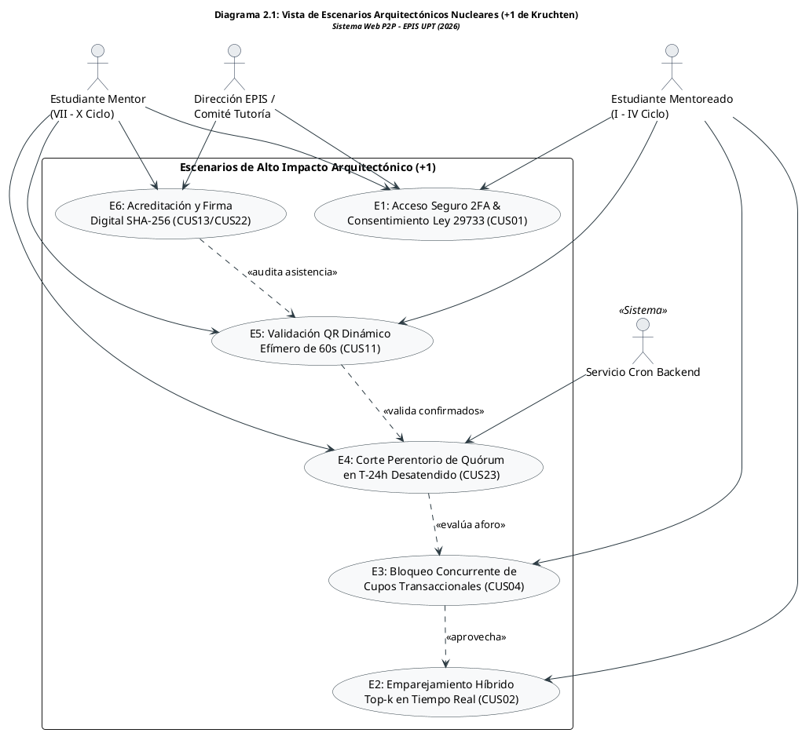

Fuente: Elaboración propia.

El análisis de la vista de escenarios demuestra que los flujos operacionales críticos están interconectados secuencialmente, condicionando las capacidades de concurrencia y seguridad de las vistas lógica y física subsiguientes.

---

### 2.2. Vista Lógica

La **Vista Lógica** describe la organización funcional del sistema a través de una descomposición estratificada en tres capas desacopladas, reforzadas internamente por el patrón **ECB (Entidad-Control-Frontera)**:
- **Capa de Presentación (Frontera / Boundary):** Compuesta por componentes React SPA que encapsulan la captura de entradas del usuario, validación reactiva de formularios, renderizado de interfaces accesibles e interactividad asíncrona.
- **Capa de Aplicación y Negocio (Control):** Orquestada por servicios FastAPI en Python, implementando controladores que aplican rigurosamente las reglas de negocio (`RN-01` a `RN-14`), ejecutan algoritmos de recomendación híbridos y gestionan las transacciones operativas.
- **Capa de Persistencia y Dominio (Entidad):** Modelada en PostgreSQL (Supabase) con tablas normalizadas, restricciones de integridad referencial, disparadores (*triggers*) y políticas de seguridad a nivel de fila (*RLS*), complementada con Redis para almacenamiento en memoria de alta velocidad.

A continuación, se ilustra la organización en capas y la interacción del patrón ECB en el sistema:

### Diagrama 2.2: Diagrama de la Vista Lógica en Capas y Subsistemas ECB

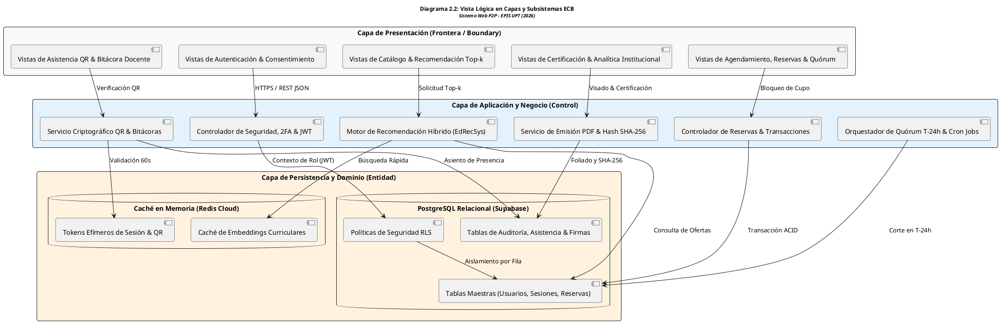

Fuente: Elaboración propia.

La vista lógica asegura un estricto principio de separación de responsabilidades: los componentes de la interfaz de usuario se comunican exclusivamente con los controladores de aplicación mediante contratos de API REST fuertemente tipados, mientras que el acceso a datos está blindado por políticas RLS y acelerado mediante Redis.

---

### 2.3. Vista del Proceso

La **Vista del Proceso** aborda los aspectos dinámicos de ejecución, concurrencia y sincronización del sistema. Se estructura en torno a los siguientes hilos de procesamiento:
- **Procesamiento de Solicitudes HTTP/HTTPS Asíncronas:** El servidor backend (FastAPI / Uvicorn) opera sobre un bucle de eventos asíncrono (*event-loop* con `asyncio`), permitiendo atender cientos de conexiones concurrentes sin bloquear hilos del sistema operativo durante operaciones de I/O a base de datos.
- **Tareas Automatizadas en Segundo Plano (Cron Jobs):** Procesos programados que se ejecutan a intervalos regulares para realizar el corte de quórum en $T-24\text{ h}$ (`CUS23`), anulación de reservas no ratificadas y cálculo periódico de embeddings temáticos.
- **Gestión Transaccional de Aforo:** Mecanismo de bloqueo a nivel de fila (`SELECT ... FOR UPDATE`) o transacciones serializables en PostgreSQL para asegurar la atomicidad e impedir condiciones de carrera durante la reserva masiva de cupos en mentorías de alta demanda.

A continuación, se modela la concurrencia entre hilos y la sincronización de procesos en el backend:

### Diagrama 2.3: Diagrama de la Vista de Procesos, Concurrencia y Sincronización

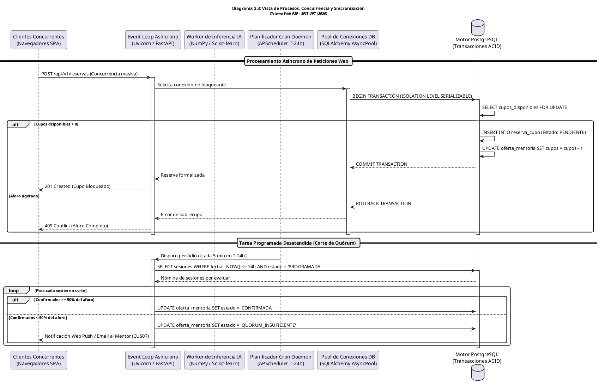

Fuente: Elaboración propia.

El modelado de procesos demuestra que el uso de programación asíncrona combinada con transacciones serializables elimina las condiciones de carrera durante la reserva de vacantes y asegura la ejecución oportuna de los cortes de quórum desatendidos.

---

### 2.4. Vista del desarrollo

La **Vista de Desarrollo** describe la arquitectura del software desde la perspectiva del entorno de construcción, dependencias y estructura de paquetes del código fuente:
- **Frontend SPA (React + TypeScript + Vite):**
  - `src/components/`: Componentes modulares reutilizables y vistas operativas (`BookingView`, `HomeView`, `GamificationView`, `RecommendationView`, `ConsentModal`).
  - `src/services/`: Clientes HTTP tipados para consumo de la API REST mediante Axios/Fetch con interceptores de tokens JWT.
  - `src/data/`: Tipos, interfaces TypeScript y esquemas de datos mock/reales.
  - `src/styles/`: Configuración de estilos atómicos con Tailwind CSS.
- **Backend API (Python + FastAPI):**
  - `app/api/`: Enrutadores de endpoints versionados (`/api/v1/...`).
  - `app/core/`: Configuración global, middleware de seguridad, manejo de JWT y conexión a bases de datos.
  - `app/services/`: Lógica de negocio pura (motor de recomendación, generador de QR, evaluador de quórum).
  - `app/models/`: Modelos ORM (SQLAlchemy) y esquemas de serialización/validación (Pydantic).
  - `app/db/`: Migraciones estructuradas con Alembic.

A continuación, se representa la organización de paquetes y dependencias del código fuente:

### Diagrama 2.4: Diagrama de la Vista de Desarrollo y Organización de Paquetes

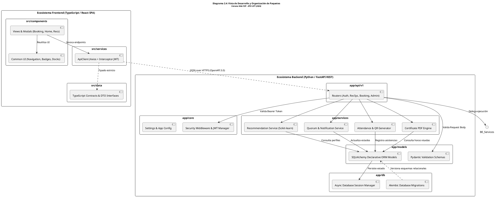

Fuente: Elaboración propia.

La vista de desarrollo evidencia que tanto el frontend como el backend mantienen una clara separación interna basada en capas funcionales y modelos de datos tipados, asegurando alta mantenibilidad (RNF09) y facilitando pruebas automatizadas desacopladas.

---

### 2.5. Vista Física

La **Vista Física** define la distribución física de los componentes de software en los nodos de hardware y servicios en la nube:
- **Nodos Clientes:** Navegadores web modernos (Chrome, Firefox, Edge, Safari) ejecutándose en computadoras de escritorio de los laboratorios de la EPIS o dispositivos móviles de mentores y mentoreados, comunicándose exclusivamente vía HTTPS (TLS 1.3).
- **Servidor de Aplicación (Backend):** Contenedor Docker desplegado en una instancia de servidor Linux, orquestado con reinicio automático y límites de memoria/CPU, exponiendo la API REST detrás de un proxy inverso NGINX que gestiona la terminación SSL y la compresión de respuestas.
- **Servicios Administrados de Datos (Cloud):**
  - Clúster de Base de Datos PostgreSQL alojado en Supabase, con réplicas de lectura automáticas y respaldos continuos.
  - Instancia en memoria Redis para caché volátil de sesiones y tokens efímeros.
  - Bucket de almacenamiento de objetos (Object Storage) para PDFs firmados de certificados y evidencias de bitácoras docentes.

A continuación, se detalla la topología de red y los nodos físicos de cómputo:

### Diagrama 2.5: Diagrama de la Vista Física y Topología de Despliegue en Red

```plantuml
@startuml
title <size:12><b>Diagrama 2.5: Vista Física y Topología de Despliegue en Red</b></size>\n<size:10><i>Sistema Web P2P - EPIS UPT (2026)</i></size>

skinparam shadowing false
skinparam roundcorner 8
skinparam defaultFontName Arial
skinparam fontSize 10

skinparam node {
    BackgroundColor #F8F9FA
    BorderColor #2B3A42
}

node "Dispositivos Clientes (Red EPIS / Internet)" as Node_Client {
    artifact "Navegador Web Moderno\n(Chrome, Firefox, Edge, Safari)" as App_Client {
        component "React 18 SPA Build\n(HTML5, CSS3, JS ES2022)" as Comp_SPA
    }
}

node "Servidor Cloud de Aplicación (Linux Container Host)" as Node_Server {
    node "Contenedor Proxy Inverso (NGINX)" as Cont_Nginx {
        component "Terminación SSL TLS 1.3\nCompresión Gzip / Brotli\nRate Limiting & WAF" as Comp_Nginx
    }
    node "Contenedor Backend (Python 3.11)" as Cont_FastAPI {
        component "Servidor ASGI Uvicorn\nFastAPI Application Framework\nMotor Algorítmico Scikit-learn" as Comp_FastAPI
    }
}

node "Servicios Cloud Administrados (Supabase / AWS)" as Node_Cloud {
    database "PostgreSQL 15+ Relacional" as Node_Postgres {
        component "Esquema Relacional\nPolíticas RLS Nativas\nÍndices B-Tree & Triggers" as Comp_Postgres
    }
    database "Redis Cloud (In-Memory)" as Node_Redis {
        component "Caché de Embeddings Top-k\nTokens Efímeros QR (TTL 60s)" as Comp_Redis
    }
    folder "Cloud Object Storage" as Node_Storage {
        component "Bucket Seguro de Certificados PDF\nEvidencias de Bitácoras Docentes" as Comp_Storage
    }
}

node "Infraestructura Institucional UPT" as Node_UPT {
    server "Servidor de Correo SMTP (@upt.pe)" as Srv_SMTP
}

' Enlaces de Red
Comp_SPA --> Comp_Nginx : HTTPS / Port 443 (TLS 1.3)
Comp_Nginx --> Comp_FastAPI : HTTP / Port 8000 (Red Interna Docker)
Comp_FastAPI --> Comp_Postgres : TCP / Port 5432 (SSL Certificado)
Comp_FastAPI --> Comp_Redis : TCP / Port 6379 (TLS / Auth)
Comp_FastAPI --> Comp_Storage : HTTPS / S3 API Rest
Comp_FastAPI --> Srv_SMTP : SMTP Seguro / Port 587 (TLS)
@enduml
```

Fuente: Elaboración propia.

El diagrama de despliegue físico ratifica que la solución opera bajo un esquema perimetral seguro: las peticiones externas acceden exclusivamente a través del proxy inverso NGINX con cifrado TLS 1.3, mientras que los datos residen en servicios gestionados de alta disponibilidad con réplicas y políticas RLS que aíslan la información a nivel de fila.


---

## 3. Objetivos y limitaciones arquitectónicas

El diseño de la arquitectura del Sistema Web P2P se encuentra gobernado por un conjunto de objetivos de calidad derivados directamente de la norma **ISO/IEC 25010** y condicionado por restricciones técnicas, institucionales y regulatorias del entorno universitario:

A continuación, se presenta la matriz de trade-offs y decisiones de diseño arquitectónico adoptadas para equilibrar los requerimientos de calidad:

### Cuadro 3.1: Matriz de Decisiones Arquitectónicas y Trade-offs de Calidad

| Decisión Arquitectónica | Objetivo de Calidad Primario | Trade-off / Costo Asociado | Justificación Técnica Institucional |
| :--- | :--- | :--- | :--- |
| **Separación Frontend SPA / Backend API REST** | Adaptabilidad y Mantenibilidad | Mayor complejidad en la gestión de estado y autenticación JWT. | Permite evolucionar la interfaz web o incorporar una app móvil nativa sin alterar la lógica de negocio. |
| **Uso de FastAPI con Python Asíncrono** | Rendimiento y Escalabilidad | Curva de aprendizaje en programación asíncrona (`async`/`await`). | Ofrece tiempos de respuesta inferiores a 100 ms y alto rendimiento en inferencia con librerías numéricas de Python (*NumPy, Scikit-learn*). |
| **Políticas RLS en PostgreSQL (Supabase)** | Seguridad e Integridad | Sobrecarga de procesamiento por consulta evaluada en el motor de base de datos. | Garantiza seguridad en profundidad: incluso si la API se ve comprometida, ningún usuario accede a filas no autorizadas. |
| **Tokens QR Dinámicos Efímeros (60s)** | Seguridad y Veracidad de Asistencia | Requiere sincronización horaria precisa (NTP) entre cliente y servidor. | Erradica por completo la suplantación de identidad y el fraude en el registro de asistencias presenciales. |
| **Caché en Redis para Ranking Top-k** | Rendimiento y Disponibilidad | Necesidad de implementar políticas de invalidación ante cambios curriculares (`RN-11`). | Reduce la carga computacional en un 80% durante picos masivos de consulta de mentorías. |

Fuente: Elaboración propia.

La matriz anterior evidencia que cada decisión de diseño responde a un análisis consciente de balance entre ventajas arquitectónicas y costos de implementación, priorizando siempre la solidez y confiabilidad del servicio académico.

### 3.1. Disponibilidad

- **Objetivo Arquitectónico:** El sistema debe ofrecer una disponibilidad mínima del **99.5%** durante el horario lectivo ordinario (lunes a sábado de 07:00 a 22:00 horas), con un tiempo medio entre fallos (MTBF) superior a 720 horas continuas.
- **Mecanismos de Soporte:**
  - Despliegue en contenedores con políticas de salud (*health checks*) y autoreiniciado ante excepciones no controladas.
  - Copias de seguridad automáticas diarias en Supabase con capacidad de recuperación ante desastres (*Point-in-Time Recovery* - PITR).
  - Manejo de degradación elegante en el frontend: si el motor de recomendación experimenta sobrecarga, la plataforma conmuta automáticamente al catálogo ordenado cronológicamente sin interrumpir las reservas.

### 3.2. Seguridad

- **Objetivo Arquitectónico:** Proteger la confidencialidad, integridad y fe pública de los datos académicos y personales, garantizando el cumplimiento irrestricto de la **Ley N° 29733 (Ley de Protección de Datos Personales del Perú)**.
- **Mecanismos de Soporte:**
  - **Autenticación Fuerte:** Acceso mediante correo institucional UPT validado con segundo factor 2FA (RFC 6238 TOTP) para mitigar el robo de credenciales.
  - **Control de Acceso Basado en Roles y Filas:** Implementación de RBAC combinado con RLS en PostgreSQL, asegurando que los mentoreados solo visualicen sus propias reservas y evaluaciones.
  - **Cifrado Integral:** Comunicación forzada mediante HTTPS/TLS 1.3 con certificados SSL clase A+, y cifrado AES-256 en reposo para datos sensibles.
  - **Disociación Criptográfica:** Anonimización irreversible mediante hashing SHA-256 en encuestas de calidad docente (`RN-13`) y almacenamiento seguro de bitácoras.

### 3.3. Adaptabilidad

- **Objetivo Arquitectónico:** Permitir la evolución modular del sistema ante cambios curriculares en la EPIS-UPT, incorporación de nuevos algoritmos de recomendación o integración con sistemas universitarios externos.
- **Mecanismos de Soporte:**
  - Arquitectura desacoplada basada en contratos de API REST documentados bajo OpenAPI 3.0 / Swagger.
  - Patrón Estrategia (*Strategy Pattern*) en el motor de recomendación, posibilitando alternar o combinar inferencia híbrida, filtrado colaborativo o redes neuronales de grafos sin modificar los controladores de consumo.
  - Diseño responsivo adaptativo que garantiza operatividad fluida en resoluciones desde 360px (smartphones) hasta 4K (monitores de laboratorio).

### 3.4. Rendimiento

- **Objetivo Arquitectónico:** Mantener una latencia de respuesta imperceptible para el usuario y una alta tasa de procesamiento en operaciones críticas de emparejamiento y reserva.
- **Mecanismos de Soporte:**
  - Tiempo de respuesta de endpoints de lectura inferior a **150 ms** para el percentil 95 ($P_{95}$) bajo condiciones normales de carga.
  - Tiempo de generación del ranking *Top-k* inferior a **200 ms**, optimizado mediante precomputación de embeddings curriculares y almacenamiento en caché Redis.
  - Capacidad para procesar al menos 50 solicitudes de reserva concurrentes por segundo sin incurrir en colisiones ni violaciones de integridad de aforo.

---

## 4. Análisis de Requerimientos

La arquitectura se fundamenta en la especificación formal contenida en el documento SRS (**FD03 - Línea Base v2.0**), articulándose en requerimientos funcionales organizados por módulos y requerimientos no funcionales estandarizados bajo ISO/IEC 25010:

### 4.1. Requerimientos funcionales

A continuación, se presenta la síntesis de los requerimientos funcionales del sistema, agrupados por módulo y categorizados según su prioridad arquitectónica (MoSCoW):

### Cuadro 4.1: Matriz de Requerimientos Funcionales y su Impacto Arquitectónico

| Código | Requerimiento Funcional | Módulo | Prioridad | Impacto en la Arquitectura |
| :---: | :--- | :---: | :---: | :--- |
| **RF01** | Autenticación institucional con 2FA | MOD-01 | Must | Middleware de autenticación JWT y validación TOTP. |
| **RF02** | Gestión de perfiles y roles (Mentor/Mentoreado/Admin) | MOD-01 | Must | Modelo de datos de usuarios y políticas RLS por rol. |
| **RF03** | Generación de recomendaciones personalizadas *Top-k* | MOD-02 | Must | Pipeline de cálculo vectorial, similitud coseno y caché Redis. |
| **RF04** | Registro de solicitudes temáticas por demanda | MOD-03 | Should | Endpoints asíncronos y actualización de vectores de demanda. |
| **RF05** | Publicación de oferta de mentoría individual/grupal | MOD-03 | Must | Validación de franjas horarias y control de aforo por modalidad. |
| **RF06** | Configuración de disponibilidad horaria del mentor | MOD-03 | Should | Matriz semanal de slots y verificación de cruces de horario. |
| **RF07** | Búsqueda reactiva y filtrado multicriterio de ofertas | MOD-03 | Must | Índices de texto completo (*Full-Text Search*) en PostgreSQL. |
| **RF08** | Reserva de cupo de mentoría académica | MOD-04 | Must | Transacciones ACID concurrentes con bloqueo de aforo. |
| **RF09** | Notificación y recordatorio de sesiones | MOD-04 | Should | Cola de mensajería asíncrona para envíos de alertas push/email. |
| **RF10** | Confirmación perentoria de asistencia en $T-24\text{ h}$ | MOD-04 | Must | Lógica de estados de reserva (`RN-08`) y verificación de ventana. |
| **RF11** | Corte automático y evaluación de quórum al 50% | MOD-04 | Must | Proceso desatendido (Cron) de alta prioridad y disparador `RN-09`. |
| **RF12** | Gestión de sesión ante quórum insuficiente | MOD-04 | Must | Máquina de estados: resolución sin penalización (`RN-10`). |
| **RF13** | Cancelación justificada de reservas | MOD-04 | Should | Liberación atómica de cupo y recálculo de aforo disponible. |
| **RF14** | Generación de código QR dinámico de asistencia | MOD-05 | Must | Algoritmo de token efímero TOTP con semilla criptográfica. |
| **RF15** | Escaneo y validación de código QR en aula | MOD-05 | Must | Endpoint de verificación rápida con ventana de tolerancia de 60s. |
| **RF16** | Registro de bitácora pedagógica post-mentoría | MOD-05 | Must | Formulario estructurado con validación temporal (< 24h, `RN-12`). |
| **RF17** | Edición y subsanación de bitácoras observadas | MOD-05 | Should | Flujo de revisión con historial de cambios y plazo de 48h. |
| **RF18** | Aplicación de encuesta de calidad post-mentoría (CSAT) | MOD-06 | Must | Mecanismo de disociación criptográfica de identidad (`RN-13`). |
| **RF19** | Asignación automática de insignias y reputación | MOD-06 | Should | Motor de reglas de gamificación y actualización de score. |
| **RF20** | Visualización de tablero de reputación y medallas | MOD-06 | Could | Componente SPA con cálculo de percentiles y progresión. |
| **RF21** | Parametrización y emisión de certificados foliados | MOD-07 | Must | Generador de PDFs con firma hash SHA-256 y sellado oficial. |
| **RF22** | Descarga y verificación pública de certificados | MOD-07 | Must | Portal público de validación criptográfica mediante QR impreso. |
| **RF23** | Auditoría y visado de bitácoras por Comité Tutoría | MOD-08 | Must | Interfaz administrativa con doble confirmación para horas oficiales. |
| **RF24** | Destacar mentorías prioritarias institucionales | MOD-08 | Should | Configuración directiva del factor de bonificación $\alpha$ (`RN-11`). |
| **RF25** | Visualización de tablero de analíticas académicas | MOD-08 | Should | Agregaciones OLAP sobre deserción, asistencia y horas efectivas. |
| **RF26** | Exportación de reportes institucionales disociados | MOD-08 | Could | Generador de reportes en CSV/PDF bajo estándar Ley N° 29733. |

Fuente: Elaboración propia.

Como se evidencia en la matriz funcional, los 26 requerimientos funcionales imponen demandas específicas sobre la arquitectura, abarcando desde la capa criptográfica (RF01, RF14, RF21) hasta el procesamiento transaccional concurrente (RF08, RF11) y la analítica directiva (RF24, RF25).

### 4.2. Requerimientos no funcionales

A continuación, se detallan los requerimientos no funcionales del sistema estructurados bajo las características de calidad de la norma **ISO/IEC 25010**:

### Cuadro 4.2: Matriz de Requerimientos No Funcionales (ISO/IEC 25010)

| Código | Característica de Calidad | Descripción Operativa y Métrica de Conformidad | Mecanismo Arquitectónico de Implementación |
| :---: | :--- | :--- | :--- |
| **RNF01** | Rendimiento (Tiempo de Respuesta) | El 95% de las peticiones HTTP GET deben responder en un tiempo inferior a **150 ms** bajo carga nominal de 100 usuarios concurrentes. | FastAPI asíncrono, índices B-Tree en PostgreSQL y compresión Gzip/Brotli en NGINX. |
| **RNF02** | Rendimiento (Inferencia *Top-k*) | El cómputo y ordenamiento de las recomendaciones personalizadas no debe exceder los **200 ms** por solicitud. | Embeddings precomputados, cálculos vectoriales vectorizados con NumPy y caché Redis con TTL. |
| **RNF03** | Concurrencia y Capacidad | El sistema debe soportar hasta **200 usuarios concurrentes** activos sin pérdida de paquetes ni degradación de servicio. | Servidor ASGI Uvicorn con múltiples *workers* y agrupación de conexiones (*connection pooling*) en base de datos. |
| **RNF04** | Seguridad (Verificación QR) | El código QR de asistencia debe generarse con un token efímero de un solo uso con ciclo de vida máximo de **60 segundos**. | Algoritmo TOTP basado en secreto compartido con ventana temporal estricta de validación. |
| **RNF05** | Seguridad (Protección de Datos) | Los datos sensibles y encuestas de calidad deben estar disociados criptográficamente garantizando anonimato bajo la **Ley N° 29733**. | Hash unidireccional SHA-256 con *salt* institucional para disociar identidades de estudiantes. |
| **RNF06** | Usabilidad (Accesibilidad y Eficiencia) | La interfaz de usuario debe obtener un puntaje superior a **85/100 en la escala SUS** (*System Usability Scale*) y cumplir WCAG 2.1 nivel AA. | Diseño centrado en el usuario, contrastes cromáticos normados y navegación por teclado en React SPA. |
| **RNF07** | Disponibilidad Operativa | Disponibilidad de servicio no menor a **99.5%** en horario institucional (07:00 a 22:00 horas, lunes a sábado). | Arquitectura en la nube con réplicas gestionadas, autorecuperación en contenedores y monitoreo de uptime. |
| **RNF08** | Fiabilidad e Integridad de Datos | Pérdida de datos nula ($RPO = 0$ para transacciones confirmadas) y tiempo de recuperación ante fallos ($RTO$) menor a **15 minutos**. | Transacciones ACID, registros WAL (*Write-Ahead Logging*) en PostgreSQL y respaldos continuos PITR. |
| **RNF09** | Mantenibilidad y Modularidad | El código fuente debe estructurarse modularmente con cobertura de pruebas unitarias superior al **80%** en componentes críticos. | Desacoplamiento por capas, tipado estricto (TypeScript y Pydantic) y pruebas automatizadas con PyTest y Vitest. |
| **RNF10** | Portabilidad y Responsividad | El sistema debe operar con total fidelidad visual y funcional en Chrome (v110+), Firefox (v110+), Edge (v110+) y Safari móvil (iOS 16+). | Maquetación web con HTML5 semántico, CSS responsivo mediante Tailwind CSS y ausencia de plugins propietarios. |

Fuente: Elaboración propia.

El cumplimiento de los requerimientos no funcionales descritos garantiza que el Sistema Web P2P no solo satisfaga las expectativas operativas de los usuarios, sino que lo haga bajo estándares estrictos de rendimiento, seguridad de datos, accesibilidad universal y alta confiabilidad institucional.

---

## 5. Vistas de Caso de Uso

En el modelo canónico de **4+1 Vistas de Philippe Kruchten**, la vista de casos de uso constituye el elemento articulador central ("el +1") que cohesiona, valida e impone los requerimientos arquitectónicos sobre las cuatro vistas estructurales y dinámicas restantes (Lógica, Proceso, Desarrollo y Física). Un caso de uso es **arquitecturalmente significativo** cuando su ejecución introduce desafíos técnicos de alta exigencia, tales como concurrencia masiva, seguridad reforzada de doble factor, transaccionalidad atómica distribuida, cómputo matricial de baja latencia o sellado criptográfico de fe pública.

La siguiente especificación gráfica modela las relaciones entre los actores del sistema y los casos de uso arquitectónicamente significativos, agrupados por subsistemas funcionales para guiar el diseño detallado del equipo de desarrollo:

### Diagrama 5.1: Diagrama de Casos de Uso Arquitectónicos Consolidados - Sistema Web P2P EPIS-UPT

```plantuml
@startuml
title <size:12><b>Diagrama 5.1: Diagrama de Casos de Uso Arquitectónicos Consolidados</b></size>\n<size:10><i>Sistema Web P2P - EPIS UPT (2026)</i></size>

left to right direction
skinparam packageStyle rectangle
skinparam shadowing false
skinparam roundcorner 8
skinparam defaultFontName Arial
skinparam fontSize 10

skinparam usecase {
    BackgroundColor #F8F9FA
    BorderColor #2B3A42
    ArrowColor #2B3A42
}

skinparam actor {
    BackgroundColor #E9ECEF
    BorderColor #1D2D44
}

actor "Mentoreado\n(I - IV Ciclo)" as Alumno
actor "Mentor Académico\n(VII - X Ciclo)" as Mentor
actor "Administrador / Tutoría\n(Dirección EPIS)" as Admin
actor "Servicio Cron Backend" as Cron <<Sistema>>
actor "Servicios Externos\n(Google Meet, Discord)" as Ext <<Sistema Externo>>

rectangle "Sistema Web P2P - Núcleo Arquitectónico" {
    package "Módulo 1: Seguridad & Gobernanza" {
        usecase "CUS01: Iniciar Sesión con 2FA\ny Consentimiento Ley 29733" as CUS01
    }

    package "Módulo 2 & 3: Emparejamiento & Demanda" {
        usecase "CUS02: Consultar Recomendaciones\nPersonalizadas Top-k" as CUS02
        usecase "CUS03: Registrar Solicitud\nTemática por Demanda" as CUS03
        usecase "CUS06: Publicar Oferta de\nMentoría Académica" as CUS06
    }

    package "Módulo 4: Reservas & Gobernanza de Quórum" {
        usecase "CUS04: Reservar Cupo de Mentoría\ncon Bloqueo Atómico" as CUS04
        usecase "CUS24: Confirmar Asistencia\nObligatoria (T >= 24h)" as CUS24
        usecase "CUS23: Ejecutar Alertas y\nCorte de Quórum (T-24h)" as CUS23
        usecase "CUS07: Gestionar Sesión ante\nQuórum Insuficiente (<50%)" as CUS07
    }

    package "Módulo 5 & 6: Trazabilidad, Asistencia & Calidad" {
        usecase "CUS11: Registrar Asistencia\nmediante Código QR Dinámico" as CUS11
        usecase "CUS10: Registrar Bitácora\nPedagógica de Sesión" as CUS10
        usecase "CUS05: Responder Encuesta\nde Calidad Post-Mentoría" as CUS05
    }

    package "Módulo 7 & 8: Certificación & Fiscalización" {
        usecase "CUS12: Destacar Asignaturas\nCríticas Prioritarias" as CUS12
        usecase "CUS22: Auditar Bitácoras y\nVisar Horas Oficiales" as CUS22
        usecase "CUS13: Parametrizar y Emitir\nCertificados con SHA-256" as CUS13
        usecase "CUS14: Visualizar Tablero de\nAnalíticas Institucionales" as CUS14
    }
}

' Asociaciones del Mentoreado
Alumno --> CUS01
Alumno --> CUS02
Alumno --> CUS03
Alumno --> CUS04
Alumno --> CUS24
Alumno --> CUS11
Alumno --> CUS05

' Asociaciones del Mentor
Mentor --> CUS01
Mentor --> CUS06
Mentor --> CUS07
Mentor --> CUS10

' Asociaciones del Administrador Institucional
Admin --> CUS01
Admin --> CUS12
Admin --> CUS22
Admin --> CUS13
Admin --> CUS14

' Asociaciones del Sistema Cron
Cron --> CUS23

' Integraciones con Sistemas Externos
CUS06 ..> Ext : <<integra>> (Meet API / Discord)

' Relaciones y Dependencias Arquitectónicas
CUS04 ..> CUS02 : <<precede>>
CUS24 ..> CUS04 : <<requiere reserva>>
CUS23 ..> CUS24 : <<evalúa ratificaciones>>
CUS07 ..> CUS23 : <<extend>> (Quórum < 50%)
CUS11 ..> CUS24 : <<valida ticket activo>>
CUS10 ..> CUS11 : <<incluye nómina presencial>>
CUS05 ..> CUS11 : <<habilita post-asistencia>>
CUS12 ..> CUS02 : <<bonifica factor alfa (RN-11)>>
CUS22 ..> CUS10 : <<audita evidencias>>
CUS13 ..> CUS22 : <<requiere visado previo (RN-14)>>
CUS14 ..> CUS05 : <<agrega satisfacción anónima (RN-13)>>
@enduml
```

Fuente: Elaboración propia.

Como se desprende del diagrama anterior, los casos de uso arquitectónicamente significativos establecen una cadena de dependencias funcionales fuertemente acopladas a las reglas de negocio institucionales:
1. **Cadena de Reserva y Quórum:** La reserva inicial (`CUS04`) no constituye una inscripción definitiva, sino un bloqueo provisional que exige ratificación obligatoria (`CUS24`). El corte desatendido en $T-24\text{ h}$ (`CUS23`) actúa como juez de gobernanza, anidando la extensión condicional hacia la gestión de contingencia del mentor (`CUS07`).
2. **Cadena de Fe Pública y Certificación:** La validez institucional de las horas formativas demanda una estricta precedencia: asistencia verificada físicamente vía QR (`CUS11`) $\rightarrow$ bitácora docente estructurada (`CUS10`) $\rightarrow$ auditoría y visado por el Comité de Tutoría (`CUS22`) $\rightarrow$ generación del certificado oficial foliado con firma hash SHA-256 (`CUS13`).

A continuación, se detalla el impacto directo que cada caso de uso nuclear ejerce sobre las distintas perspectivas del modelo arquitectónico:

### Cuadro 5.1: Matriz de Casos de Uso Arquitecturalmente Significativos y su Impacto en Vistas 4+1

| Código CUS | Denominación del Caso de Uso | Vista Lógica (ECB) | Vista del Proceso | Vista de Desarrollo | Vista Física / Despliegue |
| :---: | :--- | :--- | :--- | :--- | :--- |
| **CUS01** | Iniciar sesión institucional con 2FA | Controlador Auth / Entidad Usuario y Consentimiento | Hilo asíncrono de verificación TOTP y expiración JWT (15 min). | Módulo `app/core/security.py` y librerías `pyotp`, `python-jose`. | Conexión SSL/TLS 1.3 con servidor SMTP institucional UPT. |
| **CUS02** | Consultar recomendaciones Top-k | Controlador RecSys / Entidad Perfil y Embedding | Cómputo matricial vectorizado con NumPy y consulta paralela en Redis. | Subpaquete `app/services/recsys/` y modelos Scikit-learn. | Servidor backend con aceleración vectorial y clúster Redis en memoria. |
| **CUS04** | Reservar cupo de mentoría | Controlador Booking / Entidad Reserva y Aforo | Transacción serializable con bloqueo de fila (`FOR UPDATE`) en PostgreSQL. | Componente `BookingView.tsx` y servicio transaccional FastAPI. | Instancia primaria de Supabase con réplica de lectura desacoplada. |
| **CUS23** | Alertas y corte de quórum (T-24h) | Controlador Cron / Entidad Sesión y Transición | Proceso daemon desatendido con intervalos de escaneo cada 5 minutos. | Tareas programadas con `APScheduler` o Celery Beat en Python. | Worker backend independiente con alta resiliencia y reinicio automático. |
| **CUS11** | Registrar asistencia por código QR | Controlador Attendance / Entidad AsistenciaQR | Validación criptográfica de tokens efímeros con tolerancia temporal de 60s. | Generador QR en React SPA y validador HMAC-SHA256 en backend. | Sincronización estricta mediante protocolo NTP en nodos de cómputo. |
| **CUS10** | Registrar bitácora pedagógica | Controlador Logbook / Entidad Bitácora | Escritura transaccional y cambio de estado de sesión a `FINALIZADA`. | Formulario estructurado con validación temporal estricta (< 24h). | Bucket de almacenamiento para evidencias digitales y PostgreSQL. |
| **CUS13** | Parametrizar y emitir certificados | Controlador Certificate / Entidad Certificado | Pipeline de renderizado PDF en memoria y estampado de firma SHA-256. | Librería `ReportLab` o `WeasyPrint` con sellado digital criptográfico. | Almacenamiento seguro de objetos y CDN con enlaces firmados. |
| **CUS22** | Auditar bitácoras y visar horas | Controlador Audit / Entidad VisadoHoras | Transacción de doble confirmación con registro inmutable de auditoría. | Panel administrativo con interfaz analítica en React SPA. | Políticas RLS en base de datos para restringir acceso exclusivo a Dirección. |

Fuente: Elaboración propia.

El análisis de la matriz confirma que cada caso de uso arquitectónicamente significativo se traduce en soluciones técnicas concretas distribuidas en todas las vistas de la arquitectura, garantizando la consistencia global del sistema.

---

## 6. Vista Lógica

La **Vista Lógica** formaliza la descomposición funcional del sistema, estructurando sus responsabilidades bajo una arquitectura estratificada en tres capas (Presentación, Aplicación/Negocio y Persistencia) y gobernada por el patrón arquitectónico **Entidad-Control-Frontera (ECB)** derivado de las directrices metodológicas de **UWE**.

### 6.1. Diagrama Contextual

El Diagrama Contextual establece las fronteras operativas de la plataforma, delimitando las interfaces seguras entre el núcleo del software, los actores humanos de la comunidad EPIS y los subsistemas institucionales externos:

### Diagrama 6.1: Diagrama Contextual del Sistema Web P2P EPIS-UPT (Límites y Entorno Operativo)

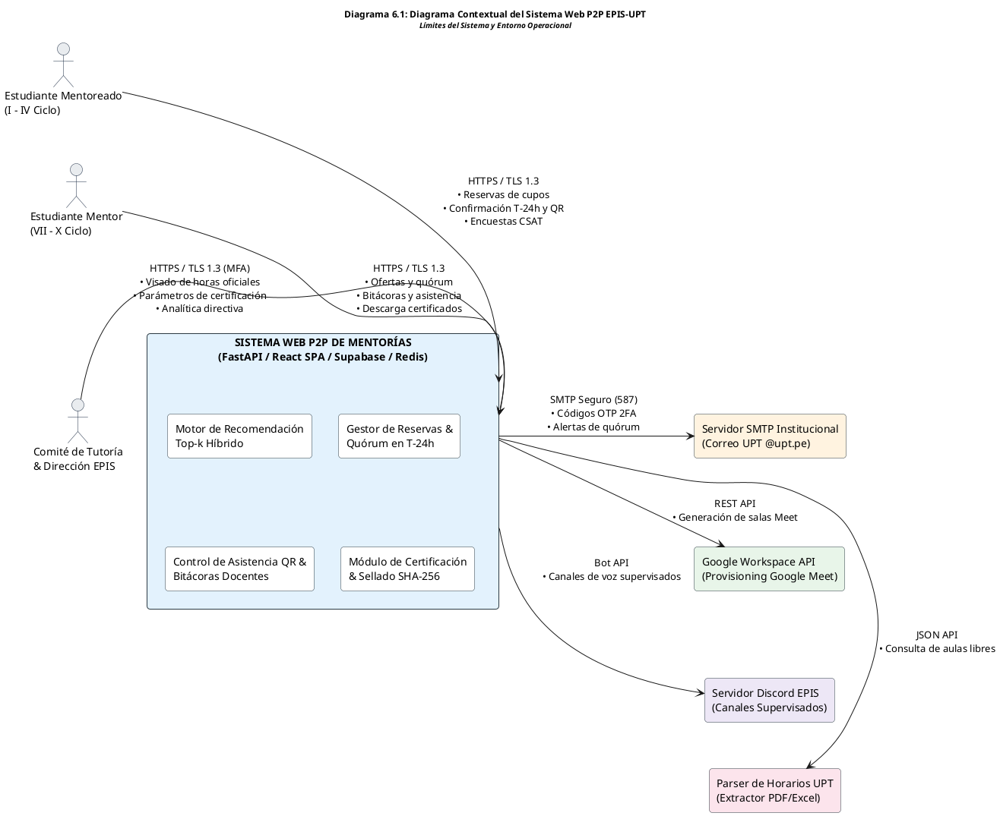

Fuente: Elaboración propia.

El análisis del Diagrama Contextual clarifica tres aspectos arquitectónicos de vital importancia:
1. **Límites de Responsabilidad:** El Sistema Web P2P no duplica funciones del ERP institucional ni gestiona matrículas formales; su alcance se concentra estrictamente en la intermediación, trazabilidad pedagógica y certificación del aprendizaje entre pares.
2. **Protocolos Seguros de Interfaz:** Todas las comunicaciones de usuario se canalizan bajo HTTPS forzado con TLS 1.3, mientras que las integraciones con servicios externos emplean autenticación delegada mediante tokens OAuth 2.0 y secretos institucionales cifrados.
3. **Aislamiento de Fallos:** Si los servicios de Google Meet o Discord experimentan indisponibilidad externa, el sistema degrada su funcionalidad de aprovisionamiento virtual a la modalidad manual sin interrumpir la persistencia de ofertas ni la asignación de aulas físicas provistas por el parser institucional.

### 6.2. Descomposición en Capas y Patrón Entidad-Control-Frontera (ECB)

Para estructurar la lógica interna del sistema, se adopta el patrón **ECB** (*Entity-Control-Boundary*), distribuyendo las clases en tres estereotipos complementarios:
- **Objetos Frontera (`Boundary`):** Vistas, modales y formularios React SPA que capturan eventos del usuario y renderizan respuestas.
- **Objetos de Control (`Control`):** Servicios y controladores FastAPI que ejecutan algoritmos, validan ventanas temporales y orquestan transacciones.
- **Objetos de Entidad (`Entity`):** Modelos ORM y tablas PostgreSQL que representan el estado persistente y seguro del dominio académico.

A continuación, se presenta la correspondencia de componentes ECB organizada por módulo funcional:

### Cuadro 6.1: Mapeo de Componentes del Patrón ECB por Módulo Funcional

| Módulo | Objeto Frontera (`Boundary`) | Objeto de Control (`Control`) | Objeto de Entidad (`Entity`) |
| :---: | :--- | :--- | :--- |
| **MOD-01** | `LoginView`, `TwoFactorModal`, `ConsentModal` | `AuthService`, `TOTPValidator`, `JWTManager` | `Usuario`, `Rol`, `ConsentimientoLegal` |
| **MOD-02** | `RecommendationView`, `CourseBadgeWidget` | `RecSysEngine`, `CosineSimilarityService` | `PerfilAcademico`, `VectorCompetencia`, `EmbeddingTema` |
| **MOD-03** | `PublishOfferingForm`, `DemandRequestModal` | `OfferingManager`, `DemandAggregatorService` | `OfertaMentoria`, `SolicitudDemanda`, `AsignaturaFiltro` |
| **MOD-04** | `BookingModal`, `ConfirmationView`, `QuorumAlertView` | `BookingService`, `QuorumEvaluatorCron`, `CancelService` | `ReservaCupo`, `EstadoReserva`, `EspacioFisico`, `EspacioVirtual` |
| **MOD-05** | `QRCodeGeneratorView`, `QRScannerView`, `LogbookForm` | `QRCryptoService`, `AttendanceValidator`, `LogbookService` | `TicketAsistenciaQR`, `BitacoraDocente`, `DetalleAsistencia` |
| **MOD-06** | `CSATSurveyModal`, `GamificationDashboard` | `SurveyProcessor`, `ReputationCalculatorService` | `EncuestaCalidad`, `ReputacionMentor`, `InsigniaOtorgada` |
| **MOD-07** | `CertificateDownloadView`, `QRVerifierPortal` | `PDFGeneratorService`, `SHA256Signer`, `VerifyService` | `CertificadoOficial`, `FoliadoInstitucional` |
| **MOD-08** | `AnalyticsDashboard`, `LogbookAuditView`, `PrioritySettings` | `AuditWorkflowService`, `InstitutionalAnalyticsEngine` | `VisadoBitacora`, `ConfiguracionPrioridad`, `MetricaDesercion` |

Fuente: Elaboración propia.

La segregación formal en componentes ECB garantiza un alto desacoplamiento y facilita la construcción de pruebas unitarias automatizadas sobre los controladores sin requerir la presencia de la interfaz gráfica ni la conexión directa a base de datos.

---

## 7. Vista de Procesos

La **Vista de Procesos** aborda los aspectos dinámicos y temporales del sistema, describiendo cómo se transforman los flujos operacionales desde el estado informal actual (**As-Is**) hacia el proceso optimizado y trazable (**To-Be**) soportado por la plataforma web.

### 7.1. Diagrama de Proceso Actual

El diagnóstico de la asesoría académica actual en la EPIS-UPT evidencia un flujo fragmentado, descoordinado e informal, caracterizado por canales no oficiales y la ausencia total de trazabilidad institucional. El siguiente modelo de actividades captura esta línea base operacional (**As-Is**) identificando los puntos críticos de abandono y sobrecarga docente:

### Diagrama 7.1: Diagrama de Actividades del Proceso Actual de Asesoría Informal en la EPIS-UPT (As-Is)

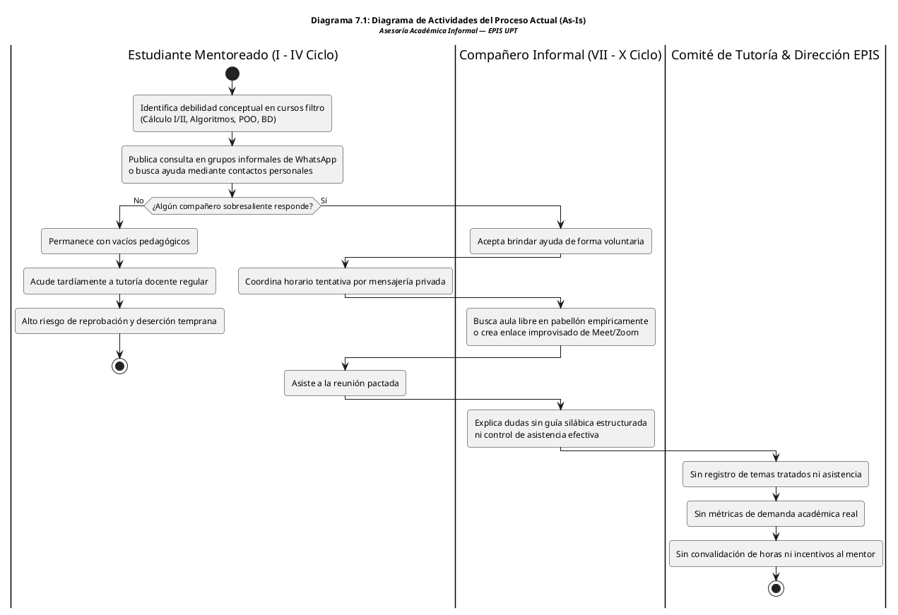

Fuente: Elaboración propia.

El análisis del proceso As-Is pone en evidencia las siguientes deficiencias estructurales:
1. **Asimetría Informativa y Barrera Social:** El acceso al refuerzo académico depende de la afinidad personal y de las redes de contacto del alumno, excluyendo a estudiantes tímidos o de primeros ciclos que no conocen alumnos mayores.
2. **Uso Precario e Ineficiente de Infraestructura:** El uso de aulas físicas ocurre sin reserva formal, propiciando desalojos intempestivos cuando coincide con clases oficiales de cátedra.
3. **Cero Trazabilidad y Desincentivo:** La Dirección de Escuela no posee datos para orientar intervenciones preventivas, y los mentores abandonan el apoyo debido a que sus horas dedicadas no reciben reconocimiento curricular.

### 7.2. Diagrama de Proceso Propuesto

El proceso propuesto (**To-Be**) digitaliza y reestructura el ciclo de mentoría mediante la automatización de reglas de negocio, gobernanza de quórum y acreditación oficial de horas. El siguiente diagrama de actividades modela este flujo de trabajo optimizado, articulando las calles de responsabilidad (*swimlanes*) entre los actores humanos y los servicios autónomos del sistema:

### Diagrama 7.2: Diagrama de Actividades del Proceso Propuesto de Mentorías P2P en la EPIS-UPT (To-Be)

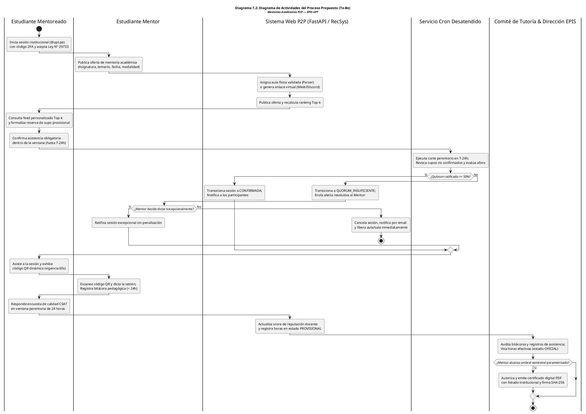

Fuente: Elaboración propia.

El análisis comparativo del flujo To-Be evidencia las siguientes transformaciones sustanciales:
1. **Gobernanza Automatizada de Recursos:** El corte en $T-24\text{ h}$ y el umbral de quórum del 50% (`RN-08`/`RN-09`) garantizan que ningún aula física ni enlace virtual se reserve en vano, liberando espacios con anticipación suficiente para otros grupos académicos.
2. **Garantía Antifraude en Asistencia:** La sustitución de firmas manuales en papel por códigos QR dinámicos con semillas temporales de 60 segundos (`CUS11`, `RNF04`) elimina la suplantación de identidad y asegura presencia física fehaciente.
3. **Cierre de Ciclo Institucional:** La obligatoriedad de la bitácora docente en menos de 24 horas (`RN-12`), combinada con la auditoría del Comité de Tutoría (`RN-14`), confiere pleno valor probatorio a las constancias emitidas para la convalidación de horas de servicio estudiantil según el Art. 40 de la Ley Universitaria N° 30220.

---

## 8. Vista de Despliegue

La **Vista de Despliegue** describe la asignación de los componentes lógicos y de software en unidades de ejecución autónomas (contenedores de software) y su distribución sobre la infraestructura en la nube. Conforme a las directrices de modelado arquitectónico **C4 (Nivel 2: Contenedores)** adaptadas a la metodología **UWE**, esta vista delimita las responsabilidades de cada contenedor, las fronteras de red y los protocolos de comunicación que garantizan alta disponibilidad (RNF07), baja latencia (RNF01) y aislamiento perimetral de seguridad (RNF05).

### 8.1. Diagrama de Contenedor

La siguiente topología de contenedores de software delimita formalmente el entorno del cliente, el middleware de aplicación, los servicios administrados de datos y las plataformas externas para guiar el aprovisionamiento de infraestructura:

### Diagrama 8.1: Diagrama de Contenedores del Sistema Web P2P (Estándar C4 Nivel 2 / UWE)

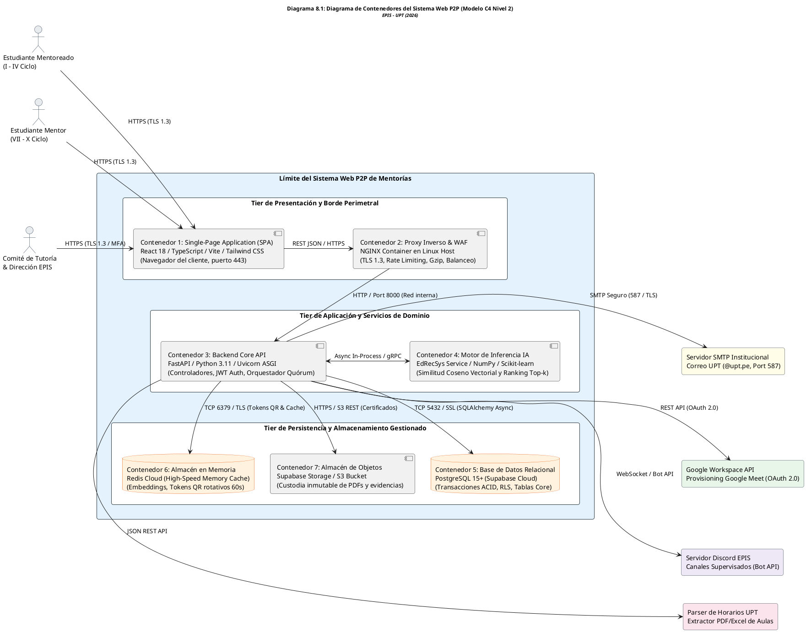

Fuente: Elaboración propia.

El análisis del Diagrama de Contenedores permite deducir los siguientes principios arquitectónicos de operación:
1. **Aislamiento Perimetral y Protección contra Ataques:** El contenedor NGINX actúa como punto único de entrada para el tráfico externo, aplicando reglas estrictas de limitación de tasa (*rate limiting* para mitigar denegaciones de servicio DDoS) y forzando el protocolo TLS 1.3 antes de delegar las peticiones a la red interna de contenedores.
2. **Desacoplamiento de Cómputo Intensivo:** El motor de recomendación híbrido (`EdRecSys`) opera de forma asíncrona respecto al servidor web central, apoyándose en la caché en memoria Redis para retornar rankings personalizados en menos de 200 ms (`RNF02`) sin sobrecargar el motor relacional PostgreSQL.
3. **Persistencia Segura en Profundidad:** La base de datos PostgreSQL ejecuta políticas RLS nativas en cada consulta, asegurando que aún en el caso hipotético de una vulnerabilidad en los controladores del backend, ningún usuario pueda vulnerar el aislamiento de datos protegido por la Ley N° 29733.

A continuación, se resume la responsabilidad operativa, tecnologías y protocolos de cada contenedor del sistema:

### Cuadro 8.1: Matriz de Contenedores de Software, Tecnologías y Protocolos de Comunicación

| Contenedor | Tecnología Principal | Entorno de Ejecución | Responsabilidad Operativa | Protocolo / Interfaz |
| :--- | :--- | :--- | :--- | :--- |
| **C1: Frontend SPA** | React 18, TypeScript, Vite, Tailwind CSS | Navegador Web (Cliente) | Renderizado de interfaces reactivas, captura de eventos de usuario y presentación de feeds. | HTTPS (HTML5/CSS3/JS) |
| **C2: Proxy Inverso** | NGINX Alpine Linux | Contenedor Docker (Host) | Terminación SSL, compresión Brotli/Gzip, balanceo de carga y mitigación WAF/DDoS. | HTTPS (Ext) / HTTP (Int) |
| **C3: Backend Core API** | Python 3.11, FastAPI, Uvicorn | Contenedor Docker (Host) | Gestión de autenticación JWT/2FA, lógica de negocio, reglas RN-01 a RN-14 y orquestación. | RESTful JSON (OpenAPI) |
| **C4: Motor RecSys** | Scikit-learn, NumPy, SciPy | Subproceso / Worker Python | Indexación de competencias, cálculo de similitud coseno vectorial y ponderación directiva (RN-11). | In-Process Memory / gRPC |
| **C5: Base de Datos** | PostgreSQL 15+ (Supabase) | Servicio Cloud Administrado | Persistencia relacional, integridad referencial 3FN, transacciones ACID y control RLS. | TCP 5432 (SSL TLS 1.3) |
| **C6: Caché en Memoria** | Redis Cloud v7 | Servicio Cloud Administrado | Almacenamiento volátil de embeddings, sesiones activas y tokens efímeros QR (TTL 60s). | TCP 6379 (TLS / Auth) |
| **C7: Object Storage** | Supabase Storage (S3 API) | Almacén Cloud de Objetos | Custodia inmutable de certificados oficiales PDF foliados y evidencias fotográficas de bitácoras. | HTTPS / REST S3 API |

Fuente: Elaboración propia.

La matriz evidencia una arquitectura robusta, modular y alineada a los estándares de la industria, garantizando que cada contenedor ejecute tareas altamente cohesivas con dependencias estrictamente controladas.

---

## 9. Vista de Implementación

La **Vista de Implementación** (o Vista de Desarrollo a nivel estructural) modela la organización estática del código fuente, los componentes ejecutables, sus puertos e interfaces de comunicación, facilitando la comprensión del flujo de dependencias entre módulos y asegurando la testabilidad unitaria e integración continua del sistema.

### 9.1. Diagrama de Componentes

La siguiente descomposición modular modela los componentes ejecutables del frontend y backend, sus puertos de interfaz y los adaptadores de persistencia e integración:

### Diagrama 9.1: Diagrama de Componentes de Implementación del Sistema Web P2P

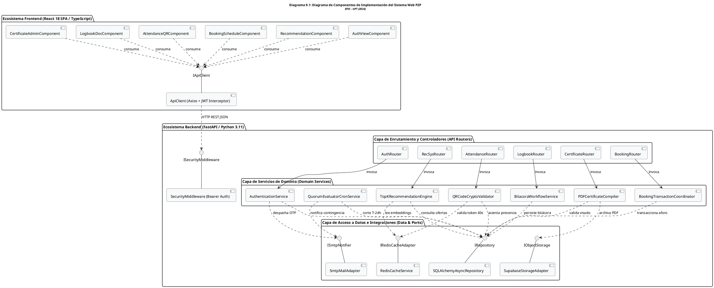

Fuente: Elaboración propia.

El diseño de componentes formaliza el principio de inversión de dependencias (*Dependency Inversion Principle* - DIP) y la separación de capas:
1. **Desacoplamiento de Servicios de Dominio:** Los servicios centrales (`Srv_Rec`, `Srv_Book`, `Srv_QR`) no dependen directamente de las librerías de infraestructura (como Redis o Supabase), sino de interfaces y puertos abstractos (`IRepository`, `IRedisCacheAdapter`, `ISmtpNotifier`), permitiendo sustituir o simular (*mockear*) dichos adaptadores en pruebas automatizadas.
2. **Seguridad Centralizada en el Pipeline:** El componente `SecurityMiddleware` intercepta cada petición entrante, decodifica el token JWT criptográfico, valida su expiración e inyecta el contexto de usuario autenticado en los enrutadores correspondientes antes de ejecutar la lógica de negocio.

A continuación, se documentan los puertos, interfaces y contratos principales de los componentes de backend:

### Cuadro 9.1: Matriz de Componentes de Implementación, Puertos e Interfaces

| Componente de Implementación | Interfaz / Puerto | Métodos Principales | Módulo Asociado |
| :--- | :--- | :--- | :---: |
| **`SecurityMiddleware`** | `ISecurityMiddleware` | `verify_jwt_token()`, `enforce_role_permission()` | MOD-01 |
| **`AuthenticationService`** | `IAuthService` | `login_institutional()`, `verify_otp_2fa()`, `sign_legal_consent()` | MOD-01 |
| **`TopKRecommendationEngine`** | `IRecSysService` | `compute_cosine_similarity()`, `generate_top_k_ranking()`, `apply_course_boost()` | MOD-02 |
| **`BookingTransactionCoordinator`** | `IBookingService` | `lock_seat_atomic()`, `confirm_attendance_window()`, `cancel_reservation()` | MOD-04 |
| **`QuorumEvaluatorCronService`** | `ICronService` | `evaluate_quorum_t24()`, `trigger_contingency_alert()`, `revoke_unconfirmed()` | MOD-04 |
| **`QRCodeCryptoValidator`** | `IQRAttendanceService` | `generate_ephemeral_qr()`, `validate_scan_ticket()`, `register_effective_attendance()` | MOD-05 |
| **`BitacoraWorkflowService`** | `ILogbookService` | `save_session_logbook()`, `submit_quality_survey()`, `calculate_csat()` | MOD-05 / MOD-06 |
| **`PDFCertificateCompiler`** | `ICertificateService` | `compile_pdf_document()`, `stamp_sha256_hash()`, `verify_public_certificate()` | MOD-07 |

Fuente: Elaboración propia.

La estructuración de interfaces formalizada en el cuadro anterior garantiza que cada módulo cumpla estrictamente con el principio de responsabilidad única (*Single Responsibility Principle*), facilitando el mantenimiento y las pruebas de regresión.

---

## 10. Vista de Datos

La **Vista de Datos** modela la estructura lógica y relacional de persistencia de la plataforma, asegurando el cumplimiento de la **Tercera Forma Normal (3FN)**, la integridad referencial relacional en PostgreSQL (Supabase) y la gobernanza estricta de privacidad requerida por la **Ley N° 29733 de Protección de Datos Personales**.

### 10.1. Diagrama Entidad Relación

El modelo Entidad-Relación define la topología de almacenamiento físico y relacional sobre PostgreSQL (Supabase), estructurado bajo la Tercera Forma Normal (3FN) con aislamiento por políticas RLS y anonimización de encuestas:

### Diagrama 10.1: Diagrama Entidad-Relación Relacional del Sistema Web P2P (PostgreSQL / Supabase)

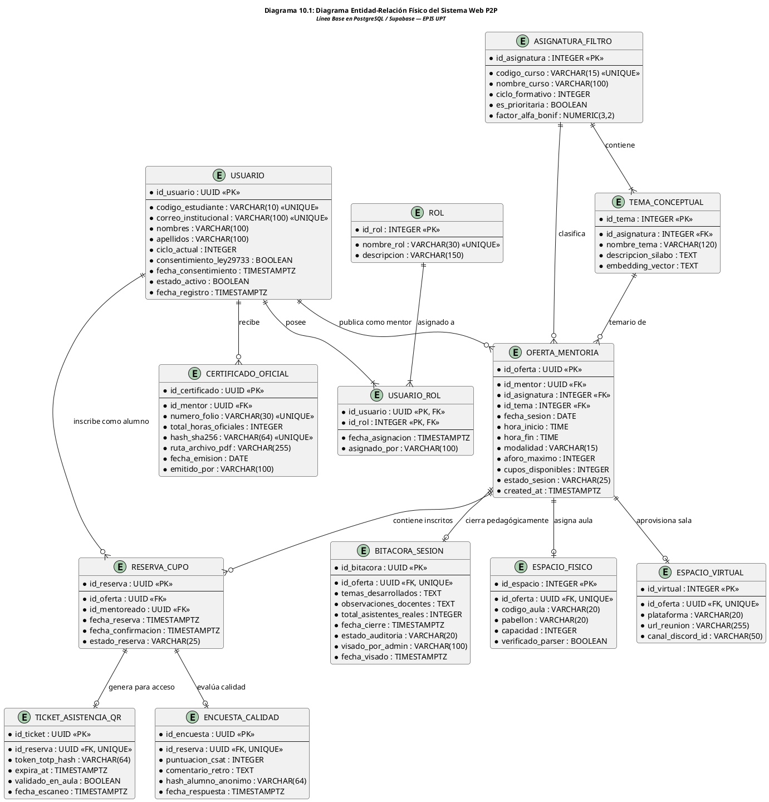

Fuente: Elaboración propia.

El análisis del modelo relacional revela las siguientes decisiones técnicas de alto valor:
1. **Normalización y Atomicidad de Aforos:** La tabla `OFERTA_MENTORIA` desacopla la ubicación física (`ESPACIO_FISICO`) de la virtual (`ESPACIO_VIRTUAL`), mientras que la tabla `RESERVA_CUPO` maneja estados canónicos inmutables (`PENDIENTE_CONFIRMACION`, `CONFIRMADA`, `NO_CONFIRMADA`, `CANCELADA_USUARIO`), asegurando que las sumas de cupos se mantengan matemáticamente coherentes ante cancelaciones o cortes desatendidos.
2. **Garantía Criptográfica Antifraude:** La entidad `TICKET_ASISTENCIA_QR` almacena únicamente el resumen hash SHA-256 del token efímero (`token_totp_hash`) y su marca de tiempo de expiración (`expira_at`), imposibilitando la reutilización de códigos escaneados fuera de la ventana de 60 segundos.
3. **Disociación según Ley N° 29733:** En la tabla `ENCUESTA_CALIDAD`, la identidad del estudiante no se almacena en texto plano ni mediante clave foránea directa hacia `USUARIO`, sino a través de `hash_alumno_anonimo`, garantizando la imposibilidad de vincular la calificación emitida con el historial académico del evaluador (`RN-13`).

A continuación, se documenta el diccionario de datos canónico de las entidades relacionales:

### Cuadro 10.1: Diccionario de Datos Canónico de las Entidades Maestras

| Entidad | Clave Primaria (PK) | Claves Foráneas (FK) | Restricciones de Integridad y Reglas |
| :--- | :--- | :--- | :--- |
| **`USUARIO`** | `id_usuario` (UUID) | — | `codigo_estudiante` y `correo_institucional` únicos. `consentimiento_ley29733 = true` obligatorio para operar (`RN-01`, `RN-02`). |
| **`ASIGNATURA_FILTRO`** | `id_asignatura` (INT) | — | Cursos formativos (I al IV ciclo). Si `es_prioritaria = true`, aplica `factor_alfa_bonif` $\in [1.05, 1.50]$ (`RN-11`). |
| **`OFERTA_MENTORIA`** | `id_oferta` (UUID) | `id_mentor`, `id_asignatura`, `id_tema` | `aforo_maximo` $\le 10$ (Presencial) o $\le 20$ (Virtual) (`RN-05`). Publicación con $T \ge 24\text{ h}$ de antelación (`RN-04`). |
| **`RESERVA_CUPO`** | `id_reserva` (UUID) | `id_oferta`, `id_mentoreado` | Unicidad de par `(id_oferta, id_mentoreado)`. Ratificación obligatoria hasta $T-24\text{ h}$ (`RN-08`). |
| **`TICKET_ASISTENCIA_QR`** | `id_ticket` (UUID) | `id_reserva` | Vigencia de semilla temporal de 60 segundos (`RNF04`). Actualiza `validado_en_aula = true` en escaneo. |
| **`BITACORA_SESION`** | `id_bitacora` (UUID) | `id_oferta` | Cierre en plazo $< 24\text{ h}$ post-sesión (`RN-12`). Estado transiciona de `BORRADOR` a `REGISTRADA` y luego `VISADA` (`RN-14`). |
| **`ENCUESTA_CALIDAD`** | `id_encuesta` (UUID) | `id_reserva` | Ventana temporal de llenado de 24 horas (`RN-13`). Puntuación entera del 1 al 5 y disociación SHA-256. |
| **`CERTIFICADO_OFICIAL`** | `id_certificado` (UUID)| `id_mentor` | Requiere horas acumuladas $\ge$ umbral semestral y bitácoras `VISADAS`. `hash_sha256` y `numero_folio` únicos (`RN-14`). |

Fuente: Elaboración propia.

El diseño de datos formalizado en el cuadro anterior consolida una base relacional íntegra, auditable y directamente transferible a la base de datos PostgreSQL en Supabase.

---

## 11. Calidad

La calidad arquitectónica del Sistema Web P2P se evalúa bajo el estándar **ISO/IEC 25010** mediante el método formal **ATAM** (*Architecture Tradeoff Analysis Method*, desarrollado por el *Software Engineering Institute* - SEI). Un escenario de calidad describe formalmente la respuesta observable del software ante un estímulo específico bajo condiciones controladas, estructurado en seis dimensiones: **Fuente del Estímulo, Estímulo, Artefacto Impactado, Entorno Operativo, Respuesta del Sistema** y **Medida de la Respuesta**.

### 11.1. Escenario de Seguridad

- **Fuente:** Usuario malintencionado en la red o estudiante no autorizado.
- **Estímulo:** Intento de reserva de cupo sin autenticación de doble factor, o suplantación de asistencia mediante reutilización de código QR capturado en fotografía.
- **Artefacto:** `SecurityMiddleware`, `QRCryptoValidator` y políticas RLS de PostgreSQL.
- **Entorno:** Sistema en operación nominal concurrente en periodo de exámenes.
- **Respuesta:** El middleware intercepta la petición, verifica la invalidez del token JWT o la expiración del código QR (> 60 segundos), aborta la transacción, emite código HTTP 401/403 y registra el intento fallido en la bitácora inmutable de auditoría.
- **Medida de Respuesta:** 100% de peticiones no autorizadas bloqueadas; tolerancia temporal máxima de 60 segundos para tokens QR; cero accesos no consentidos bajo la Ley N° 29733.

### 11.2. Escenario de Usabilidad

- **Fuente:** Estudiante mentoreado de primer ciclo con nula experiencia previa en la plataforma.
- **Estímulo:** El estudiante ingresa para buscar asesoría en Cálculo I, explora el feed de recomendaciones *Top-k* y formaliza una reserva de cupo.
- **Artefacto:** Interfaz React SPA (`RecommendationView`, `BookingModal`).
- **Entorno:** Conexión desde smartphone o computadora de escritorio en red móvil 4G/WiFi.
- **Respuesta:** La interfaz carga el feed personalizado en menos de 2 segundos, resalta con distintivos visuales dorados las mentorías prioritarias institucionales (`RN-11`) y permite culminar la reserva en un máximo de tres interacciones de pantalla con retroalimentación clara.
- **Medida de Respuesta:** Tasa de éxito en la tarea superior al 95%; tiempo promedio de reserva menor a 45 segundos; puntaje promedio en la escala estandarizada SUS superior a **85/100 puntos** (`RNF06`).

### 11.3. Escenario de Adaptabilidad

- **Fuente:** Comité de Tutoría o Equipo de Desarrollo de Software.
- **Estímulo:** Incorporación de un nuevo modelo de recomendación basado en filtrado colaborativo matricial o ajuste en los factores de ponderación alfa ($\alpha$) para nuevas asignaturas críticas.
- **Artefacto:** `TopKRecommendationEngine` y archivo de configuración algorítmica.
- **Entorno:** Sistema en producción con sesiones activas programadas.
- **Respuesta:** El motor algorítmico, implementado bajo el patrón Estrategia (*Strategy Pattern*), conmuta al nuevo algoritmo mediante inyección de dependencias y actualiza el factor alfa en base de datos sin requerir recompilación del frontend ni reinicio del servidor web.
- **Medida de Respuesta:** Tiempo de despliegue y conmutación de algoritmo menor a 5 minutos; cero tiempo de inactividad (*zero-downtime*); retrocompatibilidad total con los contratos de API OpenAPI 3.0.

### 11.4. Escenario de Disponibilidad

- **Fuente:** Falla en la conectividad del proveedor de infraestructura en la nube o caída de un contenedor backend por sobrecarga de memoria.
- **Estímulo:** Un proceso experimenta una excepción crítica y el contenedor Docker de FastAPI finaliza de manera imprevista.
- **Artefacto:** Orquestador de contenedores Docker, proxy inverso NGINX y pool de PostgreSQL.
- **Entorno:** Periodo de alta demanda previo al corte de quórum en $T-24\text{ h}$.
- **Respuesta:** El proxy NGINX detecta la falta de respuesta inmediata en el puerto local, conmuta las peticiones a la réplica de contingencia, y la política de salud (*restart: always*) reinicia el contenedor en menos de 10 segundos, reanudando la atención sin pérdida de transacciones ACID en vuelo.
- **Medida de Respuesta:** Disponibilidad neta superior al **99.5%** en horario lectivo (`RNF07`); tiempo medio de recuperación ($RTO$) menor a 15 segundos; cero inconsistencias de aforo ($RPO = 0$).

### 11.5. Otro Escenario: Escenario de Trazabilidad y Auditoría

- **Fuente:** Comisión de Acreditación Universitaria o Secretaría Académica de la UPT.
- **Estímulo:** Solicitud de verificación de autenticidad de un certificado digital de 30 horas formativas presentado por un estudiante mentor para la convalidación de créditos extracurriculares.
- **Artefacto:** Portal público de verificación QR y servicio criptográfico SHA-256 (`CertificateRouter`).
- **Entorno:** Consulta externa pública vía Internet mediante escaneo del código QR impreso en el certificado físico.
- **Respuesta:** El validador público extrae el hash SHA-256 del código QR, consulta la tabla inmutable `CERTIFICADO_OFICIAL` en la base de datos de la EPIS-UPT, confronta la bitácora visada por el Comité de Tutoría y despliega en pantalla la constancia fehaciente de autenticidad, detallando fechas de dictado, asistencias reales y horas formalmente convalidadas.
- **Medida de Respuesta:** Tiempo de verificación criptográfica menor a 1 segundo; certeza probatoria del 100% contra adulteraciones; garantía legal plena bajo el Art. 40 de la Ley Universitaria N° 30220.

A continuación, se resume la matriz consolidada de escenarios de calidad y su prioridad de arquitectura:

### Cuadro 11.1: Matriz Consolidada de Escenarios de Calidad Arquitectónica (ATAM / ISO 25010)

| Código | Atributo de Calidad | Estímulo Crítico | Mecanismo Arquitectónico de Respuesta | Métrica de Aceptación | Prioridad |
| :---: | :--- | :--- | :--- | :--- | :---: |
| **ESC-01** | Seguridad | Intento de suplantación QR o bypass de 2FA | Tokens efímeros TOTP de 60s, hashing SHA-256 y políticas RLS nativas en PostgreSQL. | 100% de intrusiones bloqueadas, ventana estricta de 60s. | Alta |
| **ESC-02** | Usabilidad | Búsqueda y reserva de mentoría por alumno nuevo | Interfaz React SPA simplificada, recomendaciones Top-k resaltadas y diseño accesible WCAG 2.1. | Puntaje SUS > 85/100, tiempo de reserva < 45 segundos. | Alta |
| **ESC-03** | Adaptabilidad | Modificación de algoritmos o prioridades curriculares | Patrón Estrategia desacoplado, APIs documentadas OpenAPI 3.0 y configuración dinámica. | Conmutación < 5 min sin caída de servicio (Zero-Downtime). | Media |
| **ESC-04** | Disponibilidad | Caída imprevista de nodo o contenedor backend | Health checks automatizados, políticas de autoreinicio en Docker y balanceo NGINX. | Disponibilidad $\ge 99.5\%$, tiempo de recuperación $RTO < 15\text{ s}$. | Alta |
| **ESC-05** | Trazabilidad | Verificación institucional de constancias emitidas | Sellado inmutable con firma hash SHA-256, foliado institucional y portal público de validación QR. | Respuesta de verificación < 1s, fe pública 100% inalterable. | Alta |

Fuente: Elaboración propia.

La matriz de escenarios ratifica que el Sistema Web P2P cuenta con salvaguardas estructurales, algorítmicas y legales capaces de responder exitosamente a las contingencias más rigurosas de la vida académica universitaria en la EPIS-UPT.

