# UNIVERSIDAD PRIVADA DE TACNA

**FACULTAD DE INGENIERÍA**<br>
**ESCUELA PROFESIONAL DE INGENIERÍA DE SISTEMAS**

# “Sistema Web P2P con algoritmo de recomendación para la personalización de mentorías académicas en la EPIS-UPT”

**Curso:**<br>
Construcción de Software I

**Docente:**<br>
Dr. RICARDO EDUARDO VALCARCEL ALVARADO

**AUTORES:**<br>
- ANTAYHUA MAMANI, Renzo Antonio (2022073504)
- MEDINA QUISPE, Joan Cristian (2022074255)

**TACNA – PERÚ**<br>
**2026**

---

## CONTROL DE VERSIONES

| Versión | Hecha por | Revisada por | Aprobada por | Fecha | Motivo |
|:---:|:---:|:---:|:---:|:---:|:---|
| **1.0** | JCM / RAM | RVA | Dirección EPIS | 28/09/2026 | Versión inicial del Documento de Arquitectura de Software (SAD). Establecimiento de las bases arquitectónicas: Introducción, Representación 4+1, Objetivos y Limitaciones, y Análisis de Requerimientos. |
| **1.1** | Asistencia de Codex a solicitud del equipo | Pendiente | Pendiente | 28/09/2026 | Alineación de MOD, RF, RNF, RN y CUS con el SRS; trazabilidad arquitectónica y declaración de la fase de análisis. No constituye aprobación institucional. |

# Sistema Web P2P con algoritmo de recomendación para la personalización de mentorías académicas en la EPIS-UPT

**Documento de Arquitectura de Software (SAD - Software Architecture Document)**<br>
**Versión 1.1 — En elaboración y pendiente de revisión**

**Fase del ciclo de vida:** Análisis — desarrollo del SAD.<br>
**Fuente de nomenclatura:** SRS FD03 v2.0, tablas 5.1–5.5 y narrativas 6.2.3.<br>
**Estado de las vistas:** Arquitectura propuesta; su implementación y validación pertenecen a fases posteriores.

---

## ÍNDICE GENERAL

1. [Introducción](#1-introducción)
   1.1. [Propósito](#11-propósito)
   1.2. [Alcance](#12-alcance)
   1.3. [Definición, siglas y abreviaturas](#13-definición-siglas-y-abreviaturas)
   1.4. [Referencias y precedencia](#14-referencias-y-criterio-de-precedencia)
   1.5. [Visión general y estado del ciclo](#15-visión-general-y-estado-del-ciclo)
2. [Representación Arquitectónica](#2-representación-arquitectónica)
   2.1. [Escenarios](#21-escenarios)
   2.2. [Vista Lógica](#22-vista-lógica)
   2.3. [Vista del Proceso](#23-vista-del-proceso)
   2.4. [Vista del desarrollo](#24-vista-del-desarrollo)
   2.5. [Vista Física](#25-vista-física)
3. [Objetivos y limitaciones arquitectónicas](#3-objetivos-y-limitaciones-arquitectónicas)
   3.1. [Disponibilidad](#31-disponibilidad)
   3.2. [Seguridad](#32-seguridad)
   3.3. [Adaptabilidad](#33-adaptabilidad)
   3.4. [Rendimiento](#34-rendimiento)
4. [Análisis de Requerimientos](#4-análisis-de-requerimientos)
   4.1. [Requerimientos funcionales](#41-requerimientos-funcionales)
   4.2. [Requerimientos no funcionales](#42-requerimientos-no-funcionales)
   4.3. [Trazabilidad SRS–SAD](#43-trazabilidad-hacia-las-vistas-arquitectónicas)
   4.4. [Reglas de negocio](#44-reglas-de-negocio-y-límites-del-análisis)
5. [Vistas de Caso de Uso](#5-vistas-de-caso-de-uso)
6. [Vista Lógica](#6-vista-lógica)
   6.1. [Diagrama Contextual](#61-diagrama-contextual)
   6.2. [Descomposición ECB](#62-descomposición-en-capas-y-patrón-ecb)
7. [Vista de Procesos](#7-vista-de-procesos)
   7.1. [Diagrama de Proceso Actual](#71-diagrama-de-proceso-actual)
   7.2. [Diagrama de Proceso Propuesto](#72-diagrama-de-proceso-propuesto)
8. [Vista de Despliegue](#8-vista-de-despliegue)
   8.1. [Diagrama de Contenedor](#81-diagrama-de-contenedor)
9. [Vista de Implementación](#9-vista-de-implementación)
   9.1. [Diagrama de Componentes](#91-diagrama-de-componentes)
10. [Vista de Datos](#10-vista-de-datos)
    10.1. [Diagrama Entidad Relación](#101-diagrama-entidad-relación)
11. [Calidad](#11-calidad)
    11.1. [Escenario de Seguridad](#111-escenario-de-seguridad)
    11.2. [Escenario de Usabilidad](#112-escenario-de-usabilidad)
    11.3. [Adaptabilidad y rendimiento](#113-escenario-de-adaptabilidad-y-rendimiento-del-recomendador)
    11.4. [Disponibilidad e interoperabilidad](#114-escenario-de-disponibilidad-e-interoperabilidad)
    11.5. [Trazabilidad y auditoría](#115-escenario-de-trazabilidad-y-auditoría)
    11.6. [Integridad transaccional](#116-escenario-de-integridad-transaccional)

---

## 1. Introducción

El Documento de Arquitectura de Software (SAD) analiza cómo organizar la solución propuesta para las mentorías académicas entre pares de la EPIS-UPT. Su elaboración forma parte de la **fase de análisis**: relaciona necesidades institucionales y requisitos del SRS con responsabilidades, procesos y alternativas de infraestructura. Las vistas no describen una plataforma productiva ya construida ni acreditan resultados de pruebas.

### 1.1. Propósito

El SAD debe permitir que el equipo y los evaluadores recorran la relación entre un requisito, el módulo responsable, el caso de uso y la respuesta arquitectónica prevista. Los códigos se conservan desde el SRS; los nombres de servicios y adaptadores son propuestas para organizar la futura construcción. Las decisiones que agreguen alcance o métricas deben identificarse como pendientes y no introducirse como nuevos significados de RF o RNF existentes.

### 1.2. Alcance

La solución aborda la coordinación de mentorías para asignaturas formativas críticas —entre ellas Cálculo, Algoritmos y POO— mediante los ocho módulos de la línea base. La siguiente matriz conserva sus denominaciones y vincula el alcance funcional con los requisitos que lo delimitan.

### Cuadro 1.1: Módulos canónicos heredados del SRS

| Código | Denominación del SRS | RF asociados |
| :--- | :--- | :--- |
| **MOD-01** | Seguridad, Autenticación y Gobernanza | RF01, RF02, RF03 |
| **MOD-02** | Gestión Curricular y Perfiles Académicos | RF04, RF05 |
| **MOD-03** | Motor de Recomendación Inteligente (*EdRecSys*) | RF06, RF07 |
| **MOD-04** | Planificación, Espacios y Agendamiento | RF08, RF09, RF10, RF11 |
| **MOD-05** | Quórum, Confirmación y Cancelaciones | RF12, RF13, RF14, RF15, RF16 |
| **MOD-06** | Trazabilidad, Bitácoras y Evaluación | RF17, RF18, RF19, RF20 |
| **MOD-07** | Gamificación, Reputación y Certificación | RF21, RF22, RF23 |
| **MOD-08** | Supervisión y Analítica Institucional | RF24, RF25, RF26 |

Fuente: Elaboración propia a partir del SRS FD03 v2.0, secciones 5.1–5.5 y 6.2.3.

Los módulos mantienen su identidad durante el desarrollo del SAD: MOD-02 corresponde a perfiles y currículo, MOD-03 al recomendador, MOD-04 a espacios y agendamiento, MOD-05 a quórum y MOD-06 a bitácoras y evaluación. Esta distribución evita reasignar responsabilidades por cambios de nombres entre vistas.

Se conserva la exclusión de gestión de notas oficiales, pagos y certificación PKI de terceros. El aprovisionamiento de Google Meet y Discord sí forma parte del alcance de RF09 y RN-07; no implica administrar esas plataformas. El parser de horarios es un componente interno de MOD-04 alimentado con archivos institucionales.

### 1.3. Definición, siglas y abreviaturas

La terminología distingue requisitos de mecanismos de solución para facilitar la revisión entre participantes técnicos y académicos.

### Cuadro 1.2: Términos de arquitectura y trazabilidad

| Término | Significado en este SAD |
| :--- | :--- |
| SRS / SAD | Especificación de requisitos / documento que analiza la arquitectura propuesta para atenderlos. |
| MOD / RF / RNF / RN / CUS | Módulo, requisito funcional, requisito no funcional, regla de negocio y caso de uso; mantienen la identificación del SRS. |
| ECB / UWE | Entidad-Control-Frontera / UML-based Web Engineering; organizan el análisis de responsabilidades e interacciones. |
| OTP / JWT | Código de un solo uso enviado al correo institucional, válido hasta 5 minutos / token firmado con HMAC-SHA256 y expiración de 8 horas, según RNF01. |
| RLS | Políticas de acceso por fila; su efectividad depende de los permisos, del contexto de usuario y de la configuración que se diseñe y pruebe. |
| Top-k | Selección de candidatos ordenados por afinidad y los criterios de RN-11. |
| Hash SHA-256 | Resumen para comprobar integridad; por sí solo no equivale a una firma digital ni garantiza anonimato. |
| Propuesta / pendiente | Alternativa arquitectónica o decisión que requiere análisis posterior; no modifica la línea base de requisitos. |

Fuente: Elaboración propia y definiciones del SRS.

El uso de OTP por correo no se sustituye por TOTP o autenticación federada en este SAD. Tampoco se atribuye al hash la capacidad de eliminar vínculos identificables conservados en el modelo de datos.

### 1.4. Referencias y criterio de precedencia

Las siguientes fuentes permiten identificar la procedencia de cada decisión sin declarar aprobaciones ni validaciones que aún no se han realizado.

### Cuadro 1.3: Fuentes documentales y función

| Fuente | Uso en esta revisión |
| :--- | :--- |
| [FD03 — SRS v2.0](FD03-EPIS-Informe%20SRS%20de%20Proyecto.md) | Secciones 5.1–5.5: módulos, RF, RNF, RN y trazabilidad. Sección 6.2.3: código y nombre de las narrativas CUS. |
| [Matriz de inconsistencias](matriz_inconsistencias.md) | Decisiones previas sobre parser interno, publicación, estados y alcance de certificados; registro de discrepancias aún abiertas. |
| [Reglas documentales](../reglas_documentacion.md) | Fase de análisis, PlantUML, contexto de tablas y sincronización documental. |
| FD01 y FD02 | Viabilidad, contexto institucional, usuarios y alcance de la propuesta. |
| Kruchten (1995), modelo 4+1; UWE | Organización de perspectivas y modelado web. |
| ISO/IEC 25010:2011 e IEEE 830-1998, citados por el SRS | Marco de calidad y organización de requisitos adoptado por la línea base; no son resultados de evaluación. |
| Ley N.° 29733 y Ley N.° 30220, citadas por el SRS | Contexto normativo sujeto a revisión de vigencia y aplicabilidad institucional; este SAD no acredita cumplimiento legal. |

Fuente: Documentación del proyecto.

Ante las diferencias internas detectadas en diagramas posteriores del SRS, se conserva la identificación establecida por sus tablas de requisitos y sus narrativas: **CUS10 gestiona roles; CUS11 carga horarios; CUS08 registra bitácora y asistencia; CUS06 publica ofertas; CUS14 presenta analíticas**. Los diagramas discrepantes del SRS quedan registrados para una revisión específica, sin renumerar ni modificar aquí ese documento.

### 1.5. Visión general y estado del ciclo

Las secciones 2 y 3 describen perspectivas, restricciones y decisiones propuestas; la sección 4 conserva la línea base y explicita la trazabilidad; las secciones 5–10 desarrollan escenarios, componentes, procesos, infraestructura y datos; la sección 11 define verificaciones futuras. El repositorio dispone de una maqueta React con datos simulados. FastAPI, persistencia, caché y despliegue se analizan como arquitectura objetivo; no se presentan como servicios implementados.

---

## 2. Representación Arquitectónica

La arquitectura del Sistema Web P2P se articula siguiendo el modelo canónico de **4+1 Vistas de Philippe Kruchten**, extendido con los principios de la metodología **UWE** para aplicaciones web centradas en datos y procesos transaccionales. Este enfoque permite separar las preocupaciones arquitectónicas en perspectivas desacopladas pero relacionadas mediante la trazabilidad de la sección 4, donde los escenarios de casos de uso operan como el eje conductor ("+1") para revisar las demás vistas:

A continuación, se sintetiza la correspondencia entre los interesados, los artefactos generados y las vistas del modelo arquitectónico:

### Cuadro 2.1: Mapeo de Vistas del Modelo Arquitectónico 4+1 adaptado a UWE

| Vista Arquitectónica | Audiencia Principal | Preocupación Fundamental | Artefactos / Diagramas Representativos |
| :--- | :--- | :--- | :--- |
| **Escenarios (+1)** | Usuarios finales, Dirección EPIS, Docentes | Validación funcional, satisfacción de reglas de negocio y flujos críticos de valor. | Diagramas de Casos de Uso canónicos, Fichas de Casos de Uso significativos (`CUS01`, `CUS02`, `CUS04`, `CUS23`, `CUS08`, `CUS13`, `CUS22`). |
| **Vista Lógica** | Desarrolladores, Diseñadores de software | Organización modular, descomposición funcional, responsabilidades y encapsulamiento. | Diagrama Contextual, Modelos ECB (Entidad-Control-Frontera), Diagramas de Clases Parciales y Diagramas de Paquetes. |
| **Vista del Proceso** | Integradores, Administradores de sistemas | Concurrencia, sincronización de hilos, transaccionalidad, tareas en segundo plano y cortes perentorios. | Diagramas de Actividades con Objetos, Diagramas de Secuencia, Máquinas de Estado (`SesionMentoria`, `ReservaCupo`, `BitacoraDocente`). |
| **Vista de Desarrollo** | Ingenieros de software, Líderes técnicos | Estructura del código fuente, dependencias entre módulos, librerías, empaquetado y versionado. | Diagrama de Componentes de Implementación, Árbol de paquetes frontend/backend, Manifiestos de dependencias (`package.json`, `requirements.txt`). |
| **Vista Física** | Ingenieros DevOps, Administradores de infraestructura | Topología de despliegue en red, nodos de cómputo, contenedores, persistencia y protocolos de comunicación. | Diagrama de Despliegue, Diagrama de Contenedores Docker, Configuración de balanceo, almacenamiento Supabase y CDN. |

Fuente: Elaboración propia.

Como se observa en el cuadro anterior, cada vista responde a un conjunto específico de inquietudes de ingeniería, buscando que todos los participantes del proyecto cuenten con una perspectiva clara y adaptada a su rol técnico.

### 2.1. Escenarios

La vista de **Escenarios (+1)** materializa el comportamiento del sistema a partir de los casos de uso arquitecturalmente significativos. Estos escenarios constituyen la columna vertebral de la solución, pues imponen los requisitos más exigentes sobre la infraestructura y la lógica de negocio:
1. **Acceso Seguro con 2FA (`CUS01`):** Autenticación mediante OTP institucional para resguardar la identidad de los usuarios institucionales bajo la Ley N° 29733.
2. **Inferencia Algorítmica *Top-k* (`CUS02`):** Generación en tiempo real del feed personalizado de mentorías, demandando indexación vectorial y bajo tiempo de respuesta.
3. **Reserva Concurrente y Bloqueo de Cupo (`CUS04`):** Garantía de atomicidad transaccional (ACID) para evitar sobrecupos (*overbooking*) en aulas físicas de capacidad restringida.
4. **Corte Perentorio y Evaluación de Quórum en $T-24\text{ h}$ (`CUS23`):** Proceso desatendido que revoca reservas no confirmadas y notifica al mentor cuando el quórum es insuficiente.
5. **Bitácora y asistencia (`CUS08`):** Registro del mentor sobre los participantes y los contenidos tratados; el escaneo de tickets QR es una alternativa de marcado sujeta a diseño posterior.
6. **Auditoría y Certificación Digital Foliada (`CUS22` / `CUS13`):** Cierre del ciclo formativo con horas visadas, correlativo y hash de integridad para consulta institucional.

A continuación, se representa de manera gráfica la interacción sinóptica de los escenarios que estructuran la arquitectura del sistema:

### Diagrama 2.1: Diagrama de la Vista de Escenarios Arquitectónicos Nucleares (+1 de Kruchten)

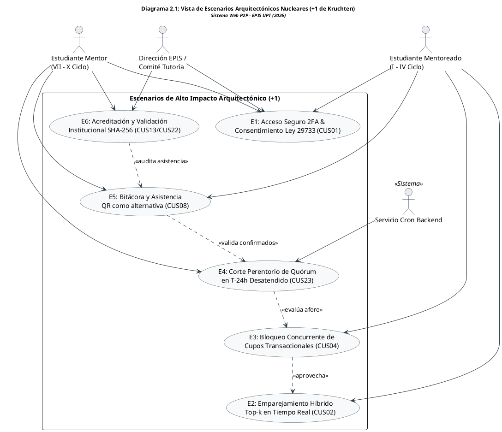

Fuente: Elaboración propia.

El análisis de la vista de escenarios muestra que los flujos operacionales críticos están interconectados secuencialmente, condicionando las capacidades de concurrencia y seguridad de las vistas lógica y física subsiguientes.

---

### 2.2. Vista Lógica

La **Vista Lógica** describe la organización funcional del sistema a través de una descomposición estratificada en tres capas desacopladas, reforzadas internamente por el patrón **ECB (Entidad-Control-Frontera)**:
- **Capa de Presentación (Frontera / Boundary):** Compuesta por componentes React SPA que encapsulan la captura de entradas del usuario, validación reactiva de formularios, renderizado de interfaces accesibles e interactividad asíncrona.
- **Capa de Aplicación y Negocio (Control):** Se propone organizarla mediante servicios FastAPI en Python y controladores que apliquen las reglas de negocio (`RN-01` a `RN-14`), ejecuten algoritmos de recomendación híbridos y gestionen las transacciones operativas.
- **Capa de Persistencia y Dominio (Entidad):** Modelada en PostgreSQL (Supabase) con tablas normalizadas, restricciones de integridad referencial, disparadores (*triggers*) y políticas de seguridad a nivel de fila (*RLS*), complementada con Redis para almacenamiento en memoria de alta velocidad.

A continuación, se ilustra la organización en capas y la interacción del patrón ECB en el sistema:

### Diagrama 2.2: Diagrama de la Vista Lógica en Capas y Subsistemas ECB

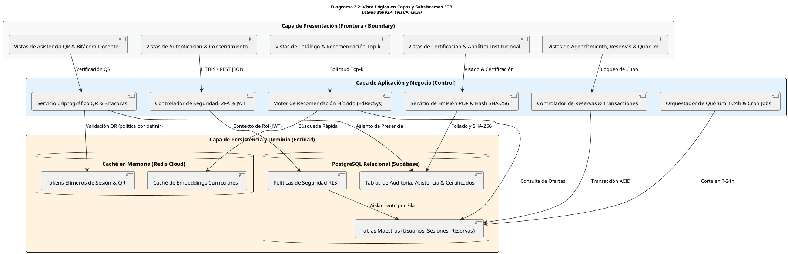

Fuente: Elaboración propia.

La vista lógica propone separar responsabilidades: los componentes de la interfaz de usuario se comunican exclusivamente con los controladores de aplicación mediante contratos de API REST fuertemente tipados, mientras que el acceso a datos está previsto mediante repositorios, políticas RLS por definir y caché candidata.

---

### 2.3. Vista del Proceso

La **Vista del Proceso** aborda los aspectos dinámicos de ejecución, concurrencia y sincronización del sistema. Se estructura en torno a los siguientes hilos de procesamiento:
- **Procesamiento de Solicitudes HTTP/HTTPS Asíncronas:** Se propone un backend FastAPI/Uvicorn con I/O asíncrona. Su capacidad real y la separación del cómputo del recomendador se evaluarán con los escenarios de carga de RNF03 y RNF07.
- **Tareas Automatizadas en Segundo Plano (Cron Jobs):** Procesos programados que se ejecutan a intervalos regulares para realizar el corte de quórum en $T-24\text{ h}$ (`CUS23`), anulación de reservas no ratificadas y cálculo periódico de embeddings temáticos.
- **Gestión Transaccional de Aforo:** Se analizará el bloqueo a nivel de fila (`SELECT ... FOR UPDATE`) y el aislamiento transaccional en PostgreSQL para preservar atomicidad durante la reserva masiva de cupos en mentorías de alta demanda.

A continuación, se modela la concurrencia entre hilos y la sincronización de procesos en el backend:

### Diagrama 2.3: Diagrama de la Vista de Procesos, Concurrencia y Sincronización

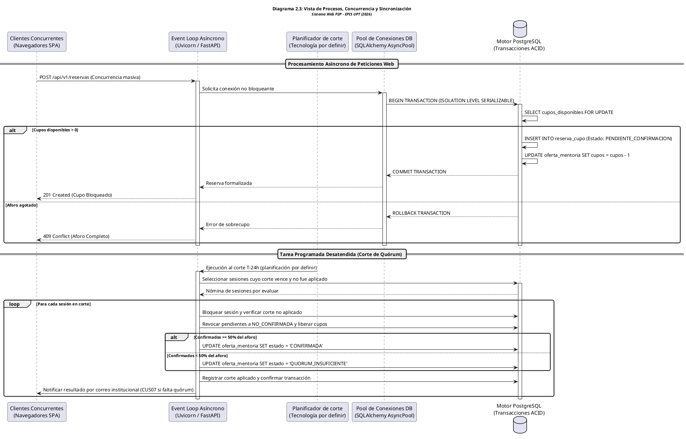

Fuente: Elaboración propia.

El modelado propone una transacción común para reserva, confirmación y corte, con exclusión sobre la sesión. El diseño posterior deberá precisar aislamiento, reintentos, idempotencia y recuperación de cortes pendientes; el diagrama no constituye una prueba de concurrencia.

---

### 2.4. Vista del desarrollo

La estructura de paquetes siguiente es una propuesta para fases posteriores. Solo la maqueta frontend existe actualmente; no se infiere la existencia de servicios, migraciones o pruebas por mencionarlos en esta vista.

La **Vista de Desarrollo** describe la arquitectura del software desde la perspectiva del entorno de construcción, dependencias y estructura de paquetes del código fuente:
- **Frontend SPA (React + TypeScript + Vite):**
  - `src/components/`: Componentes modulares reutilizables y vistas operativas (`BookingView`, `HomeView`, `GamificationView`, `RecommendationView`, `ConsentModal`).
  - `src/services/`: Clientes HTTP tipados para consumo de la API REST mediante Axios/Fetch con interceptores de tokens JWT.
  - `src/data/`: Tipos, interfaces TypeScript y esquemas de datos mock/reales.
  - `src/styles/`: Organización de estilos propuesta; la maqueta actual utiliza archivos CSS.
- **Backend API (Python + FastAPI):**
  - `app/api/`: Enrutadores de endpoints versionados (`/api/v1/...`).
  - `app/core/`: Configuración global, middleware de seguridad, manejo de JWT y conexión a bases de datos.
  - `app/services/`: Lógica de negocio pura (motor de recomendación, generador de QR, evaluador de quórum).
  - `app/models/`: Modelos ORM (SQLAlchemy) y esquemas de serialización/validación (Pydantic).
  - `app/db/`: Migraciones estructuradas con Alembic.

A continuación, se representa la organización de paquetes y dependencias del código fuente:

### Diagrama 2.4: Diagrama de la Vista de Desarrollo y Organización de Paquetes

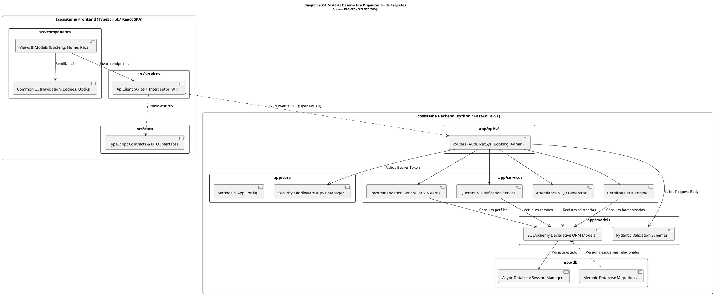

Fuente: Elaboración propia.

La vista de desarrollo propone separar interfaz, lógica y persistencia para atender RNF09. La documentación OpenAPI y la cobertura mínima del 70% se verificarán cuando existan los servicios y sus pruebas.

---

### 2.5. Vista Física

El diagrama 2.5 ofrece una alternativa inicial con el recomendador integrado en el backend. La sección 8 compara la separación del recomendador mediante un contrato REST. Son alternativas de análisis: la selección queda pendiente y no implica que ambas topologías deban desplegarse simultáneamente.

La **Vista Física** define la distribución física de los componentes de software en los nodos de hardware y servicios en la nube:
- **Nodos Clientes:** Navegadores web modernos (Chrome, Firefox, Edge, Safari) ejecutándose en computadoras de escritorio de los laboratorios de la EPIS o dispositivos móviles de mentores y mentoreados, comunicándose exclusivamente vía HTTPS (TLS 1.3).
- **Servidor de Aplicación (Backend):** Contenedor Docker desplegado en una instancia de servidor Linux, orquestado con reinicio automático y límites de memoria/CPU, exponiendo la API REST detrás de un proxy inverso NGINX que gestiona la terminación SSL y la compresión de respuestas.
- **Servicios Administrados de Datos (Cloud):**
  - PostgreSQL alojado en Supabase como alternativa; capacidad, respaldo y eventual replicación pendientes de dimensionamiento.
  - Instancia en memoria Redis para caché volátil de sesiones y tokens efímeros.
  - Bucket de almacenamiento de objetos (Object Storage) para PDFs de certificados con hash de integridad y evidencias de bitácoras docentes.

A continuación, se detalla la topología de red y los nodos físicos de cómputo:

### Diagrama 2.5: Diagrama de la Vista Física y Topología de Despliegue en Red

```plantuml
@startuml
title <size:12><b>Diagrama 2.5: Vista Física y Topología de Despliegue en Red</b></size>\n<size:10><i>Sistema Web P2P - EPIS UPT (2026)</i></size>

skinparam shadowing false
skinparam roundcorner 8
skinparam defaultFontName Arial
skinparam fontSize 10

skinparam node {
    BackgroundColor #F8F9FA
    BorderColor #2B3A42
}

node "Dispositivos Clientes (Red EPIS / Internet)" as Node_Client {
    artifact "Navegador Web Moderno\n(Chrome, Firefox, Edge, Safari)" as App_Client {
        component "React SPA Build\n(HTML5, CSS3, JS ES2022)" as Comp_SPA
    }
}

node "Servidor Cloud de Aplicación (Linux Container Host)" as Node_Server {
    node "Contenedor Proxy Inverso (NGINX)" as Cont_Nginx {
        component "Terminación SSL TLS 1.3\nCompresión Gzip / Brotli\nRate Limiting propuesto" as Comp_Nginx
    }
    node "Contenedor Backend (Python 3.11)" as Cont_FastAPI {
        component "Servidor ASGI Uvicorn\nFastAPI Application Framework\nMotor Algorítmico Scikit-learn" as Comp_FastAPI
    }
}

node "Servicios Cloud Administrados (Supabase / AWS)" as Node_Cloud {
    database "PostgreSQL 15+ Relacional" as Node_Postgres {
        component "Esquema Relacional\nPolíticas RLS Nativas\nÍndices B-Tree & Triggers" as Comp_Postgres
    }
    database "Redis Cloud (In-Memory)" as Node_Redis {
        component "Caché de Embeddings Top-k\nTokens QR (vigencia por definir)" as Comp_Redis
    }
    folder "Cloud Object Storage" as Node_Storage {
        component "Bucket Seguro de Certificados PDF\nEvidencias de Bitácoras Docentes" as Comp_Storage
    }
}

node "Infraestructura Institucional UPT" as Node_UPT {
    server "Servidor de Correo SMTP (@upt.pe)" as Srv_SMTP
}

' Enlaces de Red
Comp_SPA --> Comp_Nginx : HTTPS / Port 443 (TLS 1.3)
Comp_Nginx --> Comp_FastAPI : HTTP / Port 8000 (Red Interna Docker)
Comp_FastAPI --> Comp_Postgres : TCP / Port 5432 (SSL Certificado)
Comp_FastAPI --> Comp_Redis : TCP / Port 6379 (TLS / Auth)
Comp_FastAPI --> Comp_Storage : HTTPS / S3 API Rest
Comp_FastAPI --> Srv_SMTP : SMTP Seguro / Port 587 (TLS)
@enduml
```

Fuente: Elaboración propia.

La topología representa una alternativa de despliegue por evaluar. TLS 1.3 deriva de RNF02; los planes de servicios, permisos RLS, respaldos, réplica y capacidad deberán definirse y verificarse antes de construcción y operación.


---

## 3. Objetivos y limitaciones arquitectónicas

Los objetivos se heredan del SRS y se mantienen separados de las alternativas de implementación. Durante el análisis se evalúan los costos y dependencias de cada mecanismo sin presentar resultados de rendimiento o disponibilidad como si ya hubieran sido medidos.

### Cuadro 3.1: Decisiones propuestas y aspectos por resolver

| Decisión propuesta | Requisitos de origen | Compensación o límite | Validación posterior |
| :--- | :--- | :--- | :--- |
| Separar presentación, servicios REST y persistencia | RNF09 | Más contratos y manejo explícito de errores. | Contratos OpenAPI y pruebas de integración. |
| FastAPI para orquestación y recomendación | RF06, RNF03, RNF09 | El cómputo intensivo exige evaluar aislamiento respecto de las peticiones web. | Comparar módulo interno y servicio separado con carga representativa. |
| PostgreSQL y políticas RLS | RNF02, RNF07 | Definir roles, permisos y propagación del usuario desde la API; las conexiones privilegiadas requieren control específico. | Pruebas de acceso permitido/denegado y reserva concurrente. |
| Redis como caché candidata | RF06, RNF03 | Añade invalidación y dependencia operativa. | Medir necesidad, costo y degradación sin caché. |
| QR como apoyo al marcado de asistencia | RF17, CUS08, RN-12 | Es un flujo alternativo del mentor; no acredita por sí solo presencia física. | Definir emisor, consumo, expiración y controles de reutilización. |
| PDF, correlativo, hash y portal de consulta | RF22, RF23, RN-14 | Integridad y consulta institucional sin asumir firma PKI. | Verificar documento emitido, horas visadas y acceso público mínimo. |

Fuente: Elaboración propia a partir de los requisitos del SRS.

Estas decisiones no crean RF ni RNF adicionales. La duración de un QR, la topología de réplicas, el tamaño de caché y los objetivos RTO/RPO requieren especificación posterior. Se retiran como obligaciones del SAD las metas nuevas de 150/200 ms, 200 usuarios, SUS >85, disponibilidad 99.5% y cobertura >80%, pues no corresponden a la tabla canónica de RNF del SRS.

### 3.1. Disponibilidad

RNF06 establece disponibilidad mínima del 99.0% durante el periodo lectivo regular, excluyendo mantenimiento programado. Debe definirse cómo medirla, qué dependencias forman parte del servicio y qué recuperación permite el presupuesto de FD01. Los respaldos y reinicios son mecanismos candidatos; no justifican por sí solos una promesa de RPO cero ni conmutación inmediata.

### 3.2. Seguridad

RNF01 y RN-01 establecen OTP por correo institucional con vigencia máxima de cinco minutos, seguido de JWT HMAC-SHA256 con expiración de ocho horas. RF02 y RN-02 requieren consentimiento expreso antes del acceso funcional. RNF02 establece TLS 1.3, aislamiento de datos y protección de identificadores. El diseño posterior debe concretar políticas RLS, permisos de cuentas técnicas, revocación y tratamiento de información personal; ni un UUID ni un hash demuestran anonimato por sí solos.

### 3.3. Adaptabilidad

RNF09 exige separación entre frontend, backend y persistencia mediante interfaces RESTful, documentación de todos los endpoints y cobertura unitaria mínima del 70%. Un contrato estable para el recomendador permitiría analizar cambios de estrategia sin acoplarlos a la interfaz. La sustitución en caliente y el despliegue sin interrupciones no se consideran capacidades ya acreditadas.

### 3.4. Rendimiento

RNF03 fija procesamiento algorítmico de hasta 500 ms con hasta 50 solicitudes por minuto. RNF04 fija FCP menor de 2 segundos en conexiones de al menos 2 Mbps. Son medidas diferentes: la latencia del algoritmo no equivale a la carga total de la interfaz. Su evaluación debe definir volumen de datos, infraestructura, caché y procedimiento de medición. RNF08 mantiene la referencia de escritorio de 1366 × 768 o superior; ampliar compatibilidad móvil requiere validación adicional.

---

## 4. Análisis de Requerimientos

La fuente de requisitos es el SRS FD03 v2.0. Se preservan los códigos, denominaciones, prioridades, módulos y métricas de sus tablas canónicas. Los componentes de este SAD explican una respuesta propuesta a esos requisitos y no sustituyen su significado.

### 4.1. Requerimientos funcionales

La matriz siguiente conserva las denominaciones y prioridades del Cuadro 5.3 del SRS. Añade la responsabilidad arquitectónica prevista para que cada capacidad institucional tenga un punto de análisis identificable.

### Cuadro 4.1: Requisitos funcionales del SRS y responsabilidades propuestas

| Código | Módulo del SRS | Denominación canónica | Prioridad del SRS | Responsabilidad propuesta |
| :--- | :--- | :--- | :--- | :--- |
| **RF01** | MOD-01 Seguridad, Autenticación y Gobernanza | Autenticación institucional multifactor (2FA) | Crítica | AuthenticationService |
| **RF02** | MOD-01 Seguridad, Autenticación y Gobernanza | Formalización del consentimiento informado digital | Crítica | ConsentService |
| **RF03** | MOD-01 Seguridad, Autenticación y Gobernanza | Gestión y asignación administrativa de roles de usuario | Alta | RoleService |
| **RF04** | MOD-02 Gestión Curricular y Perfiles Académicos | Configuración de perfil formativo y matriz de disponibilidad horaria | Alta | AcademicProfileService |
| **RF05** | MOD-02 Gestión Curricular y Perfiles Académicos | Gestión del catálogo de asignaturas críticas y temarios silábicos | Alta | CurriculumService |
| **RF06** | MOD-03 Motor de Recomendación Inteligente (*EdRecSys*) | Inferencia de recomendaciones personalizadas y ranking Top-k | Crítica | TopKRecommendationEngine |
| **RF07** | MOD-03 Motor de Recomendación Inteligente (*EdRecSys*) | Registro y banco de solicitudes temáticas por demanda | Media | DemandService |
| **RF08** | MOD-04 Planificación, Espacios y Agendamiento | Publicación y parametrización de ofertas de mentoría académica | Alta | OfferingService |
| **RF09** | MOD-04 Planificación, Espacios y Agendamiento | Aprovisionamiento automatizado de infraestructura y espacios | Alta | SpaceProvisioningService |
| **RF10** | MOD-04 Planificación, Espacios y Agendamiento | Procesamiento de cronogramas institucionales oficiales (Parser de horarios) | Alta | ScheduleParserService |
| **RF11** | MOD-04 Planificación, Espacios y Agendamiento | Gestión de imprevistos, reprogramación y cancelación de ofertas por el mentor | Alta | OfferingService |
| **RF12** | MOD-05 Quórum, Confirmación y Cancelaciones | Reserva de cupos de mentoría con control de aforo | Alta | BookingTransactionCoordinator |
| **RF13** | MOD-05 Quórum, Confirmación y Cancelaciones | Confirmación anticipada de asistencia a mentoría | Alta | BookingTransactionCoordinator |
| **RF14** | MOD-05 Quórum, Confirmación y Cancelaciones | Desistimiento voluntario y liberación anticipada de cupos de reserva | Alta | BookingTransactionCoordinator |
| **RF15** | MOD-05 Quórum, Confirmación y Cancelaciones | Monitoreo desatendido, emisión de recordatorios y evaluación automática de quórum | Crítica | QuorumEvaluatorCronService |
| **RF16** | MOD-05 Quórum, Confirmación y Cancelaciones | Gestión resolutiva de sesiones ante quórum insuficiente | Alta | QuorumResolutionService |
| **RF17** | MOD-06 Trazabilidad, Bitácoras y Evaluación | Registro de bitácora pedagógica y control estricto de asistencia efectiva | Alta | BitacoraWorkflowService / QRCodeCryptoValidator |
| **RF18** | MOD-06 Trazabilidad, Bitácoras y Evaluación | Captura y procesamiento de encuestas de calidad post-mentoría | Alta | SurveyService |
| **RF19** | MOD-06 Trazabilidad, Bitácoras y Evaluación | Consulta de historial cronológico individual de sesiones y asistencias | Media | HistoryService |
| **RF20** | MOD-06 Trazabilidad, Bitácoras y Evaluación | Gestión, almacenamiento e intercambio de recursos académicos de sesión | Media | ResourceService |
| **RF21** | MOD-07 Gamificación, Reputación y Certificación | Cálculo dinámico de reputación y visualización del tablero de insignias | Media | ReputationService |
| **RF22** | MOD-07 Gamificación, Reputación y Certificación | Parametrización institucional de umbrales y emisión digital de certificados | Media | PDFCertificateCompiler |
| **RF23** | MOD-07 Gamificación, Reputación y Certificación | Descarga y verificación institucional de certificados de horas de mentoría | Media | CertificateVerificationService |
| **RF24** | MOD-08 Supervisión y Analítica Institucional | Priorización institucional y realce algorítmico de mentorías críticas | Media | PriorityService |
| **RF25** | MOD-08 Supervisión y Analítica Institucional | Tablero analítico y métricas de rendimiento académico institucional | Alta | AnalyticsService |
| **RF26** | MOD-08 Supervisión y Analítica Institucional | Auditoría administrativa de bitácoras, asistencia y validación de horas | Alta | AuditService |

Fuente: Elaboración propia a partir del SRS FD03 v2.0, secciones 5.1–5.5 y 6.2.3.

La matriz cubre RF01–RF26 sin reasignaciones. En particular, RF06 corresponde a recomendaciones, RF12 a reservas, RF17 a bitácora y asistencia, RF22–RF23 a certificados y RF26 a auditoría. La cobertura es documental; no implica que los servicios estén construidos.

### 4.2. Requerimientos no funcionales

Se reproduce la especificación canónica del Cuadro 5.2 del SRS para conservar tanto su identidad como sus medidas de aceptación. La protección de datos descrita constituye un requisito por satisfacer y no una validación del modelo actual.

### Cuadro 4.2: Requisitos no funcionales heredados del SRS

| Código | Característica | Denominación | Criterio técnico del SRS | Métrica del SRS |
| :--- | :--- | :--- | :--- | :--- |
| **RNF01** | Seguridad | Autenticación multifactor y gestión segura de sesiones | El sistema debe implementar autenticación de doble factor mediante un código de un solo uso (OTP) remitido al correo electrónico institucional con dominio `@upt.pe`. Una vez validado el acceso, la sesión debe gobernarse mediante JSON Web Tokens (JWT) firmados criptográficamente con algoritmo HMAC-SHA256. | Validez máxima del OTP: 5 minutos.<br>Expiración del token JWT: 8 horas continuas. |
| **RNF02** | Seguridad | Privacidad, aislamiento y protección de datos académicos | Todas las comunicaciones deben estar protegidas mediante cifrado TLS 1.3 en tránsito. La persistencia en PostgreSQL (Supabase) debe aplicar políticas de seguridad a nivel de fila (Row Level Security - RLS) para aislar expedientes, kardex y calificaciones, garantizando la anonimización de identificadores directos mediante identificadores universales (UUID v4) en estricto cumplimiento de la Ley N° 29733. | 100% de consultas filtradas por RLS.<br>0% de exposición de códigos de estudiante en tráfico público. |
| **RNF03** | Rendimiento y Eficiencia | Latencia de inferencia del motor de recomendación | El microservicio en Python (FastAPI) debe vectorizar el perfil de necesidades y calcular la similitud coseno frente a los mentores candidatos, aplicando el reordenamiento por filtrado colaborativo en un tiempo imperceptible para el usuario. | Tiempo de procesamiento algorítmico $\le 500$ ms bajo carga concurrente de hasta 50 solicitudes por minuto. |
| **RNF04** | Rendimiento y Eficiencia | Tiempo de respuesta y carga de la interfaz de usuario | La interfaz web React (Single Page Application) debe descargar sus componentes estáticos y renderizar el panel principal de navegación de manera fluida en navegadores de escritorio. | Tiempo de primera pintura con contenido (FCP) $< 2.0$ segundos sobre conexiones de red $\ge 2$ Mbps. |
| **RNF05** | Usabilidad | Facilidad de aprendizaje y satisfacción ergonómica | El diseño visual y los flujos de interacción de la plataforma deben ser intuitivos para estudiantes de ciclos iniciales (I a IV) y avanzados (VII a X), minimizando la curva de aprendizaje sin requerir manuales de inducción complejos. | Puntuación promedio $> 75$ puntos en la escala estandarizada System Usability Scale (SUS) al cierre de la prueba piloto. |
| **RNF06** | Fiabilidad y Disponibilidad | Continuidad operativa durante el periodo académico | La plataforma web, el backend analítico y la base de datos cloud deben mantener operación ininterrumpida a lo largo de las 16 semanas del semestre académico 2026-II, tolerando picos de demanda durante los exámenes parciales y finales. | Nivel de disponibilidad del servicio $\ge 99.0\%$ durante el periodo lectivo regular (excluyendo ventanas de mantenimiento programado). |
| **RNF07** | Fiabilidad e Integridad | Consistencia transaccional en reservas de cupos | El subsistema de persistencia debe ejecutar el bloqueo e inscripción de cupos mediante transacciones ACID con bloqueo optimista/pesimista, garantizando que no existan inconsistencias de sobreasignación ni colisiones de plazas concurrentes. | Tasa de sobreasignación de cupos: estrictamente $0\%$ frente a concurrencia simultánea en el aforo máximo. |
| **RNF08** | Compatibilidad y Portabilidad | Soporte multiplataforma en navegadores de escritorio | La interfaz web debe ser responsiva y garantizar paridad visual y funcional en los navegadores web modernos utilizados en terminales personales y laboratorios de cómputo de la EPIS-UPT (Google Chrome, Mozilla Firefox, Microsoft Edge y Apple Safari). | Renderizado visual y operativo correcto al 100% en resoluciones de pantalla iguales o superiores a $1366 \times 768$ píxeles. |
| **RNF09** | Mantenibilidad | Arquitectura desacoplada basada en microservicios RESTful | El código fuente del frontend (React SPA), backend algorítmico (FastAPI) y capa de persistencia (Supabase / PostgreSQL) debe mantener una separación estricta de responsabilidades, comunicándose mediante interfaces de programación RESTful con contratos JSON fuertemente tipados. | Documentación OpenAPI / Swagger al 100% en todos los endpoints expuestos; cobertura de pruebas unitarias $\ge 70\%$. |
| **RNF10** | Interoperabilidad | Resiliencia ante fallos en servicios externos integrados | El sistema debe implementar políticas de reintento exponencial (*exponential backoff*), degradación elegante y gestión controlada de excepciones frente a indisponibilidades temporales de Google Meet API, Discord API o del servidor de correo SMTP institucional. | Manejo controlado del 100% de tiempos de espera (*timeouts* $\le 5$ s), registrando eventos anómalos en bitácoras de auditoría. |

Fuente: SRS FD03 v2.0, Cuadro 5.2, transcripción de la línea base.

RNF01 identifica autenticación; RNF02, privacidad; RNF03, inferencia; RNF04, carga de interfaz; RNF05, usabilidad; RNF06, disponibilidad; RNF07, integridad de reservas; RNF08, compatibilidad; RNF09, mantenibilidad; RNF10, interoperabilidad. Esta correspondencia se utiliza en todas las vistas y escenarios del SAD.

### 4.3. Trazabilidad hacia las vistas arquitectónicas

Se conserva íntegramente la asociación RF–MOD–RN–CUS–RNF y la verificación prevista del Cuadro 5.5 del SRS. La columna final permite localizar las secciones del SAD que desarrollan la respuesta propuesta. Los identificadores CUS se interpretan con las narrativas 6.2.3, según el criterio de precedencia de la sección 1.4.

### Cuadro 4.3: Matriz de trazabilidad SRS–SAD

| RF | Requerimiento del SRS | Módulo | RN | CUS | RNF | Verificación futura heredada | Secciones del SAD |
| :--- | :--- | :--- | :--- | :--- | :--- | :--- | :--- |
| **RF01** | Autenticación institucional multifactor (2FA) | MOD-01 | RN-01 | CUS01 | RNF01, RNF02 | Prueba funcional de autenticación con OTP y expiración de tokens JWT. | 2.2, 6, 9, 10, 11.1 |
| **RF02** | Formalización del consentimiento informado digital | MOD-01 | RN-02 | CUS01 | RNF02 | Prueba de persistencia legal y bloqueo preventivo ante rechazo de términos. | 2.2, 6, 9, 10, 11.1 |
| **RF03** | Gestión y asignación administrativa de roles de usuario | MOD-01 | RN-03 | CUS10 | RNF02, RNF09 | Inspección funcional de actualización de privilegios de Mentoreado a Mentor. | 2.2, 6, 9, 10, 11.1 |
| **RF04** | Configuración de perfil formativo y matriz horaria | MOD-02 | RN-03 | CUS15 | RNF04, RNF08 | Prueba de UI de matriz semanal interactiva y persistencia de competencias. | 6, 7, 9, 10 |
| **RF05** | Gestión del catálogo de asignaturas y temarios | MOD-02 | — | CUS21 | RNF09 | Prueba de operaciones CRUD sobre jerarquías de cursos filtro y unidades silábicas. | 6, 7, 9, 10 |
| **RF06** | Inferencia de recomendaciones y ranking Top-k | MOD-03 | RN-04, RN-11 | CUS02 | RNF03 | Prueba algorítmica de precisión (`Precision@k`, `NDCG`) y latencia $\le 500$ ms. | 2.3, 6, 8, 9, 11.3 |
| **RF07** | Registro y banco de solicitudes por demanda | MOD-03 | RN-04 | CUS03 | RNF04, RNF09 | Prueba funcional de registro temático y visibilidad en catálogo de demanda. | 6, 7, 9, 10 |
| **RF08** | Publicación y parametrización de ofertas de mentoría | MOD-04 | RN-04, RN-05 | CUS06 | RNF04, RNF09 | Prueba de validación de prerrequisitos docentes y creación de oferta. | 6, 7, 9, 10 |
| **RF09** | Aprovisionamiento automatizado de infraestructura | MOD-04 | RN-06, RN-07 | CUS06, CUS18 | RNF10 | Prueba de integración con Meet API, Discord Bot y asignación de aulas. | 6, 7, 9, 10 |
| **RF10** | Procesamiento de cronogramas (Parser de horarios) | MOD-04 | RN-06 | CUS11 | RNF09, RNF10 | Prueba de extracción de celdas libres en archivos PDF y hojas Excel. | 6, 7, 9, 10 |
| **RF11** | Gestión de imprevistos, reprogramación y cancelación | MOD-04 | RN-10 | CUS18 | RNF09, RNF10 | Prueba funcional de actualización de cronograma y despacho de alertas. | 6, 7, 9, 10 |
| **RF12** | Reserva de cupos con control de aforo | MOD-05 | RN-05 | CUS04 | RNF07 | Prueba de concurrencia y estrés para verificar $0\%$ de sobreasignación de cupos. | 2.3, 7, 9, 10, 11.6 |
| **RF13** | Confirmación anticipada de asistencia (hasta $T-24\text{ h}$) | MOD-05 | RN-08 | CUS24 | RNF07, RNF09 | Prueba de transición de estados `PENDIENTE` a `CONFIRMADA` dentro de la ventana. | 2.3, 7, 9, 10, 11.6 |
| **RF14** | Desistimiento voluntario y liberación anticipada de cupos | MOD-05 | RN-08, RN-10 | CUS17 | RNF07 | Prueba funcional de anulación previa al corte y restitución en aforo. | 2.3, 7, 9, 10, 11.6 |
| **RF15** | Monitoreo desatendido, alertas y quórum en $T-24\text{ h}$ | MOD-05 | RN-08, RN-09 | CUS23 | RNF06, RNF09 | Prueba de ejecución programada de servicio cron, corte temporal y cálculo de quórum. | 2.3, 7, 9, 10, 11.6 |
| **RF16** | Gestión resolutiva ante quórum insuficiente | MOD-05 | RN-09, RN-10 | CUS07 | RNF09, RNF10 | Prueba de interfaz de decisión del mentor (continuar excepcional vs. cancelar). | 2.3, 7, 9, 10, 11.6 |
| **RF17** | Registro de bitácora y control de asistencia efectiva | MOD-06 | RN-12 | CUS08 | RNF02, RNF09 | Prueba funcional de cierre de sesión y marcado obligatorio de asistencias. | 6, 7, 9, 10 |
| **RF18** | Captura de encuestas de calidad post-mentoría | MOD-06 | RN-12, RN-13 | CUS05 | RNF05, RNF09 | Prueba de validación de formulario (1-5 estrellas) y corte temporal a 24 horas. | 6, 7, 9, 10 |
| **RF19** | Consulta de historial de sesiones y asistencias | MOD-06 | — | CUS19 | RNF02, RNF04 | Prueba de interfaz con filtros cronológicos y aislamiento de datos por usuario. | 6, 7, 9, 10 |
| **RF20** | Gestión e intercambio de recursos académicos | MOD-06 | — | CUS20 | RNF02, RNF09 | Prueba funcional de subida de enlaces y descarga restringida a participantes. | 6, 7, 9, 10 |
| **RF21** | Cálculo dinámico de reputación y tablero de insignias | MOD-07 | RN-13 | CUS16 | RNF05, RNF09 | Prueba de recálculo matemático de reputación y renderizado de insignias. | 6, 7, 9, 10 |
| **RF22** | Parametrización de umbrales y emisión de certificados | MOD-07 | RN-14 | CUS13 | RNF09 | Prueba de configuración de horas mínimas y generación batch de documentos PDF. | 5, 7, 9, 10, 11.5 |
| **RF23** | Descarga y verificación institucional de certificados | MOD-07 | RN-14 | CUS09 | RNF02, RNF09 | Prueba de validación de código hash criptográfico y escaneo de código QR. | 5, 7, 9, 10, 11.5 |
| **RF24** | Priorización institucional de mentorías críticas | MOD-08 | RN-11 | CUS12 | RNF03, RNF05 | Prueba de bonificación algorítmica y despliegue de distintivo en catálogo. | 2.3, 6, 8, 9, 11.3 |
| **RF25** | Tablero analítico y métricas de rendimiento | MOD-08 | — | CUS14 | RNF02, RNF04 | Prueba de consolidación de indicadores agregados y anonimización de datos. | 6, 7, 9, 10 |
| **RF26** | Auditoría administrativa de bitácoras y horas | MOD-08 | RN-14 | CUS22 | RNF02, RNF09 | Prueba de flujo de visado y formulación de observaciones sobre horas declaradas. | 5, 7, 9, 10, 11.5 |

Fuente: SRS FD03 v2.0, Cuadro 5.5; localización arquitectónica de elaboración propia.

La mención de `PENDIENTE` en la verificación de RF13 se conserva como transcripción del SRS; las secuencias usan `PENDIENTE_CONFIRMACION` según la narrativa CUS04. Esta diferencia interna se registra como PEN-02 en la matriz de inconsistencias.

Cada fila permite revisar el requisito desde su origen y desde su representación arquitectónica. Las verificaciones son actividades previstas para construcción y pruebas; en la fase actual se comprueba la coherencia de modelos, cobertura y referencias.

### 4.4. Reglas de negocio y límites del análisis

El SAD conserva los catorce identificadores de negocio. Su denominación se muestra para evitar que RN-06 se use como regla de recomendación o que RN-13 se interprete como definición de anonimización.

### Cuadro 4.4: Catálogo de reglas de negocio de referencia

| Regla | Denominación canónica | RF asociados en el SRS |
| :--- | :--- | :--- |
| **RN-01** | Acceso Institucional Exclusivo y 2FA | RF01 |
| **RN-02** | Consentimiento Legal Digital (Ley N° 29733) | RF02 |
| **RN-03** | Jerarquía de Roles y Verificación de Mérito | RF03, RF04 |
| **RN-04** | Dinámica de Oferta/Demanda y Antelación de Publicación | RF06, RF07, RF08 |
| **RN-05** | Control Estricto de Aforos Estándar | RF12 |
| **RN-06** | Asignación Validada de Espacios Físicos (Parser API) | RF08, RF09, RF10 |
| **RN-07** | Aprovisionamiento Virtual Automatizado | RF08, RF09 |
| **RN-08** | Ventana de Confirmación de Asistencia hasta $T-24$ Horas | RF13, RF15 |
| **RN-09** | Corte Desatendido y Quórum Mínimo del 50% en $T-24$ Horas | RF15, RF16 |
| **RN-10** | Cancelación Oportuna y Liberación Inmediata de Recursos | RF11, RF14, RF16 |
| **RN-11** | Criterios de Ponderación y Desempate Algorítmico | RF06, RF24 |
| **RN-12** | Cierre Formal de Bitácora y Filtro de Evaluación | RF17, RF18 |
| **RN-13** | Ventana Temporal Perentoria para Encuestas (24h) | RF18, RF21 |
| **RN-14** | Certificación Parametrizada por Horas Auditadas | RF22, RF23, RF26 |

Fuente: SRS FD03 v2.0, Cuadro 5.4.

RN-04 exige publicación con más de 24 horas de anticipación y recomienda 48; RN-08 cierra confirmaciones en T−24 h; RN-09 reserva al mentor la decisión ante quórum insuficiente; RN-12 exige cierre y asistencia; RN-13 gobierna la ventana de encuesta; RN-14 exige horas auditadas para certificar. El detalle de la bitácora dentro de 24 horas procede de la narrativa CUS08. La fórmula concreta de bonificación y su relación con los desempates de RN-11 queda pendiente, sin imponer un rango alfa nuevo.

---

## 5. Vistas de Caso de Uso

La vista de escenarios vincula a los actores con las metas funcionales de la plataforma. Conserva los 24 casos de uso y sus nombres de la sección 6.2.3 del SRS, sin crear un CUS independiente para el QR: este es un flujo alternativo de CUS08. Las asociaciones muestran participación; el orden temporal se desarrolla en la vista de procesos.

### Diagrama 5.1: Casos de uso canónicos agrupados por módulo

```plantuml
@startuml
title Diagrama 5.1: Casos de uso del SRS — arquitectura propuesta
skinparam shadowing false
skinparam defaultFontName Arial
skinparam roundcorner 8
skinparam defaultFontSize 11
left to right direction
actor "Usuario institucional" as Usuario
actor "Mentoreado" as Alumno
actor "Mentor" as Mentor
actor "Administrador / Tutoría" as Admin
actor "Servicio de planificación" as Cron
Alumno --|> Usuario
Mentor --|> Usuario
Admin --|> Usuario
rectangle "Sistema Web P2P — casos de uso del SRS" {
  package "MOD-01: Seguridad, Autenticación y Gobernanza" {
    usecase "CUS01: Iniciar sesión institucional con 2FA" as CUS01
    usecase "CUS10: Gestionar asignación de roles de usuario" as CUS10
  }
  package "MOD-02: Gestión Curricular y Perfiles Académicos" {
    usecase "CUS21: Gestionar catálogo curricular y temarios" as CUS21
    usecase "CUS15: Configurar perfil y disponibilidad horaria" as CUS15
  }
  package "MOD-03: Motor de Recomendación Inteligente (EdRecSys)" {
    usecase "CUS02: Consultar recomendaciones personalizadas Top-k" as CUS02
    usecase "CUS03: Registrar solicitud temática por demanda" as CUS03
  }
  package "MOD-04: Planificación, Espacios y Agendamiento" {
    usecase "CUS11: Cargar cronograma de horarios oficiales" as CUS11
    usecase "CUS06: Publicar oferta de mentoría" as CUS06
    usecase "CUS18: Modificar o cancelar oferta por imprevisto" as CUS18
  }
  package "MOD-05: Quórum, Confirmación y Cancelaciones" {
    usecase "CUS04: Reservar cupo de mentoría" as CUS04
    usecase "CUS24: Confirmar asistencia a mentoría" as CUS24
    usecase "CUS17: Cancelar reserva de cupo (Desistimiento)" as CUS17
    usecase "CUS23: Ejecutar alertas y evaluación automática de quórum" as CUS23
    usecase "CUS07: Gestionar sesión ante quórum insuficiente" as CUS07
  }
  package "MOD-06: Trazabilidad, Bitácoras y Evaluación" {
    usecase "CUS20: Gestionar recursos académicos de la mentoría" as CUS20
    usecase "CUS08: Registrar bitácora y control de asistencia" as CUS08
    usecase "CUS05: Responder encuesta de calidad post-mentoría" as CUS05
    usecase "CUS19: Consultar historial de sesiones y asistencia" as CUS19
  }
  package "MOD-07: Gamificación, Reputación y Certificación" {
    usecase "CUS16: Consultar tablero de insignias y reputación" as CUS16
    usecase "CUS13: Parametrizar y emitir certificados" as CUS13
    usecase "CUS09: Descargar certificado de horas de mentoría" as CUS09
  }
  package "MOD-08: Supervisión y Analítica Institucional" {
    usecase "CUS12: Destacar mentorías prioritarias" as CUS12
    usecase "CUS14: Visualizar tablero de analíticas institucionales" as CUS14
    usecase "CUS22: Auditar bitácoras, asistencia y horas de mentoría" as CUS22
  }
}
Usuario --> CUS01
Admin --> CUS10
Admin --> CUS21
Usuario --> CUS15
Alumno --> CUS02
Alumno --> CUS03
Admin --> CUS11
Mentor --> CUS06
Mentor --> CUS18
Alumno --> CUS04
Alumno --> CUS24
Alumno --> CUS17
Cron --> CUS23
Mentor --> CUS07
Usuario --> CUS20
Mentor --> CUS08
Alumno --> CUS05
Usuario --> CUS19
Mentor --> CUS16
Admin --> CUS13
Mentor --> CUS09
Admin --> CUS12
Admin --> CUS14
Admin --> CUS22
@enduml
```

Fuente: Elaboración propia a partir del SRS FD03 v2.0, secciones 5.1–5.5 y 6.2.3.

El diagrama incorpora funciones que quedaban fuera de la síntesis anterior: roles, catálogo curricular, disponibilidad, parser, recursos e historial. Su descomposición por módulo permite revisar el alcance sin confundir publicación de ofertas con descarga de certificados ni asistencia con carga de cronogramas.

Para conectar las metas de usuario con los requisitos, se presenta el catálogo de referencias usado por las vistas del SAD.

### Cuadro 5.1: Casos de uso y requisitos de origen

| CUS | Denominación canónica | Módulo | RF de origen |
| :--- | :--- | :--- | :--- |
| CUS01 | Iniciar sesión institucional con 2FA | MOD-01 | RF01, RF02 |
| CUS10 | Gestionar asignación de roles de usuario | MOD-01 | RF03 |
| CUS21 | Gestionar catálogo curricular y temarios | MOD-02 | RF05 |
| CUS15 | Configurar perfil y disponibilidad horaria | MOD-02 | RF04 |
| CUS02 | Consultar recomendaciones personalizadas Top-k | MOD-03 | RF06 |
| CUS03 | Registrar solicitud temática por demanda | MOD-03 | RF07 |
| CUS11 | Cargar cronograma de horarios oficiales | MOD-04 | RF10 |
| CUS06 | Publicar oferta de mentoría | MOD-04 | RF08, RF09 |
| CUS18 | Modificar o cancelar oferta por imprevisto | MOD-04 | RF09, RF11 |
| CUS04 | Reservar cupo de mentoría | MOD-05 | RF12 |
| CUS24 | Confirmar asistencia a mentoría | MOD-05 | RF13 |
| CUS17 | Cancelar reserva de cupo (Desistimiento) | MOD-05 | RF14 |
| CUS23 | Ejecutar alertas y evaluación automática de quórum | MOD-05 | RF15 |
| CUS07 | Gestionar sesión ante quórum insuficiente | MOD-05 | RF16 |
| CUS20 | Gestionar recursos académicos de la mentoría | MOD-06 | RF20 |
| CUS08 | Registrar bitácora y control de asistencia | MOD-06 | RF17 |
| CUS05 | Responder encuesta de calidad post-mentoría | MOD-06 | RF18 |
| CUS19 | Consultar historial de sesiones y asistencia | MOD-06 | RF19 |
| CUS16 | Consultar tablero de insignias y reputación | MOD-07 | RF21 |
| CUS13 | Parametrizar y emitir certificados | MOD-07 | RF22 |
| CUS09 | Descargar certificado de horas de mentoría | MOD-07 | RF23 |
| CUS12 | Destacar mentorías prioritarias | MOD-08 | RF24 |
| CUS14 | Visualizar tablero de analíticas institucionales | MOD-08 | RF25 |
| CUS22 | Auditar bitácoras, asistencia y horas de mentoría | MOD-08 | RF26 |

Fuente: Elaboración propia a partir del SRS FD03 v2.0, secciones 5.1–5.5 y 6.2.3.

Los escenarios de mayor impacto son acceso y consentimiento (CUS01), recomendación (CUS02), reserva y ratificación (CUS04/CUS24), corte y contingencia (CUS23/CUS07), cierre de bitácora y asistencia (CUS08), auditoría (CUS22) y emisión/descarga de certificados (CUS13/CUS09). El SAD remite al SRS para sus narrativas completas, evitando mantener una segunda definición divergente.

---

## 6. Vista Lógica

La vista lógica analiza las responsabilidades de presentación, control y dominio sin fijar aún todos los detalles de implementación. El parser pertenece al backend de MOD-04; los servicios externos se limitan al correo institucional y las plataformas de videoconferencia previstas en el SRS.

### 6.1. Diagrama Contextual

El contexto diferencia a los usuarios institucionales, la frontera de la solución y los sistemas con los que se prevé interoperar.

### Diagrama 6.1: Contexto y límites de responsabilidad

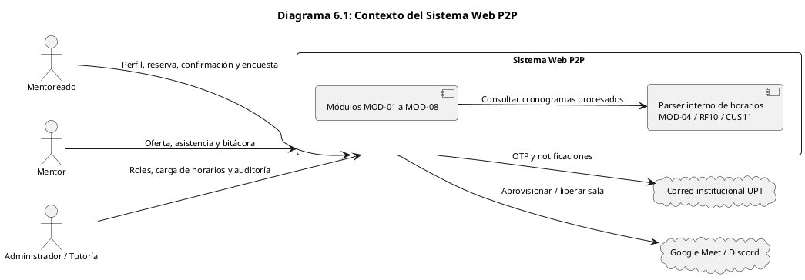

Fuente: Elaboración propia a partir de RF01–RF26 y del alcance de integraciones del SRS.

El archivo de horarios ingresa mediante CUS11 y se procesa dentro de la plataforma. Una falla de Meet, Discord o SMTP se atiende según RNF10 con timeout controlado, reintentos y una respuesta comprensible al usuario; el SAD no presupone una integración externa del parser.

### 6.2. Descomposición en capas y patrón ECB

La siguiente matriz relaciona cada módulo canónico con fronteras, controles y entidades de análisis. Los nombres de clases y servicios son propuestos y podrán ajustarse en diseño manteniendo esta trazabilidad.

### Cuadro 6.1: Responsabilidades ECB por módulo

| Módulo | Frontera propuesta | Control propuesto | Entidades de análisis |
| :--- | :--- | :--- | :--- |
| MOD-01 | Acceso, consentimiento y administración de roles | AuthenticationService, ConsentService, RoleService | Usuario, Rol, ConsentimientoLegal |
| MOD-02 | Perfil, disponibilidad y catálogo curricular | AcademicProfileService, CurriculumService | PerfilAcademico, Disponibilidad, Asignatura, Tema |
| MOD-03 | Recomendaciones y solicitudes de demanda | TopKRecommendationEngine, DemandService | VectorCompetencia, SolicitudDemanda, Oferta |
| MOD-04 | Publicación, carga de horarios y reprogramación | OfferingService, ScheduleParserService, SpaceProvisioningService | SesionMentoria, Cronograma, EspacioFisico, EspacioVirtual |
| MOD-05 | Reserva, confirmación, desistimiento y contingencia | BookingTransactionCoordinator, QuorumEvaluatorCronService, QuorumResolutionService | ReservaCupo, SesionMentoria |
| MOD-06 | Bitácora, asistencia, encuestas, historial y recursos | BitacoraWorkflowService, QRCodeCryptoValidator, SurveyService, HistoryService, ResourceService | Bitacora, Asistencia, Encuesta, RecursoAcademico |
| MOD-07 | Insignias, configuración de certificados y descarga | ReputationService, PDFCertificateCompiler, CertificateVerificationService | Reputacion, Insignia, Certificado, ParametroCertificacion |
| MOD-08 | Prioridades, analíticas y visado | PriorityService, AnalyticsService, AuditService | Prioridad, Indicador, DictamenAuditoria |

Fuente: Elaboración propia a partir del SRS FD03 v2.0, secciones 5.1–5.5 y 6.2.3.

El aislamiento de controles permitiría probar reglas sin depender de las pantallas. El modelo de datos de la sección 10 es parcial y todavía debe representar todas las entidades identificadas aquí; los nombres ECB no implican tablas o clases ya implementadas.

---

## 7. Vista de Procesos

La **Vista de Procesos** aborda los aspectos dinámicos y temporales del sistema, describiendo cómo se transforman los flujos operacionales desde el estado informal actual (**As-Is**) hacia el proceso optimizado y trazable (**To-Be**) soportado por la plataforma web.

### 7.1. Diagrama de Proceso Actual

El diagnóstico de la asesoría académica actual en la EPIS-UPT evidencia un flujo fragmentado, descoordinado e informal, caracterizado por canales no oficiales y la ausencia total de trazabilidad institucional. El siguiente modelo de actividades captura esta línea base operacional (**As-Is**) identificando los puntos críticos de abandono y sobrecarga docente:

### Diagrama 7.1: Diagrama de Actividades del Proceso Actual de Asesoría Informal en la EPIS-UPT (As-Is)

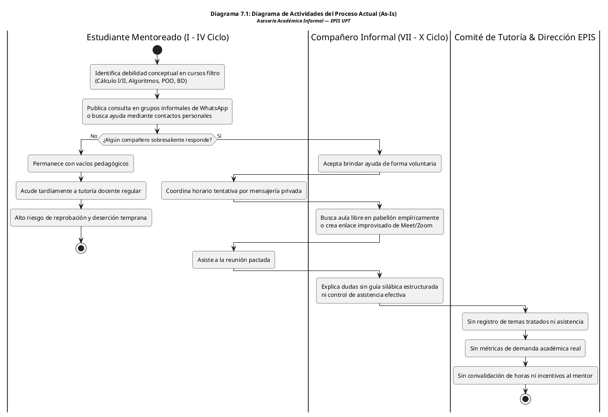

Fuente: Elaboración propia.

El análisis del proceso As-Is pone en evidencia las siguientes deficiencias estructurales:
1. **Asimetría Informativa y Barrera Social:** El acceso al refuerzo académico depende de la afinidad personal y de las redes de contacto del alumno, excluyendo a estudiantes tímidos o de primeros ciclos que no conocen alumnos mayores.
2. **Uso Precario e Ineficiente de Infraestructura:** El uso de aulas físicas ocurre sin reserva formal, propiciando desalojos intempestivos cuando coincide con clases oficiales de cátedra.
3. **Cero Trazabilidad y Desincentivo:** La Dirección de Escuela no posee datos para orientar intervenciones preventivas, y los mentores abandonan el apoyo debido a que sus horas dedicadas no reciben reconocimiento curricular.

### 7.2. Diagrama de Proceso Propuesto

El proceso propuesto (**To-Be**) digitaliza y reestructura el ciclo de mentoría mediante la automatización de reglas de negocio, gobernanza de quórum y acreditación oficial de horas. El siguiente diagrama de actividades modela este flujo de trabajo optimizado, articulando las calles de responsabilidad (*swimlanes*) entre los actores humanos y los servicios autónomos del sistema:

### Diagrama 7.2: Diagrama de Actividades del Proceso Propuesto de Mentorías P2P en la EPIS-UPT (To-Be)

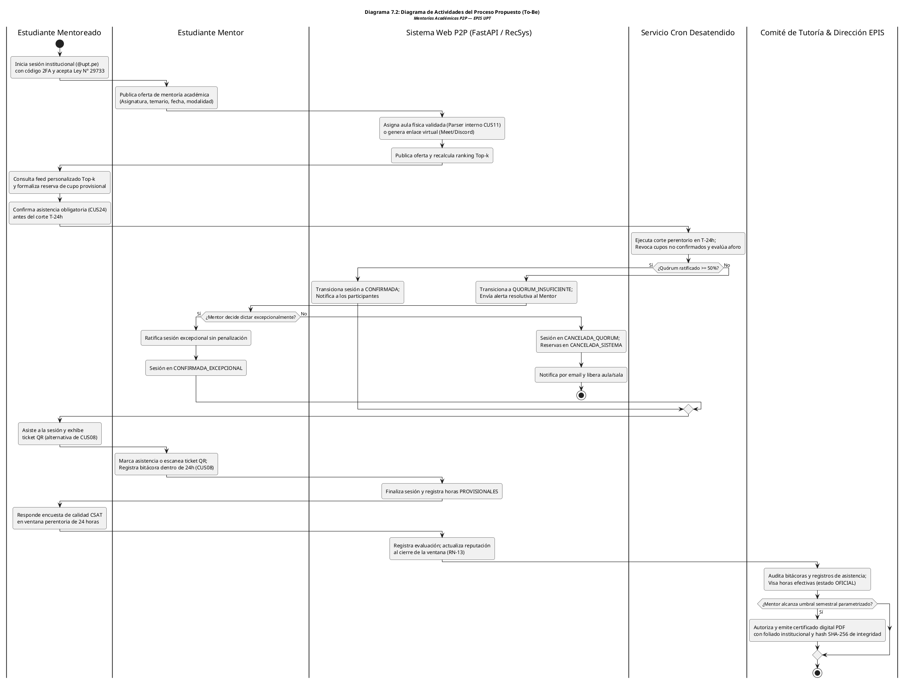

Fuente: Elaboración propia.

El análisis comparativo del flujo To-Be evidencia las siguientes transformaciones sustanciales:
1. **Gobernanza Automatizada de Recursos:** El corte en $T-24\text{ h}$ y el umbral de quórum del 50% (`RN-08`/`RN-09`) permiten evaluar la viabilidad y notificar al mentor. La liberación ocurre al cancelar según RN-10, no por el solo hecho de detectar quórum insuficiente.
2. **Registro de asistencia:** CUS08 permite al mentor marcar la nómina o escanear tickets QR. El mecanismo técnico y sus controles contra reutilización se deben validar; no se atribuye a RNF04 una duración de 60 segundos.
3. **Cierre del ciclo institucional:** La bitácora y la asistencia registradas en CUS08 producen horas provisionales. Solo el visado de CUS22 habilita su cómputo para CUS13 y CUS09, de acuerdo con RN-14.

---

## 8. Vista de Despliegue

La **Vista de Despliegue** describe la asignación de los componentes lógicos y de software en unidades de ejecución autónomas (contenedores de software) y su distribución sobre la infraestructura en la nube. Conforme a las directrices de modelado arquitectónico **C4 (Nivel 2: Contenedores)** adaptadas a la metodología **UWE**, esta vista plantea responsabilidades y comunicaciones candidatas para atender RNF06, RNF03 y RNF02. El despliegue definitivo y su capacidad se decidirán después del análisis.

### 8.1. Diagrama de Contenedor

La siguiente topología de contenedores de software delimita formalmente el entorno del cliente, el middleware de aplicación, los servicios administrados de datos y las plataformas externas para guiar el aprovisionamiento de infraestructura:

### Diagrama 8.1: Diagrama de Contenedores del Sistema Web P2P (Estándar C4 Nivel 2 / UWE)

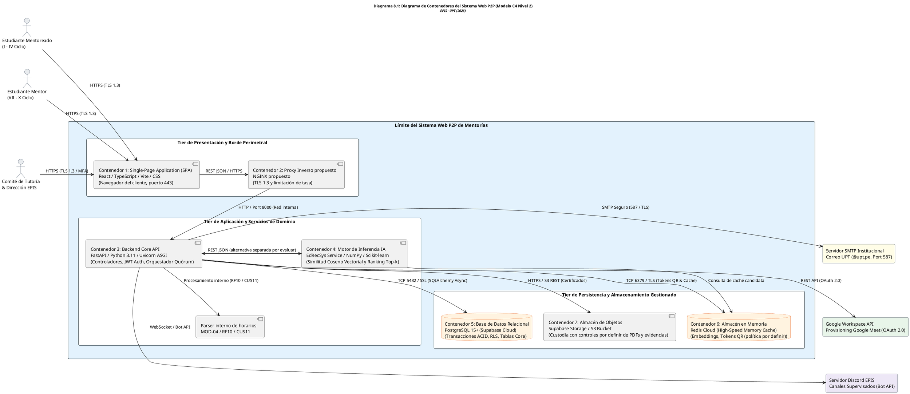

Fuente: Elaboración propia.

El análisis del Diagrama de Contenedores permite deducir los siguientes principios arquitectónicos de operación:
1. **Frontera de acceso:** Se propone un proxy para terminar TLS y controlar tráfico. Se deberán definir sus capacidades y probar la configuración antes de atribuirle protección específica.
2. **Recomendación:** La separación del motor en un servicio es una alternativa a evaluar frente a RNF03 (≤500 ms y hasta 50 solicitudes/minuto). Su comunicación prevista en esta alternativa es REST JSON, coherente con RNF09.
3. **Persistencia:** El aislamiento de RNF02 requiere definir permisos, políticas RLS y el contexto de identidad de las conexiones del backend. La presencia de PostgreSQL en un diagrama no demuestra ese aislamiento.

A continuación, se resume la responsabilidad operativa, tecnologías y protocolos de cada contenedor del sistema:

### Cuadro 8.1: Matriz de Contenedores de Software, Tecnologías y Protocolos de Comunicación

| Contenedor | Tecnología Principal | Entorno de Ejecución | Responsabilidad Operativa | Protocolo / Interfaz |
| :--- | :--- | :--- | :--- | :--- |
| **C1: Frontend SPA** | React, TypeScript, Vite, CSS | Navegador Web (Cliente) | Renderizado de interfaces reactivas, captura de eventos de usuario y presentación de feeds. | HTTPS (HTML5/CSS3/JS) |
| **C2: Proxy Inverso** | NGINX Alpine Linux | Contenedor Docker (Host) | Terminación TLS y control de tráfico propuestos; módulos y configuración pendientes. | HTTPS (Ext) / HTTP (Int) |
| **C3: Backend Core API** | Python 3.11, FastAPI, Uvicorn | Contenedor Docker (Host) | Gestión de autenticación JWT/2FA, lógica de negocio, reglas RN-01 a RN-14 y orquestación. | RESTful JSON (OpenAPI) |
| **C4: Motor RecSys** | Scikit-learn, NumPy, SciPy | Servicio Python propuesto | Indexación de competencias, cálculo de similitud coseno vectorial y ponderación directiva (RN-11). | REST JSON propuesto |
| **C5: Base de Datos** | PostgreSQL 15+ (Supabase) | Servicio Cloud Administrado | Persistencia relacional, integridad referencial 3FN, transacciones ACID y control RLS. | TCP 5432 (SSL TLS 1.3) |
| **C6: Caché en Memoria** | Redis Cloud v7 | Servicio Cloud Administrado | Almacenamiento volátil de embeddings, sesiones activas y tokens QR (vigencia por definir). | TCP 6379 (TLS / Auth) |
| **C7: Object Storage** | Supabase Storage (S3 API) | Almacén Cloud de Objetos | Almacenamiento de certificados PDF y evidencias; permisos, retención y protección contra modificación por definir. | HTTPS / REST S3 API |

Fuente: Elaboración propia.

La matriz permite revisar la topología candidata. Se debe decidir si la separación del recomendador aporta valor frente a su costo operativo y definir alojamiento, recuperación y observabilidad antes del despliegue.

---

## 9. Vista de Implementación

Esta vista conserva el nombre del formato SAD, pero en la fase de análisis representa la organización prevista para la futura implementación. No describe código backend existente. Los contratos definitivos, rutas, modelos ORM y configuración de seguridad se completarán al pasar a diseño y construcción.

### 9.1. Diagrama de Componentes

La descomposición cubre los ocho módulos canónicos y muestra las dependencias con puertos de persistencia, notificación y almacenamiento. Los servicios de la matriz 4.1 se agrupan dentro del módulo que corresponde a su RF.

### Diagrama 9.1: Componentes propuestos y dependencias

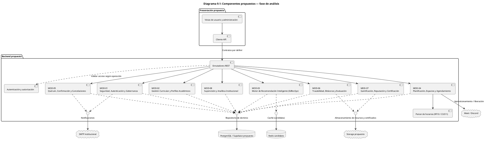

Fuente: Elaboración propia a partir de las matrices 4.1, 4.3 y 6.1.

La autorización se evalúa por operación: el inicio de autenticación y la consulta pública de certificados requieren políticas distintas de las operaciones privadas. La identidad de usuario y los permisos deben conservarse hasta persistencia; los trabajos programados necesitan un alcance técnico explícito.

Para precisar qué significa cada frontera sin inventar contratos implementados, se explicitan las responsabilidades de sus puertos.

### Cuadro 9.1: Puertos y responsabilidades por analizar

| Puerto / interfaz propuesta | Responsabilidad | Origen | Pendiente de diseño |
| :--- | :--- | :--- | :--- |
| Autenticación y autorización | OTP, consentimiento, rol y sesión | RF01–RF03, RNF01–RNF02 | Contrato de acceso, revocación, permisos y contexto RLS. |
| Recomendación | Perfil, candidatos y ranking | RF04–RF07, RNF03 | Contrato de entrada/salida, fórmula y estrategia de cómputo. |
| Planificación y parser | Horarios oficiales, ofertas y recursos | RF08–RF11, RNF10 | Formato de archivos, validación y compensación ante fallos externos. |
| Repositorio transaccional de reserva | Reserva, confirmación, cancelación y corte | RF12–RF16, RNF07 | Bloqueo compartido, unicidad, idempotencia y reintentos. |
| Registro pedagógico | Asistencia, bitácora, encuesta, historial y recursos | RF17–RF20 | Permisos, cierre y ventana de encuesta; QR como alternativa de CUS08. |
| Certificación y reputación | Horas provisionales/visadas, insignias y PDF | RF21–RF23, RN-14 | Cálculo, parámetros, hash y consulta institucional. |
| Supervisión | Prioridad, analíticas y dictámenes | RF24–RF26 | Acceso administrativo, información agregada y trazabilidad del visado. |

Fuente: Elaboración propia a partir del SRS FD03 v2.0, secciones 5.1–5.5 y 6.2.3.

El desarrollo posterior deberá convertir estas responsabilidades en contratos verificables sin renombrar los requisitos que las originan. No se afirma cobertura de pruebas ni existencia de endpoints en esta versión del SAD.

---

## 10. Vista de Datos

La **Vista de Datos** presenta un modelo relacional preliminar del núcleo de mentoría. Se conserva como insumo de análisis y no como esquema físico completo ni migración ejecutable. La normalización, los permisos y la cobertura de todas las entidades deben completarse en diseño.

### 10.1. Diagrama Entidad Relación

El modelo permite revisar las relaciones entre usuarios, ofertas, reservas, evidencias y certificados. Los tipos son orientativos y no acreditan restricciones SQL ni políticas RLS implementadas.

### Diagrama 10.1: Diagrama Entidad-Relación Relacional del Sistema Web P2P (PostgreSQL / Supabase)

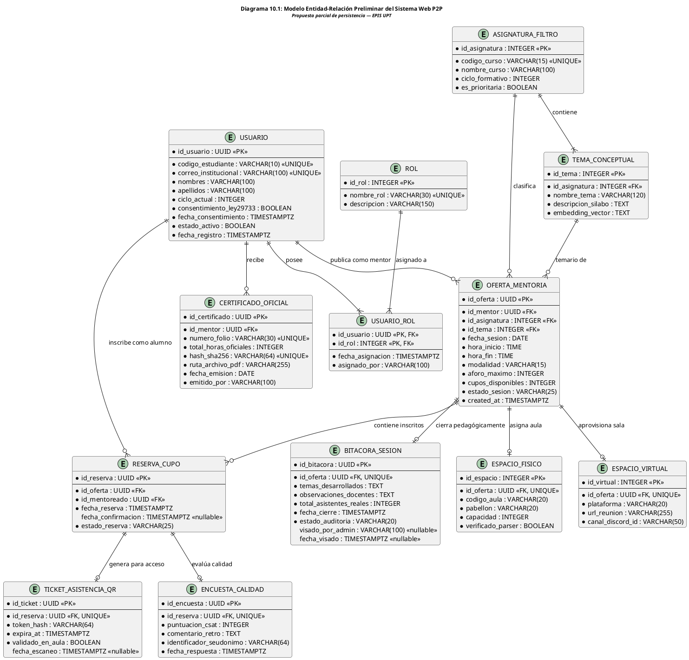

Fuente: Elaboración propia.

El análisis del modelo identifica tres condiciones que deben resolverse antes de implementarlo:
1. **Aforo y estados:** la capacidad se controla con una operación transaccional compartida por reserva, confirmación y corte. Los estados son transiciones del dominio, no datos inmutables. Se deberán concretar restricciones de unicidad y coherencia del contador de cupos.
2. **Asistencia:** el ticket pertenece al flujo alternativo de CUS08 y RF17. La duración, generación, consumo y prevención de reutilización del token se definirán posteriormente. Fechas de confirmación, escaneo y visado pueden estar vacías mientras el evento aún no ocurre.
3. **Privacidad:** ENCUESTA_CALIDAD conserva una relación con RESERVA_CUPO y, por ella, con el estudiante. Por tanto, este modelo permite reidentificación autorizada y no demuestra anonimato irreversible. El identificador seudónimo no elimina esa relación. Se requiere decidir la separación de elegibilidad y respuestas, los permisos, la retención y la minimización para satisfacer RNF02.

La siguiente matriz relaciona las entidades representadas con sus requisitos de origen y las restricciones por precisar:

### Cuadro 10.1: Entidades del modelo preliminar y trazabilidad

| Entidades | Requisitos | Restricción o pendiente |
| :--- | :--- | :--- |
| USUARIO, ROL, USUARIO_ROL | RF01–RF03, RNF01–RNF02 | Completar consentimiento versionado, historial de roles y permisos. |
| ASIGNATURA_FILTRO, TEMA_CONCEPTUAL | RF05, RF06, RF24 | Definir representación temática y priorización sin imponer un rango alfa no aprobado. |
| OFERTA_MENTORIA, ESPACIO_FISICO, ESPACIO_VIRTUAL | RF08–RF11, RN-04–RN-07 | Publicación con más de 24 h; 48 h recomendadas. Completar cronogramas, exclusión de solapamientos y vínculo con sesión. |
| RESERVA_CUPO | RF12–RF16, RNF07 | Unicidad de sesión y mentoreado; coherencia de estados, cupos y corte T−24 h. |
| TICKET_ASISTENCIA_QR, BITACORA_SESION | RF17, CUS08, RN-12 | QR alternativo y registro de todos los asistentes; cierre dentro de 24 h según narrativa CUS08. |
| ENCUESTA_CALIDAD | RF18, RN-13, RNF02 | Solo asistentes, ventana de 24 h y acceso restringido; no afirmar anonimato mientras subsista el enlace a reserva. |
| CERTIFICADO_OFICIAL | RF22–RF23, RN-14 | Precisar periodo, parámetros, horas fraccionarias, vínculo a bitácoras visadas, correlativo y hash. |

Fuente: Elaboración propia a partir del SRS FD03 v2.0, secciones 5.1–5.5 y 6.2.3.

La matriz no reemplaza un diccionario de datos completo. Quedan pendientes perfiles y disponibilidad (RF04), demanda (RF07), cronogramas (RF10), recursos académicos (RF20), reputación e insignias (RF21), parámetros de certificación (RF22) y dictámenes/historial de auditoría (RF26). RF19 y RF25 requieren definir consultas y proyecciones sobre esos datos. La vista lógica identifica sus responsabilidades para evitar que la ausencia de tablas preliminares se interprete como exclusión del alcance.

---

## 11. Calidad

En la fase de análisis se especifican escenarios y verificaciones futuras. Esta sección utiliza fichas de estímulo, entorno, respuesta y medida; no declara una evaluación ATAM ejecutada. El árbol de utilidad, los riesgos priorizados y la discusión de alternativas quedan pendientes de una evaluación arquitectónica posterior.

### 11.1. Escenario de Seguridad

- **Fuente y estímulo:** usuario que intenta acceder con OTP vencido, sin consentimiento o a información ajena.
- **Artefacto y entorno:** acceso institucional, autorización y persistencia en operación normal.
- **Respuesta prevista:** rechazar el acceso inválido, evitar habilitar funciones sin consentimiento y aplicar restricciones por usuario/rol; registrar el evento sin exponer credenciales.
- **Medida heredada:** OTP máximo 5 minutos, JWT HMAC-SHA256 de 8 horas (RNF01); TLS 1.3, consultas filtradas por RLS y ausencia de códigos de estudiante en tráfico público (RNF02).
- **Verificación futura:** pruebas de expiración, consentimiento, permisos y aislamiento, incluyendo conexiones técnicas privilegiadas.

### 11.2. Escenario de Usabilidad

- **Fuente y estímulo:** estudiante que consulta recomendaciones y reserva una mentoría por primera vez.
- **Artefacto y entorno:** interfaz React en los navegadores de escritorio del SRS.
- **Respuesta prevista:** mostrar opciones, disponibilidad y estado provisional de reserva con instrucciones claras para CUS24.
- **Medida heredada:** SUS promedio >75 (RNF05); FCP <2 segundos con conexión ≥2 Mbps (RNF04); funcionamiento desde 1366 × 768 (RNF08).
- **Verificación futura:** piloto de usabilidad, medición de carga inicial y matriz de navegadores. No se añaden límites de tres clics ni reserva en 45 segundos.

### 11.3. Escenario de Adaptabilidad y Rendimiento del Recomendador

- **Fuente y estímulo:** equipo que modifica el cálculo de recomendaciones o administrador que establece prioridades institucionales.
- **Artefacto y entorno:** contrato REST del recomendador y datos de perfiles/ofertas bajo carga de referencia.
- **Respuesta prevista:** conservar el contrato de consumo y el significado de RF06, RF24 y RN-11; registrar la versión de estrategia que se evalúe.
- **Medida heredada:** inferencia ≤500 ms con hasta 50 solicitudes/minuto (RNF03); endpoints documentados al 100% y cobertura unitaria ≥70% (RNF09).
- **Verificación futura:** pruebas del ranking, carga algorítmica y regresión de contratos. La conmutación sin reinicio queda como alternativa, no como requisito satisfecho.

### 11.4. Escenario de Disponibilidad e Interoperabilidad

- **Fuente y estímulo:** fallo del backend o indisponibilidad de correo, Meet o Discord.
- **Artefacto y entorno:** servicios propuestos e integraciones durante el periodo lectivo.
- **Respuesta prevista:** controlar el fallo, evitar confirmaciones falsas de operaciones y permitir recuperación/reintento conforme a las políticas que se definan.
- **Medida heredada:** disponibilidad ≥99.0% durante el periodo lectivo regular, excluyendo mantenimiento programado (RNF06); timeouts ≤5 segundos y manejo controlado con registro de eventos (RNF10).
- **Verificación futura:** monitoreo e inyección de fallos. RTO, RPO, réplicas y presupuesto de recuperación siguen pendientes; no se presupone conmutación en 15 segundos ni se fija aquí un RTO de 15 minutos.

### 11.5. Escenario de Trazabilidad y Auditoría

- **Fuente y estímulo:** administrador que visa horas y mentor que solicita un certificado.
- **Artefacto y entorno:** bitácora, asistencia, dictamen y documento institucional.
- **Respuesta prevista:** mantener horas provisionales hasta CUS22; emitir únicamente si se alcanza el umbral configurado con horas auditadas; permitir la consulta institucional de CUS09.
- **Medida heredada:** elegibilidad según RN-14 y RF22–RF23/RF26. No se agregan una latencia de un segundo ni una garantía probatoria del 100%.
- **Verificación futura:** casos con horas suficientes/insuficientes, bitácoras observadas y documentos alterados. El hash acredita integridad respecto de una referencia confiable, no firma PKI ni cumplimiento legal automático.

### 11.6. Escenario de Integridad Transaccional

- **Fuente y estímulo:** reservas simultáneas sobre la última vacante o confirmación concurrente con el corte.
- **Artefacto y entorno:** sesión, reserva y planificador de quórum.
- **Respuesta prevista:** aplicar operaciones consistentes sobre la misma sesión, rechazar sobrecupos y evitar que la repetición del corte duplique efectos.
- **Medida heredada:** 0% de sobreasignación (RNF07), confirmación hasta el corte RN-08 y decisión del mentor ante quórum insuficiente según RN-09.
- **Verificación futura:** pruebas concurrentes, reintentos y recuperación de tareas. La estrategia de aislamiento y la periodicidad del planificador se precisarán en diseño.

La siguiente matriz resume qué atributos se analizarán y cómo se relacionan con la línea base, sin confundir las verificaciones previstas con resultados obtenidos.

### Cuadro 11.1: Escenarios de calidad y origen de sus medidas

| Escenario | Atributo | Requisitos de origen | Verificación pendiente |
| :--- | :--- | :--- | :--- |
| ESC-01 | Seguridad | RF01–RF03; RNF01–RNF02 | OTP, consentimiento, roles y aislamiento. |
| ESC-02 | Usabilidad y compatibilidad | RNF04, RNF05, RNF08 | FCP, SUS y navegadores. |
| ESC-03 | Adaptabilidad y rendimiento | RF06, RF24; RNF03, RNF09 | Ranking, carga, contratos y cobertura. |
| ESC-04 | Disponibilidad e interoperabilidad | RNF06, RNF10 | Monitoreo, fallos y recuperación. |
| ESC-05 | Trazabilidad | RF22–RF23, RF26; RN-14 | Elegibilidad por horas visadas y consulta institucional. |
| ESC-06 | Integridad | RF12–RF16; RNF07; RN-08–RN-09 | Concurrencia de reserva, confirmación y corte. |

Fuente: Elaboración propia a partir del SRS FD03 v2.0, secciones 5.1–5.5 y 6.2.3.

La cobertura documental permite continuar el análisis del SAD. La aprobación de la arquitectura requiere resolver las decisiones pendientes y revisar la coherencia de todas las vistas; la implementación y las pruebas corresponderán a fases posteriores.
