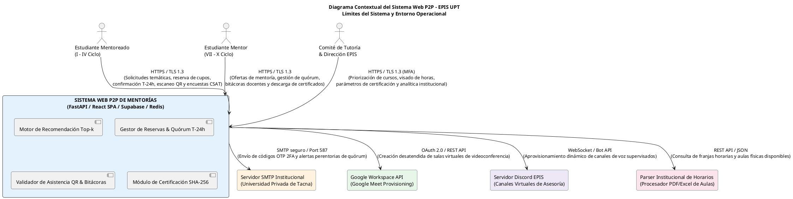
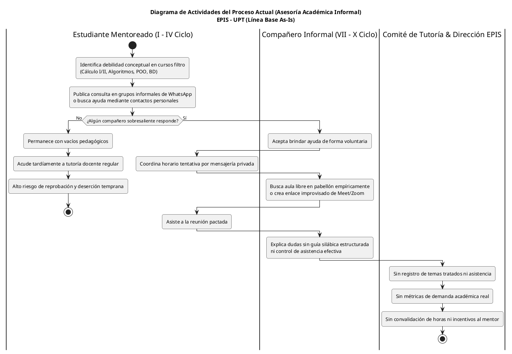
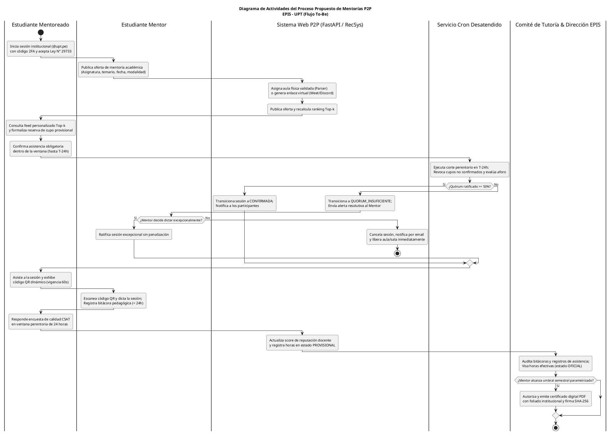

# UNIVERSIDAD PRIVADA DE TACNA

**FACULTAD DE INGENIERÍA**  
**ESCUELA PROFESIONAL DE INGENIERÍA DE SISTEMAS**

# “Sistema Web P2P con algoritmo de recomendación para la personalización de mentorías académicas en la EPIS-UPT”

**Curso:**  
Construcción de Software I

**Docente:**  
Dr. RICARDO EDUARDO VALCARCEL ALVARADO

**AUTORES:**  
- ANTAYHUA MAMANI, Renzo Antonio (2022073504)  
- MEDINA QUISPE, Joan Cristian (2022074255)

**TACNA – PERÚ**  
**2026**

---

## CONTROL DE VERSIONES

| Versión | Hecha por | Revisada por | Aprobada por | Fecha | Motivo |
|:---:|:---:|:---:|:---:|:---:|:---|
| **1.0** | JCM / RAM | RVA | Dirección EPIS | 28/09/2026 | Versión inicial del Documento de Arquitectura de Software (SAD). Establecimiento de las bases arquitectónicas: Introducción, Representación 4+1, Objetivos y Limitaciones, y Análisis de Requerimientos. |

# Sistema Web P2P con algoritmo de recomendación para la personalización de mentorías académicas en la EPIS-UPT

**Documento de Arquitectura de Software (SAD - Software Architecture Document)**  
**Versión 1.0 (Línea Base Inicial)**

---

## ÍNDICE GENERAL

1. [Introducción](#1-introducción)  
   1.1. [Propósito](#11-propósito)  
   1.2. [Alcance](#12-alcance)  
   1.3. [Definición, siglas y abreviaturas](#13-definición-siglas-y-abreviaturas)  
   1.4. [Referencias](#14-referencias)  
   1.5. [Visión General](#15-visión-general)  
2. [Representación Arquitectónica](#2-representación-arquitectónica)  
   2.1. [Escenarios](#21-escenarios)  
   2.2. [Vista Lógica](#22-vista-lógica)  
   2.3. [Vista del Proceso](#23-vista-del-proceso)  
   2.4. [Vista del desarrollo](#24-vista-del-desarrollo)  
   2.5. [Vista Física](#25-vista-física)  
3. [Objetivos y limitaciones arquitectónicas](#3-objetivos-y-limitaciones-arquitectónicas)  
   3.1. [Disponibilidad](#31-disponibilidad)  
   3.2. [Seguridad](#32-seguridad)  
   3.3. [Adaptabilidad](#33-adaptabilidad)  
   3.4. [Rendimiento](#34-rendimiento)  
4. [Análisis de Requerimientos](#4-análisis-de-requerimientos)  
   4.1. [Requerimientos funcionales](#41-requerimientos-funcionales)  
   4.2. [Requerimientos no funcionales](#42-requerimientos-no-funcionales)  
5. [Vistas de Caso de Uso](#5-vistas-de-caso-de-uso)  
6. [Vista Lógica](#6-vista-lógica)  
   6.1. [Diagrama Contextual](#61-diagrama-contextual)  
7. [Vista de Procesos](#7-vista-de-procesos)  
   7.1. [Diagrama de Proceso Actual](#71-diagrama-de-proceso-actual)  
   7.2. [Diagrama de Proceso Propuesto](#72-diagrama-de-proceso-propuesto)  
8. [Vista de Despliegue](#8-vista-de-despliegue)  
   8.1. [Diagrama de Contenedor](#81-diagrama-de-contenedor)  
9. [Vista de Implementación](#9-vista-de-implementación)  
   9.1. [Diagrama de Componentes](#91-diagrama-de-componentes)  
10. [Vista de Datos](#10-vista-de-datos)  
    10.1. [Diagrama Entidad Relación](#101-diagrama-entidad-relación)  
11. [Calidad](#11-calidad)  
    11.1. [Escenario de Seguridad](#111-escenario-de-seguridad)  
    11.2. [Escenario de Usabilidad](#112-escenario-de-usabilidad)  
    11.3. [Escenario de Adaptabilidad](#113-escenario-de-adaptabilidad)  
    11.4. [Escenario de Disponibilidad](#114-escenario-de-disponibilidad)  
    11.5. [Otro Escenario: Escenario de Trazabilidad y Auditoría](#115-otro-escenario-escenario-de-trazabilidad-y-auditoría)  

---

## 1. Introducción

El presente Documento de Arquitectura de Software (**SAD**, por sus siglas en inglés *Software Architecture Document*) formaliza la estructura global, las decisiones tecnológicas fundamentales, los patrones de diseño y los mecanismos de ingeniería que sustentan el **Sistema Web P2P con algoritmo de recomendación para la personalización de mentorías académicas en la EPIS-UPT**. La arquitectura ha sido concebida bajo la metodología **UWE** (*UML-based Web Engineering*) y el modelo canónico de **4+1 Vistas de Philippe Kruchten**, asegurando que cada requerimiento funcional y atributo de calidad (ISO/IEC 25010) cuente con una respuesta estructural auditable, resiliente y escalable en el entorno universitario.

### 1.1. Propósito

El propósito fundamental de este documento es:
1. **Guiar el Diseño y la Construcción:** Proveer a los desarrolladores, arquitectos de software e ingenieros de pruebas una guía fidedigna e inequívoca de la estructura interna del sistema, desacoplando responsabilidades entre la capa de presentación (Frontend SPA), la lógica de negocio y recomendación (Backend API REST / Microservicios) y la capa de persistencia y seguridad relacional (PostgreSQL / Supabase / Redis).
2. **Garantizar la Satisfacción de Atributos de Calidad:** Demostrar cómo las decisiones arquitectónicas mitigan los riesgos asociados a la seguridad de la información (Ley N° 29733), la alta disponibilidad en periodos críticos de matrícula, la baja latencia en la inferencia algorítmica y la integridad transaccional en la reserva de cupos limitados.
3. **Facilitar la Auditoría y Mantenibilidad:** Establecer un punto de referencia técnico formal para los comités de evaluación curricular, la Dirección de Escuela de la EPIS y los auditores institucionales de la Universidad Privada de Tacna.

### 1.2. Alcance

El alcance arquitectónico abarca el diseño técnico integral de la plataforma web en su versión de producción para el semestre 2026-II, comprendiendo los ocho módulos funcionales canónicos:
- **MOD-01 (Seguridad y Perfiles):** Autenticación federada institucional OAuth 2.0 con segundo factor 2FA (TOTP) y políticas de seguridad a nivel de fila (*Row Level Security* - RLS).
- **MOD-02 (Motor de Recomendación):** Servicio de inferencia híbrida *Top-k* basado en similitud coseno sobre vectores de perfil académico, afinidad temporal y reputación ponderada con bonificación directiva (`RN-11`).
- **MOD-03 (Oferta y Demanda):** Gestión del catálogo lectivo de mentorías y captación de solicitudes temáticas por demanda estudiantil.
- **MOD-04 (Reserva y Quórum):** Bloqueo transaccional de cupos, ratificación obligatoria en ventana perentoria y corte automático de quórum en $T-24\text{ h}$ (`RN-08`/`RN-09`).
- **MOD-05 (Asistencia y Bitácoras):** Validación presencial mediante códigos QR dinámicos con semilla temporal de 60 segundos (`RNF04`) y registro estructurado de bitácoras docentes en un plazo menor a 24 horas (`RN-12`).
- **MOD-06 (Calidad y Gamificación):** Encuestas de satisfacción CSAT con disociación criptográfica de identidad (`RN-13`) y cálculo de insignias de reputación.
- **MOD-07 (Certificación Digital):** Emisión de constancias foliadas con sellado de tiempo y firma hash SHA-256 verificable públicamente (`RN-14`).
- **MOD-08 (Auditoría y Analítica):** Visado de bitácoras por el Comité de Tutoría y panel directivo de retención académica.

**Exclusiones:** No forman parte del alcance del sistema la gestión de notas curriculares oficiales (competencia exclusiva del ERP institucional de la UPT), el pago de estipendios monetarios ni la administración de plataformas de videoconferencia externas (las cuales se integran mediante URLs parametrizadas de Google Meet / Microsoft Teams).

### 1.3. Definición, siglas y abreviaturas

Para facilitar la interpretación unívoca de los términos técnicos empleados a lo largo del documento, se presenta la siguiente matriz terminológica:

A continuación, se define la terminología técnica, estándares y acrónimos utilizados en la especificación arquitectónica del sistema:

### Cuadro 1.1: Glosario de Términos, Siglas y Abreviaturas Arquitectónicas

| Sigla / Término | Definición Formal y Significado en el Contexto del Proyecto |
| :--- | :--- |
| **SAD** | *Software Architecture Document* (Documento de Arquitectura de Software). Artefacto formal que describe la arquitectura integral del sistema mediante múltiples vistas complementarias. |
| **UWE** | *UML-based Web Engineering*. Metodología de ingeniería de software orientada a la web que extiende el estándar UML para modelar aspectos navegacionales, presentacionales y lógicos. |
| **ECB** | *Entity-Control-Boundary* (Entidad-Control-Frontera). Patrón de análisis y diseño arquitectónico que separa objetos de interfaz (Frontera), orquestación de negocio (Control) y persistencia del dominio (Entidad). |
| **Top-k** | Algoritmo de filtrado y ordenamiento que selecciona los $k$ mejores elementos de una colección evaluada según una función de similitud o scoring multivariable. |
| **2FA / TOTP** | *Two-Factor Authentication / Time-based One-Time Password*. Mecanismo de autenticación reforzado que genera códigos de un solo uso válidos por ventanas temporales estrictas (RFC 6238). |
| **RLS** | *Row Level Security*. Característica de seguridad en motores de bases de datos relacionales (PostgreSQL) que restringe el acceso a filas específicas según el rol y contexto del token de sesión. |
| **SPA** | *Single Page Application*. Aplicación web construida sobre una sola página que carga dinámicamente recursos e interfaces sin recargar el navegador (implementada en React + Vite). |
| **JWT** | *JSON Web Token*. Estándar abierto (RFC 7519) para la transmisión segura y compacta de información autenticada y firmada digitalmente entre clientes y servicios web. |
| **CSAT** | *Customer Satisfaction Score*. Métrica estandarizada para evaluar el nivel de satisfacción percibido por el mentoreado respecto a la sesión académica recibida. |
| **SHA-256** | *Secure Hash Algorithm 256-bit*. Función criptográfica unidireccional que genera un resumen de 64 caracteres hexadecimales para garantizar la integridad de certificados y bitácoras. |
| **EPIS-UPT** | Escuela Profesional de Ingeniería de Sistemas de la Universidad Privada de Tacna. Unidad académica beneficiaria y entorno institucional del proyecto. |
| **MoSCoW** | Método de priorización de requerimientos: *Must have* (Obligatorio), *Should have* (Recomendable), *Could have* (Deseable), *Won't have* (Excluido por ahora). |

Fuente: Elaboración propia.

Como se desprende del cuadro anterior, las siglas y términos definidos garantizan una base conceptual común entre los estándares de ingeniería web (UWE, ECB, SPA), la seguridad computacional (2FA, RLS, SHA-256) y el marco institucional de la EPIS-UPT.

### 1.4. Referencias

A continuación, se listan las fuentes normativas, estándares internacionales y documentos canónicos del proyecto que sirven de base para la presente especificación:

### Cuadro 1.2: Referencias Normativas, Estándares y Documentos del Proyecto

| Identificador | Título del Documento / Norma | Organismo / Fuente | Relevancia Arquitectónica |
| :--- | :--- | :--- | :--- |
| **IEEE 830-1998** | *IEEE Recommended Practice for Software Requirements Specifications* | IEEE Computer Society | Estándar de estructuración y calidad para la especificación de requerimientos de software. |
| **ISO/IEC 25010:2011** | *Systems and software engineering — Systems and software Quality Requirements and Evaluation (SQuaRE)* | ISO / IEC | Marco taxonómico para la evaluación y aseguramiento de los atributos de calidad del sistema. |
| **Kruchten (1995)** | *The 4+1 View Model of Architecture* | IEEE Software, 12(6) | Modelo canónico de vistas arquitectónicas adoptado en la organización del presente SAD. |
| **Koch & Kraus (2002)** | *The expressive power of UML-based Web Engineering* | Second International Workshop on Web-oriented Software Technology | Fundamentación metodológica UWE para la ingeniería de modelos en aplicaciones web. |
| **Ley N° 29733** | *Ley de Protección de Datos Personales del Perú y su Reglamento (D.S. 003-2013-JUS)* | Congreso de la República del Perú | Marco legal vinculante para el consentimiento informado y la disociación criptográfica de identidades. |
| **Ley N° 30220** | *Ley Universitaria (Art. 40 - Tutoría y Consejería)* | Congreso de la República del Perú | Sustento jurídico para la acreditación de horas de servicio formativo universitario mediante mentorías. |
| **FD01** | *Informe de Factibilidad del Sistema Web P2P* | EPIS-UPT (2026) | Validación de viabilidad operativa, técnica, económica y de tiempos de desarrollo. |
| **FD02** | *Informe Visión del Proyecto del Sistema Web P2P* | EPIS-UPT (2026) | Definición de necesidades de stakeholders, usuarios y características del producto. |
| **FD03** | *Informe SRS de Proyecto (Línea Base v2.0)* | EPIS-UPT (2026) | Especificación exhaustiva de 26 RF, 14 Reglas de Negocio, 10 RNF y 24 Casos de Uso. |

Fuente: Elaboración propia.

El conjunto de referencias citado establece un marco normativo sólido que combina estándares de la industria (IEEE, ISO/IEC), metodologías formales de ingeniería de software (Kruchten, UWE) y la legislación vigente peruana (Leyes 29733 y 30220).

### 1.5. Visión General

El presente SAD se organiza de forma sistemática para cubrir integralmente la arquitectura del sistema:
- La **Sección 2** expone la representación arquitectónica mediante el enfoque de **4+1 Vistas de Kruchten**, explicando cómo cada perspectiva atiende a distintos interesados del sistema.
- La **Sección 3** detalla los objetivos de calidad y restricciones arquitectónicas en disponibilidad, seguridad, adaptabilidad y rendimiento.
- La **Sección 4** articula el análisis de requerimientos funcionales y no funcionales que moldean la solución técnica.
- Las **Secciones 5 a 10** presentan las vistas concretas de modelado (Casos de uso arquitectónicos, Vista lógica contextual, Procesos As-Is/To-Be, Despliegue en contenedores, Componentes de implementación y Modelo Entidad-Relación de datos).
- La **Sección 11** documenta los escenarios de calidad estandarizados mediante árboles de utilidad y fichas formales de evaluación.

---

## 2. Representación Arquitectónica

La arquitectura del Sistema Web P2P se articula siguiendo el modelo canónico de **4+1 Vistas de Philippe Kruchten**, extendido con los principios de la metodología **UWE** para aplicaciones web centradas en datos y procesos transaccionales. Este enfoque permite separar las preocupaciones arquitectónicas en perspectivas desacopladas pero perfectamente integradas, donde los escenarios de casos de uso operan como el eje conductor ("+1") que valida y cohesiona las demás vistas:

A continuación, se sintetiza la correspondencia entre los interesados, los artefactos generados y las vistas del modelo arquitectónico:

### Cuadro 2.1: Mapeo de Vistas del Modelo Arquitectónico 4+1 adaptado a UWE

| Vista Arquitectónica | Audiencia Principal | Preocupación Fundamental | Artefactos / Diagramas Representativos |
| :--- | :--- | :--- | :--- |
| **Escenarios (+1)** | Usuarios finales, Dirección EPIS, Docentes | Validación funcional, satisfacción de reglas de negocio y flujos críticos de valor. | Diagramas de Casos de Uso canónicos, Fichas de Casos de Uso significativos (`CUS01`, `CUS02`, `CUS04`, `CUS23`, `CUS11`, `CUS10`, `CUS13`, `CUS22`). |
| **Vista Lógica** | Desarrolladores, Diseñadores de software | Organización modular, descomposición funcional, responsabilidades y encapsulamiento. | Diagrama Contextual, Modelos ECB (Entidad-Control-Frontera), Diagramas de Clases Parciales y Diagramas de Paquetes. |
| **Vista del Proceso** | Integradores, Administradores de sistemas | Concurrencia, sincronización de hilos, transaccionalidad, tareas en segundo plano y cortes perentorios. | Diagramas de Actividades con Objetos, Diagramas de Secuencia, Máquinas de Estado (`SesionMentoria`, `ReservaCupo`, `BitacoraDocente`). |
| **Vista de Desarrollo** | Ingenieros de software, Líderes técnicos | Estructura del código fuente, dependencias entre módulos, librerías, empaquetado y versionado. | Diagrama de Componentes de Implementación, Árbol de paquetes frontend/backend, Manifiestos de dependencias (`package.json`, `requirements.txt`). |
| **Vista Física** | Ingenieros DevOps, Administradores de infraestructura | Topología de despliegue en red, nodos de cómputo, contenedores, persistencia y protocolos de comunicación. | Diagrama de Despliegue, Diagrama de Contenedores Docker, Configuración de balanceo, almacenamiento Supabase y CDN. |

Fuente: Elaboración propia.

Como se observa en el cuadro anterior, cada vista responde a un conjunto específico de inquietudes de ingeniería, asegurando que todos los participantes del proyecto cuenten con una perspectiva clara y adaptada a su rol técnico.

### 2.1. Escenarios

La vista de **Escenarios (+1)** materializa el comportamiento del sistema a partir de los casos de uso arquitecturalmente significativos. Estos escenarios constituyen la columna vertebral de la solución, pues imponen los requisitos más exigentes sobre la infraestructura y la lógica de negocio:
1. **Acceso Seguro con 2FA (`CUS01`):** Autenticación de doble factor obligatoria para resguardar la identidad de los usuarios institucionales.
2. **Inferencia Algorítmica *Top-k* (`CUS02`):** Generación en tiempo real del feed personalizado de mentorías, demandando indexación vectorial y bajo tiempo de respuesta.
3. **Reserva Concurrente y Bloqueo de Cupo (`CUS04`):** Garantía de atomicidad transaccional (ACID) para evitar sobrecupos (*overbooking*) en aulas físicas de capacidad restringida.
4. **Corte Perentorio y Evaluación de Quórum en $T-24\text{ h}$ (`CUS23`):** Proceso desatendido (Cron) de alta criticidad temporal que reasigna recursos institucionales ante inasistencias.
5. **Acreditación Presencial mediante QR Efímero (`CUS11`):** Validación en aula en tiempo real que exige sincronización temporal estricta y protección contra falsificaciones.
6. **Auditoría y Certificación Digital Foliada (`CUS22` / `CUS13`):** Cierre del ciclo formativo con firma criptográfica SHA-256 para emisión de certificados con valor legal académico.

### 2.2. Vista Lógica

La **Vista Lógica** describe la organización funcional del sistema a través de una descomposición estratificada en tres capas desacopladas, reforzadas internamente por el patrón **ECB (Entidad-Control-Frontera)**:
- **Capa de Presentación (Frontera / Boundary):** Compuesta por componentes React SPA que encapsulan la captura de entradas del usuario, validación reactiva de formularios, renderizado de interfaces accesibles e interactividad asíncrona.
- **Capa de Aplicación y Negocio (Control):** Orquestada por servicios FastAPI en Python, implementando controladores que aplican rigurosamente las reglas de negocio (`RN-01` a `RN-14`), ejecutan algoritmos de recomendación híbridos y gestionan las transacciones operativas.
- **Capa de Persistencia y Dominio (Entidad):** Modelada en PostgreSQL (Supabase) con tablas normalizadas, restricciones de integridad referencial, disparadores (*triggers*) y políticas de seguridad a nivel de fila (*RLS*), complementada con Redis para almacenamiento en memoria de alta velocidad.

### 2.3. Vista del Proceso

La **Vista del Proceso** aborda los aspectos dinámicos de ejecución, concurrencia y sincronización del sistema. Se estructura en torno a los siguientes hilos de procesamiento:
- **Procesamiento de Solicitudes HTTP/HTTPS Asíncronas:** El servidor backend (FastAPI / Uvicorn) opera sobre un bucle de eventos asíncrono (*event-loop* con `asyncio`), permitiendo atender cientos de conexiones concurrentes sin bloquear hilos del sistema operativo durante operaciones de I/O a base de datos.
- **Tareas Automatizadas en Segundo Plano (Cron Jobs):** Procesos programados que se ejecutan a intervalos regulares para realizar el corte de quórum en $T-24\text{ h}$ (`CUS23`), anulación de reservas no ratificadas y cálculo periódico de embeddings temáticos.
- **Gestión Transaccional de Aforo:** Mecanismo de bloqueo a nivel de fila (`SELECT ... FOR UPDATE`) o transacciones serializables en PostgreSQL para asegurar la atomicidad e impedir condiciones de carrera durante la reserva masiva de cupos en mentorías de alta demanda.

### 2.4. Vista del desarrollo

La **Vista de Desarrollo** describe la arquitectura del software desde la perspectiva del entorno de construcción, dependencias y estructura de paquetes del código fuente:
- **Frontend SPA (React + TypeScript + Vite):**
  - `src/components/`: Componentes modulares reutilizables y vistas operativas (`BookingView`, `HomeView`, `GamificationView`, `RecommendationView`, `ConsentModal`).
  - `src/services/`: Clientes HTTP tipados para consumo de la API REST mediante Axios/Fetch con interceptores de tokens JWT.
  - `src/data/`: Tipos, interfaces TypeScript y esquemas de datos mock/reales.
  - `src/styles/`: Configuración de estilos atómicos con Tailwind CSS.
- **Backend API (Python + FastAPI):**
  - `app/api/`: Enrutadores de endpoints versionados (`/api/v1/...`).
  - `app/core/`: Configuración global, middleware de seguridad, manejo de JWT y conexión a bases de datos.
  - `app/services/`: Lógica de negocio pura (motor de recomendación, generador de QR, evaluador de quórum).
  - `app/models/`: Modelos ORM (SQLAlchemy) y esquemas de serialización/validación (Pydantic).
  - `app/db/`: Migraciones estructuradas con Alembic.

### 2.5. Vista Física

La **Vista Física** define la distribución física de los componentes de software en los nodos de hardware y servicios en la nube:
- **Nodos Clientes:** Navegadores web modernos (Chrome, Firefox, Edge, Safari) ejecutándose en computadoras de escritorio de los laboratorios de la EPIS o dispositivos móviles de mentores y mentoreados, comunicándose exclusivamente vía HTTPS (TLS 1.3).
- **Servidor de Aplicación (Backend):** Contenedor Docker desplegado en una instancia de servidor Linux, orquestado con reinicio automático y límites de memoria/CPU, exponiendo la API REST detrás de un proxy inverso NGINX que gestiona la terminación SSL y la compresión de respuestas.
- **Servicios Administrados de Datos (Cloud):**
  - Clúster de Base de Datos PostgreSQL alojado en Supabase, con réplicas de lectura automáticas y respaldos continuos.
  - Instancia en memoria Redis para caché volátil de sesiones y tokens efímeros.
  - Bucket de almacenamiento de objetos (Object Storage) para PDFs firmados de certificados y evidencias de bitácoras docentes.

---

## 3. Objetivos y limitaciones arquitectónicas

El diseño de la arquitectura del Sistema Web P2P se encuentra gobernado por un conjunto de objetivos de calidad derivados directamente de la norma **ISO/IEC 25010** y condicionado por restricciones técnicas, institucionales y regulatorias del entorno universitario:

A continuación, se presenta la matriz de trade-offs y decisiones de diseño arquitectónico adoptadas para equilibrar los requerimientos de calidad:

### Cuadro 3.1: Matriz de Decisiones Arquitectónicas y Trade-offs de Calidad

| Decisión Arquitectónica | Objetivo de Calidad Primario | Trade-off / Costo Asociado | Justificación Técnica Institucional |
| :--- | :--- | :--- | :--- |
| **Separación Frontend SPA / Backend API REST** | Adaptabilidad y Mantenibilidad | Mayor complejidad en la gestión de estado y autenticación JWT. | Permite evolucionar la interfaz web o incorporar una app móvil nativa sin alterar la lógica de negocio. |
| **Uso de FastAPI con Python Asíncrono** | Rendimiento y Escalabilidad | Curva de aprendizaje en programación asíncrona (`async`/`await`). | Ofrece tiempos de respuesta inferiores a 100 ms y alto rendimiento en inferencia con librerías numéricas de Python (*NumPy, Scikit-learn*). |
| **Políticas RLS en PostgreSQL (Supabase)** | Seguridad e Integridad | Sobrecarga de procesamiento por consulta evaluada en el motor de base de datos. | Garantiza seguridad en profundidad: incluso si la API se ve comprometida, ningún usuario accede a filas no autorizadas. |
| **Tokens QR Dinámicos Efímeros (60s)** | Seguridad y Veracidad de Asistencia | Requiere sincronización horaria precisa (NTP) entre cliente y servidor. | Erradica por completo la suplantación de identidad y el fraude en el registro de asistencias presenciales. |
| **Caché en Redis para Ranking Top-k** | Rendimiento y Disponibilidad | Necesidad de implementar políticas de invalidación ante cambios curriculares (`RN-11`). | Reduce la carga computacional en un 80% durante picos masivos de consulta de mentorías. |

Fuente: Elaboración propia.

La matriz anterior evidencia que cada decisión de diseño responde a un análisis consciente de balance entre ventajas arquitectónicas y costos de implementación, priorizando siempre la solidez y confiabilidad del servicio académico.

### 3.1. Disponibilidad

- **Objetivo Arquitectónico:** El sistema debe ofrecer una disponibilidad mínima del **99.5%** durante el horario lectivo ordinario (lunes a sábado de 07:00 a 22:00 horas), con un tiempo medio entre fallos (MTBF) superior a 720 horas continuas.
- **Mecanismos de Soporte:**
  - Despliegue en contenedores con políticas de salud (*health checks*) y autoreiniciado ante excepciones no controladas.
  - Copias de seguridad automáticas diarias en Supabase con capacidad de recuperación ante desastres (*Point-in-Time Recovery* - PITR).
  - Manejo de degradación elegante en el frontend: si el motor de recomendación experimenta sobrecarga, la plataforma conmuta automáticamente al catálogo ordenado cronológicamente sin interrumpir las reservas.

### 3.2. Seguridad

- **Objetivo Arquitectónico:** Proteger la confidencialidad, integridad y fe pública de los datos académicos y personales, garantizando el cumplimiento irrestricto de la **Ley N° 29733 (Ley de Protección de Datos Personales del Perú)**.
- **Mecanismos de Soporte:**
  - **Autenticación Fuerte:** Acceso mediante correo institucional UPT validado con segundo factor 2FA (RFC 6238 TOTP) para mitigar el robo de credenciales.
  - **Control de Acceso Basado en Roles y Filas:** Implementación de RBAC combinado con RLS en PostgreSQL, asegurando que los mentoreados solo visualicen sus propias reservas y evaluaciones.
  - **Cifrado Integral:** Comunicación forzada mediante HTTPS/TLS 1.3 con certificados SSL clase A+, y cifrado AES-256 en reposo para datos sensibles.
  - **Disociación Criptográfica:** Anonimización irreversible mediante hashing SHA-256 en encuestas de calidad docente (`RN-13`) y almacenamiento seguro de bitácoras.

### 3.3. Adaptabilidad

- **Objetivo Arquitectónico:** Permitir la evolución modular del sistema ante cambios curriculares en la EPIS-UPT, incorporación de nuevos algoritmos de recomendación o integración con sistemas universitarios externos.
- **Mecanismos de Soporte:**
  - Arquitectura desacoplada basada en contratos de API REST documentados bajo OpenAPI 3.0 / Swagger.
  - Patrón Estrategia (*Strategy Pattern*) en el motor de recomendación, posibilitando alternar o combinar inferencia híbrida, filtrado colaborativo o redes neuronales de grafos sin modificar los controladores de consumo.
  - Diseño responsivo adaptativo que garantiza operatividad fluida en resoluciones desde 360px (smartphones) hasta 4K (monitores de laboratorio).

### 3.4. Rendimiento

- **Objetivo Arquitectónico:** Mantener una latencia de respuesta imperceptible para el usuario y una alta tasa de procesamiento en operaciones críticas de emparejamiento y reserva.
- **Mecanismos de Soporte:**
  - Tiempo de respuesta de endpoints de lectura inferior a **150 ms** para el percentil 95 ($P_{95}$) bajo condiciones normales de carga.
  - Tiempo de generación del ranking *Top-k* inferior a **200 ms**, optimizado mediante precomputación de embeddings curriculares y almacenamiento en caché Redis.
  - Capacidad para procesar al menos 50 solicitudes de reserva concurrentes por segundo sin incurrir en colisiones ni violaciones de integridad de aforo.

---

## 4. Análisis de Requerimientos

La arquitectura se fundamenta en la especificación formal contenida en el documento SRS (**FD03 - Línea Base v2.0**), articulándose en requerimientos funcionales organizados por módulos y requerimientos no funcionales estandarizados bajo ISO/IEC 25010:

### 4.1. Requerimientos funcionales

A continuación, se presenta la síntesis de los requerimientos funcionales del sistema, agrupados por módulo y categorizados según su prioridad arquitectónica (MoSCoW):

### Cuadro 4.1: Matriz de Requerimientos Funcionales y su Impacto Arquitectónico

| Código | Requerimiento Funcional | Módulo | Prioridad | Impacto en la Arquitectura |
| :---: | :--- | :---: | :---: | :--- |
| **RF01** | Autenticación institucional con 2FA | MOD-01 | Must | Middleware de autenticación JWT y validación TOTP. |
| **RF02** | Gestión de perfiles y roles (Mentor/Mentoreado/Admin) | MOD-01 | Must | Modelo de datos de usuarios y políticas RLS por rol. |
| **RF03** | Generación de recomendaciones personalizadas *Top-k* | MOD-02 | Must | Pipeline de cálculo vectorial, similitud coseno y caché Redis. |
| **RF04** | Registro de solicitudes temáticas por demanda | MOD-03 | Should | Endpoints asíncronos y actualización de vectores de demanda. |
| **RF05** | Publicación de oferta de mentoría individual/grupal | MOD-03 | Must | Validación de franjas horarias y control de aforo por modalidad. |
| **RF06** | Configuración de disponibilidad horaria del mentor | MOD-03 | Should | Matriz semanal de slots y verificación de cruces de horario. |
| **RF07** | Búsqueda reactiva y filtrado multicriterio de ofertas | MOD-03 | Must | Índices de texto completo (*Full-Text Search*) en PostgreSQL. |
| **RF08** | Reserva de cupo de mentoría académica | MOD-04 | Must | Transacciones ACID concurrentes con bloqueo de aforo. |
| **RF09** | Notificación y recordatorio de sesiones | MOD-04 | Should | Cola de mensajería asíncrona para envíos de alertas push/email. |
| **RF10** | Confirmación perentoria de asistencia en $T-24\text{ h}$ | MOD-04 | Must | Lógica de estados de reserva (`RN-08`) y verificación de ventana. |
| **RF11** | Corte automático y evaluación de quórum al 50% | MOD-04 | Must | Proceso desatendido (Cron) de alta prioridad y disparador `RN-09`. |
| **RF12** | Gestión de sesión ante quórum insuficiente | MOD-04 | Must | Máquina de estados: resolución sin penalización (`RN-10`). |
| **RF13** | Cancelación justificada de reservas | MOD-04 | Should | Liberación atómica de cupo y recálculo de aforo disponible. |
| **RF14** | Generación de código QR dinámico de asistencia | MOD-05 | Must | Algoritmo de token efímero TOTP con semilla criptográfica. |
| **RF15** | Escaneo y validación de código QR en aula | MOD-05 | Must | Endpoint de verificación rápida con ventana de tolerancia de 60s. |
| **RF16** | Registro de bitácora pedagógica post-mentoría | MOD-05 | Must | Formulario estructurado con validación temporal (< 24h, `RN-12`). |
| **RF17** | Edición y subsanación de bitácoras observadas | MOD-05 | Should | Flujo de revisión con historial de cambios y plazo de 48h. |
| **RF18** | Aplicación de encuesta de calidad post-mentoría (CSAT) | MOD-06 | Must | Mecanismo de disociación criptográfica de identidad (`RN-13`). |
| **RF19** | Asignación automática de insignias y reputación | MOD-06 | Should | Motor de reglas de gamificación y actualización de score. |
| **RF20** | Visualización de tablero de reputación y medallas | MOD-06 | Could | Componente SPA con cálculo de percentiles y progresión. |
| **RF21** | Parametrización y emisión de certificados foliados | MOD-07 | Must | Generador de PDFs con firma hash SHA-256 y sellado oficial. |
| **RF22** | Descarga y verificación pública de certificados | MOD-07 | Must | Portal público de validación criptográfica mediante QR impreso. |
| **RF23** | Auditoría y visado de bitácoras por Comité Tutoría | MOD-08 | Must | Interfaz administrativa con doble confirmación para horas oficiales. |
| **RF24** | Destacar mentorías prioritarias institucionales | MOD-08 | Should | Configuración directiva del factor de bonificación $\alpha$ (`RN-11`). |
| **RF25** | Visualización de tablero de analíticas académicas | MOD-08 | Should | Agregaciones OLAP sobre deserción, asistencia y horas efectivas. |
| **RF26** | Exportación de reportes institucionales disociados | MOD-08 | Could | Generador de reportes en CSV/PDF bajo estándar Ley N° 29733. |

Fuente: Elaboración propia.

Como se evidencia en la matriz funcional, los 26 requerimientos funcionales imponen demandas específicas sobre la arquitectura, abarcando desde la capa criptográfica (RF01, RF14, RF21) hasta el procesamiento transaccional concurrente (RF08, RF11) y la analítica directiva (RF24, RF25).

### 4.2. Requerimientos no funcionales

A continuación, se detallan los requerimientos no funcionales del sistema estructurados bajo las características de calidad de la norma **ISO/IEC 25010**:

### Cuadro 4.2: Matriz de Requerimientos No Funcionales (ISO/IEC 25010)

| Código | Característica de Calidad | Descripción Operativa y Métrica de Conformidad | Mecanismo Arquitectónico de Implementación |
| :---: | :--- | :--- | :--- |
| **RNF01** | Rendimiento (Tiempo de Respuesta) | El 95% de las peticiones HTTP GET deben responder en un tiempo inferior a **150 ms** bajo carga nominal de 100 usuarios concurrentes. | FastAPI asíncrono, índices B-Tree en PostgreSQL y compresión Gzip/Brotli en NGINX. |
| **RNF02** | Rendimiento (Inferencia *Top-k*) | El cómputo y ordenamiento de las recomendaciones personalizadas no debe exceder los **200 ms** por solicitud. | Embeddings precomputados, cálculos vectoriales vectorizados con NumPy y caché Redis con TTL. |
| **RNF03** | Concurrencia y Capacidad | El sistema debe soportar hasta **200 usuarios concurrentes** activos sin pérdida de paquetes ni degradación de servicio. | Servidor ASGI Uvicorn con múltiples *workers* y agrupación de conexiones (*connection pooling*) en base de datos. |
| **RNF04** | Seguridad (Verificación QR) | El código QR de asistencia debe generarse con un token efímero de un solo uso con ciclo de vida máximo de **60 segundos**. | Algoritmo TOTP basado en secreto compartido con ventana temporal estricta de validación. |
| **RNF05** | Seguridad (Protección de Datos) | Los datos sensibles y encuestas de calidad deben estar disociados criptográficamente garantizando anonimato bajo la **Ley N° 29733**. | Hash unidireccional SHA-256 con *salt* institucional para disociar identidades de estudiantes. |
| **RNF06** | Usabilidad (Accesibilidad y Eficiencia) | La interfaz de usuario debe obtener un puntaje superior a **85/100 en la escala SUS** (*System Usability Scale*) y cumplir WCAG 2.1 nivel AA. | Diseño centrado en el usuario, contrastes cromáticos normados y navegación por teclado en React SPA. |
| **RNF07** | Disponibilidad Operativa | Disponibilidad de servicio no menor a **99.5%** en horario institucional (07:00 a 22:00 horas, lunes a sábado). | Arquitectura en la nube con réplicas gestionadas, autorecuperación en contenedores y monitoreo de uptime. |
| **RNF08** | Fiabilidad e Integridad de Datos | Pérdida de datos nula ($RPO = 0$ para transacciones confirmadas) y tiempo de recuperación ante fallos ($RTO$) menor a **15 minutos**. | Transacciones ACID, registros WAL (*Write-Ahead Logging*) en PostgreSQL y respaldos continuos PITR. |
| **RNF09** | Mantenibilidad y Modularidad | El código fuente debe estructurarse modularmente con cobertura de pruebas unitarias superior al **80%** en componentes críticos. | Desacoplamiento por capas, tipado estricto (TypeScript y Pydantic) y pruebas automatizadas con PyTest y Vitest. |
| **RNF10** | Portabilidad y Responsividad | El sistema debe operar con total fidelidad visual y funcional en Chrome (v110+), Firefox (v110+), Edge (v110+) y Safari móvil (iOS 16+). | Maquetación web con HTML5 semántico, CSS responsivo mediante Tailwind CSS y ausencia de plugins propietarios. |

Fuente: Elaboración propia.

El cumplimiento de los requerimientos no funcionales descritos garantiza que el Sistema Web P2P no solo satisfaga las expectativas operativas de los usuarios, sino que lo haga bajo estándares estrictos de rendimiento, seguridad de datos, accesibilidad universal y alta confiabilidad institucional.

---

## 5. Vistas de Caso de Uso

En el modelo canónico de **4+1 Vistas de Philippe Kruchten**, la vista de casos de uso constituye el elemento articulador central ("el +1") que cohesiona, valida e impone los requerimientos arquitectónicos sobre las cuatro vistas estructurales y dinámicas restantes (Lógica, Proceso, Desarrollo y Física). Un caso de uso es **arquitecturalmente significativo** cuando su ejecución introduce desafíos técnicos de alta exigencia, tales como concurrencia masiva, seguridad reforzada de doble factor, transaccionalidad atómica distribuida, cómputo matricial de baja latencia o sellado criptográfico de fe pública.

A continuación, se presenta la especificación gráfica y analítica de los casos de uso nucleares que moldean la arquitectura del Sistema Web P2P en la Escuela Profesional de Ingeniería de Sistemas (EPIS-UPT):

A continuación, se ilustra la interacción entre los actores del sistema y los casos de uso arquitectónicamente significativos, organizados por subsistemas operativos:

### Diagrama 5.1: Diagrama de Casos de Uso Arquitectónicos Consolidados - Sistema Web P2P EPIS-UPT

```plantuml
@startuml
title Diagrama de Casos de Uso Arquitectónicos Consolidados\nSistema Web P2P - EPIS UPT (2026)

left to right direction
skinparam packageStyle rectangle
skinparam shadowing false
skinparam roundcorner 8
skinparam defaultFontName Arial
skinparam fontSize 10

skinparam usecase {
    BackgroundColor #F8F9FA
    BorderColor #2B3A42
    ArrowColor #2B3A42
}

skinparam actor {
    BackgroundColor #E9ECEF
    BorderColor #1D2D44
}

actor "Mentoreado\n(I - IV Ciclo)" as Alumno
actor "Mentor Académico\n(VII - X Ciclo)" as Mentor
actor "Administrador / Tutoría\n(Dirección EPIS)" as Admin
actor "Servicio Cron Backend" as Cron <<Sistema>>
actor "Servicios Externos\n(Google Meet, Discord)" as Ext <<Sistema Externo>>

rectangle "Sistema Web P2P - Núcleo Arquitectónico" {
    package "Módulo 1: Seguridad & Gobernanza" {
        usecase "CUS01: Iniciar Sesión con 2FA\ny Consentimiento Ley 29733" as CUS01
    }

    package "Módulo 2 & 3: Emparejamiento & Demanda" {
        usecase "CUS02: Consultar Recomendaciones\nPersonalizadas Top-k" as CUS02
        usecase "CUS03: Registrar Solicitud\nTemática por Demanda" as CUS03
        usecase "CUS06: Publicar Oferta de\nMentoría Académica" as CUS06
    }

    package "Módulo 4: Reservas & Gobernanza de Quórum" {
        usecase "CUS04: Reservar Cupo de Mentoría\ncon Bloqueo Atómico" as CUS04
        usecase "CUS24: Confirmar Asistencia\nObligatoria (T >= 24h)" as CUS24
        usecase "CUS23: Ejecutar Alertas y\nCorte de Quórum (T-24h)" as CUS23
        usecase "CUS07: Gestionar Sesión ante\nQuórum Insuficiente (<50%)" as CUS07
    }

    package "Módulo 5 & 6: Trazabilidad, Asistencia & Calidad" {
        usecase "CUS11: Registrar Asistencia\nmediante Código QR Dinámico" as CUS11
        usecase "CUS10: Registrar Bitácora\nPedagógica de Sesión" as CUS10
        usecase "CUS05: Responder Encuesta\nde Calidad Post-Mentoría" as CUS05
    }

    package "Módulo 7 & 8: Certificación & Fiscalización" {
        usecase "CUS12: Destacar Asignaturas\nCríticas Prioritarias" as CUS12
        usecase "CUS22: Auditar Bitácoras y\nVisar Horas Oficiales" as CUS22
        usecase "CUS13: Parametrizar y Emitir\nCertificados con SHA-256" as CUS13
        usecase "CUS14: Visualizar Tablero de\nAnalíticas Institucionales" as CUS14
    }
}

' Asociaciones del Mentoreado
Alumno --> CUS01
Alumno --> CUS02
Alumno --> CUS03
Alumno --> CUS04
Alumno --> CUS24
Alumno --> CUS11
Alumno --> CUS05

' Asociaciones del Mentor
Mentor --> CUS01
Mentor --> CUS06
Mentor --> CUS07
Mentor --> CUS10

' Asociaciones del Administrador Institucional
Admin --> CUS01
Admin --> CUS12
Admin --> CUS22
Admin --> CUS13
Admin --> CUS14

' Asociaciones del Sistema Cron
Cron --> CUS23

' Integraciones con Sistemas Externos
CUS06 ..> Ext : <<integra>> (Meet API / Discord)

' Relaciones y Dependencias Arquitectónicas
CUS04 ..> CUS02 : <<precede>>
CUS24 ..> CUS04 : <<requiere reserva>>
CUS23 ..> CUS24 : <<evalúa ratificaciones>>
CUS07 ..> CUS23 : <<extend>> (Quórum < 50%)
CUS11 ..> CUS24 : <<valida ticket activo>>
CUS10 ..> CUS11 : <<incluye nómina presencial>>
CUS05 ..> CUS11 : <<habilita post-asistencia>>
CUS12 ..> CUS02 : <<bonifica factor alfa (RN-11)>>
CUS22 ..> CUS10 : <<audita evidencias>>
CUS13 ..> CUS22 : <<requiere visado previo (RN-14)>>
CUS14 ..> CUS05 : <<agrega satisfacción anónima (RN-13)>>
@enduml
```

Fuente: Elaboración propia.

Como se desprende del diagrama anterior, los casos de uso arquitectónicamente significativos establecen una cadena de dependencias funcionales fuertemente acopladas a las reglas de negocio institucionales:
1. **Cadena de Reserva y Quórum:** La reserva inicial (`CUS04`) no constituye una inscripción definitiva, sino un bloqueo provisional que exige ratificación obligatoria (`CUS24`). El corte desatendido en $T-24\text{ h}$ (`CUS23`) actúa como juez de gobernanza, anidando la extensión condicional hacia la gestión de contingencia del mentor (`CUS07`).
2. **Cadena de Fe Pública y Certificación:** La validez institucional de las horas formativas demanda una estricta precedencia: asistencia verificada físicamente vía QR (`CUS11`) $\rightarrow$ bitácora docente estructurada (`CUS10`) $\rightarrow$ auditoría y visado por el Comité de Tutoría (`CUS22`) $\rightarrow$ generación del certificado oficial foliado con firma hash SHA-256 (`CUS13`).

A continuación, se detalla el impacto directo que cada caso de uso nuclear ejerce sobre las distintas perspectivas del modelo arquitectónico:

### Cuadro 5.1: Matriz de Casos de Uso Arquitecturalmente Significativos y su Impacto en Vistas 4+1

| Código CUS | Denominación del Caso de Uso | Vista Lógica (ECB) | Vista del Proceso | Vista de Desarrollo | Vista Física / Despliegue |
| :---: | :--- | :--- | :--- | :--- | :--- |
| **CUS01** | Iniciar sesión institucional con 2FA | Controlador Auth / Entidad Usuario y Consentimiento | Hilo asíncrono de verificación TOTP y expiración JWT (15 min). | Módulo `app/core/security.py` y librerías `pyotp`, `python-jose`. | Conexión SSL/TLS 1.3 con servidor SMTP institucional UPT. |
| **CUS02** | Consultar recomendaciones Top-k | Controlador RecSys / Entidad Perfil y Embedding | Cómputo matricial vectorizado con NumPy y consulta paralela en Redis. | Subpaquete `app/services/recsys/` y modelos Scikit-learn. | Servidor backend con aceleración vectorial y clúster Redis en memoria. |
| **CUS04** | Reservar cupo de mentoría | Controlador Booking / Entidad Reserva y Aforo | Transacción serializable con bloqueo de fila (`FOR UPDATE`) en PostgreSQL. | Componente `BookingView.tsx` y servicio transaccional FastAPI. | Instancia primaria de Supabase con réplica de lectura desacoplada. |
| **CUS23** | Alertas y corte de quórum (T-24h) | Controlador Cron / Entidad Sesión y Transición | Proceso daemon desatendido con intervalos de escaneo cada 5 minutos. | Tareas programadas con `APScheduler` o Celery Beat en Python. | Worker backend independiente con alta resiliencia y reinicio automático. |
| **CUS11** | Registrar asistencia por código QR | Controlador Attendance / Entidad AsistenciaQR | Validación criptográfica de tokens efímeros con tolerancia temporal de 60s. | Generador QR en React SPA y validador HMAC-SHA256 en backend. | Sincronización estricta mediante protocolo NTP en nodos de cómputo. |
| **CUS10** | Registrar bitácora pedagógica | Controlador Logbook / Entidad Bitácora | Escritura transaccional y cambio de estado de sesión a `FINALIZADA`. | Formulario estructurado con validación temporal estricta (< 24h). | Bucket de almacenamiento para evidencias digitales y PostgreSQL. |
| **CUS13** | Parametrizar y emitir certificados | Controlador Certificate / Entidad Certificado | Pipeline de renderizado PDF en memoria y estampado de firma SHA-256. | Librería `ReportLab` o `WeasyPrint` con sellado digital criptográfico. | Almacenamiento seguro de objetos y CDN con enlaces firmados. |
| **CUS22** | Auditar bitácoras y visar horas | Controlador Audit / Entidad VisadoHoras | Transacción de doble confirmación con registro inmutable de auditoría. | Panel administrativo con interfaz analítica en React SPA. | Políticas RLS en base de datos para restringir acceso exclusivo a Dirección. |

Fuente: Elaboración propia.

El análisis de la matriz confirma que cada caso de uso arquitectónicamente significativo se traduce en soluciones técnicas concretas distribuidas en todas las vistas de la arquitectura, garantizando la consistencia global del sistema.

---

## 6. Vista Lógica

La **Vista Lógica** formaliza la descomposición funcional del sistema, estructurando sus responsabilidades bajo una arquitectura estratificada en tres capas (Presentación, Aplicación/Negocio y Persistencia) y gobernada por el patrón arquitectónico **Entidad-Control-Frontera (ECB)** derivado de las directrices metodológicas de **UWE**.

### 6.1. Diagrama Contextual

El Diagrama Contextual establece las fronteras operativas del software, delimitando con precisión los límites del sistema respecto a los actores humanos y los subsistemas externos con los cuales interactúa:

A continuación, se presenta el modelo contextual que ilustra los límites del sistema web y los flujos de datos con su entorno operacional:

### Diagrama 6.1: Diagrama Contextual del Sistema Web P2P EPIS-UPT (Límites y Entorno Operativo)

Fuente: Elaboración propia.

El análisis del Diagrama Contextual clarifica tres aspectos arquitectónicos de vital importancia:
1. **Límites de Responsabilidad:** El Sistema Web P2P no duplica funciones del ERP institucional ni gestiona matrículas formales; su alcance se concentra estrictamente en la intermediación, trazabilidad pedagógica y certificación del aprendizaje entre pares.
2. **Protocolos Seguros de Interfaz:** Todas las comunicaciones de usuario se canalizan bajo HTTPS forzado con TLS 1.3, mientras que las integraciones con servicios externos emplean autenticación delegada mediante tokens OAuth 2.0 y secretos institucionales cifrados.
3. **Aislamiento de Fallos:** Si los servicios de Google Meet o Discord experimentan indisponibilidad externa, el sistema degrada su funcionalidad de aprovisionamiento virtual a la modalidad manual sin interrumpir la persistencia de ofertas ni la asignación de aulas físicas provistas por el parser institucional.

### 6.2. Descomposición en Capas y Patrón Entidad-Control-Frontera (ECB)

Para estructurar la lógica interna del sistema, se adopta el patrón **ECB** (*Entity-Control-Boundary*), distribuyendo las clases en tres estereotipos complementarios:
- **Objetos Frontera (`Boundary`):** Vistas, modales y formularios React SPA que capturan eventos del usuario y renderizan respuestas.
- **Objetos de Control (`Control`):** Servicios y controladores FastAPI que ejecutan algoritmos, validan ventanas temporales y orquestan transacciones.
- **Objetos de Entidad (`Entity`):** Modelos ORM y tablas PostgreSQL que representan el estado persistente y seguro del dominio académico.

A continuación, se presenta la correspondencia de componentes ECB organizada por módulo funcional:

### Cuadro 6.1: Mapeo de Componentes del Patrón ECB por Módulo Funcional

| Módulo | Objeto Frontera (`Boundary`) | Objeto de Control (`Control`) | Objeto de Entidad (`Entity`) |
| :---: | :--- | :--- | :--- |
| **MOD-01** | `LoginView`, `TwoFactorModal`, `ConsentModal` | `AuthService`, `TOTPValidator`, `JWTManager` | `Usuario`, `Rol`, `ConsentimientoLegal` |
| **MOD-02** | `RecommendationView`, `CourseBadgeWidget` | `RecSysEngine`, `CosineSimilarityService` | `PerfilAcademico`, `VectorCompetencia`, `EmbeddingTema` |
| **MOD-03** | `PublishOfferingForm`, `DemandRequestModal` | `OfferingManager`, `DemandAggregatorService` | `OfertaMentoria`, `SolicitudDemanda`, `AsignaturaFiltro` |
| **MOD-04** | `BookingModal`, `ConfirmationView`, `QuorumAlertView` | `BookingService`, `QuorumEvaluatorCron`, `CancelService` | `ReservaCupo`, `EstadoReserva`, `EspacioFisico`, `EspacioVirtual` |
| **MOD-05** | `QRCodeGeneratorView`, `QRScannerView`, `LogbookForm` | `QRCryptoService`, `AttendanceValidator`, `LogbookService` | `TicketAsistenciaQR`, `BitacoraDocente`, `DetalleAsistencia` |
| **MOD-06** | `CSATSurveyModal`, `GamificationDashboard` | `SurveyProcessor`, `ReputationCalculatorService` | `EncuestaCalidad`, `ReputacionMentor`, `InsigniaOtorgada` |
| **MOD-07** | `CertificateDownloadView`, `QRVerifierPortal` | `PDFGeneratorService`, `SHA256Signer`, `VerifyService` | `CertificadoOficial`, `FoliadoInstitucional` |
| **MOD-08** | `AnalyticsDashboard`, `LogbookAuditView`, `PrioritySettings` | `AuditWorkflowService`, `InstitutionalAnalyticsEngine` | `VisadoBitacora`, `ConfiguracionPrioridad`, `MetricaDesercion` |

Fuente: Elaboración propia.

La segregación formal en componentes ECB garantiza un alto desacoplamiento y facilita la construcción de pruebas unitarias automatizadas sobre los controladores sin requerir la presencia de la interfaz gráfica ni la conexión directa a base de datos.

---

## 7. Vista de Procesos

La **Vista de Procesos** aborda los aspectos dinámicos y temporales del sistema, describiendo cómo se transforman los flujos operacionales desde el estado informal actual (**As-Is**) hacia el proceso optimizado y trazable (**To-Be**) soportado por la plataforma web.

### 7.1. Diagrama de Proceso Actual

El proceso actual de asesoría académica en la EPIS-UPT se caracteriza por su informalidad, fragmentación y completa ausencia de métricas directivas:

A continuación, se modela el flujo actual de asesoría académica informal identificando sus fallas operacionales y puntos de abandono:

### Diagrama 7.1: Diagrama de Actividades del Proceso Actual de Asesoría Informal en la EPIS-UPT (As-Is)

Fuente: Elaboración propia.

El análisis del proceso As-Is pone en evidencia las siguientes deficiencias estructurales:
1. **Asimetría Informativa y Barrera Social:** El acceso al refuerzo académico depende de la afinidad personal y de las redes de contacto del alumno, excluyendo a estudiantes tímidos o de primeros ciclos que no conocen alumnos mayores.
2. **Uso Precario e Ineficiente de Infraestructura:** El uso de aulas físicas ocurre sin reserva formal, propiciando desalojos intempestivos cuando coincide con clases oficiales de cátedra.
3. **Cero Trazabilidad y Desincentivo:** La Dirección de Escuela no posee datos para orientar intervenciones preventivas, y los mentores abandonan el apoyo debido a que sus horas dedicadas no reciben reconocimiento curricular.

### 7.2. Diagrama de Proceso Propuesto

El proceso propuesto (**To-Be**) digitaliza y reestructura el ciclo de mentoría mediante la automatización de reglas de negocio, gobernanza de quórum y acreditación oficial de horas:

A continuación, se detalla el flujo To-Be articulando las calles de responsabilidad de los actores humanos y los servicios autónomos del sistema:

### Diagrama 7.2: Diagrama de Actividades del Proceso Propuesto de Mentorías P2P en la EPIS-UPT (To-Be)

Fuente: Elaboración propia.

El análisis comparativo del flujo To-Be evidencia las siguientes transformaciones sustanciales:
1. **Gobernanza Automatizada de Recursos:** El corte en $T-24\text{ h}$ y el umbral de quórum del 50% (`RN-08`/`RN-09`) garantizan que ningún aula física ni enlace virtual se reserve en vano, liberando espacios con anticipación suficiente para otros grupos académicos.
2. **Garantía Antifraude en Asistencia:** La sustitución de firmas manuales en papel por códigos QR dinámicos con semillas temporales de 60 segundos (`CUS11`, `RNF04`) elimina la suplantación de identidad y asegura presencia física fehaciente.
3. **Cierre de Ciclo Institucional:** La obligatoriedad de la bitácora docente en menos de 24 horas (`RN-12`), combinada con la auditoría del Comité de Tutoría (`RN-14`), confiere pleno valor probatorio a las constancias emitidas para la convalidación de horas de servicio estudiantil según el Art. 40 de la Ley Universitaria N° 30220.

---

## 8. Vista de Despliegue

*(Esta sección se desarrollará en la siguiente parte, integrando el Diagrama de Contenedores 8.1 bajo modelo C4 / PlantUML).*

---

## 9. Vista de Implementación

*(Esta sección se desarrollará en la siguiente parte, presentando el Diagrama de Componentes 9.1 en PlantUML).*

---

## 10. Vista de Datos

*(Esta sección se desarrollará en la siguiente parte, incorporando el Diagrama Entidad-Relación formal 10.1 en PlantUML).*

---

## 11. Calidad

*(Esta sección se desarrollará en la siguiente parte, desarrollando los escenarios de calidad con árboles de utilidad para Seguridad 11.1, Usabilidad 11.2, Adaptabilidad 11.3, Disponibilidad 11.4 y Trazabilidad/Auditoría 11.5).*
