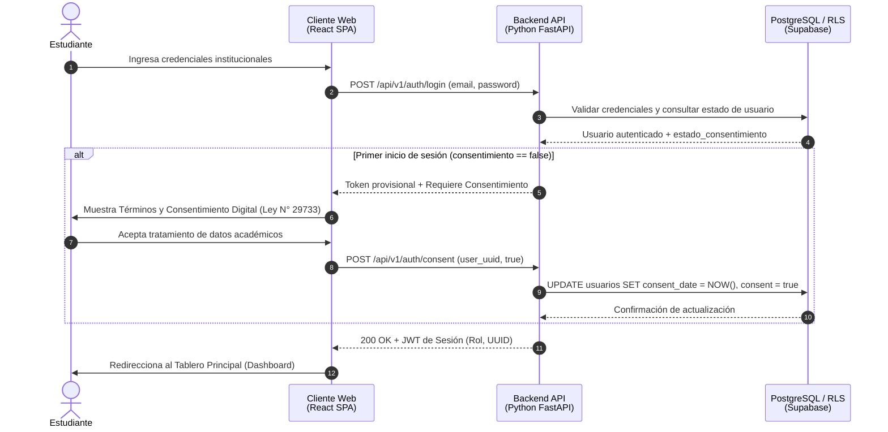
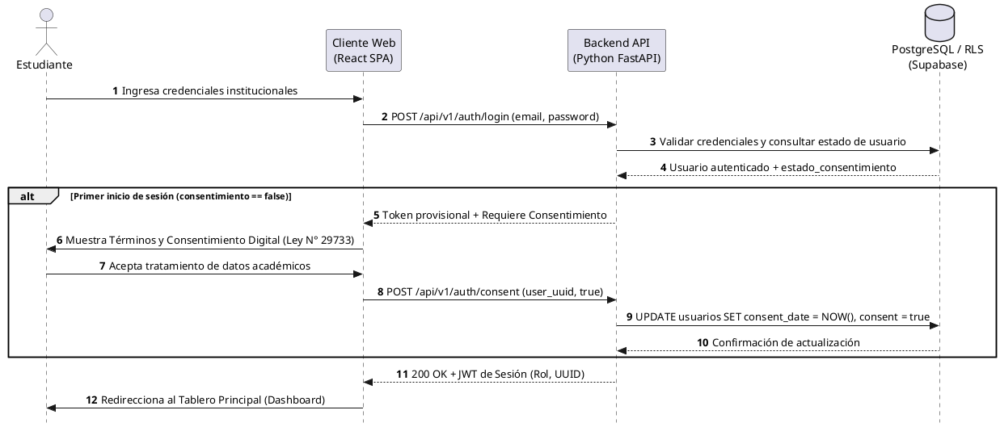
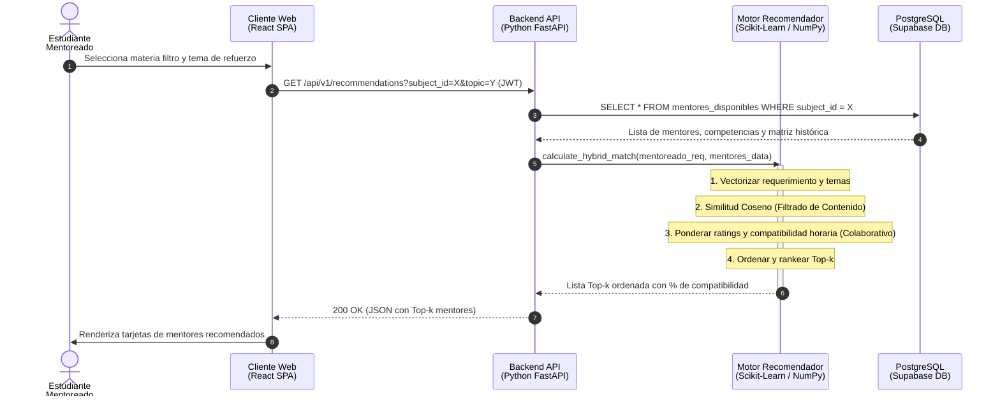
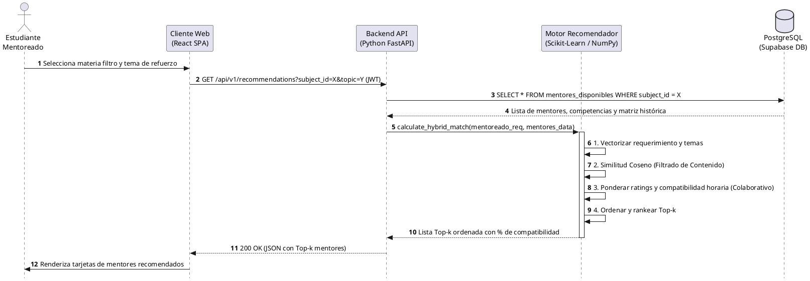
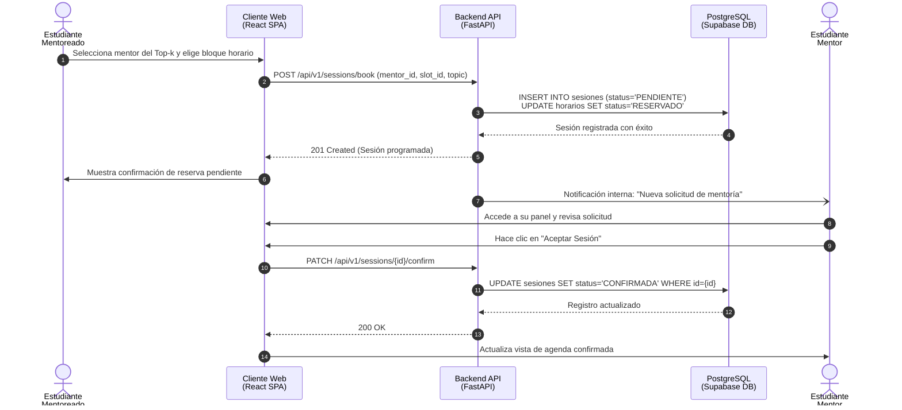
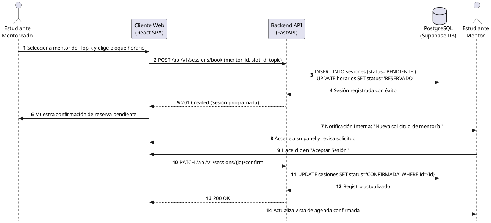
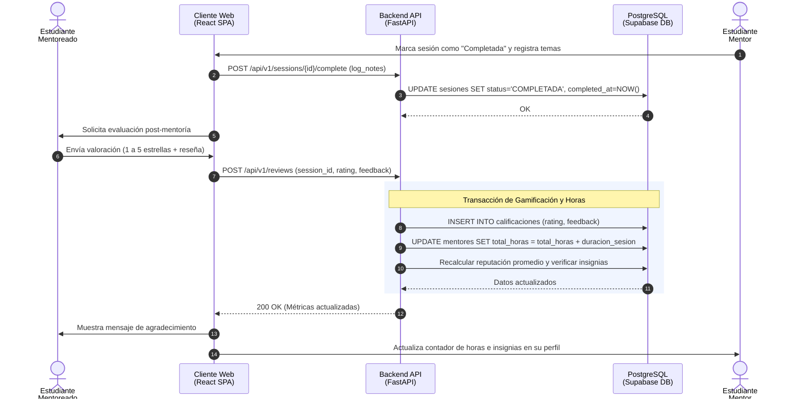
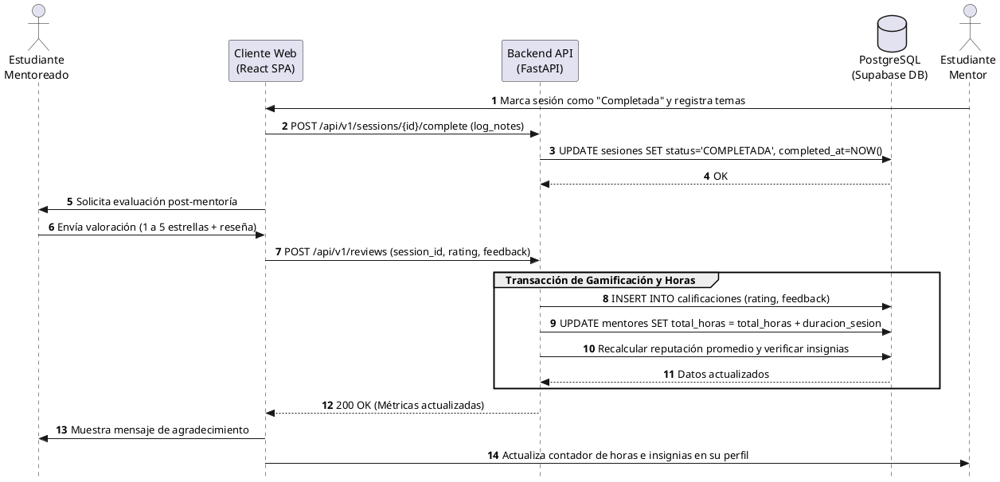

# Diagramas de Secuencia del Sistema Web P2P

**Proyecto:** Sistema Web P2P con algoritmo de recomendación para la personalización de mentorías académicas en la EPIS-UPT  
**Curso:** Construcción de Software I  
**Institución:** Universidad Privada de Tacna – Facultad de Ingeniería – Escuela Profesional de Ingeniería de Sistemas  
**Lugar y Fecha:** Tacna – Perú, 2026  

---

## Control de Versiones

| Versión | Hecha por | Revisada por | Aprobada por | Fecha | Descripción del Cambio |
| :---: | :--- | :--- | :--- | :---: | :--- |
| **1.0** | RAM / JCM | RAM | RVA | 05/09/2026 | Estructuración y formateo en Markdown de los diagramas de secuencia (PlantUML y Mermaid). |

---

## Tabla de Contenidos

1. [Introducción y Matriz de Trazabilidad](#1-introducción-y-matriz-de-trazabilidad)
2. [Flujo 1: Autenticación y Consentimiento Informado (Ley N° 29733)](#2-flujo-1-autenticación-y-consentimiento-informado-ley-n-29733)
3. [Flujo 2: Consulta y Generación del Emparejamiento Híbrido](#3-flujo-2-consulta-y-generación-del-emparejamiento-híbrido)
4. [Flujo 3: Agendamiento y Confirmación de Sesión P2P](#4-flujo-3-agendamiento-y-confirmación-de-sesión-p2p)
5. [Flujo 4: Cierre de Sesión, Evaluación y Gamificación](#5-flujo-4-cierre-de-sesión-evaluación-y-gamificación)

---

## 1. Introducción y Matriz de Trazabilidad

El presente documento modela la dinámica temporal y el intercambio de mensajes entre los distintos componentes del sistema para los casos de uso más críticos: la interfaz de usuario (*React SPA*), el servidor de aplicaciones (*Python FastAPI*), el motor de recomendación híbrido (*Scikit-Learn / NumPy*) y la capa de persistencia (*PostgreSQL / Supabase con RLS*).

### Matriz de Mapeo con Requerimientos Funcionales

| N° | Diagrama de Secuencia | Requerimientos Asociados | Actores / Componentes Principales |
| :---: | :--- | :--- | :--- |
| **1** | Autenticación y Consentimiento Informado | **RF01**, **RF02** | Estudiante, React SPA, FastAPI, Supabase DB |
| **2** | Consulta y Generación del Emparejamiento Híbrido | **RF04**, **RF05**, **RF06**, **RF07** | Estudiante Mentoreado, React SPA, FastAPI, Motor Recomendador, Supabase DB |
| **3** | Agendamiento y Confirmación de Sesión P2P | **RF08**, **RF09** | Estudiante Mentoreado, Estudiante Mentor, React SPA, FastAPI, Supabase DB |
| **4** | Cierre de Sesión, Evaluación y Gamificación | **RF10**, **RF11**, **RF12**, **RF13** | Estudiante Mentor, Estudiante Mentoreado, React SPA, FastAPI, Supabase DB |

---

## 2. Flujo 1: Autenticación y Consentimiento Informado (Ley N° 29733)

### Descripción del Flujo
Modela el acceso seguro y la validación legal obligatoria previa al consumo del sistema. En cumplimiento con la **Ley N° 29733** (Ley de Protección de Datos Personales del Perú), todo usuario en su primer inicio de sesión debe autorizar de forma expresa e informada el tratamiento de sus datos académicos y de rendimiento antes de poder acceder al panel general.

### Diagrama Visual (Mermaid)

### Código Fuente (PlantUML)

---

## 3. Flujo 2: Consulta y Generación del Emparejamiento Híbrido

### Descripción del Flujo
Muestra la interacción entre la interfaz de usuario, la API y el motor de recomendación híbrido para generar el ranking *Top-k* de mentores sugeridos. El motor ejecuta en memoria el cálculo matricial combinando **filtrado basado en contenido** (similitud coseno entre descriptores temáticos) y **filtrado colaborativo** (ponderación histórica de calificaciones y coincidencia de horarios).

### Diagrama Visual (Mermaid)

### Código Fuente (PlantUML)

---

## 4. Flujo 3: Agendamiento y Confirmación de Sesión P2P

### Descripción del Flujo
Describe la reserva directa de franjas horarias y la sincronización asíncrona entre pares estudiantiles. Una vez que el mentoreado elige un bloque disponible, el estado de la sesión se fija como `PENDIENTE` y el horario pasa a `RESERVADO` para evitar colisiones. El mentor es notificado internamente para confirmar o rechazar la sesión.

### Diagrama Visual (Mermaid)

### Código Fuente (PlantUML)

---

## 5. Flujo 4: Cierre de Sesión, Evaluación y Gamificación

### Descripción del Flujo
Modela el ciclo de retroalimentación post-mentoría: registro formal de temas impartidos, valoración numérica (1 a 5 estrellas) con reseña por parte del mentoreado, y ejecución de la transacción de gamificación (acumulación de horas de servicio universitario y actualización de reputación e insignias del mentor).

### Diagrama Visual (Mermaid)

### Código Fuente (PlantUML)

