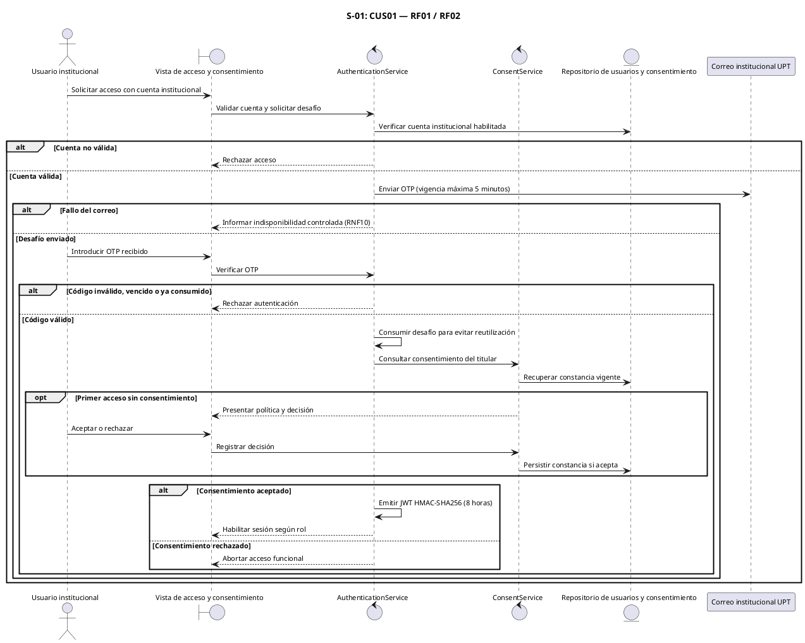
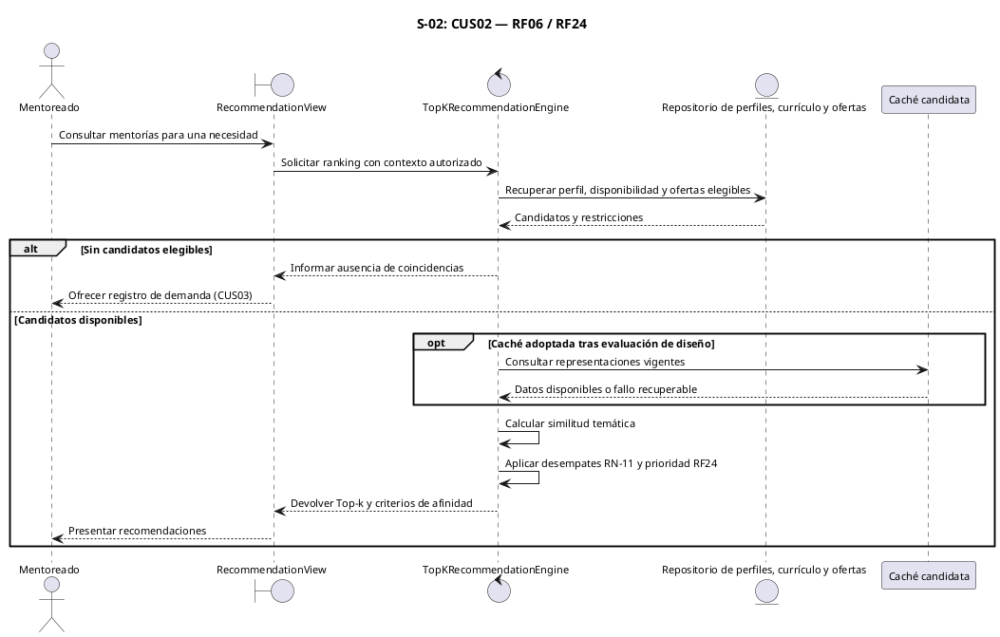
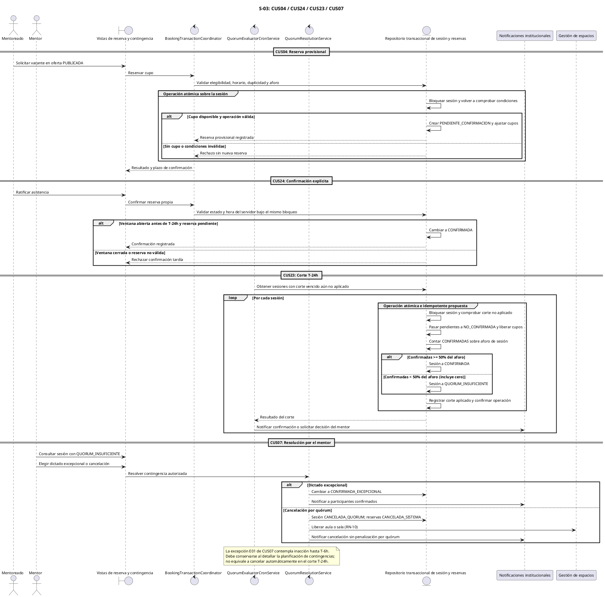
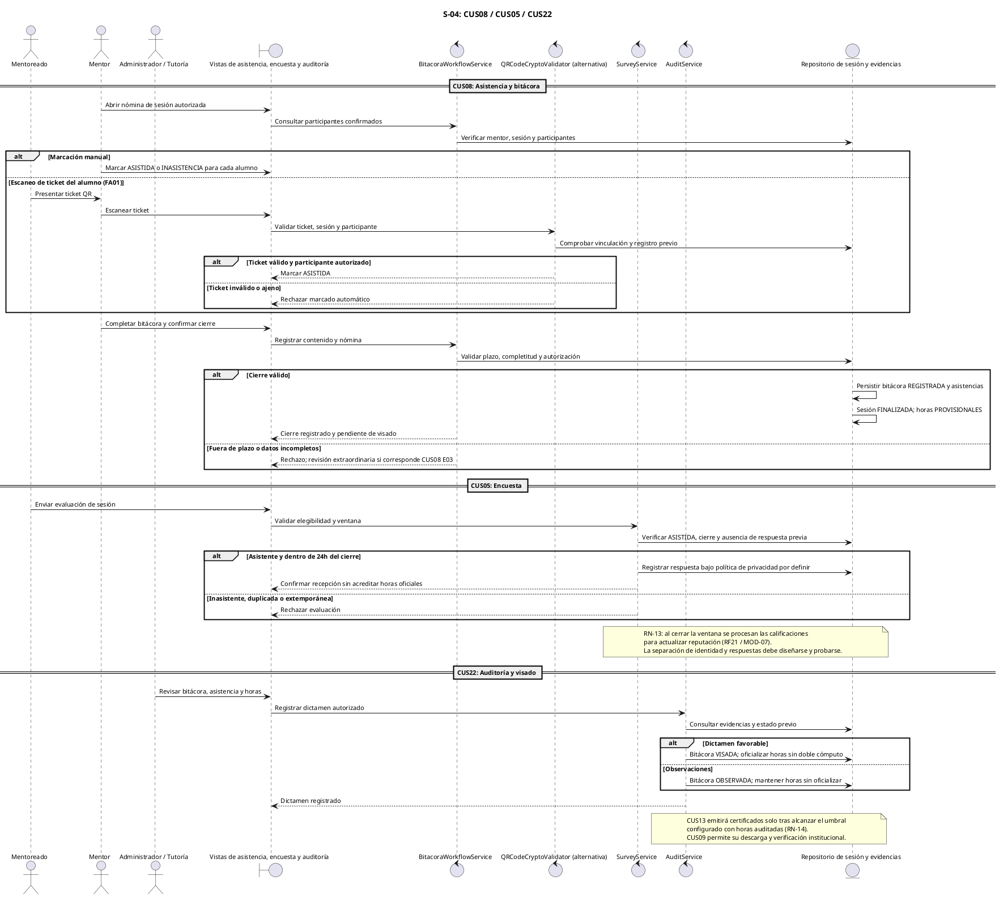

# Diagramas de Secuencia del SAD — Fase de Análisis

**Proyecto:** Sistema Web P2P de Mentorías Académicas — EPIS-UPT. 
**Fase:** Análisis — desarrollo del SAD. 
**Estado:** Modelos propuestos; pendientes de revisión e implementación. 
**Fuente canónica:** SRS FD03 v2.0, secciones 5.1–5.5 y narrativas 6.2.3.

## Control de Versiones

| Versión | Hecha por | Revisada por | Aprobada por | Fecha | Descripción del Cambio |
| :---: | :--- | :--- | :--- | :---: | :--- |
| **1.0** | RAM / JCM | RAM | RVA | 05/09/2026 | Estructuración inicial y formateo de secuencias preliminares. |
| **2.0** | RAM / JCM | Comité de Calidad EPIS | Dirección de Escuela | 28/09/2026 | Refactorización hacia el estándar SAD de Análisis conceptual (Modelo ECB). |
| **2.1** | RAM / JCM | Comité de Calidad EPIS | Dirección de Escuela | 28/09/2026 | **Incorporación explícita de componentes arquitectónicos del SAD:** Delimitación de subsistemas mediante bloques `box`, especificación de componentes de software (Frontend SPA, Backend Routers/Services, Persistencia Supabase, Caché Redis y Adaptadores Externos), formalización de títulos PlantUML y vinculación con la Vista de Componentes (Diagrama 9.1). |
| **2.2** | Asistencia de Codex a solicitud del equipo | Pendiente | Pendiente | 28/09/2026 | Alineación de CUS/RF/RNF al SRS; corrección de OTP, reserva provisional, quórum y horas sujetas a visado. |

El historial se conserva; esta revisión no supone aprobación institucional. Las secuencias expresan responsabilidades y mensajes conceptuales para el análisis, sin establecer endpoints ni tablas implementados.

## Contenido

1. [Marco y trazabilidad](#1-marco-y-trazabilidad)
2. [Acceso y consentimiento](#2-acceso-y-consentimiento-cus01)
3. [Recomendaciones](#3-recomendaciones-cus02)
4. [Reserva, confirmación y quórum](#4-reserva-confirmación-y-quórum-cus04-cus24-cus23-cus07)
5. [Asistencia, bitácora y visado](#5-asistencia-bitácora-encuesta-y-visado-cus08-cus05-cus22)
6. [Pendientes de diseño](#6-pendientes-de-diseño)

## 1. Marco y trazabilidad

Las fronteras recogen acciones de usuarios, los controles coordinan reglas de negocio y los repositorios representan acceso a entidades del dominio. Los servicios corresponden a las responsabilidades propuestas en las secciones 4, 6 y 9 del SAD. El parser se mantiene interno a MOD-04; el correo, Meet y Discord se tratan como integraciones externas.

La matriz permite localizar los requisitos y las restricciones que justifican cada secuencia. El QR forma parte del flujo alternativo de CUS08; CUS11 mantiene su significado de carga de horarios.

### Cuadro 1.1: Trazabilidad de secuencias al SRS

| Diagrama | CUS | RF | RN / RNF | Componentes propuestos |
| :--- | :--- | :--- | :--- | :--- |
| S-01 | CUS01 | RF01, RF02 | RN-01, RN-02; RNF01, RNF02, RNF10 | AuthenticationService, ConsentService, repositorio y correo institucional. |
| S-02 | CUS02; configuración previa CUS12 | RF06, RF24 | RN-11; RNF03, RNF09 | TopKRecommendationEngine, perfiles/ofertas y caché candidata. |
| S-03 | CUS04, CUS24, CUS23, CUS07 | RF12, RF13, RF15, RF16 | RN-05, RN-08, RN-09, RN-10; RNF07, RNF10 | BookingTransactionCoordinator, QuorumEvaluatorCronService, QuorumResolutionService y notificaciones. |
| S-04 | CUS08, CUS05, CUS22 | RF17, RF18, RF26 | RN-12, RN-13, RN-14; RNF02, RNF09 | BitacoraWorkflowService, QRCodeCryptoValidator, SurveyService y AuditService. |

Fuente: SRS FD03 v2.0 y matriz 4.3 del SAD.

Los cuatro flujos cubren escenarios seleccionados. El alcance completo de los 24 CUS se mantiene en el SRS y en el Cuadro 5.1 del SAD; estas secuencias no lo reducen ni sustituyen sus narrativas.

## 2. Acceso y consentimiento (CUS01)

El usuario solicita acceso institucional. La identidad debe validarse con un OTP enviado al correo UPT, cuya vigencia máxima es de cinco minutos. Una vez validado, se verifica el consentimiento; su rechazo impide habilitar funciones. El token de sesión definitivo respeta RNF01, con HMAC-SHA256 y expiración de ocho horas.

### Diagrama S-01: Acceso institucional y consentimiento

Fuente: Elaboración propia a partir de CUS01, RF01–RF02 y RNF01–RNF02.

El flujo incorpora explícitamente el OTP, evitando confundirlo con una contraseña o con TOTP de una aplicación autenticadora. Los permisos de acceso a persistencia y la revocación se precisarán en diseño; la abstracción de repositorio no demuestra por sí misma la aplicación de RLS.

## 3. Recomendaciones (CUS02)

El mentoreado consulta recomendaciones para una necesidad académica. El servicio analiza perfil, disponibilidad, competencias y ofertas elegibles. RN-11 establece similitud temática y desempates; RF24 incorpora la condición de prioridad institucional. La fórmula concreta debe conciliar ambos criterios sin fijar en este documento pesos nuevos.

### Diagrama S-02: Consulta de recomendaciones

Fuente: Elaboración propia a partir de CUS02, RF06, RF24 y RN-11.

RNF03 exige inferencia de hasta 500 ms bajo hasta 50 solicitudes por minuto. Es una meta futura por medir. La elección de caché, estrategia de cómputo y separación del servicio debe justificarse con datos representativos, manteniendo el contrato de RNF09.

## 4. Reserva, confirmación y quórum (CUS04, CUS24, CUS23, CUS07)

Reservar y confirmar son acciones distintas. La reserva bloquea provisionalmente una vacante y requiere ratificación antes de T−24 h. El corte revoca las pendientes y compara las confirmadas con el 50% del aforo. La decisión de continuar o cancelar ante quórum insuficiente pertenece al mentor.

### Diagrama S-03: Reserva provisional, ratificación y resolución de quórum

Fuente: Elaboración propia a partir de RF12–RF16, CUS04/CUS24/CUS23/CUS07 y RN-05/RN-08/RN-09/RN-10.

El modelo elimina la confirmación automática al reservar, la lista de espera no incluida en la línea base y el umbral fijo de dos alumnos. El aforo proviene de RN-05: hasta 10 en presencial y 20 en virtual; el quórum se calcula con RN-09. Los espacios se asignan al publicar mediante CUS06, no se aprovisionan por primera vez al corte. El mecanismo de bloqueo, recuperación y entrega de notificaciones queda pendiente de diseño y pruebas según RNF07 y RNF10.

## 5. Asistencia, bitácora, encuesta y visado (CUS08, CUS05, CUS22)

El mentor registra asistencia efectiva y cierra la bitácora dentro del plazo de la narrativa CUS08. El QR es un flujo alternativo: el mentoreado presenta su ticket y el mentor lo escanea. El cierre genera horas provisionales, habilita encuestas solo a asistentes y remite evidencias a auditoría. Responder una encuesta no acredita horas oficiales.

### Diagrama S-04: Registro pedagógico y validación institucional

Fuente: Elaboración propia a partir de RF17, RF18, RF26 y narrativas CUS08, CUS05 y CUS22.

La política de tokens QR no hereda una duración de RNF04, que regula la carga de interfaz. Su vigencia y prevención de reutilización requieren diseño. El vínculo de encuesta con reserva permite reidentificación en el modelo preliminar; la protección de RNF02 debe resolverse antes de afirmar anonimato. La certificación queda subordinada al visado y al umbral de RN-14.

## 6. Pendientes de diseño

Estas secuencias sirven para revisar reglas, actores y estados durante el análisis del SAD. Queda por concretar contratos REST, permisos de persistencia, estrategia de concurrencia y reintentos, planificación del corte y de su recuperación, política de QR y separación de datos personales en encuestas. La implementación y las pruebas se programarán en sus fases correspondientes.
