# Especificación de Diagramas de Secuencia a Nivel de Componentes (SAD)

**Proyecto:** Sistema Web P2P con Algoritmo de Recomendación para la Personalización de Mentorías Académicas en la EPIS-UPT  
**Documento Metodológico:** Documento de Arquitectura de Software (SAD) — Vista Dinámica y de Componentes  
**Curso:** Construcción de Software I  
**Institución:** Universidad Privada de Tacna – Facultad de Ingeniería – Escuela Profesional de Ingeniería de Sistemas  
**Lugar y Fecha:** Tacna – Perú, 2026  

---

## Control de Versiones

| Versión | Hecha por | Revisada por | Aprobada por | Fecha | Descripción del Cambio |
| :---: | :--- | :--- | :--- | :---: | :--- |
| **1.0** | RAM / JCM | RAM | RVA | 05/09/2026 | Estructuración inicial y formateo de secuencias preliminares. |
| **2.0** | RAM / JCM | Comité de Calidad EPIS | Dirección de Escuela | 28/09/2026 | Refactorización hacia el estándar SAD de Análisis conceptual (Modelo ECB). |
| **2.1** | RAM / JCM | Comité de Calidad EPIS | Dirección de Escuela | 28/09/2026 | **Incorporación explícita de componentes arquitectónicos del SAD:** Delimitación de subsistemas mediante bloques `box`, especificación de componentes de software (Frontend SPA, Backend Routers/Services, Persistencia Supabase, Caché Redis y Adaptadores Externos), formalización de títulos PlantUML y vinculación con la Vista de Componentes (Diagrama 9.1). |

---

## Tabla de Contenidos

1. [Marco Arquitectónico y Matriz de Componentes del SAD](#1-marco-arquitectónico-y-matriz-de-componentes-del-sad)
2. [Flujo 1: Autenticación Segura y Consentimiento Informado Digital (Ley N° 29733)](#2-flujo-1-autenticación-segura-y-consentimiento-informado-digital-ley-n-29733)
3. [Flujo 2: Búsqueda Temática y Emparejamiento Híbrido Top-k de Mentores (CUS06)](#3-flujo-2-búsqueda-temática-y-emparejamiento-híbrido-top-k-de-mentores-cus06)
4. [Flujo 3: Agendamiento, Aseguramiento de Cupo y Gobernanza de Quórum en T-24h (CUS07 / CUS08 / CUS23)](#4-flujo-3-agendamiento-aseguramiento-de-cupo-y-gobernanza-de-quórum-en-t-24h-cus07--cus08--cus23)
5. [Flujo 4: Certificación de Asistencia por QR Dinámico, Bitácora y Acreditación de Horas (CUS11 / CUS13 / CUS14)](#5-flujo-4-certificación-de-asistencia-por-qr-dinámico-bitácora-y-acreditación-de-horas-cus11--cus13--cus14)
6. [Conclusiones y Coherencia con la Vista de Componentes](#6-conclusiones-y-coherencia-con-la-vista-de-componentes)

---

## 1. Marco Arquitectónico y Matriz de Componentes del SAD

En este nivel del **Documento de Arquitectura de Software (SAD)**, los diagramas de secuencia articulan el comportamiento dinámico del sistema a través de los **componentes de software formales** establecidos en la **Vista de Implementación (Diagrama 9.1)** y la **Vista de Contenedores C4 (Diagrama 8.1)**. 

Cada interacción temporal no se concibe como una simple llamada abstracta entre objetos aislados, sino como un **intercambio estructurado de mensajes a través de las fronteras de los subsistemas y componentes arquitectónicos**:

1. **Componente de Presentación Web (Frontend SPA):** Ejecutado en el cliente web del navegador (`React 18`, `TypeScript`, `Tailwind CSS`), aloja las vistas modulares (`AuthViewComponent`, `RecommendationComponent`, `BookingScheduleComponent`, `AttendanceQRComponent`) y el orquestador de peticiones `ApiClient` con interceptor de tokens JWT.
2. **Componente de Enrutamiento y Seguridad (API Gateway / Routers / Middleware):** Aloja los enrutadores de la API (`AuthRouter`, `RecSysRouter`, `BookingRouter`, `AttendanceRouter`) custodiados por el `SecurityMiddleware`, que valida la integridad de los tokens Bearer y extrae el contexto del usuario autenticado.
3. **Componente de Servicios de Dominio (Domain Services / Controllers):** Núcleo lógico del backend (`FastAPI`, `Python 3.11`) que encapsula las reglas de negocio institucional (`AuthenticationService`, `TopKRecommendationEngine`, `BookingTransactionCoordinator`, `QuorumEvaluatorCronService`, `QRCodeCryptoValidator`, `BitacoraWorkflowService`).
4. **Componente de Caché en Memoria (Redis Cloud Cache):** Almacén de ultra-alta velocidad que gestiona vectores de embeddings curriculares precalculados y tokens efímeros criptográficos rotativos con tiempo de vida estricto ($TTL = 60\text{ s}$).
5. **Componente de Persistencia Relacional (PostgreSQL / Supabase con RLS):** Capa de almacenamiento transaccional ACID (`SQLAlchemyAsyncRepository`) que gobierna la integridad referencial y el aislamiento de datos a nivel de fila (*Row Level Security*).
6. **Componentes y Adaptadores de Integración Externa:** Servicios periféricos que interactúan mediante adaptadores especializados (`SmtpMailAdapter` hacia el Servidor SMTP UPT, `SpaceProvisioningAdapter` hacia Google Meet API y Parser de Aulas).

### Cuadro 1.1: Matriz de Trazabilidad entre Componentes del SAD y Flujos Dinámicos

| N° Flujo | Código Diagrama | Caso de Uso | Componentes Frontend Involucrados | Componentes Backend y Dominio Involucrados | Componentes de Datos e Infraestructura |
| :---: | :---: | :--- | :--- | :--- | :--- |
| **1** | **Diagrama S-01** | `CUS01`, `CUS02` | `AuthViewComponent`<br>`ConsentModalComponent`<br>`ApiClient` | `SecurityMiddleware`<br>`AuthRouter`<br>`AuthenticationService` | `SupabaseAsyncRepo`<br>`CuentaUsuarioInstitucional`<br>`RegistroConsentimientoLegal` |
| **2** | **Diagrama S-02** | `CUS06` | `RecommendationComponent`<br>`ApiClient` | `RecSysRouter`<br>`TopKRecommendationEngine` | `RedisCacheService` (Embeddings)<br>`SupabaseAsyncRepo`<br>`PerfilAcademicoEstudiante`<br>`OfertaMentoriaActiva` |
| **3** | **Diagrama S-03** | `CUS07`, `CUS08`, `CUS23` | `BookingScheduleComponent`<br>`ApiClient` | `BookingRouter`<br>`BookingTransactionCoordinator`<br>`QuorumEvaluatorCronService` | `SupabaseAsyncRepo`<br>`AgendaEstudiantil`<br>`SesionMentoria`<br>`ReservaCupo`<br>`SmtpMailAdapter`<br>`SpaceProvisioningAdapter` |
| **4** | **Diagrama S-04** | `CUS11`, `CUS13`, `CUS14` | `AttendanceQRComponent`<br>`MobileScanComponent`<br>`CSATFeedbackComponent` | `AttendanceRouter`<br>`QRCodeCryptoValidator`<br>`BitacoraWorkflowService` | `RedisCacheService` (Token QR 60s)<br>`SupabaseAsyncRepo`<br>`RegistroAsistencia`<br>`BitacoraDocente`<br>`BolsaHorasReconocidas` |

Fuente: Elaboración propia basada en la Vista de Componentes del SAD EPIS-UPT.

---

## 2. Flujo 1: Autenticación Segura y Consentimiento Informado Digital (Ley N° 29733)

### 2.1. Presentación Contextual del Flujo de Componentes
El presente flujo modela el ciclo de interacción que atraviesa los componentes de autenticación y seguridad de la plataforma. La interacción se inicia en el `AuthViewComponent` del frontend, que delega en el `ApiClient` el despacho de credenciales institucionales. El `SecurityMiddleware` intercepta la solicitud, derivándola al `AuthRouter` y al `AuthenticationService`. Este último interactúa con el componente de persistencia PostgreSQL mediante el repositorio asíncrono para verificar la identidad institucional y comprobar si el usuario ya ha otorgado el consentimiento legal exigido por la **Ley N° 29733**. En caso de ser el primer inicio de sesión, el sistema orquesta la apertura del `ConsentModalComponent`, suspendiendo el otorgamiento del token de sesión definitivo hasta la aceptación formal del tratamiento de datos personales.

### Diagrama S-01: Diagrama de Secuencia a Nivel de Componentes - Autenticación y Consentimiento Informado (Ley N° 29733)

```plantuml
@startuml
title <size:12><b>Diagrama S-01: Diagrama de Secuencia a Nivel de Componentes - Autenticación y Consentimiento Informado (Ley N° 29733)</b></size>\n<size:10><i>Vista Dinámica de Componentes SAD (Modelo ECB) — Sistema Web P2P EPIS-UPT</i></size>

autonumber
skinparam style strictuml
skinparam shadowing false
skinparam roundcorner 8
skinparam defaultFontName Arial
skinparam fontSize 10
skinparam sequenceMessageAlign center
skinparam responseMessageBelowArrow true

box "Componente de Presentación Web\n(React 18 SPA / TypeScript)" #F0F4F8
    actor "Estudiante Universitario\n(Pregrado EPIS)" as User
    boundary "AuthViewComponent\n(IU_AutenticacionAcceso)" as Comp_AuthView
    boundary "ConsentModalComponent\n(IU_ConsentimientoInformado)" as Comp_ConsentModal
    participant "ApiClient\n(Axios + Interceptores)" as Comp_ApiClient
end box

box "Componente Backend Core API\n(FastAPI / Uvicorn ASGI)" #EBF3FB
    control "SecurityMiddleware &\nAuthRouter" as Comp_AuthRouter
    control "AuthenticationService\n(Ctrl_GestionIdentidadAcceso)" as Comp_AuthSrv
end box

box "Componente de Persistencia\n(PostgreSQL / Supabase con RLS)" #FFF8E7
    control "SQLAlchemyAsyncRepository\n(Comp_Repo)" as Comp_DataRepo
    entity "CuentaUsuarioInstitucional\n(usuarios)" as Ent_User
    entity "RegistroConsentimientoLegal\n(consentimientos_datos)" as Ent_Consent
end box

User -> Comp_AuthView : ingresarCredencialesInstitucionales(correoUPT, contrasenia)
activate Comp_AuthView

Comp_AuthView -> Comp_ApiClient : login(correoUPT, contrasenia)
activate Comp_ApiClient

Comp_ApiClient -> Comp_AuthRouter : POST /api/v1/auth/login(correoUPT, contrasenia)
activate Comp_AuthRouter

Comp_AuthRouter -> Comp_AuthSrv : autenticarUsuario(correoUPT, contrasenia)
activate Comp_AuthSrv

Comp_AuthSrv -> Comp_DataRepo : buscarUsuarioPorCorreo(correoUPT)
activate Comp_DataRepo

Comp_DataRepo -> Ent_User : consultarPorCorreo(correoUPT)
activate Ent_User
Ent_User --> Comp_DataRepo : entidadUsuario, hashContrasenia, estadoCuenta
deactivate Ent_User
Comp_DataRepo --> Comp_AuthSrv : usuarioEncontrado
deactivate Comp_DataRepo

Comp_AuthSrv -> Comp_AuthSrv : validarHashContrasenia(contrasenia, hashContrasenia)

Comp_AuthSrv -> Comp_DataRepo : verificarConsentimientoVigente(usuarioId)
activate Comp_DataRepo
Comp_DataRepo -> Ent_Consent : consultarConsentimiento(usuarioId)
activate Ent_Consent
Ent_Consent --> Comp_DataRepo : consentimientoRegistrado (Verdadero / Falso)
deactivate Ent_Consent
Comp_DataRepo --> Comp_AuthSrv : estadoConsentimiento
deactivate Comp_DataRepo

alt [Primer Acceso: Consentimiento No Otorgado (Falso)]
    Comp_AuthSrv --> Comp_AuthRouter : emitirTokenProvisionalConsentimiento(usuarioId)
    Comp_AuthRouter --> Comp_ApiClient : 200 OK (TokenProvisional, RequiereConsentimiento: true)
    Comp_ApiClient --> Comp_AuthView : notificarRequiereConsentimiento(tokenProvisional)
    deactivate Comp_AuthView

    Comp_AuthView -> Comp_ConsentModal : abrirModalConsentimiento(terminosLey29733)
    activate Comp_ConsentModal
    Comp_ConsentModal --> User : mostrarTerminosLegalesYPoliticaPrivacidad()

    User -> Comp_ConsentModal : confirmarAceptacionExpresa(autorizacionDatosSensibles: true)
    Comp_ConsentModal -> Comp_ApiClient : registrarConsentimiento(usuarioId, tokenProvisional, true)
    Comp_ApiClient -> Comp_AuthRouter : POST /api/v1/auth/consent(usuarioId, true)

    Comp_AuthRouter -> Comp_AuthSrv : procesarConsentimientoInformado(usuarioId, true)
    Comp_AuthSrv -> Comp_DataRepo : guardarAsientoConsentimiento(usuarioId, versionTerminos, timestamp)
    activate Comp_DataRepo
    Comp_DataRepo -> Ent_Consent : insertarRegistroConsentimiento(usuarioId, versionTerminos, timestamp)
    activate Ent_Consent
    Ent_Consent --> Comp_DataRepo : registroConfirmadoId
    deactivate Ent_Consent
    Comp_DataRepo --> Comp_AuthSrv : consentimientoAsentadoConforme
    deactivate Comp_DataRepo

    Comp_AuthSrv --> Comp_AuthRouter : consentimientoValidado()
    Comp_AuthRouter --> Comp_ApiClient : 200 OK (ConsentimientoRegistrado)
    Comp_ApiClient --> Comp_ConsentModal : notificarAceptacionExitosa()
    deactivate Comp_ConsentModal
end

Comp_AuthSrv -> Comp_AuthSrv : emitirJWTDefinitivo(usuarioId, rolAcademico, permisos)
Comp_AuthSrv --> Comp_AuthRouter : credencialAccesoGenerada(jwtToken)
Comp_AuthRouter --> Comp_ApiClient : 200 OK (jwtToken, perfilUsuario)
deactivate Comp_AuthRouter
deactivate Comp_AuthSrv

Comp_ApiClient -> Comp_ApiClient : almacenarTokenEnMemoriaSegura(jwtToken)
Comp_ApiClient --> Comp_AuthView : autenticacionExitosa(perfilUsuario)
activate Comp_AuthView
Comp_AuthView --> User : redireccionarAlDashboardPrincipal()
deactivate Comp_AuthView
deactivate Comp_ApiClient

@enduml
```



Fuente: Elaboración propia basada en la arquitectura del Sistema Web P2P EPIS-UPT.

### 2.2. Análisis del Flujo Dinámico y Fronteras de Componentes
El diagrama S-01 ilustra con nitidez la separación de responsabilidades entre subsistemas:
1. **Frontera Cliente/Servidor:** El componente `ApiClient` centraliza la gestión del protocolo de transporte, abstrayendo a las vistas (`AuthViewComponent`, `ConsentModalComponent`) del manejo directo de cabeceras HTTP o serialización JSON.
2. **Aislamiento de Lógica de Negocio:** El enrutador `AuthRouter` actúa como controlador de entrada y delega completamente la verificación criptográfica y la política legal al `AuthenticationService`.
3. **Persistencia Custodiada:** El `AuthenticationService` jamás emite consultas SQL directas; toda interacción transaccional pasa a través de la abstracción `SQLAlchemyAsyncRepository`, que garantiza la correcta aplicación de las políticas RLS (*Row Level Security*) sobre las tablas `usuarios` y `consentimientos_datos`.

---

## 3. Flujo 2: Búsqueda Temática y Emparejamiento Híbrido Top-k de Mentores (CUS06)

### 3.1. Presentación Contextual del Flujo de Recomendación
El caso de uso `CUS06` describe el procesamiento coordinado entre el frontend interactivo, el enrutador de recomendaciones, el motor algorítmico `TopKRecommendationEngine`, la memoria de alta velocidad `RedisCacheService` y la base de datos relacional. El propósito es generar un listado ordenado de los mejores $k$ mentores para un estudiante mentoreado. El flujo maximiza el rendimiento arquitectónico consultando primero los vectores de embeddings precalculados en Redis, recurriendo a PostgreSQL únicamente para validar prerrequisitos curriculares y recuperar la disponibilidad de horarios de los mentores precalificados.

### Diagrama S-02: Diagrama de Secuencia a Nivel de Componentes - Emparejamiento Híbrido Top-k (CUS06)

```plantuml
@startuml
title <size:12><b>Diagrama S-02: Diagrama de Secuencia a Nivel de Componentes - Emparejamiento Híbrido Top-k (CUS06)</b></size>\n<size:10><i>Vista Dinámica de Componentes SAD (Modelo ECB) — Sistema Web P2P EPIS-UPT</i></size>

autonumber
skinparam style strictuml
skinparam shadowing false
skinparam roundcorner 8
skinparam defaultFontName Arial
skinparam fontSize 10
skinparam sequenceMessageAlign center
skinparam responseMessageBelowArrow true

box "Componente de Presentación Web\n(React 18 SPA / TypeScript)" #F0F4F8
    actor "Estudiante Mentoreado\n(I - IV Ciclo)" as Alumno
    boundary "RecommendationComponent\n(IU_BusquedaRecomendacion)" as Comp_RecView
    participant "ApiClient\n(Axios + Interceptores)" as Comp_ApiClient
end box

box "Componente Backend Core API\n(FastAPI / Uvicorn ASGI)" #EBF3FB
    control "SecurityMiddleware &\nRecSysRouter" as Comp_RecRouter
    control "TopKRecommendationEngine\n(Ctrl_RecomendacionAfinidad)" as Comp_RecEngine
end box

box "Componente Caché en Memoria\n(Redis Cloud Cache)" #FDEDEC
    control "RedisCacheService\n(Comp_RedisAdapter)" as Comp_Redis
end box

box "Componente de Persistencia\n(PostgreSQL / Supabase con RLS)" #FFF8E7
    control "SQLAlchemyAsyncRepository\n(Comp_Repo)" as Comp_DataRepo
    entity "PerfilAcademicoEstudiante\n(Ent_Perfil)" as Ent_Perfil
    entity "MallaCurricularEPIS\n(Ent_Malla)" as Ent_Malla
    entity "OfertaMentoriaActiva\n(Ent_Oferta)" as Ent_Oferta
end box

Alumno -> Comp_RecView : ingresarCriteriosBusqueda(asignaturaId, temaDificultad, horarioPreferencia)
activate Comp_RecView

Comp_RecView -> Comp_ApiClient : getRecommendations(asignaturaId, temaDificultad, horarioPreferencia)
activate Comp_ApiClient

Comp_ApiClient -> Comp_RecRouter : GET /api/v1/recommendations?asignaturaId=X&tema=Y (Bearer JWT)
activate Comp_RecRouter

Comp_RecRouter -> Comp_RecRouter : validarTokenYExtraerContexto(estudianteId, rol: MENTOREADO)

Comp_RecRouter -> Comp_RecEngine : obtenerMejoresMentores(estudianteId, asignaturaId, temaDificultad, horarioPreferencia)
activate Comp_RecEngine

Comp_RecEngine -> Comp_DataRepo : verificarElegibilidadCurricular(estudianteId, asignaturaId)
activate Comp_DataRepo

Comp_DataRepo -> Ent_Malla : consultarPrerrequisitos(asignaturaId)
activate Ent_Malla
Ent_Malla --> Comp_DataRepo : listaPrerrequisitos
deactivate Ent_Malla

Comp_DataRepo -> Ent_Perfil : validarCursosAprobados(estudianteId, listaPrerrequisitos)
activate Ent_Perfil
Ent_Perfil --> Comp_DataRepo : condicionHabilitada (Apto: true / false)
deactivate Ent_Perfil
Comp_DataRepo --> Comp_RecEngine : habilitacionAcademicaConforme
deactivate Comp_DataRepo

alt [Estudiante Curricularmente Habilitado]
    Comp_RecEngine -> Comp_Redis : recuperarEmbeddingsMentores(asignaturaId)
    activate Comp_Redis
    Comp_Redis --> Comp_RecEngine : matrizVectoresTematicosCached
    deactivate Comp_Redis

    Comp_RecEngine -> Comp_DataRepo : consultarOfertasActivasYDisponibilidad(asignaturaId, horarioPreferencia)
    activate Comp_DataRepo
    Comp_DataRepo -> Ent_Oferta : filtrarOfertasVigentes(asignaturaId, horarioPreferencia)
    activate Ent_Oferta
    Ent_Oferta --> Comp_DataRepo : listaOfertasConAforoLibre
    deactivate Ent_Oferta
    Comp_DataRepo --> Comp_RecEngine : catalogoOfertasHabilitadas
    deactivate Comp_DataRepo

    Comp_RecEngine -> Comp_RecEngine : computarSimilitudCoseno(temaDificultad, matrizVectoresTematicosCached)
    Comp_RecEngine -> Comp_RecEngine : aplicarPonderacionHibrida(similitudContenido, ratingCSATHistorico, compatibilidadHoraria)
    Comp_RecEngine -> Comp_RecEngine : ordenarYSeleccionarTopK(k=5)

    Comp_RecEngine --> Comp_RecRouter : rankingMentoresTopK
    Comp_RecRouter --> Comp_ApiClient : 200 OK (JSON con Top-k mentores y afinidad)
    Comp_ApiClient --> Comp_RecView : renderizarMentores(rankingMentoresTopK)
    Comp_RecView --> Alumno : desplegarTarjetasMentoresSugeridos()

else [Estudiante Inhabilitado por Prerrequisitos]
    Comp_RecEngine --> Comp_RecRouter : rechazarPorIncumplimientoCurricular(motivo)
    Comp_RecRouter --> Comp_ApiClient : 403 Forbidden (Incompatibilidad curricular)
    Comp_ApiClient --> Comp_RecView : mostrarErrorRestriccion(motivo)
    Comp_RecView --> Alumno : desplegarAvisoInhabilitacionNormativa()
end

deactivate Comp_RecEngine
deactivate Comp_RecRouter
deactivate Comp_ApiClient
deactivate Comp_RecView

@enduml
```



Fuente: Elaboración propia basada en la arquitectura del Sistema Web P2P EPIS-UPT.

### 3.2. Análisis del Flujo Dinámico y Eficiencia de Componentes
1. **Aceleración por Memoria Caché:** La inclusión explícita del componente `RedisCacheService` permite al `TopKRecommendationEngine` acceder a la representación vectorial semántica de los mentores en menos de 5 ms, evitando cálculos repetitivos de vectorización de texto en la base de datos relacional.
2. **Validación Preventiva en Persistencia:** El componente `SQLAlchemyAsyncRepository` actúa como salvaguarda curricular interactuando con `MallaCurricularEPIS` y `PerfilAcademicoEstudiante` antes de solicitar el catálogo de ofertas, previniendo que estudiantes adelanten asignaturas sin la autorización reglamentaria de la Escuela.

---

## 4. Flujo 3: Agendamiento, Aseguramiento de Cupo y Gobernanza de Quórum en T-24h (CUS07 / CUS08 / CUS23)

### 4.1. Presentación Contextual de la Reserva y Corte Desatendido
El presente flujo modela dos fases arquitectónicas complementarias:
1. **Fase A (Reserva Transaccional Concurrente):** El estudiante mentoreado interactúa con el `BookingScheduleComponent`, invocando al `BookingTransactionCoordinator` a través del `BookingRouter`. El coordinador asegura la vacante mediante un bloqueo transaccional a nivel de fila (*Row-Level Lock*) en PostgreSQL (`SELECT ... FOR UPDATE`), impidiendo que dos estudiantes reserven simultáneamente el último cupo de una sesión con límite de aforo (máximo 5 alumnos).
2. **Fase B (Auditoría Desatendida de Quórum en T-24h):** Un temporizador de sistema programado (*Daemon Cron*) gatilla el componente `QuorumEvaluatorCronService` exactamente 24 horas antes del inicio de la sesión. Si el aforo ratificado es $\ge 2$ estudiantes, invoca al adaptador `SpaceProvisioningAdapter` para crear la sala virtual en Google Meet o confirmar el aula física en el campus, notificando a las partes a través del `SmtpMailAdapter`. Si no alcanza el quórum, cancela la sesión liberando los recursos.

### Diagrama S-03: Diagrama de Secuencia a Nivel de Componentes - Reserva y Quórum T-24h (CUS07/CUS08/CUS23)

```plantuml
@startuml
title <size:12><b>Diagrama S-03: Diagrama de Secuencia a Nivel de Componentes - Reserva y Quórum T-24h (CUS07/CUS08/CUS23)</b></size>\n<size:10><i>Vista Dinámica de Componentes SAD (Modelo ECB) — Sistema Web P2P EPIS-UPT</i></size>

autonumber
skinparam style strictuml
skinparam shadowing false
skinparam roundcorner 8
skinparam defaultFontName Arial
skinparam fontSize 10
skinparam sequenceMessageAlign center
skinparam responseMessageBelowArrow true

box "Componente de Presentación Web\n(React 18 SPA / TypeScript)" #F0F4F8
    actor "Estudiante Mentoreado" as Alumno
    boundary "BookingScheduleComponent\n(IU_ReservaSesion)" as Comp_BookView
    participant "ApiClient\n(Axios + Interceptores)" as Comp_ApiClient
end box

box "Componente Backend Core API\n(FastAPI / Uvicorn ASGI)" #EBF3FB
    control "SecurityMiddleware &\nBookingRouter" as Comp_BookRouter
    control "BookingTransactionCoordinator\n(Ctrl_GestionReservas)" as Comp_BookCoord
    control "QuorumEvaluatorCronService\n(Daemon Quórum T-24h)" as Comp_CronSrv
end box

box "Componente de Persistencia\n(PostgreSQL / Supabase con RLS)" #FFF8E7
    control "SQLAlchemyAsyncRepository\n(Comp_Repo)" as Comp_DataRepo
    entity "AgendaEstudiantil\n(Ent_Agenda)" as Ent_Agenda
    entity "SesionMentoria\n(Ent_Sesion)" as Ent_Sesion
    entity "ReservaCupo\n(Ent_Reserva)" as Ent_Reserva
end box

box "Componentes de Integración Externa\n(Servicios Periféricos UPT)" #E8F8F5
    boundary "SmtpMailAdapter\n(ISmtpNotifier)" as Comp_Smtp
    boundary "SpaceProvisioningAdapter\n(Meet / Parser Aulas)" as Comp_Space
    actor "Estudiante Mentor" as Mentor
end box

== Fase A: Solicitud y Bloqueo Transaccional de Cupo ==
Alumno -> Comp_BookView : seleccionarSesionYConfirmarReserva(sesionId)
activate Comp_BookView

Comp_BookView -> Comp_ApiClient : bookSession(sesionId)
activate Comp_ApiClient

Comp_ApiClient -> Comp_BookRouter : POST /api/v1/sessions/book(sesionId) (Bearer JWT)
activate Comp_BookRouter

Comp_BookRouter -> Comp_BookCoord : procesarReservaConAforo(estudianteId, sesionId)
activate Comp_BookCoord

Comp_BookCoord -> Comp_DataRepo : verificarConflictoHorario(estudianteId, sesionId)
activate Comp_DataRepo
Comp_DataRepo -> Ent_Agenda : consultarCrucesHorarios(estudianteId, fechaHoraSesion)
activate Ent_Agenda
Ent_Agenda --> Comp_DataRepo : estadoConflicto (SinCruce / ConCruce)
deactivate Ent_Agenda
Comp_DataRepo --> Comp_BookCoord : resultadoVerificacionAgenda
deactivate Comp_DataRepo

alt [Sin Cruce de Horario]
    Comp_BookCoord -> Comp_DataRepo : ejecutarReservaAtomica(estudianteId, sesionId)
    activate Comp_DataRepo

    note over Comp_DataRepo, Ent_Sesion
      Inicia Transacción ACID con Aislamiento Serializable:
      SELECT cupos_disponibles FROM sesiones FOR UPDATE
    end note

    Comp_DataRepo -> Ent_Sesion : bloquearFilaYConsultarAforo(sesionId)
    activate Ent_Sesion
    Ent_Sesion --> Comp_DataRepo : cuposDisponibles
    deactivate Ent_Sesion

    alt [Cupos Disponibles > 0 (Aforo Disponible)]
        Comp_DataRepo -> Ent_Sesion : decrementarAforo(sesionId)
        activate Ent_Sesion
        Ent_Sesion --> Comp_DataRepo : aforoActualizado
        deactivate Ent_Sesion

        Comp_DataRepo -> Ent_Reserva : insertarReserva(estudianteId, sesionId, Estado: CONFIRMADA)
        activate Ent_Reserva
        Ent_Reserva --> Comp_DataRepo : reservaIdGenerado
        deactivate Ent_Reserva
        Comp_DataRepo --> Comp_BookCoord : transaccionCompletadaExitosa(reservaIdGenerado)

        Comp_BookCoord -> Comp_Smtp : enviarConfirmacionReserva(estudianteId, reservaIdGenerado)
        activate Comp_Smtp
        Comp_Smtp --> Comp_BookCoord : despachoNotificacionConforme
        deactivate Comp_Smtp

        Comp_BookCoord --> Comp_BookRouter : reservaExitosa(reservaIdGenerado)
        Comp_BookRouter --> Comp_ApiClient : 201 Created (Comprobante de reserva)
        Comp_ApiClient --> Comp_BookView : actualizarVistaReservaConfirmada()
        Comp_BookView --> Alumno : mostrarConstanciaReserva(detallesSesion)

    else [Cupos Disponibles == 0 (Aforo Agotado)]
        Comp_DataRepo -> Ent_Reserva : insertarEnListaEspera(estudianteId, sesionId, Estado: EN_ESPERA)
        activate Ent_Reserva
        Ent_Reserva --> Comp_DataRepo : turnoListaEspera
        deactivate Ent_Reserva
        Comp_DataRepo --> Comp_BookCoord : agregadoAListaEspera(turnoListaEspera)
        deactivate Comp_DataRepo

        Comp_BookCoord --> Comp_BookRouter : sesionLlenaEnListaEspera(turnoListaEspera)
        Comp_BookRouter --> Comp_ApiClient : 200 OK (Asignado a Lista de Espera)
        Comp_ApiClient --> Comp_BookView : notificarAforoCompleto(turnoListaEspera)
        Comp_BookView --> Alumno : desplegarMensajeListaEspera(turnoListaEspera)
    end

else [Con Conflicto de Horario]
    Comp_BookCoord --> Comp_BookRouter : rechazarPorConflictoHorario(detalleConflicto)
    Comp_BookRouter --> Comp_ApiClient : 409 Conflict (Cruce detectado)
    Comp_ApiClient --> Comp_BookView : mostrarAlertaCruce(detalleConflicto)
    Comp_BookView --> Alumno : desplegarAvisoIncompatibilidadHoraria()
end

deactivate Comp_BookCoord
deactivate Comp_BookRouter
deactivate Comp_ApiClient
deactivate Comp_BookView

== Fase B: Evaluación Desatendida de Quórum en T-24h ==
Comp_CronSrv -> Comp_CronSrv : dispararEventoCronPeriodico(tiempoActual)
activate Comp_CronSrv

Comp_CronSrv -> Comp_DataRepo : obtenerSesionesEnVentanaCorte(T_menos_24h)
activate Comp_DataRepo
Comp_DataRepo -> Ent_Sesion : consultarSesionesProgramadas(T_menos_24h)
activate Ent_Sesion
Ent_Sesion --> Comp_DataRepo : listaSesionesPendientes
deactivate Ent_Sesion
Comp_DataRepo --> Comp_CronSrv : sesionesParaAuditoriaQuorum
deactivate Comp_DataRepo

loop Por cada sesión pendiente en ventana T-24h
    Comp_CronSrv -> Comp_DataRepo : contabilizarReservasRatificadas(sesionId)
    activate Comp_DataRepo
    Comp_DataRepo -> Ent_Reserva : contarConfirmados(sesionId)
    activate Ent_Reserva
    Ent_Reserva --> Comp_DataRepo : totalConfirmados
    deactivate Ent_Reserva
    Comp_DataRepo --> Comp_CronSrv : cantidadConfirmados
    deactivate Comp_DataRepo

    alt [totalConfirmados >= QuorumMinimo (>= 2 estudiantes)]
        Comp_CronSrv -> Comp_DataRepo : actualizarEstadoSesion(sesionId, Estado: RATIFICADA)
        activate Comp_DataRepo
        Comp_DataRepo -> Ent_Sesion : fijarEstadoRatificada(sesionId)
        activate Ent_Sesion
        Ent_Sesion --> Comp_DataRepo : sesionRatificadaOK
        deactivate Ent_Sesion
        Comp_DataRepo --> Comp_CronSrv : estadoPersistidoConforme
        deactivate Comp_DataRepo

        Comp_CronSrv -> Comp_Space : solicitarAmbienteOSalaVirtual(modalidad, totalConfirmados)
        activate Comp_Space
        Comp_Space --> Comp_CronSrv : enlaceOAmbienteAsignado(coordenadasAcceso)
        deactivate Comp_Space

        Comp_CronSrv -> Comp_DataRepo : guardarCoordenadasAcceso(sesionId, coordenadasAcceso)
        activate Comp_DataRepo
        Comp_DataRepo -> Ent_Sesion : registrarCoordenadas(sesionId, coordenadasAcceso)
        activate Ent_Sesion
        Ent_Sesion --> Comp_DataRepo : coordenadasPersistidas
        deactivate Ent_Sesion
        Comp_DataRepo --> Comp_CronSrv : coordenadasGuardadas
        deactivate Comp_DataRepo

        Comp_CronSrv -> Comp_Smtp : despacharAvisosConfirmacion(mentorId, listaAlumnos, coordenadasAcceso)
        activate Comp_Smtp
        Comp_Smtp -> Mentor : enviarConfirmacionSesionConAcceso()
        Comp_Smtp -> Alumno : enviarRecordatorioYEnlaceAcceso()
        Comp_Smtp --> Comp_CronSrv : avisosDespachados
        deactivate Comp_Smtp

    else [totalConfirmados < QuorumMinimo (< 2 estudiantes)]
        Comp_CronSrv -> Comp_DataRepo : cancelarSesionPorFaltaQuorum(sesionId)
        activate Comp_DataRepo
        Comp_DataRepo -> Ent_Sesion : marcarCancelada(sesionId, Motivo: INSUFICIENCIA_QUORUM)
        activate Ent_Sesion
        Ent_Sesion --> Comp_DataRepo : sesionCanceladaPersistida
        deactivate Ent_Sesion

        Comp_DataRepo -> Ent_Reserva : liberarReservas(sesionId)
        activate Ent_Reserva
        Ent_Reserva --> Comp_DataRepo : reservasAnuladas
        deactivate Ent_Reserva
        Comp_DataRepo --> Comp_CronSrv : cancelacionCompletada
        deactivate Comp_DataRepo

        Comp_CronSrv -> Comp_Smtp : despacharAlertasCancelacionTemprana(mentorId, listaAlumnos)
        activate Comp_Smtp
        Comp_Smtp -> Mentor : alertarCancelacionPorQuorumInsuficiente()
        Comp_Smtp -> Alumno : alertarCancelacionSesionYLiberarAgenda()
        Comp_Smtp --> Comp_CronSrv : alertasCancelacionEnviadas
        deactivate Comp_Smtp
    end
end

deactivate Comp_CronSrv

@enduml
```



Fuente: Elaboración propia basada en la arquitectura del Sistema Web P2P EPIS-UPT.

### 4.2. Análisis del Flujo Dinámico y Transaccionalidad
1. **Garantía ACID ante Concurrencia Masiva:** En la Fase A, la interacción entre `BookingTransactionCoordinator` y `SQLAlchemyAsyncRepository` utiliza transacciones con bloqueo de fila (`SELECT ... FOR UPDATE`), garantizando que jamás se asigne un cupo por encima del aforo máximo reglamentario, incluso si decenas de estudiantes confirman simultáneamente al publicarse la oferta.
2. **Desacoplamiento del Proceso Batch:** En la Fase B, el componente `QuorumEvaluatorCronService` opera de forma desatendida mediante hilos en segundo plano, consumiendo adaptadores externos (`SpaceProvisioningAdapter`, `SmtpMailAdapter`) sin interferir con las operaciones transaccionales del servidor web principal.

---

## 5. Flujo 4: Certificación de Asistencia por QR Dinámico, Bitácora y Acreditación de Horas (CUS11 / CUS13 / CUS14)

### 5.1. Presentación Contextual de la Asistencia y Cierre Docente
El presente flujo modela la interacción entre los componentes de aula, el validador criptográfico de asistencia y el cierre administrativo docente:
1. **Marcación Criptográfica QR en Aula:** El mentor activa la sesión desde el `AttendanceQRComponent`. El `QRCodeCryptoValidator` genera un token efímero firmado que se persiste transitoriamente en `RedisCacheService` con caducidad estricta de 60 segundos. El estudiante escanea el código mediante el `MobileScanComponent`, validando la presencia física y asentando el registro en la base de datos PostgreSQL.
2. **Rendición de Bitácora Docente y Gamificación:** Finalizada la sesión, el mentor consigna los contenidos en el `BitacoraDocenteComponent`. El `BitacoraWorkflowService` asienta la bitácora requerida para el posterior visado del Comité de Tutoría (`CUS22`), habilita la encuesta anónima en el `CSATFeedbackComponent` e incrementa la bolsa de horas acreditables del mentor en la entidad `BolsaHorasReconocidas`.

### Diagrama S-04: Diagrama de Secuencia a Nivel de Componentes - Asistencia QR, Bitácora y Acreditación de Horas (CUS11/CUS13/CUS14)

```plantuml
@startuml
title <size:12><b>Diagrama S-04: Diagrama de Secuencia a Nivel de Componentes - Asistencia QR, Bitácora y Acreditación de Horas</b></size>\n<size:10><i>Vista Dinámica de Componentes SAD (Modelo ECB) — Sistema Web P2P EPIS-UPT</i></size>

autonumber
skinparam style strictuml
skinparam shadowing false
skinparam roundcorner 8
skinparam defaultFontName Arial
skinparam fontSize 10
skinparam sequenceMessageAlign center
skinparam responseMessageBelowArrow true

box "Componente de Presentación Web\n(React 18 SPA / TypeScript)" #F0F4F8
    actor "Estudiante Mentor\n(VII - X Ciclo)" as Mentor
    boundary "AttendanceQRComponent\n(IU_GestionEncuentro)" as Comp_MentorUI
    actor "Estudiante Mentoreado\n(I - IV Ciclo)" as Alumno
    boundary "MobileScanComponent\n(IU_MarcacionAsistencia)" as Comp_StudentUI
    boundary "CSATFeedbackComponent\n(IU_EncuestaCalidadCSAT)" as Comp_CSATUI
    participant "ApiClient\n(Axios + Interceptores)" as Comp_ApiClient
end box

box "Componente Backend Core API\n(FastAPI / Uvicorn ASGI)" #EBF3FB
    control "SecurityMiddleware &\nAttendanceRouter" as Comp_AttRouter
    control "QRCodeCryptoValidator\n(Ctrl_ValidacionQR)" as Comp_QRSrv
    control "BitacoraWorkflowService\n(Ctrl_GestionBitacora)" as Comp_LogSrv
end box

box "Componente Caché en Memoria\n(Redis Cloud Cache)" #FDEDEC
    control "RedisCacheService\n(Comp_RedisAdapter)" as Comp_Redis
    entity "TokenPresenciaQR\n(Redis TTL 60s)" as Cache_TokenQR
end box

box "Componente de Persistencia\n(PostgreSQL / Supabase con RLS)" #FFF8E7
    control "SQLAlchemyAsyncRepository\n(Comp_Repo)" as Comp_DataRepo
    entity "SesionMentoria\n(Ent_Sesion)" as Ent_Sesion
    entity "RegistroAsistencia\n(Ent_Asistencia)" as Ent_Asist
    entity "BitacoraDocente\n(Ent_Bitacora)" as Ent_Bitacora
    entity "BolsaHorasReconocidas\n(Ent_Horas)" as Ent_Horas
end box

== Segmento 1: Control de Presencia y Marcación QR Dinámico ==
Mentor -> Comp_MentorUI : solicitarEmisionQRPresencia(sesionId)
activate Comp_MentorUI

Comp_MentorUI -> Comp_ApiClient : generateQRAttendance(sesionId)
activate Comp_ApiClient

Comp_ApiClient -> Comp_AttRouter : POST /api/v1/attendance/qr/generate(sesionId) (Bearer JWT)
activate Comp_AttRouter

Comp_AttRouter -> Comp_QRSrv : emitirTokenQREfimero(sesionId, mentorId)
activate Comp_QRSrv

Comp_QRSrv -> Comp_DataRepo : verificarSesionEnCurso(sesionId, mentorId)
activate Comp_DataRepo
Comp_DataRepo -> Ent_Sesion : consultarEstadoSesion(sesionId)
activate Ent_Sesion
Ent_Sesion --> Comp_DataRepo : estadoSesion (EN_CURSO)
deactivate Ent_Sesion
Comp_DataRepo --> Comp_QRSrv : sesionActivaValida
deactivate Comp_DataRepo

Comp_QRSrv -> Comp_QRSrv : crearFirmaHMACSHA256(sesionId, timestamp, nonce)

Comp_QRSrv -> Comp_Redis : guardarTokenConTTL(tokenCifrado, sesionId, ttl=60s)
activate Comp_Redis
Comp_Redis -> Cache_TokenQR : SETEX tokenCifrado 60 sesionId
activate Cache_TokenQR
Cache_TokenQR --> Comp_Redis : OK
deactivate Cache_TokenQR
Comp_Redis --> Comp_QRSrv : tokenAlmacenadoConforme
deactivate Comp_Redis

Comp_QRSrv --> Comp_AttRouter : entregaDatosQR(tokenCifrado, imagenBase64, ttl=60s)
Comp_AttRouter --> Comp_ApiClient : 200 OK (imagenBase64, ttl=60s)
Comp_ApiClient --> Comp_MentorUI : proyectarCodigoQRDinamico(imagenBase64)
Comp_MentorUI --> Mentor : visualizaQREnPantallaOProyector()

Alumno -> Comp_StudentUI : escanearCodigoConCamara(imagenBase64)
activate Comp_StudentUI

Comp_StudentUI -> Comp_ApiClient : submitAttendance(tokenLeido)
Comp_ApiClient -> Comp_AttRouter : POST /api/v1/attendance/qr/scan(tokenLeido) (Bearer JWT)

Comp_AttRouter -> Comp_QRSrv : validarYRegistrarAsistencia(estudianteId, tokenLeido)

Comp_QRSrv -> Comp_Redis : verificarTokenVigente(tokenLeido)
activate Comp_Redis
Comp_Redis -> Cache_TokenQR : GET tokenLeido
activate Cache_TokenQR
Cache_TokenQR --> Comp_Redis : sesionIdAsociada (o null si expiró)
deactivate Cache_TokenQR
Comp_Redis --> Comp_QRSrv : resultadoCache (Encontrado / Expirado)
deactivate Comp_Redis

alt [Token Encontrado y Válido (<= 60s)]
    Comp_QRSrv -> Comp_DataRepo : registrarPresenciaEstudiante(sesionIdAsociada, estudianteId)
    activate Comp_DataRepo
    Comp_DataRepo -> Ent_Asist : verificarAsistenciaPrevia(sesionIdAsociada, estudianteId)
    activate Ent_Asist
    Ent_Asist --> Comp_DataRepo : yaRegistrado (false / true)
    deactivate Ent_Asist

    alt [No Registrado Previamente]
        Comp_DataRepo -> Ent_Asist : insertarAsistencia(sesionIdAsociada, estudianteId, Estado: PRESENTE)
        activate Ent_Asist
        Ent_Asist --> Comp_DataRepo : asistenciaRegistradaId
        deactivate Ent_Asist
        Comp_DataRepo --> Comp_QRSrv : asientoConformeId
        deactivate Comp_DataRepo

        Comp_QRSrv --> Comp_AttRouter : asistenciaExitosa(asistenciaRegistradaId)
        Comp_AttRouter --> Comp_ApiClient : 200 OK (Asistencia validada)
        Comp_ApiClient --> Comp_StudentUI : notificarConformidad()
        Comp_StudentUI --> Alumno : desplegarMensajeExitoAsistencia()

        Comp_AttRouter -) Comp_MentorUI : WebSocket / Polling: actualizarListaAsistentes(estudianteId)
        Comp_MentorUI --> Mentor : refrescarAsistentesEnVivo()

    else [Ya Registrado Previamente]
        Comp_QRSrv --> Comp_AttRouter : advertirRegistroDuplicado()
        Comp_AttRouter --> Comp_ApiClient : 200 OK (Previamente registrado)
        Comp_ApiClient --> Comp_StudentUI : notificarAsistenciaYaRegistrada()
        Comp_StudentUI --> Alumno : mostrarAvisoYaRegistrado()
    end

else [Token Expirado o Inválido (> 60s)]
    Comp_QRSrv --> Comp_AttRouter : errorTokenCaducado()
    Comp_AttRouter --> Comp_ApiClient : 400 Bad Request (Token expirado)
    Comp_ApiClient --> Comp_StudentUI : notificarTokenVencido()
    Comp_StudentUI --> Alumno : mostrarErrorTokenVencidoReintentar()
end

deactivate Comp_StudentUI
deactivate Comp_QRSrv

== Segmento 2: Rendición de Bitácora Docente y Cierre de Sesión ==
Mentor -> Comp_MentorUI : registrarBitacoraDocente(sesionId, temasTratados, observaciones)
Comp_MentorUI -> Comp_ApiClient : submitBitacora(sesionId, datosPedagogicos)
Comp_ApiClient -> Comp_AttRouter : POST /api/v1/sessions/bitacora(sesionId, datos)

Comp_AttRouter -> Comp_LogSrv : asentarBitacoraDocente(sesionId, mentorId, datosPedagogicos)
activate Comp_LogSrv

Comp_LogSrv -> Comp_DataRepo : guardarBitacoraYFinalizarSesion(sesionId, datosPedagogicos)
activate Comp_DataRepo
Comp_DataRepo -> Ent_Bitacora : insertarBitacora(sesionId, temasTratados, totalAsistentes)
activate Ent_Bitacora
Ent_Bitacora --> Comp_DataRepo : bitacoraId
deactivate Ent_Bitacora

Comp_DataRepo -> Ent_Sesion : actualizarEstado(sesionId, Estado: FINALIZADA_PENDIENTE_VISADO)
activate Ent_Sesion
Ent_Sesion --> Comp_DataRepo : sesionActualizada
deactivate Ent_Sesion
Comp_DataRepo --> Comp_LogSrv : bitacoraAsentadaConforme
deactivate Comp_DataRepo

Comp_LogSrv --> Comp_AttRouter : bitacoraRegistradaExitosa()
deactivate Comp_LogSrv
Comp_AttRouter --> Comp_ApiClient : 201 Created (Bitácora guardada)
Comp_ApiClient --> Comp_MentorUI : notificarCierreSesionConforme()
Comp_MentorUI --> Mentor : mostrarConstanciaRendicion()
deactivate Comp_MentorUI

== Segmento 3: Encuesta CSAT y Acreditación de Horas Universitarias ==
Comp_ApiClient -> Comp_CSATUI : activarEncuestaCalidad(sesionId)
activate Comp_CSATUI
Comp_CSATUI --> Alumno : solicitarEvaluacionPedagogicaAnonima(escala1a5, feedback)

Alumno -> Comp_CSATUI : enviarEvaluacion(puntaje: 5, comentariosAnonimos)
Comp_CSATUI -> Comp_ApiClient : submitCSAT(sesionId, puntaje, feedback)
Comp_ApiClient -> Comp_AttRouter : POST /api/v1/evaluations/csat(sesionId, puntaje)

Comp_AttRouter -> Comp_LogSrv : registrarCSATYAcreditarHoras(sesionId, puntaje)
activate Comp_LogSrv

Comp_LogSrv -> Comp_DataRepo : acumularHorasPedagogicas(mentorId, horasEfectivasSesion)
activate Comp_DataRepo
Comp_DataRepo -> Ent_Horas : incrementarBolsaHoras(mentorId, horasEfectivasSesion)
activate Ent_Horas
Ent_Horas --> Comp_DataRepo : saldoHorasActualizado
deactivate Ent_Horas
Comp_DataRepo --> Comp_LogSrv : acreditacionConforme(saldoHorasActualizado)
deactivate Comp_DataRepo

Comp_LogSrv --> Comp_AttRouter : procesoConcluido()
deactivate Comp_LogSrv
Comp_AttRouter --> Comp_ApiClient : 200 OK (Horas acreditadas)
deactivate Comp_AttRouter
Comp_ApiClient --> Comp_CSATUI : confirmarRecepcionEvaluacion()
Comp_CSATUI --> Alumno : mostrarAgradecimiento()
deactivate Comp_CSATUI
deactivate Comp_ApiClient

@enduml
```

Fuente: Elaboración propia basada en la arquitectura del Sistema Web P2P EPIS-UPT.

### 5.2. Análisis del Flujo Dinámico y Fe Pública de la Asistencia
1. **Mitigación Antifraude en la Frontera de Caché:** La articulación entre `QRCodeCryptoValidator` y `RedisCacheService` resuelve el vector de ataque de asistencia por suplantación: el código QR expira a los 60 segundos; por tanto, una fotografía capturada y compartida por mensajería instantánea hacia estudiantes fuera del aula física o virtual carece de validez cuando es escaneada.
2. **Gobernanza y Acreditación Formativa:** La secuencia vincula obligatoriamente el incremento de horas en `BolsaHorasReconocidas` al asiento previo de la `BitacoraDocente`, blindando la fe pública de los certificados emitidos por el Comité de Tutoría y cumpliendo los lineamientos del Art. 40 de la Ley Universitaria N° 30220.

---

## 6. Conclusiones y Coherencia con la Vista de Componentes

1. **Alineación Total con el Diagrama 9.1 del SAD:** Los componentes modelados en los bloques `box` de cada diagrama corresponden de forma unívoca a los componentes de software catalogados en la Vista de Implementación del SAD (`ApiClient`, `SecurityMiddleware`, `AuthRouter`, `RecSysRouter`, `TopKRecommendationEngine`, `BookingTransactionCoordinator`, `QuorumEvaluatorCronService`, `QRCodeCryptoValidator`, `BitacoraWorkflowService`, `RedisCacheService`, `SQLAlchemyAsyncRepository`).
2. **Delimitación de Fronteras Arquitectónicas:** Queda demostrado visualmente cómo los datos viajan a través de los límites de subsistemas (Frontend SPA $\rightarrow$ Backend Routers $\rightarrow$ Domain Services $\rightarrow$ Cache/Repositories $\rightarrow$ External Adapters), haciendo explícita la arquitectura de software en lugar de abstraerla en simples llamadas a objetos.
3. **Manejo Integral de Alternativas de Negocio:** Cada flujo contempla tanto los caminos exitosos (*happy paths*) como las contingencias normativas (estudiantes sin prerrequisitos, cruces de horario, sesiones sin quórum en $T-24\text{ h}$ y tokens QR expirados), satisfaciendo los criterios de calidad ISO/IEC 25010 de fiabilidad y tolerancia a fallos.