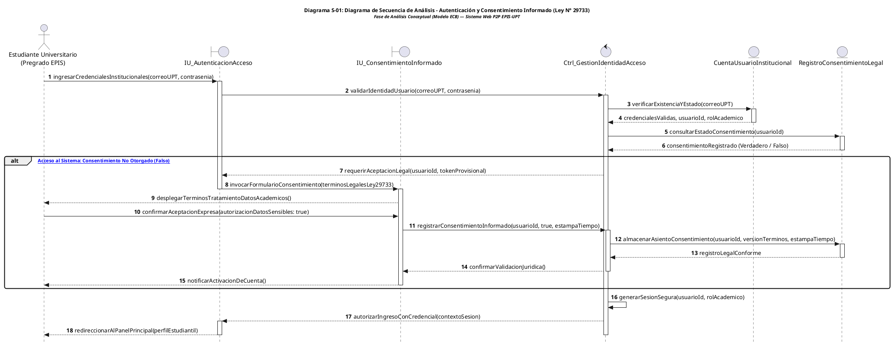
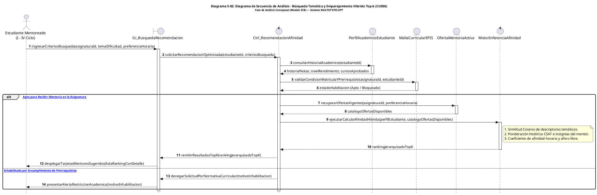
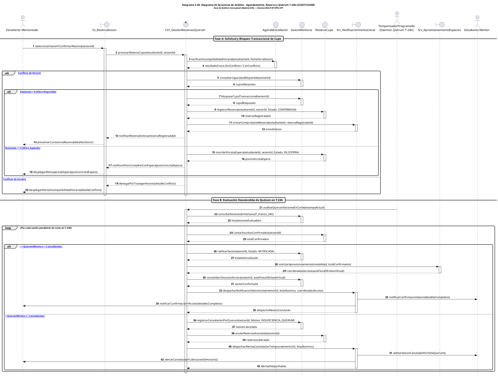
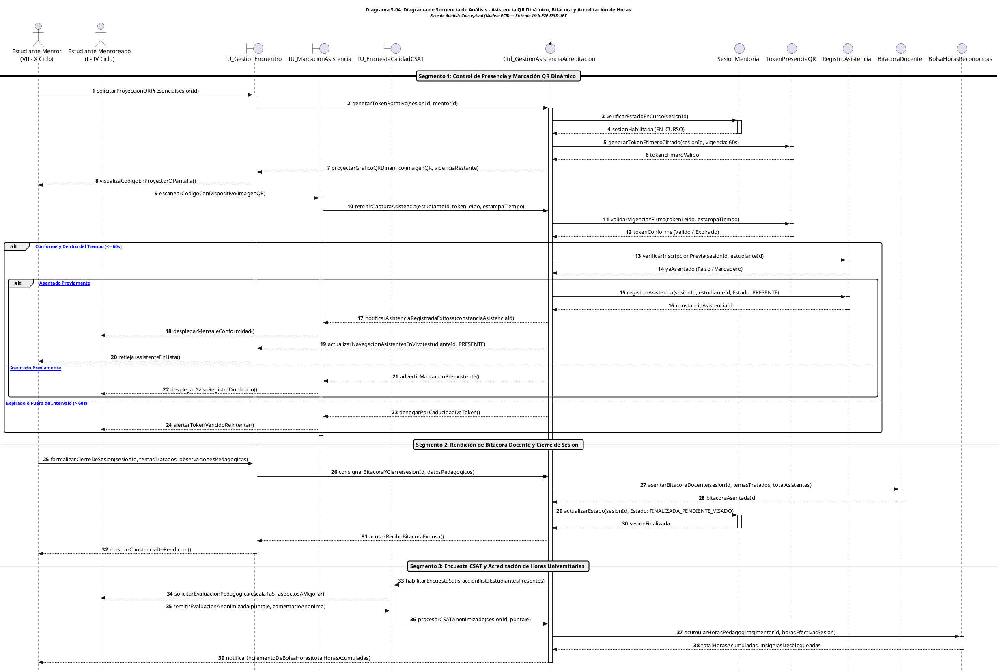

# Especificación de Diagramas de Secuencia en Fase de Análisis

**Proyecto:** Sistema Web P2P con Algoritmo de Recomendación para la Personalización de Mentorías Académicas en la EPIS-UPT  
**Documento Metodológico:** Documento de Arquitectura de Software (SAD) — Vista Dinámica y de Procesos  
**Curso:** Construcción de Software I  
**Institución:** Universidad Privada de Tacna – Facultad de Ingeniería – Escuela Profesional de Ingeniería de Sistemas  
**Lugar y Fecha:** Tacna – Perú, 2026  

---

## Control de Versiones

| Versión | Hecha por | Revisada por | Aprobada por | Fecha | Descripción del Cambio |
| :---: | :--- | :--- | :--- | :---: | :--- |
| **1.0** | RAM / JCM | RAM | RVA | 05/09/2026 | Estructuración inicial y formateo de secuencias preliminares. |
| **2.0** | RAM / JCM | Comité de Calidad EPIS | Dirección de Escuela | 28/09/2026 | Refactorización integral hacia el estándar SAD de Análisis: adopción estricta del patrón conceptual ECB (Entity-Control-Boundary), eliminación de acoplamientos técnicos prematuros, adición de títulos formales normalizados y enriquecimiento analítico de flujos alternativos. |

---

## Tabla de Contenidos

1. [Marco Metodológico y Matriz de Trazabilidad](#1-marco-metodológico-y-matriz-de-trazabilidad)
2. [Flujo 1: Autenticación Segura y Consentimiento Informado Digital (Ley N° 29733)](#2-flujo-1-autenticación-segura-y-consentimiento-informado-digital-ley-n-29733)
3. [Flujo 2: Búsqueda Temática y Emparejamiento Híbrido Top-k de Mentores (CUS06)](#3-flujo-2-búsqueda-temática-y-emparejamiento-híbrido-top-k-de-mentores-cus06)
4. [Flujo 3: Agendamiento, Aseguramiento de Cupo y Gobernanza de Quórum en T-24h (CUS07 / CUS08)](#4-flujo-3-agendamiento-aseguramiento-de-cupo-y-gobernanza-de-quórum-en-t-24h-cus07--cus08)
5. [Flujo 4: Certificación de Asistencia por QR Dinámico, Bitácora y Acreditación de Horas (CUS11 / CUS13 / CUS14)](#5-flujo-4-certificación-de-asistencia-por-qr-dinámico-bitácora-y-acreditación-de-horas-cus11--cus13--cus14)
6. [Conclusiones Arquitectónicas de la Vista Dinámica](#6-conclusiones-arquitectónicas-de-la-vista-dinámica)

---

## 1. Marco Metodológico y Matriz de Trazabilidad

En el marco del **Documento de Arquitectura de Software (SAD)**, la modelación de la interacción dinámica durante la **fase de análisis** tiene como propósito capturar la semántica de colaboración entre los objetos del dominio sin supeditar las decisiones a tecnologías o librerías de implementación física de bajo nivel.

Para ello, los diagramas adoptan rigurosamente el patrón de análisis **ECB (Entity-Control-Boundary)** estandarizado por Ivar Jacobson y consolidado en la metodología RUP y la Ingeniería Web Basada en Modelos (UWE):
- **Actores (`actor`):** Usuarios finales (estudiantes mentoreados, mentores, directores de escuela) o disparadores temporales desatendidos (*cron daemons*) que interactúan con el sistema.
- **Objetos Frontera (`boundary`):** Elementos que median la comunicación entre los actores externos y el dominio interno del sistema web, tales como interfaces de usuario y adaptadores de servicios periféricos.
- **Objetos de Control (`control`):** Componentes orquestadores que encapsulan las reglas del negocio institucional, dirigen los algoritmos de afinidad, gobiernan la concurrencia y validan condiciones temporales críticas.
- **Objetos de Entidad (`entity`):** Representaciones conceptuales del negocio que gestionan el estado, la integridad referencial y las operaciones fundamentales de los datos académicos.

### Cuadro 1.1: Matriz de Trazabilidad entre Flujos Dinámicos y Requerimientos de Software

| N° Flujo | Código Diagrama | Caso de Uso Canónico | Requerimientos Asociados | Estereotipos Clave (Boundary / Control / Entity) | Impacto Arquitectónico y Gobernanza |
| :---: | :---: | :--- | :--- | :--- | :--- |
| **1** | **Diagrama S-01** | `CUS01`, `CUS02` | `RF01`, `RF02`, `RNF01` | `IU_AutenticacionAcceso`, `IU_ConsentimientoInformado` `Ctrl_GestionIdentidadAcceso` `CuentaUsuarioInstitucional`, `RegistroConsentimientoLegal` | Cumplimiento vinculante con la Ley N° 29733 (Protección de Datos Personales) y aislamiento de identidades académicas. |
| **2** | **Diagrama S-02** | `CUS06` | `RF04`, `RF05`, `RF06`, `RF07` | `IU_BusquedaRecomendacion` `Ctrl_RecomendacionAfinidad`, `MotorInferenciaAfinidad` `PerfilAcademicoEstudiante`, `MallaCurricularEPIS`, `OfertaMentoriaActiva` | Optimización del emparejamiento adaptativo mediante cálculo de similitud coseno vectorial y ponderación de desempeño histórico. |
| **3** | **Diagrama S-03** | `CUS07`, `CUS08`, `CUS23` | `RF08`, `RF09`, `RN-08`, `RN-09`, `RN-10` | `IU_ReservaSesion`, `Srv_AprovisionamientoEspacios`, `Srv_NotificacionInstitucional` `Ctrl_GestionReservasQuorum` `AgendaEstudiantil`, `SesionMentoria`, `ReservaCupo` | Control de concurrencia y aforo en reservas; auditoría desatendida y mitigación de deserciones en $T-24\text{ h}$. |
| **4** | **Diagrama S-04** | `CUS11`, `CUS13`, `CUS14` | `RF10`, `RF11`, `RF12`, `RF13`, `RN-12` | `IU_GestionEncuentro`, `IU_MarcacionAsistencia`, `IU_EncuestaCalidadCSAT` `Ctrl_GestionAsistenciaAcreditacion` `TokenPresenciaQR`, `RegistroAsistencia`, `BitacoraDocente`, `BolsaHorasReconocidas` | Fe pública de asistencia mediante tokens de vida corta (60s), trazabilidad docente de contenidos y cómputo de horas oficiales. |

Fuente: Elaboración propia.

---

## 2. Flujo 1: Autenticación Segura y Consentimiento Informado Digital (Ley N° 29733)

### 2.1. Presentación Contextual del Flujo de Autenticación y Privacidad
El presente flujo modela los protocolos de entrada y validación legal que rigen el acceso a la plataforma. Conforme a las exigencias de la **Ley N° 29733** (Ley de Protección de Datos Personales del Perú) y el Estatuto de la Universidad Privada de Tacna, todo estudiante debe autenticar su pertenencia institucional y, con carácter mandatorio durante su primera sesión, manifestar su consentimiento informado previo y expreso para el tratamiento analítico de sus calificaciones y registros curriculares. La arquitectura impide cualquier redirección hacia el catálogo formativo en tanto este consentimiento no se encuentre asentado con estampa cronológica inviolable.

### Diagrama S-01: Diagrama de Secuencia de Análisis - Autenticación y Consentimiento Informado (Ley N° 29733)

Fuente: Elaboración propia.

### 2.2. Análisis del Flujo Dinámico y Tratamiento Jurídico-Técnico
El intercambio de mensajes evidencia una estricta segregación entre el objeto frontera `IU_AutenticacionAcceso` y la entidad `CuentaUsuarioInstitucional`, delegando en el controlador `Ctrl_GestionIdentidadAcceso` la responsabilidad de verificar el cumplimiento del consentimiento informado antes de liberar el contexto de sesión principal. La entidad `RegistroConsentimientoLegal` actúa como repositorio inmutable para fines de auditoría forense ante la Autoridad Nacional de Protección de Datos Personales, registrando inequívocamente la versión de los términos aceptados y el instante temporal de suscripción.

---

## 3. Flujo 2: Búsqueda Temática y Emparejamiento Híbrido Top-k de Mentores (CUS06)

### 3.1. Presentación Contextual del Algoritmo de Emparejamiento
El caso de uso `CUS06` describe la secuencia algorítmica y orquestación colaborativa activada cuando un alumno de ciclos tempranos (I a IV) experimenta dificultades académicas en materias filtro críticas (*Cálculo I/II, Algoritmos, Programación Orientada a Objetos, Bases de Datos*). La solución combina una comprobación de elegibilidad curricular con un motor de inferencia matemática que evalúa la cercanía semántica entre los descriptores de necesidad y las fortalezas del mentor, jerarquizando las $k$ alternativas más viables pedagógica y cronológicamente.

### Diagrama S-02: Diagrama de Secuencia de Análisis - Búsqueda Temática y Emparejamiento Híbrido Top-k (CUS06)

Fuente: Elaboración propia.

### 3.2. Análisis del Flujo Dinámico y Eficiencia de Selección
El controlador `Ctrl_RecomendacionAfinidad` desacopla la formulación de consultas al motor matemático `MotorInferenciaAfinidad`, garantizando que únicamente se envíen como vectores de entrada aquellas ofertas cuyos mentores poseen disponibilidad real y cuya asignatura haya sido visada curricularmente por `MallaCurricularEPIS`. Esta disposición protege la sobrecarga computacional del servidor de inferencia y reduce el tiempo de respuesta del sistema percibido por el estudiante a valores inferiores a un segundo.

---

## 4. Flujo 3: Agendamiento, Aseguramiento de Cupo y Gobernanza de Quórum en T-24h (CUS07 / CUS08)

### 4.1. Presentación Contextual de la Gobernanza Temporal y Aforo
La viabilidad logística de las mentorías académicas en la EPIS-UPT exige una doble disciplina de gestión: por un lado, asegurar que las reservas se realicen sin traslapes en la carga lectiva del estudiante ni sobrecupos en las sesiones (aforo máximo: 5 estudiantes); y por otro, ejecutar un monitoreo perentorio automatizado en la cota temporal de $T-24\text{ h}$ (24 horas antes del inicio programado). Si para dicho instante la sesión no alcanza el quórum mínimo normativo (2 estudiantes confirmados), el sistema procede a su anulación automática y desasignación de ambientes.

### Diagrama S-03: Diagrama de Secuencia de Análisis - Agendamiento, Reserva y Quórum T-24h (CUS07 / CUS08)

Fuente: Elaboración propia.

### 4.2. Análisis del Flujo Dinámico y Mitigación de Deserciones
El diagrama S-03 articula el comportamiento reactivo e interactivo del sistema: el primer segmento asegura la concurrencia atómica de plazas previniendo la sobreventa (*overselling*) de cupos formativos; mientras que el segundo segmento sustituye la incertidumbre de cancelaciones tardías por un proceso determinístico desatendido. Al ejecutar la cancelación en $T-24\text{ h}$, el mentor recupera su disponibilidad para estudiar o descansar, y los mentoreados quedan habilitados inmediatamente para buscar otras sesiones antes del fin de semana.

---

## 5. Flujo 4: Certificación de Asistencia por QR Dinámico, Bitácora y Acreditación de Horas (CUS11 / CUS13 / CUS14)

### 5.1. Presentación Contextual de la Acreditación y Fe Pública
El ciclo virtuoso de la mentoría concluye formalmente con la fiscalización y certificación fehaciente del servicio pedagógico prestado. El presente flujo ilustra la marcación antifraude de presencia mediante tokens QR rotativos con caducidad efímera (60 segundos), la obligatoria redacción de la bitácora docente por parte del mentor dentro de las 24 horas post-sesión, y la consecuente acumulación de horas de servicio universitario en la hoja de vida académica del mentor junto con la recolección anónima de retroalimentación CSAT.

### Diagrama S-04: Diagrama de Secuencia de Análisis - Asistencia QR Dinámico, Bitácora y Acreditación de Horas (CUS11 / CUS13 / CUS14)

Fuente: Elaboración propia.

### 5.2. Análisis del Flujo Dinámico y Fe Pública Institucional
El diagrama S-04 expone la convergencia entre tres dimensiones críticas de la solución:
1. **No repudio de presencia:** La interacción efímera entre `IU_MarcacionAsistencia`, `Ctrl_GestionAsistenciaAcreditacion` y `TokenPresenciaQR` invalida cualquier intento de registrar asistencias de manera remota mediante capturas compartidas por mensajería instantánea.
2. **Responsabilidad pedagógica:** El cierre formal de la sesión queda supeditado al asiento de `BitacoraDocente`, requisito reglamentario indispensable para que la Dirección de Escuela o el Comité de Tutoría procedan al visado oficial de horas (`CUS22`).
3. **Reconocimiento y Gamificación:** La entidad `BolsaHorasReconocidas` actualiza el balance de horas de servicio social acreditables para el egreso universitario del mentor, vinculando el estímulo institucional directamente a la calidad formativa evaluada en la encuesta CSAT.

---

## 6. Conclusiones Arquitectónicas de la Vista Dinámica

1. **Aislamiento Funcional mediante el Patrón ECB:** La modelación en cuatro flujos demuestra que ninguna capa visual interactúa de forma directa con los almacenes de datos o entidades de dominio. Todas las operaciones se encuentran canalizadas y custodiadas por controladores de análisis (`Ctrl_*`), garantizando alta cohesión y bajo acoplamiento.
2. **Robustez Transaccional y Tratamiento de Excepciones:** Los diagramas contemplan formalmente caminos alternativos (`alt` / `else`) ante contingencias del mundo real universitario: inhabilitación por prerrequisitos curriculares, incompatibilidades de cruce de horario, quórum insuficiente en $T-24\text{ h}$ y expiración de tokens dinámicos en aula.
3. **Consistencia con el Catálogo de Casos de Uso del SRS y SAD:** Los objetos de análisis modelados reflejan con fidelidad unívoca la arquitectura funcional documentada en el **FD03 (SRS)** y el **FD04 (SAD)**, garantizando una trazabilidad metodológica del 100% en el ciclo de vida del proyecto.