# Repositorio Consolidado de Diagramas y Cuadros del Sistema Web P2P

**Proyecto:** Sistema Web P2P con algoritmo de recomendación para la personalización de mentorías académicas en la EPIS-UPT  
**Institución:** Universidad Privada de Tacna – Escuela Profesional de Ingeniería de Sistemas  
**Equipo Consultor:** C-SharkTeam  
**Documento de Control y Hardening:** Artefactos visuales, estructurales y matrices maestras  

---

## 1. Organigrama de la Empresa Consultora (C-SharkTeam)

@startuml
skinparam shadowing false
skinparam roundcorner 8
skinparam linetype ortho
skinparam defaultFontName Arial

skinparam rectangle {
    BackgroundColor #F8F9FA
    BorderColor #2C3E50
    BorderThickness 1.5
    FontColor #2C3E50
}

rectangle Direction [
  <size:13><b>C-SharkTeam</b></size>
  Dirección de Proyecto de TI
]

rectangle Backend [
  <b>Ingeniería de Backend</b>
  <b>y Algoritmos de IA</b>
  ----
  Joan Cristian Medina Q.
  ..
  * Lógica de Negocio (APIs)
  * Algoritmo Híbrido RecSys
  * Seguridad & Auth (2FA)
]

rectangle Frontend [
  <b>Ingeniería de Frontend</b>
  <b>y Modelado de Datos</b>
  ----
  Renzo Antonio Antayhua M.
  ..
  * Interfaz de Usuario (UI)
  * Experiencia de Uso (UX)
  * Persistencia & Supabase
]

rectangle Beneficiary [
  <b>Entorno Cliente / Beneficiario</b>
  <size:12><b>EPIS - UPT</b></size>
  ----
  * Dirección de Escuela y Docentes Tutor
  * Estudiantes Mentores (Ciclos VII - X)
  * Estudiantes Mentoreados (Ciclos I-IV)
]

Direction --> Backend
Direction --> Frontend

Backend --> Beneficiary
Frontend --> Beneficiary

@enduml

---

### 1.1. Resumen del Levantamiento de Información Institucional

#### Presentación del Levantamiento de Información
Durante la etapa de análisis, el equipo consultor C-SharkTeam desarrolló entrevistas semiestructuradas con los actores clave de la Escuela Profesional de Ingeniería de Sistemas (EPIS-UPT): la Coordinación de Tutoría, docentes especialistas en ingeniería de software, asesores metodológicos y la Dirección de Escuela. Estas sesiones permitieron formalizar los requerimientos operativos, el control de quórum, el desacoplamiento arquitectónico y el marco normativo de convalidación académica.

#### Diagrama de Entrevistas y Levantamiento de Información

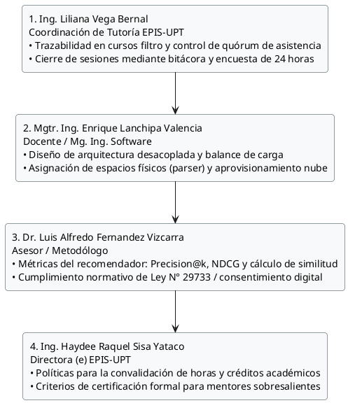

Fuente: Elaboración propia.

El levantamiento institucional fundamenta los pilares técnicos del sistema, articulando las necesidades de tutoría docente con soluciones algorítmicas de emparejamiento y mecanismos auditables de acreditación.

---

### 1.2. Diagrama del Proceso Actual (Asesoría Académica Informal)

#### Presentación del Proceso Actual
El proceso actual de asesoría académica entre estudiantes en la EPIS-UPT opera de forma empírica y desestructurada. El alumno con rezago formativo en cursos filtro recurre a contactos personales informales, enfrentando incertidumbre en la coordinación de horarios y búsqueda precaria de espacios físicos en campus. Este esquema carece de métricas institucionales, no valida temas abordados y desincentiva al estudiante sobresaliente al no otorgarle convalidación de horas.

#### Diagrama del Proceso Actual

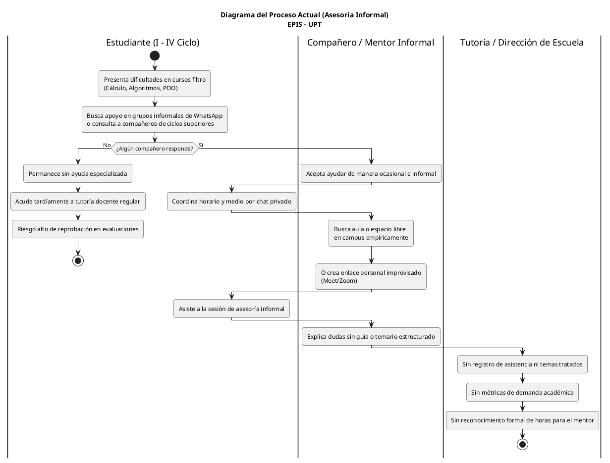

Fuente: Elaboración propia.

El análisis del proceso actual justifica plenamente la necesidad de automatizar y gobernar institucionalmente las asesorías peer-to-peer, eliminando la asimetría informativa y la falta de estímulos académicos formales.

---

### 1.3. Diagrama del Proceso Propuesto (Plataforma Web P2P)

#### Presentación del Proceso Propuesto
El proceso propuesto estructura y digitaliza la interacción colaborativa mediante la plataforma web P2P de la EPIS-UPT. Integra el acceso seguro institucional con 2FA y consentimiento informado bajo la Ley N° 29733, inferencia del motor de recomendación híbrido, verificación automática de infraestructura física o virtual, control riguroso de quórum en $T-24\text{ h}$, registro obligatorio de bitácoras, encuestas psicométricas de calidad en 24 horas y emisión formal de certificados con firma criptográfica.

#### Diagrama de Actividades del Proceso Propuesto

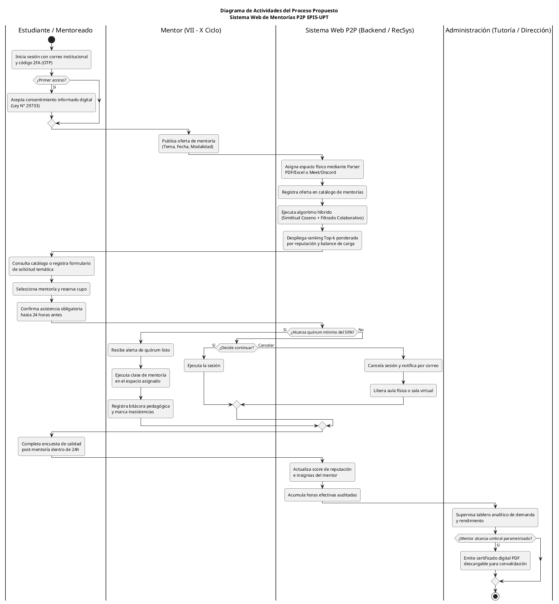

Fuente: Elaboración propia.

El flujo propuesto garantiza un ecosistema formativo ordenado, transparente y escalable, donde cada sesión genera valor pedagógico auditable tanto para los alumnos como para las autoridades de la facultad.

---

## 2. Diagrama de Fases del Ciclo de Vida del Desarrollo del Software (UWE - Semestre 2026-II)

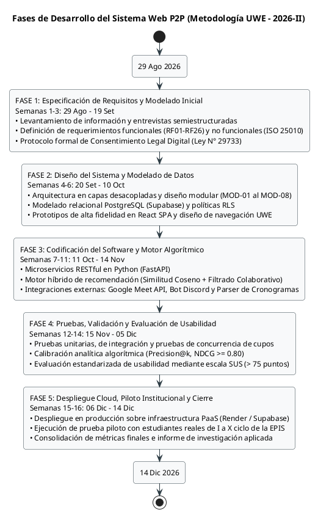

Fuente: Elaboración propia.

---

## 3. Perfiles de Usuario y Actores del Sistema Web P2P (Cuadro 6.1)

### Presentación de los Perfiles de Usuario
La operación eficiente y ordenada del Sistema Web P2P requiere la definición explícita de los perfiles de usuario y actores que interactúan en la plataforma. En el ecosistema formativo de la Escuela Profesional de Ingeniería de Sistemas (EPIS-UPT), los usuarios desempeñan roles diferenciados según su nivel de avance curricular, su investidura institucional o la naturaleza técnica de sus procesos. Con el fin de gobernar el acceso, garantizar el principio de mínimo privilegio y resguardar la integridad de los datos académicos bajo la Ley N° 29733, se establecen los perfiles de usuario humanos y los actores técnicos automatizados del sistema. A continuación, se presenta la matriz descriptiva de los perfiles identificados.

### Cuadro 6.1: Perfiles de Usuario y Actores del Sistema Web P2P

| Perfil / Actor | Tipo de Actor | Población Objetivo / Componente | Responsabilidades y Actividades Principales | Privilegios y Permisos en el Sistema |
| :--- | :--- | :--- | :--- | :--- |
| **Estudiante Mentoreado** | Humano (Actor Primario) | Estudiantes matriculados de I a IV ciclo con necesidades de reforzamiento académico en materias críticas (*Cálculo I/II, Algoritmos, Estructuras de Datos, POO*). | • Formalizar el consentimiento informado digital (Ley N° 29733).<br>• Declarar áreas de dificultad temática y disponibilidad horaria semanal.<br>• Consultar recomendaciones personalizadas (Top-k) y explorar el catálogo.<br>• Reservar cupos de mentoría y registrar solicitudes por demanda.<br>• Confirmar asistencia obligatoria hasta $T-24\text{ h}$ o desistir oportunamente.<br>• Responder encuestas de satisfacción dentro de las 24 horas posteriores. | • Acceso a vistas de catálogo y recomendador personal.<br>• Gestión de reservas propias (creación, confirmación, cancelación).<br>• Registro en banco de demandas formativas.<br>• Descarga de materiales de sesiones en las que participó.<br>• Diligenciamiento de encuestas de calidad asignadas. |
| **Estudiante Mentor** | Humano (Actor Primario) | Estudiantes de rendimiento sobresaliente de VII a X ciclo promovidos formalmente por la Dirección de Escuela. | • Configurar áreas de dominio curricular y agenda de disponibilidad.<br>• Programar y publicar ofertas de mentoría académica (temario, modalidad).<br>• Resolver la continuidad o cancelación ante alertas de quórum deficiente.<br>• Dictar sesiones y gestionar imprevistos por causa mayor debidamente justificada.<br>• Registrar bitácoras pedagógicas y reporte obligatorio de asistencia efectiva.<br>• Compartir recursos didácticos y monitorear insignias/reputación obtenida.<br>• Descargar certificados oficiales de horas para convalidación extracurricular. | • Creación, edición, reprogramación y anulación de ofertas propias.<br>• Aprovisionamiento guiado de infraestructura física o virtual.<br>• Diligenciamiento y cierre de bitácoras de sesión.<br>• Carga de materiales y enlaces académicos para sus alumnos.<br>• Visualización de métricas personales de reputación y descarga de certificados PDF auditados. |
| **Administrador Institucional** | Humano (Gobernanza y Supervisión) | Comité de Tutoría Docente, Coordinación Académica y Dirección de la EPIS-UPT. | • Auditar expedientes estudiantiles y aprobar la promoción a rol de Mentor.<br>• Mantener actualizado el catálogo de asignaturas críticas y temarios silábicos.<br>• Cargar cronogramas oficiales de aulas/laboratorios para su procesamiento por el parser interno.<br>• Registrar materias y mentorías en condición prioritaria por reprobación.<br>• Fiscalizar bitácoras pedagógicas, asistencias y computabilidad de horas.<br>• Parametrizar umbrales semestrales y emitir certificados oficiales PDF.<br>• Supervisar tableros analíticos de demanda, ausentismo y desempeño docente. | • Control de acceso total y gestión jerárquica de roles.<br>• Operaciones CRUD sobre asignaturas, temarios y prioridades académicas.<br>• Carga e indexación de archivos de horarios institucionales.<br>• Visado, observación y validación de horas de mentoría.<br>• Generación masiva/individual de certificados digitales.<br>• Acceso irrestricto al panel de analítica institucional. |
| **Servicio Cron / Backend** | Técnico (Proceso Desatendido) | Demonio de tareas programadas en el servidor backend FastAPI. | • Inspeccionar periódicamente la base de datos para identificar sesiones próximas.<br>• Despachar notificaciones automáticas y recordatorios a inscritos.<br>• Ejecutar el corte perentorio a $T-24\text{ h}$, revocar cupos no confirmados y computar quórum.<br>• Transicionar el estado de sesiones que no alcancen el 50% de aforo y alertar al Mentor. | • Ejecución en segundo plano con privilegios a nivel de servicio de sistema.<br>• Modificación automatizada de estados en tablas de reservas y sesiones.<br>• Invocación de microservicios de mensajería y correo SMTP institucional. |
| **Servicios Externos** | Técnico (Sistemas Colaboradores) | Plataformas de infraestructura de terceros: Google Meet API, Bot de Discord y Servidor de Correo SMTP UPT. | • Recibir solicitudes de aprovisionamiento de videollamadas y canales de voz.<br>• Retornar credenciales de acceso, enlaces dinámicos y confirmaciones de sala.<br>• Despachar notificaciones y códigos de verificación OTP mediante la infraestructura de correo de la UPT. | • Respuestas seguras a endpoints REST autenticados mediante tokens de servicio.<br>• Sin acceso directo a datos académicos sensibles de estudiantes. |

Fuente: Elaboración propia.

---

## 4. Diagrama de Clases Conceptuales del Dominio - Sistema Web P2P EPIS-UPT

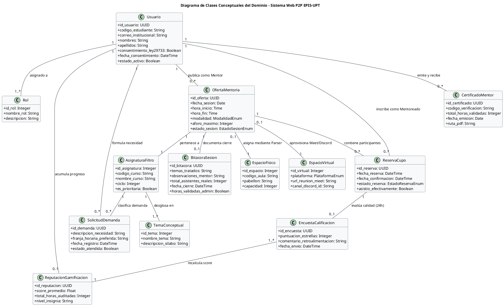

Fuente: Elaboración propia.

---

## 5. Diagrama de Paquetes Arquitecturales - Sistema Web P2P EPIS-UPT

```plantuml
@startuml
title Diagrama de Paquetes Arquitecturales del Sistema Web P2P EPIS-UPT
skinparam packageStyle rectangle
skinparam shadowing false
skinparam roundcorner 8
skinparam defaultFontName Arial
skinparam fontSize 11

skinparam package {
    BackgroundColor #F8F9FA
    BorderColor #2B3A42
}

package "Capa de Presentación (Frontend React SPA)" {
  [PKG-UI-01: Autenticación, Acceso & Consentimiento Legal]
  [PKG-UI-02: Perfil Académico & Disponibilidad Horaria]
  [PKG-UI-03: Catálogo, Búsqueda & Recomendaciones Top-k]
  [PKG-UI-04: Planificación, Ofertas & Aprovisionamiento]
  [PKG-UI-05: Reservas, Confirmaciones & Gestión de Quórum]
  [PKG-UI-06: Bitácoras de Sesión, Asistencia & Encuestas]
  [PKG-UI-07: Tablero de Insignias, Reputación & Certificados]
  [PKG-UI-08: Tablero Analítico & Auditoría de Dirección]
}

package "Capa de Negocio y Lógica de Dominio (FastAPI RESTful Backend)" {
  [PKG-SRV-01: Servicio de Seguridad, JWT & Roles]
  [PKG-SRV-02: Servicio Curricular & Temarios]
  [PKG-SRV-03: Motor Recomendador Inteligente (EdRecSys)]
  [PKG-SRV-04: Servicio de Agendamiento, Espacios & Parser Interno]
  [PKG-SRV-05: Servicio de Quórum, Cancelaciones & Cron]
  [PKG-SRV-06: Servicio de Trazabilidad, Bitácoras & Evaluación]
  [PKG-SRV-07: Servicio de Gamificación & Emisión de PDFs]
  [PKG-SRV-08: Servicio de Analítica Académica & Priorización]
}

package "Capa de Persistencia Segura y Almacenamiento (Supabase / PostgreSQL)" {
  database "PostgreSQL Relacional\n(Tablas Maestras, Índices & Vistas)" as DB
  [Módulo de Seguridad RLS\n(Row Level Security - Ley N° 29733)] as RLS
  [Bucket de Almacenamiento Cloud\n(Certificados PDF & Documentos)] as Storage
}

package "Capa de Integración y Servicios Externos" {
  [Adaptador SMTP Institucional\n(Emisor OTP @upt.pe)] as SMTP
  [Adaptador Google Workspace\n(Google Meet API)] as Meet
  [Adaptador Discord Bot\n(Gestión Canales Supervisados)] as Discord
}

' Consumo de Presentación hacia Servicios de Negocio
[PKG-UI-01] --> [PKG-SRV-01] : JSON / REST
[PKG-UI-02] --> [PKG-SRV-02] : JSON / REST
[PKG-UI-03] --> [PKG-SRV-03] : Inferencia Top-k
[PKG-UI-04] --> [PKG-SRV-04] : JSON / REST
[PKG-UI-05] --> [PKG-SRV-05] : JSON / REST
[PKG-UI-06] --> [PKG-SRV-06] : JSON / REST
[PKG-UI-07] --> [PKG-SRV-07] : JSON / REST
[PKG-UI-08] --> [PKG-SRV-08] : JSON / REST

' Interacción entre Servicios y Persistencia
[PKG-SRV-01] --> RLS
[PKG-SRV-02] --> DB
[PKG-SRV-03] --> DB
[PKG-SRV-04] --> DB : Persistencia de aulas libres
[PKG-SRV-05] --> DB
[PKG-SRV-06] --> DB
[PKG-SRV-07] --> Storage
[PKG-SRV-07] --> DB
[PKG-SRV-08] --> DB
RLS --> DB : Aislamiento granular

' Interacción con Adaptadores Externos
[PKG-SRV-01] --> SMTP : Envío de códigos OTP
[PKG-SRV-04] --> Meet : Generación dinámica de salas
[PKG-SRV-04] --> Discord : Aprovisionamiento de canales
@enduml
```

Fuente: Elaboración propia.

---

## 6. Diagrama de Casos de Uso General Consolidado (CUS01 - CUS24)

@startuml
title Diagrama de Casos de Uso General Consolidado (CUS01 - CUS24)\nSistema Web P2P con Recomendador para Mentorías Académicas - EPIS UPT

left to right direction
skinparam packageStyle rectangle
skinparam shadowing false
skinparam roundcorner 8
skinparam defaultFontName Arial
skinparam fontSize 11

skinparam usecase {
    BackgroundColor #F8F9FA
    BorderColor #2B3A42
    ArrowColor #2B3A42
    FontSize 11
}

skinparam actor {
    BackgroundColor #E9ECEF
    BorderColor #1D2D44
}

' ===================================================
' ACTORES DEL SISTEMA
' ===================================================
actor "Mentoreado\n(I - IV Ciclo)" as Mentoreado
actor "Mentor\n(VII - X Ciclo)" as Mentor
actor "Administrador\n(Tutoría / Dirección)" as Admin
actor "Servicio Cron / Backend" as SysCron <<Sistema>>
actor "Servicios Externos\n(Meet, Discord)" as SysExt <<Sistema Externo>>

' ===================================================
' LÍMITE DEL SISTEMA Y MÓDULOS
' ===================================================
rectangle "Sistema Web de Mentorías P2P EPIS-UPT" {

  package "MOD-01: Seguridad, Autenticación y Gobernanza" {
    usecase "CUS01: Iniciar Sesión Institucional con 2FA" as UC01
    usecase "Aceptar Consentimiento para el\nTratamiento de Datos (Ley N° 29733)" as UC_Consent
    usecase "CUS10: Gestionar Asignación de Roles de Usuario" as UC10
  }

  package "MOD-02: Gestión Curricular y Perfiles Académicos" {
    usecase "CUS15: Configurar Perfil y Disponibilidad Horaria" as UC15
    usecase "CUS21: Gestionar Catálogo Curricular y Temarios" as UC21
  }

  package "MOD-03: Motor de Recomendación Inteligente (EdRecSys)" {
    usecase "CUS02: Consultar Recomendaciones Personalizadas Top-k" as UC02
    usecase "CUS03: Registrar Solicitud Temática por Demanda" as UC03
  }

  package "MOD-04: Planificación, Espacios y Agendamiento" {
    usecase "CUS06: Publicar Oferta de Mentoría" as UC06
    usecase "CUS11: Cargar Cronograma de Horarios Oficiales" as UC11
    usecase "CUS18: Modificar o Cancelar Oferta por Imprevisto" as UC18
  }

  package "MOD-05: Quórum, Confirmación y Cancelaciones" {
    usecase "CUS04: Reservar Cupo de Mentoría" as UC04
    usecase "CUS24: Confirmar Asistencia a Mentoría" as UC24
    usecase "CUS07: Gestionar Sesión ante Quórum Insuficiente" as UC07
    usecase "CUS17: Cancelar Reserva de Cupo (Desistimiento)" as UC17
    usecase "CUS23: Ejecutar Alertas y Evaluación Automática de Quórum" as UC23
  }

  package "MOD-06: Trazabilidad, Bitácoras y Evaluación" {
    usecase "CUS08: Registrar Bitácora y Control de Asistencia" as UC08
    usecase "CUS05: Responder Encuesta de Calidad Post-Mentoría" as UC05
    usecase "CUS19: Consultar Historial de Sesiones y Asistencia" as UC19
    usecase "CUS20: Gestionar Recursos Académicos de la Mentoría" as UC20
  }

  package "MOD-07: Gamificación, Reputación y Certificación" {
    usecase "CUS16: Consultar Tablero de Insignias y Reputación" as UC16
    usecase "CUS09: Descargar Certificado de Horas de Mentoría" as UC09
    usecase "CUS13: Parametrizar y Emitir Certificados" as UC13
  }

  package "MOD-08: Supervisión y Analítica Institucional" {
    usecase "CUS12: Destacar Mentorías Prioritarias" as UC12
    usecase "CUS14: Visualizar Tablero de Analíticas Institucionales" as UC14
    usecase "CUS22: Auditar Bitácoras, Asistencia y Horas de Mentoría" as UC22
  }
}

' ===================================================
' RELACIONES DE INCLUSIÓN Y EXTENSIÓN
' ===================================================
UC01 <.. UC_Consent : <<extend>>\n(Primer Acceso)

' ===================================================
' ASOCIACIONES: SERVICIOS EXTERNOS Y JOBS
' ===================================================
SysExt -- UC06
SysCron -- UC23

' ===================================================
' ASOCIACIONES: ESTUDIANTE MENTOREADO
' ===================================================
Mentoreado -- UC01
Mentoreado -- UC15
Mentoreado -- UC02
Mentoreado -- UC03
Mentoreado -- UC04
Mentoreado -- UC24
Mentoreado -- UC17
Mentoreado -- UC05
Mentoreado -- UC19
Mentoreado -- UC20

' ===================================================
' ASOCIACIONES: ESTUDIANTE MENTOR
' ===================================================
Mentor -- UC01
Mentor -- UC15
Mentor -- UC06
Mentor -- UC18
Mentor -- UC07
Mentor -- UC08
Mentor -- UC16
Mentor -- UC09
Mentor -- UC19
Mentor -- UC20

' ===================================================
' ASOCIACIONES: ADMINISTRADOR (TUTORÍA / DIRECCIÓN)
' ===================================================
Admin -- UC01
Admin -- UC10
Admin -- UC21
Admin -- UC11
Admin -- UC12
Admin -- UC13
Admin -- UC14
Admin -- UC22

@enduml

Fuente: Elaboración propia.

El Diagrama General Consolidado sintetiza de forma integral el ecosistema de interacciones del software. Refleja cómo la seguridad y gobernanza (MOD-01) condicionan el ingreso al sistema mediante 2FA y la extensión de consentimiento informado digital. Asimismo, demuestra la independencia entre el ciclo de búsqueda y agendamiento (MOD-02, MOD-03, MOD-04), el ciclo crítico de control de quórum y asistencia a 24 horas (MOD-05), y los procesos posteriores de evaluación pedagógica, reconocimiento al mentor y fiscalización académica (MOD-06, MOD-07, MOD-08).

---

### 6.1. Diagrama de Casos de Uso - MOD-01: Seguridad, Autenticación y Gobernanza

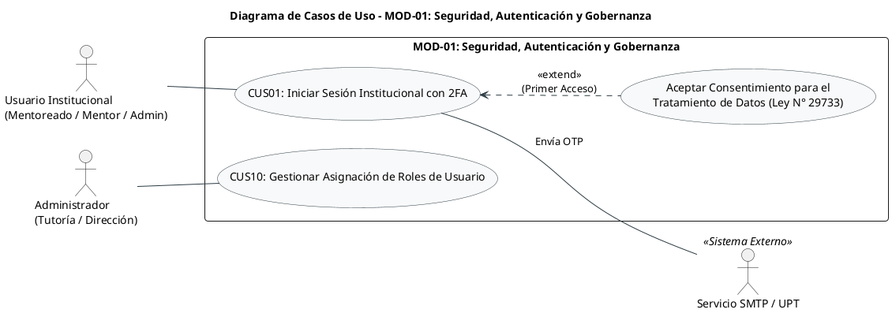

Fuente: Elaboración propia.

---

### 6.2. Diagrama de Casos de Uso - MOD-02: Gestión Curricular y Perfiles Académicos

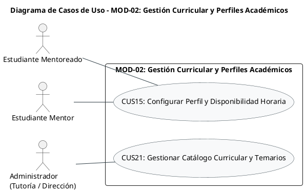

Fuente: Elaboración propia.

---

### 6.3. Diagrama de Casos de Uso - MOD-03: Motor de Recomendación Inteligente (EdRecSys)

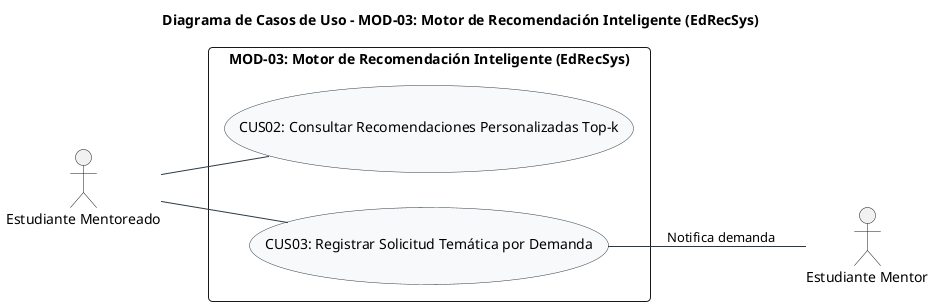

Fuente: Elaboración propia.

---

### 6.4. Diagrama de Casos de Uso - MOD-04: Planificación, Espacios y Agendamiento

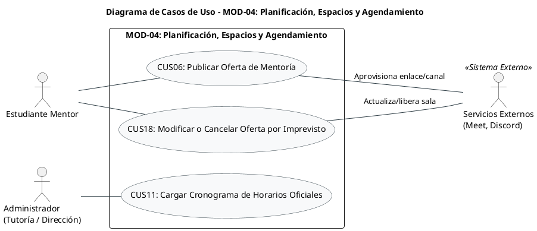

Fuente: Elaboración propia.

---

### 6.5. Diagrama de Casos de Uso - MOD-05: Quórum, Confirmación y Cancelaciones

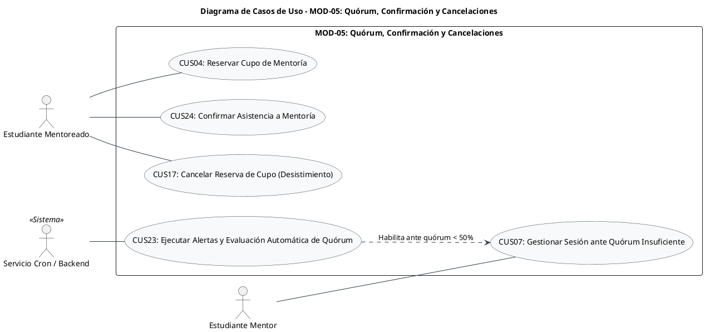

Fuente: Elaboración propia.

---

### 6.6. Diagrama de Casos de Uso - MOD-06: Trazabilidad, Bitácoras y Evaluación

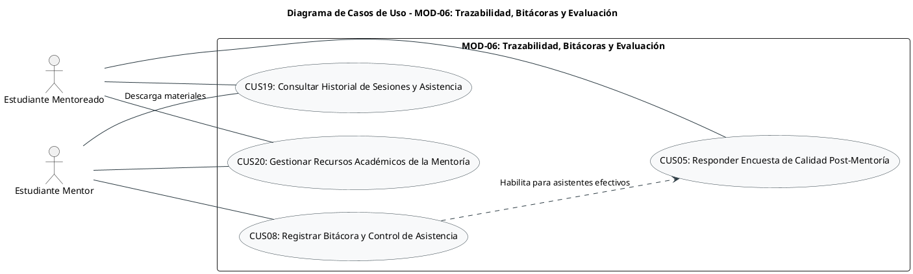

Fuente: Elaboración propia.

---

### 6.7. Diagrama de Casos de Uso - MOD-07: Gamificación, Reputación y Certificación

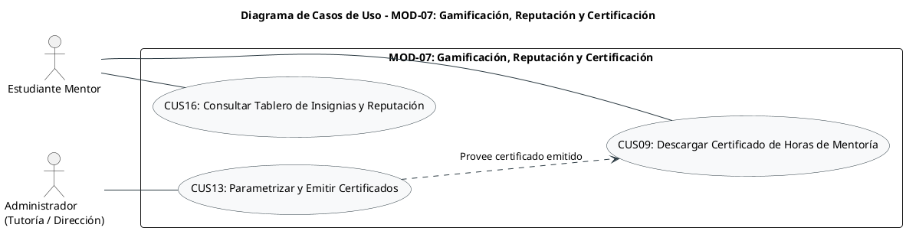

Fuente: Elaboración propia.

---

### 6.8. Diagrama de Casos de Uso - MOD-08: Supervisión y Analítica Institucional

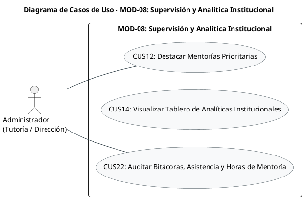

Fuente: Elaboración propia.

---

## 7. Tabla Maestra Oficial de Casos de Uso (CUS01 al CUS24)

### Presentación de la Tabla Maestra
En el marco de la fase de análisis del sistema web para la Escuela Profesional de Ingeniería de Sistemas (EPIS-UPT), la definición de los casos de uso establece el modelo funcional de interacción entre los roles de usuario y la plataforma. Con el objetivo de delimitar formalmente los alcances de la solución antes de consolidar los requerimientos de software definitivos, se presenta a continuación la tabla maestra de casos de uso. Esta estructura normaliza el código, nombre canónico, actores participantes, módulo principal de pertenencia, requisitos funcionales asociados de manera provisional, nivel de criticidad según una escala única, el objetivo funcional delimitando exclusiones explícitas, y las observaciones de normalización técnica resultantes de la auditoría de dependencias y granularidad.

### Cuadro 6.1: Tabla Maestra Oficial de Casos de Uso del Sistema Web P2P (CUS01 al CUS24)

| Código | Nombre Oficial | Actor Principal | Actores Secundarios | Módulo Principal | RFs Asociados | Criticidad | Objetivo / Alcance Funcional | Observaciones / Correcciones de Normalización |
| :---: | :--- | :--- | :--- | :--- | :---: | :---: | :--- | :--- |
| **CUS01** | Iniciar sesión institucional con 2FA | Usuario Institucional (*Mentoreado, Mentor o Administrador*) | Servicio de Correo SMTP / UPT (*Emisor OTP*) | MOD-01 Seguridad, Autenticación y Gobernanza | RF01, RF02 | Crítica | **Objetivo:** Autenticar la identidad institucional mediante correo `@upt.pe` y código OTP temporal.<br>**Alcance:** Valida el dominio universitario, emite/expira el código OTP (5 min) y genera el token JWT de sesión. No gestiona credenciales de cuentas externas ni admite correos personales. | El consentimiento para el tratamiento de datos (Ley N° 29733) se desacopla del nombre del CUS y se modela como extensión condicional (`<<extend>>`) activada exclusivamente en el primer acceso del usuario. |
| **CUS02** | Consultar recomendaciones personalizadas Top-k | Estudiante Mentoreado (*I a IV Ciclo*) | Ninguno | MOD-03 Motor de Recomendación Inteligente (*EdRecSys*) | RF06 | Crítica | **Objetivo:** Obtener un listado ordenado de 3 a 5 mentores sugeridos según afinidad curricular y horaria.<br>**Alcance:** Procesa el requerimiento temático mediante similitud coseno y filtrado colaborativo, mostrando compatibilidad y franjas libres. No efectúa la reserva de cupo (CUS04). | La ejecución del motor de recomendación constituye un comportamiento interno del sistema necesario para generar las recomendaciones y no se modela como un caso de uso independiente. |
| **CUS03** | Registrar solicitud temática por demanda | Estudiante Mentoreado (*I a IV Ciclo*) | Estudiantes Mentores habilitados (*Receptores*) | MOD-03 Motor de Recomendación Inteligente (*EdRecSys*) | RF07 | Media | **Objetivo:** Registrar una necesidad de refuerzo académico cuando no exista oferta activa en el catálogo.<br>**Alcance:** Publica el tema conceptual en el banco de solicitudes de demanda para alertar a mentores competentes. No garantiza la disponibilidad inmediata de un mentor ni reserva espacios físicos o virtuales. | Reubicado a MOD-03 como componente del ciclo de emparejamiento de oferta y demanda académica. |
| **CUS04** | Reservar cupo de mentoría | Estudiante Mentoreado (*I a IV Ciclo*) | Estudiante Mentor (*Notificado*) | MOD-05 Quórum, Confirmación y Cancelaciones | RF12 | Alta | **Objetivo:** Inscribirse formalmente en una sesión de mentoría asegurando una plaza dentro del aforo disponible.<br>**Alcance:** Bloquea un cupo (10 presencial / 20 virtual) y genera la reserva en estado `PENDIENTE_CONFIRMACION`. No reconfirma asistencia a 24 horas (compete a CUS24) ni cancela la sesión. | Decisión de granularidad aplicada: Separado formalmente de la confirmación temporal de asistencia para mantener objetivos atómicos y ciclos de vida claros. |
| **CUS05** | Responder encuesta de calidad post-mentoría | Estudiante Mentoreado (*I a IV Ciclo*) | Ninguno | MOD-06 Trazabilidad, Bitácoras y Evaluación | RF18 | Alta | **Objetivo:** Evaluar la calidad de la sesión mediante calificación cuantitativa (1 a 5 estrellas) y comentarios cualitativos.<br>**Alcance:** Captura valoraciones de mentoreados con asistencia confirmada y efectiva dentro de una ventana de 24 horas. No está disponible para estudiantes inasistentes ni tras vencer el plazo límite. | Se retira la denominación "psicométrica" y se establece como encuesta de calidad/satisfacción. El recálculo de reputación e insignias es un proceso transaccional interno posterior. |
| **CUS06** | Publicar oferta de mentoría | Estudiante Mentor (*VII a X Ciclo*) | Servicios Externos (*Meet API o Bot Discord*) | MOD-04 Planificación, Espacios y Agendamiento | RF08, RF09 | Alta | **Objetivo:** Publicar fecha, temario y modalidad de una sesión de mentoría en una asignatura filtro aprobada.<br>**Alcance:** Valida prerrequisitos curriculares del mentor, registra la sesión y solicita asignación de aula física o enlace virtual. No evalúa quórum ni permite cruces con la carga lectiva regular del mentor. | El aprovisionamiento del espacio físico o virtual se considera un comportamiento interno asociado a la publicación de la oferta. Su ejecución dependerá de la modalidad seleccionada para la mentoría. |
| **CUS07** | Gestionar sesión ante quórum insuficiente | Estudiante Mentor (*VII a X Ciclo*) | Estudiantes Mentoreados inscritos (*Notificados*) | MOD-05 Quórum, Confirmación y Cancelaciones | RF16 | Alta | **Objetivo:** Resolver la continuidad o cancelación de una sesión cuando el sistema notifica que no se alcanzó el quórum mínimo (50%).<br>**Alcance:** Permite al mentor evaluar la contingencia y optar por dictar la clase o cancelarla formalmente, actualizando el estado de la sesión y liberando recursos asignados. No ejecuta el monitoreo temporal automático. | Delimitación clave: Representa exclusivamente la decisión e interacción del Mentor ante la notificación de quórum deficiente emitida por el proceso desatendido CUS23. |
| **CUS08** | Registrar bitácora y control de asistencia | Estudiante Mentor (*VII a X Ciclo*) | Ninguno | MOD-06 Trazabilidad, Bitácoras y Evaluación | RF17 | Alta | **Objetivo:** Registrar los contenidos efectivamente cubiertos y el reporte de asistencia de los inscritos al término de la clase.<br>**Alcance:** Marca presencia o ausencia de los alumnos confirmados, documenta incidencias y transiciona la sesión a completada para habilitar la acumulación de horas. No emite certificaciones inmediatas. | Bitácora pedagógica y control de asistencia se mantienen unificados al corresponder a un mismo momento operativo de cierre de sesión. |
| **CUS09** | Descargar certificado de horas de mentoría | Estudiante Mentor (*VII a X Ciclo*) | Ninguno | MOD-07 Gamificación, Reputación y Certificación | RF23 | Media | **Objetivo:** Descargar la constancia digital en formato PDF con firma y código de verificación institucional.<br>**Alcance:** Valida el cumplimiento del umbral de horas parametrizado y permite la descarga del documento PDF emitido por la administración. No parametriza requisitos de horas ni resuelve discrepancias. | Se unifica en todo el documento el término canónico "certificado de horas de mentoría". Corresponde al rol receptor del artefacto generado en CUS13. |
| **CUS10** | Gestionar asignación de roles de usuario | Administrador (*Tutoría / Dirección EPIS*) | Estudiantes evaluados (*Notificados*) | MOD-01 Seguridad, Autenticación y Gobernanza | RF03 | Alta | **Objetivo:** Evaluar el rendimiento académico de estudiantes de ciclos avanzados para promoverlos al rol de Mentor.<br>**Alcance:** Verifica calificaciones en cursos filtro y actualiza privilegios de acceso en base de datos. No altera registros en los sistemas de matrícula general de la universidad. | Se renombra formalmente retirando la expresión "elevación de roles" por una terminología más precisa y natural de ingeniería de software. |
| **CUS11** | Cargar cronograma de horarios oficiales | Administrador (*Tutoría / Dirección EPIS*) | Ninguno | MOD-04 Planificación, Espacios y Agendamiento | RF10 | Alta | **Objetivo:** Subir y procesar la distribución horaria institucional de laboratorios y aulas físicas de la facultad.<br>**Alcance:** Recibe cronogramas oficiales en PDF/Excel y ejecuta el componente interno de parseo para actualizar la disponibilidad física en el sistema. No resuelve cruces de cátedra regular ni reprograma clases de malla. | El parser se define como un componente interno de backend, no como actor externo. El actor principal es únicamente el Administrador. |
| **CUS12** | Destacar mentorías prioritarias | Administrador (*Tutoría / Dirección EPIS*) | Ninguno | MOD-08 Supervisión y Analítica Institucional | RF24 | Media | **Objetivo:** Otorgar prelación algorítmica y destaque visual a talleres de refuerzo en cursos que presenten contingencias de reprobación.<br>**Alcance:** El Administrador identifica institucionalmente las materias críticas y registra la condición prioritaria en el sistema, aplicándose el realce visual y algorítmico. No impone obligatoriedad de asistencia al estudiante. | La identificación institucional de las asignaturas prioritarias corresponde al Administrador. El sistema permite registrar dicha condición y aplicar posteriormente el tratamiento preferencial establecido. |
| **CUS13** | Parametrizar y emitir certificados | Administrador (*Tutoría / Dirección EPIS*) | Estudiantes Mentores calificados (*Receptores*) | MOD-07 Gamificación, Reputación y Certificación | RF22 | Media | **Objetivo:** Configurar los umbrales mínimos de horas semestrales y autorizar la generación digital de certificados de mentoría.<br>**Alcance:** Define el requisito de horas mínimas auditadas y ejecuta la generación de documentos PDF con código de verificación único. No realiza la convalidación directa de créditos curriculares. | Distingue la configuración institucional y la generación del certificado respecto a su descarga individual en CUS09. |
| **CUS14** | Visualizar tablero de analíticas institucionales | Administrador (*Tutoría / Dirección EPIS*) | Ninguno | MOD-08 Supervisión y Analítica Institucional | RF25 | Alta | **Objetivo:** Consultar métricas e indicadores globales de participación, ausentismo y materias críticas para el seguimiento académico.<br>**Alcance:** Consolida indicadores de demanda temática, asistencia y ranking de mentores. No expone datos personales sensibles de forma abierta (aplica políticas de privacidad bajo la Ley N° 29733). | Herramienta orientada exclusivamente al rol de supervisión docente y dirección de escuela. |
| **CUS15** | Configurar perfil y disponibilidad horaria | Estudiante Mentoreado / Estudiante Mentor | Ninguno | MOD-02 Gestión Curricular y Perfiles Académicos | RF04 | Alta | **Objetivo:** Declarar la disponibilidad horaria semanal y las áreas temáticas de interés o dominio.<br>**Alcance:** Actualiza la matriz semanal de franjas libres y preferencias conceptuales para optimizar el emparejamiento. No permite modificar códigos de estudiante ni correos institucionales asignados. | Caso de uso transversal de perfil asociado a los requerimientos funcionales canónicos de perfiles y agenda. |
| **CUS16** | Consultar tablero de insignias y reputación | Estudiante Mentor (*VII a X Ciclo*) | Ninguno | MOD-07 Gamificación, Reputación y Certificación | RF21 | Media | **Objetivo:** Monitorear el nivel de reputación acumulado, puntaje medio de satisfacción y progreso de insignias obtenidas.<br>**Alcance:** Muestra las métricas consolidadas de desempeño y comentarios anónimos recibidos. No permite modificar valoraciones ni alterar las fórmulas de cálculo de reputación. | Alcance netamente consultivo, diferenciado del proceso de evaluación ejecutado en CUS05. |
| **CUS17** | Cancelar reserva de cupo (Desistimiento) | Estudiante Mentoreado (*I a IV Ciclo*) | Estudiante Mentor (*Notificado*) | MOD-05 Quórum, Confirmación y Cancelaciones | RF14 | Alta | **Objetivo:** Anular una inscripción previamente reservada antes del corte de 24 horas, liberando la plaza inmediatamente.<br>**Alcance:** Revoca la reserva antes del corte temporal e incrementa el aforo disponible en tiempo real. No permite cancelaciones extemporáneas fuera del plazo establecido (registrándose como inasistencia). | Se retira la alusión a sanciones al no existir aún una regla formal de penalidades; se enfoca en la liberación oportuna del cupo. |
| **CUS18** | Modificar o cancelar oferta por imprevisto | Estudiante Mentor (*VII a X Ciclo*) | Estudiantes inscritos (*Notificados*), Servicios Externos (*Espacios*) | MOD-04 Planificación, Espacios y Agendamiento | RF09, RF11 | Alta | **Objetivo:** Reprogramar fecha/horario o anular una sesión por causa de fuerza mayor antes del inicio del evento.<br>**Alcance:** Actualiza datos o cancela la sesión, enviando notificaciones a los inscritos y liberando el aula física o sala virtual asignada. No es aplicable a sesiones que ya iniciaron o fueron completadas. | Reprogramación y cancelación se unifican como flujos alternativos orientados a la gestión de imprevistos por parte del mentor. |
| **CUS19** | Consultar historial de sesiones y asistencia | Estudiante Mentoreado / Estudiante Mentor | Ninguno | MOD-06 Trazabilidad, Bitácoras y Evaluación | RF19 | Media | **Objetivo:** Revisar el registro cronológico individual de sesiones cursadas o impartidas, control de asistencias y encuestas pendientes.<br>**Alcance:** Muestra el histórico personal de clases pasadas y futuras con acceso a encuestas activas. No permite la edición de bitácoras cerradas ni el acceso al historial de otros estudiantes. | Requerimiento funcional canónico independiente RF19 en la matriz del SRS. |
| **CUS20** | Gestionar recursos académicos de la mentoría | Estudiante Mentor (*VII a X Ciclo*) | Estudiante Mentoreado (*Receptor de descarga*) | MOD-06 Trazabilidad, Bitácoras y Evaluación | RF20 | Media | **Objetivo:** Registrar y poner a disposición de los participantes los recursos didácticos asociados a una sesión.<br>**Alcance:** Permite al mentor registrar enlaces de diapositivas, guías prácticas o repositorios de código; permite a los alumnos inscritos consultar y descargar el material. No almacena ejecutables. | Se unifica en un solo caso de uso centrado en la gestión del recurso, trazado con el requerimiento funcional canónico RF20. |
| **CUS21** | Gestionar catálogo curricular y temarios | Administrador (*Tutoría / Dirección EPIS*) | Ninguno | MOD-02 Gestión Curricular y Perfiles Académicos | RF05 | Alta | **Objetivo:** Mantener actualizada la taxonomía de materias críticas y el desglose de sus unidades conceptuales silábicas.<br>**Alcance:** Registra asignaturas formativas (Cálculo, Algoritmos, POO) y lista temas silábicos para el motor de recomendación. No modifica los planes de estudio oficiales de la universidad. | Denominación estandarizada trazada con el requerimiento funcional canónico RF05. |
| **CUS22** | Auditar bitácoras, asistencia y horas de mentoría | Administrador (*Tutoría / Dirección EPIS*) | Ninguno | MOD-08 Supervisión y Analítica Institucional | RF26 | Alta | **Objetivo:** Revisar la consistencia y completitud de las bitácoras pedagógicas y registros de asistencia reportados por los mentores.<br>**Alcance:** Inspecciona temas desarrollados, valida ausencias reportadas y autoriza o deja en observación las horas declaradas previo a la certificación. No modifica asistencias arbitrariamente sin sustento. | Nombre ampliado para reflejar el alcance real de auditoría de horas, trazado con el requerimiento funcional canónico RF26. |
| **CUS23** | Ejecutar alertas y evaluación automática de quórum | Sistema (*Servicio Cron / Backend*) | Estudiantes Mentoreados inscritos (*Notificados*), Estudiante Mentor (*Notificado*) | MOD-05 Quórum, Confirmación y Cancelaciones | RF15 | Crítica | **Objetivo:** Ejecutar de manera automatizada a las 24 horas previas la emisión de recordatorios y la verificación del umbral mínimo de quórum (50%).<br>**Alcance:** Proceso programado en segundo plano que despacha alertas de confirmación a los inscritos y calcula el porcentaje de confirmaciones respecto del quórum requerido. Cuando el umbral no se alcanza, actualiza la condición de la sesión y notifica al Mentor para habilitar CUS07. No cancela automáticamente la sesión ni requiere activación manual. | Delimitación estricta: Proceso desatendido del sistema disparado por tiempo, formalizado en el requerimiento funcional canónico RF15. |
| **CUS24** | Confirmar asistencia a mentoría | Estudiante Mentoreado (*I a IV Ciclo*) | Ninguno | MOD-05 Quórum, Confirmación y Cancelaciones | RF13 | Alta | **Objetivo:** Reconfirmar el compromiso formal de asistencia a una sesión previamente reservada dentro de la ventana habilitada hasta el corte de 24 horas previas.<br>**Alcance:** Permite al mentoreado con cupo reservado ratificar su participación, actualizando el conteo de confirmaciones que evalúa CUS23. No realiza la inscripción inicial (CUS04). | Caso de uso originado por la separación de CUS04, formalizado en el requerimiento funcional canónico RF13. |

Fuente: Elaboración propia.

---

### Explicación y Conclusiones del Cuadro 6.1
El análisis funcional plasmado en la tabla maestra permite interpretar las siguientes características estructurales del sistema en su fase de especificación:

1. **Estructura de Actores y Separación de Procesos:** Se formaliza una clara distinción entre los roles humanos (*Mentoreado, Mentor, Administrador*), las entidades externas integradas (*plataformas de videoconferencia Meet/Discord*) y los procesos internos automáticos del sistema (*demonio de tareas programadas en CUS23*). Esta separación asegura que ningún proceso automático sea modelado como una acción manual humana.
2. **Distribución Modular del Alcance:** Las funcionalidades se distribuyen en subsistemas desacoplados pero interconectados:
   * *Seguridad y Gobernanza (MOD-01):* Centraliza la autenticación protegida y la asignación formal de privilegios de usuario.
   * *Gestión Curricular y Perfiles (MOD-02) y Recomendación (MOD-03):* Articulan el registro de disponibilidades con la inferencia algorítmica para conectar ofertas y demandas formativas.
   * *Planificación, Espacios y Quórum (MOD-04 y MOD-05):* Gobiernan la asignación de infraestructura física/virtual y la regla crítica de confirmación de quórum a 24 horas, articulando el proceso de fondo (`CUS23`) con la capacidad de gestión del mentor (`CUS07`).
   * *Trazabilidad, Evaluación, Gamificación y Supervisión (MOD-06, MOD-07 y MOD-08):* Aseguran que toda sesión ejecutada quede documentada con bitácora, retroalimentación de calidad y auditoría administrativa antes de la emisión de constancias de horas.
3. **Identificación de Brechas para la Reestructuración de RF:** La tabla maestra evidencia con precisión que casos de uso como `CUS15` (perfil y disponibilidad), `CUS19` (historial de sesiones), `CUS20` (recursos académicos), `CUS22` (auditoría administrativa) y `CUS23` (automatización de quórum) incorporan comportamientos esenciales que requerirán ser desagregados en requerimientos funcionales explícitos cuando se aborde la actualización de la sección 5.3 del SRS.

---

## 8. Identificación de Módulos y Capacidades Funcionales

Para estructurar la solución de software y garantizar una adecuada cohesión y bajo acoplamiento en el diseño del sistema web P2P de mentorías académicas, el alcance funcional se descompone en ocho módulos o subsistemas especializados. Esta modularización permite organizar la lógica de negocio, delimitar las responsabilidades operativas de los actores institucionales y establecer una base sólida para la posterior definición de los requerimientos funcionales y no funcionales. A continuación, se detallan los módulos identificados, su propósito general dentro de la Escuela Profesional de Ingeniería de Sistemas (EPIS-UPT), sus capacidades funcionales principales, los actores y sistemas participantes, y su correspondencia con la línea base funcional consolidada de casos de uso (CUS01 al CUS24).

### Cuadro 5.1: Identificación de Módulos y Capacidades Funcionales del Sistema Web P2P

| Código | Módulo / Subsistema | Propósito | Capacidades Funcionales Principales | Actores / Sistemas Involucrados | CUS Asociados |
| :---: | :--- | :--- | :--- | :--- | :---: |
| **MOD-01** | Seguridad, Autenticación y Gobernanza | Garantizar el acceso confiable y restringido a la comunidad universitaria institucional, protegiendo los datos personales y académicos bajo la normativa vigente y asignando privilegios según el rol validado. | • Autenticación institucional con doble factor mediante código de verificación temporal.<br>• Formalización del consentimiento informado digital para el tratamiento de datos académicos (Ley N° 29733).<br>• Gestión y asignación administrativa de roles de usuario (promoción de Mentoreado a Mentor). | Usuario Institucional (*Mentoreado, Mentor, Administrador*), Servicio de Correo SMTP / UPT | CUS01, CUS10 |
| **MOD-02** | Gestión Curricular y Perfiles Académicos | Administrar la estructura curricular de las materias críticas de la carrera y gestionar los perfiles formativos y de disponibilidad de los participantes. | • Gestión del catálogo de asignaturas formativas críticas y desglose de unidades temáticas silábicas.<br>• Registro y actualización de disponibilidad horaria semanal de mentores y mentoreados.<br>• Declaración de debilidades y fortalezas conceptuales para la personalización formativa. | Estudiante Mentoreado, Estudiante Mentor, Administrador (*Tutoría / Dirección EPIS*) | CUS21, CUS15 |
| **MOD-03** | Motor de Recomendación Inteligente (*EdRecSys*) | Generar sugerencias personalizadas de mentores idóneos y articular la oferta formativa con la demanda temática insatisfecha mediante técnicas analíticas. | • Procesamiento analítico de similitud curricular temática y patrones de disponibilidad.<br>• Generación y presentación del ranking de mentores recomendados más afines (Top-k).<br>• Registro de solicitudes temáticas por demanda para materias y temas sin oferta activa. | Estudiante Mentoreado, Estudiantes Mentores habilitados | CUS02, CUS03 |
| **MOD-04** | Planificación, Espacios y Agendamiento | Calendarizar las sesiones de mentoría y gestionar la asignación ordenada de la infraestructura física del campus o salas virtuales de teleconferencia. | • Publicación y configuración de ofertas de mentoría académica en materias aprobadas.<br>• Procesamiento de cronogramas institucionales oficiales para identificar aulas y laboratorios libres.<br>• Aprovisionamiento coordinado de espacios físicos o virtuales (enlaces de videoconferencia).<br>• Gestión de imprevistos mediante reprogramación o cancelación justificada por el mentor. | Estudiante Mentor, Administrador, Servicios Externos (*Google Meet, Discord*) | CUS11, CUS06, CUS18 |
| **MOD-05** | Quórum, Confirmación y Cancelaciones | Controlar la inscripción, reconfirmación de asistencia previa y verificación de viabilidad de las sesiones para optimizar el aprovechamiento de recursos. | • Reserva concurrente de cupos limitados por aforos establecidos.<br>• Reconfirmación obligatoria de asistencia por parte de los inscritos previa al evento.<br>• Despacho automático de alertas temporales y cálculo de quórum mínimo en segundo plano.<br>• Gestión operativa de sesiones con quórum insuficiente bajo decisión del mentor.<br>• Desistimiento voluntario y liberación inmediata de plazas reservadas. | Estudiante Mentoreado, Estudiante Mentor, Sistema (*Servicio Cron / Backend*) | CUS04, CUS24, CUS17, CUS23, CUS07 |
| **MOD-06** | Trazabilidad, Bitácoras y Evaluación | Registrar la evidencia del desarrollo pedagógico, controlar la asistencia efectiva, medir la satisfacción del servicio y gestionar material de apoyo. | • Registro de bitácoras pedagógicas con contenidos impartidos y control estricto de asistencia.<br>• Captura de encuestas de calidad y retroalimentación post-sesión por estudiantes asistentes.<br>• Consulta de historial individual de sesiones, asistencias y evaluaciones para los usuarios.<br>• Intercambio, publicación y descarga de recursos académicos vinculados a cada sesión. | Estudiante Mentoreado, Estudiante Mentor | CUS20, CUS08, CUS05, CUS19 |
| **MOD-07** | Gamificación, Reputación y Certificación | Incentivar la participación continua de los mentores mediante reconocimiento lúdico, cálculo de reputación y formalización de constancias de servicio. | • Cálculo continuo de niveles de reputación y visualización del tablero de insignias del mentor.<br>• Parametrización institucional de horas semestrales requeridas para acreditación.<br>• Emisión y generación digital de certificados de mentoría con código de validación.<br>• Descarga de constancias oficiales de horas para convalidación extracurricular. | Estudiante Mentor, Administrador (*Tutoría / Dirección EPIS*) | CUS16, CUS13, CUS09 |
| **MOD-08** | Supervisión y Analítica Institucional | Proveer herramientas de monitoreo analítico, priorización académica y fiscalización docente para las autoridades de la facultad. | • Despliegue de tableros de analíticas con indicadores de demanda, asistencia y deserción.<br>• Identificación y registro de mentorías prioritarias para asignaturas en riesgo académico.<br>• Auditoría de consistencia y completitud de bitácoras pedagógicas, asistencia y horas declaradas. | Administrador (*Tutoría / Dirección EPIS*) | CUS12, CUS14, CUS22 |

Fuente: Elaboración propia.

La estructuración en estos ocho módulos funcionales responde a la necesidad de separar las responsabilidades del sistema en componentes autónomos, coherentes y de alta cohesión. Cada módulo agrupa capacidades técnicas especializadas que acompañan las etapas progresivas del proceso de acompañamiento entre pares: desde el control de acceso y gobierno de datos (MOD-01) y la modelación curricular (MOD-02), pasando por el emparejamiento adaptativo (MOD-03) y la orquestación logística de espacios y quórum (MOD-04 y MOD-05), hasta la documentación pedagógica (MOD-06), el reconocimiento a los tutores (MOD-07) y la supervisión directiva de la escuela (MOD-08).

Esta división modular constituye el marco de referencia que organiza la posterior definición detallada de los requerimientos funcionales y reglas de negocio en este documento. Al vincular explícitamente cada subsistema con los 24 casos de uso de la línea base funcional consolidada, se asegura que las capacidades del sistema web se mantengan coordinadas e integradas a lo largo de todo el ciclo de vida de la mentoría académica en la EPIS-UPT.

---

## 9. Matriz de Requerimientos No Funcionales (ISO/IEC 25010)

### Presentación de los Requerimientos No Funcionales
Los requerimientos no funcionales establecen los atributos de calidad, restricciones técnicas y niveles de servicio que la solución de software debe satisfacer para operar de manera óptima dentro de la infraestructura universitaria. Con el propósito de asegurar que el Sistema Web P2P ofrezca una experiencia confiable, segura, escalable y accesible para la comunidad de la Escuela Profesional de Ingeniería de Sistemas (EPIS-UPT), los requerimientos se clasifican y estructuran bajo el estándar internacional de calidad del producto de software **ISO/IEC 25010**. A continuación, se presenta la especificación detallada de cada requerimiento no funcional, indicando la característica evaluada, su criterio técnico de aceptación y la métrica verificable exigida.

### Cuadro 5.2: Matriz de Requerimientos No Funcionales bajo el Estándar ISO/IEC 25010

| Código | Característica (ISO 25010) | Requerimiento No Funcional | Criterio de Aceptación / Especificación Técnica | Métrica / Umbral Verificable |
| :---: | :--- | :--- | :--- | :--- |
| **RNF01** | Seguridad | Autenticación multifactor y gestión segura de sesiones | El sistema debe implementar autenticación de doble factor mediante un código de un solo uso (OTP) remitido al correo electrónico institucional con dominio `@upt.pe`. Una vez validado el acceso, la sesión debe gobernarse mediante JSON Web Tokens (JWT) firmados criptográficamente con algoritmo HMAC-SHA256. | Validez máxima del OTP: 5 minutos.<br>Expiración del token JWT: 8 horas continuas. |
| **RNF02** | Seguridad | Privacidad, aislamiento y protección de datos académicos | Todas las comunicaciones deben estar protegidas mediante cifrado TLS 1.3 en tránsito. La persistencia en PostgreSQL (Supabase) debe aplicar políticas de seguridad a nivel de fila (Row Level Security - RLS) para aislar expedientes, kardex y calificaciones, garantizando la anonimización de identificadores directos mediante identificadores universales (UUID v4) en estricto cumplimiento de la Ley N° 29733. | 100% de consultas filtradas por RLS.<br>0% de exposición de códigos de estudiante en tráfico público. |
| **RNF03** | Rendimiento y Eficiencia | Latencia de inferencia del motor de recomendación | El microservicio en Python (FastAPI) debe vectorizar el perfil de necesidades y calcular la similitud coseno frente a los mentores candidatos, aplicando el reordenamiento por filtrado colaborativo en un tiempo imperceptible para el usuario. | Tiempo de procesamiento algorítmico $\le 500$ ms bajo carga concurrente de hasta 50 solicitudes por minuto. |
| **RNF04** | Rendimiento y Eficiencia | Tiempo de respuesta y carga de la interfaz de usuario | La interfaz web React (Single Page Application) debe descargar sus componentes estáticos y renderizar el panel principal de navegación de manera fluida en navegadores de escritorio. | Tiempo de primera pintura con contenido (FCP) $< 2.0$ segundos sobre conexiones de red $\ge 2$ Mbps. |
| **RNF05** | Usabilidad | Facilidad de aprendizaje y satisfacción ergonómica | El diseño visual y los flujos de interacción de la plataforma deben ser intuitivos para estudiantes de ciclos iniciales (I a IV) y avanzados (VII a X), minimizando la curva de aprendizaje sin requerir manuales de inducción complejos. | Puntuación promedio $> 75$ puntos en la escala estandarizada System Usability Scale (SUS) al cierre de la prueba piloto. |
| **RNF06** | Fiabilidad y Disponibilidad | Continuidad operativa durante el periodo académico | La plataforma web, el backend analítico y la base de datos cloud deben mantener operación ininterrumpida a lo largo de las 16 semanas del semestre académico 2026-II, tolerando picos de demanda durante los exámenes parciales y finales. | Nivel de disponibilidad del servicio $\ge 99.0\%$ durante el periodo lectivo regular (excluyendo ventanas de mantenimiento programado). |
| **RNF07** | Fiabilidad e Integridad | Consistencia transaccional en reservas de cupos | El subsistema de persistencia debe ejecutar el bloqueo e inscripción de cupos mediante transacciones ACID con bloqueo optimista/pesimista, garantizando que no existan inconsistencias de sobreasignación ni colisiones de plazas concurrentes. | Tasa de sobreasignación de cupos: estrictamente $0\%$ frente a concurrencia simultánea en el aforo máximo. |
| **RNF08** | Compatibilidad y Portabilidad | Soporte multiplataforma en navegadores de escritorio | La interfaz web debe ser responsiva y garantizar paridad visual y funcional en los navegadores web modernos utilizados en terminales personales y laboratorios de cómputo de la EPIS-UPT (Google Chrome, Mozilla Firefox, Microsoft Edge y Apple Safari). | Renderizado visual y operativo correcto al 100% en resoluciones de pantalla iguales o superiores a $1366 \times 768$ píxeles. |
| **RNF09** | Mantenibilidad | Arquitectura desacoplada basada en microservicios RESTful | El código fuente del frontend (React SPA), backend algorítmico (FastAPI) y capa de persistencia (Supabase / PostgreSQL) debe mantener una separación estricta de responsabilidades, comunicándose mediante interfaces de programación RESTful con contratos JSON fuertemente tipados. | Documentación OpenAPI / Swagger al 100% en todos los endpoints expuestos; cobertura de pruebas unitarias $\ge 70\%$. |
| **RNF10** | Interoperabilidad | Resiliencia ante fallos en servicios externos integrados | El sistema debe implementar políticas de reintento exponencial (*exponential backoff*), degradación elegante y gestión controlada de excepciones frente a indisponibilidades temporales de Google Meet API, Discord API o del servidor de correo SMTP institucional. | Manejo controlado del 100% de tiempos de espera (*timeouts* $\le 5$ s), registrando eventos anómalos en bitácoras de auditoría. |

Fuente: Elaboración propia.

Los requerimientos no funcionales expuestos establecen las salvaguardas técnicas necesarias para garantizar la robustez, agilidad y resiliencia de la solución. La fijación de un tiempo máximo de inferencia de 500 ms para el motor de recomendación híbrido (RNF03) asegura una interacción dinámica e inmediata para los estudiantes, mientras que el umbral superior a los 75 puntos en la escala SUS (RNF05) valida la accesibilidad y ergonomía requeridas para un entorno de pares. Asimismo, el blindaje arquitectónico mediante autenticación 2FA, tokens JWT, cifrado TLS 1.3 y políticas RLS (RNF01 y RNF02) asegura el estricto cumplimiento normativo de la Ley N° 29733, garantizando que el expediente y desempeño académico de los estudiantes de la EPIS-UPT permanezcan permanentemente aislados y protegidos contra accesos no autorizados.

---

## 10. Matriz Consolidada de Requerimientos Funcionales del Sistema Web P2P (RF01 al RF26)

### Presentación de los Requerimientos Funcionales
Habiendo formalizado la modularización del sistema en ocho componentes funcionales (MOD-01 al MOD-08) y establecida la línea base de los 24 casos de uso canónicos (CUS01 al CUS24), la presente sección especifica detalladamente los requerimientos funcionales del software. Cada requerimiento formaliza el comportamiento, las condiciones operativas y las capacidades del sistema que permiten a los actores institucionales —estudiantes mentoreados, estudiantes mentores, autoridades administrativas y servicios automatizados de backend— interactuar eficazmente con la plataforma.

En estricta observancia de las buenas prácticas de ingeniería de requisitos (ISO/IEC/IEEE 29148 e IEEE 830), la relación entre los requerimientos funcionales y los casos de uso responde a un principio de **trazabilidad bidireccional** y no a una correspondencia forzada o biunívoca. Como resultado de la auditoría técnica de atomicidad, necesidad, verificabilidad y separación de responsabilidades (aislando métricas de rendimiento que corresponden a RNF y políticas operativas que corresponden a RN), el sistema consolida **26 requerimientos funcionales atómicos** organizados por módulos funcionales. A continuación, se presenta la matriz consolidada de requerimientos funcionales del sistema.

### Cuadro 5.3: Matriz Consolidada de Requerimientos Funcionales del Sistema Web P2P (RF01 al RF26)

| Código | Módulo Principal | Requerimiento Funcional | Descripción Detallada y Criterios Operativos | Casos de Uso Soportados | Criticidad |
| :---: | :--- | :--- | :--- | :---: | :---: |
| **RF01** | MOD-01 Seguridad, Autenticación y Gobernanza | Autenticación institucional multifactor (2FA) | El sistema debe validar la identidad de los usuarios mediante cuentas de correo institucional `@upt.pe` y la comprobación de un código de verificación temporal de un solo uso (OTP) emitido al buzón institucional. Una vez validada la identidad, el sistema debe inicializar y gobernar la sesión de usuario de acuerdo con el perfil asignado. | CUS01 | Crítica |
| **RF02** | MOD-01 Seguridad, Autenticación y Gobernanza | Formalización del consentimiento informado digital | El sistema debe presentar con carácter obligatorio, en el primer inicio de sesión de cualquier usuario, la política institucional de privacidad y tratamiento de datos personales conforme al marco normativo de la Ley N° 29733. El sistema debe registrar digitalmente la fecha, hora y conformidad expresa del titular para habilitar el uso de su expediente académico en los algoritmos de emparejamiento; de ser rechazado, el sistema debe abortar el proceso e impedir el acceso al software. | CUS01 | Crítica |
| **RF03** | MOD-01 Seguridad, Autenticación y Gobernanza | Gestión y asignación administrativa de roles de usuario | El sistema debe facultar a los usuarios con rol de Administrador (Tutoría / Dirección de Escuela) para consultar el padrón estudiantil, verificar el rendimiento académico y calificaciones en los cursos filtro de los estudiantes de ciclos superiores (VII al X), y promover formalmente su rol de Mentoreado al rol de Mentor, así como suspender o revocar privilegios de mentoría ante faltas normativas o solicitud del usuario. | CUS10 | Alta |
| **RF04** | MOD-02 Gestión Curricular y Perfiles Académicos | Configuración de perfil formativo y matriz de disponibilidad horaria | El sistema debe permitir a mentoreados y mentores configurar su perfil académico complementario mediante la selección de asignaturas críticas de interés, dudas conceptuales o fortalezas curriculares, y el registro interactivo de su agenda semanal de disponibilidad horaria en bloques de una hora, sirviendo como insumo indispensable para el motor de recomendación. | CUS15 | Alta |
| **RF05** | MOD-02 Gestión Curricular y Perfiles Académicos | Gestión del catálogo de asignaturas críticas y temarios silábicos | El sistema debe permitir al Administrador registrar, actualizar y mantener el catálogo oficial de materias formativas críticas de I a IV ciclo (Cálculo I/II, Algoritmos, Estructuras de Datos, Programación Orientada a Objetos) junto con la taxonomía jerárquica de sus unidades temáticas silábicas oficiales, actuando como repositorio único de verdad curricular. | CUS21 | Alta |
| **RF06** | MOD-03 Motor de Recomendación Inteligente (*EdRecSys*) | Inferencia de recomendaciones personalizadas y ranking Top-k | El sistema debe procesar el vector de necesidades conceptuales declarado por el mentoreado frente a las competencias de los mentores mediante similitud coseno sobre espacios vectoriales silábicos. El motor híbrido debe reordenar los candidatos combinando filtrado colaborativo ponderado por la reputación histórica del mentor, su carga activa de sesiones y la coincidencia horaria semanal, presentando una lista ordenada de 3 a 5 mentores recomendados (Top-k). | CUS02 | Crítica |
| **RF07** | MOD-03 Motor de Recomendación Inteligente (*EdRecSys*) | Registro y banco de solicitudes temáticas por demanda | El sistema debe permitir a los estudiantes mentoreados registrar requerimientos de asesoría específicos cuando no existan ofertas activas en el catálogo que coincidan con sus dudas temáticas o disponibilidad horaria. La solicitud debe almacenar la asignatura, unidad temática y observaciones pedagógicas, publicándose en el banco de demanda para que los mentores calificados puedan proponer mentorías dirigidas. | CUS03 | Media |
| **RF08** | MOD-04 Planificación, Espacios y Agendamiento | Publicación y parametrización de ofertas de mentoría académica | El sistema debe permitir a los estudiantes con rol de Mentor programar y publicar ofertas de asesoría en asignaturas críticas previamente aprobadas. El mentor debe seleccionar la asignatura, los contenidos temáticos del sílabo, la fecha, franja horaria y la modalidad pedagógica (presencial o virtual). | CUS06 | Alta |
| **RF09** | MOD-04 Planificación, Espacios y Agendamiento | Aprovisionamiento automatizado de infraestructura y espacios | El sistema debe coordinar la asignación de recintos físicos o virtuales para las mentorías programadas o reprogramadas. En modalidad presencial, debe verificar y reservar aulas o laboratorios libres validados contra el cronograma oficial; en modalidad virtual, debe generar de manera automática y desatendida el enlace de Google Meet o el canal supervisado en Discord mediante interfaces de programación externas. | CUS06, CUS18 | Alta |
| **RF10** | MOD-04 Planificación, Espacios y Agendamiento | Procesamiento de cronogramas institucionales oficiales (Parser de horarios) | El sistema debe permitir al Administrador cargar los archivos oficiales de programación académica de aulas y laboratorios de la EPIS-UPT en formatos estructurados (PDF o Excel). Un componente interno de backend (Parser de horarios) debe procesar el documento, extraer las franjas horarias y recintos ocupados por las clases regulares, y actualizar la base de datos de infraestructura física libre para prevenir solapamientos. | CUS11 | Alta |
| **RF11** | MOD-04 Planificación, Espacios y Agendamiento | Gestión de imprevistos, reprogramación y cancelación de ofertas por el mentor | El sistema debe permitir al mentor modificar la fecha u horario de una sesión programada u optar por su cancelación formal por causas de fuerza mayor debidamente justificadas, con anterioridad al inicio del evento. Ante una reprogramación, el sistema revalida la disponibilidad del nuevo espacio, actualiza el cronograma y notifica a los inscritos; ante una cancelación, notifica a los participantes y libera los recintos asignados. | CUS18 | Alta |
| **RF12** | MOD-05 Quórum, Confirmación y Cancelaciones | Reserva de cupos de mentoría con control de aforo | El sistema debe permitir a los estudiantes mentoreados inscribirse en una sesión de mentoría ofertada bloqueando un cupo individual y registrando la reserva en estado preliminar `PENDIENTE_CONFIRMACION`. El sistema debe impedir nuevas inscripciones cuando el número de reservas alcance la capacidad máxima de aforo parametrizada para la modalidad. | CUS04 | Alta |
| **RF13** | MOD-05 Quórum, Confirmación y Cancelaciones | Confirmación anticipada de asistencia a mentoría | El sistema debe habilitar una interfaz para que los estudiantes mentoreados con reserva en estado `PENDIENTE_CONFIRMACION` ratifiquen formalmente su asistencia a la sesión. Esta capacidad debe estar habilitada desde el momento de la reserva hasta el corte perentorio de 24 horas previas al inicio ($T-24\text{ h}$), transicionando la reserva al estado `CONFIRMADA` para su cómputo formal en el quórum. | CUS24 | Alta |
| **RF14** | MOD-05 Quórum, Confirmación y Cancelaciones | Desistimiento voluntario y liberación anticipada de cupos de reserva | El sistema debe permitir al estudiante mentoreado anular voluntariamente su reserva de cupo siempre que dicha acción se efectúe antes del corte perentorio de 24 horas previas ($T-24\text{ h}$). Al confirmarse el desistimiento, el sistema transiciona la reserva a `CANCELADA_USUARIO`, restituye de inmediato la vacante disponible en el aforo de la oferta y notifica al mentor sobre la modificación en la lista. | CUS17 | Alta |
| **RF15** | MOD-05 Quórum, Confirmación y Cancelaciones | Monitoreo desatendido, emisión de recordatorios y evaluación automática de quórum | Un servicio programado en segundo plano (demonio cron de backend) debe ejecutarse periódicamente para despachar notificaciones automáticas de recordatorio a los estudiantes con confirmación pendiente antes del corte. Al cumplirse exactamente el corte de 24 horas previas ($T-24\text{ h}$), el servicio cierra la ventana de confirmación, revoca las reservas no ratificadas (cambiándolas a `NO_CONFIRMADA` y liberando sus plazas), totaliza los alumnos confirmados y, si no se alcanza el quórum mínimo (50%), transiciona la sesión a `QUORUM_INSUFICIENTE` y notifica al mentor. | CUS23 | Crítica |
| **RF16** | MOD-05 Quórum, Confirmación y Cancelaciones | Gestión resolutiva de sesiones ante quórum insuficiente | El sistema debe proveer una interfaz de decisión para que el Mentor determine la continuidad o cancelación de una sesión cuando reciba la notificación del sistema de quórum deficiente emitida al corte de 24 horas. Si el mentor decide continuar, la sesión queda ratificada para dictarse con los asistentes confirmados; si decide cancelar, la sesión transiciona a `CANCELADA_QUORUM`, notificando a los estudiantes y liberando los espacios asignados. | CUS07 | Alta |
| **RF17** | MOD-06 Trazabilidad, Bitácoras y Evaluación | Registro de bitácora pedagógica y control estricto de asistencia efectiva | El sistema debe proporcionar al mentor un formulario obligatorio para el cierre formal de cada sesión de mentoría. En él se deben detallar los contenidos silábicos desarrollados, observaciones metodológicas y el marcado individual de asistencia efectiva o inasistencia de los alumnos que confirmaron su participación. El guardado transiciona la sesión a estado `FINALIZADA`, habilita la evaluación y acumula las horas dictadas del mentor. | CUS08 | Alta |
| **RF18** | MOD-06 Trazabilidad, Bitácoras y Evaluación | Captura y procesamiento de encuestas de calidad post-mentoría | El sistema debe desplegar un instrumento de evaluación de calidad del servicio accesible exclusivamente para aquellos estudiantes cuya asistencia haya sido validada como efectiva en la bitácora de la sesión. El formulario debe capturar una valoración cuantitativa (escala de 1 a 5 estrellas) y comentarios cualitativos, procesando dichos datos para la reputación docente del mentor. | CUS05 | Alta |
| **RF19** | MOD-06 Trazabilidad, Bitácoras y Evaluación | Consulta de historial cronológico individual de sesiones y asistencias | El sistema debe proveer a cada estudiante una interfaz histórica y cronológica con el registro detallado de todas las sesiones de mentoría en las que haya participado como alumno o dictado como mentor. La vista debe mostrar fechas, temarios tratados, modalidad, condición de asistencia final (`ASISTIDA`, `INASISTENCIA`), accesos a encuestas pendientes y enlaces directos para la descarga de materiales pedagógicos compartidos. | CUS19 | Media |
| **RF20** | MOD-06 Trazabilidad, Bitácoras y Evaluación | Gestión, almacenamiento e intercambio de recursos académicos de sesión | El sistema debe permitir al mentor adjuntar y publicar referencias y enlaces a recursos didácticos de soporte (presentaciones de diapositivas, guías prácticas de laboratorio, problemas resueltos o repositorios de código fuente) vinculados a una sesión creada. Los estudiantes con inscripción confirmada deben poder consultar y descargar dichos materiales educativos antes, durante y después del desarrollo de la clase. | CUS20 | Media |
| **RF21** | MOD-07 Gamificación, Reputación y Certificación | Cálculo dinámico de reputación y visualización del tablero de insignias | El sistema debe calcular y mostrar dinámicamente en el perfil público del Mentor su puntaje acumulado de reputación académica en base al promedio ponderado de las evaluaciones post-sesión, su volumen acumulado de horas dictadas y la puntualidad en el cierre de bitácoras, presentando además un tablero de insignias digitales de reconocimiento para incentivar su compromiso. | CUS16 | Media |
| **RF22** | MOD-07 Gamificación, Reputación y Certificación | Parametrización institucional de umbrales y emisión digital de certificados | El sistema debe permitir al Administrador configurar por periodo lectivo el umbral mínimo de horas de mentoría válidas requeridas para la certificación institucional (ej. 20 horas semestrales). Asimismo, debe permitir autorizar la emisión digital de certificados oficiales en formato PDF para aquellos mentores cuyas bitácoras y registros de asistencia hayan sido auditados y aprobados institucionalmente. | CUS13 | Media |
| **RF23** | MOD-07 Gamificación, Reputación y Certificación | Descarga y verificación institucional de certificados de horas de mentoría | El sistema debe permitir a los mentores calificados descargar su certificado digital formal en formato PDF con refrendo de la Dirección de Escuela. Dicho documento debe incorporar un código hash/alfanumérico único con código QR de verificación institucional para validar su autenticidad física o digital ante la Secretaría Académica de la facultad. | CUS09 | Media |
| **RF24** | MOD-08 Supervisión y Analítica Institucional | Priorización institucional y realce algorítmico de mentorías críticas | El sistema debe permitir al Administrador registrar la condición de "prioritaria" sobre aquellas asignaturas o temarios formativos que presenten contingencias de reprobación académica según los reportes semestrales. Al registrarse dicha condición, el motor de recomendación debe aplicar una bonificación en el ranking Top-k a las ofertas afines y la interfaz debe desplegar un distintivo visual destacado en el catálogo general. | CUS12 | Media |
| **RF25** | MOD-08 Supervisión y Analítica Institucional | Tablero analítico y métricas de rendimiento académico institucional | El sistema debe presentar un panel analítico integral para las autoridades de la EPIS-UPT que consolide métricas agregadas en tiempo real sobre: asignaturas con mayor demanda insatisfecha, tasas de asistencia y ausentismo, evolución de satisfacción docente por mentor, distribución de sesiones físicas vs. virtuales, y horas de acompañamiento acumuladas por ciclo académico. | CUS14 | Alta |
| **RF26** | MOD-08 Supervisión y Analítica Institucional | Auditoría administrativa de bitácoras, asistencia y validación de horas | El sistema debe facultar al Administrador para inspeccionar la consistencia y completitud de las bitácoras pedagógicas registradas por los mentores, confrontando los temas reportados, los horarios efectivos y los reportes de asistencia. El administrador debe poder visar y validar las horas acumuladas para declararlas computables hacia la certificación, o dejarlas en observación si detecta discrepancias documentales. | CUS22 | Alta |

Fuente: Elaboración propia.

La matriz consolidada de 26 requerimientos funcionales culmina la especificación atómica del sistema, logrando tres objetivos fundamentales de diseño de software:
1. **Desacoplamiento Funcional Estricto:** Se dividieron capacidades sobrecargadas como la autenticación frente al consentimiento de privacidad (RF01 y RF02) y la publicación de ofertas frente al aprovisionamiento técnico de espacios físicos/virtuales (RF08 y RF09).
2. **Coherencia Temporal en el Ciclo de Quórum:** Se armonizó el flujo operativo entre la reserva inicial (RF12), la ventana de confirmación abierta al estudiante (RF13), el servicio cron desatendido de recordatorios y corte a $T-24\text{ h}$ (RF15), y la posterior decisión humana del mentor ante quórum insuficiente (RF16).
3. **Pureza Metodológica de Requisitos:** Las descripciones funcionales se despojaron de métricas de rendimiento (como los $\le 500$ ms, trasladados íntegramente a RNF03), restricciones de persistencia (como transacciones ACID, trasladadas a RNF07) y parámetros operativos numéricos (aforos y porcentajes, delegados a las Reglas de Negocio).

---

## 11. Matriz de Reglas de Negocio Institucionales del Sistema Web P2P (RN-01 al RN-14)

### Presentación de las Reglas de Negocio
Las reglas de negocio constituyen las políticas, directrices institucionales, restricciones operativas y normativas legales que gobiernan el funcionamiento del Sistema Web P2P dentro de la Escuela Profesional de Ingeniería de Sistemas (EPIS-UPT). Estas disposiciones regulan la admisión y promoción de los actores, la gestión de la infraestructura física y virtual, los protocolos de confirmación de quórum y el tratamiento ético y legal de la información académica bajo la legislación peruana. A continuación, se detalla la matriz de reglas de negocio institucionales, indicando su código canónico, descripción política, módulo impactado y los requerimientos funcionales que aseguran su cumplimiento informático.

### Cuadro 5.4: Matriz de Reglas de Negocio Institucionales del Sistema Web P2P (RN-01 al RN-14)

| Código | Regla de Negocio | Descripción Detallada y Política Operativa | Módulo Afectado | Requerimientos Asociados |
| :---: | :--- | :--- | :--- | :---: |
| **RN-01** | Acceso Institucional Exclusivo y 2FA | Todo acceso a la plataforma exige de forma obligatoria credenciales universitarias válidas pertenecientes al dominio oficial `@upt.pe`. El inicio de sesión requiere la verificación de un código temporal de un solo uso (OTP) enviado al correo electrónico institucional con un tiempo de vida máximo e improrrogable de 5 minutos. No se admiten correos personales ni accesos federados externos fuera de la red UPT. | MOD-01 Seguridad y Autenticación | RF01 |
| **RN-02** | Consentimiento Legal Digital (Ley N° 29733) | En el primer inicio de sesión de cualquier usuario, el sistema debe exigir la aceptación expresa del consentimiento informado digital para el tratamiento de sus datos académicos (kardex, calificaciones y registros de asistencia) con fines estrictos de recomendación y tutoría entre pares. Si el usuario no otorga su consentimiento expreso, la sesión se aborta y se bloquea el acceso a todas las funcionalidades del software. | MOD-01 Seguridad y Gobernanza | RF02 |
| **RN-03** | Jerarquía de Roles y Verificación de Mérito | Todo usuario registrado ingresa inicialmente al sistema con el rol básico de Mentoreado. Para ser promovido al rol de Mentor, el estudiante debe pertenecer obligatoriamente a los ciclos formativos avanzados (VII al X) y haber aprobado las asignaturas críticas objeto de asesoría con una calificación mínima institucional satisfactoria, siendo esta promoción una facultad exclusiva del Administrador previa verificación. | MOD-01 Gobernanza y MOD-02 Perfiles | RF03, RF04 |
| **RN-04** | Dinámica de Oferta/Demanda y Antelación de Publicación | El sistema opera bajo un modelo interactivo bidireccional donde los mentores habilitados publican ofertas formativas en el catálogo y los mentoreados registran solicitudes temáticas por demanda. Para garantizar la viabilidad del ciclo de confirmación previa a la sesión ($T-24\text{ h}$ según RN-08), toda oferta debe publicarse con una antelación mínima obligatoria superior a las 24 horas respecto a su inicio, estableciéndose un estándar institucional recomendado de 48 horas ($T \ge 48\text{ h}$) para permitir la adecuada difusión e indexación en el motor de recomendación. | MOD-03 Recomendador y MOD-04 Agendamiento | RF06, RF07, RF08 |
| **RN-05** | Control Estricto de Aforos Estándar | El aforo de las sesiones de mentoría se encuentra estrictamente delimitado por la modalidad pedagógica elegida: un máximo estándar de 10 participantes para sesiones presenciales (en aulas o laboratorios) y un máximo de 20 participantes para sesiones en modalidad virtual, impidiendo reservas adicionales una vez completada la capacidad asignada. | MOD-05 Quórum y Reservas | RF12 |
| **RN-06** | Asignación Validada de Espacios Físicos (Parser API) | Las mentorías en modalidad presencial solo podrán agendarse en recintos académicos (aulas y laboratorios) y franjas horarias que hayan sido validados como plenamente libres respecto de la carga lectiva regular institucional, determinada mediante el procesamiento automático de los cronogramas oficiales en PDF/Excel provistos por la Dirección de Escuela. | MOD-04 Planificación y Espacios | RF08, RF09, RF10 |
| **RN-07** | Aprovisionamiento Virtual Automatizado | Para las sesiones de mentoría en modalidad virtual, la plataforma debe generar de forma desatendida y automática el enlace de teleconferencia mediante la API de Google Meet o el canal de audio/texto supervisado en el servidor oficial de Discord de la escuela, vinculándolo inmediatamente a la ficha de la clase sin intervención manual externa. | MOD-04 Planificación y Espacios | RF08, RF09 |
| **RN-08** | Ventana de Confirmación de Asistencia hasta $T-24$ Horas | La confirmación de asistencia se encuentra abierta e interactiva para el mentoreado desde el momento en que formaliza su reserva de cupo hasta el corte perentorio de 24 horas previas al inicio de la sesión ($T-24\text{ h}$). Al cumplirse dicho plazo, la ventana de confirmación se cierra automáticamente; las reservas que permanezcan sin ratificar pierden su vigencia por expiración, transicionando a `NO_CONFIRMADA` y liberando sus vacantes. | MOD-05 Quórum y Confirmación | RF13, RF15 |
| **RN-09** | Corte Desatendido y Quórum Mínimo del 50% en $T-24$ Horas | Al corte de 24 horas previas ($T-24\text{ h}$), el sistema desatendido computa los estudiantes con confirmación ratificada. Toda sesión debe alcanzar un quórum mínimo equivalente al 50% del aforo establecido (mínimo 5 confirmados en presencial o 10 en virtual). Si no se alcanza dicho umbral, la sesión transiciona al estado `QUORUM_INSUFICIENTE` y se notifica de inmediato al Mentor, quien posee la atribución exclusiva de continuar excepcionalmente la sesión o proceder a su cancelación formal. | MOD-05 Quórum y Cancelaciones | RF15, RF16 |
| **RN-10** | Cancelación Oportuna y Liberación Inmediata de Recursos | Cuando una sesión es cancelada formalmente (por decisión ante quórum insuficiente, por desistimiento del mentor ante fuerza mayor o por anulación anticipada de cupos), el sistema debe notificar de inmediato a todos los participantes inscritos mediante correo institucional y liberar el aula física o canal virtual reservado para su reasignación inmediata. | MOD-04 Espacios y MOD-05 Cancelaciones | RF11, RF14, RF16 |
| **RN-11** | Criterios de Ponderación y Desempate Algorítmico | El motor de recomendación híbrido (*EdRecSys*) prioriza las coincidencias temáticas mediante el cálculo de similitud coseno vectorial. En caso de empates de afinidad conceptual, el ordenamiento desempata considerando: 1) mayor score de reputación histórica del mentor, 2) menor carga activa de sesiones programadas en la semana, y 3) condición de mentoría prioritaria designada institucionalmente. | MOD-03 Motor de Recomendación | RF06, RF24 |
| **RN-12** | Cierre Formal de Bitácora y Filtro de Evaluación | Al culminar la sesión, el mentor debe diligenciar la bitácora pedagógica reportando los temas silábicos impartidos y registrar obligatoriamente la asistencia efectiva de los confirmados. Aquellos estudiantes que hayan sido marcados como inasistentes quedan inhabilitados de manera definitiva para responder la encuesta de calidad de dicha sesión. | MOD-06 Trazabilidad y Bitácoras | RF17, RF18 |
| **RN-13** | Ventana Temporal Perentoria para Encuestas (24h) | El formulario de evaluación de calidad y satisfacción post-mentoría únicamente se encuentra habilitado para los estudiantes asistentes durante un lapso perentorio de 24 horas posteriores al cierre de la sesión. Una vez transcurrido este tiempo, el sistema cierra la encuesta y procesa las calificaciones recibidas para actualizar la reputación del mentor. | MOD-06 Evaluación y Calidad | RF18, RF21 |
| **RN-14** | Certificación Parametrizada por Horas Auditadas | La emisión de certificados digitales oficiales de horas extracurriculares convalidables para los mentores exige que estos hayan acumulado un número de horas efectivas igual o superior al umbral mínimo semestral configurado por el Administrador (Dirección de Escuela), y que la totalidad de sus bitácoras de sesión hayan sido auditadas y aprobadas institucionalmente. | MOD-07 Certificación y MOD-08 Supervisión | RF22, RF23, RF26 |

Fuente: Elaboración propia.

La formalización de estas catorce reglas de negocio garantiza un marco operativo transparente y riguroso para la comunidad universitaria de la EPIS-UPT:
1. **Seguridad y Garantía de Privacidad:** Las reglas RN-01 y RN-02 establecen barreras estrictas de acceso institucional y cumplimiento normativo vinculante bajo la Ley N° 29733, protegiendo los historiales y el honor académico de los participantes mediante consentimiento informado explícito.
2. **Eficiencia en la Utilización de Recursos:** Las políticas de aforos controlados (RN-05), verificación libre de aulas mediante parser (RN-06), ventana de confirmación cerrada a $T-24\text{ h}$ (RN-08) y umbral de quórum del 50% (RN-09) optimizan la logística universitaria, evitando el bloqueo innecesario de recintos físicos o canales de teleconferencia sin concurrencia real.
3. **Gobernanza Pedagógica y Mérito Estudiantil:** Las directrices sobre el cierre obligatorio de bitácoras (RN-12), la fiscalización administrativa de horas acumuladas (RN-14) y la ponderación algorítmica transparente (RN-11) aseguran que el reconocimiento a los mentores responda a una labor formativa auditable, brindando a la Dirección de Escuela un instrumento fidedigno para la convalidación de créditos extracurriculares.

---

## 12. Matriz de Trazabilidad Bidireccional de Requerimientos (Cuadro 5.5)

### Presentación de la Matriz de Trazabilidad
Para garantizar la consistencia global del sistema y verificar que ningún elemento de software quede desarticulado, la presente sección introduce la matriz de trazabilidad bidireccional del Sistema Web P2P. Esta matriz interconecta de manera explícita cada **Requerimiento Funcional (RF)** con su **Módulo de pertenencia**, las **Reglas de Negocio (RN)** que rigen su ejecución, los **Casos de Uso (CUS)** que lo materializan en la interacción de los actores, los **Requerimientos No Funcionales (RNF)** vinculados a su calidad técnica, y el **Método de Verificación Previsto** para su posterior validación en la fase de pruebas del software.

A continuación, se detalla la matriz de trazabilidad multidimensional del sistema.

### Cuadro 5.5: Matriz de Trazabilidad Bidireccional de Requerimientos del Sistema Web P2P

| Código RF | Requerimiento Funcional | Módulo | RN Asociadas | CUS Soportados | RNF Relacionados | Verificación Prevista |
| :---: | :--- | :---: | :---: | :---: | :---: | :--- |
| **RF01** | Autenticación institucional multifactor (2FA) | MOD-01 | RN-01 | CUS01 | RNF01, RNF02 | Prueba funcional de autenticación con OTP y expiración de tokens JWT. |
| **RF02** | Formalización del consentimiento informado digital | MOD-01 | RN-02 | CUS01 | RNF02 | Prueba de persistencia legal y bloqueo preventivo ante rechazo de términos. |
| **RF03** | Gestión y asignación administrativa de roles de usuario | MOD-01 | RN-03 | CUS10 | RNF02, RNF09 | Inspección funcional de actualización de privilegios de Mentoreado a Mentor. |
| **RF04** | Configuración de perfil formativo y matriz horaria | MOD-02 | RN-03 | CUS15 | RNF04, RNF08 | Prueba de UI de matriz semanal interactiva y persistencia de competencias. |
| **RF05** | Gestión del catálogo de asignaturas y temarios | MOD-02 | — | CUS21 | RNF09 | Prueba de operaciones CRUD sobre jerarquías de cursos filtro y unidades silábicas. |
| **RF06** | Inferencia de recomendaciones y ranking Top-k | MOD-03 | RN-04, RN-11 | CUS02 | RNF03 | Prueba algorítmica de precisión (`Precision@k`, `NDCG`) y latencia $\le 500$ ms. |
| **RF07** | Registro y banco de solicitudes por demanda | MOD-03 | RN-04 | CUS03 | RNF04, RNF09 | Prueba funcional de registro temático y visibilidad en catálogo de demanda. |
| **RF08** | Publicación y parametrización de ofertas de mentoría | MOD-04 | RN-04, RN-05 | CUS06 | RNF04, RNF09 | Prueba de validación de prerrequisitos docentes y creación de oferta. |
| **RF09** | Aprovisionamiento automatizado de infraestructura | MOD-04 | RN-06, RN-07 | CUS06, CUS18 | RNF10 | Prueba de integración con Meet API, Discord Bot y asignación de aulas. |
| **RF10** | Procesamiento de cronogramas (Parser de horarios) | MOD-04 | RN-06 | CUS11 | RNF09, RNF10 | Prueba de extracción de celdas libres en archivos PDF y hojas Excel. |
| **RF11** | Gestión de imprevistos, reprogramación y cancelación | MOD-04 | RN-10 | CUS18 | RNF09, RNF10 | Prueba funcional de actualización de cronograma y despacho de alertas. |
| **RF12** | Reserva de cupos con control de aforo | MOD-05 | RN-05 | CUS04 | RNF07 | Prueba de concurrencia y estrés para verificar $0\%$ de sobreasignación de cupos. |
| **RF13** | Confirmación anticipada de asistencia (hasta $T-24\text{ h}$) | MOD-05 | RN-08 | CUS24 | RNF07, RNF09 | Prueba de transición de estados `PENDIENTE` a `CONFIRMADA` dentro de la ventana. |
| **RF14** | Desistimiento voluntario y liberación anticipada de cupos | MOD-05 | RN-08, RN-10 | CUS17 | RNF07 | Prueba funcional de anulación previa al corte y restitución en aforo. |
| **RF15** | Monitoreo desatendido, alertas y quórum en $T-24\text{ h}$ | MOD-05 | RN-08, RN-09 | CUS23 | RNF06, RNF09 | Prueba de ejecución programada de servicio cron, corte temporal y cálculo de quórum. |
| **RF16** | Gestión resolutiva ante quórum insuficiente | MOD-05 | RN-09, RN-10 | CUS07 | RNF09, RNF10 | Prueba de interfaz de decisión del mentor (continuar excepcional vs. cancelar). |
| **RF17** | Registro de bitácora y control de asistencia efectiva | MOD-06 | RN-12 | CUS08 | RNF02, RNF09 | Prueba funcional de cierre de sesión y marcado obligatorio de asistencias. |
| **RF18** | Captura de encuestas de calidad post-mentoría | MOD-06 | RN-12, RN-13 | CUS05 | RNF05, RNF09 | Prueba de validación de formulario (1-5 estrellas) y corte temporal a 24 horas. |
| **RF19** | Consulta de historial de sesiones y asistencias | MOD-06 | — | CUS19 | RNF02, RNF04 | Prueba de interfaz con filtros cronológicos y aislamiento de datos por usuario. |
| **RF20** | Gestión e intercambio de recursos académicos | MOD-06 | — | CUS20 | RNF02, RNF09 | Prueba funcional de subida de enlaces y descarga restringida a participantes. |
| **RF21** | Cálculo dinámico de reputación y tablero de insignias | MOD-07 | RN-13 | CUS16 | RNF05, RNF09 | Prueba de recálculo matemático de reputación y renderizado de insignias. |
| **RF22** | Parametrización de umbrales y emisión de certificados | MOD-07 | RN-14 | CUS13 | RNF09 | Prueba de configuración de horas mínimas y generación batch de documentos PDF. |
| **RF23** | Descarga y verificación institucional de certificados | MOD-07 | RN-14 | CUS09 | RNF02, RNF09 | Prueba de validación de código hash criptográfico y escaneo de código QR. |
| **RF24** | Priorización institucional de mentorías críticas | MOD-08 | RN-11 | CUS12 | RNF03, RNF05 | Prueba de bonificación algorítmica y despliegue de distintivo en catálogo. |
| **RF25** | Tablero analítico y métricas de rendimiento | MOD-08 | — | CUS14 | RNF02, RNF04 | Prueba de consolidación de indicadores agregados y anonimización de datos. |
| **RF26** | Auditoría administrativa de bitácoras y horas | MOD-08 | RN-14 | CUS22 | RNF02, RNF09 | Prueba de flujo de visado y formulación de observaciones sobre horas declaradas. |

Fuente: Elaboración propia.

La matriz de trazabilidad bidireccional demuestra que el modelo de requisitos de la EPIS-UPT se encuentra completamente blindado y conectado:
1. **Ausencia de Requisitos Huérfanos:** Cada uno de los 26 requerimientos funcionales está respaldado por al menos una regla de negocio o caso de uso del sistema, y cuenta con un método de verificación formal explícito para su futura validación en la fase de pruebas (FASE 4).
2. **Cobertura Total de Casos de Uso:** Todos los casos de uso consolidados (CUS01 al CUS24) disponen de las capacidades funcionales necesarias para su ejecución, eliminando vacíos conceptuales que pudieran retrasar la fase de construcción.
3. **Alineamiento con Atributos de Calidad (ISO/IEC 25010):** Se formaliza cómo las políticas de seguridad (RNF01, RNF02), el rendimiento algorítmico (RNF03), la usabilidad ergonómica (RNF05) y la consistencia transaccional (RNF07) impactan de manera directa en cada componente funcional del software.

---

## 13. Diagramas del Modelo Lógico (Sección 6.3)

### 13.1. Diagrama de Análisis de Objetos (Modelo ECB) - Flujo de Reservas y Quórum

#### Presentación del Análisis de Objetos
Para descomponer las responsabilidades funcionales y aislar la lógica de presentación, de control y de persistencia, se emplea el patrón analítico **Entidad-Control-Frontera (ECB - Entity-Control-Boundary)** adoptado en UWE. El análisis se focaliza en el subsistema neurálgico del proyecto: el ciclo de **Reserva de Cupos, Ratificación y Control de Quórum** (`CUS04`, `CUS24`, `CUS23` y `CUS07`). A través de este modelo, se explicita cómo las interfaces de usuario (Boundary) canalizan las peticiones de los actores hacia controladores especializados (Control), los cuales hacen cumplir las reglas de negocio (RN-05, RN-08, RN-09, RN-10) interactuando con las entidades de dominio persistentes (Entity) y los adaptadores de infraestructura externa.

#### Diagrama 6.13: Diagrama de Análisis de Objetos (Modelo ECB) - Flujo de Reservas y Quórum

```plantuml
@startuml
title Diagrama de Análisis de Objetos (Modelo ECB) - Gestión de Reservas, Confirmación y Quórum\nSistema Web P2P - EPIS UPT

skinparam shadowing false
skinparam roundcorner 8
skinparam defaultFontName Arial
skinparam fontSize 11

skinparam actor {
    BackgroundColor #E9ECEF
    BorderColor #1D2D44
}

skinparam boundary {
    BackgroundColor #E8F4F8
    BorderColor #2B3A42
}

skinparam control {
    BackgroundColor #FFF2DF
    BorderColor #D97706
}

skinparam entity {
    BackgroundColor #E8F8F5
    BorderColor #0D9488
}

' ===================================================
' ACTORES
' ===================================================
actor "Mentoreado" as ActMentoreado
actor "Mentor" as ActMentor
actor "Servicio Cron\n(Backend)" as ActCron

' ===================================================
' OBJETOS FRONTERA (BOUNDARY)
' ===================================================
boundary "UI_CatalogoRecomendador" as B_Catalogo
boundary "UI_GestionReservas" as B_Reservas
boundary "UI_ResolucionQuorum" as B_Quorum
boundary "AdaptadorNotificacionEmail" as B_EmailService

' ===================================================
' OBJETOS DE CONTROL (CONTROL)
' ===================================================
control "ControladorReservaCupo" as C_Reserva
control "ControladorConfirmacionAsistencia" as C_Confirmacion
control "DemonioEvaluadorQuorum" as C_EvaluadorQuorum
control "ControladorResolucionSesion" as C_Resolucion

' ===================================================
' OBJETOS DE ENTIDAD (ENTITY)
' ===================================================
entity "Usuario" as E_Usuario
entity "SesionMentoria" as E_Sesion
entity "ReservaCupo" as E_Reserva
entity "EspacioFisico" as E_Aula
entity "EspacioVirtual" as E_SalaVirtual

' ===================================================
' RELACIONES Y FLUJOS
' ===================================================
' Flujo de Reserva (CUS04)
ActMentoreado --> B_Catalogo : 1. Solicita reserva cupo
B_Catalogo --> C_Reserva : 1.1. reservarCupo(idSesion, idUsuario)
C_Reserva ..> E_Usuario : 1.2. verificarElegibilidadMentoreado()
C_Reserva ..> E_Sesion : 1.3. validarAforoDisponible(lock=true)
C_Reserva --> E_Reserva : 1.4. crearReserva(estado=PENDIENTE_CONFIRMACION)
C_Reserva ..> B_EmailService : 1.5. enviarAlertaReservaTemporal()

' Flujo de Confirmación (CUS24)
ActMentoreado --> B_Reservas : 2. Ratifica asistencia
B_Reservas --> C_Confirmacion : 2.1. confirmarAsistencia(idReserva)
C_Confirmacion ..> E_Reserva : 2.2. validarVentanaT24h() [T >= 24h]
C_Confirmacion --> E_Reserva : 2.3. actualizarEstado(CONFIRMADA)
C_Confirmacion ..> B_EmailService : 2.4. emitirTicketDigitalQR()

' Flujo de Evaluación de Quórum en T-24h (CUS23)
ActCron --> C_EvaluadorQuorum : 3. Disparo temporizado periódico
C_EvaluadorQuorum ..> E_Sesion : 3.1. buscarSesionesEnVentanaCorte(T=24h)
C_EvaluadorQuorum --> E_Reserva : 3.2. revocarNoConfirmadas(estado=NO_CONFIRMADA)
C_EvaluadorQuorum ..> E_Reserva : 3.3. contarConfirmadas()
C_EvaluadorQuorum --> E_Sesion : 3.4. actualizarEstadoSesion(CONFIRMADA o QUORUM_INSUFICIENTE)
C_EvaluadorQuorum ..> B_EmailService : 3.5. despacharCredencialesOAlertas()

' Flujo de Resolución de Quórum Insuficiente (CUS07)
ActMentor --> B_Quorum : 4. Consulta sesión en alerta
B_Quorum --> C_Resolucion : 4.1. resolverSesion(idSesion, decision)
C_Resolucion --> E_Sesion : 4.2. aplicarTransicion(CONFIRMADA_EXCEPCIONAL o CANCELADA_QUORUM)
C_Resolucion ..> E_Aula : 4.3. liberarRecursoFisico() [si cancela]
C_Resolucion ..> E_SalaVirtual : 4.4. revocarSalaMeet() [si cancela]
C_Resolucion ..> B_EmailService : 4.5. notificarResolucionInscritos()
@enduml
```

Fuente: Elaboración propia.

El análisis de objetos pone de manifiesto la robustez del diseño ante requerimientos concurrentes y temporales:
1. **Desacoplamiento Estricto de Responsabilidades:** Las clases de frontera (`UI_CatalogoRecomendador`, `UI_GestionReservas`, `UI_ResolucionQuorum`) no manipulan el estado persistente directamente; delegan la orquestación en controladores especializados (`ControladorReservaCupo`, `ControladorConfirmacionAsistencia`, `DemonioEvaluadorQuorum`).
2. **Encapsulamiento de Reglas Críticas:** El `ControladorReservaCupo` encapsula la política de aforos máximos (RN-05) y la verificación de elegibilidad institucional del mentoreado, procesando transacciones atómicas orientadas a prevenir la sobreasignación de cupos.
3. **Autonomía del Demonio Cron:** El componente `DemonioEvaluadorQuorum` opera de forma desatendida, asumiendo la depuración de reservas no confirmadas y el cálculo del 50% de quórum (RN-09), liberando de carga computacional a las interacciones de los usuarios finales.

#### Diagrama 6.13.1: Análisis de Objetos (Modelo ECB) - CUS01: Iniciar Sesión Institucional con 2FA

El análisis de objetos para el caso de uso `CUS01` descompone las responsabilidades arquitectónicas de la autenticación institucional con segundo factor de autenticación (2FA). Se identifican los objetos de frontera (*Boundary*) que gestionan la interacción con el usuario en el navegador y con el servidor de correo institucional SMTP de la UPT; los objetos de control (*Control*) encargados de la verificación de claves temporales, la formalización del consentimiento legal obligatorio (Ley N° 29733) y la emisión de tokens criptográficos JWT; y los objetos de entidad (*Entity*) que mantienen el estado persistente de las cuentas universitarias, las credenciales efímeras OTP y el registro auditable de consentimiento.

```plantuml
@startuml
title Diagrama de Análisis de Objetos (Modelo ECB) - CUS01: Iniciar Sesión Institucional con 2FA\nSistema Web P2P - EPIS UPT

skinparam shadowing false
skinparam roundcorner 8
skinparam defaultFontName Arial
skinparam fontSize 11

skinparam actor {
    BackgroundColor #E9ECEF
    BorderColor #1D2D44
}
skinparam boundary {
    BackgroundColor #E8F4F8
    BorderColor #2B3A42
}
skinparam control {
    BackgroundColor #FFF2DF
    BorderColor #D97706
}
skinparam entity {
    BackgroundColor #E8F8F5
    BorderColor #0D9488
}

actor "Usuario Institucional\n(Mentoreado / Mentor / Admin)" as ActUser
actor "Servicio SMTP / UPT" as ActSMTP <<Sistema Externo>>

boundary "UI_LoginInstitucional" as B_Login
boundary "UI_ValidacionOTP" as B_OTP
boundary "UI_ModalConsentimiento" as B_Consent
boundary "AdaptadorEmailSMTP" as B_AdaptadorSMTP

control "ControladorAutenticacion" as C_Auth
control "GestorConsentimientoLegal" as C_Consent
control "GeneradorTokenJWT" as C_JWT

entity "Usuario" as E_User
entity "CredencialOTP" as E_OTP
entity "RegistroConsentimiento" as E_ConsentDoc

ActUser --> B_Login : 1. Ingresa correo @upt.pe
B_Login --> C_Auth : 1.1. solicitarCodigoAcceso(correo)
C_Auth ..> E_User : 1.2. validarPertenenciaYEstado()
C_Auth --> E_OTP : 1.3. generarClaveEfimera(expira=5min)
C_Auth ..> B_AdaptadorSMTP : 1.4. despacharCodigoOTP(correo, otp)
B_AdaptadorSMTP --> ActSMTP : 1.5. remitirMensajeCorreo()

ActUser --> B_OTP : 2. Introduce código OTP de 6 dígitos
B_OTP --> C_Auth : 2.1. verificarCodigoOTP(correo, otp)
C_Auth --> E_OTP : 2.2. validarVigenciaYConsumir()
C_Auth ..> E_User : 2.3. consultarEstadoConsentimiento()

alt Primer Acceso (Sin consentimiento previo)
    C_Auth --> B_Consent : 2.4. requerirAceptacionLey29733()
    ActUser --> B_Consent : 3. Acepta términos y condiciones
    B_Consent --> C_Consent : 3.1. formalizarConsentimiento(idUsuario, ip, timestamp)
    C_Consent --> E_ConsentDoc : 3.2. persistirConsentimiento()
    C_Consent --> C_Auth : 3.3. consentimientoConfirmado()
end

C_Auth --> C_JWT : 4. emitirTokenSesion(idUsuario, rol)
C_JWT --> B_Login : 4.1. retornarTokenAcceso(JWT)
B_Login --> ActUser : 5. Redirige a Dashboard según Rol
@enduml
```

Fuente: Elaboración propia.

El modelo ECB evidencia que la lógica de seguridad y validación de doble factor permanece rigurosamente centralizada en `ControladorAutenticacion`, evitando que las vistas capturen o manipulen directamente los estados de persistencia. La delegación hacia `AdaptadorEmailSMTP` aísla las particularidades de red del servidor SMTP universitario, mientras que la bifurcación condicional de primer acceso asegura que ningún token de sesión JWT sea emitido sin contar con la confirmación previa del objeto `RegistroConsentimiento` respaldado en base de datos bajo la Ley N° 29733 (RN-02).

#### Diagrama 6.13.2: Análisis de Objetos (Modelo ECB) - CUS04: Reservar Cupo de Mentoría

El análisis de objetos para el caso de uso `CUS04` delimita los componentes de frontera, control y entidad que colaboran en la reserva concurrente de cupos para una sesión de mentoría. Se modelan las interfaces de usuario para la exploración de la oferta y la confirmación de la reserva preliminar (`UI_DetalleOferta`, `UI_ModalConfirmacionReserva`); el orquestador transaccional `ControladorReservaCupo` que encapsula la verificación atómica de aforos reglamentarios (RN-05) y delega la validación de elegibilidad en `ValidadorElegibilidadEstudiante`; y las entidades persistentes `Usuario`, `SesionMentoria` y `ReservaCupo` encargadas de registrar la vacante apartada en estado `PENDIENTE_CONFIRMACION`.

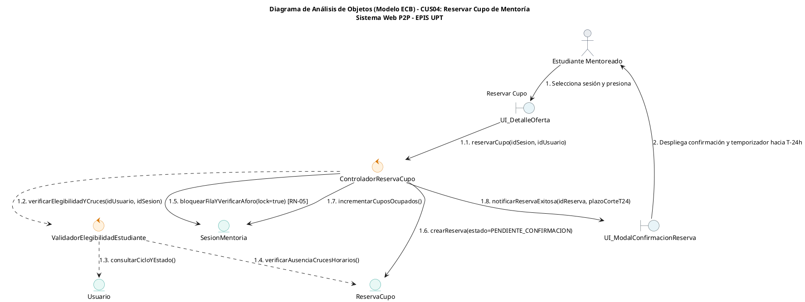

Fuente: Elaboración propia.

El análisis ECB de CUS04 demuestra la estricta separación de responsabilidades en la reserva concurrente. La interfaz `UI_DetalleOferta` no efectúa cálculos de aforo ni altera directamente los registros; delega en `ControladorReservaCupo`, el cual coordina con `ValidadorElegibilidadEstudiante` la comprobación del ciclo formativo y la prevención de reservas duplicadas o solapadas. La operación sobre `SesionMentoria` se ejecuta bajo un bloqueo a nivel de fila que previene la sobreventa de cupos frente a peticiones simultáneas, instanciando la entidad `ReservaCupo` en estado `PENDIENTE_CONFIRMACION` para su posterior ratificación en CUS24.

#### Diagrama 6.13.3: Análisis de Objetos (Modelo ECB) - CUS24: Confirmar Asistencia a Mentoría

El análisis de objetos para el caso de uso `CUS24` modela los componentes arquitectónicos encargados de procesar la ratificación anticipada y obligatoria de asistencia estudiantil. Se identifican las fronteras de usuario y adaptadores de notificación (`UI_MisReservas`, `UI_VisorTicketQR`, `AdaptadorEmailSMTP`); los componentes de control especializados en validar la ventana temporal perentoria de 24 horas (`ControladorConfirmacionAsistencia`) y en la emisión criptográfica de credenciales (`GeneradorTicketQR`); y las entidades del dominio `Usuario`, `SesionMentoria`, `ReservaCupo` y `TicketAsistencia` que consolidan la confirmación formal del quórum.

```plantuml
@startuml
title Diagrama de Análisis de Objetos (Modelo ECB) - CUS24: Confirmar Asistencia a Mentoría\nSistema Web P2P - EPIS UPT

skinparam shadowing false
skinparam roundcorner 8
skinparam defaultFontName Arial
skinparam fontSize 11

skinparam actor {
    BackgroundColor #E9ECEF
    BorderColor #1D2D44
}
skinparam boundary {
    BackgroundColor #E8F4F8
    BorderColor #2B3A42
}
skinparam control {
    BackgroundColor #FFF2DF
    BorderColor #D97706
}
skinparam entity {
    BackgroundColor #E8F8F5
    BorderColor #0D9488
}

actor "Estudiante Mentoreado" as ActMentee
actor "Servicio SMTP / UPT" as ActSMTP <<Sistema Externo>>

boundary "UI_MisReservas" as B_MisReservas
boundary "UI_VisorTicketQR" as B_TicketVisor
boundary "AdaptadorEmailSMTP" as B_SMTP

control "ControladorConfirmacionAsistencia" as C_Confirm
control "GeneradorTicketQR" as C_QR

entity "Usuario" as E_User
entity "SesionMentoria" as E_Sesion
entity "ReservaCupo" as E_Reserva
entity "TicketAsistencia" as E_Ticket

ActMentee --> B_MisReservas : 1. Selecciona reserva y pulsa "Confirmar Asistencia"
B_MisReservas --> C_Confirm : 1.1. ratificarAsistencia(idReserva, idUsuario)

C_Confirm ..> E_Reserva : 1.2. consultarEstadoYFechas()
C_Confirm ..> E_Sesion : 1.3. validarVentanaCorteT24h() [RN-08]

alt Plazo vigente (T >= 24h)
    C_Confirm --> E_Reserva : 1.4. actualizarEstado(CONFIRMADA)
    C_Confirm --> C_QR : 1.5. generarTicketDigitalQR(idReserva)
    C_QR --> E_Ticket : 1.6. crearTicket(tokenHash, qrBase64)
    C_Confirm ..> B_SMTP : 1.7. despacharTicketEmail(correo, ticket)
    B_SMTP --> ActSMTP : 1.8. remitirTicketAdjunto()
    C_Confirm --> B_TicketVisor : 1.9. desplegarAccesoDefinitivo(aulaOEnlace, ticket)
    B_TicketVisor --> ActMentee : 2. Muestra ticket QR y datos de acceso
else Plazo cerrado (T < 24h)
    C_Confirm --> B_MisReservas : 1.10. notificarPlazoVencido(E01)
    B_MisReservas --> ActMentee : 3. Alerta de revocación reglamentaria
end
@enduml
```

Fuente: Elaboración propia.

El modelo ECB evidencia que la lógica temporal de ratificación recae en `ControladorConfirmacionAsistencia`, el cual valida que la petición ocurra con una antelación mínima de 24 horas ($T \ge 24\text{ h}$, conforme a RN-08). Al verificarse la condición, la entidad `ReservaCupo` transiciona al estado definitivo `CONFIRMADA`, desencadenando la creación asíncrona del objeto `TicketAsistencia` mediante `GeneradorTicketQR` y liberando la información de infraestructura (aula física en la EPIS o sala virtual de teleconferencia).

---

#### Diagrama 6.13.4: Análisis de Objetos (Modelo ECB) - CUS23: Ejecutar Alertas y Evaluación Automática de Quórum en T-24h

```plantuml
@startuml
title Diagrama de Análisis de Objetos (Modelo ECB) - CUS23: Ejecutar Alertas y Evaluación Automática de Quórum en T-24h\nSistema Web P2P - EPIS UPT

skinparam shadowing false
skinparam roundcorner 8
skinparam defaultFontName Arial
skinparam fontSize 11

skinparam actor {
    BackgroundColor #E9ECEF
    BorderColor #1D2D44
}
skinparam boundary {
    BackgroundColor #E8F4F8
    BorderColor #2B3A42
}
skinparam control {
    BackgroundColor #FFF2DF
    BorderColor #D97706
}
skinparam entity {
    BackgroundColor #E8F8F5
    BorderColor #0D9488
}

actor "Demonio Cron / Planificador" as ActCron <<Servicio del Sistema>>
actor "Servicio SMTP / UPT" as ActSMTP <<Sistema Externo>>

boundary "DemonioEvaluadorQuorum" as B_Worker
boundary "AdaptadorEmailSMTP" as B_SMTP

control "ControladorEvaluacionQuorum" as C_Quorum

entity "SesionMentoria" as E_Sesion
entity "ReservaCupo" as E_Reserva
entity "Usuario" as E_Usuario

ActCron --> B_Worker : 1. Disparo periódico programado (cada 15 min)
B_Worker --> C_Quorum : 1.1. ejecutarCorteQuorumT24()

C_Quorum ..> E_Sesion : 1.2. consultarSesionesEnVentanaCorte(PUBLICADA, T <= 24h)

loop Por cada sesión detectada en T-24h
    C_Quorum --> E_Reserva : 1.3. revocarReservasNoConfirmadas(idSesion) [RN-08]
    note right: PENDIENTE_CONFIRMACION\n-> NO_CONFIRMADA
    
    C_Quorum ..> E_Reserva : 1.4. contarReservasConfirmadas(idSesion)
    C_Quorum ..> E_Sesion : 1.5. verificarAforoMaximo(idSesion)
    
    alt Quórum alcanzado (Confirmadas >= 50% Aforo) [RN-09]
        C_Quorum --> E_Sesion : 1.6. actualizarEstado(CONFIRMADA)
        C_Quorum ..> B_SMTP : 1.7. despacharNotificacionSesionConfirmada(idSesion)
        B_SMTP --> ActSMTP : 1.8. remitirRecordatorioDefinitivo(Mentor y Mentees)
    else Quórum insuficiente (Confirmadas < 50% Aforo) [RN-09]
        C_Quorum --> E_Sesion : 1.9. actualizarEstado(QUORUM_INSUFICIENTE)
        C_Quorum ..> B_SMTP : 1.10. despacharAlertaQuorumInsuficiente(idSesion)
        B_SMTP --> ActSMTP : 1.11. remitirAlertaUrgente(Mentor para CUS07)
    end
end
@enduml
```

Fuente: Elaboración propia.

El análisis de objetos para CUS23 demuestra el desacoplamiento entre el temporizador desatendido del sistema y la lógica de negocio del corte de quórum. La entidad `ReservaCupo` sufre una revocación masiva automática de aquellas plazas que permanecieron en `PENDIENTE_CONFIRMACION`, mutando a `NO_CONFIRMADA` sin penalización conforme a RN-08 y RN-10. En función del cómputo estricto del umbral del 50% estipulado en RN-09, `ControladorEvaluacionQuorum` transiciona la entidad `SesionMentoria` hacia `CONFIRMADA` o `QUORUM_INSUFICIENTE`, delegando en `AdaptadorEmailSMTP` las comunicaciones oficiales inmediatas hacia los estudiantes y el mentor académico.

---

#### Diagrama 6.13.5: Análisis de Objetos (Modelo ECB) - CUS07: Gestionar Sesión ante Quórum Insuficiente

```plantuml
@startuml
title Diagrama de Análisis de Objetos (Modelo ECB) - CUS07: Gestionar Sesión ante Quórum Insuficiente\nSistema Web P2P - EPIS UPT

skinparam shadowing false
skinparam roundcorner 8
skinparam defaultFontName Arial
skinparam fontSize 11

skinparam actor {
    BackgroundColor #E9ECEF
    BorderColor #1D2D44
}
skinparam boundary {
    BackgroundColor #E8F4F8
    BorderColor #2B3A42
}
skinparam control {
    BackgroundColor #FFF2DF
    BorderColor #D97706
}
skinparam entity {
    BackgroundColor #E8F8F5
    BorderColor #0D9488
}

actor "Estudiante Mentor" as ActMentor
actor "Servicio SMTP / UPT" as ActSMTP <<Sistema Externo>>

boundary "UI_GestionQuorum" as B_UI
boundary "AdaptadorEmailSMTP" as B_SMTP
boundary "AdaptadorReservaAulas" as B_Aulas

control "ControladorResolucionQuorum" as C_Res

entity "SesionMentoria" as E_Sesion
entity "ReservaCupo" as E_Reserva
entity "EspacioFisico" as E_Aula
entity "RegistroAuditoria" as E_Audit

ActMentor --> B_UI : 1. Visualiza alerta y opciones de resolución
B_UI --> C_Res : 1.1. resolverSesionQuorum(idSesion, idMentor, decision)

C_Res ..> E_Sesion : 1.2. verificarEstado(QUORUM_INSUFICIENTE)

alt Decisión: Dictado Excepcional (RN-09)
    C_Res --> E_Sesion : 1.3. actualizarEstado(CONFIRMADA_EXCEPCIONAL)
    C_Res ..> B_SMTP : 1.4. despacharAvisoDictadoExcepcional(idSesion)
    B_SMTP --> ActSMTP : 1.5. remitirConfirmacion(Mentees Confirmados)
    C_Res --> B_UI : 1.6. notificarExito("Sesión confirmada excepcionalmente")
    B_UI --> ActMentor : 2. Despliega confirmación de dictado
else Decisión: Cancelación por Falta de Quórum (RN-10)
    C_Res --> E_Sesion : 1.7. actualizarEstado(CANCELADA_QUORUM)
    C_Res --> E_Reserva : 1.8. cancelarReservasConfirmadas(CANCELADA_SISTEMA)
    C_Res ..> B_Aulas : 1.9. desasignarAulaFisica(idAula, horario)
    B_Aulas --> E_Aula : 1.10. marcarDisponible()
    C_Res --> E_Audit : 1.11. registrarCancelacionSinPenalizacion(RN-10)
    C_Res ..> B_SMTP : 1.12. despacharAvisoCancelacionQuorum(idSesion)
    B_SMTP --> ActSMTP : 1.13. remitirAvisoCancelacion(Mentor y Mentees)
    C_Res --> B_UI : 1.14. notificarExito("Sesión cancelada sin penalización")
    B_UI --> ActMentor : 3. Despliega constancia de cancelación formal
end
@enduml
```

Fuente: Elaboración propia.

El análisis ECB para CUS07 expone el mecanismo de resolución ante el quórum insuficiente. `ControladorResolucionQuorum` valida que la sesión se encuentre legítimamente en estado `QUORUM_INSUFICIENTE` antes de aplicar la decisión del mentor. Si el mentor opta por asumir la sesión, `SesionMentoria` muta a `CONFIRMADA_EXCEPCIONAL`, preservando las reservas confirmadas y el aula asignada. Si decide la cancelación, la entidad muta a `CANCELADA_QUORUM`, forzando la liberación atómica de ambientes físicos o salas virtuales mediante `AdaptadorReservaAulas`, transicionando las reservas a `CANCELADA_SISTEMA` y registrando en `RegistroAuditoria` la exención estricta de penalidad según RN-10.

---

#### Diagrama 6.13.6: Análisis de Objetos (Modelo ECB) - CUS09: Publicar Oferta de Mentoría Individual o Grupal

```plantuml
@startuml
title Diagrama de Análisis de Objetos (Modelo ECB) - CUS09: Publicar Oferta de Mentoría Individual o Grupal\nSistema Web P2P - EPIS UPT

skinparam shadowing false
skinparam roundcorner 8
skinparam defaultFontName Arial
skinparam fontSize 11

skinparam actor {
    BackgroundColor #E9ECEF
    BorderColor #1D2D44
}
skinparam boundary {
    BackgroundColor #E8F4F8
    BorderColor #2B3A42
}
skinparam control {
    BackgroundColor #FFF2DF
    BorderColor #D97706
}
skinparam entity {
    BackgroundColor #E8F8F5
    BorderColor #0D9488
}

actor "Estudiante Mentor" as ActMentor
actor "Servicio Google Meet" as ActMeet <<Sistema Externo>>

boundary "UI_PublicacionOferta" as B_UI
boundary "AdaptadorHorariosEPIS" as B_Horarios
boundary "AdaptadorMeetVirtual" as B_Meet

control "ControladorPublicacionMentoria" as C_Pub

entity "Usuario" as E_Mentor
entity "Asignatura" as E_Asignatura
entity "SesionMentoria" as E_Sesion
entity "EspacioFisico" as E_Aula

ActMentor --> B_UI : 1. Completa formulario de publicación (título, curso, fecha, modalidad, aforo)
B_UI --> C_Pub : 1.1. publicarSesion(datosOferta, idMentor)

C_Pub ..> E_Mentor : 1.2. validarElegibilidadMentor(idMentor) [RN-01]
C_Pub ..> E_Sesion : 1.3. validarAnticipacionMinima(fechaHora) [RN-04 >= 48h]
C_Pub ..> E_Sesion : 1.4. validarAforoMaximo(modalidad, aforo) [RN-05]

alt Modalidad Presencial
    C_Pub ..> B_Horarios : 1.5. verificarDisponibilidadAula(fechaHora, duracion)
    B_Horarios ..> E_Aula : 1.6. reservarAmbienteFisico()
    C_Pub --> E_Sesion : 1.7. crearSesion(aulaAsignada, PUBLICADA)
else Modalidad Virtual
    C_Pub ..> B_Meet : 1.8. solicitarEnlaceReunion(titulo, fechaHora)
    B_Meet --> ActMeet : 1.9. generarSalaVirtualAPI()
    ActMeet --> B_Meet : 1.10. enlaceGenerado (meet.google.com/...)
    B_Meet --> C_Pub : 1.11. urlSalaVirtual
    C_Pub --> E_Sesion : 1.12. crearSesion(enlaceVirtual, PUBLICADA)
end

C_Pub --> B_UI : 1.13. confirmarPublicacionExitosa(idSesion)
B_UI --> ActMentor : 2. Notifica publicación activa en el catálogo P2P
@enduml
```

Fuente: Elaboración propia.

El análisis ECB para CUS09 garantiza la integridad operativa de las sesiones desde su origen. `ControladorPublicacionMentoria` intercepta la creación y corrobora de forma estricta las precondiciones normativas: verifica que el estudiante posea el rol de mentor habilitado sin sanciones (RN-01), que la sesión se programe con al menos 48 horas de anticipación reglamentaria (RN-04) y que el aforo respete los topes máximos de 10 alumnos en presencial y 20 en virtual (RN-05). Asimismo, interactúa de forma polimórfica con los adaptadores de infraestructura para reservar físicamente un aula en los pabellones de la EPIS o autogenerar la sala virtual en Google Meet, instanciando la entidad `SesionMentoria` directamente en estado `PUBLICADA`.

---

#### Diagrama 6.13.7: Análisis de Objetos (Modelo ECB) - CUS14: Consultar Agenda y Horarios de Mentorías

```plantuml
@startuml
title Diagrama de Análisis de Objetos (Modelo ECB) - CUS14: Consultar Agenda y Horarios de Mentorías\nSistema Web P2P - EPIS UPT

skinparam shadowing false
skinparam roundcorner 8
skinparam defaultFontName Arial
skinparam fontSize 11

skinparam actor {
    BackgroundColor #E9ECEF
    BorderColor #1D2D44
}
skinparam boundary {
    BackgroundColor #E8F4F8
    BorderColor #2B3A42
}
skinparam control {
    BackgroundColor #FFF2DF
    BorderColor #D97706
}
skinparam entity {
    BackgroundColor #E8F8F5
    BorderColor #0D9488
}

actor "Estudiante / Mentor" as ActUser

boundary "UI_AgendaCalendario" as B_Calendario
boundary "UI_PanelFiltros" as B_Filtros
boundary "CacheAgendaInMemory" as B_Cache

control "ControladorConsultaAgenda" as C_Agenda

entity "SesionMentoria" as E_Sesion
entity "Asignatura" as E_Asignatura
entity "Usuario" as E_Docente
entity "ReservaCupo" as E_Reserva

ActUser --> B_Filtros : 1. Selecciona parámetros (mes, asignatura, modalidad)
B_Filtros --> B_Calendario : 1.1. dispararBusqueda(criteriosFiltro)
B_Calendario --> C_Agenda : 1.2. obtenerAgendaEventos(filtros, idUsuarioAutenticado)

C_Agenda ..> B_Cache : 1.3. consultarClaveCache(hashFiltros)

alt Caché disponible (Hit)
    B_Cache --> C_Agenda : 1.4. coleccionEventosSerializados
else Caché ausente o invalidada (Miss)
    C_Agenda ..> E_Sesion : 1.5. buscarSesionesPorRangoTemporal(fechaInicio, fechaFin)
    C_Agenda ..> E_Asignatura : 1.6. asociarMetadatosCurso()
    C_Agenda ..> E_Docente : 1.7. obtenerPerfilMentor()
    C_Agenda ..> E_Reserva : 1.8. verificarInscripcionUsuario(idUsuarioAutenticado)
    C_Agenda ..> B_Cache : 1.9. almacenarEnCache(hashFiltros, resultado, ttl=300s)
end

C_Agenda --> B_Calendario : 1.10. consolidarMatrizCalendario(eventosConCupos)
B_Calendario --> ActUser : 2. Renderiza calendario con distintivos de aforo y estado
@enduml
```

Fuente: Elaboración propia.

El análisis ECB para CUS14 demuestra el diseño optimizado para consultas de alta concurrencia (RNF01). `ControladorConsultaAgenda` orquesta la consulta de sesiones aplicando filtros dinámicos y coordinando con `CacheAgendaInMemory` (Redis) para amortiguar la carga transaccional de lectura. Al recuperar las instancias de `SesionMentoria`, el controlador consulta a `ReservaCupo` para determinar de forma reactiva si el usuario en sesión ya cuenta con una reserva activa o si existen cupos libres (`aforo_maximo - cupos_ocupados`), entregando a `UI_AgendaCalendario` un conjunto de datos consolidado para su renderizado mensual o semanal.

---

#### Diagrama 6.13.8: Análisis de Objetos (Modelo ECB) - CUS11: Registrar Asistencia Mediante Código QR

```plantuml
@startuml
title Diagrama de Análisis de Objetos (Modelo ECB) - CUS11: Registrar Asistencia Mediante Código QR\nSistema Web P2P - EPIS UPT

skinparam shadowing false
skinparam roundcorner 8
skinparam defaultFontName Arial
skinparam fontSize 11

skinparam actor {
    BackgroundColor #E9ECEF
    BorderColor #1D2D44
}
skinparam boundary {
    BackgroundColor #E8F4F8
    BorderColor #2B3A42
}
skinparam control {
    BackgroundColor #FFF2DF
    BorderColor #D97706
}
skinparam entity {
    BackgroundColor #E8F8F5
    BorderColor #0D9488
}

actor "Estudiante Mentor" as ActMentor
actor "Estudiante Mentoreado" as ActMentee

boundary "UI_VisorTicketQR" as B_TicketUI
boundary "UI_EscanerQR" as B_ScannerUI

control "ControladorRegistroAsistencia" as C_Asist
control "ValidadorTokenQR" as C_Token

entity "TicketAsistencia" as E_Ticket
entity "SesionMentoria" as E_Sesion
entity "ReservaCupo" as E_Reserva
entity "RegistroAsistencia" as E_RegAsist

ActMentee --> B_TicketUI : 1. Exhibe ticket digital con código QR
ActMentor --> B_ScannerUI : 2. Enfoca cámara y captura imagen QR
B_ScannerUI --> C_Asist : 2.1. procesarLecturaQR(payloadEscaneado, idSesion)

C_Asist --> C_Token : 2.2. decodificarYVerificarFirma(tokenHash)
C_Token ..> E_Ticket : 2.3. consultarValidezCriptografica()

alt Token QR inválido o firma alterada (E01)
    C_Asist --> B_ScannerUI : 2.4. notificarErrorLectura("Firma digital inválida o adulterada")
    B_ScannerUI --> ActMentor : 3. Alerta de ticket fraudulento
else Token válido
    C_Asist ..> E_Sesion : 2.5. validarVentanaTolerancia(ahora) [RN-11: -15m a +30m]
    C_Asist ..> E_Reserva : 2.6. consultarEstadoReserva(idReserva)
    
    alt Reserva en estado CONFIRMADA y no registrada
        C_Asist --> E_Reserva : 2.7. mutarEstado(ASISTIDA)
        C_Asist --> E_RegAsist : 2.8. crearRegistro(idReserva, idSesion, timestamp, 'VALIDACION_QR')
        C_Asist --> B_ScannerUI : 2.9. confirmarAsistenciaExitosa(nombreEstudiante, codigo)
        B_ScannerUI --> ActMentor : 4. Feedback visual verde y sonido de confirmación
    else Reserva ya registrada o estado no apto (E02)
        C_Asist --> B_ScannerUI : 2.10. notificarRechazo("Ticket ya utilizado o reserva no ratificada")
        B_ScannerUI --> ActMentor : 5. Alerta de registro duplicado / no confirmado
    end
end
@enduml
```

Fuente: Elaboración propia.

El análisis ECB para CUS11 delimita la verificación criptográfica desacoplada de la cámara. `ControladorRegistroAsistencia` delega en `ValidadorTokenQR` la comprobación del hash SHA-256 para prevenir suplantaciones. Posteriormente, interactúa con `SesionMentoria` para comprobar que la lectura ocurra dentro de la ventana de tolerancia oficial fijada en RN-11 (desde 15 minutos antes hasta 30 minutos después del inicio). Superada la verificación, la entidad `ReservaCupo` transiciona irrevocablemente a `ASISTIDA` y se instancia el objeto `RegistroAsistencia`, proporcionando retroalimentación visual en menos de 1 segundo al mentor (RNF02).

#### Diagrama 6.13.9: Análisis de Objetos (Modelo ECB) - CUS10: Registrar Bitácora Pedagógica de Sesión

El análisis de objetos modela la estructura conceptual y la interacción colaborativa entre las interfaces de captura docente, las clases de control de negocio y las entidades de persistencia pedagógica durante el cierre formal de una sesión de mentoría. Se explicitan el actor *Estudiante Mentor*, el límite *UI Formulario Bitácora*, los controladores *Controlador de Bitácora Pedagógica*, *Validador de Plazo (RN-07)*, *Sincronizador de Asistencia (RN-11)* y *Calculador de Horas Formativas (RN-12)*, así como las entidades *SesionMentoria*, *BitacoraSesion*, *ReservaCupo*, *BolsaHorasMentor* y *RegistroAuditoria*.

```plantuml
@startuml
title Análisis de Objetos (Modelo ECB) - CUS10: Registrar Bitácora Pedagógica de Sesión\nSistema Web P2P - EPIS UPT

skinparam shadowing false
skinparam roundcorner 8
skinparam defaultFontName Arial
skinparam fontSize 10

skinparam actor {
    BackgroundColor #F8F9FA
    BorderColor #2B3A42
}
skinparam boundary {
    BackgroundColor #E8F4F8
    BorderColor #2B3A42
}
skinparam control {
    BackgroundColor #FFF2DF
    BorderColor #D97706
}
skinparam entity {
    BackgroundColor #E8F8F5
    BorderColor #10B981
}

actor "Estudiante Mentor" as ActMentor
boundary "UI Formulario Bitácora\n(SPA React)" as B_BitacoraUI
control "Controlador de\nBitácora Pedagógica" as C_Bitacora
control "Validador de Plazo\n(Ventana 24h RN-07)" as C_Plazo
control "Sincronizador de\nAsistencia (RN-11)" as C_Asist
control "Calculador de Horas\nFormativas (RN-12)" as C_Horas
entity "SesionMentoria" as E_Sesion
entity "BitacoraSesion" as E_Bitacora
entity "ReservaCupo" as E_Reserva
entity "BolsaHorasMentor" as E_Bolsa
entity "RegistroAuditoria" as E_Audit

ActMentor --> B_BitacoraUI : 1. Solicita formulario de cierre de sesión
B_BitacoraUI --> C_Bitacora : 1.1. cargarContextoSesion(idSesion)
C_Bitacora ..> E_Sesion : 1.2. consultarEstadoYHorarios(idSesion)
C_Bitacora ..> E_Reserva : 1.3. listarAsistentesConfirmados(idSesion)
C_Bitacora --> B_BitacoraUI : 1.4. retornarDatosSesionYAlumnos()
B_BitacoraUI --> ActMentor : 2. Despliega lista de alumnos y campos estructurados

ActMentor --> B_BitacoraUI : 3. Completa temas (>=30 caracteres), dificultades, acuerdos y envía
B_BitacoraUI --> C_Bitacora : 3.1. registrarBitacora(dtoBitacora)

C_Bitacora --> C_Plazo : 3.2. verificarPlazoVigente(fechaFin, ahora) [RN-07: <= 24 horas]

alt Plazo extemporáneo (> 24 horas tras fin de sesión)
    C_Plazo --> C_Bitacora : 3.3. plazoVencidoError()
    C_Bitacora --> B_BitacoraUI : 3.4. notificarPlazoVencido("Plazo de 24h expirado. Requiere regularización")
    B_BitacoraUI --> ActMentor : 4. Alerta de bloqueo por extemporaneidad
else Plazo conforme (dentro de las 24 horas)
    C_Bitacora --> C_Asist : 3.5. regularizarInasistencias(idSesion) [RN-11]
    C_Asist --> E_Reserva : 3.6. mutarNoMarcados(INASISTENCIA)
    
    C_Bitacora --> E_Bitacora : 3.7. crear(idSesion, temas, dificultades, observaciones, 'REGISTRADA')
    C_Bitacora --> E_Sesion : 3.8. mutarEstado(FINALIZADA)
    
    C_Bitacora --> C_Horas : 3.9. acumularHorasDictadas(idMentor, horas) [RN-12]
    C_Horas --> E_Bolsa : 3.10. incrementarHorasPendientesVisado(horas)
    
    C_Bitacora --> E_Audit : 3.11. registrarEventoAuditoria('REGISTRO_BITACORA', idSesion)
    C_Bitacora --> B_BitacoraUI : 3.12. confirmarRegistroExitoso()
    B_BitacoraUI --> ActMentor : 5. Notificación de cierre formal y horas acumuladas
end
@enduml
```

Fuente: Elaboración propia.

El análisis de objetos para CUS10 delimita la orquestación del cierre formativo y administrativo de cada sesión. `ControladorBitacora` interactúa primeramente con `ValidadorPlazo` para garantizar la observancia de la regla RN-07, impidiendo la captura desfasada de información pedagógica si han transcurrido más de 24 horas desde la culminación del evento. La clase de control `SincronizadorAsistencia` ejecuta la transición de las reservas pendientes hacia el estado canónico `INASISTENCIA` conforme a RN-11, mientras que `CalculadorHoras` computa las horas efectivas dictadas y actualiza la entidad `BolsaHorasMentor` en concordancia estricta con RN-12, dejando la sesión en estado `FINALIZADA` e inmutable ante ulteriores ediciones.

#### Diagrama 6.13.10: Análisis de Objetos (Modelo ECB) - CUS05: Responder Encuesta de Calidad Post-Mentoría

El análisis de objetos modela los componentes lógicos participantes en la captura de la retroalimentación formativa y en la gobernanza de la reputación académica. Se representan el actor *Estudiante Mentoreado*, la frontera *UI Encuesta Calidad*, los controladores de negocio *Controlador de Encuestas de Calidad*, *Validador de Elegibilidad y Plazo*, *Motor de Anonimización (Ley N° 29733)* y *Calculador de Reputación (RN-13)*, junto a las entidades *ReservaCupo*, *SesionMentoria*, *BitacoraSesion*, *EncuestaSatisfaccion*, *ReputacionMentor* y *RegistroAuditoria*.

```plantuml
@startuml
title Análisis de Objetos (Modelo ECB) - CUS05: Responder Encuesta de Calidad Post-Mentoría\nSistema Web P2P - EPIS UPT

skinparam shadowing false
skinparam roundcorner 8
skinparam defaultFontName Arial
skinparam fontSize 10

skinparam actor {
    BackgroundColor #F8F9FA
    BorderColor #2B3A42
}
skinparam boundary {
    BackgroundColor #E8F4F8
    BorderColor #2B3A42
}
skinparam control {
    BackgroundColor #FFF2DF
    BorderColor #D97706
}
skinparam entity {
    BackgroundColor #E8F8F5
    BorderColor #10B981
}

actor "Estudiante Mentoreado" as ActMentee
boundary "UI Encuesta Calidad\n(SPA React)" as B_EncuestaUI
control "Controlador de\nEncuestas de Calidad" as C_Encuesta
control "Validador de Elegibilidad\ny Plazo (Ventana 24h)" as C_Validador
control "Motor de Anonimización\n(Ley N° 29733)" as C_Anon
control "Calculador de Reputación\n(Media Ponderada RN-13)" as C_Reputacion
entity "ReservaCupo" as E_Reserva
entity "SesionMentoria" as E_Sesion
entity "BitacoraSesion" as E_Bitacora
entity "EncuestaSatisfaccion" as E_Encuesta
entity "ReputacionMentor" as E_Reputacion
entity "RegistroAuditoria" as E_Audit

ActMentee --> B_EncuestaUI : 1. Accede a encuesta de sesión asistida
B_EncuestaUI --> C_Encuesta : 1.1. cargarFormularioEncuesta(idSesion, idUsuario)
C_Encuesta --> C_Validador : 1.2. validarAptitudEvaluacion(idSesion, idUsuario)
C_Validador ..> E_Reserva : 1.3. verificarEstado(ASISTIDA) y flag(no_evaluada)
C_Validador ..> E_Bitacora : 1.4. consultarFechaCierreBitacora()

alt Reserva no asistida o ya evaluada (E02)
    C_Validador --> C_Encuesta : 1.5. denegarAcceso("Solo asistentes confirmados pueden evaluar")
    C_Encuesta --> B_EncuestaUI : 1.6. notificarInadmisibilidad()
    B_EncuestaUI --> ActMentee : 2. Mensaje de error de acceso
else Plazo de 24 horas expirado (E01)
    C_Validador --> C_Encuesta : 1.7. denegarAcceso("Ventana de 24h vencida")
    C_Encuesta --> B_EncuestaUI : 1.8. notificarExpiracion()
    B_EncuestaUI --> ActMentee : 2. Mensaje de encuesta caducada
else Elegible y dentro de plazo legal
    C_Encuesta --> B_EncuestaUI : 1.9. renderizarReactivosLikert(contextoSesion)
    B_EncuestaUI --> ActMentee : 3. Despliega 4 reactivos (1-5 estrellas) y caja de comentarios

    ActMentee --> B_EncuestaUI : 4. Califica dimensiones, ingresa sugerencia opcional y envía
    B_EncuestaUI --> C_Encuesta : 4.1. registrarEvaluacion(dtoEncuesta)
    
    C_Encuesta --> C_Anon : 4.2. disociarIdentidadEstudiante(idUsuario, comentario)
    C_Anon --> E_Encuesta : 4.3. instanciarEncuesta(idSesion, scoresLikert, hashAnonimo, comentarioFiltrado)
    
    C_Encuesta --> E_Reserva : 4.4. marcarEncuestaCompletada(idReserva)
    
    C_Encuesta --> C_Reputacion : 4.5. recalcularScoreMentor(idMentor, scoresLikert) [RN-13]
    C_Reputacion --> E_Reputacion : 4.6. actualizarMediaPonderadaYTotal()
    
    C_Encuesta --> E_Audit : 4.7. registrarEventoAuditoria('ENCUESTA_REGISTRADA', idSesion)
    C_Encuesta --> B_EncuestaUI : 4.8. confirmarRecepcion()
    B_EncuestaUI --> ActMentee : 5. Banner de agradecimiento y confirmación
end
@enduml
```

Fuente: Elaboración propia.

El análisis de objetos para CUS05 formaliza el proceso de evaluación de calidad asegurando el anonimato del mentoreado y la legitimidad de las valoraciones. La clase de control `ValidadorElegibilidad` filtra estrictamente que solo aquellos estudiantes cuya reserva transicionó a `ASISTIDA` y que se encuentren dentro de la ventana de 24 horas posteriores al cierre de bitácora puedan emitir opinión. `MotorAnonimizacion` disocia los datos personales del alumno antes de instanciar `EncuestaSatisfaccion` en cumplimiento de la Ley N° 29733, mientras que `CalculadorReputacion` procesa las cuatro dimensiones Likert actualizando de forma ponderada la entidad `ReputacionMentor` conforme a la regla de negocio RN-13.

#### Diagrama 6.13.11: Análisis de Objetos (Modelo ECB) - CUS19: Consultar Historial de Sesiones y Asistencia

El análisis de objetos modela la estructura lógica orientada a la provisión de información histórica y rendición de cuentas académica para estudiantes y mentores. Se especifican el actor *Usuario Institucional*, las fronteras *UI Tablero Historial* y *Panel Lateral Detalle (Drawer)*, las clases de control *Controlador de Historial Pedagógico*, *Validador de Contexto y RLS* y *Motor de Filtrado y Métricas Agregadas*, en vinculación directa con las entidades de persistencia *SesionMentoria*, *ReservaCupo*, *BitacoraSesion*, *BolsaHorasMentor* y *Asignatura*.

```plantuml
@startuml
title Análisis de Objetos (Modelo ECB) - CUS19: Consultar Historial de Sesiones y Asistencia\nSistema Web P2P - EPIS UPT

skinparam shadowing false
skinparam roundcorner 8
skinparam defaultFontName Arial
skinparam fontSize 10

skinparam actor {
    BackgroundColor #F8F9FA
    BorderColor #2B3A42
}
skinparam boundary {
    BackgroundColor #E8F4F8
    BorderColor #2B3A42
}
skinparam control {
    BackgroundColor #FFF2DF
    BorderColor #D97706
}
skinparam entity {
    BackgroundColor #E8F8F5
    BorderColor #10B981
}

actor "Usuario Institucional\n(Mentor / Mentoreado)" as ActUser
boundary "UI Tablero Historial\n(SPA React)" as B_HistorialUI
boundary "Panel Lateral Detalle\n(Drawer Bitácora)" as B_DrawerUI
control "Controlador de Historial\nPedagógico" as C_Historial
control "Validador de Contexto\ny RLS (Supabase)" as C_RLS
control "Motor de Filtrado y\nMétricas Agregadas" as C_Filtro
entity "SesionMentoria" as E_Sesion
entity "ReservaCupo" as E_Reserva
entity "BitacoraSesion" as E_Bitacora
entity "BolsaHorasMentor" as E_Bolsa
entity "Asignatura" as E_Asignatura

ActUser --> B_HistorialUI : 1. Solicita historial académico consolidado
B_HistorialUI --> C_Historial : 1.1. obtenerHistorialUsuario(filtros, idUsuarioAuth)
C_Historial --> C_RLS : 1.2. verificarAislamientoFilas(idUsuarioAuth)

C_RLS ..> E_Reserva : 1.3. consultarReservasPorUsuario(idUsuarioAuth)
C_RLS ..> E_Sesion : 1.4. consultarSesionesDictadasPorMentor(idUsuarioAuth)
C_Historial ..> E_Asignatura : 1.5. resolverNombresYCodigos()

C_Historial --> C_Filtro : 1.6. procesarMetricasYFiltros(semestre, materia)
C_Filtro --> B_HistorialUI : 1.7. renderizarTablaHistorial(resumenMétricas, listaItems)

alt Historial sin participaciones registradas (E01)
    B_HistorialUI --> ActUser : 2. Despliega estado vacío ("Sin registros de mentoría")
else Historial con eventos encontrados
    B_HistorialUI --> ActUser : 3. Despliega tabla con sesiones, roles, asistencias y métricas
    
    ActUser --> B_HistorialUI : 4. Clic en fila para inspeccionar detalle de bitácora
    B_HistorialUI --> C_Historial : 4.1. obtenerDetalleSesion(idSesion)
    C_Historial ..> E_Bitacora : 4.2. recuperarBitacora(idSesion)
    C_Historial ..> E_Bolsa : 4.3. recuperarHorasAcreditadas(idMentor)
    C_Historial --> B_DrawerUI : 4.4. cargarDetalleBitacoraYRecursos()
    B_DrawerUI --> ActUser : 5. Visualiza temas tratados, acuerdos y recursos compartidos
end
@enduml
```

Fuente: Elaboración propia.

El análisis ECB para CUS19 estructura un acceso seguro y unificado a la trayectoria formativa de los miembros de la comunidad universitaria. `ControladorHistorial` articula con `ValidadorContextoRLS` la aplicación imperativa de directivas de seguridad en la base de datos (PostgreSQL RLS), garantizando que ningún usuario acceda a asistencias de terceros ajenos a su esfera. La clase de control `MotorFiltradoMetricas` agiliza la agregación estadística (tasa de asistencia efectiva y horas dictadas), permitiendo que `UI Tablero Historial` presente un resumen cuantitativo fidedigno y despliegue el contenido temático de la bitácora docente sin fisuras de privacidad.

#### Diagrama 6.13.12: Análisis de Objetos (Modelo ECB) - CUS16: Consultar Tablero de Insignias y Reputación

El análisis de objetos para `CUS16` modela la arquitectura lógica requerida para la cuantificación del prestigio pedagógico y la gamificación formativa en la EPIS-UPT. Se delimitan los actores *Mentor Académico* (beneficiario y consultor principal) y *Mentoreado* (consumidor de la reputación pública), las interfaces *UI Tablero Reputación e Insignias* y *UI Perfil Público Mentor*, los controladores *Controlador de Gamificación*, *Motor de Reputación Ponderada* y *Motor de Reglas de Insignias*, vinculados a las entidades *ReputacionMentor*, *Insignia*, *InsigniaOtorgada*, *EncuestaSatisfaccion*, *BitacoraSesion* y *SesionMentoria*.

```plantuml
@startuml
title Análisis de Objetos (Modelo ECB) - CUS16: Consultar Tablero de Insignias y Reputación\nSistema Web P2P - EPIS UPT

skinparam shadowing false
skinparam roundcorner 8
skinparam defaultFontName Arial
skinparam fontSize 11

skinparam actor {
    BackgroundColor #E9ECEF
    BorderColor #2B3A42
}

skinparam boundary {
    BackgroundColor #E8F4F8
    BorderColor #2B3A42
}

skinparam control {
    BackgroundColor #FFF2DF
    BorderColor #2B3A42
}

skinparam entity {
    BackgroundColor #E8F8F5
    BorderColor #2B3A42
}

actor "Mentor Académico\n(Usuario Autenticado)" as ActMentor
actor "Mentoreado\n(Estudiante Consultor)" as ActEstudiante

boundary "UI Tablero Reputación\ne Insignias (Privado)" as B_TableroUI
boundary "UI Perfil Público\nMentor (Resumido)" as B_PerfilPublicoUI

control "Controlador de\nGamificación y Reputación" as C_Gamificacion
control "Motor de Reputación\nPonderada (RN-13)" as C_MotorReputacion
control "Motor de Reglas\nde Insignias" as C_MotorInsignias

entity "ReputacionMentor" as E_Reputacion
entity "Insignia" as E_Insignia
entity "InsigniaOtorgada" as E_InsigniaOtorgada
entity "EncuestaSatisfaccion" as E_Encuesta
entity "BitacoraSesion" as E_Bitacora
entity "SesionMentoria" as E_Sesion

' Relaciones para flujo privado del Mentor
ActMentor --> B_TableroUI : 1. Accede a "Mi Reputación & Reconocimientos"
B_TableroUI --> C_Gamificacion : 1.1. obtenerTableroMentor(idMentor)
C_Gamificacion --> C_MotorReputacion : 1.2. calcularScoreCompuesto(idMentor)

C_MotorReputacion ..> E_Encuesta : 1.2.1. leerPromediosLikert(idMentor)
C_MotorReputacion ..> E_Sesion : 1.2.2. calcularTasaCumplimiento(idMentor)
C_MotorReputacion ..> E_Bitacora : 1.2.3. calcularPuntualidadEntrega(idMentor)
C_MotorReputacion --> E_Reputacion : 1.2.4. sincronizarReputacion(score, nivel)

C_Gamificacion --> C_MotorInsignias : 1.3. evaluarDesbloqueoInsignias(idMentor)
C_MotorInsignias ..> E_Insignia : 1.3.1. consultarCatalogoVigente()
C_MotorInsignias ..> E_InsigniaOtorgada : 1.3.2. consultarInsigniasPoseidas(idMentor)
C_MotorInsignias --> E_InsigniaOtorgada : 1.3.3. registrarNuevaInsignia(idMentor, idInsignia)

C_Gamificacion --> B_TableroUI : 1.4. consolidarTableroCompleto(score, insignias, progreso, comentarios)
B_TableroUI --> ActMentor : 2. Despliega velocímetro, badges, barras de progreso y comentarios

' Relaciones para flujo público de consulta por Mentoreado
ActEstudiante --> B_PerfilPublicoUI : 3. Visualiza perfil del mentor al reservar
B_PerfilPublicoUI --> C_Gamificacion : 3.1. obtenerResumenPublico(idMentor)
C_Gamificacion ..> E_Reputacion : 3.2. leerScoreYNivelPublico(idMentor)
C_Gamificacion ..> E_InsigniaOtorgada : 3.3. leerInsigniasPublicas(idMentor)
C_Gamificacion --> B_PerfilPublicoUI : 3.4. entregarResumenSanitizado()
B_PerfilPublicoUI --> ActEstudiante : 4. Presenta estrellas, nivel y medallas destacadas
@enduml
```

Fuente: Elaboración propia.

El análisis de objetos para CUS16 implementa una arquitectura modular que separa el cómputo analítico privado de la proyección pública de reputación. `ControladorGamificacion` articula dos motores especializados: `MotorReputacionPonderada`, que sintetiza la ecuación estipulada en la regla de negocio RN-13 ($70\%$ de satisfacción en encuestas, $20\%$ de cumplimiento de sesiones convocadas y $10\%$ de puntualidad en bitácoras $\le 24\text{ h}$), y `MotorReglasInsignias`, encargado de auditar de forma determinística los umbrales de desbloqueo normativos. Las entidades persistentes salvaguardan la trazabilidad histórica de los reconocimientos, garantizando que la interfaz renderice proyecciones lúdicas de alto rendimiento sin comprometer la privacidad docente ni los datos sensibles de los estudiantes evaluadores.

#### Diagrama 6.13.13: Análisis de Objetos (Modelo ECB) - CUS13: Parametrizar y Emitir Certificados

El análisis de objetos para `CUS13` formaliza la arquitectura lógica del proceso de acreditación académica y fe pública digital en la EPIS-UPT. Modela la interacción entre el actor *Administrador Institucional*, las fronteras *UI Parametrización y Emisión de Certificados* y *UI Modal Confirmación Batch*, las clases de control *Controlador de Certificación*, *Motor de Elegibilidad Normativa (RN-14)*, *Generador Criptográfico PDF/A y QR* y *Servicio de Notificación SMTP*, en relación con las entidades *ParametroCertificacion*, *Certificado*, *BitacoraSesion*, *BolsaHorasMentor* y *Usuario*.

```plantuml
@startuml
title Análisis de Objetos (Modelo ECB) - CUS13: Parametrizar y Emitir Certificados\nSistema Web P2P - EPIS UPT

skinparam shadowing false
skinparam roundcorner 8
skinparam defaultFontName Arial
skinparam fontSize 11

skinparam actor {
    BackgroundColor #E9ECEF
    BorderColor #2B3A42
}

skinparam boundary {
    BackgroundColor #E8F4F8
    BorderColor #2B3A42
}

skinparam control {
    BackgroundColor #FFF2DF
    BorderColor #2B3A42
}

skinparam entity {
    BackgroundColor #E8F8F5
    BorderColor #2B3A42
}

actor "Administrador Institucional\n(Comité de Tutoría / Dirección)" as ActAdmin

boundary "UI Parametrización y\nEmisión de Certificados" as B_CertUI
boundary "UI Modal Confirmación\nBatch Institucional" as B_ModalUI

control "Controlador de\nCertificación Institucional" as C_Certificacion
control "Motor de Elegibilidad\nNormativa (RN-14)" as C_MotorElegibilidad
control "Generador Criptográfico\nPDF/A y Código QR" as C_GeneradorPDF
control "Servicio de Notificación\nSMTP Institucional" as C_Notificador

entity "ParametroCertificacion" as E_Parametro
entity "Certificado" as E_Certificado
entity "BitacoraSesion" as E_Bitacora
entity "BolsaHorasMentor" as E_Bolsa
entity "Usuario" as E_Usuario

' Flujo de Parametrización y Consulta de Elegibles
ActAdmin --> B_CertUI : 1. Configura umbrales (Semestre, horas mínimas, score mínimo)
B_CertUI --> C_Certificacion : 1.1. registrarParametros(dto)
C_Certificacion --> E_Parametro : 1.2. guardarParametrizacion(semestre, horasMin, scoreMin)

ActAdmin --> B_CertUI : 2. Clic en "Consultar Mentores Elegibles"
B_CertUI --> C_Certificacion : 2.1. obtenerCandidatosCertificacion(idParametro)
C_Certificacion --> C_MotorElegibilidad : 2.2. auditarPadrónMentores(idParametro)

C_MotorElegibilidad ..> E_Bitacora : 2.2.1. verificarHorasVisadas(idMentor, 'VISADA')
C_MotorElegibilidad ..> E_Bolsa : 2.2.2. validarSaldoHoras(idMentor)
C_MotorElegibilidad ..> E_Usuario : 2.2.3. constatarVigenciaAcademica(idMentor)
C_MotorElegibilidad --> C_Certificacion : 2.3. entregarNominaElegibles(candidatos)
C_Certificacion --> B_CertUI : 2.4. renderizarGrillaElegibles(candidatos)
B_CertUI --> ActAdmin : 3. Visualiza padrón con checkboxes de selección

' Flujo de Emisión Batch y Sellado Criptográfico
ActAdmin --> B_CertUI : 4. Selecciona mentores y presiona "Proceder a la Emisión"
B_CertUI --> B_ModalUI : 4.1. abrirModalConfirmacion(totalSeleccionados)
ActAdmin --> B_ModalUI : 5. Confirma emisión institucional definitiva

B_ModalUI --> C_Certificacion : 5.1. ejecutarEmisionLote(listaMentoresIds, idParametro)
loop Para cada mentor aprobado
    C_Certificacion --> C_GeneradorPDF : 5.2. generarDocumentoOficial(idMentor, horas, correlativo)
    C_GeneradorPDF --> C_GeneradorPDF : 5.2.1. calcularHashSHA256(bytesPDF)
    C_GeneradorPDF --> C_GeneradorPDF : 5.2.2. estamparCodigoQRVerificacion(urlPublica)
    C_GeneradorPDF --> E_Certificado : 5.2.3. persistirCertificado(hash, correlativo, 'EMITIDO')
    C_GeneradorPDF --> E_Bolsa : 5.2.4. marcarHorasComoCertificadas(horas)
    
    C_Certificacion --> C_Notificador : 5.3. despacharAvisoCertificado(correoInstitucional, idCertificado)
end

C_Certificacion --> B_CertUI : 6. notificarResultadoBatch(exitosos, errores)
B_CertUI --> ActAdmin : 7. Despliega confirmación final de emisión institucional
@enduml
```

Fuente: Elaboración propia.

El análisis de objetos para CUS13 modela la cadena transaccional y de fe pública requerida para la acreditación oficial de horas de mentoría. `ControladorCertificacion` delega en `MotorElegibilidadNormativa` el filtrado determinístico basado en la regla RN-14 (umbral mínimo de horas en bitácoras visadas y ausencia de observaciones éticas). La clase de control `GeneradorCriptograficoPDFA` ejecuta de forma aislada la conformación del documento PDF/A inalterable, el cómputo del hash SHA-256 y la inyección del código QR para verificación externa. La entidad `Certificado` almacena los metadatos de integridad sin redundancia, garantizando que las constancias emitidas sean legalmente auditables ante la Dirección de Escuela y la Secretaría Académica de la EPIS-UPT.

#### Diagrama 6.13.14: Análisis de Objetos (Modelo ECB) - CUS09: Descargar Certificado de Horas de Mentoría

El análisis de objetos para `CUS09` delimita la estructura de componentes requerida para la visualización, descarga segura y validación abierta de constancias institucionales en la EPIS-UPT. Se modelan los actores *Mentor Académico* y *Tercero Verificador*, las interfaces *UI Mis Certificados Oficiales* y *UI Portal Público de Verificación*, los controladores *Controlador de Descarga y Verificación*, *Validador Criptográfico Hash SHA-256*, *Gestor de Almacenamiento Seguro (Bucket)* y *Servicio de Correo*, en vinculación directa con las entidades *Certificado*, *Usuario* y *RegistroAuditoriaVerificacion*.

```plantuml
@startuml
title Análisis de Objetos (Modelo ECB) - CUS09: Descargar Certificado de Horas de Mentoría\nSistema Web P2P - EPIS UPT

skinparam shadowing false
skinparam roundcorner 8
skinparam defaultFontName Arial
skinparam fontSize 11

skinparam actor {
    BackgroundColor #E9ECEF
    BorderColor #2B3A42
}

skinparam boundary {
    BackgroundColor #E8F4F8
    BorderColor #2B3A42
}

skinparam control {
    BackgroundColor #FFF2DF
    BorderColor #2B3A42
}

skinparam entity {
    BackgroundColor #E8F8F5
    BorderColor #2B3A42
}

actor "Mentor Académico\n(Usuario Autenticado)" as ActMentor
actor "Tercero Verificador\n(Empleador / Secretaría vía QR)" as ActVerificador

boundary "UI Mis Certificados\nOficiales (Privado)" as B_MisCertificadosUI
boundary "UI Portal Público de\nVerificación (Abierto)" as B_PortalPublicoUI

control "Controlador de Descarga\ny Verificación" as C_DescargaVerif
control "Validador Criptográfico\nHash SHA-256" as C_ValidadorHash
control "Gestor de Almacenamiento\nSeguro (Bucket Storage)" as C_Storage
control "Servicio de Correo\nInstitucional (SMTP)" as C_Correo

entity "Certificado" as E_Certificado
entity "Usuario" as E_Usuario
entity "RegistroAuditoriaVerificacion" as E_Auditoria

' Flujo de Consulta y Descarga Privada del Mentor
ActMentor --> B_MisCertificadosUI : 1. Accede a "Mis Certificados"
B_MisCertificadosUI --> C_DescargaVerif : 1.1. listarCertificadosUsuario(idMentor)
C_DescargaVerif ..> E_Certificado : 1.2. buscarPorMentor(idMentor)
C_DescargaVerif --> B_MisCertificadosUI : 1.3. entregarListadoEmitidos(certificados)
B_MisCertificadosUI --> ActMentor : 2. Despliega cards de certificados con previsualización

ActMentor --> B_MisCertificadosUI : 3. Presiona "Descargar Certificado Oficial en PDF"
B_MisCertificadosUI --> C_DescargaVerif : 3.1. solicitarStreamPDF(idCertificado)
C_DescargaVerif ..> E_Certificado : 3.2. obtenerRutaYHash(idCertificado)
C_DescargaVerif --> C_Storage : 3.3. recuperarBinarioPDF(rutaStorage)
C_Storage --> C_ValidadorHash : 3.4. verificarChecksumIntegridad(bytesPDF, hashEsperado)
C_ValidadorHash --> C_DescargaVerif : 3.5. confirmacionIntegridadValida()
C_DescargaVerif --> B_MisCertificadosUI : 3.6. transmitirArchivoAdjunto(stream, headersSeguridad)
B_MisCertificadosUI --> ActMentor : 4. Descarga documento oficial inalterable en el dispositivo

' Flujo Alterno FA01: Verificación Pública por Tercero Verificador
ActVerificador --> B_PortalPublicoUI : 5. Escanea código QR del certificado
B_PortalPublicoUI --> C_DescargaVerif : 5.1. verificarPorHash(hashSha256)
C_DescargaVerif ..> E_Certificado : 5.2. consultarPorHash(hashSha256)
C_DescargaVerif ..> E_Usuario : 5.3. consultarDatosMentor(idMentor)
C_DescargaVerif --> E_Auditoria : 5.4. registrarConsultaVerificacion(ip, fecha, hash)
C_DescargaVerif --> B_PortalPublicoUI : 5.5. presentarFichaValidacion(correlativo, horas, estado, mentor)
B_PortalPublicoUI --> ActVerificador : 6. Visualiza sello verde de autenticidad institucional UPT
@enduml
```

Fuente: Elaboración propia.

El análisis de objetos para CUS09 establece una estricta separación de responsabilidades entre el acceso privado del mentor y la verificación abierta de fe pública. `ControladorDescargaVerif` orquesta con `ValidadorCriptograficoHash` la verificación obligatoria del *checksum* SHA-256 antes de transmitir el flujo binario desde `Bucket Storage`, impidiendo cualquier alteración documental o distribución de archivos corruptos (RNF09). Paralelamente, la frontera pública `PortalPublicoVerificacion` atiende las consultas generadas por el escaneo de códigos QR sin requerir inicio de sesión, auditando cada verificación en `RegistroAuditoriaVerificacion` y proyectando fe pública digital con validez institucional.

#### Diagrama 6.13.15: Análisis de Objetos (Modelo ECB) - CUS22: Auditar Bitácoras, Asistencia y Horas de Mentoría

El análisis de objetos para `CUS22` modela la arquitectura de fiscalización académica y control de calidad formativa a cargo del Comité de Tutoría de la EPIS-UPT. Se especifican los actores *Administrador Institucional* (auditor) y *Mentor Académico* (fiscalizado), las interfaces *UI Bandeja Auditoría Bitácoras*, *UI Expediente Auditoría Sesión* y *UI Modal Observación Bitácora*, las clases de control *Controlador de Auditoría Docente*, *Motor de Fiscalización Académica (RN-12, RN-14)* y *Servicio de Notificación SMTP*, en interacción directa con las entidades *BitacoraSesion*, *SesionMentoria*, *ReservaCupo*, *BolsaHorasMentor*, *ObservacionBitacora* y *RegistroAuditoriaAdmin*.

```plantuml
@startuml
title Análisis de Objetos (Modelo ECB) - CUS22: Auditar Bitácoras, Asistencia y Horas de Mentoría\nSistema Web P2P - EPIS UPT

skinparam shadowing false
skinparam roundcorner 8
skinparam defaultFontName Arial
skinparam fontSize 11

skinparam actor {
    BackgroundColor #E9ECEF
    BorderColor #2B3A42
}

skinparam boundary {
    BackgroundColor #E8F4F8
    BorderColor #2B3A42
}

skinparam control {
    BackgroundColor #FFF2DF
    BorderColor #2B3A42
}

skinparam entity {
    BackgroundColor #E8F8F5
    BorderColor #2B3A42
}

actor "Administrador Institucional\n(Comité de Tutoría / Auditor)" as ActAdmin
actor "Mentor Académico\n(Usuario Fiscalizado)" as ActMentor

boundary "UI Bandeja Auditoría\nBitácoras Pendientes" as B_BandejaUI
boundary "UI Expediente Auditoría\nSesión y Asistencia" as B_ExpedienteUI
boundary "UI Modal Observación\ny Pliego de Cargos" as B_ModalObsUI

control "Controlador de\nAuditoría Docente" as C_Auditoria
control "Motor de Fiscalización\nAcadémica (RN-12/14)" as C_MotorFiscalizacion
control "Servicio de Notificación\nSMTP Institucional" as C_Notificador

entity "BitacoraSesion" as E_Bitacora
entity "SesionMentoria" as E_Sesion
entity "ReservaCupo" as E_Reserva
entity "BolsaHorasMentor" as E_Bolsa
entity "ObservacionBitacora" as E_Observacion
entity "RegistroAuditoriaAdmin" as E_AuditoriaLog

' Flujo de Consulta de Bandeja de Pendientes
ActAdmin --> B_BandejaUI : 1. Accede a "Auditoría de Bitácoras Pendientes"
B_BandejaUI --> C_Auditoria : 1.1. listarSesionesPendientesVisado()
C_Auditoria --> C_MotorFiscalizacion : 1.2. recuperarBandejaAuditoria()
C_MotorFiscalizacion ..> E_Bitacora : 1.2.1. filtrarPorEstado('REGISTRADA')
C_MotorFiscalizacion ..> E_Sesion : 1.2.2. unirDatosSesionYMentor()
C_MotorFiscalizacion --> C_Auditoria : 1.3. entregarBandejaPendientes(lista)
C_Auditoria --> B_BandejaUI : 1.4. renderizarGrillaPendientes(lista)
B_BandejaUI --> ActAdmin : 2. Despliega sesiones finalizadas ordenadas cronológicamente

' Flujo de Examen del Expediente
ActAdmin --> B_BandejaUI : 3. Selecciona una sesión para auditar
B_BandejaUI --> B_ExpedienteUI : 3.1. abrirExpediente(idSesion)
B_ExpedienteUI --> C_Auditoria : 3.2. obtenerExpedienteDetallado(idSesion)
C_Auditoria ..> E_Bitacora : 3.2.1. leerContenidoPedagogico(idSesion)
C_Auditoria ..> E_Reserva : 3.2.2. listarAsistenciasNominales(idSesion)
C_Auditoria --> B_ExpedienteUI : 3.3. presentarExpedienteCompleto(expediente)
B_ExpedienteUI --> ActAdmin : 4. Examina temas, dificultades, nómina de alumnos y recursos

' Subflujo A: Visado y Aprobación Oficial de Horas
ActAdmin --> B_ExpedienteUI : 5a. Presiona "Visar y Aprobar Horas"
B_ExpedienteUI --> C_Auditoria : 5a.1. visarSesion(idBitacora, idAuditor)
C_Auditoria --> E_Bitacora : 5a.2. mutarEstado('VISADA')
C_Auditoria --> E_Bolsa : 5a.3. consolidarHorasOficiales(idMentor, horas)
C_Auditoria --> E_AuditoriaLog : 5a.4. registrarDictamen('VISADO_APROBADO', idAuditor)
C_Auditoria --> B_ExpedienteUI : 5a.5. confirmarVisadoExitoso()
B_ExpedienteUI --> ActAdmin : 6a. Muestra distintivo verde de aprobación oficial

' Subflujo B: Observación Formal por Inconsistencias (FA01)
ActAdmin --> B_ExpedienteUI : 5b. Presiona "Observar Bitácora"
B_ExpedienteUI --> B_ModalObsUI : 5b.1. abrirModalPliegoCargos()
ActAdmin --> B_ModalObsUI : 5b.2. Redacta observaciones y confirma plazo 48h
B_ModalObsUI --> C_Auditoria : 5b.3. emitirObservacion(idBitacora, pliego, plazo)
C_Auditoria --> E_Bitacora : 5b.4. mutarEstado('OBSERVADA')
C_Auditoria --> E_Observacion : 5b.5. registrarPliegoObservacion(pliego, 48h)
C_Auditoria --> E_AuditoriaLog : 5b.6. registrarDictamen('OBSERVACION_EMITIDA', idAuditor)
C_Auditoria --> C_Notificador : 5b.7. despacharAlertaSubsanacion(correoMentor, pliego)
C_Notificador --> ActMentor : 5b.8. Notificación urgente con plazo de 48 horas
C_Auditoria --> B_ExpedienteUI : 5b.9. actualizarVistaObservada()
B_ExpedienteUI --> ActAdmin : 6b. Confirma pase a pliego de observaciones
@enduml
```

Fuente: Elaboración propia.

El análisis de objetos para CUS22 formaliza el control institucional de la labor docente entre pares. `ControladorAuditoriaDocente` actúa como barrera evaluadora antes de que las horas declaradas por el mentor adquieran validez jurídica en `BolsaHorasMentor`. La bifurcación de control segrega el visado regular (`VISADA`), que consolida las horas para la certificación semestral (RN-14), de la emisión formal de pliegos de cargo (`OBSERVADA`), la cual congela transaccionalmente los créditos docentes y activa el protocolo de subsanación dentro de una ventana máxima de 48 horas mediante `ServicioNotificacionSMTP`, resguardando la calidad formativa de la EPIS-UPT.

#### Diagrama 6.13.16: Análisis de Objetos (Modelo ECB) - CUS12: Destacar Mentorías Prioritarias

```plantuml
@startuml
title Análisis de Objetos (Modelo ECB) - CUS12: Destacar Mentorías Prioritarias\nSistema Web P2P - EPIS UPT

skinparam shadowing false
skinparam roundcorner 8
skinparam defaultFontName Arial
skinparam fontSize 11

skinparam actor {
    BackgroundColor #E9ECEF
    BorderColor #2B3A42
}

skinparam boundary {
    BackgroundColor #E8F4F8
    BorderColor #2B3A42
}

skinparam control {
    BackgroundColor #FFF2DF
    BorderColor #2B3A42
}

skinparam entity {
    BackgroundColor #E8F8F5
    BorderColor #2B3A42
}

actor "Administrador Institucional\n(Comité de Tutoría / Dirección)" as ActAdmin
actor "Estudiante Mentoreado\n(Consumidor del Catálogo)" as ActMentoreado

boundary "UI Gestión de Prioridades\nAcadémicas" as B_PrioridadesUI
boundary "UI Modal Campaña de\nRefuerzo Curricular" as B_ModalCampanaUI
boundary "UI Catálogo Público\nde Mentorías" as B_CatalogoUI

control "Controlador de Políticas\nde Priorización Curricular" as C_Politicas
control "Motor Algorítmico de\nRecomendación (RN-11)" as C_MotorRecomendador
control "Gestor de Invalidación\ny Caché (Redis)" as C_CacheManager

entity "PoliticaPrioridadCurricular" as E_Politica
entity "Asignatura" as E_Asignatura
entity "TemaSilabico" as E_Tema
entity "OfertaMentoria" as E_Oferta
entity "RegistroAuditoriaAdmin" as E_AuditoriaLog

' 1. Consulta de estadísticas y asignaturas
ActAdmin --> B_PrioridadesUI : 1. Accede a "Gestión de Prioridades Académicas"
B_PrioridadesUI --> C_Politicas : 1.1. listarAsignaturasConEstadisticas()
C_Politicas ..> E_Asignatura : 1.2. consultarCatalogo()
C_Politicas ..> E_Politica : 1.3. obtenerPoliticasActivas()
C_Politicas --> B_PrioridadesUI : 1.4. presentarGrillaRendimiento(lista)
B_PrioridadesUI --> ActAdmin : 2. Visualiza asignaturas con tasas de reprobación y estado prioritario

' 2. Configuración y activación de campaña prioritaria
ActAdmin --> B_PrioridadesUI : 3. Selecciona asignatura crítica (ej. Cálculo II)
B_PrioridadesUI --> B_ModalCampanaUI : 3.1. abrirModalConfiguracion(idAsignatura)
ActAdmin --> B_ModalCampanaUI : 4. Ingresa fechas de vigencia, factor alfa (1.25) y resolución
B_ModalCampanaUI --> C_Politicas : 4.1. activarPoliticaPrioridad(idAsignatura, vigencia, alfa=1.25, resolucion)
C_Politicas --> E_Politica : 4.2. crearOModificarPolitica('ACTIVA', alfa, vigencia)
C_Politicas --> E_Asignatura : 4.3. mutarIndicadorPrioritario(TRUE)
C_Politicas --> E_AuditoriaLog : 4.4. registrarAccionResolutiva('ACTIVACION_PRIORIDAD', idAdmin)
C_Politicas --> C_CacheManager : 4.5. purgarCacheRecomendaciones()
C_CacheManager ..> C_MotorRecomendador : 4.6. invalidarScoresPrecalculados()
C_Politicas --> B_ModalCampanaUI : 4.7. confirmarActivacionExitosa()
B_ModalCampanaUI --> ActAdmin : 5. Notifica activación formal de la campaña institucional

' 3. Reflejo algorítmico y visual para mentoreados
ActMentoreado --> B_CatalogoUI : 6. Consulta catálogo o feed de recomendaciones Top-k
B_CatalogoUI --> C_MotorRecomendador : 6.1. obtenerRecomendacionesTopK(idEstudiante)
C_MotorRecomendador ..> E_Politica : 6.2. leerFactorBonificacionAlfa(1.25)
C_MotorRecomendador ..> E_Oferta : 6.3. bonificarScoresOfertasPrioritarias(alfa)
C_MotorRecomendador --> B_CatalogoUI : 6.4. entregarRankingConBadgeDorado()
B_CatalogoUI --> ActMentoreado : 7. Despliega ofertas con distintivo dorado "Prioridad Institucional EPIS"
@enduml
```

Fuente: Elaboración propia.

El análisis de objetos para CUS12 formaliza la convergencia entre la gestión directiva institucional y la optimización del aprendizaje asistido por algoritmos. A través de `ControladorPoliticasPriorizacionCurricular`, la Dirección de Escuela y el Comité de Tutoría canalizan intervenciones focalizadas en cursos neurálgicos, modificando los parámetros operativos de `PoliticaPrioridadCurricular`. El motor `MotorAlgoritmicoRecomendacion` consume el coeficiente multiplicador $\alpha$ estipulado en `RN-11`, logrando que las asignaturas críticas alcancen mayor notoriedad tanto en el ranking personalizado de los estudiantes vulnerables como en la interfaz visual con distintivo de fe pública institucional.

#### Diagrama 6.13.17: Análisis de Objetos (Modelo ECB) - CUS14: Visualizar Tablero de Analíticas Institucionales

```plantuml
@startuml
title Análisis de Objetos (Modelo ECB) - CUS14: Visualizar Tablero de Analíticas Institucionales\nSistema Web P2P - EPIS UPT

skinparam shadowing false
skinparam roundcorner 8
skinparam defaultFontName Arial
skinparam fontSize 11

skinparam actor {
    BackgroundColor #E9ECEF
    BorderColor #2B3A42
}

skinparam boundary {
    BackgroundColor #E8F4F8
    BorderColor #2B3A42
}

skinparam control {
    BackgroundColor #FFF2DF
    BorderColor #2B3A42
}

skinparam entity {
    BackgroundColor #E8F8F5
    BorderColor #2B3A42
}

actor "Administrador Institucional\n(Dirección EPIS / Tutoría)" as ActAdmin
actor "Docente Investigador\n(Analista Curricular)" as ActInvestigador

boundary "UI Tablero Ejecutivo\nAnalítica Institucional" as B_TableroUI
boundary "UI Modal Filtros\ny Exportación" as B_ModalExportUI

control "Controlador de Analítica\nInstitucional (RF25)" as C_AnaliticaCtrl
control "Motor de Agregación OLAP\ny Métricas Cuantitativas" as C_MotorOlap
control "Servicio de Anonimización\n(Ley N° 29733 / RN-13)" as C_Anonimizador
control "Generador de Reportes\nEjecutivos (PDF/CSV)" as C_ReporteGen

entity "KpiInstitucionalAcademico" as E_Kpi
entity "SesionMentoria" as E_Sesion
entity "ReservaCupo" as E_Reserva
entity "EncuestaCalidad" as E_Encuesta
entity "SolicitudTematica" as E_Demanda
entity "RegistroAuditoriaAdmin" as E_AuditoriaLog

' 1. Consulta y agregación de indicadores para el cuadro de mando
ActAdmin --> B_TableroUI : 1. Accede a "Tablero de Analítica Institucional"
B_TableroUI --> C_AnaliticaCtrl : 1.1. cargarCuadroMando(semestreActivo)
C_AnaliticaCtrl --> C_MotorOlap : 1.2. consolidarMetricasSemestrales(semestre)
C_MotorOlap ..> E_Sesion : 1.2.1. computarTasaQuorumYCancelaciones()
C_MotorOlap ..> E_Reserva : 1.2.2. calcularRatioAsistenciaRealVsConfirmada()
C_MotorOlap ..> E_Encuesta : 1.2.3. agregarPuntajesSatisfaccionNeta()
C_MotorOlap ..> E_Demanda : 1.2.4. mapearDemandaInsatisfechaPorCurso()
C_MotorOlap --> E_Kpi : 1.2.5. almacenarInstantaneaMando()
C_MotorOlap --> C_AnaliticaCtrl : 1.3. entregarMetricasAgregadas(kpis)
C_AnaliticaCtrl --> B_TableroUI : 1.4. renderizarWidgetsYGraficos(kpis)
B_TableroUI --> ActAdmin : 2. Despliega KPIs (% quórum, ausentismo, vacíos temáticos, CSAT)

' 2. Filtrado y exportación de informe ejecutivo en PDF
ActAdmin --> B_TableroUI : 3. Aplica filtros por cohorte / rango de fechas
B_TableroUI --> B_ModalExportUI : 3.1. abrirOpcionesExportacion()
ActAdmin --> B_ModalExportUI : 4. Solicita "Exportar Informe Ejecutivo (PDF)"
B_ModalExportUI --> C_AnaliticaCtrl : 4.1. exportarDossierEjecutivo(filtros)
C_AnaliticaCtrl --> C_ReporteGen : 4.2. compilarDocumentoPDF(kpisFiltrados)
C_ReporteGen --> B_ModalExportUI : 4.3. entregarStreamPDF(binario)
B_ModalExportUI --> ActAdmin : 5. Descarga informe gerencial para Consejo de Facultad

' 3. Exportación de dataset anonimizado para investigación (FA02 / RN-13)
ActInvestigador --> B_ModalExportUI : 6. Solicita dataset para estudio de retención
B_ModalExportUI --> C_AnaliticaCtrl : 6.1. exportarDatasetInvestigacion(semestres)
C_AnaliticaCtrl --> C_Anonimizador : 6.2. procesarAnonimizacionDatos(Ley N° 29733)
C_Anonimizador ..> E_Encuesta : 6.2.1. disociarIdEstudiante(hashSha256)
C_Anonimizador ..> E_Reserva : 6.2.2. enmascararCodigosMatricula()
C_Anonimizador --> C_ReporteGen : 6.3. generarArchivoCSV(datasetAnonimizado)
C_ReporteGen --> E_AuditoriaLog : 6.4. registrarDescargaDataset('DATASET_ANONIMIZADO', idUsuario)
C_ReporteGen --> B_ModalExportUI : 6.5. entregarArchivoCSV(dataset)
B_ModalExportUI --> ActInvestigador : 7. Descarga CSV con registros pseudoanonimizados
@enduml
```

Fuente: Elaboración propia.

El análisis de objetos para CUS14 formaliza el subsistema de inteligencia académica de la EPIS-UPT. La interacción entre `ControladorAnaliticaInstitucional` y `MotorAgregacionOlap` desacopla el cálculo pesado de indicadores respecto al esquema transaccional, optimizando las consultas mediante vistas agregadas. En adición, el componente `ServicioAnonimizacion` implementa una salvaguarda de cumplimiento normativo conforme a `RN-13` y a la Ley N° 29733, garantizando que cualquier exportación científica o institucional disocie irreversiblemente la identidad de los estudiantes mediante algoritmos hash, conciliando la transparencia analítica con el derecho irrenunciable a la privacidad de los mentoreados.

---

### 13.2. Diagrama de Actividades con Flujo de Objetos del Ciclo de Mentoría

#### Presentación del Diagrama de Actividades
El diagrama de actividades con flujo de objetos modela la dimensión temporal, las ramificaciones de control y las transformaciones de estado de los artefactos del sistema a lo largo del ciclo formativo de una mentoría académica en la EPIS-UPT. La representación se estructura en cuatro carriles (*swimlanes*) que delimitan las funciones de los actores primarios (*Mentoreado* y *Mentor*), el proceso automatizado (*Servicio Cron Backend*) y el núcleo transaccional (*Sistema Web P2P*). En el flujo se destacan explícitamente los objetos de negocio entre corchetes, explicitando las transiciones de estado de `OfertaMentoria`, `ReservaCupo`, `Bitacora` y `EncuestaCalidad`.

#### Diagrama 6.14: Diagrama de Actividades con Flujo de Objetos del Ciclo de Mentoría

```plantuml
@startuml
title Diagrama de Actividades con Flujo de Objetos del Ciclo de Mentoría\nSistema Web P2P - EPIS UPT

skinparam shadowing false
skinparam roundcorner 8
skinparam defaultFontName Arial
skinparam fontSize 11

|#F8F9FA|Mentor|
|#E8F4F8|Mentoreado|
|#FFF2DF|Servicio Cron Backend|
|#E8F8F5|Sistema Web P2P|

|Mentor|
start
:Selecciona asignatura formativa,
tema silábico y horario (T >= 48h);
:Define modalidad (Presencial/Virtual);

|Sistema Web P2P|
:Valida disponibilidad de aula (Parser)
o aprovisiona sala Meet/Discord;
:Publica oferta académica;
note right: **Objeto: SesionMentoria**\n[Estado: PUBLICADA]

|Mentoreado|
:Explora recomendaciones Top-k;
:Selecciona sesión y solicita cupo;

|Sistema Web P2P|
:Verifica elegibilidad del alumno y aforo libre;
:Genera reserva provisional;
note right: **Objeto: ReservaCupo**\n[Estado: PENDIENTE_CONFIRMACION]

|Mentoreado|
if (¿Ratifica asistencia antes de T-24h?) then (Sí)
    :Presiona "Confirmar Asistencia";
    |Sistema Web P2P|
    :Actualiza reserva y genera ticket QR;
    note right: **Objeto: ReservaCupo**\n[Estado: CONFIRMADA]
else (No)
    |Servicio Cron Backend|
    :Detecta corte perentorio en T-24h;
    |Sistema Web P2P|
    :Revoca reserva por morosidad;
    note right: **Objeto: ReservaCupo**\n[Estado: NO_CONFIRMADA]
endif

|Servicio Cron Backend|
:Calcula quórum en T-24h
(Confirmadas >= 50% Aforo);

|Sistema Web P2P|
if (¿Alcanzó el 50% de quórum?) then (Sí)
    :Confirma realización de sesión;
    note right: **Objeto: SesionMentoria**\n[Estado: CONFIRMADA]
    :Despacha credenciales y accesos finales;
else (No)
    :Congela sesión por quórum insuficiente;
    note right: **Objeto: SesionMentoria**\n[Estado: QUORUM_INSUFICIENTE]
    |Mentor|
    :Recibe alerta y decide acción;
    if (¿Acepta dictar en modalidad excepcional?) then (Sí)
        :Selecciona "Dictado Excepcional";
        |Sistema Web P2P|
        :Ratifica sesión con grupo reducido;
        note right: **Objeto: SesionMentoria**\n[Estado: CONFIRMADA_EXCEPCIONAL]
    else (No)
        :Selecciona "Cancelar sin Penalización";
        |Sistema Web P2P|
        :Cancela sesión y libera infraestructura;
        note right: **Objeto: SesionMentoria**\n[Estado: CANCELADA_QUORUM]
        stop
    endif
endif

|Mentor|
:Dicta la sesión de mentoría
(física en laboratorio o virtual);

|Mentor|
:Cierra sesión, marca asistencias
y redacta bitácora pedagógica;

|Sistema Web P2P|
:Registra bitácora y acumula horas;
note right: **Objeto: Bitacora**\n[Estado: REGISTRADA]\n**Objeto: SesionMentoria**\n[Estado: FINALIZADA]

|Mentoreado|
if (¿Asistió efectivamente a la sesión?) then (Sí)
    :Accede a encuesta dentro de las 24h;
    :Califica las 4 dimensiones (1-5 estrellas);
    |Sistema Web P2P|
    :Persiste evaluación y recalcula reputación;
    note right: **Objeto: EncuestaCalidad**\n[Estado: EVALUADA]
else (No)
    |Sistema Web P2P|
    :Asienta inasistencia en historial;
endif

stop
@enduml
```

Fuente: Elaboración propia.

El flujo de actividades formaliza con precisión las sincronizaciones temporales y los puntos de bifurcación operativa:
1. **Punto de Decisión Crítico en $T-24\text{ h}$:** El diagrama evidencia la bifurcación obligatoria en la ventana de 24 horas, donde las reservas morosas son revocadas a `NO_CONFIRMADA` antes de que el proceso determine si la sesión cuenta con el respaldo numérico necesario para llevarse a cabo.
2. **Gobernanza Humanizada de Excepciones:** Frente a la falta de quórum, el flujo no cancela unilateralmente el evento de forma ciega; transfiere la gobernanza al Mentor para que evalúe si el valor pedagógico del grupo amerita un `Dictado Excepcional` sin menoscabar el tiempo de los alumnos confirmados.
3. **Cierre Transaccional Pedagógico:** La ejecución concluye únicamente cuando la bitácora es asentada por el mentor (`Bitacora [REGISTRADA]`) y los estudiantes efectivos retroalimentan el sistema (`EncuestaCalidad [EVALUADA]`), cerrando el ciclo de mejora continua de la enseñanza.

#### Diagrama 6.14.1: Diagrama de Actividades con Flujo de Objetos - CUS01: Iniciar Sesión Institucional con 2FA

El diagrama de actividades con flujo de objetos modela la secuencia lógica, las evaluaciones de bifurcación y las transiciones de estado de los artefactos informáticos durante el ingreso seguro a la plataforma. Se organiza en tres carriles de ejecución (*swimlanes*): el *Usuario Institucional*, el *Sistema Web P2P (Backend)* y el *Servicio SMTP UPT*. Durante el flujo se destacan los cambios de estado en las entidades del dominio: `CredencialOTP` (desde su estado inicial `EMITIDO` hasta `VALIDADO`), `RegistroConsentimiento` (formalizado en estado `REGISTRADO` bajo la Ley N° 29733) y el artefacto de autorización `TokenSesionJWT` (transicionado a estado `ACTIVO`).

```plantuml
@startuml
title Diagrama de Actividades con Flujo de Objetos - CUS01: Iniciar Sesión Institucional con 2FA\nSistema Web P2P - EPIS UPT

skinparam shadowing false
skinparam roundcorner 8
skinparam defaultFontName Arial
skinparam fontSize 11

|#F8F9FA|Usuario Institucional|
|#E8F8F5|Sistema Web P2P (Backend)|
|#FFF2DF|Servicio SMTP UPT|

|Usuario Institucional|
start
:Ingresa dirección de correo institucional;

|Sistema Web P2P (Backend)|
if (¿Dominio oficial @upt.pe y cuenta activa?) then (No)
    :Muestra error de acceso no autorizado;
    note right: **Evento E01/E02**\nAcceso bloqueado
    |Usuario Institucional|
    stop
else (Sí)
    |Sistema Web P2P (Backend)|
    :Genera código numérico aleatorio (6 dígitos);
    :Registra credencial temporal con vigencia de 5 min;
    note right: **Objeto: CredencialOTP**\n[Estado: EMITIDO]
    
    |Servicio SMTP UPT|
    :Despacha correo electrónico con clave OTP;
    
    |Usuario Institucional|
    :Revisa bandeja universitaria y copia OTP;
    :Introduce código OTP en el formulario web;
    
    |Sistema Web P2P (Backend)|
    if (¿Código OTP coincide y tiempo < 5 min?) then (No)
        :Registra intento fallido y evalúa tasa de abusos;
        note right: **Evento E03/E04**\nCódigo inválido o expirado
        |Usuario Institucional|
        stop
    else (Sí)
        |Sistema Web P2P (Backend)|
        :Marca credencial temporal como consumida;
        note right: **Objeto: CredencialOTP**\n[Estado: VALIDADO]
        
        if (¿Cuenta con consentimiento previo Ley N° 29733?) then (Sí)
            ' Flujo alternativo FA01: Omisión de modal
        else (No)
            |Usuario Institucional|
            :Lee términos y condiciones de datos personales;
            if (¿Acepta cláusulas de consentimiento?) then (Sí)
                |Sistema Web P2P (Backend)|
                :Persiste registro legal (UUID, IP, Timestamp);
                note right: **Objeto: RegistroConsentimiento**\n[Estado: REGISTRADO]
            else (No)
                |Sistema Web P2P (Backend)|
                :Cancela sesión temporal por rechazo legal;
                note right: **Evento E06**\nInfracción RN-02
                |Usuario Institucional|
                stop
            endif
        endif
        
        |Sistema Web P2P (Backend)|
        :Genera token de autorización criptográfico (JWT);
        note right: **Objeto: TokenSesionJWT**\n[Estado: ACTIVO]
        :Redirige a la vista principal según el rol asignado;
        
        |Usuario Institucional|
        :Accede al Dashboard de la plataforma;
        stop
    endif
endif
@enduml
```

Fuente: Elaboración propia.

El flujo de actividades con objetos explicita los puntos críticos de control de acceso: la verificación temprana del dominio `@upt.pe` previa a cualquier llamada de red SMTP, el control perentorio de expiración de 5 minutos sobre `CredencialOTP` (RN-01) y la compuerta de decisión sobre la formalización del consentimiento legal (RN-02). Asimismo, demuestra cómo el sistema preserva la integridad del proceso impidiendo la generación de `TokenSesionJWT` si el estudiante desiste de aceptar los términos de privacidad.

#### Diagrama 6.14.2: Diagrama de Actividades con Flujo de Objetos - CUS04: Reservar Cupo de Mentoría

El diagrama de actividades con flujo de objetos modela el comportamiento transaccional del proceso de reserva de cupos bajo condiciones de concurrencia. La ejecución se distribuye en tres carriles (*swimlanes*): el *Estudiante Mentoreado*, el *Sistema Web P2P (Backend)* y la *Base de Datos PostgreSQL (Supabase)*. El flujo explicita el bloqueo pesimista de fila sobre la entidad `SesionMentoria`, las evaluaciones de guarda para aforos máximos (RN-05) y elegibilidad académica, y la instanciación de `ReservaCupo` en estado `PENDIENTE_CONFIRMACION` con su correspondiente ventana de caducidad perentoria fijada en $T-24\text{ h}$ (RN-08).

```plantuml
@startuml
title Diagrama de Actividades con Flujo de Objetos - CUS04: Reservar Cupo de Mentoría\nSistema Web P2P - EPIS UPT

skinparam shadowing false
skinparam roundcorner 8
skinparam defaultFontName Arial
skinparam fontSize 11

|#F8F9FA|Estudiante Mentoreado|
|#E8F8F5|Sistema Web P2P (Backend)|
|#FFF2DF|Base de Datos PostgreSQL (Supabase)|

|Estudiante Mentoreado|
start
:Explora catálogo de ofertas o recomendación Top-k;
:Selecciona sesión y presiona "Reservar Cupo";

|Sistema Web P2P (Backend)|
:Inicia transacción atómica ACID;
:Solicita bloqueo pesimista de la oferta;

|Base de Datos PostgreSQL (Supabase)|
:Ejecuta SELECT ... FOR UPDATE sobre la sesión;
note right: **Objeto: SesionMentoria**\n[Fila bloqueada contra carreras]

|Sistema Web P2P (Backend)|
if (¿Cupos ocupados < Aforo máximo y Estado = PUBLICADA?) then (No)
    |Base de Datos PostgreSQL (Supabase)|
    :Ejecuta ROLLBACK de transacción;
    |Sistema Web P2P (Backend)|
    :Genera alerta de vacantes agotadas;
    note right: **Evento E01**\nColisión de aforo
    |Estudiante Mentoreado|
    :Visualiza sugerencia de registrar Demanda (CUS03);
    stop
else (Sí)
    |Sistema Web P2P (Backend)|
    :Valida ciclo formativo y ausencia de cruces horarios;
    if (¿Cumple elegibilidad académica y sin cruces?) then (No)
        |Base de Datos PostgreSQL (Supabase)|
        :Ejecuta ROLLBACK de transacción;
        |Sistema Web P2P (Backend)|
        :Notifica causa de rechazo de reserva;
        note right: **Evento E02/E03**\nCruce de agenda o duplicidad
        |Estudiante Mentoreado|
        stop
    else (Sí)
        |Base de Datos PostgreSQL (Supabase)|
        :Inserta nuevo registro de reserva;
        note right: **Objeto: ReservaCupo**\n[Estado: PENDIENTE_CONFIRMACION]
        :Incrementa contador de cupos ocupados;
        note right: **Objeto: SesionMentoria**\n[cupos_ocupados++]
        :Ejecuta COMMIT transaccional;
        
        |Sistema Web P2P (Backend)|
        :Calcula plazo perentorio de confirmación (T-24h);
        :Prepara modal con temporizador regresivo;
        
        |Estudiante Mentoreado|
        :Recibe acuse de reserva exitosa;
        :Visualiza compromiso de ratificación antes de T-24h;
        stop
    endif
endif
@enduml
```

Fuente: Elaboración propia.

El flujo de actividades evidencia cómo la arquitectura previene la sobreventa de cupos ante accesos concurrentes de múltiples estudiantes. Mediante el bloqueo pesimista en PostgreSQL, la comprobación del aforo (10 presencial / 20 virtual, según RN-05) y la verificación de solapamientos horarios se efectúan dentro de una transacción indivisible, asegurando que el objeto `ReservaCupo` adquiera el estado `PENDIENTE_CONFIRMACION` únicamente cuando existe una vacante legítimamente asegurada para el mentoreado.

#### Diagrama 6.14.3: Diagrama de Actividades con Flujo de Objetos - CUS24: Confirmar Asistencia a Mentoría

El diagrama de actividades con flujo de objetos modela la dinámica operativa de la ratificación de asistencia. La lógica se representa a través de tres carriles (*swimlanes*): el *Estudiante Mentoreado*, el *Sistema Web P2P (Backend)* y el *Servicio SMTP UPT*. Se explicitan la captura del tiempo del servidor para la validación de la ventana de 24 horas (RN-08), la transición de estado del objeto `ReservaCupo` desde `PENDIENTE_CONFIRMACION` hacia `CONFIRMADA`, la instanciación de `TicketAsistencia` en estado `EMITIDO` y la habilitación de los detalles de infraestructura.

```plantuml
@startuml
title Diagrama de Actividades con Flujo de Objetos - CUS24: Confirmar Asistencia a Mentoría\nSistema Web P2P - EPIS UPT

skinparam shadowing false
skinparam roundcorner 8
skinparam defaultFontName Arial
skinparam fontSize 11

|#F8F9FA|Estudiante Mentoreado|
|#E8F8F5|Sistema Web P2P (Backend)|
|#FFF2DF|Servicio SMTP UPT|

|Estudiante Mentoreado|
start
:Ingresa a "Mis Reservas" o pulsa enlace del correo;
:Localiza reserva en PENDIENTE_CONFIRMACION;
:Presiona "Confirmar Asistencia";

|Sistema Web P2P (Backend)|
:Captura estampa de tiempo del servidor;
:Calcula ventana temporal restante: T = (T_inicio - T_actual);

if (¿T >= 24 horas?) then (No)
    :Bloquea la confirmación extemporánea;
    note right: **Evento E01**\nInfracción RN-08 (Ventana expirada)
    :Notifica revocación y liberación de cupo;
    |Estudiante Mentoreado|
    stop
else (Sí)
    |Sistema Web P2P (Backend)|
    :Actualiza entidad ReservaCupo;
    note right: **Objeto: ReservaCupo**\n[Estado: CONFIRMADA]
    
    :Genera token criptográfico de asistencia y QR;
    note right: **Objeto: TicketAsistencia**\n[Estado: EMITIDO]
    
    |Servicio SMTP UPT|
    :Despacha ticket digital con QR al correo institucional;
    
    |Sistema Web P2P (Backend)|
    :Habilita credenciales definitivas en pantalla\n(Aula en EPIS o enlace Google Meet);
    
    |Estudiante Mentoreado|
    :Visualiza código QR de ingreso y detalles de aula;
    stop
endif
@enduml
```

Fuente: Elaboración propia.

El flujo de actividades formaliza el punto de control normativo de la regla RN-08: la ratificación únicamente se autoriza si dista al menos 24 horas del inicio de la mentoría. Esto garantiza que las reservas no ratificadas sean interceptadas posteriormente por el demonio cron en CUS23, permitiendo que el objeto `ReservaCupo` consolidado en `CONFIRMADA` participe legítimamente en la contabilización del quórum regulatorio.

---

#### Diagrama 6.14.4: Diagrama de Actividades con Flujo de Objetos - CUS23: Ejecutar Alertas y Evaluación Automática de Quórum en T-24h

```plantuml
@startuml
title Diagrama de Actividades con Flujo de Objetos - CUS23: Ejecutar Alertas y Evaluación Automática de Quórum en T-24h\nSistema Web P2P - EPIS UPT

skinparam shadowing false
skinparam roundcorner 8
skinparam defaultFontName Arial
skinparam fontSize 10

skinparam activity {
    BackgroundColor #F8F9FA
    BorderColor #2B3A42
    ArrowColor #2B3A42
}
skinparam note {
    BackgroundColor #FFF2DF
    BorderColor #D97706
}

|#E9ECEF|Demonio Cron Backend|
start
:Disparo temporizado periódico (cada 15 min);
:Invoca evaluación de corte T-24h;

|#FFF2DF|Controlador de Quórum|
:Consulta sesiones en estado PUBLICADA\ncon inicio en ventana (ahora <= T_inicio <= ahora + 24h);

|#E8F8F5|Base de Datos PostgreSQL|
:Inicia transacción ACID;
:Identifica reservas no ratificadas en la sesión;
:Actualiza reservas morosas masivamente;
note right: **Objeto: ReservaCupo**\n[Estado anterior: PENDIENTE_CONFIRMACION]\n[Estado nuevo: NO_CONFIRMADA]

:Contabiliza reservas con estado CONFIRMADA;

|#FFF2DF|Controlador de Quórum|
if (¿Confirmadas >= 50% de Aforo Máximo? [RN-09]) then (Sí: Quórum Alcanzado)
    |#E8F8F5|Base de Datos PostgreSQL|
    :Actualiza estado de la sesión;
    note right: **Objeto: SesionMentoria**\n[Estado: CONFIRMADA]
    :Confirma transacción (COMMIT);
    
    |#E8F4F8|Servicio SMTP UPT|
    :Despacha confirmación definitiva y datos de acceso\na mentor y mentoreados confirmados;
    
    |Demonio Cron Backend|
    :Registra éxito de confirmación en log;
    stop
else (No: Quórum Insuficiente)
    |#E8F8F5|Base de Datos PostgreSQL|
    :Actualiza estado de la sesión;
    note right: **Objeto: SesionMentoria**\n[Estado: QUORUM_INSUFICIENTE]
    :Confirma transacción (COMMIT);
    
    |#E8F4F8|Servicio SMTP UPT|
    :Despacha alerta urgente a Mentor indicando\nfalta de quórum y necesidad de resolución (CUS07);
    
    |Demonio Cron Backend|
    :Registra evento de quórum insuficiente en log;
    stop
endif
@enduml
```

Fuente: Elaboración propia.

El flujo de actividades automatizado formaliza la ejecución desatendida del corte reglamentario sin intervención manual. La revocación forzosa de reservas no confirmadas muta el estado del objeto `ReservaCupo` a `NO_CONFIRMADA`, garantizando que solo los estudiantes debidamente ratificados sean computados para el umbral mínimo del 50% del aforo (RN-09). La bifurcación resultante actualiza de forma atómica la `SesionMentoria` hacia `CONFIRMADA` (habilitando la ejecución) o hacia `QUORUM_INSUFICIENTE`, disparando en este último caso las alertas asíncronas para que el mentor proceda a su resolución mediante dictado excepcional o cancelación (CUS07).

---

#### Diagrama 6.14.5: Diagrama de Actividades con Flujo de Objetos - CUS07: Gestionar Sesión ante Quórum Insuficiente

```plantuml
@startuml
title Diagrama de Actividades con Flujo de Objetos - CUS07: Gestionar Sesión ante Quórum Insuficiente\nSistema Web P2P - EPIS UPT

skinparam shadowing false
skinparam roundcorner 8
skinparam defaultFontName Arial
skinparam fontSize 10

skinparam activity {
    BackgroundColor #F8F9FA
    BorderColor #2B3A42
    ArrowColor #2B3A42
}
skinparam note {
    BackgroundColor #FFF2DF
    BorderColor #D97706
}

|#E9ECEF|Estudiante Mentor|
start
:Recibe notificación de quórum insuficiente;
:Accede a pantalla de gestión de quórum;

|#E8F4F8|UI Resolución Quórum|
:Muestra balance de sesión: aforo, confirmados y déficit;
:Presenta alternativas: Dictado Excepcional o Cancelación;

|#E9ECEF|Estudiante Mentor|
if (¿Desea dictar la mentoría con los alumnos confirmados? [RN-09]) then (Sí: Dictado Excepcional)
    :Selecciona "Confirmar Dictado Excepcional";
    |#FFF2DF|Controlador de Quórum|
    :Procesa resolución de dictado excepcional;
    
    |#E8F8F5|Base de Datos PostgreSQL|
    :Actualiza estado de la sesión;
    note right: **Objeto: SesionMentoria**\n[Estado anterior: QUORUM_INSUFICIENTE]\n[Estado nuevo: CONFIRMADA_EXCEPCIONAL]
    :Mantiene reservas confirmadas intactas;
    
    |#E8F4F8|Servicio SMTP UPT|
    :Despacha ratificación definitiva de dictado\na estudiantes confirmados y al mentor;
    
    |UI Resolución Quórum|
    :Despliega confirmación de sesión activa;
    stop
else (No: Cancelación por Falta de Quórum)
    :Selecciona "Cancelar Sesión por Quórum";
    |#FFF2DF|Controlador de Quórum|
    :Inicia transacción de cancelación sin penalidad;
    
    |#E8F8F5|Base de Datos PostgreSQL|
    :Actualiza estado de la sesión;
    note right: **Objeto: SesionMentoria**\n[Estado: CANCELADA_QUORUM]
    
    :Actualiza reservas confirmadas a canceladas;
    note right: **Objeto: ReservaCupo**\n[Estado anterior: CONFIRMADA]\n[Estado nuevo: CANCELADA_SISTEMA]
    
    :Libera aula física o sala virtual;
    note right: **Objeto: EspacioFisico**\n[Estado: DISPONIBLE]
    
    :Registra constancia de auditoría;
    note right: **Objeto: RegistroAuditoria**\n[Estado: SIN_PENALIZACION]\n[Regla: RN-10]
    
    |#E8F4F8|Servicio SMTP UPT|
    :Despacha notificación formal de cancelación\neximiendo de culpa a los alumnos y al mentor;
    
    |UI Resolución Quórum|
    :Muestra comprobante de cancelación registrada;
    stop
endif
@enduml
```

Fuente: Elaboración propia.

El flujo de actividades formaliza la soberanía del mentor frente a la contingencia de quórum deficitario, evitando la rigidez de cancelaciones automáticas lesivas. La alternativa de `Dictado Excepcional` rescata el compromiso formativo con los estudiantes que sí ratificaron a tiempo, mutando `SesionMentoria` a `CONFIRMADA_EXCEPCIONAL`. Por el contrario, la `Cancelación por Quórum` resguarda a los estudiantes confirmados de sanciones mutando sus registros a `CANCELADA_SISTEMA`, devuelve el ambiente físico o virtual al inventario universitario (`EspacioFisico [DISPONIBLE]`) y genera un asiento inmutable de exención en `RegistroAuditoria` según lo prescrito en la regla RN-10.

---

#### Diagrama 6.14.6: Diagrama de Actividades con Flujo de Objetos - CUS09: Publicar Oferta de Mentoría Individual o Grupal

```plantuml
@startuml
title Diagrama de Actividades con Flujo de Objetos - CUS09: Publicar Oferta de Mentoría Individual o Grupal\nSistema Web P2P - EPIS UPT

skinparam shadowing false
skinparam roundcorner 8
skinparam defaultFontName Arial
skinparam fontSize 10

skinparam activity {
    BackgroundColor #F8F9FA
    BorderColor #2B3A42
    ArrowColor #2B3A42
}
skinparam note {
    BackgroundColor #FFF2DF
    BorderColor #D97706
}

|#E9ECEF|Estudiante Mentor|
start
:Ingresa a "Publicar Nueva Mentoría";
:Ingresa datos: asignatura, título, descripción,\nfecha/hora inicio, modalidad y aforo;

|#E8F4F8|UI Publicación Oferta|
:Envía formulario de creación;

|#FFF2DF|Controlador de Publicación|
if (¿Anticipación >= 48h? [RN-04]) then (No)
    |UI Publicación Oferta|
    :Muestra error "La sesión debe publicarse con\nal menos 48h de anticipación";
    stop
else (Sí)
    |Controlador de Publicación|
    if (¿Aforo respeta límites según modalidad? [RN-05]) then (No)
        |UI Publicación Oferta|
        :Muestra error "Aforo supera límite reglamentario\n(Presencial <= 10, Virtual <= 20)";
        stop
    else (Sí)
        |#E8F8F5|Base de Datos PostgreSQL|
        :Inicia transacción ACID;
        :Instancia borrador de sesión;
        note right: **Objeto: SesionMentoria**\n[Estado inicial: BORRADOR]
        
        |#FFF2DF|Controlador de Publicación|
        if (¿Modalidad seleccionada?) then (Presencial)
            |#E8F4F8|Servicio de Infraestructura|
            :Consulta disponibilidad de aula en EPIS;
            :Asigna aula física para el horario solicitado;
            note right: **Objeto: EspacioFisico**\n[Estado: RESERVADO]
            
            |#E8F8F5|Base de Datos PostgreSQL|
            :Asocia id_aula a la sesión;
        else (Virtual)
            |#E8F4F8|Servicio de Infraestructura|
            :Genera enlace dinámico de reunión Google Meet;
            
            |#E8F8F5|Base de Datos PostgreSQL|
            :Registra URL de sala virtual en la sesión;
        endif
        
        :Actualiza sesión a estado público;
        note right: **Objeto: SesionMentoria**\n[Estado nuevo: PUBLICADA]
        :Confirma transacción (COMMIT);
        
        |UI Publicación Oferta|
        :Despliega confirmación de publicación exitosa\ny visualiza sesión en el catálogo de ofertas;
        stop
    endif
endif
@enduml
```

Fuente: Elaboración propia.

El flujo de actividades asegura que ninguna oferta académica sea expuesta en el catálogo estudiantil sin validar previamente los criterios pedagógicos y logísticos de la EPIS. La bifurcación inicial aborta la publicación si no se respeta la antelación mínima de 48 horas (RN-04) o si los cupos propuestos desbordan las capacidades máximas normadas (RN-05). Una vez superadas las validaciones, el objeto `SesionMentoria` se crea transaccionalmente en `BORRADOR`, coordina con la infraestructura para asegurar el espacio (`EspacioFisico [RESERVADO]` o enlace Meet) y culmina mutando formalmente a `PUBLICADA`, habilitando el proceso concurrente de inscripciones (CUS04).

---

#### Diagrama 6.14.7: Diagrama de Actividades con Flujo de Objetos - CUS14: Consultar Agenda y Horarios de Mentorías

```plantuml
@startuml
title Diagrama de Actividades con Flujo de Objetos - CUS14: Consultar Agenda y Horarios de Mentorías\nSistema Web P2P - EPIS UPT

skinparam shadowing false
skinparam roundcorner 8
skinparam defaultFontName Arial
skinparam fontSize 10

skinparam activity {
    BackgroundColor #F8F9FA
    BorderColor #2B3A42
    ArrowColor #2B3A42
}
skinparam note {
    BackgroundColor #FFF2DF
    BorderColor #D97706
}

|#E9ECEF|Usuario Institucional|
start
:Accede a la sección "Agenda de Mentorías";
:Define filtros opcionales (asignatura, fecha, modalidad);

|#E8F4F8|UI Agenda Calendario|
:Genera solicitud de consulta con parámetros;
note right: **Objeto: FiltroBusquedaDTO**\n[Estado: APLICADO]

|#FFF2DF|Controlador de Agenda|
:Verifica existencia de resultado en caché Redis;

if (¿Existe clave en Caché?) then (Sí: Cache Hit)
    :Recupera colección serializada;
else (No: Cache Miss)
    |#E8F8F5|Base de Datos / Caché|
    :Ejecuta consulta relacional indexada;
    :Filtra sesiones vigentes (PUBLICADA, CONFIRMADA);
    note right: **Objeto: SesionMentoria**\n[Estados: PUBLICADA / CONFIRMADA]
    
    :Calcula disponibilidad de cupos en tiempo real\n(cupos_disponibles = aforo - cupos_ocupados);
    :Cruza con reservas del usuario autenticado;
    :Almacena resultado en caché con TTL de 300s;
endif

|#FFF2DF|Controlador de Agenda|
:Consolida colección de eventos con estado de cupos;

|#E8F4F8|UI Agenda Calendario|
:Construye matriz de eventos mensual/semanal;
note right: **Objeto: MatrizCalendarioDTO**\n[Estado: RENDERIZADO]

:Despliega cuadrícula interactiva con badges:\n- Vacantes Disponibles\n- Aforo Completo\n- Inscripción Activa;

|Usuario Institucional|
:Visualiza agenda consolidada y selecciona sesión;
stop
@enduml
```

Fuente: Elaboración propia.

El flujo de actividades formaliza la estrategia de alta eficiencia estipulada en RNF01 para el catálogo interactivo. La evaluación condicional de la caché en memoria amortigua la demanda sobre la base de datos PostgreSQL frente a ráfagas de consultas recurrentes. El cómputo dinámico de vacantes libres garantiza la transparencia estipulada en RN-05, permitiendo que el objeto `MatrizCalendarioDTO` provea información fidedigna e inmediata al usuario institucional respecto a qué eventos disponen aún de plazas y cuáles registran aforo completo.

#### Diagrama 6.14.8: Diagrama de Actividades con Flujo de Objetos - CUS11: Registrar Asistencia Mediante Código QR

El diagrama de actividades con flujo de objetos modela el procesamiento dinámico y las bifurcaciones de control durante la lectura óptica de tickets en el aula o sala virtual. Se estructura en cuatro carriles (*swimlanes*): *Estudiante Mentoreado*, *UI Escáner Mentor*, *Controlador de Asistencia* y *Base de Datos PostgreSQL*. Se destacan las mutaciones de estado sobre la entidad `TicketAsistencia` (verificada en estado `CONSUMIDO`), `ReservaCupo` (de `CONFIRMADA` a `ASISTIDA`) y la instanciación de `RegistroAsistencia` (en estado `REGISTRADO`).

```plantuml
@startuml
title Diagrama de Actividades con Flujo de Objetos - CUS11: Registrar Asistencia Mediante Código QR\nSistema Web P2P - EPIS UPT

skinparam shadowing false
skinparam roundcorner 8
skinparam defaultFontName Arial
skinparam fontSize 10

skinparam activity {
    BackgroundColor #F8F9FA
    BorderColor #2B3A42
    ArrowColor #2B3A42
}
skinparam note {
    BackgroundColor #FFF2DF
    BorderColor #D97706
}

|#E9ECEF|Estudiante Mentoreado|
start
:Abre la aplicación móvil / web;
:Presenta en pantalla el ticket con código QR;

|#E8F4F8|UI Escáner Mentor|
:Apunta la cámara del dispositivo hacia el código QR;
:Captura payload visual y transmite hash;

|#FFF2DF|Controlador de Asistencia|
:Verifica firma criptográfica SHA-256 del ticket;

if (¿Firma válida y no alterada?) then (No)
    |UI Escáner Mentor|
    :Despliega error "Ticket inválido o alterado";
    stop
else (Sí)
    |Controlador de Asistencia|
    if (¿Dentro de ventana de tolerancia? [RN-11: -15m a +30m]) then (No)
        |UI Escáner Mentor|
        :Muestra alerta "Fuera de hora reglamentaria.\nRequiere registro manual en bitácora";
        stop
    else (Sí)
        |#E8F8F5|Base de Datos PostgreSQL|
        :Inicia transacción ACID;
        :Verifica estado de reserva y ticket;
        
        |#FFF2DF|Controlador de Asistencia|
        if (¿Reserva en estado CONFIRMADA y ticket no consumido?) then (No: Ya asistió o cancelada)
            |UI Escáner Mentor|
            :Muestra alerta "Ticket ya consumido o reserva no ratificada";
            stop
        else (Sí: Apto para registrar)
            |#E8F8F5|Base de Datos PostgreSQL|
            :Actualiza estado de la reserva;
            note right: **Objeto: ReservaCupo**\n[Estado anterior: CONFIRMADA]\n[Estado nuevo: ASISTIDA]
            
            :Invalida reutilización del ticket;
            note right: **Objeto: TicketAsistencia**\n[Estado: CONSUMIDO]
            
            :Inserta registro de auditoría de asistencia;
            note right: **Objeto: RegistroAsistencia**\n[Estado: REGISTRADO]\n[Método: ESCANEO_QR]
            
            :Confirma transacción (COMMIT);
            
            |UI Escáner Mentor|
            :Emite pitido de confirmación y banner verde:\n"Asistencia registrada: [Nombre del Alumno]";
            stop
        endif
    endif
endif
@enduml
```

Fuente: Elaboración propia.

El flujo de actividades con objetos formaliza el protocolo estricto de control de presencia física o remota. La comprobación temprana del hash criptográfico mitiga ataques de falsificación de credenciales, mientras que la bifurcación temporal impone la observancia de la regla RN-11 (-15 min a +30 min desde el inicio). La mutación atómica de `ReservaCupo` hacia `ASISTIDA` y la deshabilitación del objeto `TicketAsistencia` impiden de forma concluyente el doble registro con un mismo código, asegurando la veracidad de las métricas que respaldarán el visado de bitácora y la certificación de horas.

#### Diagrama 6.14.9: Diagrama de Actividades con Flujo de Objetos - CUS10: Registrar Bitácora Pedagógica de Sesión

El diagrama de actividades con flujo de objetos modela el comportamiento secuencial, las validaciones temporales y las mutaciones de estado de los artefactos informáticos durante el asentamiento de la bitácora docente. Se organiza en cuatro carriles (*swimlanes*): el *Estudiante Mentor*, la *UI Formulario Bitácora*, el *Controlador de Bitácora* y la *Base de Datos PostgreSQL*. Se destacan los cambios de estado en las entidades del dominio: `ReservaCupo` (transicionada a `INASISTENCIA` para cupos no marcados según RN-11), `BitacoraSesion` (creada en estado `REGISTRADA`), `SesionMentoria` (mutada a `FINALIZADA`) y `BolsaHorasMentor` (actualizada para la acumulación formativa según RN-12).

```plantuml
@startuml
title Diagrama de Actividades con Flujo de Objetos - CUS10: Registrar Bitácora Pedagógica de Sesión\nSistema Web P2P - EPIS UPT

skinparam shadowing false
skinparam roundcorner 8
skinparam defaultFontName Arial
skinparam fontSize 10

skinparam activity {
    BackgroundColor #F8F9FA
    BorderColor #2B3A42
    ArrowColor #2B3A42
}
skinparam note {
    BackgroundColor #FFF2DF
    BorderColor #D97706
}

|#E9ECEF|Estudiante Mentor|
start
:Accede a la sesión culminada en su panel docente;
:Solicita apertura del formulario de bitácora;

|#E8F4F8|UI Formulario Bitácora|
:Solicita contexto de la sesión y relación de reservas;

|#FFF2DF|Controlador de Bitácora|
:Verifica temporizador de corte [RN-07];

if (¿Tiempo transcurrido desde fin de sesión > 24 horas?) then (Sí: Plazo vencido)
    |UI Formulario Bitácora|
    :Despliega bloqueo de interfaz:\n"Plazo de 24h perimido. Solicite regularización a Tutoría";
    stop
else (No: Dentro de plazo legal)
    |UI Formulario Bitácora|
    :Renderiza formulario estructurado y nómina de inscritos\ncon marcas de asistencia QR previas;
    
    |#E9ECEF|Estudiante Mentor|
    :Ingresa desarrollo de temas silábicos (mínimo 30 caracteres);
    :Registra dificultades académicas observadas y recomendaciones;
    :Revisa estatus final de alumnos y pulsa "Registrar Bitácora";
    
    |#FFF2DF|Controlador de Bitácora|
    :Valida sintaxis, longitud mínima y parámetros pedagógicos;
    
    if (¿Campos válidos y completos?) then (No)
        |UI Formulario Bitácora|
        :Muestra mensajes de error en campos requeridos;
        stop
    else (Sí)
        |#E8F8F5|Base de Datos PostgreSQL|
        :Inicia transacción ACID;
        
        :Actualiza reservas no validadas por QR;
        note right: **Objeto: ReservaCupo**\n[Estado anterior: CONFIRMADA]\n[Estado nuevo: INASISTENCIA]\n*(RN-11: Cierre de listas)*
        
        :Inserta entidad de bitácora formal;
        note right: **Objeto: BitacoraSesion**\n[Estado: REGISTRADA]\n[Contenido: Temas, Dificultades, Acuerdos]
        
        :Transiciona el estado de la mentoría;
        note right: **Objeto: SesionMentoria**\n[Estado anterior: EN_CURSO]\n[Estado nuevo: FINALIZADA]
        
        :Acumula horas formativas del mentor;
        note right: **Objeto: BolsaHorasMentor**\n[Estado: ACTUALIZADA]\n*(RN-12: Horas computables)*
        
        :Inserta traza de auditoría inmutable;
        :Confirma transacción (COMMIT);
        
        |UI Formulario Bitácora|
        :Despliega confirmación de éxito y acuse foliado:\n"Bitácora asentada y horas acreditadas con éxito";
        stop
    endif
endif
@enduml
```

Fuente: Elaboración propia.

El flujo de actividades con objetos formaliza el cierre operativo inalterable de cada sesión de mentoría. La verificación temprana de la ventana de 24 horas (RN-07) salvaguarda la frescura y fidelidad de los datos pedagógicos. La ejecución transaccional garantiza la sincronización atómica entre el cierre definitivo de asistencias (pasando a `INASISTENCIA` las no confirmadas presencialmente según RN-11), el estado `FINALIZADA` de la sesión y la acumulación fehaciente de horas formativas en la bolsa del mentor (RN-12), sentando las bases probatorias requeridas para el visado de la Comisión de Tutoría.

#### Diagrama 6.14.10: Diagrama de Actividades con Flujo de Objetos - CUS05: Responder Encuesta de Calidad Post-Mentoría

El diagrama de actividades con flujo de objetos modela la secuencia lógica, las condiciones de admisibilidad temporal y las transformaciones de estado de los artefactos informáticos durante la captura de retroalimentación cualitativa y cuantitativa. Se estructura en cuatro carriles (*swimlanes*): el *Estudiante Mentoreado*, la *UI Encuesta Calidad*, el *Controlador de Encuestas* y la *Base de Datos PostgreSQL*. Se destacan los cambios de estado en las entidades del dominio: `ReservaCupo` (marcada como evaluada con flag `encuesta_completada = TRUE`), `EncuestaSatisfaccion` (instanciada en estado `REGISTRADA` con identificador disociado) y `ReputacionMentor` (recalculada y transicionada a estado `ACTUALIZADA` bajo RN-13).

```plantuml
@startuml
title Diagrama de Actividades con Flujo de Objetos - CUS05: Responder Encuesta de Calidad Post-Mentoría\nSistema Web P2P - EPIS UPT

skinparam shadowing false
skinparam roundcorner 8
skinparam defaultFontName Arial
skinparam fontSize 10

skinparam activity {
    BackgroundColor #F8F9FA
    BorderColor #2B3A42
    ArrowColor #2B3A42
}
skinparam note {
    BackgroundColor #FFF2DF
    BorderColor #D97706
}

|#E9ECEF|Estudiante Mentoreado|
start
:Ingresa a la sección "Encuestas Pendientes";
:Selecciona la sesión de mentoría a evaluar;

|#E8F4F8|UI Encuesta Calidad|
:Solicita verificación de aptitud y formulario de reactivos;

|#FFF2DF|Controlador de Encuestas|
:Evalúa condiciones de admisibilidad;

if (¿Reserva en estado ASISTIDA y sin evaluación previa?) then (No)
    |UI Encuesta Calidad|
    :Despliega error:\n"Solo estudiantes con asistencia efectiva pueden evaluar";
    stop
else (Sí)
    if (¿Dentro de ventana de 24h tras cierre de bitácora?) then (No)
        |UI Encuesta Calidad|
        :Despliega aviso de caducidad:\n"La ventana de evaluación de 24h ha vencido";
        stop
    else (Sí)
        |UI Encuesta Calidad|
        :Renderiza formulario interactivo con 4 dimensiones Likert (1 a 5)\ny cuadro de texto cualitativo opcional;
        
        |#E9ECEF|Estudiante Mentoreado|
        :Asigna puntuación de 1 a 5 a los 4 reactivos obligatorios;
        :Ingresa retroalimentación cualitativa constructiva (opcional);
        :Presiona "Enviar Evaluación de Calidad";
        
        |#FFF2DF|Controlador de Encuestas|
        :Valida completitud de reactivos cuantitativos;
        :Aplica disociación criptográfica de identidad [Ley N° 29733];
        
        |#E8F8F5|Base de Datos PostgreSQL|
        :Inicia transacción ACID;
        
        :Marca cupo como evaluado;
        note right: **Objeto: ReservaCupo**\n[Flag: encuesta_completada = TRUE]
        
        :Persiste la evaluación anonimizada;
        note right: **Objeto: EncuestaSatisfaccion**\n[Estado: REGISTRADA]\n[Identificador: HASH_ANONIMO]
        
        :Recalcula indicador de calidad del mentor [RN-13];
        note right: **Objeto: ReputacionMentor**\n[Estado: ACTUALIZADA]\n[Métrica: Media Móvil Ponderada]
        
        :Registra traza inmutable en bitácora de auditoría;
        :Confirma transacción (COMMIT);
        
        |UI Encuesta Calidad|
        :Despliega mensaje institucional de agradecimiento:\n"¡Gracias por tu retroalimentación! Calidad registrada";
        stop
    endif
endif
@enduml
```

Fuente: Elaboración propia.

El flujo de actividades con objetos formaliza el mecanismo de retroalimentación protegiendo la imparcialidad del proceso. La evaluación condicional inicial restringe el llenado exclusivamente a reservas `ASISTIDA` dentro de la ventana de 24 horas, descartando opiniones de alumnos no asistentes (E02) o extemporáneas (E01). La anonimización automática disocia el nombre y código del estudiante conforme a la Ley N° 29733 antes de asentar `EncuestaSatisfaccion`, permitiendo que el objeto `ReputacionMentor` evolucione de forma transparente mediante la media ponderada de las dimensiones pedagógicas evaluadas (RN-13).

#### Diagrama 6.14.11: Diagrama de Actividades con Flujo de Objetos - CUS19: Consultar Historial de Sesiones y Asistencia

El diagrama de actividades con flujo de objetos modela el procesamiento dinámico, la segregación de seguridad por políticas RLS y la composición de vistas durante la consulta del expediente de mentorías. Se estructura en cuatro carriles (*swimlanes*): el *Usuario Institucional*, la *UI Tablero Historial*, el *Controlador de Historial* y la *Base de Datos PostgreSQL (RLS)*. Se explicitan los objetos de transferencia instanciados en tiempo de ejecución: `PantallaEstadoVacioDTO` (renderizado ante ausencia de eventos históricos), `ColeccionHistorialDTO` (estructurado con métricas de asistencia y horas) y `DetalleBitacoraDTO` (cargado a demanda en el panel lateral).

```plantuml
@startuml
title Diagrama de Actividades con Flujo de Objetos - CUS19: Consultar Historial de Sesiones y Asistencia\nSistema Web P2P - EPIS UPT

skinparam shadowing false
skinparam roundcorner 8
skinparam defaultFontName Arial
skinparam fontSize 10

skinparam activity {
    BackgroundColor #F8F9FA
    BorderColor #2B3A42
    ArrowColor #2B3A42
}
skinparam note {
    BackgroundColor #FFF2DF
    BorderColor #D97706
}

|#E9ECEF|Usuario Institucional|
start
:Selecciona "Mi Historial Académico" en el menú principal;

|#E8F4F8|UI Tablero Historial|
:Captura token de sesión y parámetros iniciales (semestre activo);
:Emite petición de consulta histórica consolidada;

|#FFF2DF|Controlador de Historial|
:Inyecta identificador de usuario y contexto de autorización;

|#E8F8F5|Base de Datos PostgreSQL (RLS)|
:Ejecuta consulta filtrada por Row Level Security (auth.uid());
note right: **Filtro RLS Activo:**\nSolo registros vinculados\nal usuario autenticado

if (¿Existen registros históricos asociados?) then (No: Primer ingreso)
    |UI Tablero Historial|
    :Renderiza vista de estado vacío (*Empty State*);
    note right: **Objeto: PantallaEstadoVacioDTO**\n[Estado: RENDERIZADO]
    stop
else (Sí: Datos encontrados)
    |#FFF2DF|Controlador de Historial|
    :Agrupa registros por semestre y calcula indicadores:\n- Total sesiones cursadas\n- Horas pedagógicas acumuladas\n- Tasa porcentual de asistencia efectiva;
    
    |#E8F4F8|UI Tablero Historial|
    :Construye matriz de datos con badges de estado;
    note right: **Objeto: ColeccionHistorialDTO**\n[Estado: ESTRUCTURADO]
    
    :Despliega tabla paginada con filtros por ciclo y materia;
    
    |#E9ECEF|Usuario Institucional|
    :Aplica filtro por asignatura o semestre lectivo;
    :Selecciona una sesión específica para examinar;
    
    |#FFF2DF|Controlador de Historial|
    :Recupera bitácora pedagógica y enlaces de materiales;
    
    |#E8F4F8|UI Tablero Historial|
    :Despliega panel lateral (*Drawer*) con contenido temático;
    note right: **Objeto: DetalleBitacoraDTO**\n[Estado: CARGADO]
    
    |#E9ECEF|Usuario Institucional|
    :Visualiza temas silábicos cubiertos y acuerdos pedagógicos;
    stop
endif
@enduml
```

Fuente: Elaboración propia.

El flujo de actividades con objetos formaliza la trazabilidad del expediente pedagógico individual. La interposición de directivas RLS a nivel de motor de datos garantiza que el objeto `ColeccionHistorialDTO` solo incorpore participaciones atribuibles al usuario en sesión, impidiendo fugas de datos de asistencia de otros alumnos (Ley N° 29733). La bifurcación hacia `PantallaEstadoVacioDTO` guía amigablemente a los estudiantes nóveles, mientras que la recuperación desacoplada de `DetalleBitacoraDTO` provee una navegación fluida que optimiza el consumo de memoria en la interfaz SPA.

#### Diagrama 6.14.12: Diagrama de Actividades con Flujo de Objetos - CUS16: Consultar Tablero de Insignias y Reputación

El diagrama de actividades con flujo de objetos detalla el procesamiento analítico, el cálculo algorítmico de la reputación docente según la regla RN-13 y la auditoría automática de insignias formativas. Se modelan cuatro carriles (*swimlanes*): el *Mentor Académico / Mentoreado*, la *UI Tablero Gamificación*, el *Controlador de Gamificación* y la *Base de Datos PostgreSQL (RLS)*. En el flujo se explicitan los objetos instanciados en tiempo de ejecución: `TableroCalibracionDTO` (para mentores iniciales sin evaluaciones), `EvaluacionesConsolidadasDTO` (con el score ponderado computado), `InsigniaOtorgada` (persistida ante el cumplimiento de nuevos umbrales), `TableroGamificacionDTO` (objeto compuesto de visualización) y `CredencialInsigniaDTO` (generado al compartir insignias externamente).

```plantuml
@startuml
title Diagrama de Actividades con Flujo de Objetos - CUS16: Consultar Tablero de Insignias y Reputación\nSistema Web P2P - EPIS UPT

skinparam shadowing false
skinparam roundcorner 8
skinparam defaultFontName Arial
skinparam fontSize 10

|#E9ECEF|Mentor Académico / Mentoreado|
|#E8F4F8|UI Tablero Gamificación|
|#FFF2DF|Controlador de Gamificación|
|#E8F8F5|Base de Datos PostgreSQL (RLS)|

|#E9ECEF|Mentor Académico / Mentoreado|
start
:Selecciona sección "Mi Reputación & Reconocimientos"\n(o visualiza ficha pública del mentor al reservar);

|#E8F4F8|UI Tablero Gamificación|
:Emite solicitud HTTP GET /gamificacion/tablero/{idMentor}\nadjuntando Bearer Token JWT institucional;

|#FFF2DF|Controlador de Gamificación|
:Verifica alcance de la consulta\n(Ámbito privado de mentor vs. Vista pública resumida);

|#E8F8F5|Base de Datos PostgreSQL (RLS)|
:Ejecuta consulta consolidada:\n- Promedios de encuestas Likert (CUS05)\n- Tasa de cumplimiento de sesiones (CUS09/CUS07)\n- Auditoría de puntualidad de bitácoras (CUS10)\n- Historial de insignias otorgadas;
:Retorna filas agregadas y métricas del mentor;

|#FFF2DF|Controlador de Gamificación|
if (¿Cuenta con evaluaciones históricas registradas?) then (No: Mentor novel / E01)
    :Genera estado preliminar de calibración docente;
    
    |#E8F4F8|UI Tablero Gamificación|
    :Despliega banner motivacional: "Score en Calibración";
    note right: **Objeto: TableroCalibracionDTO**\n[Estado: EN_CALIBRACION]
    
    |#E9ECEF|Mentor Académico / Mentoreado|
    :Visualiza mensaje formativo y metas para activación;
    stop
else (Sí: Datos evaluativos disponibles)
    |#FFF2DF|Controlador de Gamificación|
    :Aplica fórmula de reputación ponderada (RN-13):\nScore = 70% Encuestas + 20% Cumplimiento + 10% Puntualidad;
    note right: **Objeto: EvaluacionesConsolidadasDTO**\n[Estado: COMPUTADO]
    
    :Evalúa reglas y umbrales de desbloqueo de insignias\n(Hito horas dictadas, racha 5 estrellas, quórum pleno);
    
    if (¿Supera nuevos umbrales normativos?) then (Sí)
        |#E8F8F5|Base de Datos PostgreSQL (RLS)|
        :Inserta nuevo registro con hash de integridad;
        note right: **Objeto: InsigniaOtorgada**\n[Estado: RECIEN_DESBLOQUEADA]
    else (No)
        |#FFF2DF|Controlador de Gamificación|
        :Calcula porcentaje de avance restante hacia próximas metas;
    endif
    
    |#FFF2DF|Controlador de Gamificación|
    if (¿Es consulta de perfil público por alumno? / FA01) then (Sí)
        :Sintetiza vista pública: filtra analíticas privadas de horas;
    else (No: Vista privada del mentor)
        :Incorpora comentarios estudiantiles anonimizados (Ley 29733);
    endif
    
    :Compone estructura completa para la vista;
    
    |#E8F4F8|UI Tablero Gamificación|
    :Renderiza tablero interactivo:\n- Velocímetro de score global y nivel (Destacado/Senior)\n- Radar de satisfacción por reactivo Likert\n- Cards de insignias activas y barras de progreso\n- Feed de comentarios formativos disociados;
    note right: **Objeto: TableroGamificacionDTO**\n[Estado: RENDERIZADO_CONSOLIDADO]
    
    |#E9ECEF|Mentor Académico / Mentoreado|
    if (¿Desea compartir insignia en red externa? / FA02) then (Sí)
        :Hace clic en "Compartir Insignia" en una card;
        
        |#FFF2DF|Controlador de Gamificación|
        :Genera URL pública firmada con hash criptográfico SHA-256;
        
        |#E8F4F8|UI Tablero Gamificación|
        :Presenta modal con enlace verificable y código QR;
        note right: **Objeto: CredencialInsigniaDTO**\n[Estado: FIRMADA_SHA256]
        
        |#E9ECEF|Mentor Académico / Mentoreado|
        :Copia enlace para portafolio profesional;
    else (No)
    endif
    
    :Concluye navegación del tablero;
    stop
endif
@enduml
```

Fuente: Elaboración propia.

El flujo de actividades con objetos de CUS16 modela con exactitud la lógica lúdica y meritocrática de la EPIS-UPT. La evaluación condicional inicial segrega a los mentores noveles mediante `TableroCalibracionDTO`, evitando penalizaciones tempranas artificiales. La orquestación del cálculo de la regla RN-13 se articula transparentemente con el motor de insignias, permitiendo que la transición a `InsigniaOtorgada` ocurra de manera determinística y atómica. Finalmente, la bifurcación hacia `CredencialInsigniaDTO` asegura que los logros académicos gocen de fe pública digital externa respaldada por firmas hash SHA-256 sin comprometer el aislamiento de las métricas privadas.

#### Diagrama 6.14.13: Diagrama de Actividades con Flujo de Objetos - CUS13: Parametrizar y Emitir Certificados

El diagrama de actividades con flujo de objetos modela el procedimiento administrativo, la verificación de suficiencia pedagógica y la generación criptográfica de certificados de mentoría. Se estructuran cinco carriles (*swimlanes*): el *Administrador Institucional*, la *UI Gestión Certificados*, el *Controlador de Certificación*, la *Base de Datos PostgreSQL (RLS)* y el *Servicio Criptográfico PDF y SMTP*. Se destacan las transformaciones de estado de los artefactos: `ParametrosAcreditacionDTO` (definido por el usuario gestor), `NominaElegiblesDTO` (filtrado tras la auditoría relacional de bitácoras visadas), `OrdenEmisionBatchDTO` (aprobado en el modal ejecutivo), `DocumentoCertificadoPDFA` (sellado con hash SHA-256 y código QR) y `NotificacionAcreditacionDTO` (despachada al buzón institucional).

```plantuml
@startuml
title Diagrama de Actividades con Flujo de Objetos - CUS13: Parametrizar y Emitir Certificados\nSistema Web P2P - EPIS UPT

skinparam shadowing false
skinparam roundcorner 8
skinparam defaultFontName Arial
skinparam fontSize 10

|#E9ECEF|Administrador Institucional|
|#E8F4F8|UI Gestión Certificados|
|#FFF2DF|Controlador de Certificación|
|#E8F8F5|Base de Datos PostgreSQL (RLS)|
|#F4ECF7|Servicio Criptográfico PDF y SMTP|

|#E9ECEF|Administrador Institucional|
start
:Accede a "Certificación Académica de Mentores";
:Configura parámetros semestrales:\n- Semestre activo (ej. 2026-I)\n- Umbral de horas mínimas (RN-14: $\ge 30\text{ h}$)\n- Calificación mínima de reputación ($\ge 4.0$);

|#E8F4F8|UI Gestión Certificados|
:Captura formulario institucional;
note right: **Objeto: ParametrosAcreditacionDTO**\n[Estado: REGISTRADO]

:Emite solicitud de auditoría de candidatos\nPOST /certificados/parametros/evaluar-elegibles;

|#FFF2DF|Controlador de Certificación|
:Valida consistencia de los umbrales configurados;

|#E8F8F5|Base de Datos PostgreSQL (RLS)|
:Ejecuta consulta analítica con agregación:\n- Sumatoria de horas en bitácoras con estado 'VISADA'\n- Score consolidado en reputacion_mentores\n- Historial de sanciones o amonestaciones;
:Retorna consolidado de mentores calificados;

|#FFF2DF|Controlador de Certificación|
if (¿Existen mentores que cumplan los criterios?) then (No / E01)
    |#E8F4F8|UI Gestión Certificados|
    :Muestra alerta: "No se encontraron candidatos que cumplan el umbral";
    
    |#E9ECEF|Administrador Institucional|
    :Reevalúa parámetros o reprograma emisión;
    stop
else (Sí: Candidatos identificados)
    |#FFF2DF|Controlador de Certificación|
    :Estructura padrón con horas acreditadas y materias;
    
    |#E8F4F8|UI Gestión Certificados|
    :Renderiza grilla de candidatos con checkboxes de selección;
    note right: **Objeto: NominaElegiblesDTO**\n[Estado: FILTRADO_RN14]
    
    |#E9ECEF|Administrador Institucional|
    :Revisa nómina y desmarca casos con observación administrativa;
    :Presiona "Proceder a la Emisión de Certificados";
    
    |#E8F4F8|UI Gestión Certificados|
    :Abre modal de confirmación indicando cantidad de lotes;
    
    |#E9ECEF|Administrador Institucional|
    :Ratifica orden de emisión institucional;
    
    |#E8F4F8|UI Gestión Certificados|
    :Envía orden batch definitiva;
    note right: **Objeto: OrdenEmisionBatchDTO**\n[Estado: RATIFICADO]
    
    |#FFF2DF|Controlador de Certificación|
    :Inicia ciclo de generación batch transaccional;
    
    while (¿Quedan mentores pendientes en la nómina?) is (Sí)
        |#FFF2DF|Controlador de Certificación|
        :Genera correlativo institucional único (CERT-EPIS-2026-I-XXXX);
        :Construye URL de validación pública institucional;
        
        |#F4ECF7|Servicio Criptográfico PDF y SMTP|
        :Renderiza documento oficial PDF/A con membrete UPT;
        :Inserta código QR dinámico que apunta al portal;
        :Computa huella criptográfica SHA-256 del documento;
        note right: **Objeto: DocumentoCertificadoPDFA**\n[Estado: SELLADO_SHA256]
        
        if (¿Renderizado y almacenamiento exitoso?) then (Sí)
            |#E8F8F5|Base de Datos PostgreSQL (RLS)|
            :Registra fila en tabla certificados con estado 'EMITIDO';
            :Actualiza bolsa_horas_mentor marcando horas certificadas;
            
            |#F4ECF7|Servicio Criptográfico PDF y SMTP|
            :Despacha notificación con aviso de acreditación al correo institucional;
            note right: **Objeto: NotificacionAcreditacionDTO**\n[Estado: DESPACHADA]
        else (No / E02)
            |#FFF2DF|Controlador de Certificación|
            :Registra error técnico en log de auditoría y continúa lote;
        endif
    endwhile (No: Fin de nómina)
    
    |#FFF2DF|Controlador de Certificación|
    :Consolida reporte de ejecución (exitosos vs. fallidos);
    
    |#E8F4F8|UI Gestión Certificados|
    :Despliega resumen: "Emisión completada con éxito";
    
    |#E9ECEF|Administrador Institucional|
    :Visualiza reporte ejecutivo y cierra sesión administrativa;
    stop
endif
@enduml
```

Fuente: Elaboración propia.

El flujo de actividades de CUS13 modela la rigurosidad administrativa en la acreditación de mérito formativo. La consulta analítica preliminar vincula estrictamente las horas certificadas con bitácoras en estado `VISADA`, garantizando que ninguna sesión carente de visado por la Comisión de Tutoría compute para créditos extracurriculares (RN-12 y RN-14). El desacoplamiento del `Servicio Criptografico PDF y SMTP` permite que la inyección del código QR y el cálculo del hash SHA-256 se efectúen de manera aislada y resiliente ante posibles excepciones de red, persistiendo el certificado con fe pública institucional inalterable.

#### Diagrama 6.14.14: Diagrama de Actividades con Flujo de Objetos - CUS09: Descargar Certificado de Horas de Mentoría

El diagrama de actividades con flujo de objetos formaliza la navegación interactiva, la validación de integridad criptográfica y los canales de consulta de fe pública correspondientes a las certificaciones institucionales de la EPIS-UPT. Se distribuyen las responsabilidades en cinco carriles (*swimlanes*): el *Mentor Académico / Verificador*, la *UI Portal P2P (Privado/Público)*, el *Controlador de Certificados*, la *Base de Datos PostgreSQL (RLS)* y el *Almacenamiento Seguro (Bucket Storage)*. Se destacan los artefactos y sus transiciones de estado: `ListaCertificadosMentorDTO` (expedientes disponibles), `AlertaSinCertificadoDTO` (notificación de avance de horas en curso), `StreamBinarioPDFA` (documento inalterable transmitido) y `FichaVerificacionPublicaDTO` (sello verde de autenticidad emitido ante el escaneo de código QR).

```plantuml
@startuml
title Diagrama de Actividades con Flujo de Objetos - CUS09: Descargar Certificado de Horas de Mentoría\nSistema Web P2P - EPIS UPT

skinparam shadowing false
skinparam roundcorner 8
skinparam defaultFontName Arial
skinparam fontSize 10

|#E9ECEF|Mentor Académico / Verificador|
|#E8F4F8|UI Portal P2P (Privado/Público)|
|#FFF2DF|Controlador de Certificados|
|#E8F8F5|Base de Datos PostgreSQL (RLS)|
|#F4ECF7|Almacenamiento Seguro (Bucket Storage)|

|#E9ECEF|Mentor Académico / Verificador|
start
if (¿Canal de interacción del actor?) then (Mentor: Descarga de constancia privada)
    :Accede a la sección "Mis Certificados Oficiales";
    
    |#E8F4F8|UI Portal P2P (Privado/Público)|
    :Emite solicitud HTTP GET /api/v1/certificados/mis-certificados\ncon Bearer Token JWT;
    
    |#FFF2DF|Controlador de Certificados|
    :Aplica directiva de seguridad por usuario autenticado;
    
    |#E8F8F5|Base de Datos PostgreSQL (RLS)|
    :SELECT * FROM certificados WHERE id_mentor = auth.uid();
    :Retorna registros de certificados emitidos;
    
    |#FFF2DF|Controlador de Certificados|
    if (¿Cuenta con certificados emitidos en el ciclo?) then (No / E01)
        :Construye estado de progreso con saldo de horas auditadas;
        
        |#E8F4F8|UI Portal P2P (Privado/Público)|
        :Despliega banner: "Certificado en trámite: Horas auditadas X / 30";
        note right: **Objeto: AlertaSinCertificadoDTO**\n[Estado: EN_CURSO]
        
        |#E9ECEF|Mentor Académico / Verificador|
        :Toma conocimiento de las horas faltantes;
        stop
    else (Sí: Certificados registrados)
        :Estructura catálogo de constancias con correlativos y metadatos;
        
        |#E8F4F8|UI Portal P2P (Privado/Público)|
        :Renderiza tarjetas de certificados con previsualización;
        note right: **Objeto: ListaCertificadosMentorDTO**\n[Estado: CARGADO]
        
        |#E9ECEF|Mentor Académico / Verificador|
        :Selecciona certificado semestral y pulsa "Descargar PDF";
        
        |#E8F4F8|UI Portal P2P (Privado/Público)|
        :Solicita stream binario GET /certificados/{id}/descargar;
        
        |#FFF2DF|Controlador de Certificados|
        :Recupera ruta de almacenamiento y hash SHA-256 esperado;
        
        |#F4ECF7|Almacenamiento Seguro (Bucket Storage)|
        :Lee binario de archivo oficial PDF/A;
        :Transmite bytes al controlador;
        
        |#FFF2DF|Controlador de Certificados|
        :Recalcula SHA-256 sobre los bytes y coteja con base de datos;
        
        if (¿Hash coincide exactamente?) then (Sí: Integridad confirmada)
            |#E8F4F8|UI Portal P2P (Privado/Público)|
            :Descarga documento en el navegador del estudiante;
            note right: **Objeto: StreamBinarioPDFA**\n[Estado: DESCARGADO_INALTERABLE]
            
            |#E9ECEF|Mentor Académico / Verificador|
            :Abre y valida su certificado foliado para créditos;
            stop
        else (No / E02: Inconsistencia o archivo dañado)
            |#E8F4F8|UI Portal P2P (Privado/Público)|
            :Bloquea transmisión y notifica error de integridad documental;
            stop
        endif
    endif

else (Tercero: Validación pública vía QR / FA01)
    |#E9ECEF|Mentor Académico / Verificador|
    :Escanea código QR impreso en el documento PDF/A;
    
    |#E8F4F8|UI Portal P2P (Privado/Público)|
    :Abre navegador en URL pública: /verificar/cert/{hashSha256};
    :Solicita ficha de validación institucional (sin login requerido);
    
    |#FFF2DF|Controlador de Certificados|
    :Consulta datos públicos del certificado por hash único;
    
    |#E8F8F5|Base de Datos PostgreSQL (RLS)|
    :SELECT c.codigo_correlativo, c.semestre, c.horas_totales,\n       c.fecha_emision, c.estado, u.nombres, u.apellidos\nFROM certificados c JOIN usuarios u ON c.id_mentor = u.id\nWHERE c.hash_sha256 = :hash;
    :Retorna registro oficial fidedigno;
    
    |#FFF2DF|Controlador de Certificados|
    :Compone respuesta con sello de fe pública institucional;
    
    |#E8F4F8|UI Portal P2P (Privado/Público)|
    :Presenta ficha con sello verde "DOCUMENTO AUTÉNTICO UPT";
    note right: **Objeto: FichaVerificacionPublicaDTO**\n[Estado: VERIFICADO_AUTENTICO]
    
    |#E9ECEF|Mentor Académico / Verificador|
    :Corrobora identidad del mentor y validez de las horas reconocidas;
    stop
endif
@enduml
```

Fuente: Elaboración propia.

El flujo de actividades con objetos para CUS09 modela la convergencia entre la gestión documental privada y el servicio de fe pública digital. En el carril del mentor, la verificación del hash SHA-256 previa a la entrega de `StreamBinarioPDFA` garantiza que ningún documento comprometido o desactualizado sea descargado, blindando la integridad probatoria exigida por Sunedu y la UPT. En el carril de terceros, la atención desatendida mediante el código QR proyecta `FichaVerificacionPublicaDTO` sin fricciones de autenticación, permitiendo a empleadores y comisiones evaluadoras cotejar la autenticidad del documento en tiempo real y con costo de procesamiento mínimo.

#### Diagrama 6.14.15: Diagrama de Actividades con Flujo de Objetos - CUS22: Auditar Bitácoras, Asistencia y Horas de Mentoría

```plantuml
@startuml
title Diagrama de Actividades con Flujo de Objetos - CUS22: Auditar Bitácoras, Asistencia y Horas de Mentoría\nSistema Web P2P - EPIS UPT

skinparam shadowing false
skinparam roundcorner 8
skinparam defaultFontName Arial
skinparam fontSize 10

|#E9ECEF|Administrador Institucional\n(Comité de Tutoría / Auditor)|
|#E8F4F8|UI Auditoría Docente\n(React SPA)|
|#FFF2DF|Controlador de Auditoría\ny Fiscalización|
|#E8F8F5|Base de Datos PostgreSQL\n(RLS / ACID)|
|#FEF9E7|Servicio Notificaciones\nSMTP Institucional|

|#E9ECEF|Administrador Institucional\n(Comité de Tutoría / Auditor)|
start
:Accede al módulo "Auditoría de Sesiones y Bitácoras";

|#E8F4F8|UI Auditoría Docente\n(React SPA)|
:Solicita bandeja de sesiones finalizadas pendientes de revisión;

|#FFF2DF|Controlador de Auditoría\ny Fiscalización|
:invocar listarSesionesPendientesVisado();

|#E8F8F5|Base de Datos PostgreSQL\n(RLS / ACID)|
:SELECT b.*, s.tema, s.fecha_hora_inicio, u.nombres, u.apellidos\nFROM bitacoras_sesion b\nJOIN sesiones_mentoria s ON b.id_sesion = s.id\nJOIN usuarios u ON s.id_mentor = u.id\nWHERE b.estado = 'REGISTRADA' AND s.estado = 'FINALIZADA'\nORDER BY s.fecha_hora_fin ASC;
:Retorna filas de sesiones pendientes;

|#FFF2DF|Controlador de Auditoría\ny Fiscalización|
:Estructura lista y calcula métricas de quórum asistencial;

|#E8F4F8|UI Auditoría Docente\n(React SPA)|
:Renderiza grilla cronológica de auditoría;
note right: **Objeto: ListaBitacorasPendientesDTO**\n[Estado: PENDIENTE_AUDITORIA]

|#E9ECEF|Administrador Institucional\n(Comité de Tutoría / Auditor)|
:Selecciona una sesión específica para auditar expediente;

|#E8F4F8|UI Auditoría Docente\n(React SPA)|
:Dispara solicitud de expediente completo (idSesion);

|#FFF2DF|Controlador de Auditoría\ny Fiscalización|
:obtenerExpedienteDetallado(idSesion);

|#E8F8F5|Base de Datos PostgreSQL\n(RLS / ACID)|
:SELECT * FROM bitacoras_sesion WHERE id_sesion = :idSesion;\nSELECT r.*, u.codigo_estudiante, u.nombres\nFROM reservas_cupo r JOIN usuarios u ON r.id_estudiante = u.id\nWHERE r.id_sesion = :idSesion AND r.asistio = TRUE;
:Entrega metadatos pedagógicos, evidencias y nómina QR;

|#FFF2DF|Controlador de Auditoría\ny Fiscalización|
:Valida consistencia entre aforo ratificado y firmas QR;
note right: **Objeto: ExpedienteAuditoriaDTO**\n[Estado: EN_EVALUACION_DOCENTE]

|#E8F4F8|UI Auditoría Docente\n(React SPA)|
:Despliega expediente analítico con visor de temas, evidencias y nómina;

|#E9ECEF|Administrador Institucional\n(Comité de Tutoría / Auditor)|
:Examina contenidos, dificultades formativas y reporte de horas;

if (¿El contenido pedagógico y la nómina de asistencia cumplen los estándares normativos?) then (Sí: Dictamen Conforme)
    |#E9ECEF|Administrador Institucional\n(Comité de Tutoría / Auditor)|
    :Presiona botón "Visar y Aprobar Horas";
    
    |#E8F4F8|UI Auditoría Docente\n(React SPA)|
    :Envía solicitud POST /api/v1/auditoria/bitacoras/{id}/visar;
    
    |#FFF2DF|Controlador de Auditoría\ny Fiscalización|
    :procesarVisadoBitacora(idBitacora, idAuditor);
    
    |#E8F8F5|Base de Datos PostgreSQL\n(RLS / ACID)|
    :BEGIN TRANSACTION;\nUPDATE bitacoras_sesion SET estado = 'VISADA',\n  id_auditor_visador = :idAuditor, fecha_visado = NOW()\nWHERE id = :idBitacora;\nUPDATE bolsas_horas_mentor\nSET horas_oficiales = horas_oficiales + :horasSesion,\n    horas_provisionales = horas_provisionales - :horasSesion\nWHERE id_mentor = :idMentor;\nINSERT INTO registros_auditoria_admin (accion, dictamen, id_entidad)\nVALUES ('VISADO_BITACORA', 'VISADO_APROBADO', :idBitacora);\nCOMMIT;
    note right: **Objeto: BitacoraSesion**\n[Estado: VISADA]\n**Objeto: BolsaHorasMentor**\n[Estado: HORAS_OFICIALES_ACREDITADAS]
    
    |#FFF2DF|Controlador de Auditoría\ny Fiscalización|
    :Retorna confirmación de visado oficial;
    
    |#E8F4F8|UI Auditoría Docente\n(React SPA)|
    :Presenta distintivo verde "SESIÓN VISADA Y HORAS OFICIALIZADAS";
    :Actualiza lista removiendo ítem auditado;
    
    |#E9ECEF|Administrador Institucional\n(Comité de Tutoría / Auditor)|
    :Verifica acreditación exitosa en el libro de horas docentes;
    stop
else (No: Inconsistencia Detectada - FA01)
    |#E9ECEF|Administrador Institucional\n(Comité de Tutoría / Auditor)|
    :Presiona "Observar Bitácora por Inconsistencia";
    
    |#E8F4F8|UI Auditoría Docente\n(React SPA)|
    :Despliega modal interactivo de emisión de pliego de cargos;
    
    |#E9ECEF|Administrador Institucional\n(Comité de Tutoría / Auditor)|
    :Tipifica motivo (asistencia no fehaciente, falta evidencia);\nRedacta pliego detallado de observaciones y confirma plazo 48h;
    
    |#E8F4F8|UI Auditoría Docente\n(React SPA)|
    :Envía POST /api/v1/auditoria/bitacoras/{id}/observar con pliego;
    
    |#FFF2DF|Controlador de Auditoría\ny Fiscalización|
    :registrarObservacionBitacora(idBitacora, pliego, 48h);
    
    |#E8F8F5|Base de Datos PostgreSQL\n(RLS / ACID)|
    :BEGIN TRANSACTION;\nUPDATE bitacoras_sesion SET estado = 'OBSERVADA',\n  fecha_observacion = NOW() WHERE id = :idBitacora;\nINSERT INTO observaciones_bitacora (id_bitacora, pliego, limite_48h)\nVALUES (:idBitacora, :pliego, NOW() + INTERVAL '48 HOURS');\nINSERT INTO registros_auditoria_admin (accion, dictamen, id_entidad)\nVALUES ('OBSERVACION_BITACORA', 'OBSERVACION_EMITIDA', :idBitacora);\nCOMMIT;
    note right: **Objeto: BitacoraSesion**\n[Estado: OBSERVADA]\n**Objeto: ObservacionBitacora**\n[Estado: EMITIDA_PENDIENTE_SUBSANACION]
    
    |#FFF2DF|Controlador de Auditoría\ny Fiscalización|
    :Dispara evento asíncrono de alerta urgente docente;
    
    |#FEF9E7|Servicio Notificaciones\nSMTP Institucional|
    :Despacha correo institucional al mentor con pliego de cargos\ny cuenta regresiva perentoria de 48 horas;
    note right: **Objeto: NotificacionDocenteDTO**\n[Estado: NOTIFICACION_DESPACHADA]
    
    |#E8F4F8|UI Auditoría Docente\n(React SPA)|
    :Despliega ficha de sesión con sello ámbar "EN OBSERVACIÓN (48H)";
    :Informa remisión formal del pliego de cargos;
    
    |#E9ECEF|Administrador Institucional\n(Comité de Tutoría / Auditor)|
    :Constata pase a custodia temporal y espera de descargos;
    stop
endif
@enduml
```

Fuente: Elaboración propia.

El diagrama de actividades con flujo de objetos de CUS22 formaliza el rigor de control administrativo y metodológico en la EPIS-UPT. La evaluación por el Comité de Tutoría garantiza que ninguna hora sea computada hacia la certificación final sin superar el filtro del expediente completo (`ExpedienteAuditoriaDTO`). La bifurcación transaccional asegura el cumplimiento de `RN-12` y `RN-14`: el visado promueve las horas a la categoría oficial de manera atómica, mientras que la emisión de observaciones congela provisionalmente el saldo docente y activa el protocolo de subsanación con plazo perentorio de 48 horas mediante correo institucional SMTP, salvaguardando la fe pública universitaria.

#### Diagrama 6.14.16: Diagrama de Actividades con Flujo de Objetos - CUS12: Destacar Mentorías Prioritarias

```plantuml
@startuml
title Diagrama de Actividades con Flujo de Objetos - CUS12: Destacar Mentorías Prioritarias\nSistema Web P2P - EPIS UPT

skinparam shadowing false
skinparam roundcorner 8
skinparam defaultFontName Arial
skinparam fontSize 10

|#E9ECEF|Administrador Institucional\n(Comité de Tutoría / Dirección)|
|#E8F4F8|UI Gestión Prioridades\n(React SPA)|
|#FFF2DF|Controlador de Prioridades\ny Políticas Curriculares|
|#E8F8F5|Base de Datos PostgreSQL\n(RLS / ACID)|
|#FEF9E7|Motor Recomendación\ny Caché Redis (RN-11)|

|#E9ECEF|Administrador Institucional\n(Comité de Tutoría / Dirección)|
start
:Accede a "Gestión de Prioridades Académicas";

|#E8F4F8|UI Gestión Prioridades\n(React SPA)|
:Solicita asignaturas con índices de reprobación y demanda formativa;

|#FFF2DF|Controlador de Prioridades\ny Políticas Curriculares|
:invocar obtenerEstadisticasRendimientoCurricular();

|#E8F8F5|Base de Datos PostgreSQL\n(RLS / ACID)|
:SELECT a.id, a.codigo, a.nombre, a.ciclo,\n       m.tasa_reprobacion, m.total_estudiantes_en_riesgo,\n       p.id AS id_politica, p.estado AS estado_prioridad\nFROM asignaturas a\nLEFT JOIN metricas_rendimiento_academico m ON a.id = m.id_asignatura\nLEFT JOIN politicas_prioridad_asignatura p ON a.id = p.id_asignatura AND p.estado = 'ACTIVA';
:Retorna consolidado académico;

|#FFF2DF|Controlador de Prioridades\ny Políticas Curriculares|
:Estructura semáforo de riesgo formativo (>30% crítico);

|#E8F4F8|UI Gestión Prioridades\n(React SPA)|
:Renderiza tablero analítico de priorización;
note right: **Objeto: ListaAsignaturasRendimientoDTO**\n[Estado: CARGADA_CON_ESTADISTICAS]

|#E9ECEF|Administrador Institucional\n(Comité de Tutoría / Dirección)|
:Selecciona asignatura neurálgica (ej. Cálculo II / Algoritmos);\nAbre modal "Configurar Campaña de Refuerzo Prioritario";

|#E8F4F8|UI Gestión Prioridades\n(React SPA)|
:Despliega formulario de parametrización institucional;

|#E9ECEF|Administrador Institucional\n(Comité de Tutoría / Dirección)|
:Define vigencia (fechaInicio, fechaFin);\nIngresa factor de bonificación algorítmica alfa (ej. 1.25, RN-11);\nRedacta resolución y motivo institucional;

if (¿Parámetros válidos? (fechas coherentes y 1.05 <= alfa <= 1.50)) then (No: Error de Validación - E01/E02)
    |#FFF2DF|Controlador de Prioridades\ny Políticas Curriculares|
    :Rechaza solicitud con código de error de negocio;
    
    |#E8F4F8|UI Gestión Prioridades\n(React SPA)|
    :Resalta campos observados y alerta: "El factor debe estar entre 1.05 y 1.50";
    
    |#E9ECEF|Administrador Institucional\n(Comité de Tutoría / Dirección)|
    :Corrige valores en el formulario;
    stop
else (Sí: Conforme a Directiva RN-11)
    |#E9ECEF|Administrador Institucional\n(Comité de Tutoría / Dirección)|
    :Presiona "Guardar y Activar Prioridad Institucional";
    
    |#E8F4F8|UI Gestión Prioridades\n(React SPA)|
    :Envía POST /api/v1/prioridades/activar {idAsignatura, vigencia, alfa=1.25};
    
    |#FFF2DF|Controlador de Prioridades\ny Políticas Curriculares|
    :procesarActivacionPolitica(idAsignatura, payload, idAdmin);
    
    |#E8F8F5|Base de Datos PostgreSQL\n(RLS / ACID)|
    :BEGIN TRANSACTION;\nINSERT INTO politicas_prioridad_asignatura\n  (id_asignatura, factor_alfa, fecha_inicio, fecha_fin, resolucion, estado)\nVALUES (:idAsignatura, :alfa, :inicio, :fin, :resolucion, 'ACTIVA');\nUPDATE asignaturas SET es_prioritaria = TRUE WHERE id = :idAsignatura;\nINSERT INTO registros_auditoria_admin (accion, entidad, detalle)\nVALUES ('ACTIVAR_PRIORIDAD', 'asignaturas', :auditInfo);\nCOMMIT;
    note right: **Objeto: PoliticaPrioridadCurricular**\n[Estado: ACTIVA_VIGENTE]\n**Objeto: Asignatura**\n[Estado: PRIORITARIA_EPIS]
    
    |#FFF2DF|Controlador de Prioridades\ny Políticas Curriculares|
    :Emite orden de purga de caché y reponderación;
    
    |#FEF9E7|Motor Recomendación\ny Caché Redis (RN-11)|
    :Elimina claves precalculadas: DEL cache:recomendaciones:*;\nInvalida matrices de afinidad;\nAplica multiplicador alfa = 1.25 a las ofertas de la materia;
    note right: **Objeto: CatalogoOfertas**\n[Estado: REORDENADO_CON_BADGES_DORADOS]
    
    |#E8F4F8|UI Gestión Prioridades\n(React SPA)|
    :Presenta insignia dorada "PRIORIDAD EPIS ACTIVADA";
    :Actualiza estado en la grilla directiva;
    
    |#E9ECEF|Administrador Institucional\n(Comité de Tutoría / Dirección)|
    :Verifica despliegue exitoso de la campaña de refuerzo;
    stop
endif
@enduml
```

Fuente: Elaboración propia.

El flujo de actividades con objetos para CUS12 articula la intervención directiva sobre el ecosistema formativo entre pares. Al condicionar la persistencia de `PoliticaPrioridadCurricular` a los márgenes normativos de `RN-11` ($1.05 \le \alpha \le 1.50$), el sistema previene distorsiones algorítmicas extremas en las recomendaciones personalizadas. La invalidación inmediata de caché en Redis garantiza que las ofertas asociadas adquieran prelación en el ranking y ostenten el distintivo institucional en tiempo real, maximizando la captación de mentoreados en las materias con mayores brechas de aprobación.

#### Diagrama 6.14.17: Diagrama de Actividades con Flujo de Objetos - CUS14: Visualizar Tablero de Analíticas Institucionales

```plantuml
@startuml
title Diagrama de Actividades con Flujo de Objetos - CUS14: Visualizar Tablero de Analíticas Institucionales\nSistema Web P2P - EPIS UPT

skinparam shadowing false
skinparam roundcorner 8
skinparam defaultFontName Arial
skinparam fontSize 10

|#E9ECEF|Administrador Institucional / Investigador|
|#E8F4F8|UI Tablero Ejecutivo\n(React SPA)|
|#FFF2DF|Controlador de Analítica\ny Reportes|
|#E8F8F5|Base de Datos PostgreSQL\n(OLAP / RLS)|
|#FEF9E7|Servicio Anonimización\ny Exportación|

|#E9ECEF|Administrador Institucional / Investigador|
start
:Accede a "Tablero de Analítica Institucional";

|#E8F4F8|UI Tablero Ejecutivo\n(React SPA)|
:Solicita consolidado semestral de rendimiento y tutorías;

|#FFF2DF|Controlador de Analítica\ny Reportes|
:invocar obtenerCuadroMandoIntegral(semestreActivo);

|#E8F8F5|Base de Datos PostgreSQL\n(OLAP / RLS)|
:SELECT COUNT(DISTINCT s.id) AS total_sesiones,\n       ROUND(AVG(CASE WHEN s.estado = 'CONFIRMADA' THEN 1 ELSE 0 END)*100, 2) AS tasa_quorum,\n       ROUND(AVG(CASE WHEN r.asistio = TRUE THEN 1 ELSE 0 END)*100, 2) AS tasa_asistencia_real,\n       ROUND(AVG(e.puntaje_general), 2) AS satisfaccion_promedio\nFROM sesiones_mentoria s\nLEFT JOIN reservas_cupo r ON s.id = r.id_sesion\nLEFT JOIN encuestas_calidad e ON s.id = e.id_sesion;
:Retorna cubos agregados de métricas formativas;

|#FFF2DF|Controlador de Analítica\ny Reportes|
:Calcula mapas de calor de demanda insatisfecha por materia;
note right: **Objeto: KpiInstitucionalAcademico**\n[Estado: CALCULADO_CICLO_ACTIVO]

|#E8F4F8|UI Tablero Ejecutivo\n(React SPA)|
:Renderiza widgets dinámicos, gráficos de dispersión y KPIs;\nDespliega botones de filtrado y exportación institucional;
note right: **Objeto: TableroMandoDTO**\n[Estado: PROYECTADO_EN_PANTALLA]

|#E9ECEF|Administrador Institucional / Investigador|
:Aplica filtros analíticos y selecciona opción de exportación;

if (¿Modalidad de exportación requerida?) then (Informe Ejecutivo para Consejo de Facultad)
    |#E9ECEF|Administrador Institucional / Investigador|
    :Presiona botón "Exportar Informe Ejecutivo (PDF)";
    
    |#E8F4F8|UI Tablero Ejecutivo\n(React SPA)|
    :Envía solicitud GET /api/v1/analitica/exportar/pdf?semestre=2026-I;
    
    |#FFF2DF|Controlador de Analítica\ny Reportes|
    :compilarDossierEjecutivo(kpisFiltrados);
    
    |#FEF9E7|Servicio Anonimización\ny Exportación|
    :Ensambla documento formal PDF con membrete EPIS,\ngráficos de alta resolución y resumen ejecutivo;
    note right: **Objeto: DossierEjecutivoPDF**\n[Estado: GENERADO_ALTA_RESOLUCION]
    
    |#E8F4F8|UI Tablero Ejecutivo\n(React SPA)|
    :Dispara descarga directa del archivo PDF;
    
    |#E9ECEF|Administrador Institucional / Investigador|
    :Guarda dossier para sustentación ante Consejo de Facultad;
    stop
else (Dataset de Investigación - FA02 / RN-13)
    |#E9ECEF|Administrador Institucional / Investigador|
    :Presiona "Exportar Dataset Anonimizado (CSV)";
    
    |#E8F4F8|UI Tablero Ejecutivo\n(React SPA)|
    :Envía solicitud GET /api/v1/analitica/exportar/dataset-investigacion;
    
    |#FFF2DF|Controlador de Analítica\ny Reportes|
    :extraerRegistrosHistoricosCrudos();
    
    |#FEF9E7|Servicio Anonimización\ny Exportación|
    :Aplica hash SHA-256 irreversible sobre identidades de usuarios;\nEnmascara códigos de matrícula y suprime datos sensibles (Ley N° 29733);\nGenera estructura tabular CSV con identificadores seudoanonimizados;
    note right: **Objeto: DatasetMentoriasAnonimizadoCSV**\n[Estado: PSEUDOANONIMIZADO_SEGURO]
    
    |#E8F8F5|Base de Datos PostgreSQL\n(OLAP / RLS)|
    :INSERT INTO registros_auditoria_admin (accion, entidad, detalle)\nVALUES ('EXPORTAR_DATASET_ANONIMO', 'analitica', :metaAudit);
    
    |#E8F4F8|UI Tablero Ejecutivo\n(React SPA)|
    :Entrega archivo comprimido CSV para descarga;
    
    |#E9ECEF|Administrador Institucional / Investigador|
    :Almacena dataset protegido para minería de datos académicos;
    stop
endif
@enduml
```

Fuente: Elaboración propia.

El diagrama de actividades con flujo de objetos de CUS14 formaliza el ecosistema de inteligencia de negocios de la EPIS-UPT. La derivación hacia vistas analíticas agregadas protege el rendimiento transaccional del motor relacional PostgreSQL, permitiendo a la Dirección monitorear en tiempo real el impacto de las mentorías y los cuellos de botella formativos (`TableroMandoDTO`). La segregación entre reportes ejecutivos consolidados y datasets de investigación disociados garantiza el estricto cumplimiento de `RN-13`, asegurando que la analítica descriptiva y predictiva de la facultad se desarrolle bajo los más elevados estándares de privacidad y ética en el tratamiento de datos estudiantiles.

---

### 13.3. Diagrama de Secuencia del Ciclo de Reserva, Ratificación y Quórum

#### Presentación del Diagrama de Secuencia
El diagrama de secuencia describe el orden cronológico estricto de los mensajes, llamadas de métodos e interacciones asíncronas entre los componentes del sistema para ejecutar el proceso más complejo de la plataforma: la **orquestación concurrente de Reserva de Cupos, Ratificación y Corte Automatizado de Quórum con Notificación**. Se representan los participantes distribuidos: el *Mentoreado*, el *Frontend SPA*, la *API Backend FastAPI*, la *Base de Datos PostgreSQL (Supabase)*, el *Demonio Cron Backend*, el *Servicio de Correo SMTP* y el *Mentor*.

#### Diagrama 6.15: Diagrama de Secuencia del Ciclo de Reserva, Ratificación y Quórum

```plantuml
@startuml
title Diagrama de Secuencia: Reserva, Ratificación y Evaluación de Quórum en T-24h\nSistema Web P2P - EPIS UPT

autonumber
skinparam shadowing false
skinparam roundcorner 8
skinparam defaultFontName Arial
skinparam fontSize 11

actor "Mentoreado" as User
participant "Frontend SPA\n(React/TypeScript)" as UI
participant "API Backend\n(FastAPI)" as API
database "PostgreSQL DB\n(Supabase / RLS)" as DB
participant "Demonio Cron\n(Celery/APScheduler)" as Cron
participant "Servicio Email\n(SMTP UPT)" as Mail
actor "Mentor" as Mentor

== 1. Reserva de Cupo (CUS04) ==
User -> UI: Clic en "Reservar Cupo" (idSesion)
UI -> API: POST /api/v1/reservas {idSesion} [Bearer JWT]
activate API
API -> DB: BEGIN TRANSACTION
API -> DB: SELECT * FROM sesion_mentoria WHERE id = idSesion FOR UPDATE
DB --> API: Registro Sesion (aforo, cupos_ocupados)
alt Cupos disponibles > 0 y ElegibilidadValidada
    API -> DB: INSERT INTO reserva (id_usuario, id_sesion, estado='PENDIENTE_CONFIRMACION')
    API -> DB: UPDATE sesion_mentoria SET cupos_ocupados = cupos_ocupados + 1
    API -> DB: COMMIT
    API --> UI: HTTP 201 Created {idReserva, estado: 'PENDIENTE_CONFIRMACION'}
    UI --> User: Muestra confirmación y plazo hasta T-24h
else Conflicto de aforo o estudiante no elegible
    API -> DB: ROLLBACK
    API --> UI: HTTP 409 Conflict {error: "Aforo agotado o no cumple elegibilidad"}
    UI --> User: Alerta de denegación de reserva
end
deactivate API

== 2. Ratificación de Asistencia antes de T-24h (CUS24) ==
User -> UI: Clic en "Confirmar Asistencia" (idReserva)
UI -> API: PATCH /api/v1/reservas/{idReserva}/confirmar [Bearer JWT]
activate API
API -> DB: SELECT * FROM reserva r JOIN sesion_mentoria s ON r.id_sesion = s.id WHERE r.id = idReserva
DB --> API: Datos Reserva y Sesión
alt Tiempo restante >= 24 horas (T >= 24h)
    API -> DB: UPDATE reserva SET estado = 'CONFIRMADA', fecha_confirmacion = NOW() WHERE id = idReserva
    API -> Mail: Despacha ticket digital con código QR de asistencia
    API --> UI: HTTP 200 OK {estado: 'CONFIRMADA', aula_o_link: 'Lab-01 / meet.google.com/...'}
    UI --> User: Despliega ticket digital y acceso formal
else Plazo cerrado (T < 24h)
    API --> UI: HTTP 400 Bad Request {error: "Plazo de confirmación vencido"}
    UI --> User: Informa revocación reglamentaria
end
deactivate API

== 3. Corte Automatizado y Cómputo de Quórum en T-24h (CUS23) ==
Cron -> API: Disparo automático de corte de quórum (sesiones a T=24h)
activate API
API -> DB: BEGIN TRANSACTION
API -> DB: UPDATE reserva SET estado = 'NO_CONFIRMADA' WHERE id_sesion = idSesion AND estado = 'PENDIENTE_CONFIRMACION'
API -> DB: SELECT COUNT(*) FROM reserva WHERE id_sesion = idSesion AND estado = 'CONFIRMADA'
DB --> API: N_confirmadas (ej. 6)
API -> DB: SELECT aforo_maximo FROM sesion_mentoria WHERE id = idSesion
DB --> API: Aforo_maximo (ej. 10)

alt N_confirmadas / Aforo_maximo >= 0.50 (Quórum >= 50%)
    API -> DB: UPDATE sesion_mentoria SET estado = 'CONFIRMADA' WHERE id = idSesion
    API -> DB: COMMIT
    API -> Mail: Notifica realización confirmada al Mentor y a Mentoreados
else Quórum < 50%
    API -> DB: UPDATE sesion_mentoria SET estado = 'QUORUM_INSUFICIENTE' WHERE id = idSesion
    API -> DB: COMMIT
    API -> Mail: Envía alerta urgente de resolución a Mentor (CUS07)
    Mentor -> UI: Accede a panel de contingencia de sesión
    alt Mentor selecciona "Dictado Excepcional"
        Mentor -> UI: Clic "Aceptar Dictado Excepcional"
        UI -> API: PATCH /api/v1/sesiones/{idSesion}/resolver {accion: 'ACEPTAR_EXCEPCIONAL'}
        API -> DB: UPDATE sesion_mentoria SET estado = 'CONFIRMADA_EXCEPCIONAL'
        API -> Mail: Confirma dictado a los inscritos
    else Mentor selecciona "Cancelar por Quórum"
        Mentor -> UI: Clic "Cancelar sin Penalización"
        UI -> API: PATCH /api/v1/sesiones/{idSesion}/resolver {accion: 'CANCELAR'}
        API -> DB: UPDATE sesion_mentoria SET estado = 'CANCELADA_QUORUM'
        API -> Mail: Informa anulación solidaria a confirmados
    end
end
deactivate API
@enduml
```

Fuente: Elaboración propia.

El diagrama de secuencia confirma la robustez técnica de la arquitectura de servicios:
1. **Garantía Transaccional ACID en Reservas:** El bloqueo pesimista `SELECT ... FOR UPDATE` sobre la fila de la oferta en PostgreSQL previene condiciones de carrera (*race conditions*) durante la reserva concurrente de los últimos cupos disponibles.
2. **Corte Perentorio Atómico:** El demonio programado actualiza a `NO_CONFIRMADA` las reservas omisas antes de evaluar el ratio matemático del 50%, asegurando que ningún participante sin ratificar sea contabilizado para el quórum.
3. **Asincronía en las Notificaciones:** Los despachos de correos electrónicos institucionales y generación de tickets QR se ejecutan de manera desacoplada, permitiendo que los tiempos de respuesta HTTP hacia la SPA se mantengan en el orden de los cientos de milisegundos.

#### Diagrama 6.15.1: Diagrama de Secuencia - CUS01: Iniciar Sesión Institucional con 2FA

El diagrama de secuencia especifica la interacción temporal y el intercambio de mensajes sincrónicos y asíncronos entre los componentes distribuidos de la arquitectura para el caso de uso `CUS01`. Modela dos fases operativas rigurosas: la solicitud inicial de acceso y emisión del código de verificación temporal despachado vía SMTP (`Fase 1`); y la validación de la credencial efímera, la verificación y captura del consentimiento informado bajo la Ley N° 29733 y la entrega del token firmado JWT (`Fase 2`).

```plantuml
@startuml
title Diagrama de Secuencia - CUS01: Iniciar Sesión Institucional con 2FA\nSistema Web P2P - EPIS UPT

autonumber
skinparam shadowing false
skinparam roundcorner 8
skinparam defaultFontName Arial
skinparam fontSize 11

actor "Usuario Institucional" as User
participant "Frontend SPA\n(React / Vite)" as UI
participant "API Gateway / Auth\n(FastAPI)" as API
participant "Servicio OTP" as OTP
participant "Servicio SMTP UPT" as SMTP
database "PostgreSQL DB\n(Supabase)" as DB
participant "Servicio JWT" as JWT

== Fase 1: Solicitud de Código de Acceso (OTP) ==
User -> UI: Ingresa correo institucional (@upt.pe)
UI -> API: POST /api/v1/auth/solicitar-otp {correo}
activate API

API -> DB: SELECT id, rol, activo, consentimiento FROM usuarios WHERE correo = :correo
activate DB
DB --> API: Registro de usuario (activo=true)
deactivate DB

alt Cuenta activa y dominio institucional válido
    API -> OTP: generarOTP(id_usuario)
    activate OTP
    OTP -> DB: INSERT INTO credenciales_otp (id_usuario, codigo_hash, expira_en) VALUES (...)
    OTP --> API: CodigoOTP_Plano (6 dígitos)
    deactivate OTP
    
    API -> SMTP: enviarCorreoOTP(correo, CodigoOTP_Plano)
    activate SMTP
    SMTP --> API: Despacho exitoso (HTTP 200 / SMTP OK)
    deactivate SMTP
    
    API --> UI: HTTP 200 OK {mensaje: "OTP despachado", expira_segundos: 300}
    UI --> User: Despliega formulario de ingreso con contador (5 min)
else Cuenta suspendida o dominio inválido
    API --> UI: HTTP 403 Forbidden {error: "Acceso no autorizado"}
    UI --> User: Muestra alerta de denegación institucional
end
deactivate API

== Fase 2: Validación de OTP y Consentimiento Legal ==
User -> UI: Ingresa código OTP de 6 dígitos
UI -> API: POST /api/v1/auth/verificar-otp {correo, codigo}
activate API

API -> OTP: validarCodigo(id_usuario, codigo)
activate OTP
OTP -> DB: SELECT * FROM credenciales_otp WHERE id_usuario = :id AND consumido = false
DB --> OTP: Registro OTP
OTP --> API: ValidacionExitosa (vigente < 5 min)
deactivate OTP

API -> DB: UPDATE credenciales_otp SET consumido = true WHERE id = :id_otp

alt Usuario no registra consentimiento (Primer Ingreso)
    API --> UI: HTTP 200 OK {requiere_consentimiento: true, token_temporal}
    UI --> User: Muestra modal obligatorio Ley N° 29733
    User -> UI: Marca casilla de aceptación y confirma
    UI -> API: POST /api/v1/auth/formalizar-consentimiento {token_temporal, aceptado: true}
    API -> DB: UPDATE usuarios SET consentimiento = true, fecha_consentimiento = NOW()
    API -> DB: INSERT INTO auditoria_consentimiento (id_usuario, ip, user_agent, timestamp) VALUES (...)
end

API -> JWT: generarTokenSesion(id_usuario, rol, expira=8h)
activate JWT
JWT --> API: TokenJWT_Firmado
deactivate JWT

API --> UI: HTTP 200 OK {access_token, token_type: "Bearer", rol}
deactivate API

UI --> User: Almacena sesión segura y redirige al Dashboard según Rol
@enduml
```

Fuente: Elaboración propia.

El diagrama de secuencia confirma la segregación estricta de las fases de seguridad. En la Fase 1, la clave OTP generada aleatoriamente se transmite únicamente mediante el canal seguro SMTP institucional, persistiendo en base de datos únicamente su valor derivado mediante hash para neutralizar vectores de exposición por volcados de memoria. En la Fase 2, la invalidación inmediata de la credencial (`consumido = true`) mitiga ataques de reutilización (*replay attacks*), garantizando que la emisión del token JWT final ocurra exclusivamente tras validar la vigencia de la clave temporal y formalizar el consentimiento exigido por la Ley N° 29733.

#### Diagrama 6.15.2: Diagrama de Secuencia - CUS04: Reservar Cupo de Mentoría

El diagrama de secuencia especifica la interacción cronológica y el intercambio de mensajes entre el navegador del estudiante (*Frontend SPA*), la capa de servicios (*API Gateway / Controller*), el validador de reglas académicas y la base de datos relacional (*PostgreSQL DB*) para procesar la reserva concurrente de vacantes. Se detallan las consultas de validación de perfil, la adquisición del bloqueo pesimista a nivel de fila (`SELECT ... FOR UPDATE`), la inserción atómica de la reserva en estado `PENDIENTE_CONFIRMACION` y la gestión de contingencias por aforo agotado o conflictos de agenda.

```plantuml
@startuml
title Diagrama de Secuencia - CUS04: Reservar Cupo de Mentoría\nSistema Web P2P - EPIS UPT

autonumber
skinparam shadowing false
skinparam roundcorner 8
skinparam defaultFontName Arial
skinparam fontSize 11

actor "Estudiante Mentoreado" as User
participant "Frontend SPA\n(React / Vite)" as UI
participant "API Gateway / Reservas\n(FastAPI)" as API
participant "Validador Elegibilidad\n(Service)" as Validador
database "PostgreSQL DB\n(Supabase / RLS)" as DB

== 1. Solicitud de Reserva y Validación de Elegibilidad ==
User -> UI: Clic en "Reservar Cupo" (idSesion)
UI -> API: POST /api/v1/reservas {idSesion} [Bearer JWT]
activate API

API -> Validador: verificarElegibilidad(idUsuario, idSesion)
activate Validador

Validador -> DB: SELECT ciclo_actual, activo FROM usuarios WHERE id = :idUsuario
activate DB
DB --> Validador: PerfilEstudiante (activo=true, ciclo=III)
deactivate DB

Validador -> DB: SELECT r.id FROM reservas r JOIN sesiones s ON r.id_sesion = s.id\nWHERE r.id_usuario = :idUsuario AND s.fecha_hora = :fechaSesion\nAND r.estado IN ('PENDIENTE_CONFIRMACION', 'CONFIRMADA')
activate DB
DB --> Validador: CrucesExistentes (0 registros)
deactivate DB

Validador --> API: ElegibilidadConfirmada
deactivate Validador

== 2. Transacción Atómica de Reserva con Bloqueo Pesimista ==
API -> DB: BEGIN TRANSACTION
activate DB
API -> DB: SELECT aforo_maximo, cupos_ocupados, estado FROM sesion_mentoria\nWHERE id = :idSesion FOR UPDATE
DB --> API: FilaSesionBloqueada (cupos_ocupados=7, aforo=10, estado='PUBLICADA')

alt Cupos disponibles (cupos_ocupados < aforo_maximo) [RN-05]
    API -> DB: INSERT INTO reservas (id_usuario, id_sesion, estado, fecha_reserva)\nVALUES (:idUsuario, :idSesion, 'PENDIENTE_CONFIRMACION', NOW())\nRETURNING id, fecha_reserva
    DB --> API: idReservaCreada (UUID)
    
    API -> DB: UPDATE sesion_mentoria SET cupos_ocupados = cupos_ocupados + 1\nWHERE id = :idSesion
    API -> DB: COMMIT
    deactivate DB
    
    API --> UI: HTTP 201 Created {idReserva, estado: 'PENDIENTE_CONFIRMACION', limite_t24}
    UI --> User: Despliega acuse de reserva exitosa y plazo de confirmación
else Aforo agotado en concurrencia (E01)
    activate DB
    API -> DB: ROLLBACK
    deactivate DB
    API --> UI: HTTP 409 Conflict {error: "Aforo agotado. No quedan cupos libres"}
    UI --> User: Alerta de aforo completo y opción de solicitud por demanda (CUS03)
end
deactivate API
@enduml
```

Fuente: Elaboración propia.

El diagrama de secuencia confirma la solidez transaccional del proceso de reserva frente a escenarios de alta concurrencia. La consulta previa de elegibilidad verifica que el estudiante no mantenga inscripciones duplicadas ni solapamientos horarios en su agenda académica. Posteriormente, la ejecución de `BEGIN TRANSACTION` con `SELECT ... FOR UPDATE` sobre la fila de la sesión en PostgreSQL asegura la exclusión mutua, garantizando que el incremento de cupos y la creación de `ReservaCupo` ocurran de forma atómica sin riesgos de sobrecupo (RN-05).

#### Diagrama 6.15.3: Diagrama de Secuencia - CUS24: Confirmar Asistencia a Mentoría

El diagrama de secuencia especifica la interacción cronológica y el intercambio de mensajes distribuido para ratificar formalmente la asistencia a una mentoría. Modela la recepción de la petición desde la SPA web, la comprobación matemática de la ventana perentoria de 24 horas en la base de datos (RN-08), la actualización atómica del estado a `CONFIRMADA`, la invocación al servicio criptográfico para construir el comprobante con código QR y el despacho asíncrono hacia el servidor SMTP de la UPT.

```plantuml
@startuml
title Diagrama de Secuencia - CUS24: Confirmar Asistencia a Mentoría\nSistema Web P2P - EPIS UPT

autonumber
skinparam shadowing false
skinparam roundcorner 8
skinparam defaultFontName Arial
skinparam fontSize 11

actor "Estudiante Mentoreado" as User
participant "Frontend SPA\n(React / Vite)" as UI
participant "API Gateway / Reservas\n(FastAPI)" as API
database "PostgreSQL DB\n(Supabase / RLS)" as DB
participant "Servicio Criptográfico QR" as QR
participant "Servicio SMTP UPT" as SMTP

User -> UI: Clic en "Confirmar Asistencia" (idReserva)
UI -> API: PATCH /api/v1/reservas/{idReserva}/confirmar [Bearer JWT]
activate API

API -> DB: SELECT r.id, r.estado, s.fecha_hora_inicio, s.modalidad, s.id_aula, s.enlace_virtual\nFROM reservas r JOIN sesiones_mentoria s ON r.id_sesion = s.id\nWHERE r.id = :idReserva AND r.id_usuario = :idUsuario
activate DB
DB --> API: DatosReservaYSesion (estado='PENDIENTE_CONFIRMACION')
deactivate DB

alt Tiempo restante >= 24 horas (T >= 24h) [RN-08]
    API -> DB: UPDATE reservas SET estado = 'CONFIRMADA', fecha_confirmacion = NOW()\nWHERE id = :idReserva
    activate DB
    DB --> API: UpdateOK
    deactivate DB
    
    API -> QR: generarTicketQR(idReserva, idUsuario, fechaSesion)
    activate QR
    QR --> API: PayloadTicket {codigo_hash, qr_base64}
    deactivate QR
    
    API -> SMTP: enviarCorreoTicket(correoUsuario, PayloadTicket)
    activate SMTP
    SMTP --> API: DespachoExitoso
    deactivate SMTP
    
    API --> UI: HTTP 200 OK {estado: 'CONFIRMADA', ticket: PayloadTicket, acceso: 'Lab-02 / meet.google.com/...'}
    UI --> User: Muestra ticket con código QR y detalles de infraestructura
else Plazo cerrado (T < 24h) [E01]
    API --> UI: HTTP 400 Bad Request {error: "Infracción RN-08: Plazo de confirmación vencido"}
    UI --> User: Notifica expiración de plazo y pérdida de la vacante
end
deactivate API
@enduml
```

Fuente: Elaboración propia.

El diagrama de secuencia garantiza que la ratificación sea una operación atómica y estrictamente auditada. La verificación temporal contra el reloj del servidor descarta manipulaciones locales en el cliente, asegurando que la reserva solo transicione a `CONFIRMADA` si se cumple la antelación reglamentaria de 24 horas. La emisión del ticket con código QR y el despacho por correo institucional consolidan el medio probatorio digital para el posterior control de asistencia en la bitácora docente (CUS08).

---

#### Diagrama 6.15.4: Diagrama de Secuencia - CUS23: Ejecutar Alertas y Evaluación Automática de Quórum en T-24h

```plantuml
@startuml
title Diagrama de Secuencia - CUS23: Ejecutar Alertas y Evaluación Automática de Quórum en T-24h\nSistema Web P2P - EPIS UPT

autonumber
skinparam shadowing false
skinparam roundcorner 8
skinparam defaultFontName Arial
skinparam fontSize 11

participant "Demonio Cron\n(Celery/APScheduler)" as Cron
participant "EvaluadorQuorumWorker\n(FastAPI Service)" as Worker
database "PostgreSQL DB\n(Supabase / RLS)" as DB
participant "Adaptador Email SMTP\n(UPT Mail)" as SMTP
actor "Mentor Asignado" as Mentor
actor "Mentoreado Confirmado" as Mentee

Cron -> Worker: ejecutarCorteQuorumT24()
activate Worker

Worker -> DB: BEGIN TRANSACTION
activate DB

Worker -> DB: SELECT id, id_mentor, aforo_maximo, modalidad, aula_o_enlace\nFROM sesiones_mentoria\nWHERE estado = 'PUBLICADA' AND fecha_hora_inicio <= NOW() + INTERVAL '24 hours' FOR UPDATE
DB --> Worker: ListaSesionesPorEvaluar

loop Por cada sesión pendiente de corte (idSesion)
    Worker -> DB: UPDATE reservas SET estado = 'NO_CONFIRMADA'\nWHERE id_sesion = :idSesion AND estado = 'PENDIENTE_CONFIRMACION'
    DB --> Worker: TotalRevocadas

    Worker -> DB: SELECT COUNT(*) FROM reservas\nWHERE id_sesion = :idSesion AND estado = 'CONFIRMADA'
    DB --> Worker: countConfirmadas

    alt Quórum alcanzado (countConfirmadas >= aforo_maximo * 0.5) [RN-09]
        Worker -> DB: UPDATE sesiones_mentoria SET estado = 'CONFIRMADA' WHERE id = :idSesion
        Worker -> DB: COMMIT
        
        Worker -> SMTP: despacharConfirmacionDefinitiva(idSesion, correosConfirmados, correoMentor)
        activate SMTP
        SMTP --> Mentee: Notifica sesión CONFIRMADA con credenciales de acceso
        SMTP --> Mentor: Notifica quórum alcanzado y sesión confirmada
        deactivate SMTP
    else Quórum insuficiente (countConfirmadas < aforo_maximo * 0.5) [RN-09]
        Worker -> DB: UPDATE sesiones_mentoria SET estado = 'QUORUM_INSUFICIENTE' WHERE id = :idSesion
        Worker -> DB: COMMIT
        
        Worker -> SMTP: despacharAlertaQuorumInsuficiente(idSesion, correoMentor)
        activate SMTP
        SMTP --> Mentor: Alerta urgente: Quórum insuficiente (requiere resolución CUS07)
        deactivate SMTP
    end
end
deactivate DB

Worker --> Cron: ResumenEjecucionOK {procesadas, confirmadas, quorum_insuficiente}
deactivate Worker
@enduml
```

Fuente: Elaboración propia.

El diagrama de secuencia refleja la estricta garantía transaccional ACID de la evaluación de quórum. La adquisición del bloqueo sobre la sesión (`FOR UPDATE`) impide que peticiones concurrentes de reserva o confirmación alteren el cómputo durante la ventana crítica. La mutación en bloque de las reservas pendientes a `NO_CONFIRMADA` sella el corte definitivo, permitiendo contrastar de forma confiable las confirmaciones efectivas contra el aforo máximo de la sesión según RN-09. La bifurcación emite resoluciones deterministas (`CONFIRMADA` o `QUORUM_INSUFICIENTE`) y desencadena los despachos SMTP correspondientes para mantener informados a todos los involucrados sin intervención humana en la capa de datos.

---

#### Diagrama 6.15.5: Diagrama de Secuencia - CUS07: Gestionar Sesión ante Quórum Insuficiente

```plantuml
@startuml
title Diagrama de Secuencia - CUS07: Gestionar Sesión ante Quórum Insuficiente\nSistema Web P2P - EPIS UPT

autonumber
skinparam shadowing false
skinparam roundcorner 8
skinparam defaultFontName Arial
skinparam fontSize 11

actor "Mentor Académico" as Mentor
participant "Frontend SPA\n(React / Vite)" as UI
participant "API Gateway / Sesiones\n(FastAPI)" as API
database "PostgreSQL DB\n(Supabase / RLS)" as DB
participant "Servicio Aulas EPIS\n(Gestor Ambientes)" as Aulas
participant "Adaptador Email SMTP\n(UPT Mail)" as SMTP
actor "Mentoreado Confirmado" as Mentee

Mentor -> UI: Visualiza panel de alerta y pulsa opción de resolución
activate UI

alt Caso A: Dictado Excepcional (RN-09)
    UI -> API: PATCH /api/v1/sesiones/{idSesion}/resolver-quorum\n{decision: "DICTADO_EXCEPCIONAL"} [Bearer JWT]
    activate API
    API -> DB: BEGIN TRANSACTION
    activate DB
    API -> DB: UPDATE sesiones_mentoria SET estado = 'CONFIRMADA_EXCEPCIONAL'\nWHERE id = :idSesion AND estado = 'QUORUM_INSUFICIENTE'
    DB --> API: UpdateOK
    API -> DB: COMMIT
    deactivate DB
    
    API -> SMTP: notificarDictadoExcepcional(idSesion, correosMentees)
    activate SMTP
    SMTP --> Mentee: Notifica sesión CONFIRMADA EXCEPCIONALMENTE (se mantiene fecha y aula)
    deactivate SMTP
    
    API --> UI: HTTP 200 OK {estado: "CONFIRMADA_EXCEPCIONAL"}
    UI --> Mentor: Confirma dictado programado en agenda
else Caso B: Cancelación por Falta de Quórum (RN-10)
    UI -> API: PATCH /api/v1/sesiones/{idSesion}/resolver-quorum\n{decision: "CANCELAR_SESION"} [Bearer JWT]
    API -> DB: BEGIN TRANSACTION
    activate DB
    
    API -> DB: UPDATE sesiones_mentoria SET estado = 'CANCELADA_QUORUM'\nWHERE id = :idSesion AND estado = 'QUORUM_INSUFICIENTE'
    DB --> API: SesionCancelada
    
    API -> DB: UPDATE reservas SET estado = 'CANCELADA_SISTEMA'\nWHERE id_sesion = :idSesion AND estado = 'CONFIRMADA'
    DB --> API: ReservasLiberadas
    
    API -> Aulas: liberarAmbiente(idAula, fechaHoraInicio, fechaHoraFin)
    activate Aulas
    Aulas --> API: AmbienteLiberadoOK
    deactivate Aulas
    
    API -> DB: INSERT INTO auditoria_academica (id_sesion, tipo_evento, penalizacion, regla)\nVALUES (:idSesion, 'CANCELACION_QUORUM', false, 'RN-10')
    DB --> API: AuditoriaAsentada
    
    API -> DB: COMMIT
    deactivate DB
    
    API -> SMTP: notificarCancelacionQuorum(idSesion, correoMentor, correosMentees)
    activate SMTP
    SMTP --> Mentee: Notifica cancelación de sesión por falta de quórum (sin demérito)
    SMTP --> Mentor: Notifica constancia de cancelación sin penalización (RN-10)
    deactivate SMTP
    
    API --> UI: HTTP 200 OK {estado: "CANCELADA_QUORUM", penalizacion: false}
    UI --> Mentor: Despliega confirmación de cancelación formal sin penalización
end
deactivate API
deactivate UI
@enduml
```

Fuente: Elaboración propia.

El diagrama de secuencia garantiza la coherencia transaccional y la trazabilidad institucional ante un quórum insuficiente. Para el dictado excepcional, la operación confirma la sesión sin alterar la reserva previa de aulas ni los boletos emitidos. En el escenario de cancelación, la API encapsula dentro de una transacción ACID la transición de la sesión a `CANCELADA_QUORUM`, la mutación de las reservas confirmadas a `CANCELADA_SISTEMA`, la devolución inmediata del aula a la infraestructura de la facultad y el asentamiento en la bitácora de auditoría de la no-penalización para el mentor conforme a la regla RN-10, protegiendo su estatus académico en el programa P2P.

---

#### Diagrama 6.15.6: Diagrama de Secuencia - CUS09: Publicar Oferta de Mentoría Individual o Grupal

```plantuml
@startuml
title Diagrama de Secuencia - CUS09: Publicar Oferta de Mentoría Individual o Grupal\nSistema Web P2P - EPIS UPT

autonumber
skinparam shadowing false
skinparam roundcorner 8
skinparam defaultFontName Arial
skinparam fontSize 11

actor "Estudiante Mentor" as Mentor
participant "Frontend SPA\n(React / Vite)" as UI
participant "API Gateway / Sesiones\n(FastAPI)" as API
database "PostgreSQL DB\n(Supabase / RLS)" as DB
participant "Servicio Aulas EPIS\n(Gestor Ambientes)" as Aulas
participant "Google Meet API\n(Servicio Virtual)" as Meet

Mentor -> UI: Diligencia formulario de oferta y pulsa "Publicar Mentoría"
activate UI

UI -> API: POST /api/v1/sesiones {idAsignatura, titulo, fechaHora, modalidad, aforo} [Bearer JWT]
activate API

API -> DB: SELECT rol_activo, estado_activo, ciclo_actual\nFROM usuarios WHERE id = :idMentor
activate DB
DB --> API: MentorValido (rol='MENTOR', estado=activo, ciclo >= 7) [RN-01]
deactivate DB

alt Anticipación insuficiente (< 48h) [RN-04] o Aforo excedido [RN-05]
    API --> UI: HTTP 422 Unprocessable Entity {error: "Infracción RN-04 / RN-05: Parámetros inválidos"}
    UI --> Mentor: Alerta en pantalla con motivos de rechazo normativo
else Precondiciones reglamentarias válidas
    API -> DB: BEGIN TRANSACTION
    activate DB
    
    alt Modalidad Presencial (Aforo <= 10)
        API -> Aulas: verificarYBloquearAula(fechaHoraInicio, fechaHoraFin)
        activate Aulas
        Aulas --> API: AulaConfirmada {idAula: "Lab-03"}
        deactivate Aulas
        
        API -> DB: INSERT INTO sesiones_mentoria (id_mentor, id_asignatura, titulo, modalidad,\naforo_maximo, cupos_ocupados, fecha_hora_inicio, id_aula, estado)\nVALUES (:idMentor, :idAsig, :titulo, 'PRESENCIAL', :aforo, 0, :fecha, 'Lab-03', 'PUBLICADA')\nRETURNING id, estado
        DB --> API: idSesionCreada, estado='PUBLICADA'
    else Modalidad Virtual (Aforo <= 20)
        API -> Meet: generarEnlaceReunion(titulo, fechaHoraInicio)
        activate Meet
        Meet --> API: urlMeet ("https://meet.google.com/xyz-abcd-uvw")
        deactivate Meet
        
        API -> DB: INSERT INTO sesiones_mentoria (id_mentor, id_asignatura, titulo, modalidad,\naforo_maximo, cupos_ocupados, fecha_hora_inicio, enlace_virtual, estado)\nVALUES (:idMentor, :idAsig, :titulo, 'VIRTUAL', :aforo, 0, :fecha, :urlMeet, 'PUBLICADA')\nRETURNING id, estado
        DB --> API: idSesionCreada, estado='PUBLICADA'
    end
    
    API -> DB: COMMIT
    deactivate DB
    
    API --> UI: HTTP 201 Created {idSesion, estado: 'PUBLICADA', recursoAsignado}
    UI --> Mentor: Despliega acuse de publicación y tarjeta en el catálogo activo
end
deactivate API
deactivate UI
@enduml
```

Fuente: Elaboración propia.

El diagrama de secuencia garantiza que la publicación de una sesión cumpla con las salvaguardas arquitectónicas institucionales. Antes de iniciar la transacción en la base de datos, el backend verifica los privilegios y el récord académico del mentor (RN-01), descartando peticiones extemporáneas ($< 48\text{ h}$, RN-04) o con aforos desmedidos (RN-05). En caso exitoso, orquesta en una transacción atómica la reserva del ambiente físico o la provisión del enlace de videoconferencia con la inserción de la fila en `sesiones_mentoria`, devolviendo el estado `PUBLICADA` con tiempo de respuesta inferior a 2 segundos conforme a RNF02.

---

#### Diagrama 6.15.7: Diagrama de Secuencia - CUS14: Consultar Agenda y Horarios de Mentorías

```plantuml
@startuml
title Diagrama de Secuencia - CUS14: Consultar Agenda y Horarios de Mentorías\nSistema Web P2P - EPIS UPT

autonumber
skinparam shadowing false
skinparam roundcorner 8
skinparam defaultFontName Arial
skinparam fontSize 11

actor "Usuario Institucional" as User
participant "Frontend SPA\n(React / FullCalendar)" as UI
participant "API Gateway / Agenda\n(FastAPI)" as API
participant "Cache Layer\n(Redis InMemory)" as Cache
database "PostgreSQL DB\n(Read Replica / RLS)" as DB

User -> UI: Abre vista Agenda y selecciona mes/filtros
activate UI

UI -> API: GET /api/v1/agenda?mes=10&anio=2026&asignaturaId=4&modalidad=ALL [Bearer JWT]
activate API

API -> Cache: GET agenda:2026-10:asig-4:mod-ALL
activate Cache

alt Cache Hit (Datos en memoria vigentes)
    Cache --> API: JSONPayloadEventos (TTL restante > 0)
else Cache Miss (Consulta primaria o clave expirada)
    Cache --> API: null (No encontrado)
    deactivate Cache
    
    API -> DB: SELECT s.id, s.titulo, s.fecha_hora_inicio, s.modalidad, s.aforo_maximo,\n       s.cupos_ocupados, s.estado, a.nombre as asignatura, u.nombres as mentor,\n       EXISTS (SELECT 1 FROM reservas r WHERE r.id_sesion = s.id AND r.id_usuario = :idUser AND r.estado IN ('PENDIENTE_CONFIRMACION','CONFIRMADA')) as inscrito\nFROM sesiones_mentoria s\nJOIN asignaturas a ON s.id_asignatura = a.id\nJOIN usuarios u ON s.id_mentor = u.id\nWHERE s.fecha_hora_inicio BETWEEN :inicioMes AND :finMes\n  AND s.estado IN ('PUBLICADA', 'CONFIRMADA', 'CONFIRMADA_EXCEPCIONAL')\nORDER BY s.fecha_hora_inicio ASC
    activate DB
    DB --> API: FilasSesiones (conjunto estructurado)
    deactivate DB
    
    API -> Cache: SETEX agenda:2026-10:asig-4:mod-ALL 300 JSONPayload
    activate Cache
    Cache --> API: OK (Guardado en caché)
    deactivate Cache
end

API --> UI: HTTP 200 OK [Array de Eventos con aforo, cupos libres y flag 'inscrito']
deactivate API

UI --> User: Renderiza eventos en cuadrícula de calendario y barra lateral de detalles
deactivate UI
@enduml
```

Fuente: Elaboración propia.

El diagrama de secuencia garantiza un patrón de lectura altamente optimizado y escalable. La interposición de Redis actúa como caché de paso (*cache-aside*), reduciendo drásticamente la latencia de respuesta frente a consultas concurrentes de cientos de estudiantes durante el periodo de inscripciones (RNF01). La consulta SQL subyacente calcula en una sola pasada relacional el diferencial de vacantes (`RN-05`) y la existencia de reservas previas por parte del usuario autenticado, asegurando la consistencia visual sin sobrecarga computacional.

#### Diagrama 6.15.8: Diagrama de Secuencia - CUS11: Registrar Asistencia Mediante Código QR

El diagrama de secuencia describe el orden cronológico de las invocaciones, verificaciones de seguridad criptográfica y mutaciones transaccionales para el registro de presencia de estudiantes mediante códigos QR ópticos. Modela la interacción entre el *Estudiante Mentoreado*, el *Mentor Académico*, la interfaz del escáner en el frontend SPA (*UI Escáner Mentor*), el *API Gateway / Asistencia (FastAPI)*, el *Servicio Criptográfico (HMAC / SHA-256)* y la base de datos *PostgreSQL (Supabase)* con aislamiento transaccional.

```plantuml
@startuml
title Diagrama de Secuencia - CUS11: Registrar Asistencia Mediante Código QR\nSistema Web P2P - EPIS UPT

autonumber
skinparam shadowing false
skinparam roundcorner 8
skinparam defaultFontName Arial
skinparam fontSize 11

actor "Estudiante Mentoreado" as Alumno
actor "Mentor Académico" as Mentor
participant "UI Escáner Mentor\n(React / HTML5-QRCode)" as UI
participant "API Asistencia\n(FastAPI Gateway)" as API
participant "Servicio Criptográfico\n(HMAC-SHA256)" as Crypto
database "PostgreSQL DB\n(Supabase / Transacción ACID)" as DB

Alumno -> Alumno: Abre ticket digital en dispositivo móvil
Alumno -> Mentor: Presenta código QR en pantalla
Mentor -> UI: Abre escáner y enfoca la cámara al código QR
activate UI

UI -> UI: Decodifica payload óptico:\n{idTicket, idReserva, tokenFirma, timestamp}
UI -> API: POST /api/v1/asistencia/escanear-qr {idTicket, idReserva, tokenFirma} [Bearer JWT Mentor]
activate API

API -> Crypto: validarFirmaTicket(idTicket, idReserva, tokenFirma)
activate Crypto
Crypto --> API: firmaValida (Boolean)
deactivate Crypto

alt Firma inválida o ticket adulterado
    API --> UI: HTTP 400 Bad Request {codigo: "FIRMA_INVALIDA", mensaje: "Código QR adulterado o ilegítimo"}
    UI --> Mentor: Alerta visual roja y tono de error ("Ticket no auténtico")
else Firma íntegra y auténtica
    API -> DB: SELECT s.fecha_hora_inicio, s.estado, r.estado as estado_reserva, t.estado as estado_ticket\nFROM tickets_asistencia t\nJOIN reservas r ON t.id_reserva = r.id\nJOIN sesiones_mentoria s ON r.id_sesion = s.id\nWHERE t.id = :idTicket AND r.id_mentor = :idMentorSesion
    activate DB
    DB --> API: RegistroContextoAsistencia
    deactivate DB
    
    alt Fuera de ventana reglamentaria [RN-11: T_inicio - 15m a T_inicio + 30m]
        API --> UI: HTTP 422 Unprocessable Entity {codigo: "HORA_EXTEMPORANEA", mensaje: "Fuera de tolerancia reglamentaria"}
        UI --> Mentor: Despliega aviso amarillo ("Registro manual requerido en bitácora")
    else Dentro de ventana reglamentaria
        API -> DB: BEGIN TRANSACTION ISOLATION LEVEL SERIALIZABLE
        activate DB
        
        API -> DB: SELECT * FROM reservas WHERE id = :idReserva FOR UPDATE
        API -> DB: SELECT * FROM tickets_asistencia WHERE id = :idTicket FOR UPDATE
        
        alt Reserva no en estado CONFIRMADA o Ticket ya CONSUMIDO
            API -> DB: ROLLBACK
            API --> UI: HTTP 409 Conflict {codigo: "TICKET_YA_UTILIZADO", mensaje: "El cupo no está confirmado o el ticket ya fue validado"}
            UI --> Mentor: Despliega advertencia ("Asistencia previa ya registrada")
        else Cupo apto para marcación
            API -> DB: UPDATE reservas SET estado = 'ASISTIDA', actualizado_en = NOW() WHERE id = :idReserva
            API -> DB: UPDATE tickets_asistencia SET estado = 'CONSUMIDO', consumido_en = NOW() WHERE id = :idTicket
            API -> DB: INSERT INTO registros_asistencia (id_reserva, id_usuario, registrado_por, metodo, fecha_hora)\nVALUES (:idReserva, :idAlumno, :idMentor, 'ESCANEO_QR', NOW())
            API -> DB: COMMIT
            deactivate DB
            
            API --> UI: HTTP 200 OK {estado: "REGISTRADO", alumno: "Juan Pérez", hora: "14:05"}
            UI --> Mentor: Emite pitido de confirmación, borde verde y actualiza contador de asistencia en vivo
        end
    end
end

deactivate API
deactivate UI
@enduml
```

Fuente: Elaboración propia.

El diagrama de secuencia garantiza la inviolabilidad del control de presencia en la plataforma. La arquitectura desacopla en primer orden la verificación criptográfica mediante HMAC-SHA256, repeliendo intentos de inyección o duplicación de códigos QR sin sobrecargar la persistencia. Ante firmas legítimas, se somete la petición a la regla temporal RN-11 (-15 min a +30 min); de superarse favorablemente, se ejecuta una transacción relacional serializable con bloqueo pesimista `FOR UPDATE` que actualiza atómicamente la reserva a `ASISTIDA`, inhabilita el ticket (`CONSUMIDO`) y asienta el registro de auditoría, impidiendo ataques de concurrencia y garantizando fe pública para el cómputo de horas formativas.

#### Diagrama 6.15.9: Diagrama de Secuencia - CUS10: Registrar Bitácora Pedagógica de Sesión

El diagrama de secuencia describe el orden cronológico de las invocaciones y mutaciones transaccionales para el cierre pedagógico de la mentoría. Modela las peticiones enviadas por el *Estudiante Mentor* a través de la SPA web hacia la *API Gateway (FastAPI)*, el control de la ventana reglamentaria de 24 horas (RN-07), la mutación atómica de reservas huérfanas hacia `INASISTENCIA` (RN-11), el asentamiento de la bitácora y la acreditación de horas en la bolsa del mentor (RN-12) sobre *PostgreSQL (Supabase)* con aislamiento transaccional, concluyendo con el despacho de eventos de notificación mediante *SMTP UPT*.

```plantuml
@startuml
title Diagrama de Secuencia - CUS10: Registrar Bitácora Pedagógica de Sesión\nSistema Web P2P - EPIS UPT

autonumber
skinparam shadowing false
skinparam roundcorner 8
skinparam defaultFontName Arial
skinparam fontSize 11

actor "Estudiante Mentor" as Mentor
participant "Frontend SPA\n(React / FormBitacora)" as UI
participant "API Bitácora\n(FastAPI Gateway)" as API
database "PostgreSQL DB\n(Supabase / RLS Transaccional)" as DB
participant "Servicio Email / Eventos\n(SMTP UPT & Webhooks)" as Mail

Mentor -> UI: Abre formulario de bitácora para la sesión finalizada
activate UI

UI -> API: GET /api/v1/sesiones/{idSesion}/contexto-bitacora [Bearer JWT]
activate API
API -> DB: SELECT s.*, r.id as id_reserva, r.id_usuario, r.estado as estado_reserva, u.nombres\nFROM sesiones_mentoria s\nJOIN reservas r ON s.id = r.id_sesion\nJOIN usuarios u ON r.id_usuario = u.id\nWHERE s.id = :idSesion AND s.id_mentor = :idMentorAuth
activate DB
DB --> API: FilaSesionYAlumnos (estado='EN_CURSO'|'FINALIZADA', reservas=[...])
deactivate DB

API --> UI: HTTP 200 OK {sesion, alumnosInscritos, horasComputables}
deactivate API

UI --> Mentor: Despliega formulario con nómina de asistencia previa
deactivate UI

Mentor -> UI: Ingresa temas (>=30 chars), dificultades, acuerdos y pulsa "Enviar Bitácora"
activate UI

UI -> API: POST /api/v1/sesiones/{idSesion}/bitacora {temas, dificultades, acuerdos} [Bearer JWT]
activate API

API -> DB: SELECT fecha_hora_fin, estado FROM sesiones_mentoria WHERE id = :idSesion
activate DB
DB --> API: {fecha_hora_fin, estado}
deactivate DB

alt Fuera de plazo reglamentario [RN-07: ahora > fecha_hora_fin + 24 horas]
    API --> UI: HTTP 422 Unprocessable Entity {codigo: "PLAZO_24H_EXPIRADO", mensaje: "El plazo legal de 24h ha vencido"}
    UI --> Mentor: Alerta en pantalla ("Bloqueado por extemporaneidad. Solicitar desbloqueo a Tutoría")
else Dentro de plazo reglamentario (<= 24 horas)
    API -> DB: BEGIN TRANSACTION ISOLATION LEVEL READ COMMITTED
    activate DB
    
    API -> DB: SELECT id, estado FROM sesiones_mentoria WHERE id = :idSesion FOR UPDATE
    
    API -> DB: UPDATE reservas SET estado = 'INASISTENCIA', actualizado_en = NOW()\nWHERE id_sesion = :idSesion AND estado = 'CONFIRMADA'
    
    API -> DB: INSERT INTO bitacoras_sesion (id, id_sesion, id_mentor, temas_tratados, dificultades, acuerdos, horas_dictadas, estado, creado_en)\nVALUES (gen_random_uuid(), :idSesion, :idMentor, :temas, :dificultades, :acuerdos, :horas, 'REGISTRADA', NOW())\nRETURNING id
    
    API -> DB: UPDATE sesiones_mentoria SET estado = 'FINALIZADA', actualizado_en = NOW() WHERE id = :idSesion
    
    API -> DB: UPDATE bolsas_horas_mentor SET horas_acumuladas = horas_acumuladas + :horas,\nactualizado_en = NOW() WHERE id_mentor = :idMentor
    
    API -> DB: INSERT INTO registros_auditoria (id_usuario, accion, entidad, detalle, fecha_hora)\nVALUES (:idMentor, 'REGISTRO_BITACORA', 'sesiones_mentoria', :idSesion, NOW())
    
    API -> DB: COMMIT
    deactivate DB
    
    API -> Mail: dispararNotificacionesYCierre(idSesion, idMentor)
    activate Mail
    Mail --> Mentor: Email comprobante: "Bitácora registrada satisfactoriamente"
    Mail --> API: OK (Eventos encolados para encuestas a estudiantes ASISTIDA)
    deactivate Mail
    
    API --> UI: HTTP 201 Created {idBitacora, estado: "REGISTRADA", horasAcreditadas: 2}
    deactivate API
    UI --> Mentor: Despliega acuse formal, insignias potenciales y actualiza estado a FINALIZADA
    deactivate UI
end
@enduml
```

Fuente: Elaboración propia.

El diagrama de secuencia garantiza la coherencia transaccional y la completitud del ciclo pedagógico de mentoría. La verificación previa del límite temporal de 24 horas (`RN-07`) protege la integridad de los informes curriculares frente a registros tardíos. La transacción encapsulada en PostgreSQL sincroniza la regularización masiva de inasistencias (`RN-11`), la persistencia inmutable de la bitácora con sus contenidos formativos, la clausura definitiva de la sesión en estado `FINALIZADA` y la adición inmediata de las horas dictadas a la bolsa del mentor (`RN-12`), disparando de manera desacoplada los eventos para la posterior habilitación de encuestas de calidad.

#### Diagrama 6.15.10: Diagrama de Secuencia - CUS05: Responder Encuesta de Calidad Post-Mentoría

El diagrama de secuencia describe el orden cronológico de las invocaciones, validaciones de seguridad de acceso y mutaciones transaccionales para la captura y anonimización de la encuesta de calidad docente. Modela las peticiones enviadas por el *Estudiante Mentoreado* desde la interfaz SPA, la validación de elegibilidad en la *API Gateway (FastAPI)*, el control de la ventana perentoria de 24 horas posteriores al cierre de bitácora, la disociación criptográfica de identidad bajo la Ley N° 29733, y la actualización concurrente del score de reputación del mentor en la base de datos *PostgreSQL (Supabase)* con aislamiento transaccional.

```plantuml
@startuml
title Diagrama de Secuencia - CUS05: Responder Encuesta de Calidad Post-Mentoría\nSistema Web P2P - EPIS UPT

autonumber
skinparam shadowing false
skinparam roundcorner 8
skinparam defaultFontName Arial
skinparam fontSize 11

actor "Estudiante Mentoreado" as Mentee
participant "Frontend SPA\n(React / FormEncuesta)" as UI
participant "API Gateway / Calidad\n(FastAPI)" as API
database "PostgreSQL DB\n(Supabase / RLS Transaccional)" as DB

Mentee -> UI: Abre pestaña "Encuestas Pendientes"
activate UI

UI -> API: GET /api/v1/encuestas/pendientes [Bearer JWT Mentee]
activate API
API -> DB: SELECT s.id, s.titulo, b.fecha_registro as fecha_cierre, r.id as id_reserva\nFROM reservas r\nJOIN sesiones_mentoria s ON r.id_sesion = s.id\nJOIN bitacoras_sesion b ON s.id = b.id_sesion\nWHERE r.id_usuario = :idMentee AND r.estado = 'ASISTIDA' AND r.encuesta_completada = FALSE\n  AND NOW() <= b.fecha_registro + INTERVAL '24 HOURS'
activate DB
DB --> API: ListaSesionesPendientes
deactivate DB

API --> UI: HTTP 200 OK [Sesiones con ventana de 24h activa]
deactivate API

UI --> Mentee: Renderiza tarjeta con temporizador de cuenta regresiva
deactivate UI

Mentee -> UI: Selecciona sesión y completa 4 escalas Likert + comentario
activate UI
Mentee -> UI: Clic en "Enviar Evaluación de Calidad"

UI -> API: POST /api/v1/sesiones/{idSesion}/encuesta\n{dominio: 5, claridad: 5, puntualidad: 4, recursos: 5, comentario: "Excelente"} [Bearer JWT]
activate API

API -> DB: SELECT r.id, r.estado, r.encuesta_completada, b.fecha_registro as cierre_bitacora, s.id_mentor\nFROM reservas r\nJOIN sesiones_mentoria s ON r.id_sesion = s.id\nJOIN bitacoras_sesion b ON s.id = b.id_sesion\nWHERE r.id_sesion = :idSesion AND r.id_usuario = :idMentee
activate DB
DB --> API: FilaValidacion
deactivate DB

alt Reserva no en estado ASISTIDA o ya evaluada
    API --> UI: HTTP 403 Forbidden {codigo: "RESERVA_NO_APTA", mensaje: "No cuenta con asistencia efectiva acreditada"}
    UI --> Mentee: Alerta de bloqueo ("Acceso denegado: Asistencia no registrada")
else Fuera de ventana reglamentaria (ahora > cierre_bitacora + 24 horas)
    API --> UI: HTTP 422 Unprocessable Entity {codigo: "VENTANA_24H_EXPIRADA", mensaje: "La ventana para evaluar ha caducado"}
    UI --> Mentee: Alerta amarilla ("El plazo de 24 horas para evaluar ha vencido")
else Apto y dentro de plazo
    API -> DB: BEGIN TRANSACTION ISOLATION LEVEL READ COMMITTED
    activate DB
    
    API -> DB: UPDATE reservas SET encuesta_completada = TRUE, actualizado_en = NOW() WHERE id = :idReserva
    
    API -> API: anonimizarPayload(idMentee, comentario)
    
    API -> DB: INSERT INTO encuestas_satisfaccion (id_sesion, id_mentor, hash_estudiante_anonimo,\npuntuacion_dominio, puntuacion_claridad, puntuacion_puntualidad, puntuacion_recursos,\npromedio_sesion, comentario_cualitativo, creado_en)\nVALUES (:idSesion, :idMentor, :hashAnonimo, 5, 5, 4, 5, 4.75, :comentario, NOW())
    
    API -> DB: SELECT score_promedio, total_evaluaciones FROM reputacion_mentores WHERE id_mentor = :idMentor FOR UPDATE
    DB --> API: {score_actual: 4.80, total: 10}
    
    API -> DB: UPDATE reputacion_mentores\nSET score_promedio = ((4.80 * 10) + 4.75) / 11,\n    total_evaluaciones = 11, actualizado_en = NOW()\nWHERE id_mentor = :idMentor
    
    API -> DB: INSERT INTO registros_auditoria (id_usuario, accion, entidad, detalle, fecha_hora)\nVALUES (:idMentee, 'REGISTRO_ENCUESTA_CALIDAD', 'encuestas_satisfaccion', :idSesion, NOW())
    
    API -> DB: COMMIT
    deactivate DB
    
    API --> UI: HTTP 201 Created {estado: "REGISTRADO", mensaje: "Evaluación procesada exitosamente"}
    deactivate API
    
    UI --> Mentee: Despliega notificación verde de agradecimiento y remueve sesión de la lista pendiente
    deactivate UI
end
@enduml
```

Fuente: Elaboración propia.

El diagrama de secuencia garantiza el blindaje de la retroalimentación cualitativa estudiantil. Al condicionar la inserción a la verificación relacional previa de asistencia efectiva (`ASISTIDA`) y vigencia horaria ($T \le 24\text{ h}$ post-bitácora), se evitan manipulaciones o evaluaciones maliciosas. La fase intermedia de disociación criptográfica garantiza el cumplimiento incondicional de la Ley N° 29733 sobre protección de identidad, permitiendo que la posterior actualización con bloqueo pesimista en `reputacion_mentores` refleje con total exactitud matemática la media ponderada del docente (RN-13) con latencia menor a 500 ms (RNF02).

#### Diagrama 6.15.11: Diagrama de Secuencia - CUS19: Consultar Historial de Sesiones y Asistencia

El diagrama de secuencia describe el orden cronológico de las invocaciones y el flujo de datos distribuido durante la consulta paginada y filtrada del expediente académico. Modela la interacción entre el *Usuario Institucional*, la interfaz *Frontend SPA (TanStack Table)*, el *API Gateway / Historial (FastAPI)* y la base de datos *PostgreSQL (Supabase)* con políticas de seguridad *Row Level Security (RLS)* activas, detallando tanto la agregación estadística inicial como la recuperación a demanda del contenido temático de la bitácora docente.

```plantuml
@startuml
title Diagrama de Secuencia - CUS19: Consultar Historial de Sesiones y Asistencia\nSistema Web P2P - EPIS UPT

autonumber
skinparam shadowing false
skinparam roundcorner 8
skinparam defaultFontName Arial
skinparam fontSize 11

actor "Usuario Institucional" as User
participant "Frontend SPA\n(React / TanStack Table)" as UI
participant "API Gateway / Historial\n(FastAPI)" as API
database "PostgreSQL DB\n(Supabase / RLS Activo)" as DB

User -> UI: Clic en "Mi Historial Académico"
activate UI

UI -> API: GET /api/v1/historial?semestre=2026-I&page=1&limit=10 [Bearer JWT]
activate API

API -> DB: SET LOCAL rls.user_id = :idUsuarioAuth
activate DB

API -> DB: SELECT s.id, s.titulo, a.nombre as asignatura, s.modalidad, s.fecha_hora_inicio,\n       CASE WHEN s.id_mentor = :idUser THEN 'MENTOR' ELSE 'MENTOREADO' END as rol_usuario,\n       COALESCE(r.estado, 'NO_APLICA') as estado_asistencia, s.estado as estado_sesion,\n       b.id IS NOT NULL as tiene_bitacora\nFROM sesiones_mentoria s\nJOIN asignaturas a ON s.id_asignatura = a.id\nLEFT JOIN reservas r ON s.id = r.id_sesion AND r.id_usuario = :idUser\nLEFT JOIN bitacoras_sesion b ON s.id = b.id_sesion\nWHERE (r.id_usuario = :idUser OR s.id_mentor = :idUser)\n  AND s.estado IN ('FINALIZADA', 'CANCELADA_MENTOR', 'CANCELADA_QUORUM')\nORDER BY s.fecha_hora_inicio DESC LIMIT 10 OFFSET 0
DB --> API: FilasHistorial (colección de registros con rol y asistencia)

API -> DB: SELECT COUNT(DISTINCT s.id) as total_sesiones,\n       COALESCE(SUM(CASE WHEN r.estado = 'ASISTIDA' THEN 1 ELSE 0 END), 0) as asistencias_efectivas,\n       COALESCE(SUM(CASE WHEN s.id_mentor = :idUser AND b.estado = 'REGISTRADA' THEN s.duracion_horas ELSE 0 END), 0) as horas_dictadas\nFROM sesiones_mentoria s\nLEFT JOIN reservas r ON s.id = r.id_sesion AND r.id_usuario = :idUser\nLEFT JOIN bitacoras_sesion b ON s.id = b.id_sesion\nWHERE (r.id_usuario = :idUser OR s.id_mentor = :idUser)
DB --> API: MetricasConsolidadas
deactivate DB

API --> UI: HTTP 200 OK {items: [...], totalRegistros: 18, metricas: {totalSesiones: 18, porcentajeAsistencia: 94.4, horasDictadas: 12}}
deactivate API

UI --> User: Despliega cuadrícula de historial con tarjetas de resumen y paginador
deactivate UI

User -> UI: Clic en fila de sesión para ver bitácora pedagógica
activate UI

UI -> API: GET /api/v1/sesiones/{idSesion}/bitacora-detalle [Bearer JWT]
activate API

API -> DB: SELECT b.temas_tratados, b.dificultades_detectadas, b.observaciones_pedagogicas,\n       b.horas_dictadas, s.enlace_recursos\nFROM bitacoras_sesion b\nJOIN sesiones_mentoria s ON b.id_sesion = s.id\nWHERE b.id_sesion = :idSesion
activate DB
DB --> API: FilaBitacoraYRecursos
deactivate DB

API --> UI: HTTP 200 OK {bitacora: {temas, dificultades, observaciones}, recursosUrl: "..."}
deactivate API

UI --> User: Abre panel lateral con el contenido formativo completo de la sesión
deactivate UI
@enduml
```

Fuente: Elaboración propia.

El diagrama de secuencia garantiza una arquitectura de consulta de alto desempeño y estricta privacidad. La inyección de la variable de sesión `rls.user_id` activa las reglas de seguridad a nivel de fila en PostgreSQL, restringiendo los registros visibles sin depender de filtros arbitrarios en la capa de presentación. La partición analítica entre la recuperación paginada de eventos y la carga bajo demanda de la bitácora pedagógica previene transferencias de carga útil innecesarias, permitiendo tiempos de respuesta de consulta inferiores a 300 ms en concordancia con RNF01.

#### Diagrama 6.15.12: Diagrama de Secuencia - CUS16: Consultar Tablero de Insignias y Reputación

El diagrama de secuencia especifica el intercambio cronológico de mensajes, cómputo algorítmico y persistencia transaccional durante la visualización del tablero lúdico y de reputación. Se articulan el *Mentor Académico*, la interfaz *UI TableroReputacionComponent (React / Recharts)*, el servicio backend *API GamificationRouter (FastAPI)*, los módulos de lógica de dominio *ReputationCalculator (RN-13)* y *BadgeRuleEngine*, y la base de datos *PostgreSQL (Supabase)*. Se integran los fragmentos de interacción condicional para el estado de calibración inicial (E01), la verificación automática de umbrales con persistencia de nuevas medallas y la emisión de credenciales públicas verificables con firma SHA-256 (FA02).

```plantuml
@startuml
title Diagrama de Secuencia - CUS16: Consultar Tablero de Insignias y Reputación\nSistema Web P2P - EPIS UPT

autonumber
skinparam shadowing false
skinparam roundcorner 8
skinparam defaultFontName Arial
skinparam fontSize 10

actor "Mentor Académico" as Mentor
participant "UI TableroReputacion\n(React / Recharts)" as UI
participant "API GamificationRouter\n(FastAPI / Pydantic)" as API
participant "Domain: ReputationEngine\n(Regla RN-13)" as RepEngine
participant "Domain: BadgeRuleEngine\n(Auditor de Logros)" as BadgeEngine
database "PostgreSQL DB\n(Supabase / RLS)" as DB

== 1. Carga del Tablero de Gamificación y Reputación ==
Mentor -> UI: Clic en "Mi Reputación & Reconocimientos"
activate UI

UI -> API: GET /api/v1/gamificacion/mentores/{idMentor}/tablero\n[Headers: Authorization Bearer JWT]
activate API

API -> DB: SELECT COUNT(*), AVG(promedio_sesion),\n       AVG(puntuacion_dominio), AVG(puntuacion_claridad),\n       AVG(puntuacion_puntualidad), AVG(puntuacion_recursos)\nFROM encuestas_satisfaccion WHERE id_mentor = :idMentor
activate DB
DB --> API: MetricasEncuestas {totalEvaluaciones, avgGlobal, avgDominio, ...}
deactivate DB

API -> DB: SELECT COUNT(*) FILTER (WHERE estado = 'FINALIZADA') AS sesiones_completadas,\n       COUNT(*) FILTER (WHERE estado IN ('CANCELADA_MENTOR')) AS canceladas_mentor,\n       COUNT(*) AS total_convocadas\nFROM sesiones_mentoria WHERE id_mentor = :idMentor
activate DB
DB --> API: MetricasSesiones {sesiones_completadas, canceladas_mentor, total_convocadas}
deactivate DB

API -> DB: SELECT COUNT(*) FILTER (WHERE creado_en <= fecha_hora_fin + INTERVAL '24 hours') AS a_tiempo,\n       COUNT(*) AS total_bitacoras\nFROM bitacoras_sesion b JOIN sesiones_mentoria s ON b.id_sesion = s.id\nWHERE s.id_mentor = :idMentor
activate DB
DB --> API: MetricasBitacoras {a_tiempo, total_bitacoras}
deactivate DB

alt Mentor sin evaluaciones suficientes (E01: En Calibración)
    API --> UI: HTTP 200 OK {\n  enCalibracion: true,\n  mensaje: "Score en proceso de calibración inicial",\n  sesionesDictadas: total_convocadas,\n  insigniasObtenidas: [...]\n}
    UI --> Mentor: Despliega banner informativo de calibración y metas próximas
else Evaluaciones históricas activas (totalEvaluaciones > 0)
    API -> RepEngine: calcularScoreCompuesto(MetricasEncuestas, MetricasSesiones, MetricasBitacoras)
    activate RepEngine
    note right of RepEngine
      Fórmula RN-13:
      Score = (0.70 * avgGlobal)
            + (0.20 * (completadas / total_convocadas) * 5)
            + (0.10 * (a_tiempo / total_bitacoras) * 5)
    end note
    RepEngine --> API: ScoreCalculadoDTO {scoreCompuesto: 4.88, nivel: "MENTOR_DESTACADO"}
    deactivate RepEngine
    
    API -> DB: UPDATE reputacion_mentores\nSET score_promedio = 4.88, nivel_reputacion = 'MENTOR_DESTACADO',\n    fecha_actualizacion = NOW()\nWHERE id_mentor = :idMentor
    activate DB
    DB --> API: RegistroActualizado
    deactivate DB
    
    API -> BadgeEngine: evaluarNuevosLogros(idMentor, horasAcumuladas, scoreCompuesto)
    activate BadgeEngine
    BadgeEngine -> DB: SELECT id_insignia FROM insignias_otorgadas WHERE id_mentor = :idMentor
    activate DB
    DB --> BadgeEngine: IdsInsigniasPoseidas
    deactivate DB
    
    opt Supera nuevos umbrales normativos de insignias
        BadgeEngine -> DB: INSERT INTO insignias_otorgadas (id_mentor, id_insignia, fecha_otorgamiento, hash_verificacion)\nVALUES (:idMentor, :idInsigniaNueva, NOW(), SHA256(...))
        activate DB
        DB --> BadgeEngine: ConfirmacionInsersion
        deactivate DB
    end
    BadgeEngine --> API: CatalogoInsigniasProgresoDTO {activas: [...], enProgreso: [...]}
    deactivate BadgeEngine
    
    API -> DB: SELECT comentario_cualitativo, creado_en\nFROM encuestas_satisfaccion\nWHERE id_mentor = :idMentor AND comentario_cualitativo IS NOT NULL\nORDER BY creado_en DESC LIMIT 10
    activate DB
    note right of DB: Anonimización estricta Ley N° 29733\n(Sin referencias al id_estudiante)
    DB --> API: ComentariosAnonimos
    deactivate DB
    
    API --> UI: HTTP 200 OK TableroGamificacionDTO {\n  scoreGlobal: 4.88, nivel: "Destacado",\n  dimensiones: {dominio: 4.9, claridad: 4.8, puntualidad: 4.9, recursos: 4.9},\n  insignias: CatalogoInsigniasProgresoDTO,\n  feedComentarios: ComentariosAnonimos\n}
    deactivate API
    
    UI --> Mentor: Renderiza velocímetro animado, gráfica radar Likert, cards de insignias y comentarios
    deactivate UI
end

== 2. Compartir Insignia Oficial en Portafolio Externo (FA02) ==
Mentor -> UI: Clic en botón "Compartir Insignia" en tarjeta de medalla
activate UI

UI -> API: POST /api/v1/gamificacion/insignias/{idOtorgamiento}/compartir\n[Headers: Authorization Bearer JWT]
activate API

API -> DB: SELECT io.hash_verificacion, io.fecha_otorgamiento, i.nombre, u.nombres, u.apellidos\nFROM insignias_otorgadas io\nJOIN insignias i ON io.id_insignia = i.id\nJOIN usuarios u ON io.id_mentor = u.id\nWHERE io.id = :idOtorgamiento
activate DB
DB --> API: FilaInsigniaVerificable
deactivate DB

API --> UI: HTTP 200 OK {\n  urlPublica: "https://p2p.epis.upt.edu.pe/verificar/insignia/" + hash,\n  hashSha256: hash,\n  codigoQrSvg: "<svg>...</svg>"\n}
deactivate API

UI --> Mentor: Despliega modal con enlace permanente de fe pública y botón de copia directa
deactivate UI
@enduml
```

Fuente: Elaboración propia.

El diagrama de secuencia de CUS16 articula una comunicación desacoplada y eficiente entre el frontend interactivo y el motor de gamificación. Las invocaciones concurrentes iniciales recuperan de forma atómica los datos evaluativos, operativos y temporales requeridos por la ecuación RN-13. El cómputo en el dominio (`ReputationCalculator`) actualiza el estado de la entidad persistente sin bloquear transacciones de reserva concurrentes. Asimismo, el subsistema `BadgeRuleEngine` verifica el cumplimiento de hitos y asienta los otorgamientos respaldados con un hash criptográfico SHA-256, facilitando su posterior verificación externa y garantizando el cumplimiento de RNF02 (latencia < 500 ms) y RNF09 (trazabilidad y fe pública digital).

#### Diagrama 6.15.13: Diagrama de Secuencia - CUS13: Parametrizar y Emitir Certificados

El diagrama de secuencia describe el orden cronológico de las invocaciones, el procesamiento algorítmico distribuido y la persistencia transaccional durante la parametrización de umbrales y la emisión por lotes (*batch*) de certificaciones formativas. Modela la interacción entre el *Administrador Institucional*, la interfaz *UI CertificadosView (React SPA)*, el servicio backend *API CertificadosRouter (FastAPI)*, el componente de dominio *CertificacionService (RN-14)*, el generador documental *PDFWorker (Motor PDF/A + Hash)*, la base de datos *PostgreSQL (Supabase)* y el *Servicio SMTP UPT*.

```plantuml
@startuml
title Diagrama de Secuencia - CUS13: Parametrizar y Emitir Certificados\nSistema Web P2P - EPIS UPT

autonumber
skinparam shadowing false
skinparam roundcorner 8
skinparam defaultFontName Arial
skinparam fontSize 10

actor "Administrador\n(Comité Tutoría)" as Admin
participant "UI CertificadosView\n(React / TanStack)" as UI
participant "API CertificadosRouter\n(FastAPI / Pydantic)" as API
participant "Service: CertificacionService\n(RN-14 Engine)" as CertService
participant "Worker: PDFGenerator\n(PDF/A & Hash SHA-256)" as PDFWorker
database "PostgreSQL DB\n(Supabase / RLS)" as DB
participant "Servicio Email\n(SMTP UPT)" as Mail

== 1. Parametrización y Auditoría de Mentores Elegibles ==
Admin -> UI: Configura umbrales (Semestre "2026-I", horasMin: 30, scoreMin: 4.0)\ny presiona "Consultar Mentores Elegibles"
activate UI

UI -> API: POST /api/v1/certificados/parametros/evaluar-elegibles\n{\n  "semestre": "2026-I",\n  "horasMinimas": 30,\n  "scoreMinimo": 4.0\n} [Bearer JWT]
activate API

API -> CertService: consultarCandidatosAcreditacion(dto)
activate CertService

CertService -> DB: SELECT u.id, u.codigo, u.nombres, u.apellidos, u.correo,\n       SUM(b.horas_dictadas) AS horas_visadas,\n       rm.score_promedio\nFROM usuarios u\nJOIN sesiones_mentoria s ON s.id_mentor = u.id\nJOIN bitacoras_sesion b ON b.id_sesion = s.id\nJOIN reputacion_mentores rm ON rm.id_mentor = u.id\nWHERE s.semestre = :semestre AND b.estado = 'VISADA'\nGROUP BY u.id, u.codigo, u.nombres, u.apellidos, u.correo, rm.score_promedio\nHAVING SUM(b.horas_dictadas) >= :horasMin AND rm.score_promedio >= :scoreMin
activate DB
DB --> CertService: ListaCandidatosAuditoría
deactivate DB

alt Sin postulantes que cumplan el umbral (E01)
    CertService --> API: {totalElegibles: 0, candidatos: []}
    API --> UI: HTTP 200 OK {totalElegibles: 0, mensaje: "Sin mentores elegibles para el umbral fijado"}
    UI --> Admin: Despliega alerta informativa de umbrales no alcanzados
else Postulantes calificados encontrados (> 0)
    CertService --> API: NominaElegiblesDTO {candidatos: [...], total: 18}
    deactivate CertService
    
    API --> UI: HTTP 200 OK NominaElegiblesDTO
    deactivate API
    
    UI --> Admin: Presenta grilla interactiva con postulantes, horas auditadas y checkboxes
    deactivate UI
end

== 2. Orden Batch y Emisión Institucional Criptográfica ==
Admin -> UI: Revisa padrón, ratifica exclusiones y confirma modal de emisión
activate UI

UI -> API: POST /api/v1/certificados/lote/emitir\n{\n  "semestre": "2026-I",\n  "mentoresSeleccionados": ["uuid-1", "uuid-2", ...]\n} [Bearer JWT]
activate API

API -> CertService: ejecutarEmisionLote(dto)
activate CertService

CertService -> DB: BEGIN TRANSACTION
activate DB

loop Para cada mentorId en mentoresSeleccionados
    CertService -> DB: SELECT NEXTVAL('seq_correlativo_certificados')
    DB --> CertService: numCorrelativo (ej. 42)
    
    CertService -> PDFWorker: componerCertificadoPDFA(mentorId, horas, "CERT-EPIS-2026-I-0042")
    activate PDFWorker
    PDFWorker -> PDFWorker: renderizarPlantillaOficial(membrete, firmas, sellos)
    PDFWorker -> PDFWorker: generarCodigoQR("https://p2p.epis.upt.edu.pe/verificar/cert/" + correlativo)
    PDFWorker -> PDFWorker: computarHashSHA256(bytesPDF)
    
    PDFWorker -> DB: Almacenar binario en Supabase Storage (bucket 'certificados')
    DB --> PDFWorker: storagePath
    
    PDFWorker --> CertService: MetaCertificadoDTO {hashSha256, storagePath, qrUrl}
    deactivate PDFWorker
    
    CertService -> DB: INSERT INTO certificados (id_mentor, semestre, codigo_correlativo, horas_totales,\n                           promedio_reputacion, hash_sha256, ruta_pdf, qr_url, estado, fecha_emision)\nVALUES (:mentorId, :semestre, 'CERT-EPIS-2026-I-0042', :horas, :score, :hash, :ruta, :qr, 'EMITIDO', NOW())
    
    CertService -> DB: UPDATE bolsa_horas_mentor\nSET horas_certificadas = horas_certificadas + :horas\nWHERE id_mentor = :mentorId
    
    CertService -> Mail: despacharNotificacionCertificado(correoInstitucional, correlativo, qrUrl)
    activate Mail
    Mail --> CertService: ConfirmaciónEnvioSMTP
    deactivate Mail
end

CertService -> DB: COMMIT TRANSACTION
deactivate DB

CertService --> API: ResumenEmisionLoteDTO {totalProcesados: 18, emitidos: 18, errores: 0}
deactivate CertService

API --> UI: HTTP 201 Created ResumenEmisionLoteDTO
deactivate API

UI --> Admin: Despliega notificación de éxito: "Se han emitido 18 certificados con éxito"
deactivate UI
@enduml
```

Fuente: Elaboración propia.

El diagrama de secuencia de CUS13 formaliza una rigurosa arquitectura de fe pública universitaria. La fase inicial de filtrado garantiza la aplicación irrestricta de la regla RN-14, verificando que únicamente las horas con bitácoras en estado `VISADA` sean consolidadas para la certificación semestral. La fase de emisión por lotes modela una transacción atómica encapsulada en PostgreSQL, asegurando que la asignación del correlativo oficial, el cómputo del hash criptográfico SHA-256 sobre el archivo PDF/A y la actualización de la `BolsaHorasMentor` se ejecuten de manera íntegra, mitigando cualquier riesgo de inconsistencia documental o duplicidad de horas acreditadas.

#### Diagrama 6.15.14: Diagrama de Secuencia - CUS09: Descargar Certificado de Horas de Mentoría

El diagrama de secuencia describe el orden cronológico de las invocaciones, los intercambios de datos binarios y la verificación criptográfica durante la descarga privada del certificado y su posterior validación pública ante terceros. Se detallan tres fases: (1) la recuperación paginada de constancias emitidas para el mentor autenticado, (2) la descarga segura con comprobación matemática del *checksum* SHA-256 en memoria antes del despacho HTTP, y (3) la verificación abierta y desatendida mediante escaneo de código QR (FA01) con registro de auditoría institucional.

```plantuml
@startuml
title Diagrama de Secuencia - CUS09: Descargar Certificado de Horas de Mentoría\nSistema Web P2P - EPIS UPT

autonumber
skinparam shadowing false
skinparam roundcorner 8
skinparam defaultFontName Arial
skinparam fontSize 10

actor "Mentor Académico" as Mentor
actor "Tercero Verificador\n(Empleador / Secretaría)" as Verificador
participant "UI Portal P2P\n(React Frontend)" as UI
participant "API: CertificadosRouter\n(FastAPI / Pydantic)" as API
participant "Service: VerificationService\n(Motor Criptográfico)" as VerifService
database "PostgreSQL DB\n(Supabase / RLS)" as DB
participant "Storage: ObjectBucket\n(Supabase Storage)" as Bucket

== 1. Listado y Previsualización de Certificados Oficiales ==
Mentor -> UI: Accede a "Mis Certificados"
activate UI

UI -> API: GET /api/v1/certificados/mis-certificados\n[Headers: Authorization Bearer JWT]
activate API

API -> DB: SELECT id, semestre, codigo_correlativo, horas_totales,\n       promedio_reputacion, fecha_emision, hash_sha256, qr_url, estado\nFROM certificados WHERE id_mentor = auth.uid()\nORDER BY fecha_emision DESC
activate DB
DB --> API: FilasCertificados
deactivate DB

API --> UI: HTTP 200 OK List<CertificadoResumenDTO>
deactivate API

UI --> Mentor: Presenta tarjetas de certificados con previsualización y botón de descarga
deactivate UI

== 2. Descarga Segura con Verificación de Checksum SHA-256 ==
Mentor -> UI: Clic en "Descargar Certificado Oficial en PDF" (idCertificado)
activate UI

UI -> API: GET /api/v1/certificados/{idCertificado}/descargar\n[Headers: Authorization Bearer JWT]
activate API

API -> DB: SELECT ruta_almacenamiento_pdf, hash_sha256, codigo_correlativo\nFROM certificados WHERE id = :idCertificado AND id_mentor = auth.uid()
activate DB
DB --> API: MetaCertificado {ruta_pdf, hash_sha256, codigo_correlativo}
deactivate DB

API -> Bucket: descargarObjetoBinario(ruta_pdf)
activate Bucket
Bucket --> API: bytesArchivoPDF
deactivate Bucket

API -> VerifService: calcularHashSHA256(bytesArchivoPDF)
activate VerifService
VerifService --> API: hashCalculado
deactivate VerifService

alt Checksum íntegro (hashCalculado == hash_sha256)
    API --> UI: HTTP 200 OK [Content-Type: application/pdf,\nContent-Disposition: attachment; filename="CERT-EPIS-2026-I-0042.pdf",\nETag: hash_sha256]\nStreamBinarioPDFA
    
    UI --> Mentor: Inicia descarga del archivo oficial sellado e inalterable
else Inconsistencia criptográfica (E02)
    API --> UI: HTTP 500 Internal Server Error {\n  error: "INTEGRIDAD_COMPROMETIDA",\n  mensaje: "El documento almacenado no coincide con el hash oficial registrado"\n}
    UI --> Mentor: Alerta roja de error de integridad y contacto con secretaría
end
deactivate API
deactivate UI

== 3. Verificación Pública Abierta vía Escaneo QR (FA01) ==
Verificador -> UI: Escanea código QR del documento (URL pública: /verificar/cert/{hashSha256})
activate UI

UI -> API: GET /api/v1/certificados/publico/verificar/{hashSha256}\n[Sin credenciales / Abierto]
activate API

API -> DB: SELECT c.codigo_correlativo, c.semestre, c.horas_totales, c.promedio_reputacion,\n       c.fecha_emision, c.estado, c.hash_sha256,\n       u.nombres, u.apellidos, u.codigo_estudiante\nFROM certificados c\nJOIN usuarios u ON c.id_mentor = u.id\nWHERE c.hash_sha256 = :hashSha256
activate DB
DB --> API: FilaVerificacionOficial
deactivate DB

API -> DB: INSERT INTO registros_auditoria_verificacion (hash_consultado, ip_origen, user_agent, fecha_hora)\nVALUES (:hashSha256, :ipClient, :userAgent, NOW())

API --> UI: HTTP 200 OK FichaVerificacionPublicaDTO {\n  autentico: true,\n  correlativo: "CERT-EPIS-2026-I-0042",\n  mentor: "Juan Pérez Quispe",\n  codigoEstudiante: "2021070123",\n  horasAcreditadas: 32,\n  semestre: "2026-I",\n  fechaEmision: "2026-07-15",\n  estado: "EMITIDO_VIGENTE"\n}
deactivate API

UI --> Verificador: Despliega ficha oficial con distintivo verde de Fe Pública EPIS-UPT
deactivate UI
@enduml
```

Fuente: Elaboración propia.

El diagrama de secuencia de CUS09 formaliza la rigurosidad técnica en la custodia y validación de la certificación académica. Al incorporar la verificación en memoria del hash SHA-256 previa al despacho del binario, el sistema asegura que ningún archivo manipulado en el bucket de almacenamiento sea entregado como constancia válida. La fase de validación pública mediante código QR resuelve la verificación de fe pública de forma desatendida y sin fricciones de autenticación, preservando la trazabilidad de cada inspección externa en la tabla de auditoría para salvaguardar la reputación académica de la EPIS-UPT.

#### Diagrama 6.15.15: Diagrama de Secuencia - CUS22: Auditar Bitácoras, Asistencia y Horas de Mentoría

```plantuml
@startuml
title Diagrama de Secuencia - CUS22: Auditar Bitácoras, Asistencia y Horas de Mentoría\nSistema Web P2P - EPIS UPT

autonumber
skinparam shadowing false
skinparam roundcorner 8
skinparam defaultFontName Arial
skinparam fontSize 10

actor "Auditor Docente\n(Comité Tutoría)" as Auditor
participant "UI Auditoría Docente\n(React SPA)" as UI
participant "API: AuditoriaController\n(FastAPI / JWT)" as API
participant "Service: FiscalizacionService\n(Reglas RN-12/14)" as Svc
database "PostgreSQL DB\n(Supabase / ACID)" as DB
participant "Servicio Notificaciones\n(SMTP Institucional)" as Mail
actor "Mentor Académico\n(Fiscalizado)" as Mentor

== 1. Consulta de Bandeja y Apertura de Expediente de Fiscalización ==
Auditor -> UI: Accede a panel "Auditoría de Bitácoras Pendientes"
activate UI

UI -> API: GET /api/v1/auditoria/bitacoras/pendientes [Bearer JWT Admin]
activate API

API -> DB: SELECT b.id, b.id_sesion, s.tema, s.fecha_hora_fin, u.nombres, u.apellidos\nFROM bitacoras_sesion b\nJOIN sesiones_mentoria s ON b.id_sesion = s.id\nJOIN usuarios u ON s.id_mentor = u.id\nWHERE b.estado = 'REGISTRADA' AND s.estado = 'FINALIZADA'\nORDER BY s.fecha_hora_fin ASC
activate DB
DB --> API: FilasBitacorasPendientes
deactivate DB

API --> UI: HTTP 200 OK List<BandejaAuditoriaItemDTO>
UI --> Auditor: Renderiza bandeja cronológica con filtros por asignatura y mentor

Auditor -> UI: Selecciona sesión específica para auditar expediente
UI -> API: GET /api/v1/auditoria/sesiones/{idSesion}/expediente [Bearer JWT Admin]

API -> Svc: obtenerExpedienteCompleto(idSesion)
activate Svc

Svc -> DB: SELECT * FROM bitacoras_sesion WHERE id_sesion = :idSesion
activate DB
DB --> Svc: DatosBitacora (temas, dificultades, horas, urlEvidencia)

Svc -> DB: SELECT r.id, r.id_estudiante, u.codigo_estudiante, u.nombres, u.apellidos,\n       r.asistio, r.fecha_hora_firma_qr\nFROM reservas_cupo r\nJOIN usuarios u ON r.id_estudiante = u.id\nWHERE r.id_sesion = :idSesion\nORDER BY u.apellidos ASC
DB --> Svc: FilaNominaAsistenciaQR[]
deactivate DB

Svc --> API: ExpedienteAuditoriaCompletoDTO
deactivate Svc

API --> UI: HTTP 200 OK ExpedienteAuditoriaCompletoDTO
deactivate API

UI --> Auditor: Despliega visor con temas dictados, nómina validada por QR y evidencias adjuntas
deactivate UI

== 2. Dictamen de Fiscalización Académica ==
alt Dictamen A: Visado Favorable y Consolidación de Horas (RN-12 / RN-14)
    Auditor -> UI: Clic en botón "Visar y Aprobar Horas"
    activate UI
    
    UI -> API: POST /api/v1/auditoria/bitacoras/{idBitacora}/visar\n{dictamen: 'VISADO_APROBADO', comentarios: 'Contenido y asistencia conformes'}
    activate API
    
    API -> Svc: procesarVisadoBitacora(idBitacora, idAuditor)
    activate Svc
    
    Svc -> DB: BEGIN TRANSACTION
    activate DB
    
    Svc -> DB: UPDATE bitacoras_sesion\nSET estado = 'VISADA', id_auditor_visador = :idAuditor, fecha_visado = NOW()\nWHERE id = :idBitacora AND estado = 'REGISTRADA'
    
    Svc -> DB: UPDATE bolsas_horas_mentor\nSET horas_oficiales = horas_oficiales + :horasSesion,\n    horas_provisionales = horas_provisionales - :horasSesion\nWHERE id_mentor = :idMentor
    
    Svc -> DB: INSERT INTO registros_auditoria_admin (id_usuario_admin, accion, entidad, id_entidad, detalle)\nVALUES (:idAuditor, 'VISADO_BITACORA', 'bitacoras_sesion', :idBitacora, :detalleAudit)
    
    Svc -> DB: COMMIT
    DB --> Svc: Transacción Confirmada (ACID)
    deactivate DB
    
    Svc --> API: VisadoExitosoDTO {estado: 'VISADA', horasOficialesConsolidadas: :horasSesion}
    deactivate Svc
    
    API --> UI: HTTP 200 OK VisadoExitosoDTO
    deactivate API
    
    UI --> Auditor: Muestra distintivo verde de aprobación oficial y retira ítem de bandeja
    deactivate UI

else Dictamen B: Emisión Formal de Pliego de Observación (FA01)
    Auditor -> UI: Clic en botón "Observar Bitácora por Inconsistencia"
    activate UI
    
    UI --> Auditor: Despliega modal interactivo de emisión de pliego de cargos
    Auditor -> UI: Tipifica falta ('EVIDENCIA_INSUFICIENTE'), redacta observaciones y fija plazo 48h
    
    UI -> API: POST /api/v1/auditoria/bitacoras/{idBitacora}/observar\n{tipoFalta: 'EVIDENCIA_INSUFICIENTE', pliego: 'Discrepancia entre tema reportado y evidencias...', plazoHoras: 48}
    activate API
    
    API -> Svc: registrarObservacionBitacora(idBitacora, idAuditor, req)
    activate Svc
    
    Svc -> DB: BEGIN TRANSACTION
    activate DB
    
    Svc -> DB: UPDATE bitacoras_sesion\nSET estado = 'OBSERVADA', fecha_observacion = NOW()\nWHERE id = :idBitacora
    
    Svc -> DB: INSERT INTO observaciones_bitacora\n  (id_bitacora, id_auditor, tipo_falta, pliego, fecha_limite_subsanacion, estado)\nVALUES (:idBitacora, :idAuditor, :tipoFalta, :pliego, NOW() + INTERVAL '48 HOURS', 'EMITIDA_PENDIENTE')
    
    Svc -> DB: INSERT INTO registros_auditoria_admin (id_usuario_admin, accion, entidad, id_entidad, detalle)\nVALUES (:idAuditor, 'OBSERVACION_BITACORA', 'bitacoras_sesion', :idBitacora, :detalleObs)
    
    Svc -> DB: COMMIT
    DB --> Svc: Transacción Confirmada
    deactivate DB
    
    Svc -> Mail: despacharAlertaSubsanacionMentor(idMentor, pliego, fechaLimite)
    activate Mail
    Mail --> Mentor: Email UPT URGENTE: "Observación de Bitácora - Plazo 48h para subsanación"
    deactivate Mail
    
    Svc --> API: ObservacionRegistradaDTO {estado: 'OBSERVADA', limiteSubsanacion: :fechaLimite}
    deactivate Svc
    
    API --> UI: HTTP 200 OK ObservacionRegistradaDTO
    deactivate API
    
    UI --> Auditor: Presenta estado OBSERVADA con cuenta regresiva de 48 horas en curso
    deactivate UI
end
@enduml
```

Fuente: Elaboración propia.

El diagrama de secuencia de CUS22 formaliza la orquestación transaccional y el cumplimiento normativo en la fiscalización de mentorías. El aislamiento ACID garantiza que la promoción de horas pedagógicas hacia la acreditación oficial ocurra de forma indivisible respecto al estado de la bitácora (`RN-12`), impidiendo la acumulación indebida de horas no verificadas. En caso de discrepancias metodológicas (`FA01`), el protocolo de observación congela preventivamente los créditos formativos y despacha automáticamente una notificación formal con plazo perentorio de 48 horas, preservando las garantías del debido proceso y la integridad del programa en la EPIS-UPT.

#### Diagrama 6.15.16: Diagrama de Secuencia - CUS12: Destacar Mentorías Prioritarias

```plantuml
@startuml
title Diagrama de Secuencia - CUS12: Destacar Mentorías Prioritarias\nSistema Web P2P - EPIS UPT

autonumber
skinparam shadowing false
skinparam roundcorner 8
skinparam defaultFontName Arial
skinparam fontSize 10

actor "Administrador Institucional\n(Comité Tutoría / Dirección)" as Admin
participant "UI Prioridades\n(React SPA)" as UI
participant "API: PrioridadesController\n(FastAPI / JWT)" as API
participant "Service: PriorizacionCurricularService\n(Lógica de Negocio RN-11)" as Svc
database "PostgreSQL DB\n(Supabase / ACID)" as DB
participant "Cache: RedisCluster\n(Key-Value Store)" as Redis
participant "Engine: RecommendationEngine\n(Inferencia Top-k)" as Engine
actor "Estudiante Mentoreado\n(Consumidor Feed)" as Alumno

== 1. Consulta y Evaluación de Asignaturas en Riesgo ==
Admin -> UI: Accede a panel "Gestión de Prioridades Académicas"
activate UI

UI -> API: GET /api/v1/prioridades/rendimiento [Bearer JWT Admin]
activate API

API -> DB: SELECT a.id, a.codigo, a.nombre, a.ciclo, m.tasa_reprobacion,\n       m.total_en_riesgo, p.estado AS estado_prioridad\nFROM asignaturas a\nLEFT JOIN metricas_rendimiento_academico m ON a.id = m.id_asignatura\nLEFT JOIN politicas_prioridad_asignatura p ON a.id = p.id_asignatura AND p.estado = 'ACTIVA'
activate DB
DB --> API: FilaAsignaturasCriticas[]
deactivate DB

API --> UI: HTTP 200 OK List<AsignaturaRendimientoDTO>
deactivate API

UI --> Admin: Despliega semáforo analítico de cursos con alta tasa de reprobación
deactivate UI

== 2. Configuración y Activación Transaccional de Campaña (RN-11) ==
Admin -> UI: Selecciona asignatura (ej. Cálculo II), ingresa vigencia y factor alfa=1.25
activate UI

UI -> API: POST /api/v1/prioridades/activar\n{idAsignatura: 'c2-uuid', factorAlfa: 1.25, inicio: '2026-05-01', fin: '2026-06-15', resolucion: 'RES-EPIS-014-2026'}
activate API

API -> Svc: activarPrioridadInstitucional(payload, idAdmin)
activate Svc

Svc -> Svc: validarParametros(1.05 <= alfa <= 1.50 && fin > inicio)

alt Parámetros fuera de rango (E01 / E02)
    Svc --> API: throw ValidationException("El factor alfa debe estar entre 1.05 y 1.50")
    API --> UI: HTTP 422 Unprocessable Entity {error: "Factor alfa fuera del rango reglamentario RN-11"}
    UI --> Admin: Resalta error en rojo y bloquea persistencia
else Parámetros conformes a normativa institucional
    Svc -> DB: BEGIN TRANSACTION
    activate DB
    
    Svc -> DB: INSERT INTO politicas_prioridad_asignatura\n  (id_asignatura, factor_alfa, fecha_inicio, fecha_fin, resolucion, id_admin, estado)\nVALUES (:idAsignatura, 1.25, :inicio, :fin, :resolucion, :idAdmin, 'ACTIVA')
    
    Svc -> DB: UPDATE asignaturas SET es_prioritaria = TRUE WHERE id = :idAsignatura
    
    Svc -> DB: INSERT INTO registros_auditoria_admin (id_usuario_admin, accion, entidad, detalle)\nVALUES (:idAdmin, 'ACTIVACION_PRIORIDAD', 'asignaturas', :detalleJson)
    
    Svc -> DB: COMMIT
    DB --> Svc: Transacción Confirmada (ACID)
    deactivate DB
    
    Svc -> Redis: DEL cache:recomendaciones:*
    activate Redis
    Redis --> Svc: OK (Claves purgadas)
    deactivate Redis
    
    Svc --> API: PrioridadActivadaDTO {idPolitica: 'pol-uuid', estado: 'ACTIVA', factorAlfa: 1.25}
    deactivate Svc
    
    API --> UI: HTTP 200 OK PrioridadActivadaDTO
    deactivate API
    
    UI --> Admin: Notifica confirmación con sello verde "Campaña Institucional Activa"
    deactivate UI
end

== 3. Consumo y Proyección Bonificada en el Feed del Mentoreado (CUS02) ==
Alumno -> UI: Ingresa al catálogo o feed de recomendaciones
activate UI

UI -> API: GET /api/v1/recomendaciones/feed?top=5 [Bearer JWT Alumno]
activate API

API -> Engine: inferirRecomendacionesTopK(idAlumno, top=5)
activate Engine

Engine -> DB: SELECT o.*, a.es_prioritaria, p.factor_alfa\nFROM ofertas_mentoria o\nJOIN asignaturas a ON o.id_asignatura = a.id\nLEFT JOIN politicas_prioridad_asignatura p ON a.id = p.id_asignatura AND p.estado = 'ACTIVA'\nWHERE o.estado = 'PUBLICADA'
activate DB
DB --> Engine: OfertasCandidatas[]
deactivate DB

loop Para cada oferta candidata
    Engine -> Engine: scoreFinal = scoreBase * (es_prioritaria ? factor_alfa : 1.0)
    Engine -> Engine: adjuntarBadge = es_prioritaria ? "Prioridad Institucional EPIS" : null
end

Engine -> Engine: ordenarPorScoreDescendente() y seleccionarTop(5)
Engine --> API: List<OfertaRecomendadaDTO>
deactivate Engine

API --> UI: HTTP 200 OK List<OfertaRecomendadaDTO>
deactivate API

UI --> Alumno: Despliega tarjetas con distintivo dorado "Prioridad Institucional EPIS" en primeras posiciones
deactivate UI
@enduml
```

Fuente: Elaboración propia.

El diagrama de secuencia de CUS12 evidencia la sincronización entre la decisión directiva y la experiencia del usuario final. La validación matemática de $\alpha$ en la capa de servicio garantiza la observancia estricta de `RN-11`, evitando monopolios algorítmicos. La purga inmediata de la caché de recomendaciones en Redis destruye matrices obsoletas, provocando que la siguiente consulta de los estudiantes mentoreados (`CUS02`) invoque al motor de inferencia con los nuevos ponderadores, asegurando que las asignaturas críticas reciban visibilidad preferencial inmediata sin requerir reinicios de servicio.

#### Diagrama 6.15.17: Diagrama de Secuencia - CUS14: Visualizar Tablero de Analíticas Institucionales

```plantuml
@startuml
title Diagrama de Secuencia - CUS14: Visualizar Tablero de Analíticas Institucionales\nSistema Web P2P - EPIS UPT

autonumber
skinparam shadowing false
skinparam roundcorner 8
skinparam defaultFontName Arial
skinparam fontSize 10

actor "Administrador / Investigador" as User
participant "UI Analítica Docente\n(React SPA)" as UI
participant "API: AnaliticaController\n(FastAPI / JWT)" as API
participant "Service: AnalyticsService\n(Motor OLAP / Agregación)" as Svc
database "PostgreSQL DB\n(Read Replica / OLAP)" as DB
participant "Security: AnonimizationService\n(Ley N° 29733 / RN-13)" as AnonSvc
participant "Compiler: ReportCompiler\n(PDF / CSV Engine)" as Compiler

== 1. Carga y Agregación del Cuadro de Mando Ejecutivo ==
User -> UI: Accede a panel "Analítica Institucional & Métricas"
activate UI

UI -> API: GET /api/v1/analitica/tablero?semestre=2026-I [Bearer JWT Admin]
activate API

API -> Svc: compilarMetricasTablero(semestre='2026-I')
activate Svc

Svc -> DB: SELECT COUNT(DISTINCT s.id) as total_sesiones,\n       ROUND(AVG(CASE WHEN s.estado = 'CONFIRMADA' THEN 1 ELSE 0 END)*100, 2) as tasa_quorum,\n       ROUND(AVG(CASE WHEN r.asistio = TRUE THEN 1 ELSE 0 END)*100, 2) as tasa_asistencia,\n       ROUND(AVG(e.puntaje_general), 2) as csat_global\nFROM sesiones_mentoria s\nLEFT JOIN reservas_cupo r ON s.id = r.id_sesion\nLEFT JOIN encuestas_calidad e ON s.id = e.id_sesion\nWHERE s.semestre = '2026-I'
activate DB
DB --> Svc: MetricasGeneralesAgregadas

Svc -> DB: SELECT a.nombre, COUNT(st.id) as total_demandas_vacias\nFROM solicitudes_tematicas st\nJOIN asignaturas a ON st.id_asignatura = a.id\nWHERE st.estado = 'PENDIENTE_ATENCION'\nGROUP BY a.nombre ORDER BY total_demandas_vacias DESC LIMIT 5
DB --> Svc: MapaCalorDemandaInsatisfecha[]
deactivate DB

Svc --> API: TableroAnaliticoDTO {metricas, mapaDemanda, tasaQuorum, csat}
deactivate Svc

API --> UI: HTTP 200 OK TableroAnaliticoDTO
deactivate API

UI --> User: Renderiza KPIs (quórum 84%, ausentismo 12%, satisfacción 4.7/5 y gráficas)
deactivate UI

== 2. Exportación de Informe Ejecutivo en PDF para Consejo Directivo ==
User -> UI: Clic en "Exportar Informe Ejecutivo (PDF)"
activate UI

UI -> API: POST /api/v1/analitica/exportar/pdf\n{semestre: '2026-I', incluirGraficos: true, formato: 'OFICIAL_EPIS'}
activate API

API -> Svc: compilarDossierEjecutivo(semestre, payload)
activate Svc

Svc -> Compiler: generarDocumentoPDF(datosConsolidados)
activate Compiler
Compiler --> Svc: StreamBinarioPDF (Documento foliado en alta resolución)
deactivate Compiler

Svc --> API: ResponseStream(application/pdf, filename="INFORME-ANALITICA-EPIS-2026-I.pdf")
deactivate Svc

API --> UI: HTTP 200 OK (Stream Binario PDF)
deactivate API

UI --> User: Descarga directa del dossier analítico formal
deactivate UI

== 3. Exportación de Dataset Anonimizado para Investigación (FA02 / RN-13) ==
User -> UI: Clic en "Exportar Dataset Anonimizado (CSV)"
activate UI

UI -> API: GET /api/v1/analitica/exportar/dataset-investigacion?semestre=2026-I [Bearer JWT]
activate API

API -> Svc: generarDatasetAnonimizado('2026-I', idUsuario)
activate Svc

Svc -> DB: SELECT e.id_sesion, e.id_estudiante, u.codigo_estudiante, e.puntaje_general,\n       e.comentarios, s.id_asignatura, s.modalidad\nFROM encuestas_calidad e\nJOIN usuarios u ON e.id_estudiante = u.id\nJOIN sesiones_mentoria s ON e.id_sesion = s.id\nWHERE s.semestre = '2026-I'
activate DB
DB --> Svc: FilasTransaccionalesSinAnonimizar[]

Svc -> AnonSvc: procesarDisociacionCriptografica(filas, saltSecreto)
activate AnonSvc
loop Para cada registro de estudiante
    AnonSvc -> AnonSvc: hashEstudiante = SHA256(id_estudiante + salt)
    AnonSvc -> AnonSvc: suprimir(codigo_estudiante, nombres)
    AnonSvc -> AnonSvc: anonimizarComentariosSensibles()
end
AnonSvc --> Svc: DatasetAnonimizadoDTO[] (Ley N° 29733 / RN-13)
deactivate AnonSvc

Svc -> DB: INSERT INTO registros_auditoria_admin (id_usuario_admin, accion, entidad, detalle)\nVALUES (:idUsuario, 'EXPORT_DATASET_ANONIMO', 'analitica', 'Descarga dataset educacional')
DB --> Svc: Auditoría Registrada
deactivate DB

Svc -> Compiler: serializarCSV(DatasetAnonimizadoDTO[])
activate Compiler
Compiler --> Svc: StreamBinarioCSV
deactivate Compiler

Svc --> API: ResponseStream(text/csv, filename="DATASET-MENTORIAS-2026-I-ANON.csv")
deactivate Svc

API --> UI: HTTP 200 OK (Stream CSV Seguro)
deactivate API

UI --> User: Descarga archivo tabular sin datos de carácter personal
deactivate UI
@enduml
```

Fuente: Elaboración propia.

El diagrama de secuencia de CUS14 formaliza el equilibrio entre accesibilidad analítica y preservación estricta de la privacidad. Las consultas estadísticas complejas operan sobre réplicas de lectura optimizadas para tareas OLAP, evitando degradar los tiempos de respuesta de los módulos transaccionales de reservas y asistencia. Por su parte, la inclusión del servicio criptográfico `AnonimizationService` garantiza que los microdatos de evaluaciones docentes sean sometidos a un proceso de hash salteado con clave efímera antes de la compilación tabular, blindando la identidad estudiantil conforme a la Ley N° 29733 y a la regla `RN-13`.

---

### 13.4. Diagrama de Clases del Modelo Lógico del Sistema Web P2P

#### Presentación del Diagrama de Clases
El diagrama de clases del modelo lógico formaliza la estructura estática analítica del software, especificando las clases de entidad, sus atributos tipados con visibilidad, sus métodos de negocio representativos y las relaciones de agregación, composición y asociación que rigen el dominio de la EPIS-UPT. A diferencia del modelo conceptual preliminar, este diagrama incorpora las operaciones requeridas para dar soporte a los 26 Requerimientos Funcionales y a las 14 Reglas de Negocio, sirviendo como especificación directa para el modelado relacional en Supabase y los esquemas Pydantic / SQLAlchemy en FastAPI.

#### Diagrama 6.16: Diagrama de Clases del Modelo Lógico del Sistema Web P2P

```plantuml
@startuml
title Diagrama de Clases del Modelo Lógico - Sistema Web P2P EPIS UPT

skinparam classAttributeIconSize 0
skinparam shadowing false
skinparam roundcorner 8
skinparam defaultFontName Arial
skinparam fontSize 10

skinparam class {
    BackgroundColor #F8F9FA
    BorderColor #2B3A42
    ArrowColor #2B3A42
}

skinparam enum {
    BackgroundColor #FFF2DF
    BorderColor #D97706
}

' ===================================================
' ENUMERADOS
' ===================================================
enum RolEnum {
  MENTOREADO
  MENTOR
  ADMINISTRADOR
}

enum ModalidadEnum {
  PRESENCIAL
  VIRTUAL
}

enum EstadoSesionEnum {
  BORRADOR
  PUBLICADA
  CONFIRMADA
  CONFIRMADA_EXCEPCIONAL
  QUORUM_INSUFICIENTE
  EN_CURSO
  FINALIZADA
  CANCELADA_MENTOR
  CANCELADA_QUORUM
}

enum EstadoReservaEnum {
  PENDIENTE_CONFIRMACION
  CONFIRMADA
  CANCELADA_USUARIO
  NO_CONFIRMADA
  CANCELADA_SISTEMA
  ASISTIDA
  INASISTENCIA
}

' ===================================================
' CLASES DEL MODELO LÓGICO
' ===================================================
class Usuario {
  -id_usuario: UUID
  -codigo_estudiante: String
  -correo_institucional: String
  -nombres: String
  -apellidos: String
  -hash_contrasena: String
  -consentimiento_ley29733: Boolean
  -fecha_consentimiento: DateTime
  -estado_activo: Boolean
  +validarConsentimientoLey29733(): Boolean
  +autenticar2FA(codigoOTP: String): Boolean
  +actualizarPerfil(datos: PerfilDTO): Void
  +asignarRol(nuevoRol: RolEnum): Void
}

class PerfilAcademico {
  -id_perfil: UUID
  -id_usuario: UUID
  -ciclo_actual: Integer
  -biografia: String
  -telefono_contacto: String
  -enlace_linkedin: String
  -enlace_github: String
  -matriz_disponibilidad_json: JSON
  +actualizarMatrizDisponibilidad(matriz: JSON): Boolean
  +obtenerVectorPreferencia(): Float[]
}

class AsignaturaFiltro {
  -id_asignatura: Integer
  -codigo_curso: String
  -nombre_curso: String
  -ciclo_plan: Integer
  -creditos: Integer
  -es_prioritaria: Boolean
  -factor_ponderacion: Float
  +marcarPrioridad(estado: Boolean, factor: Float): Void
  +obtenerTemasActivos(): TemaConceptual[]
}

class TemaConceptual {
  -id_tema: Integer
  -id_asignatura: Integer
  -nombre_tema: String
  -descripcion_silabo: String
  -estado_activo: Boolean
  +actualizarDescripcion(nuevaDesc: String): Void
}

class OfertaMentoria {
  -id_oferta: UUID
  -id_mentor: UUID
  -id_asignatura: Integer
  -id_tema: Integer
  -fecha_sesion: Date
  -hora_inicio: Time
  -hora_fin: Time
  -modalidad: ModalidadEnum
  -aforo_maximo: Integer
  -cupos_ocupados: Integer
  -estado: EstadoSesionEnum
  -id_espacio_fisico: Integer
  -id_espacio_virtual: Integer
  +publicarOferta(): Boolean
  +verificarAntelacion48h(): Boolean
  +evaluarQuorum24h(): Float
  +reprogramarSesion(nuevaFecha: Date, nuevaHora: Time, motivo: String): Void
  +cancelarSesion(motivo: String): Void
}

class ReservaCupo {
  -id_reserva: UUID
  -id_sesion: UUID
  -id_mentoreado: UUID
  -fecha_reserva: DateTime
  -fecha_confirmacion: DateTime
  -estado: EstadoReservaEnum
  -codigo_qr_ticket: String
  -asistencia_efectiva: Boolean
  +reservarVacante(): Boolean
  +confirmarAsistencia(): Boolean
  +desistirReserva(): Boolean
  +revocarPorMorosidad(): Void
  +marcarAsistencia(presente: Boolean): Void
}

class EspacioFisico {
  -id_espacio: Integer
  -codigo_aula: String
  -pabellon: String
  -capacidad: Integer
  -equipamiento: String
  +consultarDisponibilidad(dia: Integer, hora: Time): Boolean
}

class EspacioVirtual {
  -id_virtual: Integer
  -plataforma: String
  -url_reunion_meet: String
  -canal_discord_id: String
  +generarEnlaceVideollamada(): String
  +revocarSala(): Void
}

class BitacoraSesion {
  -id_bitacora: UUID
  -id_sesion: UUID
  -temas_cubiertos: String
  -observaciones_pedagogicas: String
  -total_asistentes_reales: Integer
  -horas_pedagogicas_dictadas: Integer
  -fecha_cierre: DateTime
  -estado_visado: String
  -auditor_id: UUID
  +cerrarBitacora(asistencias: Map, resumen: String): Boolean
  +visarBitacora(auditorId: UUID): Void
  +observarBitacora(motivo: String): Void
}

class EncuestaSatisfaccion {
  -id_encuesta: UUID
  -id_reserva: UUID
  -score_dominio_tecnico: Integer
  -score_claridad_pedagogica: Integer
  -score_puntualidad: Integer
  -score_calidad_material: Integer
  -comentario_cualitativo: String
  -fecha_registro: DateTime
  +calcularPromedioEncuesta(): Float
  +anonimizarFeedback(): String
}

class SolicitudDemanda {
  -id_demanda: UUID
  -id_estudiante: UUID
  -id_asignatura: Integer
  -id_tema: Integer
  -descripcion_dificultad: String
  -modalidad_preferida: ModalidadEnum
  -franja_horaria_propuesta: String
  -fecha_creacion: DateTime
  -estado_atendida: Boolean
  +marcarComoAtendida(): Void
}

class ReputacionGamificacion {
  -id_reputacion: UUID
  -id_mentor: UUID
  -score_global_promedio: Float
  -total_horas_acumuladas: Integer
  -tasa_cumplimiento_bitacoras: Float
  -tasa_asistencia_grupal: Float
  -insignias_otorgadas_json: JSON
  +recalcularScoreCompuesto(): Float
  +desbloquearInsignia(nombreInsignia: String): Void
}

class CertificadoMentor {
  -id_certificado: UUID
  -id_mentor: UUID
  -semestre_lectivo: String
  -correlativo_resolucion: String
  -total_horas_reconocidas: Integer
  -hash_sha256_verificacion: String
  -url_documento_pdf: String
  -fecha_emision: Date
  +calcularHashVerificacion(): String
  +validarAutenticidadHash(hashEntrante: String): Boolean
}

' ===================================================
' RELACIONES ESTRUCTURALES
' ===================================================
Usuario "1" *-- "1" PerfilAcademico : compone
Usuario "1" -- "0..*" OfertaMentoria : dicta (Mentor)
Usuario "1" -- "0..*" ReservaCupo : inscribe (Mentoreado)
Usuario "1" -- "0..*" SolicitudDemanda : solicita
Usuario "1" -- "0..1" ReputacionGamificacion : posee
Usuario "1" -- "0..*" CertificadoMentor : recibe

AsignaturaFiltro "1" *-- "1..*" TemaConceptual : desglosa
AsignaturaFiltro "1" -- "0..*" OfertaMentoria : clasifica
AsignaturaFiltro "1" -- "0..*" SolicitudDemanda : agrupa

OfertaMentoria "1" *-- "0..*" ReservaCupo : administra
OfertaMentoria "1" -- "0..1" EspacioFisico : asigna aula
OfertaMentoria "1" -- "0..1" EspacioVirtual : aprovisiona sala
OfertaMentoria "1" *-- "0..1" BitacoraSesion : documenta cierre

ReservaCupo "1" -- "0..1" EncuestaSatisfaccion : evalúa (asistente)
EncuestaSatisfaccion "1..*" ..> ReputacionGamificacion : alimenta cálculo
BitacoraSesion "1..*" ..> CertificadoMentor : sustenta horas
@enduml
```

Fuente: Elaboración propia.

El análisis del diagrama de clases del modelo lógico evidencia la completa cohesión y acoplamiento controlado del sistema:
1. **Gobernanza Rigurosa de Estados:** Los tipos enumerados (`EstadoSesionEnum`, `EstadoReservaEnum`, `ModalidadEnum`, `RolEnum`) eliminan ambigüedades en la máquina de estados, impidiendo transiciones inválidas entre fases operativas.
2. **Encapsulamiento y Métricas Auditables:** La separación de `PerfilAcademico`, `ReputacionGamificacion` y `BitacoraSesion` garantiza que el cálculo de reputación y la acreditación de horas se sustenten exclusivamente en datos visados y verificados.
3. **Trazabilidad Criptográfica de Certificados:** La entidad `CertificadoMentor` almacena el hash criptográfico SHA-256 generado al emitir la constancia oficial en PDF/A, habilitando una verificación pública institucional mediante código QR que previene adulteraciones en la convalidación de méritos universitarios.

#### Diagrama 6.16.1: Diagrama de Clases Lógico Parcial - CUS01: Iniciar Sesión Institucional con 2FA

La vista lógica parcial para `CUS01` delimita el conjunto de clases de dominio, servicios de aplicación y adaptadores de infraestructura que participan en la autenticación institucional multifactor (2FA) y en la gobernanza de datos bajo la Ley N° 29733. Se explicitan los atributos privados fuertemente tipados, las operaciones públicas de verificación de negocio, los tipos enumerados de gobernanza de estados (`RolEnum`, `EstadoOTPEnum`) y las relaciones estructurales de composición y dependencia.

```plantuml
@startuml
title Diagrama de Clases Lógico Parcial - CUS01: Iniciar Sesión Institucional con 2FA\nSistema Web P2P - EPIS UPT

skinparam classAttributeIconSize 0
skinparam shadowing false
skinparam roundcorner 8
skinparam defaultFontName Arial
skinparam fontSize 10

skinparam class {
    BackgroundColor #F8F9FA
    BorderColor #2B3A42
    ArrowColor #2B3A42
}
skinparam enum {
    BackgroundColor #FFF2DF
    BorderColor #D97706
}

enum RolEnum {
  MENTOREADO
  MENTOR
  ADMINISTRADOR
}

enum EstadoOTPEnum {
  EMITIDO
  VALIDADO
  EXPIRADO
  BLOQUEADO
}

class Usuario {
  -id_usuario: UUID
  -codigo_estudiante: String
  -correo_institucional: String
  -nombres: String
  -apellidos: String
  -rol_activo: RolEnum
  -consentimiento_ley29733: Boolean
  -fecha_consentimiento: DateTime
  -estado_activo: Boolean
  +validarPertenenciaDominio(): Boolean
  +validarConsentimientoLey29733(): Boolean
  +registrarConsentimiento(ip: String, timestamp: DateTime): Void
}

class CredencialOTP {
  -id_otp: UUID
  -id_usuario: UUID
  -hash_codigo: String
  -fecha_emision: DateTime
  -fecha_expiracion: DateTime
  -intentos_fallidos: Integer
  -estado: EstadoOTPEnum
  -consumido: Boolean
  +generarClaveAleatoria(): String
  +validarVigenciaTemporal(): Boolean
  +registrarIntentoFallido(): Boolean
  +marcarConsumido(): Void
}

class RegistroConsentimiento {
  -id_consentimiento: UUID
  -id_usuario: UUID
  -version_politica: String
  -direccion_ip: String
  -user_agent: String
  -fecha_aceptacion: DateTime
  +generarConstanciaAuditoria(): JSON
}

class SesionTokenJWT {
  -token_string: String
  -id_usuario: UUID
  -rol_asociado: RolEnum
  -fecha_emision: DateTime
  -fecha_expiracion: DateTime
  +validarFirmaCriptografica(): Boolean
  +estaExpirado(): Boolean
}

class AuthService {
  +solicitarCodigoOTP(correo: String): Boolean
  +verificarCodigoOTP(correo: String, codigo: String): SesionTokenJWT
  +formalizarConsentimiento(idUsuario: UUID, ip: String): Boolean
}

class AdaptadorSMTP {
  -servidor_host: String
  -puerto: Integer
  -usuario_servicio: String
  +enviarPlantillaOTP(destinatario: String, codigo: String): Boolean
}

Usuario "1" *-- "0..*" CredencialOTP : genera
Usuario "1" -- "0..1" RegistroConsentimiento : formaliza
Usuario "1" ..> "0..*" SesionTokenJWT : origina
AuthService ..> Usuario : consulta y actualiza
AuthService ..> CredencialOTP : administra ciclo de vida
AuthService ..> RegistroConsentimiento : persiste traza
AuthService ..> AdaptadorSMTP : delega despacho
AuthService ..> SesionTokenJWT : construye
@enduml
```

Fuente: Elaboración propia.

El diagrama de clases parcial valida la alta cohesión del subsistema de seguridad: la entidad `CredencialOTP` encapsula el control de vigencia perentoria (5 minutos) y el conteo de fallos de validación; `RegistroConsentimiento` desacopla la auditoría legal exigida por la normativa peruana; y `AuthService` articula la emisión de `SesionTokenJWT` sin acoplar la capa de dominio a los detalles de conectividad del protocolo SMTP universitario.

#### Diagrama 6.16.2: Diagrama de Clases Lógico Parcial - CUS04: Reservar Cupo de Mentoría

La vista lógica parcial para `CUS04` delimita las clases del modelo lógico, servicios de aplicación y repositorios que hacen posible la reserva concurrente de cupos bajo control de aforo (RN-05). Se especifican las entidades `Usuario`, `SesionMentoria` y `ReservaCupo`, sus atributos privados, visibilidades y métodos de negocio críticos, así como los tipos enumerados de gobernanza (`EstadoSesionEnum`, `EstadoReservaEnum`, `ModalidadEnum`) y el servicio de aplicación `ReservaService`.

```plantuml
@startuml
title Diagrama de Clases Lógico Parcial - CUS04: Reservar Cupo de Mentoría\nSistema Web P2P - EPIS UPT

skinparam classAttributeIconSize 0
skinparam shadowing false
skinparam roundcorner 8
skinparam defaultFontName Arial
skinparam fontSize 10

skinparam class {
    BackgroundColor #F8F9FA
    BorderColor #2B3A42
    ArrowColor #2B3A42
}
skinparam enum {
    BackgroundColor #FFF2DF
    BorderColor #D97706
}

enum ModalidadEnum {
  PRESENCIAL
  VIRTUAL
}

enum EstadoSesionEnum {
  BORRADOR
  PUBLICADA
  CONFIRMADA
  CONFIRMADA_EXCEPCIONAL
  QUORUM_INSUFICIENTE
  EN_CURSO
  FINALIZADA
  CANCELADA_MENTOR
  CANCELADA_QUORUM
}

enum EstadoReservaEnum {
  PENDIENTE_CONFIRMACION
  CONFIRMADA
  CANCELADA_USUARIO
  NO_CONFIRMADA
  CANCELADA_SISTEMA
  ASISTIDA
  INASISTENCIA
}

class Usuario {
  -id_usuario: UUID
  -codigo_estudiante: String
  -correo_institucional: String
  -nombres: String
  -apellidos: String
  -ciclo_actual: Integer
  -estado_activo: Boolean
  +validarElegibilidadCiclo(cicloRequerido: Integer): Boolean
  +estaHabilitado(): Boolean
}

class SesionMentoria {
  -id_sesion: UUID
  -id_mentor: UUID
  -id_asignatura: Integer
  -modalidad: ModalidadEnum
  -aforo_maximo: Integer
  -cupos_ocupados: Integer
  -fecha_hora_inicio: DateTime
  -estado: EstadoSesionEnum
  +hayCuposDisponibles(): Boolean
  +calcularAforoSegunModalidad(): Integer
  +incrementarCuposOcupados(): Boolean
}

class ReservaCupo {
  -id_reserva: UUID
  -id_usuario: UUID
  -id_sesion: UUID
  -fecha_reserva: DateTime
  -fecha_confirmacion: DateTime
  -estado: EstadoReservaEnum
  +crearReservaPendiente(idUsuario: UUID, idSesion: UUID): ReservaCupo
  +calcularLimiteConfirmacionT24(): DateTime
}

class ReservaService {
  +solicitarReservaCupo(idUsuario: UUID, idSesion: UUID): ReservaCupo
  +validarAusenciaCrucesHorarios(idUsuario: UUID, fechaHora: DateTime): Boolean
}

class ReservaRepository {
  +bloquearSesionParaActualizacion(idSesion: UUID): SesionMentoria
  +insertarReserva(reserva: ReservaCupo): UUID
  +actualizarContadorCupos(idSesion: UUID, nuevosCupos: Integer): Void
  +verificarReservaExistente(idUsuario: UUID, idSesion: UUID): Boolean
}

Usuario "1" -- "0..*" ReservaCupo : registra
SesionMentoria "1" *-- "0..*" ReservaCupo : administra
ReservaService ..> Usuario : consulta elegibilidad
ReservaService ..> SesionMentoria : valida aforo
ReservaService ..> ReservaCupo : instancia
ReservaService ..> ReservaRepository : delega persistencia
@enduml
```

Fuente: Elaboración propia.

El diagrama de clases parcial de CUS04 modela el acoplamiento mínimo y la alta cohesión de las entidades de reserva: `SesionMentoria` encapsula las reglas de aforo diferencial (10 para presencial, 20 para virtual, según RN-05); `ReservaCupo` almacena el ciclo de vida de la plaza inscrita iniciando rigurosamente en `PENDIENTE_CONFIRMACION`; y `ReservaService` colabora con `ReservaRepository` para ejecutar transacciones protegidas con bloqueo pesimista en la base de datos PostgreSQL, garantizando la consistencia ACID exigida por RNF04.

---

#### Diagrama 6.16.3: Diagrama de Clases Lógico Parcial - CUS24: Confirmar Asistencia a Mentoría

```plantuml
@startuml
title Diagrama de Clases Lógico Parcial - CUS24: Confirmar Asistencia a Mentoría\nSistema Web P2P - EPIS UPT

skinparam classAttributeIconSize 0
skinparam shadowing false
skinparam roundcorner 8
skinparam defaultFontName Arial
skinparam fontSize 10

skinparam class {
    BackgroundColor #F8F9FA
    BorderColor #2B3A42
    ArrowColor #2B3A42
}
skinparam enum {
    BackgroundColor #FFF2DF
    BorderColor #D97706
}

enum EstadoReservaEnum {
  PENDIENTE_CONFIRMACION
  CONFIRMADA
  CANCELADA_USUARIO
  NO_CONFIRMADA
  CANCELADA_SISTEMA
  ASISTIDA
  INASISTENCIA
}

class Usuario {
  -id_usuario: UUID
  -codigo_estudiante: String
  -correo_institucional: String
  -nombres: String
  -apellidos: String
}

class SesionMentoria {
  -id_sesion: UUID
  -fecha_hora_inicio: DateTime
  -modalidad: String
  -aula_asignada: String
  -enlace_reunion: String
  +estaEnVentanaConfirmacion(): Boolean
}

class ReservaCupo {
  -id_reserva: UUID
  -id_usuario: UUID
  -id_sesion: UUID
  -fecha_reserva: DateTime
  -fecha_confirmacion: DateTime
  -estado: EstadoReservaEnum
  +confirmarAsistencia(): Boolean
  +esConfirmable(): Boolean
}

class TicketAsistencia {
  -id_ticket: UUID
  -id_reserva: UUID
  -hash_seguridad: String
  -imagen_qr_base64: String
  -fecha_generacion: DateTime
  +validarFirma(): Boolean
}

class ConfirmacionService {
  +ratificarReserva(idReserva: UUID, idUsuario: UUID): TicketAsistencia
  +validarVentanaCorte(fechaInicio: DateTime): Boolean
}

class AdaptadorSMTP {
  +despacharTicketConfirmacion(destinatario: String, ticket: TicketAsistencia): Boolean
}

Usuario "1" -- "0..*" ReservaCupo : posee
SesionMentoria "1" *-- "0..*" ReservaCupo : agrupa
ReservaCupo "1" -- "0..1" TicketAsistencia : genera
ConfirmacionService ..> ReservaCupo : transiciona
ConfirmacionService ..> SesionMentoria : valida regla RN-08
ConfirmacionService ..> TicketAsistencia : instancia
ConfirmacionService ..> AdaptadorSMTP : delega notificación
@enduml
```

Fuente: Elaboración propia.

El diagrama de clases parcial de CUS24 confirma que la ratificación preserva la inmutabilidad de la relación original y se concentra en la mutación de estado de `ReservaCupo` hacia `CONFIRMADA`. La introducción de la clase de entidad `TicketAsistencia` desacopla la generación del hash de seguridad y la imagen QR en Base64, asegurando que el token de control de asistencia cuente con los atributos criptográficos necesarios para ser escaneado por el mentor en la bitácora de cierre (CUS08).

---

#### Diagrama 6.16.4: Diagrama de Clases Lógico Parcial - CUS23: Ejecutar Alertas y Evaluación Automática de Quórum en T-24h

```plantuml
@startuml
title Diagrama de Clases Lógico Parcial - CUS23: Ejecutar Alertas y Evaluación Automática de Quórum en T-24h\nSistema Web P2P - EPIS UPT

skinparam classAttributeIconSize 0
skinparam shadowing false
skinparam roundcorner 8
skinparam defaultFontName Arial
skinparam fontSize 10

skinparam class {
    BackgroundColor #F8F9FA
    BorderColor #2B3A42
    ArrowColor #2B3A42
}
skinparam enum {
    BackgroundColor #FFF2DF
    BorderColor #D97706
}

enum EstadoSesionEnum {
  BORRADOR
  PUBLICADA
  CONFIRMADA
  CONFIRMADA_EXCEPCIONAL
  QUORUM_INSUFICIENTE
  EN_CURSO
  FINALIZADA
  CANCELADA_MENTOR
  CANCELADA_QUORUM
}

enum EstadoReservaEnum {
  PENDIENTE_CONFIRMACION
  CONFIRMADA
  CANCELADA_USUARIO
  NO_CONFIRMADA
  CANCELADA_SISTEMA
  ASISTIDA
  INASISTENCIA
}

class Usuario {
  -id_usuario: UUID
  -codigo_estudiante: String
  -correo_institucional: String
  -nombres: String
  -apellidos: String
  -estado_activo: Boolean
}

class SesionMentoria {
  -id_sesion: UUID
  -id_mentor: UUID
  -aforo_maximo: Integer
  -cupos_ocupados: Integer
  -fecha_hora_inicio: DateTime
  -estado: EstadoSesionEnum
  +evaluarQuorumMinimo(confirmados: Integer): Boolean
  +actualizarEstadoSesion(nuevoEstado: EstadoSesionEnum): Void
}

class ReservaCupo {
  -id_reserva: UUID
  -id_usuario: UUID
  -id_sesion: UUID
  -fecha_reserva: DateTime
  -fecha_confirmacion: DateTime
  -estado: EstadoReservaEnum
  +revocarPorFaltaConfirmacion(): Void
}

class CronQuorumService {
  +ejecutarCicloCorteT24(): ResumenCorteDTO
  +procesarCorteSesion(idSesion: UUID): Boolean
}

class EvaluadorQuorumRepository {
  +obtenerSesionesCorteT24(): List<SesionMentoria>
  +marcarReservasNoConfirmadas(idSesion: UUID): Integer
  +contarReservasConfirmadas(idSesion: UUID): Integer
  +persistirEstadoSesion(idSesion: UUID, estado: EstadoSesionEnum): Void
}

class AdaptadorEmailSMTP {
  +despacharConfirmacionSesion(idSesion: UUID, destinatarios: List<String>): Boolean
  +despacharAlertaQuorumInsuficiente(idSesion: UUID, correoMentor: String): Boolean
}

Usuario "1" -- "0..*" ReservaCupo : posee
SesionMentoria "1" *-- "0..*" ReservaCupo : contiene
CronQuorumService ..> EvaluadorQuorumRepository : consulta y actualiza
CronQuorumService ..> SesionMentoria : evalúa regla RN-09
CronQuorumService ..> ReservaCupo : revoca estado
CronQuorumService ..> AdaptadorEmailSMTP : delega alertas
EvaluadorQuorumRepository ..> SesionMentoria : hidrata entidad
EvaluadorQuorumRepository ..> ReservaCupo : persiste cambios
@enduml
```

Fuente: Elaboración propia.

El diagrama de clases parcial de CUS23 explicita la lógica algorítmica para la preservación de la regla institucional RN-09. La clase de servicio `CronQuorumService` orquesta la transacción de corte a través de `EvaluadorQuorumRepository`, el cual actualiza masivamente las reservas morosas mutando su estado a `NO_CONFIRMADA`. A partir del recuento estricto de cupos en estado `CONFIRMADA`, la entidad `SesionMentoria` computa la razón de quórum ($\ge 50\%$) y actualiza su ciclo de vida hacia `CONFIRMADA` o `QUORUM_INSUFICIENTE`, delegando en `AdaptadorEmailSMTP` el despacho de las alertas institucionales pertinentes.

---

#### Diagrama 6.16.5: Diagrama de Clases Lógico Parcial - CUS07: Gestionar Sesión ante Quórum Insuficiente

```plantuml
@startuml
title Diagrama de Clases Lógico Parcial - CUS07: Gestionar Sesión ante Quórum Insuficiente\nSistema Web P2P - EPIS UPT

skinparam classAttributeIconSize 0
skinparam shadowing false
skinparam roundcorner 8
skinparam defaultFontName Arial
skinparam fontSize 10

skinparam class {
    BackgroundColor #F8F9FA
    BorderColor #2B3A42
    ArrowColor #2B3A42
}
skinparam enum {
    BackgroundColor #FFF2DF
    BorderColor #D97706
}

enum EstadoSesionEnum {
  BORRADOR
  PUBLICADA
  CONFIRMADA
  CONFIRMADA_EXCEPCIONAL
  QUORUM_INSUFICIENTE
  EN_CURSO
  FINALIZADA
  CANCELADA_MENTOR
  CANCELADA_QUORUM
}

enum EstadoReservaEnum {
  PENDIENTE_CONFIRMACION
  CONFIRMADA
  CANCELADA_USUARIO
  NO_CONFIRMADA
  CANCELADA_SISTEMA
  ASISTIDA
  INASISTENCIA
}

enum DecisionQuorumEnum {
  DICTADO_EXCEPCIONAL
  CANCELAR_SESION
}

class Usuario {
  -id_usuario: UUID
  -codigo_estudiante: String
  -correo_institucional: String
  -nombres: String
  -apellidos: String
}

class SesionMentoria {
  -id_sesion: UUID
  -id_mentor: UUID
  -modalidad: String
  -aforo_maximo: Integer
  -cupos_ocupados: Integer
  -estado: EstadoSesionEnum
  -aula_asignada: String
  -enlace_virtual: String
  +ratificarDictadoExcepcional(): Void
  +cancelarPorFaltaQuorum(): Void
}

class ReservaCupo {
  -id_reserva: UUID
  -id_usuario: UUID
  -id_sesion: UUID
  -estado: EstadoReservaEnum
  +cancelarPorSistema(): Void
}

class EspacioFisico {
  -id_aula: String
  -pabellon: String
  -capacidad: Integer
  -estado_disponibilidad: Boolean
  +liberarAmbiente(): Boolean
}

class RegistroAuditoria {
  -id_auditoria: UUID
  -id_sesion: UUID
  -tipo_evento: String
  -penalizacion: Boolean
  -regla_aplicada: String
  -fecha_registro: DateTime
  +asentarExencionPenalidad(regla: String): Void
}

class ResolucionQuorumService {
  +procesarResolucion(idSesion: UUID, idMentor: UUID, decision: DecisionQuorumEnum): Boolean
  +desasignarRecursosLogisticos(idSesion: UUID): Void
}

class AdaptadorEmailSMTP {
  +notificarDictadoExcepcional(idSesion: UUID, correos: List<String>): Boolean
  +notificarCancelacionQuorum(idSesion: UUID, correos: List<String>): Boolean
}

class AdaptadorReservaAulas {
  +liberarHorarioAmbiente(idAula: String, inicio: DateTime, fin: DateTime): Boolean
}

Usuario "1" -- "0..*" ReservaCupo : posee
SesionMentoria "1" *-- "0..*" ReservaCupo : administra
SesionMentoria "0..1" -- "0..1" EspacioFisico : utiliza
ResolucionQuorumService ..> SesionMentoria : transiciona
ResolucionQuorumService ..> ReservaCupo : muta a CANCELADA_SISTEMA
ResolucionQuorumService ..> RegistroAuditoria : asienta constancia
ResolucionQuorumService ..> AdaptadorReservaAulas : libera aula
ResolucionQuorumService ..> AdaptadorEmailSMTP : despacha avisos
AdaptadorReservaAulas ..> EspacioFisico : actualiza disponibilidad
@enduml
```

Fuente: Elaboración propia.

El modelo de clases parcial de CUS07 formaliza la arquitectura que sostiene la regla RN-10 de indemnidad docente y estudiantil ante quórum insuficiente. `ResolucionQuorumService` ejecuta la decisión gobernada por el mentor (`DecisionQuorumEnum`), coordinando con la entidad `SesionMentoria` para su transición a `CONFIRMADA_EXCEPCIONAL` o `CANCELADA_QUORUM`. En caso de cancelación, el servicio instruye a `ReservaCupo` para anular las confirmaciones sin demérito (`CANCELADA_SISTEMA`), devuelve los espacios físicos a disponibilidad mediante `AdaptadorReservaAulas` e inserta en `RegistroAuditoria` el comprobante de no-penalización para resguardo institucional.

---

#### Diagrama 6.16.6: Diagrama de Clases Lógico Parcial - CUS09: Publicar Oferta de Mentoría Individual o Grupal

```plantuml
@startuml
title Diagrama de Clases Lógico Parcial - CUS09: Publicar Oferta de Mentoría Individual o Grupal\nSistema Web P2P - EPIS UPT

skinparam classAttributeIconSize 0
skinparam shadowing false
skinparam roundcorner 8
skinparam defaultFontName Arial
skinparam fontSize 10

skinparam class {
    BackgroundColor #F8F9FA
    BorderColor #2B3A42
    ArrowColor #2B3A42
}
skinparam enum {
    BackgroundColor #FFF2DF
    BorderColor #D97706
}

enum ModalidadEnum {
  PRESENCIAL
  VIRTUAL
}

enum EstadoSesionEnum {
  BORRADOR
  PUBLICADA
  CONFIRMADA
  CONFIRMADA_EXCEPCIONAL
  QUORUM_INSUFICIENTE
  EN_CURSO
  FINALIZADA
  CANCELADA_MENTOR
  CANCELADA_QUORUM
}

class Usuario {
  -id_usuario: UUID
  -codigo_estudiante: String
  -correo_institucional: String
  -nombres: String
  -apellidos: String
  -ciclo_actual: Integer
  -estado_activo: Boolean
  +validarElegibilidadMentor(): Boolean
}

class Asignatura {
  -id_asignatura: Integer
  -codigo_asignatura: String
  -nombre_asignatura: String
  -ciclo_pertenencia: Integer
}

class SesionMentoria {
  -id_sesion: UUID
  -id_mentor: UUID
  -id_asignatura: Integer
  -titulo: String
  -descripcion: String
  -modalidad: ModalidadEnum
  -aforo_maximo: Integer
  -cupos_ocupados: Integer
  -fecha_hora_inicio: DateTime
  -estado: EstadoSesionEnum
  +validarAnticipacion48h(): Boolean
  +validarLimiteAforo(): Boolean
  +publicar(): Void
}

class EspacioFisico {
  -id_aula: String
  -pabellon: String
  -capacidad: Integer
  -esta_disponible: Boolean
  +reservarParaSesion(inicio: DateTime, fin: DateTime): Boolean
}

class EspacioVirtual {
  -id_espacio: UUID
  -url_reunion: String
  -plataforma: String
  -proveedor_api: String
}

class PublicacionService {
  +crearSesionMentoria(datos: SesionDTO, idMentor: UUID): SesionMentoria
  +verificarDisponibilidadHoraria(idMentor: UUID, fechaHora: DateTime): Boolean
}

class SesionRepository {
  +insertarSesion(sesion: SesionMentoria): UUID
  +existeSolapamientoMentor(idMentor: UUID, fechaHora: DateTime): Boolean
}

Usuario "1" -- "0..*" SesionMentoria : crea
Asignatura "1" -- "0..*" SesionMentoria : clasifica
SesionMentoria "0..1" -- "0..1" EspacioFisico : asigna aula
SesionMentoria "0..1" -- "0..1" EspacioVirtual : asigna sala
PublicacionService ..> Usuario : valida rol RN-01
PublicacionService ..> SesionMentoria : orquesta reglas RN-04 y RN-05
PublicacionService ..> SesionRepository : persiste entidad
@enduml
```

Fuente: Elaboración propia.

El modelo de clases parcial de CUS09 explicita el acoplamiento y las restricciones estáticas que gobiernan la emisión de mentorías. `PublicacionService` actúa como orquestador de dominio validando con `Usuario` la habilitación académica del mentor (RN-01), mientras que `SesionMentoria` encapsula las reglas invariantes de anticipación temporal ($\ge 48\text{ h}$, RN-04) y el límite paramétrico de aforos según modalidad (RN-05). La asignación polimórfica de ambientes hacia `EspacioFisico` o `EspacioVirtual` asegura que la sesión nazca en estado `PUBLICADA` con todos sus recursos de infraestructura formalmente asegurados.

---

#### Diagrama 6.16.7: Diagrama de Clases Lógico Parcial - CUS14: Consultar Agenda y Horarios de Mentorías

```plantuml
@startuml
title Diagrama de Clases Lógico Parcial - CUS14: Consultar Agenda y Horarios de Mentorías\nSistema Web P2P - EPIS UPT

skinparam classAttributeIconSize 0
skinparam shadowing false
skinparam roundcorner 8
skinparam defaultFontName Arial
skinparam fontSize 10

skinparam class {
    BackgroundColor #F8F9FA
    BorderColor #2B3A42
    ArrowColor #2B3A42
}
skinparam enum {
    BackgroundColor #FFF2DF
    BorderColor #D97706
}

enum ModalidadEnum {
  PRESENCIAL
  VIRTUAL
}

enum EstadoSesionEnum {
  BORRADOR
  PUBLICADA
  CONFIRMADA
  CONFIRMADA_EXCEPCIONAL
  QUORUM_INSUFICIENTE
  EN_CURSO
  FINALIZADA
  CANCELADA_MENTOR
  CANCELADA_QUORUM
}

class SesionMentoria {
  -id_sesion: UUID
  -id_mentor: UUID
  -id_asignatura: Integer
  -titulo: String
  -modalidad: ModalidadEnum
  -aforo_maximo: Integer
  -cupos_ocupados: Integer
  -fecha_hora_inicio: DateTime
  -estado: EstadoSesionEnum
  +calcularCuposDisponibles(): Integer
  +estaDisponibleParaInscripcion(): Boolean
}

class Asignatura {
  -id_asignatura: Integer
  -codigo_asignatura: String
  -nombre_asignatura: String
  -ciclo_pertenencia: Integer
}

class Usuario {
  -id_usuario: UUID
  -nombres: String
  -apellidos: String
  -correo_institucional: String
}

class FiltrosAgendaDTO {
  +mes: Integer
  +anio: Integer
  +idAsignatura: Integer
  +modalidad: ModalidadEnum
}

class ItemAgendaDTO {
  +idSesion: UUID
  +titulo: String
  +nombreAsignatura: String
  +nombreMentor: String
  +fechaHoraInicio: DateTime
  +modalidad: ModalidadEnum
  +aforoMaximo: Integer
  +cuposDisponibles: Integer
  +inscritoPorUsuario: Boolean
}

class AgendaService {
  +consultarAgendaMensual(filtros: FiltrosAgendaDTO, idUsuario: UUID): List<ItemAgendaDTO>
  +invalidarCacheAgenda(): Void
}

class SesionRepository {
  +buscarPorRangoYFiltros(inicio: DateTime, fin: DateTime, filtros: FiltrosAgendaDTO): List<SesionMentoria>
  +verificarInscripcion(idSesion: UUID, idUsuario: UUID): Boolean
}

class CacheManager {
  +obtener(clave: String): String
  +almacenar(clave: String, valor: String, ttlSegundos: Integer): Void
}

AgendaService ..> FiltrosAgendaDTO : recibe
AgendaService ..> ItemAgendaDTO : produce
AgendaService ..> SesionRepository : consulta
AgendaService ..> CacheManager : gestiona aceleración
SesionRepository ..> SesionMentoria : recupera
SesionRepository ..> Asignatura : relaciona
SesionRepository ..> Usuario : relaciona mentor
@enduml
```

Fuente: Elaboración propia.

El diagrama de clases parcial de CUS14 modela la capa de lectura y serialización optimizada para la agenda institucional. `AgendaService` orquesta la recuperación de datos mediante `SesionRepository`, enriqueciendo la información con el cálculo dinámico de vacantes disponibles en la entidad `SesionMentoria` (`aforo_maximo - cupos_ocupados`, conforme a RN-05). La incorporación de `CacheManager` asegura el cumplimiento de RNF01 desacoplando la consulta de la persistencia directa, mientras que `ItemAgendaDTO` encapsula el estado exacto de cada sesión de mentoría para su renderizado directo en la interfaz SPA.

#### Diagrama 6.16.8: Diagrama de Clases Lógico Parcial - CUS11: Registrar Asistencia Mediante Código QR

La vista lógica parcial para `CUS11` delimita el conjunto de clases de dominio, servicios de aplicación, esquemas de transferencia y repositorios que estructuran el subsistema de validación de asistencia y verificación óptica. Se especifican los atributos privados y métodos de negocio de `SesionMentoria`, `ReservaCupo`, `TicketAsistencia` y `RegistroAsistencia`, junto con la capa de coordinación `AsistenciaService`, el verificador criptográfico `QRTokenVerifier` y el enumerado `MetodoAsistenciaEnum`.

```plantuml
@startuml
title Diagrama de Clases Lógico Parcial - CUS11: Registrar Asistencia Mediante Código QR\nSistema Web P2P - EPIS UPT

skinparam classAttributeIconSize 0
skinparam shadowing false
skinparam roundcorner 8
skinparam defaultFontName Arial
skinparam fontSize 10

skinparam class {
    BackgroundColor #F8F9FA
    BorderColor #2B3A42
    ArrowColor #2B3A42
}

skinparam enum {
    BackgroundColor #FFF2DF
    BorderColor #D97706
}

enum EstadoReservaEnum {
  PENDIENTE_CONFIRMACION
  CONFIRMADA
  CANCELADA_USUARIO
  NO_CONFIRMADA
  CANCELADA_SISTEMA
  ASISTIDA
  INASISTENCIA
}

enum EstadoTicketEnum {
  EMITIDO
  CONSUMIDO
  EXPIRADO
}

enum MetodoAsistenciaEnum {
  ESCANEO_QR
  MANUAL_MENTOR
  REGULARIZACION_BITACORA
}

class ReservaCupo {
  -id_reserva: UUID
  -id_usuario: UUID
  -id_sesion: UUID
  -fecha_reserva: DateTime
  -estado: EstadoReservaEnum
  +marcarAsistida(): Void
  +esValidaParaRegistro(): Boolean
}

class TicketAsistencia {
  -id_ticket: UUID
  -id_reserva: UUID
  -codigo_hash: String
  -fecha_emision: DateTime
  -fecha_expiracion: DateTime
  -estado: EstadoTicketEnum
  +consumirTicket(): Void
  +estaVigente(ahora: DateTime): Boolean
}

class RegistroAsistencia {
  -id_asistencia: UUID
  -id_reserva: UUID
  -id_usuario: UUID
  -registrado_por: UUID
  -metodo: MetodoAsistenciaEnum
  -fecha_hora_registro: DateTime
  -observacion: String
}

class SesionMentoria {
  -id_sesion: UUID
  -id_mentor: UUID
  -fecha_hora_inicio: DateTime
  -fecha_hora_fin: DateTime
  +estaEnVentanaAsistencia(ahora: DateTime): Boolean
}

class EscaneoQRDTO {
  +idTicket: UUID
  +idReserva: UUID
  +tokenFirma: String
  +timestampLectura: Long
}

class ResultadoAsistenciaDTO {
  +exitoso: Boolean
  +idReserva: UUID
  +nombreEstudiante: String
  +horaMarcacion: DateTime
  +mensaje: String
}

class QRTokenVerifier {
  -secretKey: String
  +verificarFirma(idTicket: UUID, idReserva: UUID, token: String): Boolean
  +calcularHash(payload: String): String
}

class AsistenciaService {
  +registrarPorQR(dto: EscaneoQRDTO, idMentor: UUID): ResultadoAsistenciaDTO
  +validarVentanaTolerancia(fechaInicio: DateTime, ahora: DateTime): Boolean
}

class AsistenciaRepository {
  +bloquearParaActualizacion(idReserva: UUID, idTicket: UUID): Boolean
  +actualizarEstadosAsistencia(idReserva: UUID, idTicket: UUID): Void
  +crearRegistroAuditoria(registro: RegistroAsistencia): Void
}

ReservaCupo "1" *-- "1" TicketAsistencia : emite
ReservaCupo "1" *-- "0..1" RegistroAsistencia : acredita
SesionMentoria "1" o-- "1..*" ReservaCupo : administra
AsistenciaService ..> EscaneoQRDTO : procesa
AsistenciaService ..> ResultadoAsistenciaDTO : genera
AsistenciaService ..> QRTokenVerifier : valida criptografía
AsistenciaService ..> AsistenciaRepository : persiste
AsistenciaRepository ..> ReservaCupo : muta
AsistenciaRepository ..> TicketAsistencia : muta
AsistenciaRepository ..> RegistroAsistencia : inserta
@enduml
```

Fuente: Elaboración propia.

El modelo de clases lógico parcial de CUS11 define un acoplamiento cohesivo orientado a la integridad transaccional. La clase `AsistenciaService` delega la comprobación matemática a `QRTokenVerifier`, separando la validación del protocolo criptográfico de la lógica del negocio universitario. El método `estaEnVentanaAsistencia()` en `SesionMentoria` encapsula de forma estricta la tolerancia temporal de RN-11 (-15 min a +30 min). La relación de composición entre `ReservaCupo` y `TicketAsistencia` formaliza la trazabilidad unívoca de cada cupo confirmado, asegurando que el estado `ASISTIDA` y el registro de auditoría `RegistroAsistencia` reflejen fidedignamente la asistencia efectiva requerida para la acreditación académica.

#### Diagrama 6.16.9: Diagrama de Clases Lógico Parcial - CUS10: Registrar Bitácora Pedagógica de Sesión

La vista lógica parcial para `CUS10` delimita el conjunto de clases de dominio, servicios de aplicación, esquemas DTO y repositorios que estructuran el proceso de cierre académico y acreditación horaria de las sesiones de mentoría. Se especifican los atributos privados y métodos de negocio de `SesionMentoria`, `BitacoraSesion`, `ReservaCupo` y `BolsaHorasMentor`, coordinados por `BitacoraService` y apoyados en `BitacoraRepository` para asegurar la observancia de las reglas RN-07 (plazo de 24 horas), RN-11 (regularización de inasistencias) y RN-12 (acumulación de horas).

```plantuml
@startuml
title Diagrama de Clases Lógico Parcial - CUS10: Registrar Bitácora Pedagógica de Sesión\nSistema Web P2P - EPIS UPT

skinparam classAttributeIconSize 0
skinparam shadowing false
skinparam roundcorner 8
skinparam defaultFontName Arial
skinparam fontSize 10

skinparam class {
    BackgroundColor #F8F9FA
    BorderColor #2B3A42
    ArrowColor #2B3A42
}

skinparam enum {
    BackgroundColor #FFF2DF
    BorderColor #D97706
}

enum EstadoSesionEnum {
  BORRADOR
  PUBLICADA
  CONFIRMADA
  CONFIRMADA_EXCEPCIONAL
  QUORUM_INSUFICIENTE
  EN_CURSO
  FINALIZADA
  CANCELADA_MENTOR
  CANCELADA_QUORUM
}

enum EstadoReservaEnum {
  PENDIENTE_CONFIRMACION
  CONFIRMADA
  CANCELADA_USUARIO
  NO_CONFIRMADA
  CANCELADA_SISTEMA
  ASISTIDA
  INASISTENCIA
}

enum EstadoBitacoraEnum {
  BORRADOR
  REGISTRADA
  VISADA
  OBSERVADA
}

class SesionMentoria {
  -id_sesion: UUID
  -id_mentor: UUID
  -titulo: String
  -fecha_hora_inicio: DateTime
  -fecha_hora_fin: DateTime
  -duracion_horas: Integer
  -estado: EstadoSesionEnum
  +estaEnPlazoBitacora(ahora: DateTime): Boolean
  +finalizarSesion(): Void
}

class BitacoraSesion {
  -id_bitacora: UUID
  -id_sesion: UUID
  -id_mentor: UUID
  -temas_tratados: String
  -dificultades_detectadas: String
  -observaciones_pedagogicas: String
  -horas_dictadas: Integer
  -fecha_registro: DateTime
  -estado: EstadoBitacoraEnum
  +validarLongitudTemas(): Boolean
  +asentarBitacora(): Void
}

class ReservaCupo {
  -id_reserva: UUID
  -id_usuario: UUID
  -id_sesion: UUID
  -estado: EstadoReservaEnum
  +cerrarPorInasistencia(): Void
}

class BolsaHorasMentor {
  -id_bolsa: UUID
  -id_mentor: UUID
  -horas_acumuladas: Integer
  -horas_validadas_tutoria: Integer
  -fecha_ultima_actualizacion: DateTime
  +acumularHoras(horas: Integer): Void
}

class RegistroBitacoraDTO {
  +temasTratados: String
  +dificultadesDetectadas: String
  +observacionesPedagogicas: String
}

class ContextoBitacoraDTO {
  +idSesion: UUID
  +tituloSesion: String
  +fechaHoraFin: DateTime
  +duracionHoras: Integer
  +totalAsistentes: Integer
  +totalInasistencias: Integer
}

class BitacoraService {
  +obtenerContextoSesion(idSesion: UUID, idMentor: UUID): ContextoBitacoraDTO
  +registrarBitacora(idSesion: UUID, idMentor: UUID, dto: RegistroBitacoraDTO): BitacoraSesion
}

class BitacoraRepository {
  +bloquearSesionParaCierre(idSesion: UUID): SesionMentoria
  +regularizarInasistencias(idSesion: UUID): Integer
  +guardarBitacora(bitacora: BitacoraSesion): Void
  +acumularHoras(idMentor: UUID, horas: Integer): Void
}

SesionMentoria "1" *-- "0..1" BitacoraSesion : documenta
SesionMentoria "1" o-- "1..*" ReservaCupo : comprende
BitacoraService ..> RegistroBitacoraDTO : recibe
BitacoraService ..> ContextoBitacoraDTO : produce
BitacoraService ..> BitacoraRepository : coordina
BitacoraRepository ..> SesionMentoria : muta estado
BitacoraRepository ..> BitacoraSesion : persiste
BitacoraRepository ..> ReservaCupo : actualiza inasistencias
BitacoraRepository ..> BolsaHorasMentor : incrementa horas
@enduml
```

Fuente: Elaboración propia.

El diagrama de clases parcial de CUS10 consolida la arquitectura del cierre docente universitario. La entidad `BitacoraSesion` salvaguarda los contenidos pedagógicos obligatorios y su validación semántica, relacionándose íntimamente con `SesionMentoria` mediante una composición unívoca. El método `estaEnPlazoBitacora()` protege la restricción temporal fijada en RN-07 (24 horas perentorias tras finalizar el evento). La interacción orquestada entre `BitacoraService` y `BitacoraRepository` asegura que las horas dictadas sean reconocidas en `BolsaHorasMentor` exclusivamente tras la persistencia atómica de la bitácora y la liquidación formal de las inasistencias (`RN-11` y `RN-12`).

#### Diagrama 6.16.10: Diagrama de Clases Lógico Parcial - CUS05: Responder Encuesta de Calidad Post-Mentoría

La vista lógica parcial para `CUS05` formaliza la estructura de clases del modelo de dominio, servicios de aplicación y adaptadores de anonimización requeridos para la captura de encuestas docentes. Se especifican los atributos privados y métodos de las entidades `EncuestaSatisfaccion`, `ReputacionMentor` y `ReservaCupo`, coordinadas por `EncuestaService` y apoyadas en `AnonimizadorService` para garantizar el estricto cumplimiento de la Ley N° 29733 de Protección de Datos Personales y el cálculo de la media móvil ponderada estipulada en RN-13.

```plantuml
@startuml
title Diagrama de Clases Lógico Parcial - CUS05: Responder Encuesta de Calidad Post-Mentoría\nSistema Web P2P - EPIS UPT

skinparam classAttributeIconSize 0
skinparam shadowing false
skinparam roundcorner 8
skinparam defaultFontName Arial
skinparam fontSize 10

skinparam class {
    BackgroundColor #F8F9FA
    BorderColor #2B3A42
    ArrowColor #2B3A42
}

class EncuestaSatisfaccion {
  -id_encuesta: UUID
  -id_sesion: UUID
  -id_mentor: UUID
  -hash_estudiante_anonimo: String
  -puntuacion_dominio: Integer
  -puntuacion_claridad: Integer
  -puntuacion_puntualidad: Integer
  -puntuacion_recursos: Integer
  -promedio_sesion: Float
  -comentario_cualitativo: String
  -fecha_registro: DateTime
  +calcularPromedio(): Float
  +esValida(): Boolean
}

class ReputacionMentor {
  -id_reputacion: UUID
  -id_mentor: UUID
  -score_promedio: Float
  -total_evaluaciones: Integer
  -nivel_reputacion: String
  -fecha_actualizacion: DateTime
  +actualizarConNuevaEvaluacion(promedioSesion: Float): Void
  +determinarNivel(): String
}

class ReservaCupo {
  -id_reserva: UUID
  -id_usuario: UUID
  -id_sesion: UUID
  -estado: EstadoReservaEnum
  -encuesta_completada: Boolean
  +marcarEncuestaCompletada(): Void
  +esAptaParaEncuesta(): Boolean
}

class BitacoraSesion {
  -id_bitacora: UUID
  -id_sesion: UUID
  -fecha_registro: DateTime
  +estaEnVentanaEvaluacion(ahora: DateTime): Boolean
}

class EnvioEncuestaDTO {
  +puntuacionDominio: Integer
  +puntuacionClaridad: Integer
  +puntuacionPuntualidad: Integer
  +puntuacionRecursos: Integer
  +comentarioCualitativo: String
}

class SesionPendienteEncuestaDTO {
  +idSesion: UUID
  +tituloSesion: String
  +nombreMentor: String
  +fechaCierreBitacora: DateTime
  +tiempoRestanteMinutos: Integer
}

class AnonimizadorService {
  -saltInstitucional: String
  +generarHashAnonimo(idUsuario: UUID, idSesion: UUID): String
  +sanitizarComentario(texto: String): String
}

class EncuestaService {
  +listarPendientes(idUsuario: UUID): List<SesionPendienteEncuestaDTO>
  +registrarEvaluacion(idSesion: UUID, idUsuario: UUID, dto: EnvioEncuestaDTO): Void
}

class EncuestaRepository {
  +verificarElegibilidad(idSesion: UUID, idUsuario: UUID): Boolean
  +marcarReservaEvaluada(idReserva: UUID): Void
  +guardarEncuesta(encuesta: EncuestaSatisfaccion): Void
  +actualizarReputacion(idMentor: UUID, promedioSesion: Float): Void
}

EncuestaSatisfaccion "0..*" -- "1" ReputacionMentor : nutre media ponderada
ReservaCupo "1" -- "0..1" EncuestaSatisfaccion : origina evaluación
BitacoraSesion "1" ..> EncuestaSatisfaccion : delimita ventana 24h
EncuestaService ..> EnvioEncuestaDTO : procesa
EncuestaService ..> SesionPendienteEncuestaDTO : retorna
EncuestaService ..> AnonimizadorService : anonimiza
EncuestaService ..> EncuestaRepository : coordina
EncuestaRepository ..> EncuestaSatisfaccion : inserta
EncuestaRepository ..> ReservaCupo : muta flag
EncuestaRepository ..> ReputacionMentor : actualiza
@enduml
```

Fuente: Elaboración propia.

El modelo de clases lógico parcial de CUS05 formaliza el acoplamiento desacoplado entre la opinión estudiantil y el historial público del mentor. `EncuestaService` actúa como fachada transaccional, recurriendo a `AnonimizadorService` para cifrar la identidad del alumno antes de que `EncuestaRepository` persista la entidad `EncuestaSatisfaccion`. La relación entre `EncuestaSatisfaccion` y `ReputacionMentor` actualiza matemáticamente la media móvil ponderada, garantizando que el sistema compute la reputación de forma incremental sin recalcular costosamente todo el histórico relacional (RNF01 y RN-13).

#### Diagrama 6.16.11: Diagrama de Clases Lógico Parcial - CUS19: Consultar Historial de Sesiones y Asistencia

La vista lógica parcial para `CUS19` delimita las clases de dominio, objetos de transferencia de datos (*DTOs*), servicios de aplicación y repositorios de lectura optimizados para la consulta del expediente histórico. Se especifican los esquemas fuertemente tipados `FiltrosHistorialDTO`, `ItemHistorialDTO`, `MetricasResumenDTO` y `DetalleBitacoraHistorialDTO`, orquestados por `HistorialService` y ejecutados a través de `HistorialRepository` mediante consultas seguras bajo el esquema de seguridad RLS de PostgreSQL.

```plantuml
@startuml
title Diagrama de Clases Lógico Parcial - CUS19: Consultar Historial de Sesiones y Asistencia\nSistema Web P2P - EPIS UPT

skinparam classAttributeIconSize 0
skinparam shadowing false
skinparam roundcorner 8
skinparam defaultFontName Arial
skinparam fontSize 10

skinparam class {
    BackgroundColor #F8F9FA
    BorderColor #2B3A42
    ArrowColor #2B3A42
}

class FiltrosHistorialDTO {
  +semestre: String
  +idAsignatura: Integer
  +rolFiltro: String
  +pagina: Integer
  +tamanoPagina: Integer
}

class ItemHistorialDTO {
  +idSesion: UUID
  +titulo: String
  +nombreAsignatura: String
  +rolEnSesion: String
  +modalidad: String
  +fechaHoraInicio: DateTime
  +estadoAsistencia: String
  +estadoSesion: String
  +tieneBitacora: Boolean
}

class MetricasResumenDTO {
  +totalSesiones: Integer
  +sesionesAsistidas: Integer
  +porcentajeAsistencia: Float
  +horasMentorAcumuladas: Integer
  +calcularPorcentaje(): Float
}

class HistorialPaginadoDTO {
  +items: List<ItemHistorialDTO>
  +totalItems: Integer
  +metricas: MetricasResumenDTO
}

class DetalleBitacoraHistorialDTO {
  +idSesion: UUID
  +temasTratados: String
  +dificultadesDetectadas: String
  +observacionesPedagogicas: String
  +recursosUrl: String
}

class SesionMentoria {
  -id_sesion: UUID
  -id_mentor: UUID
  -titulo: String
  -modalidad: String
  -fecha_hora_inicio: DateTime
  -estado: String
}

class ReservaCupo {
  -id_reserva: UUID
  -id_usuario: UUID
  -id_sesion: UUID
  -estado: String
}

class BitacoraSesion {
  -id_bitacora: UUID
  -id_sesion: UUID
  -temas_tratados: String
  -dificultades_detectadas: String
  -observaciones_pedagogicas: String
  -horas_dictadas: Integer
}

class HistorialService {
  +consultarHistorial(idUsuario: UUID, filtros: FiltrosHistorialDTO): HistorialPaginadoDTO
  +obtenerDetalleBitacora(idSesion: UUID, idUsuario: UUID): DetalleBitacoraHistorialDTO
}

class HistorialRepository {
  +buscarSesionesUsuario(idUsuario: UUID, filtros: FiltrosHistorialDTO): List<ItemHistorialDTO>
  +calcularMetricasUsuario(idUsuario: UUID): MetricasResumenDTO
  +recuperarBitacoraDetalle(idSesion: UUID): DetalleBitacoraHistorialDTO
}

HistorialService ..> FiltrosHistorialDTO : procesa
HistorialService ..> HistorialPaginadoDTO : produce
HistorialService ..> DetalleBitacoraHistorialDTO : produce
HistorialService ..> HistorialRepository : delega
HistorialRepository ..> SesionMentoria : consulta
HistorialRepository ..> ReservaCupo : consulta
HistorialRepository ..> BitacoraSesion : consulta
HistorialPaginadoDTO *-- "0..*" ItemHistorialDTO : contiene
HistorialPaginadoDTO *-- "1" MetricasResumenDTO : consolida
@enduml
```

Fuente: Elaboración propia.

El diagrama de clases parcial de CUS19 modela la segregación de responsabilidades requerida para soportar vistas analíticas de alta concurrencia. `HistorialService` actúa como punto único de entrada, estructurando la respuesta en el objeto compuesto `HistorialPaginadoDTO` para evitar transferencias redundantes. La consolidación de métricas dentro de `MetricasResumenDTO` desacopla el cálculo analítico de la persistencia directa de las entidades `SesionMentoria`, `ReservaCupo` y `BitacoraSesion`, asegurando un tiempo de serialización óptimo y una experiencia interactiva ágil en la interfaz SPA.

#### Diagrama 6.16.12: Diagrama de Clases Lógico Parcial - CUS16: Consultar Tablero de Insignias y Reputación

La vista lógica parcial para `CUS16` formaliza las clases de dominio, objetos de transferencia de datos (*DTOs*), enumeraciones de estado y componentes de servicio requeridos para la cuantificación analítica del prestigio docente y el subsistema de gamificación. Se especifican los atributos privados y métodos de las entidades `ReputacionMentor`, `Insignia`, `InsigniaOtorgada` y `EncuestaSatisfaccion`, coordinadas por `GamificacionService` y soportadas en `GamificacionRepository` y `CalculadorReputacionDomain` para aplicar de forma matemática la fórmula de ponderación multivariable fijada en la regla de negocio RN-13.

```plantuml
@startuml
title Diagrama de Clases Lógico Parcial - CUS16: Consultar Tablero de Insignias y Reputación\nSistema Web P2P - EPIS UPT

skinparam classAttributeIconSize 0
skinparam shadowing false
skinparam roundcorner 8
skinparam defaultFontName Arial
skinparam fontSize 10

skinparam class {
    BackgroundColor #F8F9FA
    BorderColor #2B3A42
    ArrowColor #2B3A42
}

skinparam enum {
    BackgroundColor #FFF2DF
    BorderColor #D97706
}

enum NivelMentorEnum {
  CALIBRACION
  INICIAL
  ACTIVO
  SENIOR
  DESTACADO
  MAESTRO
}

enum CategoriaInsigniaEnum {
  HORAS_DICTADAS
  CALIDAD_PEDAGOGICA
  ASISTENCIA_PERFECTA
  PUNTUALIDAD_BITACORA
}

class ReputacionMentor {
  -id_reputacion: UUID
  -id_mentor: UUID
  -score_global: Float
  -score_satisfaccion: Float
  -tasa_cumplimiento: Float
  -puntualidad_bitacoras: Float
  -nivel_reputacion: NivelMentorEnum
  -total_evaluaciones: Integer
  -fecha_actualizacion: DateTime
  +recalcularPonderado(avgLikert: Float, tasaSesiones: Float, tasaBitacoras: Float): Float
  +determinarNivel(): NivelMentorEnum
}

class Insignia {
  -id_insignia: UUID
  -codigo: String
  -nombre: String
  -descripcion: String
  -categoria: CategoriaInsigniaEnum
  -icono_url: String
  -umbral_requerido: Float
  -es_activa: Boolean
  +esAlcanzada(progresoActual: Float): Boolean
}

class InsigniaOtorgada {
  -id_otorgamiento: UUID
  -id_mentor: UUID
  -id_insignia: UUID
  -fecha_otorgamiento: DateTime
  -hash_verificacion: String
  -es_publica: Boolean
  +generarUrlVerificacion(): String
}

class EncuestaSatisfaccion {
  -id_encuesta: UUID
  -id_sesion: UUID
  -id_mentor: UUID
  -promedio_sesion: Float
  -puntuacion_dominio: Integer
  -puntuacion_claridad: Integer
  -puntuacion_puntualidad: Integer
  -puntuacion_recursos: Integer
  -comentario_cualitativo: String
  -creado_en: DateTime
}

class TableroGamificacionDTO {
  +scoreGlobal: Float
  +nivel: String
  +enCalibracion: Boolean
  +dimensiones: DesgloseDimensionesDTO
  +insigniasActivas: List<InsigniaCardDTO>
  +proximasInsignias: List<ProgresoInsigniaDTO>
  +comentariosAnonimos: List<ComentarioFeedDTO>
}

class DesgloseDimensionesDTO {
  +promedioDominio: Float
  +promedioClaridad: Float
  +promedioPuntualidad: Float
  +promedioRecursos: Float
}

class InsigniaCardDTO {
  +idOtorgamiento: UUID
  +nombre: String
  +descripcion: String
  +iconoUrl: String
  +fechaObtencion: DateTime
  +hashVerificacion: String
}

class ProgresoInsigniaDTO {
  +idInsignia: UUID
  +nombre: String
  +iconoUrl: String
  +umbralRequerido: Float
  +progresoActual: Float
  +porcentajeAvance: Float
}

class ComentarioFeedDTO {
  +comentario: String
  +fecha: DateTime
}

class GamificacionService {
  +obtenerTableroCompleto(idMentor: UUID): TableroGamificacionDTO
  +obtenerResumenPublico(idMentor: UUID): TableroGamificacionDTO
  +compartirInsignia(idOtorgamiento: UUID, idMentor: UUID): String
}

class GamificacionRepository {
  +recuperarMetricasEncuestas(idMentor: UUID): DesgloseDimensionesDTO
  +recuperarInsigniasOtorgadas(idMentor: UUID): List<InsigniaCardDTO>
  +recuperarInsigniasPendientes(idMentor: UUID): List<ProgresoInsigniaDTO>
  +asentarOtorgamiento(idMentor: UUID, idInsignia: UUID, hash: String): Void
  +actualizarScoreReputacion(idMentor: UUID, score: Float, nivel: NivelMentorEnum): Void
}

ReputacionMentor --> NivelMentorEnum : clasificado en
Insignia --> CategoriaInsigniaEnum : tipificada por
InsigniaOtorgada "0..*" -- "1" Insignia : referencia
ReputacionMentor "1" -- "0..*" InsigniaOtorgada : condecora
EncuestaSatisfaccion "0..*" -- "1" ReputacionMentor : alimenta media
GamificacionService ..> TableroGamificacionDTO : produce
GamificacionService ..> GamificacionRepository : delega
TableroGamificacionDTO *-- "1" DesgloseDimensionesDTO : contiene
TableroGamificacionDTO *-- "0..*" InsigniaCardDTO : lista
TableroGamificacionDTO *-- "0..*" ProgresoInsigniaDTO : lista
TableroGamificacionDTO *-- "0..*" ComentarioFeedDTO : lista
GamificacionRepository ..> ReputacionMentor : actualiza
GamificacionRepository ..> InsigniaOtorgada : persiste
@enduml
```

Fuente: Elaboración propia.

El diagrama de clases parcial de CUS16 modela la segregación de responsabilidades requerida para articular la lógica lúdica institucional. La clase de entidad `ReputacionMentor` encapsula el cálculo de la media ponderada multivariable según RN-13, derivando en las transiciones de estado representadas por `NivelMentorEnum`. La entidad `InsigniaOtorgada` desacopla el catálogo normativo estático (`Insignia`) de las condecoraciones efectivas, sellando cada logro con un hash criptográfico de fe pública. A nivel de aplicación, `GamificacionService` estructura el objeto compuesto `TableroGamificacionDTO`, permitiendo que el cliente SPA consuma en un único intercambio de red los velocímetros de score, los promedios desagregados por reactivo didáctico, el avance hacia próximas insignias y los comentarios constructivos disociados de los estudiantes.

#### Diagrama 6.16.13: Diagrama de Clases Lógico Parcial - CUS13: Parametrizar y Emitir Certificados

La vista lógica parcial para `CUS13` formaliza las entidades del modelo de dominio, objetos de transferencia de datos (*DTOs*), componentes de servicio y adaptadores criptográficos necesarios para la emisión oficial de certificaciones formativas en la EPIS-UPT. Se especifican los atributos privados y métodos de negocio de las entidades `ParametroCertificacion`, `Certificado`, `BitacoraSesion` y `BolsaHorasMentor`, articuladas mediante `CertificacionService` y sustentadas en `CertificacionRepository` y `GeneradorDocumentalCriptografico` para asegurar el cumplimiento estricto de las reglas normativas RN-12 y RN-14.

```plantuml
@startuml
title Diagrama de Clases Lógico Parcial - CUS13: Parametrizar y Emitir Certificados\nSistema Web P2P - EPIS UPT

skinparam classAttributeIconSize 0
skinparam shadowing false
skinparam roundcorner 8
skinparam defaultFontName Arial
skinparam fontSize 10

skinparam class {
    BackgroundColor #F8F9FA
    BorderColor #2B3A42
    ArrowColor #2B3A42
}

skinparam enum {
    BackgroundColor #FFF2DF
    BorderColor #D97706
}

enum EstadoCertificadoEnum {
  EMITIDO
  REVOCADO
  RECTIFICADO
}

enum EstadoBitacoraEnum {
  BORRADOR
  REGISTRADA
  VISADA
  OBSERVADA
}

class ParametroCertificacion {
  -id_parametro: UUID
  -semestre: String
  -horas_minimas: Integer
  -score_minimo: Float
  -resolucion_decanato: String
  -fecha_cierre_convocatoria: DateTime
  -activo: Boolean
  +esVigente(): Boolean
  +validarUmbrales(): Boolean
}

class Certificado {
  -id_certificado: UUID
  -id_mentor: UUID
  -id_parametro: UUID
  -semestre: String
  -codigo_correlativo: String
  -horas_totales_reconocidas: Integer
  -promedio_reputacion: Float
  -fecha_emision: DateTime
  -hash_sha256: String
  -ruta_almacenamiento_pdf: String
  -qr_url: String
  -estado: EstadoCertificadoEnum
  +revocar(motivo: String): Void
  +verificarIntegridad(hashCalculado: String): Boolean
}

class BitacoraSesion {
  -id_bitacora: UUID
  -id_sesion: UUID
  -horas_dictadas: Integer
  -estado: EstadoBitacoraEnum
  +esAcreditable(): Boolean
}

class BolsaHorasMentor {
  -id_bolsa: UUID
  -id_mentor: UUID
  -horas_acumuladas: Integer
  -horas_certificadas: Integer
  +acreditarHoras(horas: Integer): Void
  +obtenerSaldoCertificable(): Integer
}

class ParametrosAcreditacionDTO {
  +semestre: String
  +horasMinimas: Integer
  +scoreMinimo: Float
  +resolucionDecanato: String
}

class CandidatoCertificacionDTO {
  +idMentor: UUID
  +codigoEstudiante: String
  +nombresCompletos: String
  +correoInstitucional: String
  +horasAuditadas: Integer
  +scoreReputacion: Float
  +esElegible: Boolean
}

class NominaElegiblesDTO {
  +candidatos: List<CandidatoCertificacionDTO>
  +totalCandidatos: Integer
  +semestre: String
}

class OrdenEmisionBatchDTO {
  +semestre: String
  +mentoresSeleccionados: List<UUID>
  +idParametro: UUID
}

class ResumenEmisionBatchDTO {
  +totalProcesados: Integer
  +totalExitosos: Integer
  +totalFallidos: Integer
  +fechaEjecucion: DateTime
}

class CertificacionService {
  +evaluarElegibilidad(dto: ParametrosAcreditacionDTO): NominaElegiblesDTO
  +emitirLoteCertificados(orden: OrdenEmisionBatchDTO): ResumenEmisionBatchDTO
  +emitirCertificadoExcepcional(idMentor: UUID, resolucion: String): Certificado
}

class CertificacionRepository {
  +guardarParametro(parametro: ParametroCertificacion): UUID
  +obtenerMentoresConHorasVisadas(semestre: String, horasMin: Integer, scoreMin: Float): List<CandidatoCertificacionDTO>
  +obtenerSiguienteCorrelativo(semestre: String): String
  +guardarCertificado(certificado: Certificado): Void
  +actualizarBolsaHoras(idMentor: UUID, horas: Integer): Void
}

class GeneradorDocumentalCriptografico {
  +componerPDFA(candidato: CandidatoCertificacionDTO, correlativo: String): Array<Byte>
  +calcularSHA256(bytes: Array<Byte>): String
  +generarCodigoQR(urlValidacion: String): String
}

Certificado --> EstadoCertificadoEnum : tipificado por
BitacoraSesion --> EstadoBitacoraEnum : gobernado por
ParametroCertificacion "1" -- "0..*" Certificado : rige
Certificado "0..*" -- "1" BolsaHorasMentor : liquida horas de
NominaElegiblesDTO *-- "0..*" CandidatoCertificacionDTO : consolida
CertificacionService ..> ParametrosAcreditacionDTO : procesa
CertificacionService ..> NominaElegiblesDTO : produce
CertificacionService ..> OrdenEmisionBatchDTO : procesa
CertificacionService ..> ResumenEmisionBatchDTO : produce
CertificacionService ..> CertificacionRepository : delega
CertificacionService ..> GeneradorDocumentalCriptografico : utiliza
CertificacionRepository ..> Certificado : persiste
CertificacionRepository ..> BolsaHorasMentor : actualiza
CertificacionRepository ..> BitacoraSesion : audita
@enduml
```

Fuente: Elaboración propia.

El diagrama de clases parcial de CUS13 formaliza la arquitectura institucional de certificación y fe pública. La entidad `ParametroCertificacion` salvaguarda los umbrales aprobados por la Dirección de Escuela para cada ciclo lectivo, garantizando la inmutabilidad de los criterios de acreditación. La clase `Certificado` encapsula los atributos de integridad (`hash_sha256`, `codigo_correlativo` y `qr_url`), gobernada por `EstadoCertificadoEnum`. El servicio `CertificacionService` actúa como orquestador del ciclo completo, apoyado en `GeneradorDocumentalCriptografico` para la renderización estandarizada de archivos PDF/A y en `CertificacionRepository` para la auditoría y liquidación atómica del saldo de horas en `BolsaHorasMentor`.

#### Diagrama 6.16.14: Diagrama de Clases Lógico Parcial - CUS09: Descargar Certificado de Horas de Mentoría

La vista lógica parcial para `CUS09` modela las clases del dominio, objetos de transferencia (*DTOs*), componentes de servicio y adaptadores de almacenamiento requeridos para la consulta, descarga protegida y verificación pública de certificados de mentoría. Se especifican los atributos privados y métodos de las entidades `Certificado`, `Usuario` y `RegistroAuditoriaVerificacion`, coordinadas por `DescargaCertificadoService` y soportadas en `DescargaCertificadoRepository` y `StorageAdapter` para garantizar la inalterabilidad criptográfica del archivo (RNF09) y el servicio de fe pública digital institucional.

```plantuml
@startuml
title Diagrama de Clases Lógico Parcial - CUS09: Descargar Certificado de Horas de Mentoría\nSistema Web P2P - EPIS UPT

skinparam classAttributeIconSize 0
skinparam shadowing false
skinparam roundcorner 8
skinparam defaultFontName Arial
skinparam fontSize 10

skinparam class {
    BackgroundColor #F8F9FA
    BorderColor #2B3A42
    ArrowColor #2B3A42
}

skinparam enum {
    BackgroundColor #FFF2DF
    BorderColor #D97706
}

enum EstadoCertificadoEnum {
  EMITIDO
  REVOCADO
  RECTIFICADO
}

enum TipoCanalVerificacionEnum {
  DESCARGA_DIRECTA
  PORTAL_QR_PUBLICO
  API_INTERNA
}

class Certificado {
  -id_certificado: UUID
  -id_mentor: UUID
  -semestre: String
  -codigo_correlativo: String
  -horas_totales_reconocidas: Integer
  -promedio_reputacion: Float
  -fecha_emision: DateTime
  -hash_sha256: String
  -ruta_almacenamiento_pdf: String
  -qr_url: String
  -estado: EstadoCertificadoEnum
  +esVigente(): Boolean
  +validarChecksum(hashCalculado: String): Boolean
  +obtenerMetadataDescarga(): MetadataDescargaDTO
}

class RegistroAuditoriaVerificacion {
  -id_auditoria: UUID
  -hash_consultado: String
  -ip_origen: String
  -user_agent: String
  -canal: TipoCanalVerificacionEnum
  -fecha_hora: DateTime
  +registrarAcceso(): Void
}

class Usuario {
  -id_usuario: UUID
  -codigo_estudiante: String
  -nombres: String
  -apellidos: String
  -correo_institucional: String
  +obtenerNombreCompleto(): String
}

class CertificadoResumenDTO {
  +idCertificado: UUID
  +semestre: String
  +codigoCorrelativo: String
  +horasReconocidas: Integer
  +promedioReputacion: Float
  +fechaEmision: DateTime
  +qrUrl: String
  +estado: String
}

class MetadataDescargaDTO {
  +nombreArchivo: String
  +tamanoBytes: Long
  +mimeType: String
  +hashSha256: String
}

class FichaVerificacionPublicaDTO {
  +autentico: Boolean
  +codigoCorrelativo: String
  +nombreMentor: String
  +codigoEstudiante: String
  +horasAcreditadas: Integer
  +semestre: String
  +fechaEmision: DateTime
  +estado: String
  +hashSha256: String
}

class DescargaCertificadoService {
  +listarMisCertificados(idMentor: UUID): List<CertificadoResumenDTO>
  +obtenerStreamCertificado(idCertificado: UUID, idMentor: UUID): StreamBinarioDTO
  +verificarPublicamentePorHash(hashSha256: String, ip: String, ua: String): FichaVerificacionPublicaDTO
}

class DescargaCertificadoRepository {
  +buscarPorMentor(idMentor: UUID): List<Certificado>
  +buscarPorIdYMentor(idCertificado: UUID, idMentor: UUID): Certificado
  +buscarPorHash(hashSha256: String): Certificado
  +asentarAuditoriaVerificacion(auditoria: RegistroAuditoriaVerificacion): Void
}

class StorageAdapter {
  +descargarBinario(rutaAlmacenamiento: String): Array<Byte>
  +verificarExistenciaObjeto(ruta: String): Boolean
}

Certificado --> EstadoCertificadoEnum : gobernado por
RegistroAuditoriaVerificacion --> TipoCanalVerificacionEnum : clasificado por
Usuario "1" -- "0..*" Certificado : titular de
Certificado "1" ..> MetadataDescargaDTO : provee
DescargaCertificadoService ..> CertificadoResumenDTO : produce lista
DescargaCertificadoService ..> FichaVerificacionPublicaDTO : produce
DescargaCertificadoService ..> DescargaCertificadoRepository : delega
DescargaCertificadoService ..> StorageAdapter : utiliza
DescargaCertificadoRepository ..> Certificado : consulta
DescargaCertificadoRepository ..> RegistroAuditoriaVerificacion : persiste
@enduml
```

Fuente: Elaboración propia.

El diagrama de clases parcial de CUS09 formaliza el desacoplamiento entre la persistencia relacional de metadatos de certificación y el acceso al repositorio de objetos protegidos. La entidad `Certificado` actúa como guardiana de la integridad criptográfica mediante el método `validarChecksum()`, asegurando que ninguna discrepancia binaria pase desapercibida. A nivel de infraestructura, `StorageAdapter` aísla las llamadas a Supabase Storage, mientras que `RegistroAuditoriaVerificacion` garantiza que cualquier consulta de fe pública originada en el escaneo de un código QR quede registrada con fines forenses y estadísticos, consolidando un esquema de fe pública digital conforme al estándar institucional EPIS-UPT.

#### Diagrama 6.16.15: Diagrama de Clases Lógico Parcial - CUS22: Auditar Bitácoras, Asistencia y Horas de Mentoría

```plantuml
@startuml
title Diagrama de Clases Lógico Parcial - CUS22: Auditar Bitácoras, Asistencia y Horas de Mentoría\nSistema Web P2P - EPIS UPT

skinparam classAttributeIconSize 0
skinparam shadowing false
skinparam roundcorner 8
skinparam defaultFontName Arial
skinparam fontSize 10

skinparam class {
    BackgroundColor #F8F9FA
    BorderColor #2B3A42
    ArrowColor #2B3A42
}

skinparam enum {
    BackgroundColor #FFF2DF
    BorderColor #D97706
}

' ===================================================
' ENUMERADOS
' ===================================================
enum EstadoBitacoraEnum {
  BORRADOR
  REGISTRADA
  VISADA
  OBSERVADA
}

enum EstadoSesionEnum {
  PROGRAMADA
  CONFIRMADA
  EN_CURSO
  FINALIZADA
  CANCELADA_QUORUM
}

enum DictamenAuditoriaEnum {
  VISADO_APROBADO
  OBSERVACION_EMITIDA
  RECHAZADO_DISCIPLINARIO
}

enum TipoFaltaObservacionEnum {
  DISCREPANCIA_ASISTENCIA
  EVIDENCIA_INSUFICIENTE
  CONTENIDO_PEDAGOGICO_OMISO
  DESFASE_TEMPORAL
}

enum EstadoObservacionEnum {
  EMITIDA_PENDIENTE
  SUBSANADA
  EXPIRADA_RECHAZADA
}

' ===================================================
' CLASES DE ENTIDAD (MODELO DE DOMINIO)
' ===================================================
class BitacoraSesion {
  -id: UUID
  -idSesion: UUID
  -idMentor: UUID
  -idAuditorVisador: UUID
  -resumenTematico: String
  -dificultadesDetectadas: String
  -trabajoAutonomoAsignado: String
  -urlEvidenciaAdjunta: String
  -horasDeclaradas: Decimal
  -estado: EstadoBitacoraEnum
  -fechaRegistro: DateTime
  -fechaVisado: DateTime
  -fechaObservacion: DateTime
  +registrarContenido(resumen: String, dificultades: String, horas: Decimal): Void
  +visar(idAuditor: UUID): Void
  +observar(idAuditor: UUID, pliego: String): Void
  +esAuditable(): Boolean
}

class SesionMentoria {
  -id: UUID
  -codigoSesion: String
  -idMentor: UUID
  -idAsignatura: UUID
  -estado: EstadoSesionEnum
  -cuposOcupados: Integer
  -aforoMaximo: Integer
  -fechaHoraInicio: DateTime
  -fechaHoraFin: DateTime
  +obtenerTotalAsistenciasValidadas(): Integer
  +verificarElegibilidadAuditoria(): Boolean
}

class ReservaCupo {
  -id: UUID
  -idSesion: UUID
  -idEstudiante: UUID
  -estado: String
  -asistio: Boolean
  -fechaHoraFirmaQR: DateTime
  +ratificarAsistenciaFisica(): Void
}

class BolsaHorasMentor {
  -id: UUID
  -idMentor: UUID
  -semestreAcademico: String
  -horasProvisionales: Decimal
  -horasOficialesAcreditadas: Decimal
  +acumularHorasProvisionales(horas: Decimal): Void
  +consolidarHorasOficiales(horas: Decimal): Void
  +congelarHorasPorObservacion(horas: Decimal): Void
}

class ObservacionBitacora {
  -id: UUID
  -idBitacora: UUID
  -idAuditor: UUID
  -tipoFalta: TipoFaltaObservacionEnum
  -detallePliego: String
  -fechaEmision: DateTime
  -fechaLimiteSubsanacion: DateTime
  -estado: EstadoObservacionEnum
  +emitirPliego(plazoHoras: Integer): Void
  +subsanar(evidenciaAdicional: String): Void
  +verificarVencimiento(): Boolean
}

class RegistroAuditoriaAdmin {
  -id: UUID
  -idUsuarioAdmin: UUID
  -accion: DictamenAuditoriaEnum
  -tablaAfectada: String
  -idRegistroAfectado: UUID
  -detalleJson: String
  -direccionIp: String
  -fechaHora: DateTime
  +asentarLogAuditable(): Void
}

' ===================================================
' DTOs (DATA TRANSFER OBJECTS)
' ===================================================
class BandejaAuditoriaItemDTO {
  +idBitacora: UUID
  +idSesion: UUID
  +codigoSesion: String
  +tema: String
  +nombreMentor: String
  +fechaHoraFin: DateTime
  +horasDeclaradas: Decimal
  +estadoBitacora: EstadoBitacoraEnum
}

class ExpedienteAuditoriaCompletoDTO {
  +idSesion: UUID
  +idBitacora: UUID
  +datosSesion: Object
  +resumenTematico: String
  +dificultadesDetectadas: String
  +urlEvidenciaAdjunta: String
  +nominaAsistenciaQR: List<Object>
  +totalInscritos: Integer
  +totalAsistenciasRatificadas: Integer
  +horasDeclaradas: Decimal
}

class VisadoExitosoDTO {
  +idBitacora: UUID
  +estado: EstadoBitacoraEnum
  +horasOficialesConsolidadas: Decimal
  +mensaje: String
}

class ObservacionRequestDTO {
  +tipoFalta: TipoFaltaObservacionEnum
  +pliego: String
  +plazoHoras: Integer
}

class ObservacionRegistradaDTO {
  +idObservacion: UUID
  +idBitacora: UUID
  +estadoBitacora: EstadoBitacoraEnum
  +fechaLimiteSubsanacion: DateTime
}

' ===================================================
' COMPONENTES DE SERVICIO Y PUERTOS
' ===================================================
class AuditoriaBitacorasService {
  -auditoriaRepo: AuditoriaDocenteRepository
  -notificadorEmail: NotificadorEmailInstitucionalAdapter
  +obtenerBandejaPendientes(semestre: String): List<BandejaAuditoriaItemDTO>
  +obtenerExpedienteDetallado(idSesion: UUID): ExpedienteAuditoriaCompletoDTO
  +visarBitacora(idBitacora: UUID, idAuditor: UUID): VisadoExitosoDTO
  +observarBitacora(idBitacora: UUID, req: ObservacionRequestDTO, idAuditor: UUID): ObservacionRegistradaDTO
}

class AuditoriaDocenteRepository {
  +buscarPendientesVisado(): List<BitacoraSesion>
  +buscarExpedienteCompleto(idSesion: UUID): ExpedienteAuditoriaCompletoDTO
  +ejecutarVisadoTransaccional(idBitacora: UUID, idMentor: UUID, horas: Decimal, idAuditor: UUID): Boolean
  +ejecutarObservacionTransaccional(obs: ObservacionBitacora, idAuditor: UUID): Boolean
}

class NotificadorEmailInstitucionalAdapter {
  +despacharPliegoObservacion(emailMentor: String, pliego: String, limite: DateTime): Boolean
}

' ===================================================
' RELACIONES
' ===================================================
BitacoraSesion --> EstadoBitacoraEnum : gobernada por
SesionMentoria --> EstadoSesionEnum : gobernada por
ObservacionBitacora --> TipoFaltaObservacionEnum : tipificada por
ObservacionBitacora --> EstadoObservacionEnum : clasificada por
RegistroAuditoriaAdmin --> DictamenAuditoriaEnum : categorizado por

SesionMentoria "1" *-- "0..1" BitacoraSesion : registra
SesionMentoria "1" *-- "0..*" ReservaCupo : administra
BitacoraSesion "1" *-- "0..*" ObservacionBitacora : acumula pliegos
BolsaHorasMentor "1" -- "0..*" BitacoraSesion : consolida horas de

AuditoriaBitacorasService ..> BandejaAuditoriaItemDTO : produce lista
AuditoriaBitacorasService ..> ExpedienteAuditoriaCompletoDTO : produce
AuditoriaBitacorasService ..> VisadoExitosoDTO : emite
AuditoriaBitacorasService ..> ObservacionRegistradaDTO : emite
AuditoriaBitacorasService ..> ObservacionRequestDTO : consume
AuditoriaBitacorasService ..> AuditoriaDocenteRepository : delega
AuditoriaBitacorasService ..> NotificadorEmailInstitucionalAdapter : invoca
AuditoriaDocenteRepository ..> BitacoraSesion : persiste
AuditoriaDocenteRepository ..> ObservacionBitacora : persiste
AuditoriaDocenteRepository ..> RegistroAuditoriaAdmin : asienta
@enduml
```

Fuente: Elaboración propia.

El diagrama de clases parcial de CUS22 formaliza el acoplamiento controlado entre la fiscalización académica y la contabilidad horaria en la EPIS-UPT. Mediante la coordinación de `AuditoriaBitacorasService` con `AuditoriaDocenteRepository`, la entidad `BolsaHorasMentor` protege la integridad del saldo docente impidiendo incrementos no visados. A su vez, la relación compuesta con `ObservacionBitacora` y la persistencia inmutable en `RegistroAuditoriaAdmin` aseguran que cualquier dictamen evaluativo cuente con trazabilidad forense completa y respaldo documental exigido para la acreditación ante comisiones institucionales.

#### Diagrama 6.16.16: Diagrama de Clases Lógico Parcial - CUS12: Destacar Mentorías Prioritarias

```plantuml
@startuml
title Diagrama de Clases Lógico Parcial - CUS12: Destacar Mentorías Prioritarias\nSistema Web P2P - EPIS UPT

skinparam classAttributeIconSize 0
skinparam shadowing false
skinparam roundcorner 8
skinparam defaultFontName Arial
skinparam fontSize 10

skinparam class {
    BackgroundColor #F8F9FA
    BorderColor #2B3A42
    ArrowColor #2B3A42
}

skinparam enum {
    BackgroundColor #FFF2DF
    BorderColor #D97706
}

' ===================================================
' ENUMERADOS
' ===================================================
enum EstadoPoliticaEnum {
  PENDIENTE_APROBACION
  ACTIVA
  CONCLUIDA
  REVOCADA
}

enum EstadoOfertaEnum {
  BORRADOR
  PUBLICADA
  COMPLETADA
  CANCELADA
}

enum NivelRiesgoCurricularEnum {
  BAJO
  MEDIO
  CRITICO_ALTO
}

' ===================================================
' CLASES DE ENTIDAD (MODELO DE DOMINIO)
' ===================================================
class Asignatura {
  -id: UUID
  -codigo: String
  -nombre: String
  -ciclo: Integer
  -creditos: Integer
  -esPrioritaria: Boolean
  +marcarComoPrioritaria(): Void
  +desmarcarPrioritaria(): Void
  +obtenerEstadoVigente(): Boolean
}

class PoliticaPrioridadAsignatura {
  -id: UUID
  -idAsignatura: UUID
  -idAdminResponsable: UUID
  -factorAlfa: Decimal
  -fechaInicio: Date
  -fechaFin: Date
  -numeroResolucion: String
  -estado: EstadoPoliticaEnum
  -fechaCreacion: DateTime
  +activar(factor: Decimal, inicio: Date, fin: Date, resolucion: String): Void
  +revocar(): Void
  +estaVigente(fechaActual: Date): Boolean
}

class TemaSilabico {
  -id: UUID
  -idAsignatura: UUID
  -unidad: Integer
  -nombreTema: String
  -esCritico: Boolean
  +marcarTemaCritico(): Void
}

class OfertaMentoria {
  -id: UUID
  -idMentor: UUID
  -idAsignatura: UUID
  -idTema: UUID
  -titulo: String
  -estado: EstadoOfertaEnum
  -fechaCreacion: DateTime
  +esOfertaPrioritaria(): Boolean
  +obtenerFactorBonificacion(): Decimal
}

class MetricasRendimientoAcademico {
  -id: UUID
  -idAsignatura: UUID
  -semestre: String
  -tasaReprobacion: Decimal
  -estudiantesEnRiesgo: Integer
  -promedioGeneral: Decimal
  +esAsignaturaEnRiesgoCritico(): Boolean
  +clasificarNivelRiesgo(): NivelRiesgoCurricularEnum
}

class RegistroAuditoriaAdmin {
  -id: UUID
  -idUsuarioAdmin: UUID
  -accion: String
  -tablaAfectada: String
  -idRegistroAfectado: UUID
  -detalleJson: String
  -direccionIp: String
  -fechaHora: DateTime
  +asentarLogAuditable(): Void
}

' ===================================================
' DTOs (DATA TRANSFER OBJECTS)
' ===================================================
class AsignaturaRendimientoDTO {
  +idAsignatura: UUID
  +codigo: String
  +nombre: String
  +ciclo: Integer
  +tasaReprobacion: Decimal
  +estudiantesEnRiesgo: Integer
  +nivelRiesgo: NivelRiesgoCurricularEnum
  +esPrioritaria: Boolean
  +idPoliticaActiva: UUID
}

class ActivarPrioridadRequestDTO {
  +idAsignatura: UUID
  +factorAlfa: Decimal
  +fechaInicio: Date
  +fechaFin: Date
  +numeroResolucion: String
  +justificacion: String
}

class PrioridadActivadaDTO {
  +idPolitica: UUID
  +idAsignatura: UUID
  +estado: EstadoPoliticaEnum
  +factorAlfa: Decimal
  +fechaInicio: Date
  +fechaFin: Date
  +mensaje: String
}

class OfertaRecomendadaDTO {
  +idOferta: UUID
  +titulo: String
  +nombreAsignatura: String
  +nombreMentor: String
  +scoreFinal: Float
  +esPrioritaria: Boolean
  +badgeInstitucional: String
}

' ===================================================
' COMPONENTES DE SERVICIO Y PUERTOS
' ===================================================
class PriorizacionCurricularService {
  -priorizacionRepo: PriorizacionCurricularRepository
  -cacheService: CacheManagerPort
  +obtenerRendimientoAsignaturas(semestre: String): List<AsignaturaRendimientoDTO>
  +activarPrioridadInstitucional(req: ActivarPrioridadRequestDTO, idAdmin: UUID): PrioridadActivadaDTO
  +desactivarPrioridad(idPolitica: UUID, idAdmin: UUID): Boolean
}

class PriorizacionCurricularRepository {
  +buscarAsignaturasConMetricas(): List<AsignaturaRendimientoDTO>
  +guardarPoliticaTransaccional(politica: PoliticaPrioridadAsignatura, idAdmin: UUID): Boolean
  +actualizarIndicadorAsignatura(idAsignatura: UUID, esPrioritaria: Boolean): Void
}

interface CacheManagerPort {
  +purgarClavesPatron(patron: String): Integer
  +invalidarCacheRecomendaciones(): Void
}

class RecommendationEngine {
  +inferirRecomendacionesTopK(idEstudiante: UUID, topK: Integer): List<OfertaRecomendadaDTO>
  +aplicarPonderacionAlfa(scoreBase: Float, alfa: Decimal): Float
}

' ===================================================
' RELACIONES
' ===================================================
PoliticaPrioridadAsignatura --> EstadoPoliticaEnum : gobernada por
OfertaMentoria --> EstadoOfertaEnum : clasificada por
MetricasRendimientoAcademico --> NivelRiesgoCurricularEnum : evalúa a

Asignatura "1" *-- "0..*" TemaSilabico : desglosa
Asignatura "1" *-- "0..*" PoliticaPrioridadAsignatura : recibe
Asignatura "1" -- "0..1" MetricasRendimientoAcademico : analizada por
Asignatura "1" -- "0..*" OfertaMentoria : clasifica

PriorizacionCurricularService ..> AsignaturaRendimientoDTO : produce lista
PriorizacionCurricularService ..> PrioridadActivadaDTO : emite
PriorizacionCurricularService ..> ActivarPrioridadRequestDTO : consume
PriorizacionCurricularService ..> PriorizacionCurricularRepository : delega
PriorizacionCurricularService ..> CacheManagerPort : invoca
PriorizacionCurricularRepository ..> PoliticaPrioridadAsignatura : persiste
PriorizacionCurricularRepository ..> Asignatura : actualiza
PriorizacionCurricularRepository ..> RegistroAuditoriaAdmin : asienta

RecommendationEngine ..> OfertaRecomendadaDTO : genera
RecommendationEngine ..> PoliticaPrioridadAsignatura : consulta alfa
RecommendationEngine ..> OfertaMentoria : evalúa
@enduml
```

Fuente: Elaboración propia.

El diagrama de clases parcial de CUS12 formaliza la estructura de control directivo y optimización algorítmica del Sistema Web P2P. La clase `PoliticaPrioridadAsignatura` encapsula los parámetros de gobernanza académica dictaminados por la Dirección EPIS y Tutoría, incluyendo la vigencia temporal y el factor multiplicador $\alpha$ restringido por `RN-11`. La desacoplada interfaz `CacheManagerPort` garantiza que cualquier cambio en la prioridad invalide los resultados cacheados en Redis, forzando a `RecommendationEngine` a ponderar las ofertas críticas con el badge visual correspondiente, reforzando la retención estudiantil en los cursos de mayor índice de reprobación.

#### Diagrama 6.16.17: Diagrama de Clases Lógico Parcial - CUS14: Visualizar Tablero de Analíticas Institucionales

```plantuml
@startuml
title Diagrama de Clases Lógico Parcial - CUS14: Visualizar Tablero de Analíticas Institucionales\nSistema Web P2P - EPIS UPT

skinparam classAttributeIconSize 0
skinparam shadowing false
skinparam roundcorner 8
skinparam defaultFontName Arial
skinparam fontSize 10

skinparam class {
    BackgroundColor #F8F9FA
    BorderColor #2B3A42
    ArrowColor #2B3A42
}

skinparam enum {
    BackgroundColor #FFF2DF
    BorderColor #D97706
}

' ===================================================
' ENUMERADOS
' ===================================================
enum TipoExportacionAnaliticaEnum {
  DOSSIER_PDF_EJECUTIVO
  DATASET_CSV_ANONIMIZADO
  MATRIZ_EXCEL_RESUMEN
}

enum NivelAgregacionTemporalEnum {
  SEMESTRAL
  MENSUAL
  SEMANAL_EXAMENES
}

' ===================================================
' CLASES DE ENTIDAD (MODELO DE DOMINIO ANALÍTICO)
' ===================================================
class KpiInstitucionalAcademico {
  -id: UUID
  -semestre: String
  -totalEstudiantesBeneficiados: Integer
  -totalHorasDictadas: Decimal
  -ratioQuorumGlobal: Decimal
  -tasaAsistenciaReal: Decimal
  -tasaRevocacionT24h: Decimal
  -promedioSatisfaccionCsat: Decimal
  -fechaCalculo: DateTime
  +calcularVariacionIntersemestral(): Decimal
  +serializarResumenEjecutivo(): String
}

class DemandaInsatisfechaArea {
  -id: UUID
  -idAsignatura: UUID
  -nombreAsignatura: String
  -totalSolicitudesSinAtender: Integer
  -temasCriticosSolicitados: List<String>
  +calcularDeficitHorario(): Decimal
}

class MapeoAnonimizadoEstudiante {
  -idOriginal: UUID
  -hashAnonimo: String
  -saltRotativo: String
  -fechaGeneracion: DateTime
  +disociarIdentidad(idUsuario: UUID, salt: String): String
}

class RegistroAuditoriaAdmin {
  -id: UUID
  -idUsuarioAdmin: UUID
  -accion: String
  -tablaAfectada: String
  -idRegistroAfectado: UUID
  -detalleJson: String
  -direccionIp: String
  -fechaHora: DateTime
  +asentarLogAuditable(): Void
}

' ===================================================
' DTOs (DATA TRANSFER OBJECTS)
' ===================================================
class TableroAnaliticoDTO {
  +semestre: String
  +metricasGenerales: WidgetKpiDTO
  +distribucionQuorum: Object
  +mapaCalorDemanda: List<MapaCalorDemandaDTO>
  +tasaAusentismo: Decimal
  +puntajeNetoCalidad: Decimal
}

class WidgetKpiDTO {
  +totalAlumnos: Integer
  +totalHoras: Decimal
  +porcentajeQuorum: Decimal
  +satisfaccionGlobal: Decimal
}

class MapaCalorDemandaDTO {
  +asignatura: String
  +solicitudesVacias: Integer
  +porcentajeDificultad: Decimal
}

class FiltroAnaliticoRequestDTO {
  +semestre: String
  +nivelAgregacion: NivelAgregacionTemporalEnum
  +cicloInicio: Integer
  +cicloFin: Integer
}

class DatasetInvestigacionItemDTO {
  +hashEstudiante: String
  +hashMentor: String
  +codigoAsignatura: String
  +modalidad: String
  +asistioSesion: Boolean
  +puntajeEncuesta: Integer
  +semestre: String
}

' ===================================================
' COMPONENTES DE SERVICIO Y PUERTOS
' ===================================================
class AnaliticaInstitucionalService {
  -analiticaRepo: AnaliticaInstitucionalRepository
  -anonimizationPort: AnonimizationPort
  -reportCompiler: ReportCompilerPort
  +compilarCuadroMando(req: FiltroAnaliticoRequestDTO): TableroAnaliticoDTO
  +exportarDossierPDF(semestre: String): Array<Byte>
  +exportarDatasetInvestigacion(semestre: String, idAdmin: UUID): Array<Byte>
}

class AnaliticaInstitucionalRepository {
  +consultarKpisAgregados(semestre: String): KpiInstitucionalAcademico
  +obtenerDemandaInsatisfechaPorMateria(): List<DemandaInsatisfechaArea>
  +extraerMicrodatosEncuestas(semestre: String): List<Object>
  +asentarRegistroAuditoria(log: RegistroAuditoriaAdmin): Void
}

interface AnonimizationPort {
  +aplicarHashSeudoanonimo(idEstudiante: UUID, salt: String): String
  +sanitizarCamposSensibles(fila: Object): DatasetInvestigacionItemDTO
}

interface ReportCompilerPort {
  +renderizarPdfEjecutivo(kpi: KpiInstitucionalAcademico, demandas: List<DemandaInsatisfechaArea>): Array<Byte>
  +serializarCsvDataset(items: List<DatasetInvestigacionItemDTO>): Array<Byte>
}

' ===================================================
' RELACIONES
' ===================================================
FiltroAnaliticoRequestDTO --> NivelAgregacionTemporalEnum : categorizado por
AnaliticaInstitucionalService ..> TipoExportacionAnaliticaEnum : despacha

KpiInstitucionalAcademico "1" *-- "0..*" DemandaInsatisfechaArea : consolida
AnaliticaInstitucionalService ..> TableroAnaliticoDTO : produce
TableroAnaliticoDTO *-- WidgetKpiDTO : integra
TableroAnaliticoDTO *-- MapaCalorDemandaDTO : integra
AnaliticaInstitucionalService ..> FiltroAnaliticoRequestDTO : consume
AnaliticaInstitucionalService ..> AnaliticaInstitucionalRepository : delega
AnaliticaInstitucionalService ..> AnonimizationPort : invoca (RN-13)
AnaliticaInstitucionalService ..> ReportCompilerPort : utiliza
AnaliticaInstitucionalRepository ..> KpiInstitucionalAcademico : consulta
AnaliticaInstitucionalRepository ..> RegistroAuditoriaAdmin : persiste
AnonimizationPort ..> MapeoAnonimizadoEstudiante : genera
AnonimizationPort ..> DatasetInvestigacionItemDTO : produce
ReportCompilerPort ..> DatasetInvestigacionItemDTO : transforma
@enduml
```

Fuente: Elaboración propia.

El diagrama de clases parcial de CUS14 formaliza la infraestructura de analítica institucional y privacidad de datos de la EPIS-UPT. La clase `KpiInstitucionalAcademico` centraliza los agregados OLAP de retención, quórum y satisfacción estudiantil, permitiendo que `AnaliticaInstitucionalService` provea tanto vistas gerenciales instantáneas (`TableroAnaliticoDTO`) como expedientes PDF oficiales. La estricta separación de responsabilidades a través de `AnonimizationPort` y `MapeoAnonimizadoEstudiante` garantiza que la exportación de registros tabulares para propósitos científicos desvincule los identificadores personales de forma unidireccional e irreversible, cumpliendo cabalmente con la Ley N° 29733 de Protección de Datos Personales y la directiva `RN-13`.

---

## 14. Artefactos del SAD y secuencias — Fase de Análisis

Esta sección refleja los cuadros y diagramas del SAD v1.1 y del complemento de secuencias v2.2. Su fuente de nomenclatura es el SRS FD03 v2.0, tablas 5.1–5.5 y narrativas 6.2.3. Los modelos son propuestas en elaboración; no representan una implementación validada. Los artefactos anteriores del SRS se conservan y sus discrepancias se registran en matriz_inconsistencias.md.

### 14.1. Artefactos del SAD FD04

La solución aborda la coordinación de mentorías para asignaturas formativas críticas —entre ellas Cálculo, Algoritmos y POO— mediante los ocho módulos de la línea base. La siguiente matriz conserva sus denominaciones y vincula el alcance funcional con los requisitos que lo delimitan.

### Cuadro 1.1: Módulos canónicos heredados del SRS

| Código | Denominación del SRS | RF asociados |
| :--- | :--- | :--- |
| **MOD-01** | Seguridad, Autenticación y Gobernanza | RF01, RF02, RF03 |
| **MOD-02** | Gestión Curricular y Perfiles Académicos | RF04, RF05 |
| **MOD-03** | Motor de Recomendación Inteligente (*EdRecSys*) | RF06, RF07 |
| **MOD-04** | Planificación, Espacios y Agendamiento | RF08, RF09, RF10, RF11 |
| **MOD-05** | Quórum, Confirmación y Cancelaciones | RF12, RF13, RF14, RF15, RF16 |
| **MOD-06** | Trazabilidad, Bitácoras y Evaluación | RF17, RF18, RF19, RF20 |
| **MOD-07** | Gamificación, Reputación y Certificación | RF21, RF22, RF23 |
| **MOD-08** | Supervisión y Analítica Institucional | RF24, RF25, RF26 |

Fuente: Elaboración propia a partir del SRS FD03 v2.0, secciones 5.1–5.5 y 6.2.3.

Los módulos mantienen su identidad durante el desarrollo del SAD: MOD-02 corresponde a perfiles y currículo, MOD-03 al recomendador, MOD-04 a espacios y agendamiento, MOD-05 a quórum y MOD-06 a bitácoras y evaluación. Esta distribución evita reasignar responsabilidades por cambios de nombres entre vistas.

Se conserva la exclusión de gestión de notas oficiales, pagos y certificación PKI de terceros. El aprovisionamiento de Google Meet y Discord sí forma parte del alcance de RF09 y RN-07; no implica administrar esas plataformas. El parser de horarios es un componente interno de MOD-04 alimentado con archivos institucionales.

La terminología distingue requisitos de mecanismos de solución para facilitar la revisión entre participantes técnicos y académicos.

### Cuadro 1.2: Términos de arquitectura y trazabilidad

| Término | Significado en este SAD |
| :--- | :--- |
| SRS / SAD | Especificación de requisitos / documento que analiza la arquitectura propuesta para atenderlos. |
| MOD / RF / RNF / RN / CUS | Módulo, requisito funcional, requisito no funcional, regla de negocio y caso de uso; mantienen la identificación del SRS. |
| ECB / UWE | Entidad-Control-Frontera / UML-based Web Engineering; organizan el análisis de responsabilidades e interacciones. |
| OTP / JWT | Código de un solo uso enviado al correo institucional, válido hasta 5 minutos / token firmado con HMAC-SHA256 y expiración de 8 horas, según RNF01. |
| RLS | Políticas de acceso por fila; su efectividad depende de los permisos, del contexto de usuario y de la configuración que se diseñe y pruebe. |
| Top-k | Selección de candidatos ordenados por afinidad y los criterios de RN-11. |
| Hash SHA-256 | Resumen para comprobar integridad; por sí solo no equivale a una firma digital ni garantiza anonimato. |
| Propuesta / pendiente | Alternativa arquitectónica o decisión que requiere análisis posterior; no modifica la línea base de requisitos. |

Fuente: Elaboración propia y definiciones del SRS.

El uso de OTP por correo no se sustituye por TOTP o autenticación federada en este SAD. Tampoco se atribuye al hash la capacidad de eliminar vínculos identificables conservados en el modelo de datos.

Las siguientes fuentes permiten identificar la procedencia de cada decisión sin declarar aprobaciones ni validaciones que aún no se han realizado.

### Cuadro 1.3: Fuentes documentales y función

| Fuente | Uso en esta revisión |
| :--- | :--- |
| [FD03 — SRS v2.0](FD03-EPIS-Informe%20SRS%20de%20Proyecto.md) | Secciones 5.1–5.5: módulos, RF, RNF, RN y trazabilidad. Sección 6.2.3: código y nombre de las narrativas CUS. |
| [Matriz de inconsistencias](matriz_inconsistencias.md) | Decisiones previas sobre parser interno, publicación, estados y alcance de certificados; registro de discrepancias aún abiertas. |
| [Reglas documentales](../reglas_documentacion.md) | Fase de análisis, PlantUML, contexto de tablas y sincronización documental. |
| FD01 y FD02 | Viabilidad, contexto institucional, usuarios y alcance de la propuesta. |
| Kruchten (1995), modelo 4+1; UWE | Organización de perspectivas y modelado web. |
| ISO/IEC 25010:2011 e IEEE 830-1998, citados por el SRS | Marco de calidad y organización de requisitos adoptado por la línea base; no son resultados de evaluación. |
| Ley N.° 29733 y Ley N.° 30220, citadas por el SRS | Contexto normativo sujeto a revisión de vigencia y aplicabilidad institucional; este SAD no acredita cumplimiento legal. |

Fuente: Documentación del proyecto.

Ante las diferencias internas detectadas en diagramas posteriores del SRS, se conserva la identificación establecida por sus tablas de requisitos y sus narrativas: **CUS10 gestiona roles; CUS11 carga horarios; CUS08 registra bitácora y asistencia; CUS06 publica ofertas; CUS14 presenta analíticas**. Los diagramas discrepantes del SRS quedan registrados para una revisión específica, sin renumerar ni modificar aquí ese documento.

A continuación, se sintetiza la correspondencia entre los interesados, los artefactos generados y las vistas del modelo arquitectónico:

### Cuadro 2.1: Mapeo de Vistas del Modelo Arquitectónico 4+1 adaptado a UWE

| Vista Arquitectónica | Audiencia Principal | Preocupación Fundamental | Artefactos / Diagramas Representativos |
| :--- | :--- | :--- | :--- |
| **Escenarios (+1)** | Usuarios finales, Dirección EPIS, Docentes | Validación funcional, satisfacción de reglas de negocio y flujos críticos de valor. | Diagramas de Casos de Uso canónicos, Fichas de Casos de Uso significativos (`CUS01`, `CUS02`, `CUS04`, `CUS23`, `CUS08`, `CUS13`, `CUS22`). |
| **Vista Lógica** | Desarrolladores, Diseñadores de software | Organización modular, descomposición funcional, responsabilidades y encapsulamiento. | Diagrama Contextual, Modelos ECB (Entidad-Control-Frontera), Diagramas de Clases Parciales y Diagramas de Paquetes. |
| **Vista del Proceso** | Integradores, Administradores de sistemas | Concurrencia, sincronización de hilos, transaccionalidad, tareas en segundo plano y cortes perentorios. | Diagramas de Actividades con Objetos, Diagramas de Secuencia, Máquinas de Estado (`SesionMentoria`, `ReservaCupo`, `BitacoraDocente`). |
| **Vista de Desarrollo** | Ingenieros de software, Líderes técnicos | Estructura del código fuente, dependencias entre módulos, librerías, empaquetado y versionado. | Diagrama de Componentes de Implementación, Árbol de paquetes frontend/backend, Manifiestos de dependencias (`package.json`, `requirements.txt`). |
| **Vista Física** | Ingenieros DevOps, Administradores de infraestructura | Topología de despliegue en red, nodos de cómputo, contenedores, persistencia y protocolos de comunicación. | Diagrama de Despliegue, Diagrama de Contenedores Docker, Configuración de balanceo, almacenamiento Supabase y CDN. |

Fuente: Elaboración propia.

Como se observa en el cuadro anterior, cada vista responde a un conjunto específico de inquietudes de ingeniería, buscando que todos los participantes del proyecto cuenten con una perspectiva clara y adaptada a su rol técnico.

A continuación, se representa de manera gráfica la interacción sinóptica de los escenarios que estructuran la arquitectura del sistema:

### Diagrama 2.1: Diagrama de la Vista de Escenarios Arquitectónicos Nucleares (+1 de Kruchten)

```plantuml
@startuml
title <size:12><b>Diagrama 2.1: Vista de Escenarios Arquitectónicos Nucleares (+1 de Kruchten)</b></size>\n<size:10><i>Sistema Web P2P - EPIS UPT (2026)</i></size>

skinparam shadowing false
skinparam roundcorner 8
skinparam defaultFontName Arial
skinparam fontSize 10

skinparam usecase {
    BackgroundColor #F8F9FA
    BorderColor #2B3A42
    ArrowColor #2B3A42
}

skinparam actor {
    BackgroundColor #E9ECEF
    BorderColor #1D2D44
}

actor "Estudiante Mentoreado\n(I - IV Ciclo)" as Alumno
actor "Estudiante Mentor\n(VII - X Ciclo)" as Mentor
actor "Dirección EPIS /\nComité Tutoría" as Admin
actor "Servicio Cron Backend" as Cron <<Sistema>>

rectangle "Escenarios de Alto Impacto Arquitectónico (+1)" {
    usecase "E1: Acceso Seguro 2FA &\nConsentimiento Ley 29733 (CUS01)" as E1
    usecase "E2: Emparejamiento Híbrido\nTop-k en Tiempo Real (CUS02)" as E2
    usecase "E3: Bloqueo Concurrente de\nCupos Transaccionales (CUS04)" as E3
    usecase "E4: Corte Perentorio de Quórum\nen T-24h Desatendido (CUS23)" as E4
    usecase "E5: Bitácora y Asistencia\nQR como alternativa (CUS08)" as E5
    usecase "E6: Acreditación y Validación\nInstitucional SHA-256 (CUS13/CUS22)" as E6
}

Alumno --> E1
Mentor --> E1
Admin --> E1

Alumno --> E2
Alumno --> E3
Cron --> E4
Mentor --> E4
Alumno --> E5
Mentor --> E5
Admin --> E6
Mentor --> E6

E3 ..> E2 : <<aprovecha>>
E4 ..> E3 : <<evalúa aforo>>
E5 ..> E4 : <<valida confirmados>>
E6 ..> E5 : <<audita asistencia>>
@enduml
```

Fuente: Elaboración propia.

El análisis de la vista de escenarios muestra que los flujos operacionales críticos están interconectados secuencialmente, condicionando las capacidades de concurrencia y seguridad de las vistas lógica y física subsiguientes.

A continuación, se ilustra la organización en capas y la interacción del patrón ECB en el sistema:

### Diagrama 2.2: Diagrama de la Vista Lógica en Capas y Subsistemas ECB

```plantuml
@startuml
title <size:12><b>Diagrama 2.2: Vista Lógica en Capas y Subsistemas ECB</b></size>\n<size:10><i>Sistema Web P2P - EPIS UPT (2026)</i></size>

skinparam packageStyle rectangle
skinparam shadowing false
skinparam roundcorner 8
skinparam defaultFontName Arial
skinparam fontSize 10

package "Capa de Presentación (Frontera / Boundary)" #F8F9FA {
    [Vistas de Autenticación & Consentimiento] as UI_Auth
    [Vistas de Catálogo & Recomendación Top-k] as UI_Rec
    [Vistas de Agendamiento, Reservas & Quórum] as UI_Booking
    [Vistas de Asistencia QR & Bitácora Docente] as UI_Attendance
    [Vistas de Certificación & Analítica Institucional] as UI_Admin
}

package "Capa de Aplicación y Negocio (Control)" #E3F2FD {
    [Controlador de Seguridad, 2FA & JWT] as Ctrl_Auth
    [Motor de Recomendación Híbrido (EdRecSys)] as Ctrl_Rec
    [Controlador de Reservas & Transacciones] as Ctrl_Booking
    [Orquestador de Quórum T-24h & Cron Jobs] as Ctrl_Quorum
    [Servicio Criptográfico QR & Bitácoras] as Ctrl_Log
    [Servicio de Emisión PDF & Hash SHA-256] as Ctrl_Cert
}

package "Capa de Persistencia y Dominio (Entidad)" #FFF3E0 {
    database "PostgreSQL Relacional (Supabase)" as DB_Postgres {
        [Políticas de Seguridad RLS] as Sec_RLS
        [Tablas Maestras (Usuarios, Sesiones, Reservas)] as Tables_Core
        [Tablas de Auditoría, Asistencia & Certificados] as Tables_Audit
    }
    database "Caché en Memoria (Redis Cloud)" as DB_Redis {
        [Caché de Embeddings Curriculares] as Cache_Embeddings
        [Tokens Efímeros de Sesión & QR] as Cache_Tokens
    }
}

' Flujos de comunicación
UI_Auth --> Ctrl_Auth : HTTPS / REST JSON
UI_Rec --> Ctrl_Rec : Solicitud Top-k
UI_Booking --> Ctrl_Booking : Bloqueo de Cupo
UI_Attendance --> Ctrl_Log : Verificación QR
UI_Admin --> Ctrl_Cert : Visado & Certificación

Ctrl_Auth --> Sec_RLS : Contexto de Rol (JWT)
Ctrl_Rec --> Cache_Embeddings : Búsqueda Rápida
Ctrl_Rec --> Tables_Core : Consulta de Ofertas
Ctrl_Booking --> Tables_Core : Transacción ACID
Ctrl_Quorum --> Tables_Core : Corte en T-24h
Ctrl_Log --> Cache_Tokens : Validación QR (política por definir)
Ctrl_Log --> Tables_Audit : Asiento de Presencia
Ctrl_Cert --> Tables_Audit : Foliado y SHA-256
Sec_RLS --> Tables_Core : Aislamiento por Fila
@enduml
```

Fuente: Elaboración propia.

La vista lógica propone separar responsabilidades: los componentes de la interfaz de usuario se comunican exclusivamente con los controladores de aplicación mediante contratos de API REST fuertemente tipados, mientras que el acceso a datos está previsto mediante repositorios, políticas RLS por definir y caché candidata.

A continuación, se modela la concurrencia entre hilos y la sincronización de procesos en el backend:

### Diagrama 2.3: Diagrama de la Vista de Procesos, Concurrencia y Sincronización

```plantuml
@startuml
title <size:12><b>Diagrama 2.3: Vista de Procesos, Concurrencia y Sincronización</b></size>\n<size:10><i>Sistema Web P2P - EPIS UPT (2026)</i></size>

skinparam shadowing false
skinparam roundcorner 8
skinparam defaultFontName Arial
skinparam fontSize 10

participant "Clientes Concurrentes\n(Navegadores SPA)" as Clients
participant "Event Loop Asíncrono\n(Uvicorn / FastAPI)" as EventLoop
participant "Planificador de corte\n(Tecnología por definir)" as Cron_Daemon
participant "Pool de Conexiones DB\n(SQLAlchemy AsyncPool)" as DBPool
database "Motor PostgreSQL\n(Transacciones ACID)" as EngineDB

== Procesamiento Asíncrono de Peticiones Web ==
Clients -> EventLoop: POST /api/v1/reservas (Concurrencia masiva)
activate EventLoop
EventLoop -> DBPool: Solicita conexión no bloqueante
activate DBPool
DBPool -> EngineDB: BEGIN TRANSACTION (ISOLATION LEVEL SERIALIZABLE)
activate EngineDB
EngineDB -> EngineDB: SELECT cupos_disponibles FOR UPDATE
alt Cupos disponibles > 0
    EngineDB -> EngineDB: INSERT INTO reserva_cupo (Estado: PENDIENTE_CONFIRMACION)
    EngineDB -> EngineDB: UPDATE oferta_mentoria SET cupos = cupos - 1
    EngineDB --> DBPool: COMMIT TRANSACTION
    DBPool --> EventLoop: Reserva formalizada
    EventLoop --> Clients: 201 Created (Cupo Bloqueado)
else Aforo agotado
    EngineDB --> DBPool: ROLLBACK TRANSACTION
    DBPool --> EventLoop: Error de sobrecupo
    EventLoop --> Clients: 409 Conflict (Aforo Completo)
end
deactivate EngineDB
deactivate DBPool
deactivate EventLoop

== Tarea Programada Desatendida (Corte de Quórum) ==
Cron_Daemon -> EventLoop: Ejecución al corte T-24h (planificación por definir)
activate EventLoop
EventLoop -> EngineDB: Seleccionar sesiones cuyo corte vence y no fue aplicado
activate EngineDB
EngineDB --> EventLoop: Nómina de sesiones por evaluar
loop Para cada sesión en corte
    EventLoop -> EngineDB: Bloquear sesión y verificar corte no aplicado
    EventLoop -> EngineDB: Revocar pendientes a NO_CONFIRMADA y liberar cupos
    alt Confirmados >= 50% del aforo
        EventLoop -> EngineDB: UPDATE oferta_mentoria SET estado = 'CONFIRMADA'
    else Confirmados < 50% del aforo
        EventLoop -> EngineDB: UPDATE oferta_mentoria SET estado = 'QUORUM_INSUFICIENTE'
    end
    EventLoop -> EngineDB: Registrar corte aplicado y confirmar transacción
    EventLoop -> Clients: Notificar resultado por correo institucional (CUS07 si falta quórum)
end
deactivate EngineDB
deactivate EventLoop
@enduml
```

Fuente: Elaboración propia.

El modelado propone una transacción común para reserva, confirmación y corte, con exclusión sobre la sesión. El diseño posterior deberá precisar aislamiento, reintentos, idempotencia y recuperación de cortes pendientes; el diagrama no constituye una prueba de concurrencia.

A continuación, se representa la organización de paquetes y dependencias del código fuente:

### Diagrama 2.4: Diagrama de la Vista de Desarrollo y Organización de Paquetes

```plantuml
@startuml
title <size:12><b>Diagrama 2.4: Vista de Desarrollo y Organización de Paquetes</b></size>\n<size:10><i>Sistema Web P2P - EPIS UPT (2026)</i></size>

skinparam packageStyle rectangle
skinparam shadowing false
skinparam roundcorner 8
skinparam defaultFontName Arial
skinparam fontSize 10

package "Ecosistema Frontend (TypeScript / React SPA)" {
    package "src/components" {
        [Views & Modals (Booking, Home, Recs)] as FE_Views
        [Common UI (Navigation, Badges, Docks)] as FE_Common
    }
    package "src/services" {
        [ApiClient (Axios + Interceptor JWT)] as FE_Api
    }
    package "src/data" {
        [TypeScript Contracts & DTO Interfaces] as FE_Types
    }
}

package "Ecosistema Backend (Python / FastAPI REST)" {
    package "app/api/v1" {
        [Routers (Auth, RecSys, Booking, Admin)] as BE_Routers
    }
    package "app/core" {
        [Security Middleware & JWT Manager] as BE_Security
        [Settings & App Config] as BE_Config
    }
    package "app/services" {
        [Recommendation Service (Scikit-learn)] as BE_RecSys
        [Quorum & Notification Service] as BE_Quorum
        [Attendance & QR Generator] as BE_QR
        [Certificate PDF Engine] as BE_Certs
    }
    package "app/models" {
        [Pydantic Validation Schemas] as BE_Schemas
        [SQLAlchemy Declarative ORM Models] as BE_ORM
    }
    package "app/db" {
        [Alembic Database Migrations] as BE_Migrations
        [Async Database Session Manager] as BE_Session
    }
}

' Dependencias de Frontend
FE_Views --> FE_Api : Invoca endpoints
FE_Views --> FE_Common : Reutiliza UI
FE_Api ..> FE_Types : Tipado estricto

' Interoperabilidad mediante Contrato REST
FE_Api ..> BE_Routers : JSON over HTTPS (OpenAPI 3.0)

' Dependencias de Backend
BE_Routers --> BE_Security : Valida Bearer Token
BE_Routers --> BE_Schemas : Valida Request Body
BE_Routers --> BE_RecSys
BE_Routers --> BE_Quorum
BE_Routers --> BE_QR
BE_Routers --> BE_Certs

BE_RecSys --> BE_ORM : Consulta perfiles
BE_Quorum --> BE_ORM : Actualiza estados
BE_QR --> BE_ORM : Registra asistencias
BE_Certs --> BE_ORM : Consulta horas visadas

BE_ORM --> BE_Session : Persiste estado
BE_Migrations ..> BE_ORM : Versiona esquemas relacionales
@enduml
```

Fuente: Elaboración propia.

La vista de desarrollo propone separar interfaz, lógica y persistencia para atender RNF09. La documentación OpenAPI y la cobertura mínima del 70% se verificarán cuando existan los servicios y sus pruebas.

A continuación, se detalla la topología de red y los nodos físicos de cómputo:

### Diagrama 2.5: Diagrama de la Vista Física y Topología de Despliegue en Red

```plantuml
@startuml
title <size:12><b>Diagrama 2.5: Vista Física y Topología de Despliegue en Red</b></size>\n<size:10><i>Sistema Web P2P - EPIS UPT (2026)</i></size>

skinparam shadowing false
skinparam roundcorner 8
skinparam defaultFontName Arial
skinparam fontSize 10

skinparam node {
    BackgroundColor #F8F9FA
    BorderColor #2B3A42
}

node "Dispositivos Clientes (Red EPIS / Internet)" as Node_Client {
    artifact "Navegador Web Moderno\n(Chrome, Firefox, Edge, Safari)" as App_Client {
        component "React SPA Build\n(HTML5, CSS3, JS ES2022)" as Comp_SPA
    }
}

node "Servidor Cloud de Aplicación (Linux Container Host)" as Node_Server {
    node "Contenedor Proxy Inverso (NGINX)" as Cont_Nginx {
        component "Terminación SSL TLS 1.3\nCompresión Gzip / Brotli\nRate Limiting propuesto" as Comp_Nginx
    }
    node "Contenedor Backend (Python 3.11)" as Cont_FastAPI {
        component "Servidor ASGI Uvicorn\nFastAPI Application Framework\nMotor Algorítmico Scikit-learn" as Comp_FastAPI
    }
}

node "Servicios Cloud Administrados (Supabase / AWS)" as Node_Cloud {
    database "PostgreSQL 15+ Relacional" as Node_Postgres {
        component "Esquema Relacional\nPolíticas RLS Nativas\nÍndices B-Tree & Triggers" as Comp_Postgres
    }
    database "Redis Cloud (In-Memory)" as Node_Redis {
        component "Caché de Embeddings Top-k\nTokens QR (vigencia por definir)" as Comp_Redis
    }
    folder "Cloud Object Storage" as Node_Storage {
        component "Bucket Seguro de Certificados PDF\nEvidencias de Bitácoras Docentes" as Comp_Storage
    }
}

node "Infraestructura Institucional UPT" as Node_UPT {
    server "Servidor de Correo SMTP (@upt.pe)" as Srv_SMTP
}

' Enlaces de Red
Comp_SPA --> Comp_Nginx : HTTPS / Port 443 (TLS 1.3)
Comp_Nginx --> Comp_FastAPI : HTTP / Port 8000 (Red Interna Docker)
Comp_FastAPI --> Comp_Postgres : TCP / Port 5432 (SSL Certificado)
Comp_FastAPI --> Comp_Redis : TCP / Port 6379 (TLS / Auth)
Comp_FastAPI --> Comp_Storage : HTTPS / S3 API Rest
Comp_FastAPI --> Srv_SMTP : SMTP Seguro / Port 587 (TLS)
@enduml
```

Fuente: Elaboración propia.

La topología representa una alternativa de despliegue por evaluar. TLS 1.3 deriva de RNF02; los planes de servicios, permisos RLS, respaldos, réplica y capacidad deberán definirse y verificarse antes de construcción y operación.

Los objetivos se heredan del SRS y se mantienen separados de las alternativas de implementación. Durante el análisis se evalúan los costos y dependencias de cada mecanismo sin presentar resultados de rendimiento o disponibilidad como si ya hubieran sido medidos.

### Cuadro 3.1: Decisiones propuestas y aspectos por resolver

| Decisión propuesta | Requisitos de origen | Compensación o límite | Validación posterior |
| :--- | :--- | :--- | :--- |
| Separar presentación, servicios REST y persistencia | RNF09 | Más contratos y manejo explícito de errores. | Contratos OpenAPI y pruebas de integración. |
| FastAPI para orquestación y recomendación | RF06, RNF03, RNF09 | El cómputo intensivo exige evaluar aislamiento respecto de las peticiones web. | Comparar módulo interno y servicio separado con carga representativa. |
| PostgreSQL y políticas RLS | RNF02, RNF07 | Definir roles, permisos y propagación del usuario desde la API; las conexiones privilegiadas requieren control específico. | Pruebas de acceso permitido/denegado y reserva concurrente. |
| Redis como caché candidata | RF06, RNF03 | Añade invalidación y dependencia operativa. | Medir necesidad, costo y degradación sin caché. |
| QR como apoyo al marcado de asistencia | RF17, CUS08, RN-12 | Es un flujo alternativo del mentor; no acredita por sí solo presencia física. | Definir emisor, consumo, expiración y controles de reutilización. |
| PDF, correlativo, hash y portal de consulta | RF22, RF23, RN-14 | Integridad y consulta institucional sin asumir firma PKI. | Verificar documento emitido, horas visadas y acceso público mínimo. |

Fuente: Elaboración propia a partir de los requisitos del SRS.

Estas decisiones no crean RF ni RNF adicionales. La duración de un QR, la topología de réplicas, el tamaño de caché y los objetivos RTO/RPO requieren especificación posterior. Se retiran como obligaciones del SAD las metas nuevas de 150/200 ms, 200 usuarios, SUS >85, disponibilidad 99.5% y cobertura >80%, pues no corresponden a la tabla canónica de RNF del SRS.

La matriz siguiente conserva las denominaciones y prioridades del Cuadro 5.3 del SRS. Añade la responsabilidad arquitectónica prevista para que cada capacidad institucional tenga un punto de análisis identificable.

### Cuadro 4.1: Requisitos funcionales del SRS y responsabilidades propuestas

| Código | Módulo del SRS | Denominación canónica | Prioridad del SRS | Responsabilidad propuesta |
| :--- | :--- | :--- | :--- | :--- |
| **RF01** | MOD-01 Seguridad, Autenticación y Gobernanza | Autenticación institucional multifactor (2FA) | Crítica | AuthenticationService |
| **RF02** | MOD-01 Seguridad, Autenticación y Gobernanza | Formalización del consentimiento informado digital | Crítica | ConsentService |
| **RF03** | MOD-01 Seguridad, Autenticación y Gobernanza | Gestión y asignación administrativa de roles de usuario | Alta | RoleService |
| **RF04** | MOD-02 Gestión Curricular y Perfiles Académicos | Configuración de perfil formativo y matriz de disponibilidad horaria | Alta | AcademicProfileService |
| **RF05** | MOD-02 Gestión Curricular y Perfiles Académicos | Gestión del catálogo de asignaturas críticas y temarios silábicos | Alta | CurriculumService |
| **RF06** | MOD-03 Motor de Recomendación Inteligente (*EdRecSys*) | Inferencia de recomendaciones personalizadas y ranking Top-k | Crítica | TopKRecommendationEngine |
| **RF07** | MOD-03 Motor de Recomendación Inteligente (*EdRecSys*) | Registro y banco de solicitudes temáticas por demanda | Media | DemandService |
| **RF08** | MOD-04 Planificación, Espacios y Agendamiento | Publicación y parametrización de ofertas de mentoría académica | Alta | OfferingService |
| **RF09** | MOD-04 Planificación, Espacios y Agendamiento | Aprovisionamiento automatizado de infraestructura y espacios | Alta | SpaceProvisioningService |
| **RF10** | MOD-04 Planificación, Espacios y Agendamiento | Procesamiento de cronogramas institucionales oficiales (Parser de horarios) | Alta | ScheduleParserService |
| **RF11** | MOD-04 Planificación, Espacios y Agendamiento | Gestión de imprevistos, reprogramación y cancelación de ofertas por el mentor | Alta | OfferingService |
| **RF12** | MOD-05 Quórum, Confirmación y Cancelaciones | Reserva de cupos de mentoría con control de aforo | Alta | BookingTransactionCoordinator |
| **RF13** | MOD-05 Quórum, Confirmación y Cancelaciones | Confirmación anticipada de asistencia a mentoría | Alta | BookingTransactionCoordinator |
| **RF14** | MOD-05 Quórum, Confirmación y Cancelaciones | Desistimiento voluntario y liberación anticipada de cupos de reserva | Alta | BookingTransactionCoordinator |
| **RF15** | MOD-05 Quórum, Confirmación y Cancelaciones | Monitoreo desatendido, emisión de recordatorios y evaluación automática de quórum | Crítica | QuorumEvaluatorCronService |
| **RF16** | MOD-05 Quórum, Confirmación y Cancelaciones | Gestión resolutiva de sesiones ante quórum insuficiente | Alta | QuorumResolutionService |
| **RF17** | MOD-06 Trazabilidad, Bitácoras y Evaluación | Registro de bitácora pedagógica y control estricto de asistencia efectiva | Alta | BitacoraWorkflowService / QRCodeCryptoValidator |
| **RF18** | MOD-06 Trazabilidad, Bitácoras y Evaluación | Captura y procesamiento de encuestas de calidad post-mentoría | Alta | SurveyService |
| **RF19** | MOD-06 Trazabilidad, Bitácoras y Evaluación | Consulta de historial cronológico individual de sesiones y asistencias | Media | HistoryService |
| **RF20** | MOD-06 Trazabilidad, Bitácoras y Evaluación | Gestión, almacenamiento e intercambio de recursos académicos de sesión | Media | ResourceService |
| **RF21** | MOD-07 Gamificación, Reputación y Certificación | Cálculo dinámico de reputación y visualización del tablero de insignias | Media | ReputationService |
| **RF22** | MOD-07 Gamificación, Reputación y Certificación | Parametrización institucional de umbrales y emisión digital de certificados | Media | PDFCertificateCompiler |
| **RF23** | MOD-07 Gamificación, Reputación y Certificación | Descarga y verificación institucional de certificados de horas de mentoría | Media | CertificateVerificationService |
| **RF24** | MOD-08 Supervisión y Analítica Institucional | Priorización institucional y realce algorítmico de mentorías críticas | Media | PriorityService |
| **RF25** | MOD-08 Supervisión y Analítica Institucional | Tablero analítico y métricas de rendimiento académico institucional | Alta | AnalyticsService |
| **RF26** | MOD-08 Supervisión y Analítica Institucional | Auditoría administrativa de bitácoras, asistencia y validación de horas | Alta | AuditService |

Fuente: Elaboración propia a partir del SRS FD03 v2.0, secciones 5.1–5.5 y 6.2.3.

La matriz cubre RF01–RF26 sin reasignaciones. En particular, RF06 corresponde a recomendaciones, RF12 a reservas, RF17 a bitácora y asistencia, RF22–RF23 a certificados y RF26 a auditoría. La cobertura es documental; no implica que los servicios estén construidos.

Se reproduce la especificación canónica del Cuadro 5.2 del SRS para conservar tanto su identidad como sus medidas de aceptación. La protección de datos descrita constituye un requisito por satisfacer y no una validación del modelo actual.

### Cuadro 4.2: Requisitos no funcionales heredados del SRS

| Código | Característica | Denominación | Criterio técnico del SRS | Métrica del SRS |
| :--- | :--- | :--- | :--- | :--- |
| **RNF01** | Seguridad | Autenticación multifactor y gestión segura de sesiones | El sistema debe implementar autenticación de doble factor mediante un código de un solo uso (OTP) remitido al correo electrónico institucional con dominio `@upt.pe`. Una vez validado el acceso, la sesión debe gobernarse mediante JSON Web Tokens (JWT) firmados criptográficamente con algoritmo HMAC-SHA256. | Validez máxima del OTP: 5 minutos.<br>Expiración del token JWT: 8 horas continuas. |
| **RNF02** | Seguridad | Privacidad, aislamiento y protección de datos académicos | Todas las comunicaciones deben estar protegidas mediante cifrado TLS 1.3 en tránsito. La persistencia en PostgreSQL (Supabase) debe aplicar políticas de seguridad a nivel de fila (Row Level Security - RLS) para aislar expedientes, kardex y calificaciones, garantizando la anonimización de identificadores directos mediante identificadores universales (UUID v4) en estricto cumplimiento de la Ley N° 29733. | 100% de consultas filtradas por RLS.<br>0% de exposición de códigos de estudiante en tráfico público. |
| **RNF03** | Rendimiento y Eficiencia | Latencia de inferencia del motor de recomendación | El microservicio en Python (FastAPI) debe vectorizar el perfil de necesidades y calcular la similitud coseno frente a los mentores candidatos, aplicando el reordenamiento por filtrado colaborativo en un tiempo imperceptible para el usuario. | Tiempo de procesamiento algorítmico $\le 500$ ms bajo carga concurrente de hasta 50 solicitudes por minuto. |
| **RNF04** | Rendimiento y Eficiencia | Tiempo de respuesta y carga de la interfaz de usuario | La interfaz web React (Single Page Application) debe descargar sus componentes estáticos y renderizar el panel principal de navegación de manera fluida en navegadores de escritorio. | Tiempo de primera pintura con contenido (FCP) $< 2.0$ segundos sobre conexiones de red $\ge 2$ Mbps. |
| **RNF05** | Usabilidad | Facilidad de aprendizaje y satisfacción ergonómica | El diseño visual y los flujos de interacción de la plataforma deben ser intuitivos para estudiantes de ciclos iniciales (I a IV) y avanzados (VII a X), minimizando la curva de aprendizaje sin requerir manuales de inducción complejos. | Puntuación promedio $> 75$ puntos en la escala estandarizada System Usability Scale (SUS) al cierre de la prueba piloto. |
| **RNF06** | Fiabilidad y Disponibilidad | Continuidad operativa durante el periodo académico | La plataforma web, el backend analítico y la base de datos cloud deben mantener operación ininterrumpida a lo largo de las 16 semanas del semestre académico 2026-II, tolerando picos de demanda durante los exámenes parciales y finales. | Nivel de disponibilidad del servicio $\ge 99.0\%$ durante el periodo lectivo regular (excluyendo ventanas de mantenimiento programado). |
| **RNF07** | Fiabilidad e Integridad | Consistencia transaccional en reservas de cupos | El subsistema de persistencia debe ejecutar el bloqueo e inscripción de cupos mediante transacciones ACID con bloqueo optimista/pesimista, garantizando que no existan inconsistencias de sobreasignación ni colisiones de plazas concurrentes. | Tasa de sobreasignación de cupos: estrictamente $0\%$ frente a concurrencia simultánea en el aforo máximo. |
| **RNF08** | Compatibilidad y Portabilidad | Soporte multiplataforma en navegadores de escritorio | La interfaz web debe ser responsiva y garantizar paridad visual y funcional en los navegadores web modernos utilizados en terminales personales y laboratorios de cómputo de la EPIS-UPT (Google Chrome, Mozilla Firefox, Microsoft Edge y Apple Safari). | Renderizado visual y operativo correcto al 100% en resoluciones de pantalla iguales o superiores a $1366 \times 768$ píxeles. |
| **RNF09** | Mantenibilidad | Arquitectura desacoplada basada en microservicios RESTful | El código fuente del frontend (React SPA), backend algorítmico (FastAPI) y capa de persistencia (Supabase / PostgreSQL) debe mantener una separación estricta de responsabilidades, comunicándose mediante interfaces de programación RESTful con contratos JSON fuertemente tipados. | Documentación OpenAPI / Swagger al 100% en todos los endpoints expuestos; cobertura de pruebas unitarias $\ge 70\%$. |
| **RNF10** | Interoperabilidad | Resiliencia ante fallos en servicios externos integrados | El sistema debe implementar políticas de reintento exponencial (*exponential backoff*), degradación elegante y gestión controlada de excepciones frente a indisponibilidades temporales de Google Meet API, Discord API o del servidor de correo SMTP institucional. | Manejo controlado del 100% de tiempos de espera (*timeouts* $\le 5$ s), registrando eventos anómalos en bitácoras de auditoría. |

Fuente: SRS FD03 v2.0, Cuadro 5.2, transcripción de la línea base.

RNF01 identifica autenticación; RNF02, privacidad; RNF03, inferencia; RNF04, carga de interfaz; RNF05, usabilidad; RNF06, disponibilidad; RNF07, integridad de reservas; RNF08, compatibilidad; RNF09, mantenibilidad; RNF10, interoperabilidad. Esta correspondencia se utiliza en todas las vistas y escenarios del SAD.

Se conserva íntegramente la asociación RF–MOD–RN–CUS–RNF y la verificación prevista del Cuadro 5.5 del SRS. La columna final permite localizar las secciones del SAD que desarrollan la respuesta propuesta. Los identificadores CUS se interpretan con las narrativas 6.2.3, según el criterio de precedencia de la sección 1.4.

### Cuadro 4.3: Matriz de trazabilidad SRS–SAD

| RF | Requerimiento del SRS | Módulo | RN | CUS | RNF | Verificación futura heredada | Secciones del SAD |
| :--- | :--- | :--- | :--- | :--- | :--- | :--- | :--- |
| **RF01** | Autenticación institucional multifactor (2FA) | MOD-01 | RN-01 | CUS01 | RNF01, RNF02 | Prueba funcional de autenticación con OTP y expiración de tokens JWT. | 2.2, 6, 9, 10, 11.1 |
| **RF02** | Formalización del consentimiento informado digital | MOD-01 | RN-02 | CUS01 | RNF02 | Prueba de persistencia legal y bloqueo preventivo ante rechazo de términos. | 2.2, 6, 9, 10, 11.1 |
| **RF03** | Gestión y asignación administrativa de roles de usuario | MOD-01 | RN-03 | CUS10 | RNF02, RNF09 | Inspección funcional de actualización de privilegios de Mentoreado a Mentor. | 2.2, 6, 9, 10, 11.1 |
| **RF04** | Configuración de perfil formativo y matriz horaria | MOD-02 | RN-03 | CUS15 | RNF04, RNF08 | Prueba de UI de matriz semanal interactiva y persistencia de competencias. | 6, 7, 9, 10 |
| **RF05** | Gestión del catálogo de asignaturas y temarios | MOD-02 | — | CUS21 | RNF09 | Prueba de operaciones CRUD sobre jerarquías de cursos filtro y unidades silábicas. | 6, 7, 9, 10 |
| **RF06** | Inferencia de recomendaciones y ranking Top-k | MOD-03 | RN-04, RN-11 | CUS02 | RNF03 | Prueba algorítmica de precisión (`Precision@k`, `NDCG`) y latencia $\le 500$ ms. | 2.3, 6, 8, 9, 11.3 |
| **RF07** | Registro y banco de solicitudes por demanda | MOD-03 | RN-04 | CUS03 | RNF04, RNF09 | Prueba funcional de registro temático y visibilidad en catálogo de demanda. | 6, 7, 9, 10 |
| **RF08** | Publicación y parametrización de ofertas de mentoría | MOD-04 | RN-04, RN-05 | CUS06 | RNF04, RNF09 | Prueba de validación de prerrequisitos docentes y creación de oferta. | 6, 7, 9, 10 |
| **RF09** | Aprovisionamiento automatizado de infraestructura | MOD-04 | RN-06, RN-07 | CUS06, CUS18 | RNF10 | Prueba de integración con Meet API, Discord Bot y asignación de aulas. | 6, 7, 9, 10 |
| **RF10** | Procesamiento de cronogramas (Parser de horarios) | MOD-04 | RN-06 | CUS11 | RNF09, RNF10 | Prueba de extracción de celdas libres en archivos PDF y hojas Excel. | 6, 7, 9, 10 |
| **RF11** | Gestión de imprevistos, reprogramación y cancelación | MOD-04 | RN-10 | CUS18 | RNF09, RNF10 | Prueba funcional de actualización de cronograma y despacho de alertas. | 6, 7, 9, 10 |
| **RF12** | Reserva de cupos con control de aforo | MOD-05 | RN-05 | CUS04 | RNF07 | Prueba de concurrencia y estrés para verificar $0\%$ de sobreasignación de cupos. | 2.3, 7, 9, 10, 11.6 |
| **RF13** | Confirmación anticipada de asistencia (hasta $T-24\text{ h}$) | MOD-05 | RN-08 | CUS24 | RNF07, RNF09 | Prueba de transición de estados `PENDIENTE` a `CONFIRMADA` dentro de la ventana. | 2.3, 7, 9, 10, 11.6 |
| **RF14** | Desistimiento voluntario y liberación anticipada de cupos | MOD-05 | RN-08, RN-10 | CUS17 | RNF07 | Prueba funcional de anulación previa al corte y restitución en aforo. | 2.3, 7, 9, 10, 11.6 |
| **RF15** | Monitoreo desatendido, alertas y quórum en $T-24\text{ h}$ | MOD-05 | RN-08, RN-09 | CUS23 | RNF06, RNF09 | Prueba de ejecución programada de servicio cron, corte temporal y cálculo de quórum. | 2.3, 7, 9, 10, 11.6 |
| **RF16** | Gestión resolutiva ante quórum insuficiente | MOD-05 | RN-09, RN-10 | CUS07 | RNF09, RNF10 | Prueba de interfaz de decisión del mentor (continuar excepcional vs. cancelar). | 2.3, 7, 9, 10, 11.6 |
| **RF17** | Registro de bitácora y control de asistencia efectiva | MOD-06 | RN-12 | CUS08 | RNF02, RNF09 | Prueba funcional de cierre de sesión y marcado obligatorio de asistencias. | 6, 7, 9, 10 |
| **RF18** | Captura de encuestas de calidad post-mentoría | MOD-06 | RN-12, RN-13 | CUS05 | RNF05, RNF09 | Prueba de validación de formulario (1-5 estrellas) y corte temporal a 24 horas. | 6, 7, 9, 10 |
| **RF19** | Consulta de historial de sesiones y asistencias | MOD-06 | — | CUS19 | RNF02, RNF04 | Prueba de interfaz con filtros cronológicos y aislamiento de datos por usuario. | 6, 7, 9, 10 |
| **RF20** | Gestión e intercambio de recursos académicos | MOD-06 | — | CUS20 | RNF02, RNF09 | Prueba funcional de subida de enlaces y descarga restringida a participantes. | 6, 7, 9, 10 |
| **RF21** | Cálculo dinámico de reputación y tablero de insignias | MOD-07 | RN-13 | CUS16 | RNF05, RNF09 | Prueba de recálculo matemático de reputación y renderizado de insignias. | 6, 7, 9, 10 |
| **RF22** | Parametrización de umbrales y emisión de certificados | MOD-07 | RN-14 | CUS13 | RNF09 | Prueba de configuración de horas mínimas y generación batch de documentos PDF. | 5, 7, 9, 10, 11.5 |
| **RF23** | Descarga y verificación institucional de certificados | MOD-07 | RN-14 | CUS09 | RNF02, RNF09 | Prueba de validación de código hash criptográfico y escaneo de código QR. | 5, 7, 9, 10, 11.5 |
| **RF24** | Priorización institucional de mentorías críticas | MOD-08 | RN-11 | CUS12 | RNF03, RNF05 | Prueba de bonificación algorítmica y despliegue de distintivo en catálogo. | 2.3, 6, 8, 9, 11.3 |
| **RF25** | Tablero analítico y métricas de rendimiento | MOD-08 | — | CUS14 | RNF02, RNF04 | Prueba de consolidación de indicadores agregados y anonimización de datos. | 6, 7, 9, 10 |
| **RF26** | Auditoría administrativa de bitácoras y horas | MOD-08 | RN-14 | CUS22 | RNF02, RNF09 | Prueba de flujo de visado y formulación de observaciones sobre horas declaradas. | 5, 7, 9, 10, 11.5 |

Fuente: SRS FD03 v2.0, Cuadro 5.5; localización arquitectónica de elaboración propia.

La mención de `PENDIENTE` en la verificación de RF13 se conserva como transcripción del SRS; las secuencias usan `PENDIENTE_CONFIRMACION` según la narrativa CUS04. Esta diferencia interna se registra como PEN-02 en la matriz de inconsistencias.

Cada fila permite revisar el requisito desde su origen y desde su representación arquitectónica. Las verificaciones son actividades previstas para construcción y pruebas; en la fase actual se comprueba la coherencia de modelos, cobertura y referencias.

El SAD conserva los catorce identificadores de negocio. Su denominación se muestra para evitar que RN-06 se use como regla de recomendación o que RN-13 se interprete como definición de anonimización.

### Cuadro 4.4: Catálogo de reglas de negocio de referencia

| Regla | Denominación canónica | RF asociados en el SRS |
| :--- | :--- | :--- |
| **RN-01** | Acceso Institucional Exclusivo y 2FA | RF01 |
| **RN-02** | Consentimiento Legal Digital (Ley N° 29733) | RF02 |
| **RN-03** | Jerarquía de Roles y Verificación de Mérito | RF03, RF04 |
| **RN-04** | Dinámica de Oferta/Demanda y Antelación de Publicación | RF06, RF07, RF08 |
| **RN-05** | Control Estricto de Aforos Estándar | RF12 |
| **RN-06** | Asignación Validada de Espacios Físicos (Parser API) | RF08, RF09, RF10 |
| **RN-07** | Aprovisionamiento Virtual Automatizado | RF08, RF09 |
| **RN-08** | Ventana de Confirmación de Asistencia hasta $T-24$ Horas | RF13, RF15 |
| **RN-09** | Corte Desatendido y Quórum Mínimo del 50% en $T-24$ Horas | RF15, RF16 |
| **RN-10** | Cancelación Oportuna y Liberación Inmediata de Recursos | RF11, RF14, RF16 |
| **RN-11** | Criterios de Ponderación y Desempate Algorítmico | RF06, RF24 |
| **RN-12** | Cierre Formal de Bitácora y Filtro de Evaluación | RF17, RF18 |
| **RN-13** | Ventana Temporal Perentoria para Encuestas (24h) | RF18, RF21 |
| **RN-14** | Certificación Parametrizada por Horas Auditadas | RF22, RF23, RF26 |

Fuente: SRS FD03 v2.0, Cuadro 5.4.

RN-04 exige publicación con más de 24 horas de anticipación y recomienda 48; RN-08 cierra confirmaciones en T−24 h; RN-09 reserva al mentor la decisión ante quórum insuficiente; RN-12 exige cierre y asistencia; RN-13 gobierna la ventana de encuesta; RN-14 exige horas auditadas para certificar. El detalle de la bitácora dentro de 24 horas procede de la narrativa CUS08. La fórmula concreta de bonificación y su relación con los desempates de RN-11 queda pendiente, sin imponer un rango alfa nuevo.

La vista de escenarios vincula a los actores con las metas funcionales de la plataforma. Conserva los 24 casos de uso y sus nombres de la sección 6.2.3 del SRS, sin crear un CUS independiente para el QR: este es un flujo alternativo de CUS08. Las asociaciones muestran participación; el orden temporal se desarrolla en la vista de procesos.

### Diagrama 5.1: Casos de uso canónicos agrupados por módulo

```plantuml
@startuml
title Diagrama 5.1: Casos de uso del SRS — arquitectura propuesta
skinparam shadowing false
skinparam defaultFontName Arial
skinparam roundcorner 8
skinparam defaultFontSize 11
left to right direction
actor "Usuario institucional" as Usuario
actor "Mentoreado" as Alumno
actor "Mentor" as Mentor
actor "Administrador / Tutoría" as Admin
actor "Servicio de planificación" as Cron
Alumno --|> Usuario
Mentor --|> Usuario
Admin --|> Usuario
rectangle "Sistema Web P2P — casos de uso del SRS" {
  package "MOD-01: Seguridad, Autenticación y Gobernanza" {
    usecase "CUS01: Iniciar sesión institucional con 2FA" as CUS01
    usecase "CUS10: Gestionar asignación de roles de usuario" as CUS10
  }
  package "MOD-02: Gestión Curricular y Perfiles Académicos" {
    usecase "CUS21: Gestionar catálogo curricular y temarios" as CUS21
    usecase "CUS15: Configurar perfil y disponibilidad horaria" as CUS15
  }
  package "MOD-03: Motor de Recomendación Inteligente (EdRecSys)" {
    usecase "CUS02: Consultar recomendaciones personalizadas Top-k" as CUS02
    usecase "CUS03: Registrar solicitud temática por demanda" as CUS03
  }
  package "MOD-04: Planificación, Espacios y Agendamiento" {
    usecase "CUS11: Cargar cronograma de horarios oficiales" as CUS11
    usecase "CUS06: Publicar oferta de mentoría" as CUS06
    usecase "CUS18: Modificar o cancelar oferta por imprevisto" as CUS18
  }
  package "MOD-05: Quórum, Confirmación y Cancelaciones" {
    usecase "CUS04: Reservar cupo de mentoría" as CUS04
    usecase "CUS24: Confirmar asistencia a mentoría" as CUS24
    usecase "CUS17: Cancelar reserva de cupo (Desistimiento)" as CUS17
    usecase "CUS23: Ejecutar alertas y evaluación automática de quórum" as CUS23
    usecase "CUS07: Gestionar sesión ante quórum insuficiente" as CUS07
  }
  package "MOD-06: Trazabilidad, Bitácoras y Evaluación" {
    usecase "CUS20: Gestionar recursos académicos de la mentoría" as CUS20
    usecase "CUS08: Registrar bitácora y control de asistencia" as CUS08
    usecase "CUS05: Responder encuesta de calidad post-mentoría" as CUS05
    usecase "CUS19: Consultar historial de sesiones y asistencia" as CUS19
  }
  package "MOD-07: Gamificación, Reputación y Certificación" {
    usecase "CUS16: Consultar tablero de insignias y reputación" as CUS16
    usecase "CUS13: Parametrizar y emitir certificados" as CUS13
    usecase "CUS09: Descargar certificado de horas de mentoría" as CUS09
  }
  package "MOD-08: Supervisión y Analítica Institucional" {
    usecase "CUS12: Destacar mentorías prioritarias" as CUS12
    usecase "CUS14: Visualizar tablero de analíticas institucionales" as CUS14
    usecase "CUS22: Auditar bitácoras, asistencia y horas de mentoría" as CUS22
  }
}
Usuario --> CUS01
Admin --> CUS10
Admin --> CUS21
Usuario --> CUS15
Alumno --> CUS02
Alumno --> CUS03
Admin --> CUS11
Mentor --> CUS06
Mentor --> CUS18
Alumno --> CUS04
Alumno --> CUS24
Alumno --> CUS17
Cron --> CUS23
Mentor --> CUS07
Usuario --> CUS20
Mentor --> CUS08
Alumno --> CUS05
Usuario --> CUS19
Mentor --> CUS16
Admin --> CUS13
Mentor --> CUS09
Admin --> CUS12
Admin --> CUS14
Admin --> CUS22
@enduml
```

Fuente: Elaboración propia a partir del SRS FD03 v2.0, secciones 5.1–5.5 y 6.2.3.

El diagrama incorpora funciones que quedaban fuera de la síntesis anterior: roles, catálogo curricular, disponibilidad, parser, recursos e historial. Su descomposición por módulo permite revisar el alcance sin confundir publicación de ofertas con descarga de certificados ni asistencia con carga de cronogramas.

Para conectar las metas de usuario con los requisitos, se presenta el catálogo de referencias usado por las vistas del SAD.

Para conectar las metas de usuario con los requisitos, se presenta el catálogo de referencias usado por las vistas del SAD.

### Cuadro 5.1: Casos de uso y requisitos de origen

| CUS | Denominación canónica | Módulo | RF de origen |
| :--- | :--- | :--- | :--- |
| CUS01 | Iniciar sesión institucional con 2FA | MOD-01 | RF01, RF02 |
| CUS10 | Gestionar asignación de roles de usuario | MOD-01 | RF03 |
| CUS21 | Gestionar catálogo curricular y temarios | MOD-02 | RF05 |
| CUS15 | Configurar perfil y disponibilidad horaria | MOD-02 | RF04 |
| CUS02 | Consultar recomendaciones personalizadas Top-k | MOD-03 | RF06 |
| CUS03 | Registrar solicitud temática por demanda | MOD-03 | RF07 |
| CUS11 | Cargar cronograma de horarios oficiales | MOD-04 | RF10 |
| CUS06 | Publicar oferta de mentoría | MOD-04 | RF08, RF09 |
| CUS18 | Modificar o cancelar oferta por imprevisto | MOD-04 | RF09, RF11 |
| CUS04 | Reservar cupo de mentoría | MOD-05 | RF12 |
| CUS24 | Confirmar asistencia a mentoría | MOD-05 | RF13 |
| CUS17 | Cancelar reserva de cupo (Desistimiento) | MOD-05 | RF14 |
| CUS23 | Ejecutar alertas y evaluación automática de quórum | MOD-05 | RF15 |
| CUS07 | Gestionar sesión ante quórum insuficiente | MOD-05 | RF16 |
| CUS20 | Gestionar recursos académicos de la mentoría | MOD-06 | RF20 |
| CUS08 | Registrar bitácora y control de asistencia | MOD-06 | RF17 |
| CUS05 | Responder encuesta de calidad post-mentoría | MOD-06 | RF18 |
| CUS19 | Consultar historial de sesiones y asistencia | MOD-06 | RF19 |
| CUS16 | Consultar tablero de insignias y reputación | MOD-07 | RF21 |
| CUS13 | Parametrizar y emitir certificados | MOD-07 | RF22 |
| CUS09 | Descargar certificado de horas de mentoría | MOD-07 | RF23 |
| CUS12 | Destacar mentorías prioritarias | MOD-08 | RF24 |
| CUS14 | Visualizar tablero de analíticas institucionales | MOD-08 | RF25 |
| CUS22 | Auditar bitácoras, asistencia y horas de mentoría | MOD-08 | RF26 |

Fuente: Elaboración propia a partir del SRS FD03 v2.0, secciones 5.1–5.5 y 6.2.3.

Los escenarios de mayor impacto son acceso y consentimiento (CUS01), recomendación (CUS02), reserva y ratificación (CUS04/CUS24), corte y contingencia (CUS23/CUS07), cierre de bitácora y asistencia (CUS08), auditoría (CUS22) y emisión/descarga de certificados (CUS13/CUS09). El SAD remite al SRS para sus narrativas completas, evitando mantener una segunda definición divergente.

El contexto diferencia a los usuarios institucionales, la frontera de la solución y los sistemas con los que se prevé interoperar.

### Diagrama 6.1: Contexto y límites de responsabilidad

```plantuml
@startuml
title Diagrama 6.1: Contexto del Sistema Web P2P
skinparam shadowing false
skinparam defaultFontName Arial
skinparam roundcorner 8
skinparam defaultFontSize 11
left to right direction
actor "Mentoreado" as Alumno
actor "Mentor" as Mentor
actor "Administrador / Tutoría" as Admin
rectangle "Sistema Web P2P" as Core {
  component "Módulos MOD-01 a MOD-08" as Modulos
  component "Parser interno de horarios\nMOD-04 / RF10 / CUS11" as Parser
  Modulos --> Parser : Consultar cronogramas procesados
}
cloud "Correo institucional UPT" as SMTP
cloud "Google Meet / Discord" as Virtual
Alumno --> Core : Perfil, reserva, confirmación y encuesta
Mentor --> Core : Oferta, asistencia y bitácora
Admin --> Core : Roles, carga de horarios y auditoría
Core --> SMTP : OTP y notificaciones
Core --> Virtual : Aprovisionar / liberar sala
@enduml
```

Fuente: Elaboración propia a partir de RF01–RF26 y del alcance de integraciones del SRS.

El archivo de horarios ingresa mediante CUS11 y se procesa dentro de la plataforma. Una falla de Meet, Discord o SMTP se atiende según RNF10 con timeout controlado, reintentos y una respuesta comprensible al usuario; el SAD no presupone una integración externa del parser.

La siguiente matriz relaciona cada módulo canónico con fronteras, controles y entidades de análisis. Los nombres de clases y servicios son propuestos y podrán ajustarse en diseño manteniendo esta trazabilidad.

### Cuadro 6.1: Responsabilidades ECB por módulo

| Módulo | Frontera propuesta | Control propuesto | Entidades de análisis |
| :--- | :--- | :--- | :--- |
| MOD-01 | Acceso, consentimiento y administración de roles | AuthenticationService, ConsentService, RoleService | Usuario, Rol, ConsentimientoLegal |
| MOD-02 | Perfil, disponibilidad y catálogo curricular | AcademicProfileService, CurriculumService | PerfilAcademico, Disponibilidad, Asignatura, Tema |
| MOD-03 | Recomendaciones y solicitudes de demanda | TopKRecommendationEngine, DemandService | VectorCompetencia, SolicitudDemanda, Oferta |
| MOD-04 | Publicación, carga de horarios y reprogramación | OfferingService, ScheduleParserService, SpaceProvisioningService | SesionMentoria, Cronograma, EspacioFisico, EspacioVirtual |
| MOD-05 | Reserva, confirmación, desistimiento y contingencia | BookingTransactionCoordinator, QuorumEvaluatorCronService, QuorumResolutionService | ReservaCupo, SesionMentoria |
| MOD-06 | Bitácora, asistencia, encuestas, historial y recursos | BitacoraWorkflowService, QRCodeCryptoValidator, SurveyService, HistoryService, ResourceService | Bitacora, Asistencia, Encuesta, RecursoAcademico |
| MOD-07 | Insignias, configuración de certificados y descarga | ReputationService, PDFCertificateCompiler, CertificateVerificationService | Reputacion, Insignia, Certificado, ParametroCertificacion |
| MOD-08 | Prioridades, analíticas y visado | PriorityService, AnalyticsService, AuditService | Prioridad, Indicador, DictamenAuditoria |

Fuente: Elaboración propia a partir del SRS FD03 v2.0, secciones 5.1–5.5 y 6.2.3.

El aislamiento de controles permitiría probar reglas sin depender de las pantallas. El modelo de datos de la sección 10 es parcial y todavía debe representar todas las entidades identificadas aquí; los nombres ECB no implican tablas o clases ya implementadas.

El diagnóstico de la asesoría académica actual en la EPIS-UPT evidencia un flujo fragmentado, descoordinado e informal, caracterizado por canales no oficiales y la ausencia total de trazabilidad institucional. El siguiente modelo de actividades captura esta línea base operacional (**As-Is**) identificando los puntos críticos de abandono y sobrecarga docente:

### Diagrama 7.1: Diagrama de Actividades del Proceso Actual de Asesoría Informal en la EPIS-UPT (As-Is)

```plantuml
@startuml
title <size:12><b>Diagrama 7.1: Diagrama de Actividades del Proceso Actual (As-Is)</b></size>\n<size:10><i>Asesoría Académica Informal — EPIS UPT</i></size>

skinparam shadowing false
skinparam roundcorner 8
skinparam defaultFontName Arial
skinparam fontSize 10

|Estudiante Mentoreado (I - IV Ciclo)|
start
:Identifica debilidad conceptual en cursos filtro\n(Cálculo I/II, Algoritmos, POO, BD);
:Publica consulta en grupos informales de WhatsApp\no busca ayuda mediante contactos personales;

if (¿Algún compañero sobresaliente responde?) then (No)
  :Permanece con vacíos pedagógicos;
  :Acude tardíamente a tutoría docente regular;
  :Alto riesgo de reprobación y deserción temprana;
  stop
else (Sí)
  |Compañero Informal (VII - X Ciclo)|
  :Acepta brindar ayuda de forma voluntaria;
  |Estudiante Mentoreado (I - IV Ciclo)|
  :Coordina horario tentativa por mensajería privada;

  |Compañero Informal (VII - X Ciclo)|
  :Busca aula libre en pabellón empíricamente\no crea enlace improvisado de Meet/Zoom;

  |Estudiante Mentoreado (I - IV Ciclo)|
  :Asiste a la reunión pactada;

  |Compañero Informal (VII - X Ciclo)|
  :Explica dudas sin guía silábica estructurada\nni control de asistencia efectiva;

  |Comité de Tutoría & Dirección EPIS|
  :Sin registro de temas tratados ni asistencia;
  :Sin métricas de demanda académica real;
  :Sin convalidación de horas ni incentivos al mentor;
  stop
endif
@enduml
```

Fuente: Elaboración propia.

El análisis del proceso As-Is pone en evidencia las siguientes deficiencias estructurales:
1. **Asimetría Informativa y Barrera Social:** El acceso al refuerzo académico depende de la afinidad personal y de las redes de contacto del alumno, excluyendo a estudiantes tímidos o de primeros ciclos que no conocen alumnos mayores.
2. **Uso Precario e Ineficiente de Infraestructura:** El uso de aulas físicas ocurre sin reserva formal, propiciando desalojos intempestivos cuando coincide con clases oficiales de cátedra.
3. **Cero Trazabilidad y Desincentivo:** La Dirección de Escuela no posee datos para orientar intervenciones preventivas, y los mentores abandonan el apoyo debido a que sus horas dedicadas no reciben reconocimiento curricular.

El proceso propuesto (**To-Be**) digitaliza y reestructura el ciclo de mentoría mediante la automatización de reglas de negocio, gobernanza de quórum y acreditación oficial de horas. El siguiente diagrama de actividades modela este flujo de trabajo optimizado, articulando las calles de responsabilidad (*swimlanes*) entre los actores humanos y los servicios autónomos del sistema:

### Diagrama 7.2: Diagrama de Actividades del Proceso Propuesto de Mentorías P2P en la EPIS-UPT (To-Be)

```plantuml
@startuml
title <size:12><b>Diagrama 7.2: Diagrama de Actividades del Proceso Propuesto (To-Be)</b></size>\n<size:10><i>Mentorías Académicas P2P — EPIS UPT</i></size>

skinparam shadowing false
skinparam roundcorner 8
skinparam defaultFontName Arial
skinparam fontSize 10

|Estudiante Mentoreado|
start
:Inicia sesión institucional (@upt.pe)\ncon código 2FA y acepta Ley N° 29733;

|Estudiante Mentor|
:Publica oferta de mentoría académica\n(Asignatura, temario, fecha, modalidad);

|Sistema Web P2P (FastAPI / RecSys)|
:Asigna aula física validada (Parser interno CUS11)\no genera enlace virtual (Meet/Discord);
:Publica oferta y recalcula ranking Top-k;

|Estudiante Mentoreado|
:Consulta feed personalizado Top-k\ny formaliza reserva de cupo provisional;
:Confirma asistencia obligatoria (CUS24)\nantes del corte T-24h;

|Servicio Cron Desatendido|
:Ejecuta corte perentorio en T-24h;\nRevoca cupos no confirmados y evalúa aforo;

if (¿Quórum ratificado >= 50%?) then (Sí)
  |Sistema Web P2P (FastAPI / RecSys)|
  :Transiciona sesión a CONFIRMADA;\nNotifica a los participantes;
else (No)
  |Sistema Web P2P (FastAPI / RecSys)|
  :Transiciona a QUORUM_INSUFICIENTE;\nEnvía alerta resolutiva al Mentor;
  |Estudiante Mentor|
  if (¿Mentor decide dictar excepcionalmente?) then (Sí)
    :Ratifica sesión excepcional sin penalización;
    :Sesión en CONFIRMADA_EXCEPCIONAL;
  else (No)
    |Sistema Web P2P (FastAPI / RecSys)|
    :Sesión en CANCELADA_QUORUM;\nReservas en CANCELADA_SISTEMA;
    :Notifica por email y libera aula/sala;
    stop
  endif
endif

|Estudiante Mentoreado|
:Asiste a la sesión y exhibe\nticket QR (alternativa de CUS08);

|Estudiante Mentor|
:Marca asistencia o escanea ticket QR;\nRegistra bitácora dentro de 24h (CUS08);
|Sistema Web P2P (FastAPI / RecSys)|
:Finaliza sesión y registra horas PROVISIONALES;

|Estudiante Mentoreado|
:Responde encuesta de calidad CSAT\nen ventana perentoria de 24 horas;

|Sistema Web P2P (FastAPI / RecSys)|
:Registra evaluación; actualiza reputación\nal cierre de la ventana (RN-13);

|Comité de Tutoría & Dirección EPIS|
:Audita bitácoras y registros de asistencia;\nVisa horas efectivas (estado OFICIAL);
if (¿Mentor alcanza umbral semestral parametrizado?) then (Sí)
  :Autoriza y emite certificado digital PDF\ncon foliado institucional y hash SHA-256 de integridad;
endif
stop
@enduml
```

Fuente: Elaboración propia.

El análisis comparativo del flujo To-Be evidencia las siguientes transformaciones sustanciales:
1. **Gobernanza Automatizada de Recursos:** El corte en $T-24\text{ h}$ y el umbral de quórum del 50% (`RN-08`/`RN-09`) permiten evaluar la viabilidad y notificar al mentor. La liberación ocurre al cancelar según RN-10, no por el solo hecho de detectar quórum insuficiente.
2. **Registro de asistencia:** CUS08 permite al mentor marcar la nómina o escanear tickets QR. El mecanismo técnico y sus controles contra reutilización se deben validar; no se atribuye a RNF04 una duración de 60 segundos.
3. **Cierre del ciclo institucional:** La bitácora y la asistencia registradas en CUS08 producen horas provisionales. Solo el visado de CUS22 habilita su cómputo para CUS13 y CUS09, de acuerdo con RN-14.

La siguiente topología de contenedores de software delimita formalmente el entorno del cliente, el middleware de aplicación, los servicios administrados de datos y las plataformas externas para guiar el aprovisionamiento de infraestructura:

### Diagrama 8.1: Diagrama de Contenedores del Sistema Web P2P (Estándar C4 Nivel 2 / UWE)

```plantuml
@startuml
title <size:12><b>Diagrama 8.1: Diagrama de Contenedores del Sistema Web P2P (Modelo C4 Nivel 2)</b></size>\n<size:10><i>EPIS - UPT (2026)</i></size>

skinparam packageStyle rectangle
skinparam shadowing false
skinparam roundcorner 8
skinparam defaultFontName Arial
skinparam fontSize 10

skinparam rectangle {
    BackgroundColor #F8F9FA
    BorderColor #2B3A42
}

skinparam database {
    BackgroundColor #FFF3E0
    BorderColor #E65100
}

skinparam actor {
    BackgroundColor #E9ECEF
    BorderColor #1D2D44
}

' ===================================================
' COLUMNA IZQUIERDA: ACTORES HUMANOS
' ===================================================
together {
    actor "Estudiante Mentoreado\n(I - IV Ciclo)" as Alumno
    actor "Estudiante Mentor\n(VII - X Ciclo)" as Mentor
    actor "Comité de Tutoría\n& Dirección EPIS" as Admin
}

Alumno -[hidden]down-> Mentor
Mentor -[hidden]down-> Admin

' ===================================================
' COLUMNA CENTRAL: CONTENEDORES DEL SISTEMA (C4 NIVEL 2)
' ===================================================
rectangle "Límite del Sistema Web P2P de Mentorías" #E3F2FD {

    package "Tier de Presentación y Borde Perimetral" as Tier_Edge #FFFFFF {
        [Contenedor 1: Single-Page Application (SPA)\nReact / TypeScript / Vite / CSS\n(Navegador del cliente, puerto 443)] as C_SPA
        [Contenedor 2: Proxy Inverso propuesto\nNGINX propuesto\n(TLS 1.3 y limitación de tasa)] as C_Proxy
    }

    package "Tier de Aplicación y Servicios de Dominio" as Tier_App #FFFFFF {
        [Contenedor 3: Backend Core API\nFastAPI / Python 3.11 / Uvicorn ASGI\n(Controladores, JWT Auth, Orquestador Quórum)] as C_API
        [Parser interno de horarios\nMOD-04 / RF10 / CUS11] as C_Parser
        [Contenedor 4: Motor de Inferencia IA\nEdRecSys Service / NumPy / Scikit-learn\n(Similitud Coseno Vectorial y Ranking Top-k)] as C_RecSys
    }

    package "Tier de Persistencia y Almacenamiento Gestionado" as Tier_Data #FFFFFF {
        database "Contenedor 5: Base de Datos Relacional\nPostgreSQL 15+ (Supabase Cloud)\n(Transacciones ACID, RLS, Tablas Core)" as C_Postgres
        database "Contenedor 6: Almacén en Memoria\nRedis Cloud (High-Speed Memory Cache)\n(Embeddings, Tokens QR (política por definir))" as C_Redis
        [Contenedor 7: Almacén de Objetos\nSupabase Storage / S3 Bucket\n(Custodia con controles por definir de PDFs y evidencias)] as C_Storage
    }

    Tier_Edge -[hidden]down-> Tier_App
    Tier_App -[hidden]down-> Tier_Data
}

' ===================================================
' COLUMNA DERECHA: SISTEMAS INSTITUCIONALES EXTERNOS
' ===================================================
together {
    rectangle "Servidor SMTP Institucional\nCorreo UPT (@upt.pe, Port 587)" as Ext_SMTP #FFFDE7
    rectangle "Google Workspace API\nProvisioning Google Meet (OAuth 2.0)" as Ext_Meet #E8F5E9
    rectangle "Servidor Discord EPIS\nCanales Supervisados (Bot API)" as Ext_Discord #EDE7F6
}

Ext_SMTP -[hidden]down-> Ext_Meet
Ext_Meet -[hidden]down-> Ext_Discord

' ===================================================
' FLUJOS DE COMUNICACIÓN
' ===================================================
Alumno -right-> C_SPA : HTTPS (TLS 1.3)
Mentor -right-> C_SPA : HTTPS (TLS 1.3)
Admin -right-> C_SPA : HTTPS (TLS 1.3 / MFA)

C_SPA -right-> C_Proxy : REST JSON / HTTPS
C_Proxy -down-> C_API : HTTP / Port 8000 (Red interna)
C_API <-> C_RecSys : REST JSON (alternativa separada por evaluar)

C_API -down-> C_Postgres : TCP 5432 / SSL (SQLAlchemy Async)
C_API -down-> C_Redis : TCP 6379 / TLS (Tokens QR & Cache)
C_RecSys --> C_Redis : Consulta de caché candidata
C_API -down-> C_Storage : HTTPS / S3 REST (Certificados)

C_API -right-> Ext_SMTP : SMTP Seguro (587 / TLS)
C_API -right-> Ext_Meet : REST API (OAuth 2.0)
C_API -right-> Ext_Discord : WebSocket / Bot API
C_API --> C_Parser : Procesamiento interno (RF10 / CUS11)
@enduml
```

Fuente: Elaboración propia.

El análisis del Diagrama de Contenedores permite deducir los siguientes principios arquitectónicos de operación:
1. **Frontera de acceso:** Se propone un proxy para terminar TLS y controlar tráfico. Se deberán definir sus capacidades y probar la configuración antes de atribuirle protección específica.
2. **Recomendación:** La separación del motor en un servicio es una alternativa a evaluar frente a RNF03 (≤500 ms y hasta 50 solicitudes/minuto). Su comunicación prevista en esta alternativa es REST JSON, coherente con RNF09.
3. **Persistencia:** El aislamiento de RNF02 requiere definir permisos, políticas RLS y el contexto de identidad de las conexiones del backend. La presencia de PostgreSQL en un diagrama no demuestra ese aislamiento.

A continuación, se resume la responsabilidad operativa, tecnologías y protocolos de cada contenedor del sistema:

A continuación, se resume la responsabilidad operativa, tecnologías y protocolos de cada contenedor del sistema:

### Cuadro 8.1: Matriz de Contenedores de Software, Tecnologías y Protocolos de Comunicación

| Contenedor | Tecnología Principal | Entorno de Ejecución | Responsabilidad Operativa | Protocolo / Interfaz |
| :--- | :--- | :--- | :--- | :--- |
| **C1: Frontend SPA** | React, TypeScript, Vite, CSS | Navegador Web (Cliente) | Renderizado de interfaces reactivas, captura de eventos de usuario y presentación de feeds. | HTTPS (HTML5/CSS3/JS) |
| **C2: Proxy Inverso** | NGINX Alpine Linux | Contenedor Docker (Host) | Terminación TLS y control de tráfico propuestos; módulos y configuración pendientes. | HTTPS (Ext) / HTTP (Int) |
| **C3: Backend Core API** | Python 3.11, FastAPI, Uvicorn | Contenedor Docker (Host) | Gestión de autenticación JWT/2FA, lógica de negocio, reglas RN-01 a RN-14 y orquestación. | RESTful JSON (OpenAPI) |
| **C4: Motor RecSys** | Scikit-learn, NumPy, SciPy | Servicio Python propuesto | Indexación de competencias, cálculo de similitud coseno vectorial y ponderación directiva (RN-11). | REST JSON propuesto |
| **C5: Base de Datos** | PostgreSQL 15+ (Supabase) | Servicio Cloud Administrado | Persistencia relacional, integridad referencial 3FN, transacciones ACID y control RLS. | TCP 5432 (SSL TLS 1.3) |
| **C6: Caché en Memoria** | Redis Cloud v7 | Servicio Cloud Administrado | Almacenamiento volátil de embeddings, sesiones activas y tokens QR (vigencia por definir). | TCP 6379 (TLS / Auth) |
| **C7: Object Storage** | Supabase Storage (S3 API) | Almacén Cloud de Objetos | Almacenamiento de certificados PDF y evidencias; permisos, retención y protección contra modificación por definir. | HTTPS / REST S3 API |

Fuente: Elaboración propia.

La matriz permite revisar la topología candidata. Se debe decidir si la separación del recomendador aporta valor frente a su costo operativo y definir alojamiento, recuperación y observabilidad antes del despliegue.

La descomposición cubre los ocho módulos canónicos y muestra las dependencias con puertos de persistencia, notificación y almacenamiento. Los servicios de la matriz 4.1 se agrupan dentro del módulo que corresponde a su RF.

### Diagrama 9.1: Componentes propuestos y dependencias

```plantuml
@startuml
title Diagrama 9.1: Componentes propuestos — fase de análisis
skinparam shadowing false
skinparam defaultFontName Arial
skinparam roundcorner 8
skinparam defaultFontSize 11
package "Presentación propuesta" {
  component "Vistas de usuario y administración" as UI
  component "Cliente API" as ApiClient
  UI --> ApiClient
}
package "Backend propuesto" {
  component "Autenticación y autorización" as Security
  component "Enrutadores REST" as Routers
  ApiClient --> Routers : Contratos por definir
  Routers ..> Security : Validar acceso según operación
  component "MOD-01\nSeguridad, Autenticación y Gobernanza" as M1
  Routers --> M1
  component "MOD-02\nGestión Curricular y Perfiles Académicos" as M2
  Routers --> M2
  component "MOD-03\nMotor de Recomendación Inteligente (EdRecSys)" as M3
  Routers --> M3
  component "MOD-04\nPlanificación, Espacios y Agendamiento" as M4
  Routers --> M4
  component "MOD-05\nQuórum, Confirmación y Cancelaciones" as M5
  Routers --> M5
  component "MOD-06\nTrazabilidad, Bitácoras y Evaluación" as M6
  Routers --> M6
  component "MOD-07\nGamificación, Reputación y Certificación" as M7
  Routers --> M7
  component "MOD-08\nSupervisión y Analítica Institucional" as M8
  Routers --> M8
  component "Parser de horarios (RF10 / CUS11)" as Parser
  M4 --> Parser
  interface "Repositorio de dominio" as Repo
  interface "Notificaciones" as Notice
  interface "Almacenamiento de recursos y certificados" as Storage
  interface "Caché (candidata)" as Cache
  M1 ..> Repo
  M2 ..> Repo
  M3 ..> Repo
  M4 ..> Repo
  M5 ..> Repo
  M6 ..> Repo
  M7 ..> Repo
  M8 ..> Repo
  M1 ..> Notice
  M5 ..> Notice
  M3 ..> Cache
  M6 ..> Storage
  M7 ..> Storage
}
database "PostgreSQL / Supabase propuesto" as DB
cloud "SMTP institucional" as SMTP
cloud "Storage propuesto" as Objects
database "Redis candidato" as Redis
cloud "Meet / Discord" as Virtual
Repo --> DB
Notice --> SMTP
Storage --> Objects
Cache --> Redis
M4 --> Virtual : Aprovisionamiento / liberación
@enduml
```

Fuente: Elaboración propia a partir de las matrices 4.1, 4.3 y 6.1.

La autorización se evalúa por operación: el inicio de autenticación y la consulta pública de certificados requieren políticas distintas de las operaciones privadas. La identidad de usuario y los permisos deben conservarse hasta persistencia; los trabajos programados necesitan un alcance técnico explícito.

Para precisar qué significa cada frontera sin inventar contratos implementados, se explicitan las responsabilidades de sus puertos.

Para precisar qué significa cada frontera sin inventar contratos implementados, se explicitan las responsabilidades de sus puertos.

### Cuadro 9.1: Puertos y responsabilidades por analizar

| Puerto / interfaz propuesta | Responsabilidad | Origen | Pendiente de diseño |
| :--- | :--- | :--- | :--- |
| Autenticación y autorización | OTP, consentimiento, rol y sesión | RF01–RF03, RNF01–RNF02 | Contrato de acceso, revocación, permisos y contexto RLS. |
| Recomendación | Perfil, candidatos y ranking | RF04–RF07, RNF03 | Contrato de entrada/salida, fórmula y estrategia de cómputo. |
| Planificación y parser | Horarios oficiales, ofertas y recursos | RF08–RF11, RNF10 | Formato de archivos, validación y compensación ante fallos externos. |
| Repositorio transaccional de reserva | Reserva, confirmación, cancelación y corte | RF12–RF16, RNF07 | Bloqueo compartido, unicidad, idempotencia y reintentos. |
| Registro pedagógico | Asistencia, bitácora, encuesta, historial y recursos | RF17–RF20 | Permisos, cierre y ventana de encuesta; QR como alternativa de CUS08. |
| Certificación y reputación | Horas provisionales/visadas, insignias y PDF | RF21–RF23, RN-14 | Cálculo, parámetros, hash y consulta institucional. |
| Supervisión | Prioridad, analíticas y dictámenes | RF24–RF26 | Acceso administrativo, información agregada y trazabilidad del visado. |

Fuente: Elaboración propia a partir del SRS FD03 v2.0, secciones 5.1–5.5 y 6.2.3.

El desarrollo posterior deberá convertir estas responsabilidades en contratos verificables sin renombrar los requisitos que las originan. No se afirma cobertura de pruebas ni existencia de endpoints en esta versión del SAD.

El modelo permite revisar las relaciones entre usuarios, ofertas, reservas, evidencias y certificados. Los tipos son orientativos y no acreditan restricciones SQL ni políticas RLS implementadas.

### Diagrama 10.1: Diagrama Entidad-Relación Relacional del Sistema Web P2P (PostgreSQL / Supabase)

```plantuml
@startuml
title <size:12><b>Diagrama 10.1: Modelo Entidad-Relación Preliminar del Sistema Web P2P</b></size>\n<size:10><i>Propuesta parcial de persistencia — EPIS UPT</i></size>

skinparam shadowing false
skinparam roundcorner 8
skinparam defaultFontName Arial
skinparam fontSize 10

' Configuración de entidad relacional
entity "USUARIO" as usuario {
    * id_usuario : UUID <<PK>>
    --
    * codigo_estudiante : VARCHAR(10) <<UNIQUE>>
    * correo_institucional : VARCHAR(100) <<UNIQUE>>
    * nombres : VARCHAR(100)
    * apellidos : VARCHAR(100)
    * ciclo_actual : INTEGER
    * consentimiento_ley29733 : BOOLEAN
    * fecha_consentimiento : TIMESTAMPTZ
    * estado_activo : BOOLEAN
    * fecha_registro : TIMESTAMPTZ
}

entity "ROL" as rol {
    * id_rol : INTEGER <<PK>>
    --
    * nombre_rol : VARCHAR(30) <<UNIQUE>>
    * descripcion : VARCHAR(150)
}

entity "USUARIO_ROL" as usuario_rol {
    * id_usuario : UUID <<PK, FK>>
    * id_rol : INTEGER <<PK, FK>>
    --
    * fecha_asignacion : TIMESTAMPTZ
    * asignado_por : VARCHAR(100)
}

entity "ASIGNATURA_FILTRO" as asignatura {
    * id_asignatura : INTEGER <<PK>>
    --
    * codigo_curso : VARCHAR(15) <<UNIQUE>>
    * nombre_curso : VARCHAR(100)
    * ciclo_formativo : INTEGER
    * es_prioritaria : BOOLEAN
}

entity "TEMA_CONCEPTUAL" as tema {
    * id_tema : INTEGER <<PK>>
    --
    * id_asignatura : INTEGER <<FK>>
    * nombre_tema : VARCHAR(120)
    * descripcion_silabo : TEXT
    * embedding_vector : TEXT
}

entity "OFERTA_MENTORIA" as oferta {
    * id_oferta : UUID <<PK>>
    --
    * id_mentor : UUID <<FK>>
    * id_asignatura : INTEGER <<FK>>
    * id_tema : INTEGER <<FK>>
    * fecha_sesion : DATE
    * hora_inicio : TIME
    * hora_fin : TIME
    * modalidad : VARCHAR(15)
    * aforo_maximo : INTEGER
    * cupos_disponibles : INTEGER
    * estado_sesion : VARCHAR(25)
    * created_at : TIMESTAMPTZ
}

entity "ESPACIO_FISICO" as espacio_fisico {
    * id_espacio : INTEGER <<PK>>
    --
    * id_oferta : UUID <<FK, UNIQUE>>
    * codigo_aula : VARCHAR(20)
    * pabellon : VARCHAR(20)
    * capacidad : INTEGER
    * verificado_parser : BOOLEAN
}

entity "ESPACIO_VIRTUAL" as espacio_virtual {
    * id_virtual : INTEGER <<PK>>
    --
    * id_oferta : UUID <<FK, UNIQUE>>
    * plataforma : VARCHAR(20)
    * url_reunion : VARCHAR(255)
    * canal_discord_id : VARCHAR(50)
}

entity "RESERVA_CUPO" as reserva {
    * id_reserva : UUID <<PK>>
    --
    * id_oferta : UUID <<FK>>
    * id_mentoreado : UUID <<FK>>
    * fecha_reserva : TIMESTAMPTZ
    fecha_confirmacion : TIMESTAMPTZ <<nullable>>
    * estado_reserva : VARCHAR(25)
}

entity "TICKET_ASISTENCIA_QR" as ticket_qr {
    * id_ticket : UUID <<PK>>
    --
    * id_reserva : UUID <<FK, UNIQUE>>
    * token_hash : VARCHAR(64)
    * expira_at : TIMESTAMPTZ
    * validado_en_aula : BOOLEAN
    fecha_escaneo : TIMESTAMPTZ <<nullable>>
}

entity "BITACORA_SESION" as bitacora {
    * id_bitacora : UUID <<PK>>
    --
    * id_oferta : UUID <<FK, UNIQUE>>
    * temas_desarrollados : TEXT
    * observaciones_docentes : TEXT
    * total_asistentes_reales : INTEGER
    * fecha_cierre : TIMESTAMPTZ
    * estado_auditoria : VARCHAR(20)
    visado_por_admin : VARCHAR(100) <<nullable>>
    fecha_visado : TIMESTAMPTZ <<nullable>>
}

entity "ENCUESTA_CALIDAD" as encuesta {
    * id_encuesta : UUID <<PK>>
    --
    * id_reserva : UUID <<FK, UNIQUE>>
    * puntuacion_csat : INTEGER
    * comentario_retro : TEXT
    * identificador_seudonimo : VARCHAR(64)
    * fecha_respuesta : TIMESTAMPTZ
}

entity "CERTIFICADO_OFICIAL" as certificado {
    * id_certificado : UUID <<PK>>
    --
    * id_mentor : UUID <<FK>>
    * numero_folio : VARCHAR(30) <<UNIQUE>>
    * total_horas_oficiales : INTEGER
    * hash_sha256 : VARCHAR(64) <<UNIQUE>>
    * ruta_archivo_pdf : VARCHAR(255)
    * fecha_emision : DATE
    * emitido_por : VARCHAR(100)
}

' Relaciones y Cardinalidades
usuario ||--|{ usuario_rol : "posee"
rol ||--|{ usuario_rol : "asignado a"
usuario ||--o{ oferta : "publica como mentor"
usuario ||--o{ reserva : "inscribe como alumno"
usuario ||--o{ certificado : "recibe"

asignatura ||--|{ tema : "contiene"
asignatura ||--o{ oferta : "clasifica"
tema ||--o{ oferta : "temario de"

oferta ||--o| espacio_fisico : "asigna aula"
oferta ||--o| espacio_virtual : "aprovisiona sala"
oferta ||--o{ reserva : "contiene inscritos"
oferta ||--o| bitacora : "cierra pedagógicamente"

reserva ||--o| ticket_qr : "genera para acceso"
reserva ||--o| encuesta : "evalúa calidad"
@enduml
```

Fuente: Elaboración propia.

El análisis del modelo identifica tres condiciones que deben resolverse antes de implementarlo:
1. **Aforo y estados:** la capacidad se controla con una operación transaccional compartida por reserva, confirmación y corte. Los estados son transiciones del dominio, no datos inmutables. Se deberán concretar restricciones de unicidad y coherencia del contador de cupos.
2. **Asistencia:** el ticket pertenece al flujo alternativo de CUS08 y RF17. La duración, generación, consumo y prevención de reutilización del token se definirán posteriormente. Fechas de confirmación, escaneo y visado pueden estar vacías mientras el evento aún no ocurre.
3. **Privacidad:** ENCUESTA_CALIDAD conserva una relación con RESERVA_CUPO y, por ella, con el estudiante. Por tanto, este modelo permite reidentificación autorizada y no demuestra anonimato irreversible. El identificador seudónimo no elimina esa relación. Se requiere decidir la separación de elegibilidad y respuestas, los permisos, la retención y la minimización para satisfacer RNF02.

La siguiente matriz relaciona las entidades representadas con sus requisitos de origen y las restricciones por precisar:

La siguiente matriz relaciona las entidades representadas con sus requisitos de origen y las restricciones por precisar:

### Cuadro 10.1: Entidades del modelo preliminar y trazabilidad

| Entidades | Requisitos | Restricción o pendiente |
| :--- | :--- | :--- |
| USUARIO, ROL, USUARIO_ROL | RF01–RF03, RNF01–RNF02 | Completar consentimiento versionado, historial de roles y permisos. |
| ASIGNATURA_FILTRO, TEMA_CONCEPTUAL | RF05, RF06, RF24 | Definir representación temática y priorización sin imponer un rango alfa no aprobado. |
| OFERTA_MENTORIA, ESPACIO_FISICO, ESPACIO_VIRTUAL | RF08–RF11, RN-04–RN-07 | Publicación con más de 24 h; 48 h recomendadas. Completar cronogramas, exclusión de solapamientos y vínculo con sesión. |
| RESERVA_CUPO | RF12–RF16, RNF07 | Unicidad de sesión y mentoreado; coherencia de estados, cupos y corte T−24 h. |
| TICKET_ASISTENCIA_QR, BITACORA_SESION | RF17, CUS08, RN-12 | QR alternativo y registro de todos los asistentes; cierre dentro de 24 h según narrativa CUS08. |
| ENCUESTA_CALIDAD | RF18, RN-13, RNF02 | Solo asistentes, ventana de 24 h y acceso restringido; no afirmar anonimato mientras subsista el enlace a reserva. |
| CERTIFICADO_OFICIAL | RF22–RF23, RN-14 | Precisar periodo, parámetros, horas fraccionarias, vínculo a bitácoras visadas, correlativo y hash. |

Fuente: Elaboración propia a partir del SRS FD03 v2.0, secciones 5.1–5.5 y 6.2.3.

La matriz no reemplaza un diccionario de datos completo. Quedan pendientes perfiles y disponibilidad (RF04), demanda (RF07), cronogramas (RF10), recursos académicos (RF20), reputación e insignias (RF21), parámetros de certificación (RF22) y dictámenes/historial de auditoría (RF26). RF19 y RF25 requieren definir consultas y proyecciones sobre esos datos. La vista lógica identifica sus responsabilidades para evitar que la ausencia de tablas preliminares se interprete como exclusión del alcance.

La siguiente matriz resume qué atributos se analizarán y cómo se relacionan con la línea base, sin confundir las verificaciones previstas con resultados obtenidos.

### Cuadro 11.1: Escenarios de calidad y origen de sus medidas

| Escenario | Atributo | Requisitos de origen | Verificación pendiente |
| :--- | :--- | :--- | :--- |
| ESC-01 | Seguridad | RF01–RF03; RNF01–RNF02 | OTP, consentimiento, roles y aislamiento. |
| ESC-02 | Usabilidad y compatibilidad | RNF04, RNF05, RNF08 | FCP, SUS y navegadores. |
| ESC-03 | Adaptabilidad y rendimiento | RF06, RF24; RNF03, RNF09 | Ranking, carga, contratos y cobertura. |
| ESC-04 | Disponibilidad e interoperabilidad | RNF06, RNF10 | Monitoreo, fallos y recuperación. |
| ESC-05 | Trazabilidad | RF22–RF23, RF26; RN-14 | Elegibilidad por horas visadas y consulta institucional. |
| ESC-06 | Integridad | RF12–RF16; RNF07; RN-08–RN-09 | Concurrencia de reserva, confirmación y corte. |

Fuente: Elaboración propia a partir del SRS FD03 v2.0, secciones 5.1–5.5 y 6.2.3.

La cobertura documental permite continuar el análisis del SAD. La aprobación de la arquitectura requiere resolver las decisiones pendientes y revisar la coherencia de todas las vistas; la implementación y las pruebas corresponderán a fases posteriores.

### 14.2. Artefactos del complemento de secuencias

La matriz permite localizar los requisitos y las restricciones que justifican cada secuencia. El QR forma parte del flujo alternativo de CUS08; CUS11 mantiene su significado de carga de horarios.

### Cuadro 1.1: Trazabilidad de secuencias al SRS

| Diagrama | CUS | RF | RN / RNF | Componentes propuestos |
| :--- | :--- | :--- | :--- | :--- |
| S-01 | CUS01 | RF01, RF02 | RN-01, RN-02; RNF01, RNF02, RNF10 | AuthenticationService, ConsentService, repositorio y correo institucional. |
| S-02 | CUS02; configuración previa CUS12 | RF06, RF24 | RN-11; RNF03, RNF09 | TopKRecommendationEngine, perfiles/ofertas y caché candidata. |
| S-03 | CUS04, CUS24, CUS23, CUS07 | RF12, RF13, RF15, RF16 | RN-05, RN-08, RN-09, RN-10; RNF07, RNF10 | BookingTransactionCoordinator, QuorumEvaluatorCronService, QuorumResolutionService y notificaciones. |
| S-04 | CUS08, CUS05, CUS22 | RF17, RF18, RF26 | RN-12, RN-13, RN-14; RNF02, RNF09 | BitacoraWorkflowService, QRCodeCryptoValidator, SurveyService y AuditService. |

Fuente: SRS FD03 v2.0 y matriz 4.3 del SAD.

Los cuatro flujos cubren escenarios seleccionados. El alcance completo de los 24 CUS se mantiene en el SRS y en el Cuadro 5.1 del SAD; estas secuencias no lo reducen ni sustituyen sus narrativas.

El usuario solicita acceso institucional. La identidad debe validarse con un OTP enviado al correo UPT, cuya vigencia máxima es de cinco minutos. Una vez validado, se verifica el consentimiento; su rechazo impide habilitar funciones. El token de sesión definitivo respeta RNF01, con HMAC-SHA256 y expiración de ocho horas.

### Diagrama S-01: Acceso institucional y consentimiento

```plantuml
@startuml
title S-01: CUS01 — RF01 / RF02
skinparam shadowing false
skinparam defaultFontName Arial
skinparam defaultFontSize 11
actor "Usuario institucional" as Usuario
boundary "Vista de acceso y consentimiento" as Vista
control "AuthenticationService" as Auth
control "ConsentService" as Consent
entity "Repositorio de usuarios y consentimiento" as Repo
participant "Correo institucional UPT" as Correo
Usuario -> Vista : Solicitar acceso con cuenta institucional
Vista -> Auth : Validar cuenta y solicitar desafío
Auth -> Repo : Verificar cuenta institucional habilitada
alt Cuenta no válida
  Auth --> Vista : Rechazar acceso
else Cuenta válida
  Auth -> Correo : Enviar OTP (vigencia máxima 5 minutos)
  alt Fallo del correo
    Auth --> Vista : Informar indisponibilidad controlada (RNF10)
  else Desafío enviado
    Usuario -> Vista : Introducir OTP recibido
    Vista -> Auth : Verificar OTP
    alt Código inválido, vencido o ya consumido
      Auth --> Vista : Rechazar autenticación
    else Código válido
      Auth -> Auth : Consumir desafío para evitar reutilización
      Auth -> Consent : Consultar consentimiento del titular
      Consent -> Repo : Recuperar constancia vigente
      opt Primer acceso sin consentimiento
        Consent --> Vista : Presentar política y decisión
        Usuario -> Vista : Aceptar o rechazar
        Vista -> Consent : Registrar decisión
        Consent -> Repo : Persistir constancia si acepta
      end
      alt Consentimiento aceptado
        Auth -> Auth : Emitir JWT HMAC-SHA256 (8 horas)
        Auth --> Vista : Habilitar sesión según rol
      else Consentimiento rechazado
        Auth --> Vista : Abortar acceso funcional
      end
    end
  end
end
@enduml
```

Fuente: Elaboración propia a partir de CUS01, RF01–RF02 y RNF01–RNF02.

El flujo incorpora explícitamente el OTP, evitando confundirlo con una contraseña o con TOTP de una aplicación autenticadora. Los permisos de acceso a persistencia y la revocación se precisarán en diseño; la abstracción de repositorio no demuestra por sí misma la aplicación de RLS.

El mentoreado consulta recomendaciones para una necesidad académica. El servicio analiza perfil, disponibilidad, competencias y ofertas elegibles. RN-11 establece similitud temática y desempates; RF24 incorpora la condición de prioridad institucional. La fórmula concreta debe conciliar ambos criterios sin fijar en este documento pesos nuevos.

### Diagrama S-02: Consulta de recomendaciones

```plantuml
@startuml
title S-02: CUS02 — RF06 / RF24
skinparam shadowing false
skinparam defaultFontName Arial
skinparam defaultFontSize 11
actor "Mentoreado" as Alumno
boundary "RecommendationView" as Vista
control "TopKRecommendationEngine" as Motor
entity "Repositorio de perfiles, currículo y ofertas" as Repo
participant "Caché candidata" as Cache
Alumno -> Vista : Consultar mentorías para una necesidad
Vista -> Motor : Solicitar ranking con contexto autorizado
Motor -> Repo : Recuperar perfil, disponibilidad y ofertas elegibles
Repo --> Motor : Candidatos y restricciones
alt Sin candidatos elegibles
  Motor --> Vista : Informar ausencia de coincidencias
  Vista --> Alumno : Ofrecer registro de demanda (CUS03)
else Candidatos disponibles
  opt Caché adoptada tras evaluación de diseño
    Motor -> Cache : Consultar representaciones vigentes
    Cache --> Motor : Datos disponibles o fallo recuperable
  end
  Motor -> Motor : Calcular similitud temática
  Motor -> Motor : Aplicar desempates RN-11 y prioridad RF24
  Motor --> Vista : Devolver Top-k y criterios de afinidad
  Vista --> Alumno : Presentar recomendaciones
end
@enduml
```

Fuente: Elaboración propia a partir de CUS02, RF06, RF24 y RN-11.

RNF03 exige inferencia de hasta 500 ms bajo hasta 50 solicitudes por minuto. Es una meta futura por medir. La elección de caché, estrategia de cómputo y separación del servicio debe justificarse con datos representativos, manteniendo el contrato de RNF09.

Reservar y confirmar son acciones distintas. La reserva bloquea provisionalmente una vacante y requiere ratificación antes de T−24 h. El corte revoca las pendientes y compara las confirmadas con el 50% del aforo. La decisión de continuar o cancelar ante quórum insuficiente pertenece al mentor.

### Diagrama S-03: Reserva provisional, ratificación y resolución de quórum

```plantuml
@startuml
title S-03: CUS04 / CUS24 / CUS23 / CUS07
skinparam shadowing false
skinparam defaultFontName Arial
skinparam defaultFontSize 11
actor "Mentoreado" as Alumno
actor "Mentor" as Mentor
boundary "Vistas de reserva y contingencia" as Vista
control "BookingTransactionCoordinator" as Booking
control "QuorumEvaluatorCronService" as Cron
control "QuorumResolutionService" as Resolution
entity "Repositorio transaccional de sesión y reservas" as Repo
participant "Notificaciones institucionales" as Notify
participant "Gestión de espacios" as Space
== CUS04: Reserva provisional ==
Alumno -> Vista : Solicitar vacante en oferta PUBLICADA
Vista -> Booking : Reservar cupo
Booking -> Repo : Validar elegibilidad, horario, duplicidad y aforo
group Operación atómica sobre la sesión
  Repo -> Repo : Bloquear sesión y volver a comprobar condiciones
  alt Cupo disponible y operación válida
    Repo -> Repo : Crear PENDIENTE_CONFIRMACION y ajustar cupos
    Repo --> Booking : Reserva provisional registrada
  else Sin cupo o condiciones inválidas
    Repo --> Booking : Rechazo sin nueva reserva
  end
end
Booking --> Vista : Resultado y plazo de confirmación
== CUS24: Confirmación explícita ==
Alumno -> Vista : Ratificar asistencia
Vista -> Booking : Confirmar reserva propia
Booking -> Repo : Validar estado y hora del servidor bajo el mismo bloqueo
alt Ventana abierta antes de T-24h y reserva pendiente
  Repo -> Repo : Cambiar a CONFIRMADA
  Repo --> Vista : Confirmación registrada
else Ventana cerrada o reserva no válida
  Repo --> Vista : Rechazar confirmación tardía
end
== CUS23: Corte T-24h ==
Cron -> Repo : Obtener sesiones con corte vencido aún no aplicado
loop Por cada sesión
  group Operación atómica e idempotente propuesta
    Repo -> Repo : Bloquear sesión y comprobar corte no aplicado
    Repo -> Repo : Pasar pendientes a NO_CONFIRMADA y liberar cupos
    Repo -> Repo : Contar CONFIRMADAS sobre aforo de sesión
    alt Confirmadas >= 50% del aforo
      Repo -> Repo : Sesión a CONFIRMADA
    else Confirmadas < 50% del aforo (incluye cero)
      Repo -> Repo : Sesión a QUORUM_INSUFICIENTE
    end
    Repo -> Repo : Registrar corte aplicado y confirmar operación
  end
  Repo --> Cron : Resultado del corte
  Cron -> Notify : Notificar confirmación o solicitar decisión del mentor
end
== CUS07: Resolución por el mentor ==
Mentor -> Vista : Consultar sesión con QUORUM_INSUFICIENTE
Mentor -> Vista : Elegir dictado excepcional o cancelación
Vista -> Resolution : Resolver contingencia autorizada
alt Dictado excepcional
  Resolution -> Repo : Cambiar a CONFIRMADA_EXCEPCIONAL
  Resolution -> Notify : Notificar a participantes confirmados
else Cancelación por quórum
  Resolution -> Repo : Sesión CANCELADA_QUORUM; reservas CANCELADA_SISTEMA
  Resolution -> Space : Liberar aula o sala (RN-10)
  Resolution -> Notify : Notificar cancelación sin penalización por quórum
end
note over Cron,Resolution
La excepción E01 de CUS07 contempla inacción hasta T-6h.
Debe conservarse al detallar la planificación de contingencias;
no equivale a cancelar automáticamente en el corte T-24h.
end note
@enduml
```

Fuente: Elaboración propia a partir de RF12–RF16, CUS04/CUS24/CUS23/CUS07 y RN-05/RN-08/RN-09/RN-10.

El modelo elimina la confirmación automática al reservar, la lista de espera no incluida en la línea base y el umbral fijo de dos alumnos. El aforo proviene de RN-05: hasta 10 en presencial y 20 en virtual; el quórum se calcula con RN-09. Los espacios se asignan al publicar mediante CUS06, no se aprovisionan por primera vez al corte. El mecanismo de bloqueo, recuperación y entrega de notificaciones queda pendiente de diseño y pruebas según RNF07 y RNF10.

El mentor registra asistencia efectiva y cierra la bitácora dentro del plazo de la narrativa CUS08. El QR es un flujo alternativo: el mentoreado presenta su ticket y el mentor lo escanea. El cierre genera horas provisionales, habilita encuestas solo a asistentes y remite evidencias a auditoría. Responder una encuesta no acredita horas oficiales.

### Diagrama S-04: Registro pedagógico y validación institucional

```plantuml
@startuml
title S-04: CUS08 / CUS05 / CUS22
skinparam shadowing false
skinparam defaultFontName Arial
skinparam defaultFontSize 11
actor "Mentoreado" as Alumno
actor "Mentor" as Mentor
actor "Administrador / Tutoría" as Admin
boundary "Vistas de asistencia, encuesta y auditoría" as Vista
control "BitacoraWorkflowService" as Logbook
control "QRCodeCryptoValidator (alternativa)" as QR
control "SurveyService" as Survey
control "AuditService" as Audit
entity "Repositorio de sesión y evidencias" as Repo
== CUS08: Asistencia y bitácora ==
Mentor -> Vista : Abrir nómina de sesión autorizada
Vista -> Logbook : Consultar participantes confirmados
Logbook -> Repo : Verificar mentor, sesión y participantes
alt Marcación manual
  Mentor -> Vista : Marcar ASISTIDA o INASISTENCIA para cada alumno
else Escaneo de ticket del alumno (FA01)
  Alumno -> Mentor : Presentar ticket QR
  Mentor -> Vista : Escanear ticket
  Vista -> QR : Validar ticket, sesión y participante
  QR -> Repo : Comprobar vinculación y registro previo
  alt Ticket válido y participante autorizado
    QR --> Vista : Marcar ASISTIDA
  else Ticket inválido o ajeno
    QR --> Vista : Rechazar marcado automático
  end
end
Mentor -> Vista : Completar bitácora y confirmar cierre
Vista -> Logbook : Registrar contenido y nómina
Logbook -> Repo : Validar plazo, completitud y autorización
alt Cierre válido
  Repo -> Repo : Persistir bitácora REGISTRADA y asistencias
  Repo -> Repo : Sesión FINALIZADA; horas PROVISIONALES
  Logbook --> Vista : Cierre registrado y pendiente de visado
else Fuera de plazo o datos incompletos
  Logbook --> Vista : Rechazo; revisión extraordinaria si corresponde CUS08 E03
end
== CUS05: Encuesta ==
Alumno -> Vista : Enviar evaluación de sesión
Vista -> Survey : Validar elegibilidad y ventana
Survey -> Repo : Verificar ASISTIDA, cierre y ausencia de respuesta previa
alt Asistente y dentro de 24h del cierre
  Survey -> Repo : Registrar respuesta bajo política de privacidad por definir
  Survey --> Vista : Confirmar recepción sin acreditar horas oficiales
else Inasistente, duplicada o extemporánea
  Survey --> Vista : Rechazar evaluación
end
note over Survey,Repo
RN-13: al cerrar la ventana se procesan las calificaciones
para actualizar reputación (RF21 / MOD-07).
La separación de identidad y respuestas debe diseñarse y probarse.
end note
== CUS22: Auditoría y visado ==
Admin -> Vista : Revisar bitácora, asistencia y horas
Vista -> Audit : Registrar dictamen autorizado
Audit -> Repo : Consultar evidencias y estado previo
alt Dictamen favorable
  Audit -> Repo : Bitácora VISADA; oficializar horas sin doble cómputo
else Observaciones
  Audit -> Repo : Bitácora OBSERVADA; mantener horas sin oficializar
end
Audit --> Vista : Dictamen registrado
note over Audit,Repo
CUS13 emitirá certificados solo tras alcanzar el umbral
configurado con horas auditadas (RN-14).
CUS09 permite su descarga y verificación institucional.
end note
@enduml
```

Fuente: Elaboración propia a partir de RF17, RF18, RF26 y narrativas CUS08, CUS05 y CUS22.

La política de tokens QR no hereda una duración de RNF04, que regula la carga de interfaz. Su vigencia y prevención de reutilización requieren diseño. El vínculo de encuesta con reserva permite reidentificación en el modelo preliminar; la protección de RNF02 debe resolverse antes de afirmar anonimato. La certificación queda subordinada al visado y al umbral de RN-14.

La colección se sincroniza con los documentos fuente. Su consistencia textual no sustituye la revisión semántica ni las pruebas futuras de la solución.
