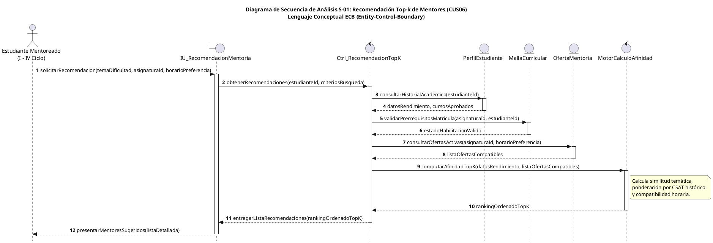
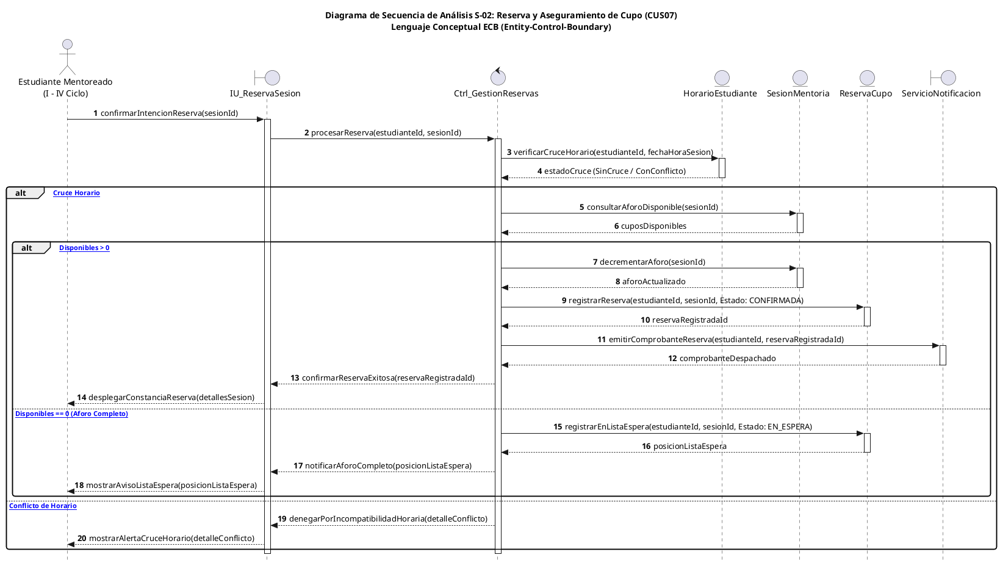
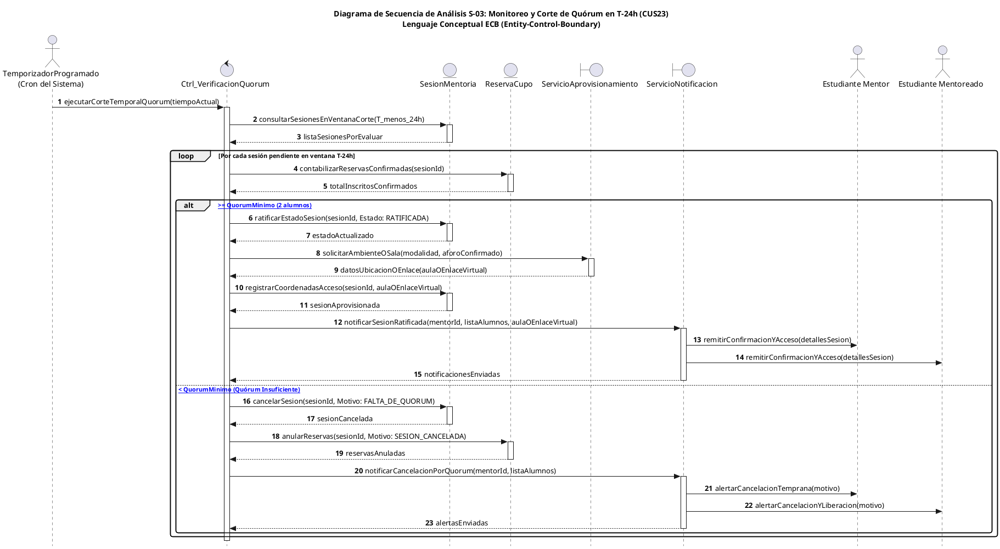
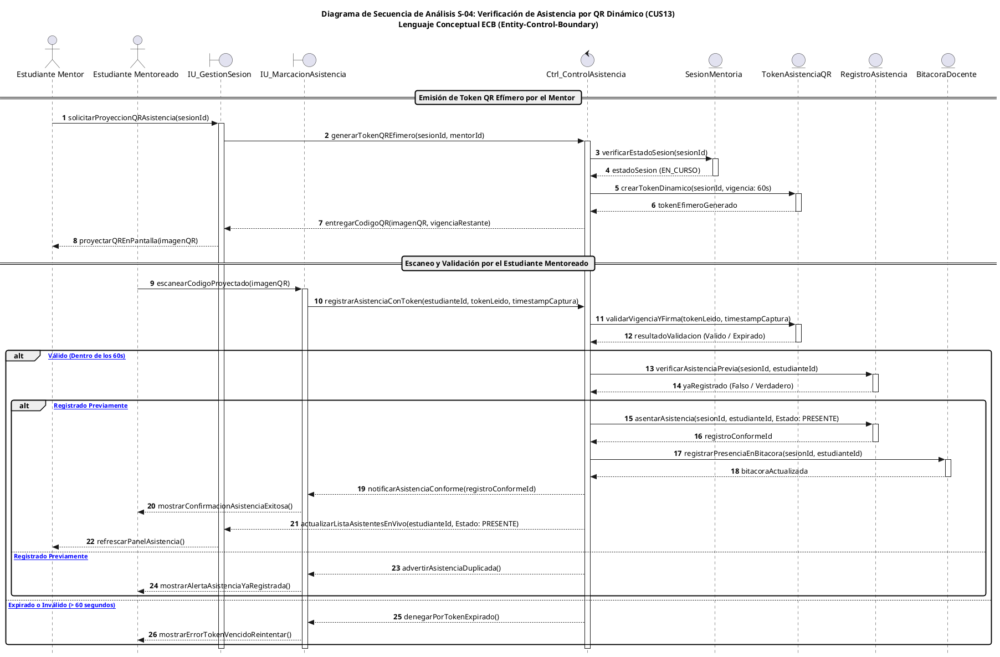

# Diagramas de Secuencia en Fase de Análisis (Ambiente de Pruebas)

**Proyecto:** Sistema Web P2P con Algoritmo de Recomendación para la Personalización de Mentorías Académicas en la EPIS-UPT  
**Fase Metodológica:** Análisis Orientado a Objetos (RUP / UWE)  
**Institución:** Universidad Privada de Tacna – Facultad de Ingeniería – Escuela Profesional de Ingeniería de Sistemas  
**Fecha:** Tacna – Perú, 2026  

---

## Control de Versiones

| Versión | Hecha por | Revisada por | Aprobada por | Fecha | Descripción del Cambio |
| :---: | :--- | :--- | :--- | :---: | :--- |
| **1.0** | Equipo de Desarrollo P2P | Comité de Calidad EPIS | Dirección de Escuela | 28/09/2026 | Creación del documento de pruebas para diagramas de secuencia en lenguaje de análisis (ECB) para los 4 casos de uso núcleo del sistema. |

---

## 1. Introducción y Marco de Análisis

El presente documento consolida la modelación dinámica de los cuatro casos de uso arquitectónicamente más significativos del **Sistema Web P2P de Mentorías**, estructurados rigurosamente bajo el **lenguaje de análisis** del Proceso Unificado (RUP) y la Ingeniería Web Basada en Modelos (UWE).

En esta etapa de análisis conceptual, los diagramas de secuencia prescinden de consideraciones tecnológicas particulares de bajo nivel (tales como sintaxis SQL, librerías ORM específicas o endpoints REST particulares), concentrándose en el **intercambio de mensajes semánticos** entre los estereotipos de análisis propuestos por Ivar Jacobson:
- **Actores (`actor`):** Entidades humanas o temporizadores externos que desencadenan o consumen los servicios del sistema.
- **Objetos Frontera (`boundary`):** Elementos mediadores que canalizan la interacción entre el entorno externo y el sistema interno.
- **Objetos de Control (`control`):** Componentes orquestadores que encapsulan las reglas de negocio, coordinan algoritmos y dirigen el flujo transaccional.
- **Objetos de Entidad (`entity`):** Representaciones conceptuales del dominio que encapsulan el estado y comportamiento de los datos del negocio.

### Cuadro 1.1: Matriz de Casos de Uso Críticos Modelados en Secuencia de Análisis

| Código CUS | Nombre del Caso de Uso | Actores Participantes | Objeto de Control Principal | Objeto Entidad Clave | Justificación Arquitectónica |
| :---: | :--- | :--- | :--- | :--- | :--- |
| **CUS06** | Búsqueda y Recomendación Inteligente Top-k de Mentores | Estudiante Mentoreado | `Ctrl_RecomendacionTopK` | `PerfilEstudiante`, `OfertaMentoria` | Núcleo de inteligencia algorítmica para el emparejamiento adaptativo estudiante-mentor. |
| **CUS07** | Reserva y Aseguramiento Transaccional de Cupo en Sesión | Estudiante Mentoreado | `Ctrl_GestionReservas` | `SesionMentoria`, `ReservaCupo` | Manejo de aforo, control de concurrencia y prevención de conflictos de horario. |
| **CUS23** | Monitoreo y Corte Automático de Quórum en $T-24\text{ h}$ | Temporizador Programado, Estudiante Mentor, Estudiante Mentoreado | `Ctrl_VerificacionQuorum` | `SesionMentoria`, `ReservaCupo` | Automatización de la viabilidad logística y aprovisionamiento perentorio de recursos. |
| **CUS13** | Marcación y Verificación de Asistencia por Código QR Dinámico | Estudiante Mentor, Estudiante Mentoreado | `Ctrl_ControlAsistencia` | `TokenAsistenciaQR`, `RegistroAsistencia` | Blindaje antifraude y fe pública en la constancia de presencia académica. |

Fuente: Elaboración propia.

---

## 2. Diagrama de Secuencia S-01: Búsqueda y Recomendación Inteligente Top-k de Mentores (`CUS06`)

### 2.1. Presentación Contextual del Caso de Uso CUS06
El caso de uso `CUS06` describe la secuencia interactiva mediante la cual un estudiante de ciclo temprano (I a IV ciclo) ingresa sus dificultades temáticas en una asignatura específica y solicita recomendaciones personalizadas. El sistema extrae el perfil académico del estudiante, valida que la asignatura no presente impedimentos de prerrequisitos, filtra las ofertas de mentoría activas y orquesta la ejecución del motor de afinidad para entregar un ordenamiento Top-k jerarquizado.

### Diagrama S-01: Diagrama de Secuencia de Análisis - Recomendación Inteligente Top-k de Mentores (CUS06)

Fuente: Elaboración propia.

### 2.2. Análisis del Flujo Dinámico y Ciclo de Vida
El diagrama S-01 formaliza cómo el objeto de control `Ctrl_RecomendacionTopK` asume la responsabilidad de coordinar las consultas a las entidades `PerfilEstudiante` y `MallaCurricular` antes de solicitar el conjunto de ofertas de mentoría. De este modo, se garantiza que el motor de afinidad opere únicamente sobre candidatos viables desde la perspectiva reglamentaria de la carrera, optimizando el procesamiento y entregando al mentoreado una nómina precalificada y ordenada por pertinencia pedagógica.

---

## 3. Diagrama de Secuencia S-02: Reserva y Aseguramiento Transaccional de Cupo en Sesión (`CUS07`)

### 3.1. Presentación Contextual del Caso de Uso CUS07
El caso de uso `CUS07` modela la secuencia de operaciones requeridas para que un estudiante asegure una vacante en una sesión grupal o individual ofertada por un mentor. El flujo contempla la verificación rigurosa de incompatibilidades horarias personales y la comprobación atómica del aforo disponible, derivando en la confirmación de la plaza o en la incorporación ordenada a una lista de espera.

### Diagrama S-02: Diagrama de Secuencia de Análisis - Reserva y Aseguramiento de Cupo (CUS07)

Fuente: Elaboración propia.

### 3.2. Análisis del Flujo Dinámico y Manejo de Alternativas
La lógica de control de `Ctrl_GestionReservas` implementa una doble barrera de integridad: primero salvaguarda la agenda académica del alumno interactuando con `HorarioEstudiante`, y posteriormente realiza la reserva atómica sobre `SesionMentoria`. Al discriminar entre cupo confirmado y lista de espera, el sistema garantiza un uso equitativo del límite máximo de 5 estudiantes por sesión presencial o virtual establecido en los requerimientos normativos.

---

## 4. Diagrama de Secuencia S-03: Monitoreo y Corte Automático de Quórum en $T-24\text{ h}$ (`CUS23`)

### 4.1. Presentación Contextual del Caso de Uso CUS23
El caso de uso `CUS23` describe la orquestación temporal que se activa de forma desatendida 24 horas antes del inicio programado de cualquier sesión de mentoría. Un temporizador del sistema invoca al controlador para auditar si se cumple el umbral mínimo reglamentario (2 estudiantes). En caso positivo, se ratifica la sesión y se gestiona el ambiente físico o virtual; en caso negativo, se cancela preventivamente liberando la disponibilidad de los participantes.

### Diagrama S-03: Diagrama de Secuencia de Análisis - Corte Automático de Quórum en T-24h (CUS23)

Fuente: Elaboración propia.

### 4.2. Análisis del Flujo Dinámico y Resiliencia Operativa
El diagrama S-03 ilustra el carácter proactivo de la plataforma. Al delegar la evaluación en un temporizador de sistema y en el controlador `Ctrl_VerificacionQuorum`, se elimina la necesidad de arbitraje manual por parte del mentor o los alumnos. Asimismo, la integración conceptual con `ServicioAprovisionamiento` garantiza que ningún recurso físico (aulas de laboratorio) o virtual (enlaces de Google Meet) sea reservado en vano para sesiones desiertas.

---

## 5. Diagrama de Secuencia S-04: Marcación y Verificación de Asistencia por Código QR Dinámico (`CUS13`)

### 5.1. Presentación Contextual del Caso de Uso CUS13
El caso de uso `CUS13` modela el procedimiento mediante el cual se certifica la presencia física o sincrónica de los estudiantes en la mentoría. A fin de evitar el plagio o la divulgación no autorizada de credenciales, el mentor solicita a través de su interfaz la emisión de códigos QR efímeros cuya vigencia se encuentra estrictamente acotada a una ventana de tiempo (60 segundos). La captura oportuna por parte del mentoreado valida el token, asienta la asistencia de forma fehaciente y alimenta la bitácora de control docente.

### Diagrama S-04: Diagrama de Secuencia de Análisis - Verificación de Asistencia por Código QR Dinámico (CUS13)

Fuente: Elaboración propia.

### 5.2. Análisis del Flujo Dinámico y Mitigación de Fraude
La interacción entre `TokenAsistenciaQR` y `Ctrl_ControlAsistencia` materializa el principio de no repudio y presencia física efectiva. Al restringir la validez a un token con ciclo de vida corto ($60\text{ s}$), se previene que una captura de pantalla sea reenviada a estudiantes ausentes. La sincronización simultánea con `IU_Mentor` otorga al mentor visibilidad inmediata sobre los alumnos incorporados a la sesión antes del cierre formal en `BitacoraDocente`.

---

## 6. Conclusiones Metodológicas y Trazabilidad

1. **Separación de Responsabilidades:** Los cuatro diagramas evidencian que ninguna interfaz interactúa directamente con objetos de entidad; todas las decisiones operativas, cálculos de umbrales y validaciones temporales quedan resguardadas dentro de los objetos de control (`Ctrl_*`).
2. **Robustez ante Situaciones Excepcionales:** Cada diagrama modela explícitamente los fragmentos combinados `alt` / `else` para tratar condiciones de carrera (aforo completo), incompatibilidades de agenda (cruces de horarios), deserciones tempranas (falta de quórum) y ventanas temporales de expiración (tokens QR obsoletos).
3. **Alineación con el SAD:** Los objetos de control modelados se corresponden unívocamente con los componentes identificados en la Vista Lógica preliminar y en el Diagrama Contextual de la arquitectura del sistema.
