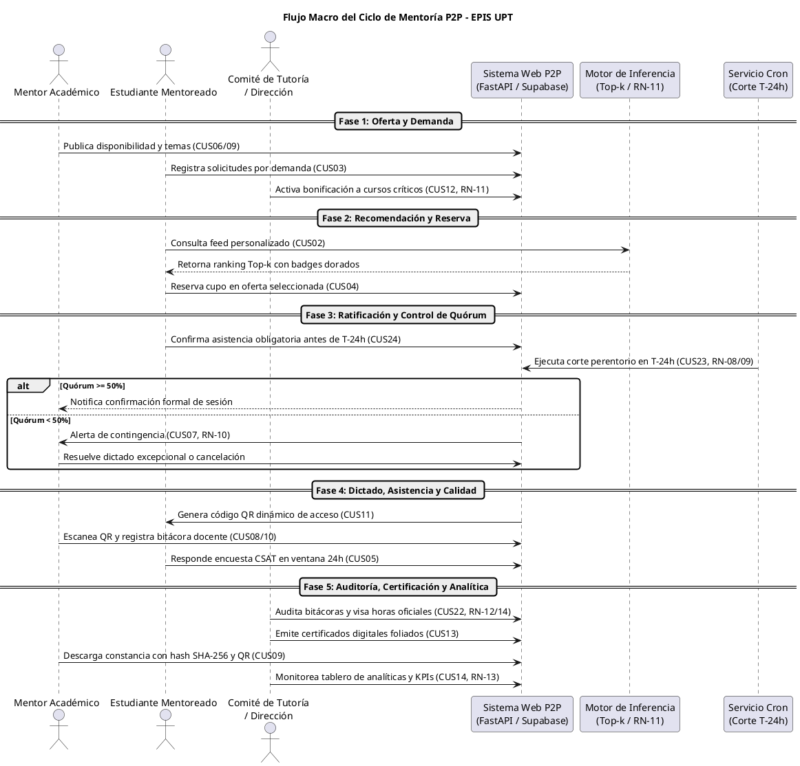
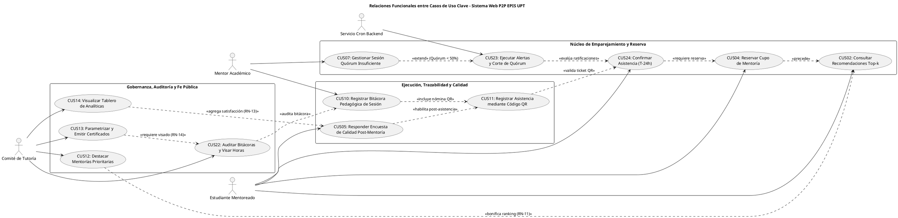
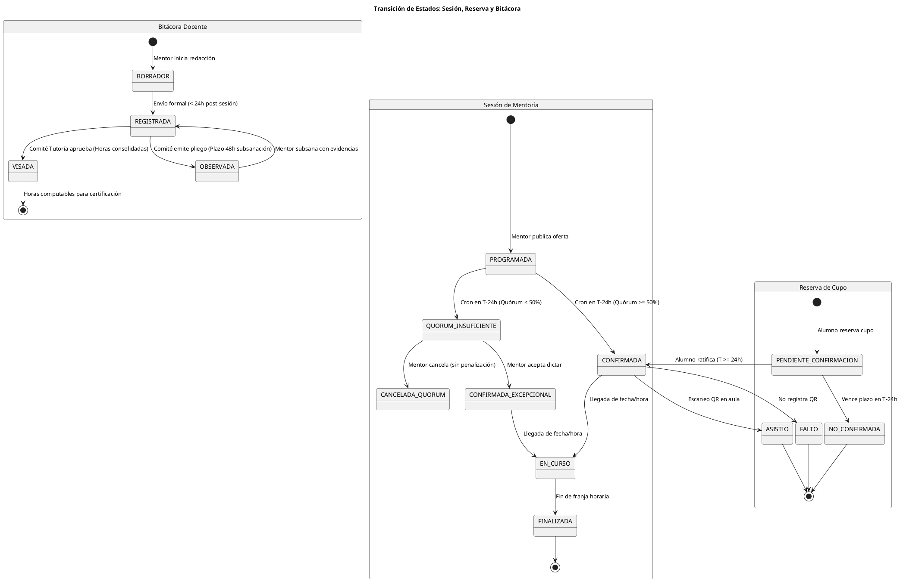

# Resumen Ejecutivo: Funcionamiento del Sistema y Casos de Uso Críticos

**Proyecto:** Sistema Web P2P con algoritmo de recomendación para la personalización de mentorías académicas  
**Institución:** Universidad Privada de Tacna – Escuela Profesional de Ingeniería de Sistemas (EPIS-UPT)  
**Documento:** Resumen Operativo y Matriz de Relaciones de Casos de Uso  
**Fecha:** Septiembre 2026  

---

## 1. Visión General del Sistema

El **Sistema Web P2P** es una plataforma institucional orientada a mitigar la reprobación y deserción estudiantil en asignaturas críticas (*Cálculo, Algoritmos, Estructuras de Datos, Programación Orientada a Objetos*) de la EPIS-UPT. Conecta a estudiantes de ciclos formativos (*Mentoreados*, ciclos I–IV) con estudiantes destacados de ciclos superiores (*Mentores*, ciclos VII–X) mediante un motor algorítmico híbrido de recomendación (*Top-k*).

El sistema opera bajo un flujo continuo gobernado por eventos y cortes perentorios que aseguran la eficiencia logística, el aprovechamiento de recursos (aulas físicas y salas Meet), la trazabilidad pedagógica (firmas QR y bitácoras) y la fe pública institucional en la emisión de certificados de horas académicas con valor legal.

---

## 2. Diagrama Macro del Flujo de Operación

A continuación, se ilustra la interacción integral de los tres actores humanos principales y los componentes autónomos del sistema a lo largo del ciclo formativo:

---

## 3. Matriz de Casos de Uso Críticos y Relaciones Relevantes

El catálogo canónico se estructura en torno a los casos de uso neurálgicos que sostienen las reglas de negocio y los requisitos de acreditación:

| Código | Caso de Uso | Módulo | Rol en el Flujo | Relaciones Clave | Reglas Vinculadas |
|:---:|:---|:---:|:---|:---|:---:|
| **CUS01** | Iniciar sesión institucional con 2FA | MOD-01 | Puerta de entrada segura | Precondición de todos los CUS; valida consentimiento | Ley N° 29733, RN-01 |
| **CUS06/09** | Publicar oferta de mentoría | MOD-03 | Generación de oferta lectiva | Habilita `CUS04`; consume catálogo curricular `CUS21` | RN-02, RN-03 |
| **CUS03** | Registrar solicitud temática por demanda | MOD-02 | Captura de necesidad no cubierta | Alimenta mapa de calor de `CUS14` y feed de `CUS02` | RN-04 |
| **CUS12** | Destacar mentorías prioritarias | MOD-08 | Intervención directiva curricular | Invalida caché Redis; bonifica ranking de `CUS02` | RF24, RN-11 ($\alpha \in [1.05, 1.50]$) |
| **CUS02** | Consultar recomendaciones Top-k | MOD-02 | Emparejamiento algorítmico | Consume ofertas de `CUS06` y ponderaciones de `CUS12` | RF03, RN-06 |
| **CUS04** | Reservar cupo de mentoría | MOD-04 | Bloqueo provisional de plaza | Detona plazo de ratificación hacia `CUS24` | RN-05 (Aforo y elegibilidad) |
| **CUS24** | Confirmar asistencia a mentoría | MOD-04 | Ratificación formal obligatoria | Impide anulación por corte en `CUS23` | RN-08 ($T \ge 24\text{ h}$) |
| **CUS23** | Ejecutar alertas y corte de quórum | MOD-04 | Gobernanza automatizada (Cron) | Anula omisos de `CUS24`; dispara `CUS07` si quórum < 50% | RN-08, RN-09 (Ratio 50%) |
| **CUS07** | Gestionar sesión ante quórum bajo | MOD-04 | Resolución de contingencia | Sucede a `CUS23`; permite dictado excepcional | RN-10 (Sin penalización) |
| **CUS11** | Registrar asistencia por código QR | MOD-05 | Verificación fehaciente en aula | Precondición para habilitar `CUS05` e insumo de `CUS22` | RNF04 (Tokens efímeros 60s) |
| **CUS10/08**| Registrar bitácora pedagógica | MOD-05 | Rendición formativa del mentor | Condiciona acumulación provisional; insumo de `CUS22`| RN-12 (Plazo 24h) |
| **CUS05** | Responder encuesta de calidad | MOD-06 | Evaluación y retroalimentación | Alimenta reputación de `CUS16` y métricas de `CUS14` | RN-07, RN-13 (Anonimato) |
| **CUS16** | Consultar reputación e insignias | MOD-06 | Gamificación y reconocimiento | Calculado por `CUS05` y `CUS10`; bonifica en `CUS02` | RN-06 |
| **CUS22** | Auditar bitácoras y visar horas | MOD-08 | Fiscalización del Comité Tutoría | Promueve horas de provisional a oficial; habilita `CUS13` | RN-12, RN-14 (Visado previo) |
| **CUS13** | Parametrizar y emitir certificados | MOD-07 | Emisión foliada de constancias | Exige bitácoras visadas en `CUS22`; genera hash SHA-256 | RN-14 |
| **CUS09** | Descargar y verificar certificado | MOD-07 | Fe pública y custodia digital | Descarga privada por mentor; validación pública vía QR | RNF09 (Criptografía SHA-256) |
| **CUS14** | Visualizar analíticas institucionales | MOD-08 | Inteligencia académica gerencial | Agrega datos de todos los CUS; exporta CSV disociado | RF25, RN-13 (Ley N° 29733) |

---

## 4. Diagrama de Relaciones entre Casos de Uso Neurálgicos

El siguiente diagrama formaliza las relaciones de dependencia (`<<include>>`), extensión ante excepciones (`<<extend>>`) y precedencia funcional entre los módulos centrales:

---

## 5. Máquina de Estados del Ciclo de Vida de la Mentoría

El control transaccional de la plataforma garantiza la integridad de los datos a través de tres máquinas de estado acopladas:

---

## 6. Síntesis de Reglas de Negocio Clave

1. **RN-05 (Aforo Máximo y Elegibilidad):** Cupo limitado por aula física (máximo 15) o sala virtual (máximo 25). Requiere pertenencia a la facultad.
2. **RN-08 (Ventana Perentoria de Ratificación en $T-24\text{ h}$):** Todo alumno debe ratificar su asistencia antes de las 24 horas del inicio; las no confirmadas se revocan automáticamente liberando recursos.
3. **RN-09 (Corte Automático de Quórum al 50%):** Si las reservas ratificadas son menores al 50% del aforo en $T-24\text{ h}$, la sesión pasa a quórum insuficiente.
4. **RN-10 (Dictado Excepcional sin Penalización):** Ante quórum bajo, el mentor decide dictar excepcionalmente o cancelar solidariamente sin perjuicio en su reputación.
5. **RN-11 (Bonificación de Materias Críticas):** Materias filtro marcadas con prioridad institucional reciben factor $\alpha \in [1.05, 1.50]$ en el cálculo del ranking *Top-k*.
6. **RN-12 (Plazo de Bitácora y Acreditación Provisional):** El mentor dispone de 24 horas para registrar bitácora; las horas permanecen en estado provisional hasta su auditoría.
7. **RN-13 (Anonimización de Evaluaciones):** Encuestas y datasets científicos disocian datos personales mediante SHA-256 (Ley N° 29733).
8. **RN-14 (Auditoría Previa para Certificación):** Solo las bitácoras en estado `VISADA` computan horas válidas para constancias oficiales y créditos formativos.
